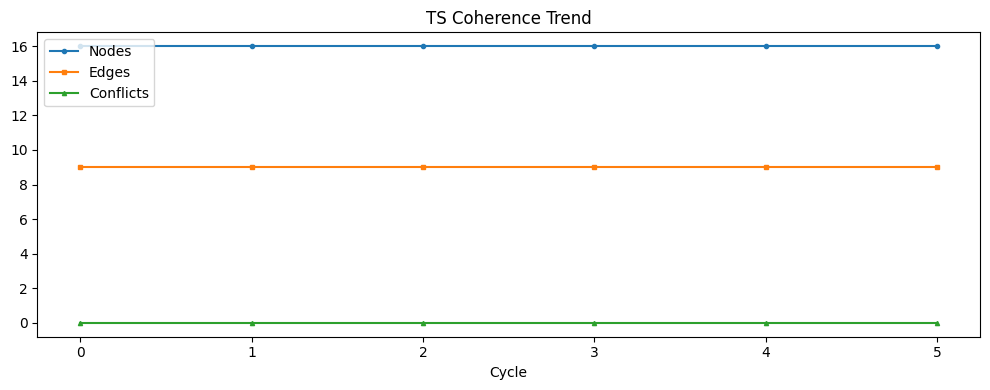

# TS Coherence Dashboard

> Auto-refreshes when Dataview re-evaluates (click note or use Dataview's refresh).

---

## Current Metrics (Latest Cycle)

```dataviewjs
const path = "metrics/coherence_log.jsonl";
let data = [];
try {
  const content = await dv.io.load(path);
  if (content) {
    const lines = content.trim().split("\n").filter(l => l);
    data = lines.map(l => { try { return JSON.parse(l); } catch { return null; } }).filter(Boolean);
  }
} catch (e) { dv.paragraph("_No metrics yet. Run `python src/main.py --self-improve` or ingest._"); }

if (data.length > 0) {
  const latest = data[data.length - 1];
  dv.table(
    ["Metric", "Value"],
    [
      ["Nodes", latest.nodes],
      ["Edges", latest.edges],
      ["Avg. Node Degree", latest.avg_degree],
      ["Contradictions", latest.conflicts],
      ["Last Updated", latest.ts],
    ]
  );
}
```

---

## Coherence Trend Over Time

```dataviewjs
const path = "metrics/coherence_log.jsonl";
let data = [];
try {
  const content = await dv.io.load(path);
  if (content) {
    const lines = content.trim().split("\n").filter(l => l);
    data = lines.map(l => { try { return JSON.parse(l); } catch { return null; } }).filter(Boolean);
  }
} catch (e) { }

if (data.length >= 1) {
  dv.table(
    ["Cycle", "Nodes", "Edges", "Contradictions", "Avg Degree"],
    data.map((r, i) => [i + 1, r.nodes, r.edges, r.conflicts, r.avg_degree])
  );
}
```

---

## Coherence Trend Chart



*Generated from `metrics/coherence_log.jsonl`. Updates after each self-improve cycle.*

---

## Top 10 Most-Linked Concepts

See [[metrics/top_concepts]].

---

## Orphan Concepts (degree < 2)

See [[metrics/orphans]].

---

## Recent Changes (Last 5 Commits Affecting Vault)

See [[metrics/recent_commits]].

---

## Graph Overview (from Vault Links)

```dataview
TABLE length(rows) as Links
FROM "Concepts"
FLATTEN file.outlinks as outlink
GROUP BY outlink
SORT length(rows) DESC
LIMIT 10
```

---

## Recent Concepts

```dataview
TABLE file.mtime as Modified
FROM "Concepts"
SORT file.mtime DESC
LIMIT 20
```

---

## Orphan Concepts (no outgoing links in vault)

```dataview
LIST
FROM "Concepts"
WHERE length(file.outlinks) = 0
```
