# TS Graph Snapshots

Auto-generated after vault-modifying operations.

- **2026-03-16 22:36 UTC** — self-improve: 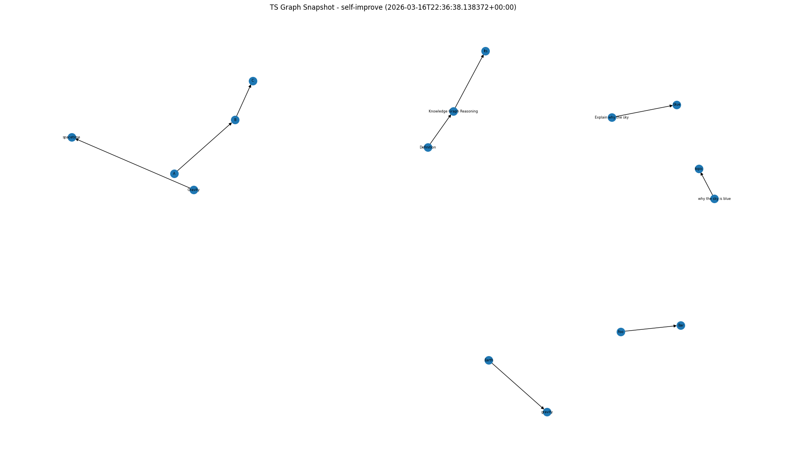

- **2026-03-16 22:37 UTC** — self-improve: 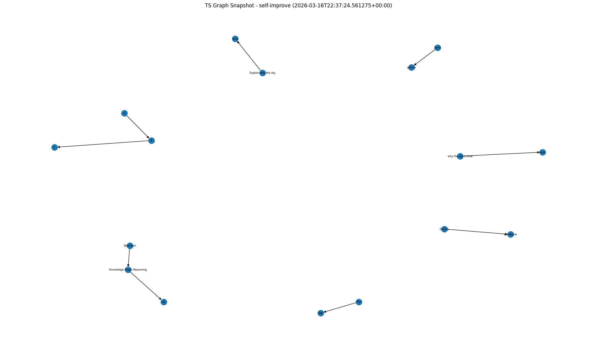

- **2026-03-16 22:43 UTC** — self-improve: 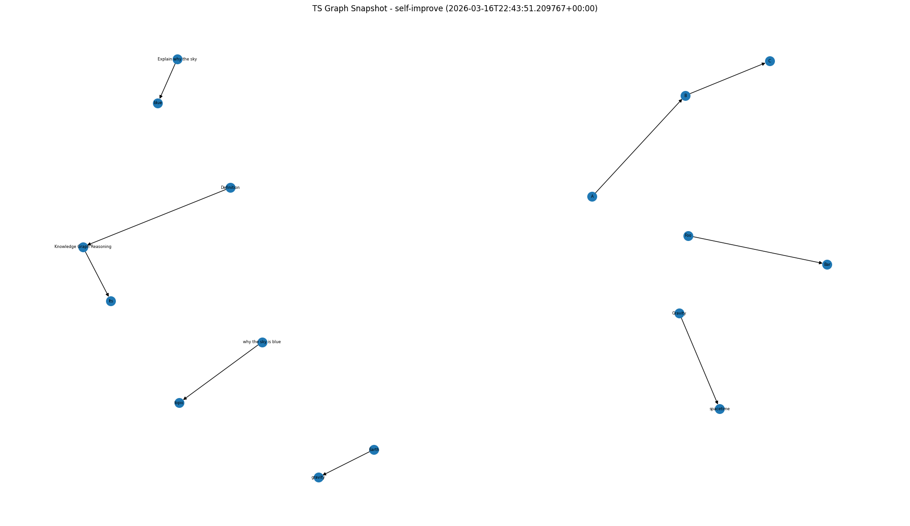

- **2026-03-16 22:45 UTC** — self-improve: 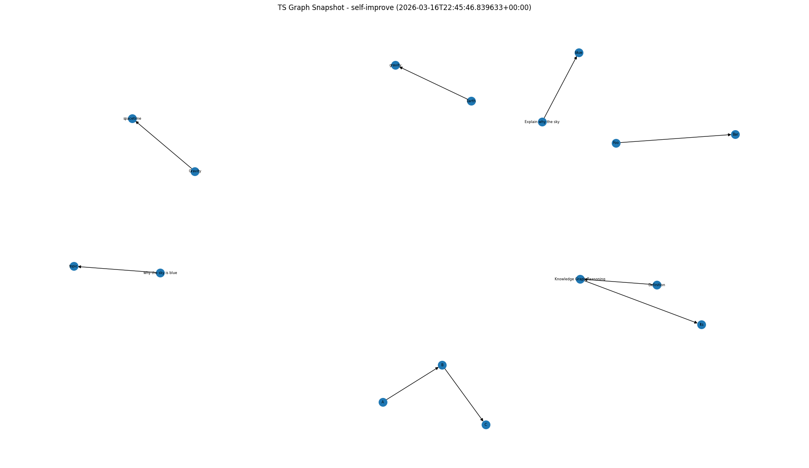

- **2026-03-16 22:45 UTC** — self-improve: 

### 2026-03-16 22:47 UTC

**After:** test overlay — nodes +0, edges +0, coherence +0%

[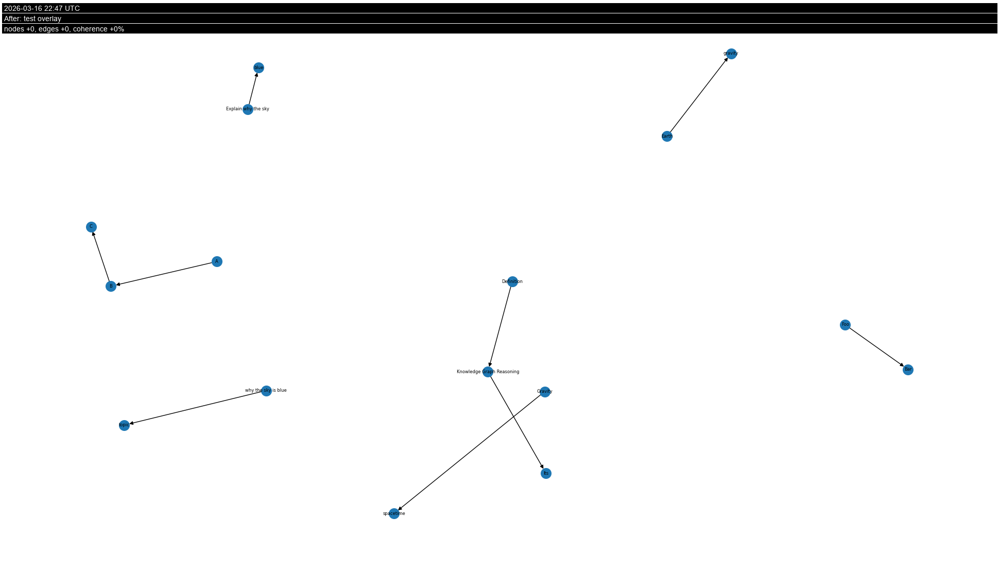](graph-2026-03-16-22-47-test.png)

### 2026-03-16 23:08 UTC

**After:** README.md+obsidian+src+tests — nodes +0, edges +0, coherence +0%

[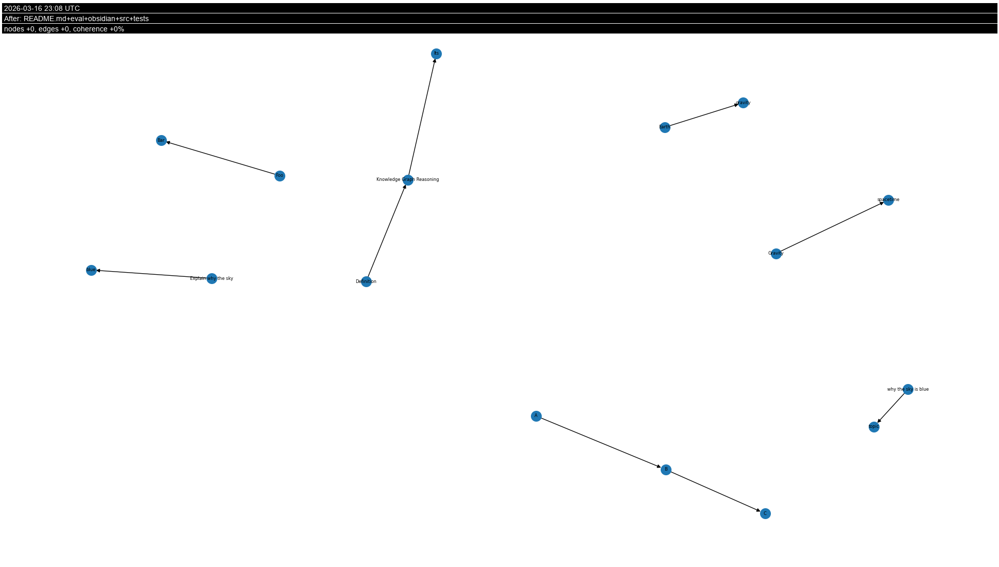](graph-2026-03-16-23-08-self-improve.png) [commit](https://github.com/BoggersTheFish/BoggersTheCIG/commit/d39e45d)

### 2026-03-16 23:08 UTC

**After:** README.md+eval+obsidian+src+tests — nodes +0, edges +0, coherence +0%

 [commit](https://github.com/BoggersTheFish/BoggersTheCIG/commit/d39e45d)

### 2026-03-16 23:10 UTC

**After:** external ingest (+4 triples) — nodes -9, edges -4, coherence +217%

[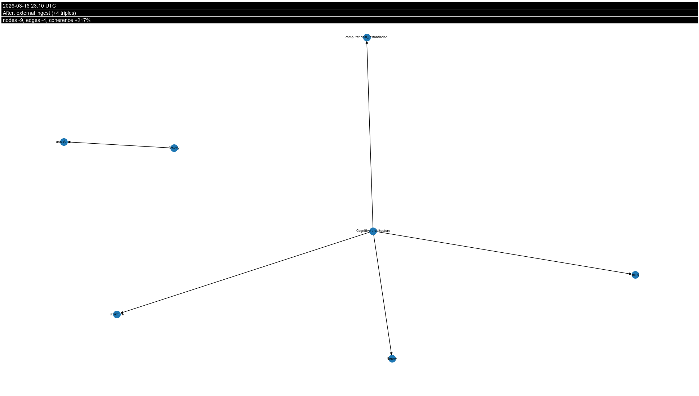](graph-2026-03-16-23-10-after-ingest.png) [commit](https://github.com/BoggersTheFish/BoggersTheCIG/commit/d39e45d)

### 2026-03-16 23:11 UTC

**After:** vault analysis (+9 triples) — nodes +15, edges +9, coherence -74%

[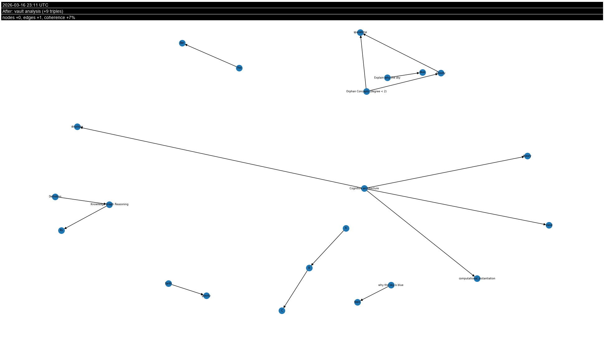](graph-2026-03-16-23-11-after-analyze-vault.png) [commit](https://github.com/BoggersTheFish/BoggersTheCIG/commit/d39e45d)

### 2026-03-16 23:11 UTC

**After:** vault analysis (+9 triples) — nodes +0, edges +1, coherence +7%

 [commit](https://github.com/BoggersTheFish/BoggersTheCIG/commit/d39e45d)

### 2026-03-16 23:12 UTC

**After:** 2_.md"+README.md+Reasoning.md"+architecture.md"+eval — nodes +0, edges +0, coherence +0%

[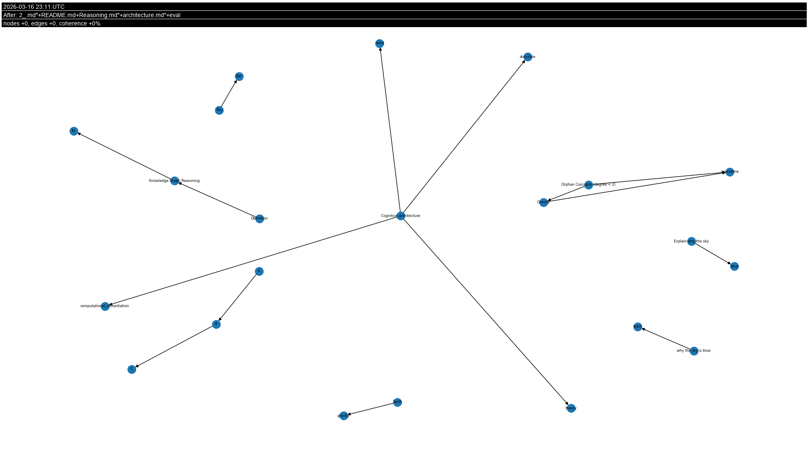](graph-2026-03-16-23-11-self-improve.png) [commit](https://github.com/BoggersTheFish/BoggersTheCIG/commit/d39e45d)

### 2026-03-16 23:12 UTC

**After:** 2_.md"+README.md+Reasoning.md"+architecture.md"+eval — nodes +0, edges +0, coherence +0%

[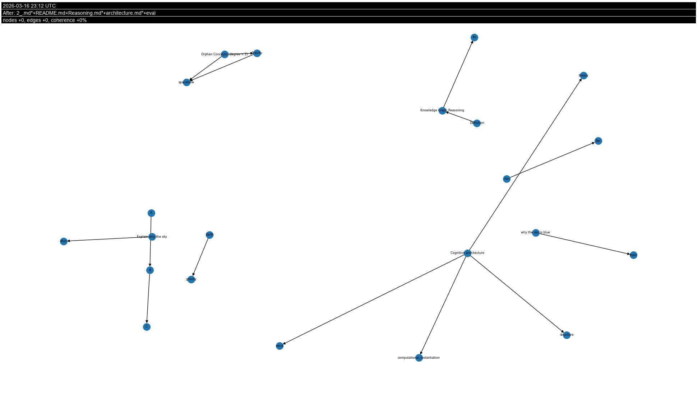](graph-2026-03-16-23-12-self-improve.png) [commit](https://github.com/BoggersTheFish/BoggersTheCIG/commit/d39e45d)

### 2026-03-16 23:16 UTC

**After:** 2_.md"+README.md+Reasoning.md"+architecture.md"+eval — nodes +0, edges +0, coherence +0%

[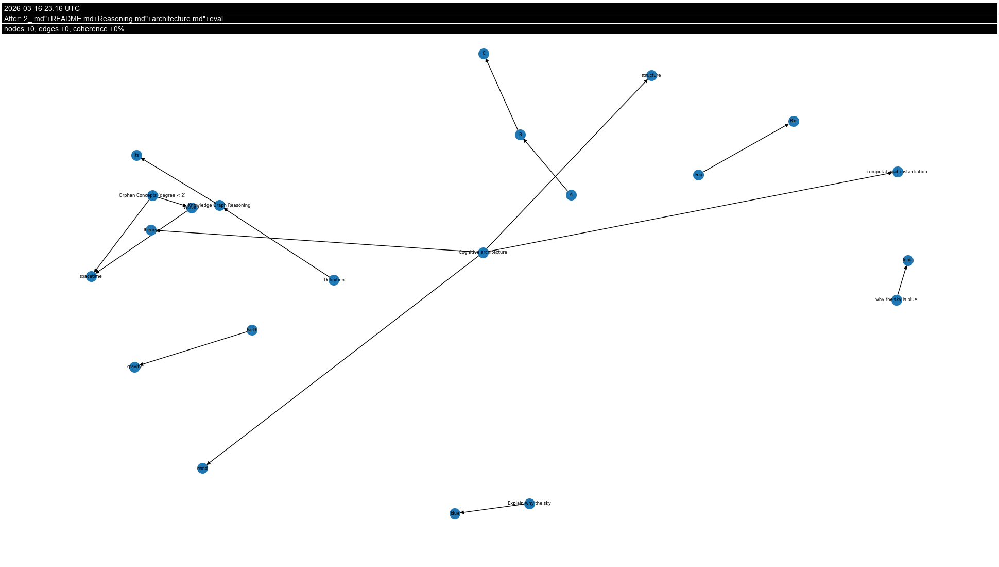](graph-2026-03-16-23-16-self-improve.png) [commit](https://github.com/BoggersTheFish/BoggersTheCIG/commit/d39e45d)

### 2026-03-16 23:16 UTC

**After:** 2_.md"+README.md+Reasoning.md"+architecture.md"+eval — nodes +0, edges +0, coherence +0%

 [commit](https://github.com/BoggersTheFish/BoggersTheCIG/commit/d39e45d)

### 2026-03-16 23:18 UTC

**After:** 2_.md"+README.md+Reasoning.md"+architecture.md"+eval — nodes +0, edges +0, coherence +0%

[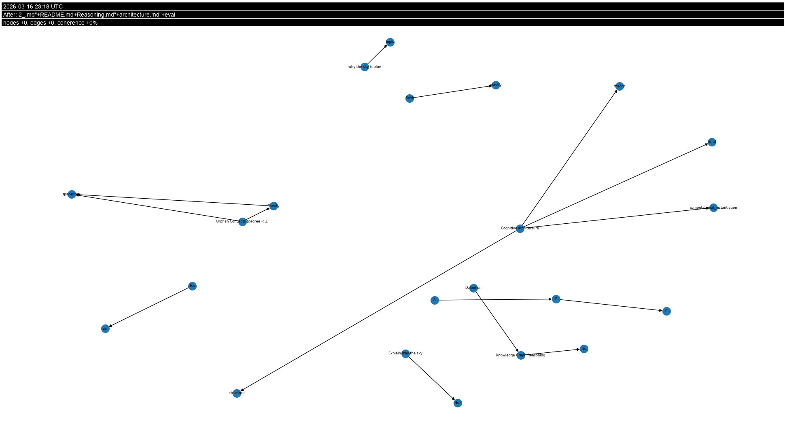](graph-2026-03-16-23-18-self-improve.png) [commit](https://github.com/BoggersTheFish/BoggersTheCIG/commit/d39e45d)

### 2026-03-16 23:18 UTC

**After:** 2_.md"+README.md+Reasoning.md"+architecture.md"+eval — nodes +0, edges +0, coherence +0%

 [commit](https://github.com/BoggersTheFish/BoggersTheCIG/commit/d39e45d)

### 2026-03-16 23:22 UTC

**After:** vault analysis (+15 triples) — nodes +0, edges +1, coherence +6%

[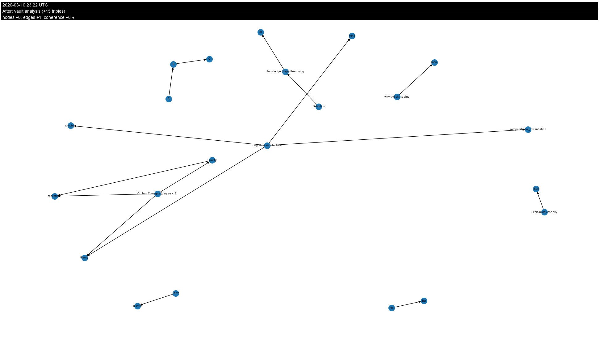](graph-2026-03-16-23-22-after-analyze-vault.png) [commit](https://github.com/BoggersTheFish/BoggersTheCIG/commit/d39e45d)

### 2026-03-16 23:22 UTC

**After:** 1 extracts, 0 merges — nodes +0, edges +0, coherence +0%

[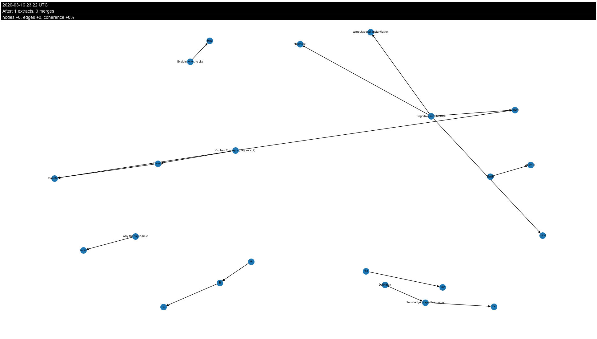](graph-2026-03-16-23-22-extract-subideas.png) [commit](https://github.com/BoggersTheFish/BoggersTheCIG/commit/d39e45d)

### 2026-03-16 23:23 UTC

**After:** vault analysis (+15 triples) — nodes +1, edges +3, coherence +8%

[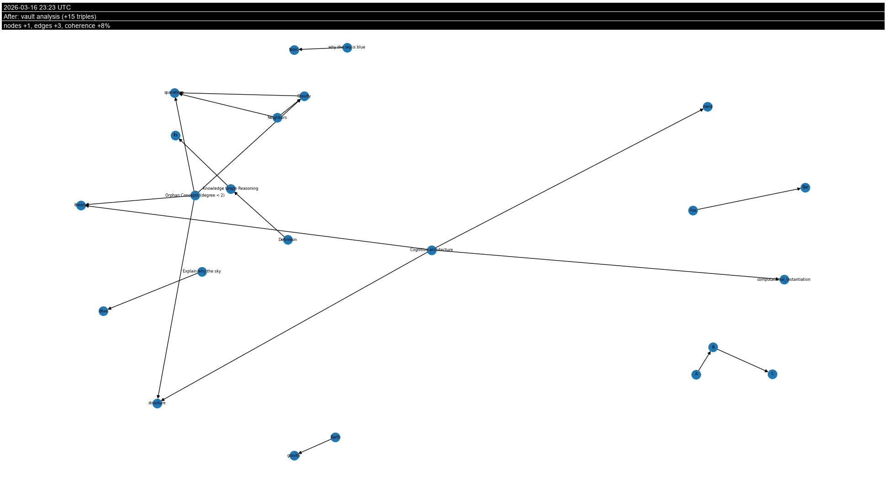](graph-2026-03-16-23-23-after-analyze-vault.png) [commit](https://github.com/BoggersTheFish/BoggersTheCIG/commit/d39e45d)

### 2026-03-16 23:23 UTC

**After:** 1 extracts, 0 merges — nodes +0, edges +0, coherence +0%

[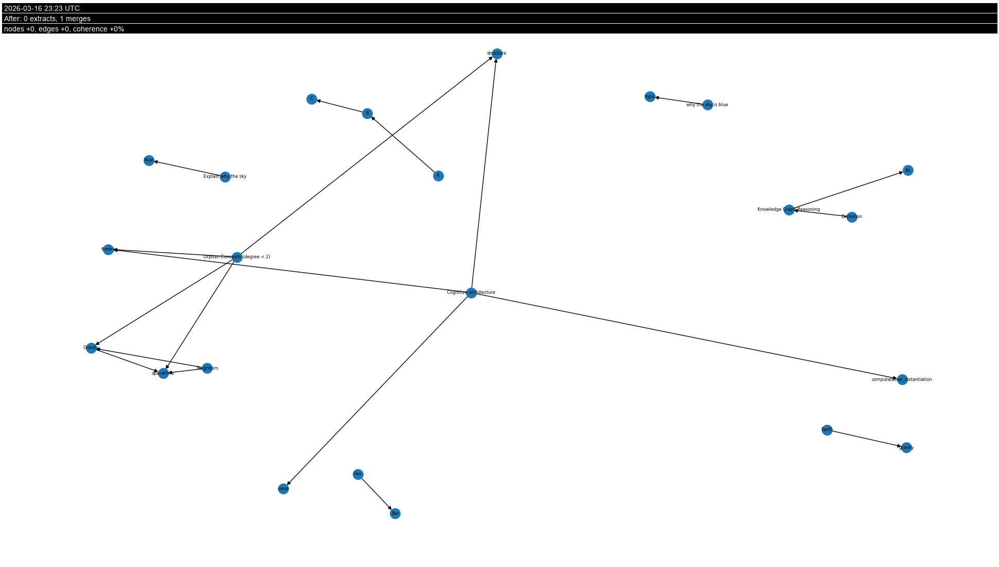](graph-2026-03-16-23-23-extract-subideas.png) [commit](https://github.com/BoggersTheFish/BoggersTheCIG/commit/d39e45d)

### 2026-03-16 23:23 UTC

**After:** 0 extracts, 1 merges — nodes +0, edges +0, coherence +0%

 [commit](https://github.com/BoggersTheFish/BoggersTheCIG/commit/d39e45d)

### 2026-03-16 23:27 UTC

**After:** 0 extracts, 1 merges — nodes +0, edges +0, coherence +0%

[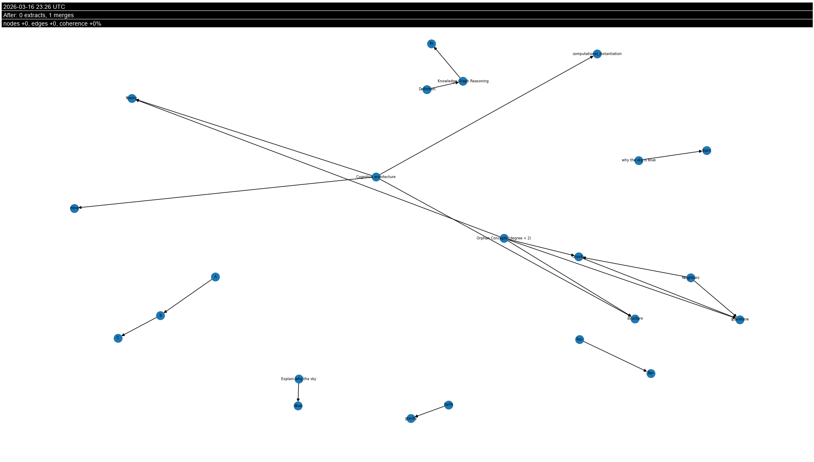](graph-2026-03-16-23-26-extract-subideas.png) [commit](https://github.com/BoggersTheFish/BoggersTheCIG/commit/d39e45d)

### 2026-03-16 23:27 UTC

**After:** .github+2_+2_.md"+README.md+Reasoning.md" — nodes +0, edges +0, coherence +0%

[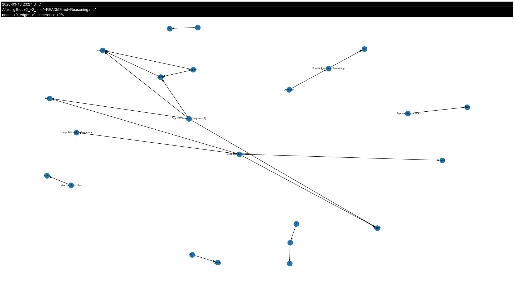](graph-2026-03-16-23-27-self-improve.png) [commit](https://github.com/BoggersTheFish/BoggersTheCIG/commit/d39e45d)

### 2026-03-16 23:27 UTC

**After:** 0 extracts, 1 merges — nodes +0, edges +0, coherence +0%

[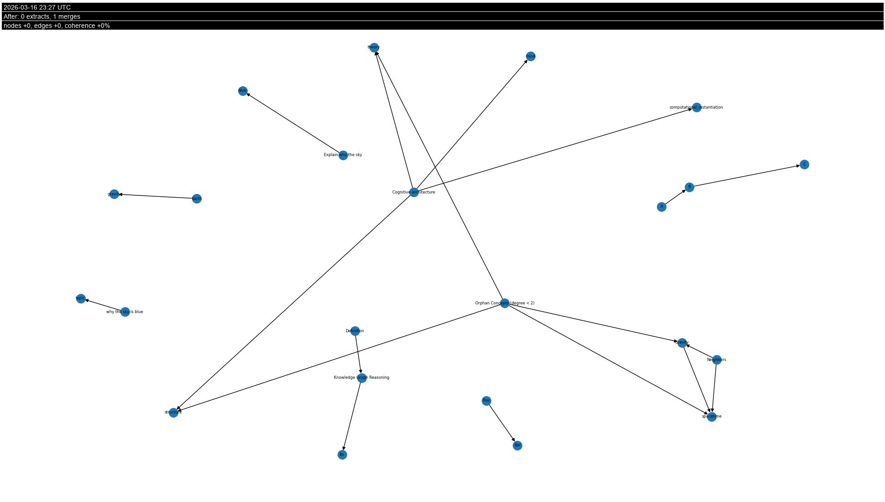](graph-2026-03-16-23-27-extract-subideas.png) [commit](https://github.com/BoggersTheFish/BoggersTheCIG/commit/d39e45d)

### 2026-03-16 23:27 UTC

**After:** .github+2_+2_.md"+README.md+Reasoning.md" — nodes +0, edges +0, coherence +0%

 [commit](https://github.com/BoggersTheFish/BoggersTheCIG/commit/d39e45d)

### 2026-03-16 23:48 UTC

**After:** external ingest (+8 triples) — nodes -11, edges -10, coherence +81%

[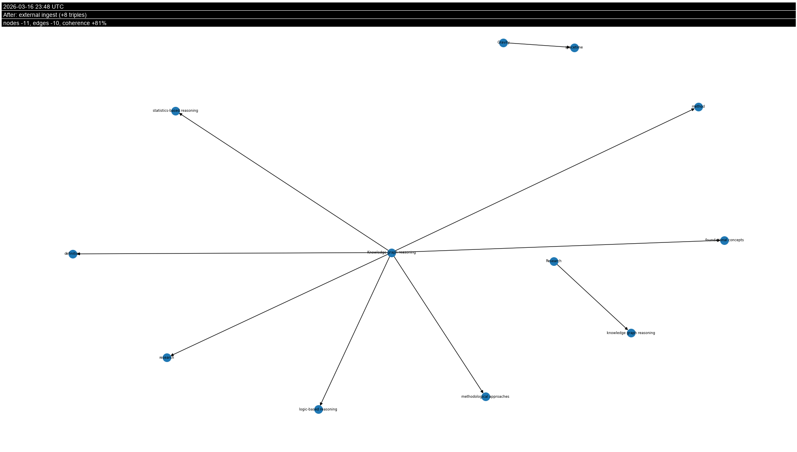](graph-2026-03-16-23-48-after-ingest.png) [commit](https://github.com/BoggersTheFish/BoggersTheCIG/commit/c65da58)

### 2026-03-16 23:49 UTC

**After:** vault analysis (+17 triples) — nodes +24, edges +17, coherence -69%

[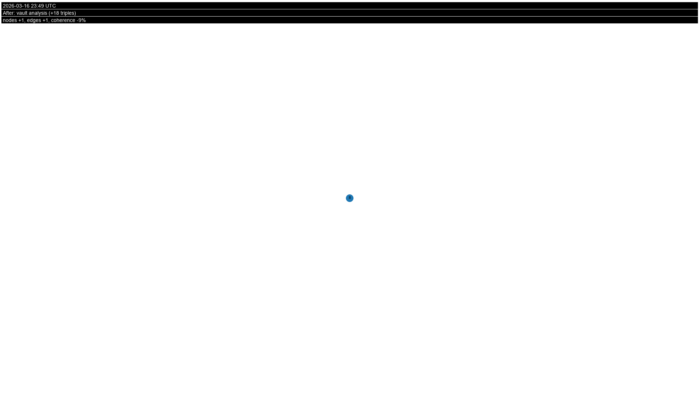](graph-2026-03-16-23-49-after-analyze-vault.png) [commit](https://github.com/BoggersTheFish/BoggersTheCIG/commit/c65da58)

### 2026-03-16 23:49 UTC

**After:** 1 extracts, 0 merges — nodes -32, edges -24, coherence +707%

[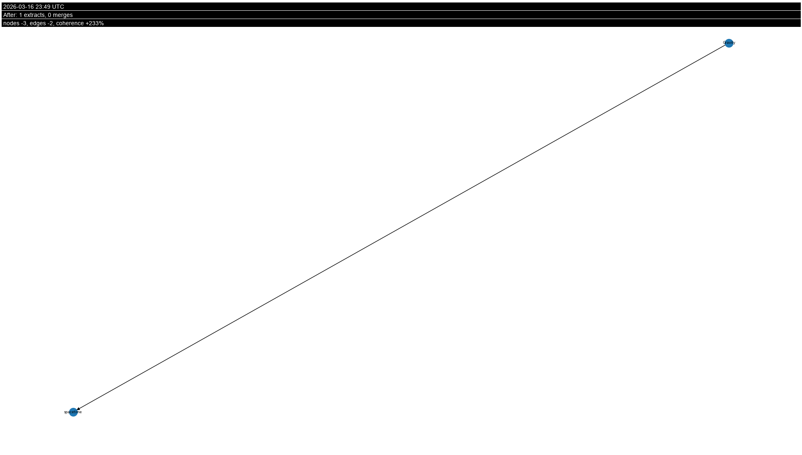](graph-2026-03-16-23-49-extract-subideas.png) [commit](https://github.com/BoggersTheFish/BoggersTheCIG/commit/c65da58)

### 2026-03-16 23:49 UTC

**After:** vault analysis (+18 triples) — nodes +1, edges +1, coherence -9%

 [commit](https://github.com/BoggersTheFish/BoggersTheCIG/commit/c65da58)

### 2026-03-16 23:49 UTC

**After:** 1 extracts, 0 merges — nodes -3, edges -2, coherence +233%

 [commit](https://github.com/BoggersTheFish/BoggersTheCIG/commit/c65da58)

### 2026-03-16 23:50 UTC

**After:** 1 extracts, 0 merges — nodes +0, edges +0, coherence +0%

[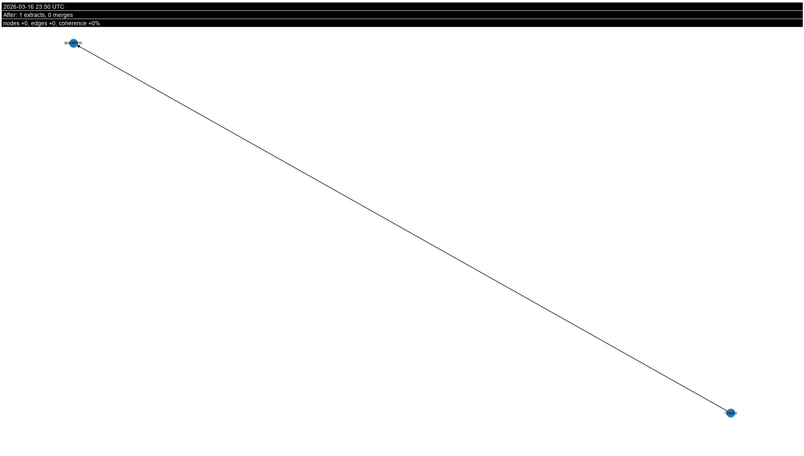](graph-2026-03-16-23-50-extract-subideas.png) [commit](https://github.com/BoggersTheFish/BoggersTheCIG/commit/0b473f2)

### 2026-03-16 23:50 UTC

**After:** obsidian — nodes +0, edges +0, coherence +0%

[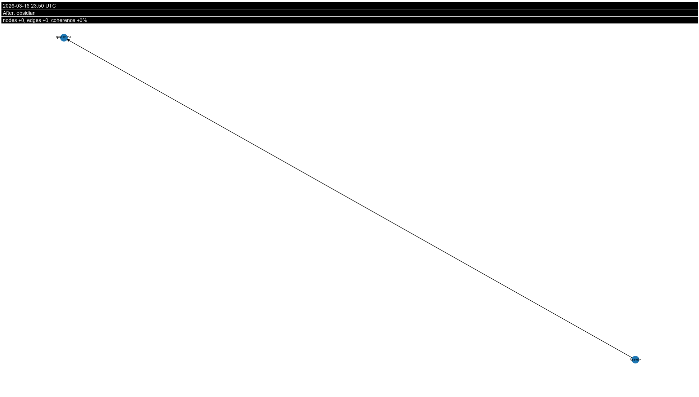](graph-2026-03-16-23-50-self-improve.png) [commit](https://github.com/BoggersTheFish/BoggersTheCIG/commit/0b473f2)

### 2026-03-16 23:51 UTC

**After:** eval+obsidian — nodes +0, edges +0, coherence +0%

[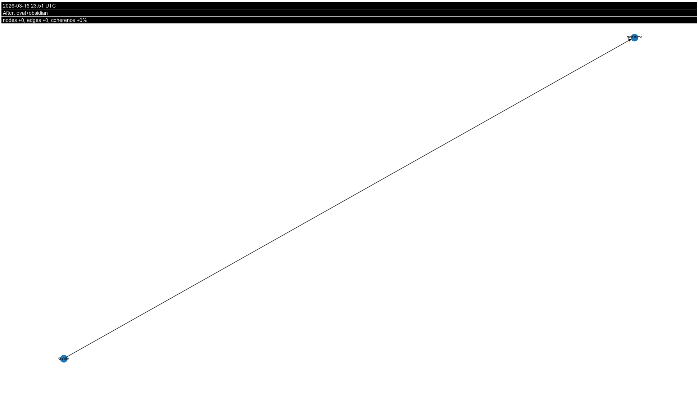](graph-2026-03-16-23-51-self-improve.png) [commit](https://github.com/BoggersTheFish/BoggersTheCIG/commit/0b473f2)

### 2026-03-17 01:21 UTC

**After:** external ingest (+1 triples) — nodes +4, edges +2, coherence +333233%

[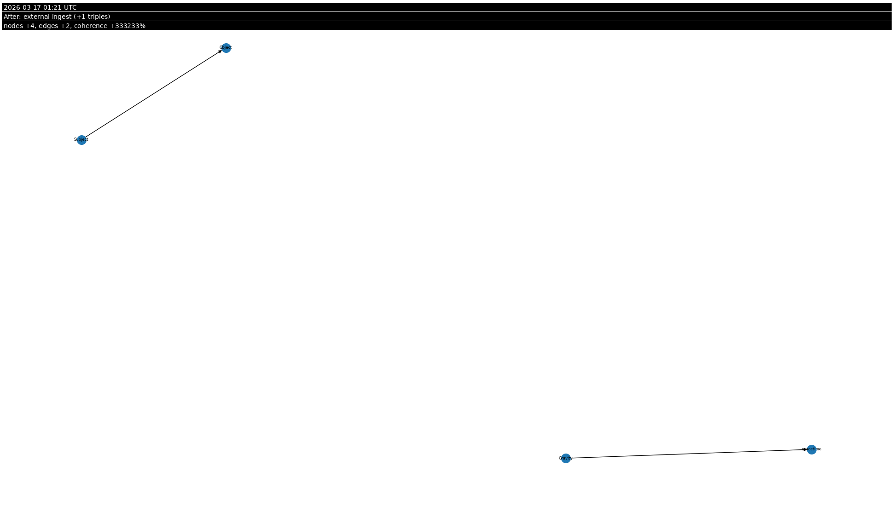](graph-2026-03-17-01-21-after-ingest.png) [commit](https://github.com/BoggersTheFish/BoggersTheCIG/commit/c260423)

### 2026-03-17 01:21 UTC

**After:** vault analysis (+17 triples) — nodes +25, edges +16, coherence -86%

[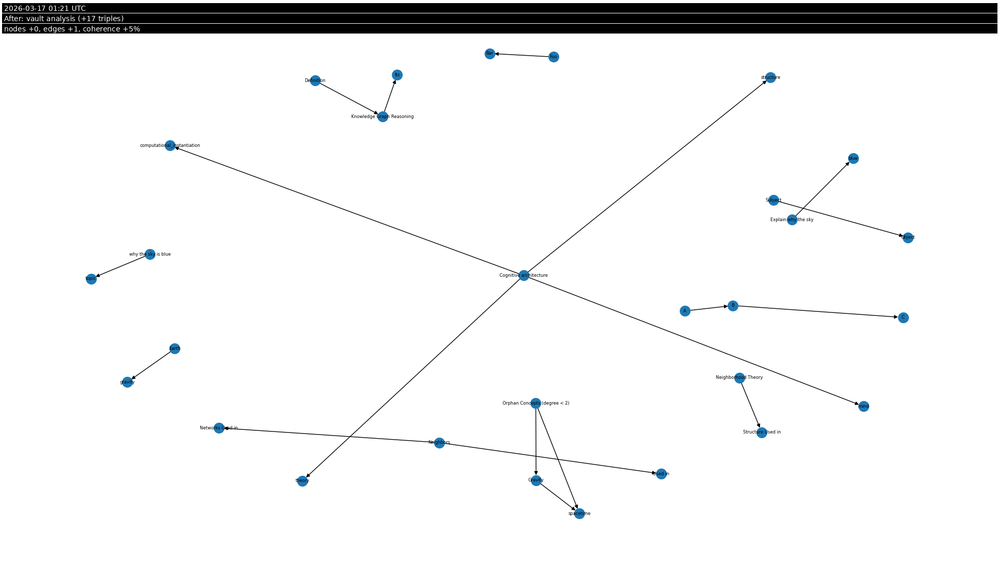](graph-2026-03-17-01-21-after-analyze-vault.png) [commit](https://github.com/BoggersTheFish/BoggersTheCIG/commit/c260423)

### 2026-03-17 01:21 UTC

**After:** vault analysis (+17 triples) — nodes +0, edges +1, coherence +5%

 [commit](https://github.com/BoggersTheFish/BoggersTheCIG/commit/c260423)

### 2026-03-17 01:21 UTC

**After:** 1 extracts, 0 merges — nodes +0, edges +0, coherence +0%

[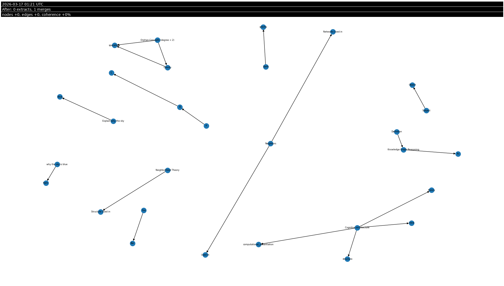](graph-2026-03-17-01-21-extract-subideas.png) [commit](https://github.com/BoggersTheFish/BoggersTheCIG/commit/c260423)

### 2026-03-17 01:21 UTC

**After:** 2_+2_.md"+Reasoning.md"+Theory.md"+architecture.md" — nodes +0, edges +0, coherence +0%

[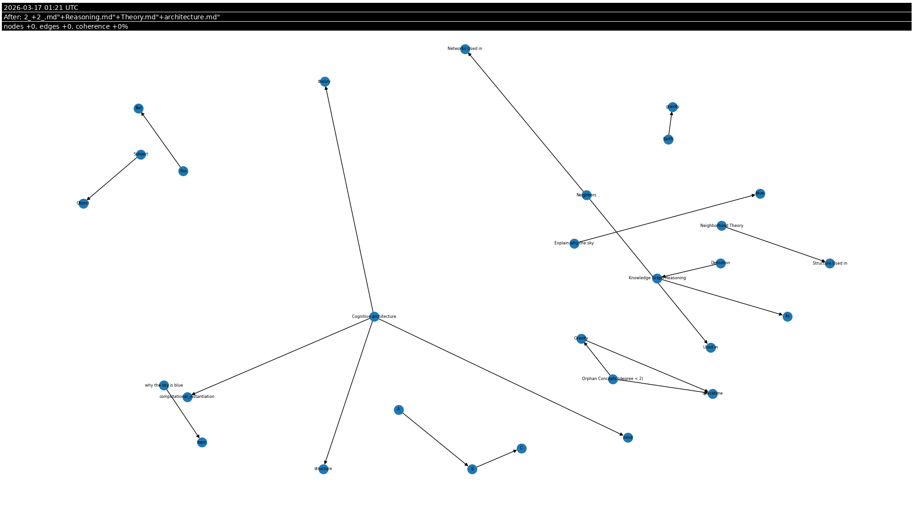](graph-2026-03-17-01-21-self-improve.png) [commit](https://github.com/BoggersTheFish/BoggersTheCIG/commit/c260423)

### 2026-03-17 01:21 UTC

**After:** 0 extracts, 1 merges — nodes +0, edges +0, coherence +0%

 [commit](https://github.com/BoggersTheFish/BoggersTheCIG/commit/c260423)

### 2026-03-17 01:21 UTC

**After:** 2_+2_.md"+Reasoning.md"+Theory.md"+architecture.md" — nodes +0, edges +0, coherence +0%

 [commit](https://github.com/BoggersTheFish/BoggersTheCIG/commit/c260423)

### 2026-03-17 06:59 UTC

**After:** external ingest (+1 triples) — nodes +4, edges +2, coherence +333233%

[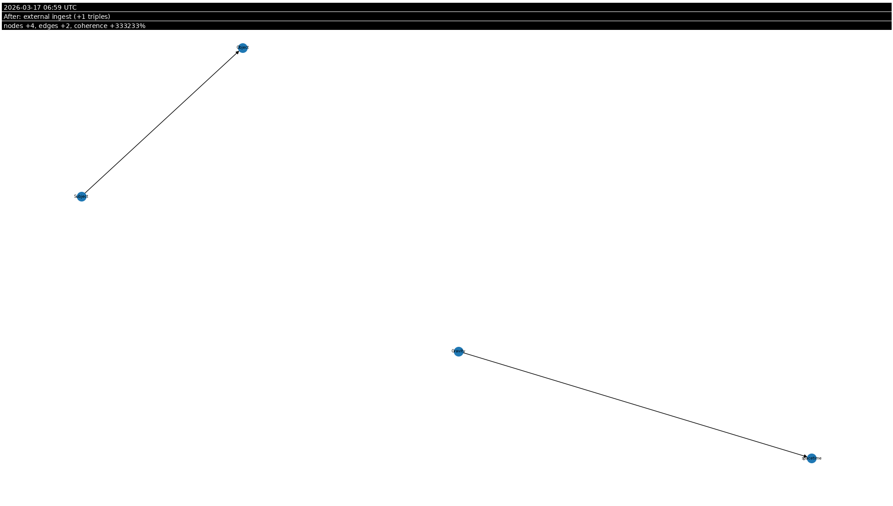](graph-2026-03-17-06-59-after-ingest.png) [commit](https://github.com/BoggersTheFish/BoggersTheCIG/commit/25bc64f)

### 2026-03-17 06:59 UTC

**After:** vault analysis (+24 triples) — nodes +26, edges +17, coherence -86%

[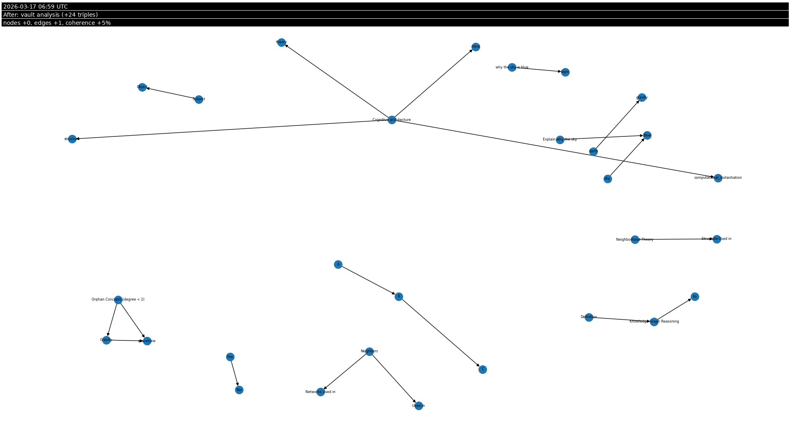](graph-2026-03-17-06-59-after-analyze-vault.png) [commit](https://github.com/BoggersTheFish/BoggersTheCIG/commit/25bc64f)

### 2026-03-17 06:59 UTC

**After:** vault analysis (+24 triples) — nodes +0, edges +1, coherence +5%

 [commit](https://github.com/BoggersTheFish/BoggersTheCIG/commit/25bc64f)

### 2026-03-17 06:59 UTC

**After:** 1 extracts, 0 merges — nodes +0, edges +0, coherence +0%

[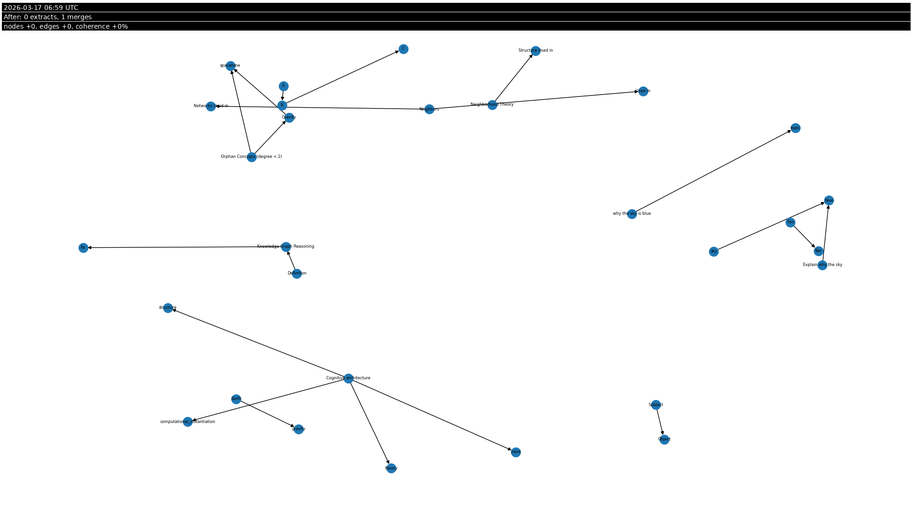](graph-2026-03-17-06-59-extract-subideas.png) [commit](https://github.com/BoggersTheFish/BoggersTheCIG/commit/25bc64f)

### 2026-03-17 06:59 UTC

**After:** 2_+2_.md"+Theory.md"+blue.md"+eval — nodes +0, edges +0, coherence +0%

[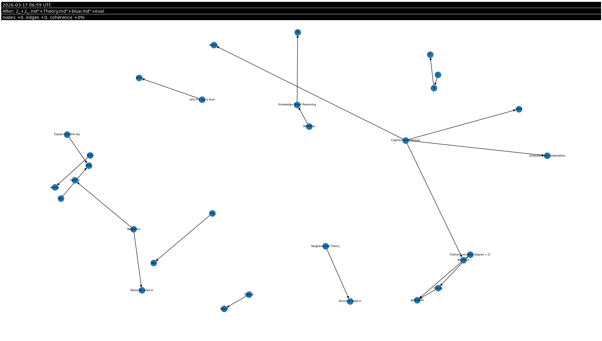](graph-2026-03-17-06-59-self-improve.png) [commit](https://github.com/BoggersTheFish/BoggersTheCIG/commit/25bc64f)

### 2026-03-17 06:59 UTC

**After:** 0 extracts, 1 merges — nodes +0, edges +0, coherence +0%

 [commit](https://github.com/BoggersTheFish/BoggersTheCIG/commit/25bc64f)

### 2026-03-17 06:59 UTC

**After:** 2_+2_.md"+Theory.md"+blue.md"+eval — nodes +0, edges +0, coherence +0%

 [commit](https://github.com/BoggersTheFish/BoggersTheCIG/commit/25bc64f)

### 2026-03-17 12:53 UTC

**After:** vault analysis (+30 triples) — nodes +30, edges +20, coherence +45877%

[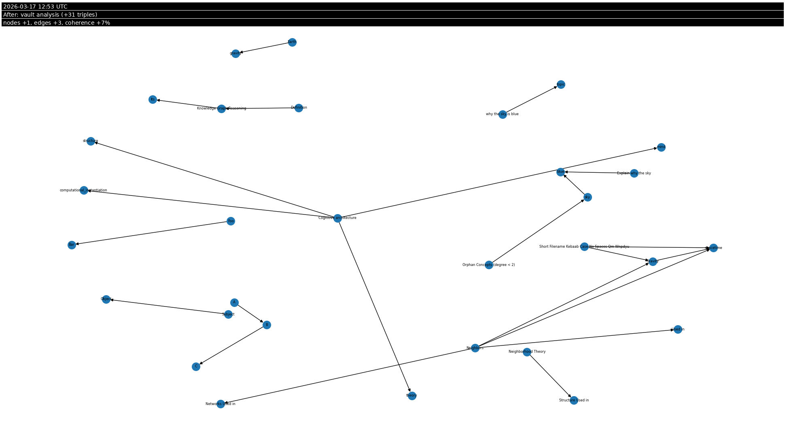](graph-2026-03-17-12-53-after-analyze-vault.png) [commit](https://github.com/BoggersTheFish/BoggersTheCIG/commit/f874834)

### 2026-03-17 12:53 UTC

**After:** 1 extracts, 0 merges — nodes +0, edges +0, coherence +0%

[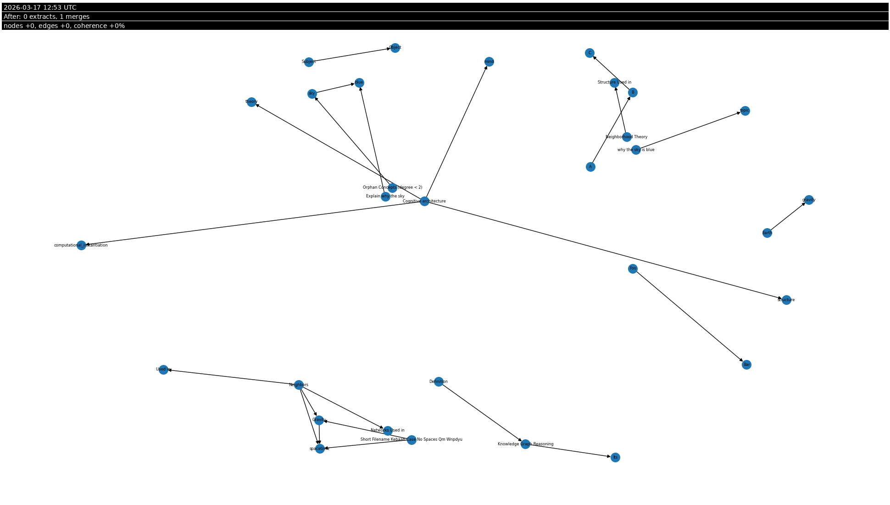](graph-2026-03-17-12-53-extract-subideas.png) [commit](https://github.com/BoggersTheFish/BoggersTheCIG/commit/f874834)

### 2026-03-17 12:53 UTC

**After:** vault analysis (+31 triples) — nodes +1, edges +3, coherence +7%

 [commit](https://github.com/BoggersTheFish/BoggersTheCIG/commit/f874834)

### 2026-03-17 12:53 UTC

**After:** 1 extracts, 0 merges — nodes +0, edges +0, coherence +0%

 [commit](https://github.com/BoggersTheFish/BoggersTheCIG/commit/f874834)

### 2026-03-17 12:53 UTC

**After:** 0 extracts, 1 merges — nodes +0, edges +0, coherence +0%

 [commit](https://github.com/BoggersTheFish/BoggersTheCIG/commit/f874834)

### 2026-03-17 12:53 UTC

**After:** 2_.md"+Reasoning.md"+Theory.md"+Wnpdyu.md"+architecture.md" — nodes +0, edges +0, coherence +0%

[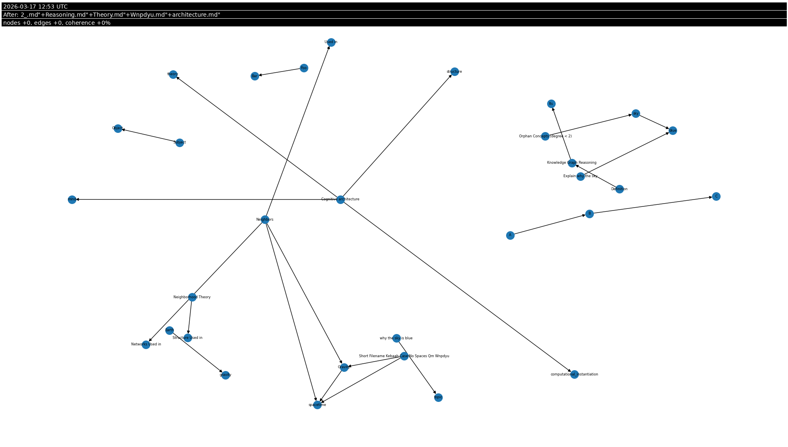](graph-2026-03-17-12-53-self-improve.png) [commit](https://github.com/BoggersTheFish/BoggersTheCIG/commit/f874834)

### 2026-03-17 12:53 UTC

**After:** 0 extracts, 1 merges — nodes +0, edges +0, coherence +0%

 [commit](https://github.com/BoggersTheFish/BoggersTheCIG/commit/f874834)

### 2026-03-17 12:53 UTC

**After:** 2_.md"+Reasoning.md"+Theory.md"+Wnpdyu.md"+architecture.md" — nodes +0, edges +0, coherence +0%

 [commit](https://github.com/BoggersTheFish/BoggersTheCIG/commit/f874834)
