# TS Graph Snapshots

Auto-generated after vault-modifying operations.

- **2026-03-16 22:36 UTC** — self-improve: 

- **2026-03-16 22:37 UTC** — self-improve: 

- **2026-03-16 22:43 UTC** — self-improve: 

- **2026-03-16 22:45 UTC** — self-improve: 

- **2026-03-16 22:45 UTC** — self-improve: 

### 2026-03-16 22:47 UTC

**After:** test overlay — nodes +0, edges +0, coherence +0%

### 2026-03-16 23:08 UTC

**After:** README.md+obsidian+src+tests — nodes +0, edges +0, coherence +0%

 [commit](https://github.com/BoggersTheFish/BoggersTheCIG/commit/d39e45d)

### 2026-03-16 23:08 UTC

**After:** README.md+eval+obsidian+src+tests — nodes +0, edges +0, coherence +0%

 [commit](https://github.com/BoggersTheFish/BoggersTheCIG/commit/d39e45d)

### 2026-03-16 23:10 UTC

**After:** external ingest (+4 triples) — nodes -9, edges -4, coherence +217%

 [commit](https://github.com/BoggersTheFish/BoggersTheCIG/commit/d39e45d)

### 2026-03-16 23:11 UTC

**After:** vault analysis (+9 triples) — nodes +15, edges +9, coherence -74%

 [commit](https://github.com/BoggersTheFish/BoggersTheCIG/commit/d39e45d)

### 2026-03-16 23:11 UTC

**After:** vault analysis (+9 triples) — nodes +0, edges +1, coherence +7%

 [commit](https://github.com/BoggersTheFish/BoggersTheCIG/commit/d39e45d)

### 2026-03-16 23:12 UTC

**After:** 2_.md"+README.md+Reasoning.md"+architecture.md"+eval — nodes +0, edges +0, coherence +0%

 [commit](https://github.com/BoggersTheFish/BoggersTheCIG/commit/d39e45d)

### 2026-03-16 23:12 UTC

**After:** 2_.md"+README.md+Reasoning.md"+architecture.md"+eval — nodes +0, edges +0, coherence +0%

 [commit](https://github.com/BoggersTheFish/BoggersTheCIG/commit/d39e45d)

### 2026-03-16 23:16 UTC

**After:** 2_.md"+README.md+Reasoning.md"+architecture.md"+eval — nodes +0, edges +0, coherence +0%

 [commit](https://github.com/BoggersTheFish/BoggersTheCIG/commit/d39e45d)

### 2026-03-16 23:16 UTC

**After:** 2_.md"+README.md+Reasoning.md"+architecture.md"+eval — nodes +0, edges +0, coherence +0%

 [commit](https://github.com/BoggersTheFish/BoggersTheCIG/commit/d39e45d)

### 2026-03-16 23:18 UTC

**After:** 2_.md"+README.md+Reasoning.md"+architecture.md"+eval — nodes +0, edges +0, coherence +0%

 [commit](https://github.com/BoggersTheFish/BoggersTheCIG/commit/d39e45d)

### 2026-03-16 23:18 UTC

**After:** 2_.md"+README.md+Reasoning.md"+architecture.md"+eval — nodes +0, edges +0, coherence +0%

 [commit](https://github.com/BoggersTheFish/BoggersTheCIG/commit/d39e45d)

### 2026-03-16 23:22 UTC

**After:** vault analysis (+15 triples) — nodes +0, edges +1, coherence +6%

 [commit](https://github.com/BoggersTheFish/BoggersTheCIG/commit/d39e45d)

### 2026-03-16 23:22 UTC

**After:** 1 extracts, 0 merges — nodes +0, edges +0, coherence +0%

 [commit](https://github.com/BoggersTheFish/BoggersTheCIG/commit/d39e45d)

### 2026-03-16 23:23 UTC

**After:** vault analysis (+15 triples) — nodes +1, edges +3, coherence +8%

 [commit](https://github.com/BoggersTheFish/BoggersTheCIG/commit/d39e45d)

### 2026-03-16 23:23 UTC

**After:** 1 extracts, 0 merges — nodes +0, edges +0, coherence +0%

 [commit](https://github.com/BoggersTheFish/BoggersTheCIG/commit/d39e45d)

### 2026-03-16 23:23 UTC

**After:** 0 extracts, 1 merges — nodes +0, edges +0, coherence +0%

 [commit](https://github.com/BoggersTheFish/BoggersTheCIG/commit/d39e45d)

### 2026-03-16 23:27 UTC

**After:** 0 extracts, 1 merges — nodes +0, edges +0, coherence +0%

 [commit](https://github.com/BoggersTheFish/BoggersTheCIG/commit/d39e45d)

### 2026-03-16 23:27 UTC

**After:** .github+2_+2_.md"+README.md+Reasoning.md" — nodes +0, edges +0, coherence +0%

 [commit](https://github.com/BoggersTheFish/BoggersTheCIG/commit/d39e45d)

### 2026-03-16 23:27 UTC

**After:** 0 extracts, 1 merges — nodes +0, edges +0, coherence +0%

 [commit](https://github.com/BoggersTheFish/BoggersTheCIG/commit/d39e45d)

### 2026-03-16 23:27 UTC

**After:** .github+2_+2_.md"+README.md+Reasoning.md" — nodes +0, edges +0, coherence +0%

 [commit](https://github.com/BoggersTheFish/BoggersTheCIG/commit/d39e45d)

### 2026-03-16 23:48 UTC

**After:** external ingest (+8 triples) — nodes -11, edges -10, coherence +81%

 [commit](https://github.com/BoggersTheFish/BoggersTheCIG/commit/c65da58)

### 2026-03-16 23:49 UTC

**After:** vault analysis (+17 triples) — nodes +24, edges +17, coherence -69%

 [commit](https://github.com/BoggersTheFish/BoggersTheCIG/commit/c65da58)

### 2026-03-16 23:49 UTC

**After:** 1 extracts, 0 merges — nodes -32, edges -24, coherence +707%

 [commit](https://github.com/BoggersTheFish/BoggersTheCIG/commit/c65da58)

### 2026-03-16 23:49 UTC

**After:** vault analysis (+18 triples) — nodes +1, edges +1, coherence -9%

 [commit](https://github.com/BoggersTheFish/BoggersTheCIG/commit/c65da58)

### 2026-03-16 23:49 UTC

**After:** 1 extracts, 0 merges — nodes -3, edges -2, coherence +233%

 [commit](https://github.com/BoggersTheFish/BoggersTheCIG/commit/c65da58)

### 2026-03-16 23:50 UTC

**After:** 1 extracts, 0 merges — nodes +0, edges +0, coherence +0%

 [commit](https://github.com/BoggersTheFish/BoggersTheCIG/commit/0b473f2)

### 2026-03-16 23:50 UTC

**After:** obsidian — nodes +0, edges +0, coherence +0%

 [commit](https://github.com/BoggersTheFish/BoggersTheCIG/commit/0b473f2)

### 2026-03-16 23:51 UTC

**After:** eval+obsidian — nodes +0, edges +0, coherence +0%

 [commit](https://github.com/BoggersTheFish/BoggersTheCIG/commit/0b473f2)

### 2026-03-17 01:21 UTC

**After:** external ingest (+1 triples) — nodes +4, edges +2, coherence +333233%

 [commit](https://github.com/BoggersTheFish/BoggersTheCIG/commit/c260423)

### 2026-03-17 01:21 UTC

**After:** vault analysis (+17 triples) — nodes +25, edges +16, coherence -86%

 [commit](https://github.com/BoggersTheFish/BoggersTheCIG/commit/c260423)

### 2026-03-17 01:21 UTC

**After:** vault analysis (+17 triples) — nodes +0, edges +1, coherence +5%

 [commit](https://github.com/BoggersTheFish/BoggersTheCIG/commit/c260423)

### 2026-03-17 01:21 UTC

**After:** 1 extracts, 0 merges — nodes +0, edges +0, coherence +0%

 [commit](https://github.com/BoggersTheFish/BoggersTheCIG/commit/c260423)

### 2026-03-17 01:21 UTC

**After:** 2_+2_.md"+Reasoning.md"+Theory.md"+architecture.md" — nodes +0, edges +0, coherence +0%

 [commit](https://github.com/BoggersTheFish/BoggersTheCIG/commit/c260423)

### 2026-03-17 01:21 UTC

**After:** 0 extracts, 1 merges — nodes +0, edges +0, coherence +0%

 [commit](https://github.com/BoggersTheFish/BoggersTheCIG/commit/c260423)

### 2026-03-17 01:21 UTC

**After:** 2_+2_.md"+Reasoning.md"+Theory.md"+architecture.md" — nodes +0, edges +0, coherence +0%

 [commit](https://github.com/BoggersTheFish/BoggersTheCIG/commit/c260423)

### 2026-03-17 06:59 UTC

**After:** external ingest (+1 triples) — nodes +4, edges +2, coherence +333233%

 [commit](https://github.com/BoggersTheFish/BoggersTheCIG/commit/25bc64f)

### 2026-03-17 06:59 UTC

**After:** vault analysis (+24 triples) — nodes +26, edges +17, coherence -86%

 [commit](https://github.com/BoggersTheFish/BoggersTheCIG/commit/25bc64f)

### 2026-03-17 06:59 UTC

**After:** vault analysis (+24 triples) — nodes +0, edges +1, coherence +5%

 [commit](https://github.com/BoggersTheFish/BoggersTheCIG/commit/25bc64f)

### 2026-03-17 06:59 UTC

**After:** 1 extracts, 0 merges — nodes +0, edges +0, coherence +0%

 [commit](https://github.com/BoggersTheFish/BoggersTheCIG/commit/25bc64f)

### 2026-03-17 06:59 UTC

**After:** 2_+2_.md"+Theory.md"+blue.md"+eval — nodes +0, edges +0, coherence +0%

 [commit](https://github.com/BoggersTheFish/BoggersTheCIG/commit/25bc64f)

### 2026-03-17 06:59 UTC

**After:** 0 extracts, 1 merges — nodes +0, edges +0, coherence +0%

 [commit](https://github.com/BoggersTheFish/BoggersTheCIG/commit/25bc64f)

### 2026-03-17 06:59 UTC

**After:** 2_+2_.md"+Theory.md"+blue.md"+eval — nodes +0, edges +0, coherence +0%

 [commit](https://github.com/BoggersTheFish/BoggersTheCIG/commit/25bc64f)

### 2026-03-17 12:53 UTC

**After:** vault analysis (+30 triples) — nodes +30, edges +20, coherence +45877%

 [commit](https://github.com/BoggersTheFish/BoggersTheCIG/commit/f874834)

### 2026-03-17 12:53 UTC

**After:** 1 extracts, 0 merges — nodes +0, edges +0, coherence +0%

 [commit](https://github.com/BoggersTheFish/BoggersTheCIG/commit/f874834)

### 2026-03-17 12:53 UTC

**After:** vault analysis (+31 triples) — nodes +1, edges +3, coherence +7%

 [commit](https://github.com/BoggersTheFish/BoggersTheCIG/commit/f874834)

### 2026-03-17 12:53 UTC

**After:** 1 extracts, 0 merges — nodes +0, edges +0, coherence +0%

 [commit](https://github.com/BoggersTheFish/BoggersTheCIG/commit/f874834)

### 2026-03-17 12:53 UTC

**After:** 0 extracts, 1 merges — nodes +0, edges +0, coherence +0%

 [commit](https://github.com/BoggersTheFish/BoggersTheCIG/commit/f874834)

### 2026-03-17 12:53 UTC

**After:** 2_.md"+Reasoning.md"+Theory.md"+Wnpdyu.md"+architecture.md" — nodes +0, edges +0, coherence +0%

 [commit](https://github.com/BoggersTheFish/BoggersTheCIG/commit/f874834)

### 2026-03-17 12:53 UTC

**After:** 0 extracts, 1 merges — nodes +0, edges +0, coherence +0%

 [commit](https://github.com/BoggersTheFish/BoggersTheCIG/commit/f874834)

### 2026-03-17 12:53 UTC

**After:** 2_.md"+Reasoning.md"+Theory.md"+Wnpdyu.md"+architecture.md" — nodes +0, edges +0, coherence +0%

 [commit](https://github.com/BoggersTheFish/BoggersTheCIG/commit/f874834)

### 2026-03-17 18:56 UTC

**After:** external ingest (+2 triples) — nodes +6, edges +3, coherence +199900%

 [commit](https://github.com/BoggersTheFish/BoggersTheCIG/commit/5bd2496)

### 2026-03-17 18:56 UTC

**After:** vault analysis (+32 triples) — nodes +28, edges +18, coherence -81%

 [commit](https://github.com/BoggersTheFish/BoggersTheCIG/commit/5bd2496)

### 2026-03-17 18:56 UTC

**After:** vault analysis (+32 triples) — nodes +0, edges +1, coherence +4%

 [commit](https://github.com/BoggersTheFish/BoggersTheCIG/commit/5bd2496)

### 2026-03-17 18:56 UTC

**After:** 1 extracts, 0 merges — nodes +0, edges +0, coherence +0%

 [commit](https://github.com/BoggersTheFish/BoggersTheCIG/commit/5bd2496)

### 2026-03-17 18:56 UTC

**After:** 2_+2_.md"+Reasoning.md"+Skill.md"+Wnpdyu.md" — nodes +0, edges +0, coherence +0%

 [commit](https://github.com/BoggersTheFish/BoggersTheCIG/commit/5bd2496)

### 2026-03-17 18:56 UTC

**After:** 0 extracts, 1 merges — nodes +0, edges +0, coherence +0%

 [commit](https://github.com/BoggersTheFish/BoggersTheCIG/commit/5bd2496)

### 2026-03-17 18:56 UTC

**After:** 2_+2_.md"+Reasoning.md"+Skill.md"+Wnpdyu.md" — nodes +0, edges +0, coherence +0%

 [commit](https://github.com/BoggersTheFish/BoggersTheCIG/commit/5bd2496)

### 2026-03-18 01:26 UTC

**After:** external ingest (+1 triples) — nodes +4, edges +2, coherence +333233%

 [commit](https://github.com/BoggersTheFish/BoggersTheCIG/commit/49b9f7b)

### 2026-03-18 01:26 UTC

**After:** vault analysis (+40 triples) — nodes +32, edges +20, coherence -89%

 [commit](https://github.com/BoggersTheFish/BoggersTheCIG/commit/49b9f7b)

### 2026-03-18 01:26 UTC

**After:** vault analysis (+40 triples) — nodes +0, edges +1, coherence +4%

 [commit](https://github.com/BoggersTheFish/BoggersTheCIG/commit/49b9f7b)

### 2026-03-18 01:26 UTC

**After:** 1 extracts, 0 merges — nodes +0, edges +0, coherence +0%

 [commit](https://github.com/BoggersTheFish/BoggersTheCIG/commit/49b9f7b)

### 2026-03-18 01:26 UTC

**After:** 2_+2_.md"+Skill.md"+eval+obsidian — nodes +0, edges +0, coherence +0%

 [commit](https://github.com/BoggersTheFish/BoggersTheCIG/commit/49b9f7b)

### 2026-03-18 01:26 UTC

**After:** 0 extracts, 1 merges — nodes +0, edges +0, coherence +0%

 [commit](https://github.com/BoggersTheFish/BoggersTheCIG/commit/49b9f7b)

### 2026-03-18 01:26 UTC

**After:** 2_+2_.md"+Skill.md"+eval+obsidian — nodes +0, edges +0, coherence +0%

 [commit](https://github.com/BoggersTheFish/BoggersTheCIG/commit/49b9f7b)

### 2026-03-18 06:58 UTC

**After:** external ingest (+2 triples) — nodes +6, edges +3, coherence +199900%

 [commit](https://github.com/BoggersTheFish/BoggersTheCIG/commit/9bfd220)

### 2026-03-18 06:58 UTC

**After:** vault analysis (+46 triples) — nodes +34, edges +21, coherence -84%

 [commit](https://github.com/BoggersTheFish/BoggersTheCIG/commit/9bfd220)

### 2026-03-18 06:58 UTC

**After:** vault analysis (+46 triples) — nodes +0, edges +2, coherence +8%

 [commit](https://github.com/BoggersTheFish/BoggersTheCIG/commit/9bfd220)

### 2026-03-18 06:58 UTC

**After:** 1 extracts, 0 merges — nodes +0, edges +0, coherence +0%

 [commit](https://github.com/BoggersTheFish/BoggersTheCIG/commit/9bfd220)

### 2026-03-18 06:58 UTC

**After:** 2_+2_.md"+Knowledge.md"+eval+individuals.md" — nodes +0, edges +0, coherence +0%

 [commit](https://github.com/BoggersTheFish/BoggersTheCIG/commit/9bfd220)

### 2026-03-18 06:58 UTC

**After:** 0 extracts, 1 merges — nodes +0, edges +0, coherence +0%

 [commit](https://github.com/BoggersTheFish/BoggersTheCIG/commit/9bfd220)

### 2026-03-18 06:58 UTC

**After:** 2_+2_.md"+Knowledge.md"+eval+individuals.md" — nodes +0, edges +0, coherence +0%

 [commit](https://github.com/BoggersTheFish/BoggersTheCIG/commit/9bfd220)

### 2026-03-18 12:54 UTC

**After:** external ingest (+1 triples) — nodes +4, edges +2, coherence +333233%

 [commit](https://github.com/BoggersTheFish/BoggersTheCIG/commit/60dedd3)

### 2026-03-18 12:54 UTC

**After:** vault analysis (+51 triples) — nodes +38, edges +26, coherence -90%

 [commit](https://github.com/BoggersTheFish/BoggersTheCIG/commit/60dedd3)

### 2026-03-18 12:54 UTC

**After:** 1 extracts, 0 merges — nodes +0, edges +0, coherence +0%

 [commit](https://github.com/BoggersTheFish/BoggersTheCIG/commit/60dedd3)

### 2026-03-18 12:54 UTC

**After:** vault analysis (+52 triples) — nodes +0, edges +2, coherence +7%

 [commit](https://github.com/BoggersTheFish/BoggersTheCIG/commit/60dedd3)

### 2026-03-18 12:54 UTC

**After:** 1 extracts, 0 merges — nodes +0, edges +0, coherence +0%

 [commit](https://github.com/BoggersTheFish/BoggersTheCIG/commit/60dedd3)

### 2026-03-18 12:54 UTC

**After:** 0 extracts, 1 merges — nodes +0, edges +0, coherence +0%

 [commit](https://github.com/BoggersTheFish/BoggersTheCIG/commit/60dedd3)

### 2026-03-18 12:54 UTC

**After:** 2_+2_.md"+Knowledge.md"+True_.md"+eval — nodes +0, edges +0, coherence +0%

 [commit](https://github.com/BoggersTheFish/BoggersTheCIG/commit/60dedd3)

### 2026-03-18 12:54 UTC

**After:** 0 extracts, 1 merges — nodes +0, edges +0, coherence +0%

 [commit](https://github.com/BoggersTheFish/BoggersTheCIG/commit/60dedd3)

### 2026-03-18 12:54 UTC

**After:** 2_+2_.md"+Knowledge.md"+True_.md"+eval — nodes +0, edges +0, coherence +0%

 [commit](https://github.com/BoggersTheFish/BoggersTheCIG/commit/60dedd3)

### 2026-03-18 18:52 UTC

**After:** external ingest (+1 triples) — nodes +4, edges +2, coherence +333233%

 [commit](https://github.com/BoggersTheFish/BoggersTheCIG/commit/f81e66a)

### 2026-03-18 18:52 UTC

**After:** vault analysis (+50 triples) — nodes +42, edges +25, coherence -92%

 [commit](https://github.com/BoggersTheFish/BoggersTheCIG/commit/f81e66a)

### 2026-03-18 18:52 UTC

**After:** vault analysis (+51 triples) — nodes +0, edges +2, coherence +7%

 [commit](https://github.com/BoggersTheFish/BoggersTheCIG/commit/f81e66a)

### 2026-03-18 18:52 UTC

**After:** 1 extracts, 0 merges — nodes +0, edges +0, coherence +0%

 [commit](https://github.com/BoggersTheFish/BoggersTheCIG/commit/f81e66a)

### 2026-03-18 18:52 UTC

**After:** 2_+2_.md"+AI.md"+Knowledge.md"+True_.md" — nodes +0, edges +0, coherence +0%

 [commit](https://github.com/BoggersTheFish/BoggersTheCIG/commit/f81e66a)

### 2026-03-18 18:52 UTC

**After:** 0 extracts, 1 merges — nodes +0, edges +0, coherence +0%

 [commit](https://github.com/BoggersTheFish/BoggersTheCIG/commit/f81e66a)

### 2026-03-18 18:52 UTC

**After:** 2_+2_.md"+AI.md"+Knowledge.md"+True_.md" — nodes +0, edges +0, coherence +0%

 [commit](https://github.com/BoggersTheFish/BoggersTheCIG/commit/f81e66a)

### 2026-03-19 01:26 UTC

**After:** external ingest (+1 triples) — nodes +4, edges +2, coherence +333233%

 [commit](https://github.com/BoggersTheFish/BoggersTheCIG/commit/a33b585)

### 2026-03-19 01:26 UTC

**After:** vault analysis (+55 triples) — nodes +44, edges +26, coherence -92%

 [commit](https://github.com/BoggersTheFish/BoggersTheCIG/commit/a33b585)

### 2026-03-19 01:26 UTC

**After:** vault analysis (+56 triples) — nodes +0, edges +2, coherence +7%

 [commit](https://github.com/BoggersTheFish/BoggersTheCIG/commit/a33b585)

### 2026-03-19 01:26 UTC

**After:** 1 extracts, 0 merges — nodes +0, edges +0, coherence +0%

 [commit](https://github.com/BoggersTheFish/BoggersTheCIG/commit/a33b585)

### 2026-03-19 01:26 UTC

**After:** 2_+2_.md"+AI.md"+Relations.md"+eval — nodes +0, edges +0, coherence +0%

 [commit](https://github.com/BoggersTheFish/BoggersTheCIG/commit/a33b585)

### 2026-03-19 01:26 UTC

**After:** 0 extracts, 1 merges — nodes +0, edges +0, coherence +0%

 [commit](https://github.com/BoggersTheFish/BoggersTheCIG/commit/a33b585)

### 2026-03-19 01:26 UTC

**After:** 2_+2_.md"+AI.md"+Relations.md"+eval — nodes +0, edges +0, coherence +0%

 [commit](https://github.com/BoggersTheFish/BoggersTheCIG/commit/a33b585)

### 2026-03-19 06:34 UTC

**After:** vault analysis (+57 triples) — nodes +48, edges +28, coherence +24722%

 [commit](https://github.com/BoggersTheFish/BoggersTheCIG/commit/11984fd)

### 2026-03-19 06:34 UTC

**After:** vault analysis (+59 triples) — nodes +1, edges +2, coherence +2%

 [commit](https://github.com/BoggersTheFish/BoggersTheCIG/commit/11984fd)

### 2026-03-19 06:34 UTC

**After:** 1 extracts, 0 merges — nodes +0, edges +0, coherence +0%

 [commit](https://github.com/BoggersTheFish/BoggersTheCIG/commit/11984fd)

### 2026-03-19 06:34 UTC

**After:** 2_+2_.md"+AI.md"+Relations.md"+Wnpdyu.md" — nodes +0, edges +0, coherence +0%

 [commit](https://github.com/BoggersTheFish/BoggersTheCIG/commit/11984fd)

### 2026-03-19 06:34 UTC

**After:** 0 extracts, 1 merges — nodes +0, edges +0, coherence +0%

 [commit](https://github.com/BoggersTheFish/BoggersTheCIG/commit/11984fd)

### 2026-03-19 06:34 UTC

**After:** 2_+2_.md"+AI.md"+Relations.md"+Wnpdyu.md" — nodes +0, edges +0, coherence +0%

 [commit](https://github.com/BoggersTheFish/BoggersTheCIG/commit/11984fd)

### 2026-03-19 06:53 UTC

**After:** vault analysis (+63 triples) — nodes +48, edges +30, coherence +26495%

 [commit](https://github.com/BoggersTheFish/BoggersTheCIG/commit/38555e0)

### 2026-03-19 06:53 UTC

**After:** 1 extracts, 0 merges — nodes +0, edges +0, coherence +0%

 [commit](https://github.com/BoggersTheFish/BoggersTheCIG/commit/38555e0)

### 2026-03-19 06:53 UTC

**After:** vault analysis (+65 triples) — nodes +1, edges +2, coherence +2%

 [commit](https://github.com/BoggersTheFish/BoggersTheCIG/commit/38555e0)

### 2026-03-19 06:54 UTC

**After:** 1 extracts, 0 merges — nodes +0, edges +0, coherence +0%

 [commit](https://github.com/BoggersTheFish/BoggersTheCIG/commit/38555e0)

### 2026-03-19 06:54 UTC

**After:** 0 extracts, 1 merges — nodes +0, edges +0, coherence +0%

 [commit](https://github.com/BoggersTheFish/BoggersTheCIG/commit/38555e0)

### 2026-03-19 06:54 UTC

**After:** 2_+2_.md"+Relations.md"+eval+full_ts_cognitive_architecture.egg-info — nodes +0, edges +0, coherence +0%

 [commit](https://github.com/BoggersTheFish/BoggersTheCIG/commit/38555e0)

### 2026-03-19 06:54 UTC

**After:** 0 extracts, 1 merges — nodes +0, edges +0, coherence +0%

 [commit](https://github.com/BoggersTheFish/BoggersTheCIG/commit/38555e0)

### 2026-03-19 06:54 UTC

**After:** 2_+2_.md"+Relations.md"+eval+full_ts_cognitive_architecture.egg-info — nodes +0, edges +0, coherence +0%

 [commit](https://github.com/BoggersTheFish/BoggersTheCIG/commit/38555e0)

### 2026-03-19 12:47 UTC

**After:** vault analysis (+59 triples) — nodes +48, edges +28, coherence +24722%

 [commit](https://github.com/BoggersTheFish/BoggersTheCIG/commit/0c4cec4)

### 2026-03-19 12:47 UTC

**After:** vault analysis (+61 triples) — nodes +1, edges +2, coherence +2%

 [commit](https://github.com/BoggersTheFish/BoggersTheCIG/commit/0c4cec4)

### 2026-03-19 12:47 UTC

**After:** 1 extracts, 0 merges — nodes +0, edges +0, coherence +0%

 [commit](https://github.com/BoggersTheFish/BoggersTheCIG/commit/0c4cec4)

### 2026-03-19 12:47 UTC

**After:** 2_+2_.md"+eval+obsidian — nodes +0, edges +0, coherence +0%

 [commit](https://github.com/BoggersTheFish/BoggersTheCIG/commit/0c4cec4)

### 2026-03-19 12:48 UTC

**After:** 0 extracts, 1 merges — nodes +0, edges +0, coherence +0%

 [commit](https://github.com/BoggersTheFish/BoggersTheCIG/commit/0c4cec4)

### 2026-03-19 12:48 UTC

**After:** 2_+2_.md"+eval+obsidian — nodes +0, edges +0, coherence +0%

 [commit](https://github.com/BoggersTheFish/BoggersTheCIG/commit/0c4cec4)

### 2026-03-19 18:50 UTC

**After:** external ingest (+2 triples) — nodes +6, edges +3, coherence +199900%

 [commit](https://github.com/BoggersTheFish/BoggersTheCIG/commit/df2bc75)

### 2026-03-19 18:50 UTC

**After:** vault analysis (+64 triples) — nodes +49, edges +29, coherence -89%

 [commit](https://github.com/BoggersTheFish/BoggersTheCIG/commit/df2bc75)

### 2026-03-19 18:50 UTC

**After:** vault analysis (+64 triples) — nodes +0, edges +2, coherence +6%

 [commit](https://github.com/BoggersTheFish/BoggersTheCIG/commit/df2bc75)

### 2026-03-19 18:52 UTC

**After:** vault organize (0 moves) — nodes +0, edges +0, coherence +0%

 [commit](https://github.com/BoggersTheFish/BoggersTheCIG/commit/df2bc75)

### 2026-03-19 18:52 UTC

**After:** 1 extracts, 0 merges — nodes +0, edges +0, coherence +0%

 [commit](https://github.com/BoggersTheFish/BoggersTheCIG/commit/df2bc75)

### 2026-03-19 18:52 UTC

**After:** 2_+2_.md"+Knowledge.md"+_3.md"+eval — nodes +0, edges +0, coherence +0%

 [commit](https://github.com/BoggersTheFish/BoggersTheCIG/commit/df2bc75)

### 2026-03-19 18:55 UTC

**After:** vault organize (2 moves) — nodes +0, edges +0, coherence +0%

 [commit](https://github.com/BoggersTheFish/BoggersTheCIG/commit/df2bc75)

### 2026-03-19 18:55 UTC

**After:** 0 extracts, 1 merges — nodes +0, edges +0, coherence +0%

 [commit](https://github.com/BoggersTheFish/BoggersTheCIG/commit/df2bc75)

### 2026-03-19 18:55 UTC

**After:** 2_+2_.md"+AI.md"+Knowledge.md"+_3.md" — nodes +0, edges +0, coherence +0%

 [commit](https://github.com/BoggersTheFish/BoggersTheCIG/commit/df2bc75)

### 2026-03-20 01:22 UTC

**After:** external ingest (+1 triples) — nodes +4, edges +2, coherence +333233%

 [commit](https://github.com/BoggersTheFish/BoggersTheCIG/commit/251482b)

### 2026-03-20 01:22 UTC

**After:** vault analysis (+74 triples) — nodes +54, edges +35, coherence -93%

 [commit](https://github.com/BoggersTheFish/BoggersTheCIG/commit/251482b)

### 2026-03-20 01:22 UTC

**After:** 1 extracts, 0 merges — nodes +0, edges +0, coherence +0%

 [commit](https://github.com/BoggersTheFish/BoggersTheCIG/commit/251482b)

### 2026-03-20 01:22 UTC

**After:** vault analysis (+75 triples) — nodes +0, edges +2, coherence +5%

 [commit](https://github.com/BoggersTheFish/BoggersTheCIG/commit/251482b)

### 2026-03-20 01:22 UTC

**After:** 1 extracts, 0 merges — nodes +0, edges +0, coherence +0%

 [commit](https://github.com/BoggersTheFish/BoggersTheCIG/commit/251482b)

### 2026-03-20 01:25 UTC

**After:** vault organize (6 moves) — nodes +0, edges +0, coherence +0%

 [commit](https://github.com/BoggersTheFish/BoggersTheCIG/commit/251482b)

### 2026-03-20 01:25 UTC

**After:** 1 extracts, 1 merges — nodes +0, edges +0, coherence +0%

 [commit](https://github.com/BoggersTheFish/BoggersTheCIG/commit/251482b)

### 2026-03-20 01:25 UTC

**After:** 2_+2_.md"+AI.md"+Augmenting.md"+Bear.md" — nodes +0, edges +0, coherence +0%

 [commit](https://github.com/BoggersTheFish/BoggersTheCIG/commit/251482b)

### 2026-03-20 01:28 UTC

**After:** vault organize (3 moves) — nodes +0, edges +0, coherence +0%

 [commit](https://github.com/BoggersTheFish/BoggersTheCIG/commit/251482b)

### 2026-03-20 01:28 UTC

**After:** 1 extracts, 1 merges — nodes +0, edges +0, coherence +0%

 [commit](https://github.com/BoggersTheFish/BoggersTheCIG/commit/251482b)

### 2026-03-20 01:28 UTC

**After:** 2_+2_.md"+AI.md"+Augmenting.md"+Bear.md" — nodes +0, edges +0, coherence +0%

 [commit](https://github.com/BoggersTheFish/BoggersTheCIG/commit/251482b)

### 2026-03-20 06:49 UTC

**After:** external ingest (+2 triples) — nodes +6, edges +3, coherence +199900%

 [commit](https://github.com/BoggersTheFish/BoggersTheCIG/commit/90e2dfa)

### 2026-03-20 06:49 UTC

**After:** vault analysis (+85 triples) — nodes +57, edges +38, coherence -89%

 [commit](https://github.com/BoggersTheFish/BoggersTheCIG/commit/90e2dfa)

### 2026-03-20 06:49 UTC

**After:** 1 extracts, 0 merges — nodes +0, edges +0, coherence +0%

 [commit](https://github.com/BoggersTheFish/BoggersTheCIG/commit/90e2dfa)

### 2026-03-20 06:49 UTC

**After:** vault analysis (+87 triples) — nodes +0, edges +6, coherence +14%

 [commit](https://github.com/BoggersTheFish/BoggersTheCIG/commit/90e2dfa)

### 2026-03-20 06:50 UTC

**After:** 1 extracts, 0 merges — nodes +0, edges +0, coherence +0%

 [commit](https://github.com/BoggersTheFish/BoggersTheCIG/commit/90e2dfa)

### 2026-03-20 06:53 UTC

**After:** vault organize (2 moves) — nodes +0, edges +0, coherence +0%

 [commit](https://github.com/BoggersTheFish/BoggersTheCIG/commit/90e2dfa)

### 2026-03-20 06:53 UTC

**After:** 1 extracts, 1 merges — nodes +0, edges +0, coherence +0%

 [commit](https://github.com/BoggersTheFish/BoggersTheCIG/commit/90e2dfa)

### 2026-03-20 06:53 UTC

**After:** 2_+2_.md"+Augmenting.md"+Bear.md"+Knowledge.md" — nodes +0, edges +0, coherence +0%

 [commit](https://github.com/BoggersTheFish/BoggersTheCIG/commit/90e2dfa)

### 2026-03-20 06:56 UTC

**After:** vault organize (4 moves) — nodes +0, edges +0, coherence +0%

 [commit](https://github.com/BoggersTheFish/BoggersTheCIG/commit/90e2dfa)

### 2026-03-20 06:56 UTC

**After:** 0 extracts, 2 merges — nodes +0, edges +0, coherence +0%

 [commit](https://github.com/BoggersTheFish/BoggersTheCIG/commit/90e2dfa)

### 2026-03-20 06:56 UTC

**After:** 2_+2_.md"+Augmenting.md"+Bear.md"+Knowledge.md" — nodes +0, edges +0, coherence +0%

 [commit](https://github.com/BoggersTheFish/BoggersTheCIG/commit/90e2dfa)

### 2026-03-20 12:44 UTC

**After:** external ingest (+1 triples) — nodes +4, edges +2, coherence +333233%

 [commit](https://github.com/BoggersTheFish/BoggersTheCIG/commit/717f137)

### 2026-03-20 12:44 UTC

**After:** vault analysis (+91 triples) — nodes +59, edges +38, coherence -93%

 [commit](https://github.com/BoggersTheFish/BoggersTheCIG/commit/717f137)

### 2026-03-20 12:44 UTC

**After:** 1 extracts, 0 merges — nodes +0, edges +0, coherence +0%

 [commit](https://github.com/BoggersTheFish/BoggersTheCIG/commit/717f137)

### 2026-03-20 12:44 UTC

**After:** vault analysis (+93 triples) — nodes +0, edges +7, coherence +17%

 [commit](https://github.com/BoggersTheFish/BoggersTheCIG/commit/717f137)

### 2026-03-20 12:44 UTC

**After:** 1 extracts, 0 merges — nodes +0, edges +0, coherence +0%

 [commit](https://github.com/BoggersTheFish/BoggersTheCIG/commit/717f137)

### 2026-03-20 12:47 UTC

**After:** vault organize (0 moves) — nodes +0, edges +0, coherence +0%

 [commit](https://github.com/BoggersTheFish/BoggersTheCIG/commit/717f137)

### 2026-03-20 12:47 UTC

**After:** 0 extracts, 1 merges — nodes +0, edges +0, coherence +0%

 [commit](https://github.com/BoggersTheFish/BoggersTheCIG/commit/717f137)

### 2026-03-20 12:47 UTC

**After:** 2_+2_.md"+Augmenting.md"+Knowledge.md"+Mechanics.md" — nodes +0, edges +0, coherence +0%

 [commit](https://github.com/BoggersTheFish/BoggersTheCIG/commit/717f137)

### 2026-03-20 12:49 UTC

**After:** vault organize (1 moves) — nodes +0, edges +0, coherence +0%

 [commit](https://github.com/BoggersTheFish/BoggersTheCIG/commit/717f137)

### 2026-03-20 12:50 UTC

**After:** 0 extracts, 1 merges — nodes +0, edges +0, coherence +0%

 [commit](https://github.com/BoggersTheFish/BoggersTheCIG/commit/717f137)

### 2026-03-20 12:50 UTC

**After:** 2_+2_.md"+Augmenting.md"+Knowledge.md"+Mechanics.md" — nodes +0, edges +0, coherence +0%

 [commit](https://github.com/BoggersTheFish/BoggersTheCIG/commit/717f137)

### 2026-03-20 18:42 UTC

**After:** vault analysis (+88 triples) — nodes +62, edges +36, coherence +18937%

 [commit](https://github.com/BoggersTheFish/BoggersTheCIG/commit/af406e7)

### 2026-03-20 18:42 UTC

**After:** vault analysis (+91 triples) — nodes +1, edges +3, coherence +4%

 [commit](https://github.com/BoggersTheFish/BoggersTheCIG/commit/af406e7)

### 2026-03-20 18:45 UTC

**After:** vault organize (1 moves) — nodes +0, edges +0, coherence +0%

 [commit](https://github.com/BoggersTheFish/BoggersTheCIG/commit/af406e7)

### 2026-03-20 18:45 UTC

**After:** 1 extracts, 0 merges — nodes +0, edges +0, coherence +0%

 [commit](https://github.com/BoggersTheFish/BoggersTheCIG/commit/af406e7)

### 2026-03-20 18:45 UTC

**After:** 2_+2_.md"+Part.md"+Spaces.md"+eval — nodes +0, edges +0, coherence +0%

 [commit](https://github.com/BoggersTheFish/BoggersTheCIG/commit/af406e7)

### 2026-03-20 18:47 UTC

**After:** vault organize (5 moves) — nodes +0, edges +0, coherence +0%

 [commit](https://github.com/BoggersTheFish/BoggersTheCIG/commit/af406e7)

### 2026-03-20 18:47 UTC

**After:** 0 extracts, 1 merges — nodes +0, edges +0, coherence +0%

 [commit](https://github.com/BoggersTheFish/BoggersTheCIG/commit/af406e7)

### 2026-03-20 18:47 UTC

**After:** 2_+2_.md"+Bear.md"+Part.md"+Spaces.md" — nodes +0, edges +0, coherence +0%

 [commit](https://github.com/BoggersTheFish/BoggersTheCIG/commit/af406e7)

### 2026-03-21 01:18 UTC

**After:** vault analysis (+96 triples) — nodes +62, edges +39, coherence +20524%

 [commit](https://github.com/BoggersTheFish/BoggersTheCIG/commit/609a307)

### 2026-03-21 01:18 UTC

**After:** 1 extracts, 0 merges — nodes +0, edges +0, coherence +0%

 [commit](https://github.com/BoggersTheFish/BoggersTheCIG/commit/609a307)

### 2026-03-21 01:18 UTC

**After:** vault analysis (+99 triples) — nodes +1, edges +3, coherence +4%

 [commit](https://github.com/BoggersTheFish/BoggersTheCIG/commit/609a307)

### 2026-03-21 01:18 UTC

**After:** 1 extracts, 0 merges — nodes +0, edges +0, coherence +0%

 [commit](https://github.com/BoggersTheFish/BoggersTheCIG/commit/609a307)

### 2026-03-21 01:20 UTC

**After:** vault organize (0 moves) — nodes +0, edges +0, coherence +0%

 [commit](https://github.com/BoggersTheFish/BoggersTheCIG/commit/609a307)

### 2026-03-21 01:20 UTC

**After:** 0 extracts, 1 merges — nodes +0, edges +0, coherence +0%

 [commit](https://github.com/BoggersTheFish/BoggersTheCIG/commit/609a307)

### 2026-03-21 01:20 UTC

**After:** 2_+2_.md"+Bear.md"+Spaces.md"+eval — nodes +0, edges +0, coherence +0%

 [commit](https://github.com/BoggersTheFish/BoggersTheCIG/commit/609a307)

### 2026-03-21 01:23 UTC

**After:** vault organize (0 moves) — nodes +0, edges +0, coherence +0%

 [commit](https://github.com/BoggersTheFish/BoggersTheCIG/commit/609a307)

### 2026-03-21 01:23 UTC

**After:** 0 extracts, 1 merges — nodes +0, edges +0, coherence +0%

 [commit](https://github.com/BoggersTheFish/BoggersTheCIG/commit/609a307)

### 2026-03-21 01:23 UTC

**After:** 2_+2_.md"+Bear.md"+Spaces.md"+eval — nodes +0, edges +0, coherence +0%

 [commit](https://github.com/BoggersTheFish/BoggersTheCIG/commit/609a307)

### 2026-03-21 06:39 UTC

**After:** external ingest (+1 triples) — nodes +4, edges +2, coherence +333233%

 [commit](https://github.com/BoggersTheFish/BoggersTheCIG/commit/016dd44)

### 2026-03-21 06:39 UTC

**After:** vault analysis (+92 triples) — nodes +59, edges +35, coherence -94%

 [commit](https://github.com/BoggersTheFish/BoggersTheCIG/commit/016dd44)

### 2026-03-21 06:39 UTC

**After:** vault analysis (+94 triples) — nodes +0, edges +3, coherence +8%

 [commit](https://github.com/BoggersTheFish/BoggersTheCIG/commit/016dd44)

### 2026-03-21 06:42 UTC

**After:** vault organize (0 moves) — nodes +0, edges +0, coherence +0%

 [commit](https://github.com/BoggersTheFish/BoggersTheCIG/commit/016dd44)

### 2026-03-21 06:42 UTC

**After:** 1 extracts, 0 merges — nodes +0, edges +0, coherence +0%

 [commit](https://github.com/BoggersTheFish/BoggersTheCIG/commit/016dd44)

### 2026-03-21 06:42 UTC

**After:** 2_+2_.md"+Spaces.md"+eval+obsidian — nodes +0, edges +0, coherence +0%

 [commit](https://github.com/BoggersTheFish/BoggersTheCIG/commit/016dd44)

### 2026-03-21 06:45 UTC

**After:** vault organize (0 moves) — nodes +0, edges +0, coherence +0%

 [commit](https://github.com/BoggersTheFish/BoggersTheCIG/commit/016dd44)

### 2026-03-21 06:45 UTC

**After:** 0 extracts, 1 merges — nodes +0, edges +0, coherence +0%

 [commit](https://github.com/BoggersTheFish/BoggersTheCIG/commit/016dd44)

### 2026-03-21 06:45 UTC

**After:** 2_+2_.md"+Spaces.md"+eval+obsidian — nodes +0, edges +0, coherence +0%

 [commit](https://github.com/BoggersTheFish/BoggersTheCIG/commit/016dd44)

### 2026-03-21 08:14 UTC

**After:** vault analysis (+94 triples) — nodes +62, edges +36, coherence +18937%

 [commit](https://github.com/BoggersTheFish/BoggersTheCIG/commit/6d1290a)

### 2026-03-21 08:14 UTC

**After:** vault analysis (+97 triples) — nodes +1, edges +3, coherence +4%

 [commit](https://github.com/BoggersTheFish/BoggersTheCIG/commit/6d1290a)

### 2026-03-21 08:16 UTC

**After:** vault organize (0 moves) — nodes +0, edges +0, coherence +0%

 [commit](https://github.com/BoggersTheFish/BoggersTheCIG/commit/6d1290a)

### 2026-03-21 08:16 UTC

**After:** 1 extracts, 0 merges — nodes +0, edges +0, coherence +0%

 [commit](https://github.com/BoggersTheFish/BoggersTheCIG/commit/6d1290a)

### 2026-03-21 08:16 UTC

**After:** 2_+2_.md"+Spaces.md"+eval+obsidian — nodes +0, edges +0, coherence +0%

 [commit](https://github.com/BoggersTheFish/BoggersTheCIG/commit/6d1290a)

### 2026-03-21 08:18 UTC

**After:** vault organize (0 moves) — nodes +0, edges +0, coherence +0%

 [commit](https://github.com/BoggersTheFish/BoggersTheCIG/commit/6d1290a)

### 2026-03-21 08:19 UTC

**After:** 0 extracts, 1 merges — nodes +0, edges +0, coherence +0%

 [commit](https://github.com/BoggersTheFish/BoggersTheCIG/commit/6d1290a)

### 2026-03-21 08:19 UTC

**After:** 2_+2_.md"+Spaces.md"+obsidian — nodes +0, edges +0, coherence +0%

 [commit](https://github.com/BoggersTheFish/BoggersTheCIG/commit/6d1290a)

### 2026-03-21 10:32 UTC

**After:** external ingest (+1 triples) — nodes +4, edges +2, coherence +333233%

 [commit](https://github.com/BoggersTheFish/BoggersTheCIG/commit/e74021c)

### 2026-03-21 10:32 UTC

**After:** vault analysis (+98 triples) — nodes +59, edges +38, coherence -93%

 [commit](https://github.com/BoggersTheFish/BoggersTheCIG/commit/e74021c)

### 2026-03-21 10:32 UTC

**After:** 1 extracts, 0 merges — nodes +0, edges +0, coherence +0%

 [commit](https://github.com/BoggersTheFish/BoggersTheCIG/commit/e74021c)

### 2026-03-21 10:32 UTC

**After:** vault analysis (+100 triples) — nodes +0, edges +3, coherence +7%

 [commit](https://github.com/BoggersTheFish/BoggersTheCIG/commit/e74021c)

### 2026-03-21 10:32 UTC

**After:** 1 extracts, 0 merges — nodes +0, edges +0, coherence +0%

 [commit](https://github.com/BoggersTheFish/BoggersTheCIG/commit/e74021c)

### 2026-03-21 10:35 UTC

**After:** vault organize (0 moves) — nodes +0, edges +0, coherence +0%

 [commit](https://github.com/BoggersTheFish/BoggersTheCIG/commit/e74021c)

### 2026-03-21 10:35 UTC

**After:** 0 extracts, 1 merges — nodes +0, edges +0, coherence +0%

 [commit](https://github.com/BoggersTheFish/BoggersTheCIG/commit/e74021c)

### 2026-03-21 10:35 UTC

**After:** 2_+2_.md"+eval+obsidian — nodes +0, edges +0, coherence +0%

 [commit](https://github.com/BoggersTheFish/BoggersTheCIG/commit/e74021c)

### 2026-03-21 10:39 UTC

**After:** vault organize (0 moves) — nodes +0, edges +0, coherence +0%

 [commit](https://github.com/BoggersTheFish/BoggersTheCIG/commit/e74021c)

### 2026-03-21 10:39 UTC

**After:** 0 extracts, 1 merges — nodes +0, edges +0, coherence +0%

 [commit](https://github.com/BoggersTheFish/BoggersTheCIG/commit/e74021c)

### 2026-03-21 10:39 UTC

**After:** 2_+2_.md"+eval+obsidian — nodes +0, edges +0, coherence +0%

 [commit](https://github.com/BoggersTheFish/BoggersTheCIG/commit/e74021c)

### 2026-03-21 15:31 UTC

**After:** vault analysis (+92 triples) — nodes +62, edges +36, coherence +18937%

 [commit](https://github.com/BoggersTheFish/BoggersTheCIG/commit/8ba6cec)

### 2026-03-21 15:31 UTC

**After:** vault analysis (+95 triples) — nodes +1, edges +3, coherence +4%

 [commit](https://github.com/BoggersTheFish/BoggersTheCIG/commit/8ba6cec)

### 2026-03-21 15:34 UTC

**After:** vault organize (0 moves) — nodes +0, edges +0, coherence +0%

 [commit](https://github.com/BoggersTheFish/BoggersTheCIG/commit/8ba6cec)

### 2026-03-21 15:34 UTC

**After:** 1 extracts, 0 merges — nodes +0, edges +0, coherence +0%

 [commit](https://github.com/BoggersTheFish/BoggersTheCIG/commit/8ba6cec)

### 2026-03-21 15:34 UTC

**After:** 2_+2_.md"+eval+obsidian — nodes +0, edges +0, coherence +0%

 [commit](https://github.com/BoggersTheFish/BoggersTheCIG/commit/8ba6cec)

### 2026-03-21 15:37 UTC

**After:** vault organize (0 moves) — nodes +0, edges +0, coherence +0%

 [commit](https://github.com/BoggersTheFish/BoggersTheCIG/commit/8ba6cec)

### 2026-03-21 15:37 UTC

**After:** 0 extracts, 1 merges — nodes +0, edges +0, coherence +0%

 [commit](https://github.com/BoggersTheFish/BoggersTheCIG/commit/8ba6cec)

### 2026-03-21 15:37 UTC

**After:** 2_+2_.md"+obsidian — nodes +0, edges +0, coherence +0%

 [commit](https://github.com/BoggersTheFish/BoggersTheCIG/commit/8ba6cec)

### 2026-03-21 20:31 UTC

**After:** vault analysis (+95 triples) — nodes +64, edges +37, coherence +18253%

 [commit](https://github.com/BoggersTheFish/BoggersTheCIG/commit/f331fc2)

### 2026-03-21 20:32 UTC

**After:** vault analysis (+98 triples) — nodes +1, edges +3, coherence +4%

 [commit](https://github.com/BoggersTheFish/BoggersTheCIG/commit/f331fc2)

### 2026-03-21 20:35 UTC

**After:** vault organize (0 moves) — nodes +0, edges +0, coherence +0%

 [commit](https://github.com/BoggersTheFish/BoggersTheCIG/commit/f331fc2)

### 2026-03-21 20:35 UTC

**After:** 1 extracts, 0 merges — nodes +0, edges +0, coherence +0%

 [commit](https://github.com/BoggersTheFish/BoggersTheCIG/commit/f331fc2)

### 2026-03-21 20:35 UTC

**After:** 2_+2_.md"+Mechanics.md"+eval+in.md" — nodes +0, edges +0, coherence +0%

 [commit](https://github.com/BoggersTheFish/BoggersTheCIG/commit/f331fc2)

### 2026-03-21 20:38 UTC

**After:** vault organize (1 moves) — nodes +0, edges +0, coherence +0%

 [commit](https://github.com/BoggersTheFish/BoggersTheCIG/commit/f331fc2)

### 2026-03-21 20:38 UTC

**After:** 0 extracts, 1 merges — nodes +0, edges +0, coherence +0%

 [commit](https://github.com/BoggersTheFish/BoggersTheCIG/commit/f331fc2)

### 2026-03-21 20:38 UTC

**After:** 2_+2_.md"+Mechanics.md"+eval+in.md" — nodes +0, edges +0, coherence +0%

 [commit](https://github.com/BoggersTheFish/BoggersTheCIG/commit/f331fc2)

### 2026-03-22 02:14 UTC

**After:** vault analysis (+99 triples) — nodes +64, edges +40, coherence +19741%

 [commit](https://github.com/BoggersTheFish/BoggersTheCIG/commit/831550d)

### 2026-03-22 02:14 UTC

**After:** 1 extracts, 0 merges — nodes +0, edges +0, coherence +0%

 [commit](https://github.com/BoggersTheFish/BoggersTheCIG/commit/831550d)

### 2026-03-22 02:14 UTC

**After:** vault analysis (+102 triples) — nodes +2, edges +6, coherence +8%

 [commit](https://github.com/BoggersTheFish/BoggersTheCIG/commit/831550d)

### 2026-03-22 02:14 UTC

**After:** 1 extracts, 0 merges — nodes +0, edges +0, coherence +0%

 [commit](https://github.com/BoggersTheFish/BoggersTheCIG/commit/831550d)

### 2026-03-22 02:17 UTC

**After:** vault organize (1 moves) — nodes +0, edges +0, coherence +0%

 [commit](https://github.com/BoggersTheFish/BoggersTheCIG/commit/831550d)

### 2026-03-22 02:17 UTC

**After:** 0 extracts, 1 merges — nodes +0, edges +0, coherence +0%

 [commit](https://github.com/BoggersTheFish/BoggersTheCIG/commit/831550d)

### 2026-03-22 02:17 UTC

**After:** 2_+2_.md"+Clo.md"+Mechanics.md"+eval — nodes +0, edges +0, coherence +0%

 [commit](https://github.com/BoggersTheFish/BoggersTheCIG/commit/831550d)

### 2026-03-22 02:20 UTC

**After:** vault organize (0 moves) — nodes +0, edges +0, coherence +0%

 [commit](https://github.com/BoggersTheFish/BoggersTheCIG/commit/831550d)

### 2026-03-22 02:21 UTC

**After:** 0 extracts, 1 merges — nodes +0, edges +0, coherence +0%

 [commit](https://github.com/BoggersTheFish/BoggersTheCIG/commit/831550d)

### 2026-03-22 02:21 UTC

**After:** 2_+2_.md"+Clo.md"+Mechanics.md"+eval — nodes +0, edges +0, coherence +0%

 [commit](https://github.com/BoggersTheFish/BoggersTheCIG/commit/831550d)

### 2026-03-22 06:01 UTC

**After:** external ingest (+1 triples) — nodes +4, edges +2, coherence +333233%

 [commit](https://github.com/BoggersTheFish/BoggersTheCIG/commit/e62d3a4)

### 2026-03-22 06:01 UTC

**After:** vault analysis (+103 triples) — nodes +64, edges +42, coherence -94%

 [commit](https://github.com/BoggersTheFish/BoggersTheCIG/commit/e62d3a4)

### 2026-03-22 06:01 UTC

**After:** 1 extracts, 0 merges — nodes +0, edges +0, coherence +0%

 [commit](https://github.com/BoggersTheFish/BoggersTheCIG/commit/e62d3a4)

### 2026-03-22 06:01 UTC

**After:** vault analysis (+105 triples) — nodes +1, edges +8, coherence +14%

 [commit](https://github.com/BoggersTheFish/BoggersTheCIG/commit/e62d3a4)

### 2026-03-22 06:01 UTC

**After:** 1 extracts, 0 merges — nodes +0, edges +0, coherence +0%

 [commit](https://github.com/BoggersTheFish/BoggersTheCIG/commit/e62d3a4)

### 2026-03-22 06:05 UTC

**After:** vault organize (3 moves) — nodes +0, edges +0, coherence +0%

 [commit](https://github.com/BoggersTheFish/BoggersTheCIG/commit/e62d3a4)

### 2026-03-22 06:05 UTC

**After:** 0 extracts, 1 merges — nodes +0, edges +0, coherence +0%

 [commit](https://github.com/BoggersTheFish/BoggersTheCIG/commit/e62d3a4)

### 2026-03-22 06:05 UTC

**After:** 2_.md"+AI.md"+Augmenting.md"+Clo.md"+Ideaqmechws.md" — nodes +0, edges +0, coherence +0%

 [commit](https://github.com/BoggersTheFish/BoggersTheCIG/commit/e62d3a4)

### 2026-03-22 06:09 UTC

**After:** vault organize (0 moves) — nodes +0, edges +0, coherence +0%

 [commit](https://github.com/BoggersTheFish/BoggersTheCIG/commit/e62d3a4)

### 2026-03-22 06:09 UTC

**After:** 0 extracts, 1 merges — nodes +0, edges +0, coherence +0%

 [commit](https://github.com/BoggersTheFish/BoggersTheCIG/commit/e62d3a4)

### 2026-03-22 06:09 UTC

**After:** 2_.md"+AI.md"+Augmenting.md"+Clo.md"+Ideaqmechws.md" — nodes +0, edges +0, coherence +0%

 [commit](https://github.com/BoggersTheFish/BoggersTheCIG/commit/e62d3a4)

### 2026-03-22 10:35 UTC

**After:** external ingest (+1 triples) — nodes +4, edges +2, coherence +333233%

 [commit](https://github.com/BoggersTheFish/BoggersTheCIG/commit/2ac56b4)

### 2026-03-22 10:35 UTC

**After:** vault analysis (+109 triples) — nodes +66, edges +43, coherence -94%

 [commit](https://github.com/BoggersTheFish/BoggersTheCIG/commit/2ac56b4)

### 2026-03-22 10:35 UTC

**After:** 1 extracts, 0 merges — nodes +0, edges +0, coherence +0%

 [commit](https://github.com/BoggersTheFish/BoggersTheCIG/commit/2ac56b4)

### 2026-03-22 10:35 UTC

**After:** vault analysis (+111 triples) — nodes +0, edges +6, coherence +13%

 [commit](https://github.com/BoggersTheFish/BoggersTheCIG/commit/2ac56b4)

### 2026-03-22 10:35 UTC

**After:** 1 extracts, 0 merges — nodes +0, edges +0, coherence +0%

 [commit](https://github.com/BoggersTheFish/BoggersTheCIG/commit/2ac56b4)

### 2026-03-22 10:39 UTC

**After:** vault organize (1 moves) — nodes +0, edges +0, coherence +0%

 [commit](https://github.com/BoggersTheFish/BoggersTheCIG/commit/2ac56b4)

### 2026-03-22 10:39 UTC

**After:** 0 extracts, 1 merges — nodes +0, edges +0, coherence +0%

 [commit](https://github.com/BoggersTheFish/BoggersTheCIG/commit/2ac56b4)

### 2026-03-22 10:39 UTC

**After:** 2_.md"+AI.md"+Carter.md"+Ideaqmechws.md"+Ideatxt.md" — nodes +0, edges +0, coherence +0%

 [commit](https://github.com/BoggersTheFish/BoggersTheCIG/commit/2ac56b4)

### 2026-03-22 10:43 UTC

**After:** vault organize (2 moves) — nodes +0, edges +0, coherence +0%

 [commit](https://github.com/BoggersTheFish/BoggersTheCIG/commit/2ac56b4)

### 2026-03-22 10:43 UTC

**After:** 0 extracts, 1 merges — nodes +0, edges +0, coherence +0%

 [commit](https://github.com/BoggersTheFish/BoggersTheCIG/commit/2ac56b4)

### 2026-03-22 10:43 UTC

**After:** 2_.md"+AI.md"+Carter.md"+Ideaqmechws.md"+Ideatxt.md" — nodes +0, edges +0, coherence +0%

 [commit](https://github.com/BoggersTheFish/BoggersTheCIG/commit/2ac56b4)

### 2026-03-22 15:32 UTC

**After:** external ingest (+7 triples) — nodes +8, edges +4, coherence +142757%

 [commit](https://github.com/BoggersTheFish/BoggersTheCIG/commit/b3a475c)

### 2026-03-22 15:32 UTC

**After:** vault analysis (+110 triples) — nodes +66, edges +43, coherence -87%

 [commit](https://github.com/BoggersTheFish/BoggersTheCIG/commit/b3a475c)

### 2026-03-22 15:32 UTC

**After:** 1 extracts, 0 merges — nodes +0, edges +0, coherence +0%

 [commit](https://github.com/BoggersTheFish/BoggersTheCIG/commit/b3a475c)

### 2026-03-22 15:33 UTC

**After:** vault analysis (+112 triples) — nodes +1, edges +8, coherence +13%

 [commit](https://github.com/BoggersTheFish/BoggersTheCIG/commit/b3a475c)

### 2026-03-22 15:33 UTC

**After:** 1 extracts, 0 merges — nodes +0, edges +0, coherence +0%

 [commit](https://github.com/BoggersTheFish/BoggersTheCIG/commit/b3a475c)

### 2026-03-22 15:36 UTC

**After:** vault organize (1 moves) — nodes +0, edges +0, coherence +0%

 [commit](https://github.com/BoggersTheFish/BoggersTheCIG/commit/b3a475c)

### 2026-03-22 15:36 UTC

**After:** 1 extracts, 1 merges — nodes +0, edges +0, coherence +0%

 [commit](https://github.com/BoggersTheFish/BoggersTheCIG/commit/b3a475c)

### 2026-03-22 15:36 UTC

**After:** 2_+2_.md"+Carter.md"+Duality.md"+Mechanics.md" — nodes +0, edges +0, coherence +0%

 [commit](https://github.com/BoggersTheFish/BoggersTheCIG/commit/b3a475c)

### 2026-03-22 15:40 UTC

**After:** vault organize (2 moves) — nodes +0, edges +0, coherence +0%

 [commit](https://github.com/BoggersTheFish/BoggersTheCIG/commit/b3a475c)

### 2026-03-22 15:40 UTC

**After:** 0 extracts, 2 merges — nodes +0, edges +0, coherence +0%

 [commit](https://github.com/BoggersTheFish/BoggersTheCIG/commit/b3a475c)

### 2026-03-22 15:40 UTC

**After:** 2_+2_.md"+Carter.md"+Duality.md"+Mechanics.md" — nodes +0, edges +0, coherence +0%

 [commit](https://github.com/BoggersTheFish/BoggersTheCIG/commit/b3a475c)

### 2026-03-23 02:16 UTC

**After:** external ingest (+1 triples) — nodes +4, edges +2, coherence +333233%

 [commit](https://github.com/BoggersTheFish/BoggersTheCIG/commit/ff2bb58)

### 2026-03-23 02:16 UTC

**After:** vault analysis (+108 triples) — nodes +67, edges +39, coherence -95%

 [commit](https://github.com/BoggersTheFish/BoggersTheCIG/commit/ff2bb58)

### 2026-03-23 02:16 UTC

**After:** 1 extracts, 0 merges — nodes +0, edges +0, coherence +0%

 [commit](https://github.com/BoggersTheFish/BoggersTheCIG/commit/ff2bb58)

### 2026-03-23 02:16 UTC

**After:** vault analysis (+110 triples) — nodes +0, edges +3, coherence +7%

 [commit](https://github.com/BoggersTheFish/BoggersTheCIG/commit/ff2bb58)

### 2026-03-23 02:16 UTC

**After:** 1 extracts, 0 merges — nodes +0, edges +0, coherence +0%

 [commit](https://github.com/BoggersTheFish/BoggersTheCIG/commit/ff2bb58)

### 2026-03-23 02:20 UTC

**After:** vault organize (0 moves) — nodes +0, edges +0, coherence +0%

 [commit](https://github.com/BoggersTheFish/BoggersTheCIG/commit/ff2bb58)

### 2026-03-23 02:20 UTC

**After:** 1 extracts, 0 merges — nodes +0, edges +0, coherence +0%

 [commit](https://github.com/BoggersTheFish/BoggersTheCIG/commit/ff2bb58)

### 2026-03-23 02:20 UTC

**After:** 2_+2_.md"+Augmenting.md"+eval+obsidian — nodes +0, edges +0, coherence +0%

 [commit](https://github.com/BoggersTheFish/BoggersTheCIG/commit/ff2bb58)

### 2026-03-23 02:24 UTC

**After:** vault organize (2 moves) — nodes +0, edges +0, coherence +0%

 [commit](https://github.com/BoggersTheFish/BoggersTheCIG/commit/ff2bb58)

### 2026-03-23 02:24 UTC

**After:** 0 extracts, 1 merges — nodes +0, edges +0, coherence +0%

 [commit](https://github.com/BoggersTheFish/BoggersTheCIG/commit/ff2bb58)

### 2026-03-23 02:24 UTC

**After:** 2_+2_.md"+Augmenting.md"+Duality.md"+U.md" — nodes +0, edges +0, coherence +0%

 [commit](https://github.com/BoggersTheFish/BoggersTheCIG/commit/ff2bb58)

### 2026-03-23 06:17 UTC

**After:** external ingest (+1 triples) — nodes +4, edges +2, coherence +333233%

 [commit](https://github.com/BoggersTheFish/BoggersTheCIG/commit/70efec0)

### 2026-03-23 06:17 UTC

**After:** vault analysis (+110 triples) — nodes +73, edges +42, coherence -95%

 [commit](https://github.com/BoggersTheFish/BoggersTheCIG/commit/70efec0)

### 2026-03-23 06:17 UTC

**After:** 1 extracts, 0 merges — nodes +0, edges +0, coherence +0%

 [commit](https://github.com/BoggersTheFish/BoggersTheCIG/commit/70efec0)

### 2026-03-23 06:17 UTC

**After:** vault analysis (+111 triples) — nodes +0, edges +4, coherence +9%

 [commit](https://github.com/BoggersTheFish/BoggersTheCIG/commit/70efec0)

### 2026-03-23 06:17 UTC

**After:** 1 extracts, 0 merges — nodes +0, edges +0, coherence +0%

 [commit](https://github.com/BoggersTheFish/BoggersTheCIG/commit/70efec0)

### 2026-03-23 06:20 UTC

**After:** vault organize (3 moves) — nodes +0, edges +0, coherence +0%

 [commit](https://github.com/BoggersTheFish/BoggersTheCIG/commit/70efec0)

### 2026-03-23 06:21 UTC

**After:** 0 extracts, 1 merges — nodes +0, edges +0, coherence +0%

 [commit](https://github.com/BoggersTheFish/BoggersTheCIG/commit/70efec0)

### 2026-03-23 06:21 UTC

**After:** 2_+2_.md"+Object_.md"+_Knowledge_.md"+comma.md" — nodes +0, edges +0, coherence +0%

 [commit](https://github.com/BoggersTheFish/BoggersTheCIG/commit/70efec0)

### 2026-03-23 06:25 UTC

**After:** vault organize (2 moves) — nodes +0, edges +0, coherence +0%

 [commit](https://github.com/BoggersTheFish/BoggersTheCIG/commit/70efec0)

### 2026-03-23 06:25 UTC

**After:** 0 extracts, 1 merges — nodes +0, edges +0, coherence +0%

 [commit](https://github.com/BoggersTheFish/BoggersTheCIG/commit/70efec0)

### 2026-03-23 06:25 UTC

**After:** 2_+2_.md"+Object_.md"+_Knowledge_.md"+comma.md" — nodes +0, edges +0, coherence +0%

 [commit](https://github.com/BoggersTheFish/BoggersTheCIG/commit/70efec0)

### 2026-03-23 10:59 UTC

**After:** external ingest (+1 triples) — nodes +4, edges +2, coherence +333233%

 [commit](https://github.com/BoggersTheFish/BoggersTheCIG/commit/a0886ec)

### 2026-03-23 10:59 UTC

**After:** vault analysis (+114 triples) — nodes +76, edges +44, coherence -95%

 [commit](https://github.com/BoggersTheFish/BoggersTheCIG/commit/a0886ec)

### 2026-03-23 10:59 UTC

**After:** 1 extracts, 0 merges — nodes +0, edges +0, coherence +0%

 [commit](https://github.com/BoggersTheFish/BoggersTheCIG/commit/a0886ec)

### 2026-03-23 10:59 UTC

**After:** vault analysis (+117 triples) — nodes +0, edges +4, coherence +8%

 [commit](https://github.com/BoggersTheFish/BoggersTheCIG/commit/a0886ec)

### 2026-03-23 10:59 UTC

**After:** 1 extracts, 0 merges — nodes +0, edges +0, coherence +0%

 [commit](https://github.com/BoggersTheFish/BoggersTheCIG/commit/a0886ec)

### 2026-03-23 11:03 UTC

**After:** vault organize (1 moves) — nodes +0, edges +0, coherence +0%

 [commit](https://github.com/BoggersTheFish/BoggersTheCIG/commit/a0886ec)

### 2026-03-23 11:03 UTC

**After:** 0 extracts, 1 merges — nodes +0, edges +0, coherence +0%

 [commit](https://github.com/BoggersTheFish/BoggersTheCIG/commit/a0886ec)

### 2026-03-23 11:03 UTC

**After:** 2_+2_.md"+Knowledge.md"+Object_.md"+Relations.md" — nodes +0, edges +0, coherence +0%

 [commit](https://github.com/BoggersTheFish/BoggersTheCIG/commit/a0886ec)

### 2026-03-23 11:07 UTC

**After:** vault organize (0 moves) — nodes +0, edges +0, coherence +0%

 [commit](https://github.com/BoggersTheFish/BoggersTheCIG/commit/a0886ec)

### 2026-03-23 11:08 UTC

**After:** 0 extracts, 1 merges — nodes +0, edges +0, coherence +0%

 [commit](https://github.com/BoggersTheFish/BoggersTheCIG/commit/a0886ec)

### 2026-03-23 11:08 UTC

**After:** 2_+2_.md"+Knowledge.md"+Object_.md"+Relations.md" — nodes +0, edges +0, coherence +0%

 [commit](https://github.com/BoggersTheFish/BoggersTheCIG/commit/a0886ec)

### 2026-03-23 16:06 UTC

**After:** vault analysis (+115 triples) — nodes +83, edges +47, coherence +13711%

 [commit](https://github.com/BoggersTheFish/BoggersTheCIG/commit/e5a4ae3)

### 2026-03-23 16:06 UTC

**After:** vault analysis (+119 triples) — nodes +1, edges +4, coherence +5%

 [commit](https://github.com/BoggersTheFish/BoggersTheCIG/commit/e5a4ae3)

### 2026-03-23 16:10 UTC

**After:** vault organize (4 moves) — nodes +0, edges +0, coherence +0%

 [commit](https://github.com/BoggersTheFish/BoggersTheCIG/commit/e5a4ae3)

### 2026-03-23 16:10 UTC

**After:** 1 extracts, 0 merges — nodes +0, edges +0, coherence +0%

 [commit](https://github.com/BoggersTheFish/BoggersTheCIG/commit/e5a4ae3)

### 2026-03-23 16:10 UTC

**After:** 2_+2_.md"+AI.md"+Knowledge.md"+Neighbors.md" — nodes +0, edges +0, coherence +0%

 [commit](https://github.com/BoggersTheFish/BoggersTheCIG/commit/e5a4ae3)

### 2026-03-23 16:14 UTC

**After:** vault organize (0 moves) — nodes +0, edges +0, coherence +0%

 [commit](https://github.com/BoggersTheFish/BoggersTheCIG/commit/e5a4ae3)

### 2026-03-23 16:14 UTC

**After:** 0 extracts, 1 merges — nodes +0, edges +0, coherence +0%

 [commit](https://github.com/BoggersTheFish/BoggersTheCIG/commit/e5a4ae3)

### 2026-03-23 16:14 UTC

**After:** 2_+2_.md"+AI.md"+Knowledge.md"+Neighbors.md" — nodes +0, edges +0, coherence +0%

 [commit](https://github.com/BoggersTheFish/BoggersTheCIG/commit/e5a4ae3)

### 2026-03-23 20:45 UTC

**After:** vault analysis (+118 triples) — nodes +83, edges +48, coherence +14005%

[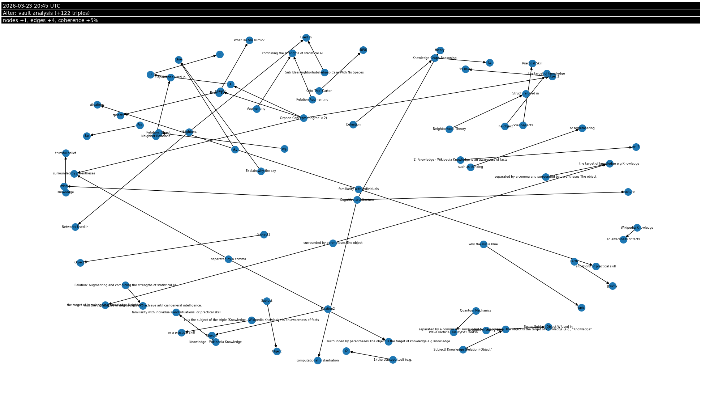](graph-2026-03-23-20-45-after-analyze-vault.png) [commit](https://github.com/BoggersTheFish/BoggersTheCIG/commit/dc819c1)

### 2026-03-23 20:45 UTC

**After:** 1 extracts, 0 merges — nodes +0, edges +0, coherence +0%

[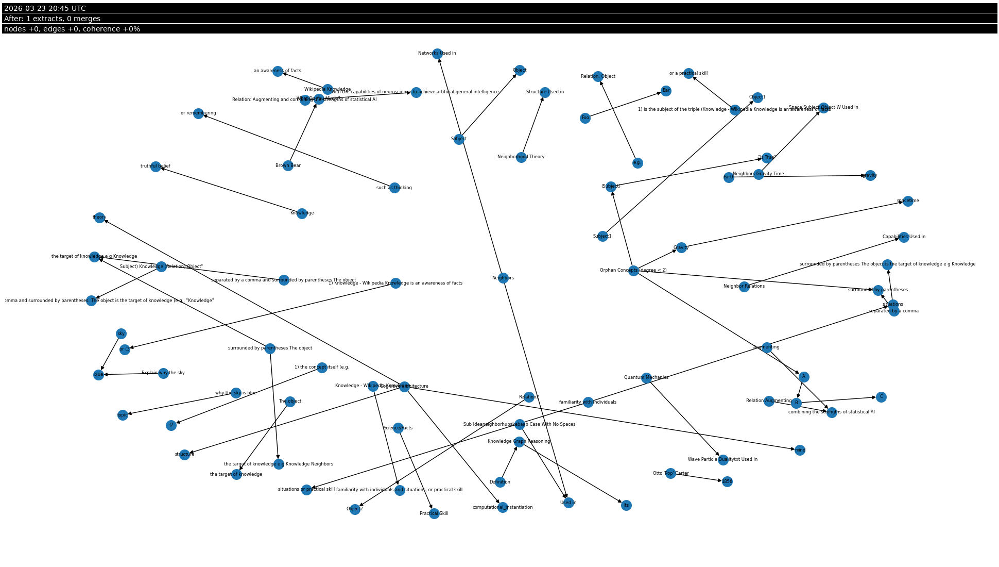](graph-2026-03-23-20-45-extract-subideas.png) [commit](https://github.com/BoggersTheFish/BoggersTheCIG/commit/dc819c1)

### 2026-03-23 20:45 UTC

**After:** vault analysis (+122 triples) — nodes +1, edges +4, coherence +5%

 [commit](https://github.com/BoggersTheFish/BoggersTheCIG/commit/dc819c1)

### 2026-03-23 20:45 UTC

**After:** 1 extracts, 0 merges — nodes +0, edges +0, coherence +0%

 [commit](https://github.com/BoggersTheFish/BoggersTheCIG/commit/dc819c1)

### 2026-03-23 20:50 UTC

**After:** vault organize (1 moves) — nodes +0, edges +0, coherence +0%

[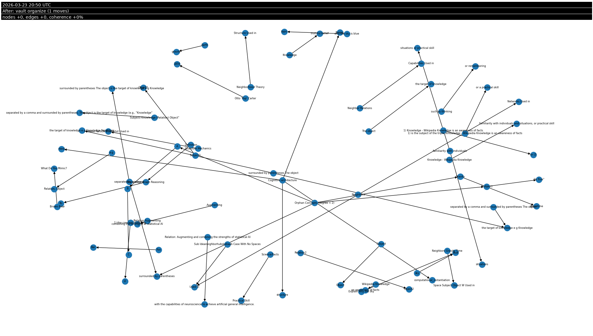](graph-2026-03-23-20-50-after-organize.png) [commit](https://github.com/BoggersTheFish/BoggersTheCIG/commit/dc819c1)

### 2026-03-23 20:50 UTC

**After:** 0 extracts, 1 merges — nodes +0, edges +0, coherence +0%

[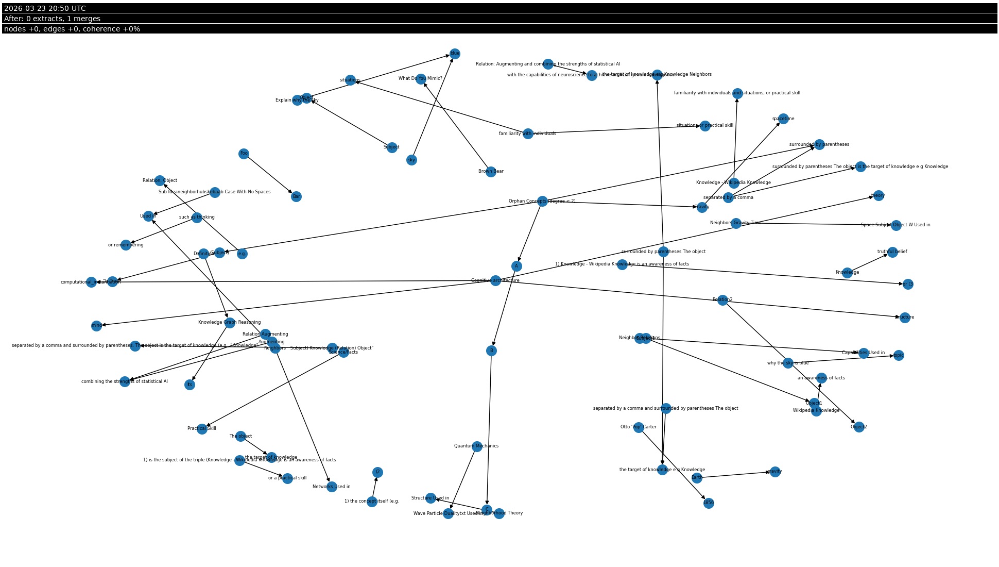](graph-2026-03-23-20-50-extract-subideas.png) [commit](https://github.com/BoggersTheFish/BoggersTheCIG/commit/dc819c1)

### 2026-03-23 20:50 UTC

**After:** 2_+2_.md"+Time.md"+comma.md"+eval — nodes +0, edges +0, coherence +0%

[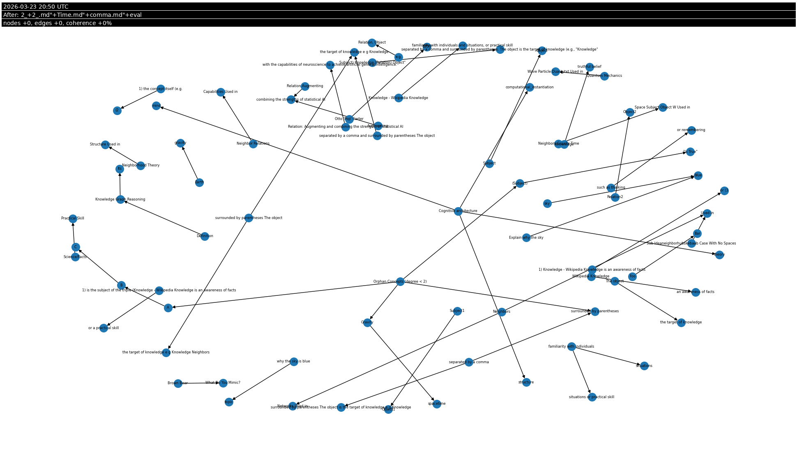](graph-2026-03-23-20-50-self-improve.png) [commit](https://github.com/BoggersTheFish/BoggersTheCIG/commit/dc819c1)

### 2026-03-23 20:54 UTC

**After:** vault organize (2 moves) — nodes +0, edges +0, coherence +0%

[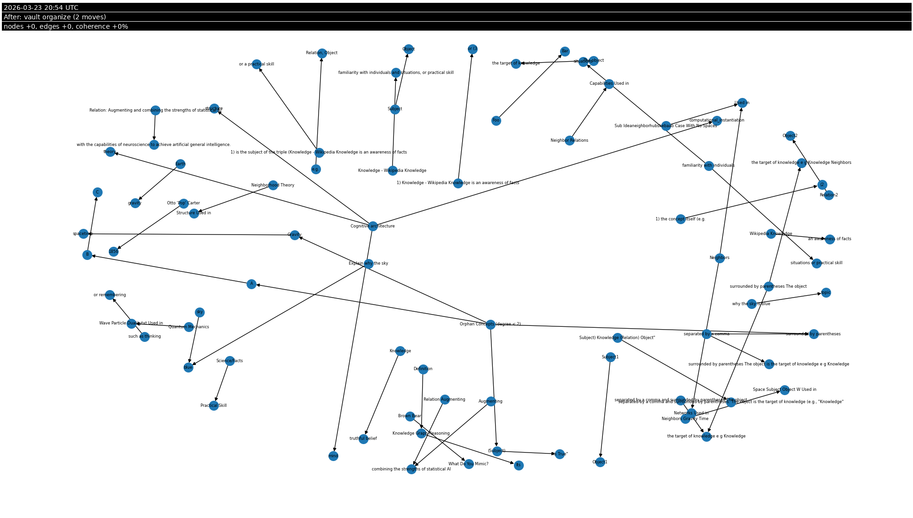](graph-2026-03-23-20-54-after-organize.png) [commit](https://github.com/BoggersTheFish/BoggersTheCIG/commit/dc819c1)

### 2026-03-23 20:54 UTC

**After:** 1 extracts, 0 merges — nodes +0, edges +0, coherence +0%

[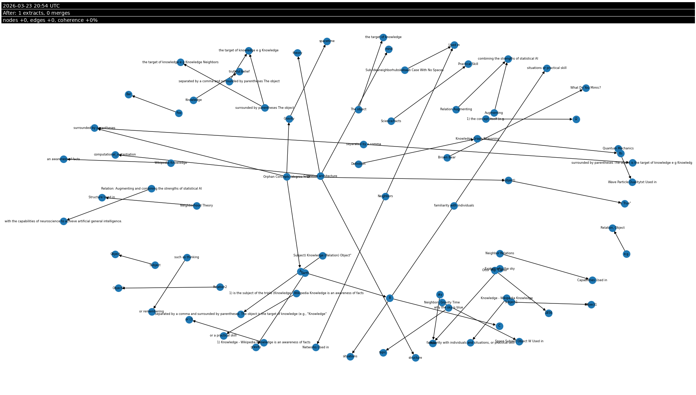](graph-2026-03-23-20-54-extract-subideas.png) [commit](https://github.com/BoggersTheFish/BoggersTheCIG/commit/dc819c1)

### 2026-03-23 20:54 UTC

**After:** 2_+2_.md"+Time.md"+_3.md"+comma.md" — nodes +0, edges +0, coherence +0%

[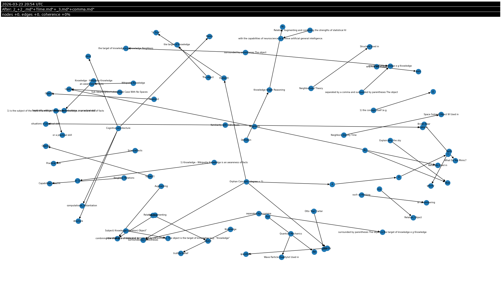](graph-2026-03-23-20-54-self-improve.png) [commit](https://github.com/BoggersTheFish/BoggersTheCIG/commit/dc819c1)

### 2026-03-24 02:07 UTC

**After:** vault analysis (+121 triples) — nodes +83, edges +48, coherence +14005%

[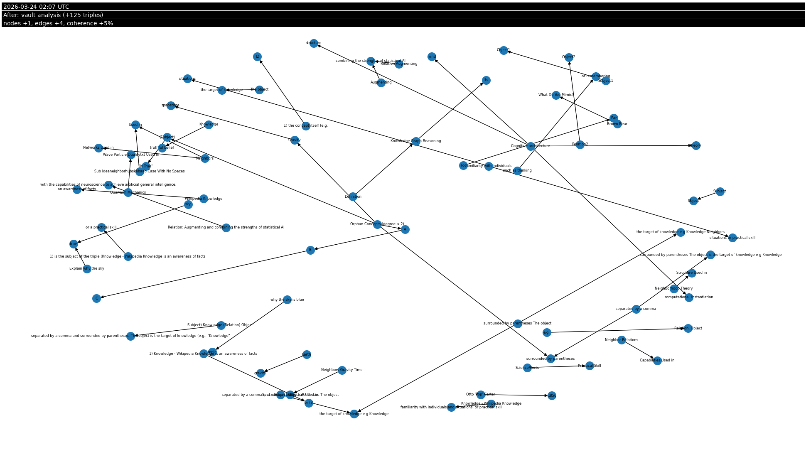](graph-2026-03-24-02-07-after-analyze-vault.png) [commit](https://github.com/BoggersTheFish/BoggersTheCIG/commit/0491d11)

### 2026-03-24 02:07 UTC

**After:** vault analysis (+125 triples) — nodes +1, edges +4, coherence +5%

 [commit](https://github.com/BoggersTheFish/BoggersTheCIG/commit/0491d11)

### 2026-03-24 02:11 UTC

**After:** vault organize (1 moves) — nodes +0, edges +0, coherence +0%

[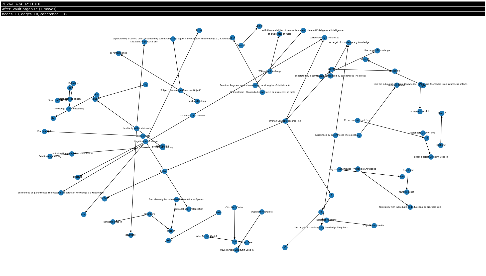](graph-2026-03-24-02-11-after-organize.png) [commit](https://github.com/BoggersTheFish/BoggersTheCIG/commit/0491d11)

### 2026-03-24 02:11 UTC

**After:** 1 extracts, 0 merges — nodes +0, edges +0, coherence +0%

[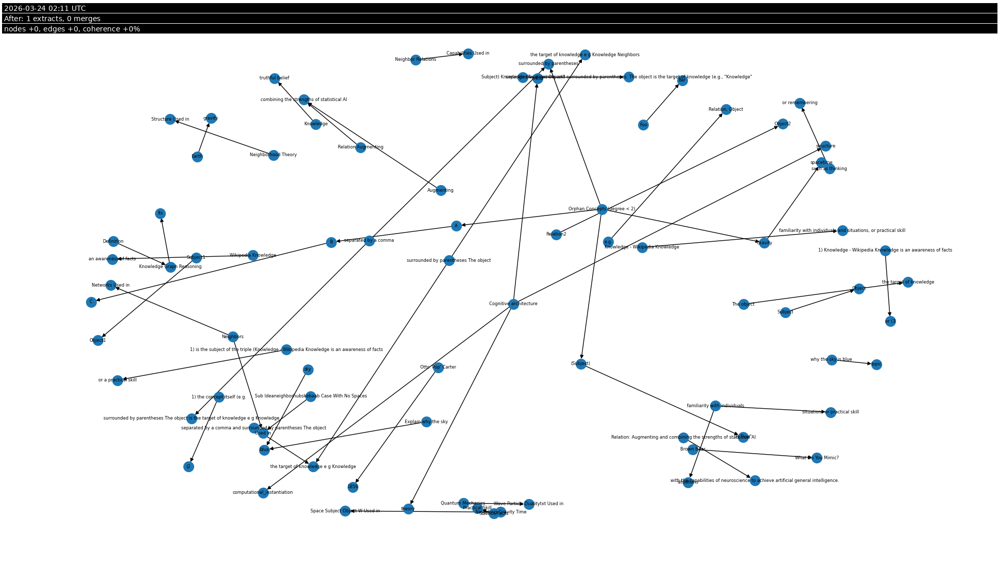](graph-2026-03-24-02-11-extract-subideas.png) [commit](https://github.com/BoggersTheFish/BoggersTheCIG/commit/0491d11)

### 2026-03-24 02:11 UTC

**After:** 2_+2_.md"+Time.md"+comma.md"+eval — nodes +0, edges +0, coherence +0%

[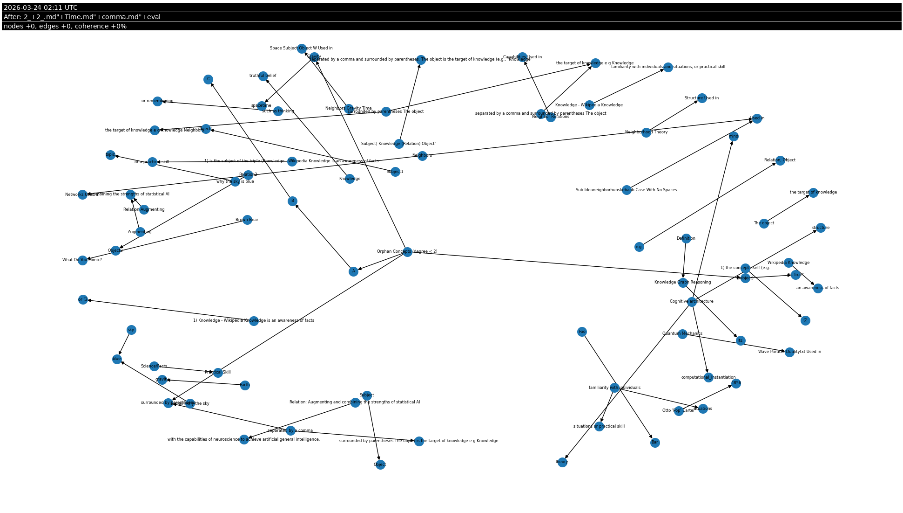](graph-2026-03-24-02-11-self-improve.png) [commit](https://github.com/BoggersTheFish/BoggersTheCIG/commit/0491d11)

### 2026-03-24 02:16 UTC

**After:** vault organize (0 moves) — nodes +0, edges +0, coherence +0%

[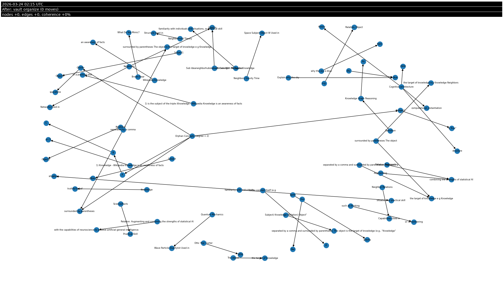](graph-2026-03-24-02-15-after-organize.png) [commit](https://github.com/BoggersTheFish/BoggersTheCIG/commit/0491d11)

### 2026-03-24 02:16 UTC

**After:** 0 extracts, 1 merges — nodes +0, edges +0, coherence +0%

[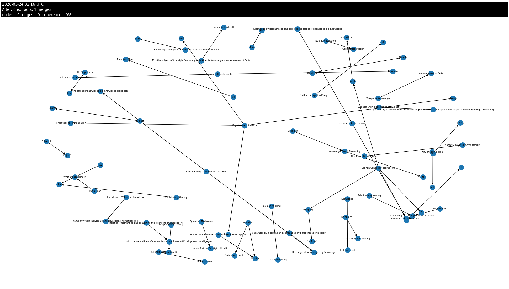](graph-2026-03-24-02-16-extract-subideas.png) [commit](https://github.com/BoggersTheFish/BoggersTheCIG/commit/0491d11)

### 2026-03-24 02:16 UTC

**After:** 2_+2_.md"+Time.md"+comma.md"+individuals.md" — nodes +0, edges +0, coherence +0%

[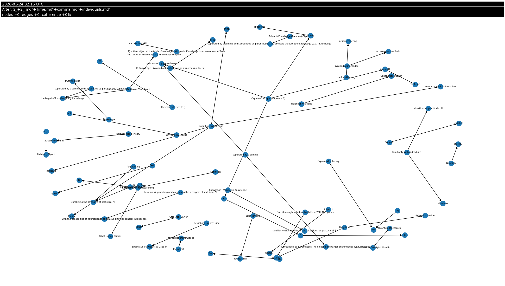](graph-2026-03-24-02-16-self-improve.png) [commit](https://github.com/BoggersTheFish/BoggersTheCIG/commit/0491d11)

### 2026-03-24 06:06 UTC

**After:** external ingest (+2 triples) — nodes +6, edges +3, coherence +199900%

[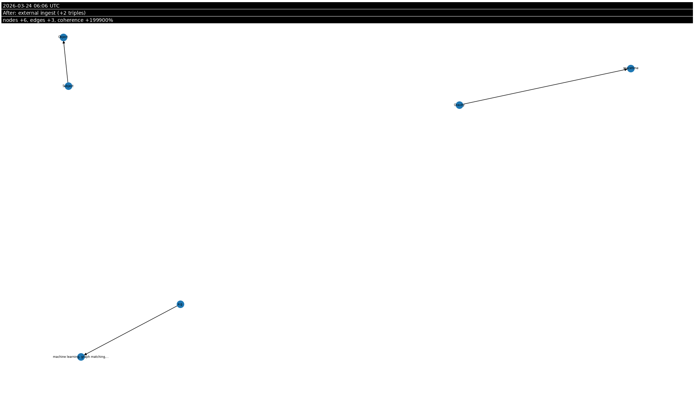](graph-2026-03-24-06-06-after-ingest.png) [commit](https://github.com/BoggersTheFish/BoggersTheCIG/commit/de26d30)

### 2026-03-24 06:06 UTC

**After:** vault analysis (+123 triples) — nodes +79, edges +47, coherence -92%

[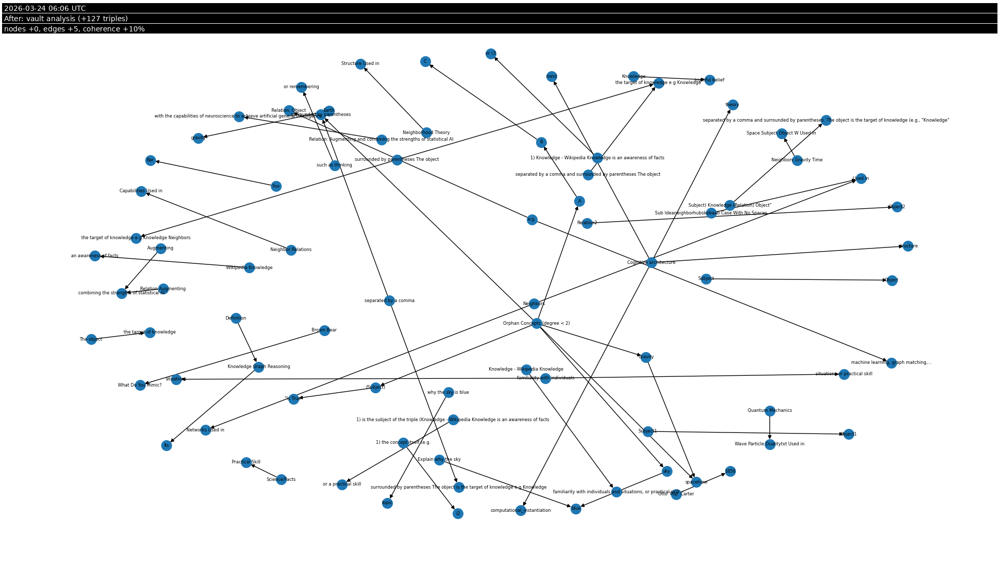](graph-2026-03-24-06-06-after-analyze-vault.png) [commit](https://github.com/BoggersTheFish/BoggersTheCIG/commit/de26d30)

### 2026-03-24 06:06 UTC

**After:** 1 extracts, 0 merges — nodes +0, edges +0, coherence +0%

[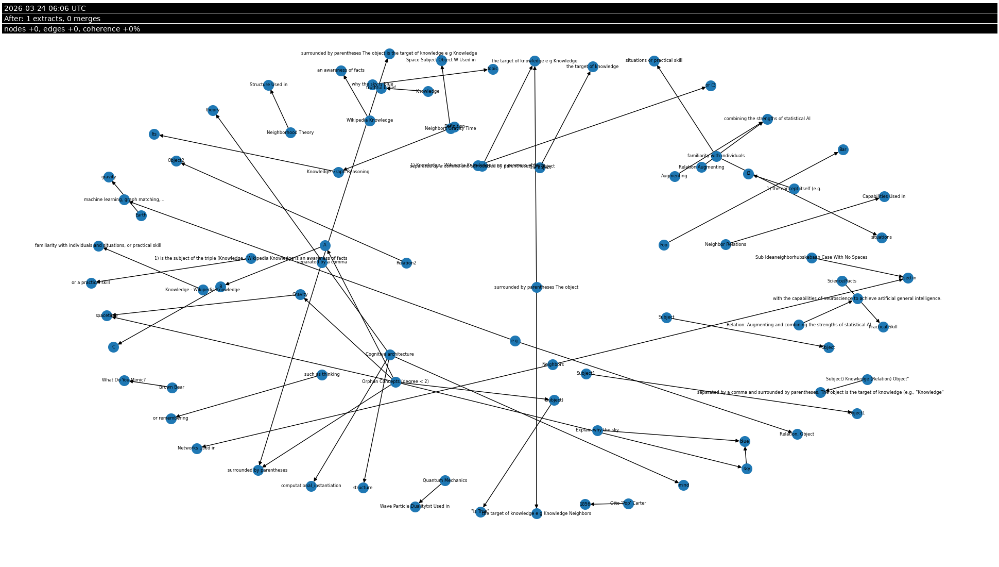](graph-2026-03-24-06-06-extract-subideas.png) [commit](https://github.com/BoggersTheFish/BoggersTheCIG/commit/de26d30)

### 2026-03-24 06:06 UTC

**After:** vault analysis (+127 triples) — nodes +0, edges +5, coherence +10%

 [commit](https://github.com/BoggersTheFish/BoggersTheCIG/commit/de26d30)

### 2026-03-24 06:06 UTC

**After:** 1 extracts, 0 merges — nodes +0, edges +0, coherence +0%

 [commit](https://github.com/BoggersTheFish/BoggersTheCIG/commit/de26d30)

### 2026-03-24 06:11 UTC

**After:** vault organize (0 moves) — nodes +0, edges +0, coherence +0%

[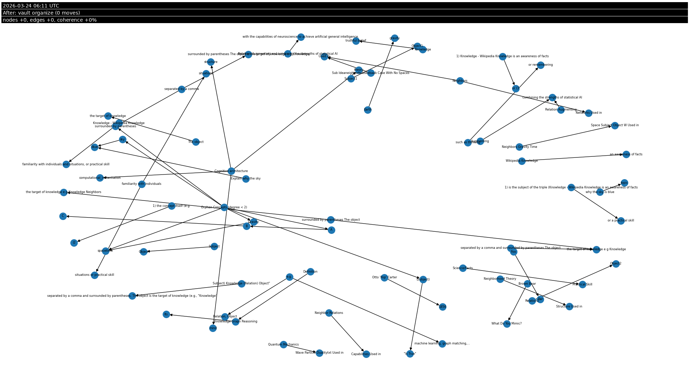](graph-2026-03-24-06-11-after-organize.png) [commit](https://github.com/BoggersTheFish/BoggersTheCIG/commit/de26d30)

### 2026-03-24 06:11 UTC

**After:** 0 extracts, 1 merges — nodes +0, edges +0, coherence +0%

[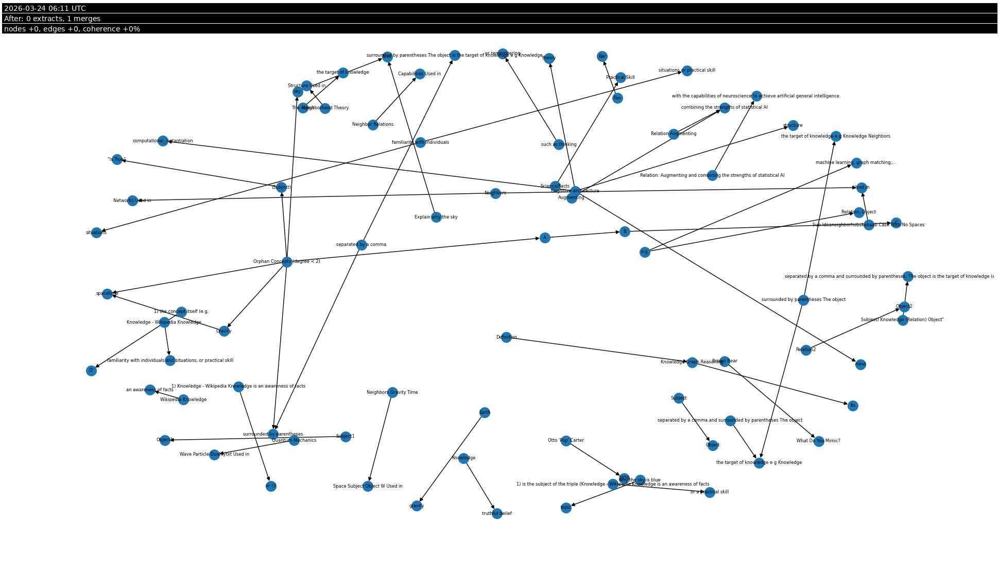](graph-2026-03-24-06-11-extract-subideas.png) [commit](https://github.com/BoggersTheFish/BoggersTheCIG/commit/de26d30)

### 2026-03-24 06:11 UTC

**After:** 2_+2_.md"+Time.md"+eval+matching____.md" — nodes +0, edges +0, coherence +0%

[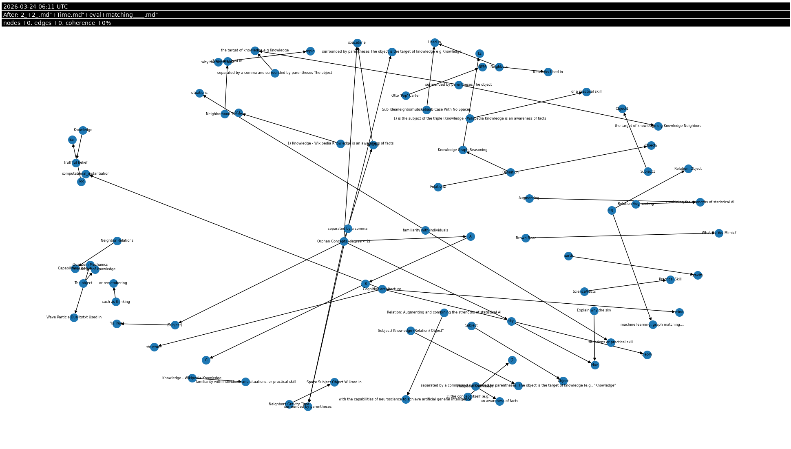](graph-2026-03-24-06-11-self-improve.png) [commit](https://github.com/BoggersTheFish/BoggersTheCIG/commit/de26d30)

### 2026-03-24 06:15 UTC

**After:** vault organize (1 moves) — nodes +0, edges +0, coherence +0%

[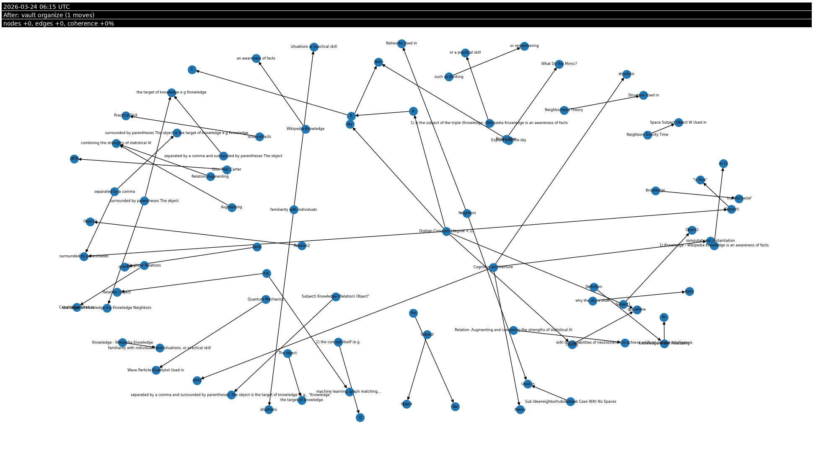](graph-2026-03-24-06-15-after-organize.png) [commit](https://github.com/BoggersTheFish/BoggersTheCIG/commit/de26d30)

### 2026-03-24 06:15 UTC

**After:** 1 extracts, 0 merges — nodes +0, edges +0, coherence +0%

[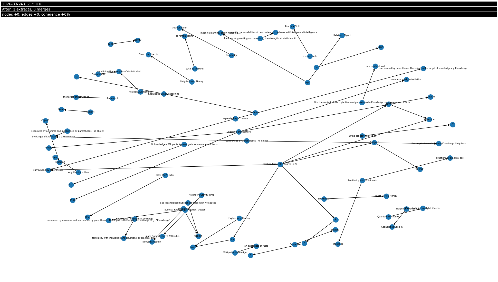](graph-2026-03-24-06-15-extract-subideas.png) [commit](https://github.com/BoggersTheFish/BoggersTheCIG/commit/de26d30)

### 2026-03-24 06:15 UTC

**After:** 2_+2_.md"+Time.md"+eval+matching____.md" — nodes +0, edges +0, coherence +0%

[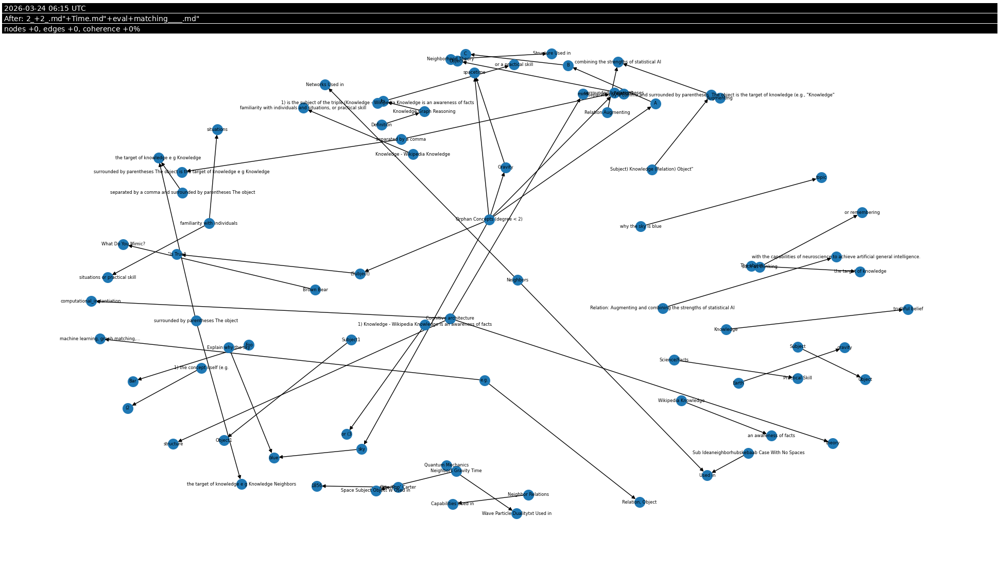](graph-2026-03-24-06-15-self-improve.png) [commit](https://github.com/BoggersTheFish/BoggersTheCIG/commit/de26d30)

### 2026-03-24 10:58 UTC

**After:** vault analysis (+122 triples) — nodes +84, edges +49, coherence +13956%

[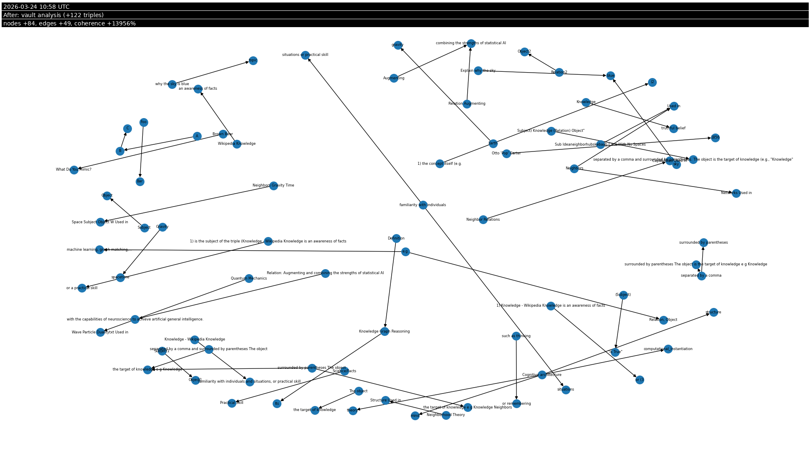](graph-2026-03-24-10-58-after-analyze-vault.png) [commit](https://github.com/BoggersTheFish/BoggersTheCIG/commit/6b84010)

### 2026-03-24 10:59 UTC

**After:** vault analysis (+126 triples) — nodes +1, edges +4, coherence +5%

[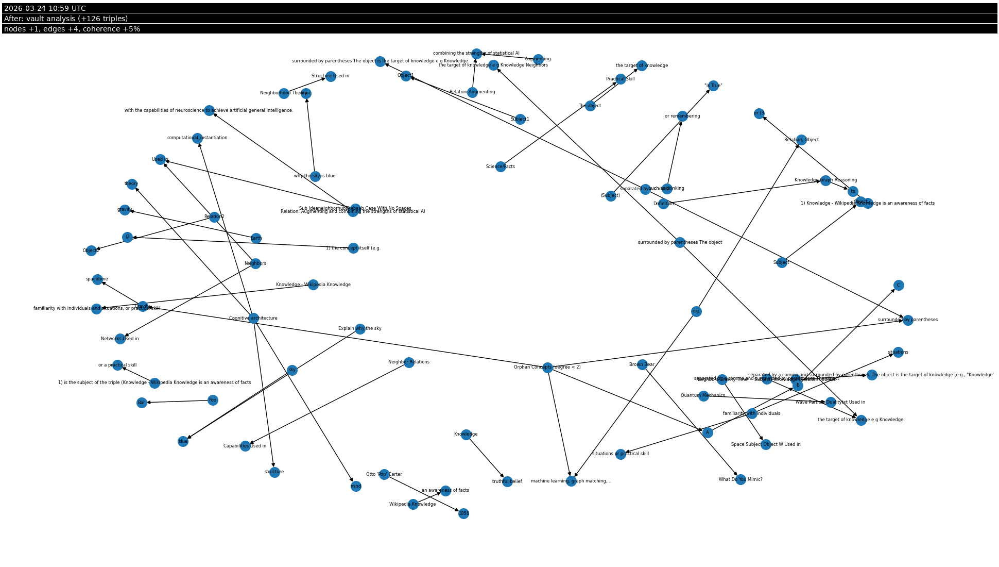](graph-2026-03-24-10-59-after-analyze-vault.png) [commit](https://github.com/BoggersTheFish/BoggersTheCIG/commit/6b84010)

### 2026-03-24 11:02 UTC

**After:** vault organize (0 moves) — nodes +0, edges +0, coherence +0%

[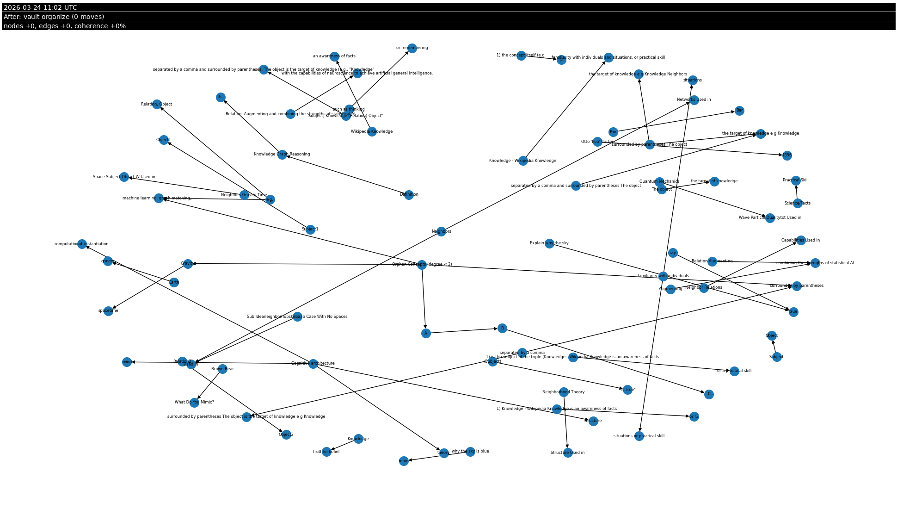](graph-2026-03-24-11-02-after-organize.png) [commit](https://github.com/BoggersTheFish/BoggersTheCIG/commit/6b84010)

### 2026-03-24 11:02 UTC

**After:** 1 extracts, 0 merges — nodes +0, edges +0, coherence +0%

[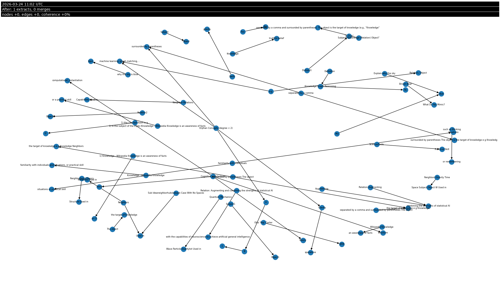](graph-2026-03-24-11-02-extract-subideas.png) [commit](https://github.com/BoggersTheFish/BoggersTheCIG/commit/6b84010)

### 2026-03-24 11:02 UTC

**After:** 2_+2_.md"+Carter.md"+eval+obsidian — nodes +0, edges +0, coherence +0%

[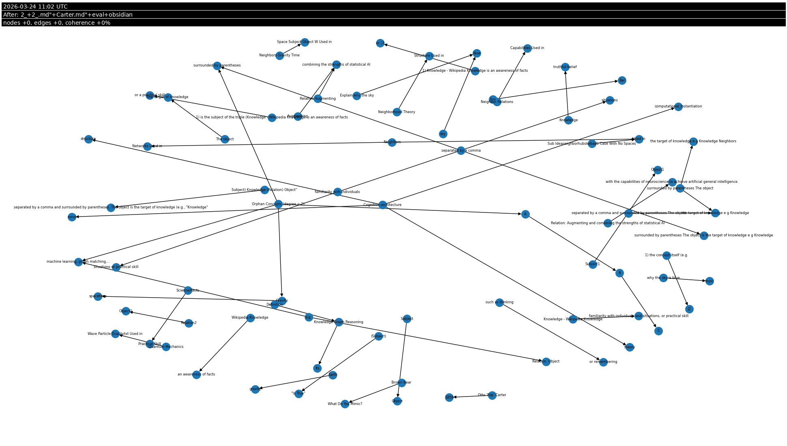](graph-2026-03-24-11-02-self-improve.png) [commit](https://github.com/BoggersTheFish/BoggersTheCIG/commit/6b84010)

### 2026-03-24 11:06 UTC

**After:** vault organize (0 moves) — nodes +0, edges +0, coherence +0%

[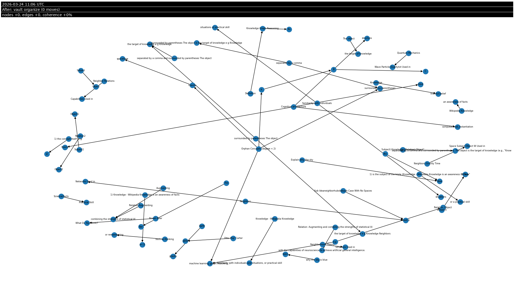](graph-2026-03-24-11-06-after-organize.png) [commit](https://github.com/BoggersTheFish/BoggersTheCIG/commit/6b84010)

### 2026-03-24 11:06 UTC

**After:** 0 extracts, 1 merges — nodes +0, edges +0, coherence +0%

[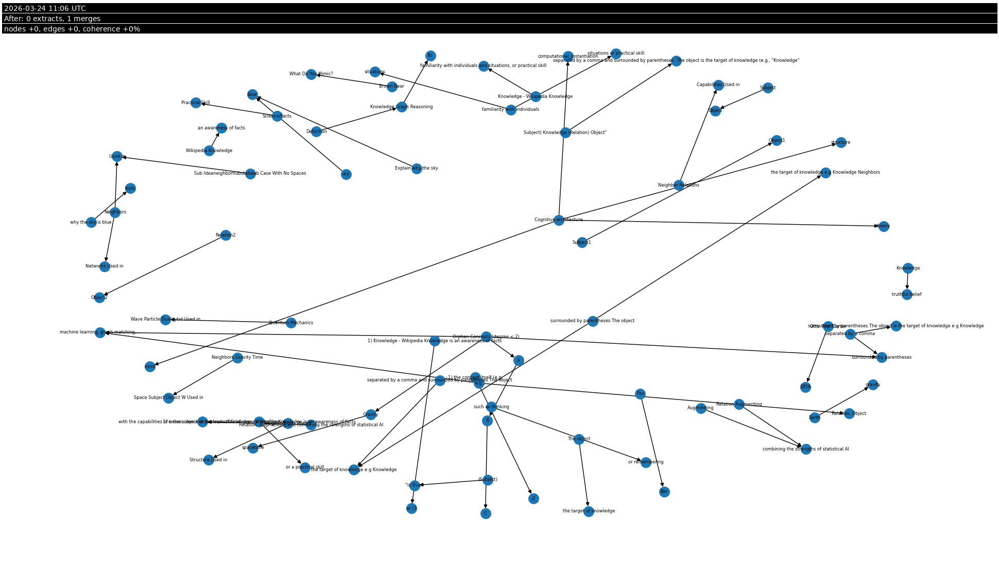](graph-2026-03-24-11-06-extract-subideas.png) [commit](https://github.com/BoggersTheFish/BoggersTheCIG/commit/6b84010)

### 2026-03-24 11:06 UTC

**After:** 2_+2_.md"+Carter.md"+eval+obsidian — nodes +0, edges +0, coherence +0%

[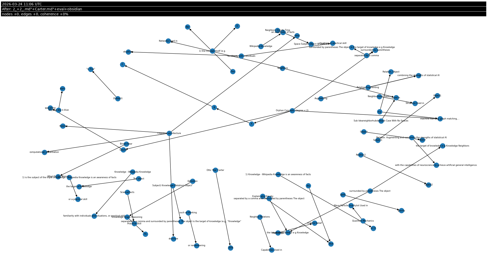](graph-2026-03-24-11-06-self-improve.png) [commit](https://github.com/BoggersTheFish/BoggersTheCIG/commit/6b84010)

### 2026-03-24 16:13 UTC

**After:** external ingest (+1 triples) — nodes +4, edges +2, coherence +333233%

[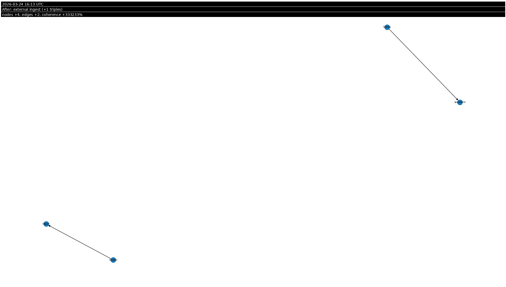](graph-2026-03-24-16-13-after-ingest.png) [commit](https://github.com/BoggersTheFish/BoggersTheCIG/commit/00b81d6)

### 2026-03-24 16:13 UTC

**After:** vault analysis (+125 triples) — nodes +82, edges +52, coherence -95%

[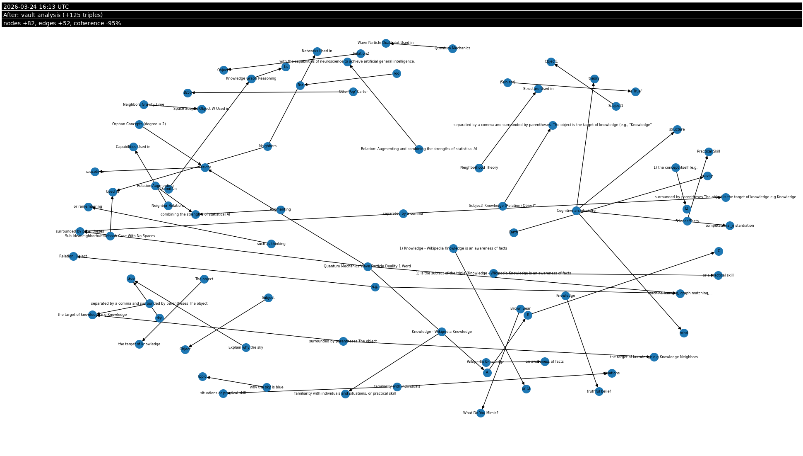](graph-2026-03-24-16-13-after-analyze-vault.png) [commit](https://github.com/BoggersTheFish/BoggersTheCIG/commit/00b81d6)

### 2026-03-24 16:14 UTC

**After:** 1 extracts, 0 merges — nodes +0, edges +0, coherence +0%

[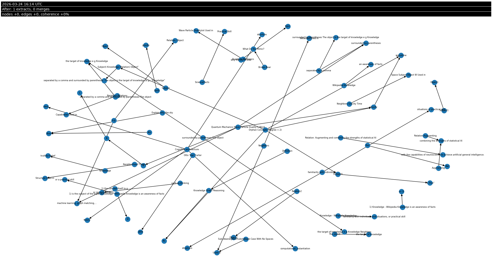](graph-2026-03-24-16-14-extract-subideas.png) [commit](https://github.com/BoggersTheFish/BoggersTheCIG/commit/00b81d6)

### 2026-03-24 16:14 UTC

**After:** vault analysis (+124 triples) — nodes +0, edges +4, coherence +7%

[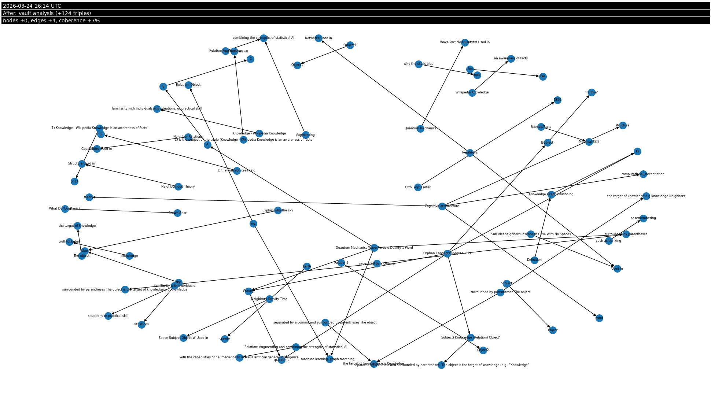](graph-2026-03-24-16-14-after-analyze-vault.png) [commit](https://github.com/BoggersTheFish/BoggersTheCIG/commit/00b81d6)

### 2026-03-24 16:14 UTC

**After:** 1 extracts, 0 merges — nodes +0, edges +0, coherence +0%

 [commit](https://github.com/BoggersTheFish/BoggersTheCIG/commit/00b81d6)

### 2026-03-24 16:17 UTC

**After:** vault organize (0 moves) — nodes +0, edges +0, coherence +0%

[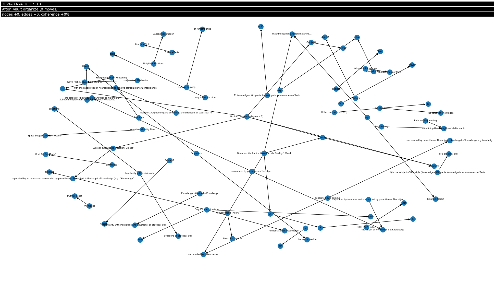](graph-2026-03-24-16-17-after-organize.png) [commit](https://github.com/BoggersTheFish/BoggersTheCIG/commit/00b81d6)

### 2026-03-24 16:17 UTC

**After:** 0 extracts, 1 merges — nodes +0, edges +0, coherence +0%

[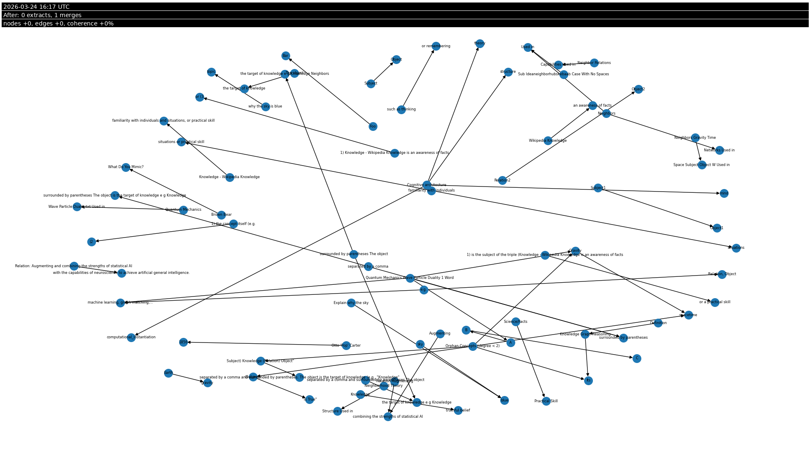](graph-2026-03-24-16-17-extract-subideas.png) [commit](https://github.com/BoggersTheFish/BoggersTheCIG/commit/00b81d6)

### 2026-03-24 16:17 UTC

**After:** 2_.md"+Word.md"+eval+object.md"+obsidian — nodes +0, edges +0, coherence +0%

[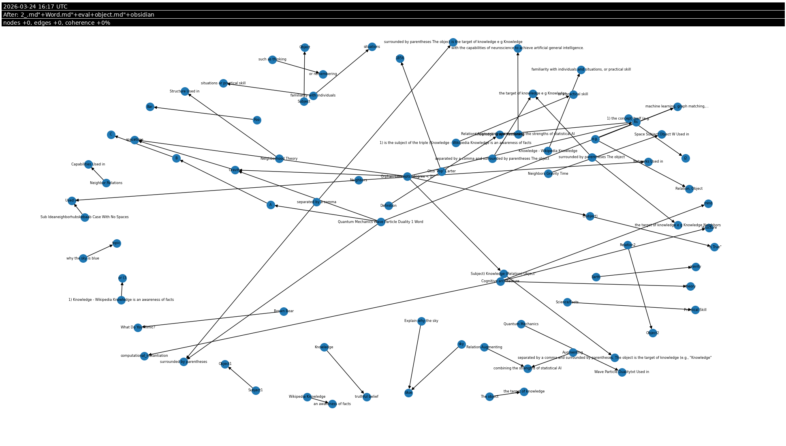](graph-2026-03-24-16-17-self-improve.png) [commit](https://github.com/BoggersTheFish/BoggersTheCIG/commit/00b81d6)

### 2026-03-24 16:21 UTC

**After:** vault organize (0 moves) — nodes +0, edges +0, coherence +0%

[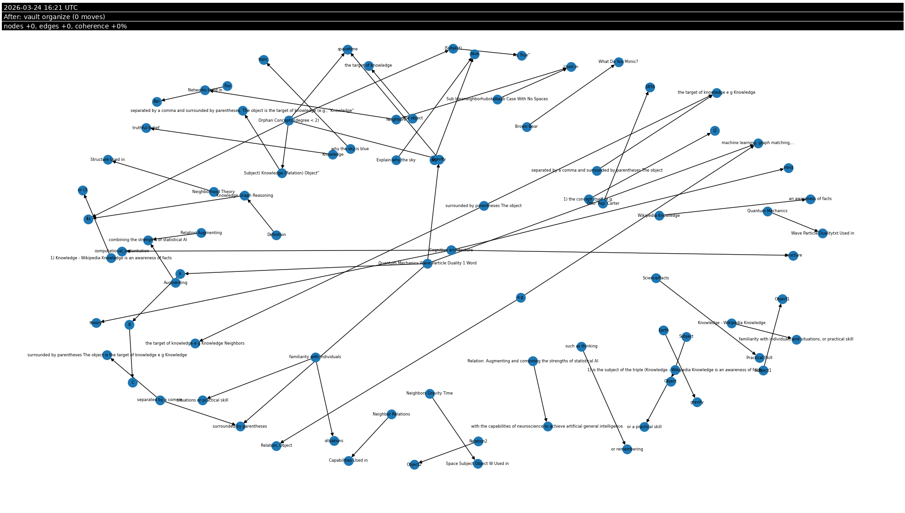](graph-2026-03-24-16-21-after-organize.png) [commit](https://github.com/BoggersTheFish/BoggersTheCIG/commit/00b81d6)

### 2026-03-24 16:21 UTC

**After:** 0 extracts, 1 merges — nodes +0, edges +0, coherence +0%

[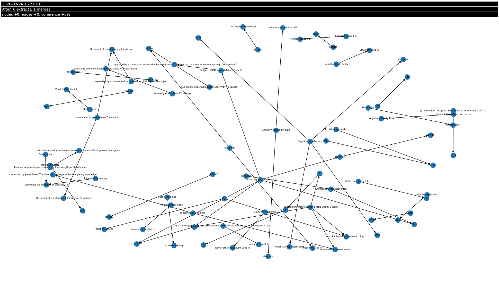](graph-2026-03-24-16-21-extract-subideas.png) [commit](https://github.com/BoggersTheFish/BoggersTheCIG/commit/00b81d6)

### 2026-03-24 16:21 UTC

**After:** 2_.md"+Word.md"+eval+object.md"+obsidian — nodes +0, edges +0, coherence +0%

[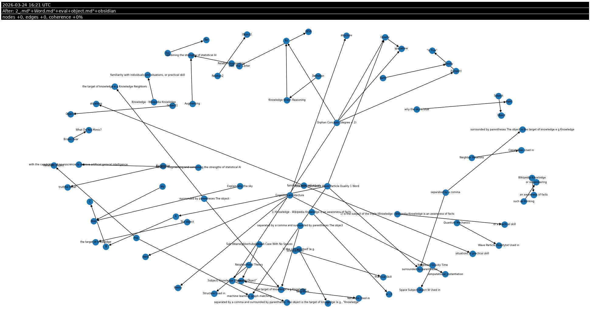](graph-2026-03-24-16-21-self-improve.png) [commit](https://github.com/BoggersTheFish/BoggersTheCIG/commit/00b81d6)

### 2026-03-24 20:48 UTC

**After:** external ingest (+3 triples) — nodes +7, edges +4, coherence +190376%

[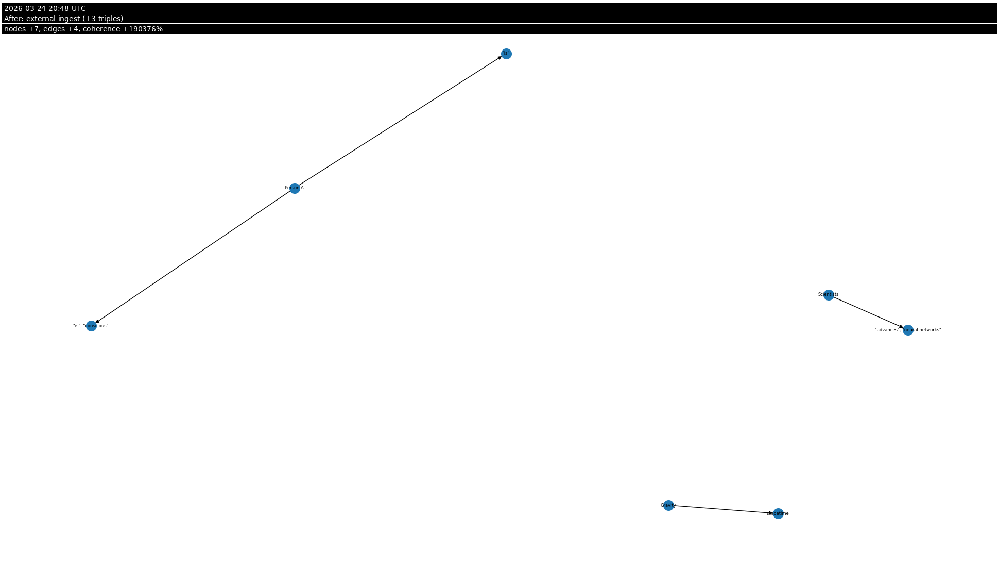](graph-2026-03-24-20-48-after-ingest.png) [commit](https://github.com/BoggersTheFish/BoggersTheCIG/commit/fe051c1)

### 2026-03-24 20:48 UTC

**After:** vault analysis (+121 triples) — nodes +83, edges +50, coherence -92%

[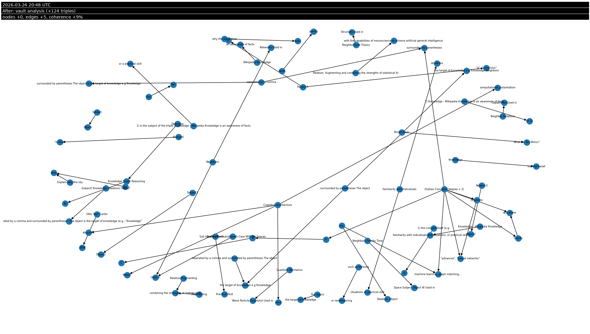](graph-2026-03-24-20-48-after-analyze-vault.png) [commit](https://github.com/BoggersTheFish/BoggersTheCIG/commit/fe051c1)

### 2026-03-24 20:48 UTC

**After:** vault analysis (+124 triples) — nodes +0, edges +5, coherence +9%

 [commit](https://github.com/BoggersTheFish/BoggersTheCIG/commit/fe051c1)

### 2026-03-24 20:53 UTC

**After:** vault organize (2 moves) — nodes +0, edges +0, coherence +0%

[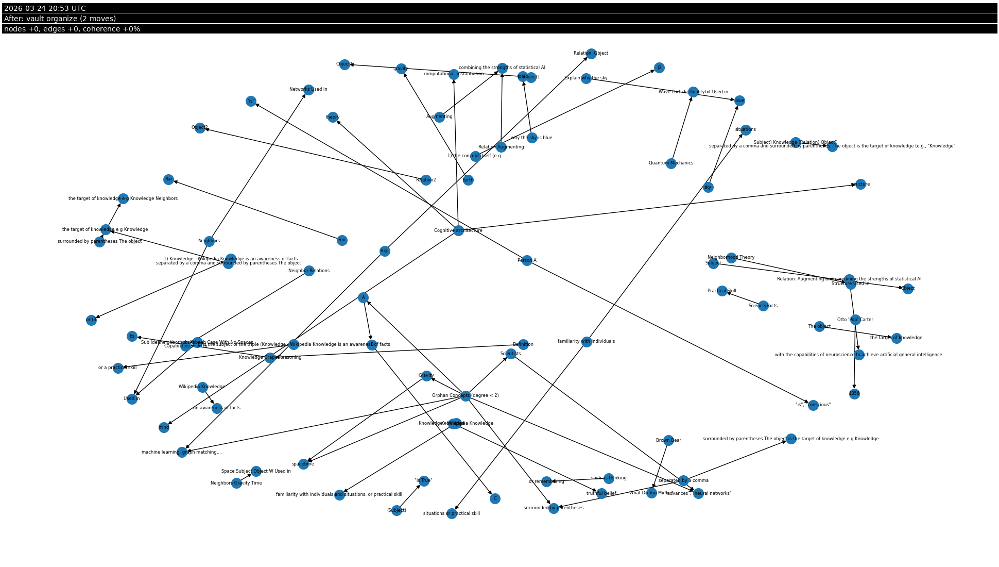](graph-2026-03-24-20-53-after-organize.png) [commit](https://github.com/BoggersTheFish/BoggersTheCIG/commit/fe051c1)

### 2026-03-24 20:53 UTC

**After:** 1 extracts, 0 merges — nodes +0, edges +0, coherence +0%

[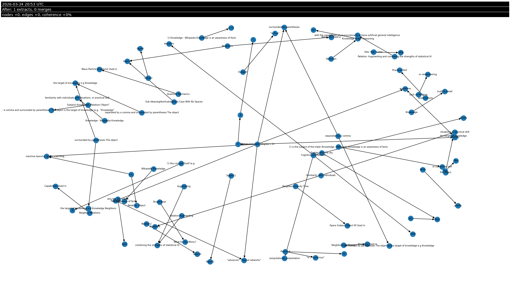](graph-2026-03-24-20-53-extract-subideas.png) [commit](https://github.com/BoggersTheFish/BoggersTheCIG/commit/fe051c1)

### 2026-03-24 20:53 UTC

**After:** 2_+2_.md"+A.md"+Word.md"+_conscious_.md" — nodes +0, edges +0, coherence +0%

[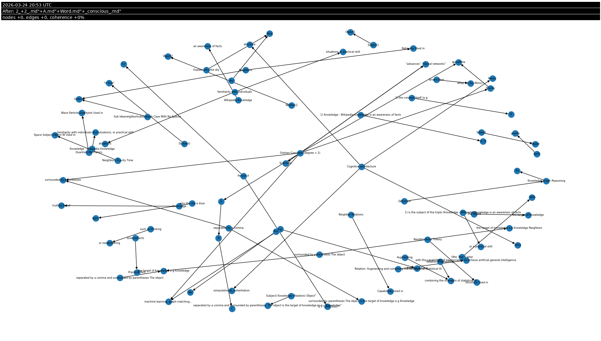](graph-2026-03-24-20-53-self-improve.png) [commit](https://github.com/BoggersTheFish/BoggersTheCIG/commit/fe051c1)

### 2026-03-24 20:57 UTC

**After:** vault organize (2 moves) — nodes +0, edges +0, coherence +0%

[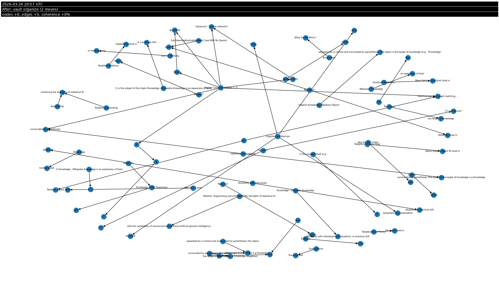](graph-2026-03-24-20-57-after-organize.png) [commit](https://github.com/BoggersTheFish/BoggersTheCIG/commit/fe051c1)

### 2026-03-24 20:57 UTC

**After:** 0 extracts, 1 merges — nodes +0, edges +0, coherence +0%

[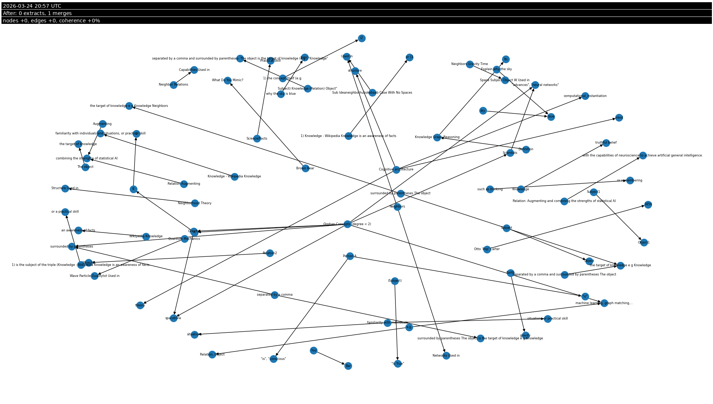](graph-2026-03-24-20-57-extract-subideas.png) [commit](https://github.com/BoggersTheFish/BoggersTheCIG/commit/fe051c1)

### 2026-03-24 20:57 UTC

**After:** 2_+2_.md"+A.md"+Word.md"+_conscious_.md" — nodes +0, edges +0, coherence +0%

[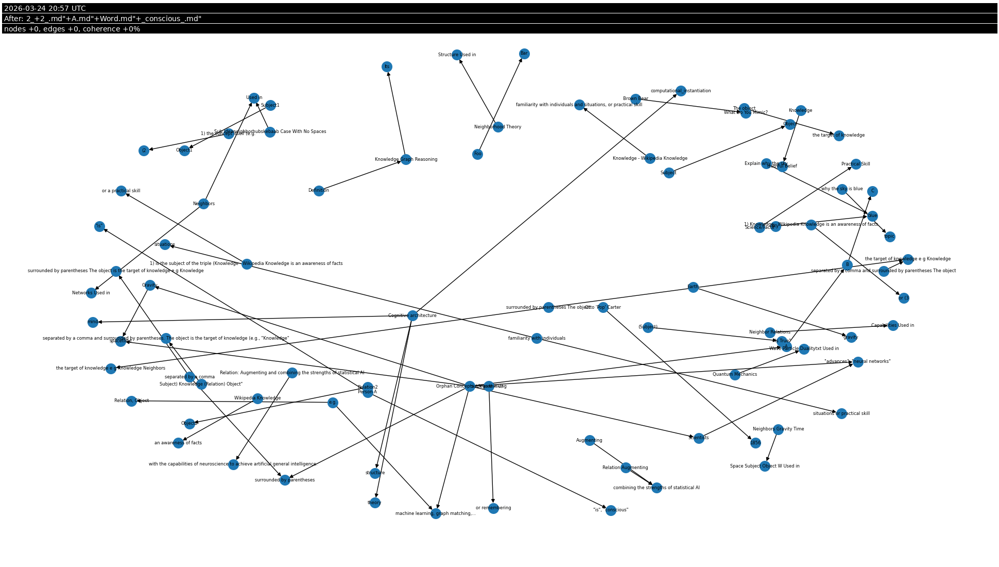](graph-2026-03-24-20-57-self-improve.png) [commit](https://github.com/BoggersTheFish/BoggersTheCIG/commit/fe051c1)

### 2026-03-25 02:13 UTC

**After:** external ingest (+6 triples) — nodes +13, edges +7, coherence +89643%

[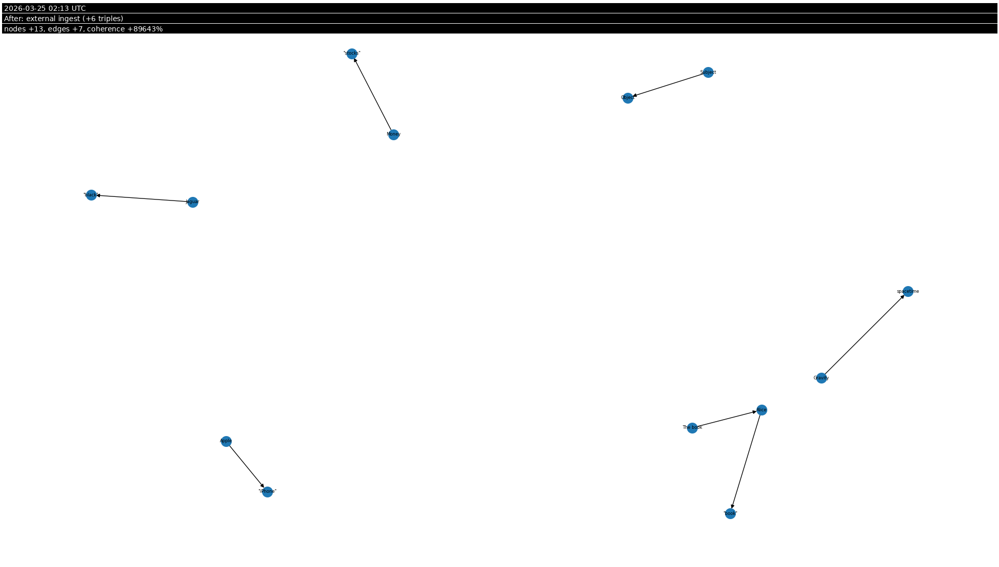](graph-2026-03-25-02-13-after-ingest.png) [commit](https://github.com/BoggersTheFish/BoggersTheCIG/commit/a4b1e00)

### 2026-03-25 02:13 UTC

**After:** vault analysis (+118 triples) — nodes +86, edges +51, coherence -86%

[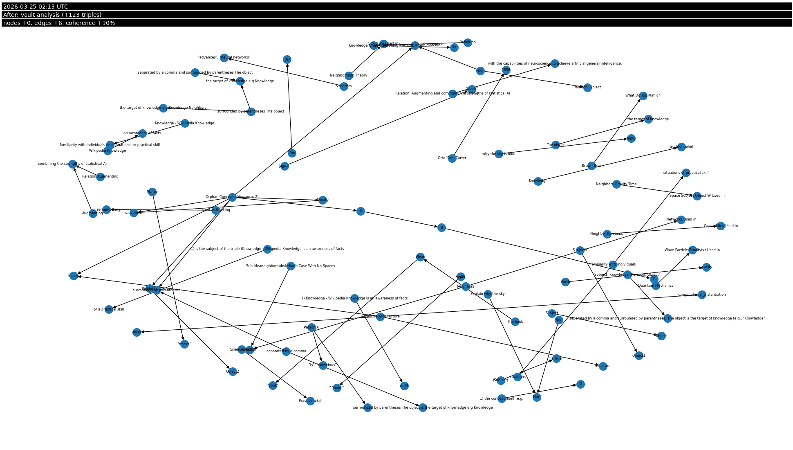](graph-2026-03-25-02-13-after-analyze-vault.png) [commit](https://github.com/BoggersTheFish/BoggersTheCIG/commit/a4b1e00)

### 2026-03-25 02:13 UTC

**After:** 1 extracts, 0 merges — nodes +0, edges +0, coherence +0%

[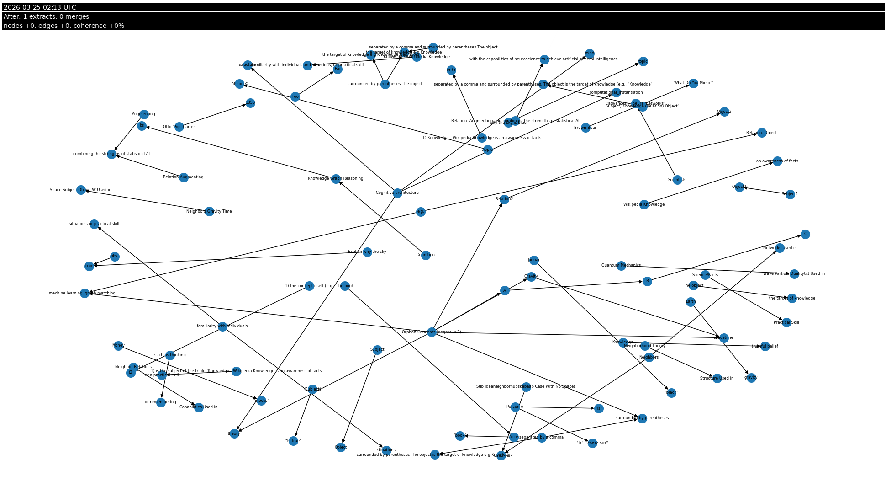](graph-2026-03-25-02-13-extract-subideas.png) [commit](https://github.com/BoggersTheFish/BoggersTheCIG/commit/a4b1e00)

### 2026-03-25 02:13 UTC

**After:** vault analysis (+123 triples) — nodes +0, edges +6, coherence +10%

 [commit](https://github.com/BoggersTheFish/BoggersTheCIG/commit/a4b1e00)

### 2026-03-25 02:13 UTC

**After:** 1 extracts, 0 merges — nodes +0, edges +0, coherence +0%

 [commit](https://github.com/BoggersTheFish/BoggersTheCIG/commit/a4b1e00)

### 2026-03-25 02:18 UTC

**After:** vault organize (1 moves) — nodes +0, edges +0, coherence +0%

[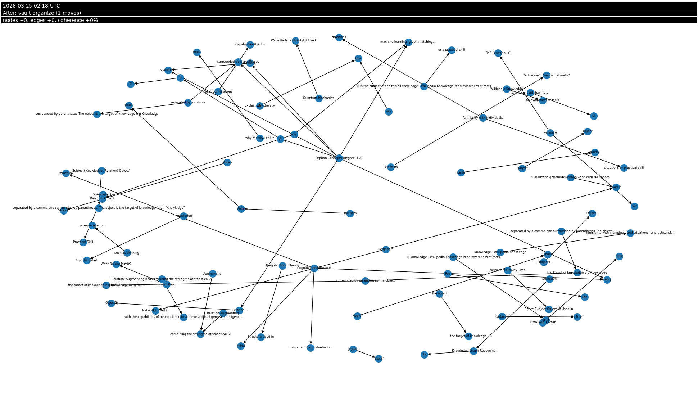](graph-2026-03-25-02-18-after-organize.png) [commit](https://github.com/BoggersTheFish/BoggersTheCIG/commit/a4b1e00)

### 2026-03-25 02:18 UTC

**After:** 2 extracts, 0 merges — nodes +0, edges +0, coherence +0%

[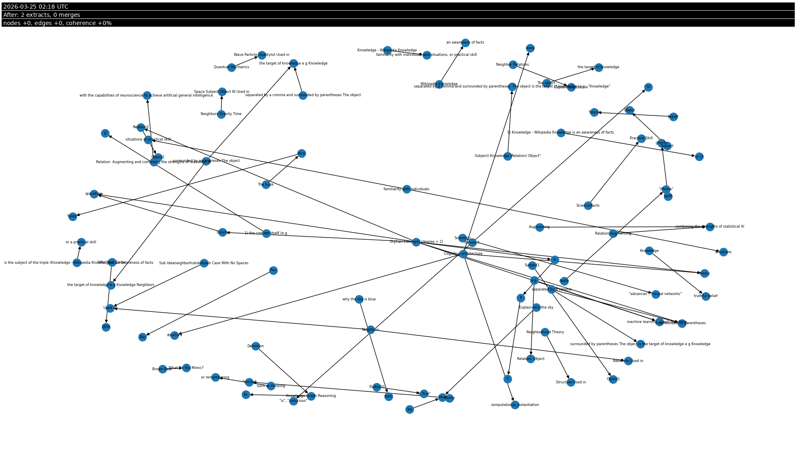](graph-2026-03-25-02-18-extract-subideas.png) [commit](https://github.com/BoggersTheFish/BoggersTheCIG/commit/a4b1e00)

### 2026-03-25 02:18 UTC

**After:** 2_+2_.md"+A.md"+Knowledge.md"+architecture.md" — nodes +0, edges +0, coherence +0%

[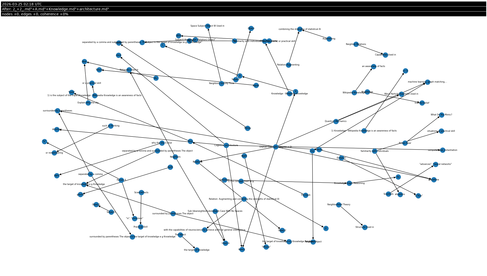](graph-2026-03-25-02-18-self-improve.png) [commit](https://github.com/BoggersTheFish/BoggersTheCIG/commit/a4b1e00)

### 2026-03-25 02:23 UTC

**After:** vault organize (6 moves) — nodes +0, edges +0, coherence +0%

[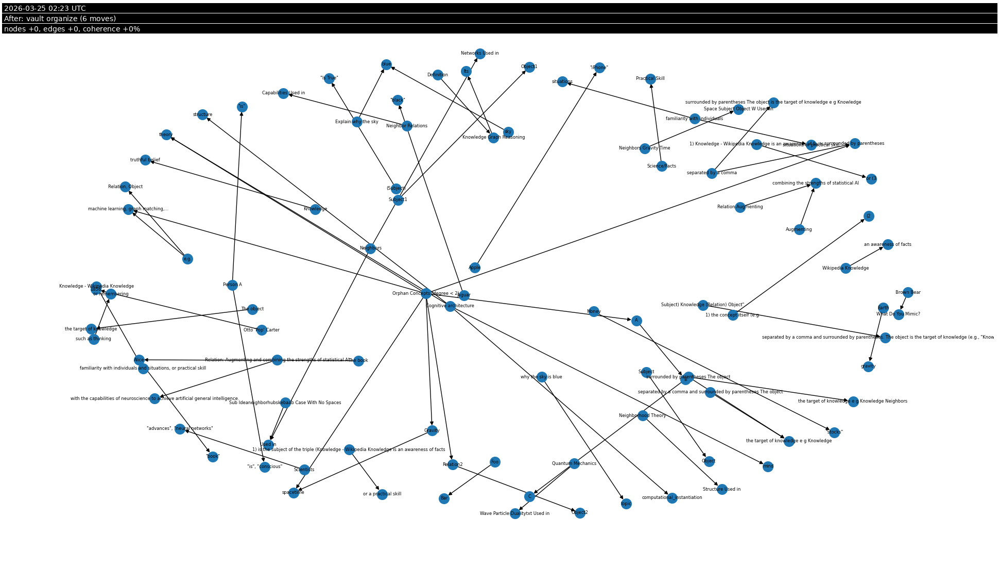](graph-2026-03-25-02-23-after-organize.png) [commit](https://github.com/BoggersTheFish/BoggersTheCIG/commit/a4b1e00)

### 2026-03-25 02:23 UTC

**After:** 1 extracts, 1 merges — nodes +0, edges +0, coherence +0%

[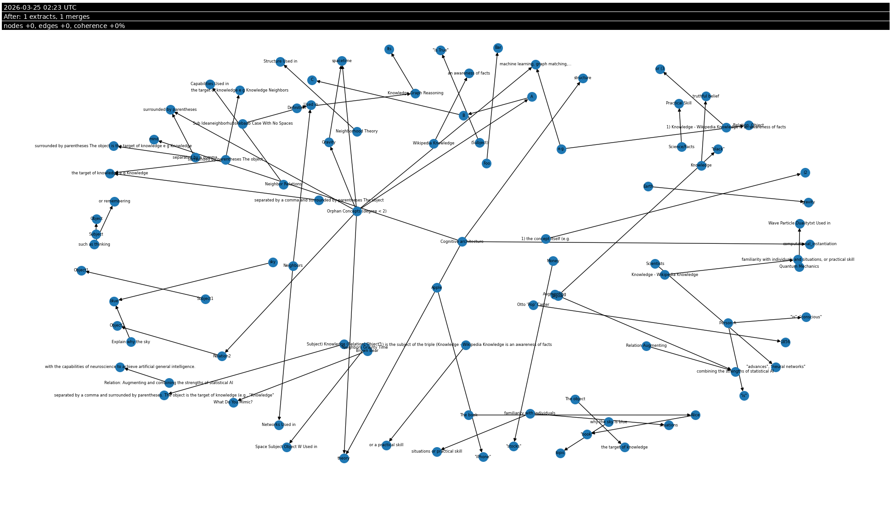](graph-2026-03-25-02-23-extract-subideas.png) [commit](https://github.com/BoggersTheFish/BoggersTheCIG/commit/a4b1e00)

### 2026-03-25 02:23 UTC

**After:** 2_+2_.md"+A.md"+Knowledge.md"+Word.md" — nodes +0, edges +0, coherence +0%

[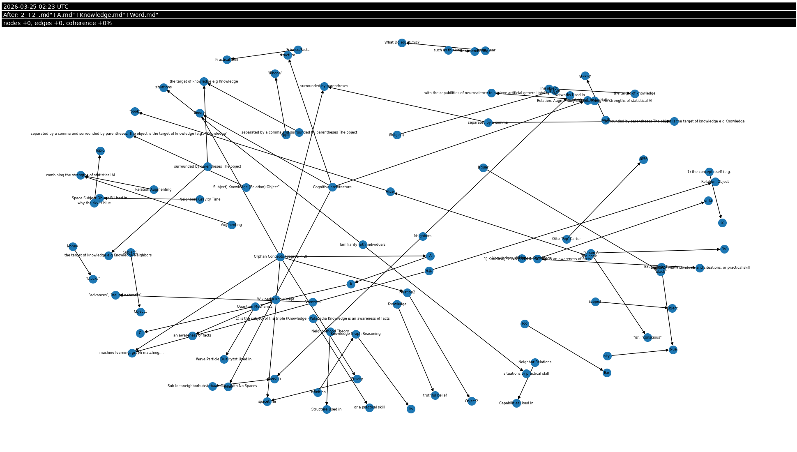](graph-2026-03-25-02-23-self-improve.png) [commit](https://github.com/BoggersTheFish/BoggersTheCIG/commit/a4b1e00)

### 2026-03-25 06:08 UTC

**After:** external ingest (+1 triples) — nodes +4, edges +2, coherence +333233%

[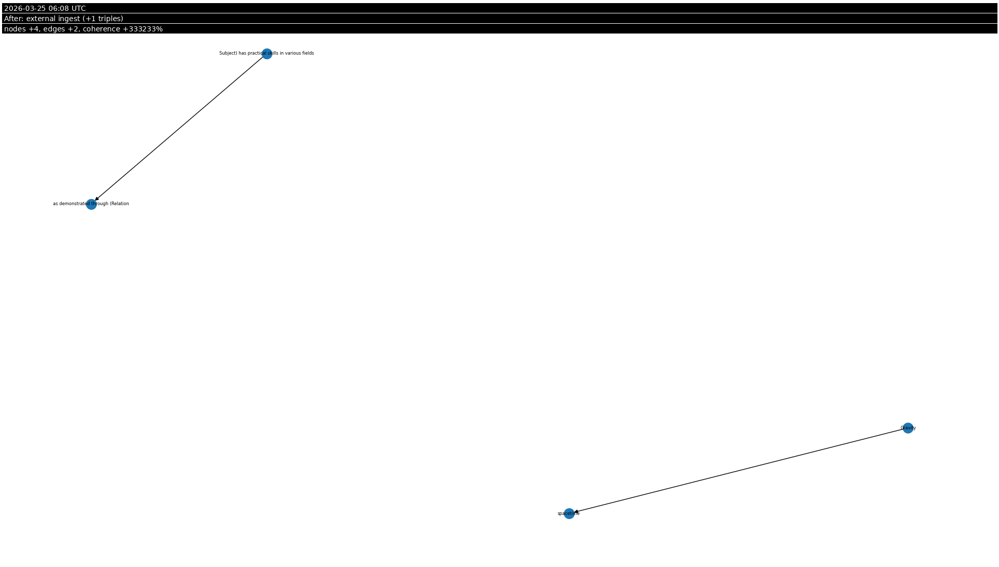](graph-2026-03-25-06-08-after-ingest.png) [commit](https://github.com/BoggersTheFish/BoggersTheCIG/commit/5884ec4)

### 2026-03-25 06:08 UTC

**After:** vault analysis (+121 triples) — nodes +96, edges +57, coherence -96%

[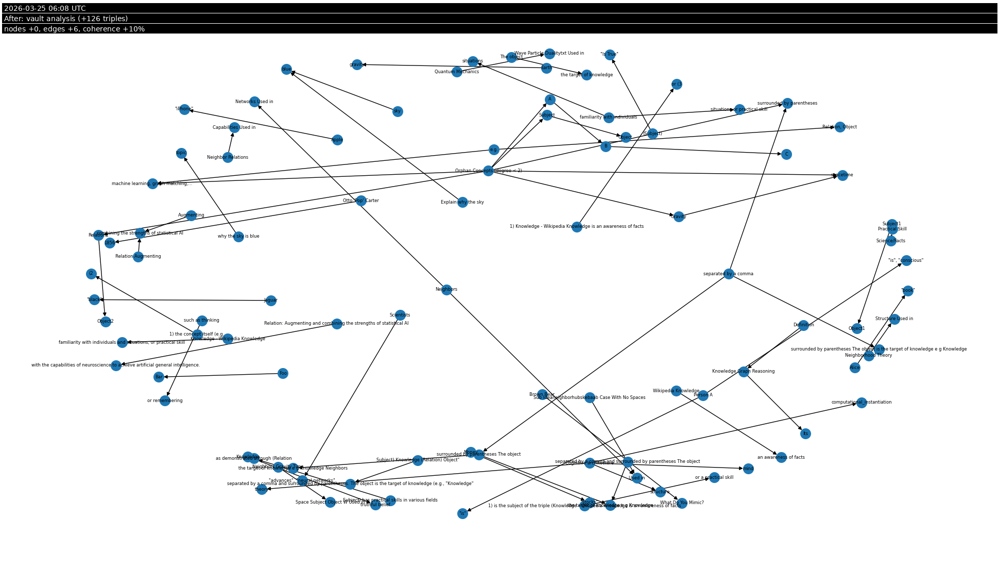](graph-2026-03-25-06-08-after-analyze-vault.png) [commit](https://github.com/BoggersTheFish/BoggersTheCIG/commit/5884ec4)

### 2026-03-25 06:08 UTC

**After:** 2 extracts, 0 merges — nodes +0, edges +0, coherence +0%

[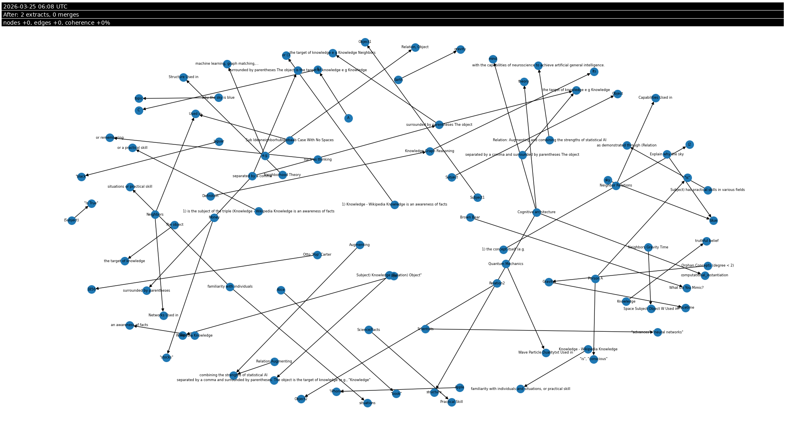](graph-2026-03-25-06-08-extract-subideas.png) [commit](https://github.com/BoggersTheFish/BoggersTheCIG/commit/5884ec4)

### 2026-03-25 06:08 UTC

**After:** vault analysis (+126 triples) — nodes +0, edges +6, coherence +10%

 [commit](https://github.com/BoggersTheFish/BoggersTheCIG/commit/5884ec4)

### 2026-03-25 06:09 UTC

**After:** 2 extracts, 0 merges — nodes +0, edges +0, coherence +0%

[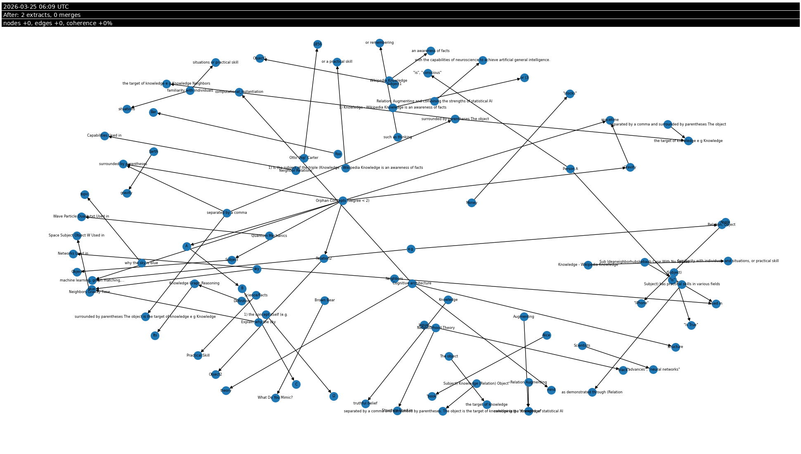](graph-2026-03-25-06-09-extract-subideas.png) [commit](https://github.com/BoggersTheFish/BoggersTheCIG/commit/5884ec4)

### 2026-03-25 06:13 UTC

**After:** vault organize (1 moves) — nodes +0, edges +0, coherence +0%

[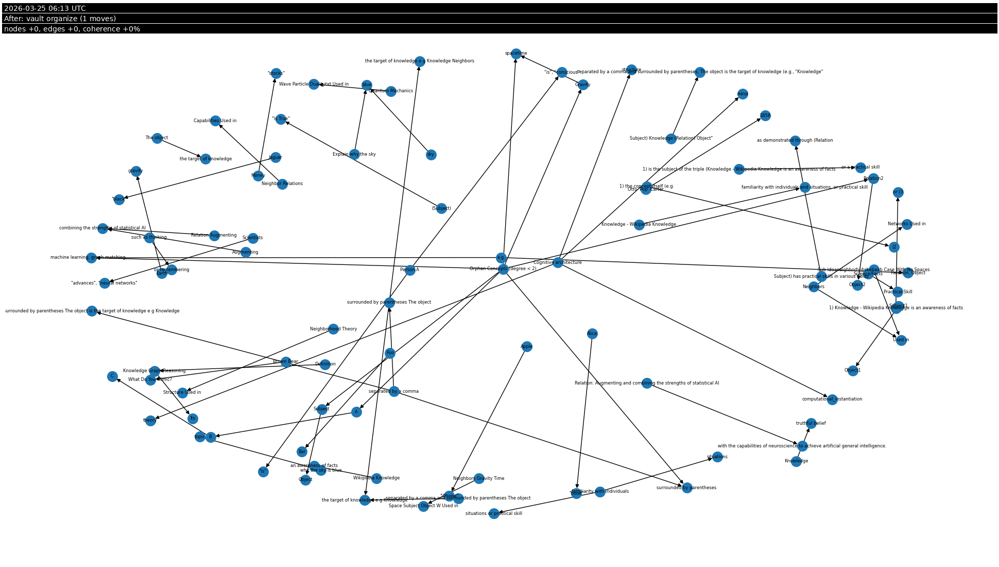](graph-2026-03-25-06-13-after-organize.png) [commit](https://github.com/BoggersTheFish/BoggersTheCIG/commit/5884ec4)

### 2026-03-25 06:13 UTC

**After:** 2 extracts, 0 merges — nodes +0, edges +0, coherence +0%

[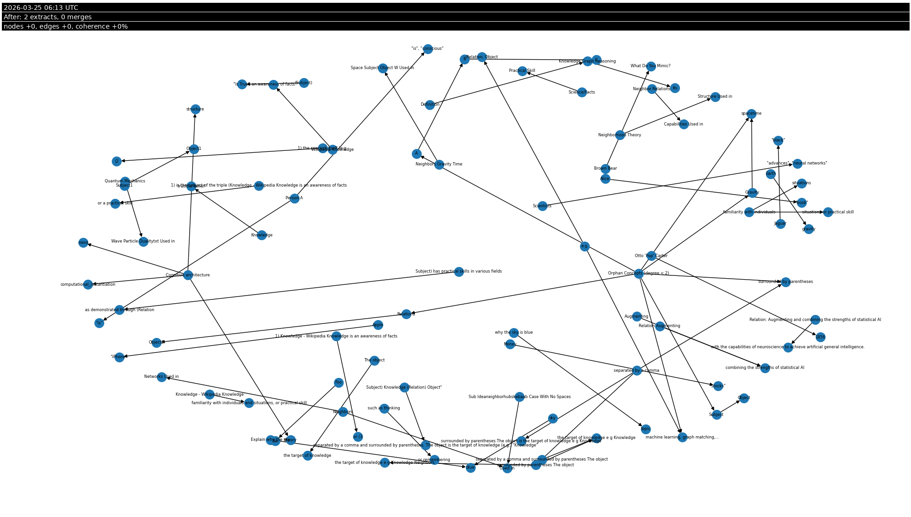](graph-2026-03-25-06-13-extract-subideas.png) [commit](https://github.com/BoggersTheFish/BoggersTheCIG/commit/5884ec4)

### 2026-03-25 06:13 UTC

**After:** 2_+2_.md"+Mechanics.md"+Theory.md"+_Relation.md" — nodes +0, edges +0, coherence +0%

[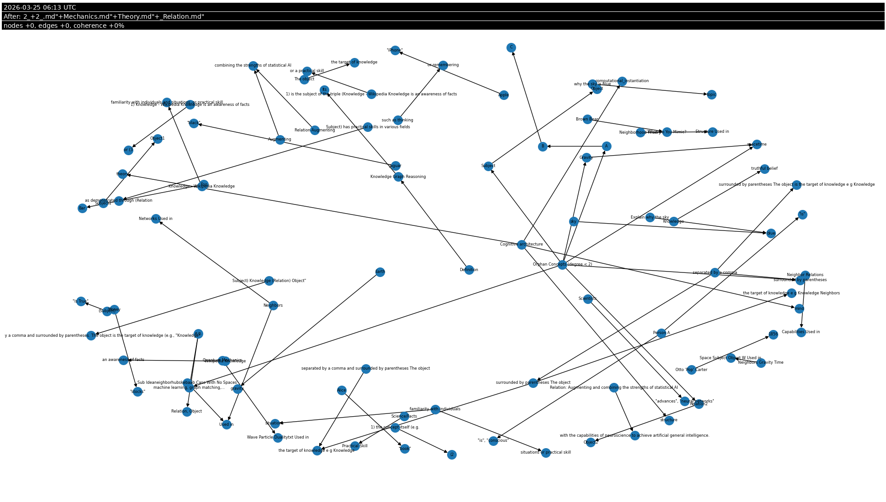](graph-2026-03-25-06-13-self-improve.png) [commit](https://github.com/BoggersTheFish/BoggersTheCIG/commit/5884ec4)

### 2026-03-25 06:18 UTC

**After:** vault organize (4 moves) — nodes +0, edges +0, coherence +0%

[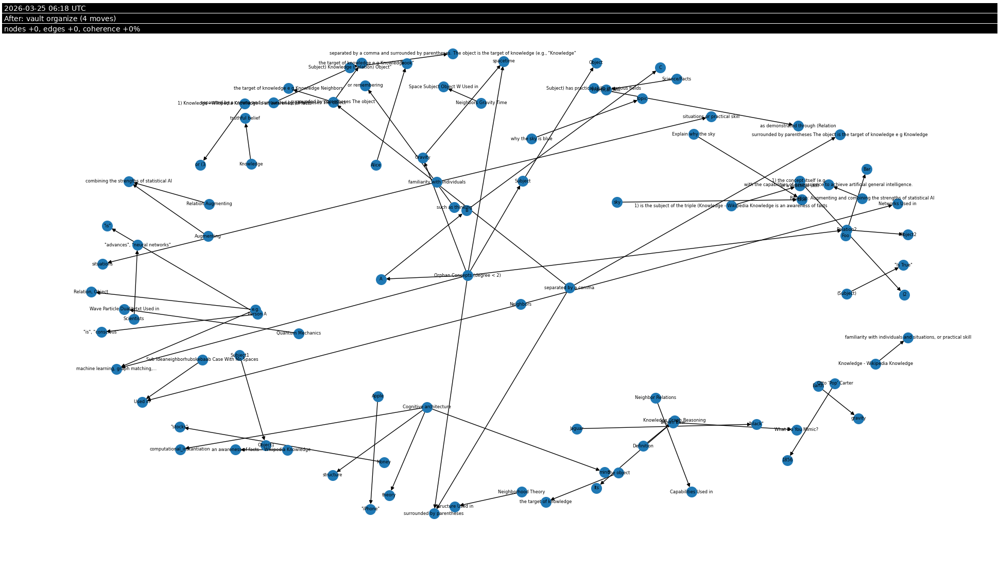](graph-2026-03-25-06-18-after-organize.png) [commit](https://github.com/BoggersTheFish/BoggersTheCIG/commit/5884ec4)

### 2026-03-25 06:18 UTC

**After:** 1 extracts, 1 merges — nodes +0, edges +0, coherence +0%

[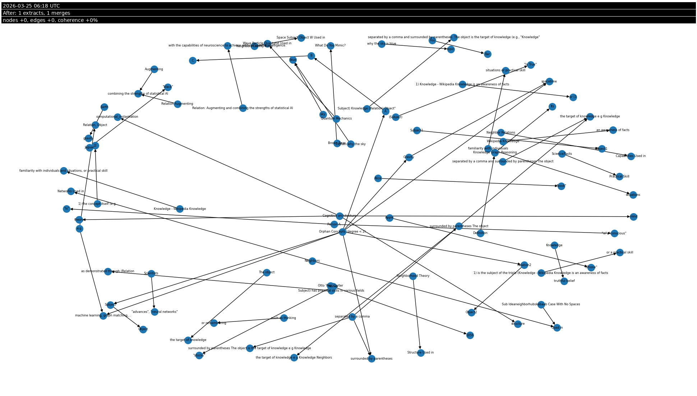](graph-2026-03-25-06-18-extract-subideas.png) [commit](https://github.com/BoggersTheFish/BoggersTheCIG/commit/5884ec4)

### 2026-03-25 06:18 UTC

**After:** 2_+2_.md"+Mechanics.md"+Theory.md"+_Relation.md" — nodes +0, edges +0, coherence +0%

[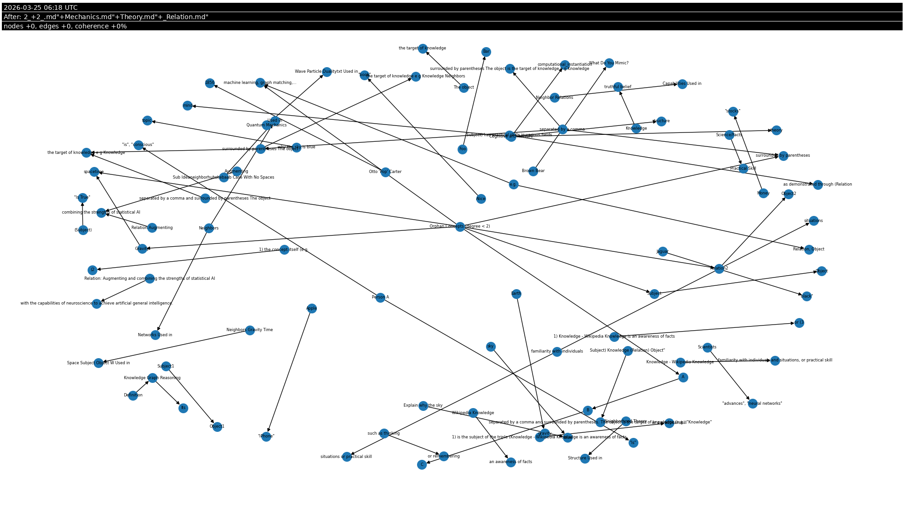](graph-2026-03-25-06-18-self-improve.png) [commit](https://github.com/BoggersTheFish/BoggersTheCIG/commit/5884ec4)

### 2026-03-25 10:56 UTC

**After:** vault analysis (+130 triples) — nodes +101, edges +60, coherence +11781%

[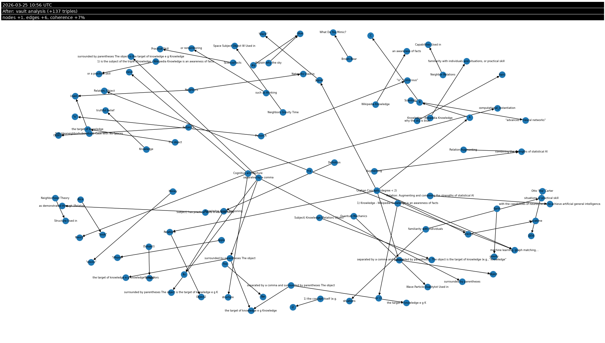](graph-2026-03-25-10-56-after-analyze-vault.png) [commit](https://github.com/BoggersTheFish/BoggersTheCIG/commit/8524384)

### 2026-03-25 10:56 UTC

**After:** 2 extracts, 0 merges — nodes +0, edges +0, coherence +0%

[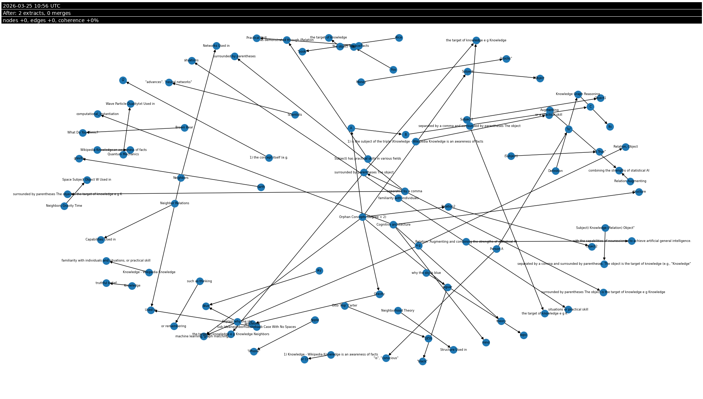](graph-2026-03-25-10-56-extract-subideas.png) [commit](https://github.com/BoggersTheFish/BoggersTheCIG/commit/8524384)

### 2026-03-25 10:56 UTC

**After:** vault analysis (+137 triples) — nodes +1, edges +6, coherence +7%

 [commit](https://github.com/BoggersTheFish/BoggersTheCIG/commit/8524384)

### 2026-03-25 10:56 UTC

**After:** 2 extracts, 0 merges — nodes +0, edges +0, coherence +0%

 [commit](https://github.com/BoggersTheFish/BoggersTheCIG/commit/8524384)

### 2026-03-25 11:01 UTC

**After:** vault organize (2 moves) — nodes +0, edges +0, coherence +0%

[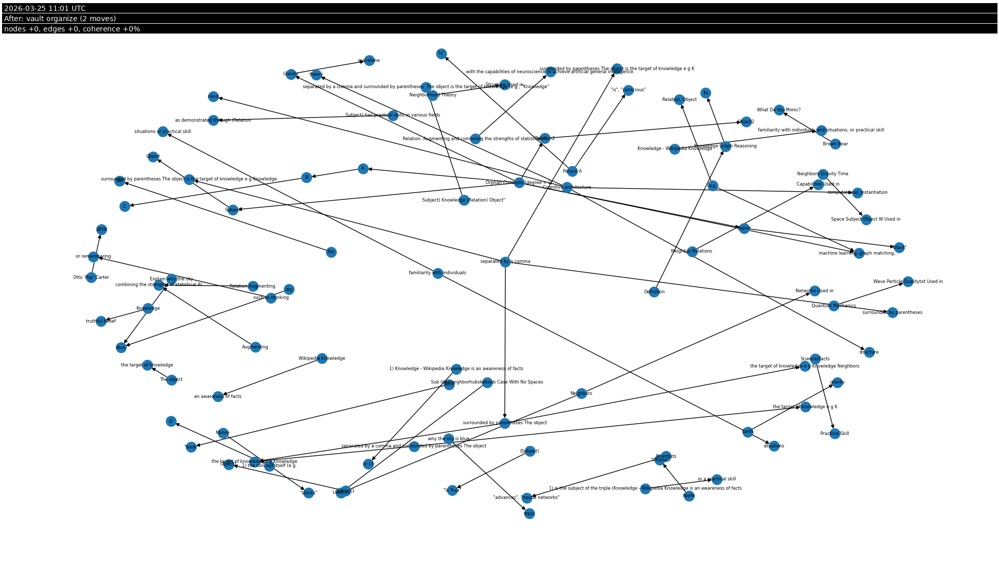](graph-2026-03-25-11-01-after-organize.png) [commit](https://github.com/BoggersTheFish/BoggersTheCIG/commit/8524384)

### 2026-03-25 11:01 UTC

**After:** 1 extracts, 1 merges — nodes +0, edges +0, coherence +0%

[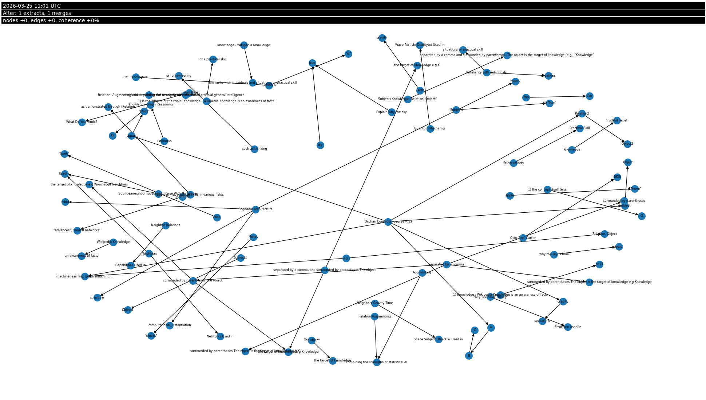](graph-2026-03-25-11-01-extract-subideas.png) [commit](https://github.com/BoggersTheFish/BoggersTheCIG/commit/8524384)

### 2026-03-25 11:01 UTC

**After:** 2_+2_.md"+K.md"+Spaces.md"+Time.md" — nodes +0, edges +0, coherence +0%

[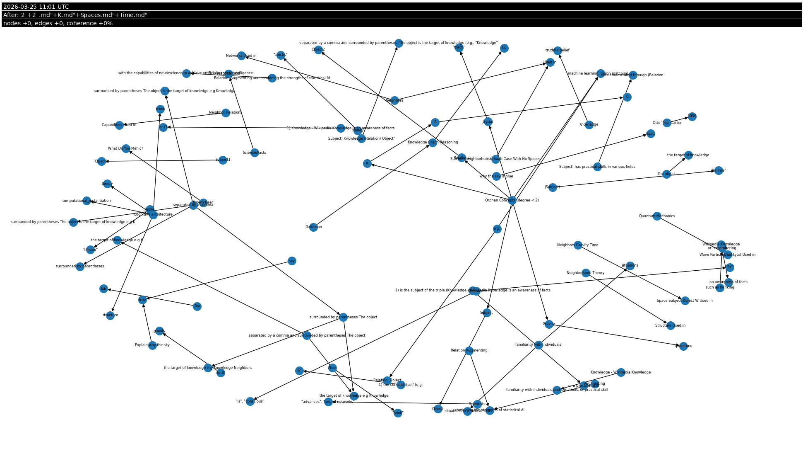](graph-2026-03-25-11-01-self-improve.png) [commit](https://github.com/BoggersTheFish/BoggersTheCIG/commit/8524384)

### 2026-03-25 11:05 UTC

**After:** vault organize (2 moves) — nodes +0, edges +0, coherence +0%

[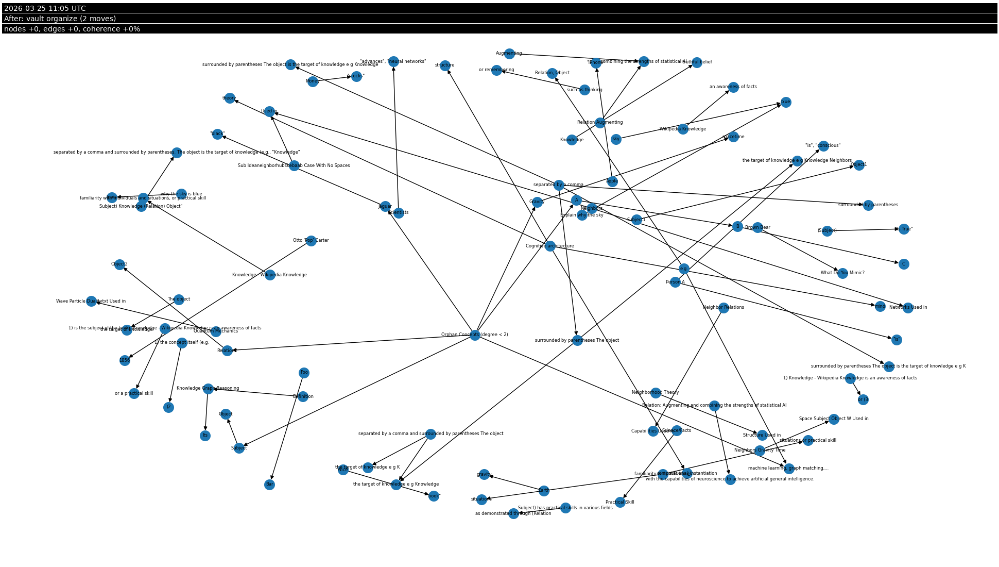](graph-2026-03-25-11-05-after-organize.png) [commit](https://github.com/BoggersTheFish/BoggersTheCIG/commit/8524384)

### 2026-03-25 11:05 UTC

**After:** 2 extracts, 0 merges — nodes +0, edges +0, coherence +0%

[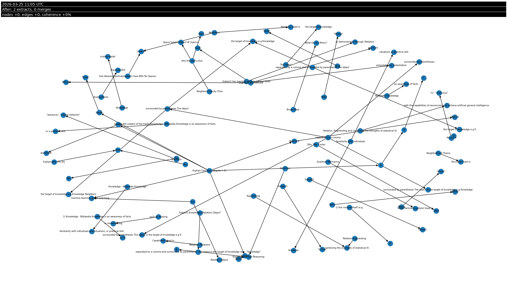](graph-2026-03-25-11-05-extract-subideas.png) [commit](https://github.com/BoggersTheFish/BoggersTheCIG/commit/8524384)

### 2026-03-25 11:05 UTC

**After:** 2_+2_.md"+K.md"+Spaces.md"+Time.md" — nodes +0, edges +0, coherence +0%

[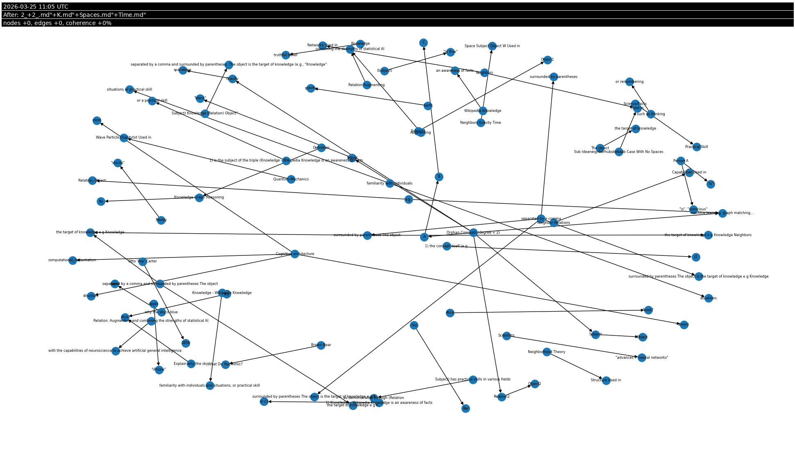](graph-2026-03-25-11-05-self-improve.png) [commit](https://github.com/BoggersTheFish/BoggersTheCIG/commit/8524384)

### 2026-03-25 16:18 UTC

**After:** vault analysis (+134 triples) — nodes +103, edges +62, coherence +11702%

[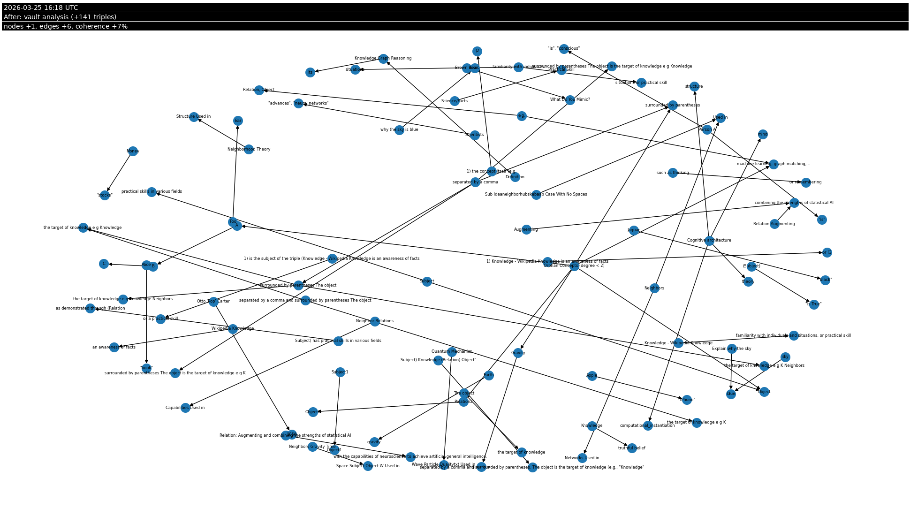](graph-2026-03-25-16-18-after-analyze-vault.png) [commit](https://github.com/BoggersTheFish/BoggersTheCIG/commit/d1d437f)

### 2026-03-25 16:18 UTC

**After:** 1 extracts, 0 merges — nodes +0, edges +0, coherence +0%

[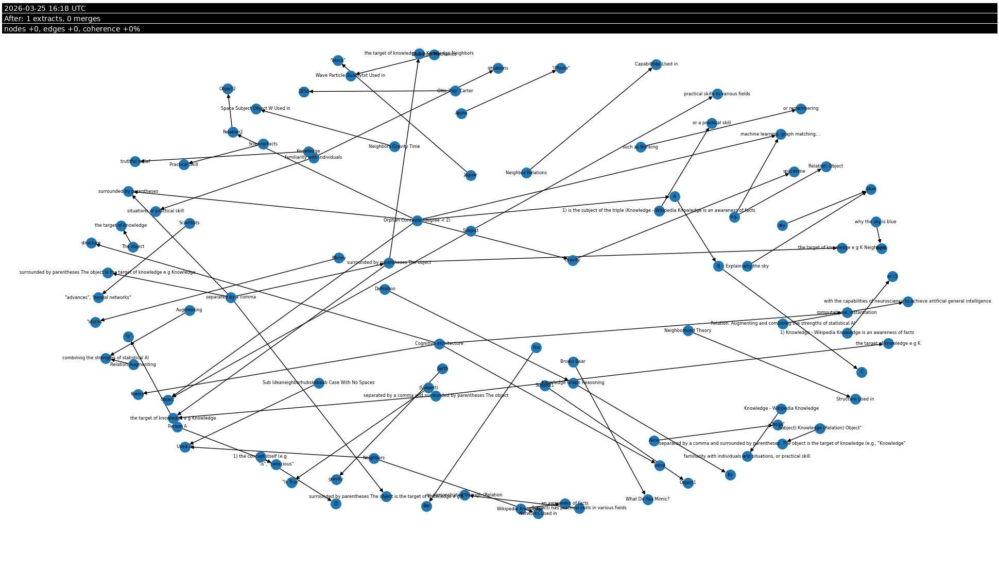](graph-2026-03-25-16-18-extract-subideas.png) [commit](https://github.com/BoggersTheFish/BoggersTheCIG/commit/d1d437f)

### 2026-03-25 16:18 UTC

**After:** vault analysis (+141 triples) — nodes +1, edges +6, coherence +7%

 [commit](https://github.com/BoggersTheFish/BoggersTheCIG/commit/d1d437f)

### 2026-03-25 16:18 UTC

**After:** 1 extracts, 0 merges — nodes +0, edges +0, coherence +0%

 [commit](https://github.com/BoggersTheFish/BoggersTheCIG/commit/d1d437f)

### 2026-03-25 16:23 UTC

**After:** vault organize (0 moves) — nodes +0, edges +0, coherence +0%

[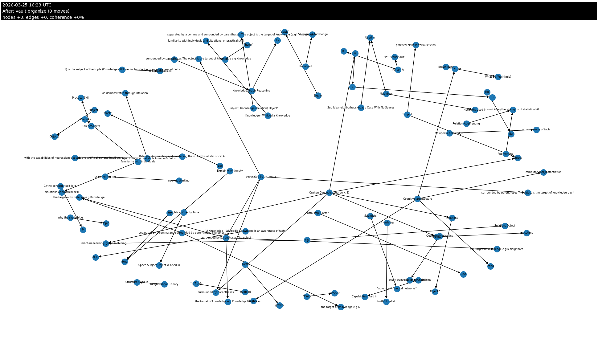](graph-2026-03-25-16-23-after-organize.png) [commit](https://github.com/BoggersTheFish/BoggersTheCIG/commit/d1d437f)

### 2026-03-25 16:23 UTC

**After:** 2 extracts, 0 merges — nodes +0, edges +0, coherence +0%

[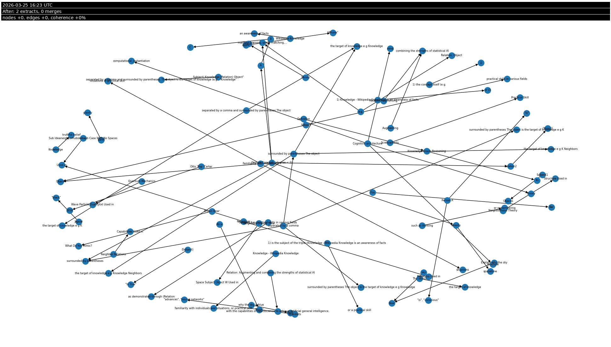](graph-2026-03-25-16-23-extract-subideas.png) [commit](https://github.com/BoggersTheFish/BoggersTheCIG/commit/d1d437f)

### 2026-03-25 16:23 UTC

**After:** 2_+2_.md"+Neighbors.md"+comma.md"+eval — nodes +0, edges +0, coherence +0%

[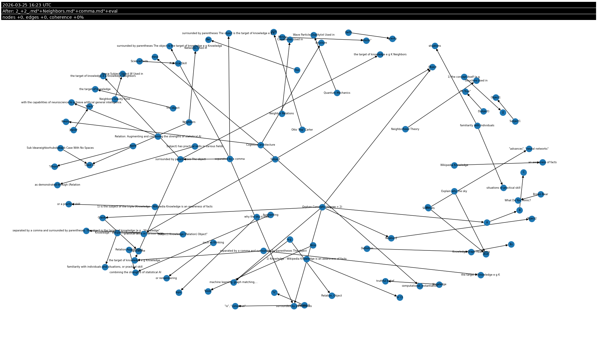](graph-2026-03-25-16-23-self-improve.png) [commit](https://github.com/BoggersTheFish/BoggersTheCIG/commit/d1d437f)

### 2026-03-25 16:28 UTC

**After:** vault organize (1 moves) — nodes +0, edges +0, coherence +0%

[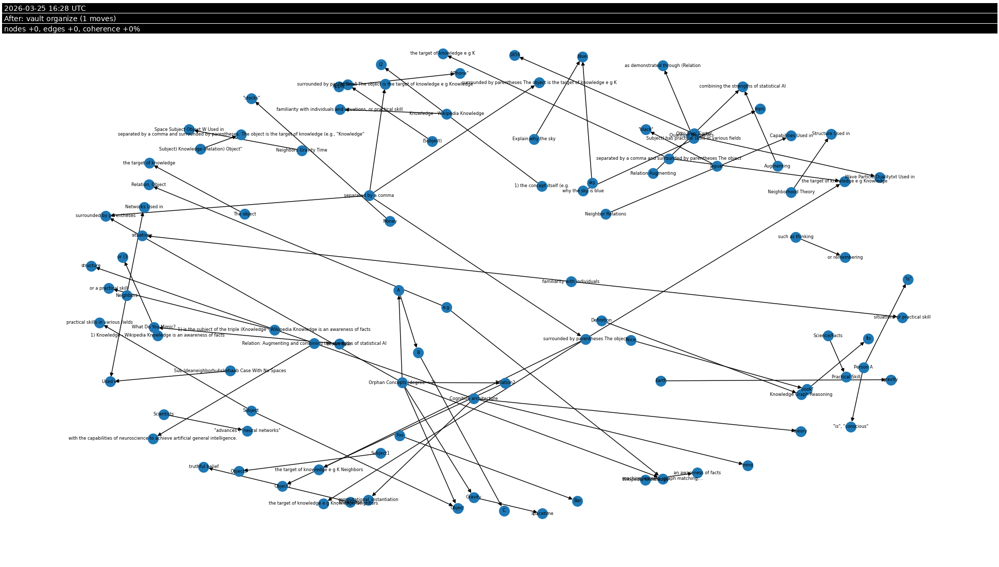](graph-2026-03-25-16-28-after-organize.png) [commit](https://github.com/BoggersTheFish/BoggersTheCIG/commit/d1d437f)

### 2026-03-25 16:28 UTC

**After:** 1 extracts, 1 merges — nodes +0, edges +0, coherence +0%

[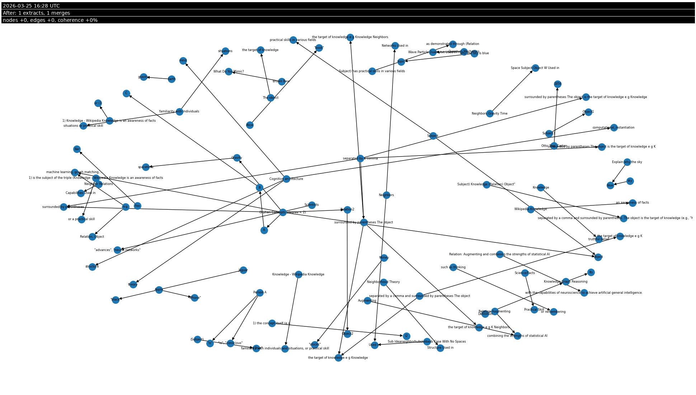](graph-2026-03-25-16-28-extract-subideas.png) [commit](https://github.com/BoggersTheFish/BoggersTheCIG/commit/d1d437f)

### 2026-03-25 16:28 UTC

**After:** 2_+2_.md"+K.md"+Neighbors.md"+comma.md" — nodes +0, edges +0, coherence +0%

[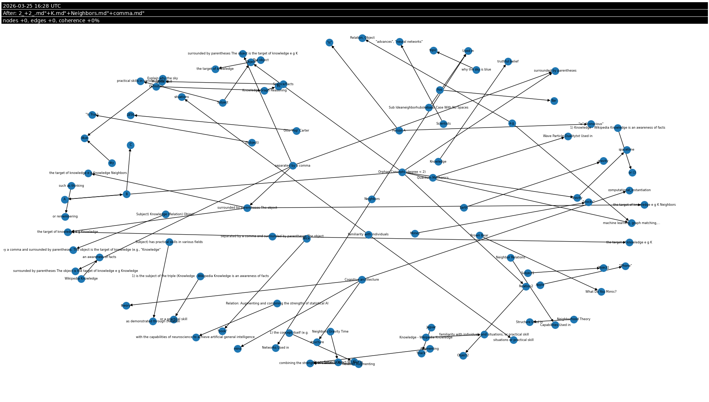](graph-2026-03-25-16-28-self-improve.png) [commit](https://github.com/BoggersTheFish/BoggersTheCIG/commit/d1d437f)

### 2026-03-25 20:45 UTC

**After:** vault analysis (+136 triples) — nodes +103, edges +63, coherence +11893%

[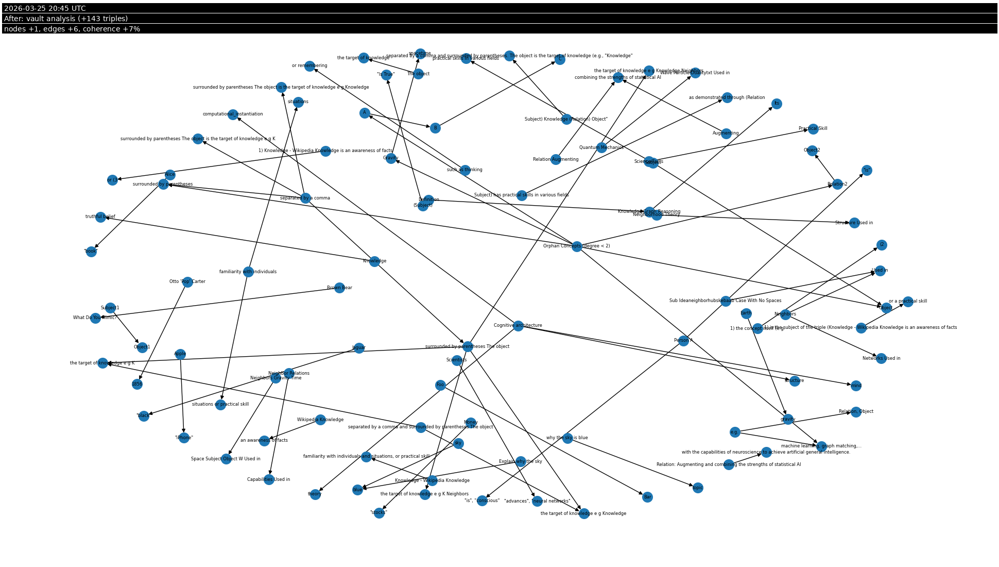](graph-2026-03-25-20-45-after-analyze-vault.png) [commit](https://github.com/BoggersTheFish/BoggersTheCIG/commit/2ec27cb)

### 2026-03-25 20:45 UTC

**After:** 1 extracts, 0 merges — nodes +0, edges +0, coherence +0%

[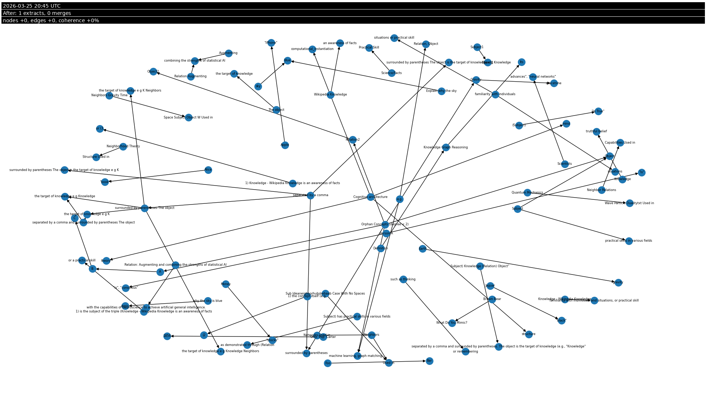](graph-2026-03-25-20-45-extract-subideas.png) [commit](https://github.com/BoggersTheFish/BoggersTheCIG/commit/2ec27cb)

### 2026-03-25 20:45 UTC

**After:** vault analysis (+143 triples) — nodes +1, edges +6, coherence +7%

 [commit](https://github.com/BoggersTheFish/BoggersTheCIG/commit/2ec27cb)

### 2026-03-25 20:45 UTC

**After:** 1 extracts, 0 merges — nodes +0, edges +0, coherence +0%

 [commit](https://github.com/BoggersTheFish/BoggersTheCIG/commit/2ec27cb)

### 2026-03-25 20:51 UTC

**After:** vault organize (0 moves) — nodes +0, edges +0, coherence +0%

[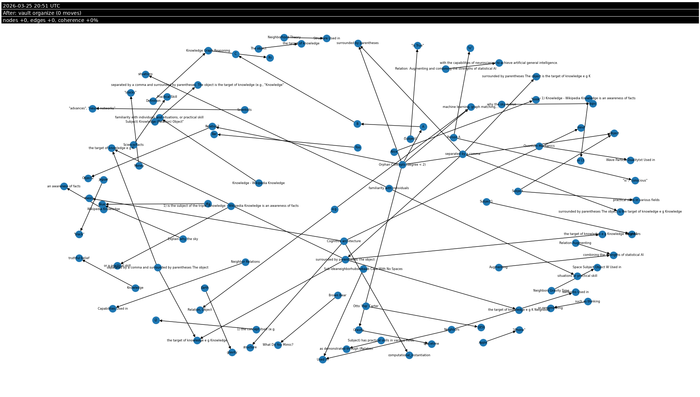](graph-2026-03-25-20-51-after-organize.png) [commit](https://github.com/BoggersTheFish/BoggersTheCIG/commit/2ec27cb)

### 2026-03-25 20:51 UTC

**After:** 2 extracts, 0 merges — nodes +0, edges +0, coherence +0%

[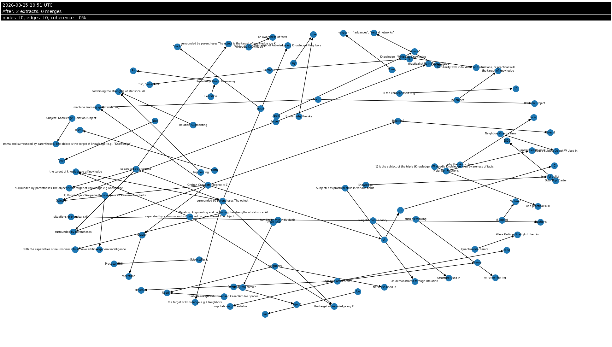](graph-2026-03-25-20-51-extract-subideas.png) [commit](https://github.com/BoggersTheFish/BoggersTheCIG/commit/2ec27cb)

### 2026-03-25 20:51 UTC

**After:** 2_+2_.md"+eval+facts.md"+object.md" — nodes +0, edges +0, coherence +0%

[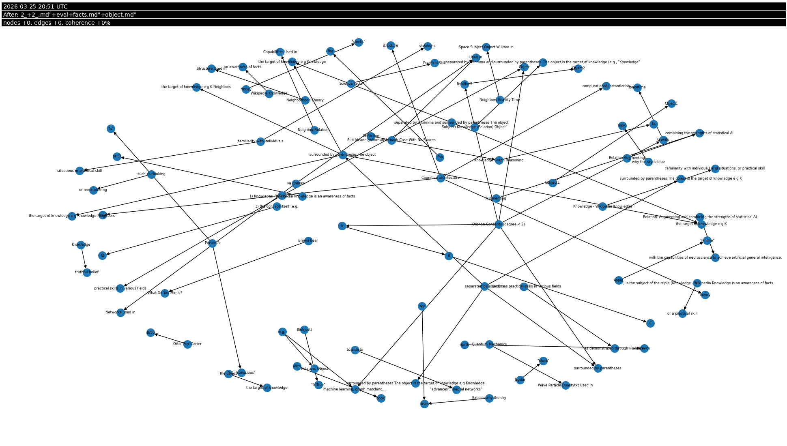](graph-2026-03-25-20-51-self-improve.png) [commit](https://github.com/BoggersTheFish/BoggersTheCIG/commit/2ec27cb)

### 2026-03-25 20:56 UTC

**After:** vault organize (0 moves) — nodes +0, edges +0, coherence +0%

[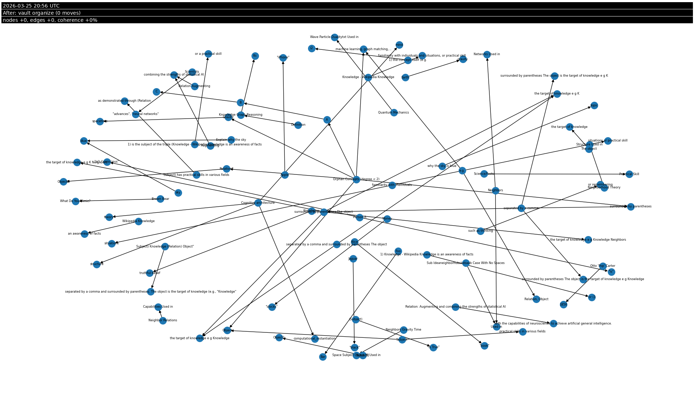](graph-2026-03-25-20-56-after-organize.png) [commit](https://github.com/BoggersTheFish/BoggersTheCIG/commit/2ec27cb)

### 2026-03-25 20:56 UTC

**After:** 1 extracts, 1 merges — nodes +0, edges +0, coherence +0%

[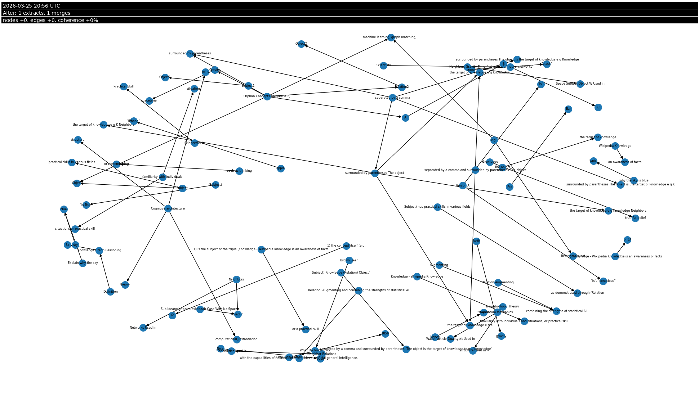](graph-2026-03-25-20-56-extract-subideas.png) [commit](https://github.com/BoggersTheFish/BoggersTheCIG/commit/2ec27cb)

### 2026-03-25 20:56 UTC

**After:** 2_+2_.md"+eval+facts.md"+object.md" — nodes +0, edges +0, coherence +0%

[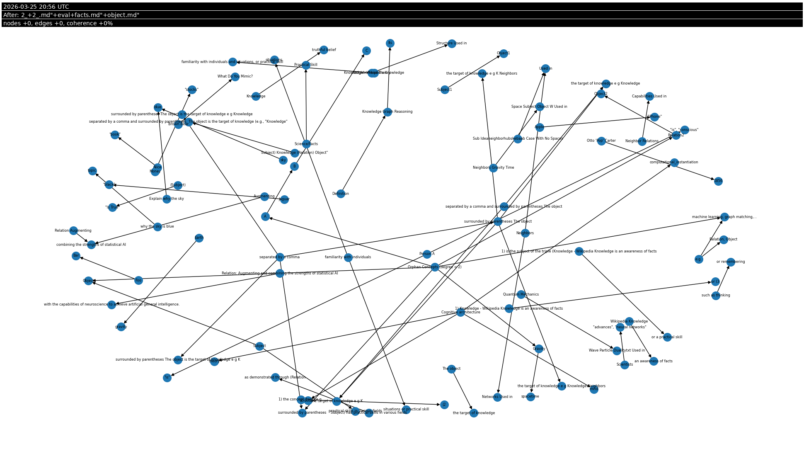](graph-2026-03-25-20-56-self-improve.png) [commit](https://github.com/BoggersTheFish/BoggersTheCIG/commit/2ec27cb)

### 2026-03-26 02:18 UTC

**After:** external ingest (+1 triples) — nodes +4, edges +2, coherence +333233%

[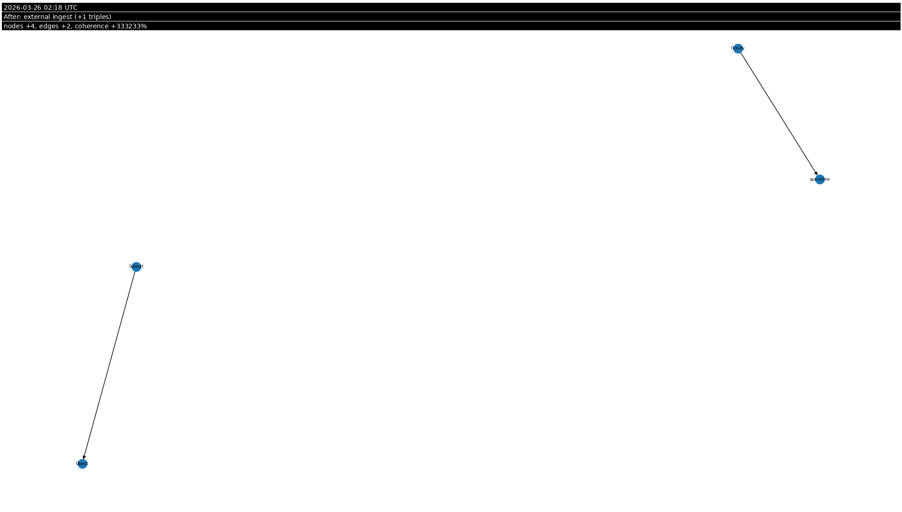](graph-2026-03-26-02-18-after-ingest.png) [commit](https://github.com/BoggersTheFish/BoggersTheCIG/commit/2f7708b)

### 2026-03-26 02:18 UTC

**After:** vault analysis (+137 triples) — nodes +100, edges +62, coherence -96%

[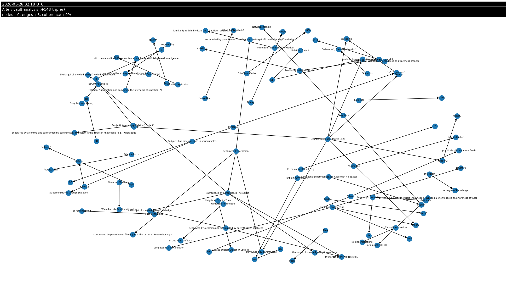](graph-2026-03-26-02-18-after-analyze-vault.png) [commit](https://github.com/BoggersTheFish/BoggersTheCIG/commit/2f7708b)

### 2026-03-26 02:18 UTC

**After:** 1 extracts, 0 merges — nodes +0, edges +0, coherence +0%

[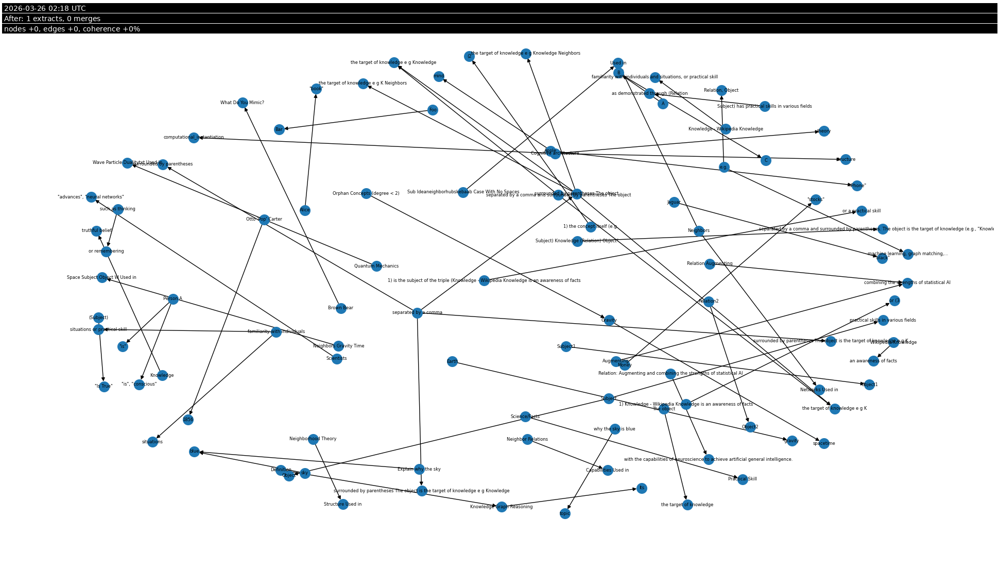](graph-2026-03-26-02-18-extract-subideas.png) [commit](https://github.com/BoggersTheFish/BoggersTheCIG/commit/2f7708b)

### 2026-03-26 02:18 UTC

**After:** vault analysis (+143 triples) — nodes +0, edges +6, coherence +9%

 [commit](https://github.com/BoggersTheFish/BoggersTheCIG/commit/2f7708b)

### 2026-03-26 02:19 UTC

**After:** 1 extracts, 0 merges — nodes +0, edges +0, coherence +0%

[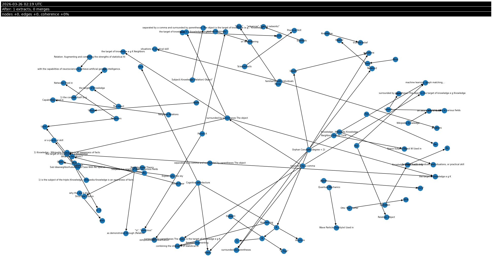](graph-2026-03-26-02-19-extract-subideas.png) [commit](https://github.com/BoggersTheFish/BoggersTheCIG/commit/2f7708b)

### 2026-03-26 02:24 UTC

**After:** vault organize (1 moves) — nodes +0, edges +0, coherence +0%

[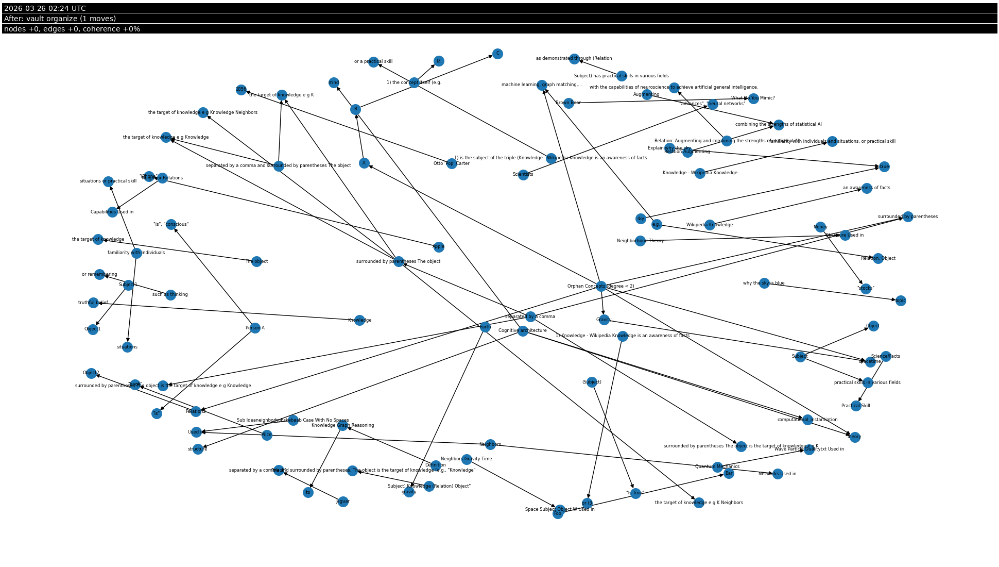](graph-2026-03-26-02-24-after-organize.png) [commit](https://github.com/BoggersTheFish/BoggersTheCIG/commit/2f7708b)

### 2026-03-26 02:24 UTC

**After:** 2 extracts, 0 merges — nodes +0, edges +0, coherence +0%

[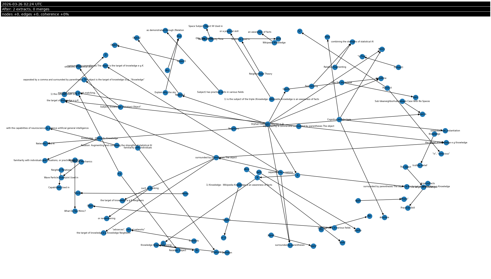](graph-2026-03-26-02-24-extract-subideas.png) [commit](https://github.com/BoggersTheFish/BoggersTheCIG/commit/2f7708b)

### 2026-03-26 02:24 UTC

**After:** 2_+2_.md"+Bear.md"+Neighbors.md"+eval — nodes +0, edges +0, coherence +0%

[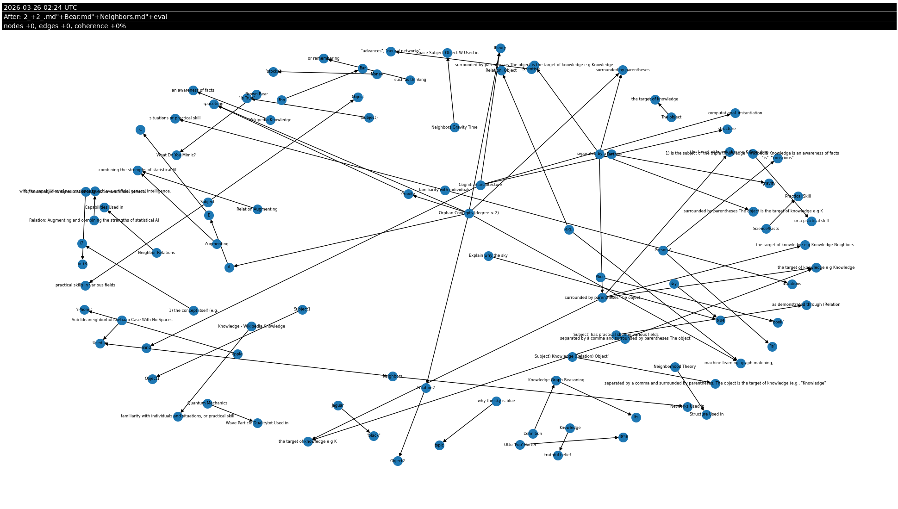](graph-2026-03-26-02-24-self-improve.png) [commit](https://github.com/BoggersTheFish/BoggersTheCIG/commit/2f7708b)

### 2026-03-26 02:29 UTC

**After:** vault organize (0 moves) — nodes +0, edges +0, coherence +0%

[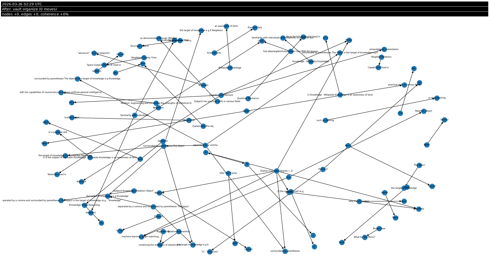](graph-2026-03-26-02-29-after-organize.png) [commit](https://github.com/BoggersTheFish/BoggersTheCIG/commit/2f7708b)

### 2026-03-26 02:29 UTC

**After:** 1 extracts, 1 merges — nodes +0, edges +0, coherence +0%

[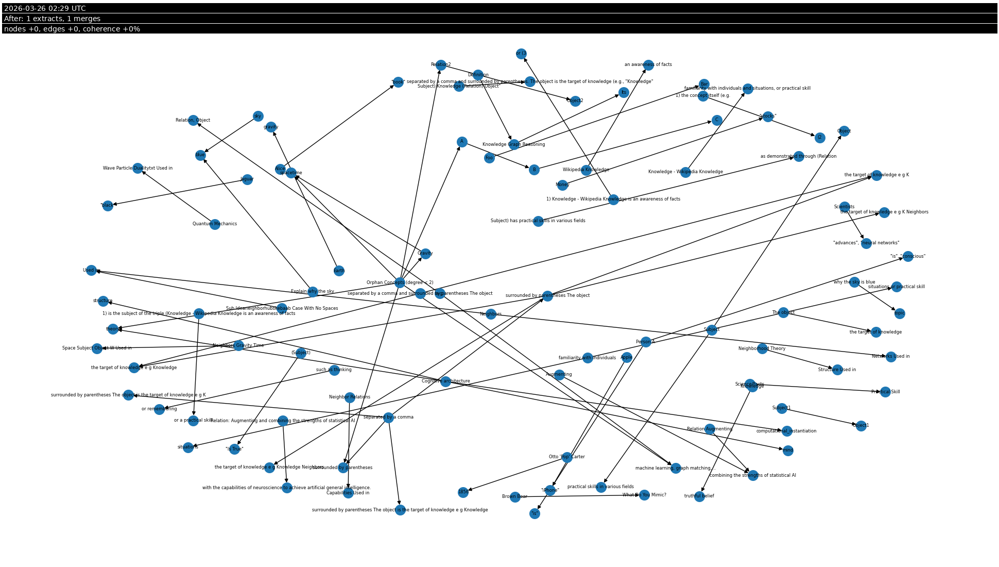](graph-2026-03-26-02-29-extract-subideas.png) [commit](https://github.com/BoggersTheFish/BoggersTheCIG/commit/2f7708b)

### 2026-03-26 02:29 UTC

**After:** 2_+2_.md"+Bear.md"+Neighbors.md"+eval — nodes +0, edges +0, coherence +0%

[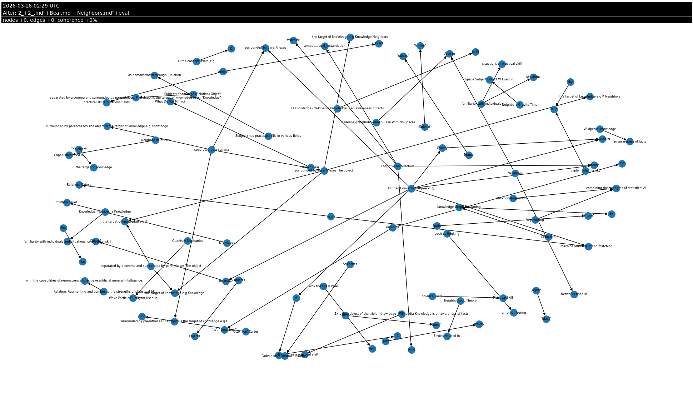](graph-2026-03-26-02-29-self-improve.png) [commit](https://github.com/BoggersTheFish/BoggersTheCIG/commit/2f7708b)

### 2026-03-26 06:22 UTC

**After:** vault analysis (+135 triples) — nodes +103, edges +63, coherence +11893%

[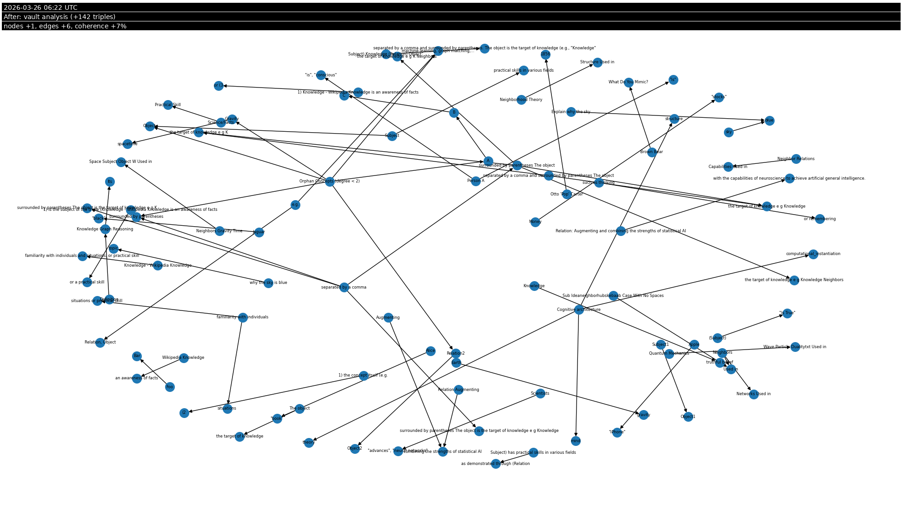](graph-2026-03-26-06-22-after-analyze-vault.png) [commit](https://github.com/BoggersTheFish/BoggersTheCIG/commit/858c392)

### 2026-03-26 06:22 UTC

**After:** 2 extracts, 0 merges — nodes +0, edges +0, coherence +0%

[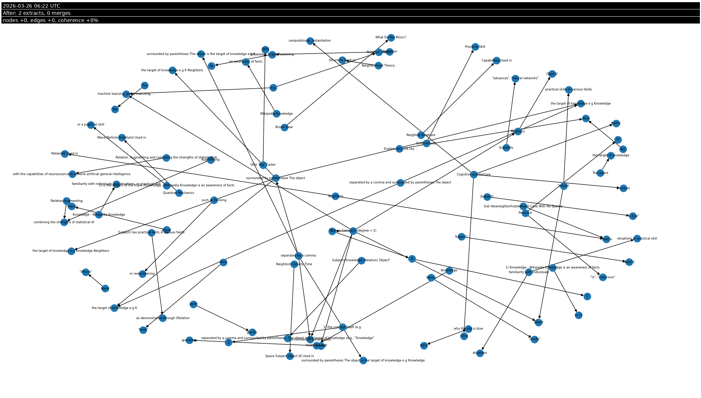](graph-2026-03-26-06-22-extract-subideas.png) [commit](https://github.com/BoggersTheFish/BoggersTheCIG/commit/858c392)

### 2026-03-26 06:22 UTC

**After:** vault analysis (+142 triples) — nodes +1, edges +6, coherence +7%

 [commit](https://github.com/BoggersTheFish/BoggersTheCIG/commit/858c392)

### 2026-03-26 06:22 UTC

**After:** 2 extracts, 0 merges — nodes +0, edges +0, coherence +0%

 [commit](https://github.com/BoggersTheFish/BoggersTheCIG/commit/858c392)

### 2026-03-26 06:27 UTC

**After:** vault organize (3 moves) — nodes +0, edges +0, coherence +0%

[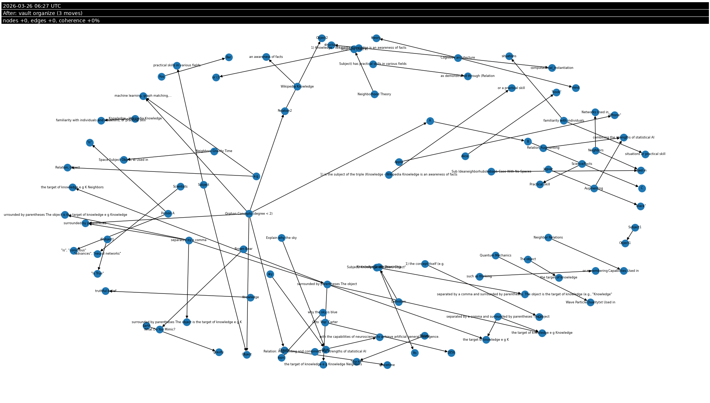](graph-2026-03-26-06-27-after-organize.png) [commit](https://github.com/BoggersTheFish/BoggersTheCIG/commit/858c392)

### 2026-03-26 06:28 UTC

**After:** 1 extracts, 1 merges — nodes +0, edges +0, coherence +0%

[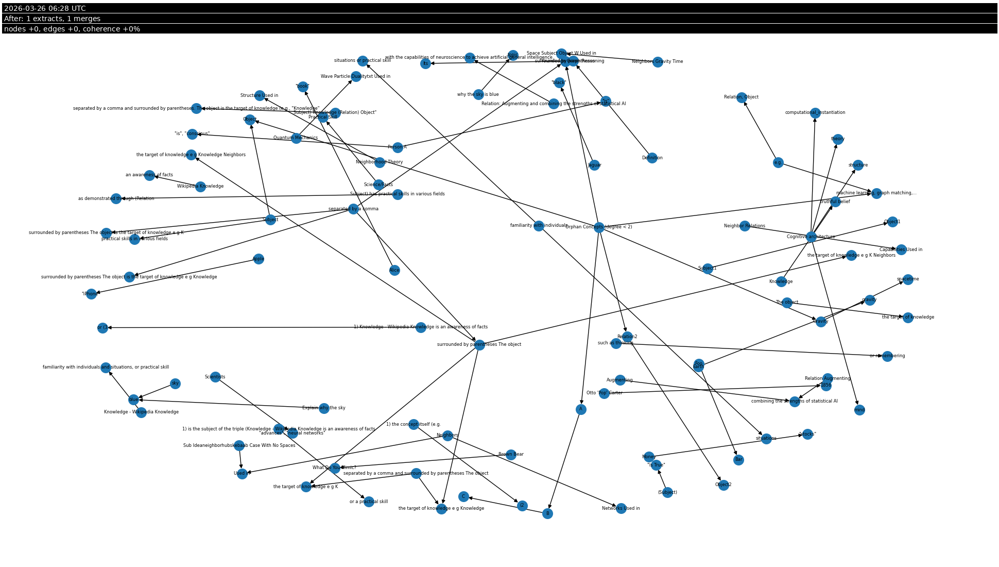](graph-2026-03-26-06-28-extract-subideas.png) [commit](https://github.com/BoggersTheFish/BoggersTheCIG/commit/858c392)

### 2026-03-26 06:28 UTC

**After:** 2_+2_.md"+_Relation.md"+eval+knowledge.md" — nodes +0, edges +0, coherence +0%

[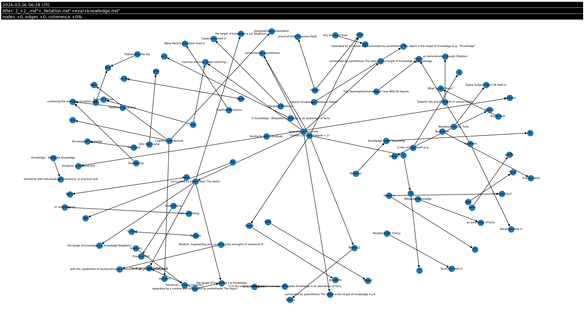](graph-2026-03-26-06-28-self-improve.png) [commit](https://github.com/BoggersTheFish/BoggersTheCIG/commit/858c392)

### 2026-03-26 06:32 UTC

**After:** vault organize (0 moves) — nodes +0, edges +0, coherence +0%

[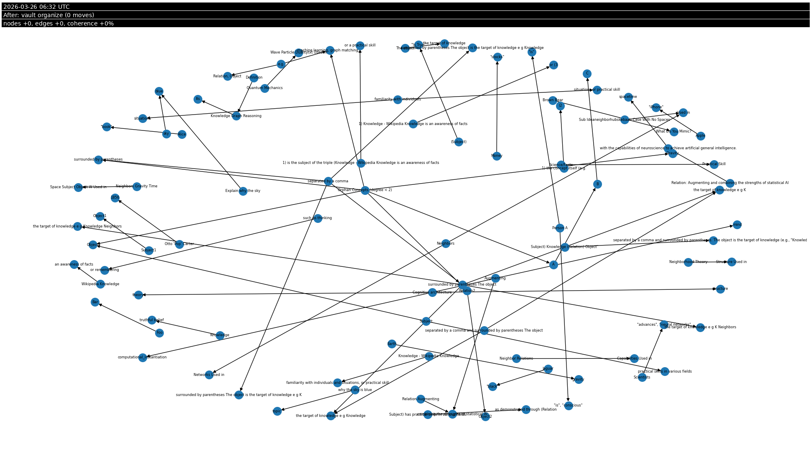](graph-2026-03-26-06-32-after-organize.png) [commit](https://github.com/BoggersTheFish/BoggersTheCIG/commit/858c392)

### 2026-03-26 06:33 UTC

**After:** 1 extracts, 1 merges — nodes +0, edges +0, coherence +0%

[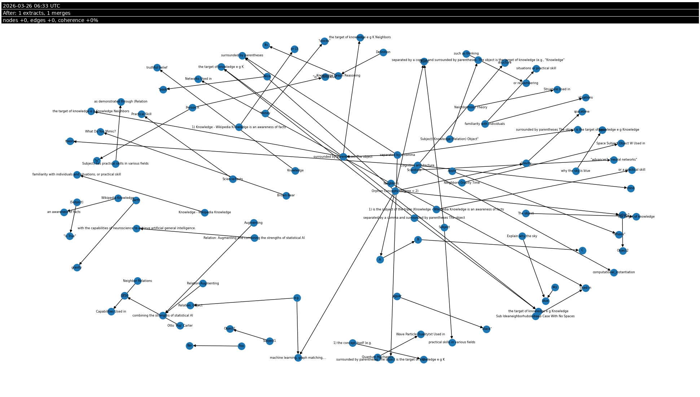](graph-2026-03-26-06-33-extract-subideas.png) [commit](https://github.com/BoggersTheFish/BoggersTheCIG/commit/858c392)

### 2026-03-26 06:33 UTC

**After:** 2_+2_.md"+_Relation.md"+eval+knowledge.md" — nodes +0, edges +0, coherence +0%

[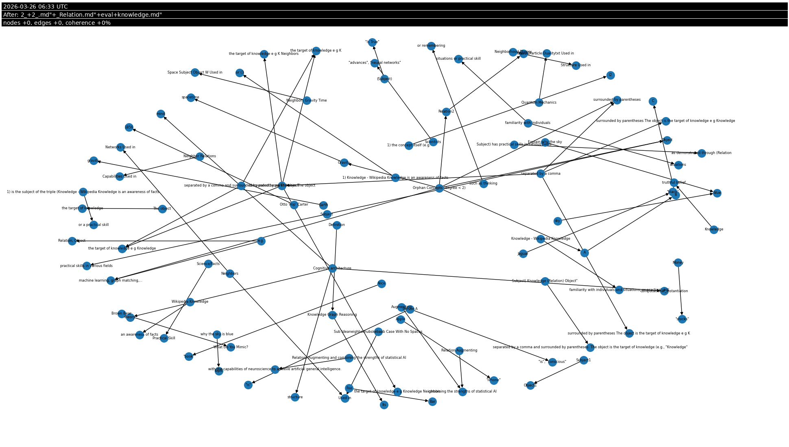](graph-2026-03-26-06-33-self-improve.png) [commit](https://github.com/BoggersTheFish/BoggersTheCIG/commit/858c392)

### 2026-03-26 10:59 UTC

**After:** external ingest (+1 triples) — nodes +4, edges +2, coherence +333233%

[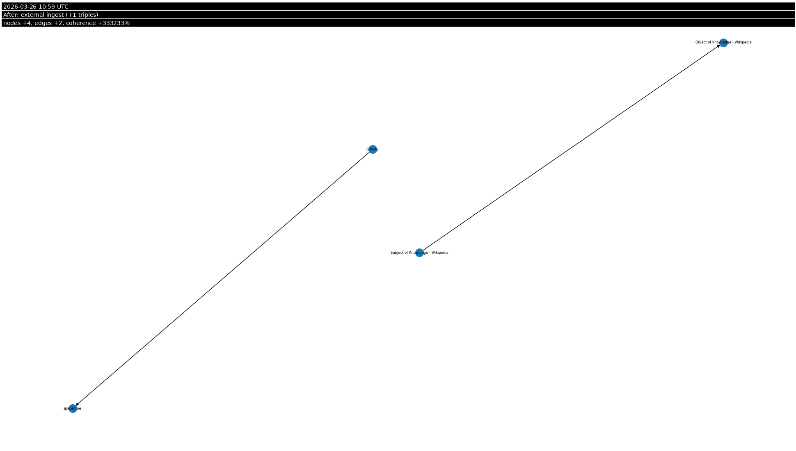](graph-2026-03-26-10-59-after-ingest.png) [commit](https://github.com/BoggersTheFish/BoggersTheCIG/commit/641b452)

### 2026-03-26 10:59 UTC

**After:** vault analysis (+142 triples) — nodes +104, edges +64, coherence -96%

[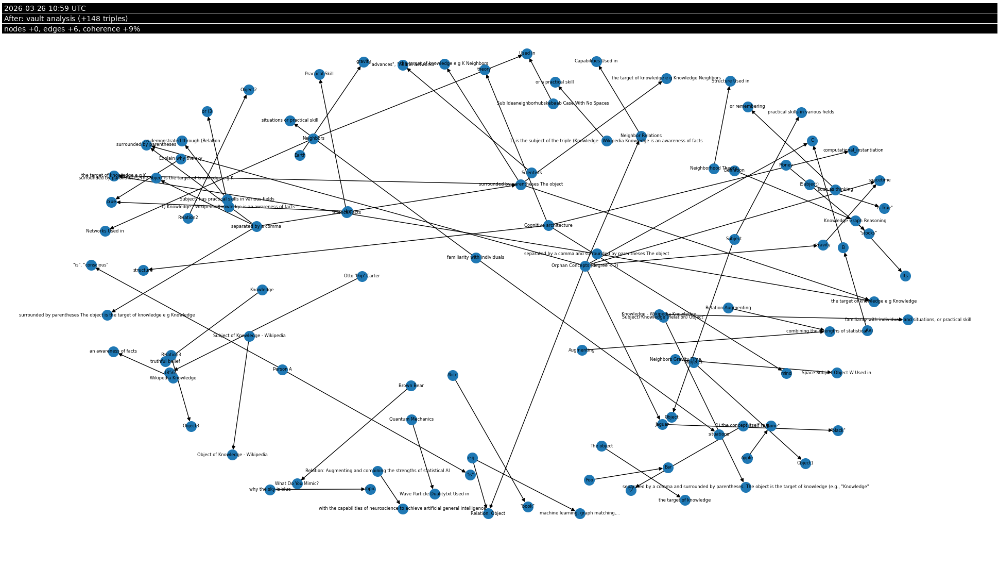](graph-2026-03-26-10-59-after-analyze-vault.png) [commit](https://github.com/BoggersTheFish/BoggersTheCIG/commit/641b452)

### 2026-03-26 10:59 UTC

**After:** 2 extracts, 0 merges — nodes +0, edges +0, coherence +0%

[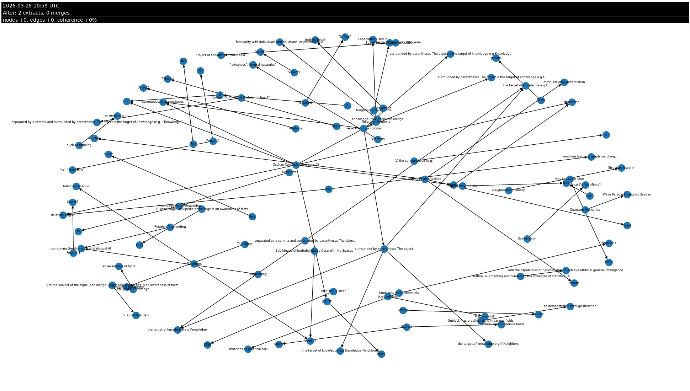](graph-2026-03-26-10-59-extract-subideas.png) [commit](https://github.com/BoggersTheFish/BoggersTheCIG/commit/641b452)

### 2026-03-26 10:59 UTC

**After:** vault analysis (+148 triples) — nodes +0, edges +6, coherence +9%

 [commit](https://github.com/BoggersTheFish/BoggersTheCIG/commit/641b452)

### 2026-03-26 10:59 UTC

**After:** 2 extracts, 0 merges — nodes +0, edges +0, coherence +0%

 [commit](https://github.com/BoggersTheFish/BoggersTheCIG/commit/641b452)

### 2026-03-26 11:04 UTC

**After:** vault organize (1 moves) — nodes +0, edges +0, coherence +0%

[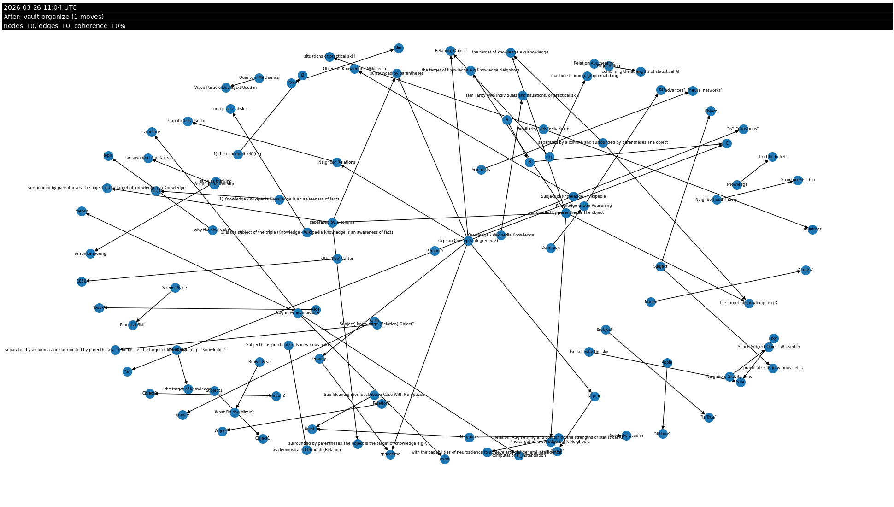](graph-2026-03-26-11-04-after-organize.png) [commit](https://github.com/BoggersTheFish/BoggersTheCIG/commit/641b452)

### 2026-03-26 11:05 UTC

**After:** 1 extracts, 1 merges — nodes +0, edges +0, coherence +0%

[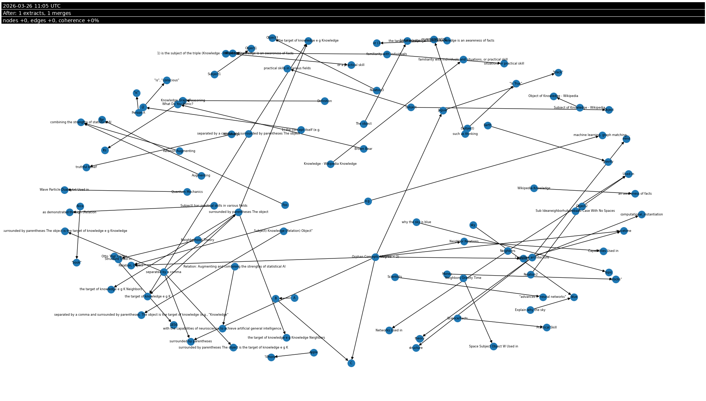](graph-2026-03-26-11-05-extract-subideas.png) [commit](https://github.com/BoggersTheFish/BoggersTheCIG/commit/641b452)

### 2026-03-26 11:05 UTC

**After:** 2_+2_.md"+A.md"+AI.md"+Knowledge.md" — nodes +0, edges +0, coherence +0%

[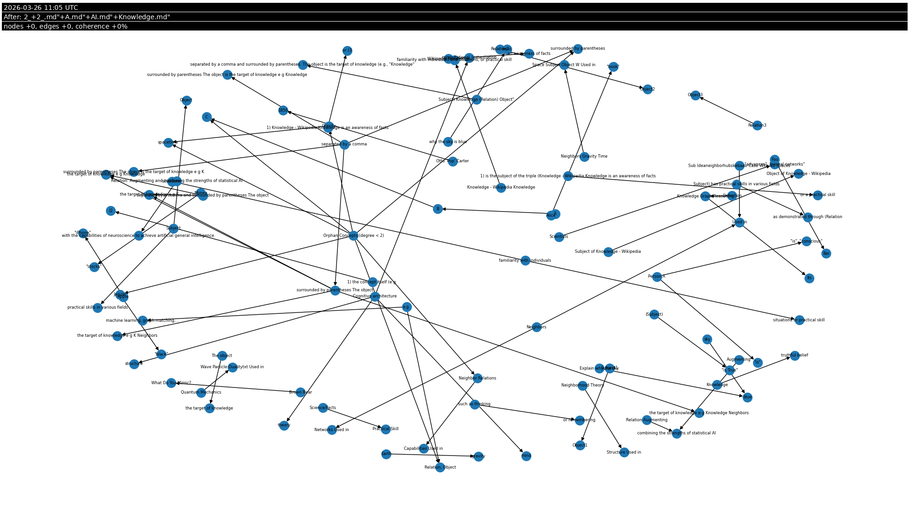](graph-2026-03-26-11-05-self-improve.png) [commit](https://github.com/BoggersTheFish/BoggersTheCIG/commit/641b452)

### 2026-03-26 11:10 UTC

**After:** vault organize (2 moves) — nodes +0, edges +0, coherence +0%

[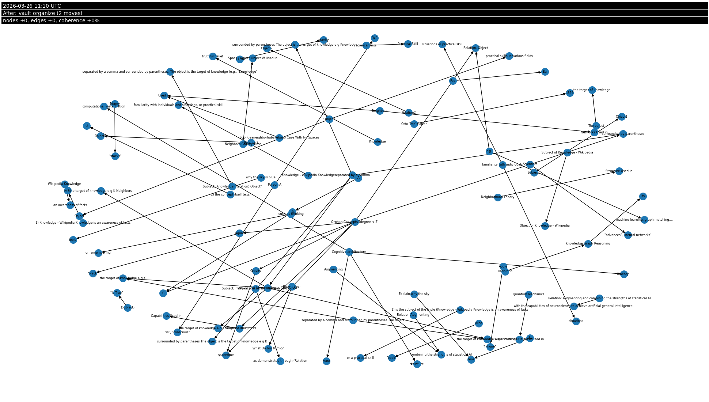](graph-2026-03-26-11-10-after-organize.png) [commit](https://github.com/BoggersTheFish/BoggersTheCIG/commit/641b452)

### 2026-03-26 11:10 UTC

**After:** 1 extracts, 1 merges — nodes +0, edges +0, coherence +0%

[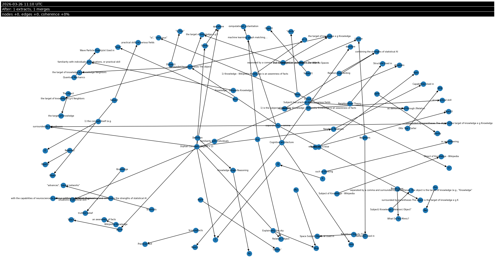](graph-2026-03-26-11-10-extract-subideas.png) [commit](https://github.com/BoggersTheFish/BoggersTheCIG/commit/641b452)

### 2026-03-26 11:10 UTC

**After:** 2_+2_.md"+A.md"+AI.md"+Knowledge.md" — nodes +0, edges +0, coherence +0%

[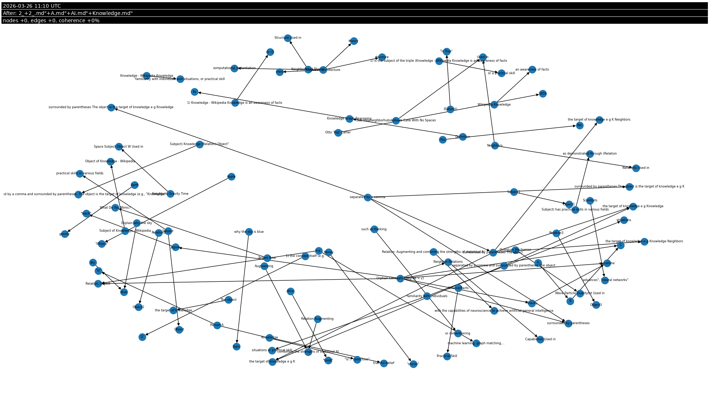](graph-2026-03-26-11-10-self-improve.png) [commit](https://github.com/BoggersTheFish/BoggersTheCIG/commit/641b452)

### 2026-03-26 16:19 UTC

**After:** external ingest (+1 triples) — nodes +4, edges +2, coherence +333233%

[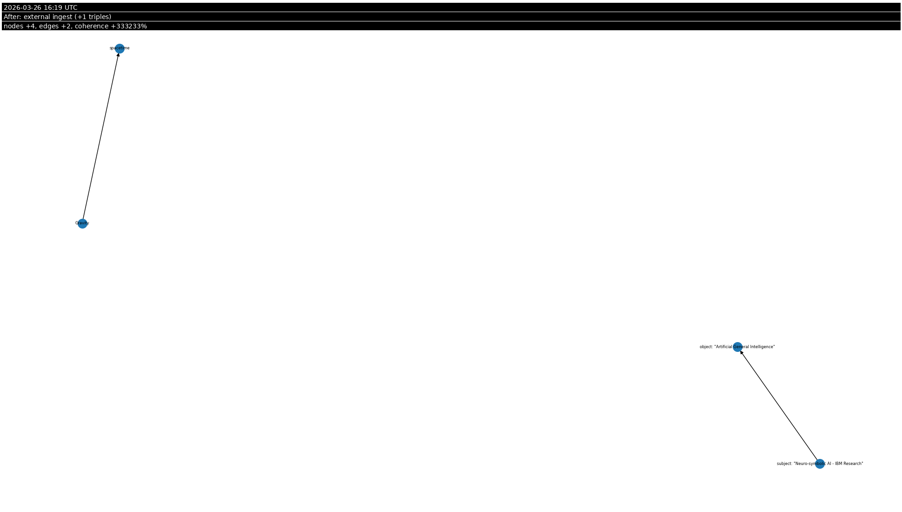](graph-2026-03-26-16-19-after-ingest.png) [commit](https://github.com/BoggersTheFish/BoggersTheCIG/commit/68f5ff7)

### 2026-03-26 16:19 UTC

**After:** vault analysis (+148 triples) — nodes +107, edges +72, coherence -96%

[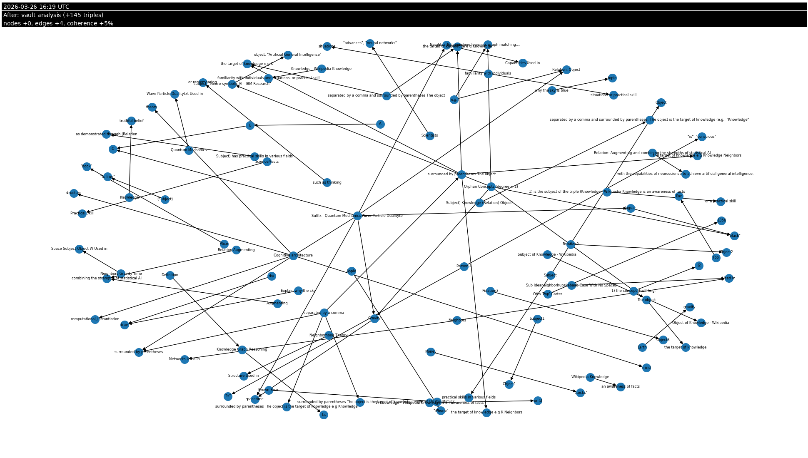](graph-2026-03-26-16-19-after-analyze-vault.png) [commit](https://github.com/BoggersTheFish/BoggersTheCIG/commit/68f5ff7)

### 2026-03-26 16:19 UTC

**After:** 1 extracts, 0 merges — nodes +0, edges +0, coherence +0%

[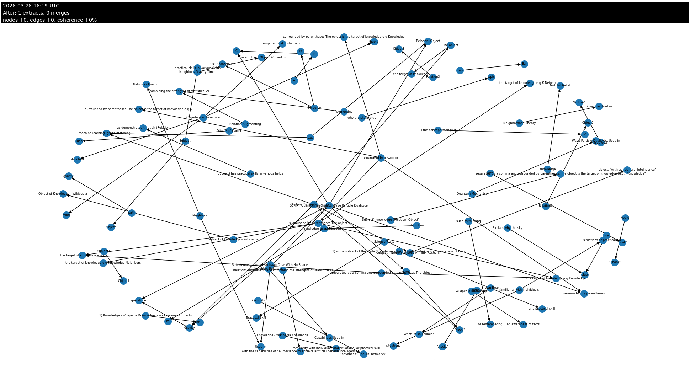](graph-2026-03-26-16-19-extract-subideas.png) [commit](https://github.com/BoggersTheFish/BoggersTheCIG/commit/68f5ff7)

### 2026-03-26 16:19 UTC

**After:** vault analysis (+145 triples) — nodes +0, edges +4, coherence +5%

 [commit](https://github.com/BoggersTheFish/BoggersTheCIG/commit/68f5ff7)

### 2026-03-26 16:19 UTC

**After:** 1 extracts, 0 merges — nodes +0, edges +0, coherence +0%

 [commit](https://github.com/BoggersTheFish/BoggersTheCIG/commit/68f5ff7)

### 2026-03-26 16:24 UTC

**After:** vault organize (0 moves) — nodes +0, edges +0, coherence +0%

[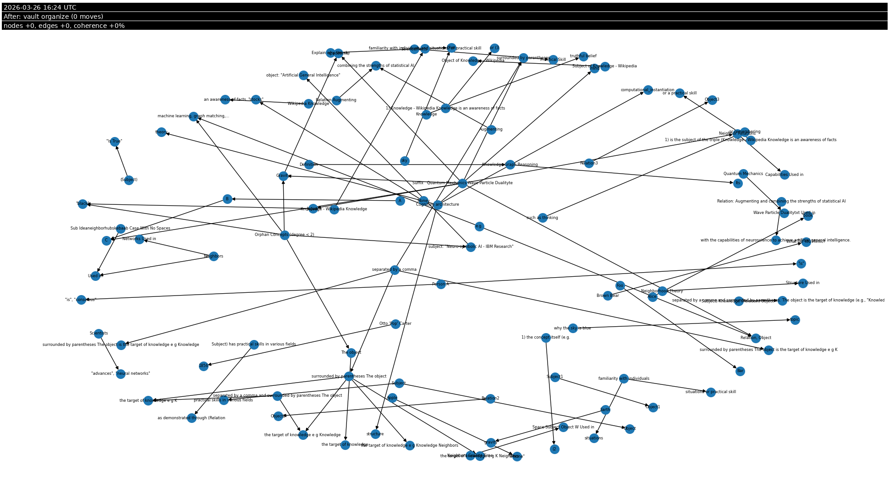](graph-2026-03-26-16-24-after-organize.png) [commit](https://github.com/BoggersTheFish/BoggersTheCIG/commit/68f5ff7)

### 2026-03-26 16:24 UTC

**After:** 0 extracts, 1 merges — nodes +0, edges +0, coherence +0%

[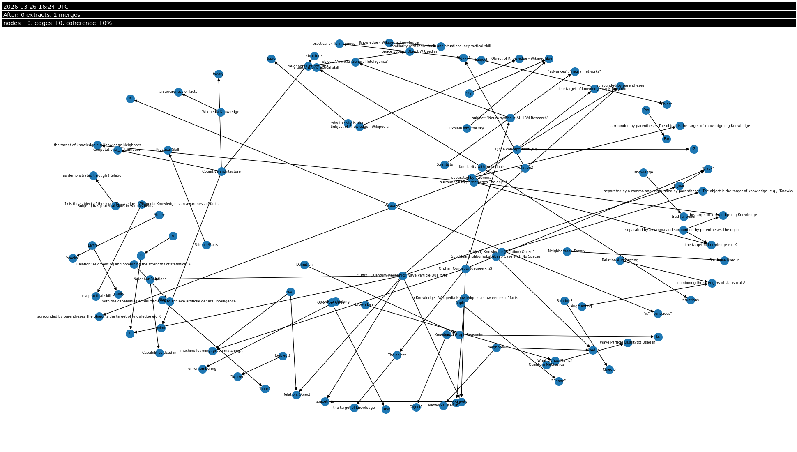](graph-2026-03-26-16-24-extract-subideas.png) [commit](https://github.com/BoggersTheFish/BoggersTheCIG/commit/68f5ff7)

### 2026-03-26 16:24 UTC

**After:** 2_.md"+AI.md"+Dualityte.md"+Intelligence_.md"+Knowledge.md" — nodes +0, edges +0, coherence +0%

[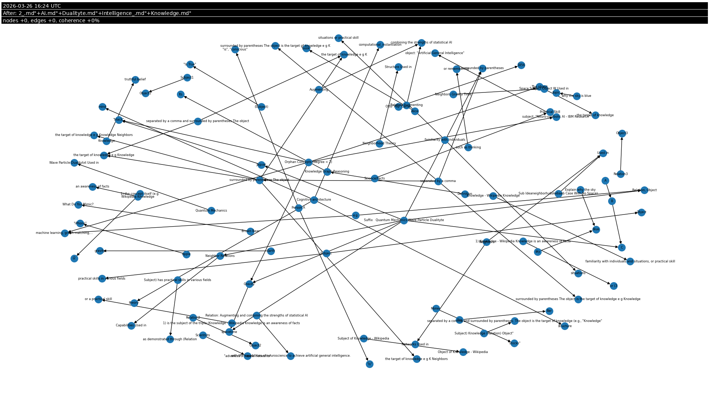](graph-2026-03-26-16-24-self-improve.png) [commit](https://github.com/BoggersTheFish/BoggersTheCIG/commit/68f5ff7)

### 2026-03-26 16:29 UTC

**After:** vault organize (1 moves) — nodes +0, edges +0, coherence +0%

[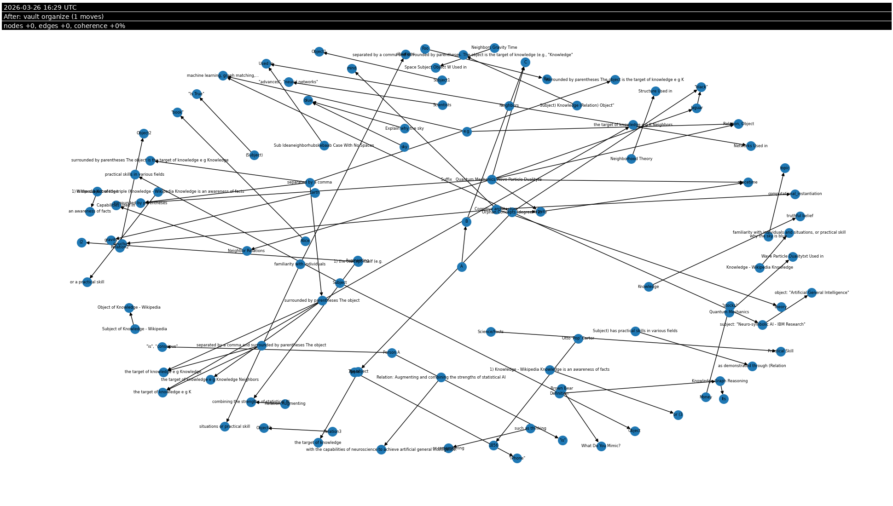](graph-2026-03-26-16-29-after-organize.png) [commit](https://github.com/BoggersTheFish/BoggersTheCIG/commit/68f5ff7)

### 2026-03-26 16:29 UTC

**After:** 0 extracts, 1 merges — nodes +0, edges +0, coherence +0%

[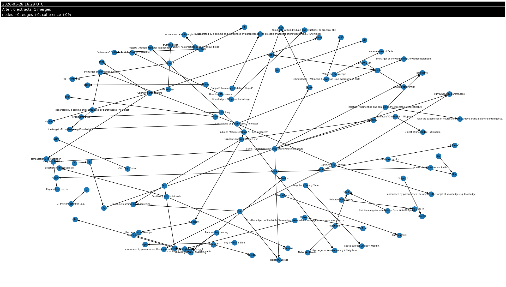](graph-2026-03-26-16-29-extract-subideas.png) [commit](https://github.com/BoggersTheFish/BoggersTheCIG/commit/68f5ff7)

### 2026-03-26 16:29 UTC

**After:** 2_.md"+AI.md"+Dualityte.md"+Intelligence_.md"+Knowledge.md" — nodes +0, edges +0, coherence +0%

[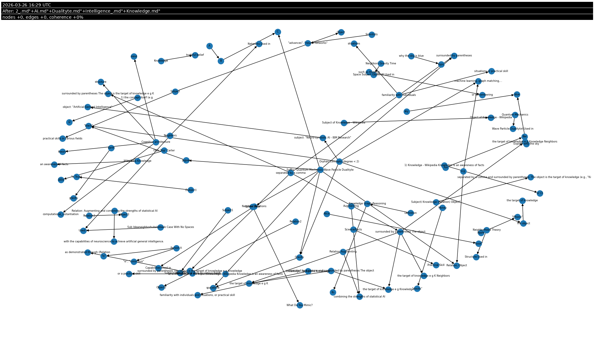](graph-2026-03-26-16-29-self-improve.png) [commit](https://github.com/BoggersTheFish/BoggersTheCIG/commit/68f5ff7)

### 2026-03-26 20:43 UTC

**After:** external ingest (+1 triples) — nodes +4, edges +2, coherence +333233%

[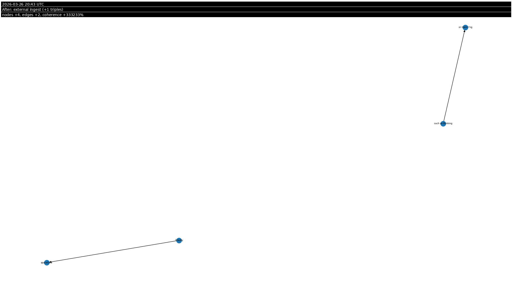](graph-2026-03-26-20-43-after-ingest.png) [commit](https://github.com/BoggersTheFish/BoggersTheCIG/commit/5a6da94)

### 2026-03-26 20:43 UTC

**After:** vault analysis (+140 triples) — nodes +107, edges +66, coherence -96%

[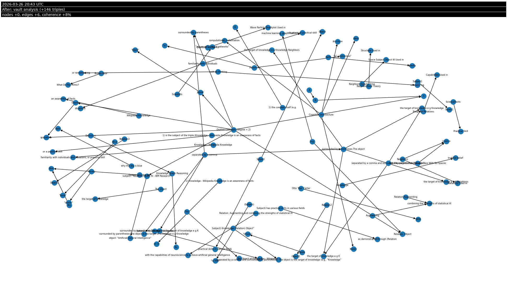](graph-2026-03-26-20-43-after-analyze-vault.png) [commit](https://github.com/BoggersTheFish/BoggersTheCIG/commit/5a6da94)

### 2026-03-26 20:43 UTC

**After:** vault analysis (+146 triples) — nodes +0, edges +6, coherence +8%

 [commit](https://github.com/BoggersTheFish/BoggersTheCIG/commit/5a6da94)

### 2026-03-26 20:48 UTC

**After:** vault organize (0 moves) — nodes +0, edges +0, coherence +0%

[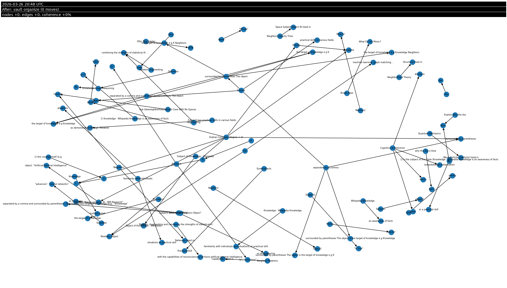](graph-2026-03-26-20-48-after-organize.png) [commit](https://github.com/BoggersTheFish/BoggersTheCIG/commit/5a6da94)

### 2026-03-26 20:48 UTC

**After:** 1 extracts, 0 merges — nodes +0, edges +0, coherence +0%

[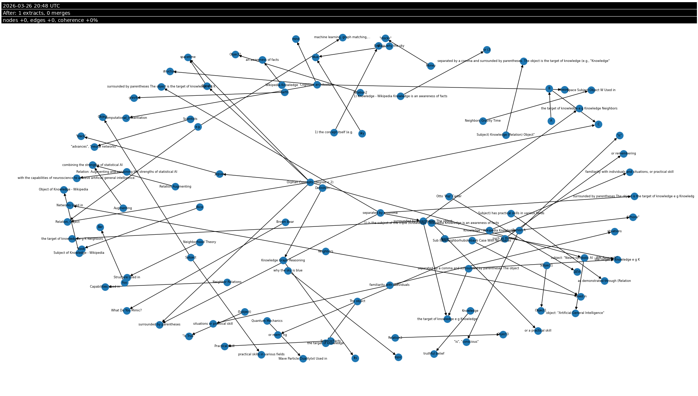](graph-2026-03-26-20-48-extract-subideas.png) [commit](https://github.com/BoggersTheFish/BoggersTheCIG/commit/5a6da94)

### 2026-03-26 20:48 UTC

**After:** 2_+2_.md"+Dualityte.md"+Research_.md"+eval — nodes +0, edges +0, coherence +0%

[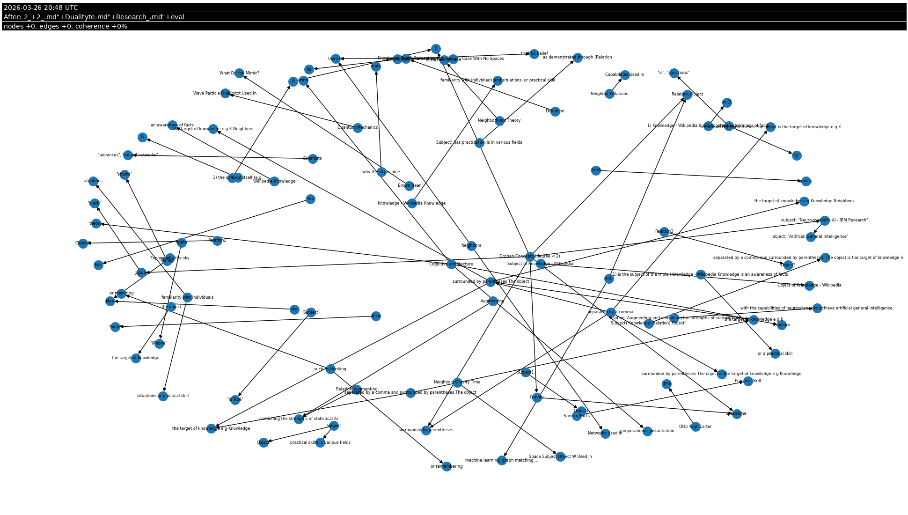](graph-2026-03-26-20-48-self-improve.png) [commit](https://github.com/BoggersTheFish/BoggersTheCIG/commit/5a6da94)

### 2026-03-26 20:54 UTC

**After:** vault organize (0 moves) — nodes +0, edges +0, coherence +0%

[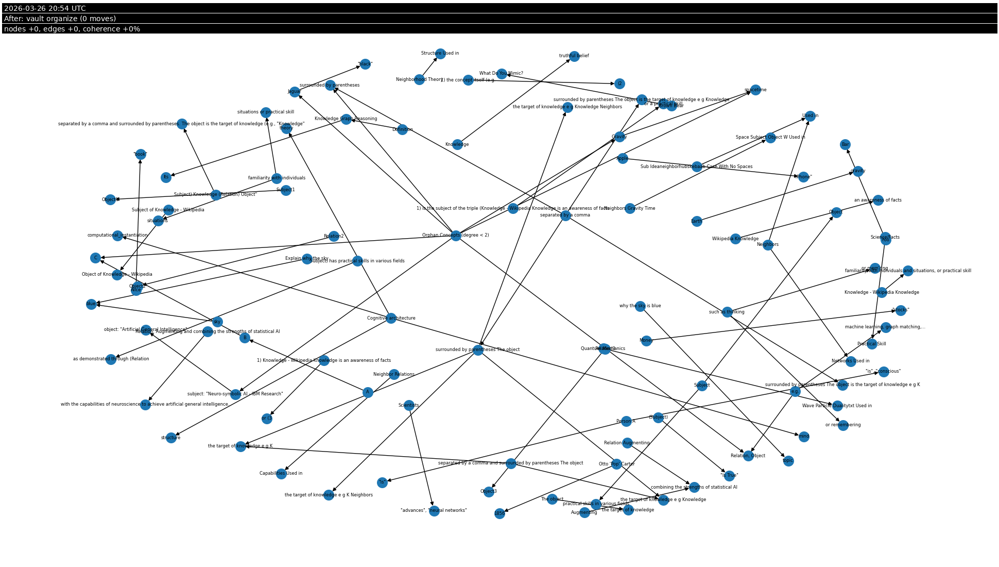](graph-2026-03-26-20-54-after-organize.png) [commit](https://github.com/BoggersTheFish/BoggersTheCIG/commit/5a6da94)

### 2026-03-26 20:54 UTC

**After:** 0 extracts, 1 merges — nodes +0, edges +0, coherence +0%

[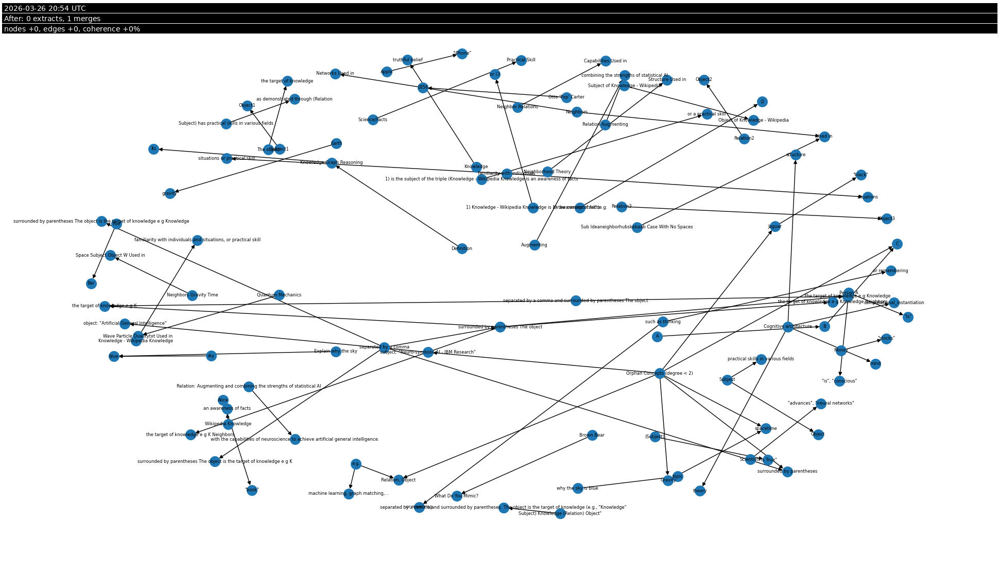](graph-2026-03-26-20-54-extract-subideas.png) [commit](https://github.com/BoggersTheFish/BoggersTheCIG/commit/5a6da94)

### 2026-03-26 20:54 UTC

**After:** 2_+2_.md"+Dualityte.md"+Research_.md"+eval — nodes +0, edges +0, coherence +0%

[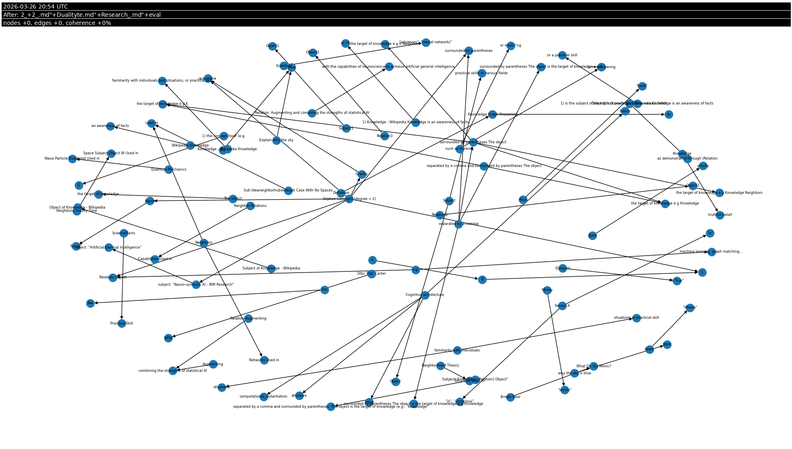](graph-2026-03-26-20-54-self-improve.png) [commit](https://github.com/BoggersTheFish/BoggersTheCIG/commit/5a6da94)

### 2026-03-27 02:20 UTC

**After:** vault analysis (+140 triples) — nodes +110, edges +67, coherence +11075%

[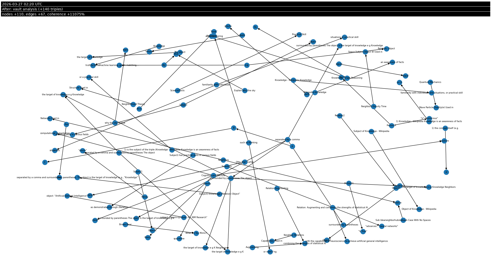](graph-2026-03-27-02-20-after-analyze-vault.png) [commit](https://github.com/BoggersTheFish/BoggersTheCIG/commit/3df6bcb)

### 2026-03-27 02:20 UTC

**After:** 1 extracts, 0 merges — nodes +0, edges +0, coherence +0%

[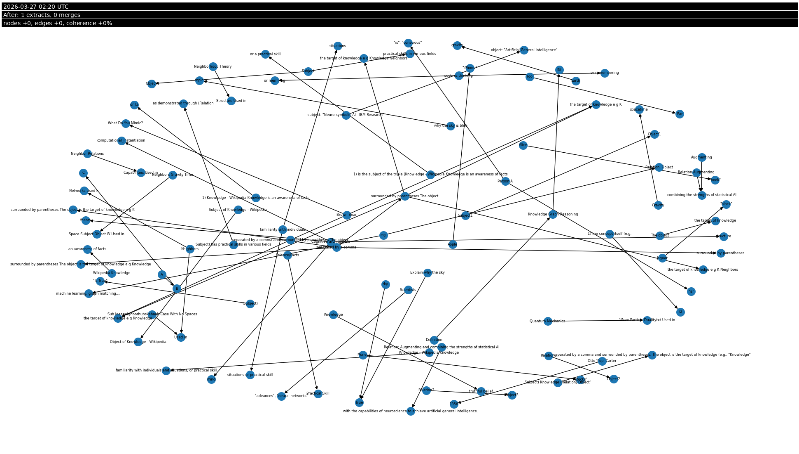](graph-2026-03-27-02-20-extract-subideas.png) [commit](https://github.com/BoggersTheFish/BoggersTheCIG/commit/3df6bcb)

### 2026-03-27 02:21 UTC

**After:** vault analysis (+147 triples) — nodes +1, edges +6, coherence +6%

[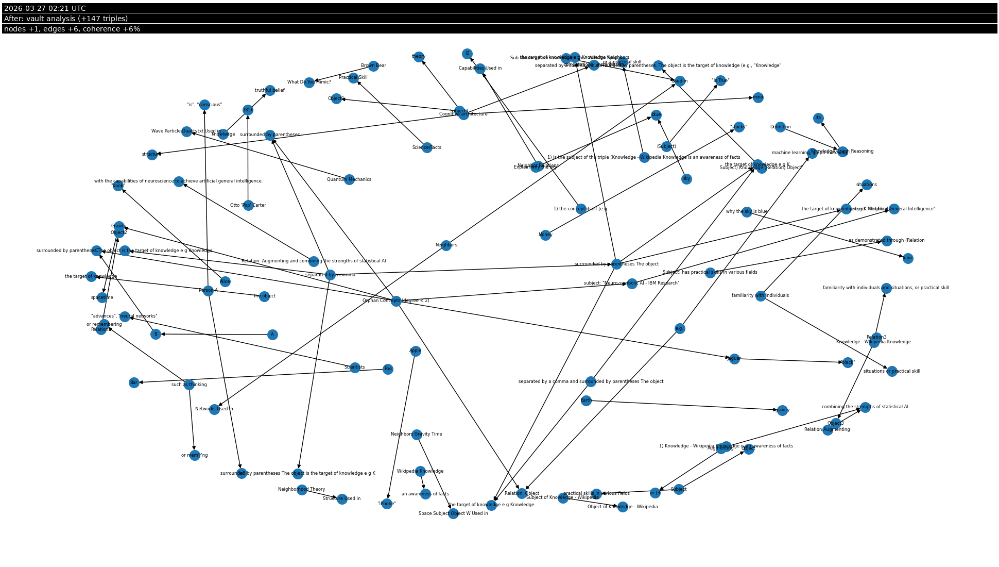](graph-2026-03-27-02-21-after-analyze-vault.png) [commit](https://github.com/BoggersTheFish/BoggersTheCIG/commit/3df6bcb)

### 2026-03-27 02:21 UTC

**After:** 1 extracts, 0 merges — nodes +0, edges +0, coherence +0%

[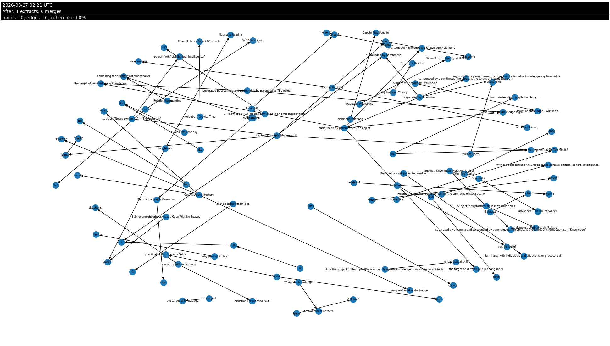](graph-2026-03-27-02-21-extract-subideas.png) [commit](https://github.com/BoggersTheFish/BoggersTheCIG/commit/3df6bcb)

### 2026-03-27 02:25 UTC

**After:** vault organize (1 moves) — nodes +0, edges +0, coherence +0%

[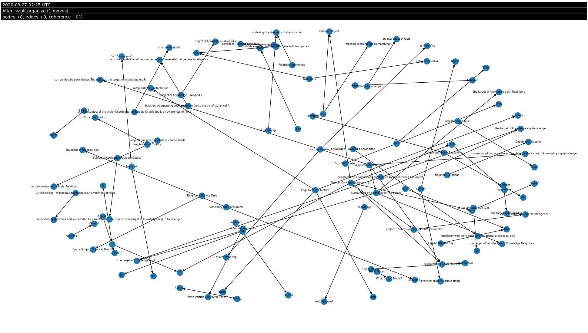](graph-2026-03-27-02-25-after-organize.png) [commit](https://github.com/BoggersTheFish/BoggersTheCIG/commit/3df6bcb)

### 2026-03-27 02:26 UTC

**After:** 0 extracts, 1 merges — nodes +0, edges +0, coherence +0%

[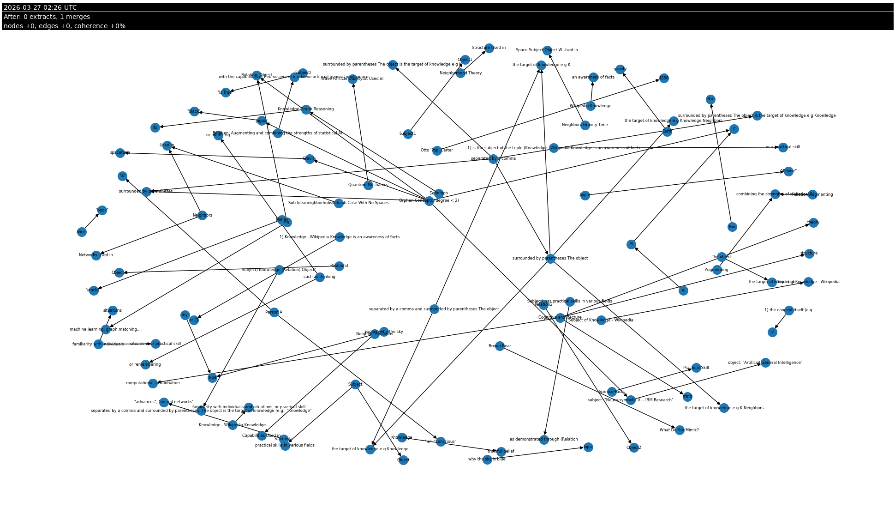](graph-2026-03-27-02-26-extract-subideas.png) [commit](https://github.com/BoggersTheFish/BoggersTheCIG/commit/3df6bcb)

### 2026-03-27 02:26 UTC

**After:** 2_+2_.md"+Wikipedia.md"+_Relation.md"+eval — nodes +0, edges +0, coherence +0%

[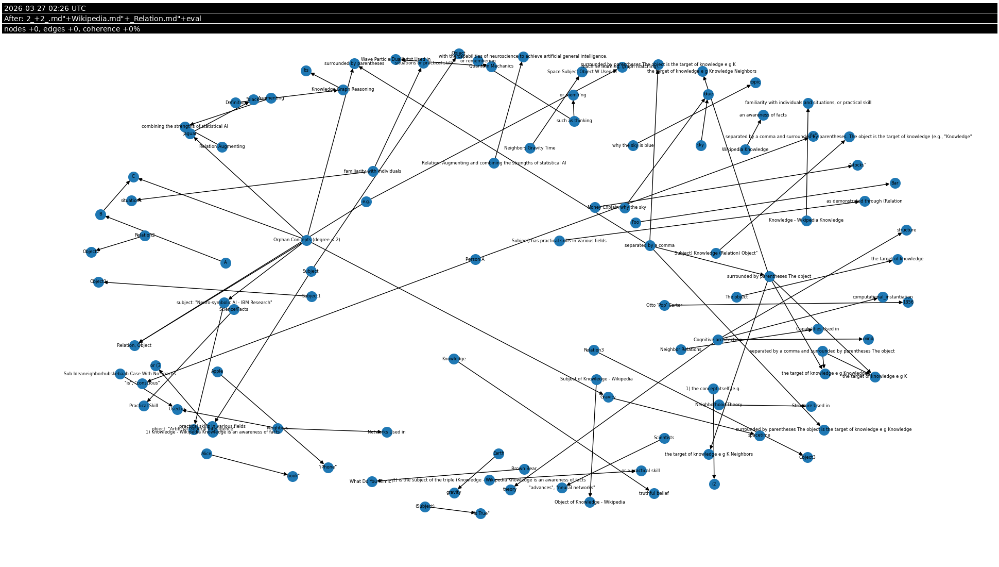](graph-2026-03-27-02-26-self-improve.png) [commit](https://github.com/BoggersTheFish/BoggersTheCIG/commit/3df6bcb)

### 2026-03-27 02:30 UTC

**After:** vault organize (0 moves) — nodes +0, edges +0, coherence +0%

[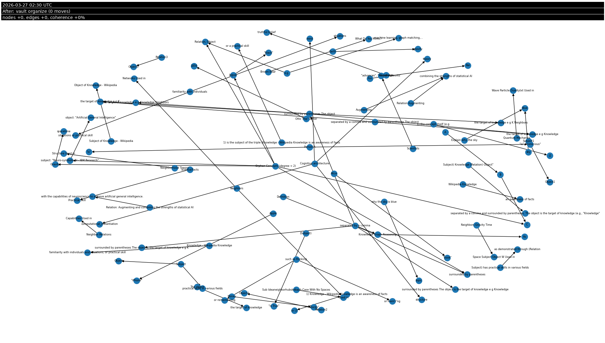](graph-2026-03-27-02-30-after-organize.png) [commit](https://github.com/BoggersTheFish/BoggersTheCIG/commit/3df6bcb)

### 2026-03-27 02:30 UTC

**After:** 1 extracts, 0 merges — nodes +0, edges +0, coherence +0%

[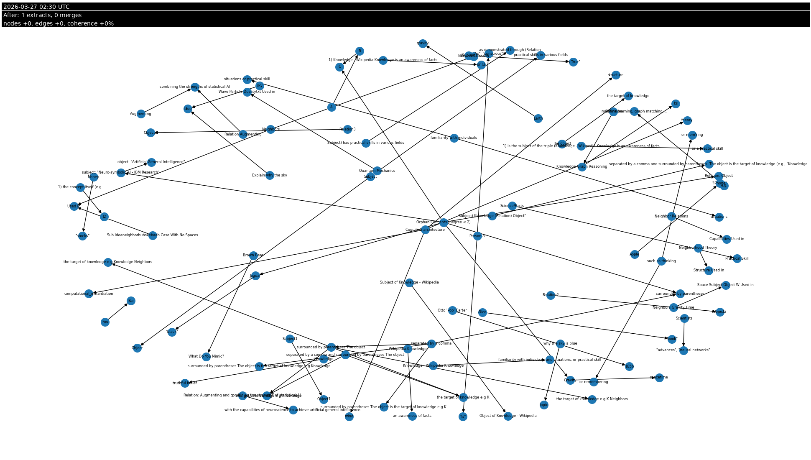](graph-2026-03-27-02-30-extract-subideas.png) [commit](https://github.com/BoggersTheFish/BoggersTheCIG/commit/3df6bcb)

### 2026-03-27 02:30 UTC

**After:** 2_+2_.md"+Wikipedia.md"+_Relation.md"+eval — nodes +0, edges +0, coherence +0%

[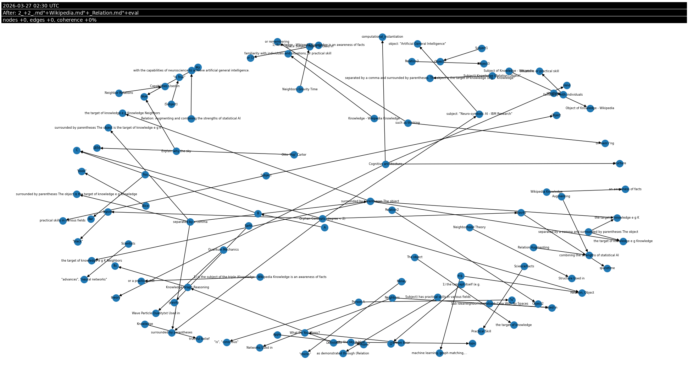](graph-2026-03-27-02-30-self-improve.png) [commit](https://github.com/BoggersTheFish/BoggersTheCIG/commit/3df6bcb)

### 2026-03-27 06:21 UTC

**After:** external ingest (+5 triples) — nodes +9, edges +6, coherence +166566%

[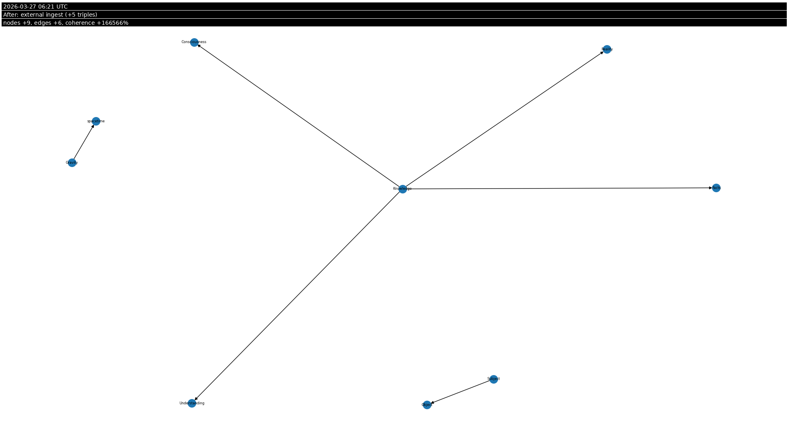](graph-2026-03-27-06-21-after-ingest.png) [commit](https://github.com/BoggersTheFish/BoggersTheCIG/commit/90d1c9e)

### 2026-03-27 06:21 UTC

**After:** vault analysis (+129 triples) — nodes +106, edges +66, coherence -93%

[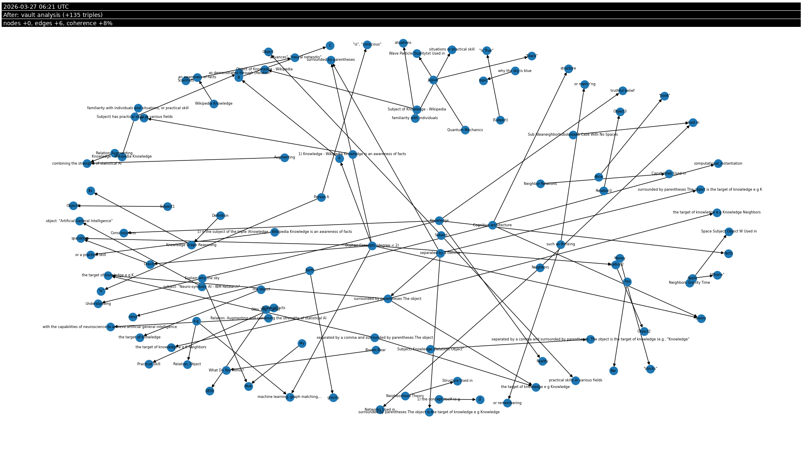](graph-2026-03-27-06-21-after-analyze-vault.png) [commit](https://github.com/BoggersTheFish/BoggersTheCIG/commit/90d1c9e)

### 2026-03-27 06:21 UTC

**After:** vault analysis (+135 triples) — nodes +0, edges +6, coherence +8%

 [commit](https://github.com/BoggersTheFish/BoggersTheCIG/commit/90d1c9e)

### 2026-03-27 06:27 UTC

**After:** vault organize (1 moves) — nodes +0, edges +0, coherence +0%

[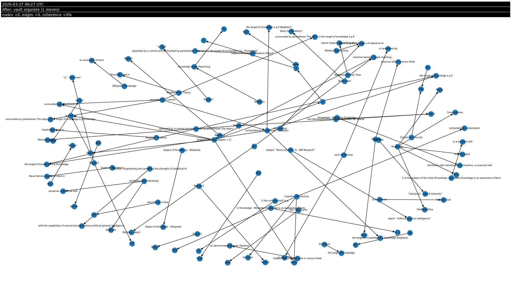](graph-2026-03-27-06-27-after-organize.png) [commit](https://github.com/BoggersTheFish/BoggersTheCIG/commit/90d1c9e)

### 2026-03-27 06:27 UTC

**After:** 1 extracts, 0 merges — nodes +0, edges +0, coherence +0%

[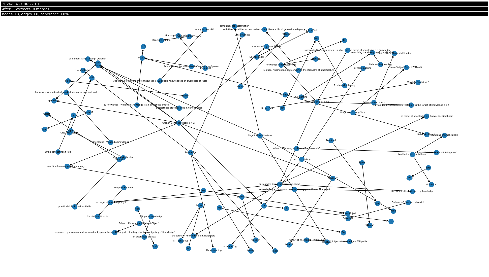](graph-2026-03-27-06-27-extract-subideas.png) [commit](https://github.com/BoggersTheFish/BoggersTheCIG/commit/90d1c9e)

### 2026-03-27 06:27 UTC

**After:** 2_+2_.md"+A.md"+Carter.md"+Knowledge.md" — nodes +0, edges +0, coherence +0%

[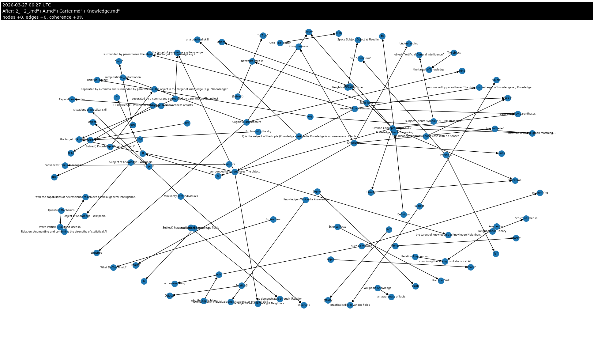](graph-2026-03-27-06-27-self-improve.png) [commit](https://github.com/BoggersTheFish/BoggersTheCIG/commit/90d1c9e)

### 2026-03-27 06:33 UTC

**After:** vault organize (0 moves) — nodes +0, edges +0, coherence +0%

[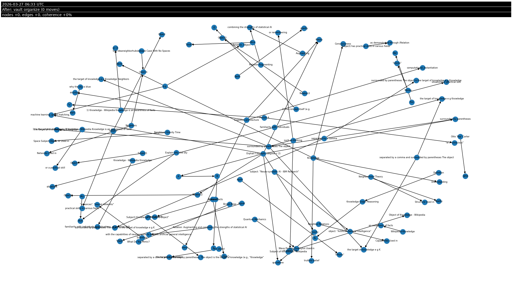](graph-2026-03-27-06-33-after-organize.png) [commit](https://github.com/BoggersTheFish/BoggersTheCIG/commit/90d1c9e)

### 2026-03-27 06:33 UTC

**After:** 0 extracts, 1 merges — nodes +0, edges +0, coherence +0%

[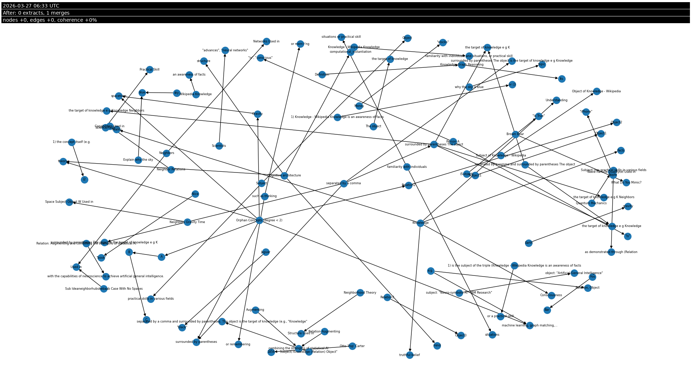](graph-2026-03-27-06-33-extract-subideas.png) [commit](https://github.com/BoggersTheFish/BoggersTheCIG/commit/90d1c9e)

### 2026-03-27 06:33 UTC

**After:** 2_+2_.md"+A.md"+Carter.md"+Knowledge.md" — nodes +0, edges +0, coherence +0%

[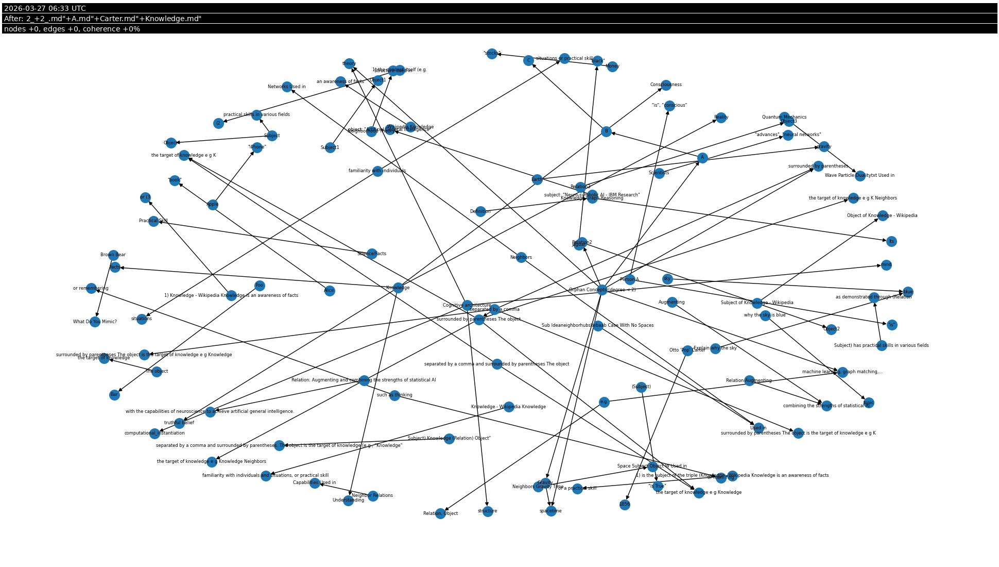](graph-2026-03-27-06-33-self-improve.png) [commit](https://github.com/BoggersTheFish/BoggersTheCIG/commit/90d1c9e)

### 2026-03-27 10:57 UTC

**After:** vault analysis (+139 triples) — nodes +114, edges +71, coherence +10923%

[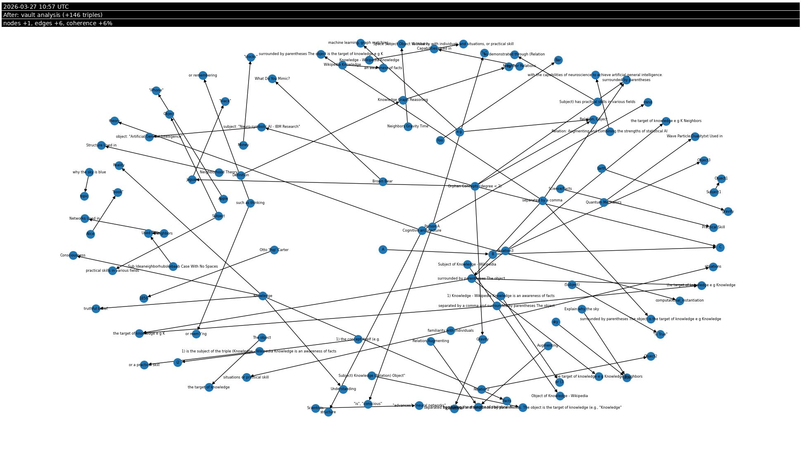](graph-2026-03-27-10-57-after-analyze-vault.png) [commit](https://github.com/BoggersTheFish/BoggersTheCIG/commit/dfbcdb8)

### 2026-03-27 10:57 UTC

**After:** 1 extracts, 0 merges — nodes +0, edges +0, coherence +0%

[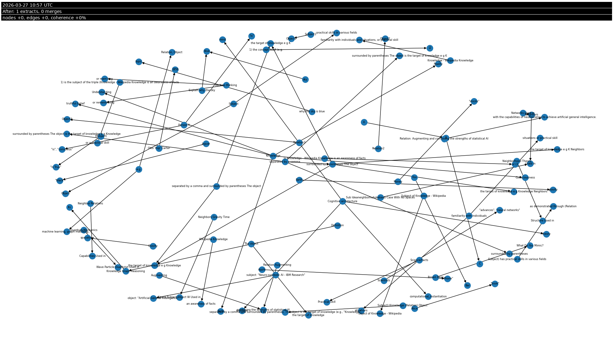](graph-2026-03-27-10-57-extract-subideas.png) [commit](https://github.com/BoggersTheFish/BoggersTheCIG/commit/dfbcdb8)

### 2026-03-27 10:58 UTC

**After:** vault analysis (+146 triples) — nodes +1, edges +6, coherence +6%

 [commit](https://github.com/BoggersTheFish/BoggersTheCIG/commit/dfbcdb8)

### 2026-03-27 10:58 UTC

**After:** 1 extracts, 0 merges — nodes +0, edges +0, coherence +0%

[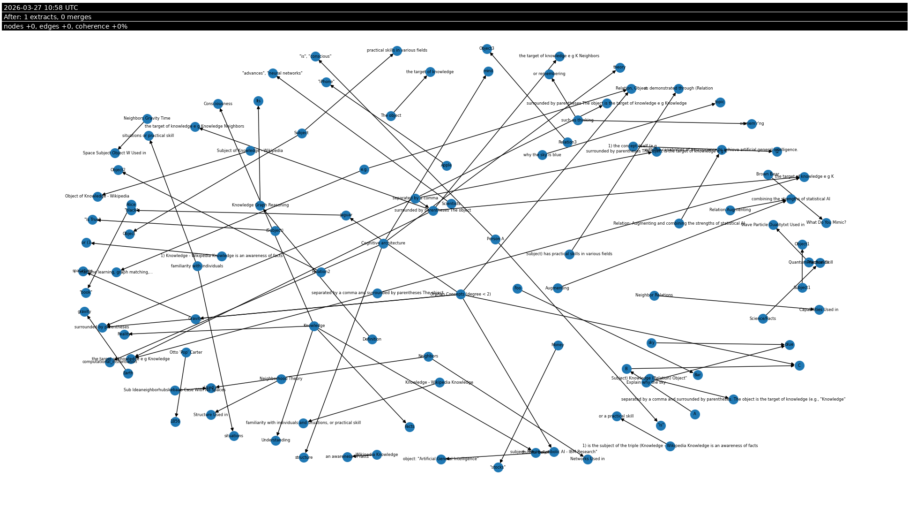](graph-2026-03-27-10-58-extract-subideas.png) [commit](https://github.com/BoggersTheFish/BoggersTheCIG/commit/dfbcdb8)

### 2026-03-27 11:03 UTC

**After:** vault organize (3 moves) — nodes +0, edges +0, coherence +0%

[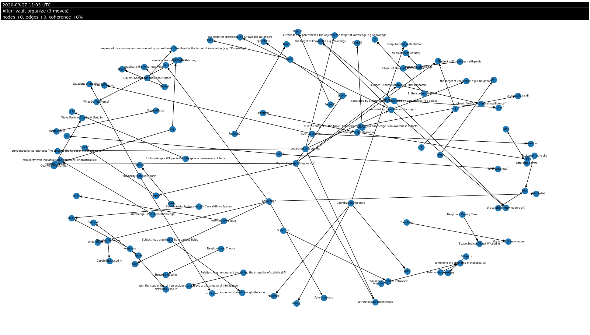](graph-2026-03-27-11-03-after-organize.png) [commit](https://github.com/BoggersTheFish/BoggersTheCIG/commit/dfbcdb8)

### 2026-03-27 11:03 UTC

**After:** 0 extracts, 1 merges — nodes +0, edges +0, coherence +0%

[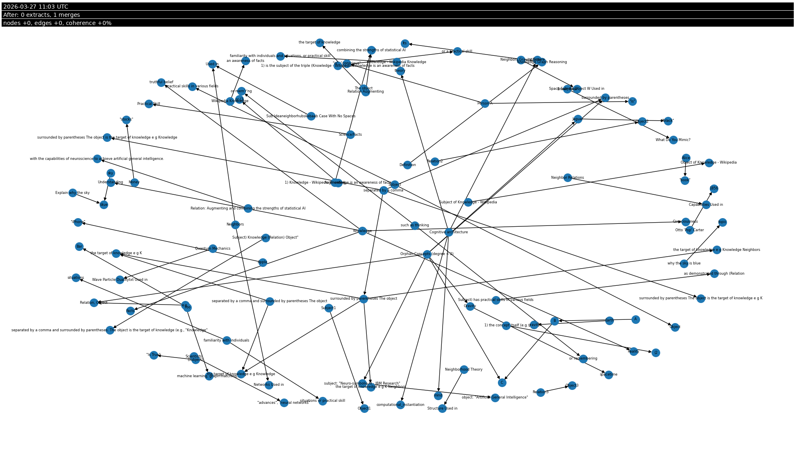](graph-2026-03-27-11-03-extract-subideas.png) [commit](https://github.com/BoggersTheFish/BoggersTheCIG/commit/dfbcdb8)

### 2026-03-27 11:03 UTC

**After:** 2_+2_.md"+Carter.md"+Research_.md"+architecture.md" — nodes +0, edges +0, coherence +0%

[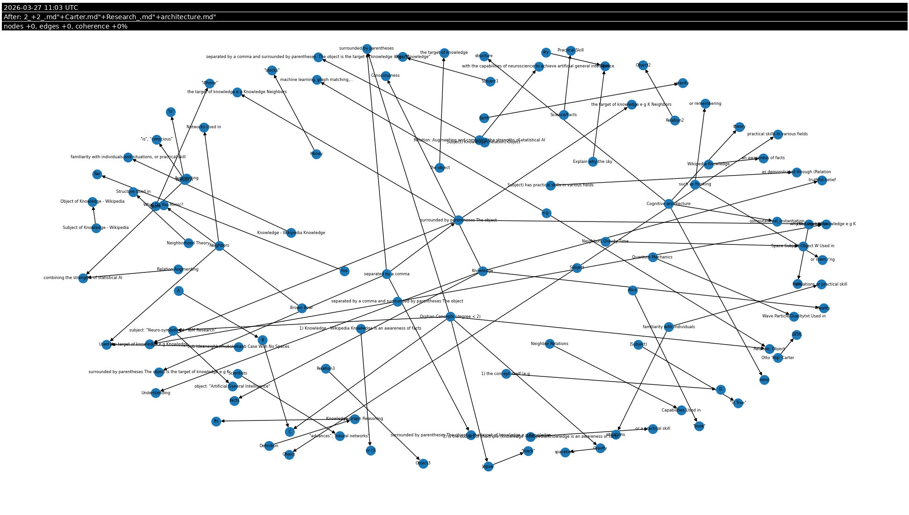](graph-2026-03-27-11-03-self-improve.png) [commit](https://github.com/BoggersTheFish/BoggersTheCIG/commit/dfbcdb8)

### 2026-03-27 11:08 UTC

**After:** vault organize (0 moves) — nodes +0, edges +0, coherence +0%

[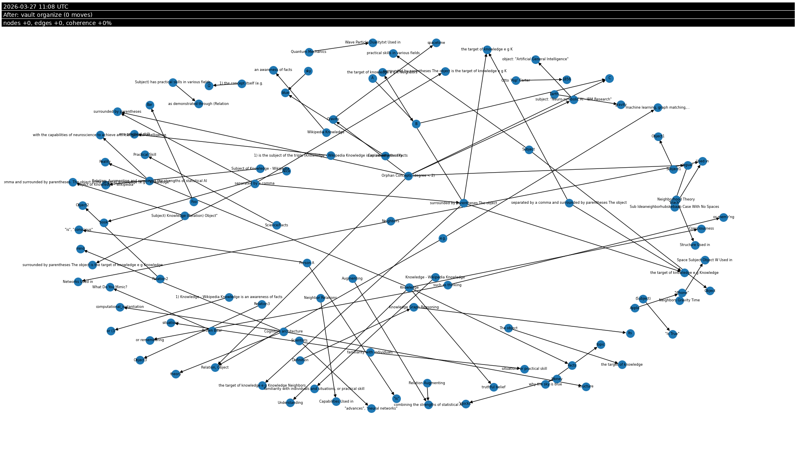](graph-2026-03-27-11-08-after-organize.png) [commit](https://github.com/BoggersTheFish/BoggersTheCIG/commit/dfbcdb8)

### 2026-03-27 11:09 UTC

**After:** 1 extracts, 0 merges — nodes +0, edges +0, coherence +0%

[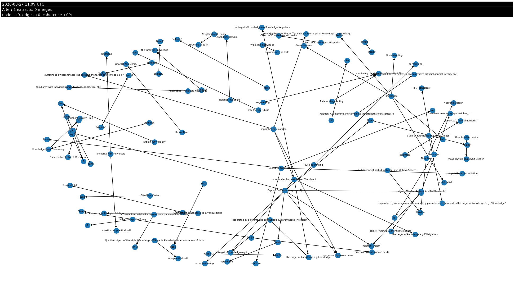](graph-2026-03-27-11-09-extract-subideas.png) [commit](https://github.com/BoggersTheFish/BoggersTheCIG/commit/dfbcdb8)

### 2026-03-27 11:09 UTC

**After:** 2_+2_.md"+Carter.md"+Research_.md"+architecture.md" — nodes +0, edges +0, coherence +0%

[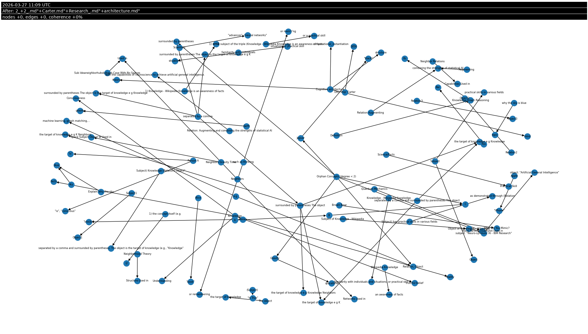](graph-2026-03-27-11-09-self-improve.png) [commit](https://github.com/BoggersTheFish/BoggersTheCIG/commit/dfbcdb8)

### 2026-03-27 16:00 UTC

**After:** vault analysis (+139 triples) — nodes +114, edges +71, coherence +10923%

[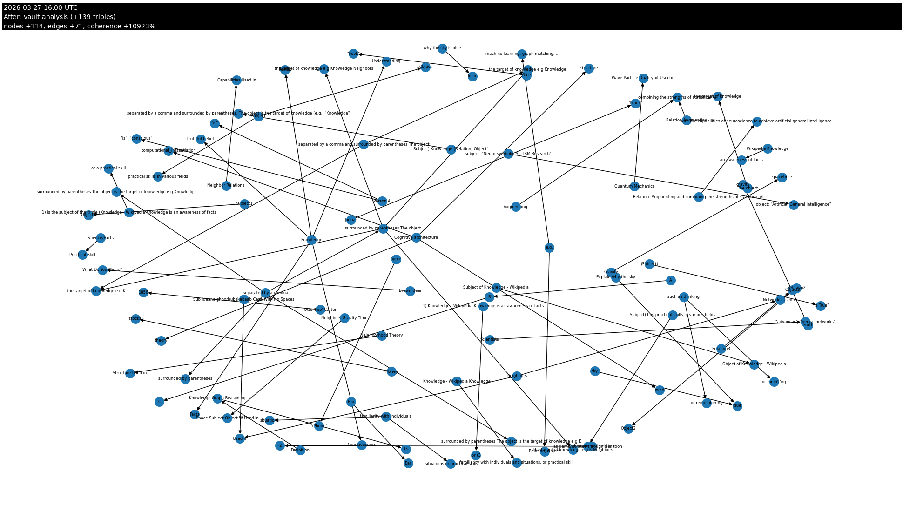](graph-2026-03-27-16-00-after-analyze-vault.png) [commit](https://github.com/BoggersTheFish/BoggersTheCIG/commit/1ff28e9)

### 2026-03-27 16:01 UTC

**After:** vault analysis (+146 triples) — nodes +1, edges +6, coherence +6%

[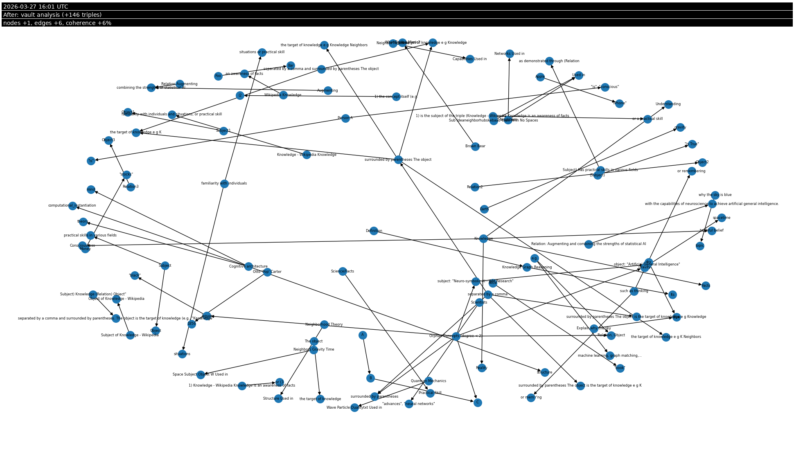](graph-2026-03-27-16-01-after-analyze-vault.png) [commit](https://github.com/BoggersTheFish/BoggersTheCIG/commit/1ff28e9)

### 2026-03-27 16:06 UTC

**After:** vault organize (0 moves) — nodes +0, edges +0, coherence +0%

[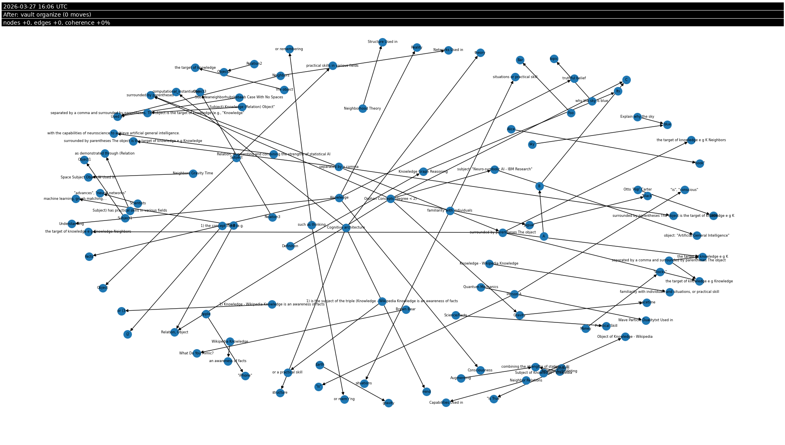](graph-2026-03-27-16-06-after-organize.png) [commit](https://github.com/BoggersTheFish/BoggersTheCIG/commit/1ff28e9)

### 2026-03-27 16:06 UTC

**After:** 1 extracts, 0 merges — nodes +0, edges +0, coherence +0%

[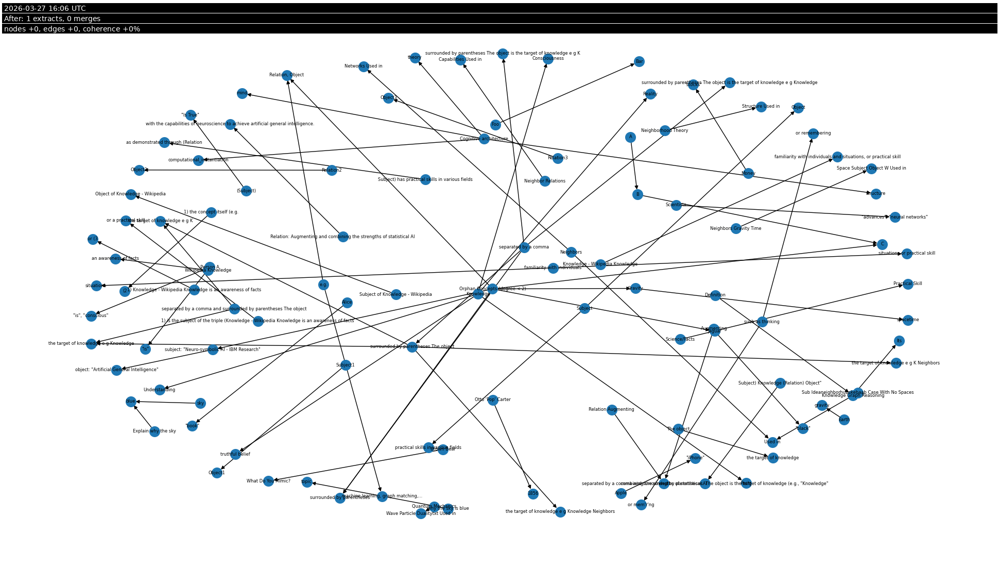](graph-2026-03-27-16-06-extract-subideas.png) [commit](https://github.com/BoggersTheFish/BoggersTheCIG/commit/1ff28e9)

### 2026-03-27 16:06 UTC

**After:** 2_+2_.md"+eval+obsidian — nodes +0, edges +0, coherence +0%

[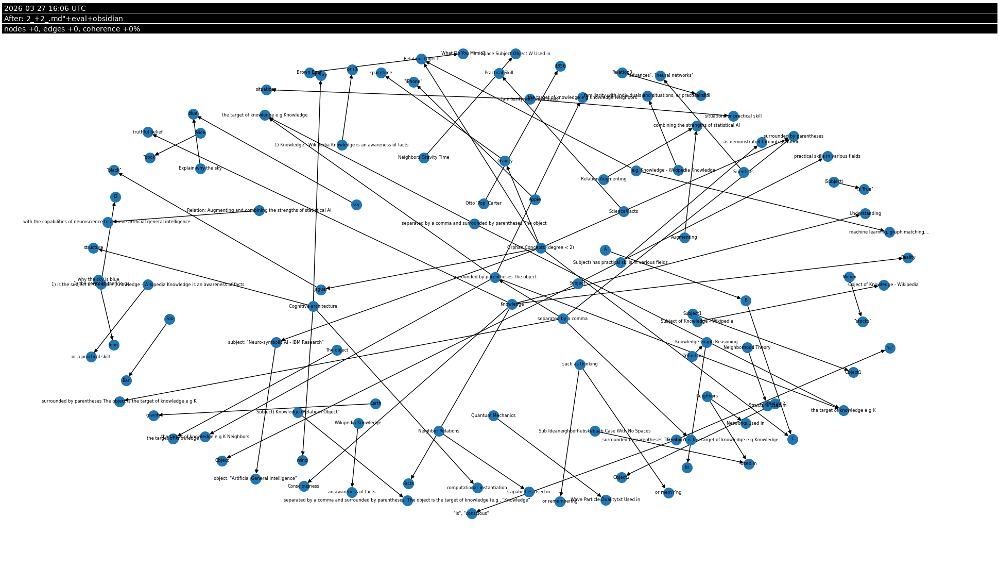](graph-2026-03-27-16-06-self-improve.png) [commit](https://github.com/BoggersTheFish/BoggersTheCIG/commit/1ff28e9)

### 2026-03-27 16:11 UTC

**After:** vault organize (1 moves) — nodes +0, edges +0, coherence +0%

[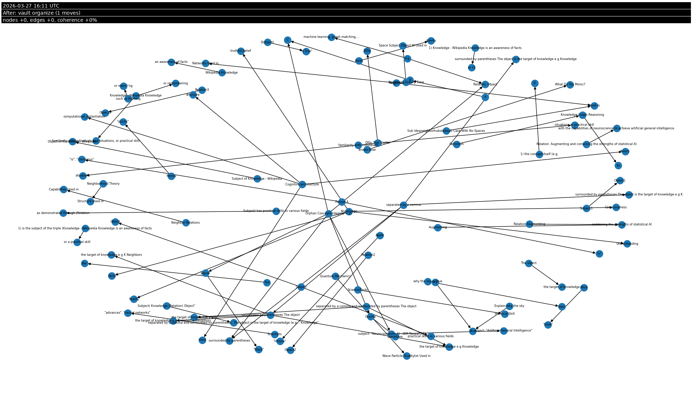](graph-2026-03-27-16-11-after-organize.png) [commit](https://github.com/BoggersTheFish/BoggersTheCIG/commit/1ff28e9)

### 2026-03-27 16:11 UTC

**After:** 0 extracts, 1 merges — nodes +0, edges +0, coherence +0%

[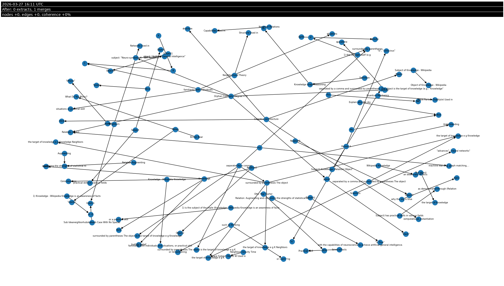](graph-2026-03-27-16-11-extract-subideas.png) [commit](https://github.com/BoggersTheFish/BoggersTheCIG/commit/1ff28e9)

### 2026-03-27 16:12 UTC

**After:** 2_+2_.md"+eval+mem_r_ng.md"+obsidian — nodes +0, edges +0, coherence +0%

[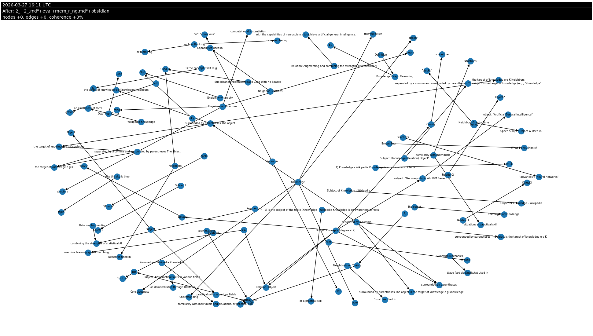](graph-2026-03-27-16-11-self-improve.png) [commit](https://github.com/BoggersTheFish/BoggersTheCIG/commit/1ff28e9)

### 2026-03-27 20:48 UTC

**After:** vault analysis (+135 triples) — nodes +114, edges +71, coherence +10923%

[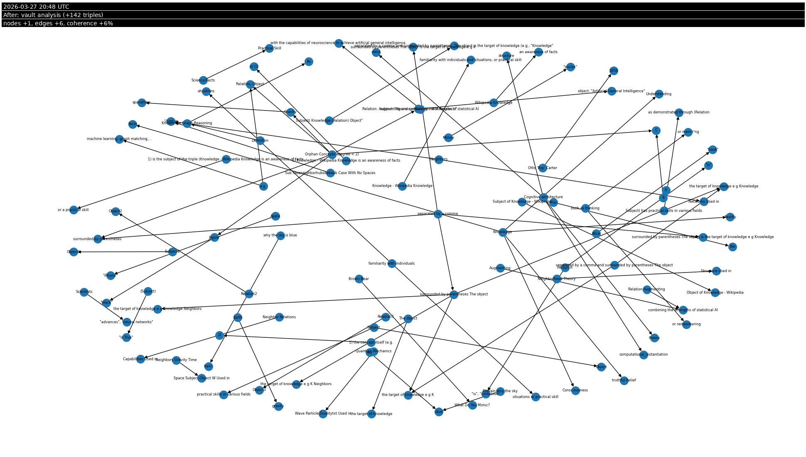](graph-2026-03-27-20-48-after-analyze-vault.png) [commit](https://github.com/BoggersTheFish/BoggersTheCIG/commit/2d20bd9)

### 2026-03-27 20:48 UTC

**After:** vault analysis (+142 triples) — nodes +1, edges +6, coherence +6%

 [commit](https://github.com/BoggersTheFish/BoggersTheCIG/commit/2d20bd9)

### 2026-03-27 20:53 UTC

**After:** vault organize (0 moves) — nodes +0, edges +0, coherence +0%

[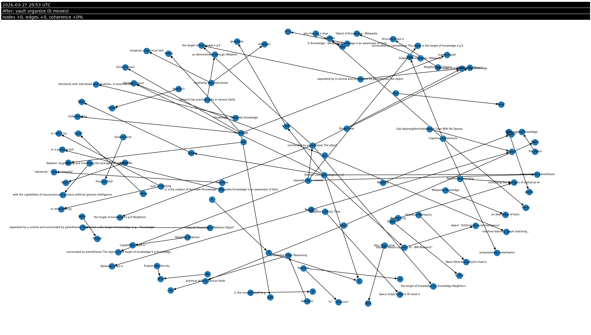](graph-2026-03-27-20-53-after-organize.png) [commit](https://github.com/BoggersTheFish/BoggersTheCIG/commit/2d20bd9)

### 2026-03-27 20:53 UTC

**After:** 1 extracts, 0 merges — nodes +0, edges +0, coherence +0%

[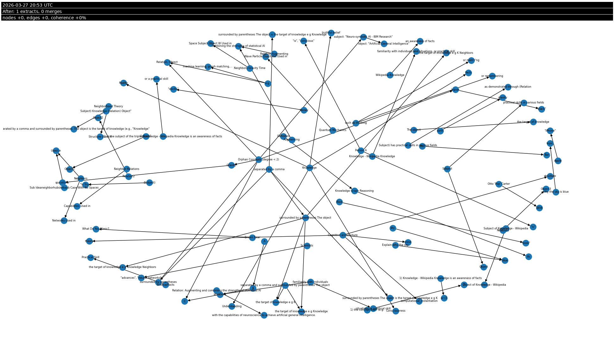](graph-2026-03-27-20-53-extract-subideas.png) [commit](https://github.com/BoggersTheFish/BoggersTheCIG/commit/2d20bd9)

### 2026-03-27 20:53 UTC

**After:** 2_+2_.md"+architecture.md"+eval+obsidian — nodes +0, edges +0, coherence +0%

[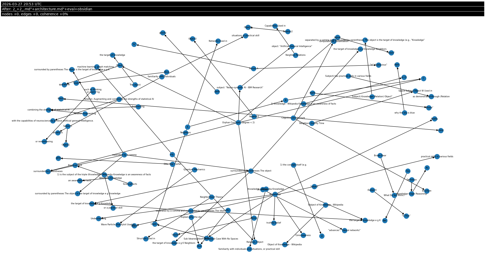](graph-2026-03-27-20-53-self-improve.png) [commit](https://github.com/BoggersTheFish/BoggersTheCIG/commit/2d20bd9)

### 2026-03-27 20:59 UTC

**After:** vault organize (0 moves) — nodes +0, edges +0, coherence +0%

[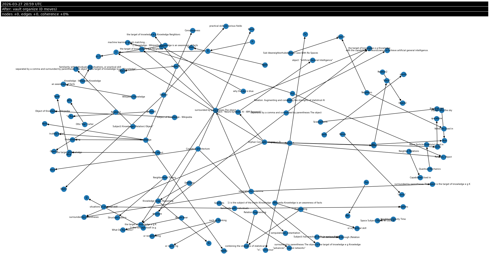](graph-2026-03-27-20-59-after-organize.png) [commit](https://github.com/BoggersTheFish/BoggersTheCIG/commit/2d20bd9)

### 2026-03-27 20:59 UTC

**After:** 0 extracts, 1 merges — nodes +0, edges +0, coherence +0%

[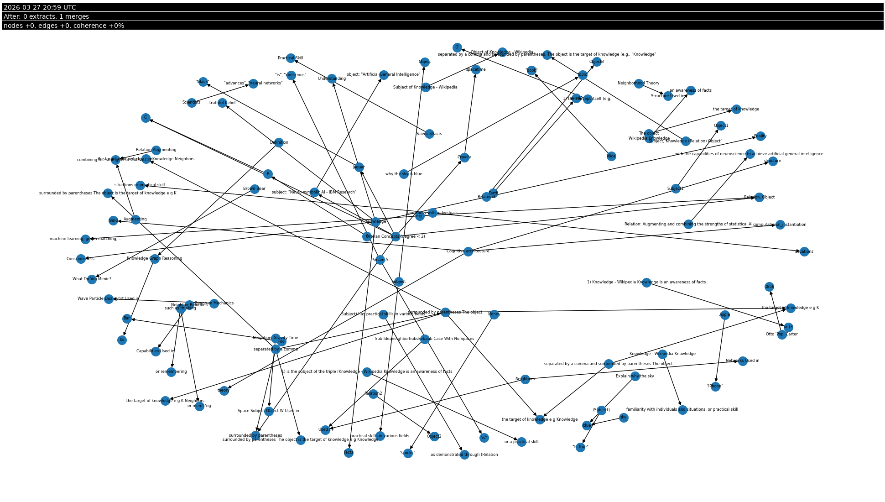](graph-2026-03-27-20-59-extract-subideas.png) [commit](https://github.com/BoggersTheFish/BoggersTheCIG/commit/2d20bd9)

### 2026-03-27 20:59 UTC

**After:** 2_+2_.md"+architecture.md"+eval+obsidian — nodes +0, edges +0, coherence +0%

[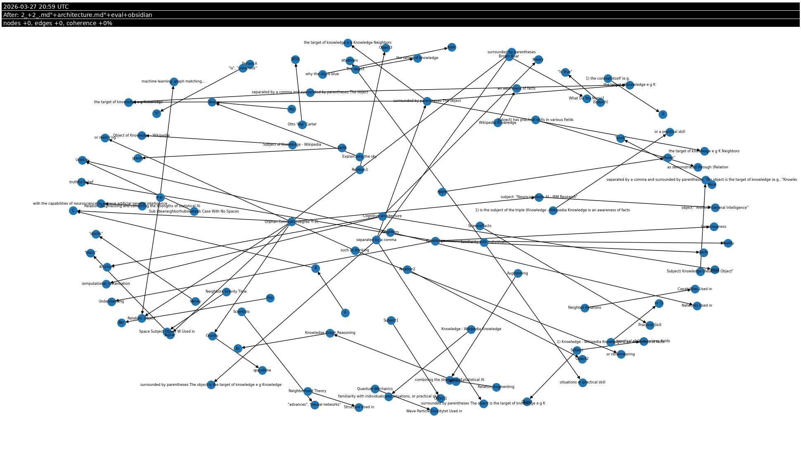](graph-2026-03-27-20-59-self-improve.png) [commit](https://github.com/BoggersTheFish/BoggersTheCIG/commit/2d20bd9)

### 2026-03-28 02:12 UTC

**After:** vault analysis (+135 triples) — nodes +114, edges +71, coherence +10923%

[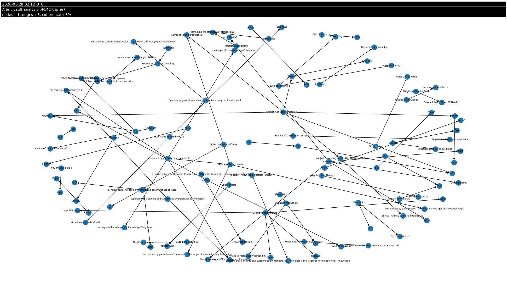](graph-2026-03-28-02-12-after-analyze-vault.png) [commit](https://github.com/BoggersTheFish/BoggersTheCIG/commit/77927d4)

### 2026-03-28 02:12 UTC

**After:** 1 extracts, 0 merges — nodes +0, edges +0, coherence +0%

[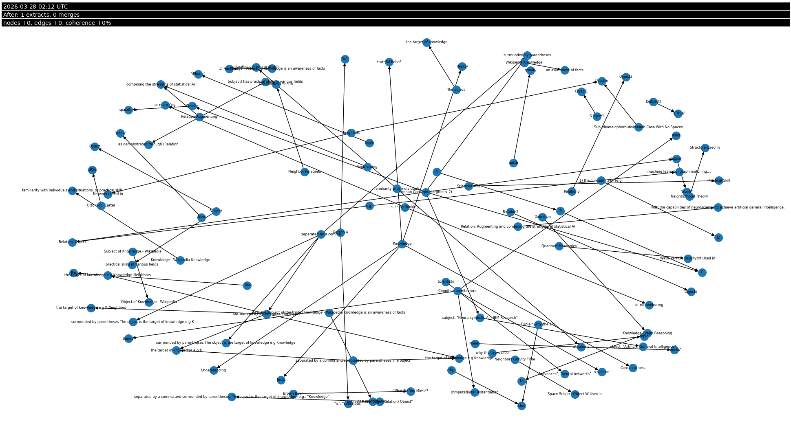](graph-2026-03-28-02-12-extract-subideas.png) [commit](https://github.com/BoggersTheFish/BoggersTheCIG/commit/77927d4)

### 2026-03-28 02:12 UTC

**After:** vault analysis (+142 triples) — nodes +1, edges +6, coherence +6%

 [commit](https://github.com/BoggersTheFish/BoggersTheCIG/commit/77927d4)

### 2026-03-28 02:12 UTC

**After:** 1 extracts, 0 merges — nodes +0, edges +0, coherence +0%

 [commit](https://github.com/BoggersTheFish/BoggersTheCIG/commit/77927d4)

### 2026-03-28 02:17 UTC

**After:** vault organize (0 moves) — nodes +0, edges +0, coherence +0%

[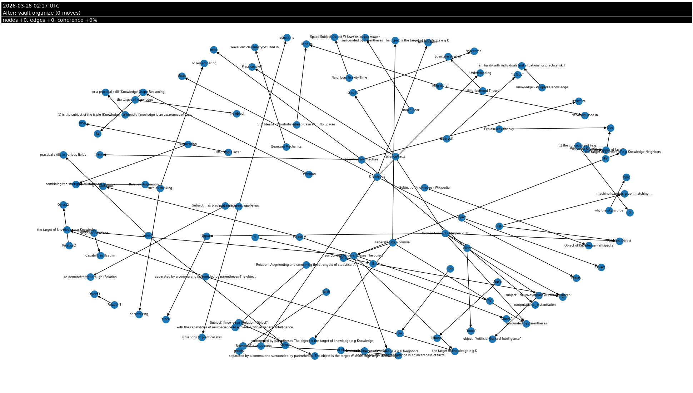](graph-2026-03-28-02-17-after-organize.png) [commit](https://github.com/BoggersTheFish/BoggersTheCIG/commit/77927d4)

### 2026-03-28 02:17 UTC

**After:** 0 extracts, 1 merges — nodes +0, edges +0, coherence +0%

[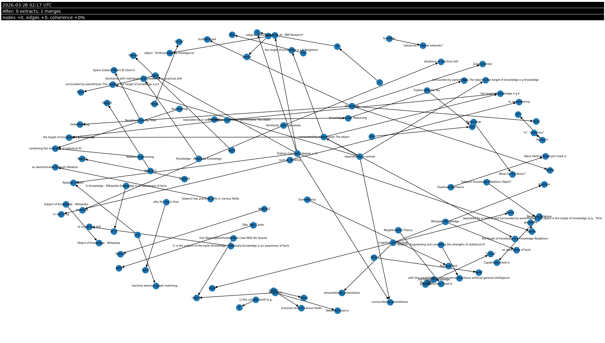](graph-2026-03-28-02-17-extract-subideas.png) [commit](https://github.com/BoggersTheFish/BoggersTheCIG/commit/77927d4)

### 2026-03-28 02:17 UTC

**After:** 2_+2_.md"+Neighbors.md"+eval+in.md" — nodes +0, edges +0, coherence +0%

[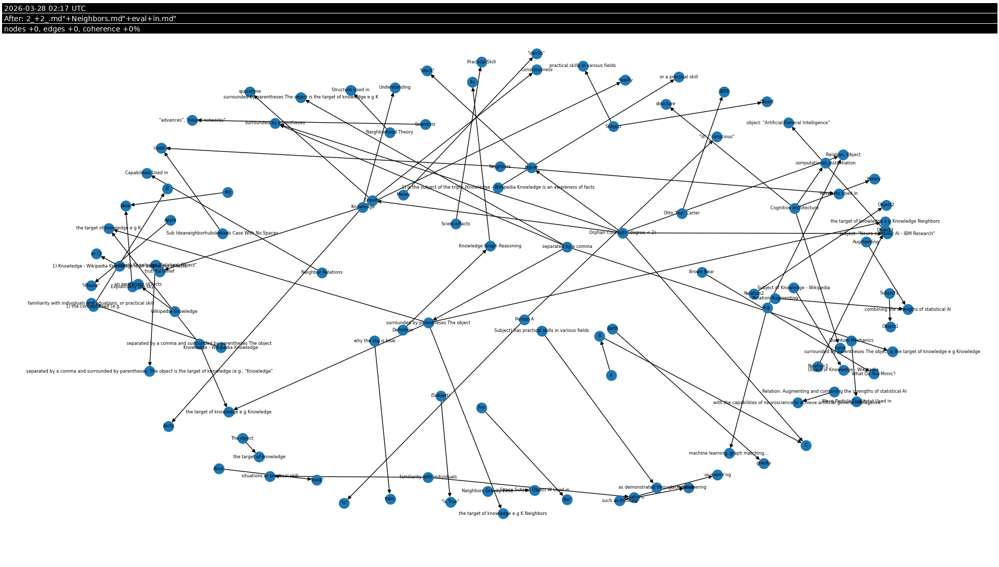](graph-2026-03-28-02-17-self-improve.png) [commit](https://github.com/BoggersTheFish/BoggersTheCIG/commit/77927d4)

### 2026-03-28 02:22 UTC

**After:** vault organize (0 moves) — nodes +0, edges +0, coherence +0%

[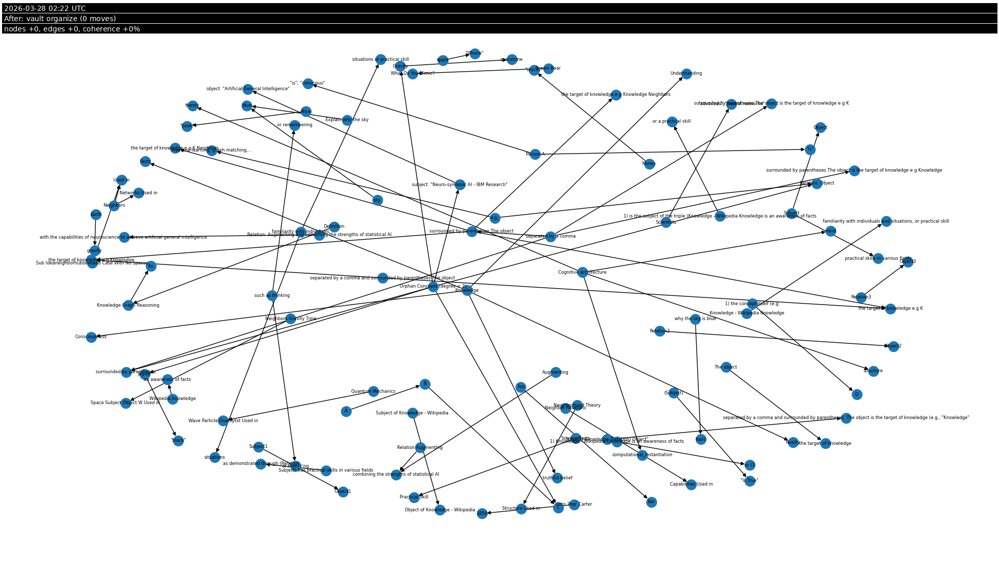](graph-2026-03-28-02-22-after-organize.png) [commit](https://github.com/BoggersTheFish/BoggersTheCIG/commit/77927d4)

### 2026-03-28 02:22 UTC

**After:** 1 extracts, 0 merges — nodes +0, edges +0, coherence +0%

[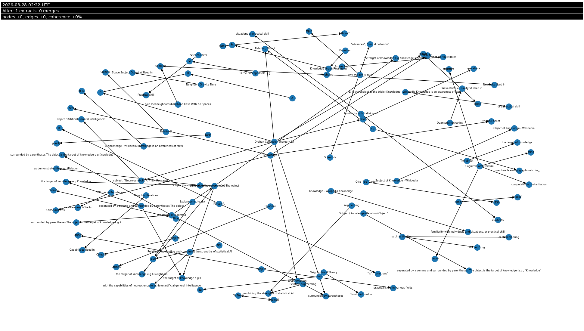](graph-2026-03-28-02-22-extract-subideas.png) [commit](https://github.com/BoggersTheFish/BoggersTheCIG/commit/77927d4)

### 2026-03-28 02:22 UTC

**After:** 2_+2_.md"+Neighbors.md"+eval+in.md" — nodes +0, edges +0, coherence +0%

[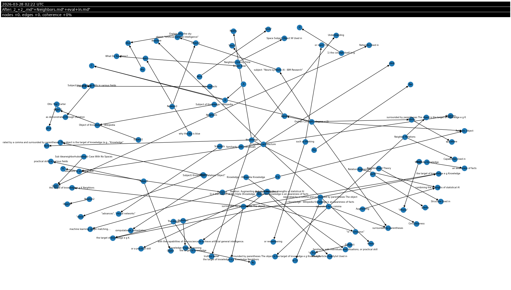](graph-2026-03-28-02-22-self-improve.png) [commit](https://github.com/BoggersTheFish/BoggersTheCIG/commit/77927d4)

### 2026-03-28 06:05 UTC

**After:** vault analysis (+131 triples) — nodes +114, edges +71, coherence +10923%

[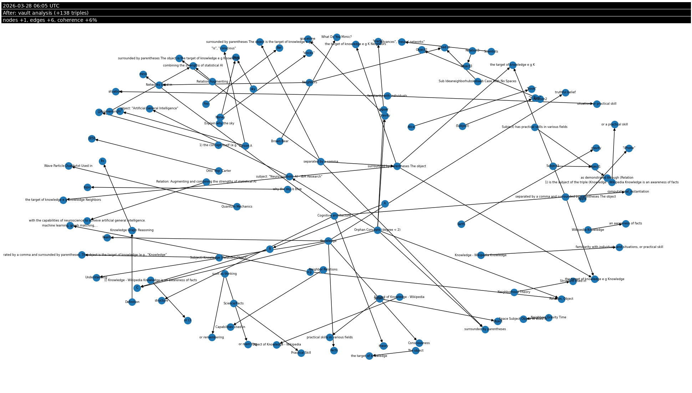](graph-2026-03-28-06-05-after-analyze-vault.png) [commit](https://github.com/BoggersTheFish/BoggersTheCIG/commit/3f2359d)

### 2026-03-28 06:05 UTC

**After:** vault analysis (+138 triples) — nodes +1, edges +6, coherence +6%

 [commit](https://github.com/BoggersTheFish/BoggersTheCIG/commit/3f2359d)

### 2026-03-28 06:11 UTC

**After:** vault organize (2 moves) — nodes +0, edges +0, coherence +0%

[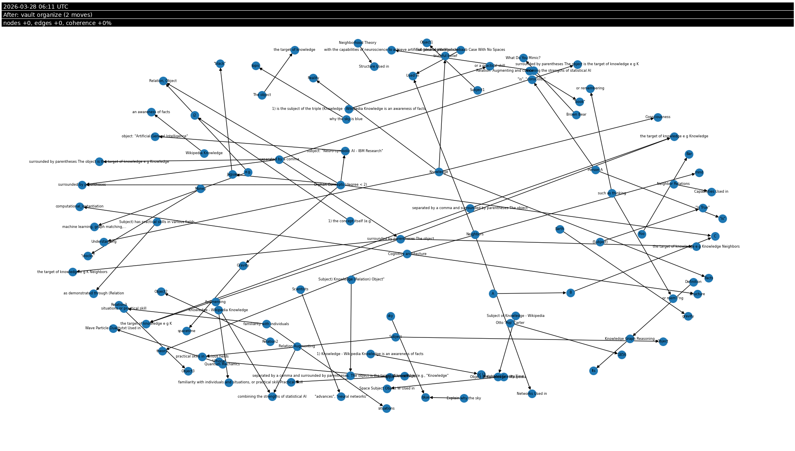](graph-2026-03-28-06-11-after-organize.png) [commit](https://github.com/BoggersTheFish/BoggersTheCIG/commit/3f2359d)

### 2026-03-28 06:11 UTC

**After:** 1 extracts, 0 merges — nodes +0, edges +0, coherence +0%

[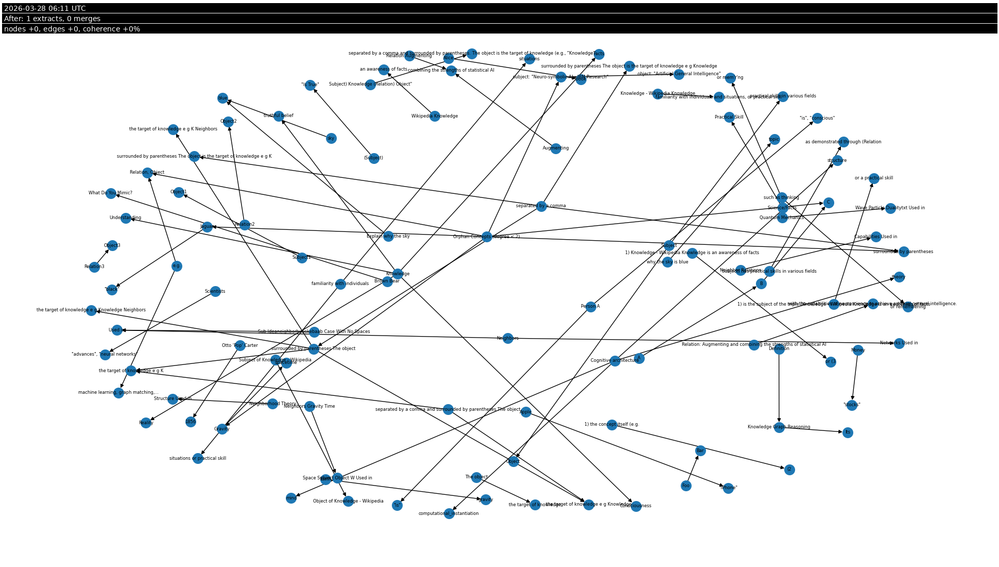](graph-2026-03-28-06-11-extract-subideas.png) [commit](https://github.com/BoggersTheFish/BoggersTheCIG/commit/3f2359d)

### 2026-03-28 06:11 UTC

**After:** 2_+2_.md"+Mechanics.md"+eval+facts.md" — nodes +0, edges +0, coherence +0%

[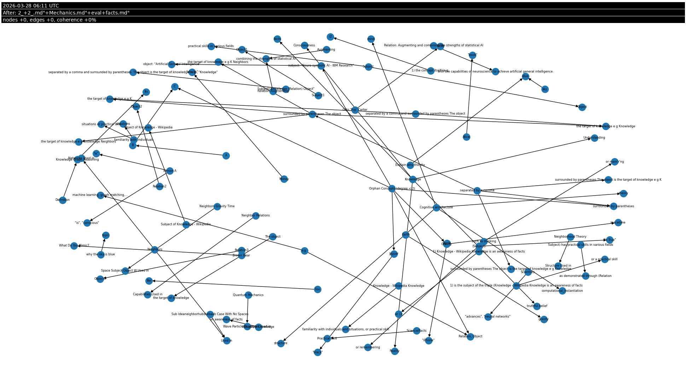](graph-2026-03-28-06-11-self-improve.png) [commit](https://github.com/BoggersTheFish/BoggersTheCIG/commit/3f2359d)

### 2026-03-28 06:17 UTC

**After:** vault organize (0 moves) — nodes +0, edges +0, coherence +0%

[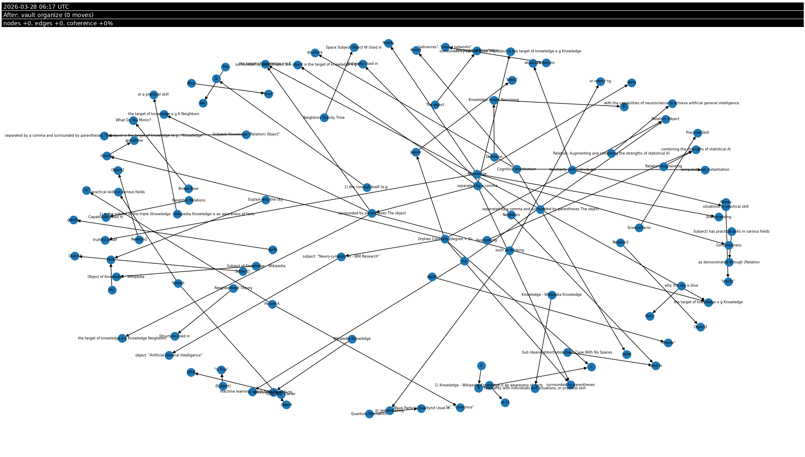](graph-2026-03-28-06-17-after-organize.png) [commit](https://github.com/BoggersTheFish/BoggersTheCIG/commit/3f2359d)

### 2026-03-28 06:17 UTC

**After:** 0 extracts, 1 merges — nodes +0, edges +0, coherence +0%

[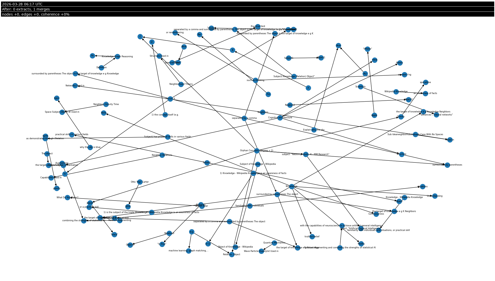](graph-2026-03-28-06-17-extract-subideas.png) [commit](https://github.com/BoggersTheFish/BoggersTheCIG/commit/3f2359d)

### 2026-03-28 06:17 UTC

**After:** 2_+2_.md"+Mechanics.md"+eval+facts.md" — nodes +0, edges +0, coherence +0%

[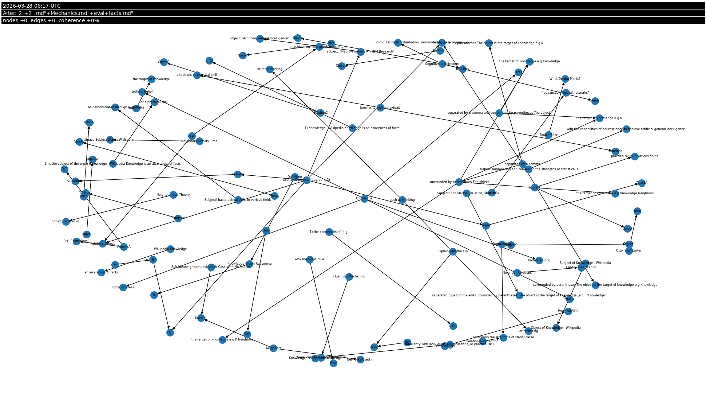](graph-2026-03-28-06-17-self-improve.png) [commit](https://github.com/BoggersTheFish/BoggersTheCIG/commit/3f2359d)

### 2026-03-28 10:38 UTC

**After:** vault analysis (+131 triples) — nodes +114, edges +71, coherence +10923%

[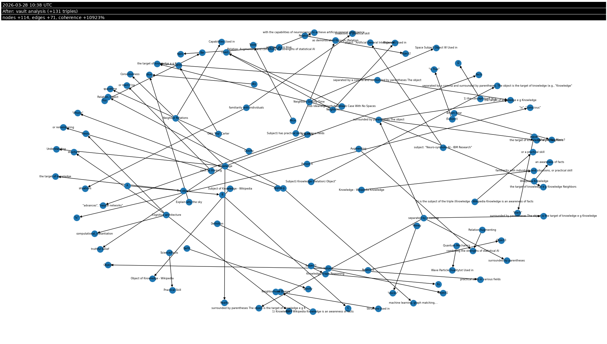](graph-2026-03-28-10-38-after-analyze-vault.png) [commit](https://github.com/BoggersTheFish/BoggersTheCIG/commit/b0fa96a)

### 2026-03-28 10:38 UTC

**After:** 1 extracts, 0 merges — nodes +0, edges +0, coherence +0%

[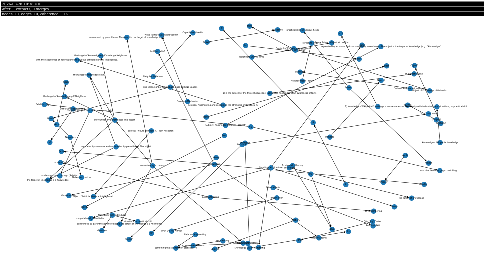](graph-2026-03-28-10-38-extract-subideas.png) [commit](https://github.com/BoggersTheFish/BoggersTheCIG/commit/b0fa96a)

### 2026-03-28 10:39 UTC

**After:** vault analysis (+138 triples) — nodes +1, edges +6, coherence +6%

[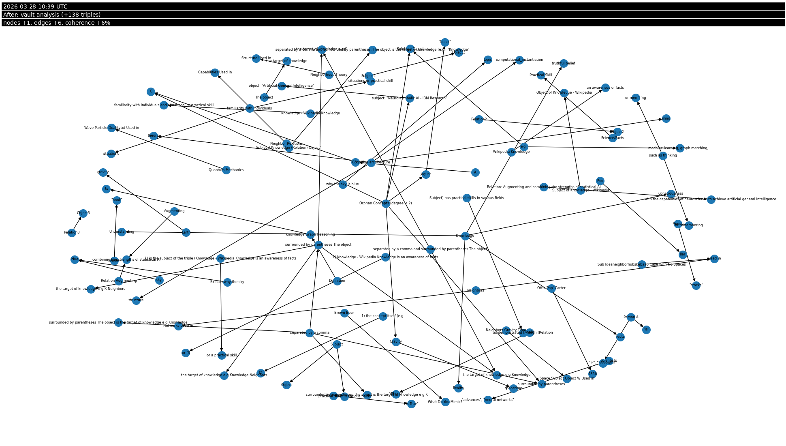](graph-2026-03-28-10-39-after-analyze-vault.png) [commit](https://github.com/BoggersTheFish/BoggersTheCIG/commit/b0fa96a)

### 2026-03-28 10:39 UTC

**After:** 1 extracts, 0 merges — nodes +0, edges +0, coherence +0%

[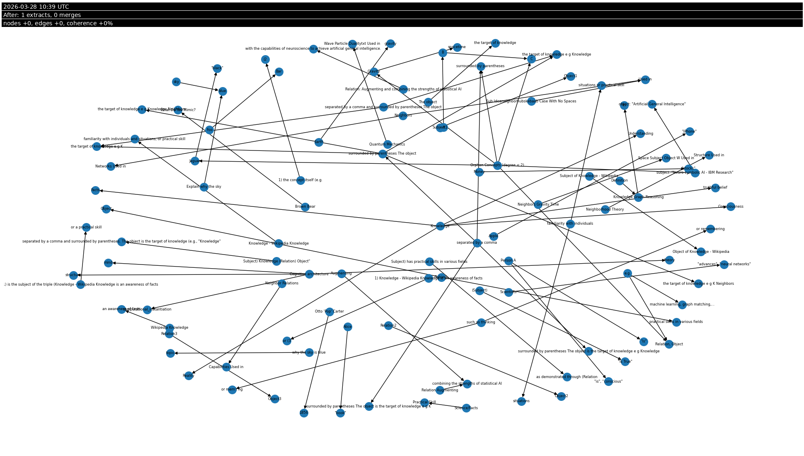](graph-2026-03-28-10-39-extract-subideas.png) [commit](https://github.com/BoggersTheFish/BoggersTheCIG/commit/b0fa96a)

### 2026-03-28 10:45 UTC

**After:** vault organize (0 moves) — nodes +0, edges +0, coherence +0%

[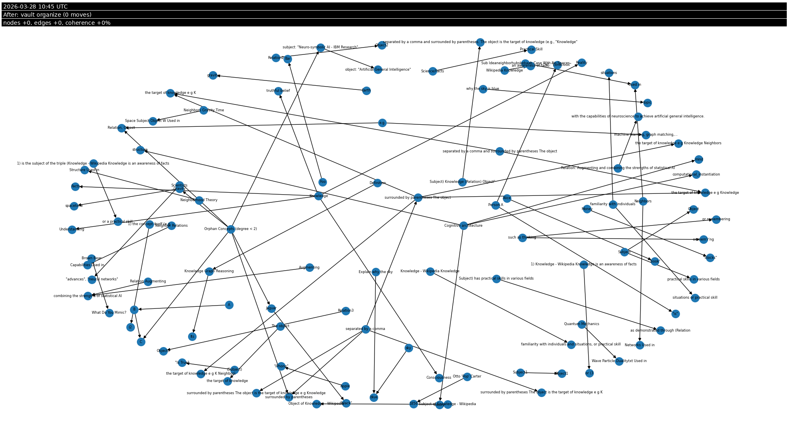](graph-2026-03-28-10-45-after-organize.png) [commit](https://github.com/BoggersTheFish/BoggersTheCIG/commit/b0fa96a)

### 2026-03-28 10:45 UTC

**After:** 0 extracts, 1 merges — nodes +0, edges +0, coherence +0%

[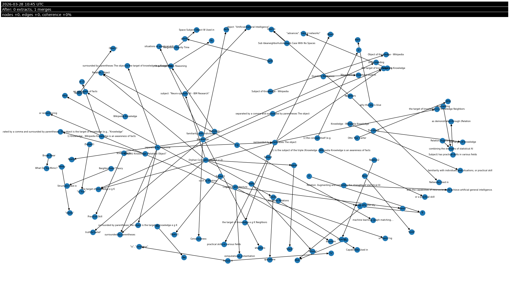](graph-2026-03-28-10-45-extract-subideas.png) [commit](https://github.com/BoggersTheFish/BoggersTheCIG/commit/b0fa96a)

### 2026-03-28 10:45 UTC

**After:** 2_+2_.md"+Mechanics.md"+architecture.md"+eval — nodes +0, edges +0, coherence +0%

[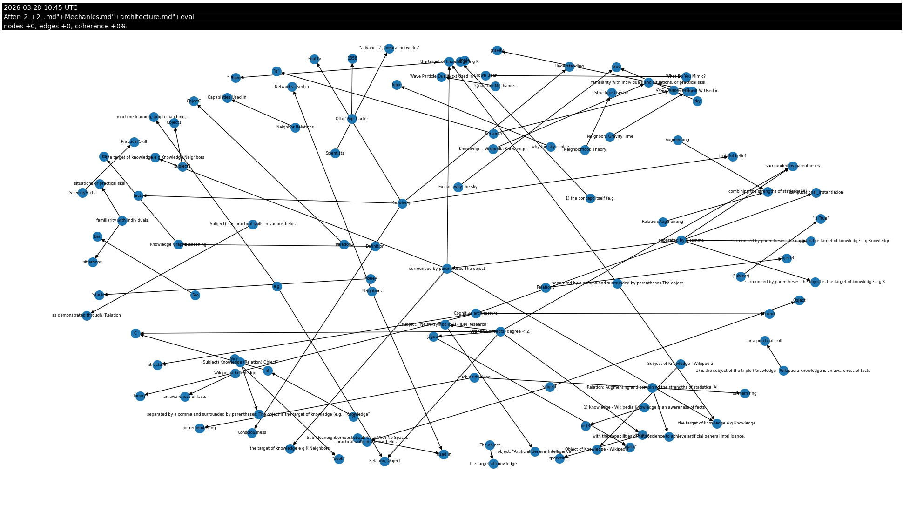](graph-2026-03-28-10-45-self-improve.png) [commit](https://github.com/BoggersTheFish/BoggersTheCIG/commit/b0fa96a)

### 2026-03-28 10:50 UTC

**After:** vault organize (0 moves) — nodes +0, edges +0, coherence +0%

[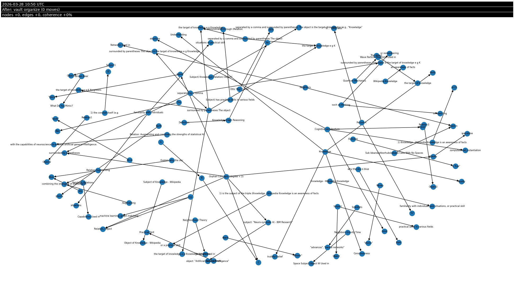](graph-2026-03-28-10-50-after-organize.png) [commit](https://github.com/BoggersTheFish/BoggersTheCIG/commit/b0fa96a)

### 2026-03-28 10:50 UTC

**After:** 1 extracts, 0 merges — nodes +0, edges +0, coherence +0%

[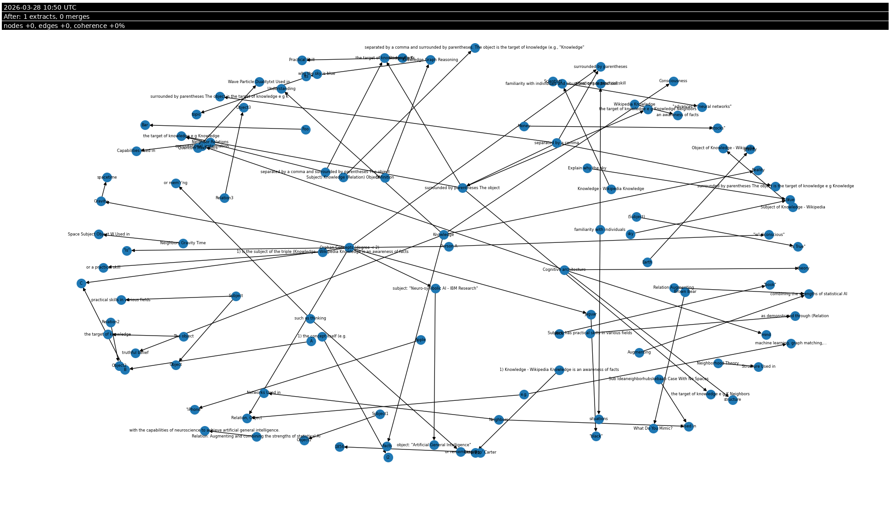](graph-2026-03-28-10-50-extract-subideas.png) [commit](https://github.com/BoggersTheFish/BoggersTheCIG/commit/b0fa96a)

### 2026-03-28 10:50 UTC

**After:** 2_+2_.md"+Mechanics.md"+architecture.md"+eval — nodes +0, edges +0, coherence +0%

[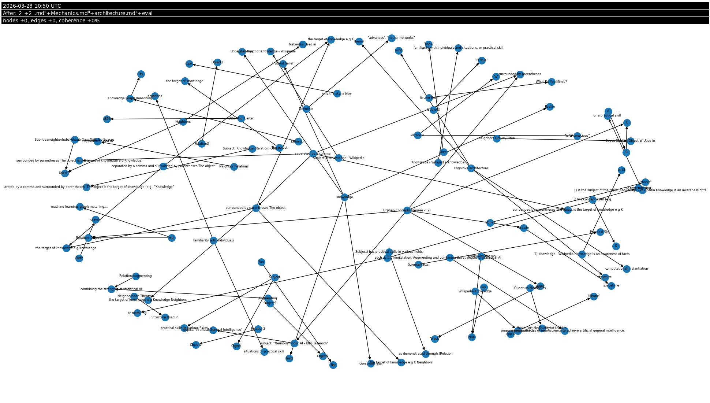](graph-2026-03-28-10-50-self-improve.png) [commit](https://github.com/BoggersTheFish/BoggersTheCIG/commit/b0fa96a)

### 2026-03-28 15:37 UTC

**After:** vault analysis (+135 triples) — nodes +114, edges +71, coherence +10923%

[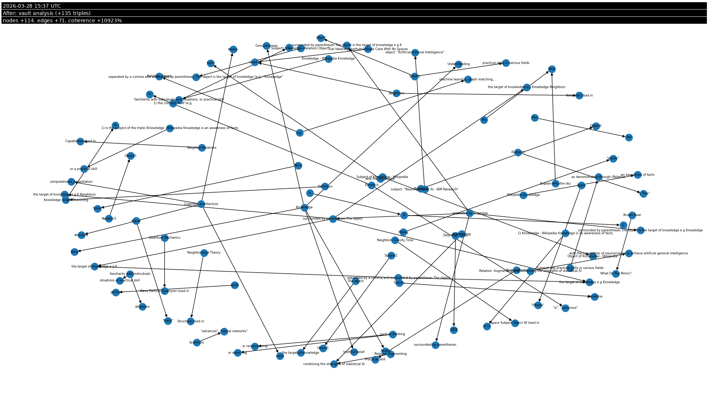](graph-2026-03-28-15-37-after-analyze-vault.png) [commit](https://github.com/BoggersTheFish/BoggersTheCIG/commit/dfd0bfd)

### 2026-03-28 15:38 UTC

**After:** vault analysis (+142 triples) — nodes +1, edges +6, coherence +6%

[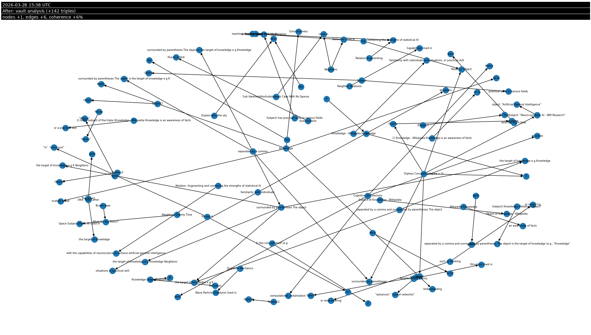](graph-2026-03-28-15-38-after-analyze-vault.png) [commit](https://github.com/BoggersTheFish/BoggersTheCIG/commit/dfd0bfd)

### 2026-03-28 15:43 UTC

**After:** vault organize (2 moves) — nodes +0, edges +0, coherence +0%

[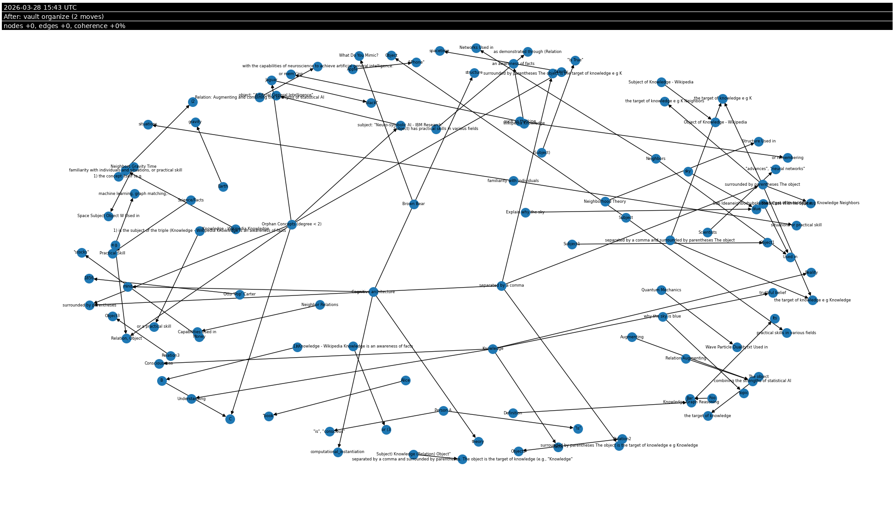](graph-2026-03-28-15-43-after-organize.png) [commit](https://github.com/BoggersTheFish/BoggersTheCIG/commit/dfd0bfd)

### 2026-03-28 15:43 UTC

**After:** 1 extracts, 0 merges — nodes +0, edges +0, coherence +0%

[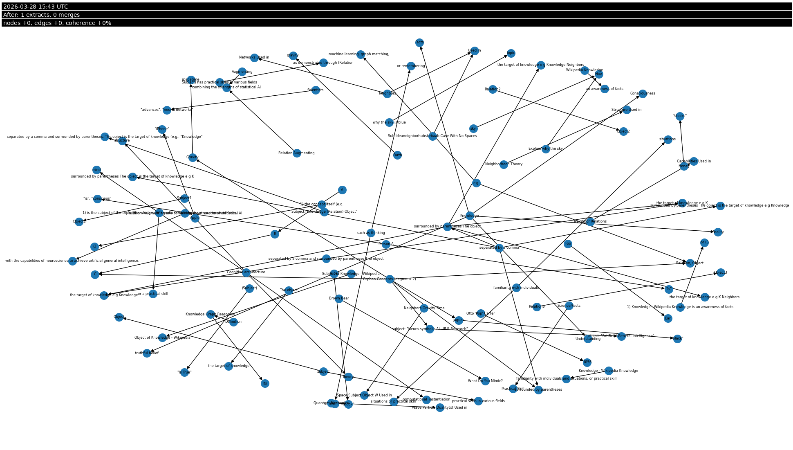](graph-2026-03-28-15-43-extract-subideas.png) [commit](https://github.com/BoggersTheFish/BoggersTheCIG/commit/dfd0bfd)

### 2026-03-28 15:43 UTC

**After:** 2_+2_.md"+Augmenting.md"+architecture.md"+eval — nodes +0, edges +0, coherence +0%

[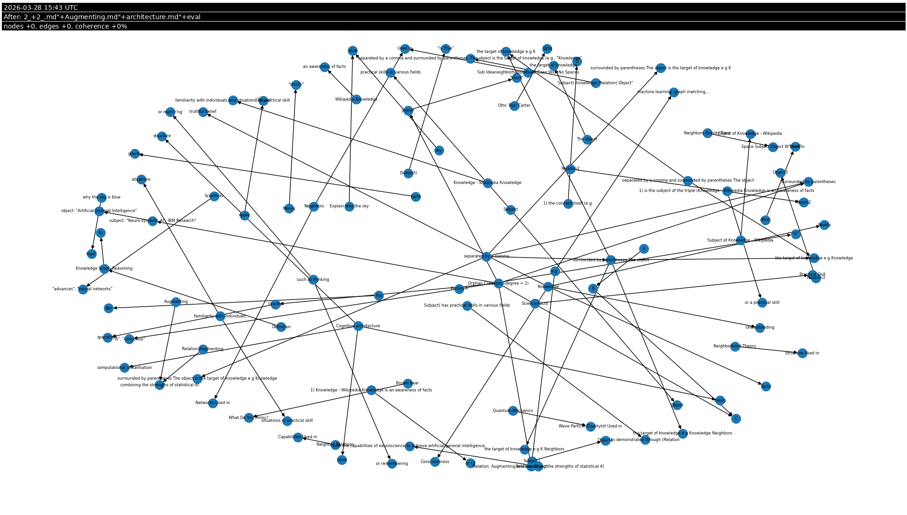](graph-2026-03-28-15-43-self-improve.png) [commit](https://github.com/BoggersTheFish/BoggersTheCIG/commit/dfd0bfd)

### 2026-03-28 15:49 UTC

**After:** vault organize (0 moves) — nodes +0, edges +0, coherence +0%

[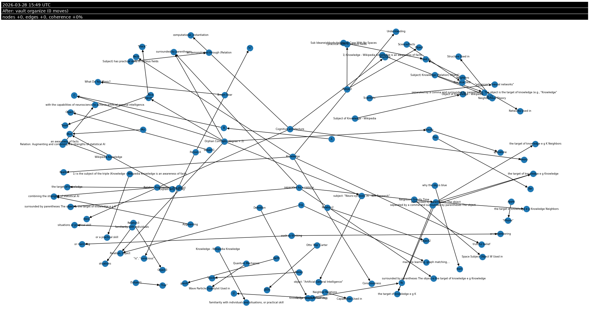](graph-2026-03-28-15-49-after-organize.png) [commit](https://github.com/BoggersTheFish/BoggersTheCIG/commit/dfd0bfd)

### 2026-03-28 15:49 UTC

**After:** 0 extracts, 1 merges — nodes +0, edges +0, coherence +0%

[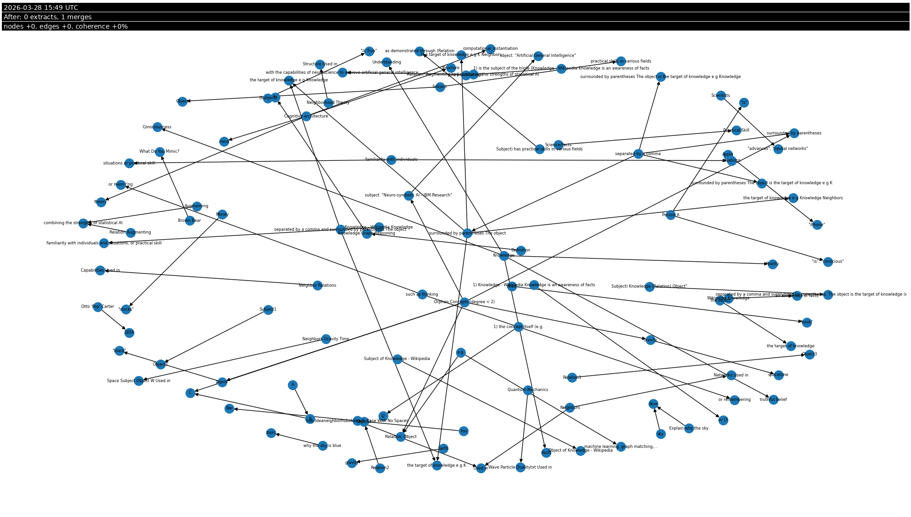](graph-2026-03-28-15-49-extract-subideas.png) [commit](https://github.com/BoggersTheFish/BoggersTheCIG/commit/dfd0bfd)

### 2026-03-28 15:49 UTC

**After:** 2_+2_.md"+Augmenting.md"+architecture.md"+eval — nodes +0, edges +0, coherence +0%

[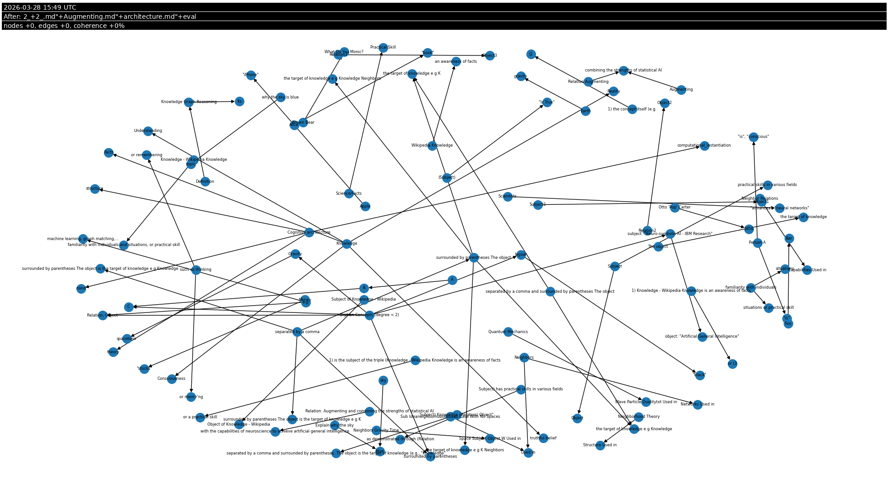](graph-2026-03-28-15-49-self-improve.png) [commit](https://github.com/BoggersTheFish/BoggersTheCIG/commit/dfd0bfd)

### 2026-03-28 20:37 UTC

**After:** external ingest (+2 triples) — nodes +4, edges +2, coherence +333233%

[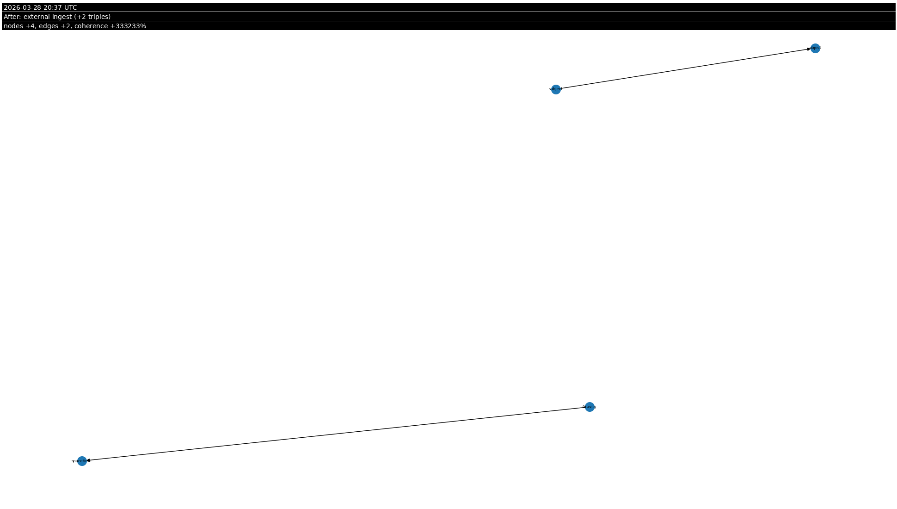](graph-2026-03-28-20-37-after-ingest.png) [commit](https://github.com/BoggersTheFish/BoggersTheCIG/commit/3e43d89)

### 2026-03-28 20:37 UTC

**After:** vault analysis (+137 triples) — nodes +113, edges +71, coherence -96%

[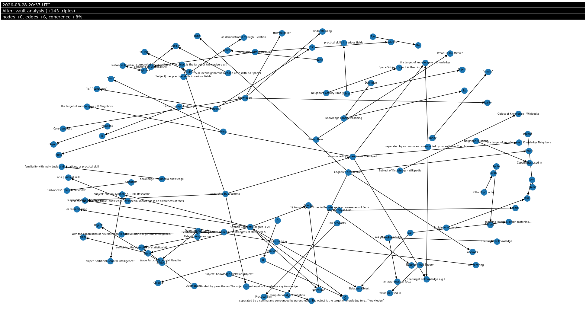](graph-2026-03-28-20-37-after-analyze-vault.png) [commit](https://github.com/BoggersTheFish/BoggersTheCIG/commit/3e43d89)

### 2026-03-28 20:37 UTC

**After:** 1 extracts, 0 merges — nodes +0, edges +0, coherence +0%

[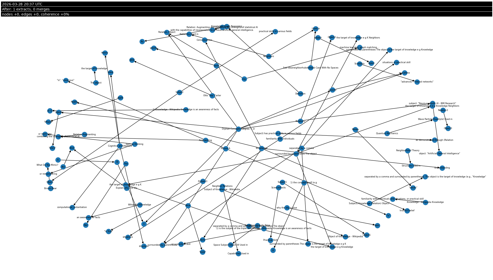](graph-2026-03-28-20-37-extract-subideas.png) [commit](https://github.com/BoggersTheFish/BoggersTheCIG/commit/3e43d89)

### 2026-03-28 20:37 UTC

**After:** vault analysis (+143 triples) — nodes +0, edges +6, coherence +8%

 [commit](https://github.com/BoggersTheFish/BoggersTheCIG/commit/3e43d89)

### 2026-03-28 20:37 UTC

**After:** 1 extracts, 0 merges — nodes +0, edges +0, coherence +0%

 [commit](https://github.com/BoggersTheFish/BoggersTheCIG/commit/3e43d89)

### 2026-03-28 20:42 UTC

**After:** vault organize (2 moves) — nodes +0, edges +0, coherence +0%

[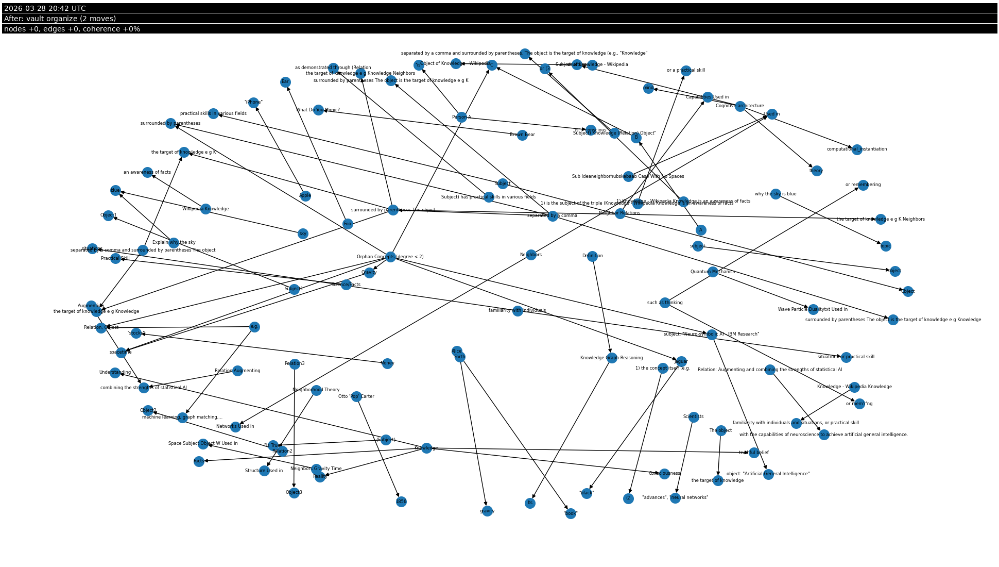](graph-2026-03-28-20-42-after-organize.png) [commit](https://github.com/BoggersTheFish/BoggersTheCIG/commit/3e43d89)

### 2026-03-28 20:42 UTC

**After:** 0 extracts, 1 merges — nodes +0, edges +0, coherence +0%

[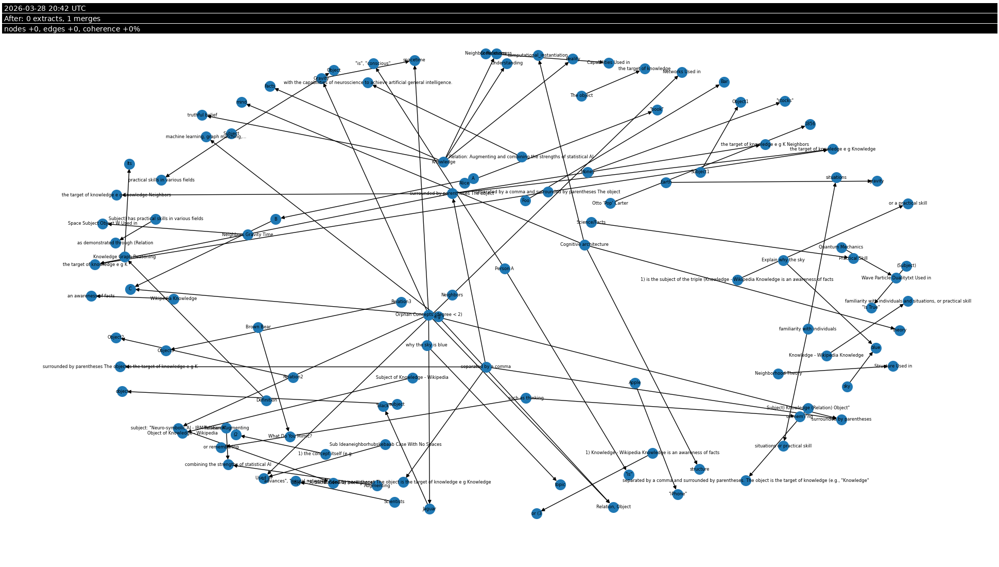](graph-2026-03-28-20-42-extract-subideas.png) [commit](https://github.com/BoggersTheFish/BoggersTheCIG/commit/3e43d89)

### 2026-03-28 20:42 UTC

**After:** 2_+2_.md"+Augmenting.md"+architecture.md"+eval — nodes +0, edges +0, coherence +0%

[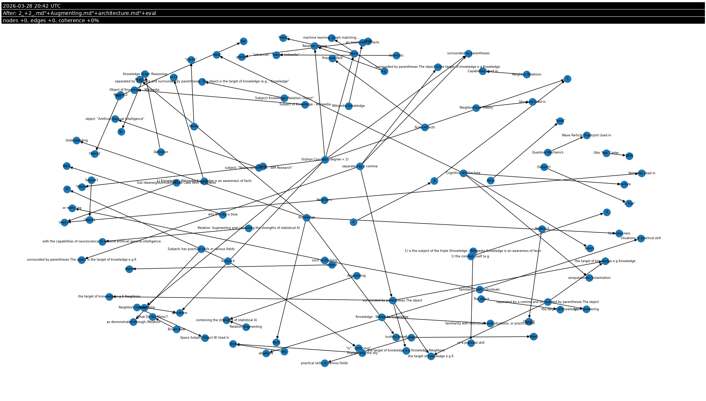](graph-2026-03-28-20-42-self-improve.png) [commit](https://github.com/BoggersTheFish/BoggersTheCIG/commit/3e43d89)

### 2026-03-28 20:47 UTC

**After:** vault organize (2 moves) — nodes +0, edges +0, coherence +0%

[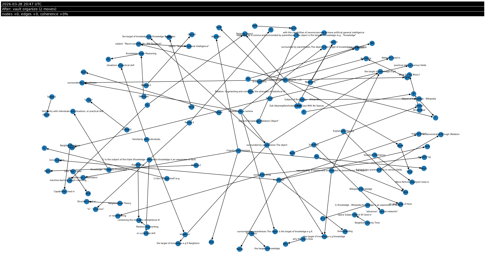](graph-2026-03-28-20-47-after-organize.png) [commit](https://github.com/BoggersTheFish/BoggersTheCIG/commit/3e43d89)

### 2026-03-28 20:48 UTC

**After:** 1 extracts, 0 merges — nodes +0, edges +0, coherence +0%

[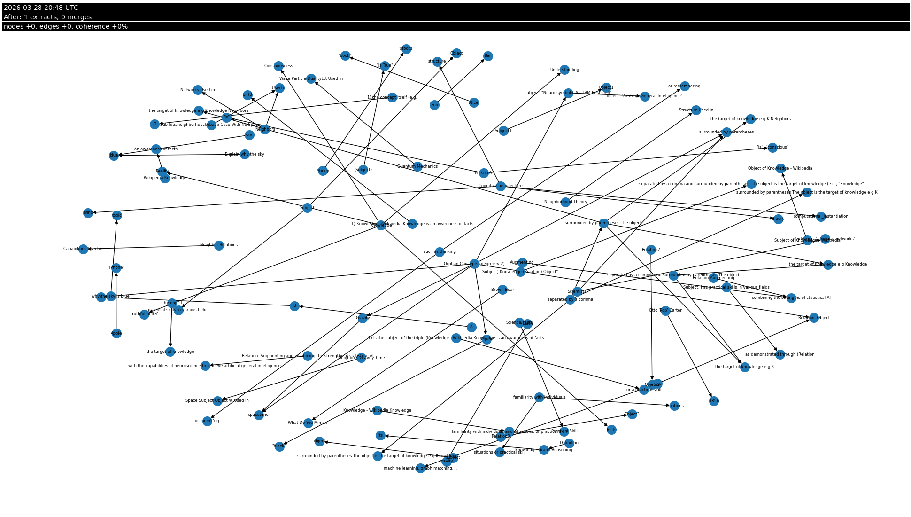](graph-2026-03-28-20-48-extract-subideas.png) [commit](https://github.com/BoggersTheFish/BoggersTheCIG/commit/3e43d89)

### 2026-03-28 20:48 UTC

**After:** 2_+2_.md"+Augmenting.md"+Skill.md"+architecture.md" — nodes +0, edges +0, coherence +0%

[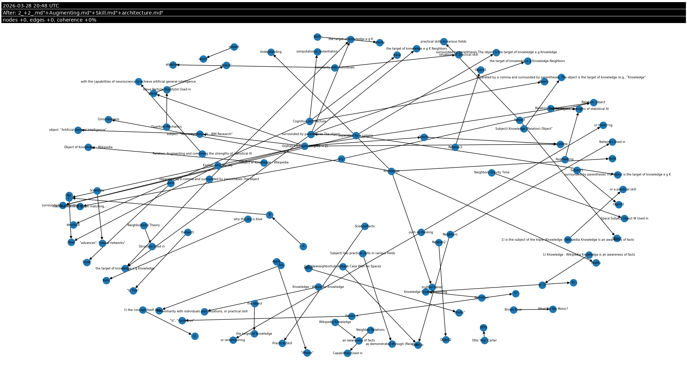](graph-2026-03-28-20-48-self-improve.png) [commit](https://github.com/BoggersTheFish/BoggersTheCIG/commit/3e43d89)

### 2026-03-29 02:31 UTC

**After:** vault analysis (+139 triples) — nodes +116, edges +72, coherence +10694%

[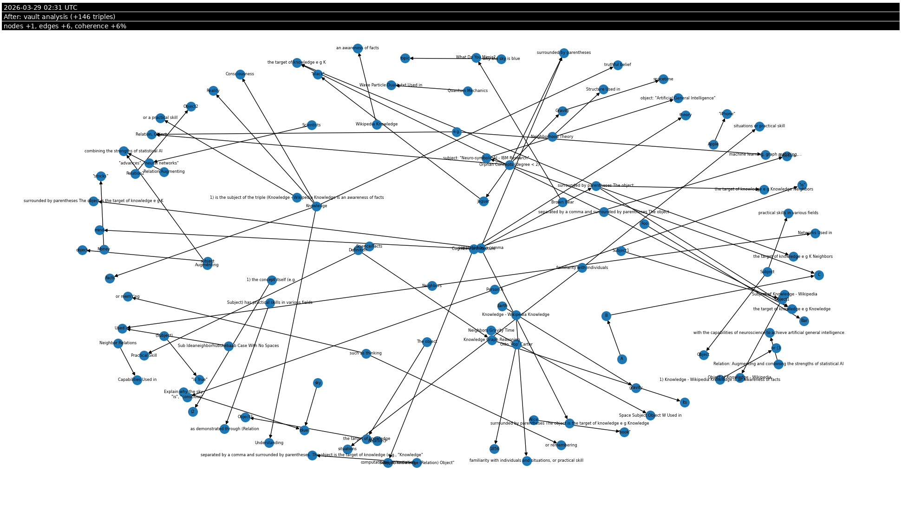](graph-2026-03-29-02-31-after-analyze-vault.png) [commit](https://github.com/BoggersTheFish/BoggersTheCIG/commit/76f25ee)

### 2026-03-29 02:31 UTC

**After:** vault analysis (+146 triples) — nodes +1, edges +6, coherence +6%

 [commit](https://github.com/BoggersTheFish/BoggersTheCIG/commit/76f25ee)

### 2026-03-29 02:36 UTC

**After:** vault organize (2 moves) — nodes +0, edges +0, coherence +0%

[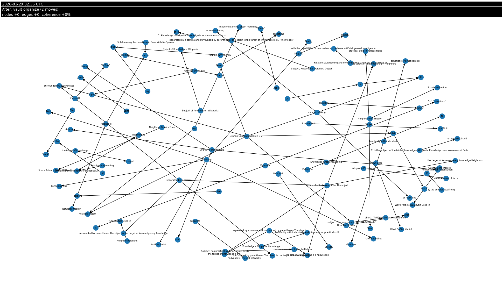](graph-2026-03-29-02-36-after-organize.png) [commit](https://github.com/BoggersTheFish/BoggersTheCIG/commit/76f25ee)

### 2026-03-29 02:36 UTC

**After:** 1 extracts, 0 merges — nodes +0, edges +0, coherence +0%

[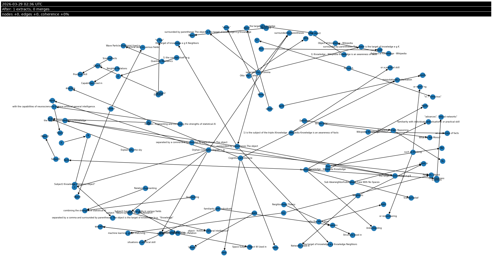](graph-2026-03-29-02-36-extract-subideas.png) [commit](https://github.com/BoggersTheFish/BoggersTheCIG/commit/76f25ee)

### 2026-03-29 02:36 UTC

**After:** 2_+2_.md"+Mechanics.md"+Research_.md"+Time.md" — nodes +0, edges +0, coherence +0%

[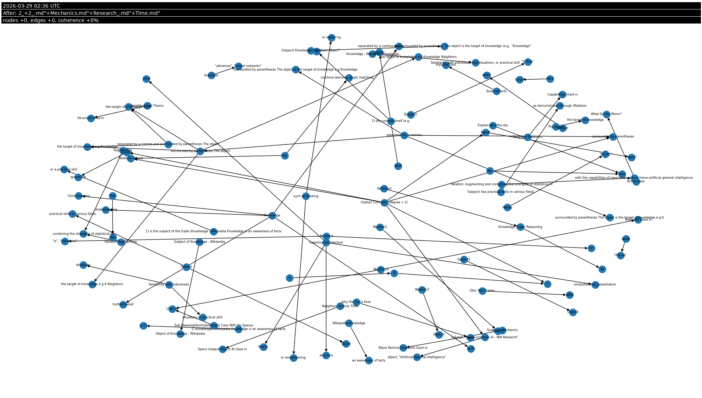](graph-2026-03-29-02-36-self-improve.png) [commit](https://github.com/BoggersTheFish/BoggersTheCIG/commit/76f25ee)

### 2026-03-29 02:42 UTC

**After:** vault organize (2 moves) — nodes +0, edges +0, coherence +0%

[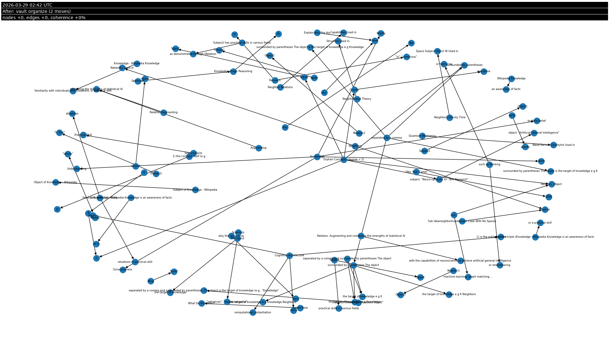](graph-2026-03-29-02-42-after-organize.png) [commit](https://github.com/BoggersTheFish/BoggersTheCIG/commit/76f25ee)

### 2026-03-29 02:42 UTC

**After:** 0 extracts, 1 merges — nodes +0, edges +0, coherence +0%

[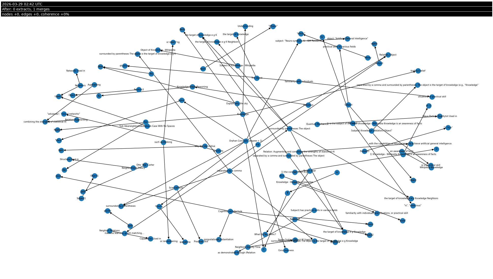](graph-2026-03-29-02-42-extract-subideas.png) [commit](https://github.com/BoggersTheFish/BoggersTheCIG/commit/76f25ee)

### 2026-03-29 02:42 UTC

**After:** 2_+2_.md"+Mechanics.md"+Object.md"+Research_.md" — nodes +0, edges +0, coherence +0%

[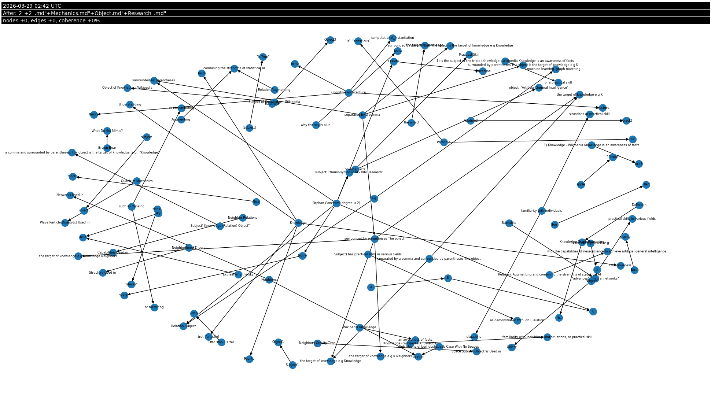](graph-2026-03-29-02-42-self-improve.png) [commit](https://github.com/BoggersTheFish/BoggersTheCIG/commit/76f25ee)

### 2026-03-29 06:20 UTC

**After:** external ingest (+1 triples) — nodes +4, edges +2, coherence +333233%

[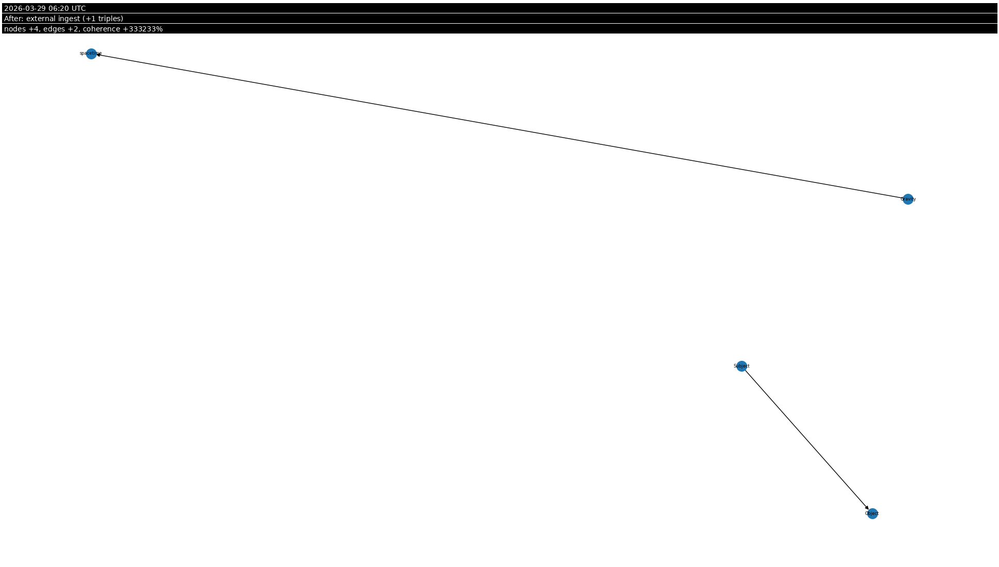](graph-2026-03-29-06-20-after-ingest.png) [commit](https://github.com/BoggersTheFish/BoggersTheCIG/commit/bcafc03)

### 2026-03-29 06:20 UTC

**After:** vault analysis (+140 triples) — nodes +113, edges +71, coherence -96%

[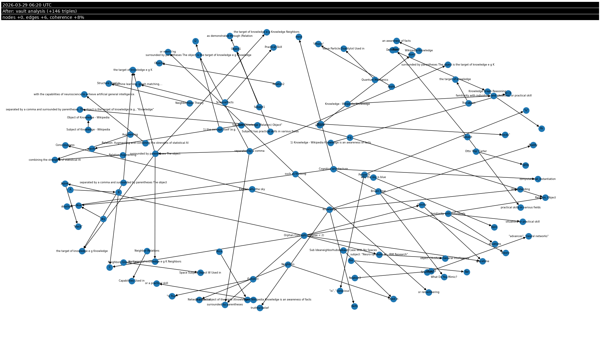](graph-2026-03-29-06-20-after-analyze-vault.png) [commit](https://github.com/BoggersTheFish/BoggersTheCIG/commit/bcafc03)

### 2026-03-29 06:20 UTC

**After:** 1 extracts, 0 merges — nodes +0, edges +0, coherence +0%

[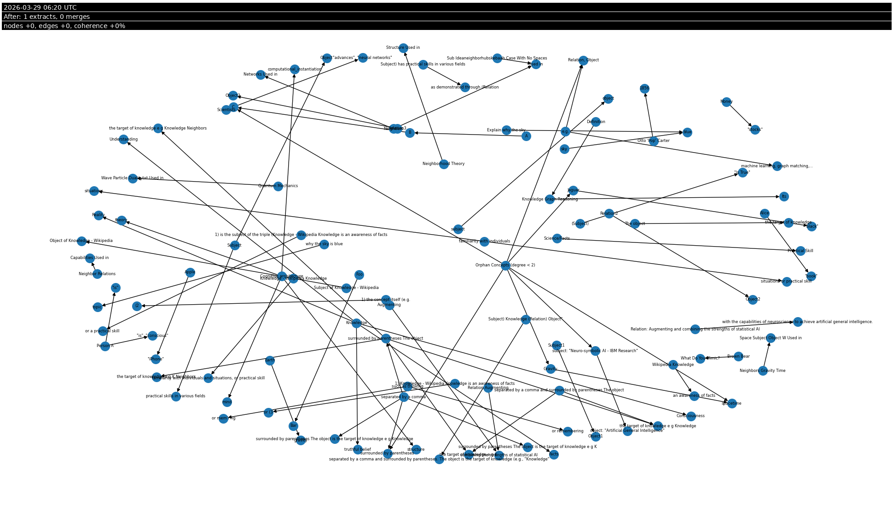](graph-2026-03-29-06-20-extract-subideas.png) [commit](https://github.com/BoggersTheFish/BoggersTheCIG/commit/bcafc03)

### 2026-03-29 06:20 UTC

**After:** vault analysis (+146 triples) — nodes +0, edges +6, coherence +8%

 [commit](https://github.com/BoggersTheFish/BoggersTheCIG/commit/bcafc03)

### 2026-03-29 06:20 UTC

**After:** 1 extracts, 0 merges — nodes +0, edges +0, coherence +0%

 [commit](https://github.com/BoggersTheFish/BoggersTheCIG/commit/bcafc03)

### 2026-03-29 06:26 UTC

**After:** vault organize (0 moves) — nodes +0, edges +0, coherence +0%

[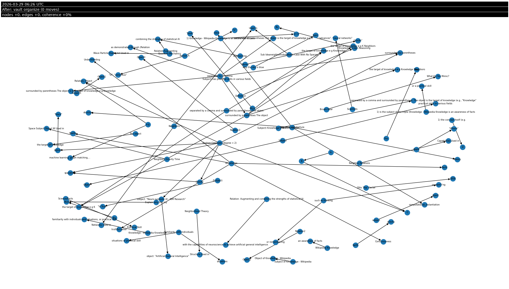](graph-2026-03-29-06-26-after-organize.png) [commit](https://github.com/BoggersTheFish/BoggersTheCIG/commit/bcafc03)

### 2026-03-29 06:26 UTC

**After:** 0 extracts, 1 merges — nodes +0, edges +0, coherence +0%

[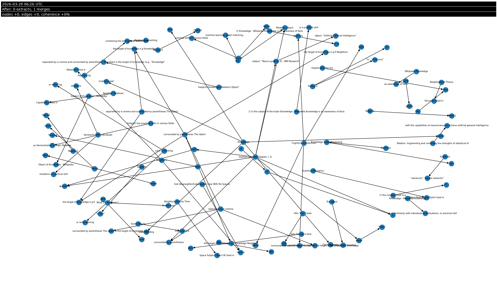](graph-2026-03-29-06-26-extract-subideas.png) [commit](https://github.com/BoggersTheFish/BoggersTheCIG/commit/bcafc03)

### 2026-03-29 06:26 UTC

**After:** 2_+2_.md"+Augmenting.md"+Bear.md"+Research_.md" — nodes +0, edges +0, coherence +0%

[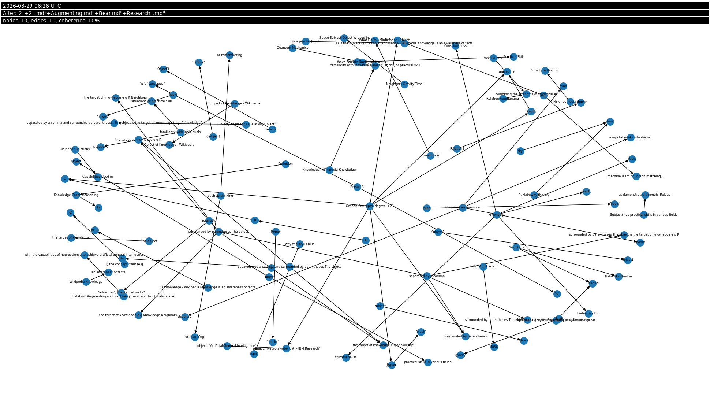](graph-2026-03-29-06-26-self-improve.png) [commit](https://github.com/BoggersTheFish/BoggersTheCIG/commit/bcafc03)

### 2026-03-29 06:31 UTC

**After:** vault organize (0 moves) — nodes +0, edges +0, coherence +0%

[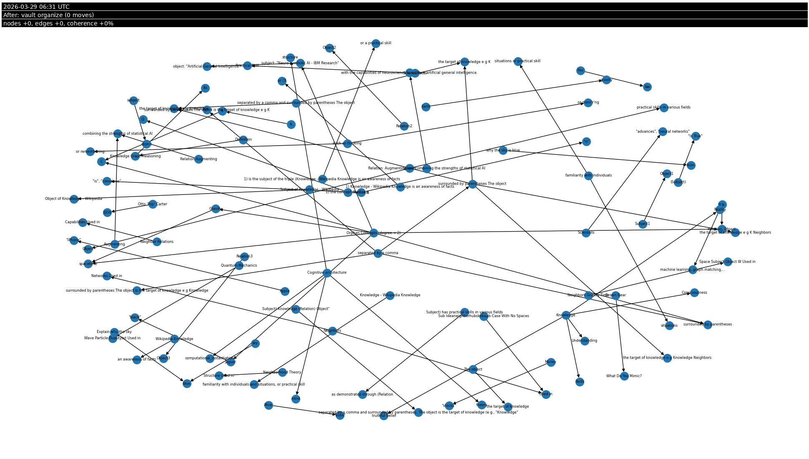](graph-2026-03-29-06-31-after-organize.png) [commit](https://github.com/BoggersTheFish/BoggersTheCIG/commit/bcafc03)

### 2026-03-29 06:31 UTC

**After:** 1 extracts, 0 merges — nodes +0, edges +0, coherence +0%

[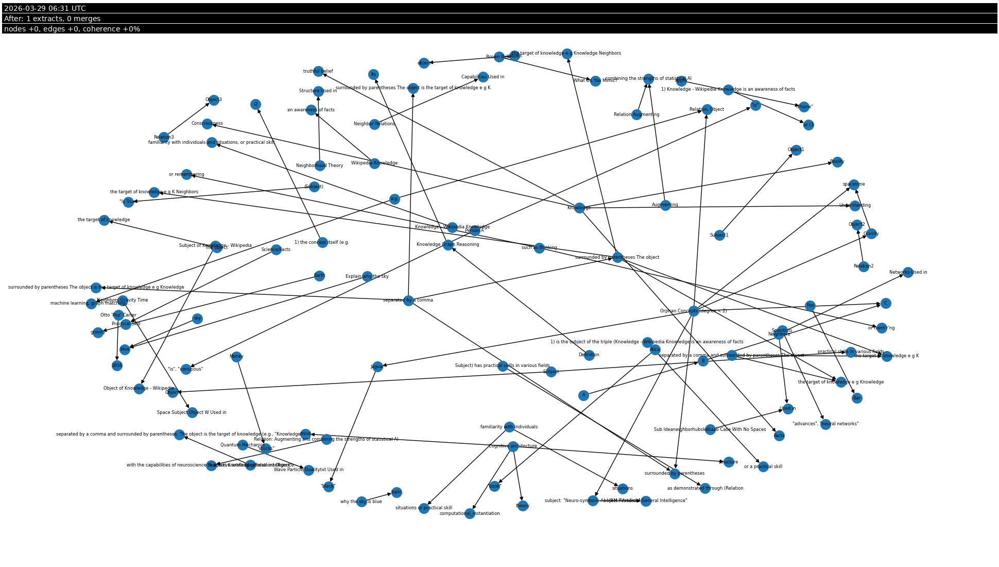](graph-2026-03-29-06-31-extract-subideas.png) [commit](https://github.com/BoggersTheFish/BoggersTheCIG/commit/bcafc03)

### 2026-03-29 06:31 UTC

**After:** 2_+2_.md"+Augmenting.md"+Bear.md"+Research_.md" — nodes +0, edges +0, coherence +0%

[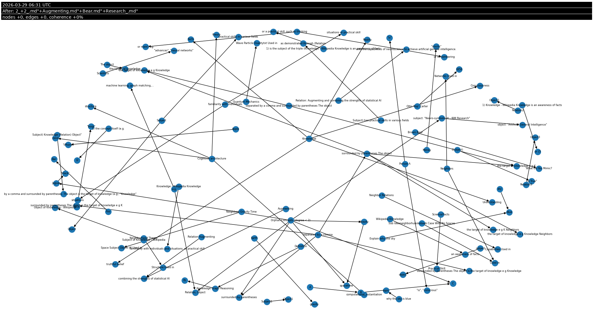](graph-2026-03-29-06-31-self-improve.png) [commit](https://github.com/BoggersTheFish/BoggersTheCIG/commit/bcafc03)

### 2026-03-29 10:41 UTC

**After:** vault analysis (+140 triples) — nodes +116, edges +72, coherence +10694%

[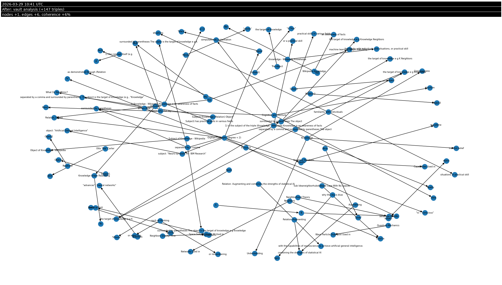](graph-2026-03-29-10-41-after-analyze-vault.png) [commit](https://github.com/BoggersTheFish/BoggersTheCIG/commit/5322197)

### 2026-03-29 10:41 UTC

**After:** vault analysis (+147 triples) — nodes +1, edges +6, coherence +6%

 [commit](https://github.com/BoggersTheFish/BoggersTheCIG/commit/5322197)

### 2026-03-29 10:46 UTC

**After:** vault organize (0 moves) — nodes +0, edges +0, coherence +0%

[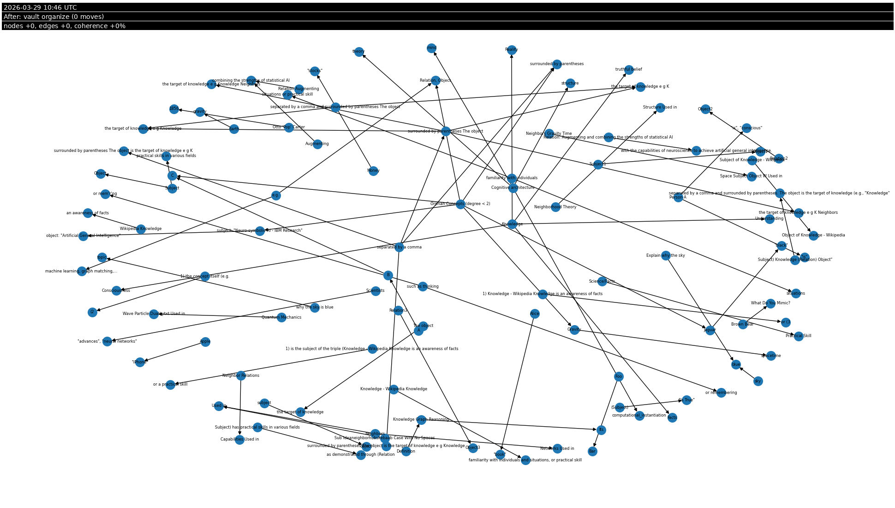](graph-2026-03-29-10-46-after-organize.png) [commit](https://github.com/BoggersTheFish/BoggersTheCIG/commit/5322197)

### 2026-03-29 10:47 UTC

**After:** 1 extracts, 0 merges — nodes +0, edges +0, coherence +0%

[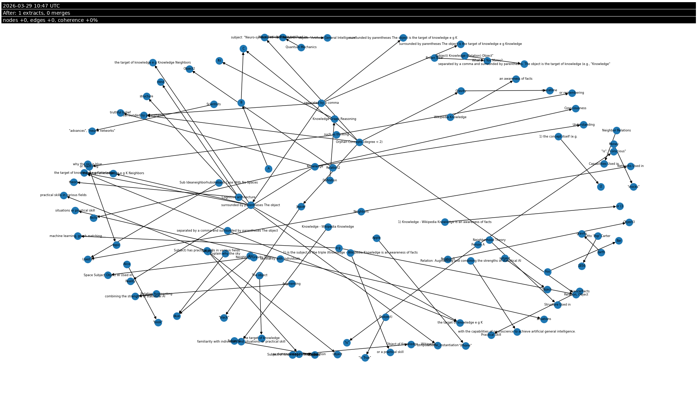](graph-2026-03-29-10-47-extract-subideas.png) [commit](https://github.com/BoggersTheFish/BoggersTheCIG/commit/5322197)

### 2026-03-29 10:47 UTC

**After:** 2_+2_.md"+Augmenting.md"+Bear.md"+Spaces.md" — nodes +0, edges +0, coherence +0%

[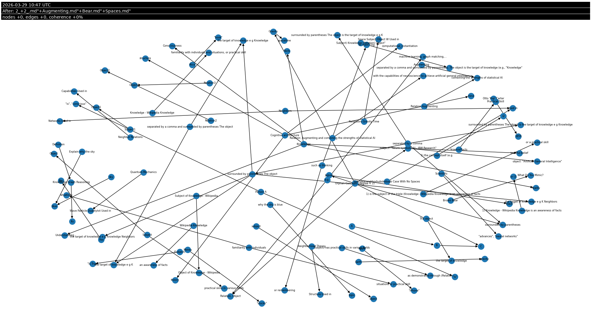](graph-2026-03-29-10-47-self-improve.png) [commit](https://github.com/BoggersTheFish/BoggersTheCIG/commit/5322197)

### 2026-03-29 10:52 UTC

**After:** vault organize (0 moves) — nodes +0, edges +0, coherence +0%

[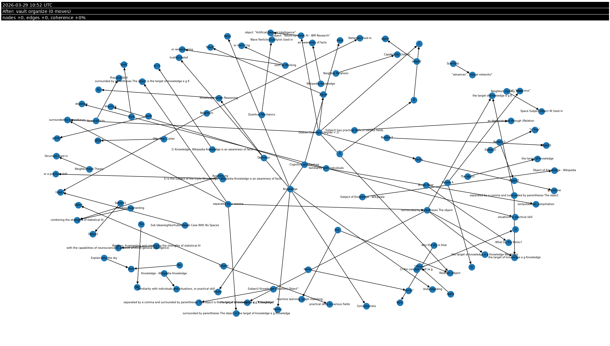](graph-2026-03-29-10-52-after-organize.png) [commit](https://github.com/BoggersTheFish/BoggersTheCIG/commit/5322197)

### 2026-03-29 10:52 UTC

**After:** 0 extracts, 1 merges — nodes +0, edges +0, coherence +0%

[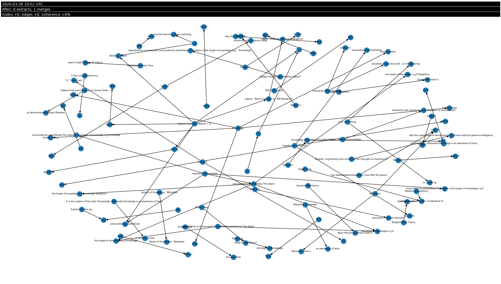](graph-2026-03-29-10-52-extract-subideas.png) [commit](https://github.com/BoggersTheFish/BoggersTheCIG/commit/5322197)

### 2026-03-29 10:52 UTC

**After:** 2_+2_.md"+Augmenting.md"+Bear.md"+Spaces.md" — nodes +0, edges +0, coherence +0%

[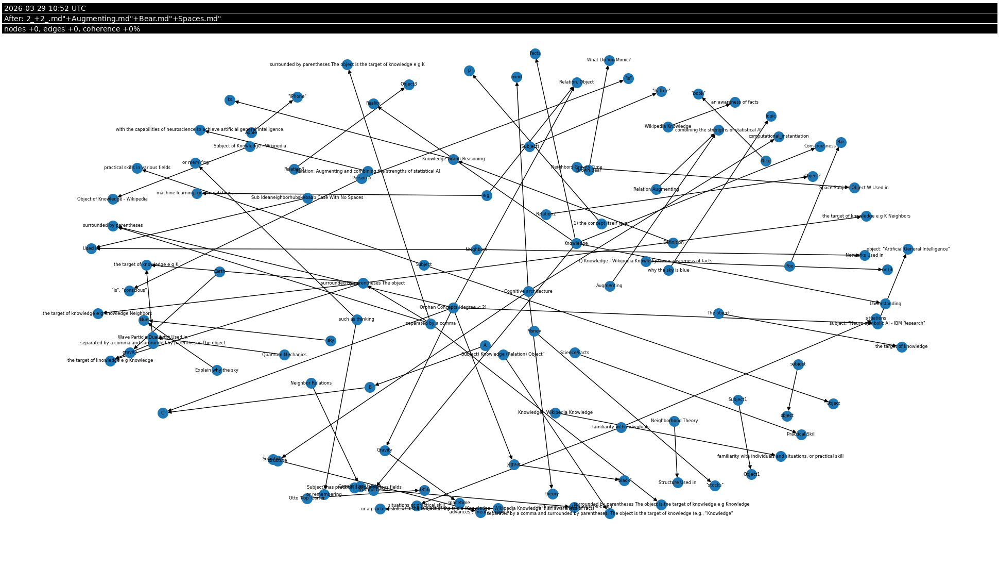](graph-2026-03-29-10-52-self-improve.png) [commit](https://github.com/BoggersTheFish/BoggersTheCIG/commit/5322197)

### 2026-03-29 15:38 UTC

**After:** external ingest (+2 triples) — nodes +5, edges +3, coherence +299899%

[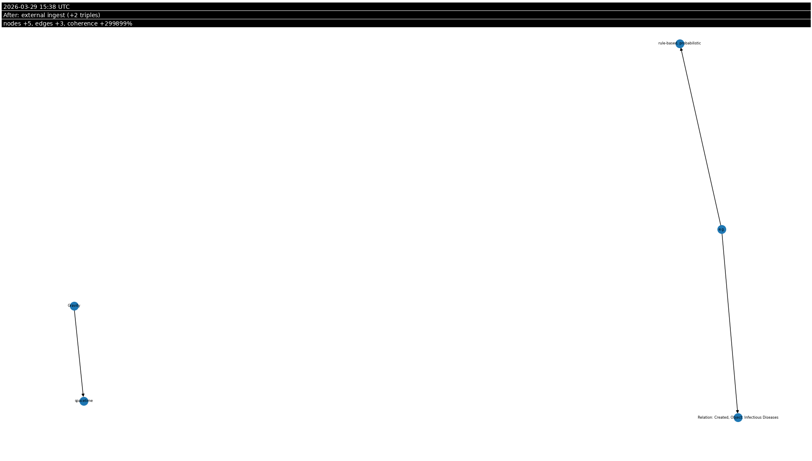](graph-2026-03-29-15-38-after-ingest.png) [commit](https://github.com/BoggersTheFish/BoggersTheCIG/commit/b591ee0)

### 2026-03-29 15:38 UTC

**After:** vault analysis (+142 triples) — nodes +114, edges +73, coherence -96%

[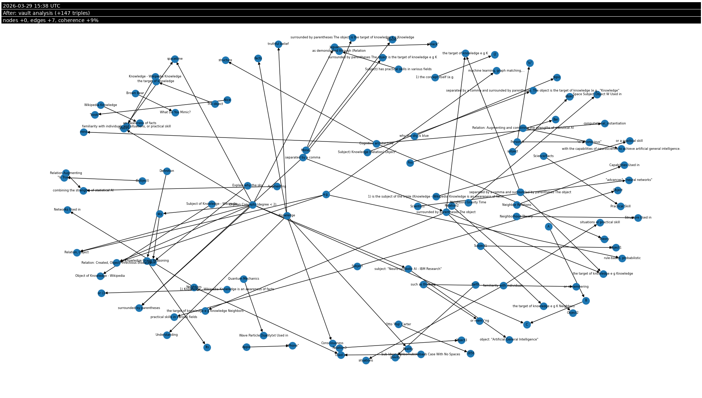](graph-2026-03-29-15-38-after-analyze-vault.png) [commit](https://github.com/BoggersTheFish/BoggersTheCIG/commit/b591ee0)

### 2026-03-29 15:38 UTC

**After:** 1 extracts, 0 merges — nodes +0, edges +0, coherence +0%

[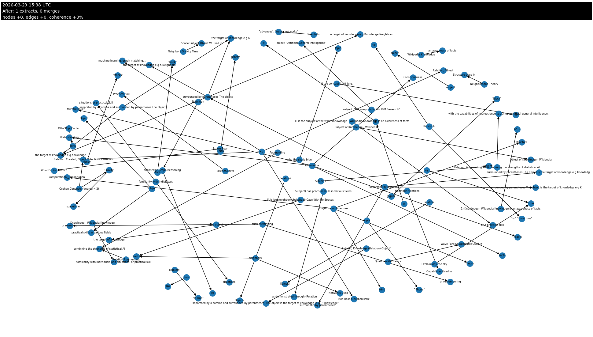](graph-2026-03-29-15-38-extract-subideas.png) [commit](https://github.com/BoggersTheFish/BoggersTheCIG/commit/b591ee0)

### 2026-03-29 15:38 UTC

**After:** vault analysis (+147 triples) — nodes +0, edges +7, coherence +9%

 [commit](https://github.com/BoggersTheFish/BoggersTheCIG/commit/b591ee0)

### 2026-03-29 15:39 UTC

**After:** 1 extracts, 0 merges — nodes +0, edges +0, coherence +0%

[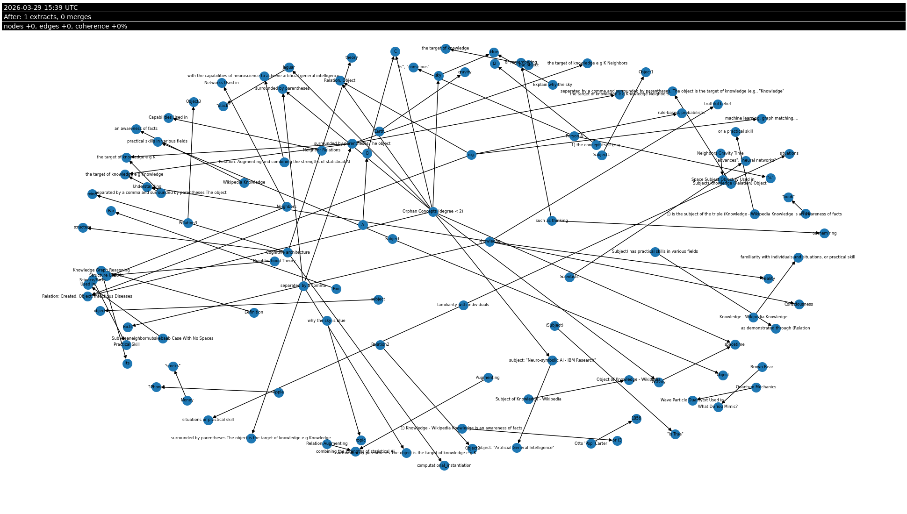](graph-2026-03-29-15-39-extract-subideas.png) [commit](https://github.com/BoggersTheFish/BoggersTheCIG/commit/b591ee0)

### 2026-03-29 15:45 UTC

**After:** vault organize (2 moves) — nodes +0, edges +0, coherence +0%

[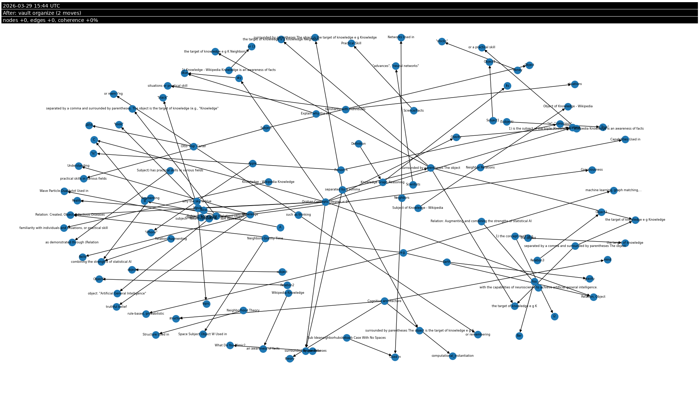](graph-2026-03-29-15-44-after-organize.png) [commit](https://github.com/BoggersTheFish/BoggersTheCIG/commit/b591ee0)

### 2026-03-29 15:45 UTC

**After:** 0 extracts, 1 merges — nodes +0, edges +0, coherence +0%

[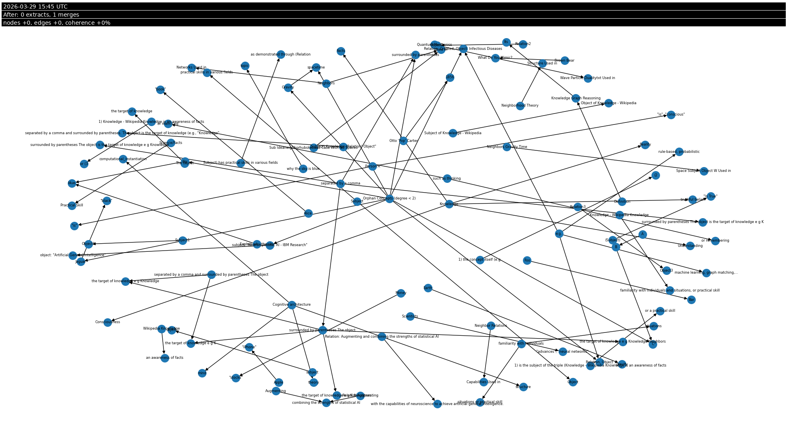](graph-2026-03-29-15-45-extract-subideas.png) [commit](https://github.com/BoggersTheFish/BoggersTheCIG/commit/b591ee0)

### 2026-03-29 15:45 UTC

**After:** 2_+2_.md"+Diseases.md"+Knowledge.md"+Mimic_.md" — nodes +0, edges +0, coherence +0%

[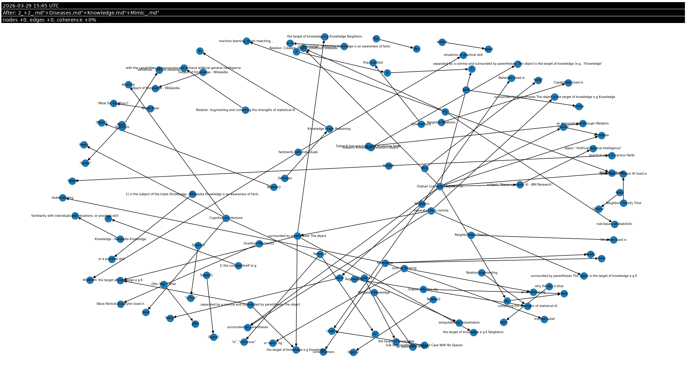](graph-2026-03-29-15-45-self-improve.png) [commit](https://github.com/BoggersTheFish/BoggersTheCIG/commit/b591ee0)

### 2026-03-29 15:49 UTC

**After:** vault organize (1 moves) — nodes +0, edges +0, coherence +0%

[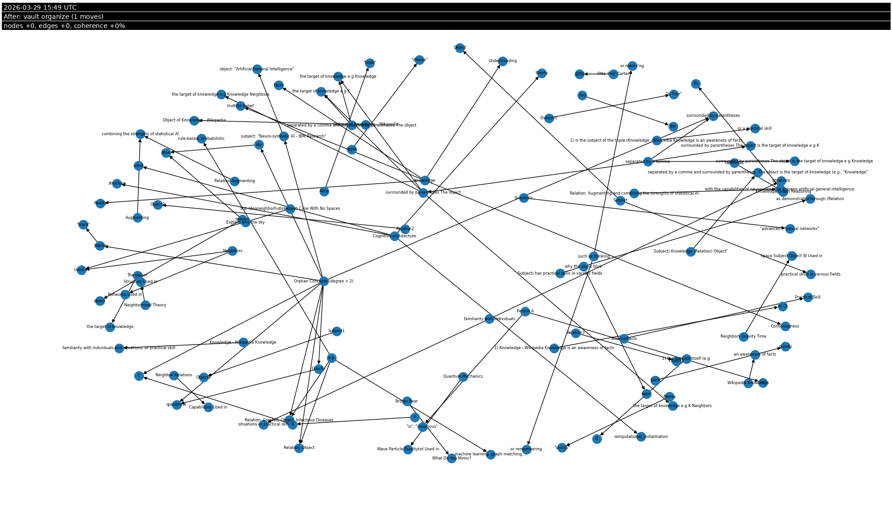](graph-2026-03-29-15-49-after-organize.png) [commit](https://github.com/BoggersTheFish/BoggersTheCIG/commit/b591ee0)

### 2026-03-29 15:49 UTC

**After:** 0 extracts, 1 merges — nodes +0, edges +0, coherence +0%

[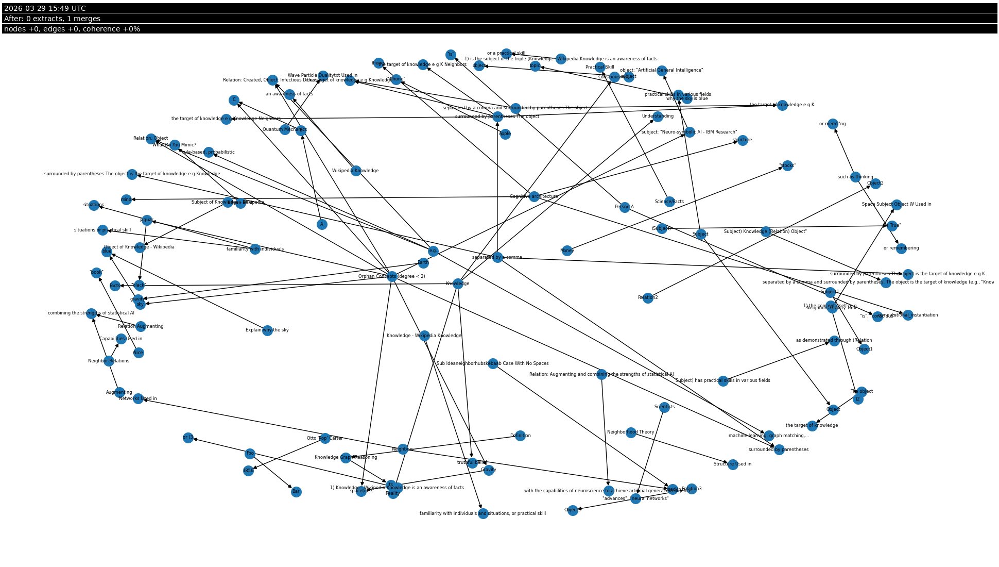](graph-2026-03-29-15-49-extract-subideas.png) [commit](https://github.com/BoggersTheFish/BoggersTheCIG/commit/b591ee0)

### 2026-03-29 15:50 UTC

**After:** 2_+2_.md"+Diseases.md"+Knowledge.md"+Mimic_.md" — nodes +0, edges +0, coherence +0%

[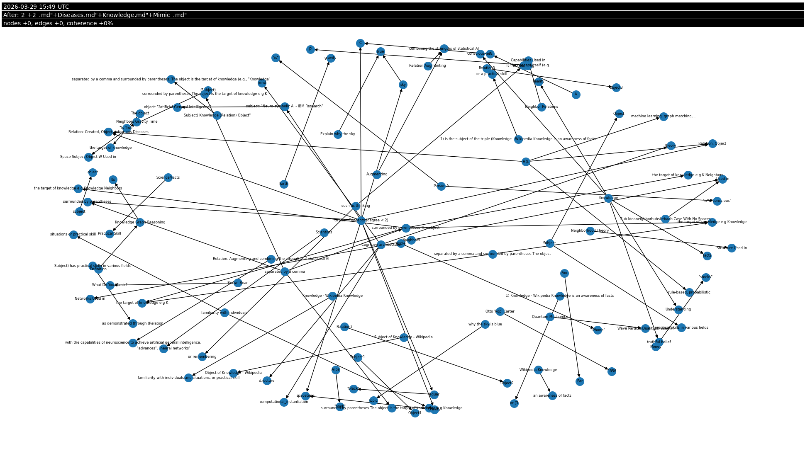](graph-2026-03-29-15-49-self-improve.png) [commit](https://github.com/BoggersTheFish/BoggersTheCIG/commit/b591ee0)

### 2026-03-29 20:40 UTC

**After:** external ingest (+1 triples) — nodes +4, edges +2, coherence +333233%

[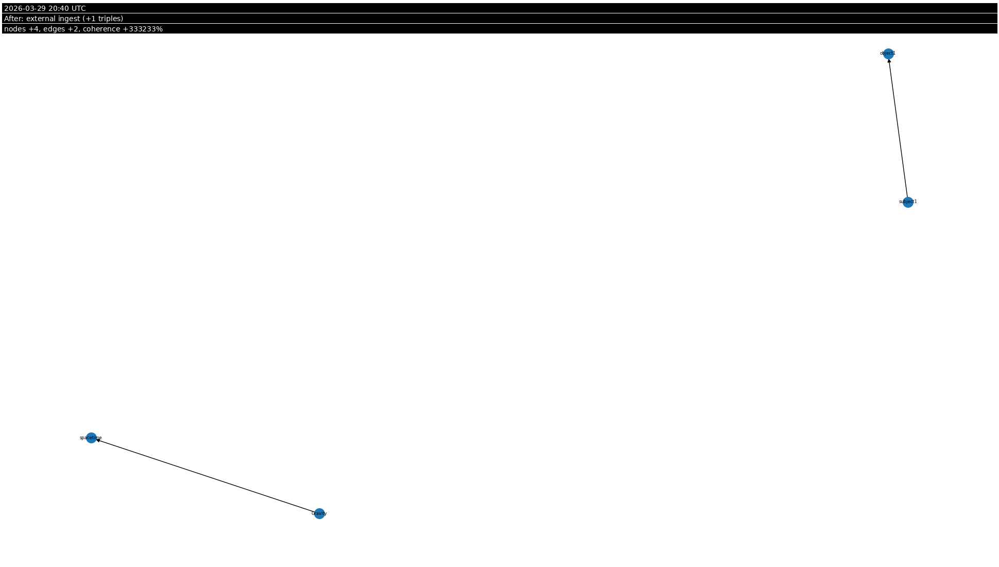](graph-2026-03-29-20-40-after-ingest.png) [commit](https://github.com/BoggersTheFish/BoggersTheCIG/commit/2658b26)

### 2026-03-29 20:40 UTC

**After:** vault analysis (+150 triples) — nodes +117, edges +74, coherence -96%

[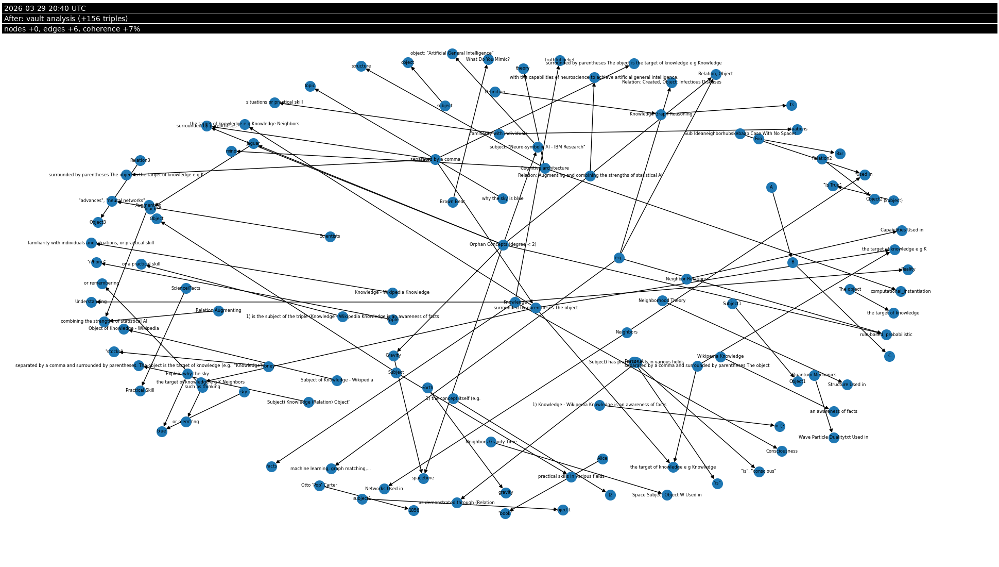](graph-2026-03-29-20-40-after-analyze-vault.png) [commit](https://github.com/BoggersTheFish/BoggersTheCIG/commit/2658b26)

### 2026-03-29 20:40 UTC

**After:** vault analysis (+156 triples) — nodes +0, edges +6, coherence +7%

 [commit](https://github.com/BoggersTheFish/BoggersTheCIG/commit/2658b26)

### 2026-03-29 20:46 UTC

**After:** vault organize (2 moves) — nodes +0, edges +0, coherence +0%

[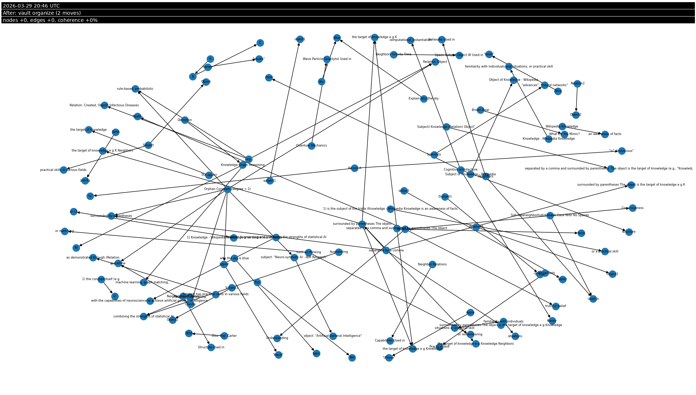](graph-2026-03-29-20-46-after-organize.png) [commit](https://github.com/BoggersTheFish/BoggersTheCIG/commit/2658b26)

### 2026-03-29 20:46 UTC

**After:** 1 extracts, 0 merges — nodes +0, edges +0, coherence +0%

[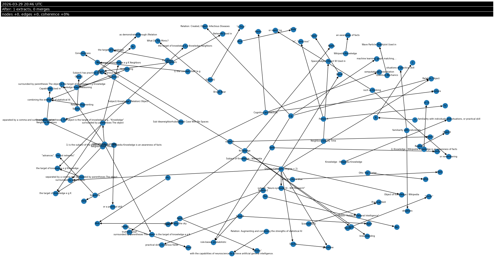](graph-2026-03-29-20-46-extract-subideas.png) [commit](https://github.com/BoggersTheFish/BoggersTheCIG/commit/2658b26)

### 2026-03-29 20:46 UTC

**After:** 2_+2_.md"+Theory.md"+comma.md"+eval — nodes +0, edges +0, coherence +0%

[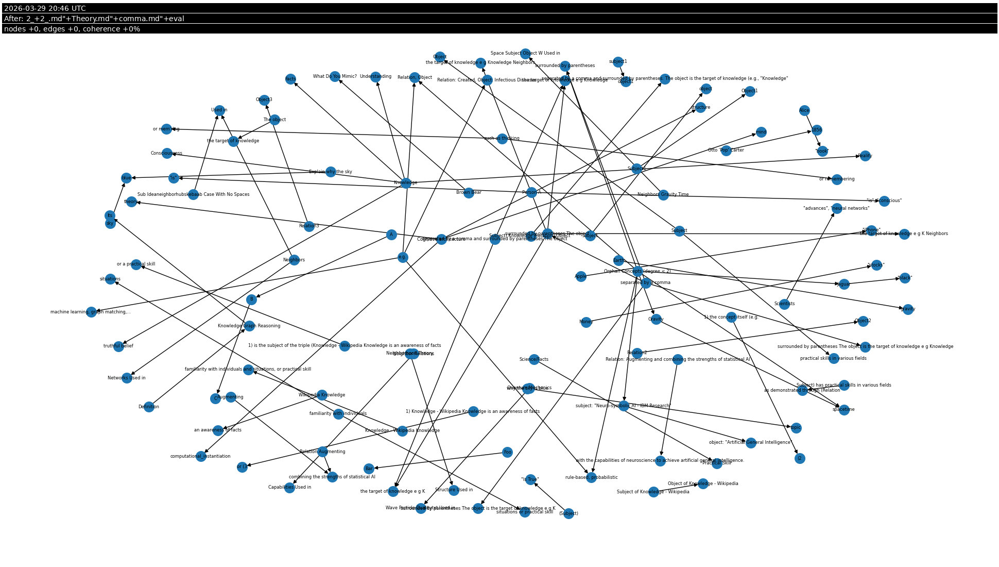](graph-2026-03-29-20-46-self-improve.png) [commit](https://github.com/BoggersTheFish/BoggersTheCIG/commit/2658b26)

### 2026-03-29 20:51 UTC

**After:** vault organize (4 moves) — nodes +0, edges +0, coherence +0%

[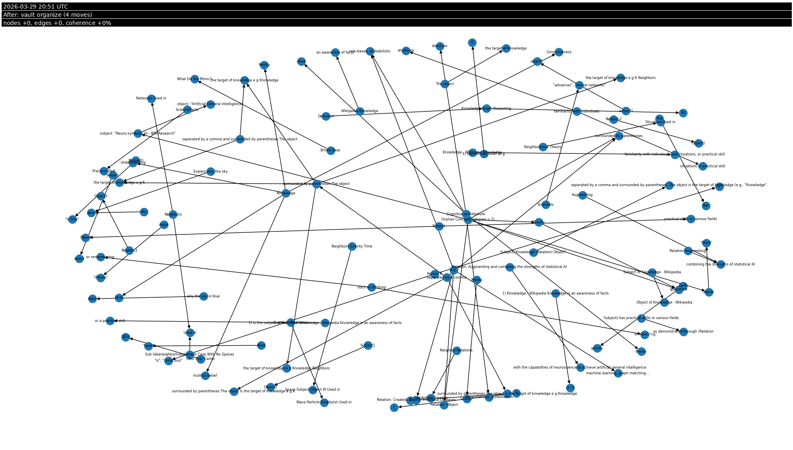](graph-2026-03-29-20-51-after-organize.png) [commit](https://github.com/BoggersTheFish/BoggersTheCIG/commit/2658b26)

### 2026-03-29 20:51 UTC

**After:** 0 extracts, 1 merges — nodes +0, edges +0, coherence +0%

[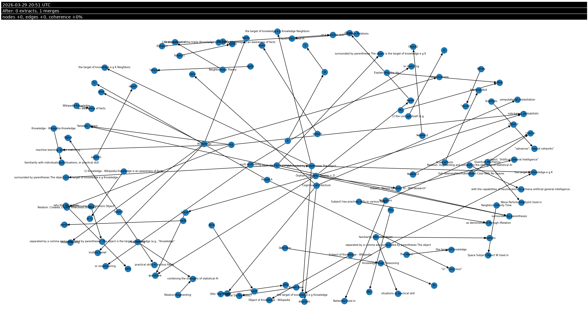](graph-2026-03-29-20-51-extract-subideas.png) [commit](https://github.com/BoggersTheFish/BoggersTheCIG/commit/2658b26)

### 2026-03-29 20:51 UTC

**After:** 2_+2_.md"+Neighbors.md"+Theory.md"+comma.md" — nodes +0, edges +0, coherence +0%

[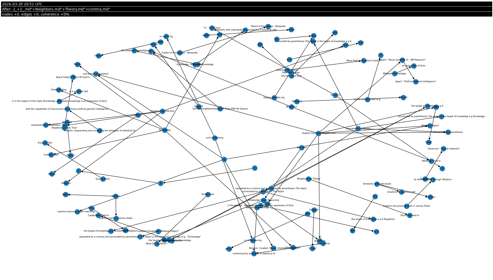](graph-2026-03-29-20-51-self-improve.png) [commit](https://github.com/BoggersTheFish/BoggersTheCIG/commit/2658b26)

### 2026-03-30 02:34 UTC

**After:** vault analysis (+152 triples) — nodes +121, edges +76, coherence +10368%

[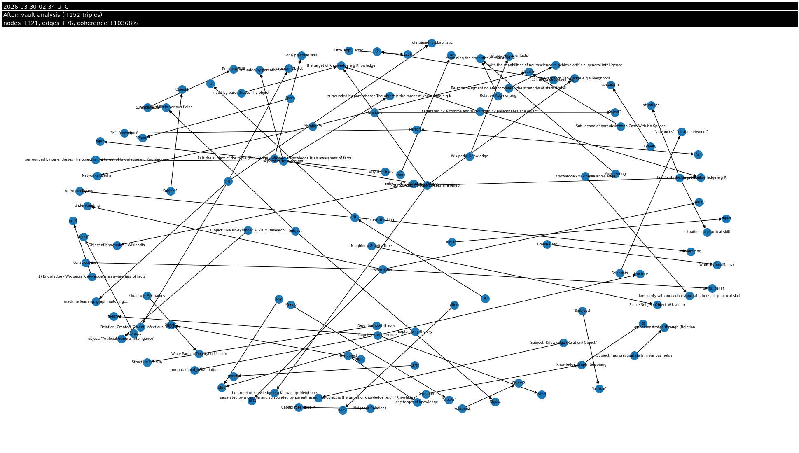](graph-2026-03-30-02-34-after-analyze-vault.png) [commit](https://github.com/BoggersTheFish/BoggersTheCIG/commit/c811a0e)

### 2026-03-30 02:35 UTC

**After:** vault analysis (+159 triples) — nodes +1, edges +6, coherence +6%

[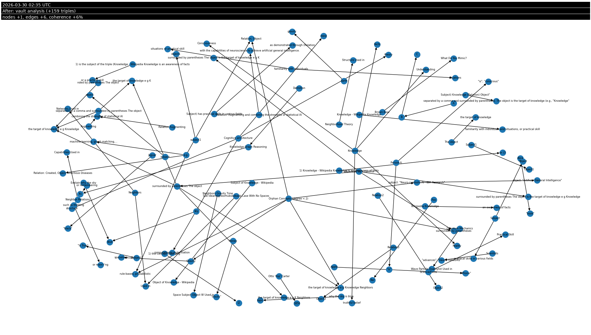](graph-2026-03-30-02-35-after-analyze-vault.png) [commit](https://github.com/BoggersTheFish/BoggersTheCIG/commit/c811a0e)

### 2026-03-30 02:40 UTC

**After:** vault organize (2 moves) — nodes +0, edges +0, coherence +0%

[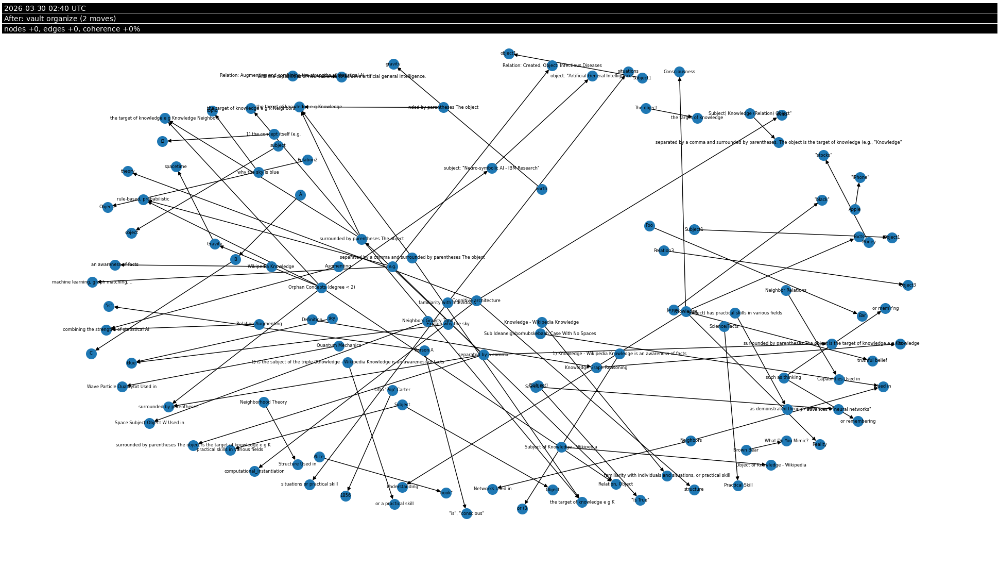](graph-2026-03-30-02-40-after-organize.png) [commit](https://github.com/BoggersTheFish/BoggersTheCIG/commit/c811a0e)

### 2026-03-30 02:40 UTC

**After:** 1 extracts, 0 merges — nodes +0, edges +0, coherence +0%

[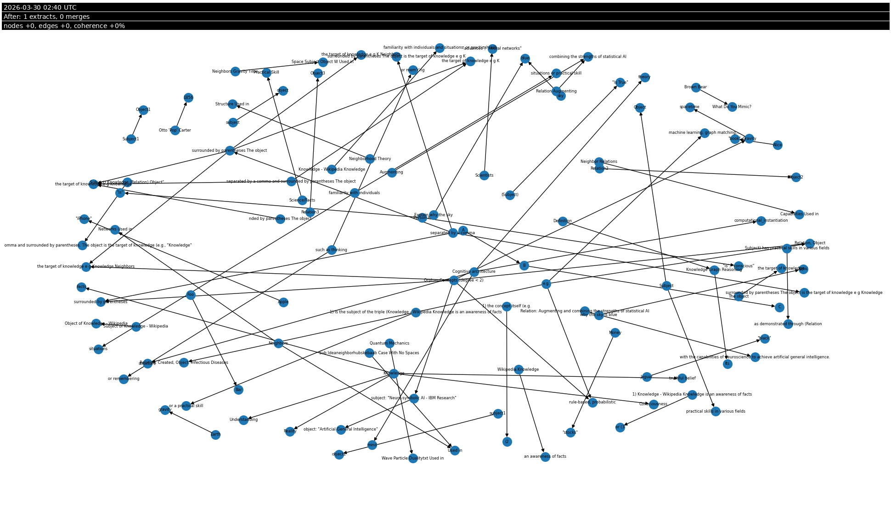](graph-2026-03-30-02-40-extract-subideas.png) [commit](https://github.com/BoggersTheFish/BoggersTheCIG/commit/c811a0e)

### 2026-03-30 02:40 UTC

**After:** 2_+2_.md"+Knowledge.md"+Relations.md"+eval — nodes +0, edges +0, coherence +0%

[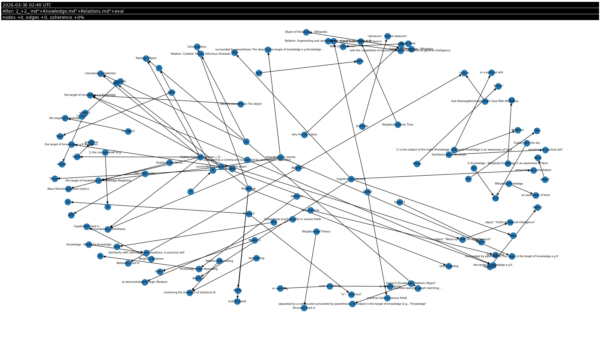](graph-2026-03-30-02-40-self-improve.png) [commit](https://github.com/BoggersTheFish/BoggersTheCIG/commit/c811a0e)

### 2026-03-30 02:45 UTC

**After:** vault organize (2 moves) — nodes +0, edges +0, coherence +0%

[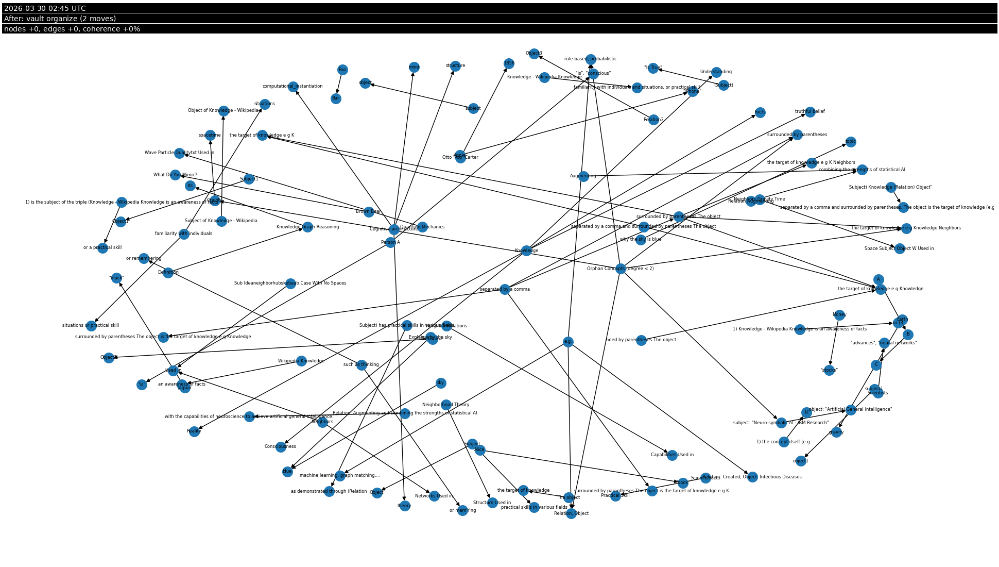](graph-2026-03-30-02-45-after-organize.png) [commit](https://github.com/BoggersTheFish/BoggersTheCIG/commit/c811a0e)

### 2026-03-30 02:45 UTC

**After:** 0 extracts, 1 merges — nodes +0, edges +0, coherence +0%

[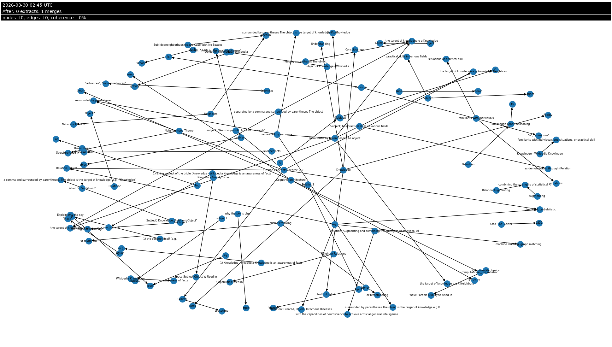](graph-2026-03-30-02-45-extract-subideas.png) [commit](https://github.com/BoggersTheFish/BoggersTheCIG/commit/c811a0e)

### 2026-03-30 02:45 UTC

**After:** 2_+2_.md"+Carter.md"+Knowledge.md"+Relations.md" — nodes +0, edges +0, coherence +0%

[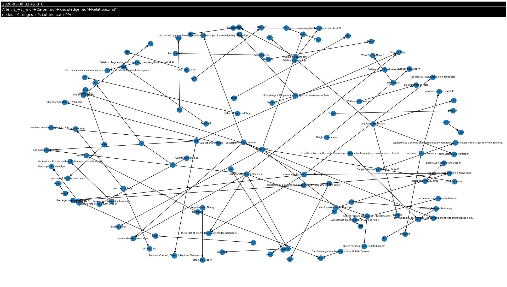](graph-2026-03-30-02-45-self-improve.png) [commit](https://github.com/BoggersTheFish/BoggersTheCIG/commit/c811a0e)

### 2026-03-30 07:00 UTC

**After:** external ingest (+1 triples) — nodes +4, edges +2, coherence +333233%

[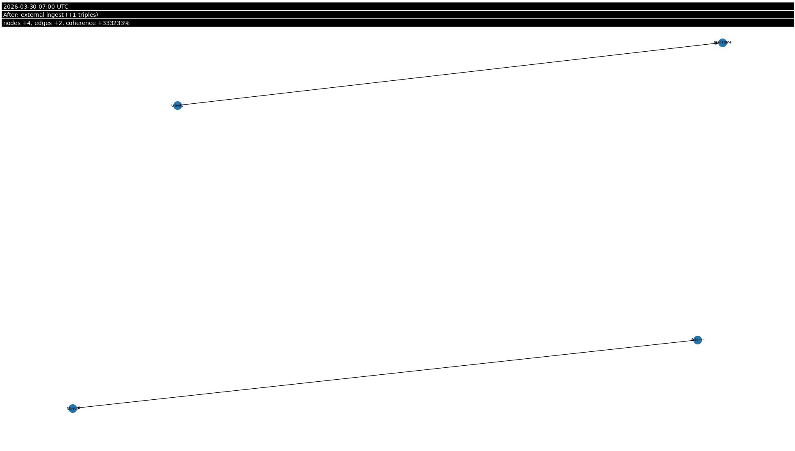](graph-2026-03-30-07-00-after-ingest.png) [commit](https://github.com/BoggersTheFish/BoggersTheCIG/commit/ea9ec1f)

### 2026-03-30 07:01 UTC

**After:** vault analysis (+159 triples) — nodes +118, edges +75, coherence -96%

[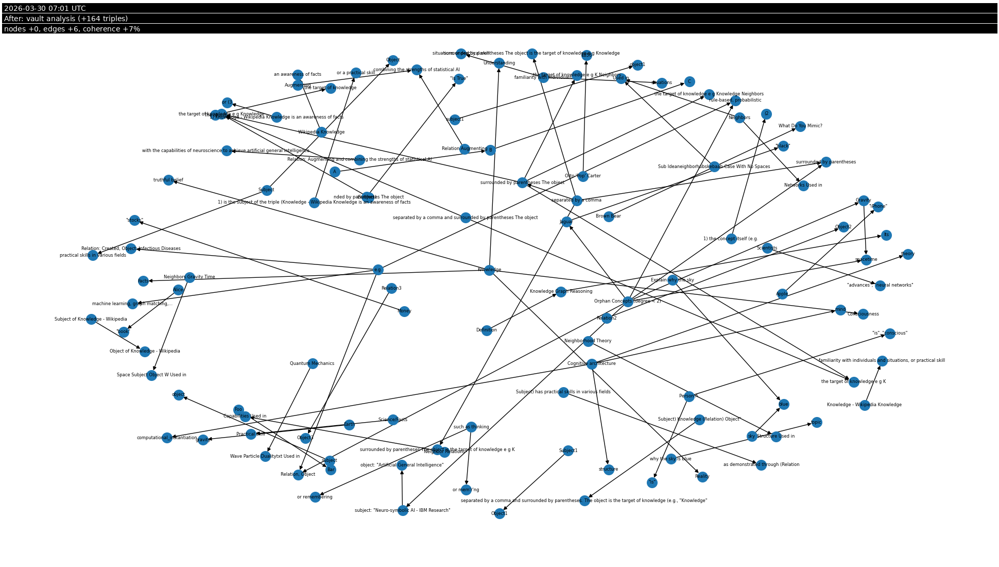](graph-2026-03-30-07-01-after-analyze-vault.png) [commit](https://github.com/BoggersTheFish/BoggersTheCIG/commit/ea9ec1f)

### 2026-03-30 07:01 UTC

**After:** 1 extracts, 0 merges — nodes +0, edges +0, coherence +0%

[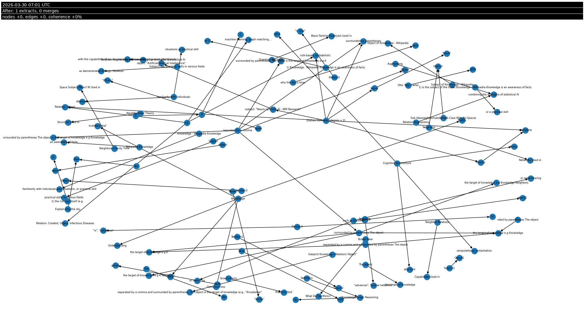](graph-2026-03-30-07-01-extract-subideas.png) [commit](https://github.com/BoggersTheFish/BoggersTheCIG/commit/ea9ec1f)

### 2026-03-30 07:01 UTC

**After:** vault analysis (+164 triples) — nodes +0, edges +6, coherence +7%

 [commit](https://github.com/BoggersTheFish/BoggersTheCIG/commit/ea9ec1f)

### 2026-03-30 07:01 UTC

**After:** 1 extracts, 0 merges — nodes +0, edges +0, coherence +0%

 [commit](https://github.com/BoggersTheFish/BoggersTheCIG/commit/ea9ec1f)

### 2026-03-30 07:06 UTC

**After:** vault organize (3 moves) — nodes +0, edges +0, coherence +0%

[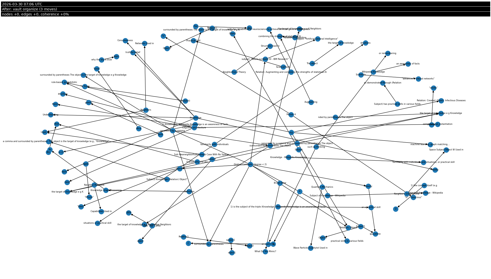](graph-2026-03-30-07-06-after-organize.png) [commit](https://github.com/BoggersTheFish/BoggersTheCIG/commit/ea9ec1f)

### 2026-03-30 07:06 UTC

**After:** 0 extracts, 1 merges — nodes +0, edges +0, coherence +0%

[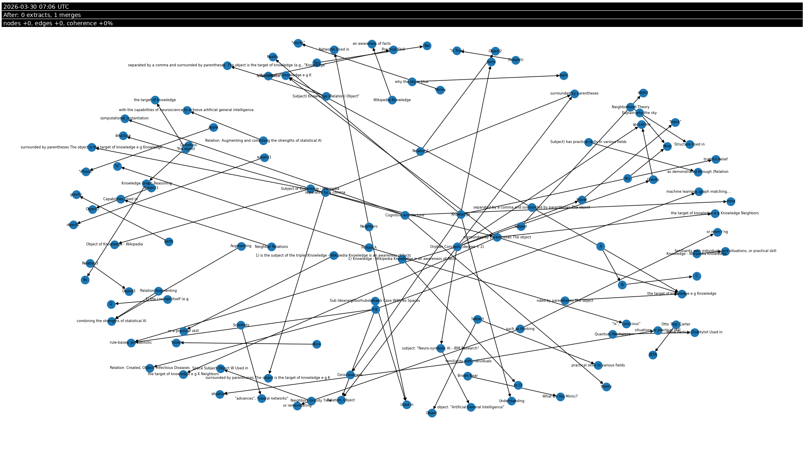](graph-2026-03-30-07-06-extract-subideas.png) [commit](https://github.com/BoggersTheFish/BoggersTheCIG/commit/ea9ec1f)

### 2026-03-30 07:06 UTC

**After:** 2_.md"+Carter.md"+comma.md"+eval+networks_.md" — nodes +0, edges +0, coherence +0%

[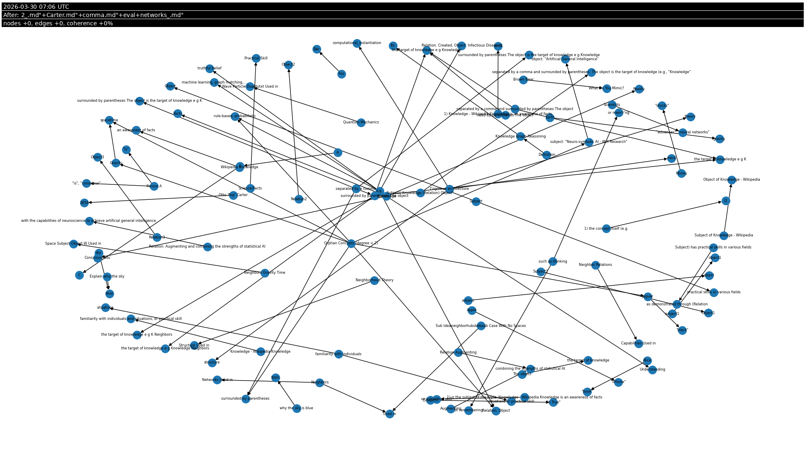](graph-2026-03-30-07-06-self-improve.png) [commit](https://github.com/BoggersTheFish/BoggersTheCIG/commit/ea9ec1f)

### 2026-03-30 07:11 UTC

**After:** vault organize (0 moves) — nodes +0, edges +0, coherence +0%

[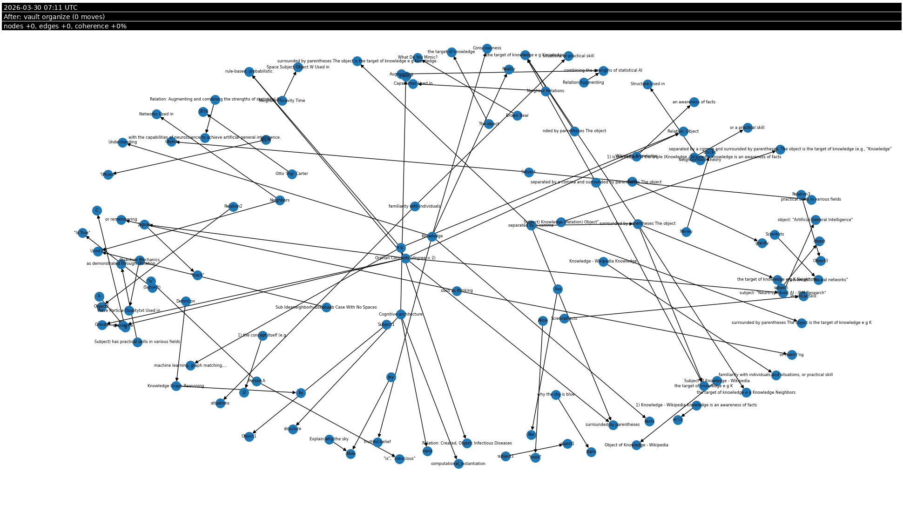](graph-2026-03-30-07-11-after-organize.png) [commit](https://github.com/BoggersTheFish/BoggersTheCIG/commit/ea9ec1f)

### 2026-03-30 07:11 UTC

**After:** 1 extracts, 0 merges — nodes +0, edges +0, coherence +0%

[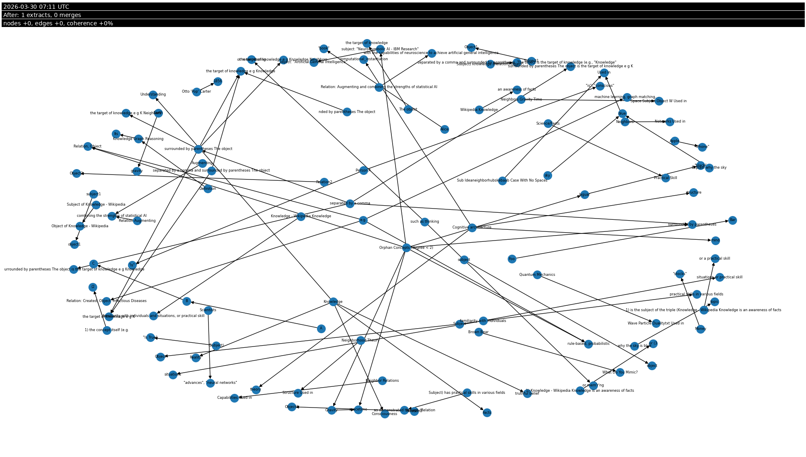](graph-2026-03-30-07-11-extract-subideas.png) [commit](https://github.com/BoggersTheFish/BoggersTheCIG/commit/ea9ec1f)

### 2026-03-30 07:11 UTC

**After:** 2_+2_.md"+Carter.md"+comma.md"+eval — nodes +0, edges +0, coherence +0%

[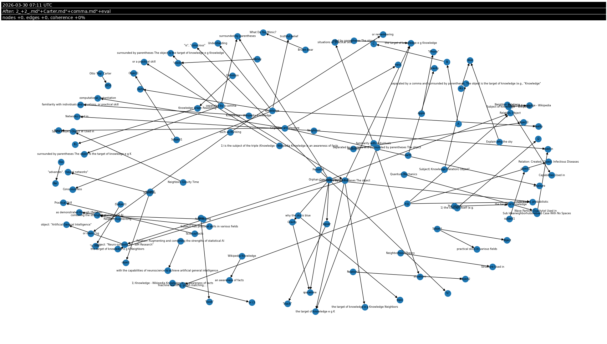](graph-2026-03-30-07-11-self-improve.png) [commit](https://github.com/BoggersTheFish/BoggersTheCIG/commit/ea9ec1f)

### 2026-03-30 11:09 UTC

**After:** external ingest (+1 triples) — nodes +4, edges +2, coherence +333233%

[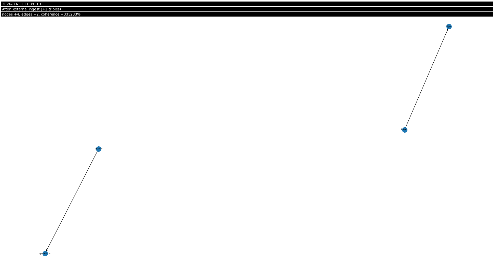](graph-2026-03-30-11-09-after-ingest.png) [commit](https://github.com/BoggersTheFish/BoggersTheCIG/commit/09223e1)

### 2026-03-30 11:10 UTC

**After:** vault analysis (+162 triples) — nodes +118, edges +75, coherence -96%

[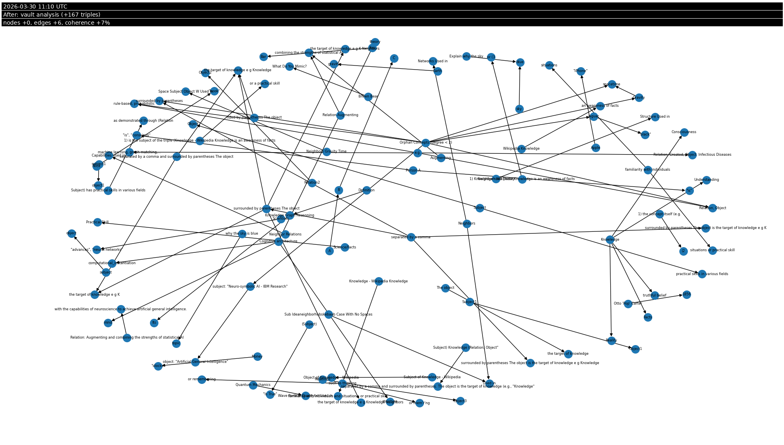](graph-2026-03-30-11-10-after-analyze-vault.png) [commit](https://github.com/BoggersTheFish/BoggersTheCIG/commit/09223e1)

### 2026-03-30 11:10 UTC

**After:** 1 extracts, 0 merges — nodes +0, edges +0, coherence +0%

[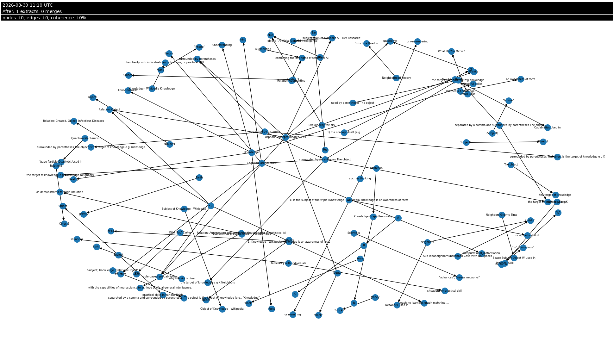](graph-2026-03-30-11-10-extract-subideas.png) [commit](https://github.com/BoggersTheFish/BoggersTheCIG/commit/09223e1)

### 2026-03-30 11:10 UTC

**After:** vault analysis (+167 triples) — nodes +0, edges +6, coherence +7%

 [commit](https://github.com/BoggersTheFish/BoggersTheCIG/commit/09223e1)

### 2026-03-30 11:10 UTC

**After:** 1 extracts, 0 merges — nodes +0, edges +0, coherence +0%

 [commit](https://github.com/BoggersTheFish/BoggersTheCIG/commit/09223e1)

### 2026-03-30 11:15 UTC

**After:** vault organize (0 moves) — nodes +0, edges +0, coherence +0%

[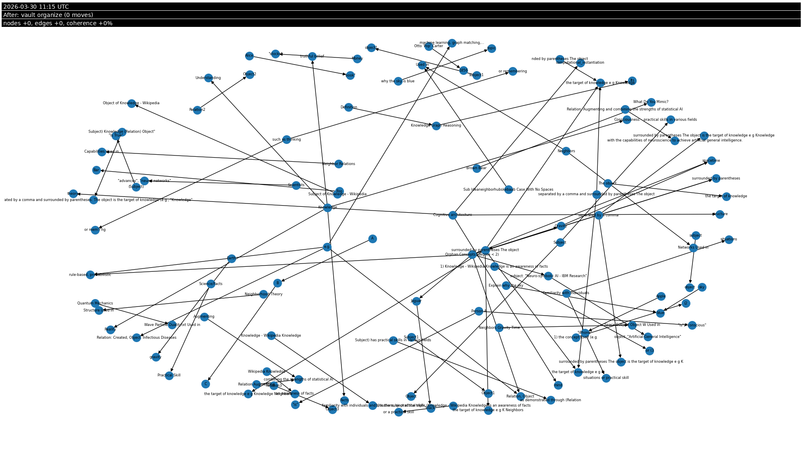](graph-2026-03-30-11-15-after-organize.png) [commit](https://github.com/BoggersTheFish/BoggersTheCIG/commit/09223e1)

### 2026-03-30 11:15 UTC

**After:** 0 extracts, 1 merges — nodes +0, edges +0, coherence +0%

[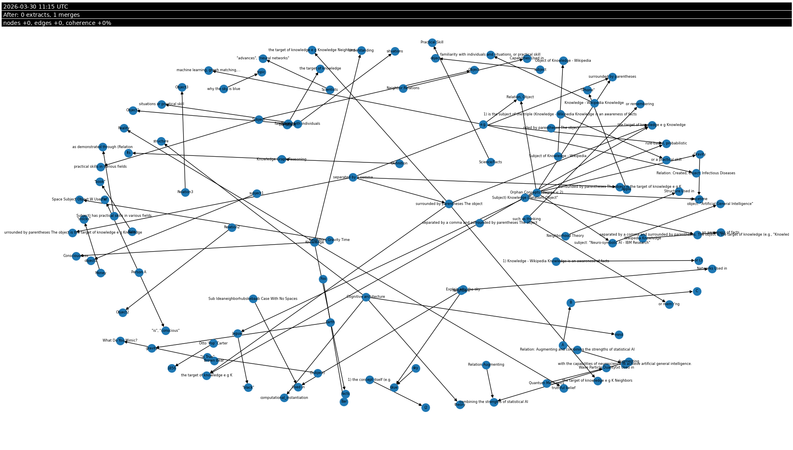](graph-2026-03-30-11-15-extract-subideas.png) [commit](https://github.com/BoggersTheFish/BoggersTheCIG/commit/09223e1)

### 2026-03-30 11:15 UTC

**After:** 2_+2_.md"+eval+individuals.md"+obsidian — nodes +0, edges +0, coherence +0%

[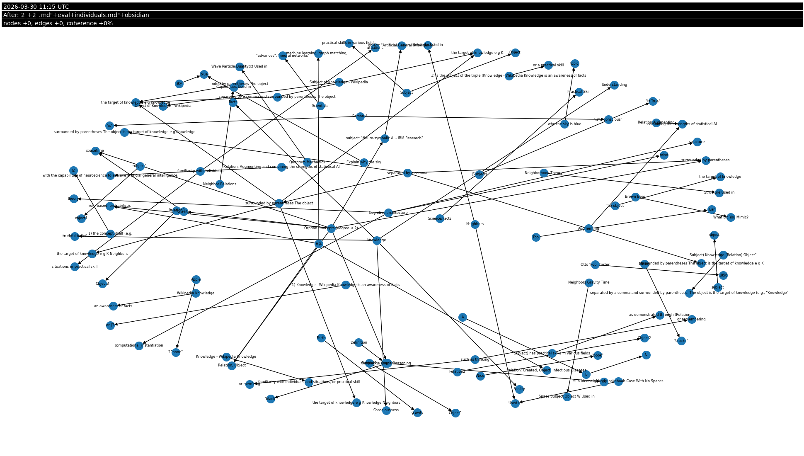](graph-2026-03-30-11-15-self-improve.png) [commit](https://github.com/BoggersTheFish/BoggersTheCIG/commit/09223e1)

### 2026-03-30 11:20 UTC

**After:** vault organize (0 moves) — nodes +0, edges +0, coherence +0%

[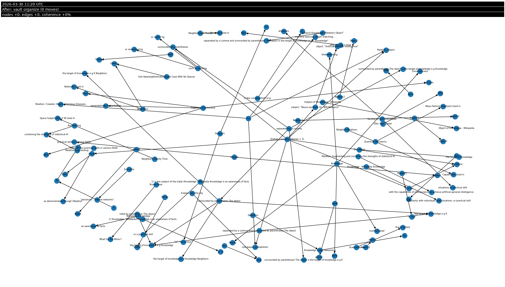](graph-2026-03-30-11-20-after-organize.png) [commit](https://github.com/BoggersTheFish/BoggersTheCIG/commit/09223e1)

### 2026-03-30 11:20 UTC

**After:** 1 extracts, 0 merges — nodes +0, edges +0, coherence +0%

[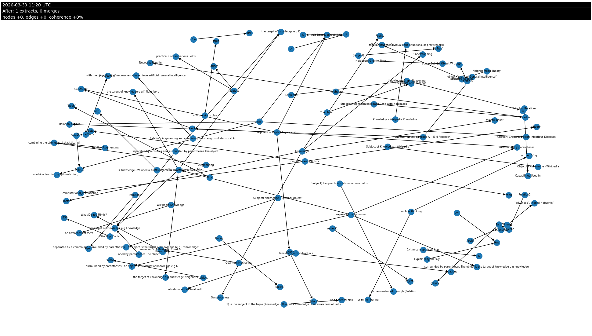](graph-2026-03-30-11-20-extract-subideas.png) [commit](https://github.com/BoggersTheFish/BoggersTheCIG/commit/09223e1)

### 2026-03-30 11:20 UTC

**After:** 2_+2_.md"+eval+individuals.md"+obsidian — nodes +0, edges +0, coherence +0%

[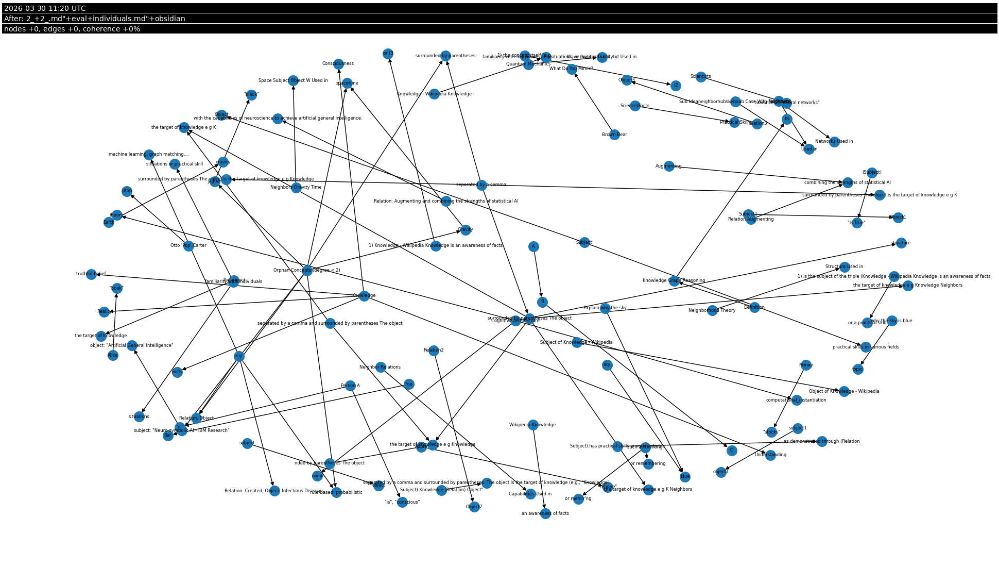](graph-2026-03-30-11-20-self-improve.png) [commit](https://github.com/BoggersTheFish/BoggersTheCIG/commit/09223e1)

### 2026-03-30 16:15 UTC

**After:** vault analysis (+161 triples) — nodes +121, edges +76, coherence +10368%

[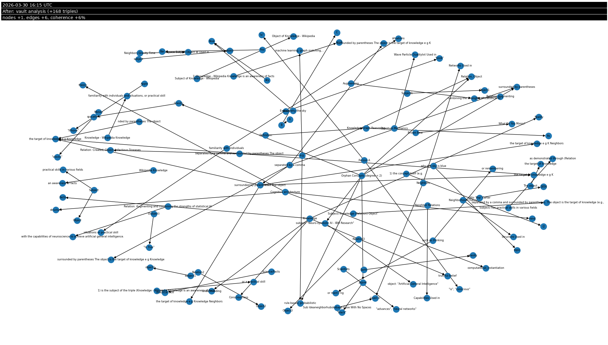](graph-2026-03-30-16-15-after-analyze-vault.png) [commit](https://github.com/BoggersTheFish/BoggersTheCIG/commit/546025d)

### 2026-03-30 16:15 UTC

**After:** 1 extracts, 0 merges — nodes +0, edges +0, coherence +0%

[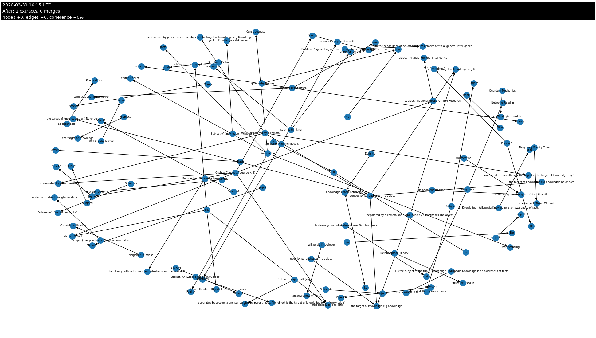](graph-2026-03-30-16-15-extract-subideas.png) [commit](https://github.com/BoggersTheFish/BoggersTheCIG/commit/546025d)

### 2026-03-30 16:15 UTC

**After:** vault analysis (+168 triples) — nodes +1, edges +6, coherence +6%

 [commit](https://github.com/BoggersTheFish/BoggersTheCIG/commit/546025d)

### 2026-03-30 16:15 UTC

**After:** 1 extracts, 0 merges — nodes +0, edges +0, coherence +0%

 [commit](https://github.com/BoggersTheFish/BoggersTheCIG/commit/546025d)

### 2026-03-30 16:21 UTC

**After:** vault organize (0 moves) — nodes +0, edges +0, coherence +0%

[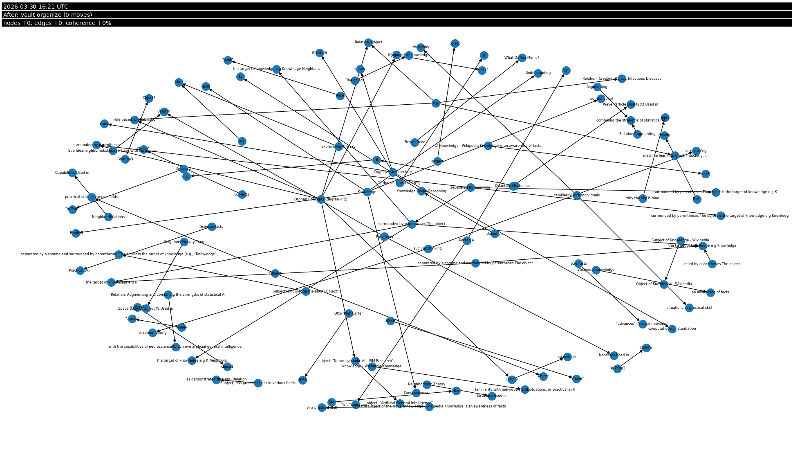](graph-2026-03-30-16-21-after-organize.png) [commit](https://github.com/BoggersTheFish/BoggersTheCIG/commit/546025d)

### 2026-03-30 16:21 UTC

**After:** 0 extracts, 1 merges — nodes +0, edges +0, coherence +0%

[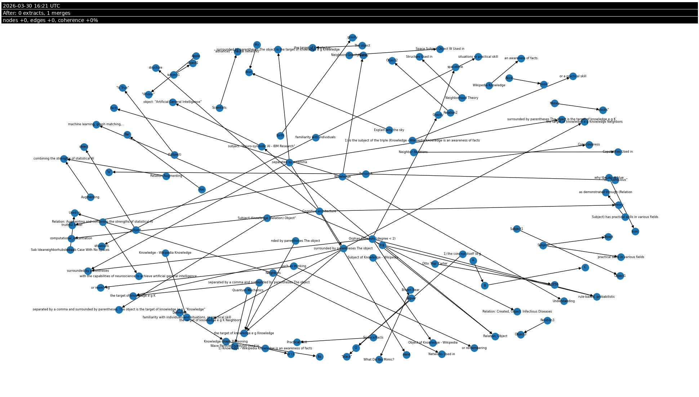](graph-2026-03-30-16-21-extract-subideas.png) [commit](https://github.com/BoggersTheFish/BoggersTheCIG/commit/546025d)

### 2026-03-30 16:21 UTC

**After:** 2_+2_.md"+comma.md"+eval+obsidian — nodes +0, edges +0, coherence +0%

[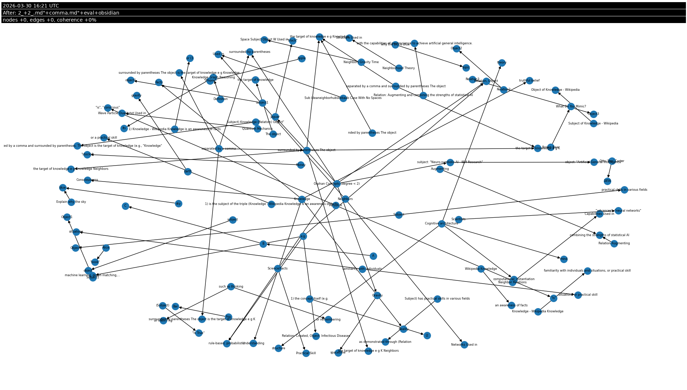](graph-2026-03-30-16-21-self-improve.png) [commit](https://github.com/BoggersTheFish/BoggersTheCIG/commit/546025d)

### 2026-03-30 16:26 UTC

**After:** vault organize (3 moves) — nodes +0, edges +0, coherence +0%

[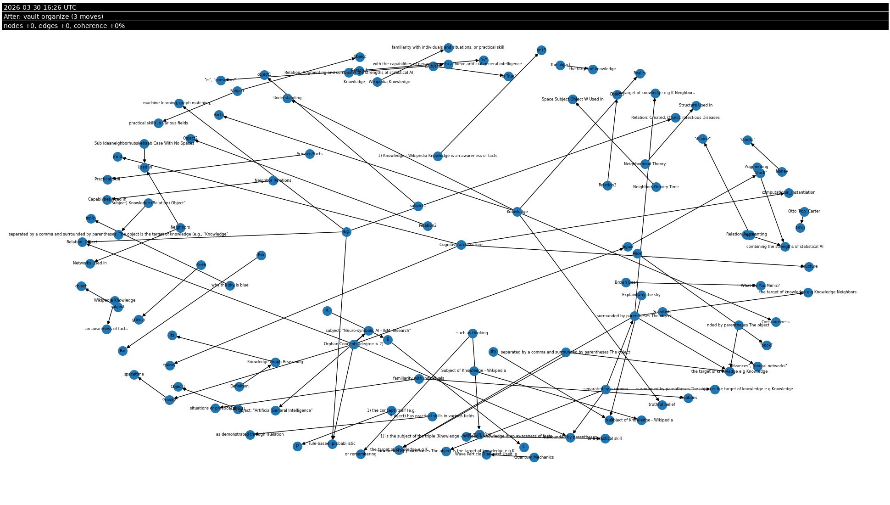](graph-2026-03-30-16-26-after-organize.png) [commit](https://github.com/BoggersTheFish/BoggersTheCIG/commit/546025d)

### 2026-03-30 16:26 UTC

**After:** 0 extracts, 1 merges — nodes +0, edges +0, coherence +0%

[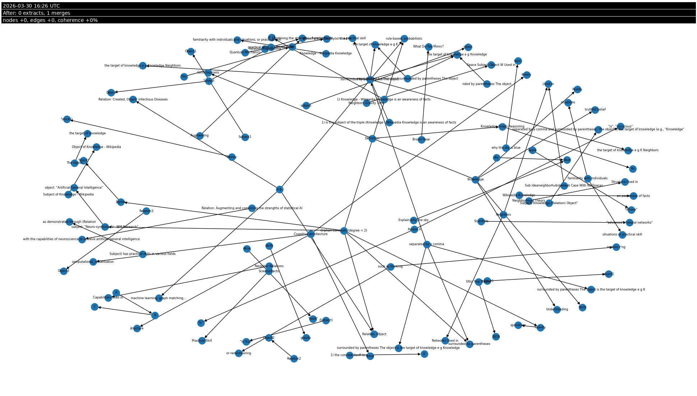](graph-2026-03-30-16-26-extract-subideas.png) [commit](https://github.com/BoggersTheFish/BoggersTheCIG/commit/546025d)

### 2026-03-30 16:26 UTC

**After:** 2_+2_.md"+Augmenting.md"+comma.md"+eval — nodes +0, edges +0, coherence +0%

[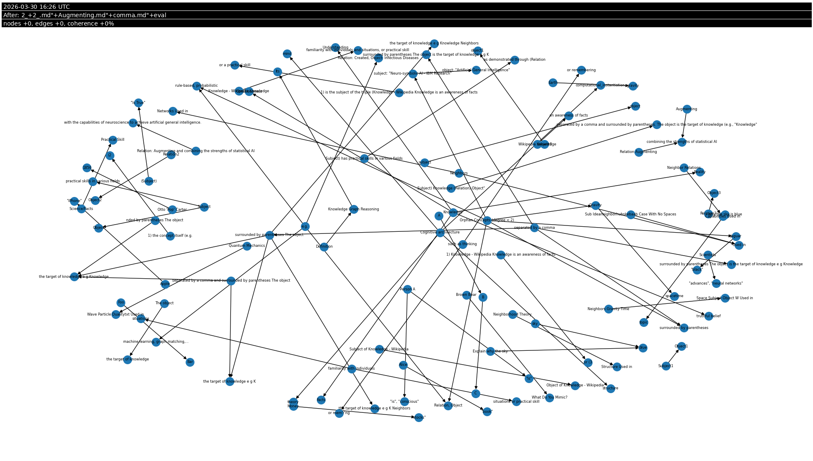](graph-2026-03-30-16-26-self-improve.png) [commit](https://github.com/BoggersTheFish/BoggersTheCIG/commit/546025d)

### 2026-03-30 20:53 UTC

**After:** vault analysis (+163 triples) — nodes +121, edges +76, coherence +10368%

[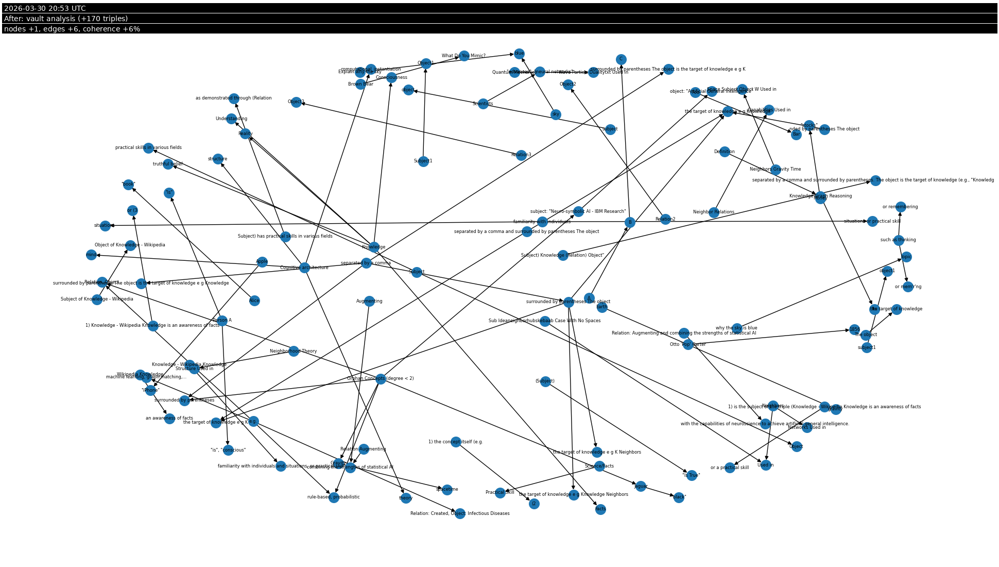](graph-2026-03-30-20-53-after-analyze-vault.png) [commit](https://github.com/BoggersTheFish/BoggersTheCIG/commit/40473a5)

### 2026-03-30 20:53 UTC

**After:** 1 extracts, 0 merges — nodes +0, edges +0, coherence +0%

[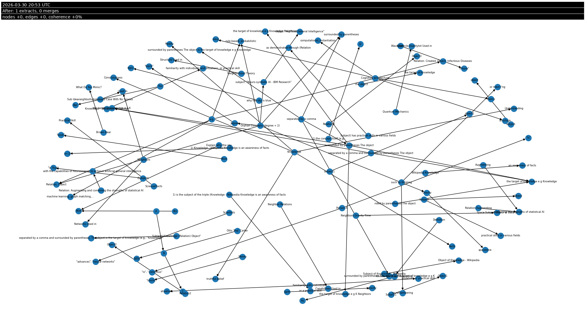](graph-2026-03-30-20-53-extract-subideas.png) [commit](https://github.com/BoggersTheFish/BoggersTheCIG/commit/40473a5)

### 2026-03-30 20:53 UTC

**After:** vault analysis (+170 triples) — nodes +1, edges +6, coherence +6%

 [commit](https://github.com/BoggersTheFish/BoggersTheCIG/commit/40473a5)

### 2026-03-30 20:53 UTC

**After:** 1 extracts, 0 merges — nodes +0, edges +0, coherence +0%

 [commit](https://github.com/BoggersTheFish/BoggersTheCIG/commit/40473a5)

### 2026-03-30 20:59 UTC

**After:** vault organize (0 moves) — nodes +0, edges +0, coherence +0%

[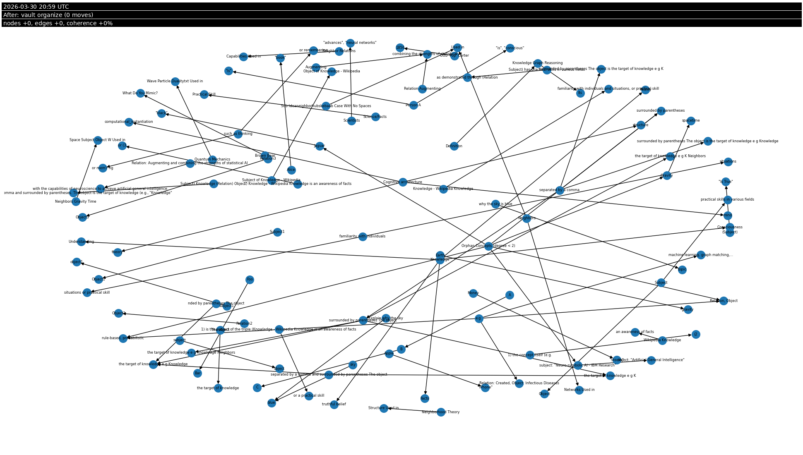](graph-2026-03-30-20-59-after-organize.png) [commit](https://github.com/BoggersTheFish/BoggersTheCIG/commit/40473a5)

### 2026-03-30 20:59 UTC

**After:** 0 extracts, 1 merges — nodes +0, edges +0, coherence +0%

[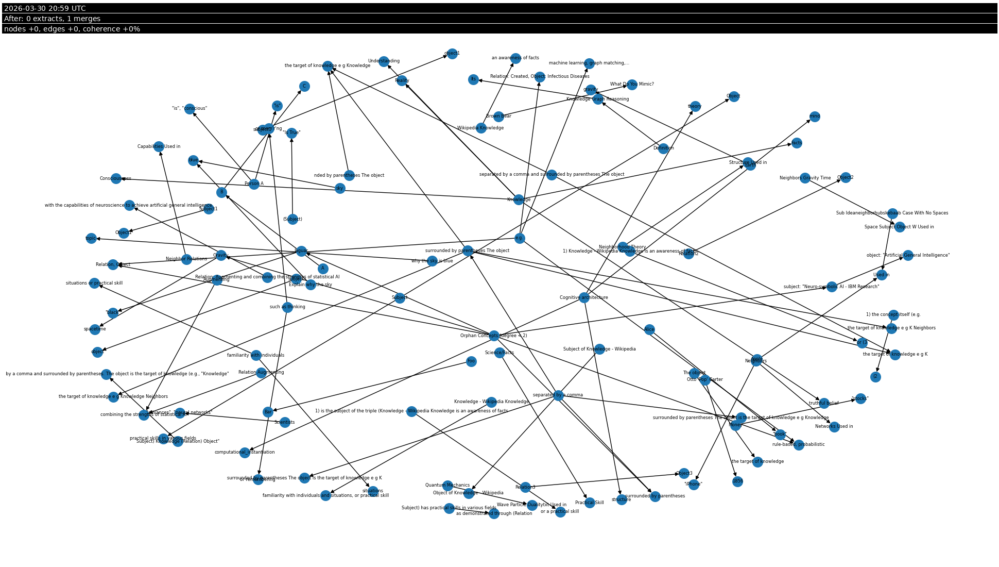](graph-2026-03-30-20-59-extract-subideas.png) [commit](https://github.com/BoggersTheFish/BoggersTheCIG/commit/40473a5)

### 2026-03-30 20:59 UTC

**After:** 2_+2_.md"+Augmenting.md"+eval+obsidian — nodes +0, edges +0, coherence +0%

[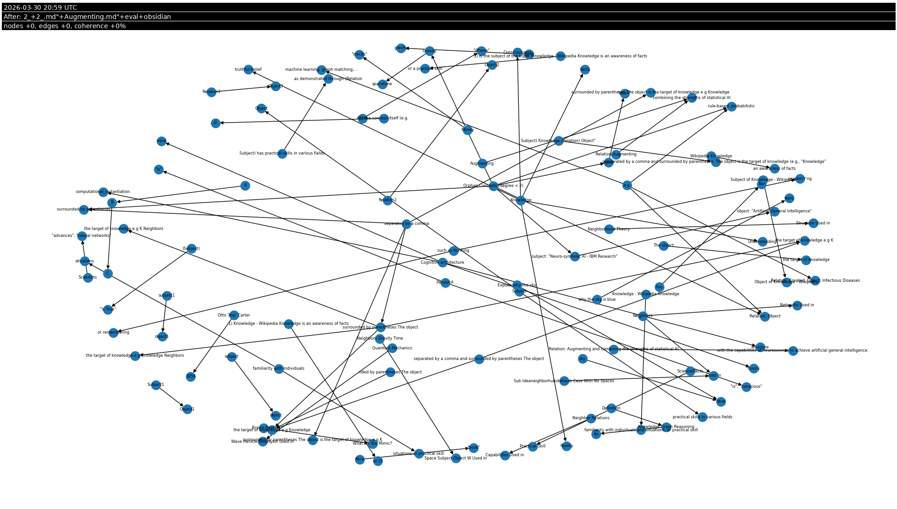](graph-2026-03-30-20-59-self-improve.png) [commit](https://github.com/BoggersTheFish/BoggersTheCIG/commit/40473a5)

### 2026-03-30 21:05 UTC

**After:** vault organize (0 moves) — nodes +0, edges +0, coherence +0%

[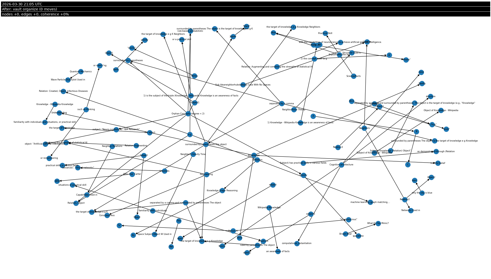](graph-2026-03-30-21-05-after-organize.png) [commit](https://github.com/BoggersTheFish/BoggersTheCIG/commit/40473a5)

### 2026-03-30 21:05 UTC

**After:** 1 extracts, 0 merges — nodes +0, edges +0, coherence +0%

[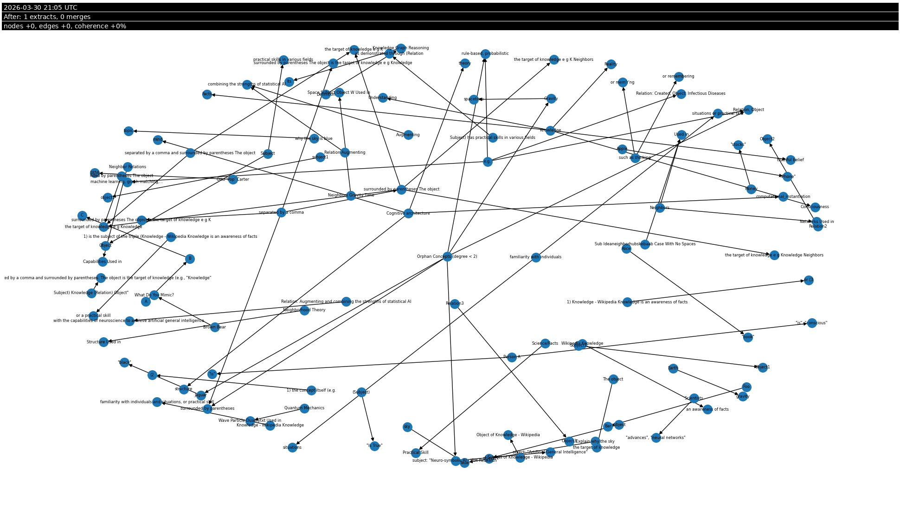](graph-2026-03-30-21-05-extract-subideas.png) [commit](https://github.com/BoggersTheFish/BoggersTheCIG/commit/40473a5)

### 2026-03-30 21:05 UTC

**After:** 2_+2_.md"+Augmenting.md"+eval+obsidian — nodes +0, edges +0, coherence +0%

[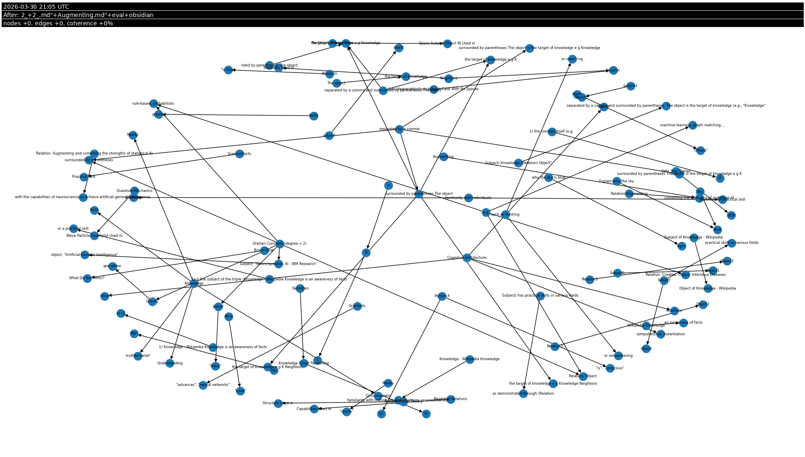](graph-2026-03-30-21-05-self-improve.png) [commit](https://github.com/BoggersTheFish/BoggersTheCIG/commit/40473a5)

### 2026-03-31 02:21 UTC

**After:** vault analysis (+163 triples) — nodes +121, edges +76, coherence +10368%

[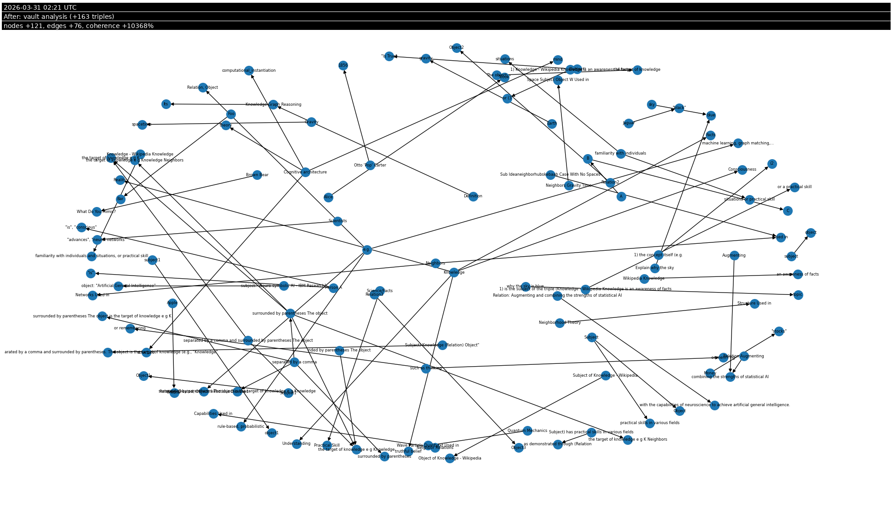](graph-2026-03-31-02-21-after-analyze-vault.png) [commit](https://github.com/BoggersTheFish/BoggersTheCIG/commit/122d93b)

### 2026-03-31 02:22 UTC

**After:** 1 extracts, 0 merges — nodes +0, edges +0, coherence +0%

[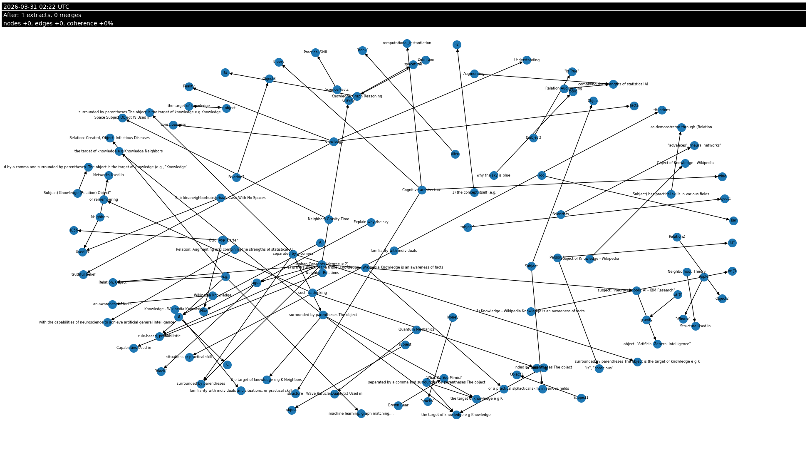](graph-2026-03-31-02-22-extract-subideas.png) [commit](https://github.com/BoggersTheFish/BoggersTheCIG/commit/122d93b)

### 2026-03-31 02:22 UTC

**After:** vault analysis (+170 triples) — nodes +1, edges +6, coherence +6%

[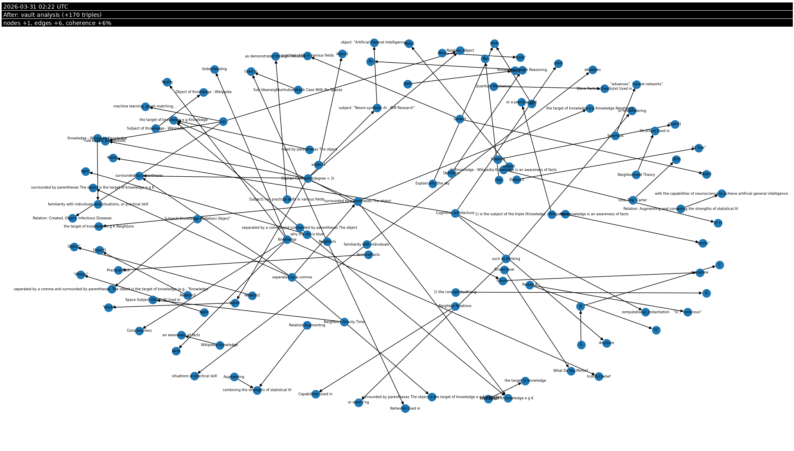](graph-2026-03-31-02-22-after-analyze-vault.png) [commit](https://github.com/BoggersTheFish/BoggersTheCIG/commit/122d93b)

### 2026-03-31 02:22 UTC

**After:** 1 extracts, 0 merges — nodes +0, edges +0, coherence +0%

 [commit](https://github.com/BoggersTheFish/BoggersTheCIG/commit/122d93b)

### 2026-03-31 02:27 UTC

**After:** vault organize (2 moves) — nodes +0, edges +0, coherence +0%

[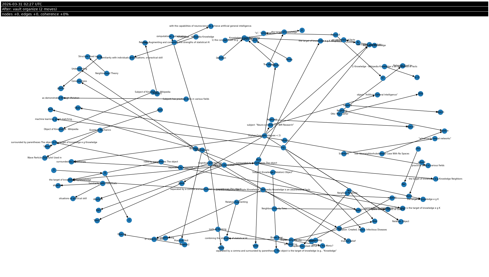](graph-2026-03-31-02-27-after-organize.png) [commit](https://github.com/BoggersTheFish/BoggersTheCIG/commit/122d93b)

### 2026-03-31 02:27 UTC

**After:** 0 extracts, 1 merges — nodes +0, edges +0, coherence +0%

[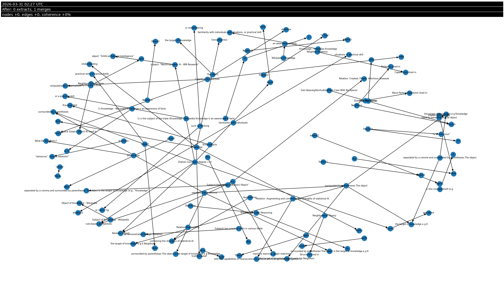](graph-2026-03-31-02-27-extract-subideas.png) [commit](https://github.com/BoggersTheFish/BoggersTheCIG/commit/122d93b)

### 2026-03-31 02:27 UTC

**After:** 2_+2_.md"+eval+in.md"+obsidian — nodes +0, edges +0, coherence +0%

[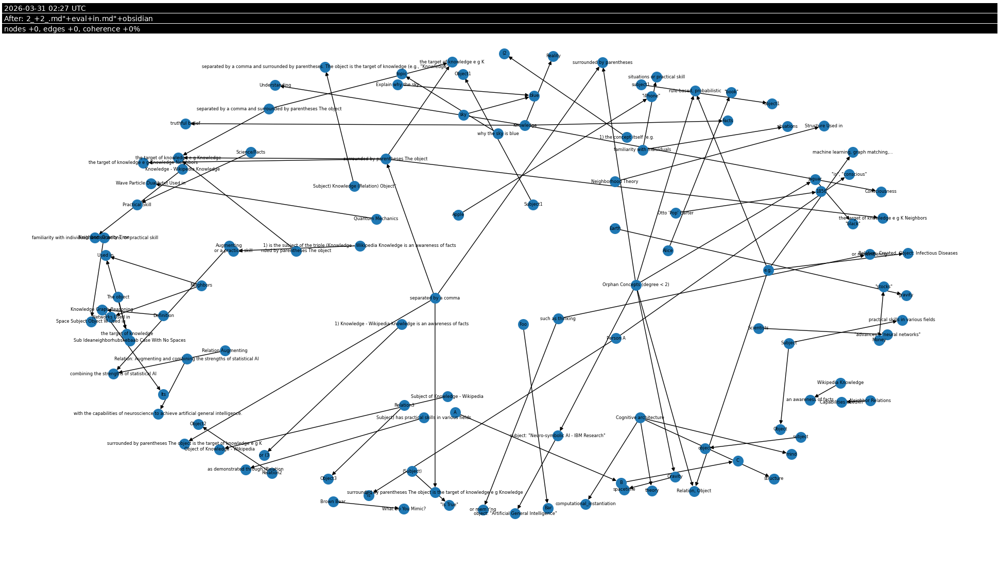](graph-2026-03-31-02-27-self-improve.png) [commit](https://github.com/BoggersTheFish/BoggersTheCIG/commit/122d93b)

### 2026-03-31 02:32 UTC

**After:** vault organize (0 moves) — nodes +0, edges +0, coherence +0%

[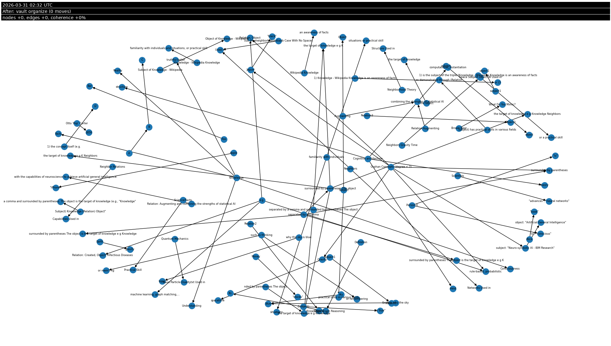](graph-2026-03-31-02-32-after-organize.png) [commit](https://github.com/BoggersTheFish/BoggersTheCIG/commit/122d93b)

### 2026-03-31 02:32 UTC

**After:** 1 extracts, 0 merges — nodes +0, edges +0, coherence +0%

[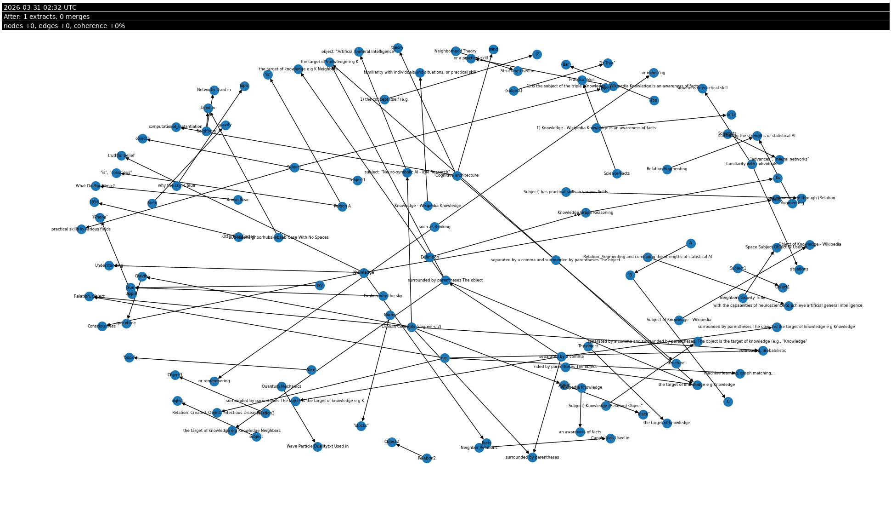](graph-2026-03-31-02-32-extract-subideas.png) [commit](https://github.com/BoggersTheFish/BoggersTheCIG/commit/122d93b)

### 2026-03-31 02:32 UTC

**After:** 2_+2_.md"+eval+in.md"+obsidian — nodes +0, edges +0, coherence +0%

[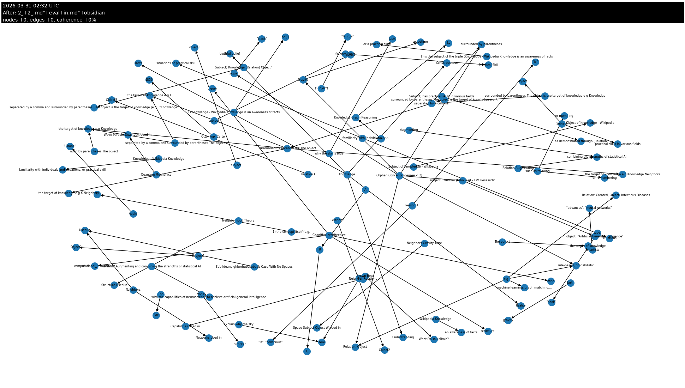](graph-2026-03-31-02-32-self-improve.png) [commit](https://github.com/BoggersTheFish/BoggersTheCIG/commit/122d93b)

### 2026-03-31 06:24 UTC

**After:** external ingest (+5 triples) — nodes +12, edges +6, coherence +90809%

[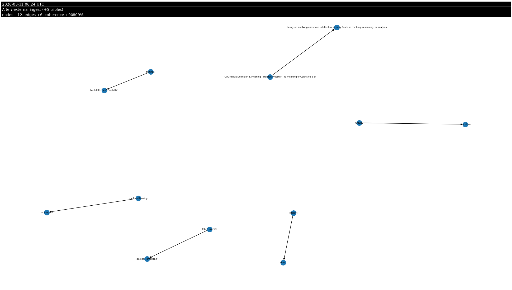](graph-2026-03-31-06-24-after-ingest.png) [commit](https://github.com/BoggersTheFish/BoggersTheCIG/commit/78cc9b7)

### 2026-03-31 06:24 UTC

**After:** vault analysis (+167 triples) — nodes +119, edges +78, coherence -89%

[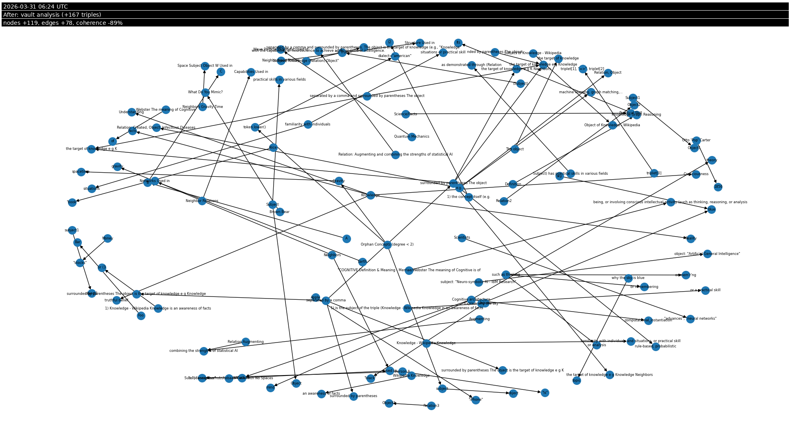](graph-2026-03-31-06-24-after-analyze-vault.png) [commit](https://github.com/BoggersTheFish/BoggersTheCIG/commit/78cc9b7)

### 2026-03-31 06:25 UTC

**After:** 1 extracts, 0 merges — nodes +0, edges +0, coherence +0%

[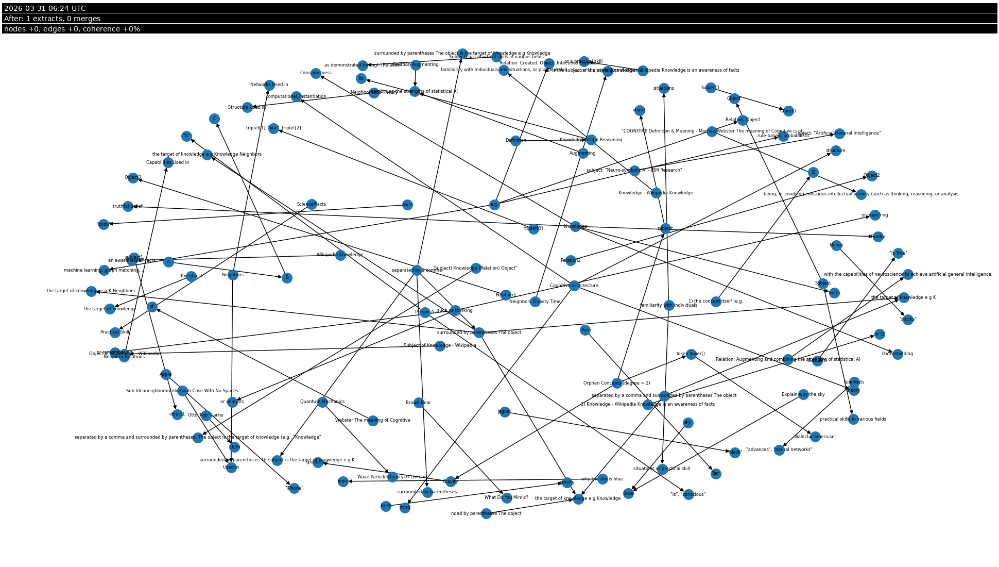](graph-2026-03-31-06-24-extract-subideas.png) [commit](https://github.com/BoggersTheFish/BoggersTheCIG/commit/78cc9b7)

### 2026-03-31 06:25 UTC

**After:** vault analysis (+171 triples) — nodes +0, edges +8, coherence +9%

[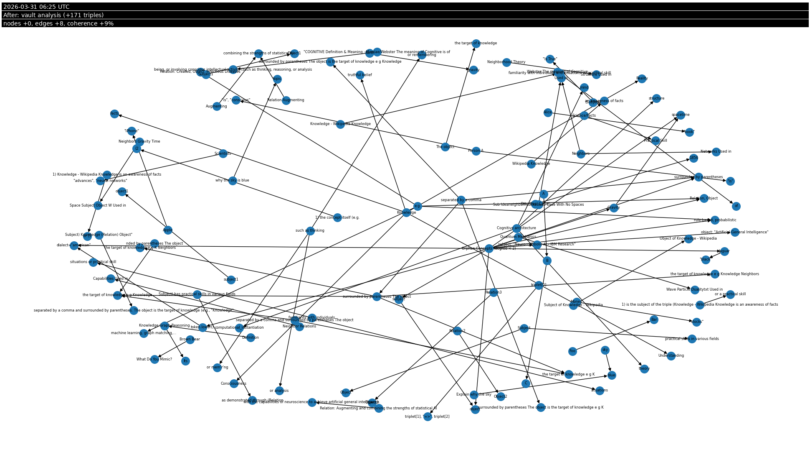](graph-2026-03-31-06-25-after-analyze-vault.png) [commit](https://github.com/BoggersTheFish/BoggersTheCIG/commit/78cc9b7)

### 2026-03-31 06:25 UTC

**After:** 1 extracts, 0 merges — nodes +0, edges +0, coherence +0%

[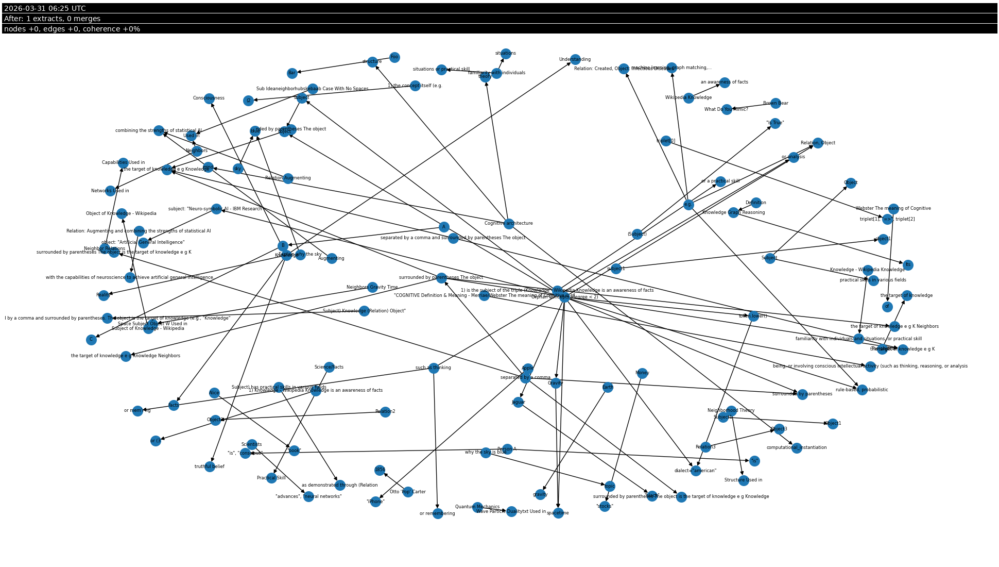](graph-2026-03-31-06-25-extract-subideas.png) [commit](https://github.com/BoggersTheFish/BoggersTheCIG/commit/78cc9b7)

### 2026-03-31 06:31 UTC

**After:** vault organize (3 moves) — nodes +0, edges +0, coherence +0%

[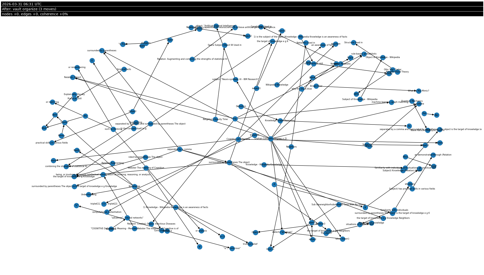](graph-2026-03-31-06-31-after-organize.png) [commit](https://github.com/BoggersTheFish/BoggersTheCIG/commit/78cc9b7)

### 2026-03-31 06:32 UTC

**After:** 2 extracts, 0 merges — nodes +0, edges +0, coherence +0%

[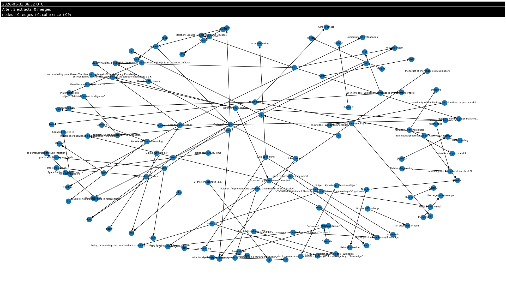](graph-2026-03-31-06-32-extract-subideas.png) [commit](https://github.com/BoggersTheFish/BoggersTheCIG/commit/78cc9b7)

### 2026-03-31 06:32 UTC

**After:** 2_+2_.md"+Cognitive.md"+Diseases.md"+analysis.md" — nodes +0, edges +0, coherence +0%

[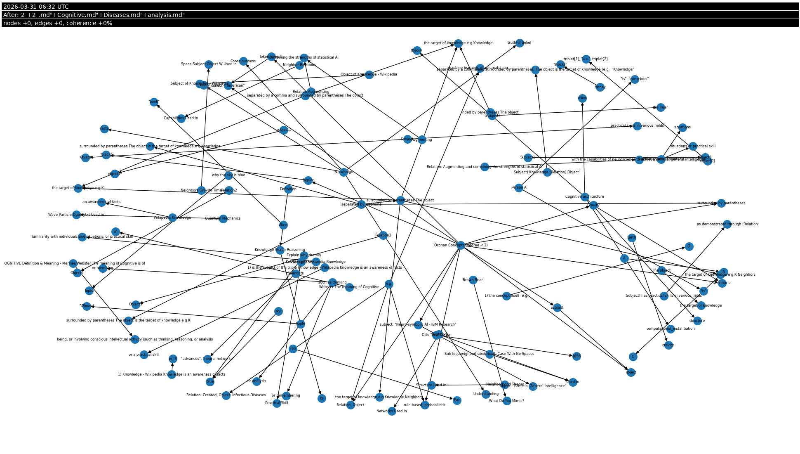](graph-2026-03-31-06-32-self-improve.png) [commit](https://github.com/BoggersTheFish/BoggersTheCIG/commit/78cc9b7)

### 2026-03-31 06:38 UTC

**After:** vault organize (5 moves) — nodes +0, edges +0, coherence +0%

[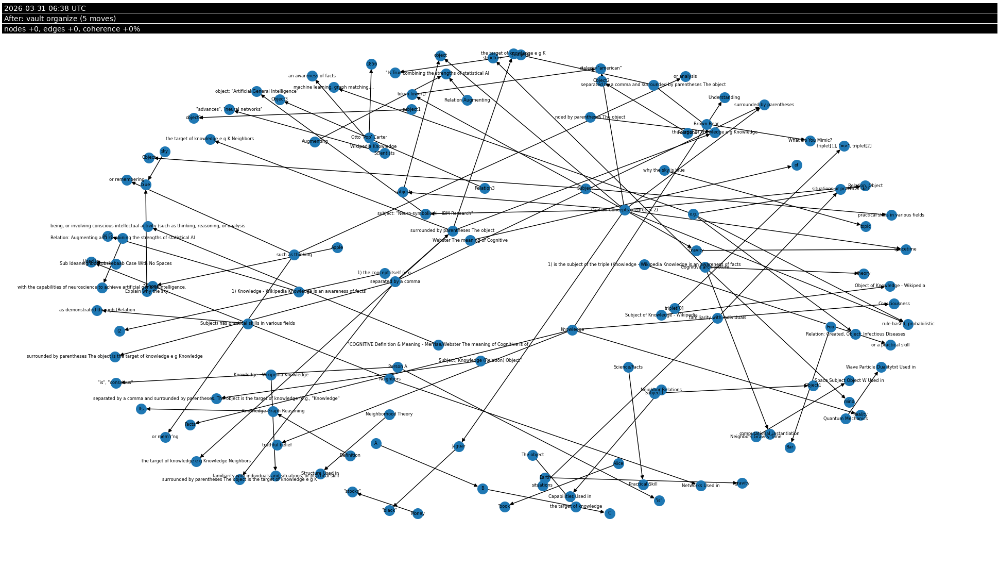](graph-2026-03-31-06-38-after-organize.png) [commit](https://github.com/BoggersTheFish/BoggersTheCIG/commit/78cc9b7)

### 2026-03-31 06:38 UTC

**After:** 1 extracts, 1 merges — nodes +0, edges +0, coherence +0%

[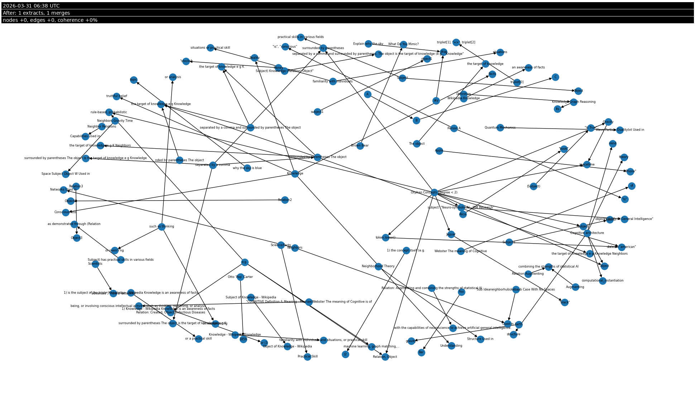](graph-2026-03-31-06-38-extract-subideas.png) [commit](https://github.com/BoggersTheFish/BoggersTheCIG/commit/78cc9b7)

### 2026-03-31 06:38 UTC

**After:** 2_+2_.md"+Cognitive.md"+Diseases.md"+analysis.md" — nodes +0, edges +0, coherence +0%

[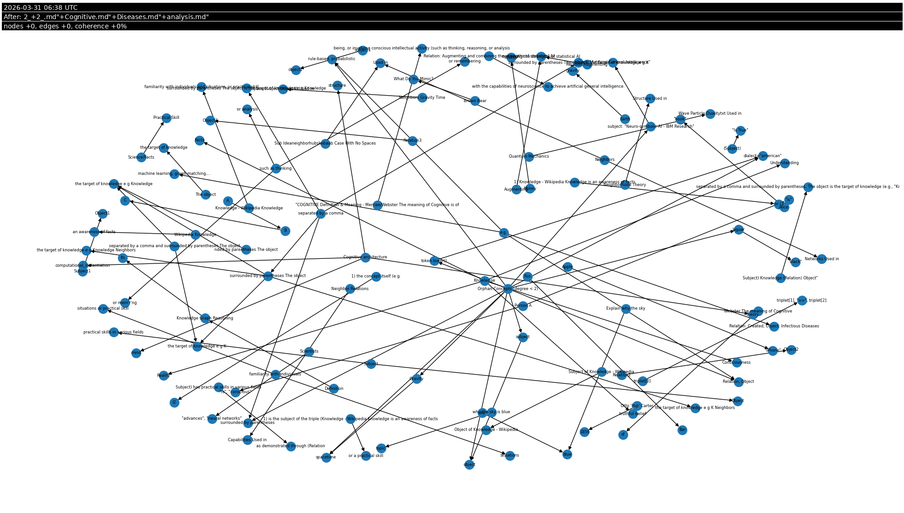](graph-2026-03-31-06-38-self-improve.png) [commit](https://github.com/BoggersTheFish/BoggersTheCIG/commit/78cc9b7)

### 2026-03-31 11:01 UTC

**After:** vault analysis (+163 triples) — nodes +128, edges +80, coherence +9742%

[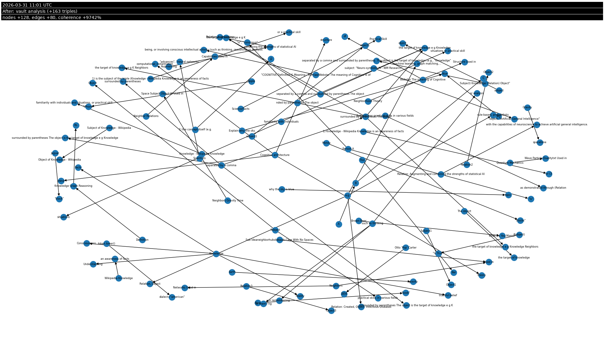](graph-2026-03-31-11-01-after-analyze-vault.png) [commit](https://github.com/BoggersTheFish/BoggersTheCIG/commit/c43a92e)

### 2026-03-31 11:01 UTC

**After:** 2 extracts, 0 merges — nodes +0, edges +0, coherence +0%

[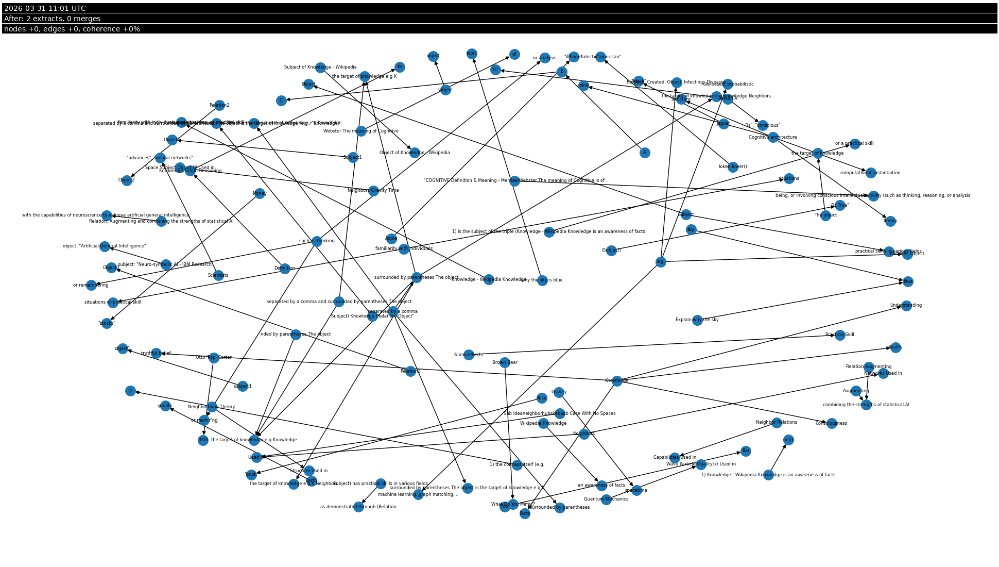](graph-2026-03-31-11-01-extract-subideas.png) [commit](https://github.com/BoggersTheFish/BoggersTheCIG/commit/c43a92e)

### 2026-03-31 11:02 UTC

**After:** vault analysis (+169 triples) — nodes +1, edges +6, coherence +5%

[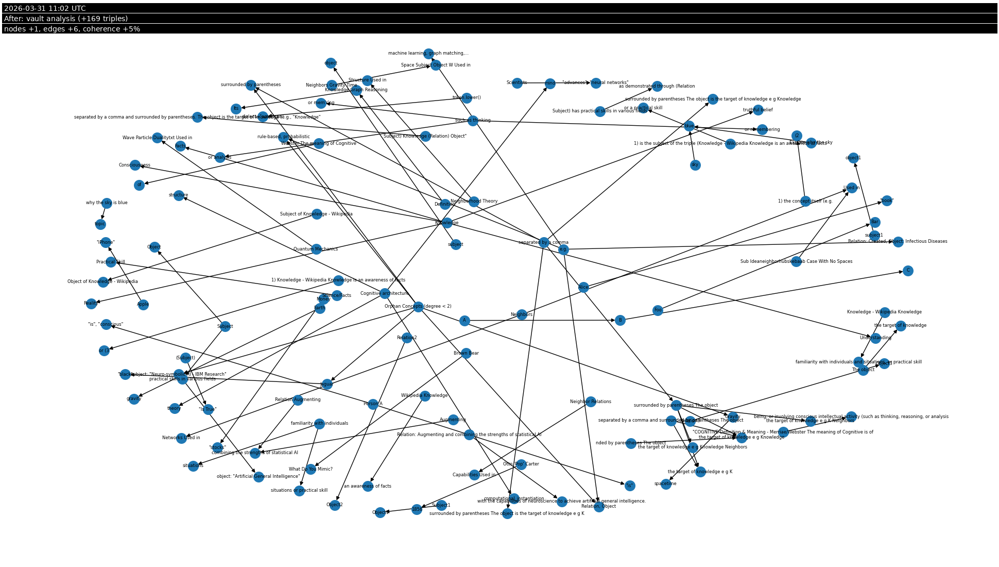](graph-2026-03-31-11-02-after-analyze-vault.png) [commit](https://github.com/BoggersTheFish/BoggersTheCIG/commit/c43a92e)

### 2026-03-31 11:02 UTC

**After:** 2 extracts, 0 merges — nodes +0, edges +0, coherence +0%

[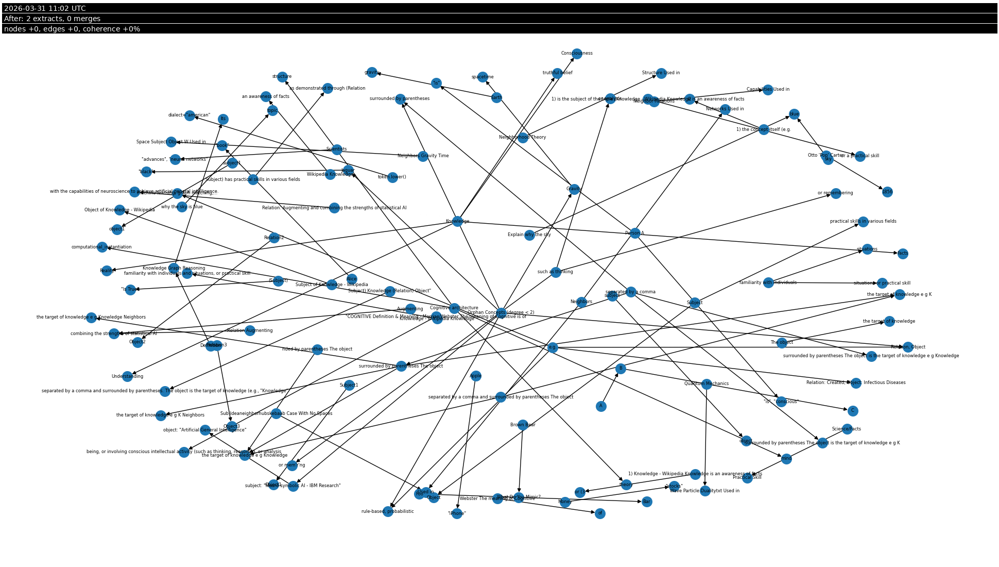](graph-2026-03-31-11-02-extract-subideas.png) [commit](https://github.com/BoggersTheFish/BoggersTheCIG/commit/c43a92e)

### 2026-03-31 11:08 UTC

**After:** vault organize (1 moves) — nodes +0, edges +0, coherence +0%

[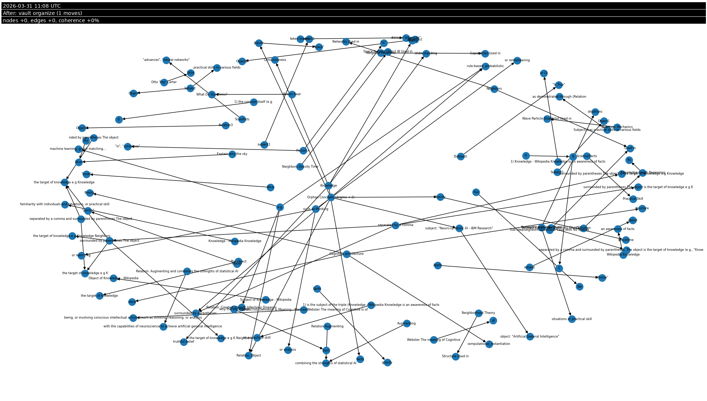](graph-2026-03-31-11-08-after-organize.png) [commit](https://github.com/BoggersTheFish/BoggersTheCIG/commit/c43a92e)

### 2026-03-31 11:08 UTC

**After:** 1 extracts, 1 merges — nodes +0, edges +0, coherence +0%

[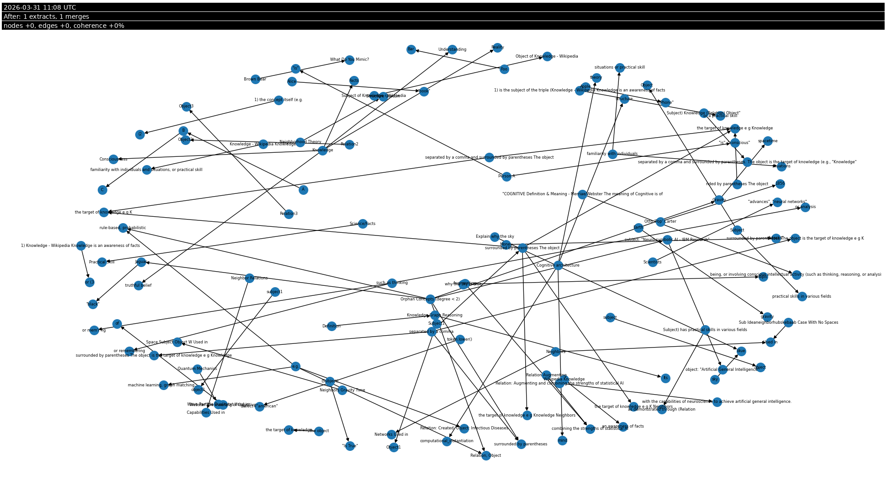](graph-2026-03-31-11-08-extract-subideas.png) [commit](https://github.com/BoggersTheFish/BoggersTheCIG/commit/c43a92e)

### 2026-03-31 11:08 UTC

**After:** 2_+2_.md"+Augmenting.md"+Cognitive.md"+Research_.md" — nodes +0, edges +0, coherence +0%

[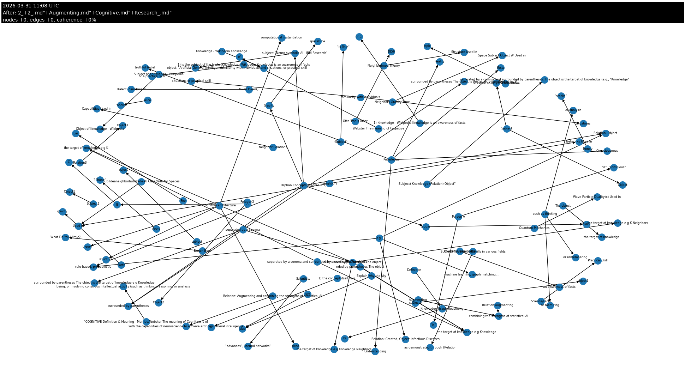](graph-2026-03-31-11-08-self-improve.png) [commit](https://github.com/BoggersTheFish/BoggersTheCIG/commit/c43a92e)

### 2026-03-31 11:13 UTC

**After:** vault organize (2 moves) — nodes +0, edges +0, coherence +0%

[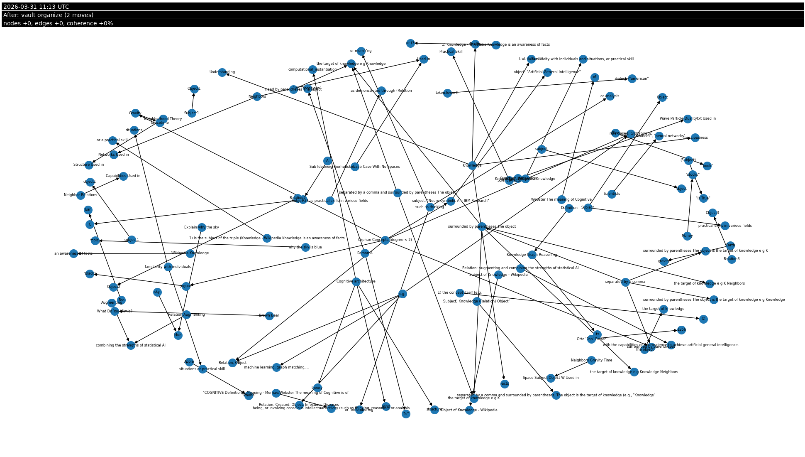](graph-2026-03-31-11-13-after-organize.png) [commit](https://github.com/BoggersTheFish/BoggersTheCIG/commit/c43a92e)

### 2026-03-31 11:13 UTC

**After:** 2 extracts, 0 merges — nodes +0, edges +0, coherence +0%

[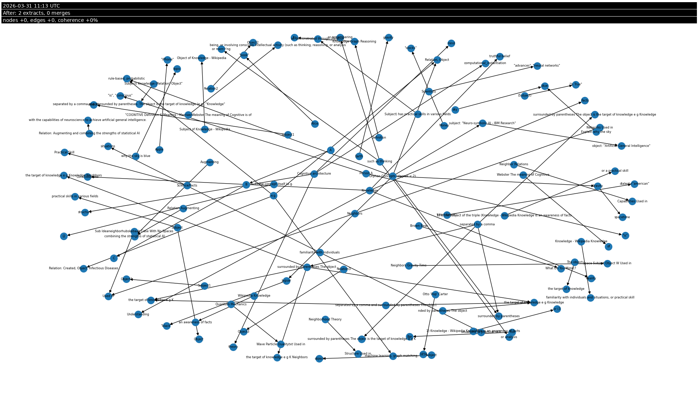](graph-2026-03-31-11-13-extract-subideas.png) [commit](https://github.com/BoggersTheFish/BoggersTheCIG/commit/c43a92e)

### 2026-03-31 11:13 UTC

**After:** 2_+2_.md"+Augmenting.md"+Cognitive.md"+Research_.md" — nodes +0, edges +0, coherence +0%

[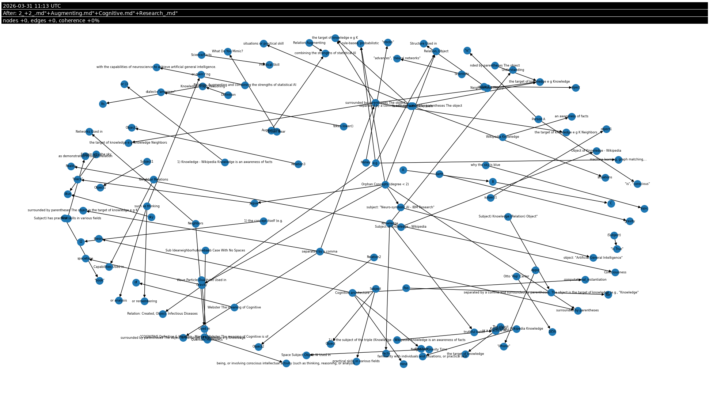](graph-2026-03-31-11-13-self-improve.png) [commit](https://github.com/BoggersTheFish/BoggersTheCIG/commit/c43a92e)

### 2026-03-31 16:13 UTC

**After:** external ingest (+1 triples) — nodes +4, edges +2, coherence +333233%

[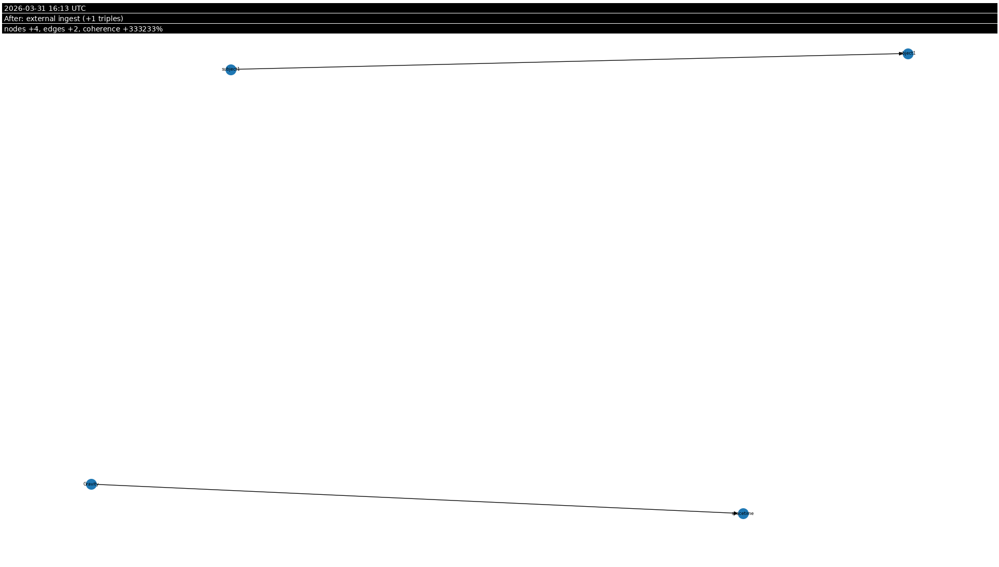](graph-2026-03-31-16-13-after-ingest.png) [commit](https://github.com/BoggersTheFish/BoggersTheCIG/commit/132630e)

### 2026-03-31 16:13 UTC

**After:** vault analysis (+170 triples) — nodes +126, edges +80, coherence -97%

[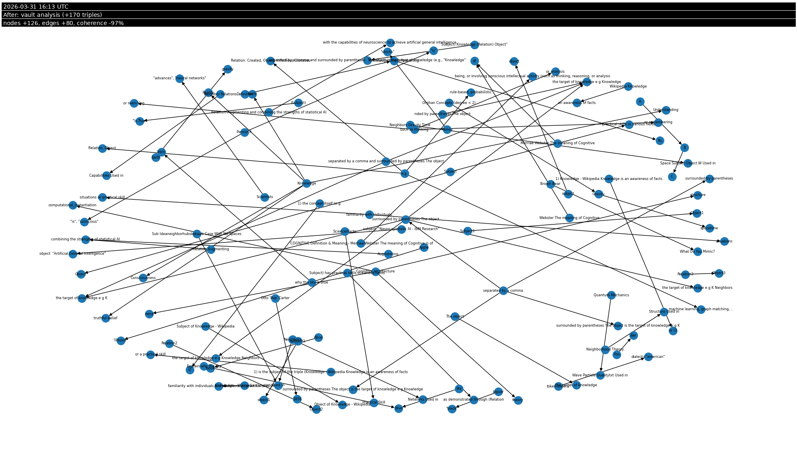](graph-2026-03-31-16-13-after-analyze-vault.png) [commit](https://github.com/BoggersTheFish/BoggersTheCIG/commit/132630e)

### 2026-03-31 16:14 UTC

**After:** 2 extracts, 0 merges — nodes +0, edges +0, coherence +0%

[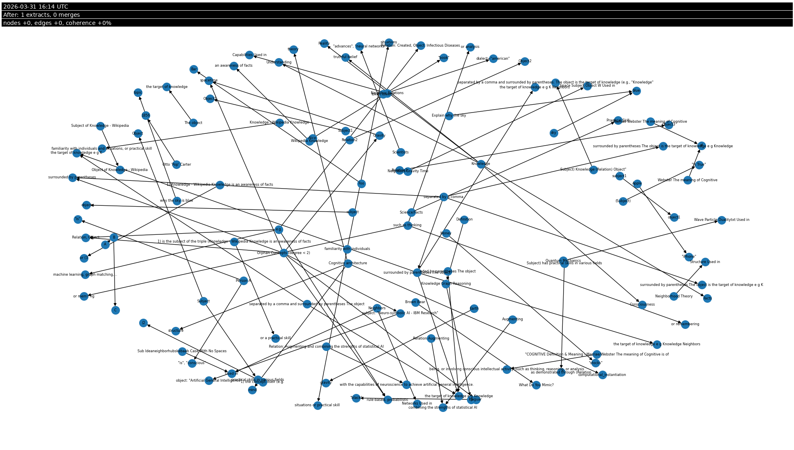](graph-2026-03-31-16-14-extract-subideas.png) [commit](https://github.com/BoggersTheFish/BoggersTheCIG/commit/132630e)

### 2026-03-31 16:14 UTC

**After:** vault analysis (+175 triples) — nodes +0, edges +6, coherence +7%

[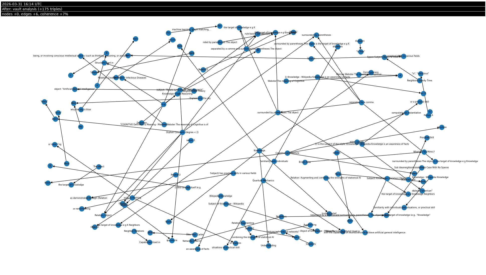](graph-2026-03-31-16-14-after-analyze-vault.png) [commit](https://github.com/BoggersTheFish/BoggersTheCIG/commit/132630e)

### 2026-03-31 16:14 UTC

**After:** 1 extracts, 0 merges — nodes +0, edges +0, coherence +0%

 [commit](https://github.com/BoggersTheFish/BoggersTheCIG/commit/132630e)

### 2026-03-31 16:20 UTC

**After:** vault organize (5 moves) — nodes +0, edges +0, coherence +0%

[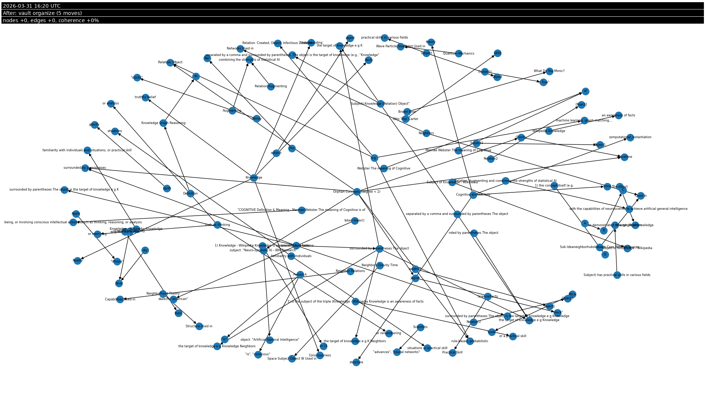](graph-2026-03-31-16-20-after-organize.png) [commit](https://github.com/BoggersTheFish/BoggersTheCIG/commit/132630e)

### 2026-03-31 16:20 UTC

**After:** 0 extracts, 1 merges — nodes +0, edges +0, coherence +0%

[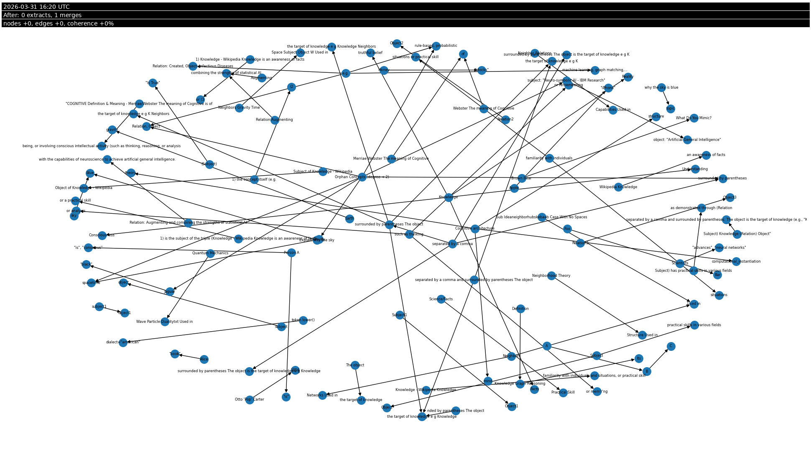](graph-2026-03-31-16-20-extract-subideas.png) [commit](https://github.com/BoggersTheFish/BoggersTheCIG/commit/132630e)

### 2026-03-31 16:20 UTC

**After:** 2_+2_.md"+Augmenting.md"+Cognitive.md"+Mimic_.md" — nodes +0, edges +0, coherence +0%

[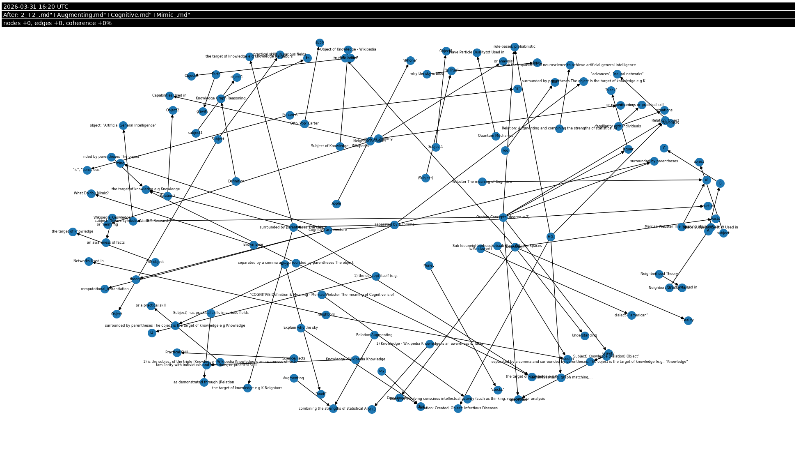](graph-2026-03-31-16-20-self-improve.png) [commit](https://github.com/BoggersTheFish/BoggersTheCIG/commit/132630e)

### 2026-03-31 16:25 UTC

**After:** vault organize (2 moves) — nodes +0, edges +0, coherence +0%

[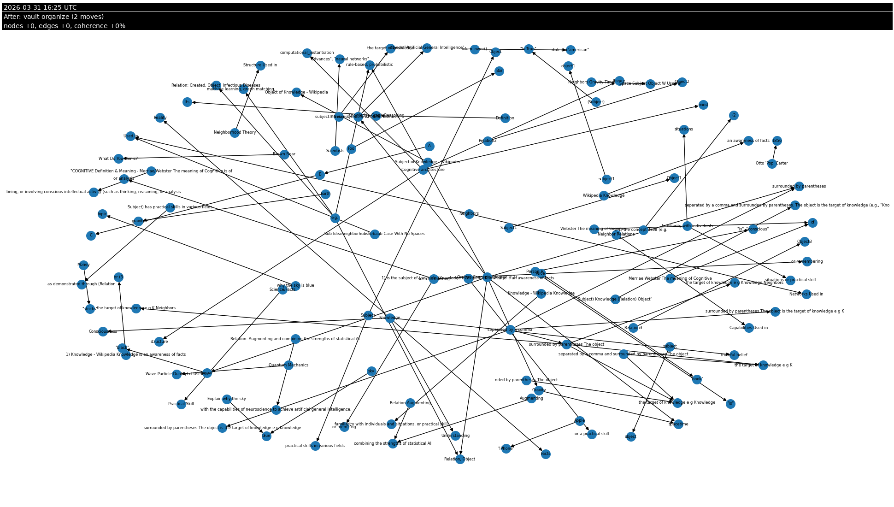](graph-2026-03-31-16-25-after-organize.png) [commit](https://github.com/BoggersTheFish/BoggersTheCIG/commit/132630e)

### 2026-03-31 16:25 UTC

**After:** 1 extracts, 0 merges — nodes +0, edges +0, coherence +0%

[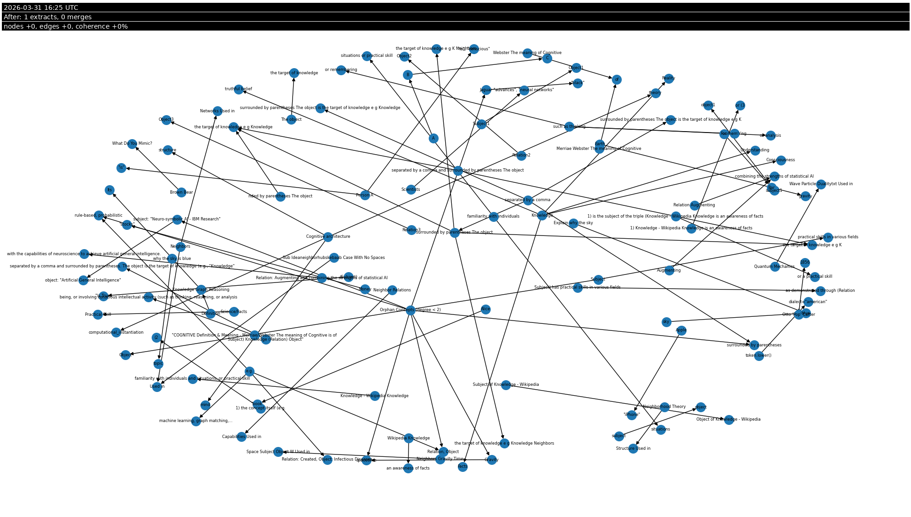](graph-2026-03-31-16-25-extract-subideas.png) [commit](https://github.com/BoggersTheFish/BoggersTheCIG/commit/132630e)

### 2026-03-31 16:25 UTC

**After:** 2_+2_.md"+Augmenting.md"+Cognitive.md"+Mimic_.md" — nodes +0, edges +0, coherence +0%

[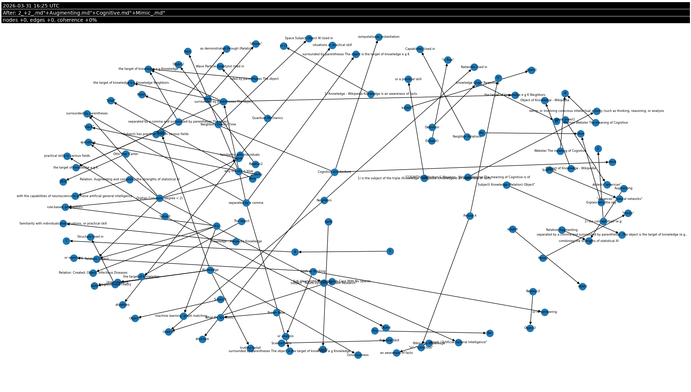](graph-2026-03-31-16-25-self-improve.png) [commit](https://github.com/BoggersTheFish/BoggersTheCIG/commit/132630e)

### 2026-03-31 20:49 UTC

**After:** external ingest (+1 triples) — nodes +4, edges +2, coherence +333233%

[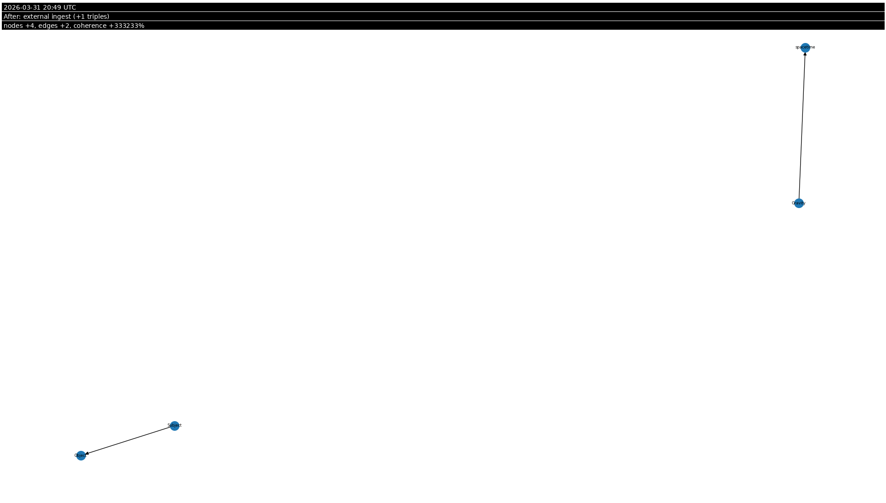](graph-2026-03-31-20-49-after-ingest.png) [commit](https://github.com/BoggersTheFish/BoggersTheCIG/commit/b1ef909)

### 2026-03-31 20:49 UTC

**After:** vault analysis (+169 triples) — nodes +126, edges +80, coherence -97%

[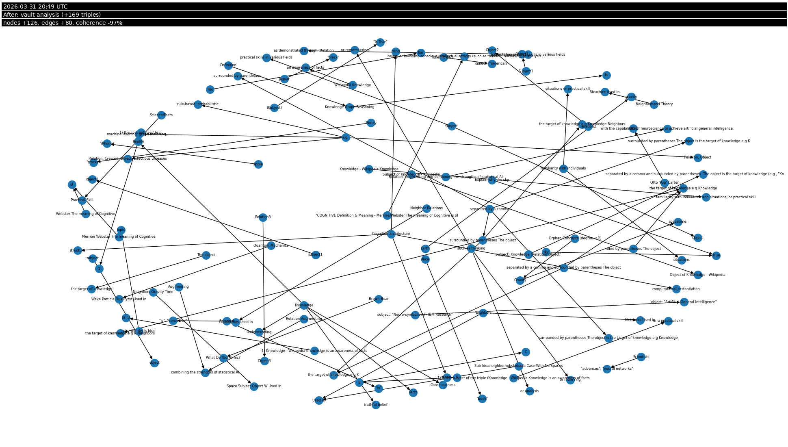](graph-2026-03-31-20-49-after-analyze-vault.png) [commit](https://github.com/BoggersTheFish/BoggersTheCIG/commit/b1ef909)

### 2026-03-31 20:50 UTC

**After:** vault analysis (+174 triples) — nodes +0, edges +6, coherence +7%

[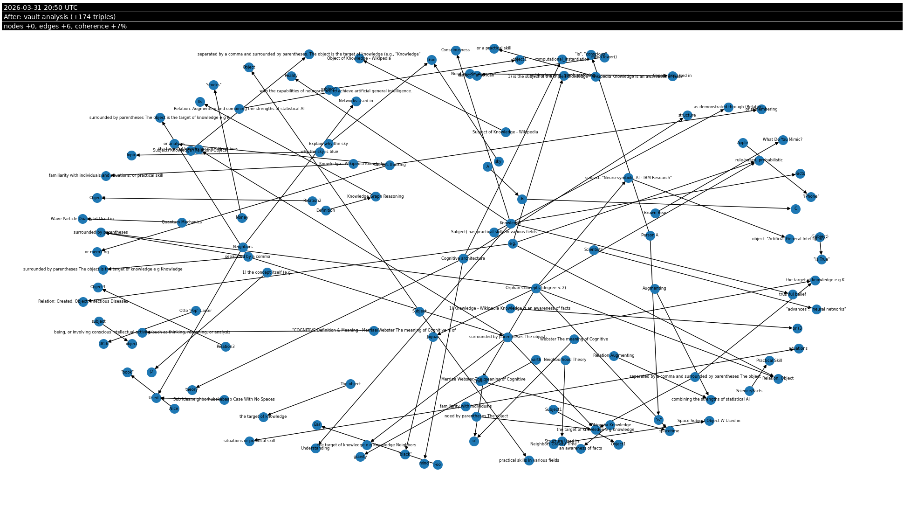](graph-2026-03-31-20-50-after-analyze-vault.png) [commit](https://github.com/BoggersTheFish/BoggersTheCIG/commit/b1ef909)

### 2026-03-31 20:56 UTC

**After:** vault organize (0 moves) — nodes +0, edges +0, coherence +0%

[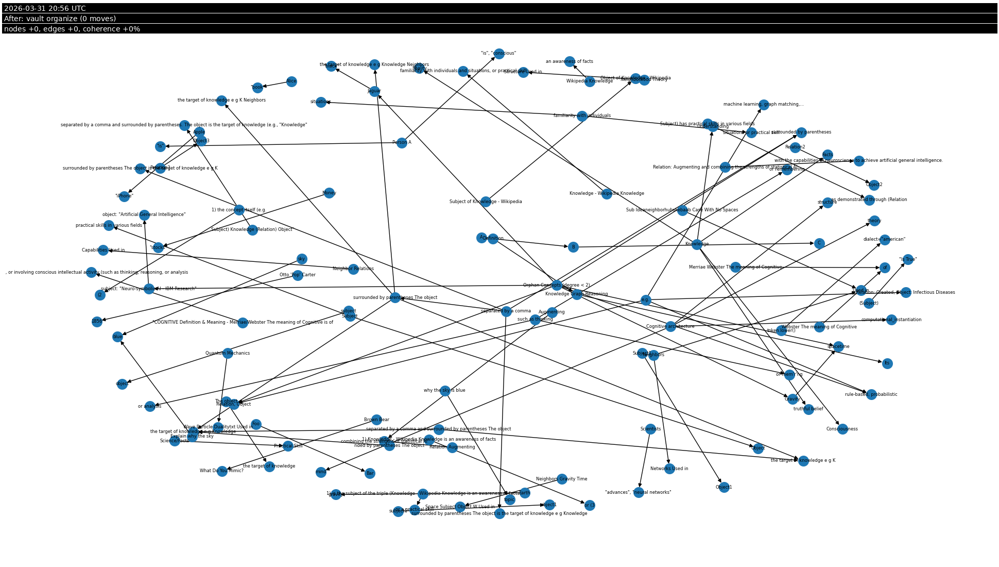](graph-2026-03-31-20-56-after-organize.png) [commit](https://github.com/BoggersTheFish/BoggersTheCIG/commit/b1ef909)

### 2026-03-31 20:56 UTC

**After:** 1 extracts, 0 merges — nodes +0, edges +0, coherence +0%

[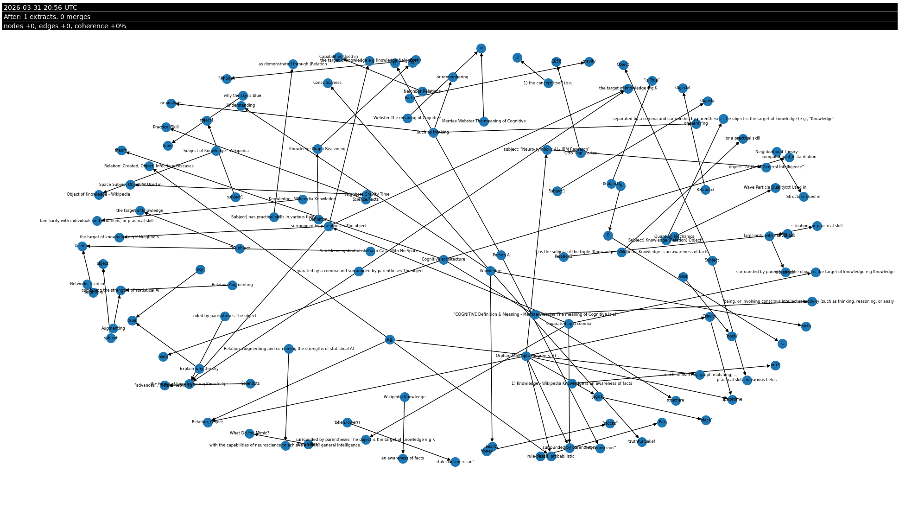](graph-2026-03-31-20-56-extract-subideas.png) [commit](https://github.com/BoggersTheFish/BoggersTheCIG/commit/b1ef909)

### 2026-03-31 20:56 UTC

**After:** 2_+2_.md"+Augmenting.md"+Carter.md"+Cognitive.md" — nodes +0, edges +0, coherence +0%

[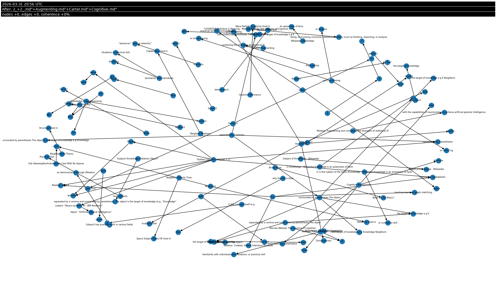](graph-2026-03-31-20-56-self-improve.png) [commit](https://github.com/BoggersTheFish/BoggersTheCIG/commit/b1ef909)

### 2026-03-31 21:02 UTC

**After:** vault organize (0 moves) — nodes +0, edges +0, coherence +0%

[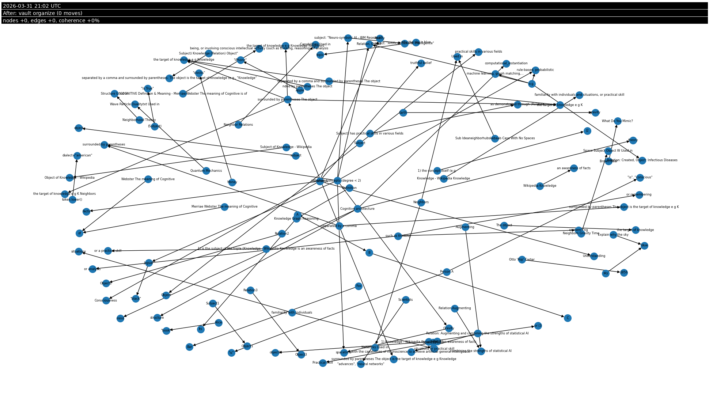](graph-2026-03-31-21-02-after-organize.png) [commit](https://github.com/BoggersTheFish/BoggersTheCIG/commit/b1ef909)

### 2026-03-31 21:02 UTC

**After:** 0 extracts, 1 merges — nodes +0, edges +0, coherence +0%

[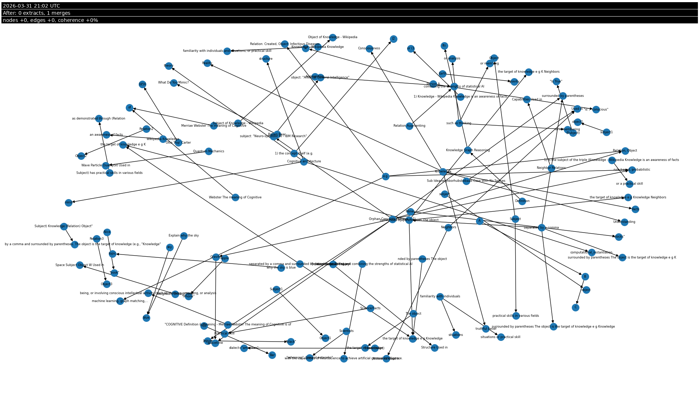](graph-2026-03-31-21-02-extract-subideas.png) [commit](https://github.com/BoggersTheFish/BoggersTheCIG/commit/b1ef909)

### 2026-03-31 21:02 UTC

**After:** 2_+2_.md"+Augmenting.md"+Carter.md"+Cognitive.md" — nodes +0, edges +0, coherence +0%

[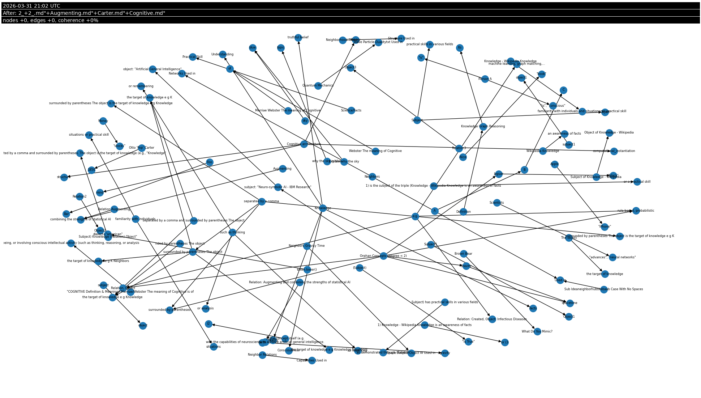](graph-2026-03-31-21-02-self-improve.png) [commit](https://github.com/BoggersTheFish/BoggersTheCIG/commit/b1ef909)

### 2026-04-01 02:39 UTC

**After:** external ingest (+5 triples) — nodes +8, edges +4, coherence +142757%

[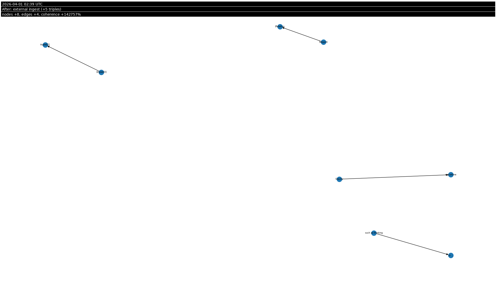](graph-2026-04-01-02-39-after-ingest.png) [commit](https://github.com/BoggersTheFish/BoggersTheCIG/commit/60b47e5)

### 2026-04-01 02:39 UTC

**After:** vault analysis (+169 triples) — nodes +127, edges +81, coherence -93%

[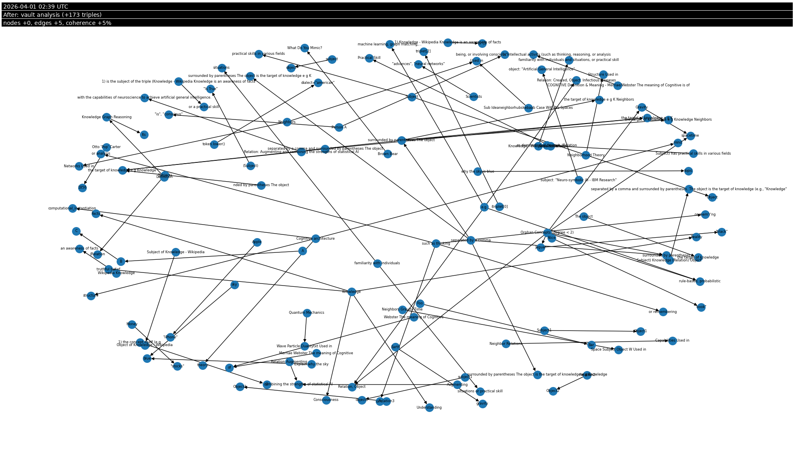](graph-2026-04-01-02-39-after-analyze-vault.png) [commit](https://github.com/BoggersTheFish/BoggersTheCIG/commit/60b47e5)

### 2026-04-01 02:39 UTC

**After:** 1 extracts, 0 merges — nodes +0, edges +0, coherence +0%

[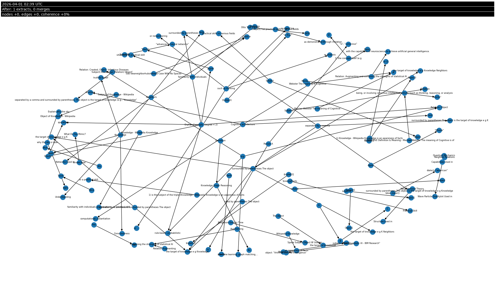](graph-2026-04-01-02-39-extract-subideas.png) [commit](https://github.com/BoggersTheFish/BoggersTheCIG/commit/60b47e5)

### 2026-04-01 02:39 UTC

**After:** vault analysis (+173 triples) — nodes +0, edges +5, coherence +5%

 [commit](https://github.com/BoggersTheFish/BoggersTheCIG/commit/60b47e5)

### 2026-04-01 02:39 UTC

**After:** 1 extracts, 0 merges — nodes +0, edges +0, coherence +0%

 [commit](https://github.com/BoggersTheFish/BoggersTheCIG/commit/60b47e5)

### 2026-04-01 02:45 UTC

**After:** vault organize (4 moves) — nodes +0, edges +0, coherence +0%

[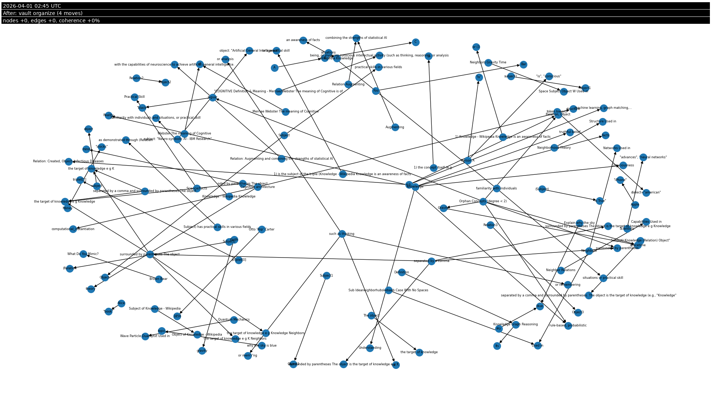](graph-2026-04-01-02-45-after-organize.png) [commit](https://github.com/BoggersTheFish/BoggersTheCIG/commit/60b47e5)

### 2026-04-01 02:45 UTC

**After:** 2 extracts, 0 merges — nodes +0, edges +0, coherence +0%

[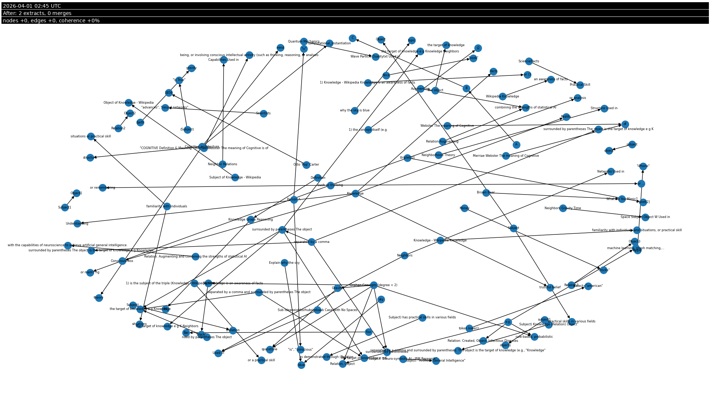](graph-2026-04-01-02-45-extract-subideas.png) [commit](https://github.com/BoggersTheFish/BoggersTheCIG/commit/60b47e5)

### 2026-04-01 02:45 UTC

**After:** 2_+2_.md"+AI.md"+K.md"+___.md" — nodes +0, edges +0, coherence +0%

[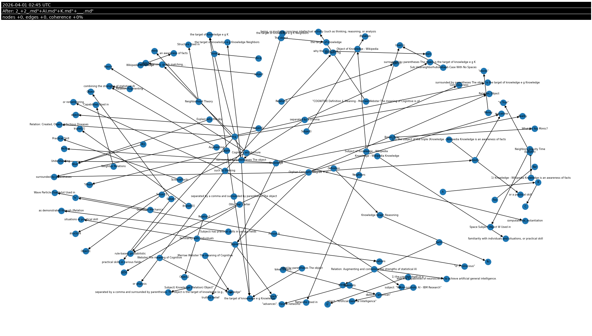](graph-2026-04-01-02-45-self-improve.png) [commit](https://github.com/BoggersTheFish/BoggersTheCIG/commit/60b47e5)

### 2026-04-01 02:51 UTC

**After:** vault organize (1 moves) — nodes +0, edges +0, coherence +0%

[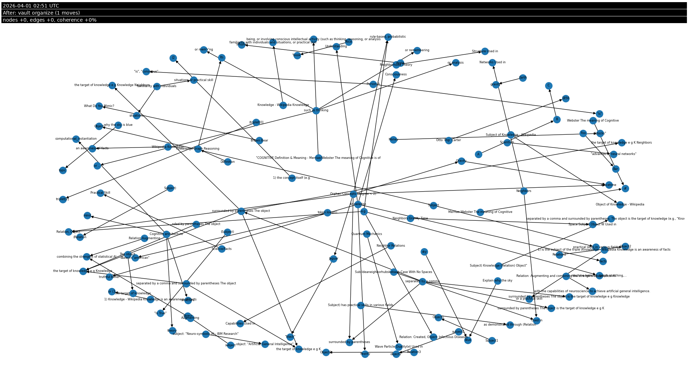](graph-2026-04-01-02-51-after-organize.png) [commit](https://github.com/BoggersTheFish/BoggersTheCIG/commit/60b47e5)

### 2026-04-01 02:51 UTC

**After:** 1 extracts, 1 merges — nodes +0, edges +0, coherence +0%

[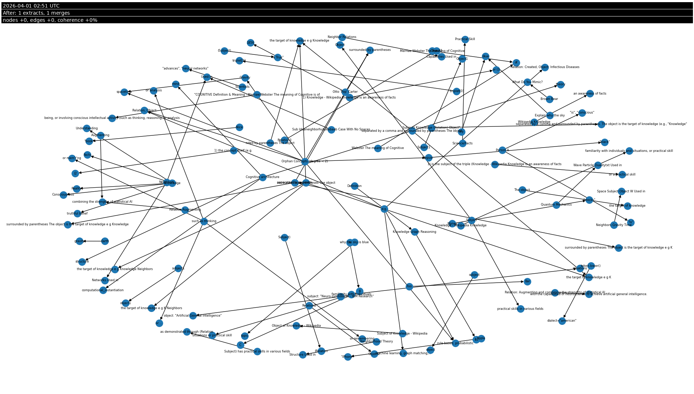](graph-2026-04-01-02-51-extract-subideas.png) [commit](https://github.com/BoggersTheFish/BoggersTheCIG/commit/60b47e5)

### 2026-04-01 02:51 UTC

**After:** 2_+2_.md"+AI.md"+K.md"+___.md" — nodes +0, edges +0, coherence +0%

[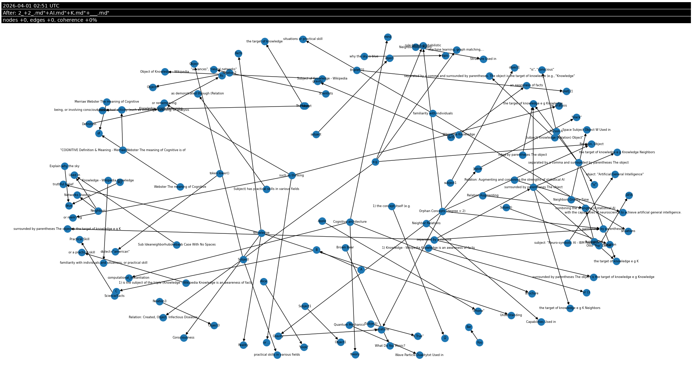](graph-2026-04-01-02-51-self-improve.png) [commit](https://github.com/BoggersTheFish/BoggersTheCIG/commit/60b47e5)

### 2026-04-01 06:35 UTC

**After:** vault analysis (+170 triples) — nodes +132, edges +83, coherence +9499%

[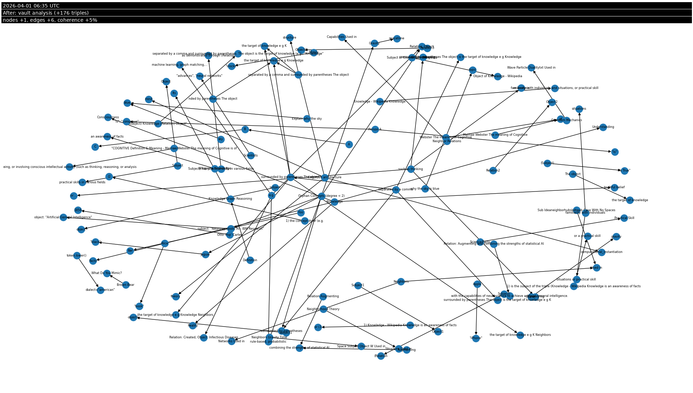](graph-2026-04-01-06-35-after-analyze-vault.png) [commit](https://github.com/BoggersTheFish/BoggersTheCIG/commit/8d0d294)

### 2026-04-01 06:35 UTC

**After:** 2 extracts, 0 merges — nodes +0, edges +0, coherence +0%

[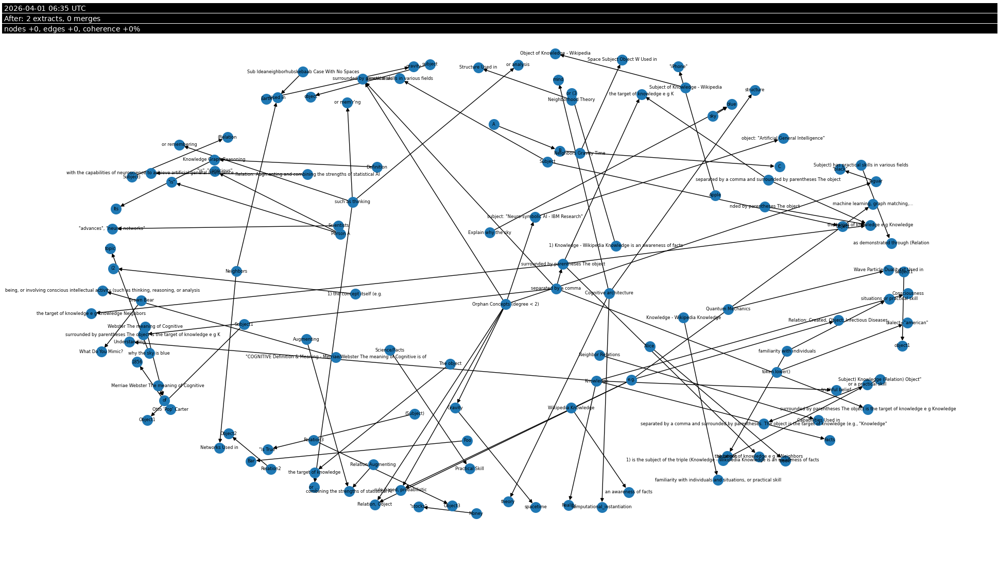](graph-2026-04-01-06-35-extract-subideas.png) [commit](https://github.com/BoggersTheFish/BoggersTheCIG/commit/8d0d294)

### 2026-04-01 06:35 UTC

**After:** vault analysis (+176 triples) — nodes +1, edges +6, coherence +5%

 [commit](https://github.com/BoggersTheFish/BoggersTheCIG/commit/8d0d294)

### 2026-04-01 06:35 UTC

**After:** 2 extracts, 0 merges — nodes +0, edges +0, coherence +0%

 [commit](https://github.com/BoggersTheFish/BoggersTheCIG/commit/8d0d294)

### 2026-04-01 06:41 UTC

**After:** vault organize (2 moves) — nodes +0, edges +0, coherence +0%

[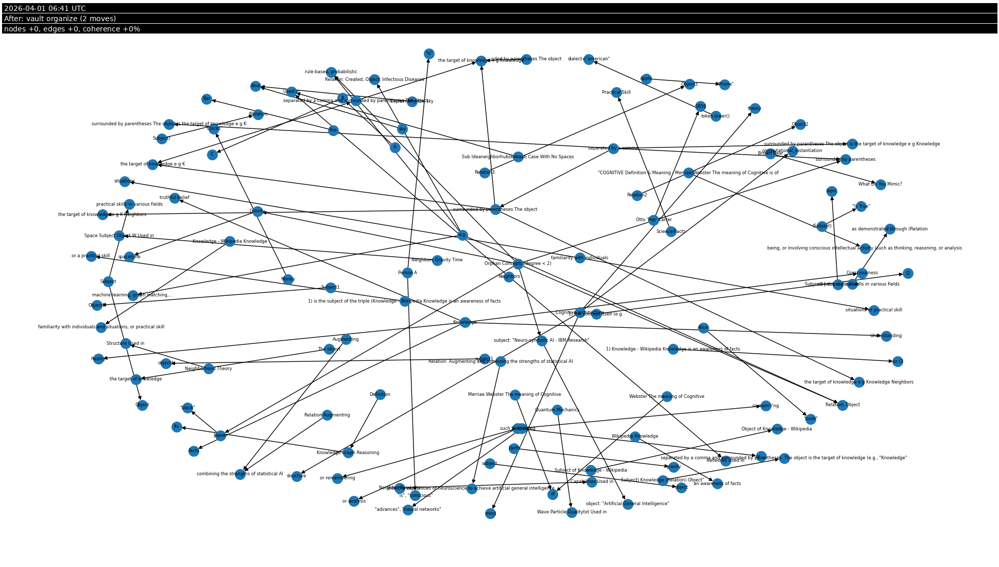](graph-2026-04-01-06-41-after-organize.png) [commit](https://github.com/BoggersTheFish/BoggersTheCIG/commit/8d0d294)

### 2026-04-01 06:41 UTC

**After:** 2 extracts, 0 merges — nodes +0, edges +0, coherence +0%

[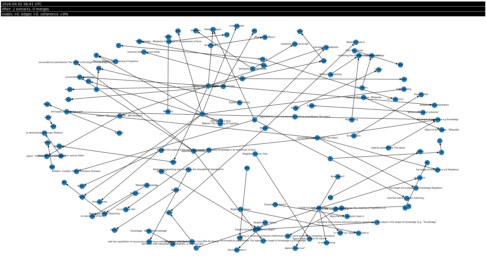](graph-2026-04-01-06-41-extract-subideas.png) [commit](https://github.com/BoggersTheFish/BoggersTheCIG/commit/8d0d294)

### 2026-04-01 06:41 UTC

**After:** 2_+2_.md"+Augmenting.md"+___.md"+architecture.md" — nodes +0, edges +0, coherence +0%

[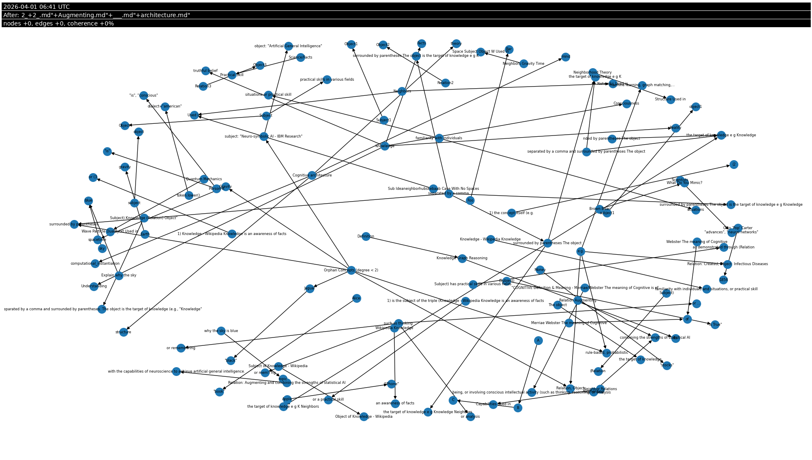](graph-2026-04-01-06-41-self-improve.png) [commit](https://github.com/BoggersTheFish/BoggersTheCIG/commit/8d0d294)

### 2026-04-01 06:48 UTC

**After:** vault organize (0 moves) — nodes +0, edges +0, coherence +0%

[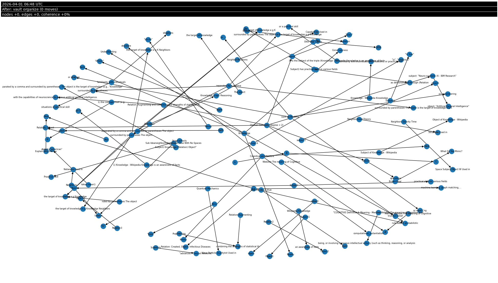](graph-2026-04-01-06-48-after-organize.png) [commit](https://github.com/BoggersTheFish/BoggersTheCIG/commit/8d0d294)

### 2026-04-01 06:48 UTC

**After:** 1 extracts, 1 merges — nodes +0, edges +0, coherence +0%

[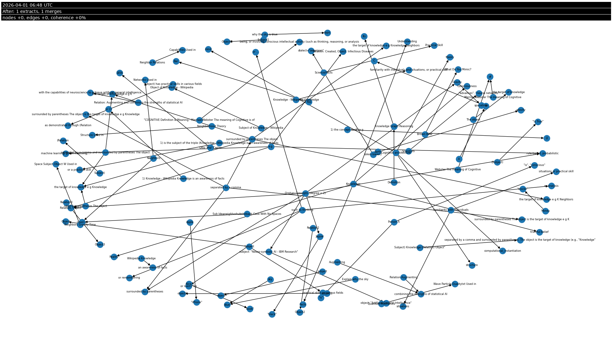](graph-2026-04-01-06-48-extract-subideas.png) [commit](https://github.com/BoggersTheFish/BoggersTheCIG/commit/8d0d294)

### 2026-04-01 06:48 UTC

**After:** 2_+2_.md"+Augmenting.md"+___.md"+architecture.md" — nodes +0, edges +0, coherence +0%

[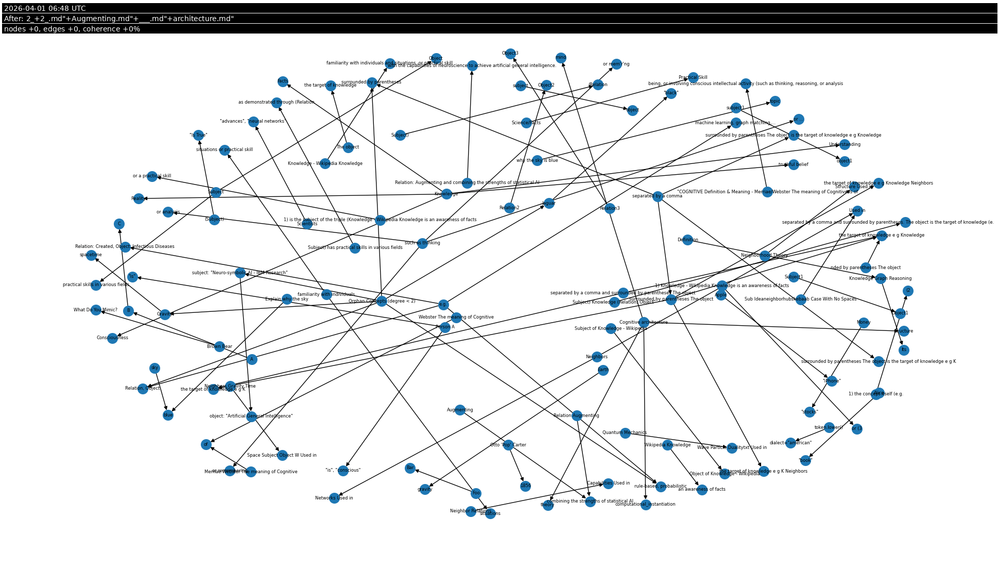](graph-2026-04-01-06-48-self-improve.png) [commit](https://github.com/BoggersTheFish/BoggersTheCIG/commit/8d0d294)

### 2026-04-01 11:04 UTC

**After:** external ingest (+2 triples) — nodes +4, edges +2, coherence +333233%

[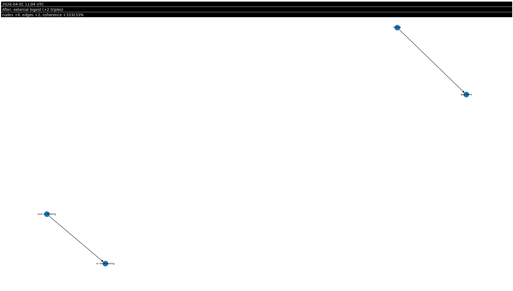](graph-2026-04-01-11-04-after-ingest.png) [commit](https://github.com/BoggersTheFish/BoggersTheCIG/commit/ef82c35)

### 2026-04-01 11:04 UTC

**After:** vault analysis (+169 triples) — nodes +129, edges +82, coherence -97%

[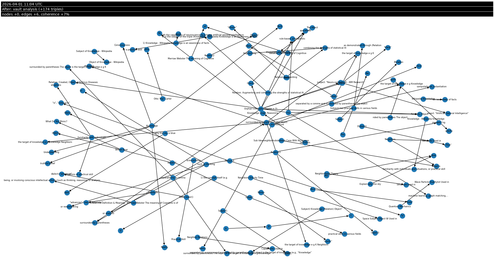](graph-2026-04-01-11-04-after-analyze-vault.png) [commit](https://github.com/BoggersTheFish/BoggersTheCIG/commit/ef82c35)

### 2026-04-01 11:04 UTC

**After:** 2 extracts, 0 merges — nodes +0, edges +0, coherence +0%

[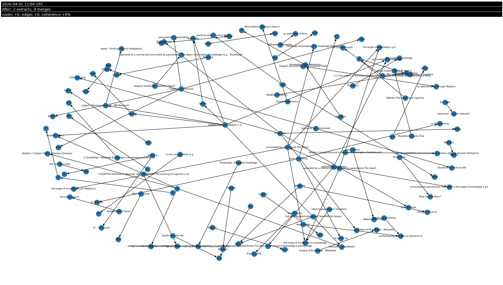](graph-2026-04-01-11-04-extract-subideas.png) [commit](https://github.com/BoggersTheFish/BoggersTheCIG/commit/ef82c35)

### 2026-04-01 11:04 UTC

**After:** vault analysis (+174 triples) — nodes +0, edges +6, coherence +7%

 [commit](https://github.com/BoggersTheFish/BoggersTheCIG/commit/ef82c35)

### 2026-04-01 11:05 UTC

**After:** 2 extracts, 0 merges — nodes +0, edges +0, coherence +0%

 [commit](https://github.com/BoggersTheFish/BoggersTheCIG/commit/ef82c35)

### 2026-04-01 11:11 UTC

**After:** vault organize (0 moves) — nodes +0, edges +0, coherence +0%

[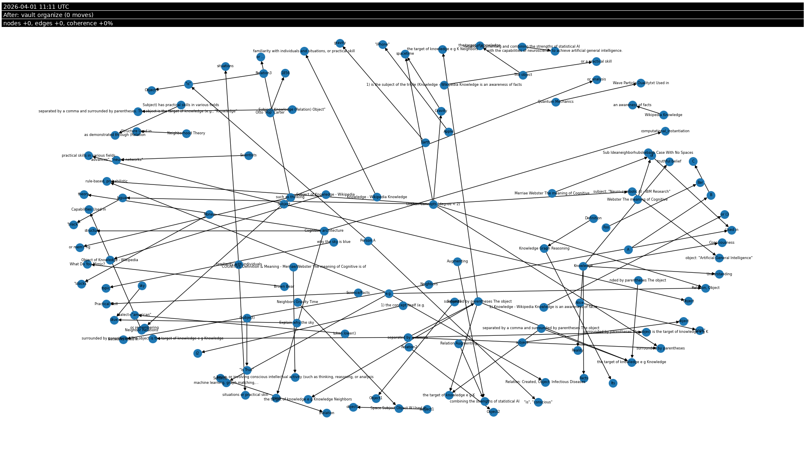](graph-2026-04-01-11-11-after-organize.png) [commit](https://github.com/BoggersTheFish/BoggersTheCIG/commit/ef82c35)

### 2026-04-01 11:11 UTC

**After:** 1 extracts, 1 merges — nodes +0, edges +0, coherence +0%

[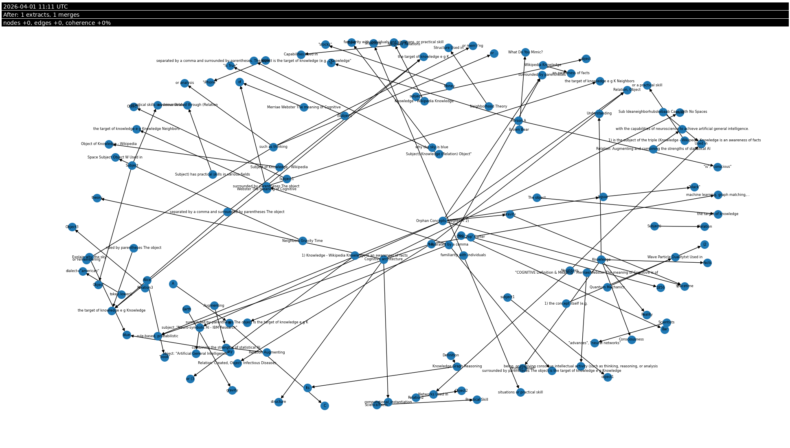](graph-2026-04-01-11-11-extract-subideas.png) [commit](https://github.com/BoggersTheFish/BoggersTheCIG/commit/ef82c35)

### 2026-04-01 11:11 UTC

**After:** 2_+2_.md"+eval+obsidian+thinking.md" — nodes +0, edges +0, coherence +0%

[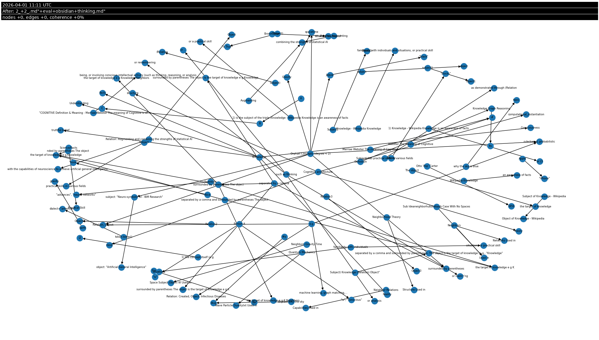](graph-2026-04-01-11-11-self-improve.png) [commit](https://github.com/BoggersTheFish/BoggersTheCIG/commit/ef82c35)

### 2026-04-01 11:17 UTC

**After:** vault organize (2 moves) — nodes +0, edges +0, coherence +0%

[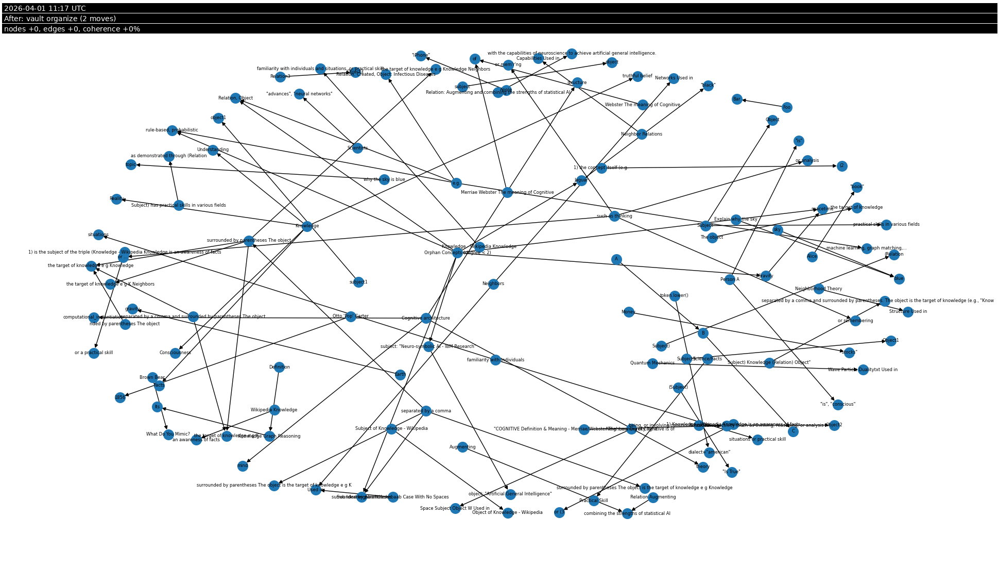](graph-2026-04-01-11-17-after-organize.png) [commit](https://github.com/BoggersTheFish/BoggersTheCIG/commit/ef82c35)

### 2026-04-01 11:17 UTC

**After:** 2 extracts, 0 merges — nodes +0, edges +0, coherence +0%

[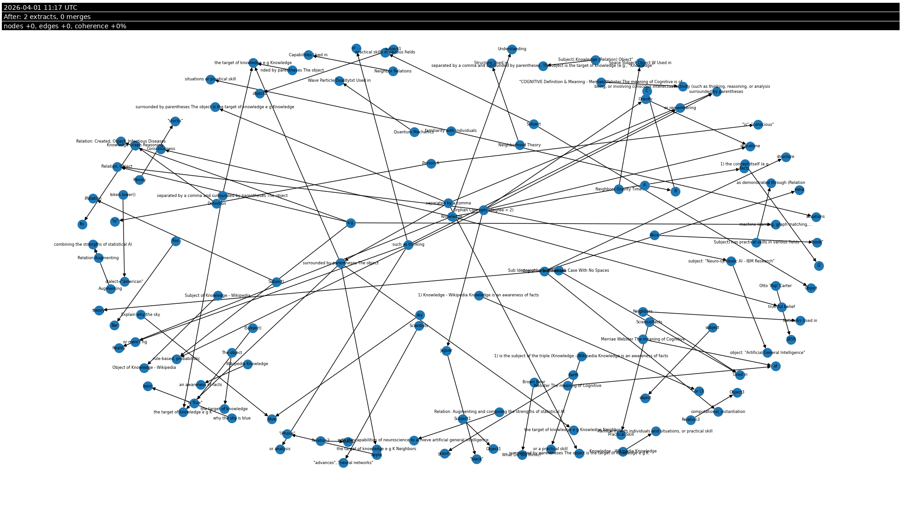](graph-2026-04-01-11-17-extract-subideas.png) [commit](https://github.com/BoggersTheFish/BoggersTheCIG/commit/ef82c35)

### 2026-04-01 11:17 UTC

**After:** 2_+2_.md"+eval+in.md"+obsidian — nodes +0, edges +0, coherence +0%

[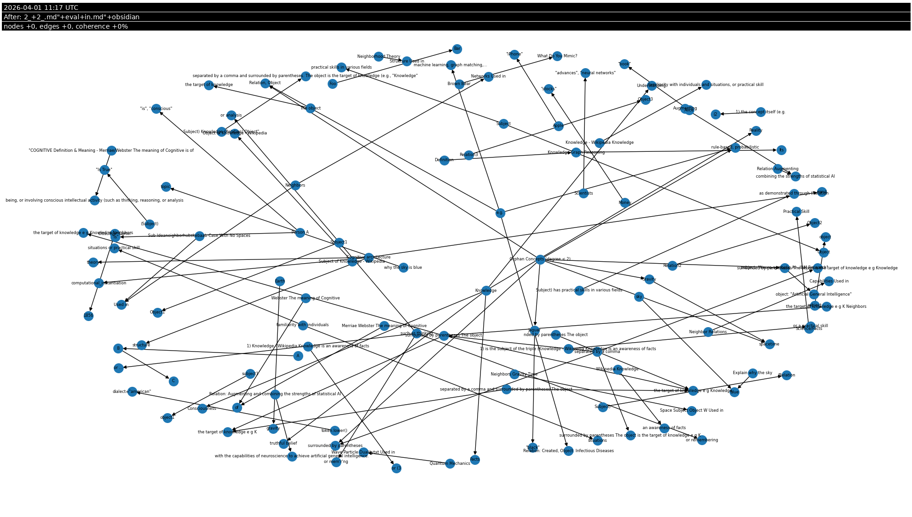](graph-2026-04-01-11-17-self-improve.png) [commit](https://github.com/BoggersTheFish/BoggersTheCIG/commit/ef82c35)

### 2026-04-01 16:16 UTC

**After:** external ingest (+3 triples) — nodes +6, edges +3, coherence +199900%

[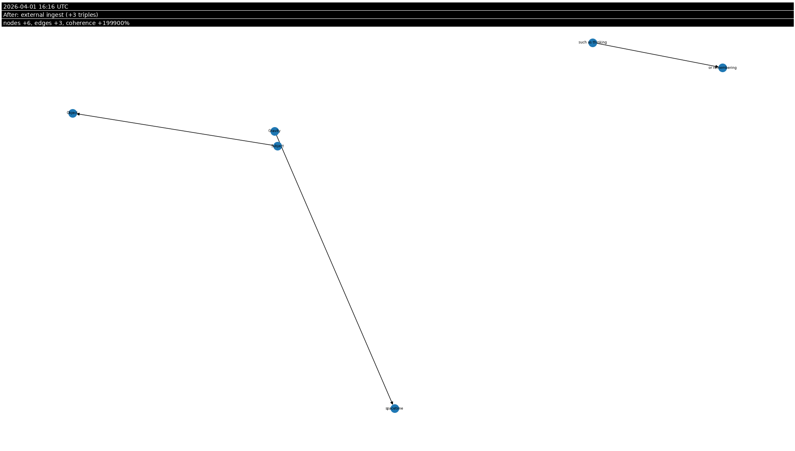](graph-2026-04-01-16-16-after-ingest.png) [commit](https://github.com/BoggersTheFish/BoggersTheCIG/commit/1df5bf0)

### 2026-04-01 16:16 UTC

**After:** vault analysis (+171 triples) — nodes +127, edges +81, coherence -95%

[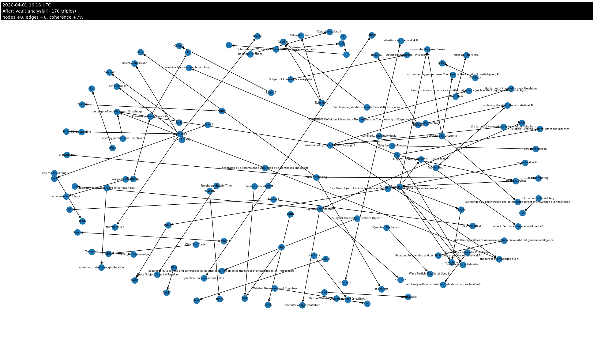](graph-2026-04-01-16-16-after-analyze-vault.png) [commit](https://github.com/BoggersTheFish/BoggersTheCIG/commit/1df5bf0)

### 2026-04-01 16:16 UTC

**After:** 1 extracts, 0 merges — nodes +0, edges +0, coherence +0%

[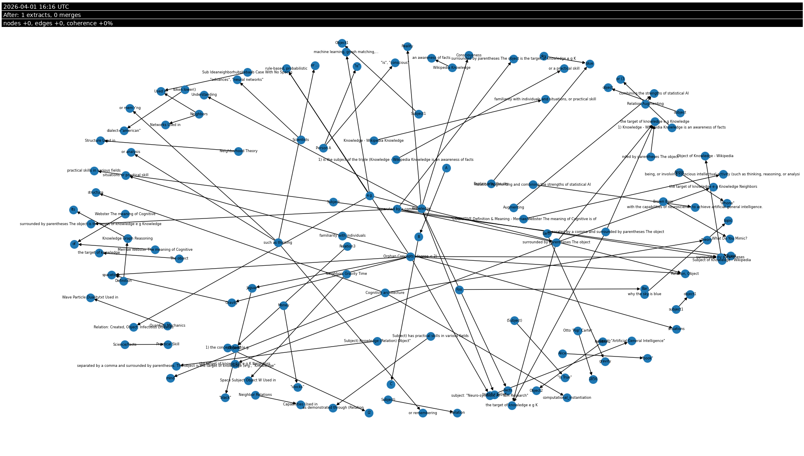](graph-2026-04-01-16-16-extract-subideas.png) [commit](https://github.com/BoggersTheFish/BoggersTheCIG/commit/1df5bf0)

### 2026-04-01 16:16 UTC

**After:** vault analysis (+176 triples) — nodes +0, edges +6, coherence +7%

 [commit](https://github.com/BoggersTheFish/BoggersTheCIG/commit/1df5bf0)

### 2026-04-01 16:16 UTC

**After:** 1 extracts, 0 merges — nodes +0, edges +0, coherence +0%

 [commit](https://github.com/BoggersTheFish/BoggersTheCIG/commit/1df5bf0)

### 2026-04-01 16:23 UTC

**After:** vault organize (0 moves) — nodes +0, edges +0, coherence +0%

[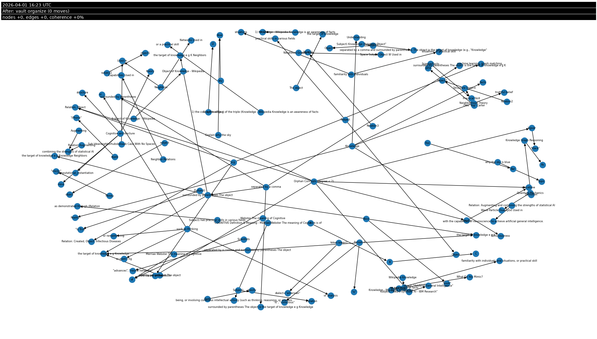](graph-2026-04-01-16-23-after-organize.png) [commit](https://github.com/BoggersTheFish/BoggersTheCIG/commit/1df5bf0)

### 2026-04-01 16:24 UTC

**After:** 0 extracts, 1 merges — nodes +0, edges +0, coherence +0%

[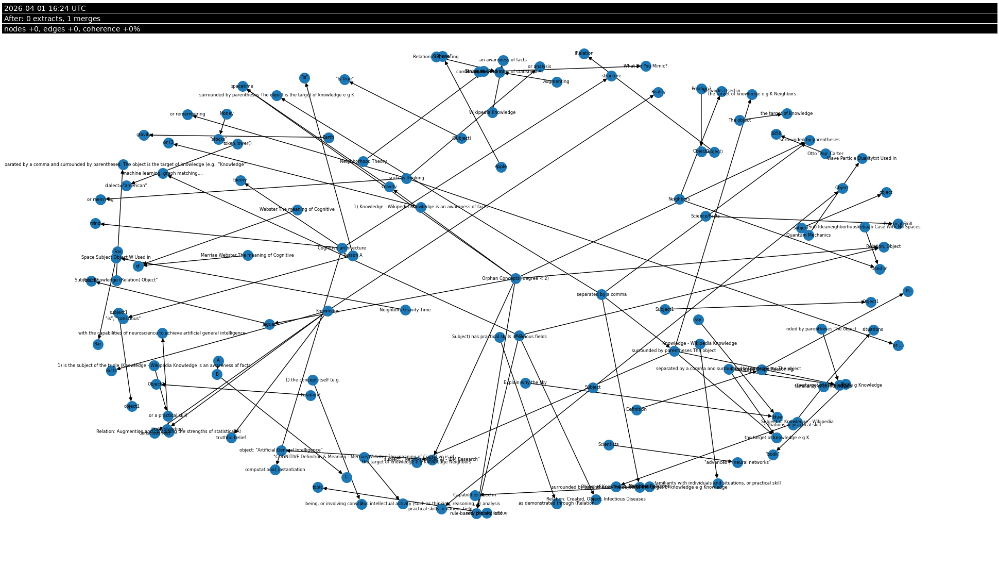](graph-2026-04-01-16-24-extract-subideas.png) [commit](https://github.com/BoggersTheFish/BoggersTheCIG/commit/1df5bf0)

### 2026-04-01 16:24 UTC

**After:** 2_+2_.md"+Cognitive.md"+eval+obsidian — nodes +0, edges +0, coherence +0%

[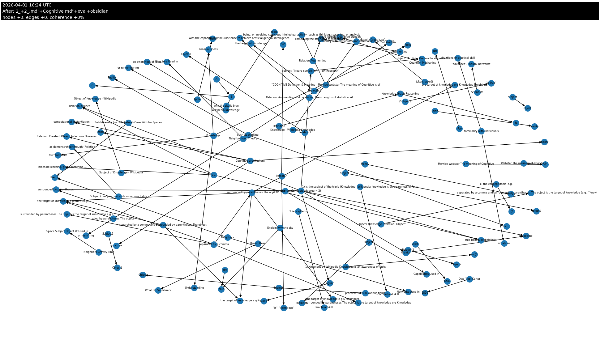](graph-2026-04-01-16-24-self-improve.png) [commit](https://github.com/BoggersTheFish/BoggersTheCIG/commit/1df5bf0)

### 2026-04-01 16:29 UTC

**After:** vault organize (0 moves) — nodes +0, edges +0, coherence +0%

[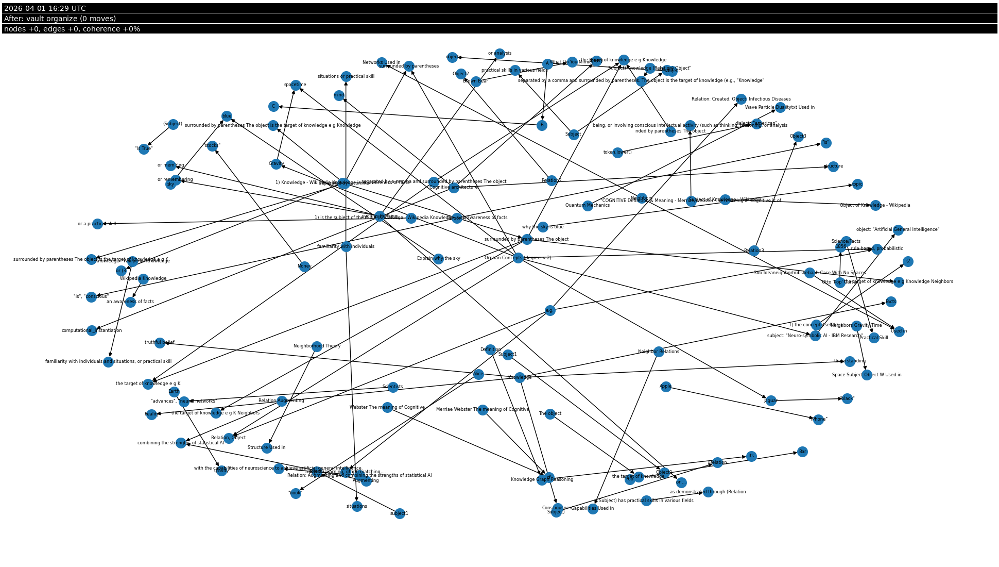](graph-2026-04-01-16-29-after-organize.png) [commit](https://github.com/BoggersTheFish/BoggersTheCIG/commit/1df5bf0)

### 2026-04-01 16:30 UTC

**After:** 1 extracts, 0 merges — nodes +0, edges +0, coherence +0%

[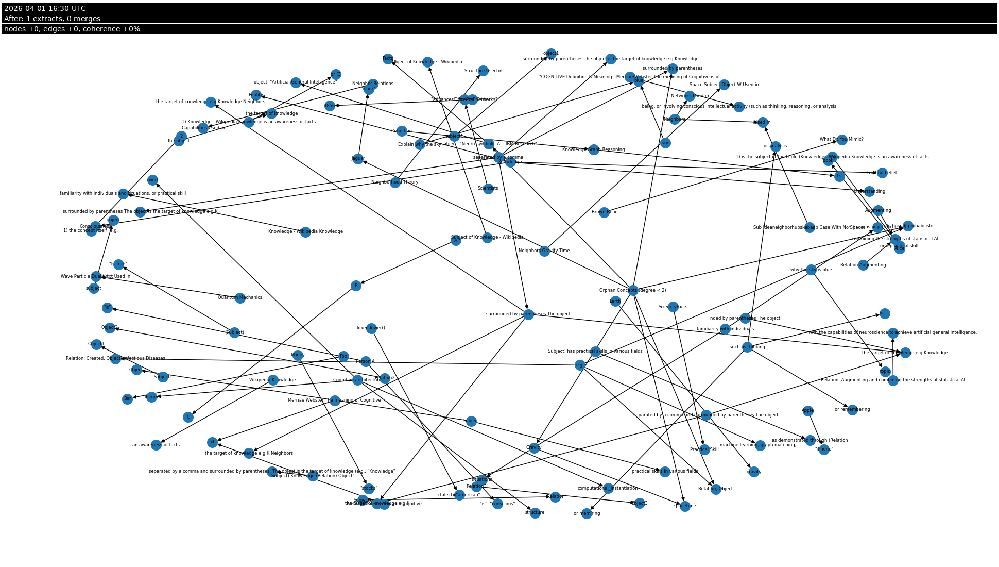](graph-2026-04-01-16-30-extract-subideas.png) [commit](https://github.com/BoggersTheFish/BoggersTheCIG/commit/1df5bf0)

### 2026-04-01 16:30 UTC

**After:** 2_+2_.md"+Cognitive.md"+eval+obsidian — nodes +0, edges +0, coherence +0%

[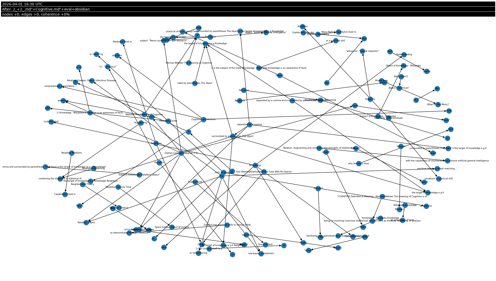](graph-2026-04-01-16-30-self-improve.png) [commit](https://github.com/BoggersTheFish/BoggersTheCIG/commit/1df5bf0)

### 2026-04-01 20:51 UTC

**After:** vault analysis (+170 triples) — nodes +132, edges +83, coherence +9499%

[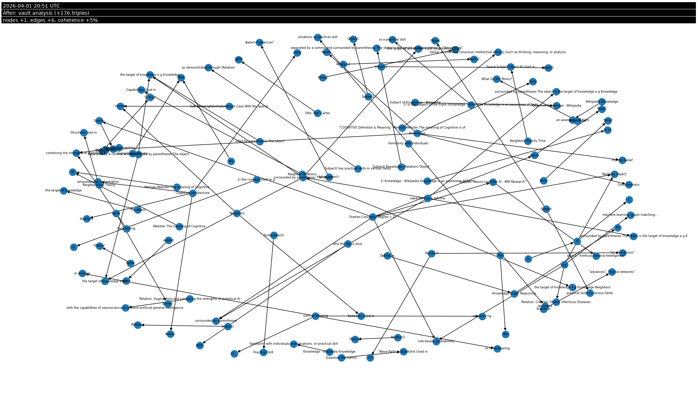](graph-2026-04-01-20-51-after-analyze-vault.png) [commit](https://github.com/BoggersTheFish/BoggersTheCIG/commit/2b94325)

### 2026-04-01 20:51 UTC

**After:** vault analysis (+176 triples) — nodes +1, edges +6, coherence +5%

 [commit](https://github.com/BoggersTheFish/BoggersTheCIG/commit/2b94325)

### 2026-04-01 20:59 UTC

**After:** vault organize (0 moves) — nodes +0, edges +0, coherence +0%

[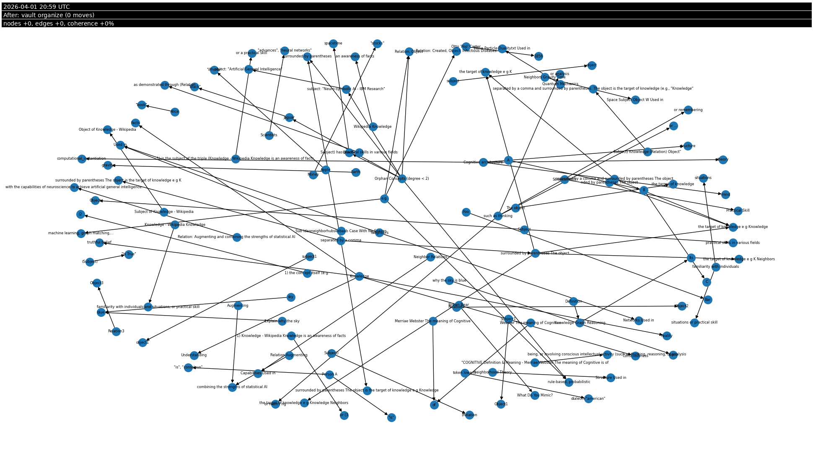](graph-2026-04-01-20-59-after-organize.png) [commit](https://github.com/BoggersTheFish/BoggersTheCIG/commit/2b94325)

### 2026-04-01 20:59 UTC

**After:** 1 extracts, 0 merges — nodes +0, edges +0, coherence +0%

[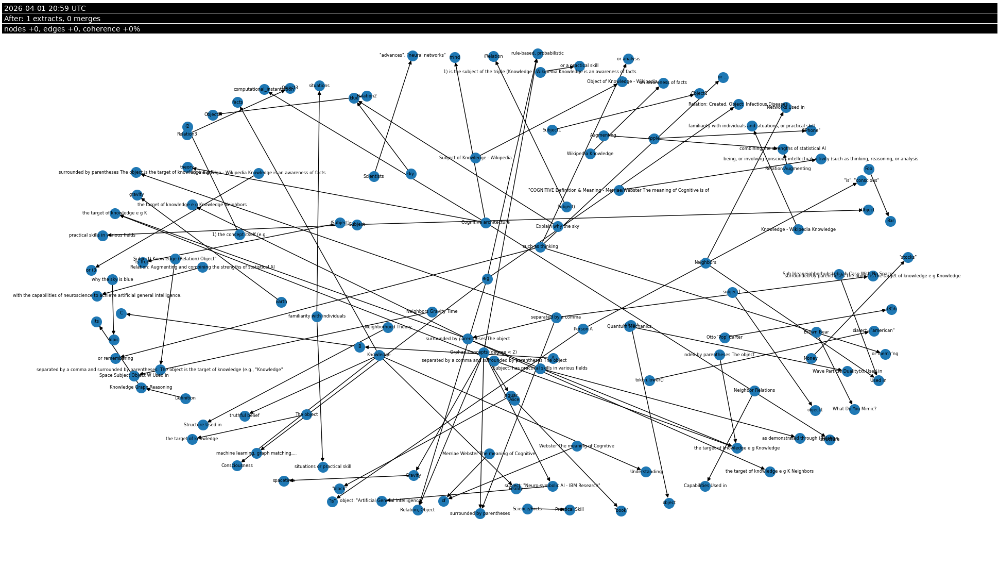](graph-2026-04-01-20-59-extract-subideas.png) [commit](https://github.com/BoggersTheFish/BoggersTheCIG/commit/2b94325)

### 2026-04-01 20:59 UTC

**After:** 2_+2_.md"+eval+obsidian+thinking.md" — nodes +0, edges +0, coherence +0%

[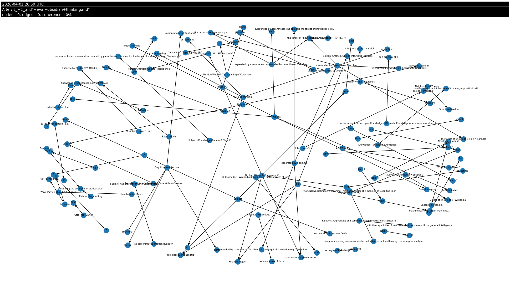](graph-2026-04-01-20-59-self-improve.png) [commit](https://github.com/BoggersTheFish/BoggersTheCIG/commit/2b94325)

### 2026-04-01 21:06 UTC

**After:** vault organize (0 moves) — nodes +0, edges +0, coherence +0%

[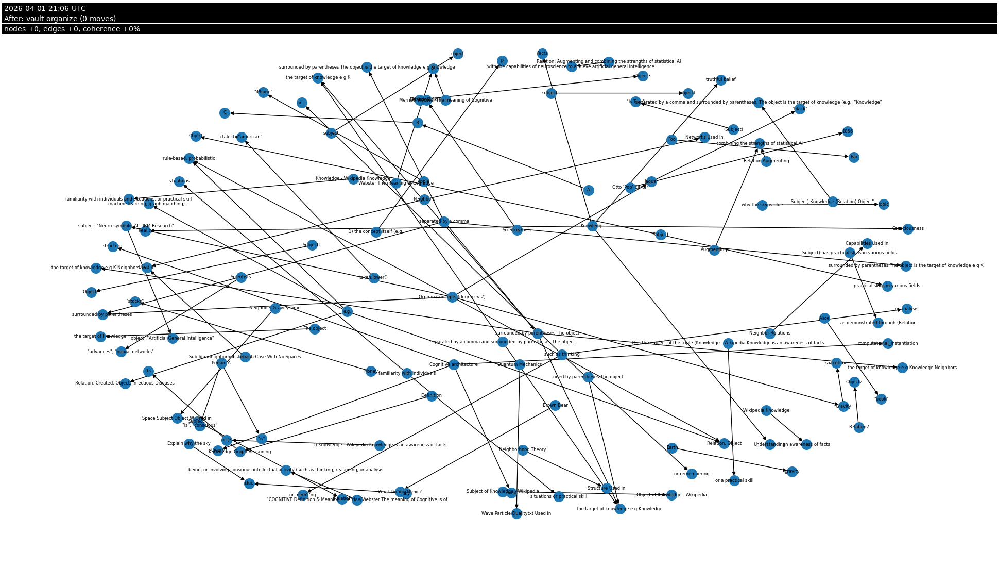](graph-2026-04-01-21-06-after-organize.png) [commit](https://github.com/BoggersTheFish/BoggersTheCIG/commit/2b94325)

### 2026-04-01 21:06 UTC

**After:** 0 extracts, 1 merges — nodes +0, edges +0, coherence +0%

[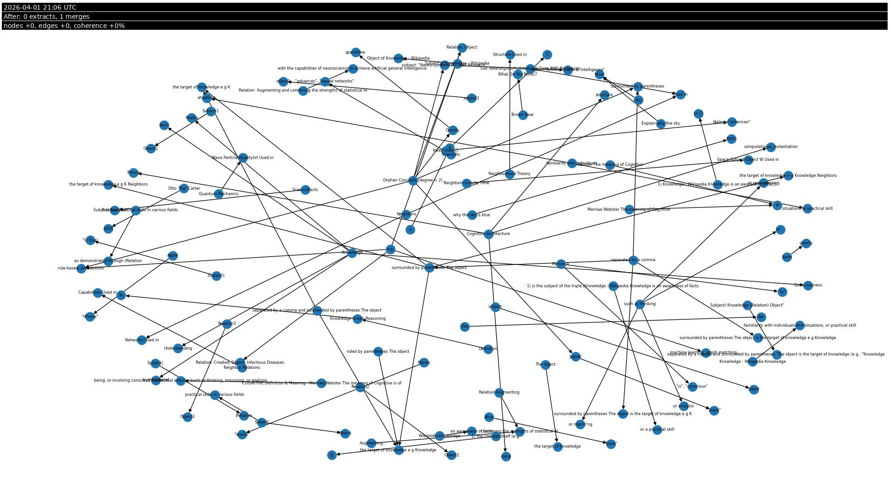](graph-2026-04-01-21-06-extract-subideas.png) [commit](https://github.com/BoggersTheFish/BoggersTheCIG/commit/2b94325)

### 2026-04-01 21:06 UTC

**After:** 2_+2_.md"+eval+obsidian+thinking.md" — nodes +0, edges +0, coherence +0%

[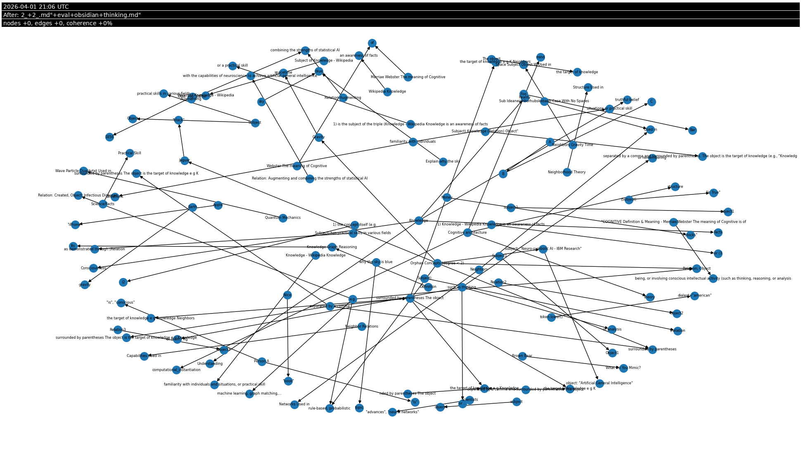](graph-2026-04-01-21-06-self-improve.png) [commit](https://github.com/BoggersTheFish/BoggersTheCIG/commit/2b94325)

### 2026-04-02 02:17 UTC

**After:** external ingest (+1 triples) — nodes +4, edges +2, coherence +333233%

[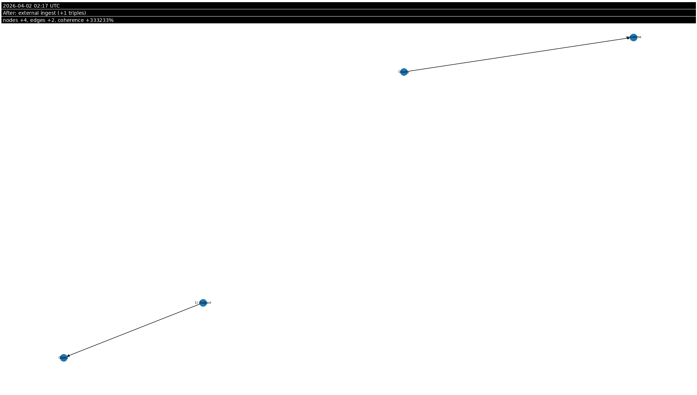](graph-2026-04-02-02-17-after-ingest.png) [commit](https://github.com/BoggersTheFish/BoggersTheCIG/commit/9f73b69)

### 2026-04-02 02:17 UTC

**After:** vault analysis (+173 triples) — nodes +130, edges +83, coherence -97%

[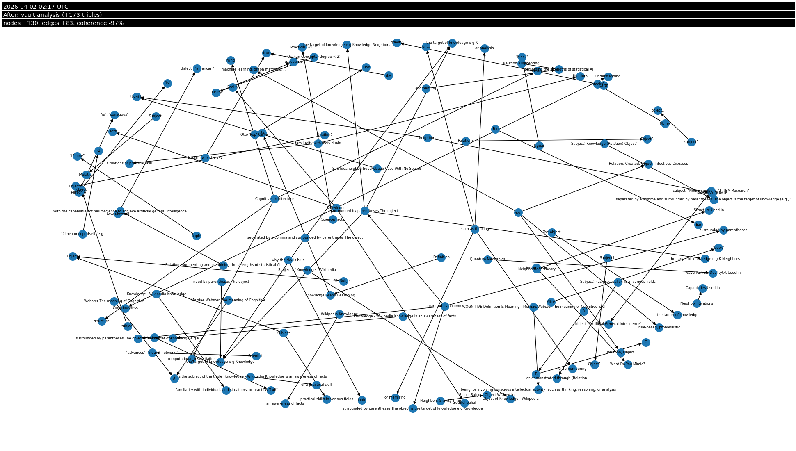](graph-2026-04-02-02-17-after-analyze-vault.png) [commit](https://github.com/BoggersTheFish/BoggersTheCIG/commit/9f73b69)

### 2026-04-02 02:17 UTC

**After:** 1 extracts, 0 merges — nodes +0, edges +0, coherence +0%

[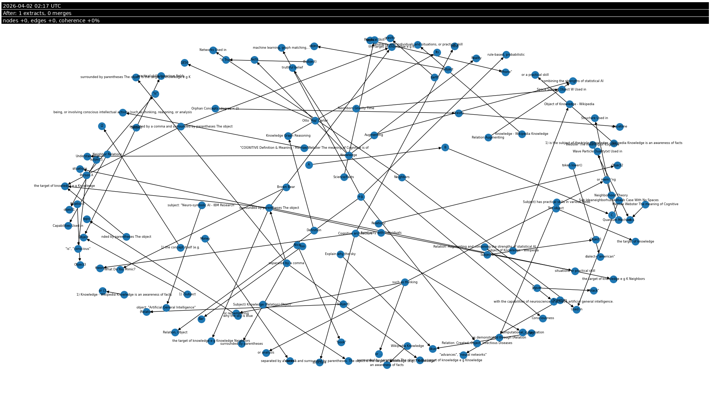](graph-2026-04-02-02-17-extract-subideas.png) [commit](https://github.com/BoggersTheFish/BoggersTheCIG/commit/9f73b69)

### 2026-04-02 02:18 UTC

**After:** vault analysis (+178 triples) — nodes +0, edges +6, coherence +7%

[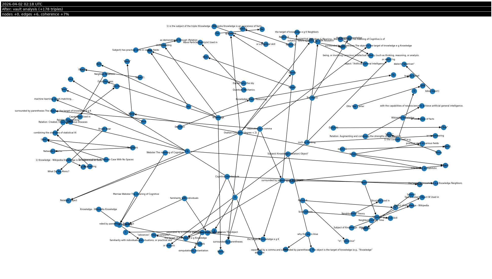](graph-2026-04-02-02-18-after-analyze-vault.png) [commit](https://github.com/BoggersTheFish/BoggersTheCIG/commit/9f73b69)

### 2026-04-02 02:18 UTC

**After:** 1 extracts, 0 merges — nodes +0, edges +0, coherence +0%

[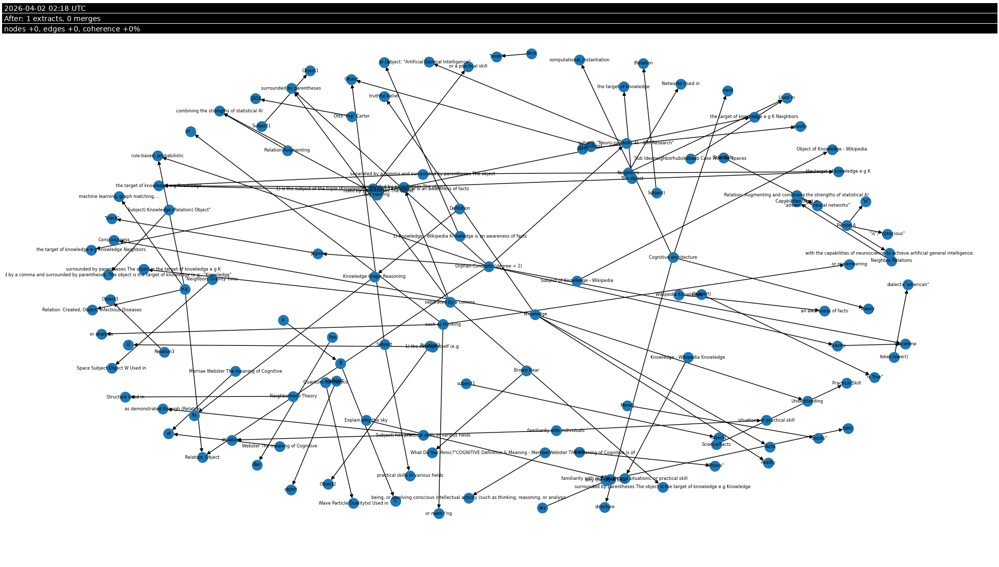](graph-2026-04-02-02-18-extract-subideas.png) [commit](https://github.com/BoggersTheFish/BoggersTheCIG/commit/9f73b69)

### 2026-04-02 02:24 UTC

**After:** vault organize (0 moves) — nodes +0, edges +0, coherence +0%

[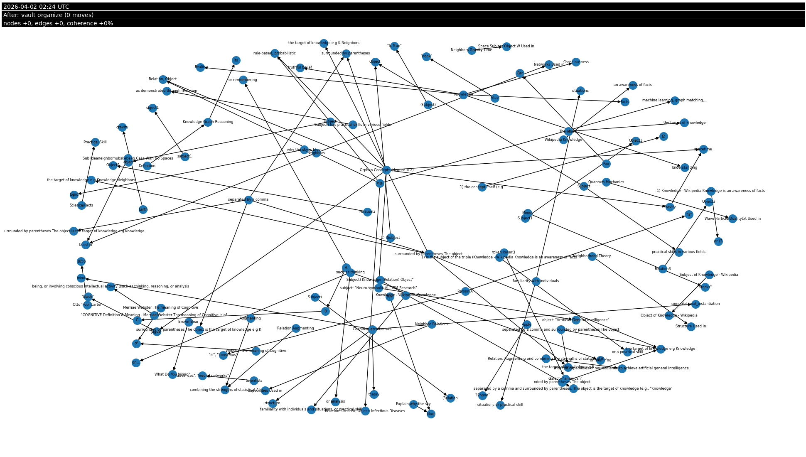](graph-2026-04-02-02-24-after-organize.png) [commit](https://github.com/BoggersTheFish/BoggersTheCIG/commit/9f73b69)

### 2026-04-02 02:24 UTC

**After:** 0 extracts, 1 merges — nodes +0, edges +0, coherence +0%

[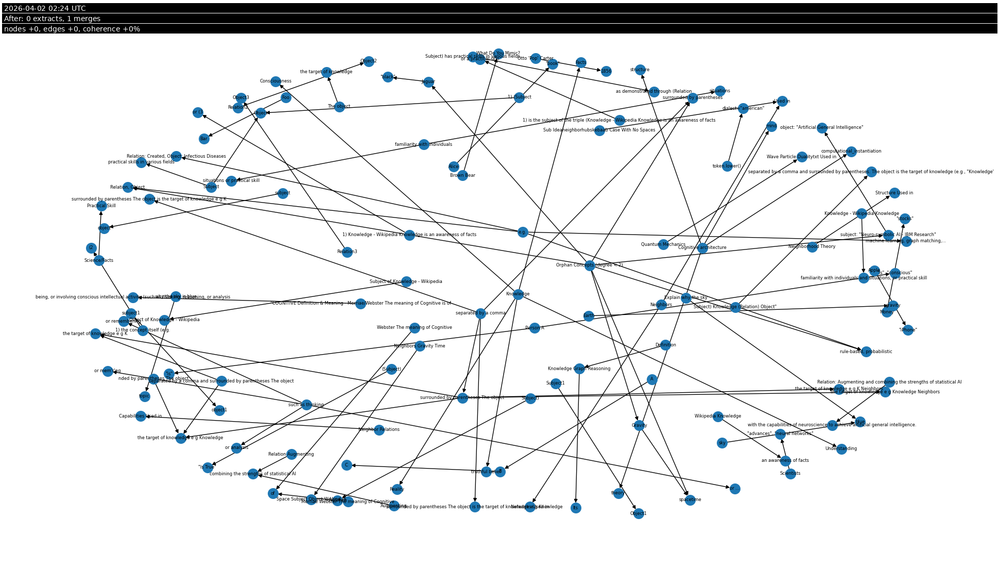](graph-2026-04-02-02-24-extract-subideas.png) [commit](https://github.com/BoggersTheFish/BoggersTheCIG/commit/9f73b69)

### 2026-04-02 02:24 UTC

**After:** 2_+2_.md"+Knowledge.md"+_Subject.md"+eval — nodes +0, edges +0, coherence +0%

[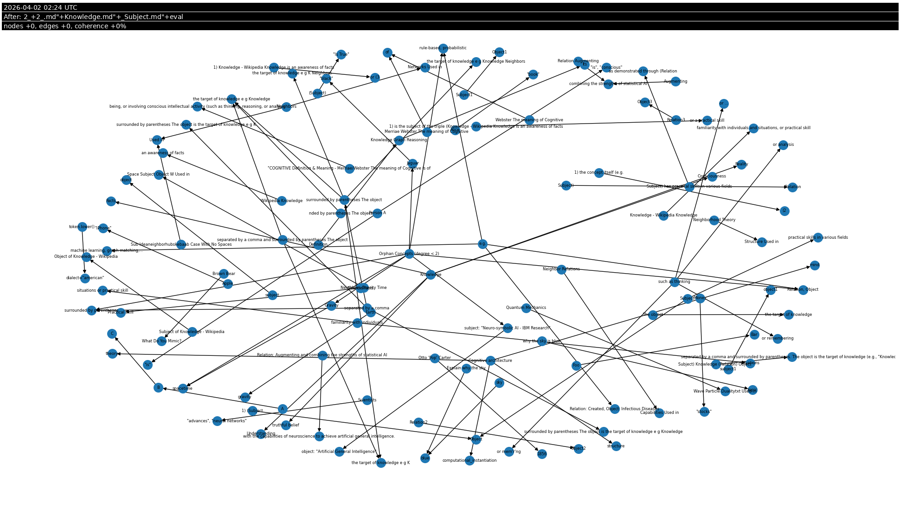](graph-2026-04-02-02-24-self-improve.png) [commit](https://github.com/BoggersTheFish/BoggersTheCIG/commit/9f73b69)

### 2026-04-02 02:30 UTC

**After:** vault organize (0 moves) — nodes +0, edges +0, coherence +0%

[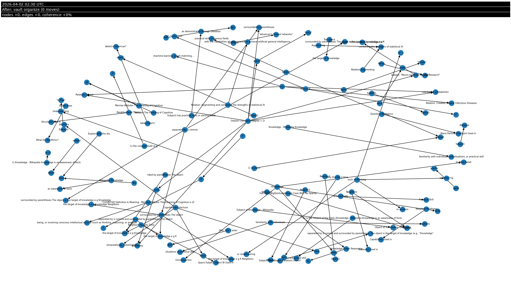](graph-2026-04-02-02-30-after-organize.png) [commit](https://github.com/BoggersTheFish/BoggersTheCIG/commit/9f73b69)

### 2026-04-02 02:30 UTC

**After:** 1 extracts, 0 merges — nodes +0, edges +0, coherence +0%

[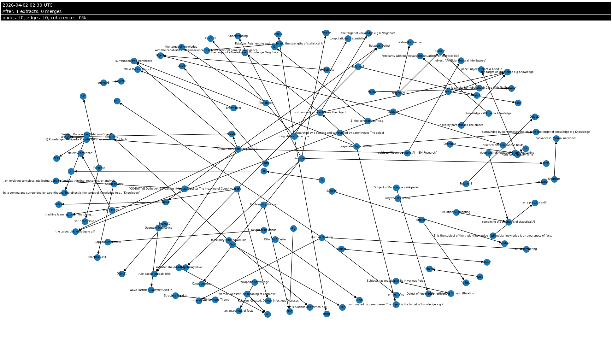](graph-2026-04-02-02-30-extract-subideas.png) [commit](https://github.com/BoggersTheFish/BoggersTheCIG/commit/9f73b69)

### 2026-04-02 02:31 UTC

**After:** 2_+2_.md"+Knowledge.md"+_Subject.md"+eval — nodes +0, edges +0, coherence +0%

[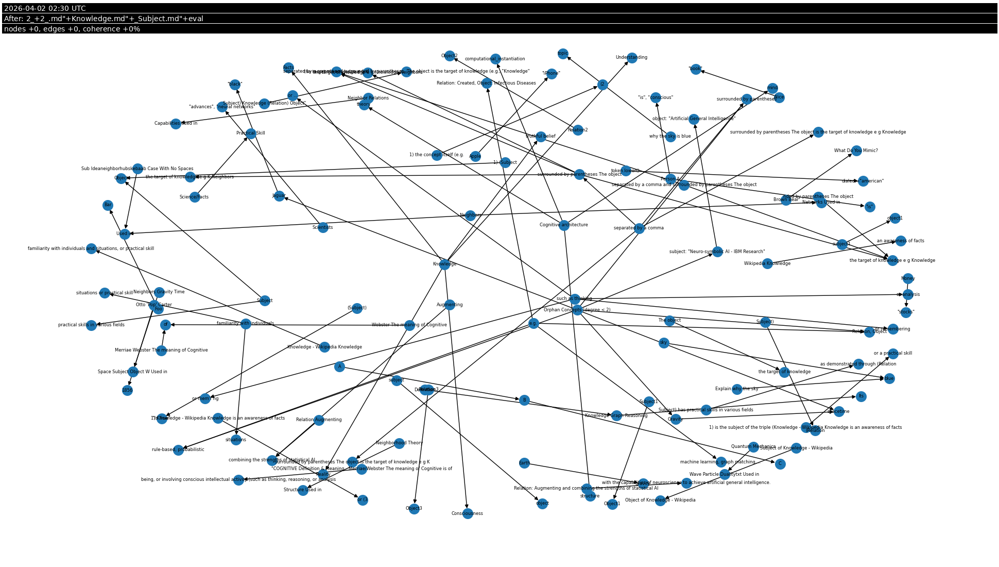](graph-2026-04-02-02-30-self-improve.png) [commit](https://github.com/BoggersTheFish/BoggersTheCIG/commit/9f73b69)

### 2026-04-02 06:20 UTC

**After:** vault analysis (+179 triples) — nodes +134, edges +85, coherence +9438%

[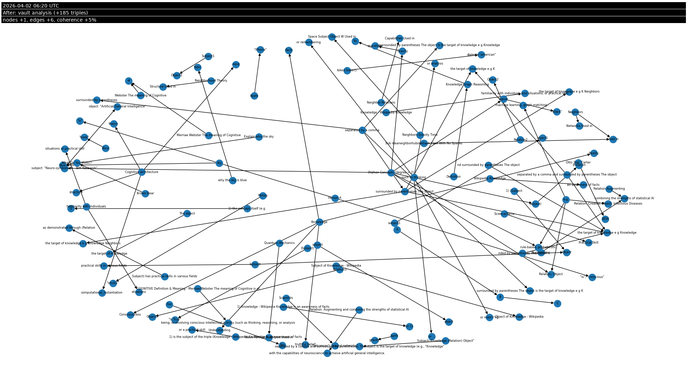](graph-2026-04-02-06-20-after-analyze-vault.png) [commit](https://github.com/BoggersTheFish/BoggersTheCIG/commit/cea9cba)

### 2026-04-02 06:20 UTC

**After:** vault analysis (+185 triples) — nodes +1, edges +6, coherence +5%

 [commit](https://github.com/BoggersTheFish/BoggersTheCIG/commit/cea9cba)

### 2026-04-02 06:27 UTC

**After:** vault organize (0 moves) — nodes +0, edges +0, coherence +0%

[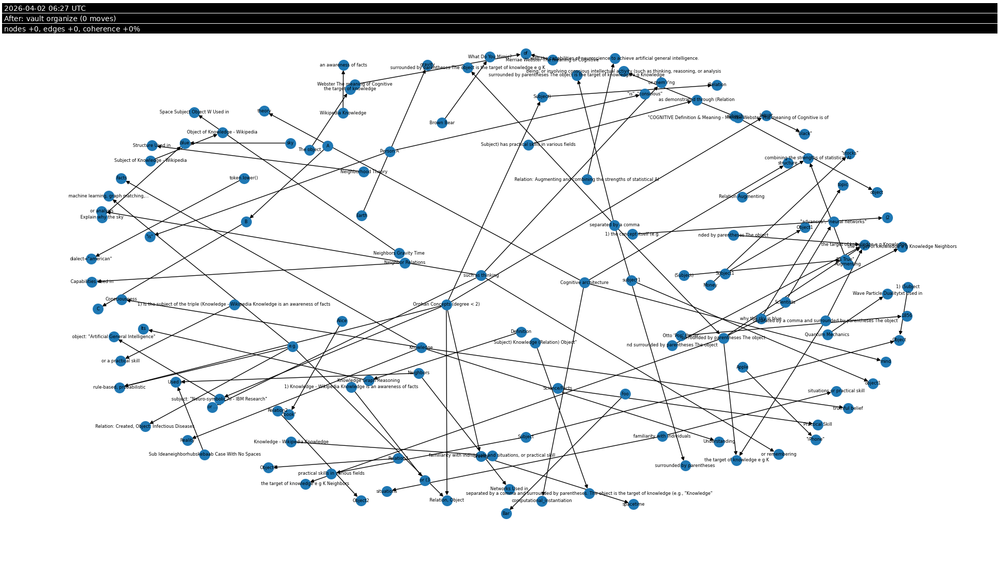](graph-2026-04-02-06-27-after-organize.png) [commit](https://github.com/BoggersTheFish/BoggersTheCIG/commit/cea9cba)

### 2026-04-02 06:27 UTC

**After:** 1 extracts, 0 merges — nodes +0, edges +0, coherence +0%

[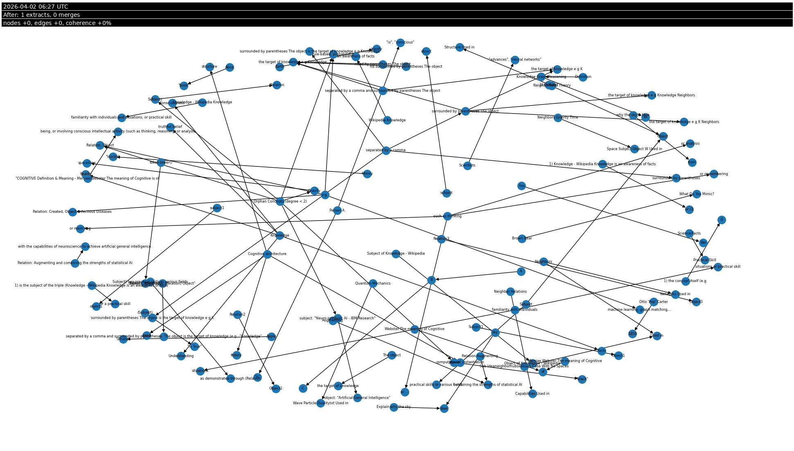](graph-2026-04-02-06-27-extract-subideas.png) [commit](https://github.com/BoggersTheFish/BoggersTheCIG/commit/cea9cba)

### 2026-04-02 06:27 UTC

**After:** 2_+2_.md"+Clo.md"+_Knowledge_.md"+_Subject.md" — nodes +0, edges +0, coherence +0%

[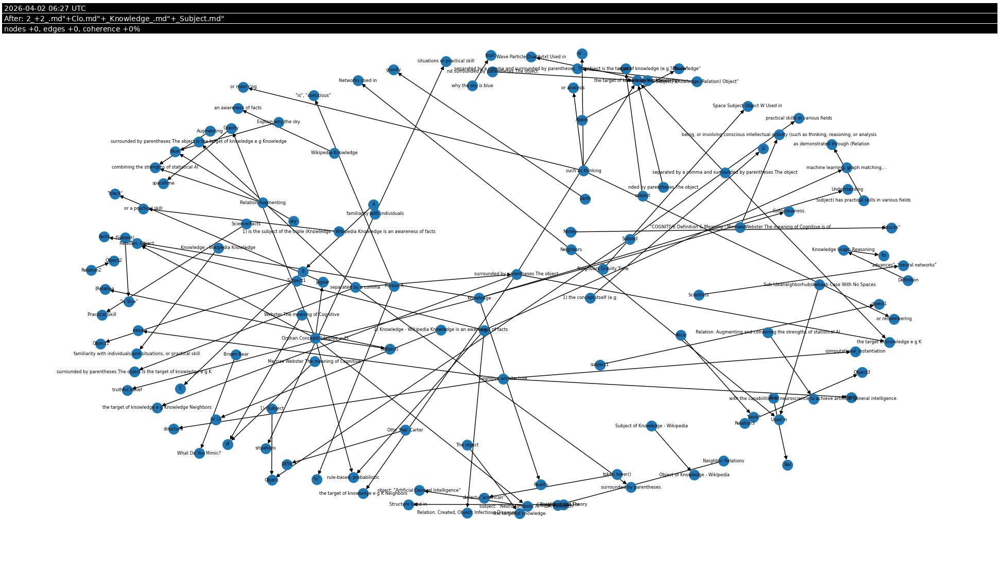](graph-2026-04-02-06-27-self-improve.png) [commit](https://github.com/BoggersTheFish/BoggersTheCIG/commit/cea9cba)

### 2026-04-02 06:33 UTC

**After:** vault organize (2 moves) — nodes +0, edges +0, coherence +0%

[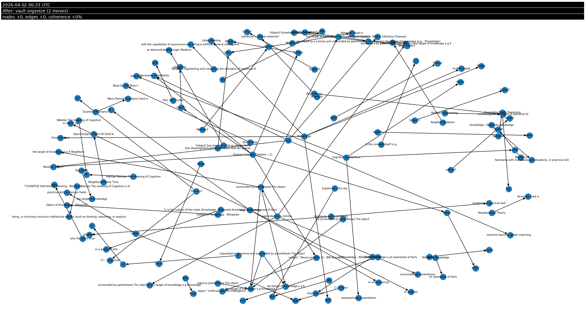](graph-2026-04-02-06-33-after-organize.png) [commit](https://github.com/BoggersTheFish/BoggersTheCIG/commit/cea9cba)

### 2026-04-02 06:33 UTC

**After:** 0 extracts, 1 merges — nodes +0, edges +0, coherence +0%

[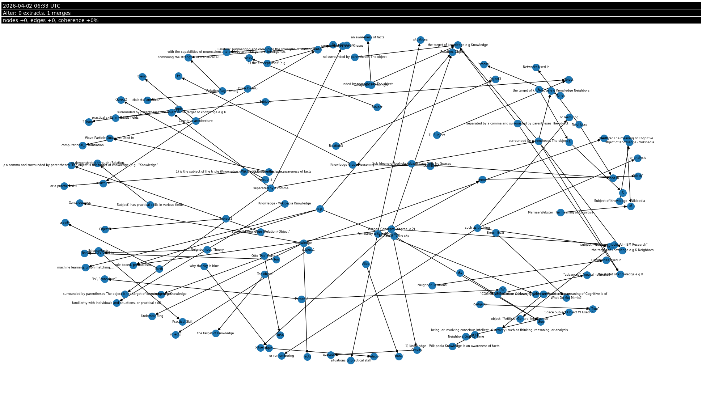](graph-2026-04-02-06-33-extract-subideas.png) [commit](https://github.com/BoggersTheFish/BoggersTheCIG/commit/cea9cba)

### 2026-04-02 06:33 UTC

**After:** 2_+2_.md"+Clo.md"+_Knowledge_.md"+_Subject.md" — nodes +0, edges +0, coherence +0%

[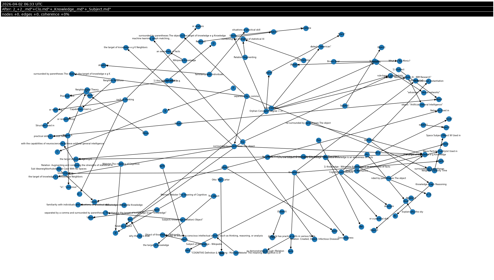](graph-2026-04-02-06-33-self-improve.png) [commit](https://github.com/BoggersTheFish/BoggersTheCIG/commit/cea9cba)

### 2026-04-02 11:00 UTC

**After:** vault analysis (+180 triples) — nodes +134, edges +85, coherence +9438%

[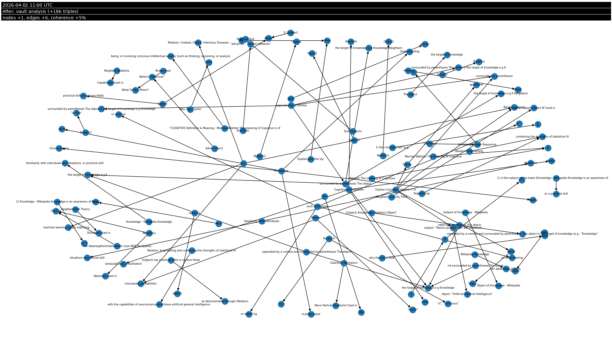](graph-2026-04-02-11-00-after-analyze-vault.png) [commit](https://github.com/BoggersTheFish/BoggersTheCIG/commit/07688a2)

### 2026-04-02 11:00 UTC

**After:** 1 extracts, 0 merges — nodes +0, edges +0, coherence +0%

[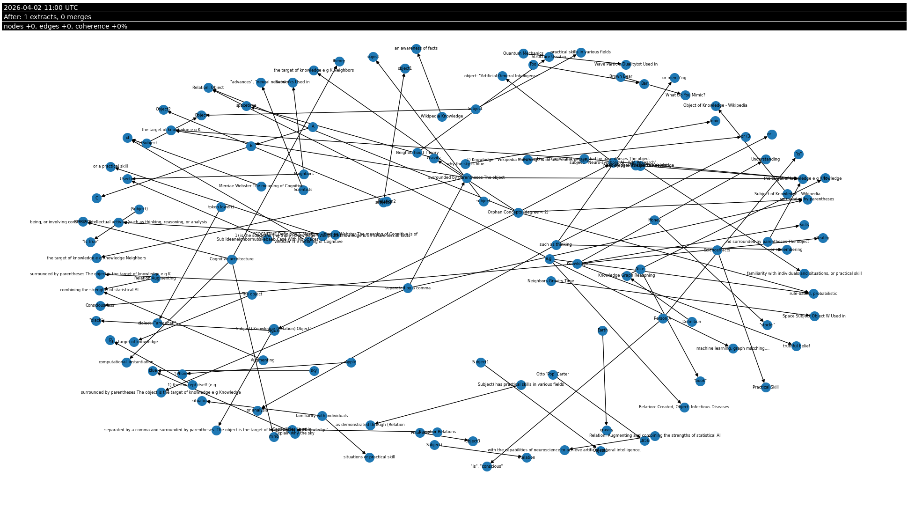](graph-2026-04-02-11-00-extract-subideas.png) [commit](https://github.com/BoggersTheFish/BoggersTheCIG/commit/07688a2)

### 2026-04-02 11:00 UTC

**After:** vault analysis (+186 triples) — nodes +1, edges +6, coherence +5%

 [commit](https://github.com/BoggersTheFish/BoggersTheCIG/commit/07688a2)

### 2026-04-02 11:00 UTC

**After:** 1 extracts, 0 merges — nodes +0, edges +0, coherence +0%

 [commit](https://github.com/BoggersTheFish/BoggersTheCIG/commit/07688a2)

### 2026-04-02 11:06 UTC

**After:** vault organize (2 moves) — nodes +0, edges +0, coherence +0%

[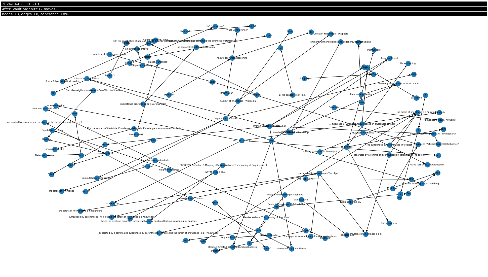](graph-2026-04-02-11-06-after-organize.png) [commit](https://github.com/BoggersTheFish/BoggersTheCIG/commit/07688a2)

### 2026-04-02 11:06 UTC

**After:** 0 extracts, 1 merges — nodes +0, edges +0, coherence +0%

[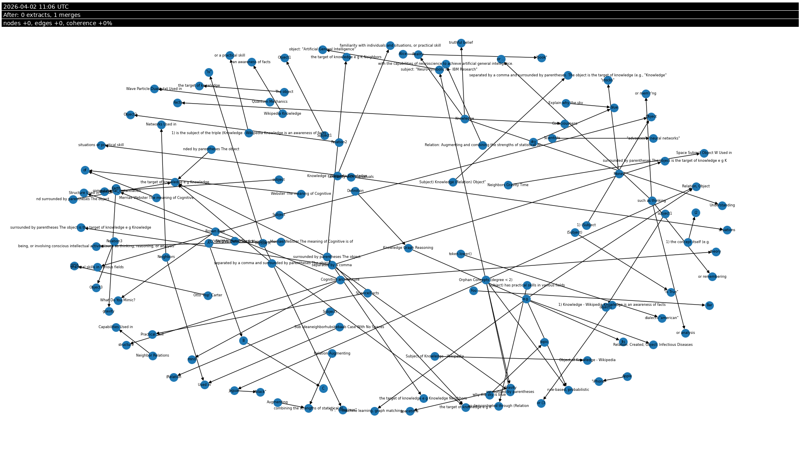](graph-2026-04-02-11-06-extract-subideas.png) [commit](https://github.com/BoggersTheFish/BoggersTheCIG/commit/07688a2)

### 2026-04-02 11:06 UTC

**After:** 2_+2_.md"+comma.md"+eval+object.md" — nodes +0, edges +0, coherence +0%

[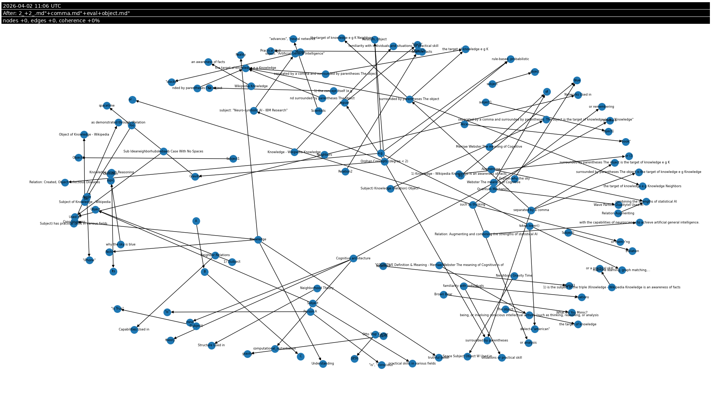](graph-2026-04-02-11-06-self-improve.png) [commit](https://github.com/BoggersTheFish/BoggersTheCIG/commit/07688a2)

### 2026-04-02 11:12 UTC

**After:** vault organize (0 moves) — nodes +0, edges +0, coherence +0%

[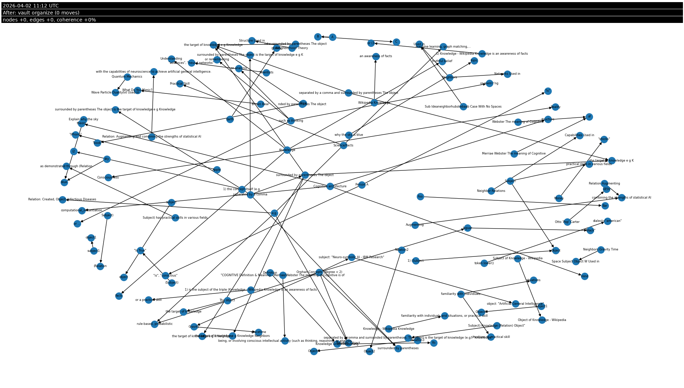](graph-2026-04-02-11-12-after-organize.png) [commit](https://github.com/BoggersTheFish/BoggersTheCIG/commit/07688a2)

### 2026-04-02 11:12 UTC

**After:** 0 extracts, 1 merges — nodes +0, edges +0, coherence +0%

[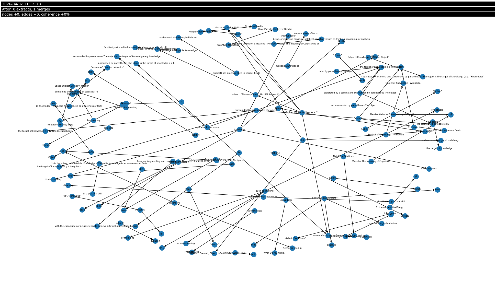](graph-2026-04-02-11-12-extract-subideas.png) [commit](https://github.com/BoggersTheFish/BoggersTheCIG/commit/07688a2)

### 2026-04-02 11:12 UTC

**After:** 2_+2_.md"+comma.md"+eval+object.md" — nodes +0, edges +0, coherence +0%

[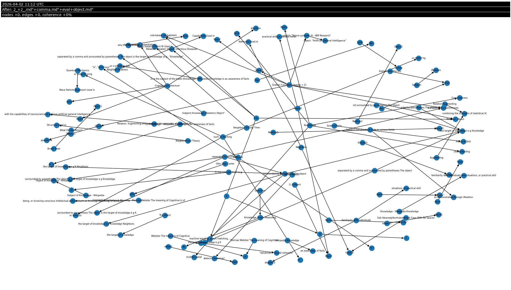](graph-2026-04-02-11-12-self-improve.png) [commit](https://github.com/BoggersTheFish/BoggersTheCIG/commit/07688a2)

### 2026-04-02 16:10 UTC

**After:** external ingest (+1 triples) — nodes +4, edges +2, coherence +333233%

[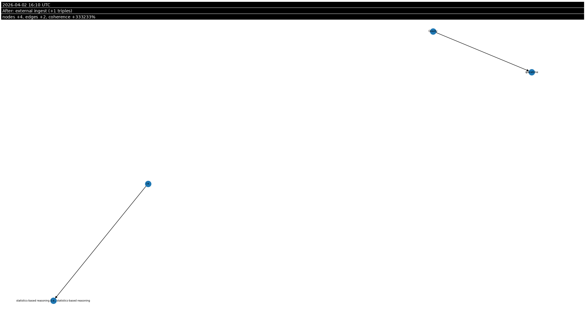](graph-2026-04-02-16-10-after-ingest.png) [commit](https://github.com/BoggersTheFish/BoggersTheCIG/commit/7d5cf62)

### 2026-04-02 16:10 UTC

**After:** vault analysis (+181 triples) — nodes +133, edges +85, coherence -97%

[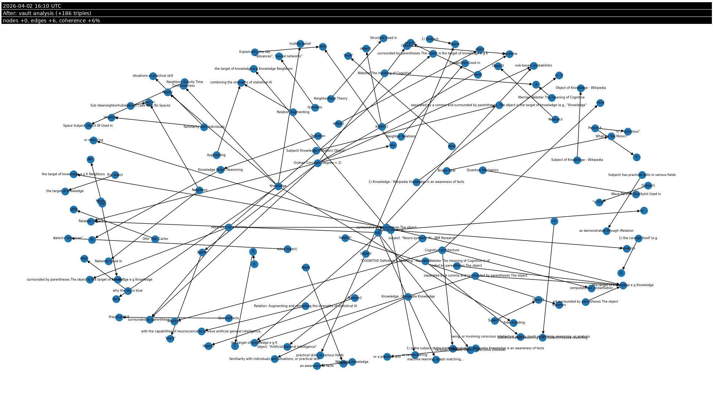](graph-2026-04-02-16-10-after-analyze-vault.png) [commit](https://github.com/BoggersTheFish/BoggersTheCIG/commit/7d5cf62)

### 2026-04-02 16:10 UTC

**After:** 1 extracts, 0 merges — nodes +0, edges +0, coherence +0%

[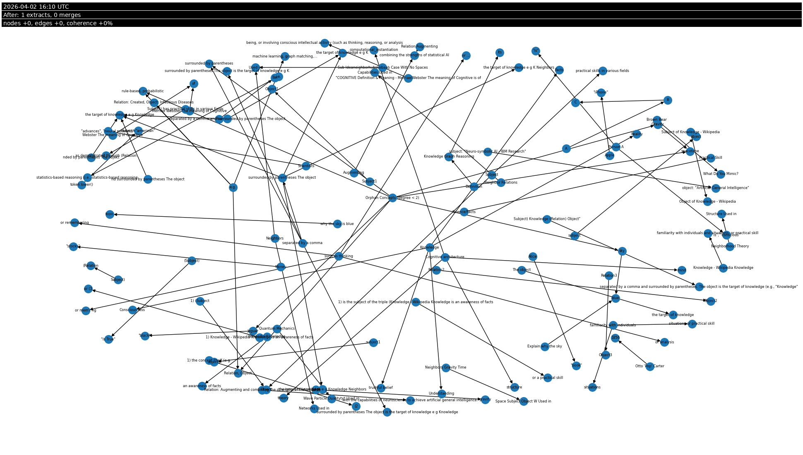](graph-2026-04-02-16-10-extract-subideas.png) [commit](https://github.com/BoggersTheFish/BoggersTheCIG/commit/7d5cf62)

### 2026-04-02 16:10 UTC

**After:** vault analysis (+186 triples) — nodes +0, edges +6, coherence +6%

 [commit](https://github.com/BoggersTheFish/BoggersTheCIG/commit/7d5cf62)

### 2026-04-02 16:11 UTC

**After:** 1 extracts, 0 merges — nodes +0, edges +0, coherence +0%

 [commit](https://github.com/BoggersTheFish/BoggersTheCIG/commit/7d5cf62)

### 2026-04-02 16:16 UTC

**After:** vault organize (1 moves) — nodes +0, edges +0, coherence +0%

[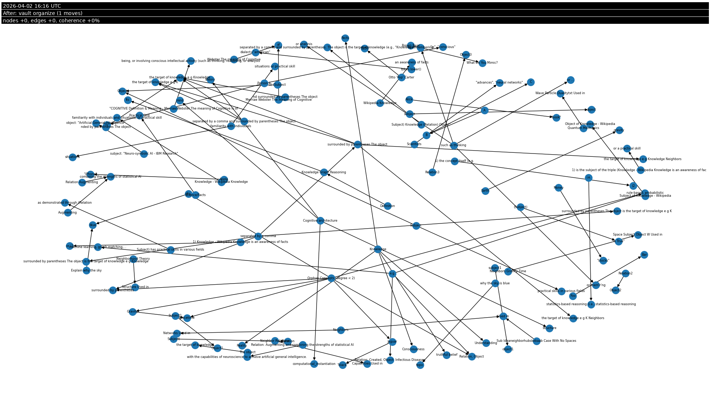](graph-2026-04-02-16-16-after-organize.png) [commit](https://github.com/BoggersTheFish/BoggersTheCIG/commit/7d5cf62)

### 2026-04-02 16:16 UTC

**After:** 0 extracts, 1 merges — nodes +0, edges +0, coherence +0%

[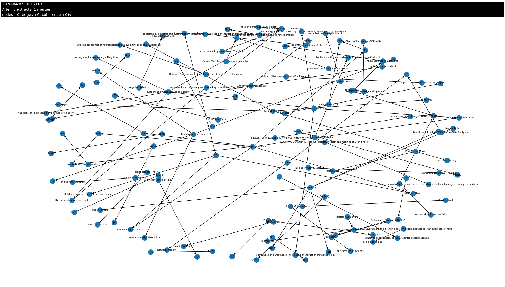](graph-2026-04-02-16-16-extract-subideas.png) [commit](https://github.com/BoggersTheFish/BoggersTheCIG/commit/7d5cf62)

### 2026-04-02 16:16 UTC

**After:** 2_+2_.md"+eval+obsidian+reasoning.md" — nodes +0, edges +0, coherence +0%

[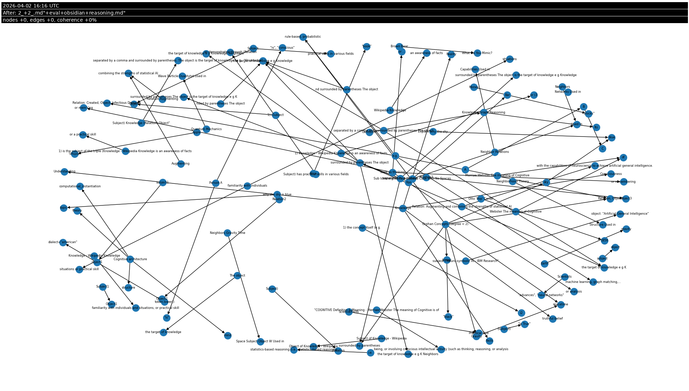](graph-2026-04-02-16-16-self-improve.png) [commit](https://github.com/BoggersTheFish/BoggersTheCIG/commit/7d5cf62)

### 2026-04-02 16:23 UTC

**After:** vault organize (0 moves) — nodes +0, edges +0, coherence +0%

[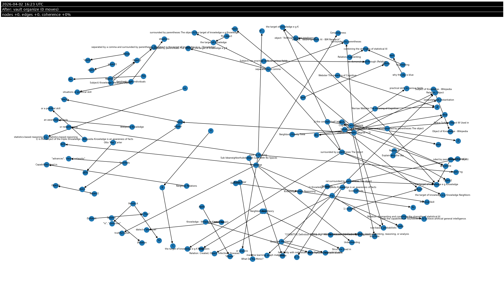](graph-2026-04-02-16-23-after-organize.png) [commit](https://github.com/BoggersTheFish/BoggersTheCIG/commit/7d5cf62)

### 2026-04-02 16:23 UTC

**After:** 0 extracts, 1 merges — nodes +0, edges +0, coherence +0%

[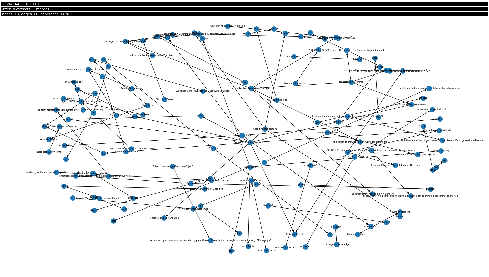](graph-2026-04-02-16-23-extract-subideas.png) [commit](https://github.com/BoggersTheFish/BoggersTheCIG/commit/7d5cf62)

### 2026-04-02 16:23 UTC

**After:** 2_+2_.md"+eval+obsidian+reasoning.md" — nodes +0, edges +0, coherence +0%

[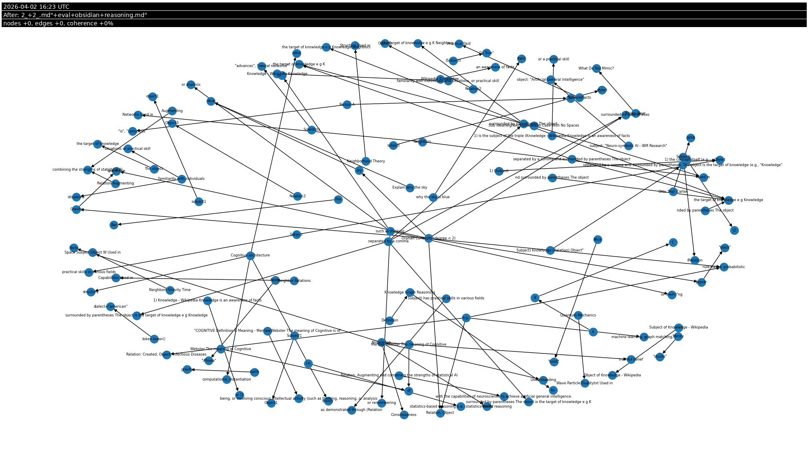](graph-2026-04-02-16-23-self-improve.png) [commit](https://github.com/BoggersTheFish/BoggersTheCIG/commit/7d5cf62)

### 2026-04-02 20:44 UTC

**After:** vault analysis (+179 triples) — nodes +134, edges +85, coherence +9438%

[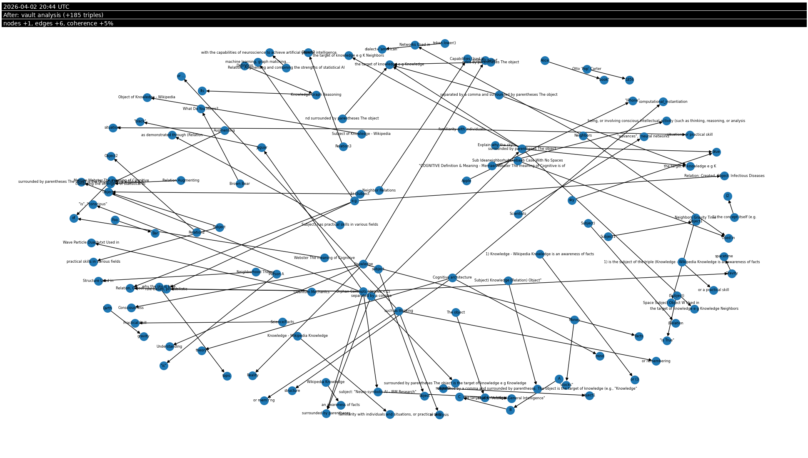](graph-2026-04-02-20-44-after-analyze-vault.png) [commit](https://github.com/BoggersTheFish/BoggersTheCIG/commit/3f3e4f2)

### 2026-04-02 20:44 UTC

**After:** 1 extracts, 0 merges — nodes +0, edges +0, coherence +0%

[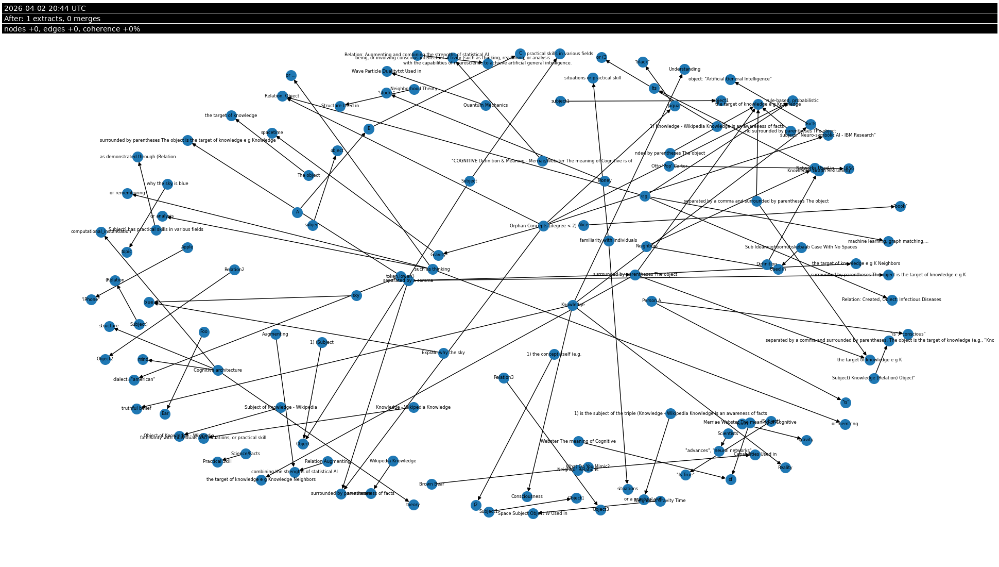](graph-2026-04-02-20-44-extract-subideas.png) [commit](https://github.com/BoggersTheFish/BoggersTheCIG/commit/3f3e4f2)

### 2026-04-02 20:44 UTC

**After:** vault analysis (+185 triples) — nodes +1, edges +6, coherence +5%

 [commit](https://github.com/BoggersTheFish/BoggersTheCIG/commit/3f3e4f2)

### 2026-04-02 20:44 UTC

**After:** 1 extracts, 0 merges — nodes +0, edges +0, coherence +0%

 [commit](https://github.com/BoggersTheFish/BoggersTheCIG/commit/3f3e4f2)

### 2026-04-02 20:49 UTC

**After:** vault organize (0 moves) — nodes +0, edges +0, coherence +0%

[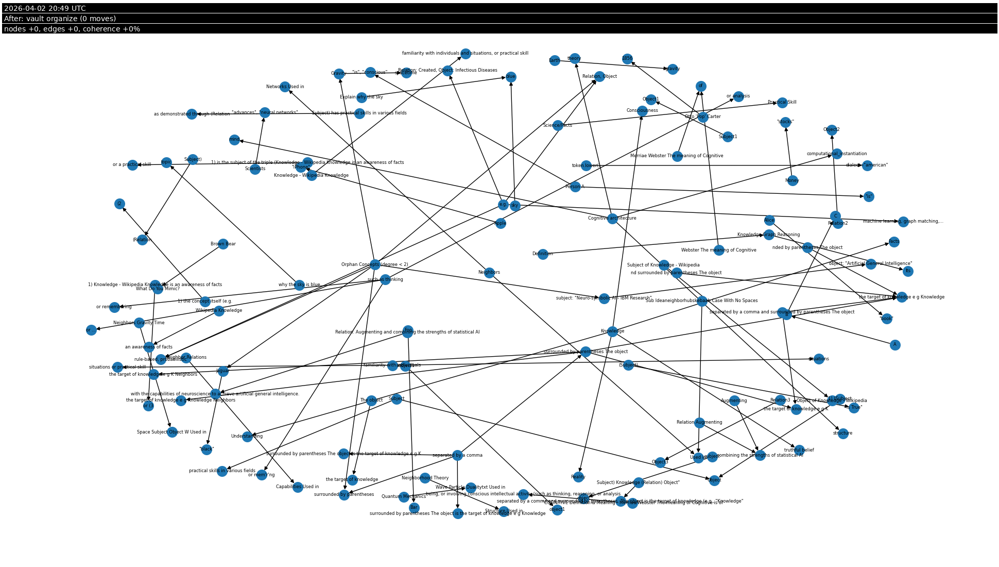](graph-2026-04-02-20-49-after-organize.png) [commit](https://github.com/BoggersTheFish/BoggersTheCIG/commit/3f3e4f2)

### 2026-04-02 20:49 UTC

**After:** 0 extracts, 1 merges — nodes +0, edges +0, coherence +0%

[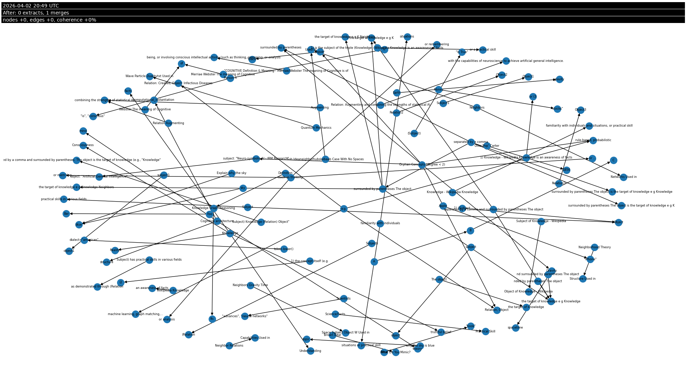](graph-2026-04-02-20-49-extract-subideas.png) [commit](https://github.com/BoggersTheFish/BoggersTheCIG/commit/3f3e4f2)

### 2026-04-02 20:49 UTC

**After:** 2_+2_.md"+Mechanics.md"+eval+obsidian — nodes +0, edges +0, coherence +0%

[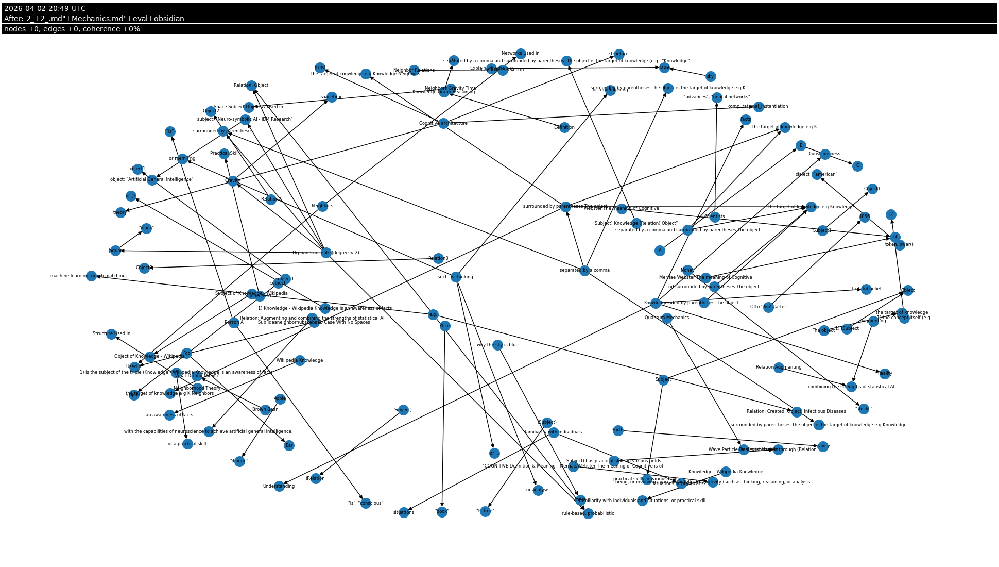](graph-2026-04-02-20-49-self-improve.png) [commit](https://github.com/BoggersTheFish/BoggersTheCIG/commit/3f3e4f2)

### 2026-04-02 20:55 UTC

**After:** vault organize (0 moves) — nodes +0, edges +0, coherence +0%

[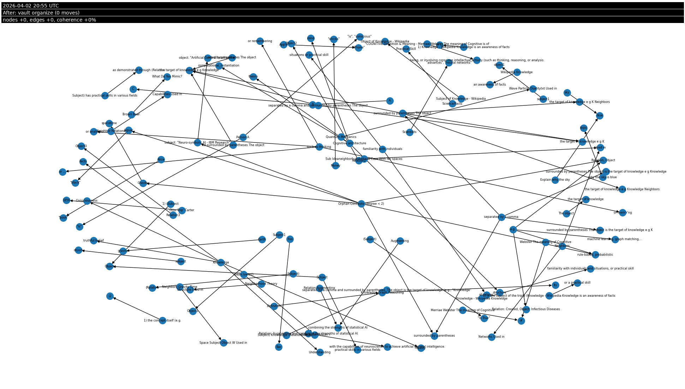](graph-2026-04-02-20-55-after-organize.png) [commit](https://github.com/BoggersTheFish/BoggersTheCIG/commit/3f3e4f2)

### 2026-04-02 20:55 UTC

**After:** 1 extracts, 0 merges — nodes +0, edges +0, coherence +0%

[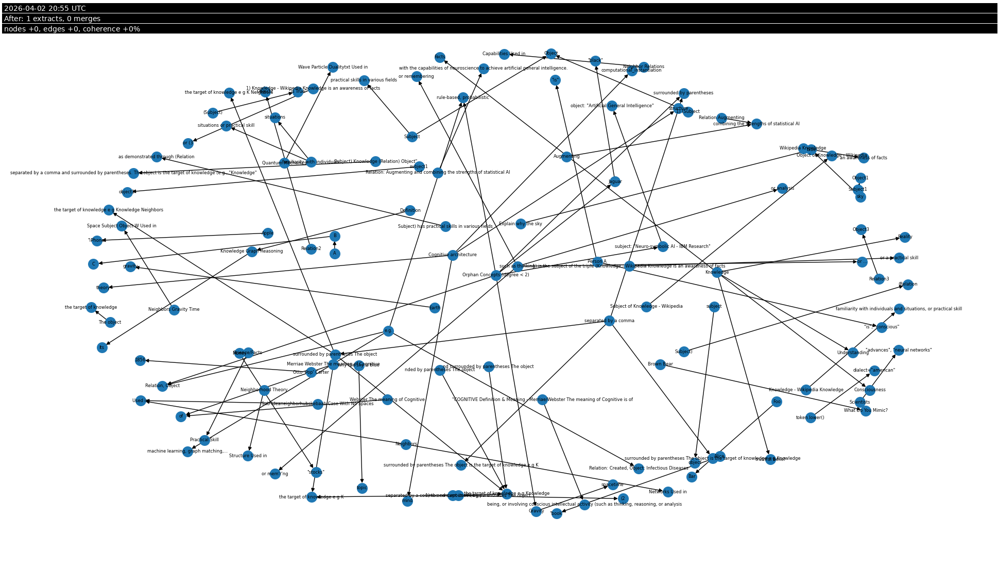](graph-2026-04-02-20-55-extract-subideas.png) [commit](https://github.com/BoggersTheFish/BoggersTheCIG/commit/3f3e4f2)

### 2026-04-02 20:55 UTC

**After:** 2_+2_.md"+Mechanics.md"+eval+obsidian — nodes +0, edges +0, coherence +0%

[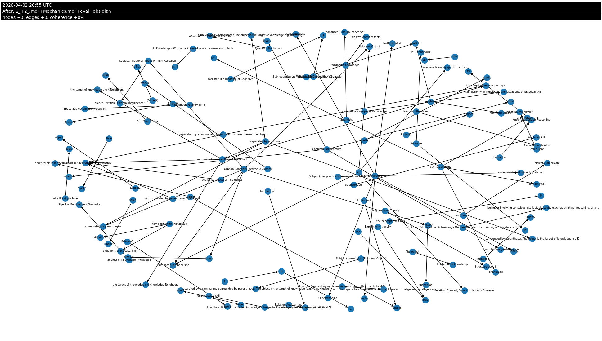](graph-2026-04-02-20-55-self-improve.png) [commit](https://github.com/BoggersTheFish/BoggersTheCIG/commit/3f3e4f2)

### 2026-04-03 02:20 UTC

**After:** external ingest (+3 triples) — nodes +8, edges +4, coherence +142757%

[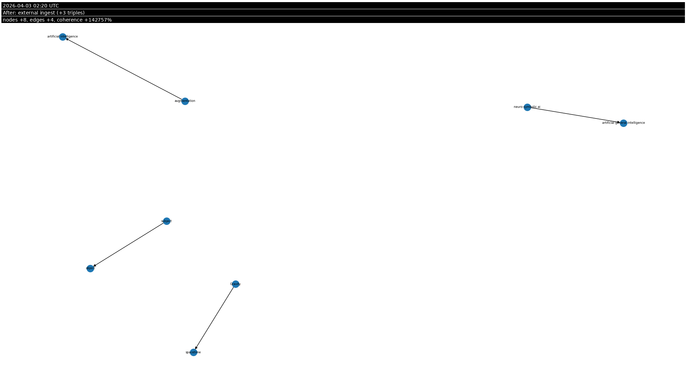](graph-2026-04-03-02-20-after-ingest.png) [commit](https://github.com/BoggersTheFish/BoggersTheCIG/commit/17fbe9f)

### 2026-04-03 02:20 UTC

**After:** vault analysis (+180 triples) — nodes +131, edges +84, coherence -93%

[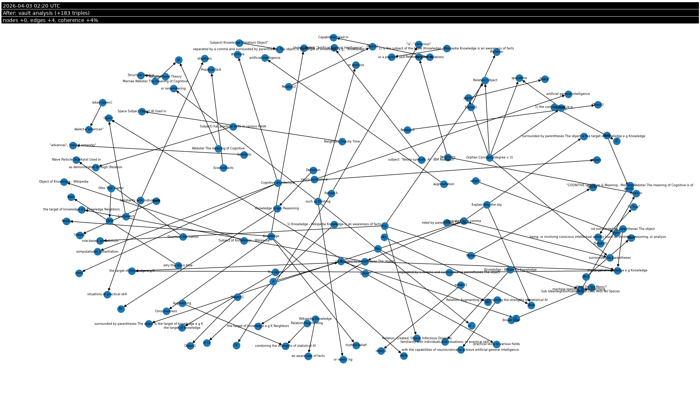](graph-2026-04-03-02-20-after-analyze-vault.png) [commit](https://github.com/BoggersTheFish/BoggersTheCIG/commit/17fbe9f)

### 2026-04-03 02:20 UTC

**After:** vault analysis (+183 triples) — nodes +0, edges +4, coherence +4%

 [commit](https://github.com/BoggersTheFish/BoggersTheCIG/commit/17fbe9f)

### 2026-04-03 02:26 UTC

**After:** vault organize (2 moves) — nodes +0, edges +0, coherence +0%

[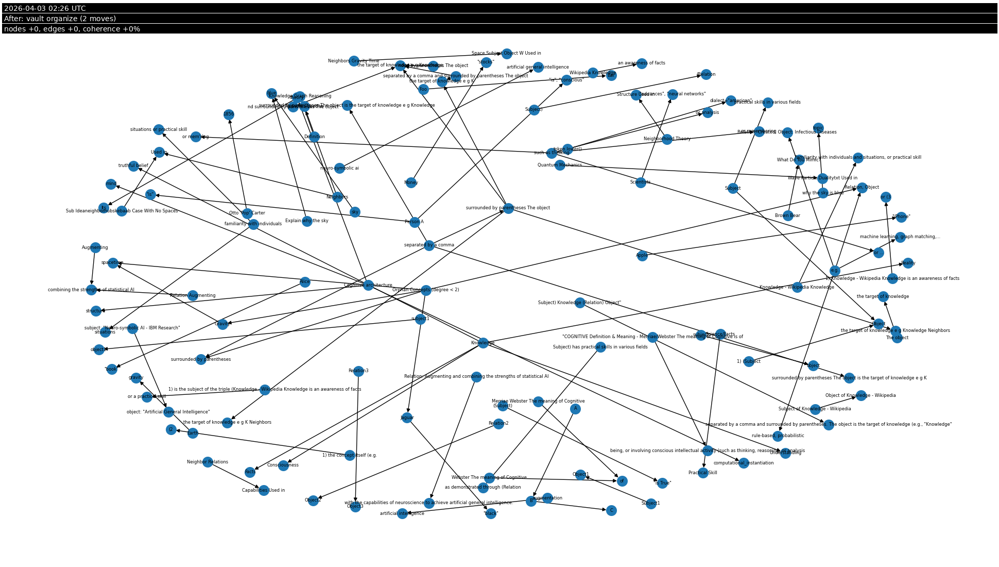](graph-2026-04-03-02-26-after-organize.png) [commit](https://github.com/BoggersTheFish/BoggersTheCIG/commit/17fbe9f)

### 2026-04-03 02:26 UTC

**After:** 1 extracts, 0 merges — nodes +0, edges +0, coherence +0%

[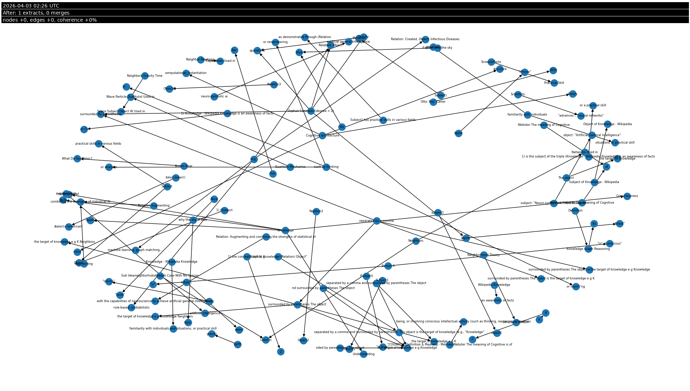](graph-2026-04-03-02-26-extract-subideas.png) [commit](https://github.com/BoggersTheFish/BoggersTheCIG/commit/17fbe9f)

### 2026-04-03 02:26 UTC

**After:** 2_+2_.md"+Intelligence_.md"+ai.md"+eval — nodes +0, edges +0, coherence +0%

[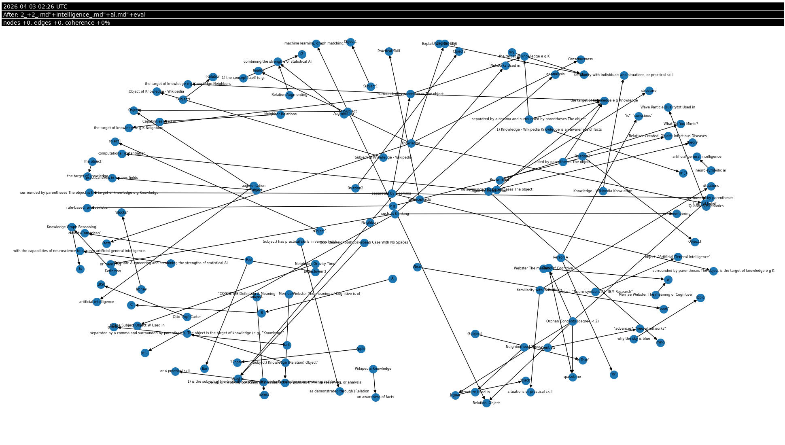](graph-2026-04-03-02-26-self-improve.png) [commit](https://github.com/BoggersTheFish/BoggersTheCIG/commit/17fbe9f)

### 2026-04-03 02:33 UTC

**After:** vault organize (1 moves) — nodes +0, edges +0, coherence +0%

[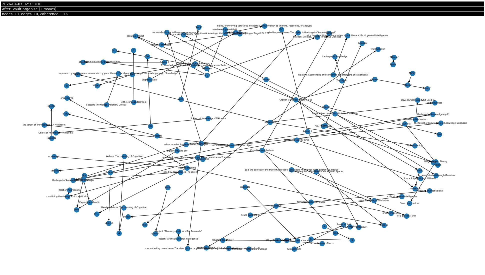](graph-2026-04-03-02-33-after-organize.png) [commit](https://github.com/BoggersTheFish/BoggersTheCIG/commit/17fbe9f)

### 2026-04-03 02:33 UTC

**After:** 0 extracts, 1 merges — nodes +0, edges +0, coherence +0%

[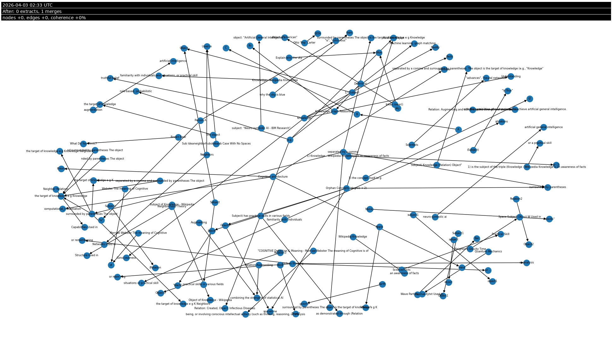](graph-2026-04-03-02-33-extract-subideas.png) [commit](https://github.com/BoggersTheFish/BoggersTheCIG/commit/17fbe9f)

### 2026-04-03 02:33 UTC

**After:** 2_+2_.md"+Intelligence_.md"+ai.md"+eval — nodes +0, edges +0, coherence +0%

[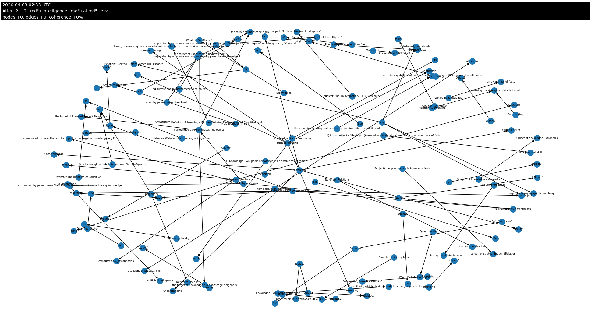](graph-2026-04-03-02-33-self-improve.png) [commit](https://github.com/BoggersTheFish/BoggersTheCIG/commit/17fbe9f)

### 2026-04-03 10:51 UTC

**After:** vault analysis (+179 triples) — nodes +134, edges +85, coherence +9438%

[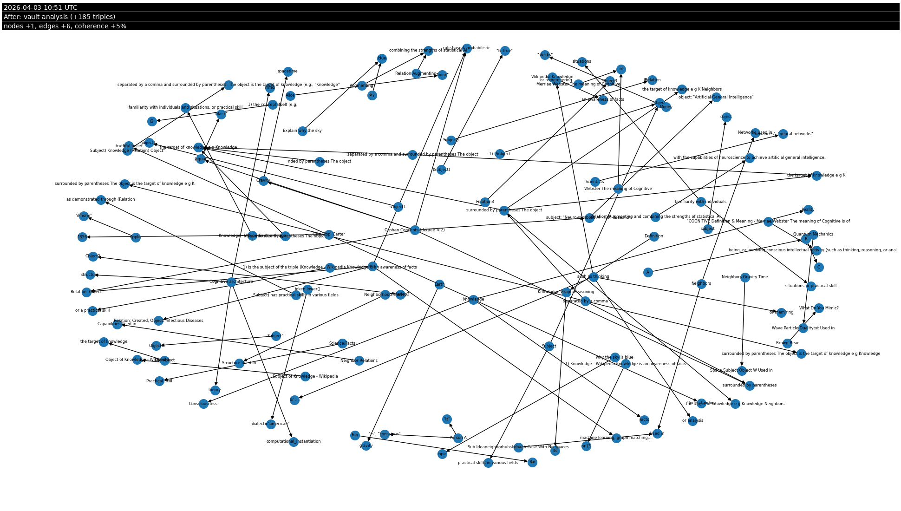](graph-2026-04-03-10-51-after-analyze-vault.png) [commit](https://github.com/BoggersTheFish/BoggersTheCIG/commit/11d52c2)

### 2026-04-03 10:51 UTC

**After:** vault analysis (+185 triples) — nodes +1, edges +6, coherence +5%

 [commit](https://github.com/BoggersTheFish/BoggersTheCIG/commit/11d52c2)

### 2026-04-03 10:57 UTC

**After:** vault organize (2 moves) — nodes +0, edges +0, coherence +0%

[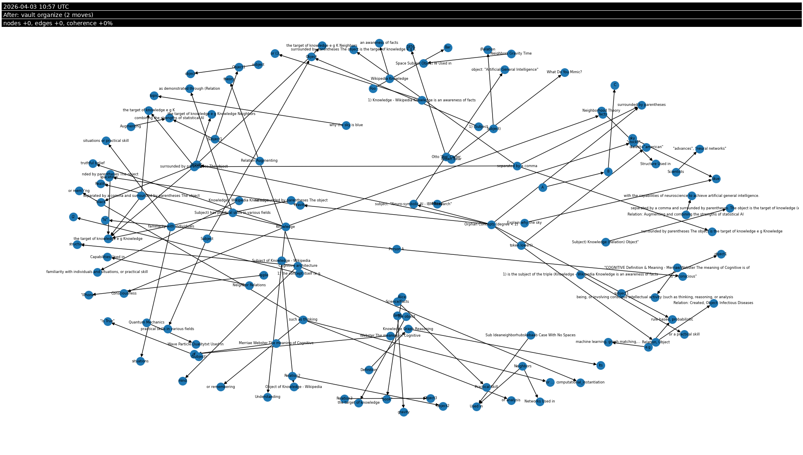](graph-2026-04-03-10-57-after-organize.png) [commit](https://github.com/BoggersTheFish/BoggersTheCIG/commit/11d52c2)

### 2026-04-03 10:57 UTC

**After:** 1 extracts, 0 merges — nodes +0, edges +0, coherence +0%

[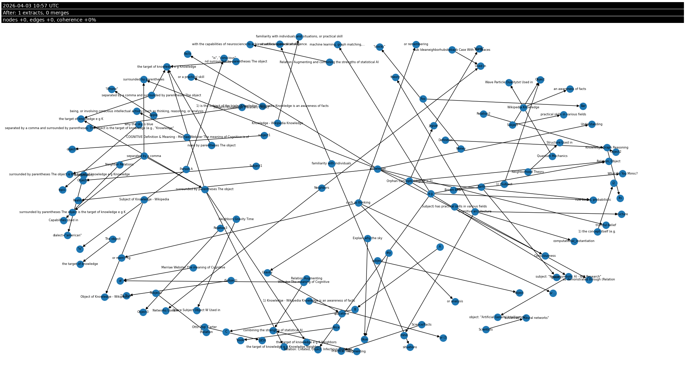](graph-2026-04-03-10-57-extract-subideas.png) [commit](https://github.com/BoggersTheFish/BoggersTheCIG/commit/11d52c2)

### 2026-04-03 10:57 UTC

**After:** 2_+2_.md"+eval+intelligence.md"+obsidian — nodes +0, edges +0, coherence +0%

[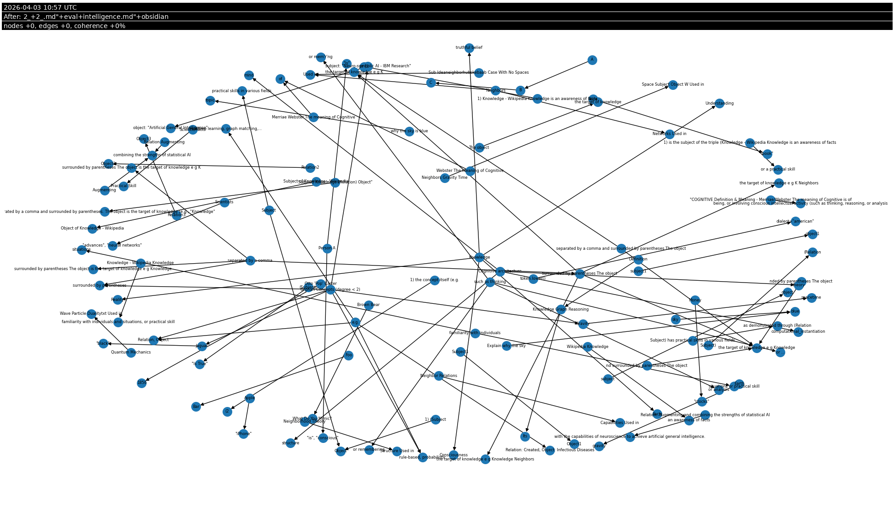](graph-2026-04-03-10-57-self-improve.png) [commit](https://github.com/BoggersTheFish/BoggersTheCIG/commit/11d52c2)

### 2026-04-03 11:03 UTC

**After:** vault organize (0 moves) — nodes +0, edges +0, coherence +0%

[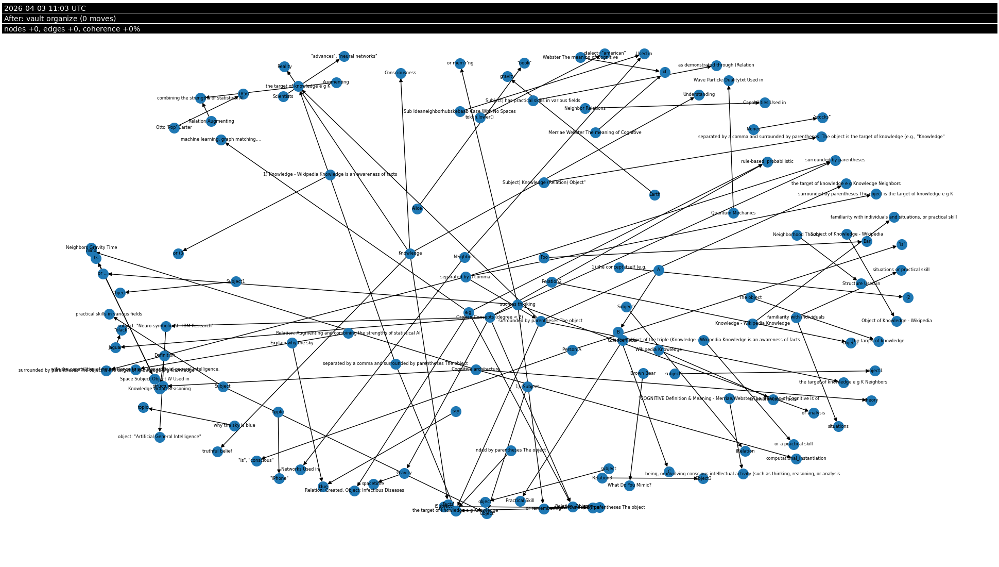](graph-2026-04-03-11-03-after-organize.png) [commit](https://github.com/BoggersTheFish/BoggersTheCIG/commit/11d52c2)

### 2026-04-03 11:03 UTC

**After:** 0 extracts, 1 merges — nodes +0, edges +0, coherence +0%

[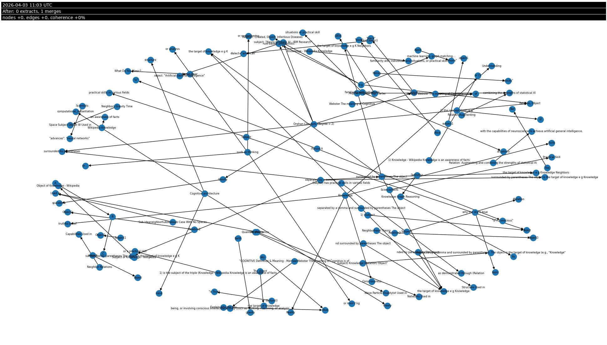](graph-2026-04-03-11-03-extract-subideas.png) [commit](https://github.com/BoggersTheFish/BoggersTheCIG/commit/11d52c2)

### 2026-04-03 11:03 UTC

**After:** 2_+2_.md"+eval+intelligence.md"+obsidian — nodes +0, edges +0, coherence +0%

[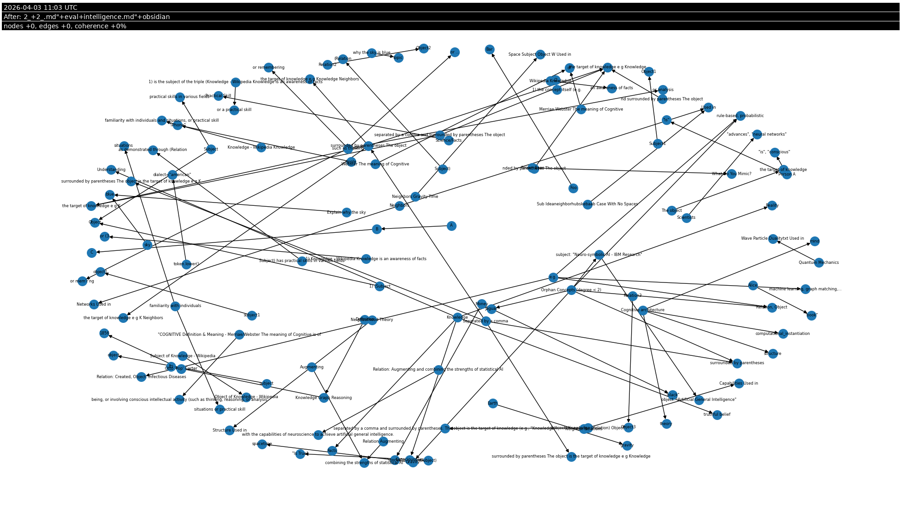](graph-2026-04-03-11-03-self-improve.png) [commit](https://github.com/BoggersTheFish/BoggersTheCIG/commit/11d52c2)

### 2026-04-03 15:48 UTC

**After:** vault analysis (+178 triples) — nodes +134, edges +85, coherence +9438%

[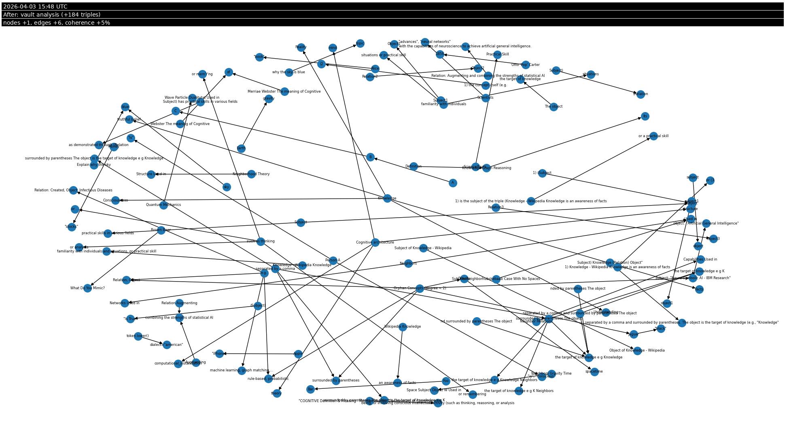](graph-2026-04-03-15-48-after-analyze-vault.png) [commit](https://github.com/BoggersTheFish/BoggersTheCIG/commit/7225b63)

### 2026-04-03 15:48 UTC

**After:** 1 extracts, 0 merges — nodes +0, edges +0, coherence +0%

[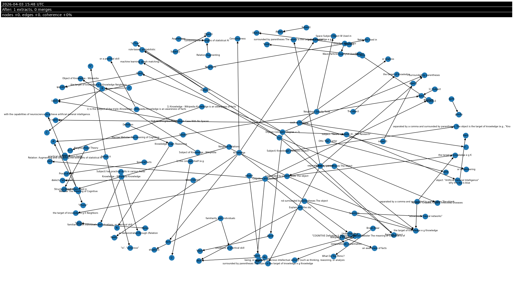](graph-2026-04-03-15-48-extract-subideas.png) [commit](https://github.com/BoggersTheFish/BoggersTheCIG/commit/7225b63)

### 2026-04-03 15:48 UTC

**After:** vault analysis (+184 triples) — nodes +1, edges +6, coherence +5%

 [commit](https://github.com/BoggersTheFish/BoggersTheCIG/commit/7225b63)

### 2026-04-03 15:48 UTC

**After:** 1 extracts, 0 merges — nodes +0, edges +0, coherence +0%

 [commit](https://github.com/BoggersTheFish/BoggersTheCIG/commit/7225b63)

### 2026-04-03 15:54 UTC

**After:** vault organize (0 moves) — nodes +0, edges +0, coherence +0%

[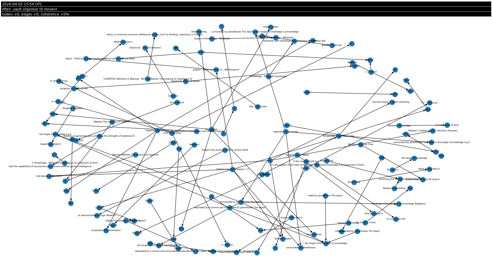](graph-2026-04-03-15-54-after-organize.png) [commit](https://github.com/BoggersTheFish/BoggersTheCIG/commit/7225b63)

### 2026-04-03 15:54 UTC

**After:** 0 extracts, 1 merges — nodes +0, edges +0, coherence +0%

[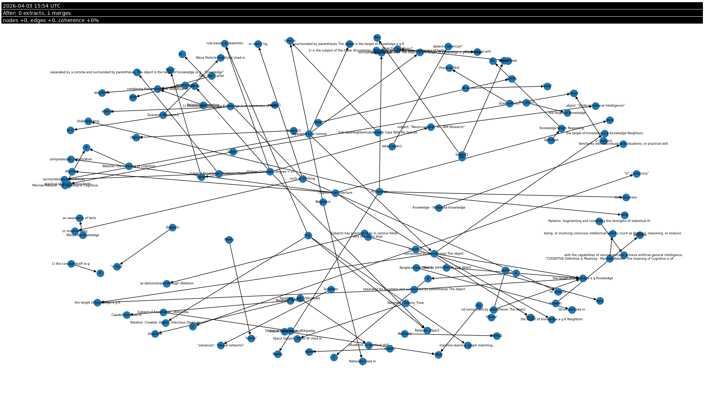](graph-2026-04-03-15-54-extract-subideas.png) [commit](https://github.com/BoggersTheFish/BoggersTheCIG/commit/7225b63)

### 2026-04-03 15:54 UTC

**After:** 2_+2_.md"+eval+obsidian — nodes +0, edges +0, coherence +0%

[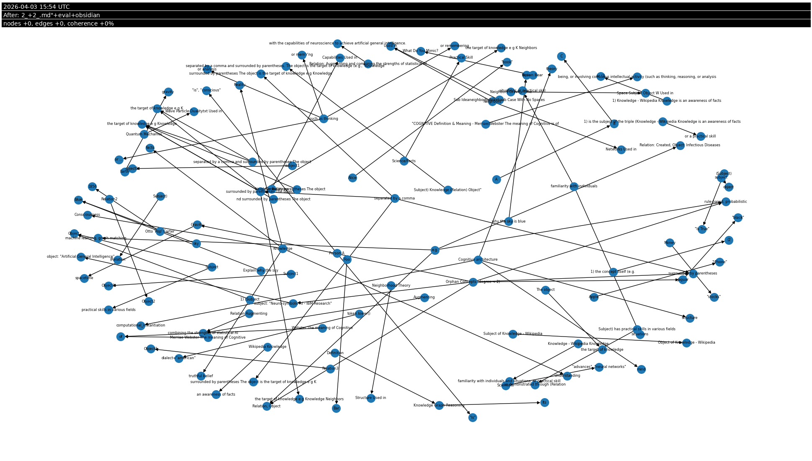](graph-2026-04-03-15-54-self-improve.png) [commit](https://github.com/BoggersTheFish/BoggersTheCIG/commit/7225b63)

### 2026-04-03 16:01 UTC

**After:** vault organize (0 moves) — nodes +0, edges +0, coherence +0%

[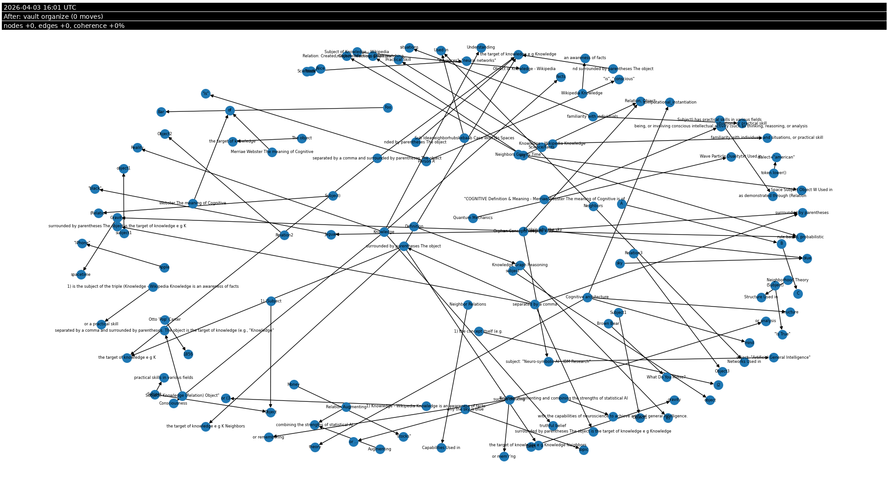](graph-2026-04-03-16-01-after-organize.png) [commit](https://github.com/BoggersTheFish/BoggersTheCIG/commit/7225b63)

### 2026-04-03 16:01 UTC

**After:** 0 extracts, 1 merges — nodes +0, edges +0, coherence +0%

[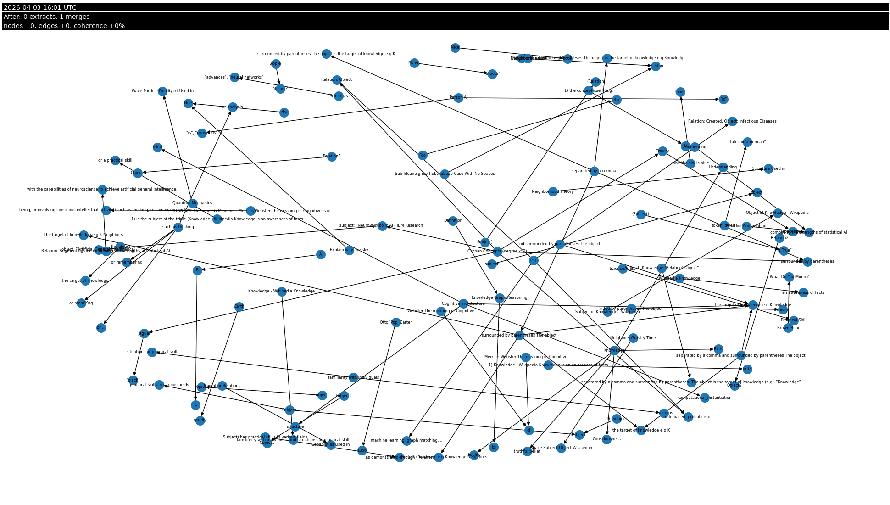](graph-2026-04-03-16-01-extract-subideas.png) [commit](https://github.com/BoggersTheFish/BoggersTheCIG/commit/7225b63)

### 2026-04-03 16:01 UTC

**After:** 2_+2_.md"+eval+obsidian — nodes +0, edges +0, coherence +0%

[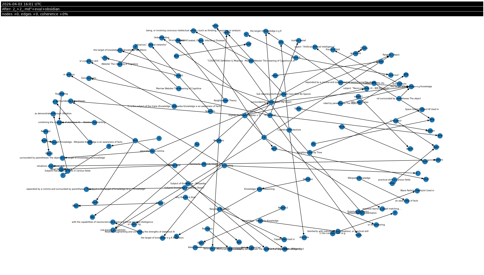](graph-2026-04-03-16-01-self-improve.png) [commit](https://github.com/BoggersTheFish/BoggersTheCIG/commit/7225b63)

### 2026-04-03 20:44 UTC

**After:** external ingest (+2 triples) — nodes +6, edges +3, coherence +199900%

[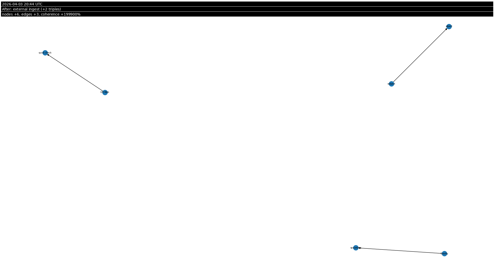](graph-2026-04-03-20-44-after-ingest.png) [commit](https://github.com/BoggersTheFish/BoggersTheCIG/commit/c89e810)

### 2026-04-03 20:44 UTC

**After:** vault analysis (+179 triples) — nodes +131, edges +84, coherence -95%

[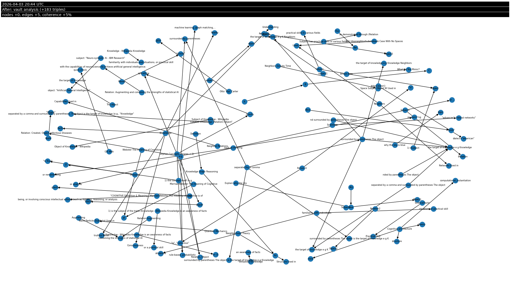](graph-2026-04-03-20-44-after-analyze-vault.png) [commit](https://github.com/BoggersTheFish/BoggersTheCIG/commit/c89e810)

### 2026-04-03 20:44 UTC

**After:** vault analysis (+183 triples) — nodes +0, edges +5, coherence +5%

 [commit](https://github.com/BoggersTheFish/BoggersTheCIG/commit/c89e810)

### 2026-04-03 20:51 UTC

**After:** vault organize (1 moves) — nodes +0, edges +0, coherence +0%

[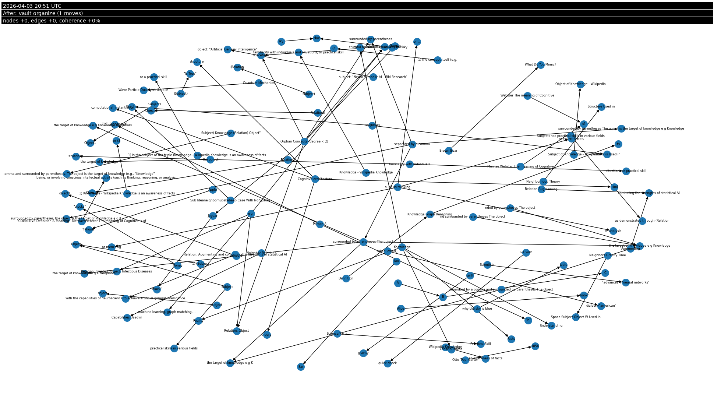](graph-2026-04-03-20-51-after-organize.png) [commit](https://github.com/BoggersTheFish/BoggersTheCIG/commit/c89e810)

### 2026-04-03 20:51 UTC

**After:** 1 extracts, 0 merges — nodes +0, edges +0, coherence +0%

[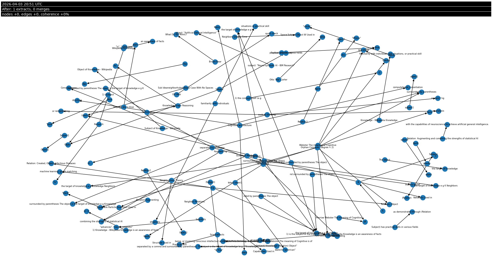](graph-2026-04-03-20-51-extract-subideas.png) [commit](https://github.com/BoggersTheFish/BoggersTheCIG/commit/c89e810)

### 2026-04-03 20:51 UTC

**After:** 2_+2_.md"+Web.md"+check.md"+eval — nodes +0, edges +0, coherence +0%

[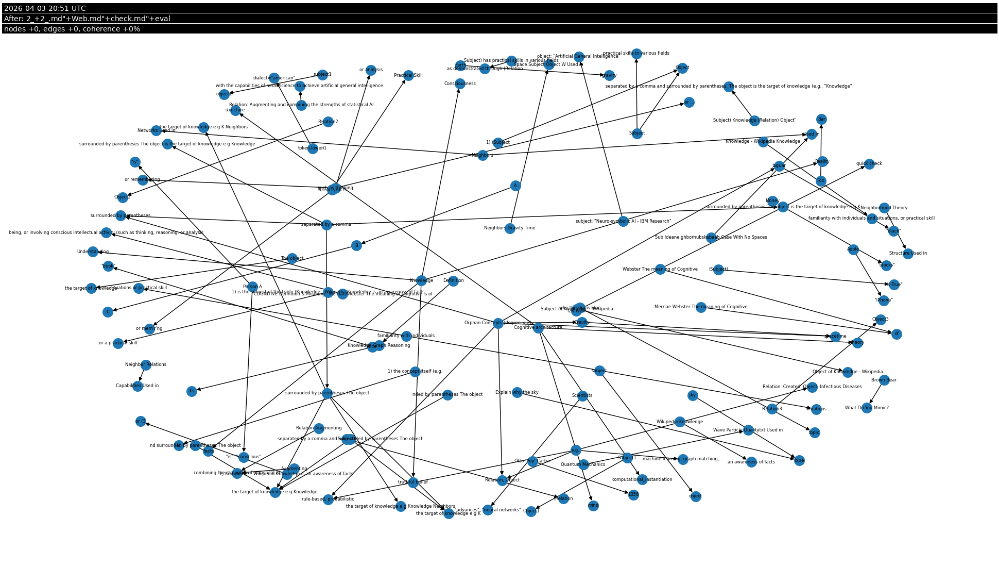](graph-2026-04-03-20-51-self-improve.png) [commit](https://github.com/BoggersTheFish/BoggersTheCIG/commit/c89e810)

### 2026-04-03 20:58 UTC

**After:** vault organize (0 moves) — nodes +0, edges +0, coherence +0%

[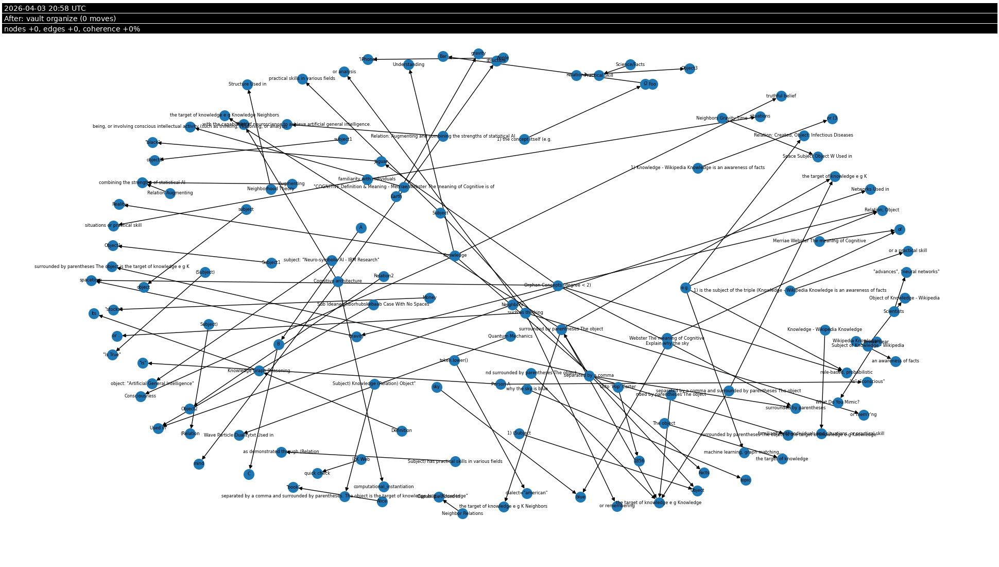](graph-2026-04-03-20-58-after-organize.png) [commit](https://github.com/BoggersTheFish/BoggersTheCIG/commit/c89e810)

### 2026-04-03 20:58 UTC

**After:** 0 extracts, 1 merges — nodes +0, edges +0, coherence +0%

[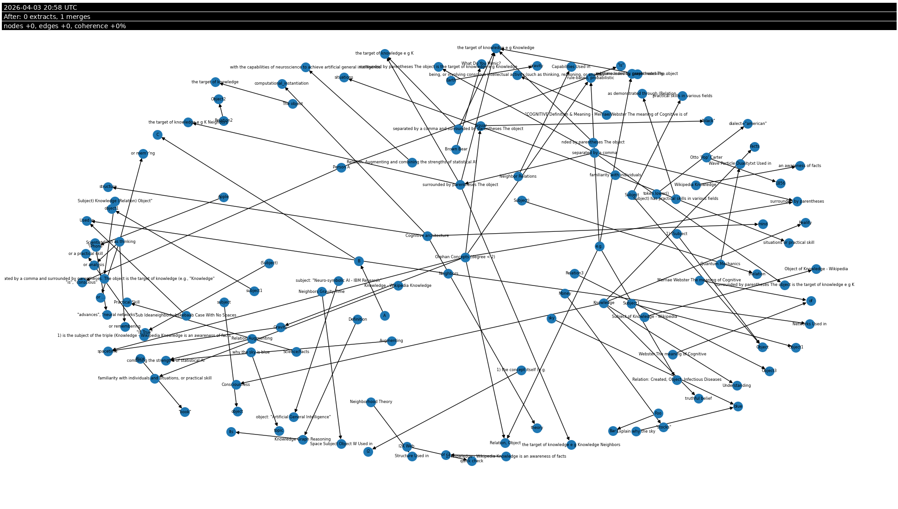](graph-2026-04-03-20-58-extract-subideas.png) [commit](https://github.com/BoggersTheFish/BoggersTheCIG/commit/c89e810)

### 2026-04-03 20:58 UTC

**After:** 2_+2_.md"+Web.md"+check.md"+eval — nodes +0, edges +0, coherence +0%

[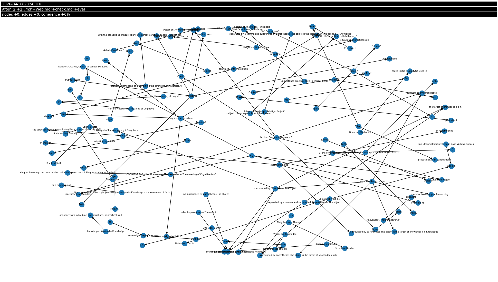](graph-2026-04-03-20-58-self-improve.png) [commit](https://github.com/BoggersTheFish/BoggersTheCIG/commit/c89e810)

### 2026-04-04 02:12 UTC

**After:** vault analysis (+176 triples) — nodes +136, edges +86, coherence +9268%

[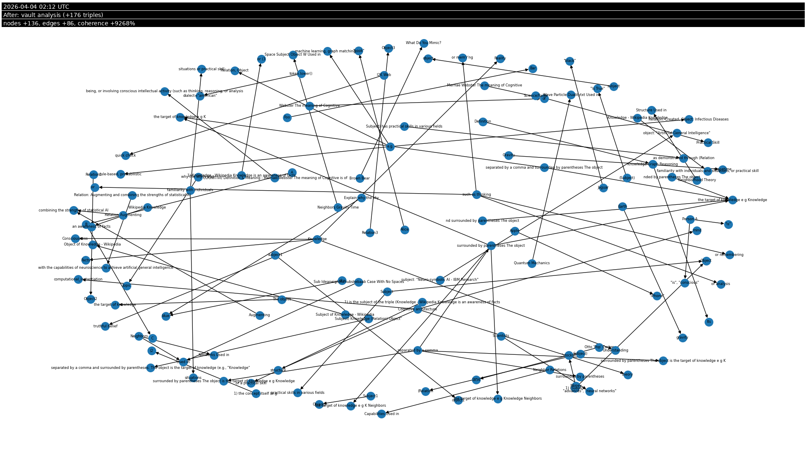](graph-2026-04-04-02-12-after-analyze-vault.png) [commit](https://github.com/BoggersTheFish/BoggersTheCIG/commit/55894c0)

### 2026-04-04 02:13 UTC

**After:** 1 extracts, 0 merges — nodes +0, edges +0, coherence +0%

[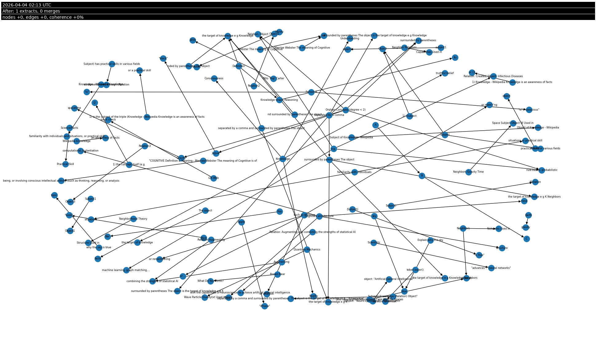](graph-2026-04-04-02-13-extract-subideas.png) [commit](https://github.com/BoggersTheFish/BoggersTheCIG/commit/55894c0)

### 2026-04-04 02:13 UTC

**After:** vault analysis (+181 triples) — nodes +1, edges +5, coherence +4%

[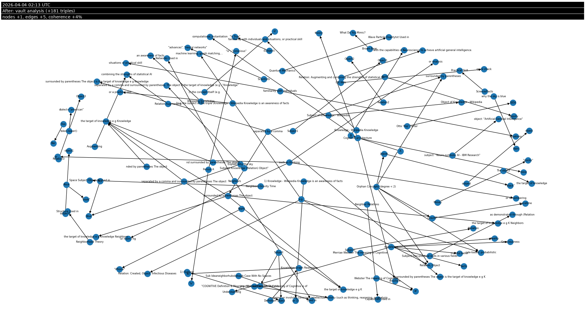](graph-2026-04-04-02-13-after-analyze-vault.png) [commit](https://github.com/BoggersTheFish/BoggersTheCIG/commit/55894c0)

### 2026-04-04 02:13 UTC

**After:** 1 extracts, 0 merges — nodes +0, edges +0, coherence +0%

 [commit](https://github.com/BoggersTheFish/BoggersTheCIG/commit/55894c0)

### 2026-04-04 02:19 UTC

**After:** vault organize (1 moves) — nodes +0, edges +0, coherence +0%

[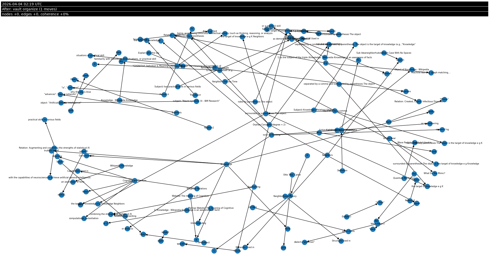](graph-2026-04-04-02-19-after-organize.png) [commit](https://github.com/BoggersTheFish/BoggersTheCIG/commit/55894c0)

### 2026-04-04 02:19 UTC

**After:** 0 extracts, 1 merges — nodes +0, edges +0, coherence +0%

[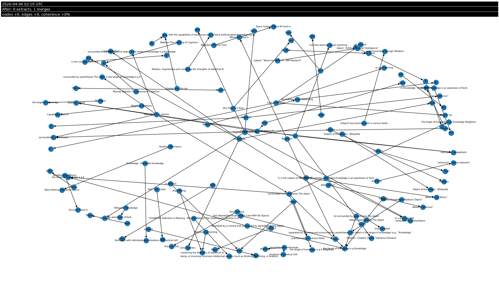](graph-2026-04-04-02-19-extract-subideas.png) [commit](https://github.com/BoggersTheFish/BoggersTheCIG/commit/55894c0)

### 2026-04-04 02:19 UTC

**After:** 2_+2_.md"+Web.md"+check.md"+eval — nodes +0, edges +0, coherence +0%

[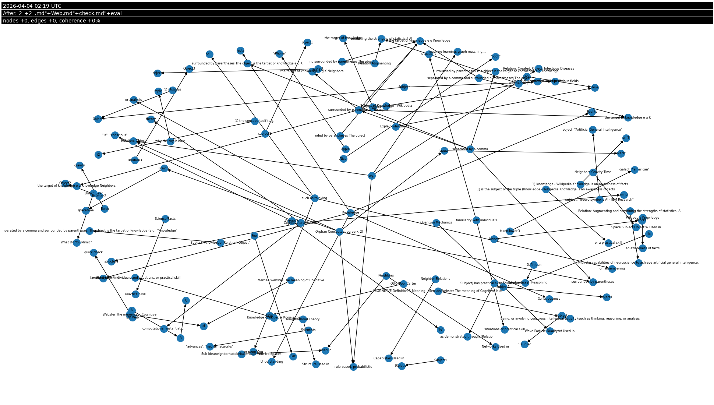](graph-2026-04-04-02-19-self-improve.png) [commit](https://github.com/BoggersTheFish/BoggersTheCIG/commit/55894c0)

### 2026-04-04 02:24 UTC

**After:** vault organize (2 moves) — nodes +0, edges +0, coherence +0%

[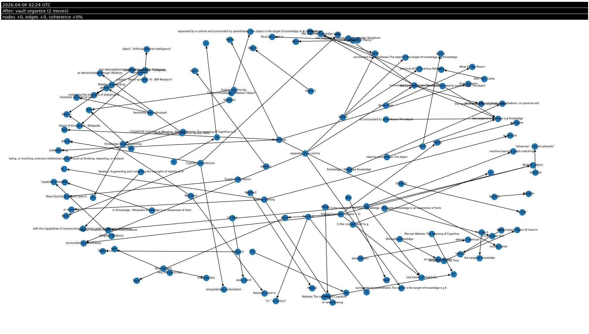](graph-2026-04-04-02-24-after-organize.png) [commit](https://github.com/BoggersTheFish/BoggersTheCIG/commit/55894c0)

### 2026-04-04 02:24 UTC

**After:** 0 extracts, 1 merges — nodes +0, edges +0, coherence +0%

[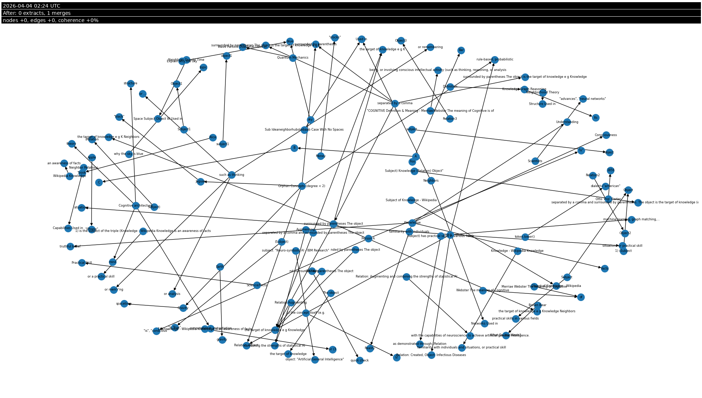](graph-2026-04-04-02-24-extract-subideas.png) [commit](https://github.com/BoggersTheFish/BoggersTheCIG/commit/55894c0)

### 2026-04-04 02:24 UTC

**After:** 2_+2_.md"+Web.md"+_e_g_.md"+check.md" — nodes +0, edges +0, coherence +0%

[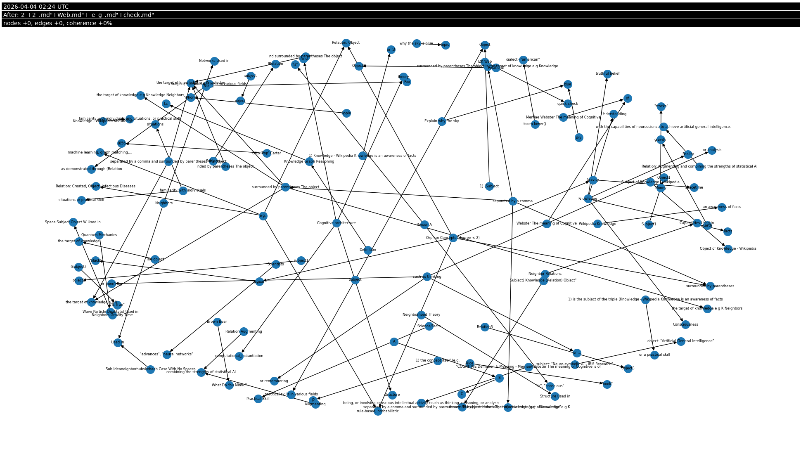](graph-2026-04-04-02-24-self-improve.png) [commit](https://github.com/BoggersTheFish/BoggersTheCIG/commit/55894c0)

### 2026-04-04 06:05 UTC

**After:** external ingest (+1 triples) — nodes +4, edges +2, coherence +333233%

[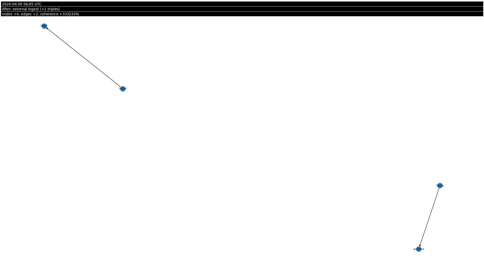](graph-2026-04-04-06-05-after-ingest.png) [commit](https://github.com/BoggersTheFish/BoggersTheCIG/commit/ad32540)

### 2026-04-04 06:05 UTC

**After:** vault analysis (+177 triples) — nodes +133, edges +85, coherence -97%

[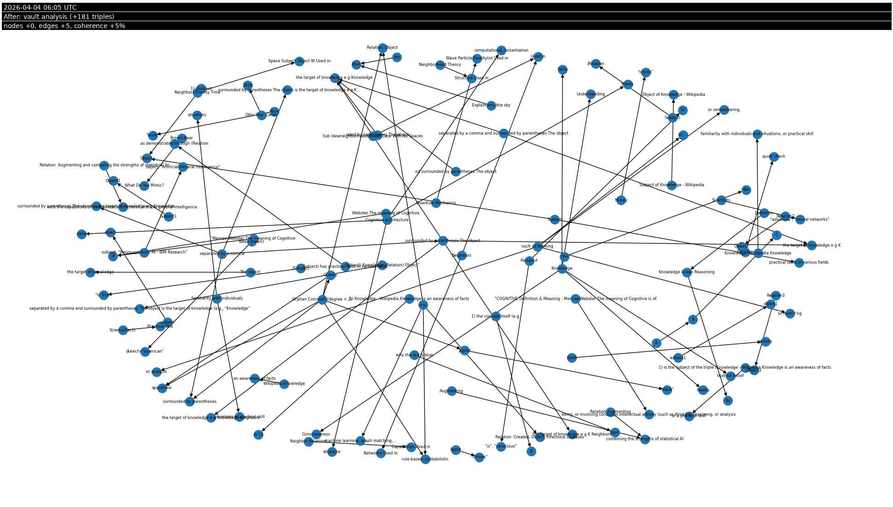](graph-2026-04-04-06-05-after-analyze-vault.png) [commit](https://github.com/BoggersTheFish/BoggersTheCIG/commit/ad32540)

### 2026-04-04 06:05 UTC

**After:** vault analysis (+181 triples) — nodes +0, edges +5, coherence +5%

 [commit](https://github.com/BoggersTheFish/BoggersTheCIG/commit/ad32540)

### 2026-04-04 06:11 UTC

**After:** vault organize (1 moves) — nodes +0, edges +0, coherence +0%

[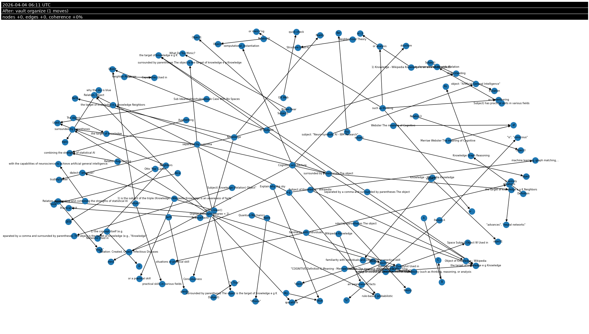](graph-2026-04-04-06-11-after-organize.png) [commit](https://github.com/BoggersTheFish/BoggersTheCIG/commit/ad32540)

### 2026-04-04 06:11 UTC

**After:** 1 extracts, 0 merges — nodes +0, edges +0, coherence +0%

[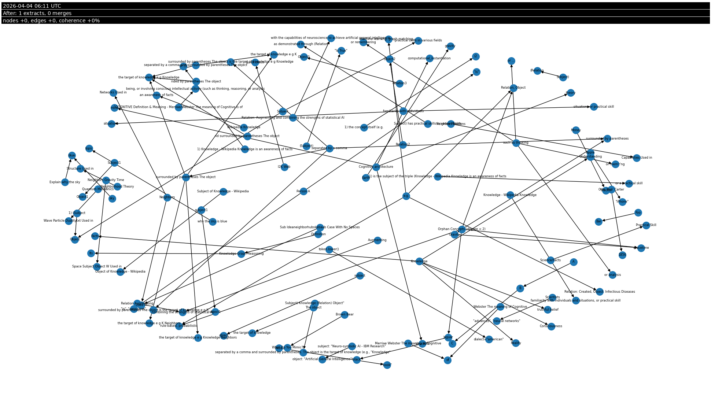](graph-2026-04-04-06-11-extract-subideas.png) [commit](https://github.com/BoggersTheFish/BoggersTheCIG/commit/ad32540)

### 2026-04-04 06:11 UTC

**After:** 2_+2_.md"+Mimic_.md"+check.md"+eval — nodes +0, edges +0, coherence +0%

[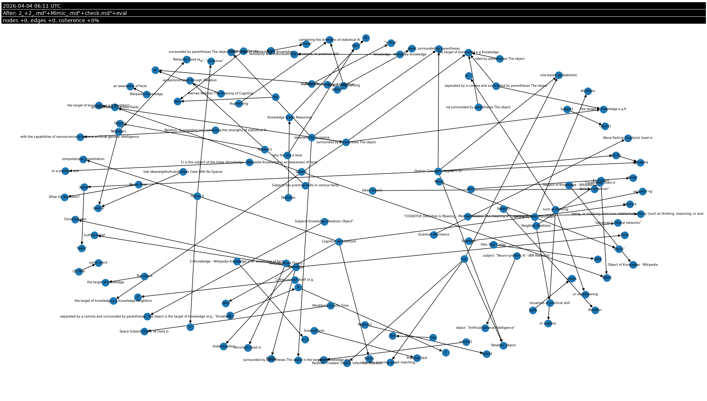](graph-2026-04-04-06-11-self-improve.png) [commit](https://github.com/BoggersTheFish/BoggersTheCIG/commit/ad32540)

### 2026-04-04 06:17 UTC

**After:** vault organize (0 moves) — nodes +0, edges +0, coherence +0%

[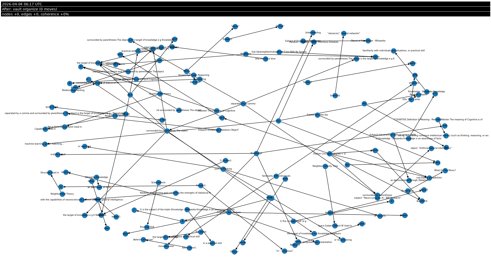](graph-2026-04-04-06-17-after-organize.png) [commit](https://github.com/BoggersTheFish/BoggersTheCIG/commit/ad32540)

### 2026-04-04 06:17 UTC

**After:** 0 extracts, 1 merges — nodes +0, edges +0, coherence +0%

[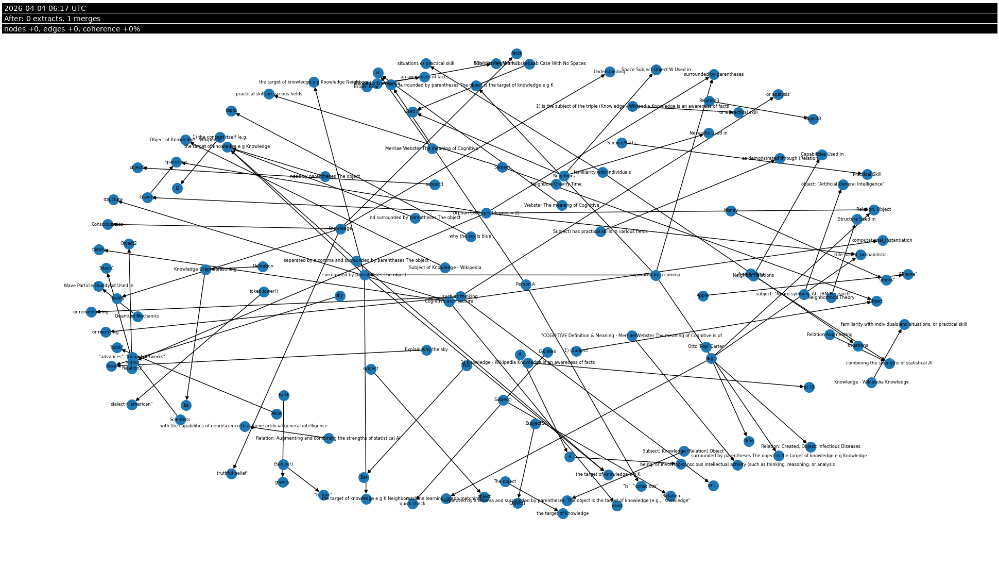](graph-2026-04-04-06-17-extract-subideas.png) [commit](https://github.com/BoggersTheFish/BoggersTheCIG/commit/ad32540)

### 2026-04-04 06:17 UTC

**After:** 2_+2_.md"+Mimic_.md"+check.md"+eval — nodes +0, edges +0, coherence +0%

[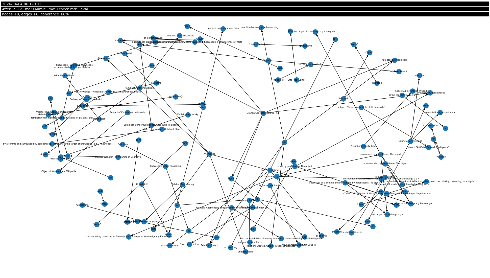](graph-2026-04-04-06-17-self-improve.png) [commit](https://github.com/BoggersTheFish/BoggersTheCIG/commit/ad32540)

### 2026-04-04 10:41 UTC

**After:** vault analysis (+176 triples) — nodes +136, edges +86, coherence +9268%

[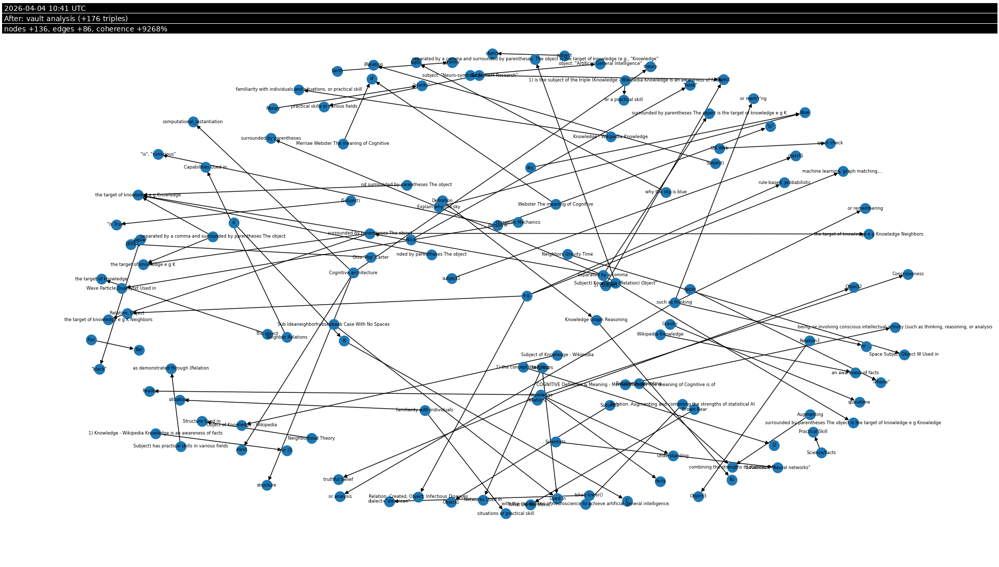](graph-2026-04-04-10-41-after-analyze-vault.png) [commit](https://github.com/BoggersTheFish/BoggersTheCIG/commit/fff89ed)

### 2026-04-04 10:41 UTC

**After:** 1 extracts, 0 merges — nodes +0, edges +0, coherence +0%

[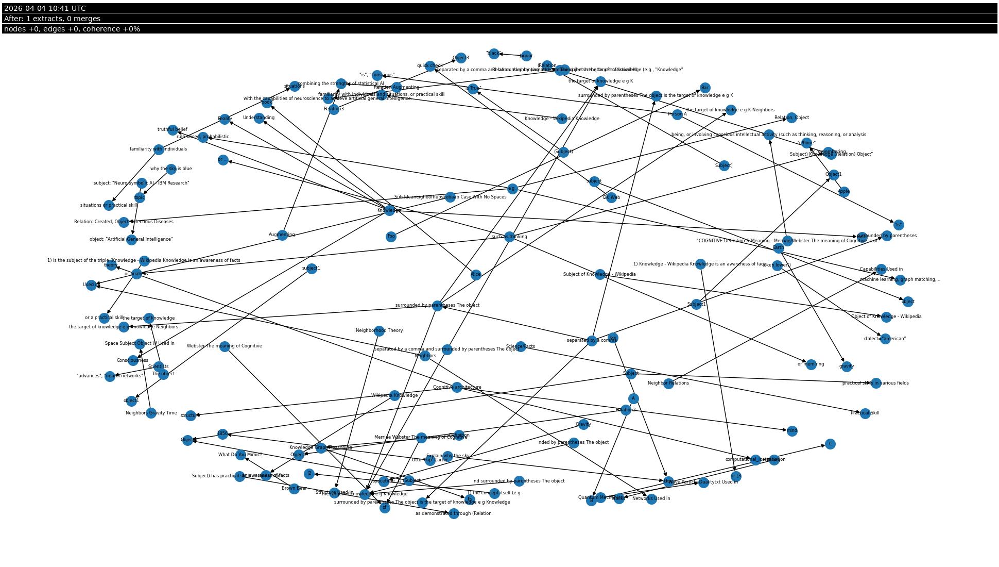](graph-2026-04-04-10-41-extract-subideas.png) [commit](https://github.com/BoggersTheFish/BoggersTheCIG/commit/fff89ed)

### 2026-04-04 10:42 UTC

**After:** vault analysis (+181 triples) — nodes +1, edges +5, coherence +4%

[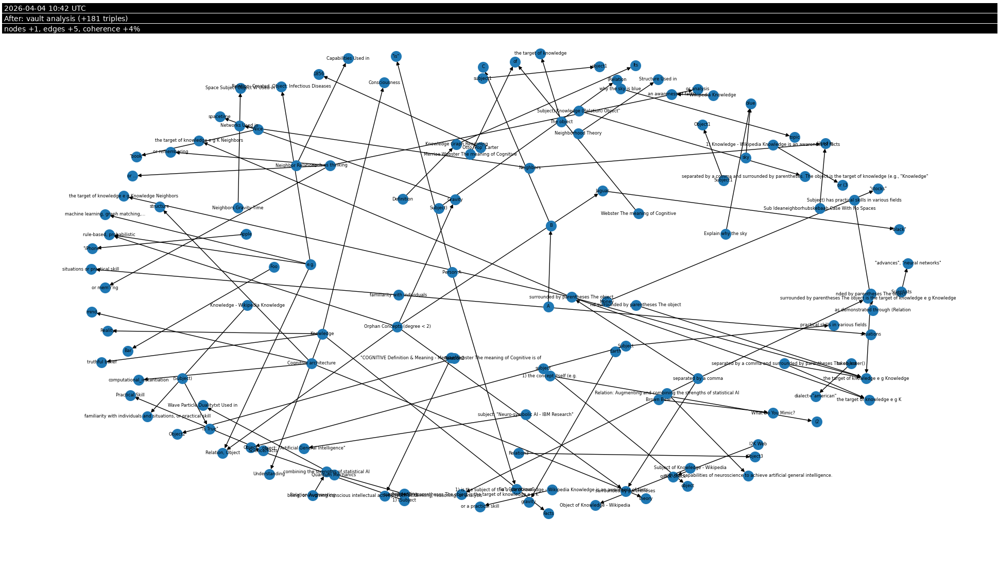](graph-2026-04-04-10-42-after-analyze-vault.png) [commit](https://github.com/BoggersTheFish/BoggersTheCIG/commit/fff89ed)

### 2026-04-04 10:42 UTC

**After:** 1 extracts, 0 merges — nodes +0, edges +0, coherence +0%

[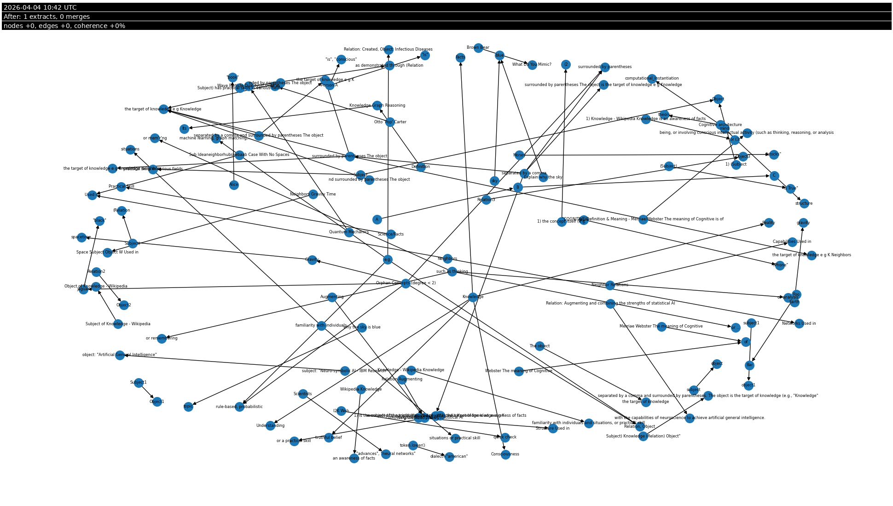](graph-2026-04-04-10-42-extract-subideas.png) [commit](https://github.com/BoggersTheFish/BoggersTheCIG/commit/fff89ed)

### 2026-04-04 10:48 UTC

**After:** vault organize (0 moves) — nodes +0, edges +0, coherence +0%

[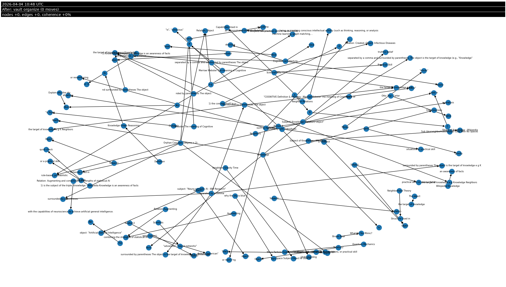](graph-2026-04-04-10-48-after-organize.png) [commit](https://github.com/BoggersTheFish/BoggersTheCIG/commit/fff89ed)

### 2026-04-04 10:48 UTC

**After:** 0 extracts, 1 merges — nodes +0, edges +0, coherence +0%

[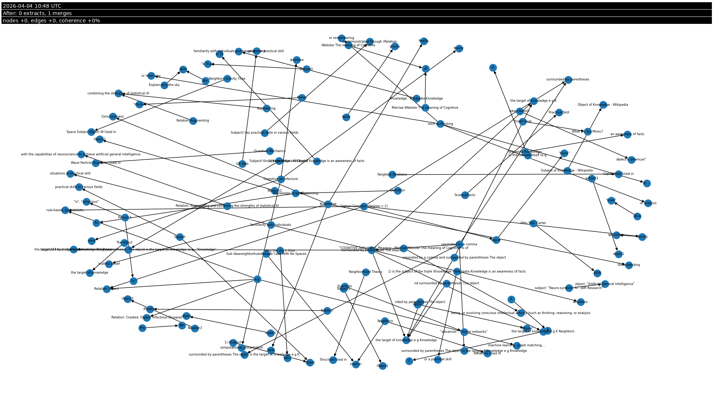](graph-2026-04-04-10-48-extract-subideas.png) [commit](https://github.com/BoggersTheFish/BoggersTheCIG/commit/fff89ed)

### 2026-04-04 10:48 UTC

**After:** 2_+2_.md"+eval+obsidian — nodes +0, edges +0, coherence +0%

[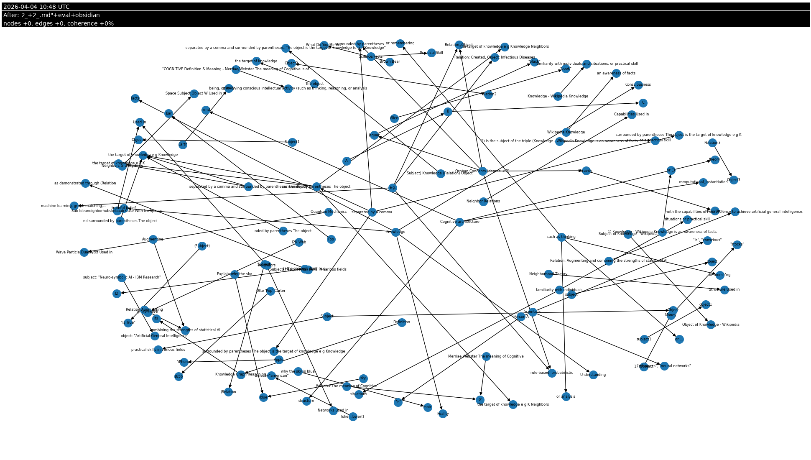](graph-2026-04-04-10-48-self-improve.png) [commit](https://github.com/BoggersTheFish/BoggersTheCIG/commit/fff89ed)

### 2026-04-04 10:53 UTC

**After:** vault organize (0 moves) — nodes +0, edges +0, coherence +0%

[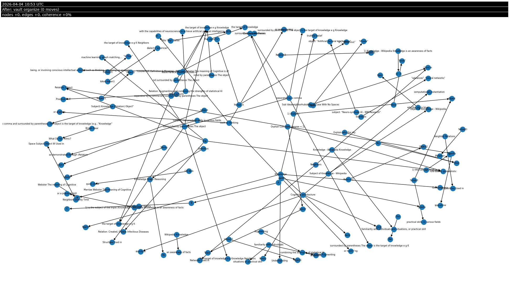](graph-2026-04-04-10-53-after-organize.png) [commit](https://github.com/BoggersTheFish/BoggersTheCIG/commit/fff89ed)

### 2026-04-04 10:53 UTC

**After:** 1 extracts, 0 merges — nodes +0, edges +0, coherence +0%

[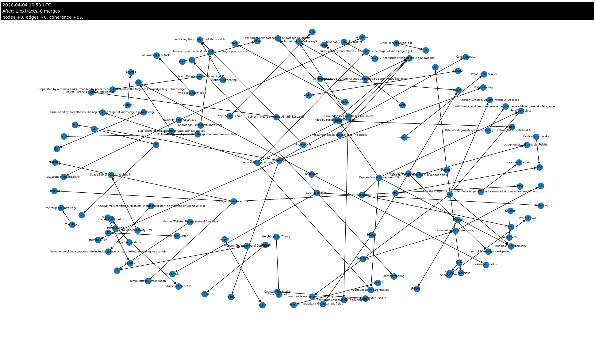](graph-2026-04-04-10-53-extract-subideas.png) [commit](https://github.com/BoggersTheFish/BoggersTheCIG/commit/fff89ed)

### 2026-04-04 10:53 UTC

**After:** 2_+2_.md"+eval+obsidian — nodes +0, edges +0, coherence +0%

[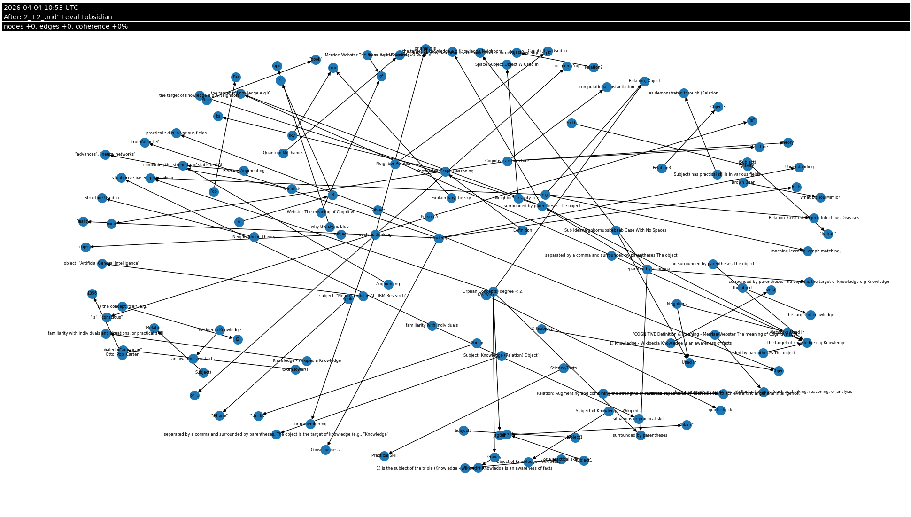](graph-2026-04-04-10-53-self-improve.png) [commit](https://github.com/BoggersTheFish/BoggersTheCIG/commit/fff89ed)

### 2026-04-04 15:39 UTC

**After:** external ingest (+1 triples) — nodes +4, edges +2, coherence +333233%

[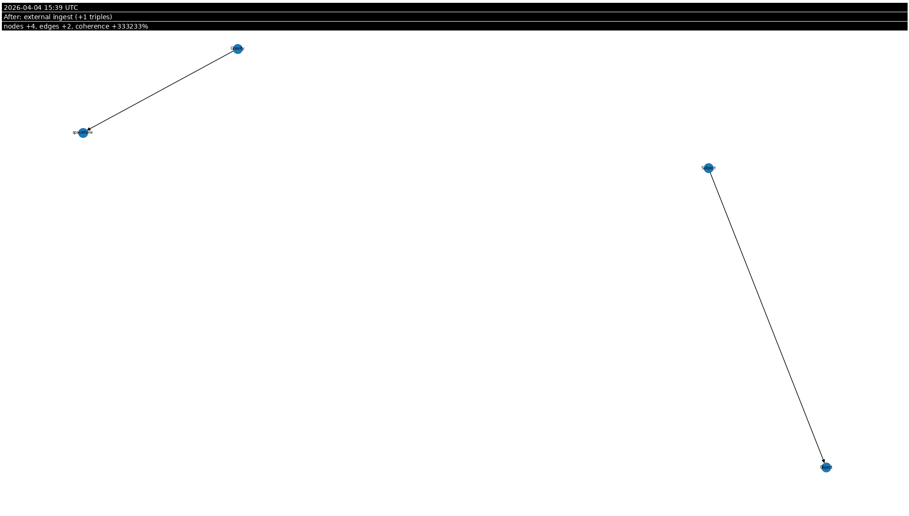](graph-2026-04-04-15-39-after-ingest.png) [commit](https://github.com/BoggersTheFish/BoggersTheCIG/commit/b1e6df7)

### 2026-04-04 15:39 UTC

**After:** vault analysis (+177 triples) — nodes +133, edges +85, coherence -97%

[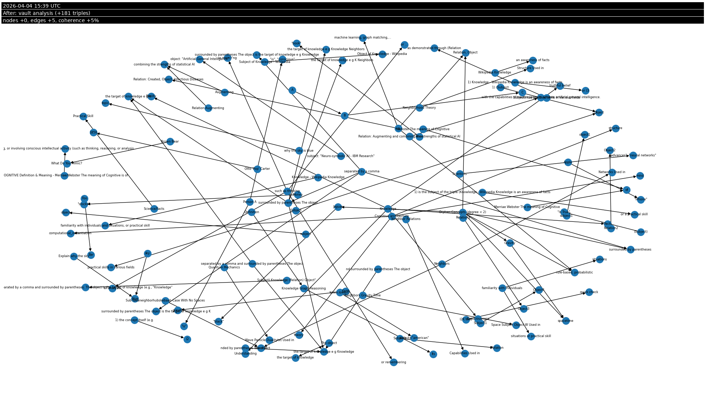](graph-2026-04-04-15-39-after-analyze-vault.png) [commit](https://github.com/BoggersTheFish/BoggersTheCIG/commit/b1e6df7)

### 2026-04-04 15:39 UTC

**After:** vault analysis (+181 triples) — nodes +0, edges +5, coherence +5%

 [commit](https://github.com/BoggersTheFish/BoggersTheCIG/commit/b1e6df7)

### 2026-04-04 15:45 UTC

**After:** vault organize (0 moves) — nodes +0, edges +0, coherence +0%

[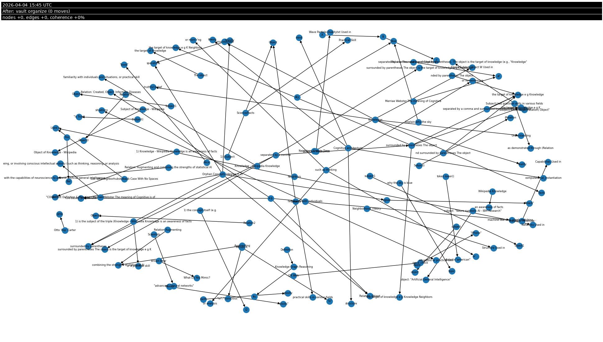](graph-2026-04-04-15-45-after-organize.png) [commit](https://github.com/BoggersTheFish/BoggersTheCIG/commit/b1e6df7)

### 2026-04-04 15:45 UTC

**After:** 1 extracts, 0 merges — nodes +0, edges +0, coherence +0%

[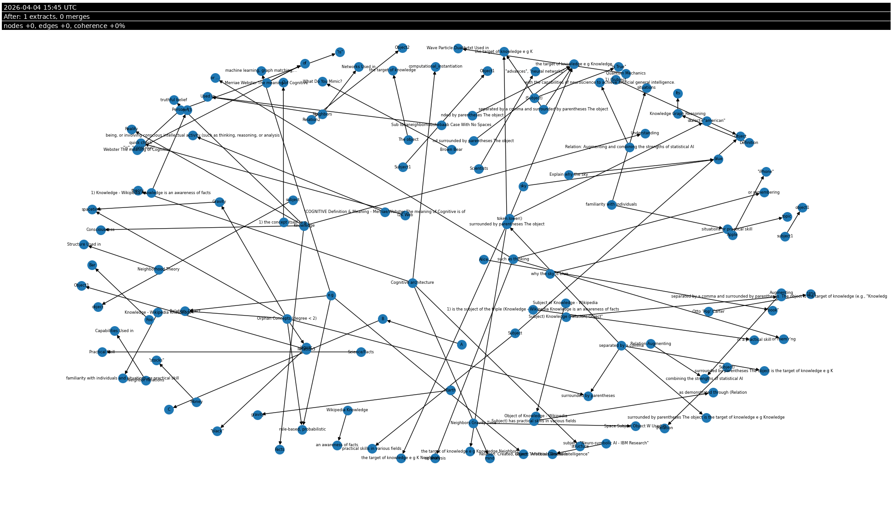](graph-2026-04-04-15-45-extract-subideas.png) [commit](https://github.com/BoggersTheFish/BoggersTheCIG/commit/b1e6df7)

### 2026-04-04 15:45 UTC

**After:** 2_+2_.md"+eval+obsidian — nodes +0, edges +0, coherence +0%

[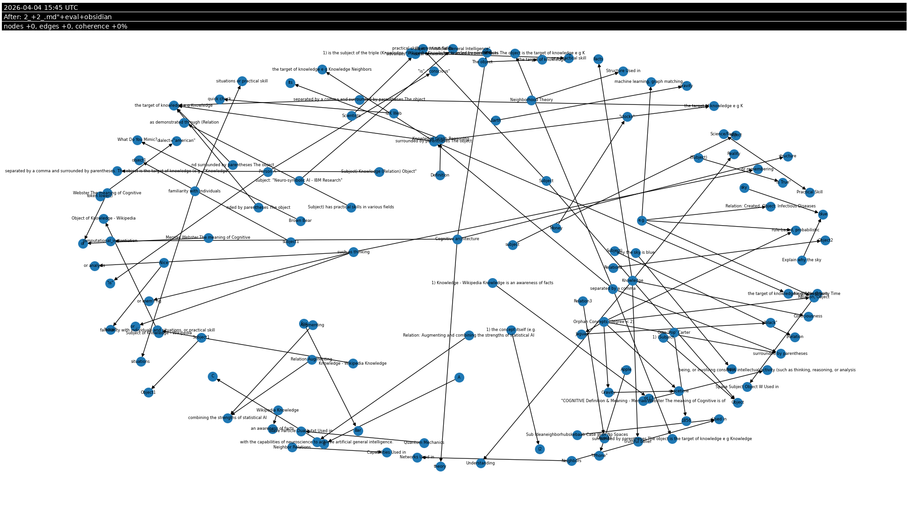](graph-2026-04-04-15-45-self-improve.png) [commit](https://github.com/BoggersTheFish/BoggersTheCIG/commit/b1e6df7)

### 2026-04-04 15:52 UTC

**After:** vault organize (0 moves) — nodes +0, edges +0, coherence +0%

[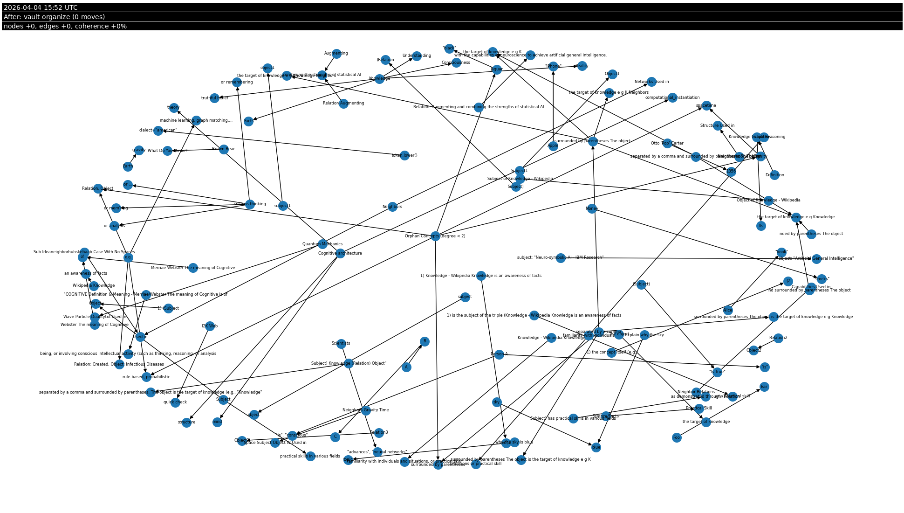](graph-2026-04-04-15-52-after-organize.png) [commit](https://github.com/BoggersTheFish/BoggersTheCIG/commit/b1e6df7)

### 2026-04-04 15:52 UTC

**After:** 0 extracts, 1 merges — nodes +0, edges +0, coherence +0%

[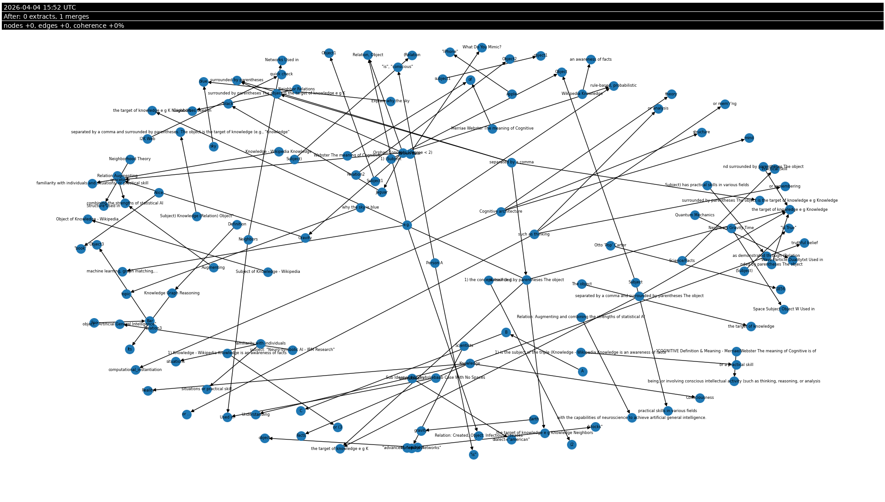](graph-2026-04-04-15-52-extract-subideas.png) [commit](https://github.com/BoggersTheFish/BoggersTheCIG/commit/b1e6df7)

### 2026-04-04 15:52 UTC

**After:** 2_+2_.md"+obsidian — nodes +0, edges +0, coherence +0%

[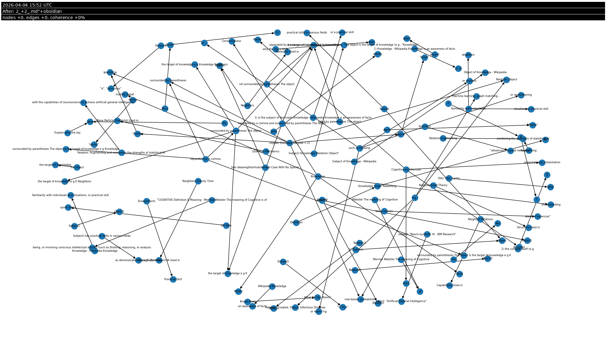](graph-2026-04-04-15-52-self-improve.png) [commit](https://github.com/BoggersTheFish/BoggersTheCIG/commit/b1e6df7)

### 2026-04-04 20:39 UTC

**After:** vault analysis (+176 triples) — nodes +136, edges +86, coherence +9268%

[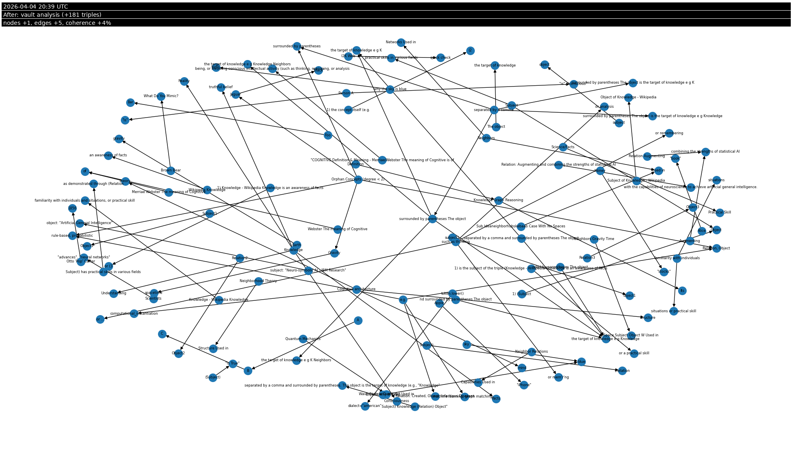](graph-2026-04-04-20-39-after-analyze-vault.png) [commit](https://github.com/BoggersTheFish/BoggersTheCIG/commit/312a524)

### 2026-04-04 20:39 UTC

**After:** 1 extracts, 0 merges — nodes +0, edges +0, coherence +0%

[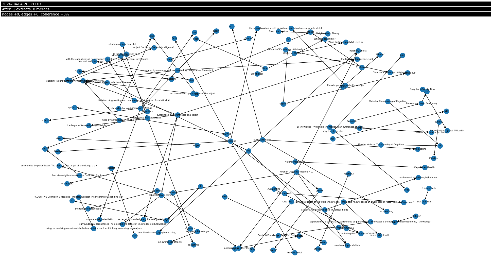](graph-2026-04-04-20-39-extract-subideas.png) [commit](https://github.com/BoggersTheFish/BoggersTheCIG/commit/312a524)

### 2026-04-04 20:39 UTC

**After:** vault analysis (+181 triples) — nodes +1, edges +5, coherence +4%

 [commit](https://github.com/BoggersTheFish/BoggersTheCIG/commit/312a524)

### 2026-04-04 20:39 UTC

**After:** 1 extracts, 0 merges — nodes +0, edges +0, coherence +0%

 [commit](https://github.com/BoggersTheFish/BoggersTheCIG/commit/312a524)

### 2026-04-04 20:45 UTC

**After:** vault organize (0 moves) — nodes +0, edges +0, coherence +0%

[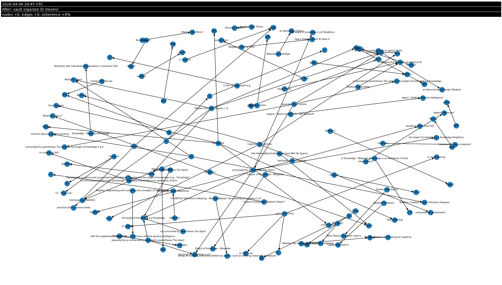](graph-2026-04-04-20-45-after-organize.png) [commit](https://github.com/BoggersTheFish/BoggersTheCIG/commit/312a524)

### 2026-04-04 20:45 UTC

**After:** 0 extracts, 1 merges — nodes +0, edges +0, coherence +0%

[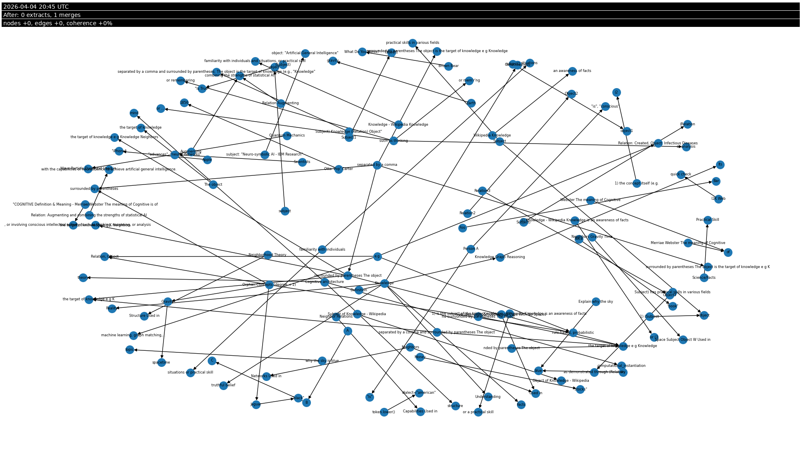](graph-2026-04-04-20-45-extract-subideas.png) [commit](https://github.com/BoggersTheFish/BoggersTheCIG/commit/312a524)

### 2026-04-04 20:46 UTC

**After:** 2_+2_.md"+eval+obsidian — nodes +0, edges +0, coherence +0%

[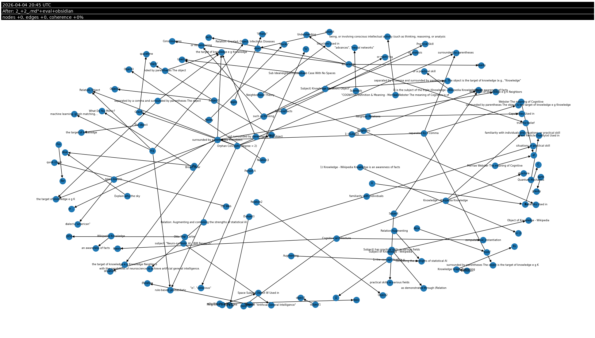](graph-2026-04-04-20-45-self-improve.png) [commit](https://github.com/BoggersTheFish/BoggersTheCIG/commit/312a524)

### 2026-04-04 20:52 UTC

**After:** vault organize (2 moves) — nodes +0, edges +0, coherence +0%

[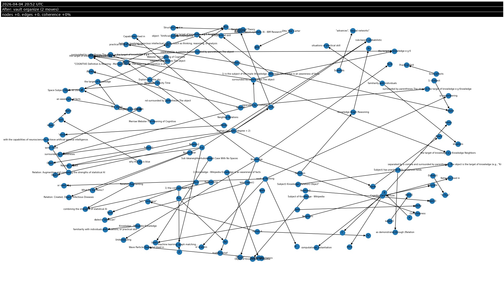](graph-2026-04-04-20-52-after-organize.png) [commit](https://github.com/BoggersTheFish/BoggersTheCIG/commit/312a524)

### 2026-04-04 20:52 UTC

**After:** 1 extracts, 0 merges — nodes +0, edges +0, coherence +0%

[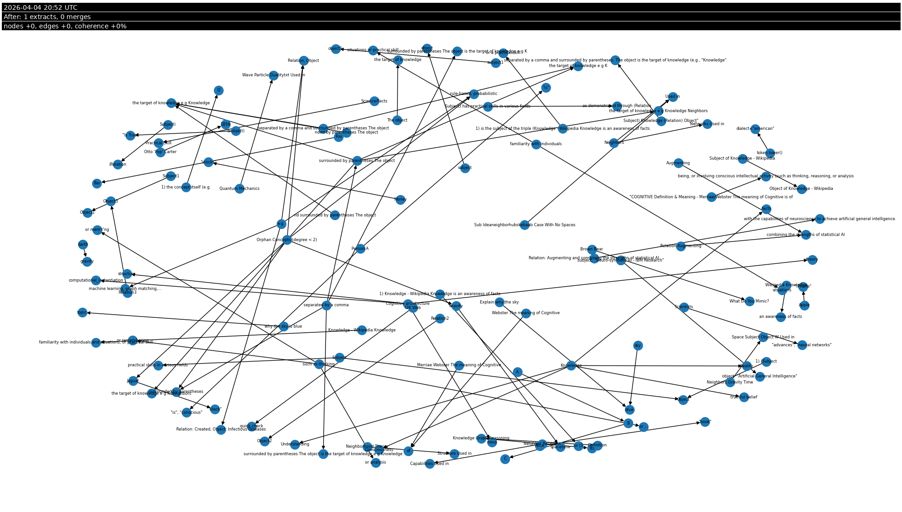](graph-2026-04-04-20-52-extract-subideas.png) [commit](https://github.com/BoggersTheFish/BoggersTheCIG/commit/312a524)

### 2026-04-04 20:52 UTC

**After:** 2_+2_.md"+Neighbors.md"+analysis.md"+obsidian — nodes +0, edges +0, coherence +0%

[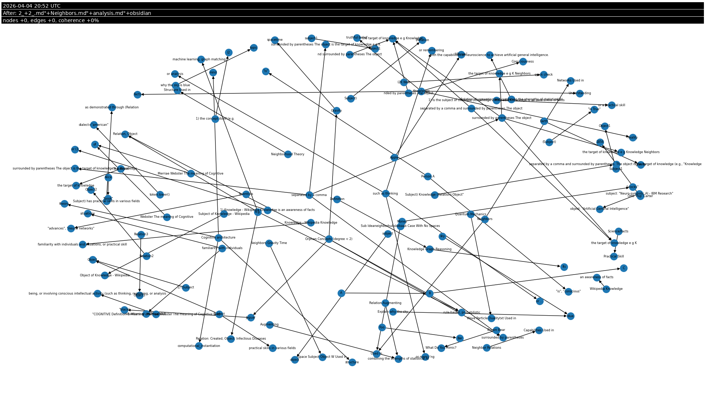](graph-2026-04-04-20-52-self-improve.png) [commit](https://github.com/BoggersTheFish/BoggersTheCIG/commit/312a524)

### 2026-04-05 02:34 UTC

**After:** vault analysis (+176 triples) — nodes +136, edges +86, coherence +9268%

[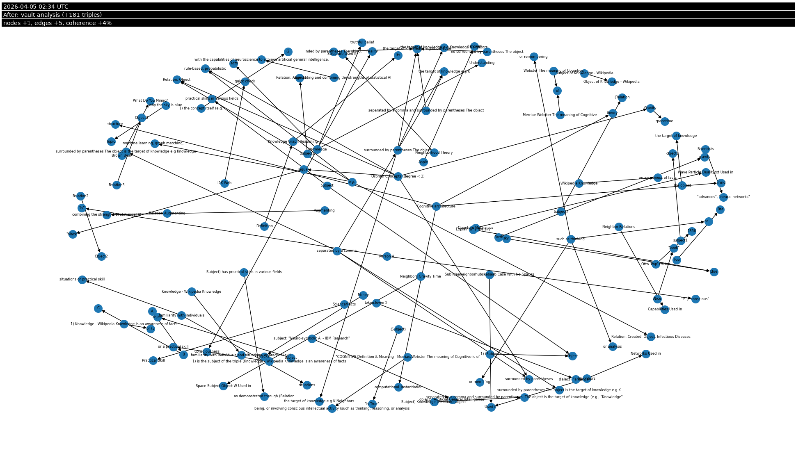](graph-2026-04-05-02-34-after-analyze-vault.png) [commit](https://github.com/BoggersTheFish/BoggersTheCIG/commit/84ac643)

### 2026-04-05 02:34 UTC

**After:** vault analysis (+181 triples) — nodes +1, edges +5, coherence +4%

 [commit](https://github.com/BoggersTheFish/BoggersTheCIG/commit/84ac643)

### 2026-04-05 02:40 UTC

**After:** vault organize (0 moves) — nodes +0, edges +0, coherence +0%

[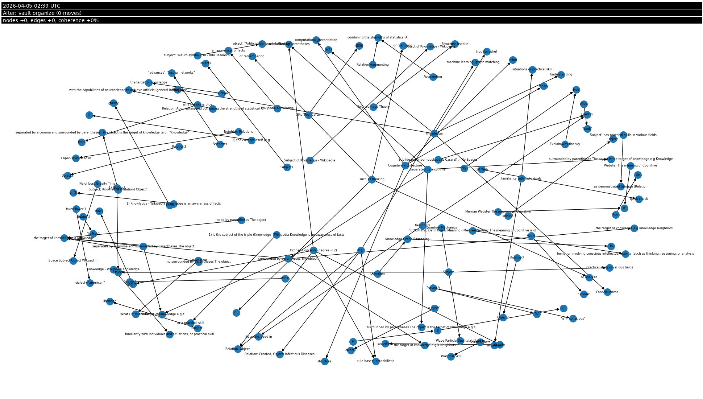](graph-2026-04-05-02-39-after-organize.png) [commit](https://github.com/BoggersTheFish/BoggersTheCIG/commit/84ac643)

### 2026-04-05 02:40 UTC

**After:** 1 extracts, 0 merges — nodes +0, edges +0, coherence +0%

[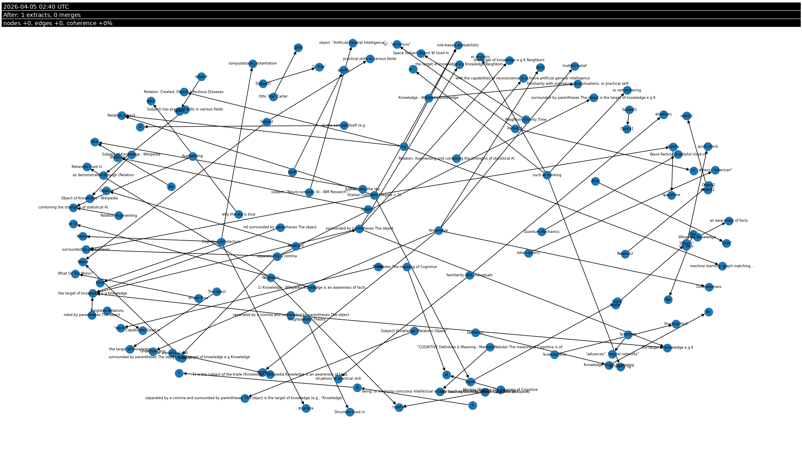](graph-2026-04-05-02-40-extract-subideas.png) [commit](https://github.com/BoggersTheFish/BoggersTheCIG/commit/84ac643)

### 2026-04-05 02:40 UTC

**After:** 2_+2_.md"+eval+obsidian — nodes +0, edges +0, coherence +0%

[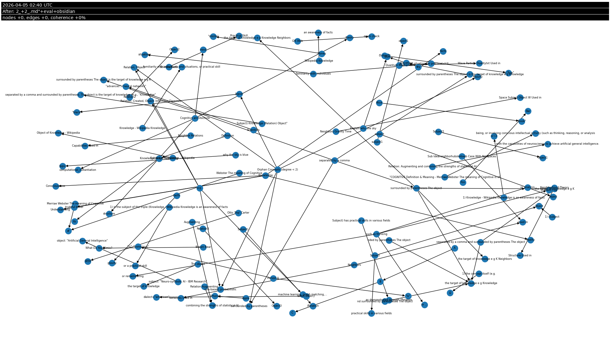](graph-2026-04-05-02-40-self-improve.png) [commit](https://github.com/BoggersTheFish/BoggersTheCIG/commit/84ac643)

### 2026-04-05 02:46 UTC

**After:** vault organize (1 moves) — nodes +0, edges +0, coherence +0%

[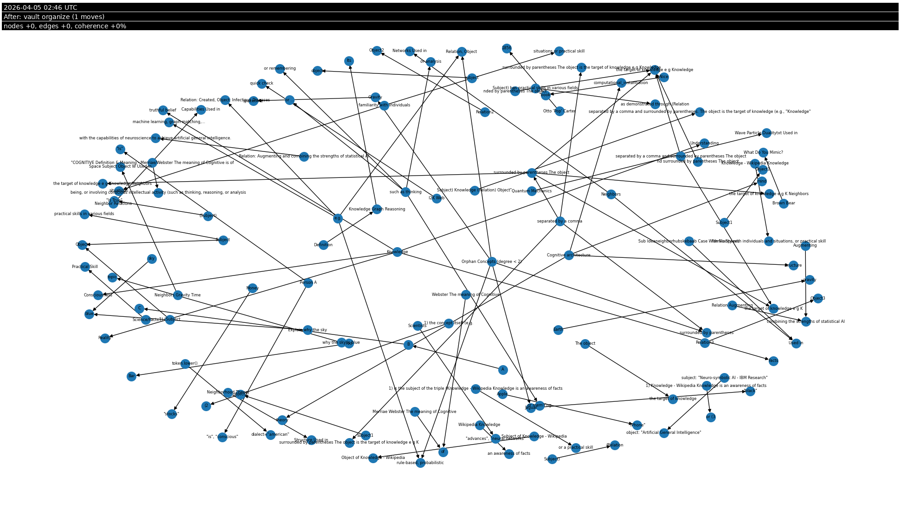](graph-2026-04-05-02-46-after-organize.png) [commit](https://github.com/BoggersTheFish/BoggersTheCIG/commit/84ac643)

### 2026-04-05 02:46 UTC

**After:** 0 extracts, 1 merges — nodes +0, edges +0, coherence +0%

[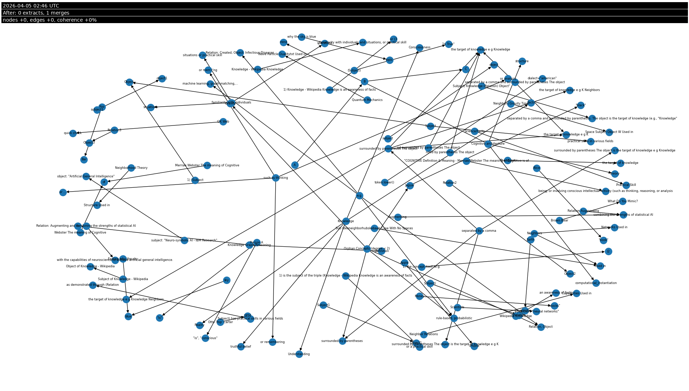](graph-2026-04-05-02-46-extract-subideas.png) [commit](https://github.com/BoggersTheFish/BoggersTheCIG/commit/84ac643)

### 2026-04-05 02:46 UTC

**After:** 2_+2_.md"+A.md"+obsidian — nodes +0, edges +0, coherence +0%

[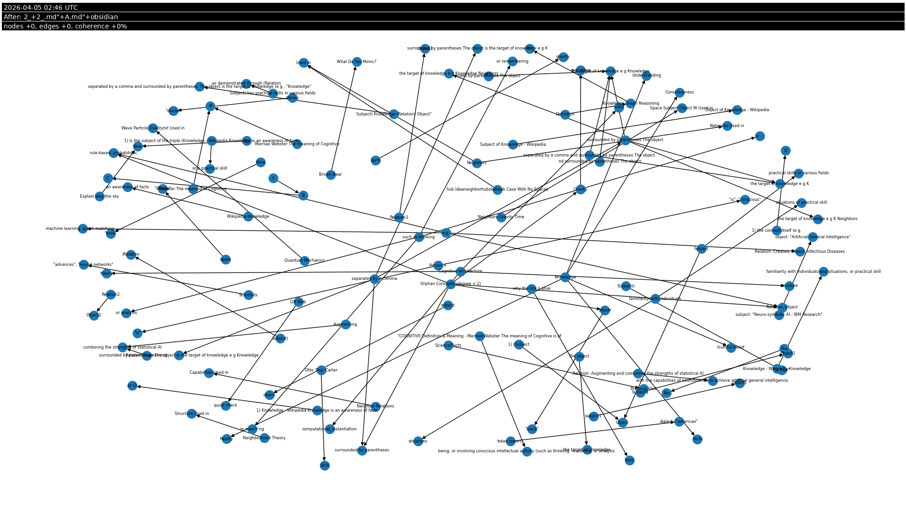](graph-2026-04-05-02-46-self-improve.png) [commit](https://github.com/BoggersTheFish/BoggersTheCIG/commit/84ac643)

### 2026-04-05 06:24 UTC

**After:** external ingest (+3 triples) — nodes +8, edges +4, coherence +142757%

[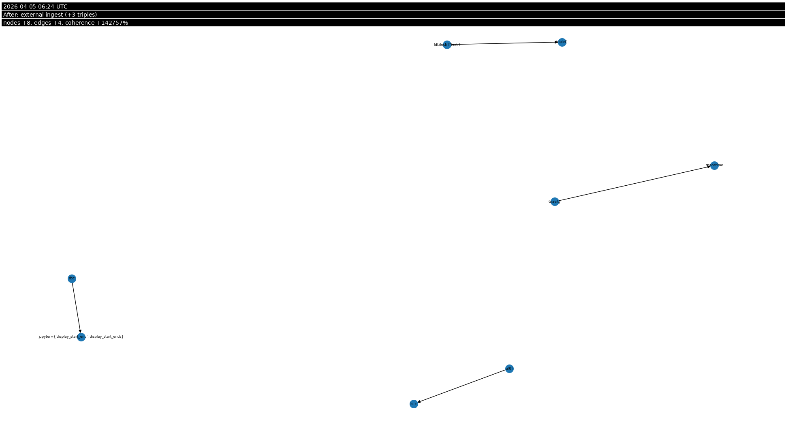](graph-2026-04-05-06-24-after-ingest.png) [commit](https://github.com/BoggersTheFish/BoggersTheCIG/commit/fa8de49)

### 2026-04-05 06:24 UTC

**After:** vault analysis (+174 triples) — nodes +135, edges +86, coherence -93%

[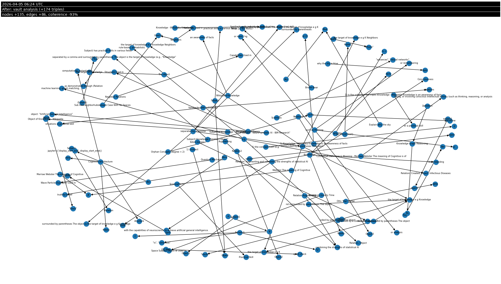](graph-2026-04-05-06-24-after-analyze-vault.png) [commit](https://github.com/BoggersTheFish/BoggersTheCIG/commit/fa8de49)

### 2026-04-05 06:25 UTC

**After:** vault analysis (+177 triples) — nodes +0, edges +4, coherence +4%

[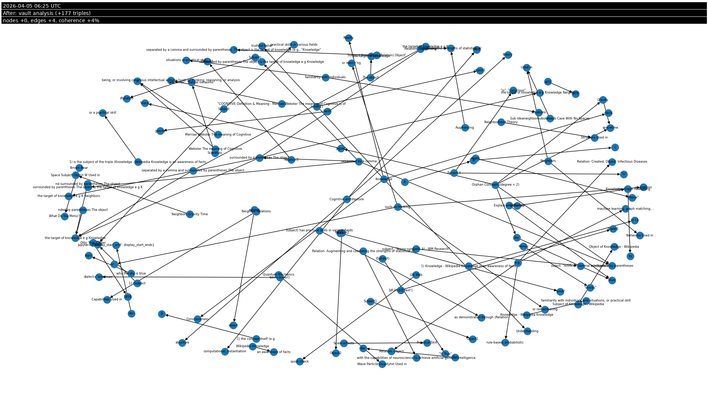](graph-2026-04-05-06-25-after-analyze-vault.png) [commit](https://github.com/BoggersTheFish/BoggersTheCIG/commit/fa8de49)

### 2026-04-05 06:31 UTC

**After:** vault organize (5 moves) — nodes +0, edges +0, coherence +0%

[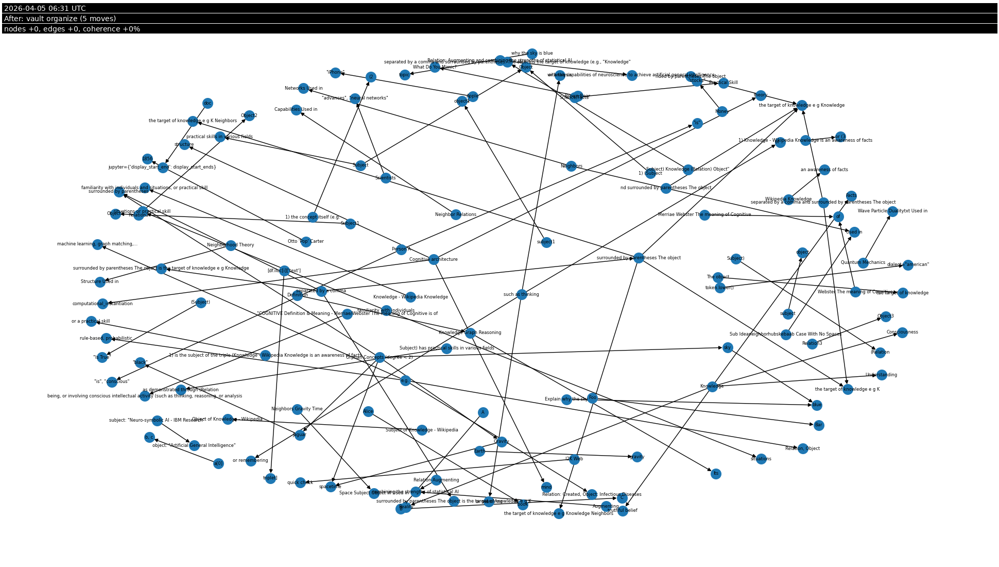](graph-2026-04-05-06-31-after-organize.png) [commit](https://github.com/BoggersTheFish/BoggersTheCIG/commit/fa8de49)

### 2026-04-05 06:31 UTC

**After:** 1 extracts, 0 merges — nodes +0, edges +0, coherence +0%

[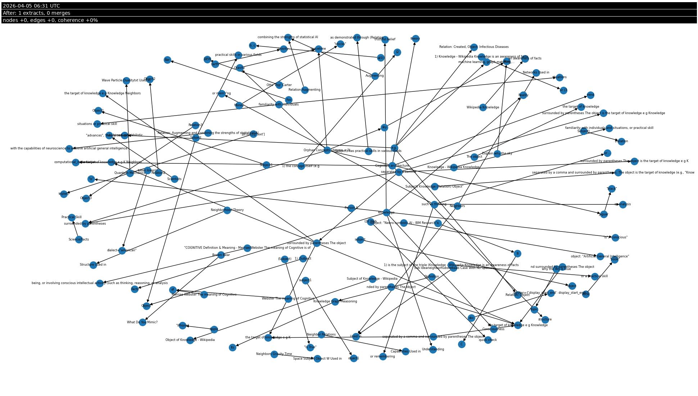](graph-2026-04-05-06-31-extract-subideas.png) [commit](https://github.com/BoggersTheFish/BoggersTheCIG/commit/fa8de49)

### 2026-04-05 06:31 UTC

**After:** 2_+2_.md"+A.md"+c.md"+display_start_ends_.md" — nodes +0, edges +0, coherence +0%

[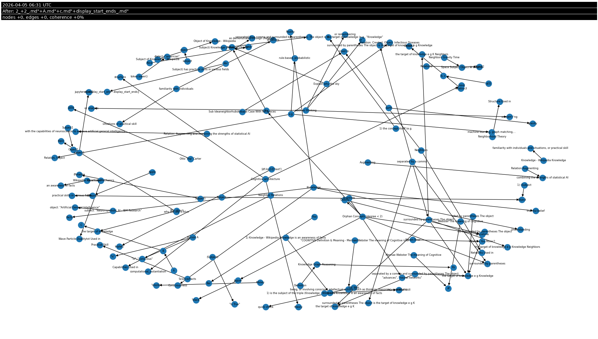](graph-2026-04-05-06-31-self-improve.png) [commit](https://github.com/BoggersTheFish/BoggersTheCIG/commit/fa8de49)

### 2026-04-05 06:37 UTC

**After:** vault organize (1 moves) — nodes +0, edges +0, coherence +0%

[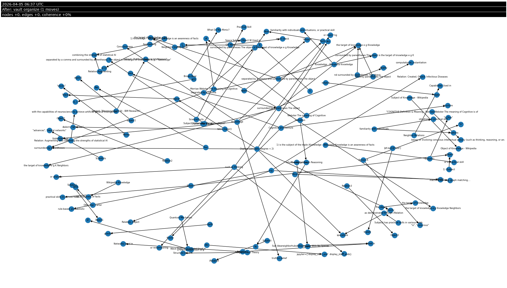](graph-2026-04-05-06-37-after-organize.png) [commit](https://github.com/BoggersTheFish/BoggersTheCIG/commit/fa8de49)

### 2026-04-05 06:37 UTC

**After:** 0 extracts, 1 merges — nodes +0, edges +0, coherence +0%

[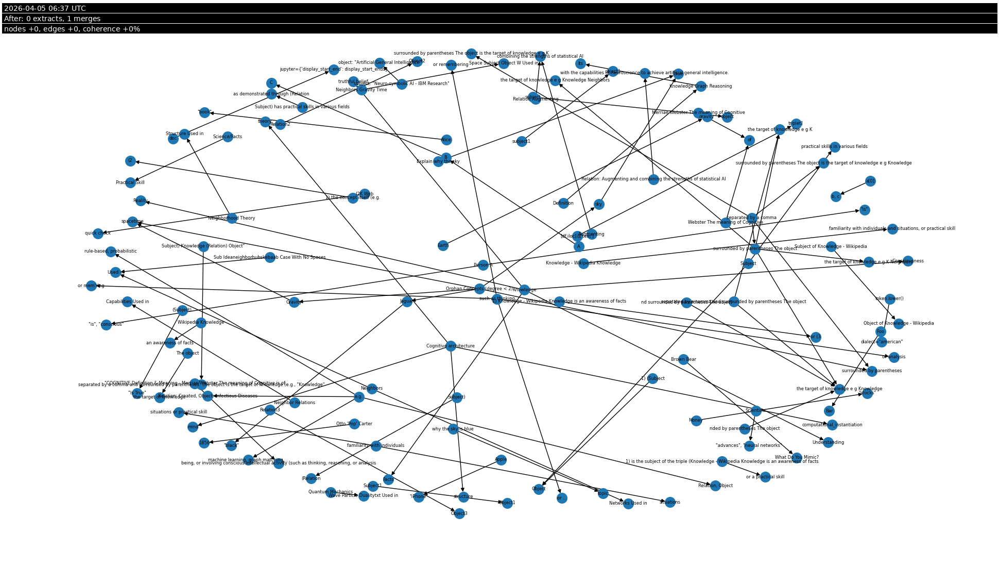](graph-2026-04-05-06-37-extract-subideas.png) [commit](https://github.com/BoggersTheFish/BoggersTheCIG/commit/fa8de49)

### 2026-04-05 06:37 UTC

**After:** 2_+2_.md"+A.md"+c.md"+display_start_ends_.md" — nodes +0, edges +0, coherence +0%

[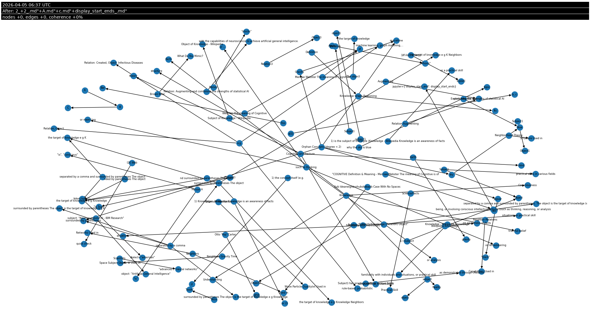](graph-2026-04-05-06-37-self-improve.png) [commit](https://github.com/BoggersTheFish/BoggersTheCIG/commit/fa8de49)

### 2026-04-05 10:42 UTC

**After:** external ingest (+3 triples) — nodes +6, edges +3, coherence +199900%

[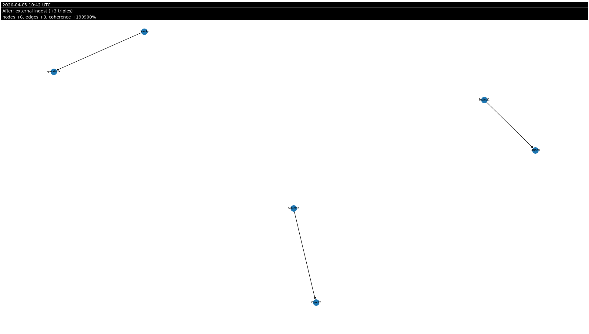](graph-2026-04-05-10-42-after-ingest.png) [commit](https://github.com/BoggersTheFish/BoggersTheCIG/commit/5f2b182)

### 2026-04-05 10:42 UTC

**After:** vault analysis (+172 triples) — nodes +135, edges +86, coherence -95%

[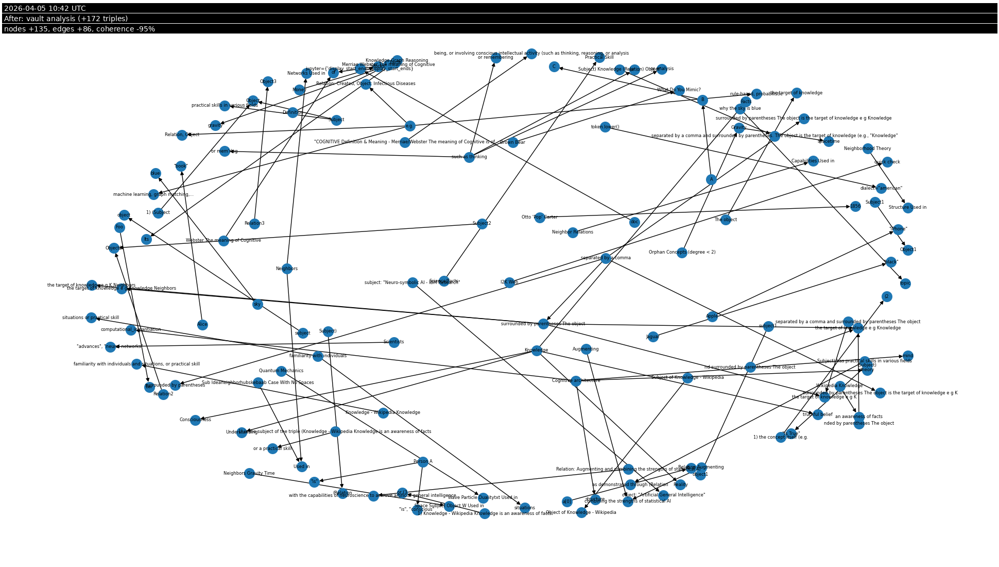](graph-2026-04-05-10-42-after-analyze-vault.png) [commit](https://github.com/BoggersTheFish/BoggersTheCIG/commit/5f2b182)

### 2026-04-05 10:43 UTC

**After:** 1 extracts, 0 merges — nodes +0, edges +0, coherence +0%

[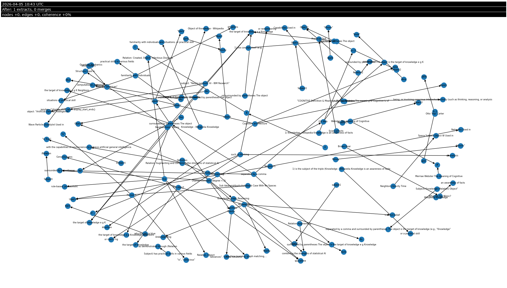](graph-2026-04-05-10-43-extract-subideas.png) [commit](https://github.com/BoggersTheFish/BoggersTheCIG/commit/5f2b182)

### 2026-04-05 10:43 UTC

**After:** vault analysis (+175 triples) — nodes +0, edges +4, coherence +4%

[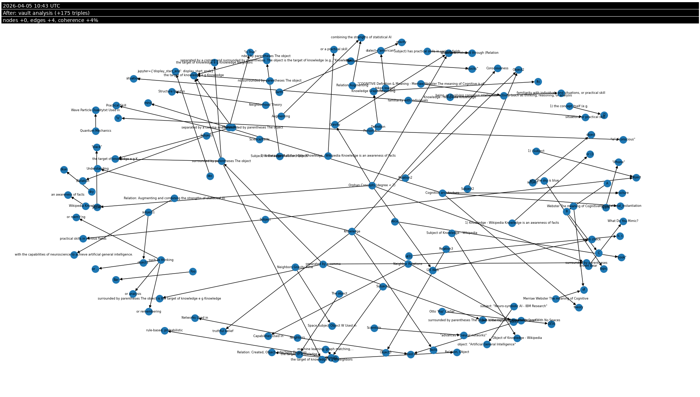](graph-2026-04-05-10-43-after-analyze-vault.png) [commit](https://github.com/BoggersTheFish/BoggersTheCIG/commit/5f2b182)

### 2026-04-05 10:43 UTC

**After:** 1 extracts, 0 merges — nodes +0, edges +0, coherence +0%

 [commit](https://github.com/BoggersTheFish/BoggersTheCIG/commit/5f2b182)

### 2026-04-05 10:50 UTC

**After:** vault organize (0 moves) — nodes +0, edges +0, coherence +0%

[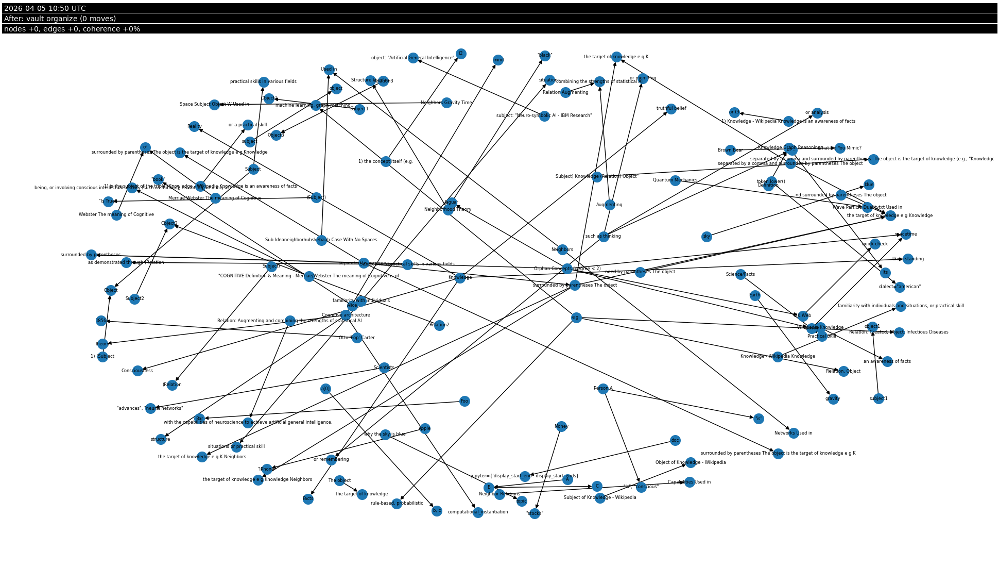](graph-2026-04-05-10-50-after-organize.png) [commit](https://github.com/BoggersTheFish/BoggersTheCIG/commit/5f2b182)

### 2026-04-05 10:50 UTC

**After:** 2 extracts, 0 merges — nodes +0, edges +0, coherence +0%

[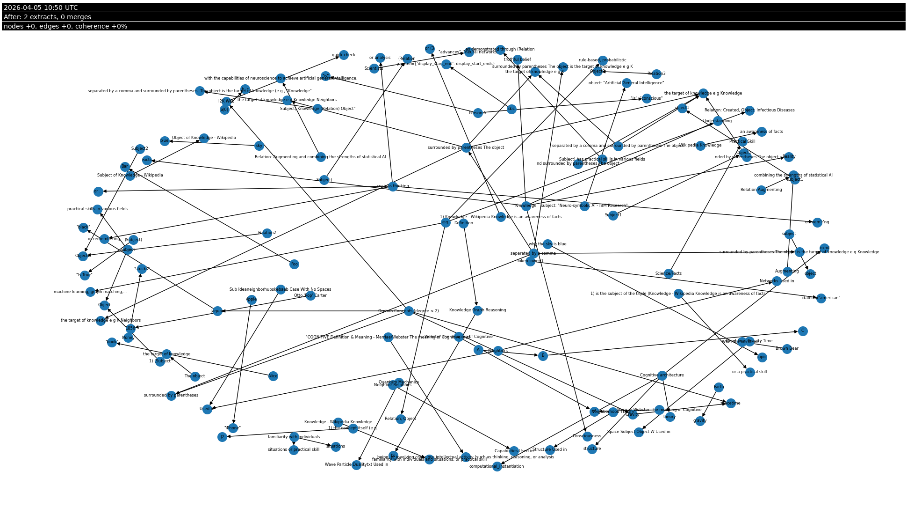](graph-2026-04-05-10-50-extract-subideas.png) [commit](https://github.com/BoggersTheFish/BoggersTheCIG/commit/5f2b182)

### 2026-04-05 10:50 UTC

**After:** 2_+2_.md"+comma.md"+eval+in.md" — nodes +0, edges +0, coherence +0%

[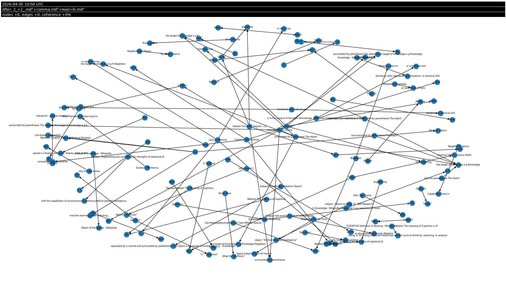](graph-2026-04-05-10-50-self-improve.png) [commit](https://github.com/BoggersTheFish/BoggersTheCIG/commit/5f2b182)

### 2026-04-05 10:57 UTC

**After:** vault organize (1 moves) — nodes +0, edges +0, coherence +0%

[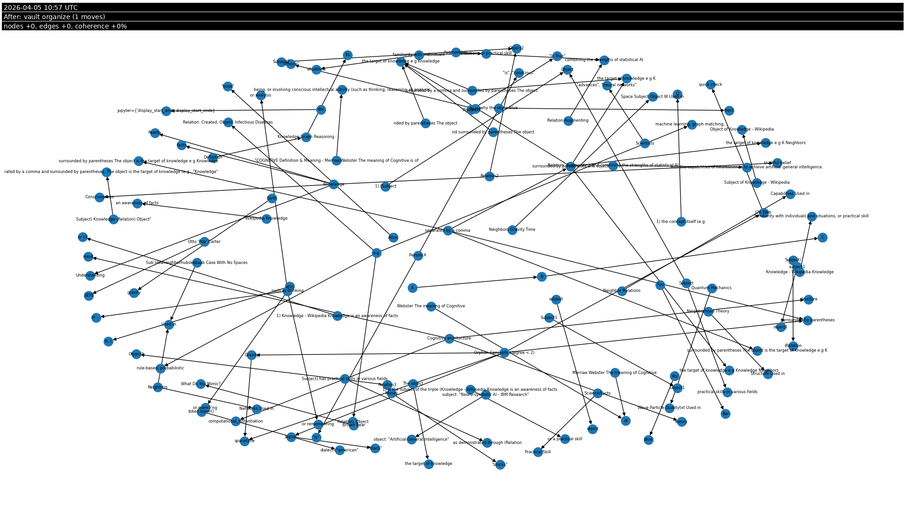](graph-2026-04-05-10-57-after-organize.png) [commit](https://github.com/BoggersTheFish/BoggersTheCIG/commit/5f2b182)

### 2026-04-05 10:57 UTC

**After:** 1 extracts, 1 merges — nodes +0, edges +0, coherence +0%

[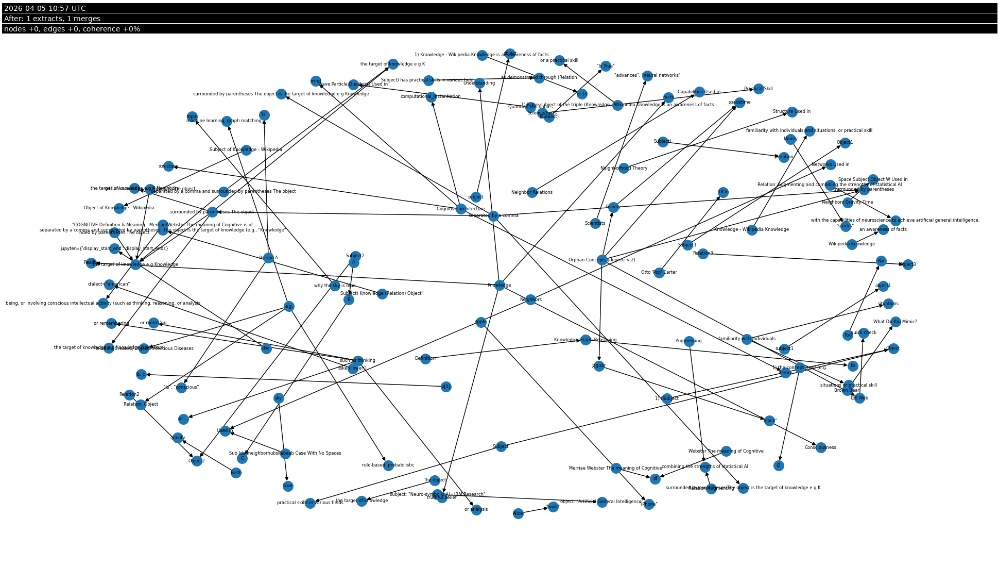](graph-2026-04-05-10-57-extract-subideas.png) [commit](https://github.com/BoggersTheFish/BoggersTheCIG/commit/5f2b182)

### 2026-04-05 10:57 UTC

**After:** 2_+2_.md"+comma.md"+eval+in.md" — nodes +0, edges +0, coherence +0%

[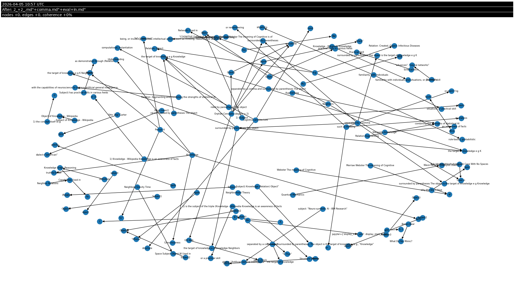](graph-2026-04-05-10-57-self-improve.png) [commit](https://github.com/BoggersTheFish/BoggersTheCIG/commit/5f2b182)

### 2026-04-05 15:42 UTC

**After:** vault analysis (+172 triples) — nodes +140, edges +88, coherence +8944%

[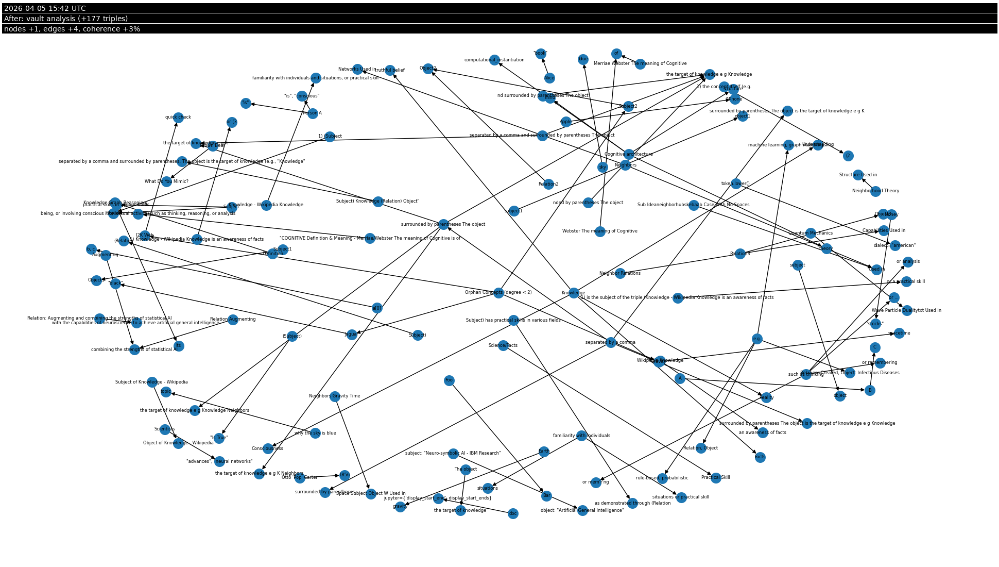](graph-2026-04-05-15-42-after-analyze-vault.png) [commit](https://github.com/BoggersTheFish/BoggersTheCIG/commit/cdef716)

### 2026-04-05 15:42 UTC

**After:** 1 extracts, 0 merges — nodes +0, edges +0, coherence +0%

[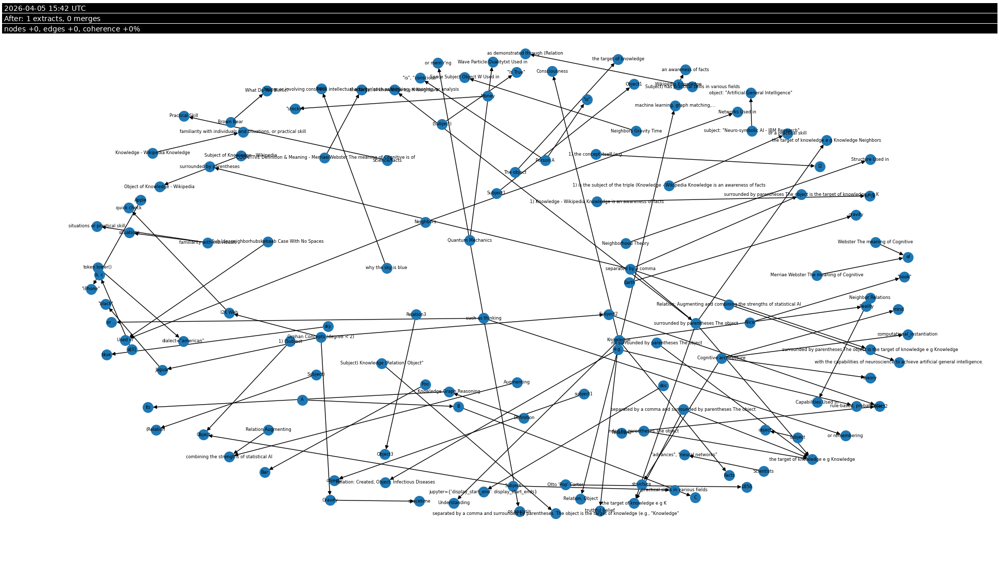](graph-2026-04-05-15-42-extract-subideas.png) [commit](https://github.com/BoggersTheFish/BoggersTheCIG/commit/cdef716)

### 2026-04-05 15:42 UTC

**After:** vault analysis (+177 triples) — nodes +1, edges +4, coherence +3%

 [commit](https://github.com/BoggersTheFish/BoggersTheCIG/commit/cdef716)

### 2026-04-05 15:42 UTC

**After:** 1 extracts, 0 merges — nodes +0, edges +0, coherence +0%

 [commit](https://github.com/BoggersTheFish/BoggersTheCIG/commit/cdef716)

### 2026-04-05 15:48 UTC

**After:** vault organize (0 moves) — nodes +0, edges +0, coherence +0%

[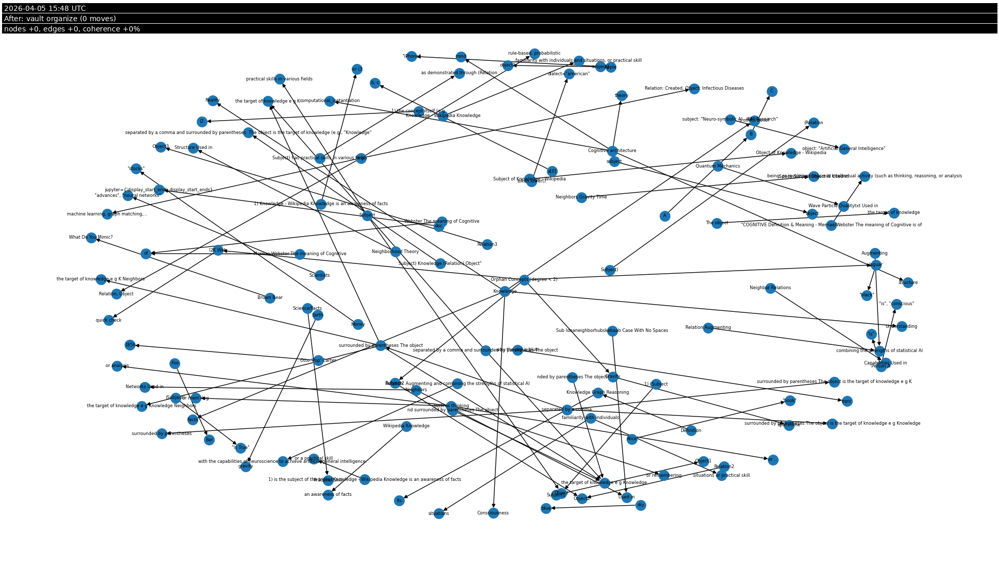](graph-2026-04-05-15-48-after-organize.png) [commit](https://github.com/BoggersTheFish/BoggersTheCIG/commit/cdef716)

### 2026-04-05 15:49 UTC

**After:** 2 extracts, 0 merges — nodes +0, edges +0, coherence +0%

[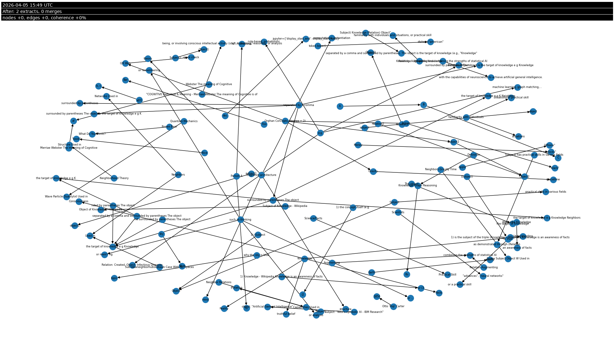](graph-2026-04-05-15-49-extract-subideas.png) [commit](https://github.com/BoggersTheFish/BoggersTheCIG/commit/cdef716)

### 2026-04-05 15:49 UTC

**After:** 2_+2_.md"+comma.md"+eval+obsidian — nodes +0, edges +0, coherence +0%

[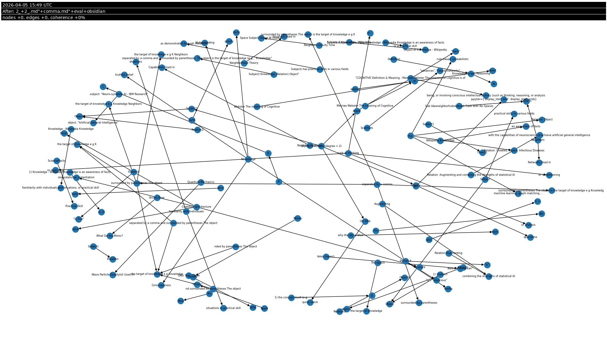](graph-2026-04-05-15-49-self-improve.png) [commit](https://github.com/BoggersTheFish/BoggersTheCIG/commit/cdef716)

### 2026-04-05 15:55 UTC

**After:** vault organize (0 moves) — nodes +0, edges +0, coherence +0%

[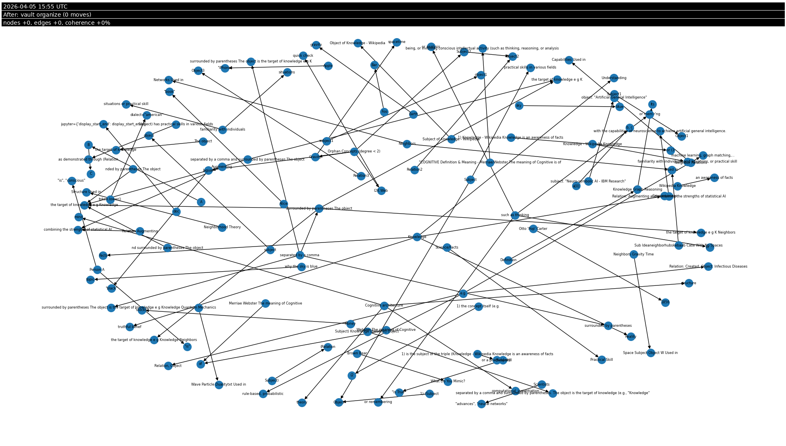](graph-2026-04-05-15-55-after-organize.png) [commit](https://github.com/BoggersTheFish/BoggersTheCIG/commit/cdef716)

### 2026-04-05 15:55 UTC

**After:** 1 extracts, 1 merges — nodes +0, edges +0, coherence +0%

[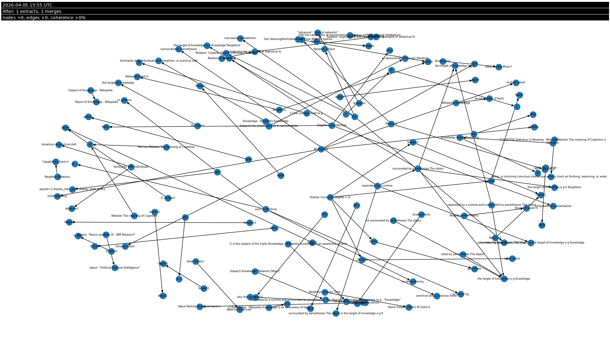](graph-2026-04-05-15-55-extract-subideas.png) [commit](https://github.com/BoggersTheFish/BoggersTheCIG/commit/cdef716)

### 2026-04-05 15:55 UTC

**After:** 2_+2_.md"+comma.md"+eval+obsidian — nodes +0, edges +0, coherence +0%

[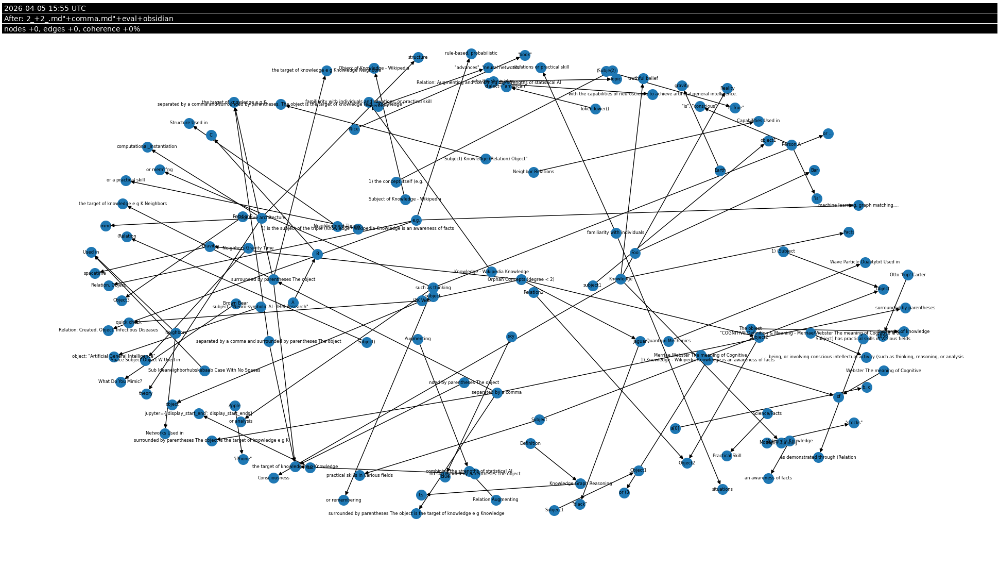](graph-2026-04-05-15-55-self-improve.png) [commit](https://github.com/BoggersTheFish/BoggersTheCIG/commit/cdef716)

### 2026-04-05 20:42 UTC

**After:** external ingest (+2 triples) — nodes +6, edges +3, coherence +199900%

[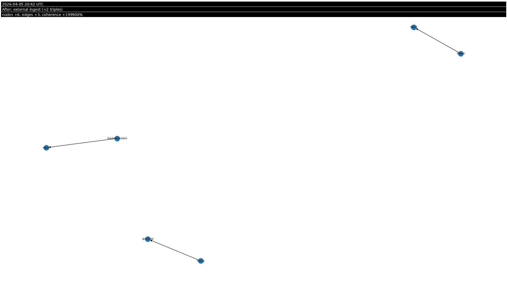](graph-2026-04-05-20-42-after-ingest.png) [commit](https://github.com/BoggersTheFish/BoggersTheCIG/commit/d3ca0d9)

### 2026-04-05 20:42 UTC

**After:** vault analysis (+173 triples) — nodes +136, edges +87, coherence -95%

[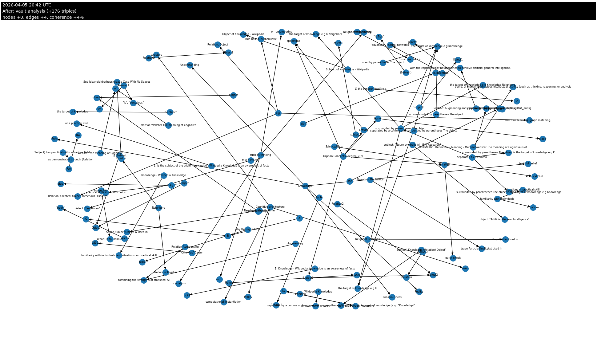](graph-2026-04-05-20-42-after-analyze-vault.png) [commit](https://github.com/BoggersTheFish/BoggersTheCIG/commit/d3ca0d9)

### 2026-04-05 20:42 UTC

**After:** vault analysis (+176 triples) — nodes +0, edges +4, coherence +4%

 [commit](https://github.com/BoggersTheFish/BoggersTheCIG/commit/d3ca0d9)

### 2026-04-05 20:48 UTC

**After:** vault organize (0 moves) — nodes +0, edges +0, coherence +0%

[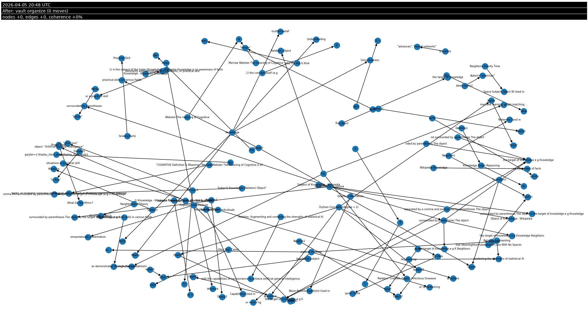](graph-2026-04-05-20-48-after-organize.png) [commit](https://github.com/BoggersTheFish/BoggersTheCIG/commit/d3ca0d9)

### 2026-04-05 20:48 UTC

**After:** 1 extracts, 0 merges — nodes +0, edges +0, coherence +0%

[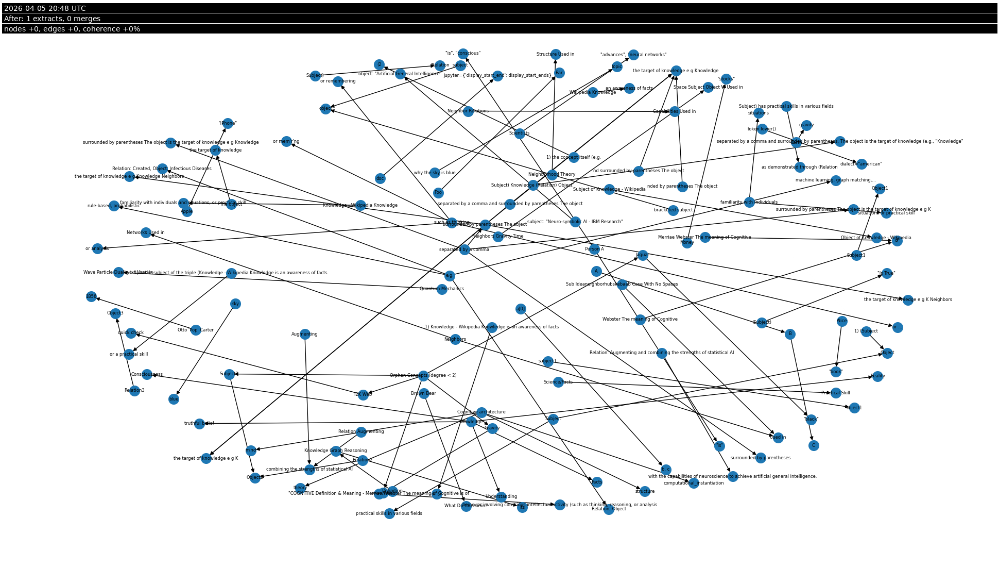](graph-2026-04-05-20-48-extract-subideas.png) [commit](https://github.com/BoggersTheFish/BoggersTheCIG/commit/d3ca0d9)

### 2026-04-05 20:48 UTC

**After:** 2_+2_.md"+comma.md"+eval+obsidian — nodes +0, edges +0, coherence +0%

[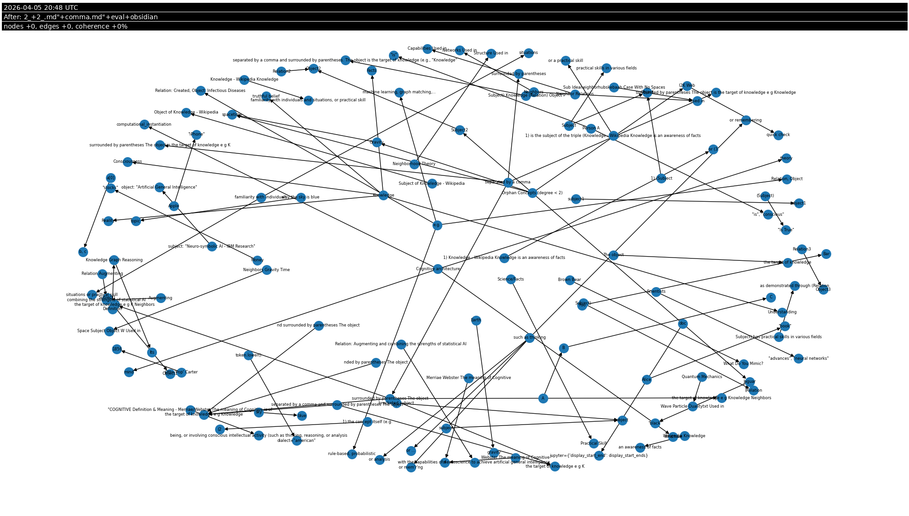](graph-2026-04-05-20-48-self-improve.png) [commit](https://github.com/BoggersTheFish/BoggersTheCIG/commit/d3ca0d9)

### 2026-04-05 20:54 UTC

**After:** vault organize (1 moves) — nodes +0, edges +0, coherence +0%

[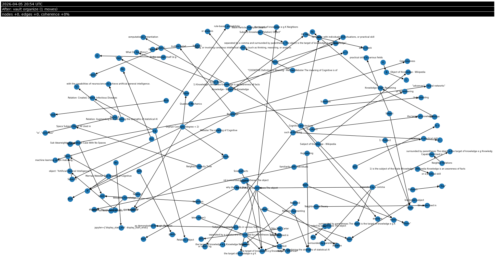](graph-2026-04-05-20-54-after-organize.png) [commit](https://github.com/BoggersTheFish/BoggersTheCIG/commit/d3ca0d9)

### 2026-04-05 20:54 UTC

**After:** 0 extracts, 1 merges — nodes +0, edges +0, coherence +0%

[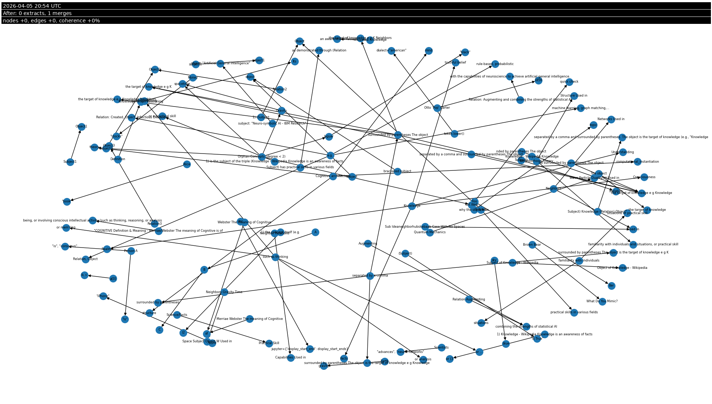](graph-2026-04-05-20-54-extract-subideas.png) [commit](https://github.com/BoggersTheFish/BoggersTheCIG/commit/d3ca0d9)

### 2026-04-05 20:54 UTC

**After:** 2_+2_.md"+comma.md"+obsidian+subject.md" — nodes +0, edges +0, coherence +0%

[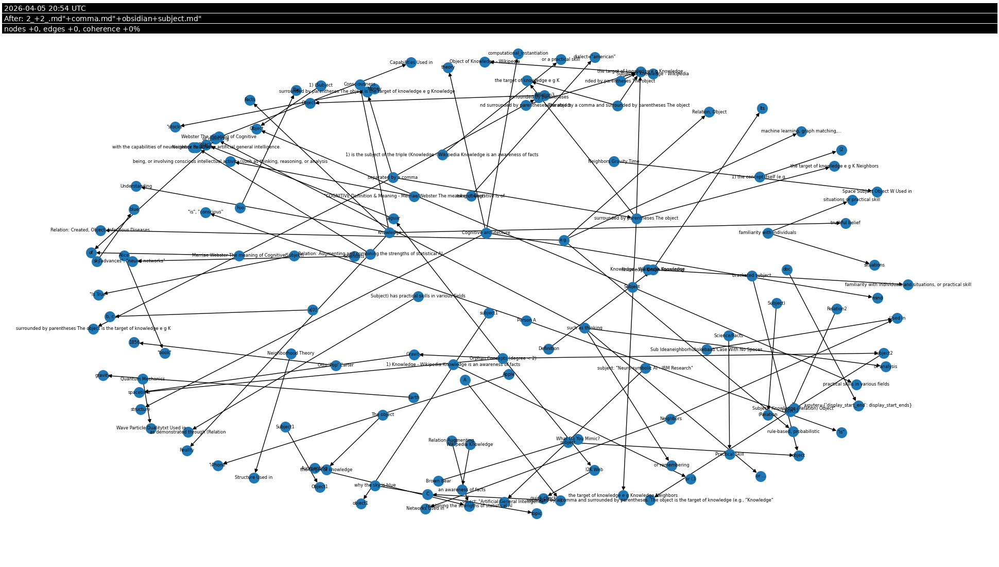](graph-2026-04-05-20-54-self-improve.png) [commit](https://github.com/BoggersTheFish/BoggersTheCIG/commit/d3ca0d9)

### 2026-04-06 02:35 UTC

**After:** vault analysis (+173 triples) — nodes +140, edges +88, coherence +8944%

[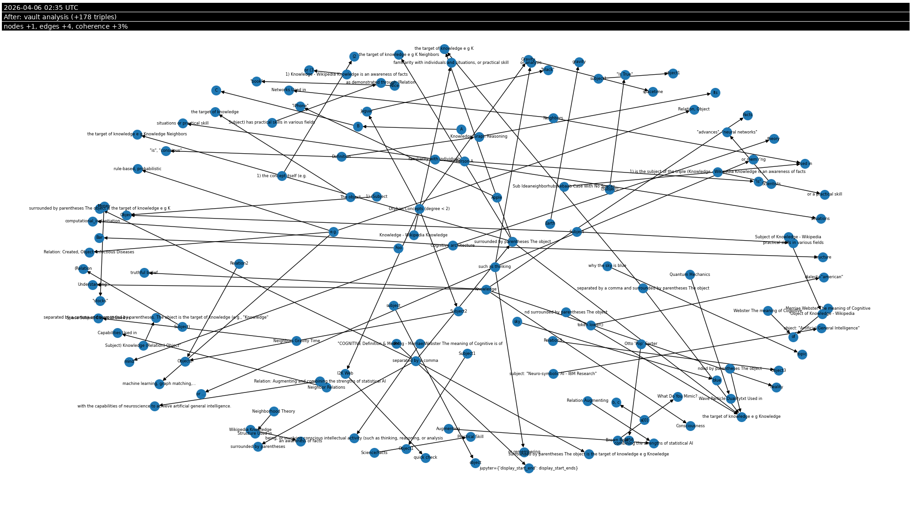](graph-2026-04-06-02-35-after-analyze-vault.png) [commit](https://github.com/BoggersTheFish/BoggersTheCIG/commit/f57289e)

### 2026-04-06 02:35 UTC

**After:** 1 extracts, 0 merges — nodes +0, edges +0, coherence +0%

[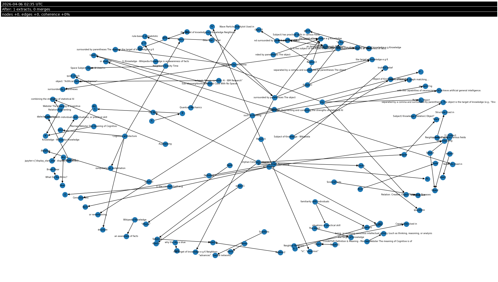](graph-2026-04-06-02-35-extract-subideas.png) [commit](https://github.com/BoggersTheFish/BoggersTheCIG/commit/f57289e)

### 2026-04-06 02:35 UTC

**After:** vault analysis (+178 triples) — nodes +1, edges +4, coherence +3%

 [commit](https://github.com/BoggersTheFish/BoggersTheCIG/commit/f57289e)

### 2026-04-06 02:35 UTC

**After:** 1 extracts, 0 merges — nodes +0, edges +0, coherence +0%

 [commit](https://github.com/BoggersTheFish/BoggersTheCIG/commit/f57289e)

### 2026-04-06 02:42 UTC

**After:** vault organize (0 moves) — nodes +0, edges +0, coherence +0%

[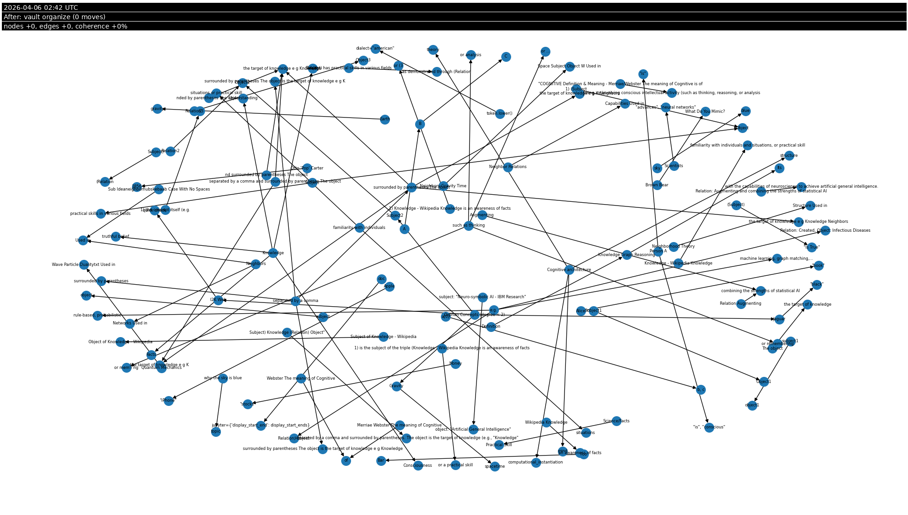](graph-2026-04-06-02-42-after-organize.png) [commit](https://github.com/BoggersTheFish/BoggersTheCIG/commit/f57289e)

### 2026-04-06 02:42 UTC

**After:** 0 extracts, 1 merges — nodes +0, edges +0, coherence +0%

[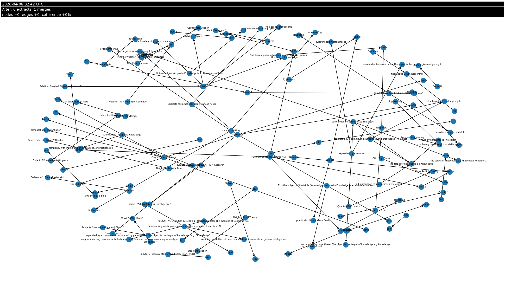](graph-2026-04-06-02-42-extract-subideas.png) [commit](https://github.com/BoggersTheFish/BoggersTheCIG/commit/f57289e)

### 2026-04-06 02:42 UTC

**After:** 2_+2_.md"+comma.md"+eval+obsidian — nodes +0, edges +0, coherence +0%

[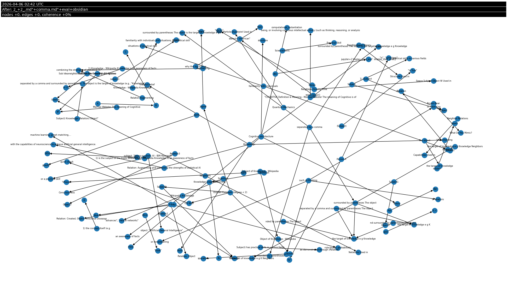](graph-2026-04-06-02-42-self-improve.png) [commit](https://github.com/BoggersTheFish/BoggersTheCIG/commit/f57289e)

### 2026-04-06 02:48 UTC

**After:** vault organize (0 moves) — nodes +0, edges +0, coherence +0%

[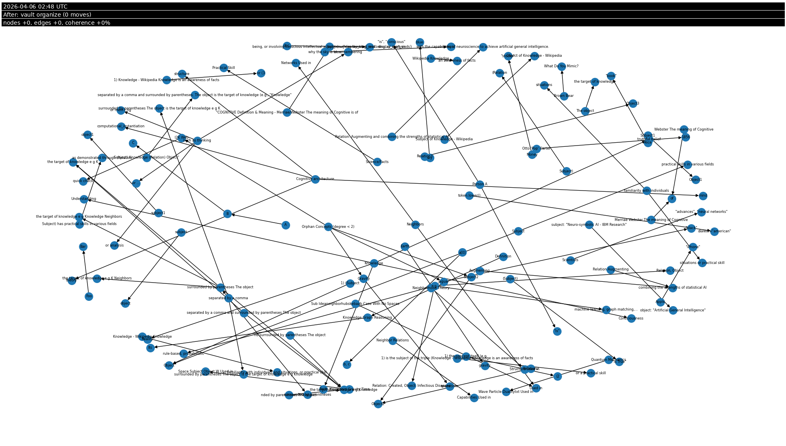](graph-2026-04-06-02-48-after-organize.png) [commit](https://github.com/BoggersTheFish/BoggersTheCIG/commit/f57289e)

### 2026-04-06 02:48 UTC

**After:** 1 extracts, 0 merges — nodes +0, edges +0, coherence +0%

[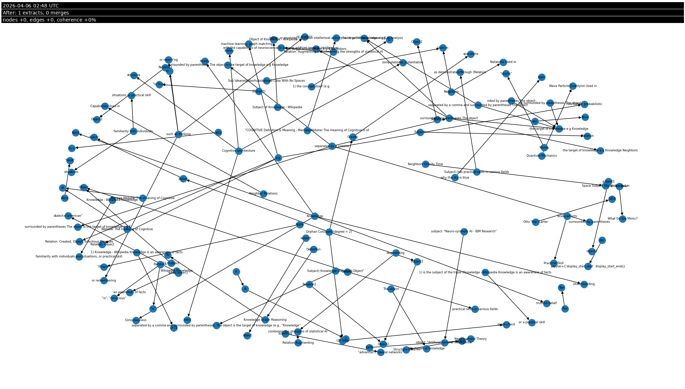](graph-2026-04-06-02-48-extract-subideas.png) [commit](https://github.com/BoggersTheFish/BoggersTheCIG/commit/f57289e)

### 2026-04-06 02:48 UTC

**After:** 2_+2_.md"+comma.md"+obsidian+subject.md" — nodes +0, edges +0, coherence +0%

[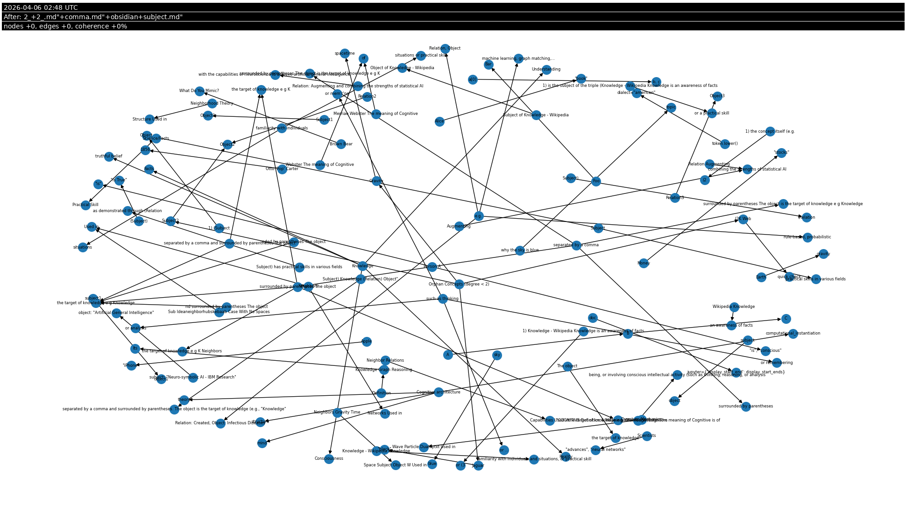](graph-2026-04-06-02-48-self-improve.png) [commit](https://github.com/BoggersTheFish/BoggersTheCIG/commit/f57289e)

### 2026-04-06 07:03 UTC

**After:** vault analysis (+173 triples) — nodes +140, edges +88, coherence +8944%

[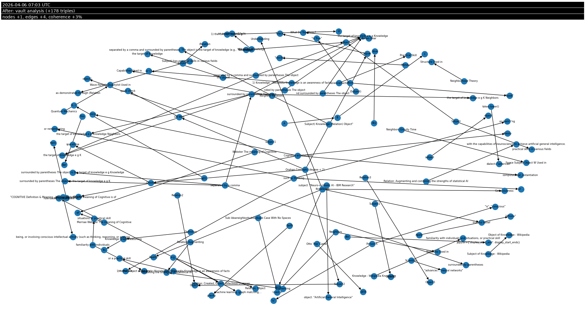](graph-2026-04-06-07-03-after-analyze-vault.png) [commit](https://github.com/BoggersTheFish/BoggersTheCIG/commit/1c7b655)

### 2026-04-06 07:03 UTC

**After:** 1 extracts, 0 merges — nodes +0, edges +0, coherence +0%

[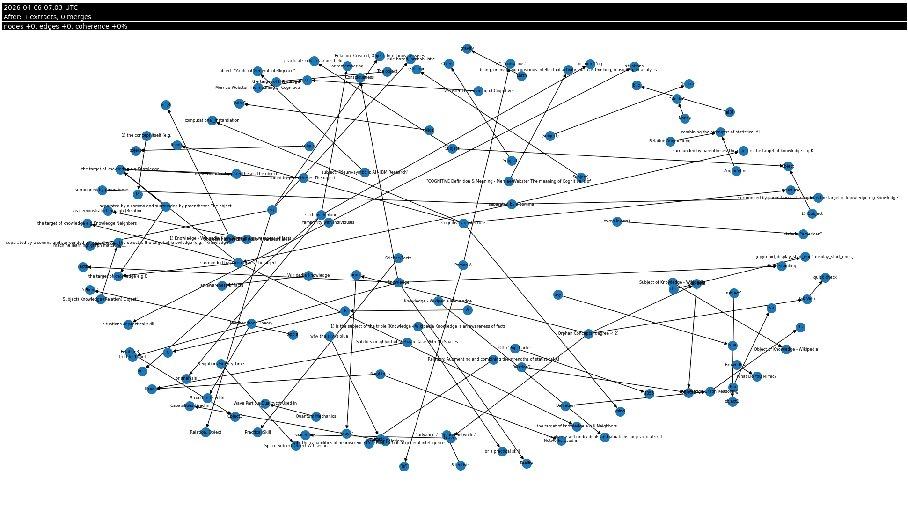](graph-2026-04-06-07-03-extract-subideas.png) [commit](https://github.com/BoggersTheFish/BoggersTheCIG/commit/1c7b655)

### 2026-04-06 07:03 UTC

**After:** vault analysis (+178 triples) — nodes +1, edges +4, coherence +3%

 [commit](https://github.com/BoggersTheFish/BoggersTheCIG/commit/1c7b655)

### 2026-04-06 07:03 UTC

**After:** 1 extracts, 0 merges — nodes +0, edges +0, coherence +0%

 [commit](https://github.com/BoggersTheFish/BoggersTheCIG/commit/1c7b655)

### 2026-04-06 07:10 UTC

**After:** vault organize (2 moves) — nodes +0, edges +0, coherence +0%

[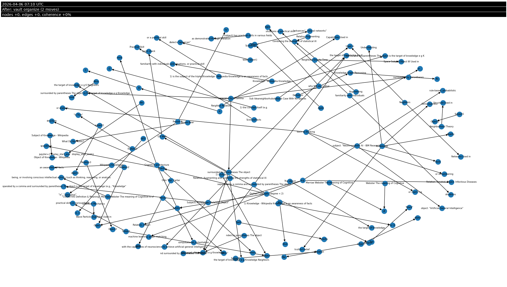](graph-2026-04-06-07-10-after-organize.png) [commit](https://github.com/BoggersTheFish/BoggersTheCIG/commit/1c7b655)

### 2026-04-06 07:10 UTC

**After:** 0 extracts, 1 merges — nodes +0, edges +0, coherence +0%

[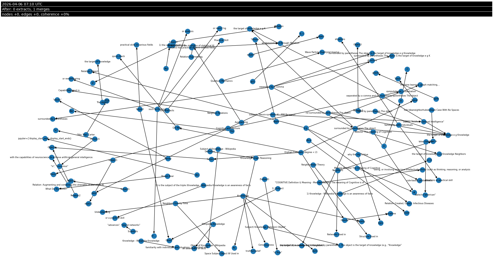](graph-2026-04-06-07-10-extract-subideas.png) [commit](https://github.com/BoggersTheFish/BoggersTheCIG/commit/1c7b655)

### 2026-04-06 07:10 UTC

**After:** 2_+2_.md"+AI.md"+eval+in.md" — nodes +0, edges +0, coherence +0%

[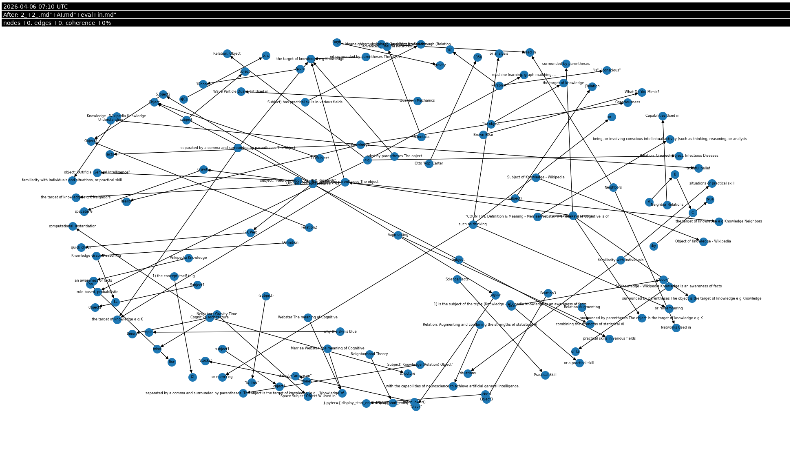](graph-2026-04-06-07-10-self-improve.png) [commit](https://github.com/BoggersTheFish/BoggersTheCIG/commit/1c7b655)

### 2026-04-06 07:16 UTC

**After:** vault organize (3 moves) — nodes +0, edges +0, coherence +0%

[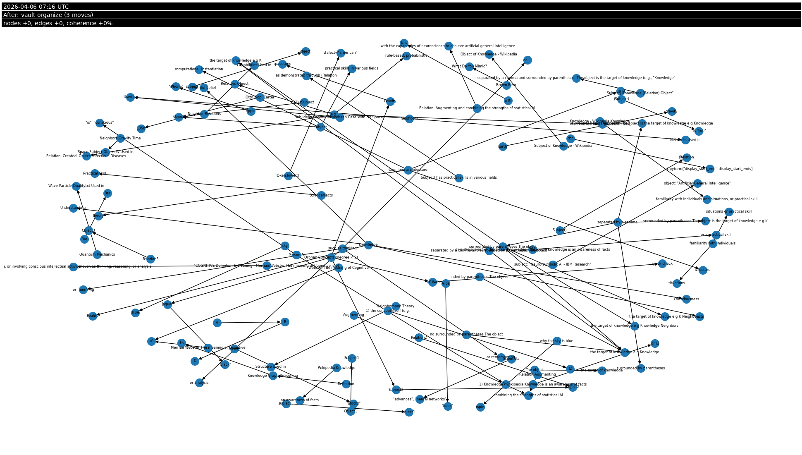](graph-2026-04-06-07-16-after-organize.png) [commit](https://github.com/BoggersTheFish/BoggersTheCIG/commit/1c7b655)

### 2026-04-06 07:16 UTC

**After:** 0 extracts, 1 merges — nodes +0, edges +0, coherence +0%

[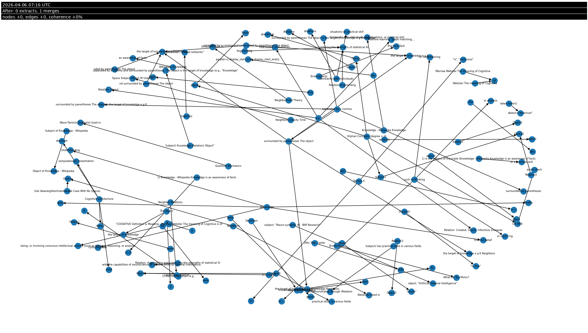](graph-2026-04-06-07-16-extract-subideas.png) [commit](https://github.com/BoggersTheFish/BoggersTheCIG/commit/1c7b655)

### 2026-04-06 07:16 UTC

**After:** 2_+2_.md"+AI.md"+eval+in.md" — nodes +0, edges +0, coherence +0%

[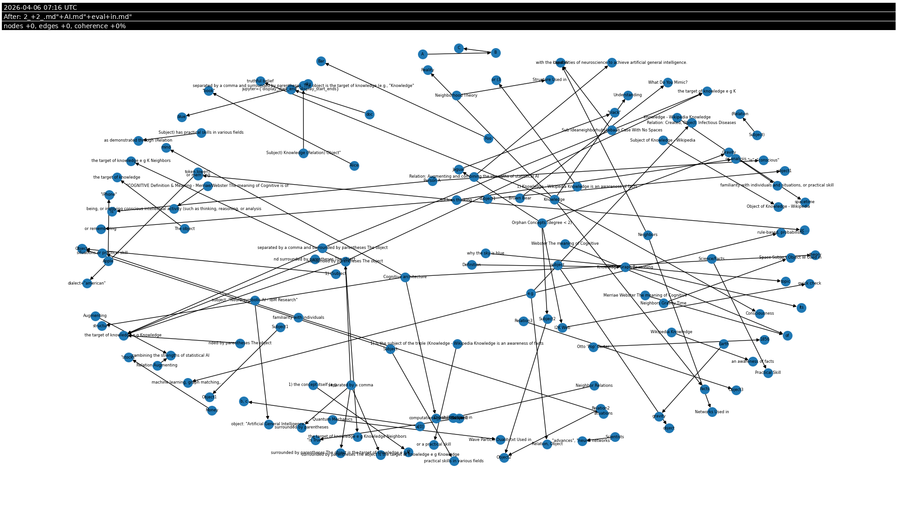](graph-2026-04-06-07-16-self-improve.png) [commit](https://github.com/BoggersTheFish/BoggersTheCIG/commit/1c7b655)

### 2026-04-06 11:04 UTC

**After:** vault analysis (+174 triples) — nodes +140, edges +88, coherence +8944%

[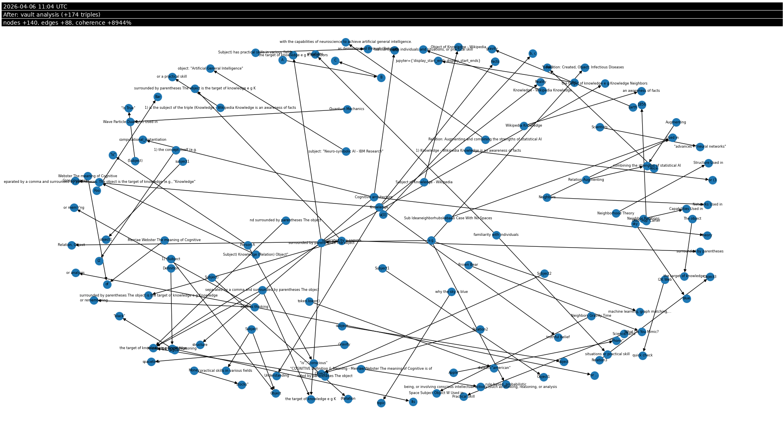](graph-2026-04-06-11-04-after-analyze-vault.png) [commit](https://github.com/BoggersTheFish/BoggersTheCIG/commit/2cd9ca9)

### 2026-04-06 11:05 UTC

**After:** 1 extracts, 0 merges — nodes +0, edges +0, coherence +0%

[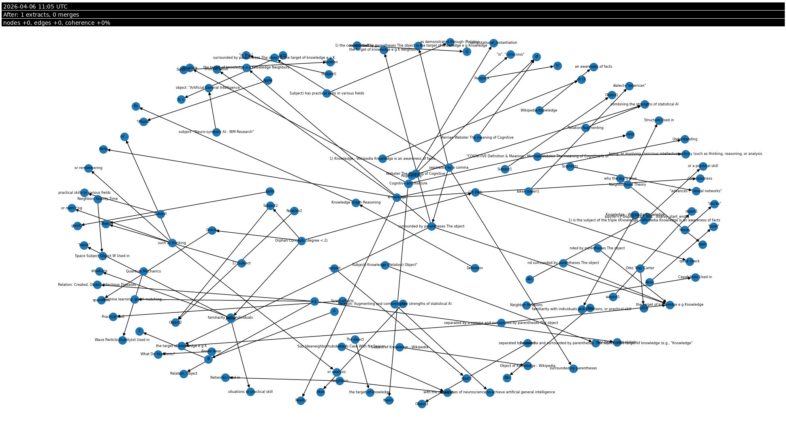](graph-2026-04-06-11-05-extract-subideas.png) [commit](https://github.com/BoggersTheFish/BoggersTheCIG/commit/2cd9ca9)

### 2026-04-06 11:05 UTC

**After:** vault analysis (+179 triples) — nodes +1, edges +4, coherence +3%

[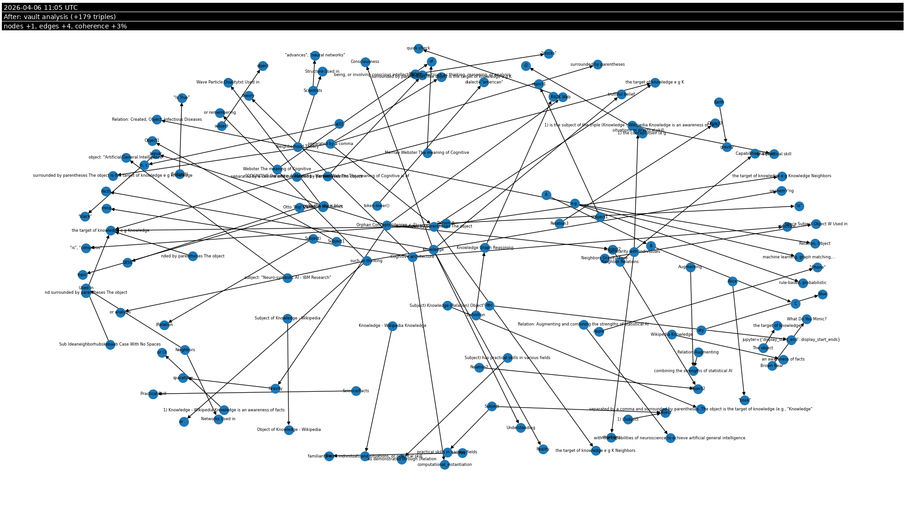](graph-2026-04-06-11-05-after-analyze-vault.png) [commit](https://github.com/BoggersTheFish/BoggersTheCIG/commit/2cd9ca9)

### 2026-04-06 11:05 UTC

**After:** 1 extracts, 0 merges — nodes +0, edges +0, coherence +0%

 [commit](https://github.com/BoggersTheFish/BoggersTheCIG/commit/2cd9ca9)

### 2026-04-06 11:11 UTC

**After:** vault organize (5 moves) — nodes +0, edges +0, coherence +0%

[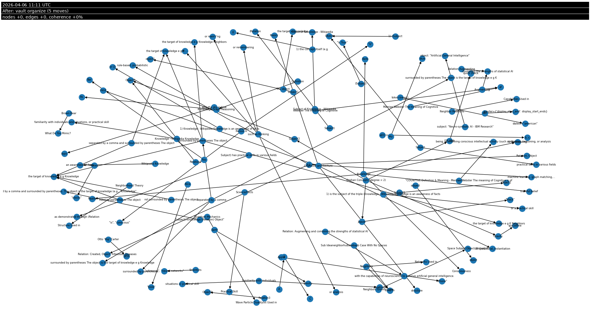](graph-2026-04-06-11-11-after-organize.png) [commit](https://github.com/BoggersTheFish/BoggersTheCIG/commit/2cd9ca9)

### 2026-04-06 11:11 UTC

**After:** 0 extracts, 1 merges — nodes +0, edges +0, coherence +0%

[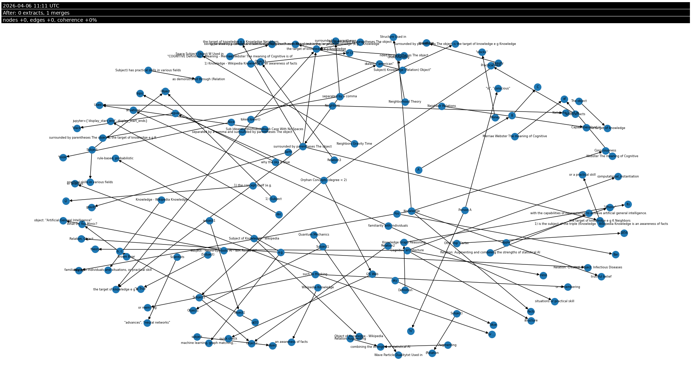](graph-2026-04-06-11-11-extract-subideas.png) [commit](https://github.com/BoggersTheFish/BoggersTheCIG/commit/2cd9ca9)

### 2026-04-06 11:11 UTC

**After:** 2_+2_.md"+K.md"+_Subject.md"+eval — nodes +0, edges +0, coherence +0%

[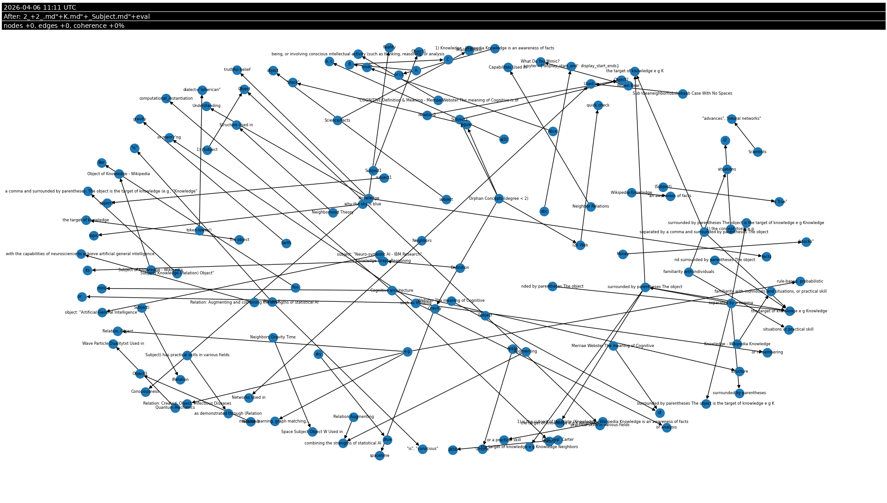](graph-2026-04-06-11-11-self-improve.png) [commit](https://github.com/BoggersTheFish/BoggersTheCIG/commit/2cd9ca9)

### 2026-04-06 11:19 UTC

**After:** vault organize (1 moves) — nodes +0, edges +0, coherence +0%

[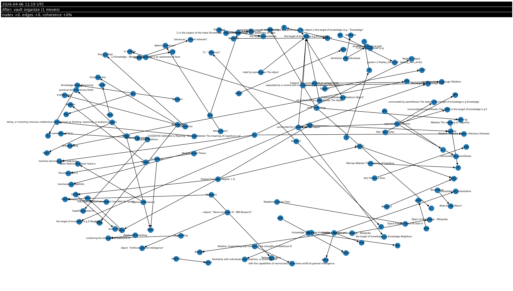](graph-2026-04-06-11-19-after-organize.png) [commit](https://github.com/BoggersTheFish/BoggersTheCIG/commit/2cd9ca9)

### 2026-04-06 11:19 UTC

**After:** 0 extracts, 1 merges — nodes +0, edges +0, coherence +0%

[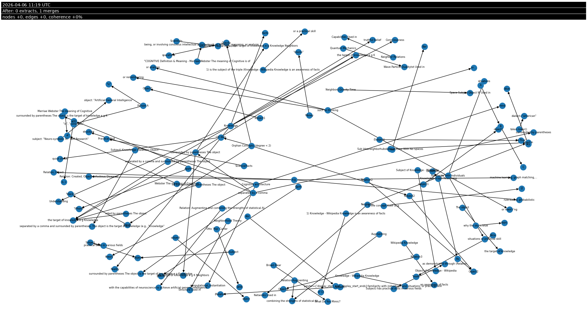](graph-2026-04-06-11-19-extract-subideas.png) [commit](https://github.com/BoggersTheFish/BoggersTheCIG/commit/2cd9ca9)

### 2026-04-06 11:19 UTC

**After:** 2_+2_.md"+K.md"+_Subject.md"+eval — nodes +0, edges +0, coherence +0%

[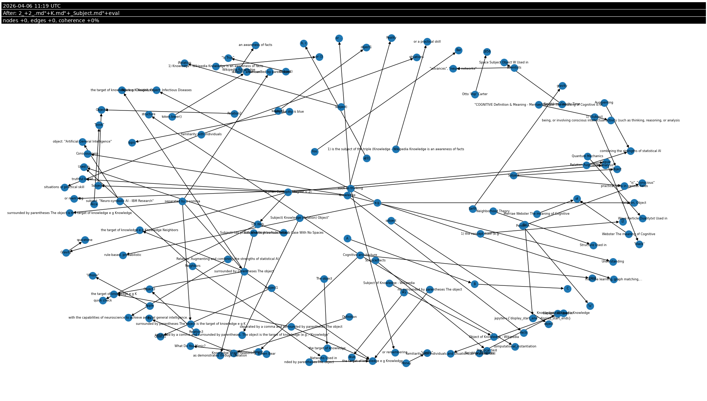](graph-2026-04-06-11-19-self-improve.png) [commit](https://github.com/BoggersTheFish/BoggersTheCIG/commit/2cd9ca9)

### 2026-04-06 15:54 UTC

**After:** vault analysis (+178 triples) — nodes +140, edges +88, coherence +8944%

[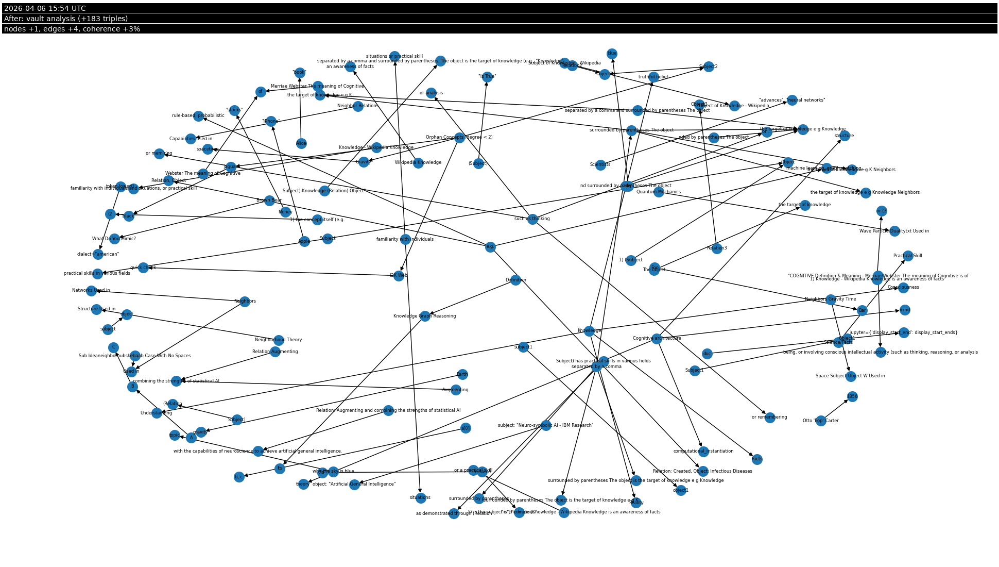](graph-2026-04-06-15-54-after-analyze-vault.png) [commit](https://github.com/BoggersTheFish/BoggersTheCIG/commit/4aa6618)

### 2026-04-06 15:54 UTC

**After:** vault analysis (+183 triples) — nodes +1, edges +4, coherence +3%

 [commit](https://github.com/BoggersTheFish/BoggersTheCIG/commit/4aa6618)

### 2026-04-06 16:01 UTC

**After:** vault organize (2 moves) — nodes +0, edges +0, coherence +0%

[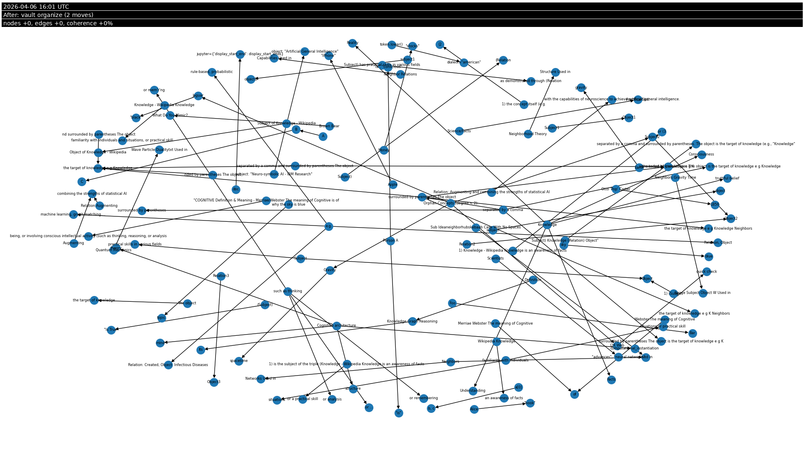](graph-2026-04-06-16-01-after-organize.png) [commit](https://github.com/BoggersTheFish/BoggersTheCIG/commit/4aa6618)

### 2026-04-06 16:01 UTC

**After:** 1 extracts, 0 merges — nodes +0, edges +0, coherence +0%

[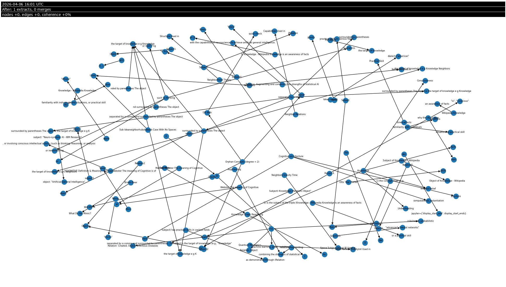](graph-2026-04-06-16-01-extract-subideas.png) [commit](https://github.com/BoggersTheFish/BoggersTheCIG/commit/4aa6618)

### 2026-04-06 16:01 UTC

**After:** 2_+2_.md"+_Subject.md"+eval+individuals.md" — nodes +0, edges +0, coherence +0%

[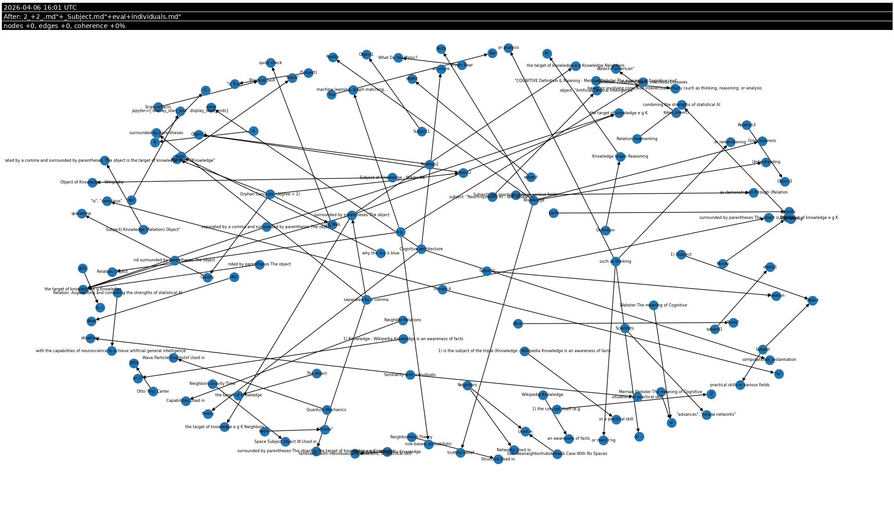](graph-2026-04-06-16-01-self-improve.png) [commit](https://github.com/BoggersTheFish/BoggersTheCIG/commit/4aa6618)

### 2026-04-06 16:07 UTC

**After:** vault organize (0 moves) — nodes +0, edges +0, coherence +0%

[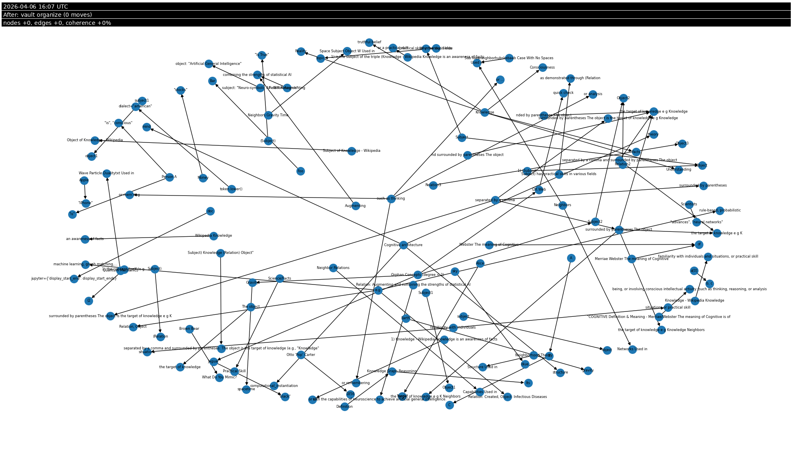](graph-2026-04-06-16-07-after-organize.png) [commit](https://github.com/BoggersTheFish/BoggersTheCIG/commit/4aa6618)

### 2026-04-06 16:07 UTC

**After:** 0 extracts, 1 merges — nodes +0, edges +0, coherence +0%

[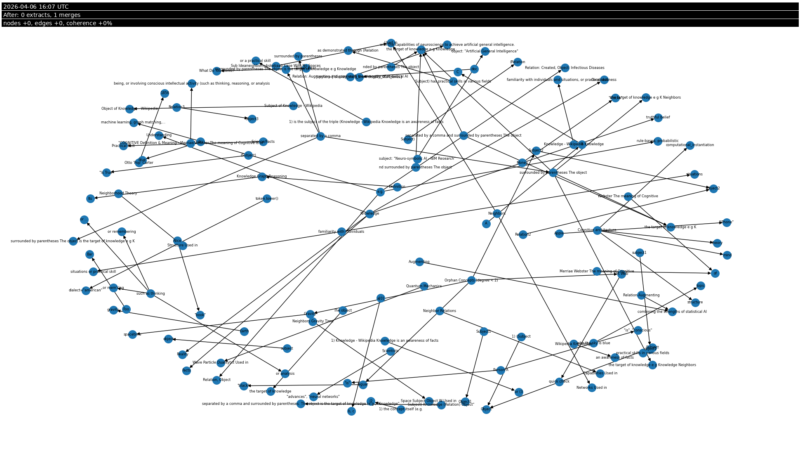](graph-2026-04-06-16-07-extract-subideas.png) [commit](https://github.com/BoggersTheFish/BoggersTheCIG/commit/4aa6618)

### 2026-04-06 16:07 UTC

**After:** 2_+2_.md"+_Subject.md"+eval+individuals.md" — nodes +0, edges +0, coherence +0%

[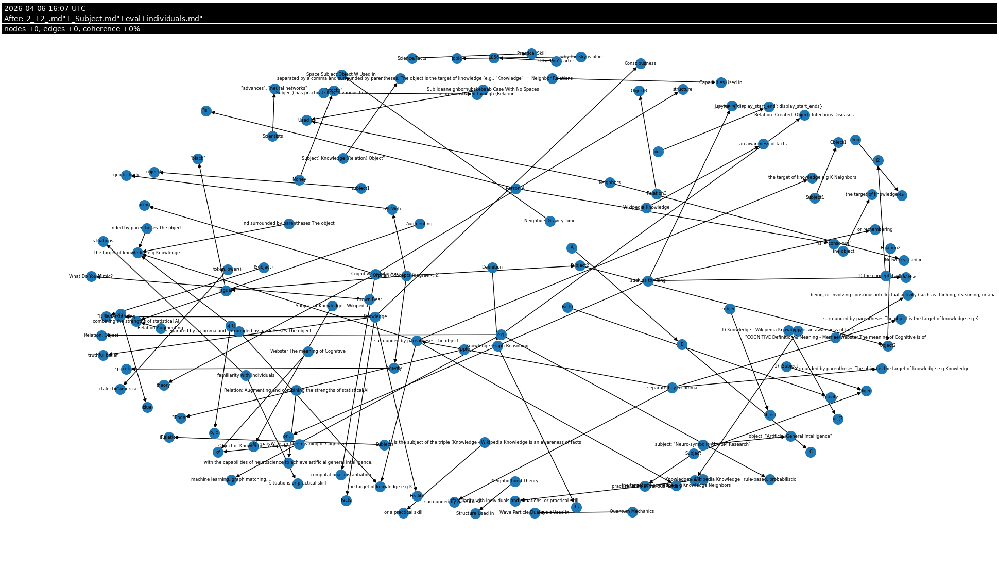](graph-2026-04-06-16-07-self-improve.png) [commit](https://github.com/BoggersTheFish/BoggersTheCIG/commit/4aa6618)

### 2026-04-06 20:47 UTC

**After:** vault analysis (+178 triples) — nodes +140, edges +88, coherence +8944%

[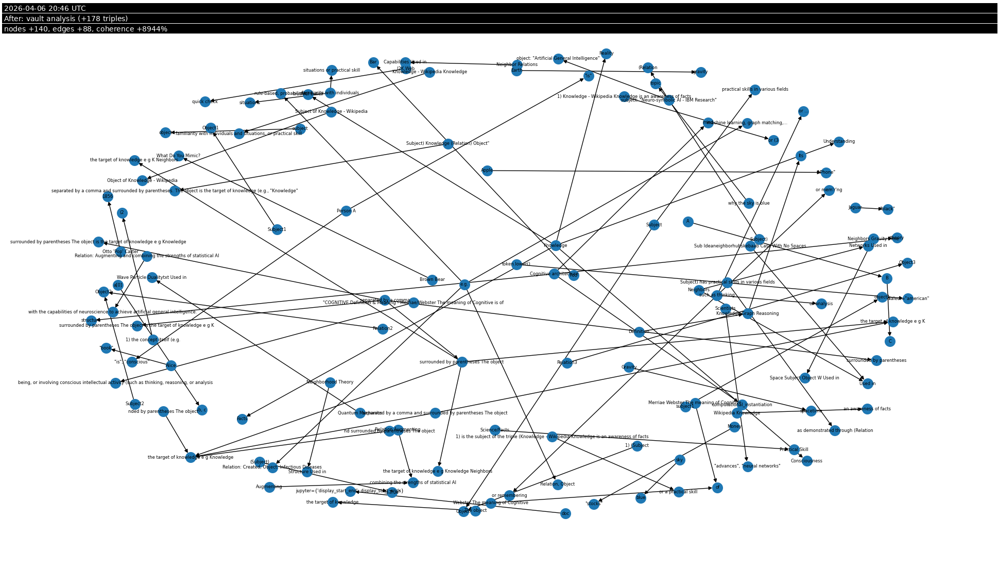](graph-2026-04-06-20-46-after-analyze-vault.png) [commit](https://github.com/BoggersTheFish/BoggersTheCIG/commit/f5b0105)

### 2026-04-06 20:47 UTC

**After:** 1 extracts, 0 merges — nodes +0, edges +0, coherence +0%

[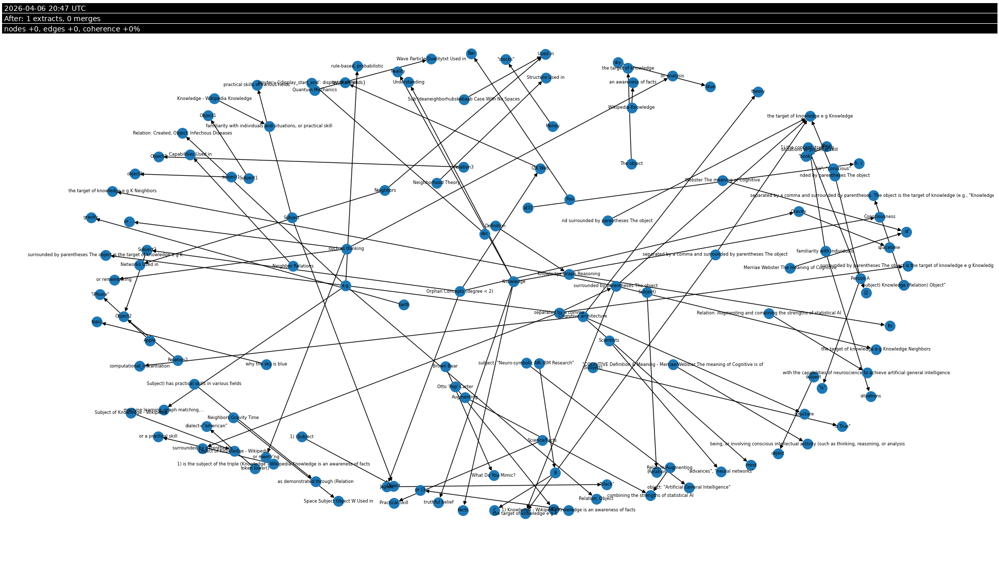](graph-2026-04-06-20-47-extract-subideas.png) [commit](https://github.com/BoggersTheFish/BoggersTheCIG/commit/f5b0105)

### 2026-04-06 20:47 UTC

**After:** vault analysis (+183 triples) — nodes +1, edges +4, coherence +3%

[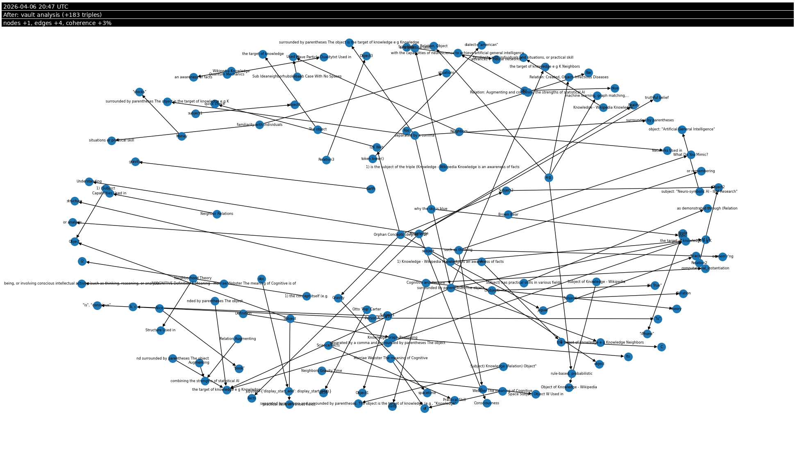](graph-2026-04-06-20-47-after-analyze-vault.png) [commit](https://github.com/BoggersTheFish/BoggersTheCIG/commit/f5b0105)

### 2026-04-06 20:47 UTC

**After:** 1 extracts, 0 merges — nodes +0, edges +0, coherence +0%

 [commit](https://github.com/BoggersTheFish/BoggersTheCIG/commit/f5b0105)

### 2026-04-06 20:54 UTC

**After:** vault organize (1 moves) — nodes +0, edges +0, coherence +0%

[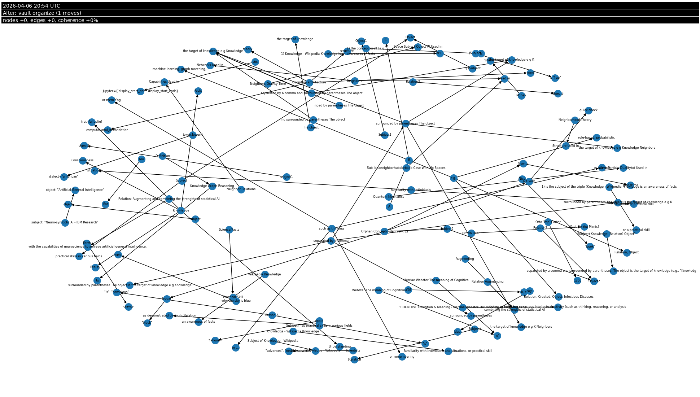](graph-2026-04-06-20-54-after-organize.png) [commit](https://github.com/BoggersTheFish/BoggersTheCIG/commit/f5b0105)

### 2026-04-06 20:54 UTC

**After:** 0 extracts, 1 merges — nodes +0, edges +0, coherence +0%

[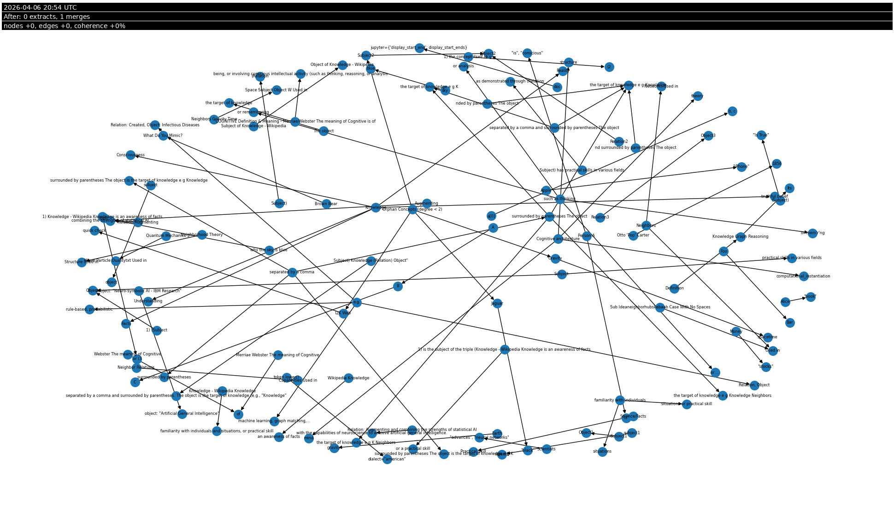](graph-2026-04-06-20-54-extract-subideas.png) [commit](https://github.com/BoggersTheFish/BoggersTheCIG/commit/f5b0105)

### 2026-04-06 20:54 UTC

**After:** 2_+2_.md"+AI.md"+eval+obsidian — nodes +0, edges +0, coherence +0%

[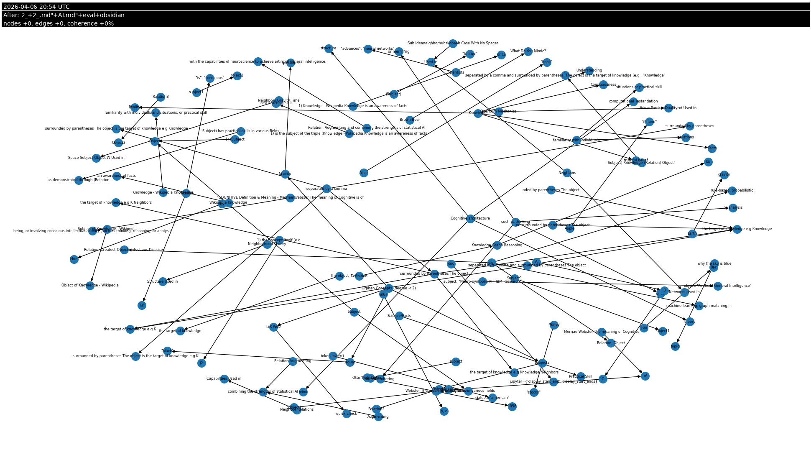](graph-2026-04-06-20-54-self-improve.png) [commit](https://github.com/BoggersTheFish/BoggersTheCIG/commit/f5b0105)

### 2026-04-06 21:01 UTC

**After:** vault organize (0 moves) — nodes +0, edges +0, coherence +0%

[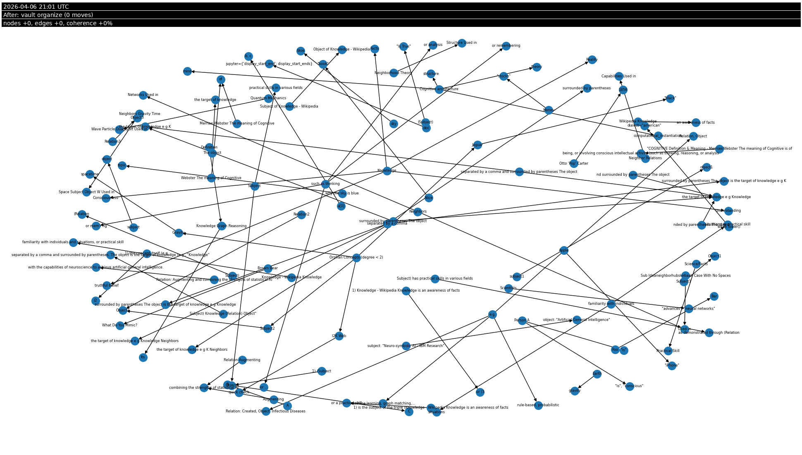](graph-2026-04-06-21-01-after-organize.png) [commit](https://github.com/BoggersTheFish/BoggersTheCIG/commit/f5b0105)

### 2026-04-06 21:01 UTC

**After:** 1 extracts, 0 merges — nodes +0, edges +0, coherence +0%

[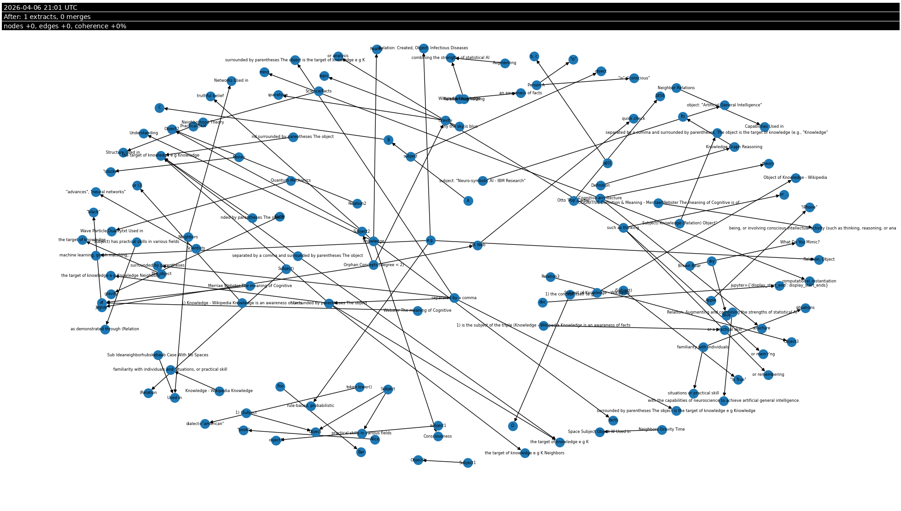](graph-2026-04-06-21-01-extract-subideas.png) [commit](https://github.com/BoggersTheFish/BoggersTheCIG/commit/f5b0105)

### 2026-04-06 21:01 UTC

**After:** 2_+2_.md"+AI.md"+eval+obsidian — nodes +0, edges +0, coherence +0%

[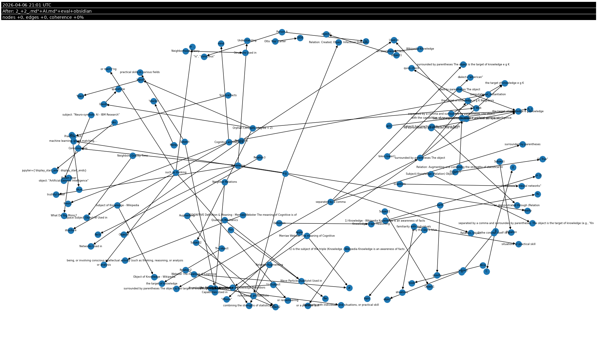](graph-2026-04-06-21-01-self-improve.png) [commit](https://github.com/BoggersTheFish/BoggersTheCIG/commit/f5b0105)

### 2026-04-07 02:22 UTC

**After:** vault analysis (+177 triples) — nodes +140, edges +88, coherence +8944%

[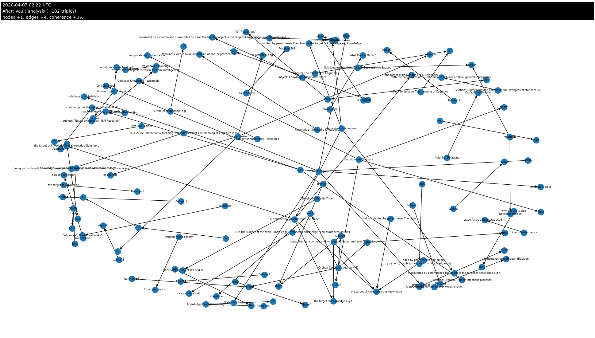](graph-2026-04-07-02-22-after-analyze-vault.png) [commit](https://github.com/BoggersTheFish/BoggersTheCIG/commit/906bab0)

### 2026-04-07 02:22 UTC

**After:** vault analysis (+182 triples) — nodes +1, edges +4, coherence +3%

 [commit](https://github.com/BoggersTheFish/BoggersTheCIG/commit/906bab0)

### 2026-04-07 02:29 UTC

**After:** vault organize (0 moves) — nodes +0, edges +0, coherence +0%

[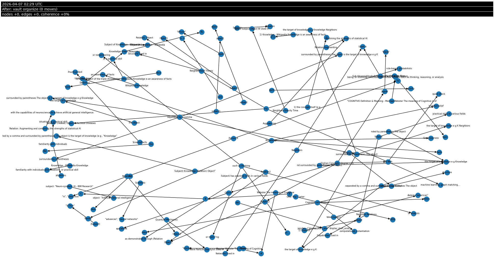](graph-2026-04-07-02-29-after-organize.png) [commit](https://github.com/BoggersTheFish/BoggersTheCIG/commit/906bab0)

### 2026-04-07 02:29 UTC

**After:** 1 extracts, 0 merges — nodes +0, edges +0, coherence +0%

[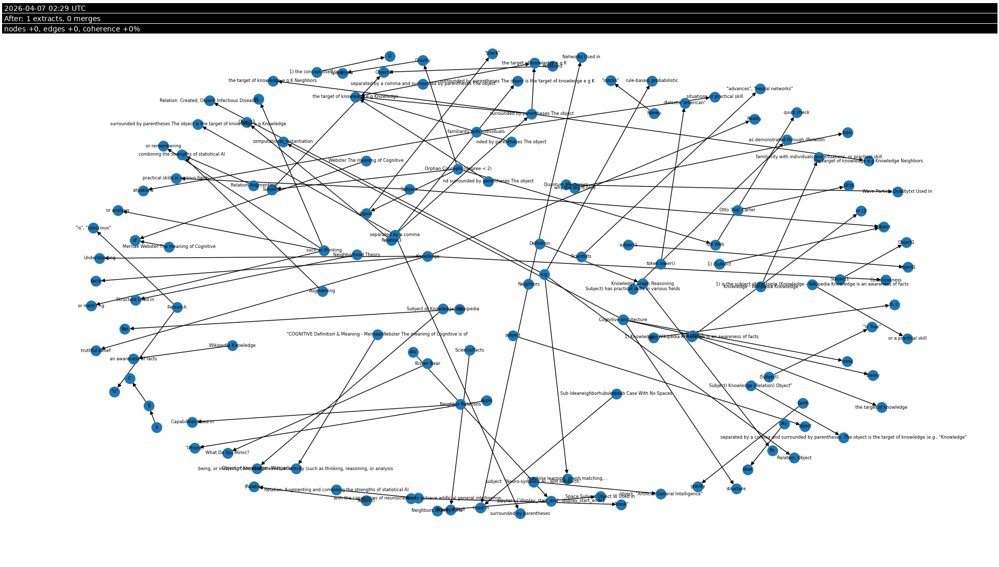](graph-2026-04-07-02-29-extract-subideas.png) [commit](https://github.com/BoggersTheFish/BoggersTheCIG/commit/906bab0)

### 2026-04-07 02:29 UTC

**After:** 2_+2_.md"+eval+obsidian — nodes +0, edges +0, coherence +0%

[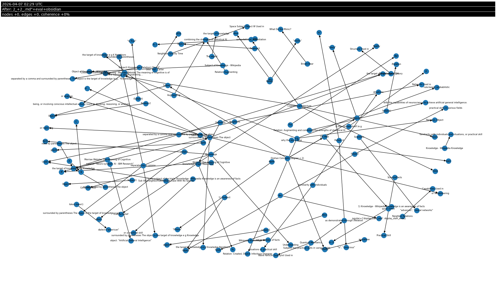](graph-2026-04-07-02-29-self-improve.png) [commit](https://github.com/BoggersTheFish/BoggersTheCIG/commit/906bab0)

### 2026-04-07 02:36 UTC

**After:** vault organize (2 moves) — nodes +0, edges +0, coherence +0%

[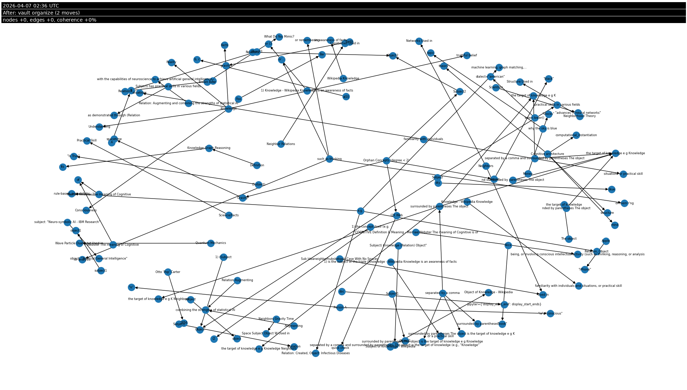](graph-2026-04-07-02-36-after-organize.png) [commit](https://github.com/BoggersTheFish/BoggersTheCIG/commit/906bab0)

### 2026-04-07 02:36 UTC

**After:** 0 extracts, 1 merges — nodes +0, edges +0, coherence +0%

[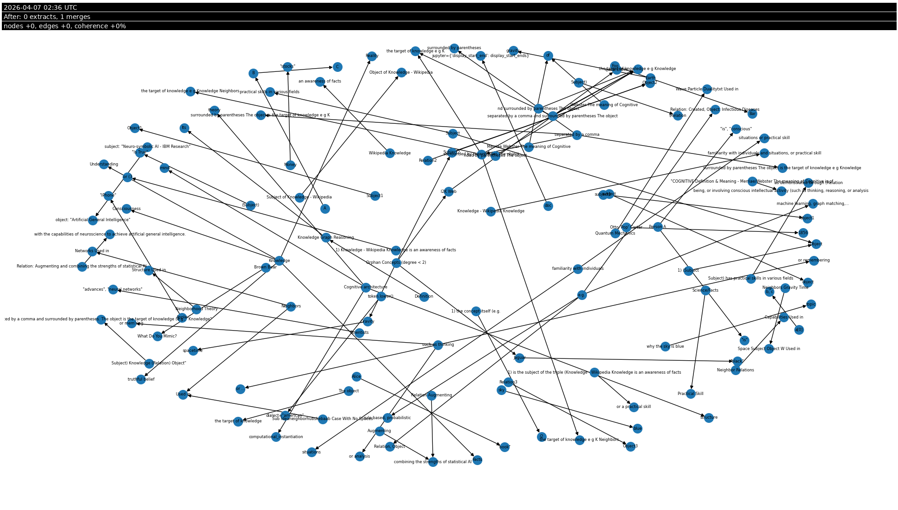](graph-2026-04-07-02-36-extract-subideas.png) [commit](https://github.com/BoggersTheFish/BoggersTheCIG/commit/906bab0)

### 2026-04-07 02:36 UTC

**After:** 2_+2_.md"+c.md"+eval+obsidian — nodes +0, edges +0, coherence +0%

[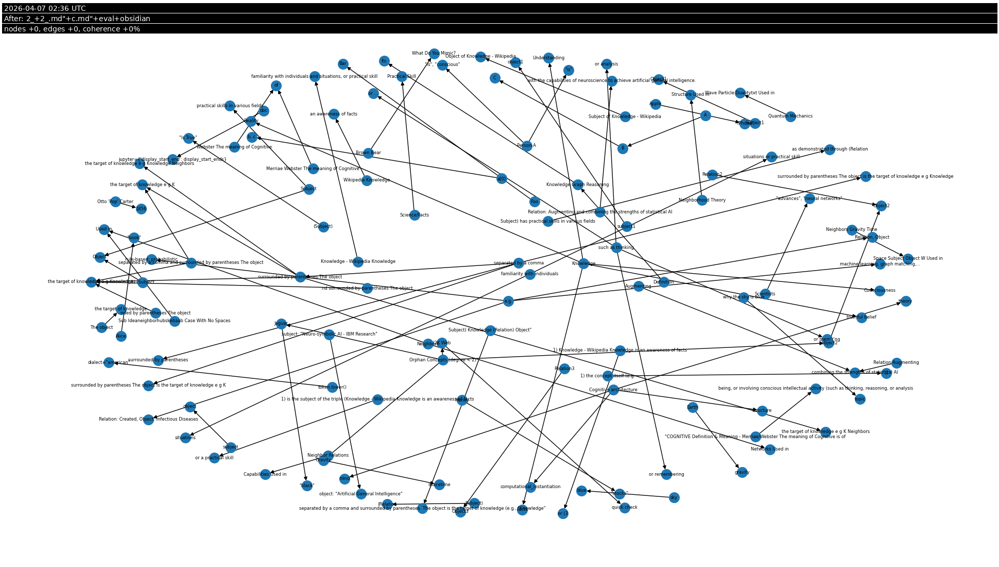](graph-2026-04-07-02-36-self-improve.png) [commit](https://github.com/BoggersTheFish/BoggersTheCIG/commit/906bab0)

### 2026-04-07 06:28 UTC

**After:** external ingest (+1 triples) — nodes +4, edges +2, coherence +333233%

[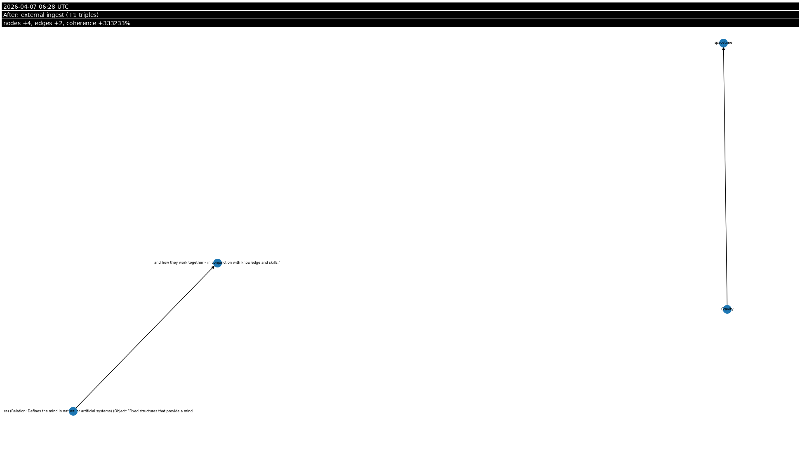](graph-2026-04-07-06-28-after-ingest.png) [commit](https://github.com/BoggersTheFish/BoggersTheCIG/commit/0ad4542)

### 2026-04-07 06:28 UTC

**After:** vault analysis (+181 triples) — nodes +139, edges +88, coherence -97%

[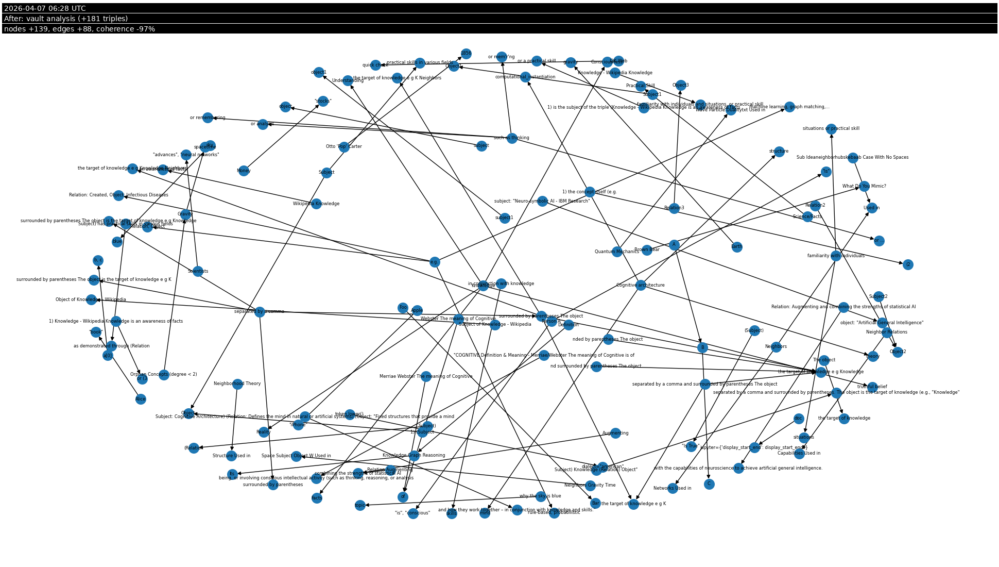](graph-2026-04-07-06-28-after-analyze-vault.png) [commit](https://github.com/BoggersTheFish/BoggersTheCIG/commit/0ad4542)

### 2026-04-07 06:29 UTC

**After:** vault analysis (+183 triples) — nodes +0, edges +4, coherence +4%

[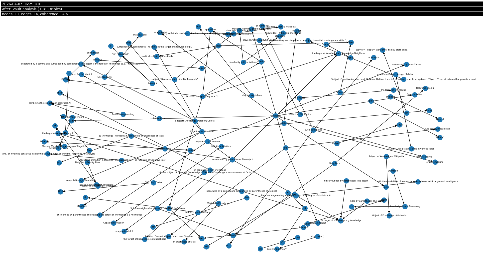](graph-2026-04-07-06-29-after-analyze-vault.png) [commit](https://github.com/BoggersTheFish/BoggersTheCIG/commit/0ad4542)

### 2026-04-07 06:35 UTC

**After:** vault organize (3 moves) — nodes +0, edges +0, coherence +0%

[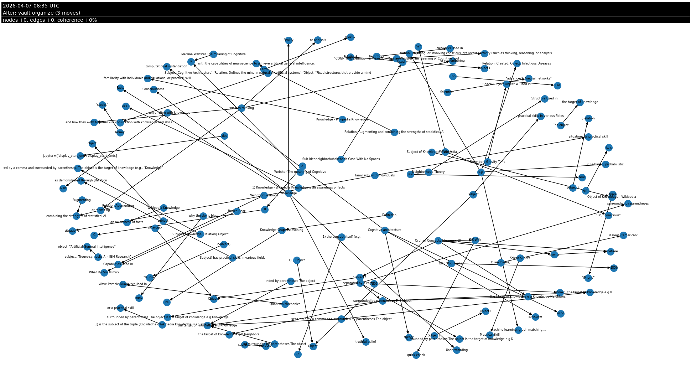](graph-2026-04-07-06-35-after-organize.png) [commit](https://github.com/BoggersTheFish/BoggersTheCIG/commit/0ad4542)

### 2026-04-07 06:35 UTC

**After:** 1 extracts, 0 merges — nodes +0, edges +0, coherence +0%

[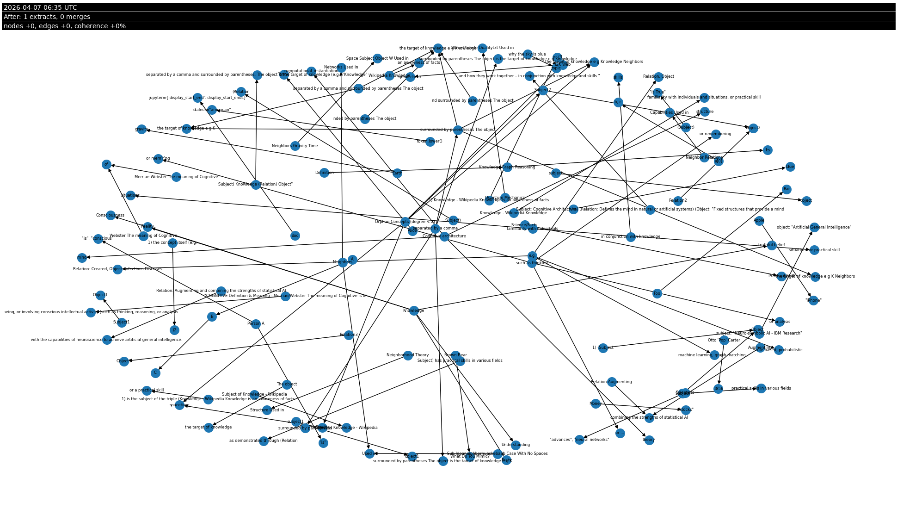](graph-2026-04-07-06-35-extract-subideas.png) [commit](https://github.com/BoggersTheFish/BoggersTheCIG/commit/0ad4542)

### 2026-04-07 06:35 UTC

**After:** 2_+2_.md"+AI.md"+Augmenting.md"+___.md" — nodes +0, edges +0, coherence +0%

[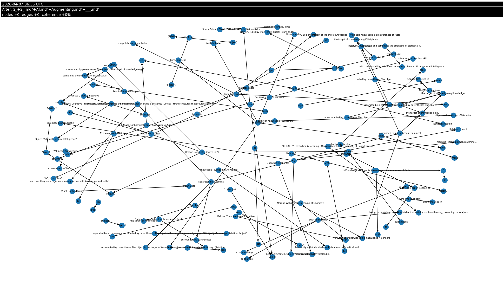](graph-2026-04-07-06-35-self-improve.png) [commit](https://github.com/BoggersTheFish/BoggersTheCIG/commit/0ad4542)

### 2026-04-07 06:41 UTC

**After:** vault organize (1 moves) — nodes +0, edges +0, coherence +0%

[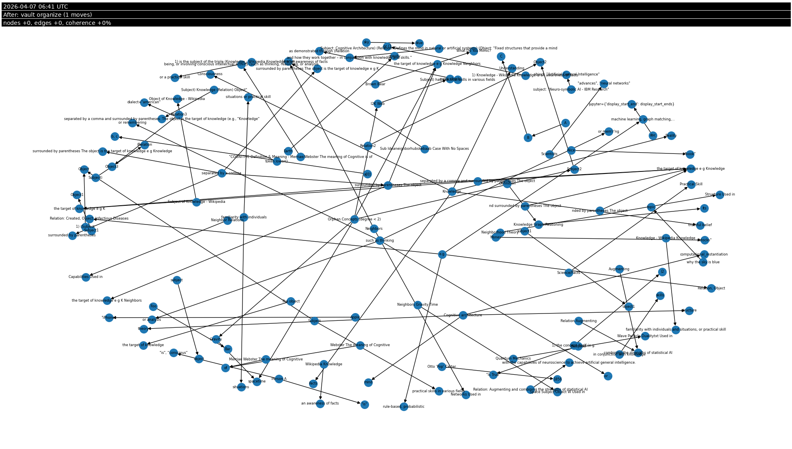](graph-2026-04-07-06-41-after-organize.png) [commit](https://github.com/BoggersTheFish/BoggersTheCIG/commit/0ad4542)

### 2026-04-07 06:42 UTC

**After:** 0 extracts, 1 merges — nodes +0, edges +0, coherence +0%

[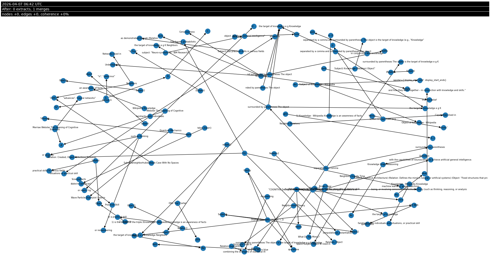](graph-2026-04-07-06-42-extract-subideas.png) [commit](https://github.com/BoggersTheFish/BoggersTheCIG/commit/0ad4542)

### 2026-04-07 06:42 UTC

**After:** 2_+2_.md"+AI.md"+Augmenting.md"+___.md" — nodes +0, edges +0, coherence +0%

[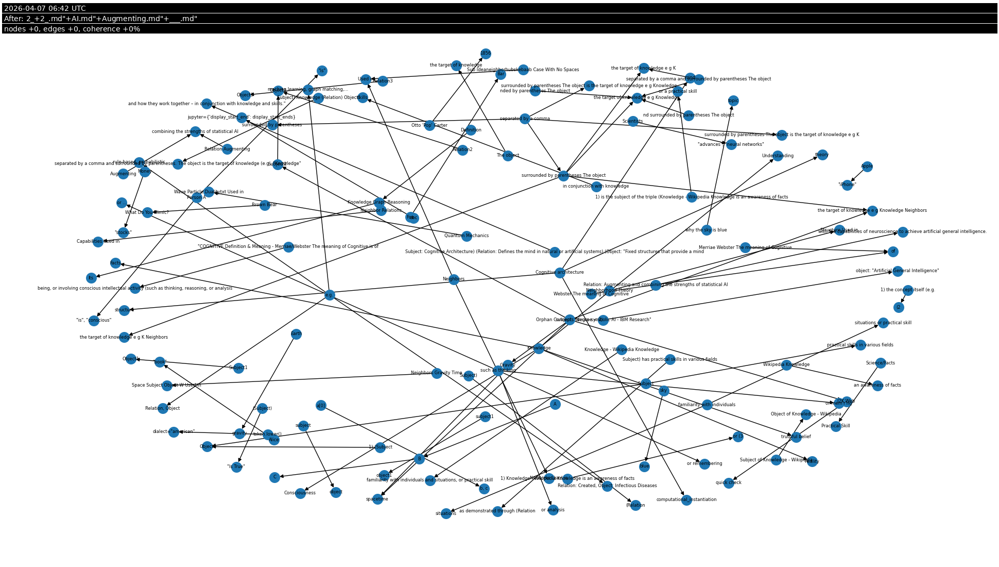](graph-2026-04-07-06-42-self-improve.png) [commit](https://github.com/BoggersTheFish/BoggersTheCIG/commit/0ad4542)

### 2026-04-07 11:04 UTC

**After:** vault analysis (+182 triples) — nodes +143, edges +90, coherence +8764%

[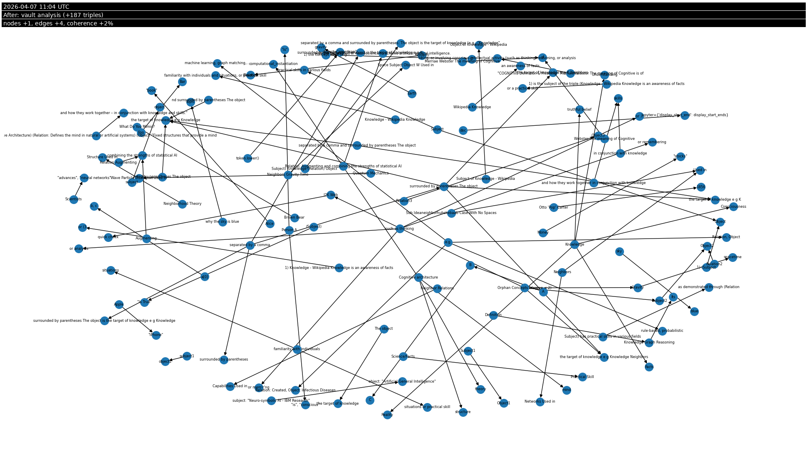](graph-2026-04-07-11-04-after-analyze-vault.png) [commit](https://github.com/BoggersTheFish/BoggersTheCIG/commit/f070869)

### 2026-04-07 11:04 UTC

**After:** 1 extracts, 0 merges — nodes +0, edges +0, coherence +0%

[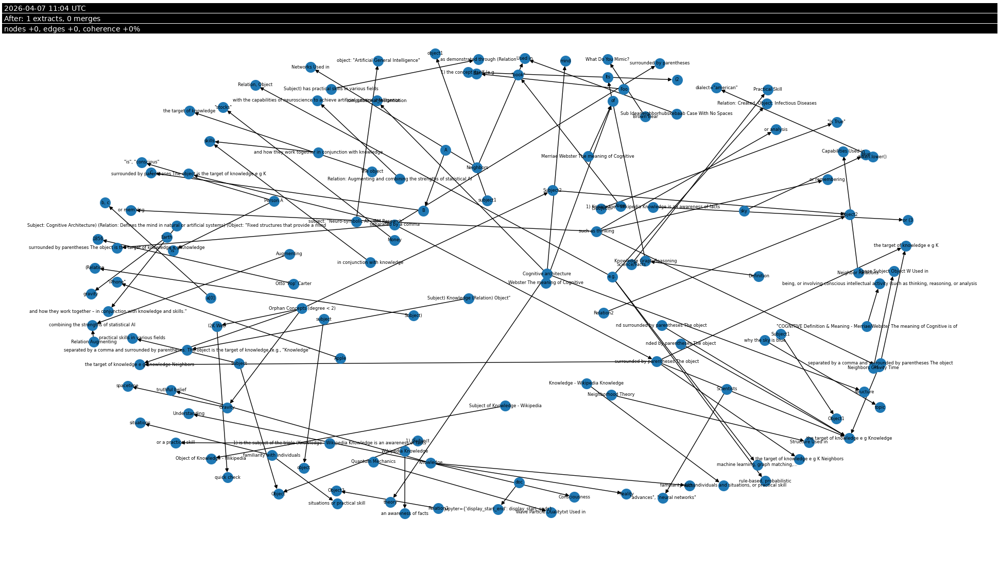](graph-2026-04-07-11-04-extract-subideas.png) [commit](https://github.com/BoggersTheFish/BoggersTheCIG/commit/f070869)

### 2026-04-07 11:04 UTC

**After:** vault analysis (+187 triples) — nodes +1, edges +4, coherence +2%

 [commit](https://github.com/BoggersTheFish/BoggersTheCIG/commit/f070869)

### 2026-04-07 11:04 UTC

**After:** 1 extracts, 0 merges — nodes +0, edges +0, coherence +0%

 [commit](https://github.com/BoggersTheFish/BoggersTheCIG/commit/f070869)

### 2026-04-07 11:10 UTC

**After:** vault organize (1 moves) — nodes +0, edges +0, coherence +0%

[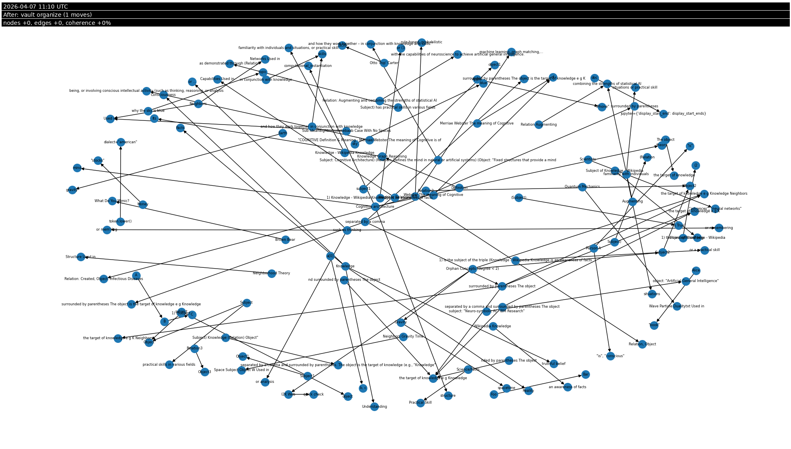](graph-2026-04-07-11-10-after-organize.png) [commit](https://github.com/BoggersTheFish/BoggersTheCIG/commit/f070869)

### 2026-04-07 11:11 UTC

**After:** 0 extracts, 1 merges — nodes +0, edges +0, coherence +0%

[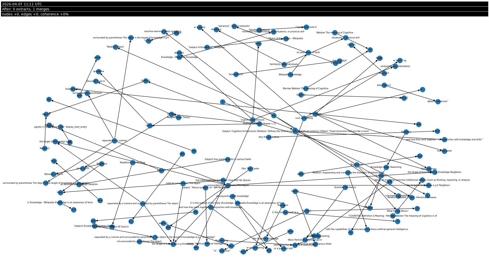](graph-2026-04-07-11-11-extract-subideas.png) [commit](https://github.com/BoggersTheFish/BoggersTheCIG/commit/f070869)

### 2026-04-07 11:11 UTC

**After:** 2_.md"+AI.md"+comma.md"+eval+knowledge.md" — nodes +0, edges +0, coherence +0%

[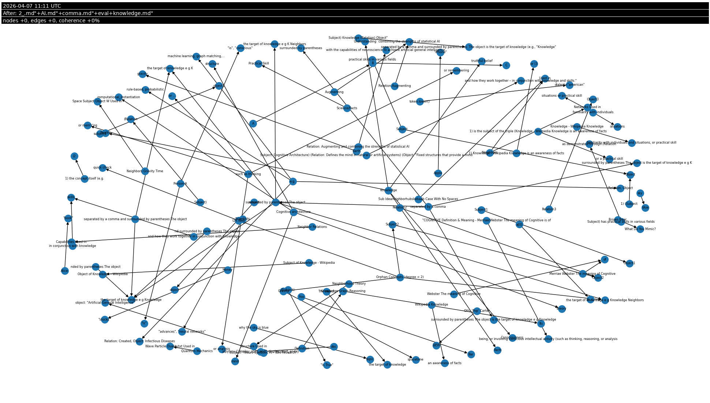](graph-2026-04-07-11-11-self-improve.png) [commit](https://github.com/BoggersTheFish/BoggersTheCIG/commit/f070869)

### 2026-04-07 11:17 UTC

**After:** vault organize (1 moves) — nodes +0, edges +0, coherence +0%

[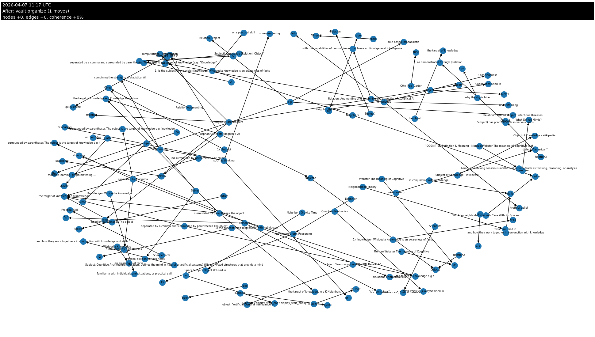](graph-2026-04-07-11-17-after-organize.png) [commit](https://github.com/BoggersTheFish/BoggersTheCIG/commit/f070869)

### 2026-04-07 11:17 UTC

**After:** 1 extracts, 0 merges — nodes +0, edges +0, coherence +0%

[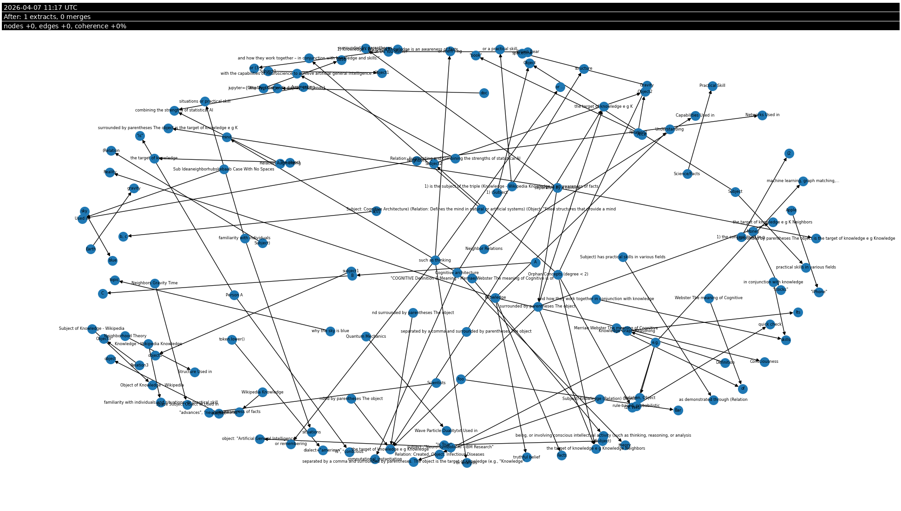](graph-2026-04-07-11-17-extract-subideas.png) [commit](https://github.com/BoggersTheFish/BoggersTheCIG/commit/f070869)

### 2026-04-07 11:17 UTC

**After:** 2_+2_.md"+AI.md"+comma.md"+eval — nodes +0, edges +0, coherence +0%

[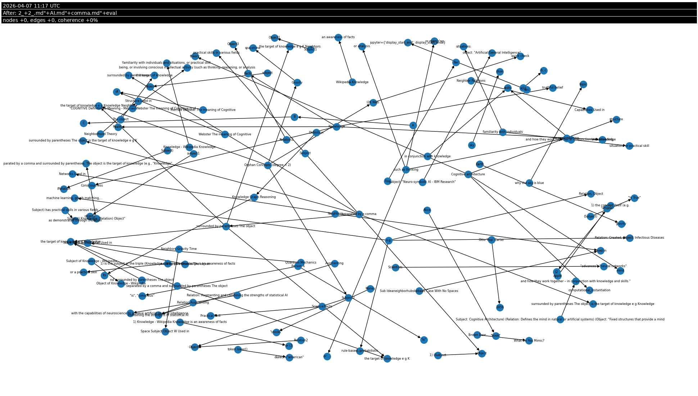](graph-2026-04-07-11-17-self-improve.png) [commit](https://github.com/BoggersTheFish/BoggersTheCIG/commit/f070869)

### 2026-04-07 16:19 UTC

**After:** vault analysis (+183 triples) — nodes +143, edges +90, coherence +8764%

[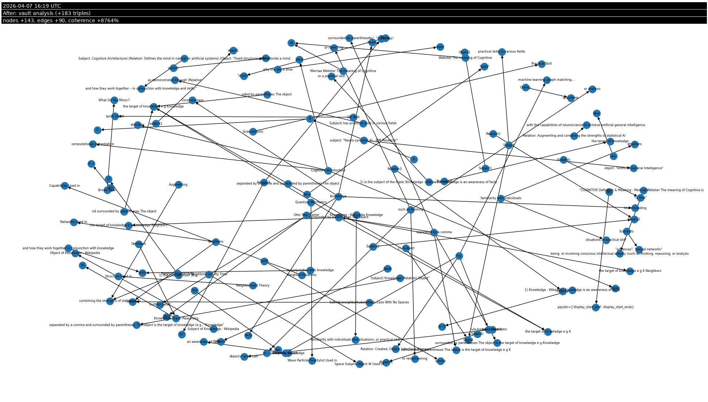](graph-2026-04-07-16-19-after-analyze-vault.png) [commit](https://github.com/BoggersTheFish/BoggersTheCIG/commit/e8de1ef)

### 2026-04-07 16:20 UTC

**After:** vault analysis (+188 triples) — nodes +1, edges +4, coherence +2%

[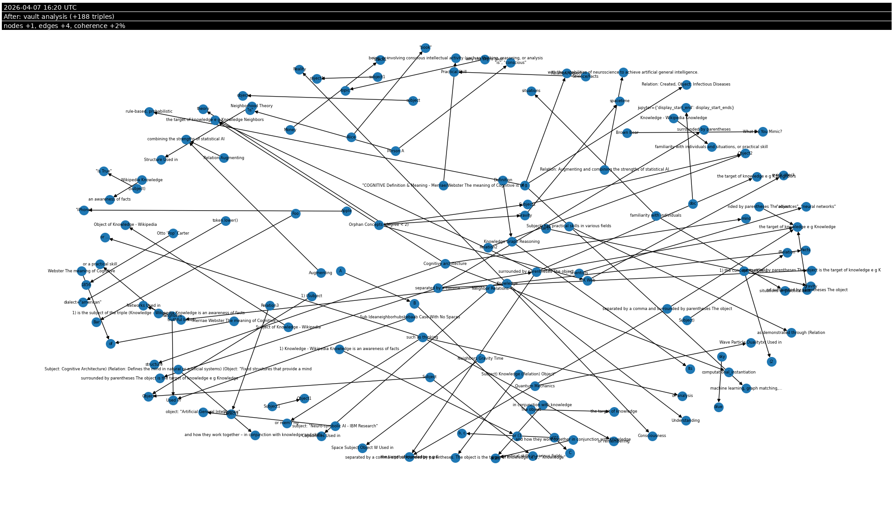](graph-2026-04-07-16-20-after-analyze-vault.png) [commit](https://github.com/BoggersTheFish/BoggersTheCIG/commit/e8de1ef)

### 2026-04-07 16:26 UTC

**After:** vault organize (3 moves) — nodes +0, edges +0, coherence +0%

[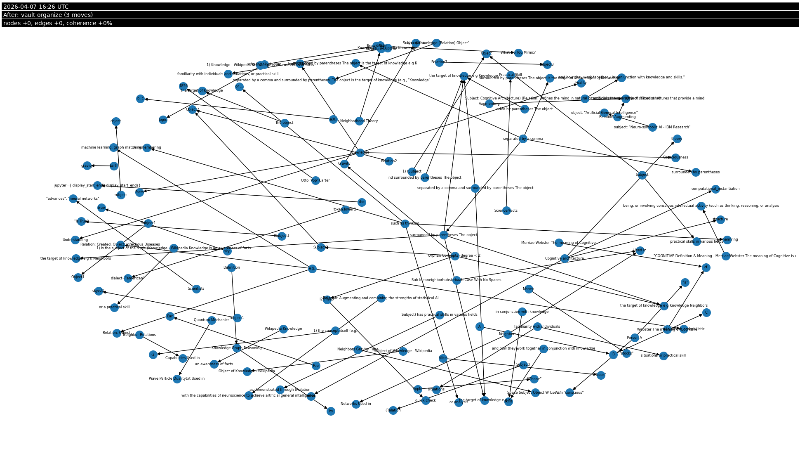](graph-2026-04-07-16-26-after-organize.png) [commit](https://github.com/BoggersTheFish/BoggersTheCIG/commit/e8de1ef)

### 2026-04-07 16:26 UTC

**After:** 1 extracts, 0 merges — nodes +0, edges +0, coherence +0%

[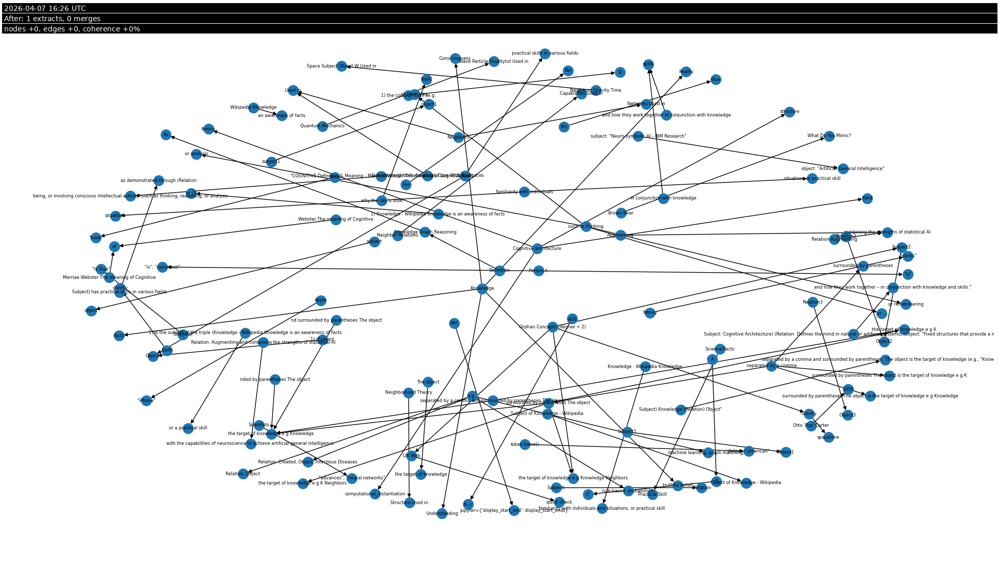](graph-2026-04-07-16-26-extract-subideas.png) [commit](https://github.com/BoggersTheFish/BoggersTheCIG/commit/e8de1ef)

### 2026-04-07 16:26 UTC

**After:** 2_+2_.md"+Relations.md"+analysis.md"+eval — nodes +0, edges +0, coherence +0%

[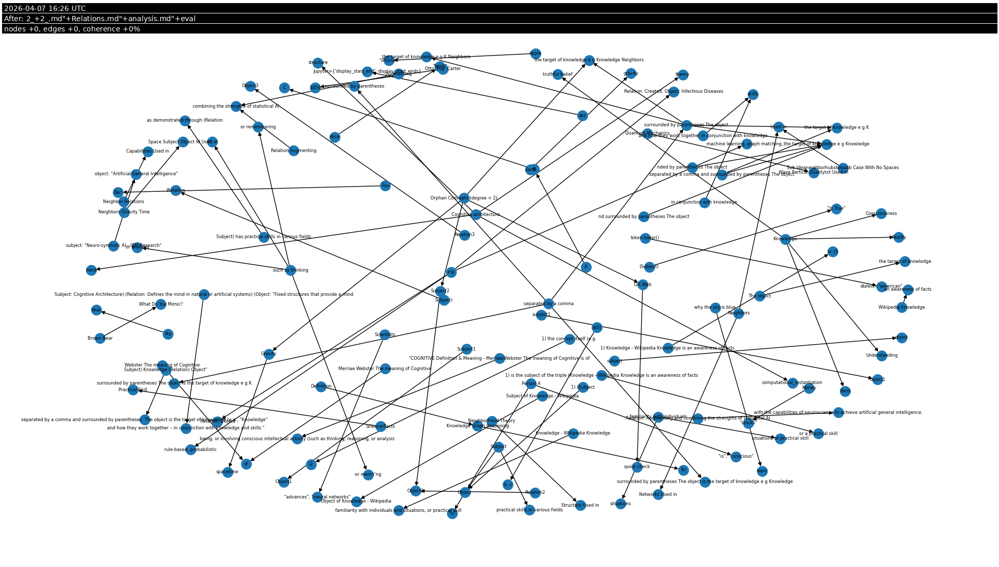](graph-2026-04-07-16-26-self-improve.png) [commit](https://github.com/BoggersTheFish/BoggersTheCIG/commit/e8de1ef)

### 2026-04-07 16:33 UTC

**After:** vault organize (2 moves) — nodes +0, edges +0, coherence +0%

[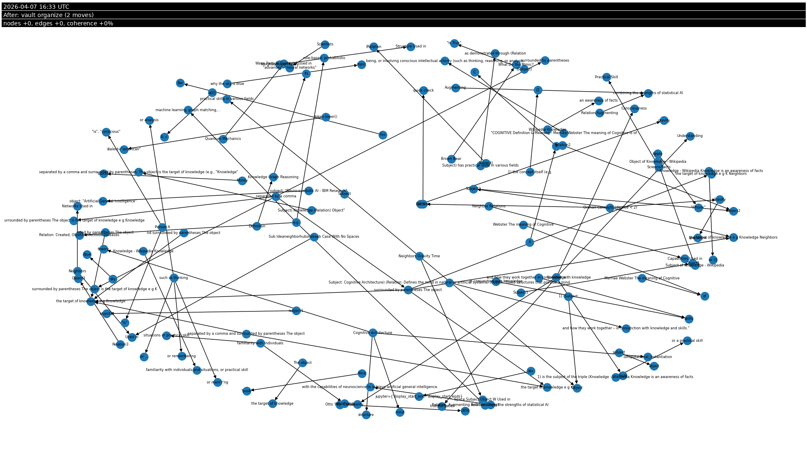](graph-2026-04-07-16-33-after-organize.png) [commit](https://github.com/BoggersTheFish/BoggersTheCIG/commit/e8de1ef)

### 2026-04-07 16:33 UTC

**After:** 0 extracts, 1 merges — nodes +0, edges +0, coherence +0%

[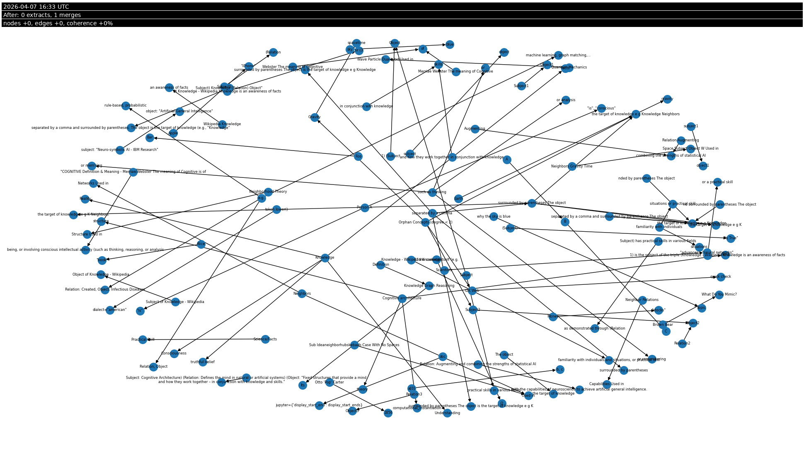](graph-2026-04-07-16-33-extract-subideas.png) [commit](https://github.com/BoggersTheFish/BoggersTheCIG/commit/e8de1ef)

### 2026-04-07 16:33 UTC

**After:** 2_+2_.md"+Relations.md"+analysis.md"+eval — nodes +0, edges +0, coherence +0%

[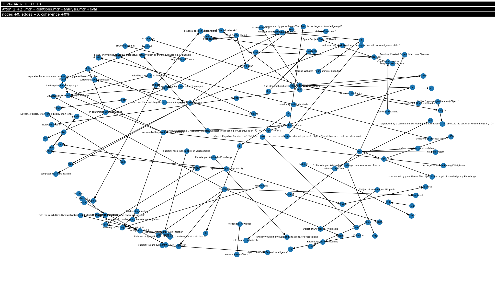](graph-2026-04-07-16-33-self-improve.png) [commit](https://github.com/BoggersTheFish/BoggersTheCIG/commit/e8de1ef)

### 2026-04-07 20:55 UTC

**After:** vault analysis (+185 triples) — nodes +143, edges +90, coherence +8764%

[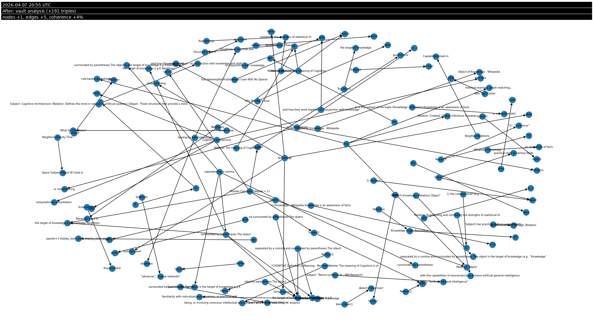](graph-2026-04-07-20-55-after-analyze-vault.png) [commit](https://github.com/BoggersTheFish/BoggersTheCIG/commit/0ad3a62)

### 2026-04-07 20:55 UTC

**After:** 1 extracts, 0 merges — nodes +0, edges +0, coherence +0%

[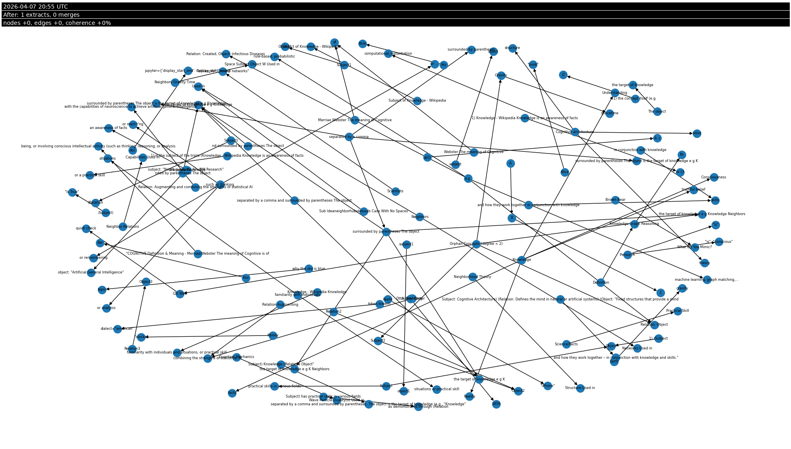](graph-2026-04-07-20-55-extract-subideas.png) [commit](https://github.com/BoggersTheFish/BoggersTheCIG/commit/0ad3a62)

### 2026-04-07 20:55 UTC

**After:** vault analysis (+191 triples) — nodes +1, edges +5, coherence +4%

 [commit](https://github.com/BoggersTheFish/BoggersTheCIG/commit/0ad3a62)

### 2026-04-07 20:55 UTC

**After:** 1 extracts, 0 merges — nodes +0, edges +0, coherence +0%

 [commit](https://github.com/BoggersTheFish/BoggersTheCIG/commit/0ad3a62)

### 2026-04-07 21:02 UTC

**After:** vault organize (1 moves) — nodes +0, edges +0, coherence +0%

[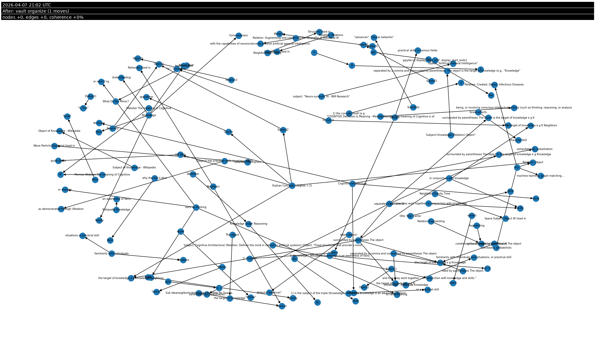](graph-2026-04-07-21-02-after-organize.png) [commit](https://github.com/BoggersTheFish/BoggersTheCIG/commit/0ad3a62)

### 2026-04-07 21:02 UTC

**After:** 0 extracts, 1 merges — nodes +0, edges +0, coherence +0%

[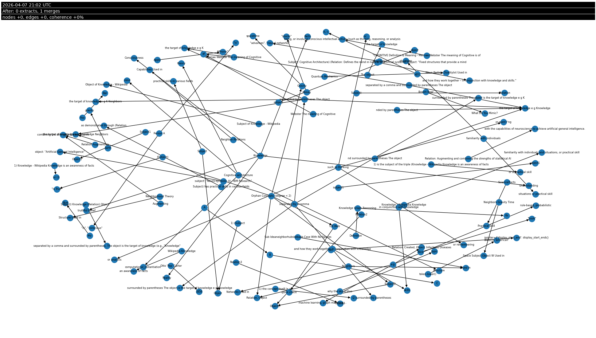](graph-2026-04-07-21-02-extract-subideas.png) [commit](https://github.com/BoggersTheFish/BoggersTheCIG/commit/0ad3a62)

### 2026-04-07 21:02 UTC

**After:** 2_+2_.md"+comma.md"+eval+mind.md" — nodes +0, edges +0, coherence +0%

[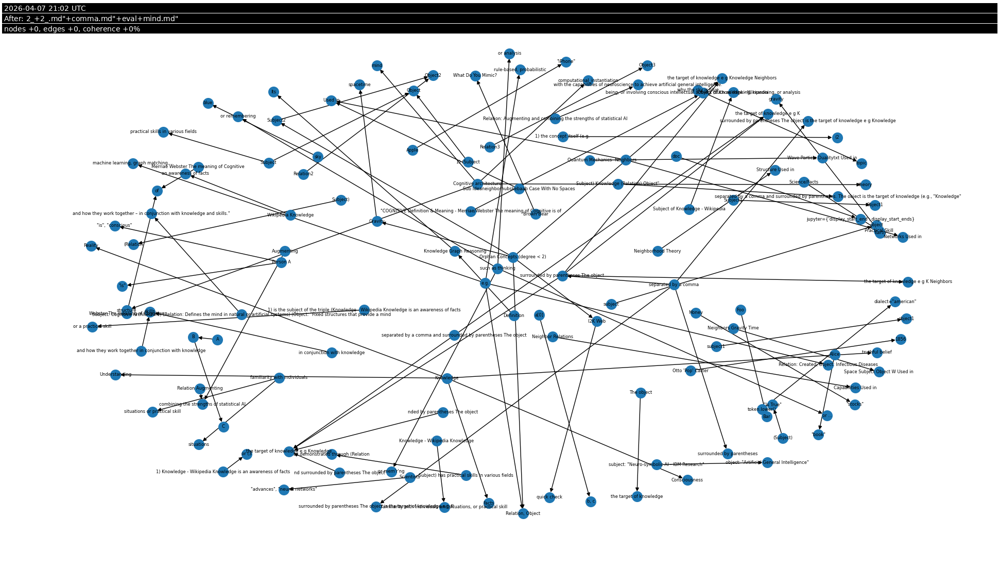](graph-2026-04-07-21-02-self-improve.png) [commit](https://github.com/BoggersTheFish/BoggersTheCIG/commit/0ad3a62)

### 2026-04-07 21:08 UTC

**After:** vault organize (0 moves) — nodes +0, edges +0, coherence +0%

[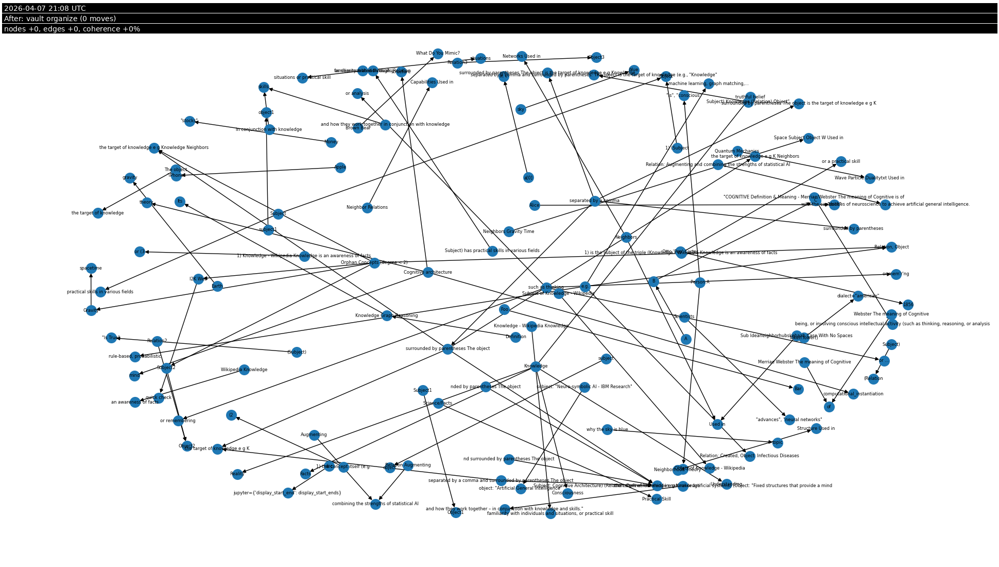](graph-2026-04-07-21-08-after-organize.png) [commit](https://github.com/BoggersTheFish/BoggersTheCIG/commit/0ad3a62)

### 2026-04-07 21:08 UTC

**After:** 0 extracts, 1 merges — nodes +0, edges +0, coherence +0%

[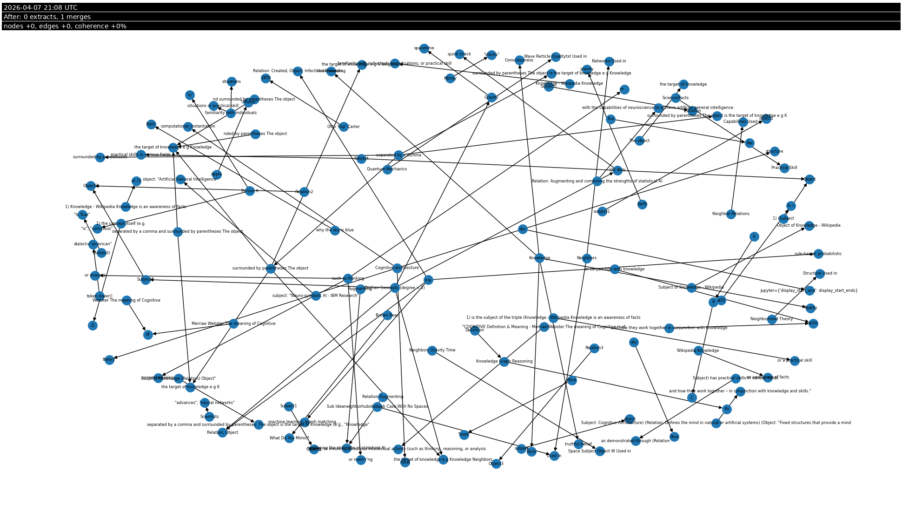](graph-2026-04-07-21-08-extract-subideas.png) [commit](https://github.com/BoggersTheFish/BoggersTheCIG/commit/0ad3a62)

### 2026-04-07 21:08 UTC

**After:** 2_+2_.md"+comma.md"+eval+mind.md" — nodes +0, edges +0, coherence +0%

[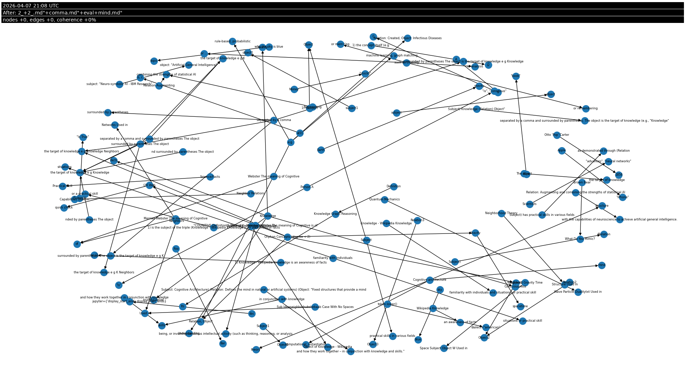](graph-2026-04-07-21-08-self-improve.png) [commit](https://github.com/BoggersTheFish/BoggersTheCIG/commit/0ad3a62)

### 2026-04-08 02:24 UTC

**After:** external ingest (+1 triples) — nodes +4, edges +2, coherence +333233%

[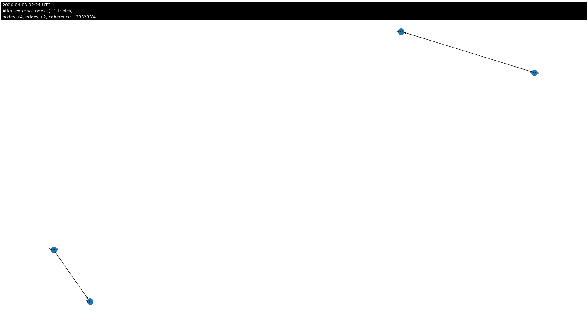](graph-2026-04-08-02-24-after-ingest.png) [commit](https://github.com/BoggersTheFish/BoggersTheCIG/commit/a7d22d7)

### 2026-04-08 02:24 UTC

**After:** vault analysis (+187 triples) — nodes +140, edges +89, coherence -97%

[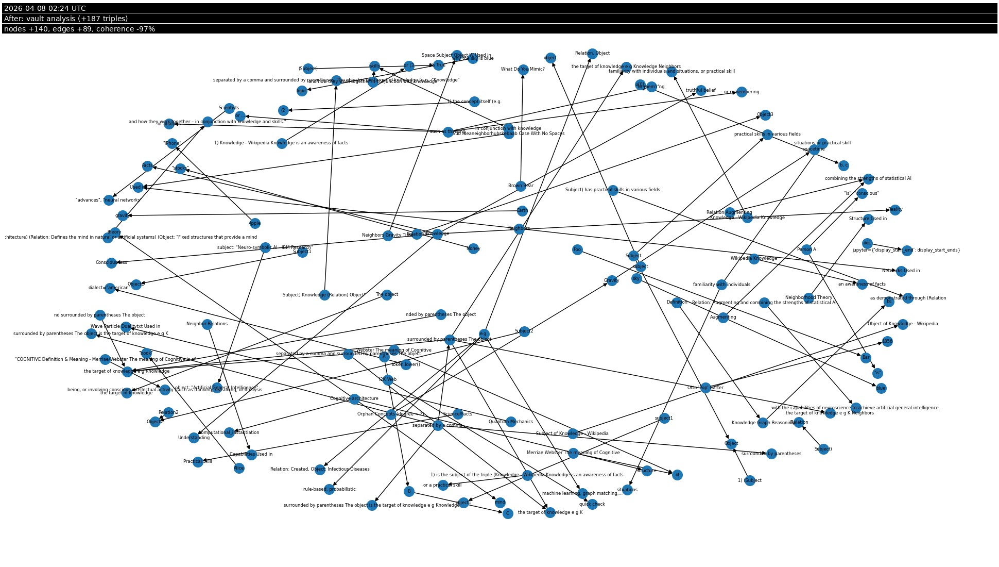](graph-2026-04-08-02-24-after-analyze-vault.png) [commit](https://github.com/BoggersTheFish/BoggersTheCIG/commit/a7d22d7)

### 2026-04-08 02:25 UTC

**After:** vault analysis (+190 triples) — nodes +0, edges +4, coherence +4%

[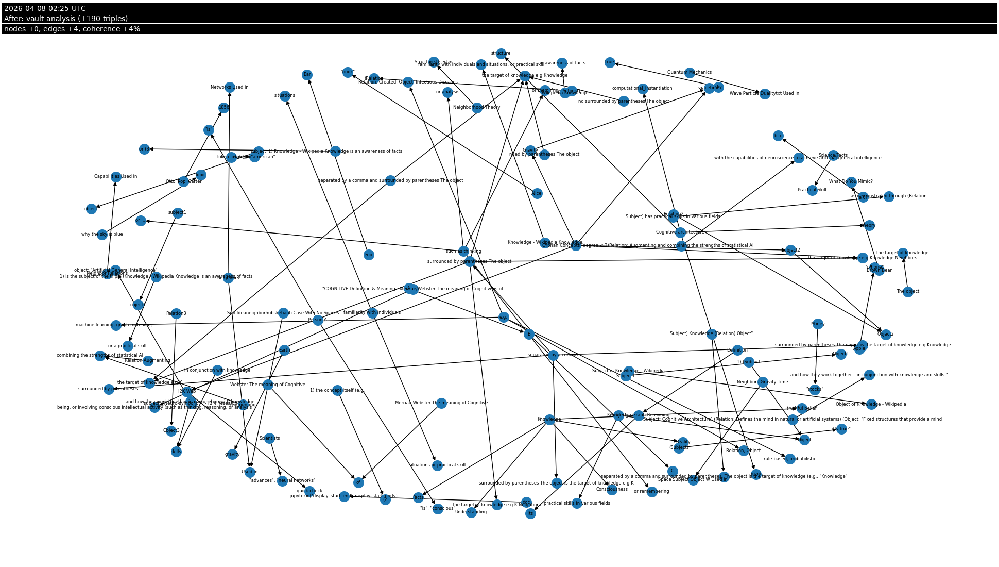](graph-2026-04-08-02-25-after-analyze-vault.png) [commit](https://github.com/BoggersTheFish/BoggersTheCIG/commit/a7d22d7)

### 2026-04-08 02:32 UTC

**After:** vault organize (3 moves) — nodes +0, edges +0, coherence +0%

[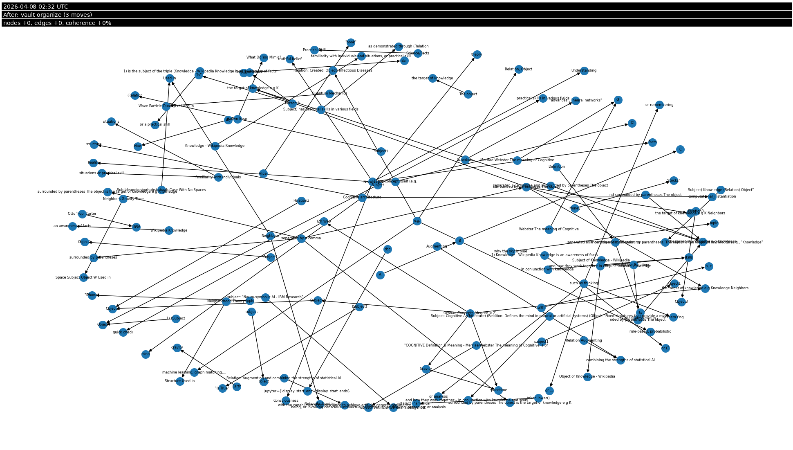](graph-2026-04-08-02-32-after-organize.png) [commit](https://github.com/BoggersTheFish/BoggersTheCIG/commit/a7d22d7)

### 2026-04-08 02:32 UTC

**After:** 1 extracts, 0 merges — nodes +0, edges +0, coherence +0%

[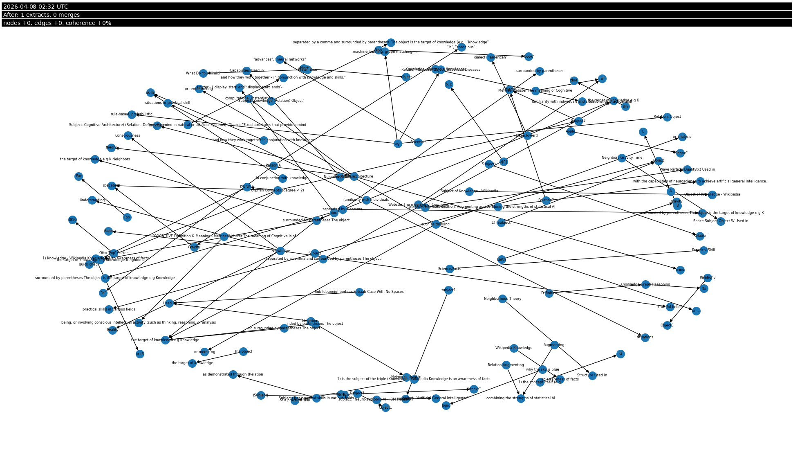](graph-2026-04-08-02-32-extract-subideas.png) [commit](https://github.com/BoggersTheFish/BoggersTheCIG/commit/a7d22d7)

### 2026-04-08 02:32 UTC

**After:** 2_+2_.md"+Knowledge.md"+comma.md"+eval — nodes +0, edges +0, coherence +0%

[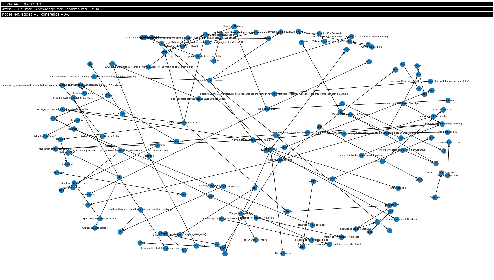](graph-2026-04-08-02-32-self-improve.png) [commit](https://github.com/BoggersTheFish/BoggersTheCIG/commit/a7d22d7)

### 2026-04-08 02:38 UTC

**After:** vault organize (0 moves) — nodes +0, edges +0, coherence +0%

[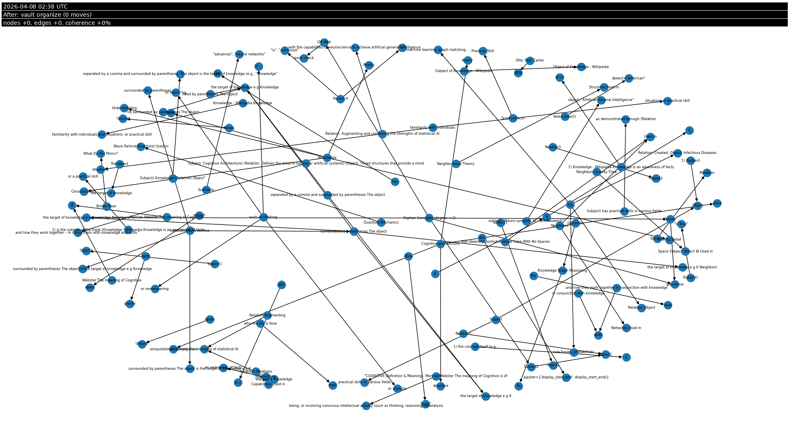](graph-2026-04-08-02-38-after-organize.png) [commit](https://github.com/BoggersTheFish/BoggersTheCIG/commit/a7d22d7)

### 2026-04-08 02:38 UTC

**After:** 0 extracts, 1 merges — nodes +0, edges +0, coherence +0%

[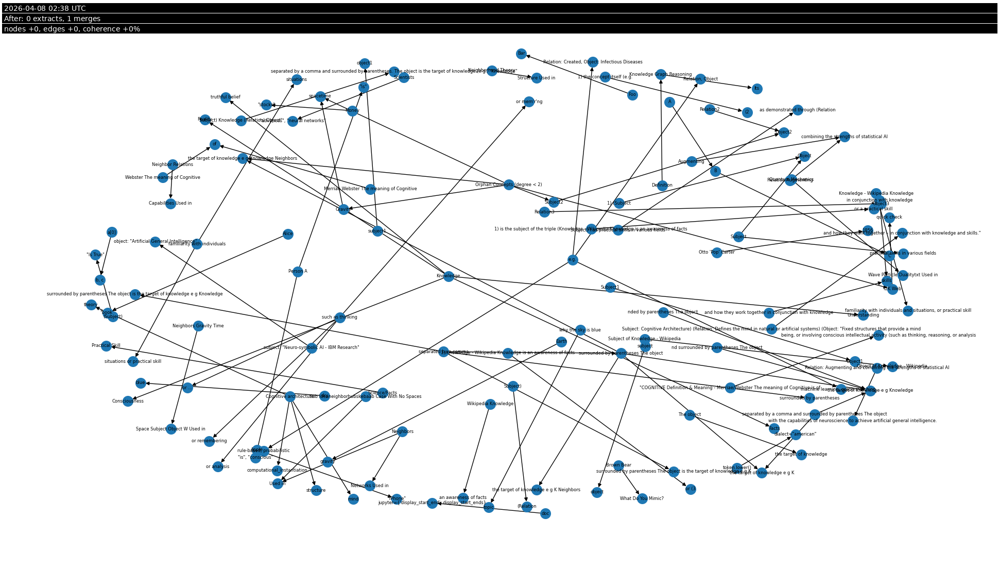](graph-2026-04-08-02-38-extract-subideas.png) [commit](https://github.com/BoggersTheFish/BoggersTheCIG/commit/a7d22d7)

### 2026-04-08 02:38 UTC

**After:** 2_+2_.md"+Knowledge.md"+comma.md"+eval — nodes +0, edges +0, coherence +0%

[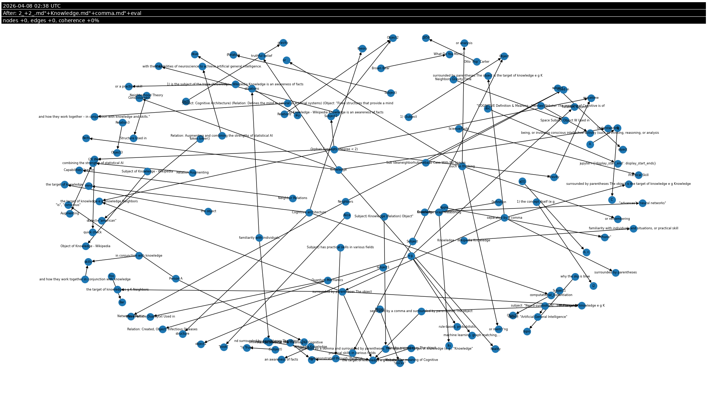](graph-2026-04-08-02-38-self-improve.png) [commit](https://github.com/BoggersTheFish/BoggersTheCIG/commit/a7d22d7)

### 2026-04-08 06:30 UTC

**After:** vault analysis (+183 triples) — nodes +141, edges +88, coherence +8815%

[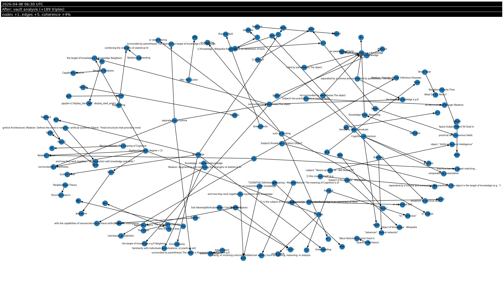](graph-2026-04-08-06-30-after-analyze-vault.png) [commit](https://github.com/BoggersTheFish/BoggersTheCIG/commit/2f3ae37)

### 2026-04-08 06:30 UTC

**After:** vault analysis (+189 triples) — nodes +1, edges +5, coherence +4%

 [commit](https://github.com/BoggersTheFish/BoggersTheCIG/commit/2f3ae37)

### 2026-04-08 06:36 UTC

**After:** vault organize (0 moves) — nodes +0, edges +0, coherence +0%

[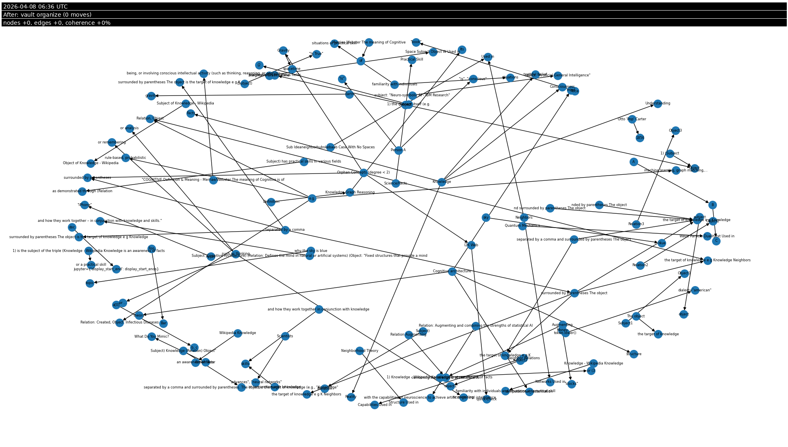](graph-2026-04-08-06-36-after-organize.png) [commit](https://github.com/BoggersTheFish/BoggersTheCIG/commit/2f3ae37)

### 2026-04-08 06:36 UTC

**After:** 1 extracts, 0 merges — nodes +0, edges +0, coherence +0%

[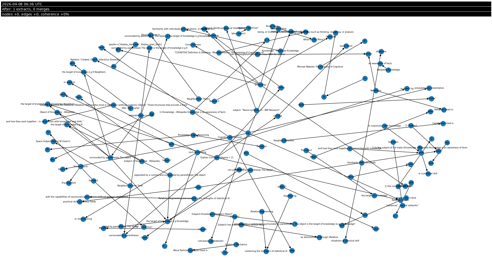](graph-2026-04-08-06-36-extract-subideas.png) [commit](https://github.com/BoggersTheFish/BoggersTheCIG/commit/2f3ae37)

### 2026-04-08 06:36 UTC

**After:** 2_+2_.md"+Cognitive.md"+comma.md"+eval — nodes +0, edges +0, coherence +0%

[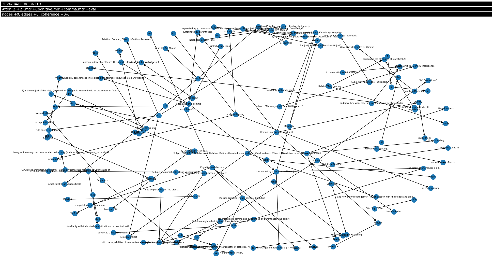](graph-2026-04-08-06-36-self-improve.png) [commit](https://github.com/BoggersTheFish/BoggersTheCIG/commit/2f3ae37)

### 2026-04-08 06:42 UTC

**After:** vault organize (0 moves) — nodes +0, edges +0, coherence +0%

[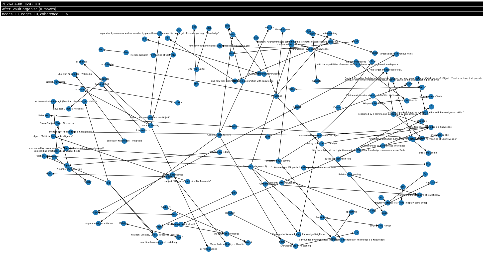](graph-2026-04-08-06-42-after-organize.png) [commit](https://github.com/BoggersTheFish/BoggersTheCIG/commit/2f3ae37)

### 2026-04-08 06:42 UTC

**After:** 0 extracts, 1 merges — nodes +0, edges +0, coherence +0%

[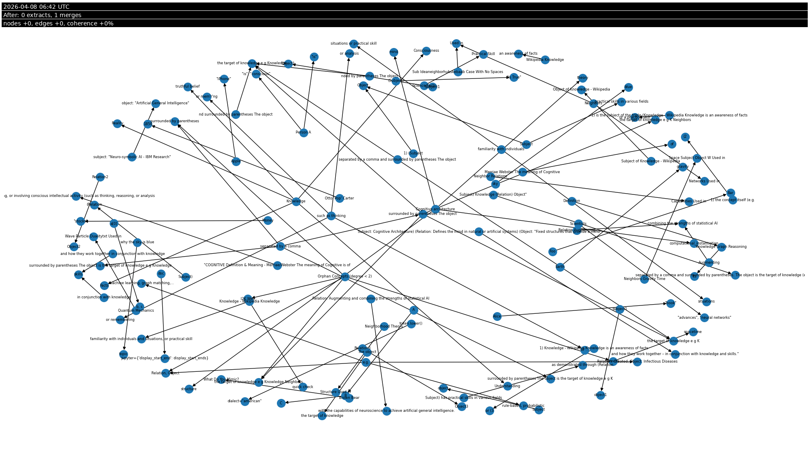](graph-2026-04-08-06-42-extract-subideas.png) [commit](https://github.com/BoggersTheFish/BoggersTheCIG/commit/2f3ae37)

### 2026-04-08 06:42 UTC

**After:** 2_+2_.md"+Cognitive.md"+comma.md"+eval — nodes +0, edges +0, coherence +0%

[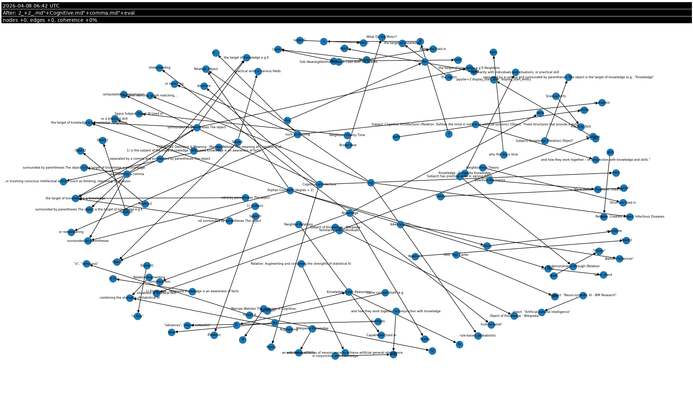](graph-2026-04-08-06-42-self-improve.png) [commit](https://github.com/BoggersTheFish/BoggersTheCIG/commit/2f3ae37)

### 2026-04-08 11:04 UTC

**After:** vault analysis (+184 triples) — nodes +141, edges +88, coherence +8815%

[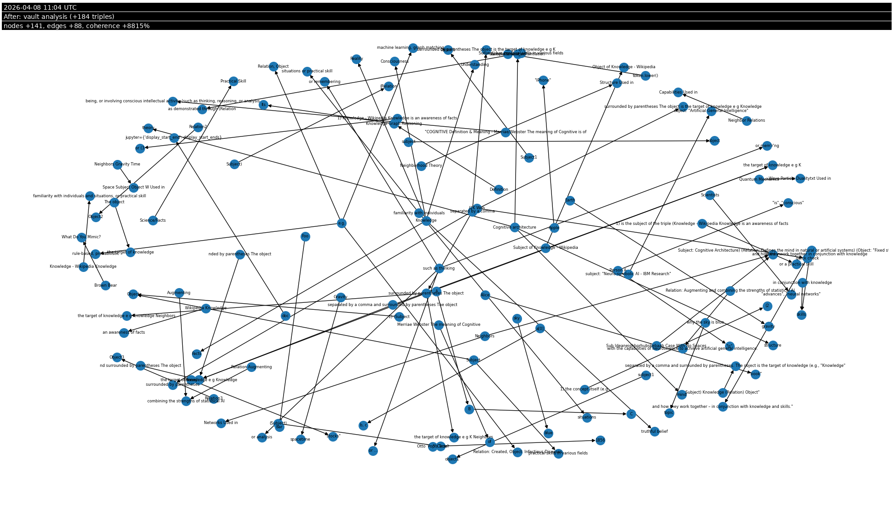](graph-2026-04-08-11-04-after-analyze-vault.png) [commit](https://github.com/BoggersTheFish/BoggersTheCIG/commit/ee0aae8)

### 2026-04-08 11:05 UTC

**After:** vault analysis (+189 triples) — nodes +1, edges +4, coherence +3%

[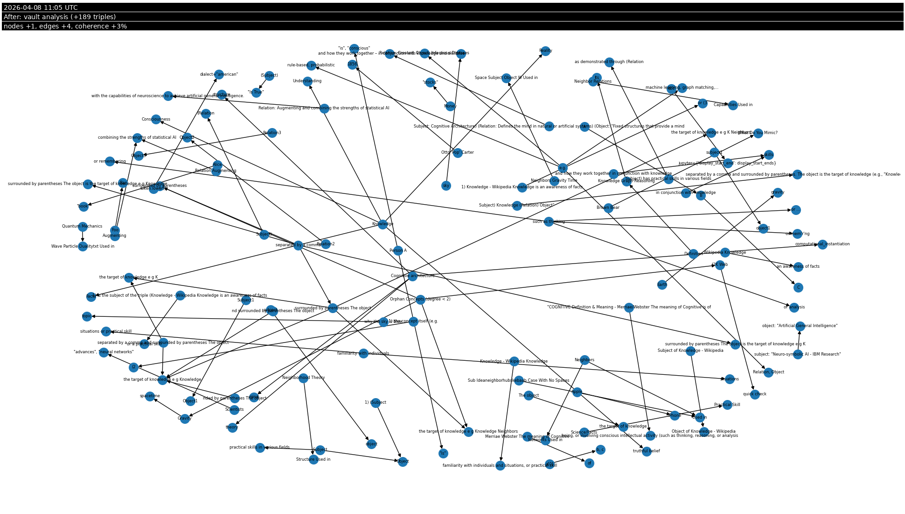](graph-2026-04-08-11-05-after-analyze-vault.png) [commit](https://github.com/BoggersTheFish/BoggersTheCIG/commit/ee0aae8)

### 2026-04-08 11:11 UTC

**After:** vault organize (0 moves) — nodes +0, edges +0, coherence +0%

[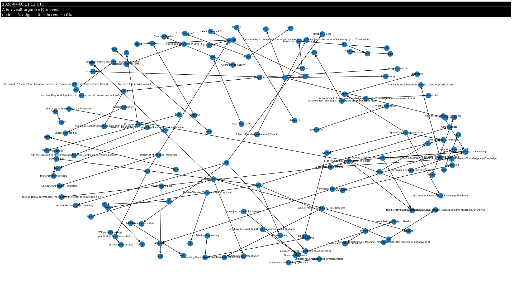](graph-2026-04-08-11-11-after-organize.png) [commit](https://github.com/BoggersTheFish/BoggersTheCIG/commit/ee0aae8)

### 2026-04-08 11:11 UTC

**After:** 1 extracts, 0 merges — nodes +0, edges +0, coherence +0%

[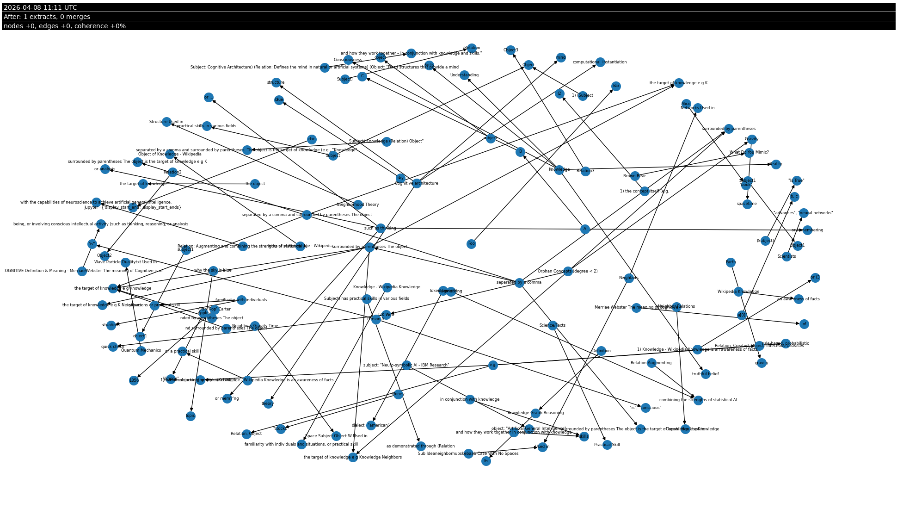](graph-2026-04-08-11-11-extract-subideas.png) [commit](https://github.com/BoggersTheFish/BoggersTheCIG/commit/ee0aae8)

### 2026-04-08 11:11 UTC

**After:** 2_+2_.md"+eval+obsidian — nodes +0, edges +0, coherence +0%

[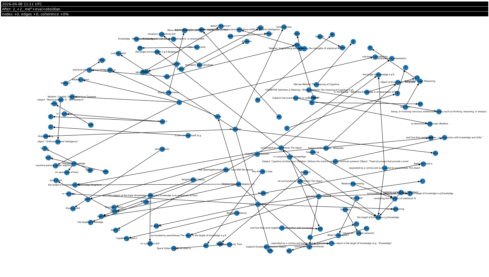](graph-2026-04-08-11-11-self-improve.png) [commit](https://github.com/BoggersTheFish/BoggersTheCIG/commit/ee0aae8)

### 2026-04-08 11:19 UTC

**After:** vault organize (1 moves) — nodes +0, edges +0, coherence +0%

[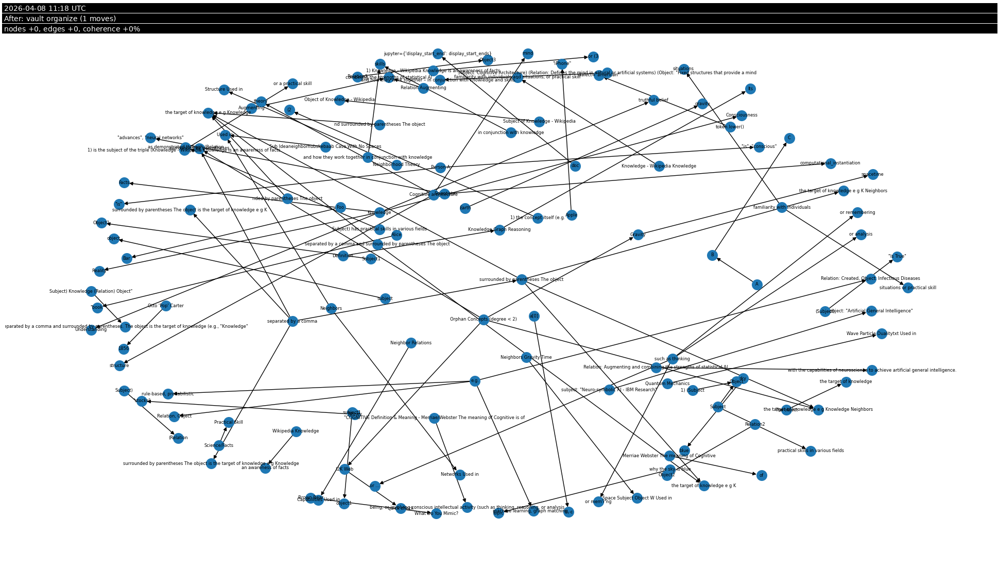](graph-2026-04-08-11-18-after-organize.png) [commit](https://github.com/BoggersTheFish/BoggersTheCIG/commit/ee0aae8)

### 2026-04-08 11:19 UTC

**After:** 0 extracts, 1 merges — nodes +0, edges +0, coherence +0%

[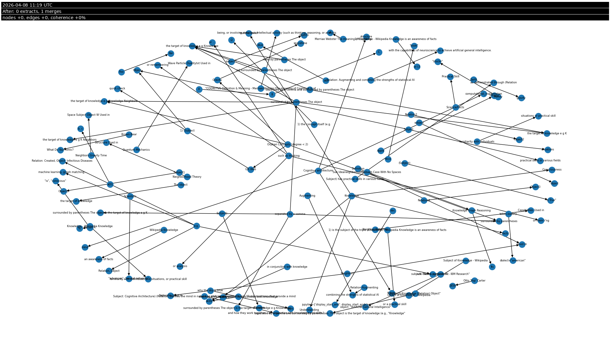](graph-2026-04-08-11-19-extract-subideas.png) [commit](https://github.com/BoggersTheFish/BoggersTheCIG/commit/ee0aae8)

### 2026-04-08 11:19 UTC

**After:** 2_+2_.md"+eval+obsidian — nodes +0, edges +0, coherence +0%

[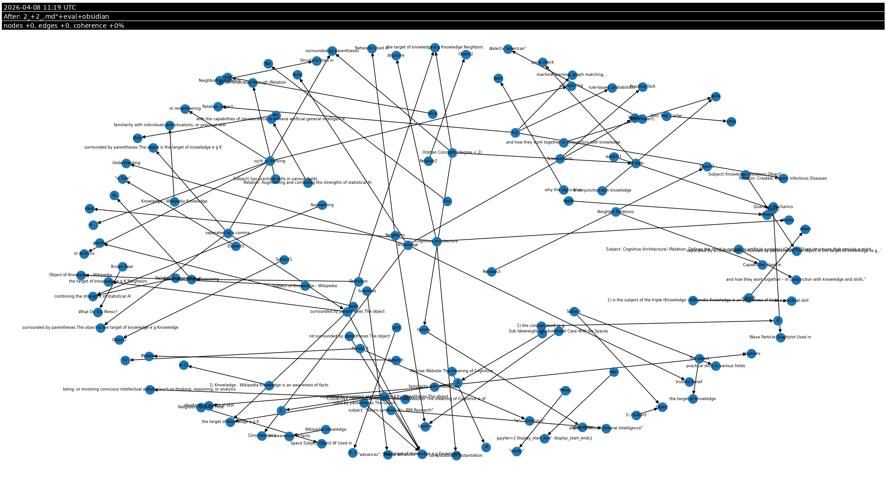](graph-2026-04-08-11-19-self-improve.png) [commit](https://github.com/BoggersTheFish/BoggersTheCIG/commit/ee0aae8)

### 2026-04-08 16:23 UTC

**After:** vault analysis (+180 triples) — nodes +145, edges +91, coherence +8616%

[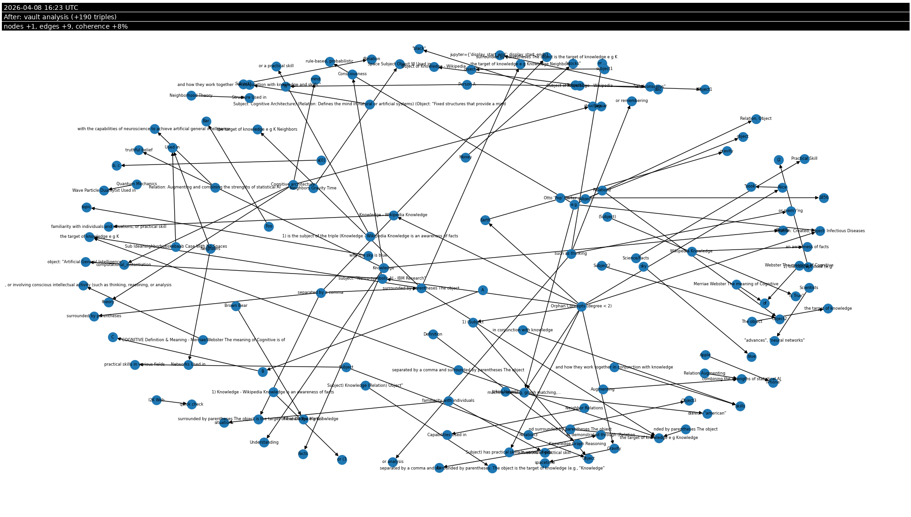](graph-2026-04-08-16-23-after-analyze-vault.png) [commit](https://github.com/BoggersTheFish/BoggersTheCIG/commit/b3da870)

### 2026-04-08 16:23 UTC

**After:** 1 extracts, 0 merges — nodes +0, edges +0, coherence +0%

[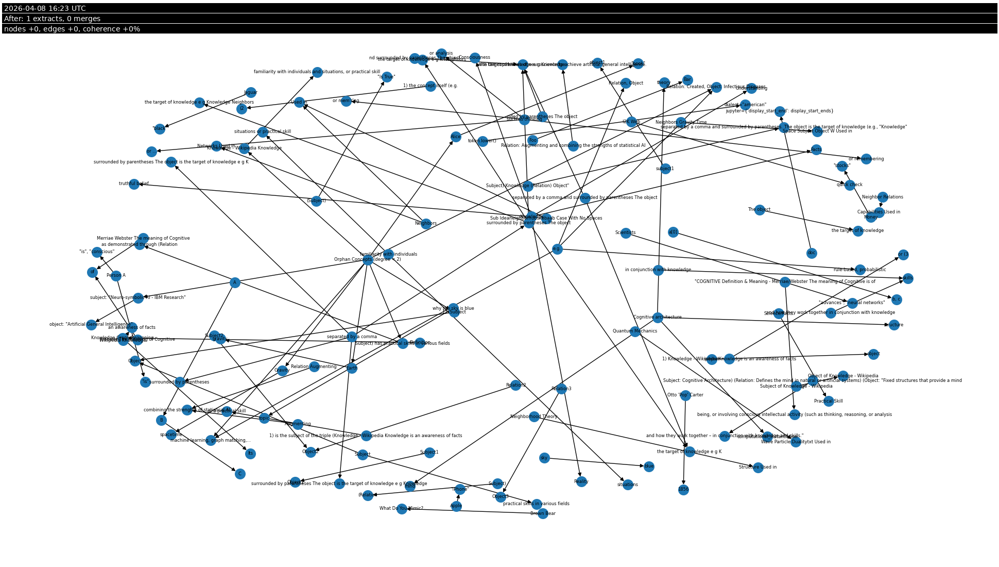](graph-2026-04-08-16-23-extract-subideas.png) [commit](https://github.com/BoggersTheFish/BoggersTheCIG/commit/b3da870)

### 2026-04-08 16:23 UTC

**After:** vault analysis (+190 triples) — nodes +1, edges +9, coherence +8%

 [commit](https://github.com/BoggersTheFish/BoggersTheCIG/commit/b3da870)

### 2026-04-08 16:23 UTC

**After:** 1 extracts, 0 merges — nodes +0, edges +0, coherence +0%

 [commit](https://github.com/BoggersTheFish/BoggersTheCIG/commit/b3da870)

### 2026-04-08 16:29 UTC

**After:** vault organize (0 moves) — nodes +0, edges +0, coherence +0%

[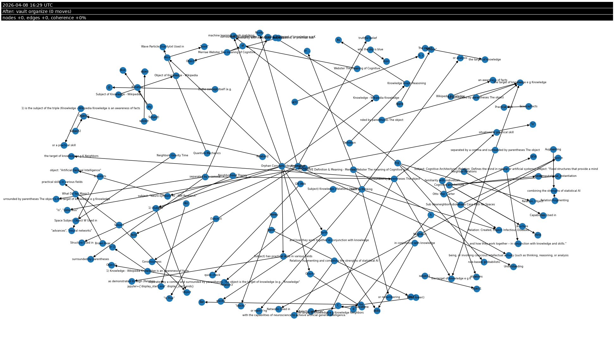](graph-2026-04-08-16-29-after-organize.png) [commit](https://github.com/BoggersTheFish/BoggersTheCIG/commit/b3da870)

### 2026-04-08 16:29 UTC

**After:** 0 extracts, 1 merges — nodes +0, edges +0, coherence +0%

[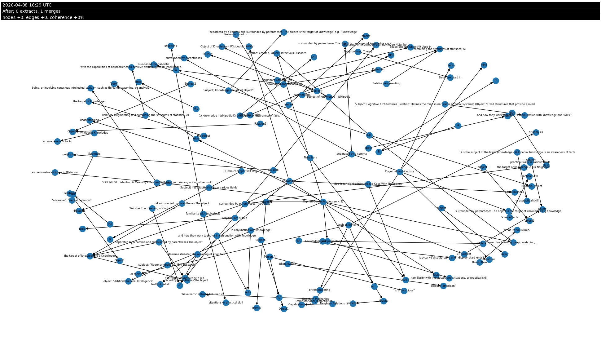](graph-2026-04-08-16-29-extract-subideas.png) [commit](https://github.com/BoggersTheFish/BoggersTheCIG/commit/b3da870)

### 2026-04-08 16:29 UTC

**After:** 2_+2_.md"+A.md"+AI.md"+Bear.md" — nodes +0, edges +0, coherence +0%

[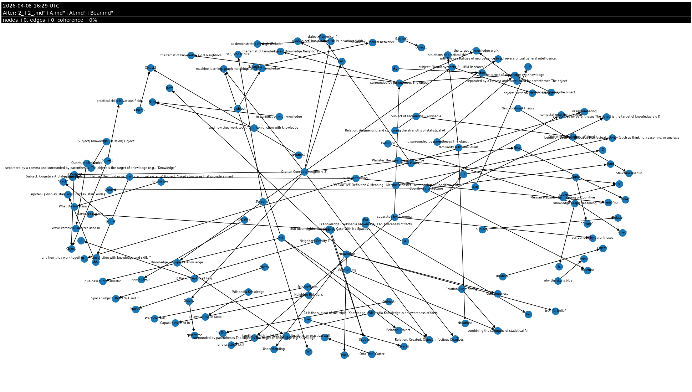](graph-2026-04-08-16-29-self-improve.png) [commit](https://github.com/BoggersTheFish/BoggersTheCIG/commit/b3da870)

### 2026-04-08 16:35 UTC

**After:** vault organize (1 moves) — nodes +0, edges +0, coherence +0%

[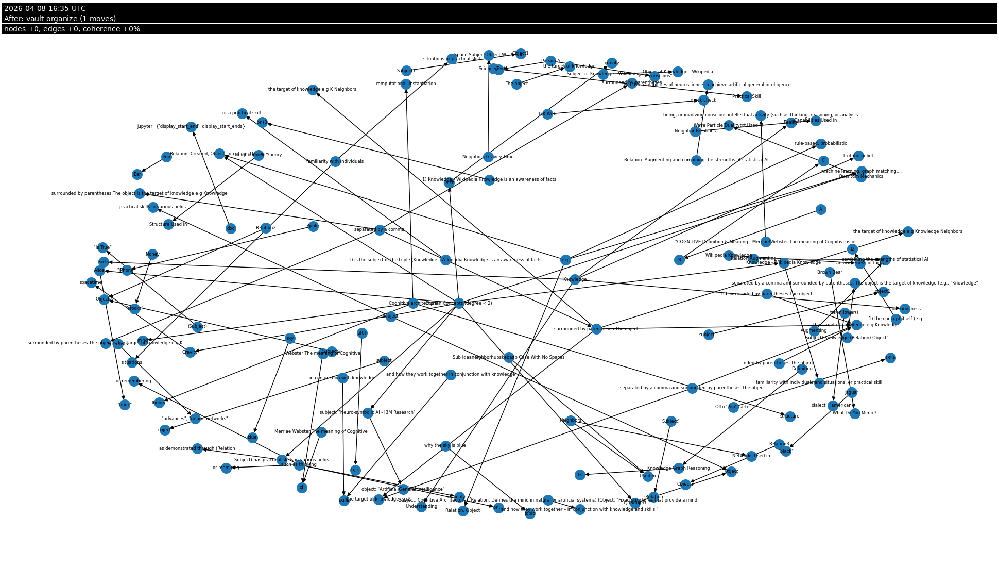](graph-2026-04-08-16-35-after-organize.png) [commit](https://github.com/BoggersTheFish/BoggersTheCIG/commit/b3da870)

### 2026-04-08 16:35 UTC

**After:** 0 extracts, 1 merges — nodes +0, edges +0, coherence +0%

[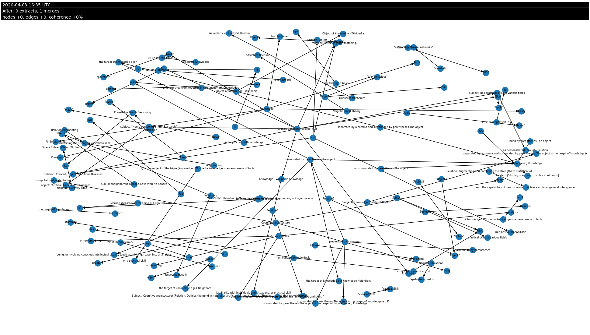](graph-2026-04-08-16-35-extract-subideas.png) [commit](https://github.com/BoggersTheFish/BoggersTheCIG/commit/b3da870)

### 2026-04-08 16:35 UTC

**After:** 2_+2_.md"+A.md"+AI.md"+Bear.md" — nodes +0, edges +0, coherence +0%

[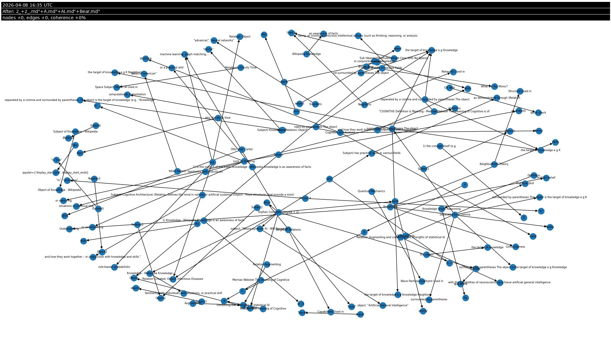](graph-2026-04-08-16-35-self-improve.png) [commit](https://github.com/BoggersTheFish/BoggersTheCIG/commit/b3da870)

### 2026-04-08 20:51 UTC

**After:** vault analysis (+182 triples) — nodes +145, edges +91, coherence +8616%

[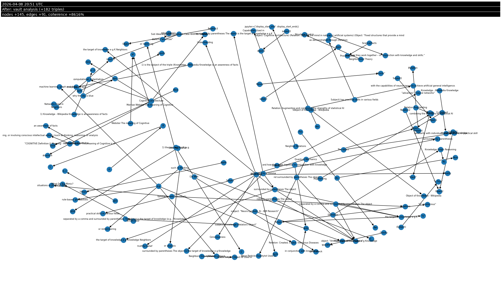](graph-2026-04-08-20-51-after-analyze-vault.png) [commit](https://github.com/BoggersTheFish/BoggersTheCIG/commit/6539f76)

### 2026-04-08 20:51 UTC

**After:** 1 extracts, 0 merges — nodes +0, edges +0, coherence +0%

[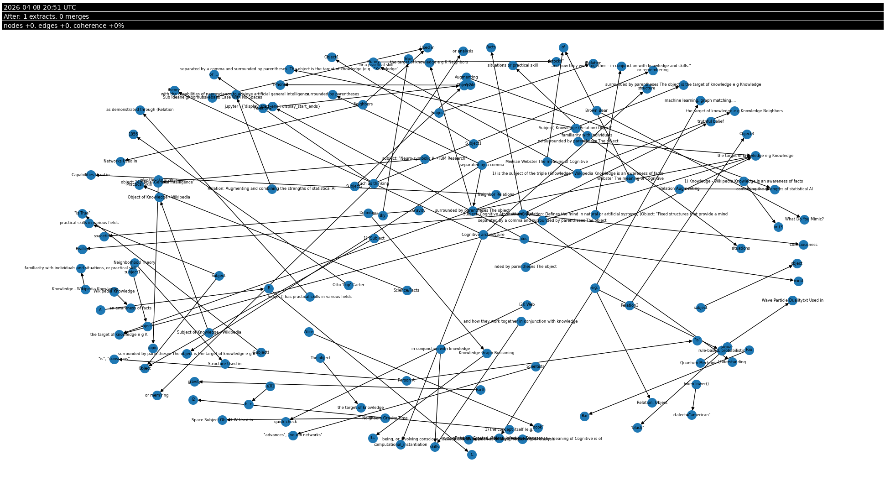](graph-2026-04-08-20-51-extract-subideas.png) [commit](https://github.com/BoggersTheFish/BoggersTheCIG/commit/6539f76)

### 2026-04-08 20:52 UTC

**After:** vault analysis (+191 triples) — nodes +1, edges +8, coherence +7%

[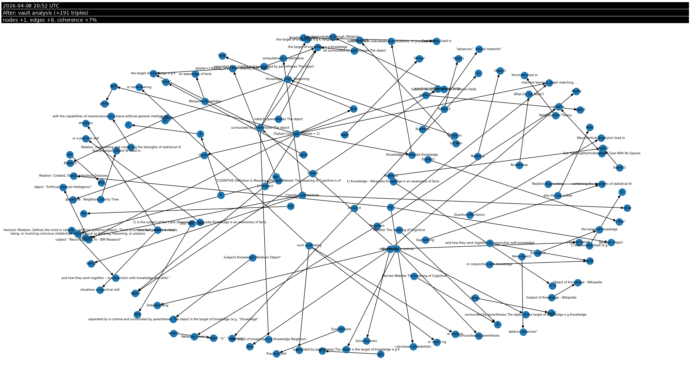](graph-2026-04-08-20-52-after-analyze-vault.png) [commit](https://github.com/BoggersTheFish/BoggersTheCIG/commit/6539f76)

### 2026-04-08 20:52 UTC

**After:** 1 extracts, 0 merges — nodes +0, edges +0, coherence +0%

[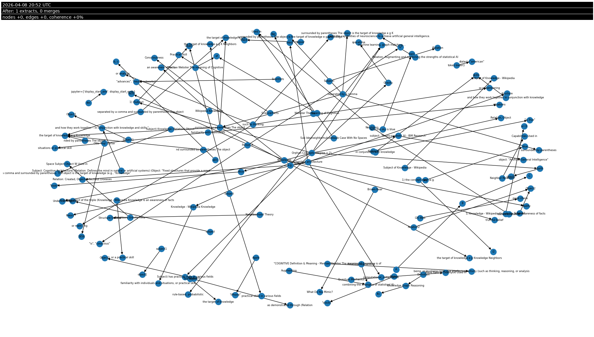](graph-2026-04-08-20-52-extract-subideas.png) [commit](https://github.com/BoggersTheFish/BoggersTheCIG/commit/6539f76)

### 2026-04-08 21:00 UTC

**After:** vault organize (2 moves) — nodes +0, edges +0, coherence +0%

[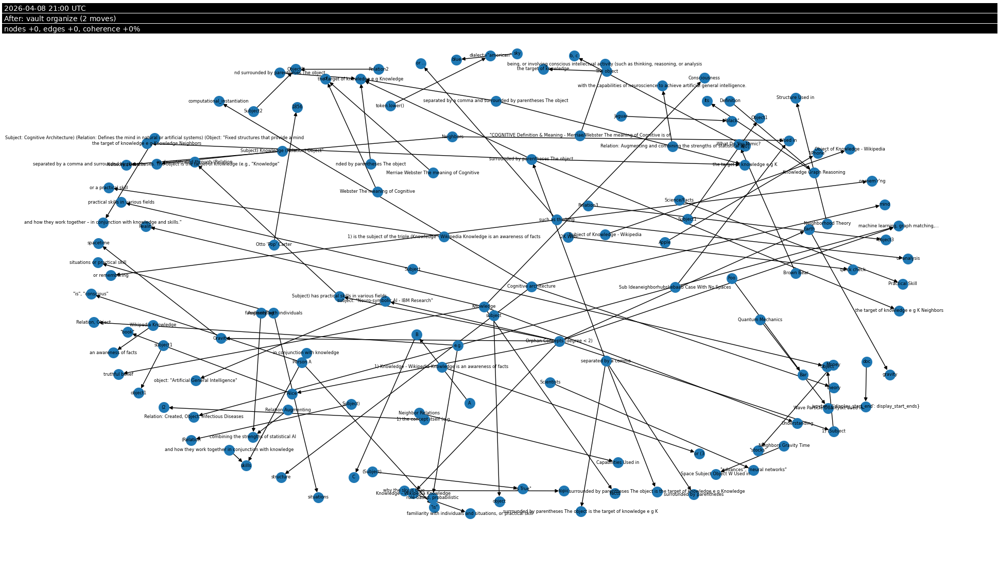](graph-2026-04-08-21-00-after-organize.png) [commit](https://github.com/BoggersTheFish/BoggersTheCIG/commit/6539f76)

### 2026-04-08 21:00 UTC

**After:** 0 extracts, 1 merges — nodes +0, edges +0, coherence +0%

[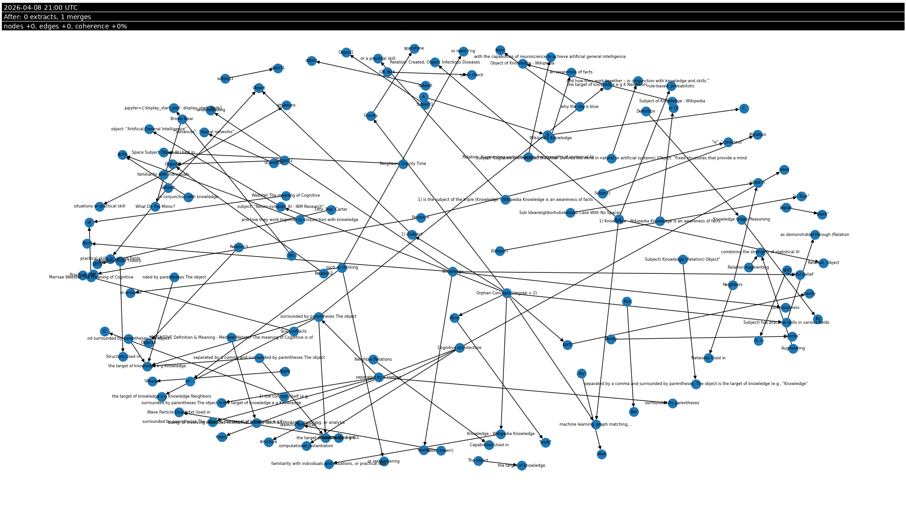](graph-2026-04-08-21-00-extract-subideas.png) [commit](https://github.com/BoggersTheFish/BoggersTheCIG/commit/6539f76)

### 2026-04-08 21:00 UTC

**After:** 2_+2_.md"+Cognitive.md"+Diseases.md"+Relations.md" — nodes +0, edges +0, coherence +0%

[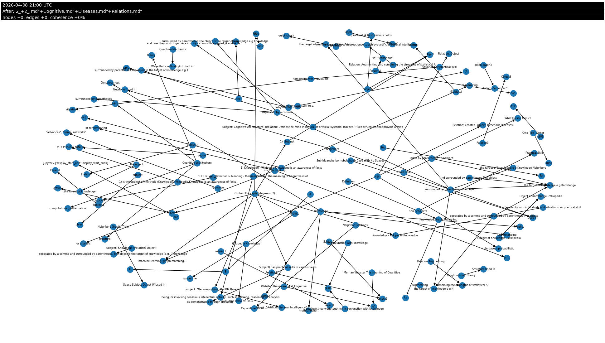](graph-2026-04-08-21-00-self-improve.png) [commit](https://github.com/BoggersTheFish/BoggersTheCIG/commit/6539f76)

### 2026-04-08 21:07 UTC

**After:** vault organize (1 moves) — nodes +0, edges +0, coherence +0%

[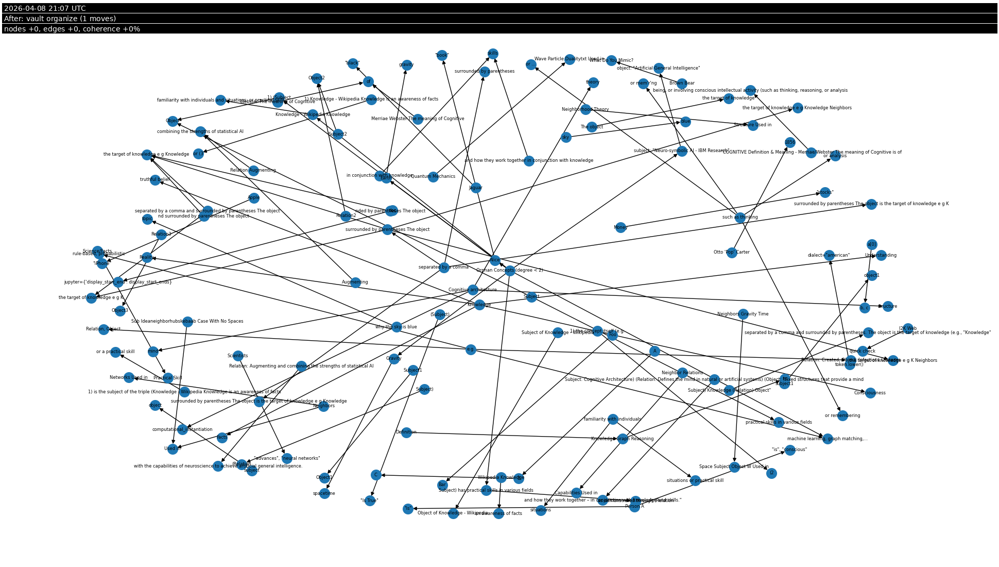](graph-2026-04-08-21-07-after-organize.png) [commit](https://github.com/BoggersTheFish/BoggersTheCIG/commit/6539f76)

### 2026-04-08 21:07 UTC

**After:** 1 extracts, 0 merges — nodes +0, edges +0, coherence +0%

[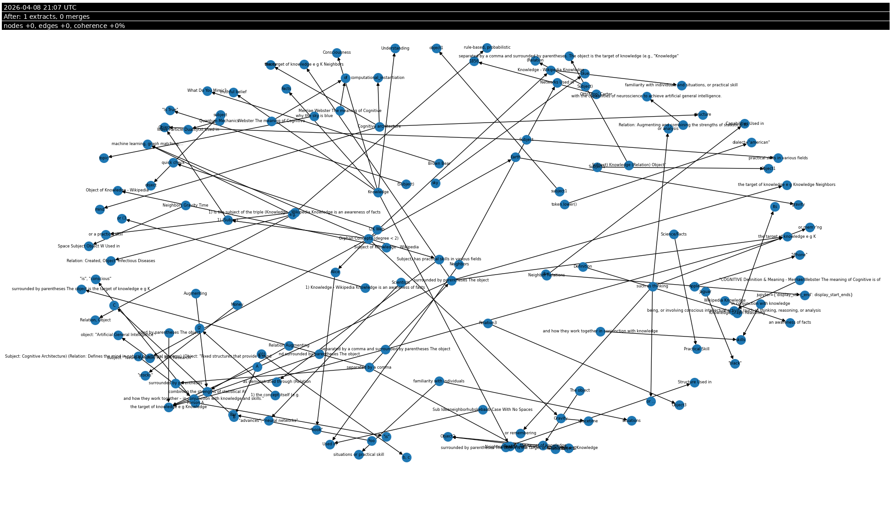](graph-2026-04-08-21-07-extract-subideas.png) [commit](https://github.com/BoggersTheFish/BoggersTheCIG/commit/6539f76)

### 2026-04-08 21:07 UTC

**After:** 2_+2_.md"+Cognitive.md"+Diseases.md"+Relations.md" — nodes +0, edges +0, coherence +0%

[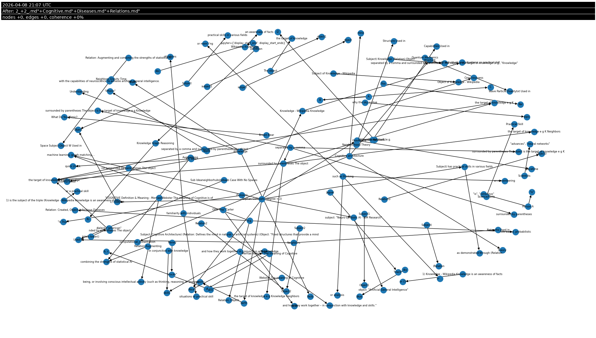](graph-2026-04-08-21-07-self-improve.png) [commit](https://github.com/BoggersTheFish/BoggersTheCIG/commit/6539f76)

### 2026-04-09 02:17 UTC

**After:** external ingest (+1 triples) — nodes +4, edges +2, coherence +333233%

[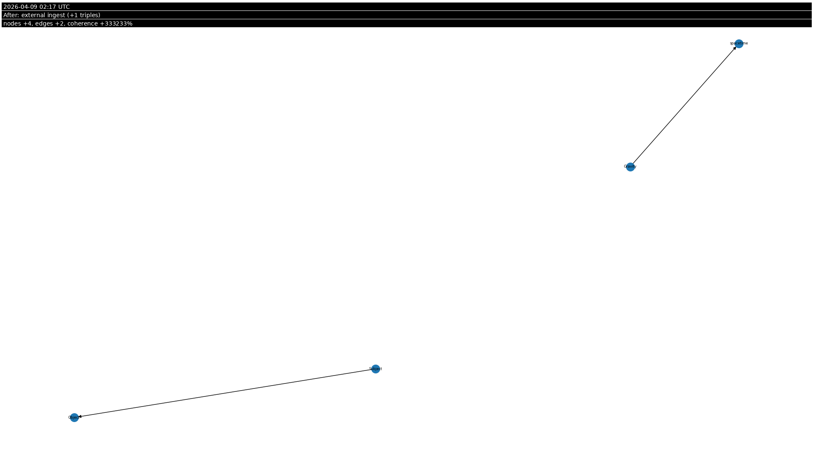](graph-2026-04-09-02-17-after-ingest.png) [commit](https://github.com/BoggersTheFish/BoggersTheCIG/commit/9c75ce9)

### 2026-04-09 02:17 UTC

**After:** vault analysis (+183 triples) — nodes +142, edges +90, coherence -97%

[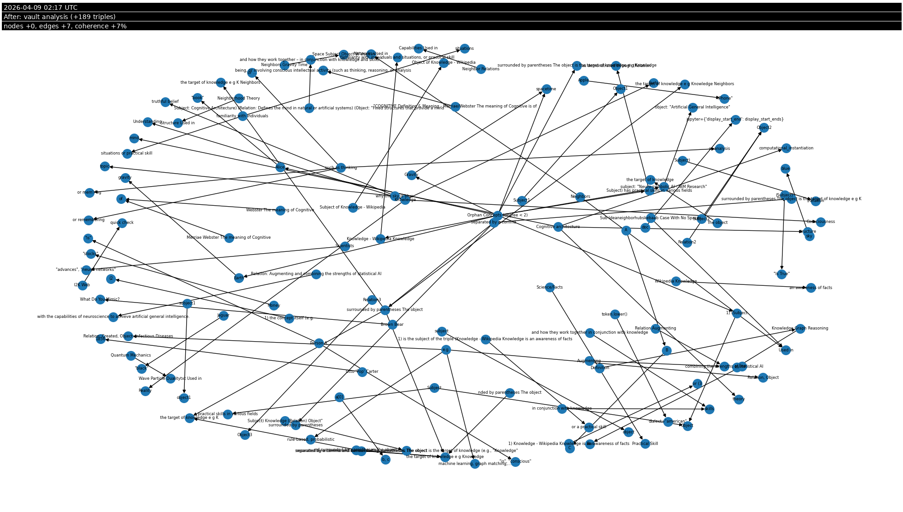](graph-2026-04-09-02-17-after-analyze-vault.png) [commit](https://github.com/BoggersTheFish/BoggersTheCIG/commit/9c75ce9)

### 2026-04-09 02:17 UTC

**After:** vault analysis (+189 triples) — nodes +0, edges +7, coherence +7%

 [commit](https://github.com/BoggersTheFish/BoggersTheCIG/commit/9c75ce9)

### 2026-04-09 02:24 UTC

**After:** vault organize (0 moves) — nodes +0, edges +0, coherence +0%

[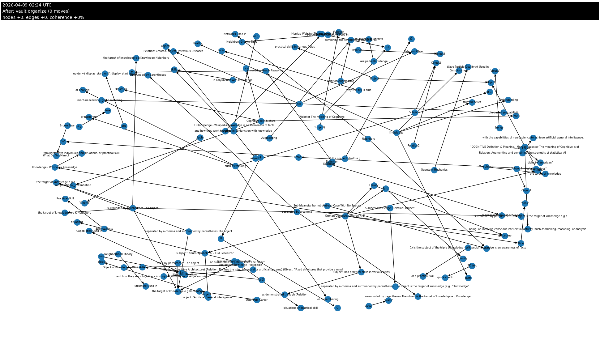](graph-2026-04-09-02-24-after-organize.png) [commit](https://github.com/BoggersTheFish/BoggersTheCIG/commit/9c75ce9)

### 2026-04-09 02:24 UTC

**After:** 1 extracts, 0 merges — nodes +0, edges +0, coherence +0%

[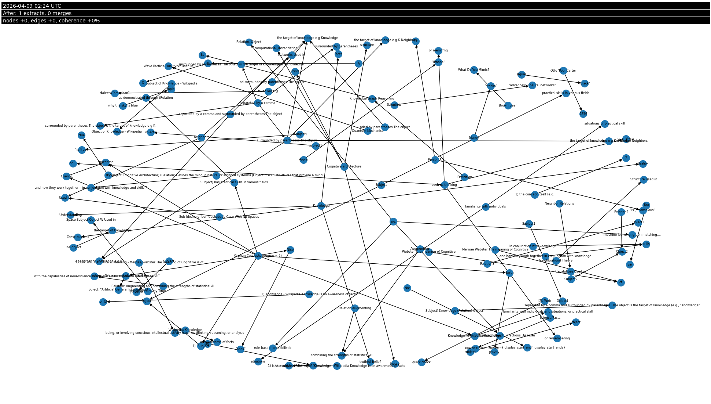](graph-2026-04-09-02-24-extract-subideas.png) [commit](https://github.com/BoggersTheFish/BoggersTheCIG/commit/9c75ce9)

### 2026-04-09 02:24 UTC

**After:** 2_+2_.md"+comma.md"+eval+mind.md" — nodes +0, edges +0, coherence +0%

[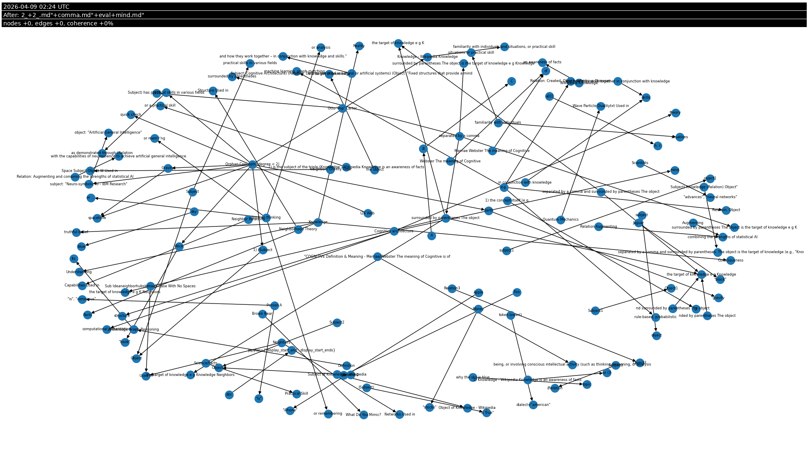](graph-2026-04-09-02-24-self-improve.png) [commit](https://github.com/BoggersTheFish/BoggersTheCIG/commit/9c75ce9)

### 2026-04-09 02:31 UTC

**After:** vault organize (0 moves) — nodes +0, edges +0, coherence +0%

[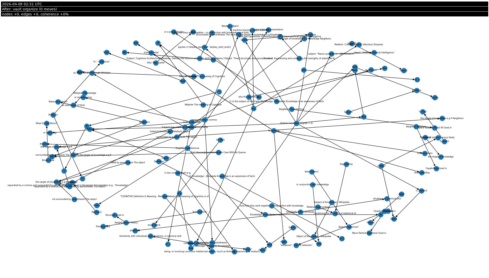](graph-2026-04-09-02-31-after-organize.png) [commit](https://github.com/BoggersTheFish/BoggersTheCIG/commit/9c75ce9)

### 2026-04-09 02:31 UTC

**After:** 0 extracts, 1 merges — nodes +0, edges +0, coherence +0%

[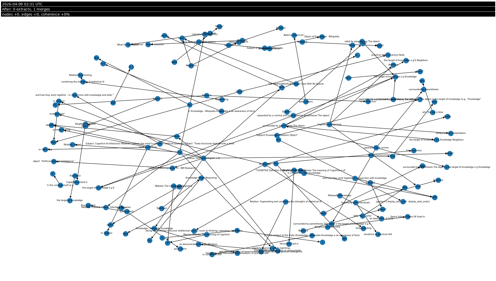](graph-2026-04-09-02-31-extract-subideas.png) [commit](https://github.com/BoggersTheFish/BoggersTheCIG/commit/9c75ce9)

### 2026-04-09 02:31 UTC

**After:** 2_+2_.md"+comma.md"+eval+mind.md" — nodes +0, edges +0, coherence +0%

[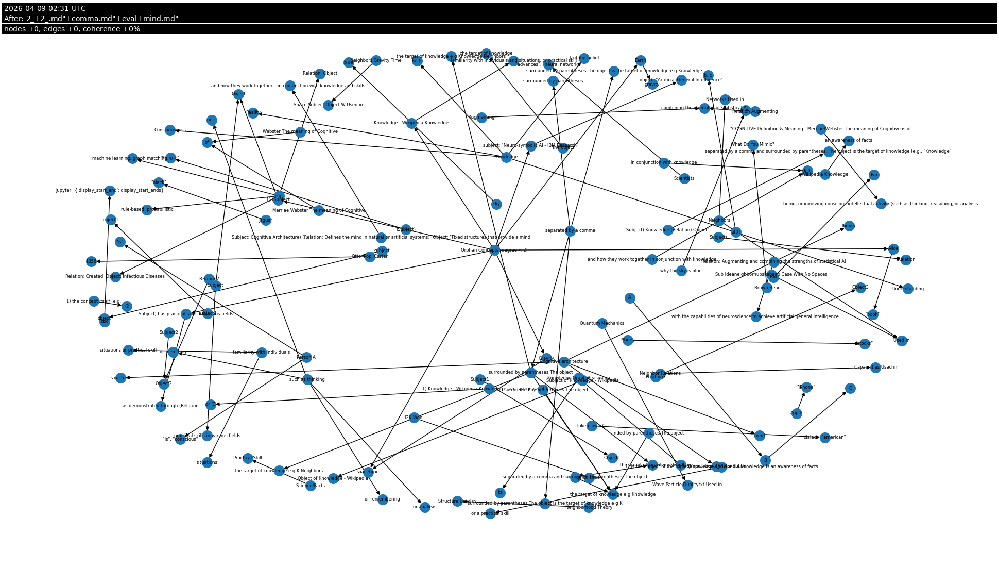](graph-2026-04-09-02-31-self-improve.png) [commit](https://github.com/BoggersTheFish/BoggersTheCIG/commit/9c75ce9)

### 2026-04-09 06:31 UTC

**After:** external ingest (+2 triples) — nodes +4, edges +2, coherence +333233%

[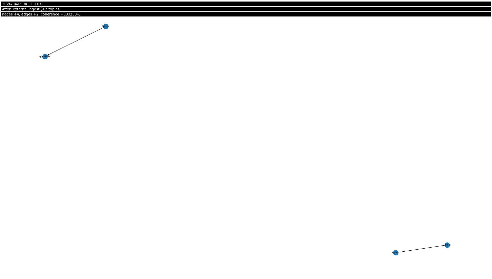](graph-2026-04-09-06-31-after-ingest.png) [commit](https://github.com/BoggersTheFish/BoggersTheCIG/commit/c6473fb)

### 2026-04-09 06:32 UTC

**After:** vault analysis (+189 triples) — nodes +142, edges +90, coherence -97%

[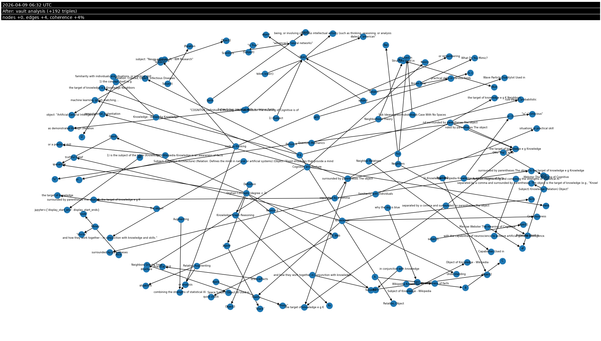](graph-2026-04-09-06-32-after-analyze-vault.png) [commit](https://github.com/BoggersTheFish/BoggersTheCIG/commit/c6473fb)

### 2026-04-09 06:32 UTC

**After:** 1 extracts, 0 merges — nodes +0, edges +0, coherence +0%

[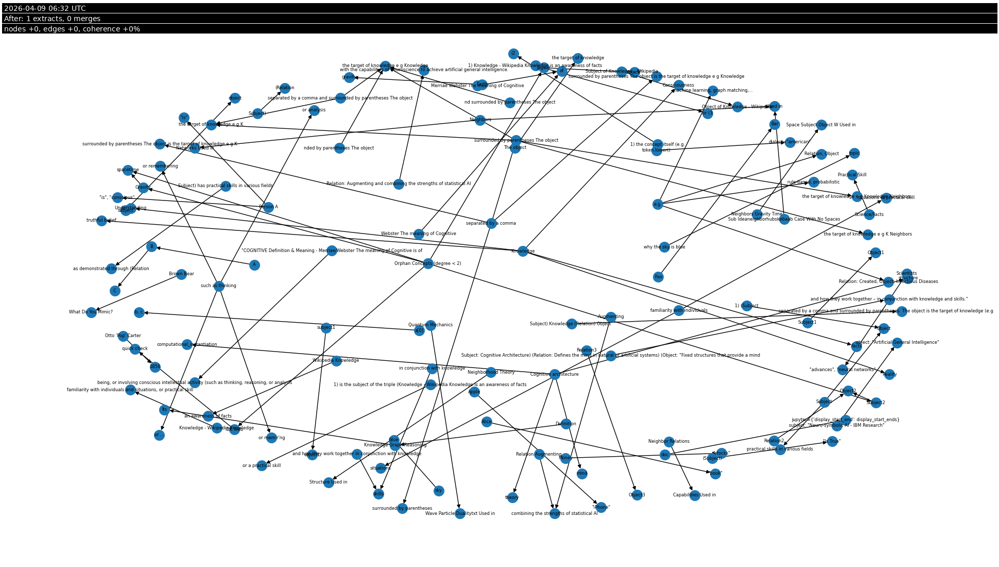](graph-2026-04-09-06-32-extract-subideas.png) [commit](https://github.com/BoggersTheFish/BoggersTheCIG/commit/c6473fb)

### 2026-04-09 06:32 UTC

**After:** vault analysis (+192 triples) — nodes +0, edges +4, coherence +4%

 [commit](https://github.com/BoggersTheFish/BoggersTheCIG/commit/c6473fb)

### 2026-04-09 06:32 UTC

**After:** 1 extracts, 0 merges — nodes +0, edges +0, coherence +0%

 [commit](https://github.com/BoggersTheFish/BoggersTheCIG/commit/c6473fb)

### 2026-04-09 06:38 UTC

**After:** vault organize (0 moves) — nodes +0, edges +0, coherence +0%

[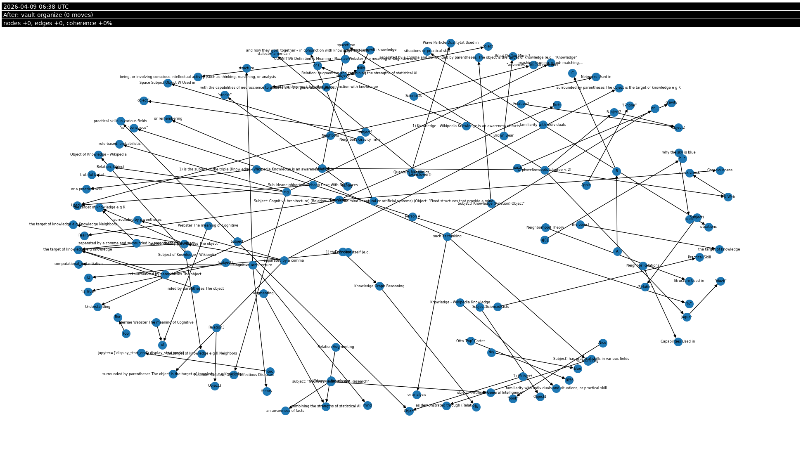](graph-2026-04-09-06-38-after-organize.png) [commit](https://github.com/BoggersTheFish/BoggersTheCIG/commit/c6473fb)

### 2026-04-09 06:38 UTC

**After:** 0 extracts, 1 merges — nodes +0, edges +0, coherence +0%

[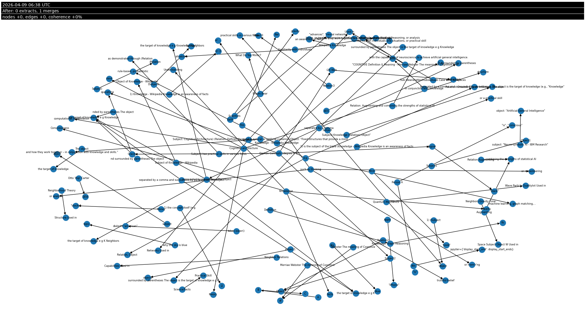](graph-2026-04-09-06-38-extract-subideas.png) [commit](https://github.com/BoggersTheFish/BoggersTheCIG/commit/c6473fb)

### 2026-04-09 06:39 UTC

**After:** 2_+2_.md"+A.md"+AI.md"+Bear.md" — nodes +0, edges +0, coherence +0%

[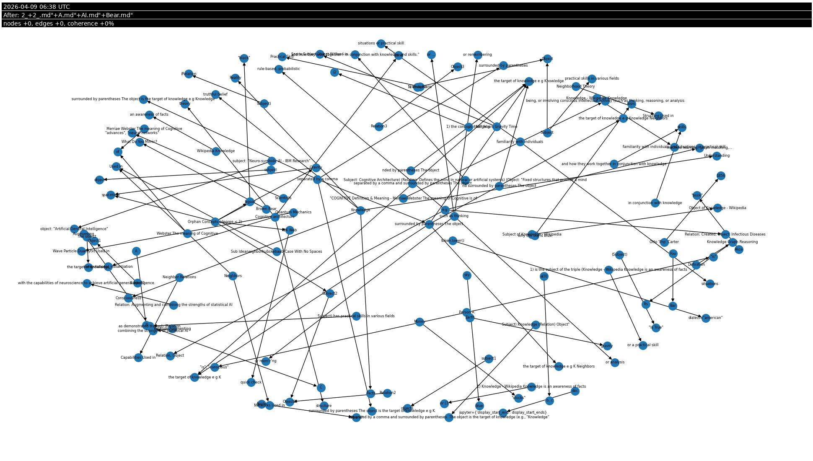](graph-2026-04-09-06-38-self-improve.png) [commit](https://github.com/BoggersTheFish/BoggersTheCIG/commit/c6473fb)

### 2026-04-09 06:45 UTC

**After:** vault organize (0 moves) — nodes +0, edges +0, coherence +0%

[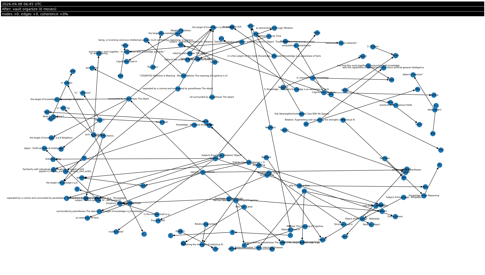](graph-2026-04-09-06-45-after-organize.png) [commit](https://github.com/BoggersTheFish/BoggersTheCIG/commit/c6473fb)

### 2026-04-09 06:45 UTC

**After:** 0 extracts, 1 merges — nodes +0, edges +0, coherence +0%

[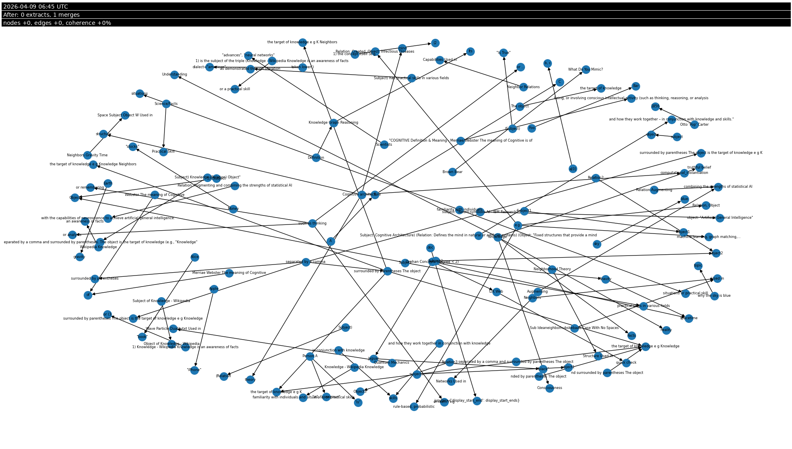](graph-2026-04-09-06-45-extract-subideas.png) [commit](https://github.com/BoggersTheFish/BoggersTheCIG/commit/c6473fb)

### 2026-04-09 06:45 UTC

**After:** 2_+2_.md"+A.md"+AI.md"+Bear.md" — nodes +0, edges +0, coherence +0%

[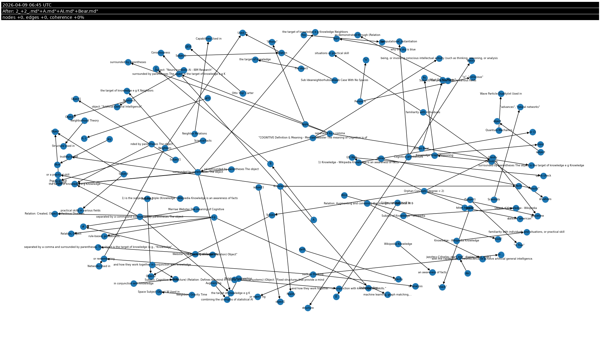](graph-2026-04-09-06-45-self-improve.png) [commit](https://github.com/BoggersTheFish/BoggersTheCIG/commit/c6473fb)

### 2026-04-09 09:56 UTC

**After:** vault analysis (+192 triples) — nodes +0, edges +6, coherence +6%

[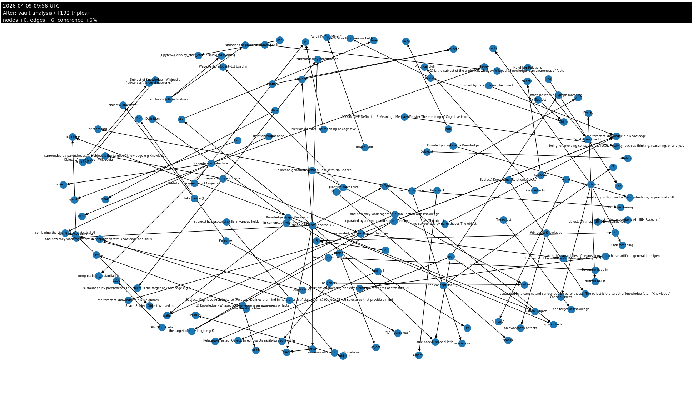](graph-2026-04-09-09-56-after-analyze-vault.png) [commit](https://github.com/BoggersTheFish/BoggersTheCIG/commit/09fb28e)

### 2026-04-09 09:56 UTC

**After:** 1 extracts, 0 merges — nodes +0, edges +0, coherence +0%

[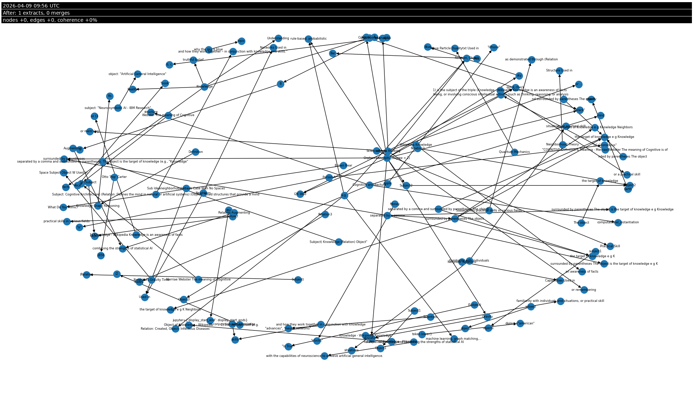](graph-2026-04-09-09-56-extract-subideas.png) [commit](https://github.com/BoggersTheFish/BoggersTheCIG/commit/09fb28e)

### 2026-04-09 09:57 UTC

**After:** vault analysis (+188 triples) — nodes +0, edges +7, coherence +6%

[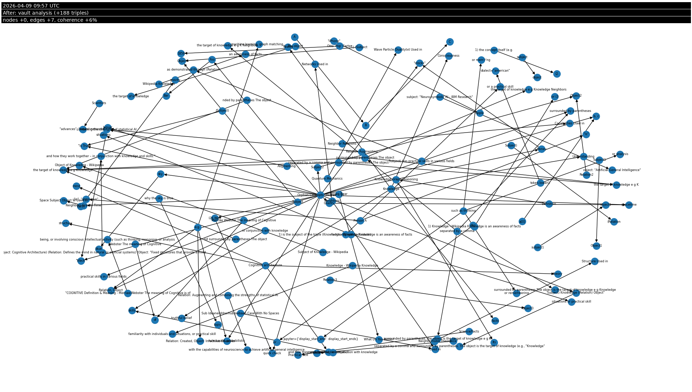](graph-2026-04-09-09-57-after-analyze-vault.png) [commit](https://github.com/BoggersTheFish/BoggersTheCIG/commit/09fb28e)

### 2026-04-09 09:57 UTC

**After:** 1 extracts, 0 merges — nodes +0, edges +0, coherence +0%

[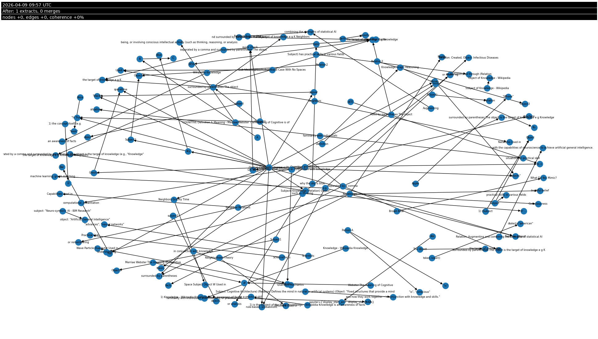](graph-2026-04-09-09-57-extract-subideas.png) [commit](https://github.com/BoggersTheFish/BoggersTheCIG/commit/09fb28e)

### 2026-04-09 09:58 UTC

**After:** vault analysis (+188 triples) — nodes +17, edges +27, coherence +0%

[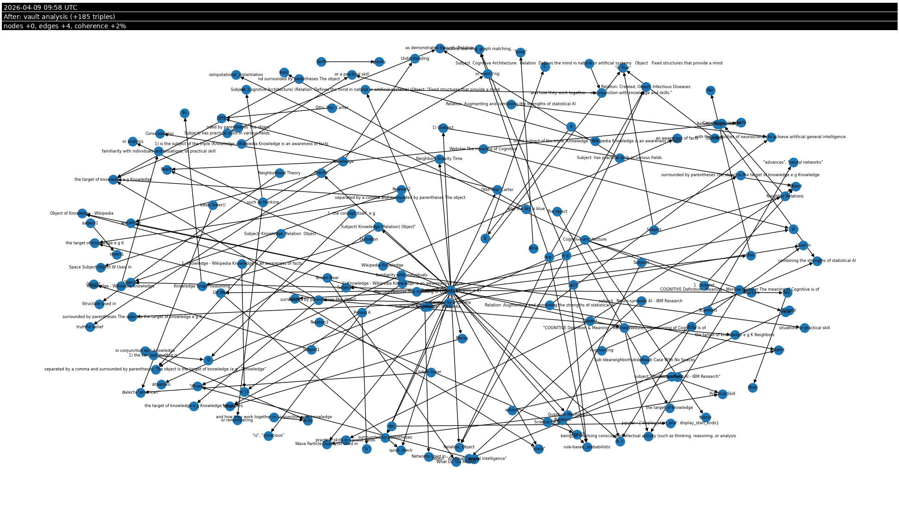](graph-2026-04-09-09-58-after-analyze-vault.png) [commit](https://github.com/BoggersTheFish/BoggersTheCIG/commit/09fb28e)

### 2026-04-09 09:58 UTC

**After:** 1 extracts, 0 merges — nodes +0, edges +0, coherence +0%

[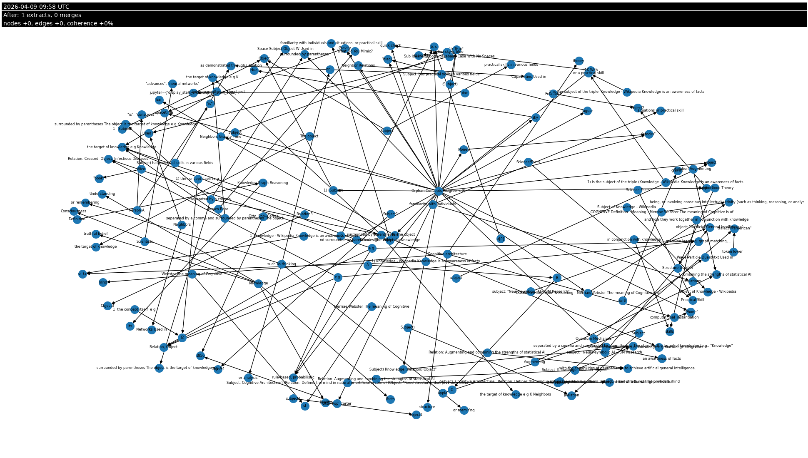](graph-2026-04-09-09-58-extract-subideas.png) [commit](https://github.com/BoggersTheFish/BoggersTheCIG/commit/09fb28e)

### 2026-04-09 09:58 UTC

**After:** vault analysis (+185 triples) — nodes +0, edges +4, coherence +2%

 [commit](https://github.com/BoggersTheFish/BoggersTheCIG/commit/09fb28e)

### 2026-04-09 10:00 UTC

**After:** vault analysis (+185 triples) — nodes +0, edges +4, coherence +2%

[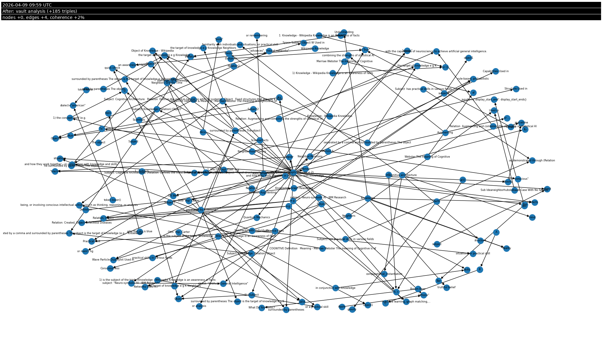](graph-2026-04-09-09-59-after-analyze-vault.png) [commit](https://github.com/BoggersTheFish/BoggersTheCIG/commit/09fb28e)

### 2026-04-09 10:00 UTC

**After:** vault analysis (+185 triples) — nodes +0, edges +4, coherence +2%

[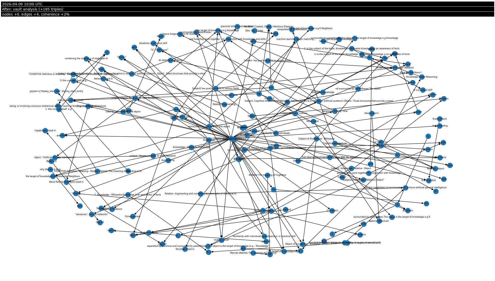](graph-2026-04-09-10-00-after-analyze-vault.png) [commit](https://github.com/BoggersTheFish/BoggersTheCIG/commit/09fb28e)

### 2026-04-09 10:00 UTC

**After:** vault organize (0 moves) — nodes +0, edges +0, coherence +0%

[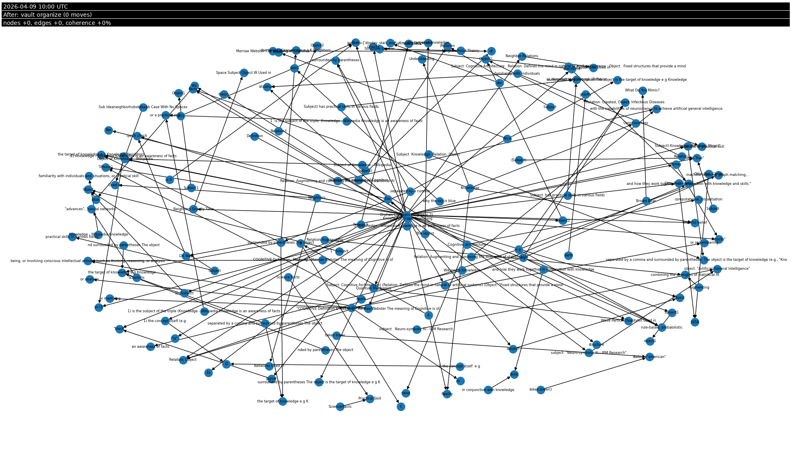](graph-2026-04-09-10-00-after-organize.png) [commit](https://github.com/BoggersTheFish/BoggersTheCIG/commit/09fb28e)

### 2026-04-09 10:00 UTC

**After:** 2 extracts, 0 merges — nodes +0, edges +0, coherence +0%

[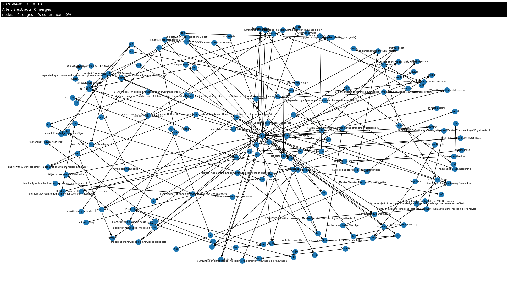](graph-2026-04-09-10-00-extract-subideas.png) [commit](https://github.com/BoggersTheFish/BoggersTheCIG/commit/09fb28e)

### 2026-04-09 10:00 UTC

**After:** "obsidian+.md"+2_+2_.md"+A.md" — nodes +0, edges +0, coherence +0%

[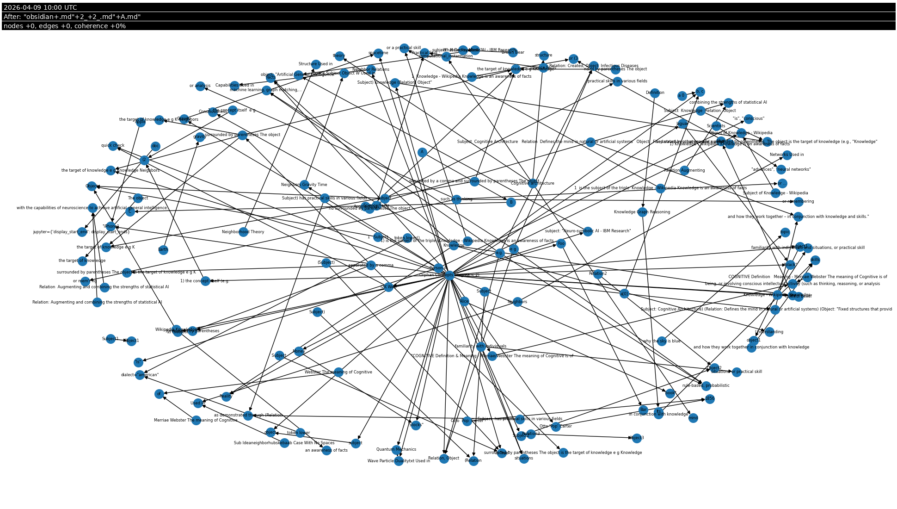](graph-2026-04-09-10-00-self-improve.png) [commit](https://github.com/BoggersTheFish/BoggersTheCIG/commit/09fb28e)

### 2026-04-09 10:01 UTC

**After:** vault organize (0 moves) — nodes +0, edges +0, coherence +0%

 [commit](https://github.com/BoggersTheFish/BoggersTheCIG/commit/09fb28e)

### 2026-04-09 10:01 UTC

**After:** 0 extracts, 2 merges — nodes +0, edges +0, coherence +0%

[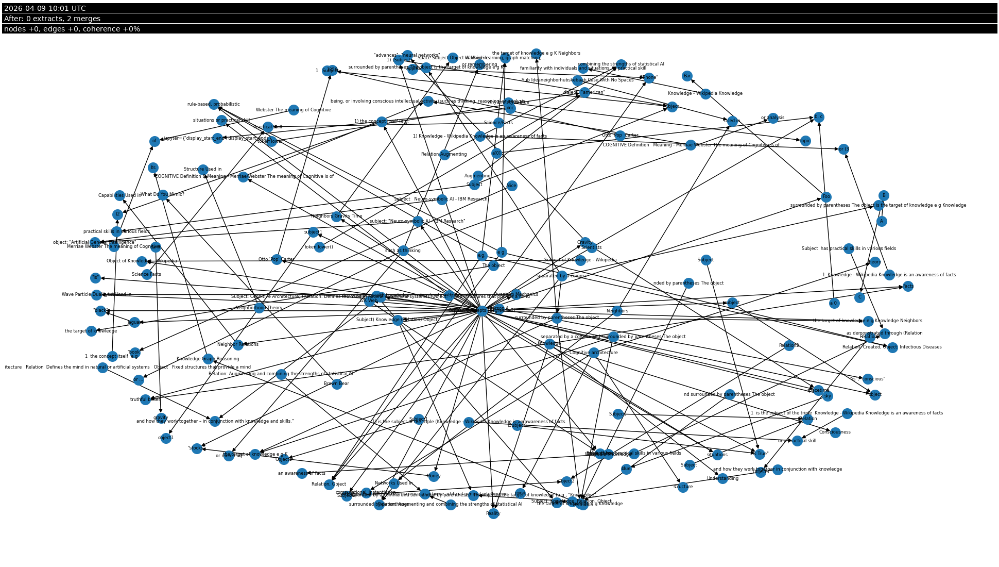](graph-2026-04-09-10-01-extract-subideas.png) [commit](https://github.com/BoggersTheFish/BoggersTheCIG/commit/09fb28e)

### 2026-04-09 10:01 UTC

**After:** "obsidian+.md"+2_+2_.md"+A.md" — nodes +0, edges +0, coherence +0%

[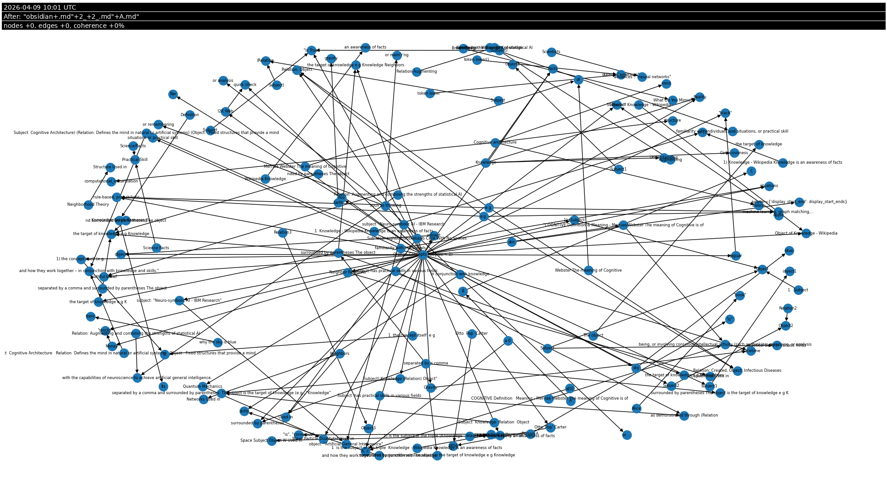](graph-2026-04-09-10-01-self-improve.png) [commit](https://github.com/BoggersTheFish/BoggersTheCIG/commit/09fb28e)

### 2026-04-09 10:39 UTC

**After:** vault organize (4 moves) — nodes -142, edges -128, coherence +749%

[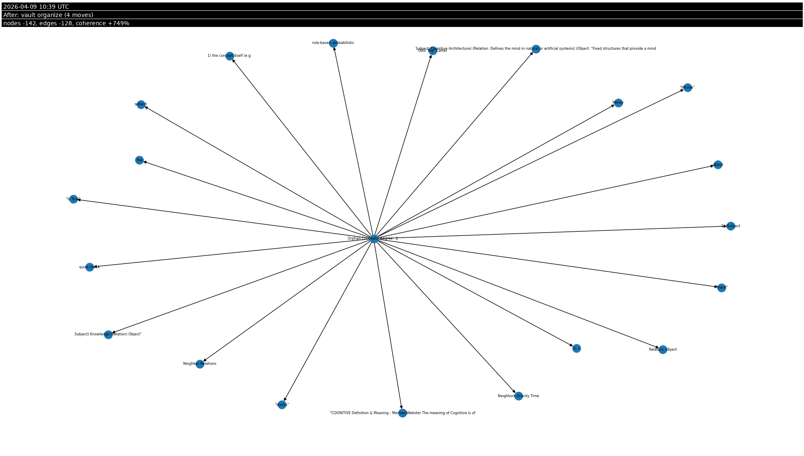](graph-2026-04-09-10-39-after-organize.png) [commit](https://github.com/BoggersTheFish/BoggersTheCIG/commit/c406479)

### 2026-04-09 10:39 UTC

**After:** 3 extracts, 0 merges — nodes +0, edges +0, coherence +0%

[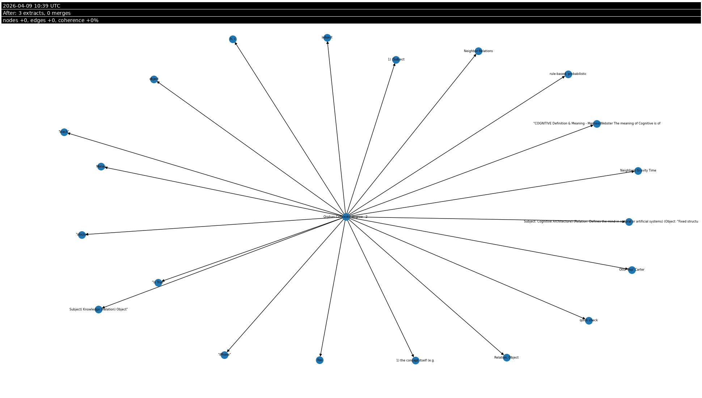](graph-2026-04-09-10-39-extract-subideas.png) [commit](https://github.com/BoggersTheFish/BoggersTheCIG/commit/c406479)

### 2026-04-09 10:39 UTC

**After:** +.md"+2_+2_.md"+Carter.md" — nodes +0, edges +0, coherence +0%

[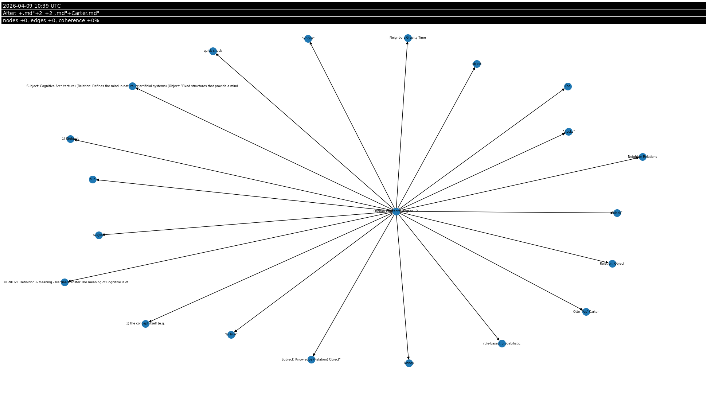](graph-2026-04-09-10-39-self-improve.png) [commit](https://github.com/BoggersTheFish/BoggersTheCIG/commit/c406479)

### 2026-04-09 10:40 UTC

**After:** vault analysis (+185 triples) — nodes +137, edges +107, coherence -89%

[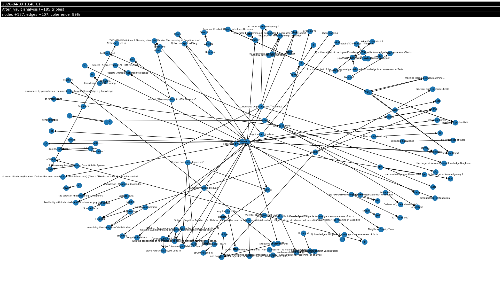](graph-2026-04-09-10-40-after-analyze-vault.png) [commit](https://github.com/BoggersTheFish/BoggersTheCIG/commit/c406479)

### 2026-04-09 10:40 UTC

**After:** 3 extracts, 0 merges — nodes +0, edges +0, coherence +0%

[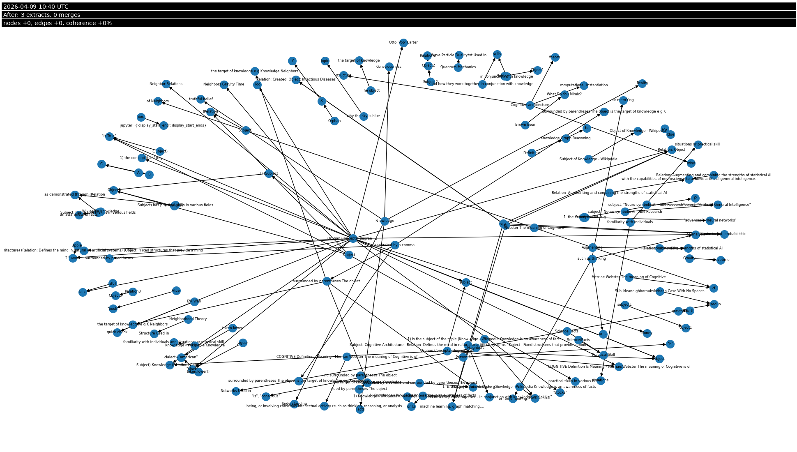](graph-2026-04-09-10-40-extract-subideas.png) [commit](https://github.com/BoggersTheFish/BoggersTheCIG/commit/c406479)

### 2026-04-09 10:41 UTC

**After:** vault analysis (+184 triples) — nodes +0, edges +4, coherence +3%

[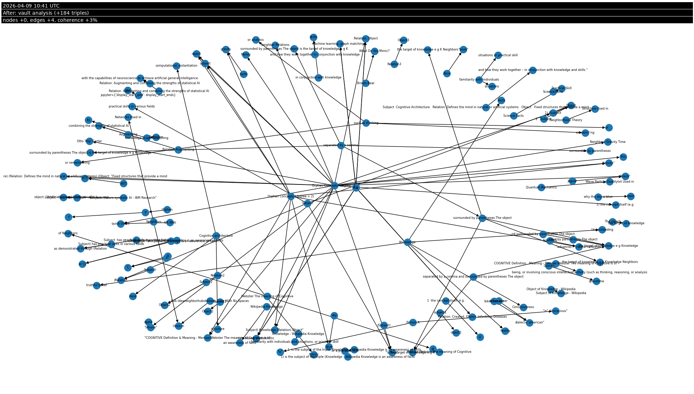](graph-2026-04-09-10-41-after-analyze-vault.png) [commit](https://github.com/BoggersTheFish/BoggersTheCIG/commit/c406479)

### 2026-04-09 10:41 UTC

**After:** 3 extracts, 0 merges — nodes +0, edges +0, coherence +0%

[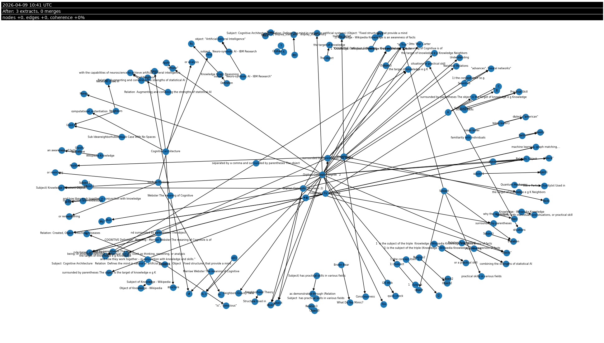](graph-2026-04-09-10-41-extract-subideas.png) [commit](https://github.com/BoggersTheFish/BoggersTheCIG/commit/c406479)

### 2026-04-09 10:50 UTC

**After:** vault organize (3 moves) — nodes +0, edges +0, coherence +0%

[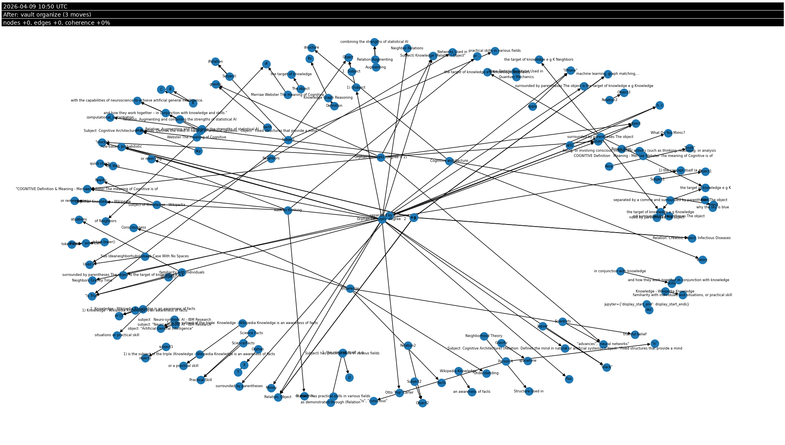](graph-2026-04-09-10-50-after-organize.png) [commit](https://github.com/BoggersTheFish/BoggersTheCIG/commit/c406479)

### 2026-04-09 10:51 UTC

**After:** 3 extracts, 1 merges — nodes +0, edges +0, coherence +0%

[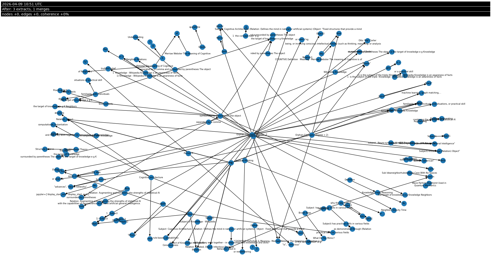](graph-2026-04-09-10-51-extract-subideas.png) [commit](https://github.com/BoggersTheFish/BoggersTheCIG/commit/c406479)

### 2026-04-09 10:51 UTC

**After:** +.md"+2_+2_.md"+A.md" — nodes +0, edges +0, coherence +0%

[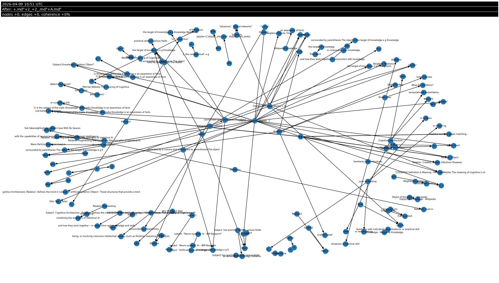](graph-2026-04-09-10-51-self-improve.png) [commit](https://github.com/BoggersTheFish/BoggersTheCIG/commit/c406479)

### 2026-04-09 11:00 UTC

**After:** vault organize (4 moves) — nodes +0, edges +0, coherence +0%

[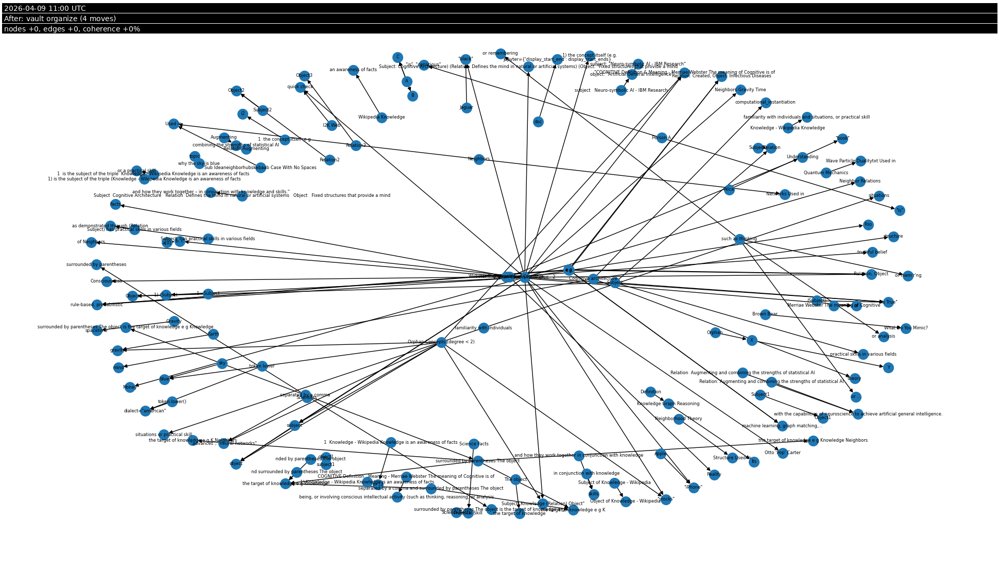](graph-2026-04-09-11-00-after-organize.png) [commit](https://github.com/BoggersTheFish/BoggersTheCIG/commit/c406479)

### 2026-04-09 11:00 UTC

**After:** 2 extracts, 2 merges — nodes +0, edges +0, coherence +0%

[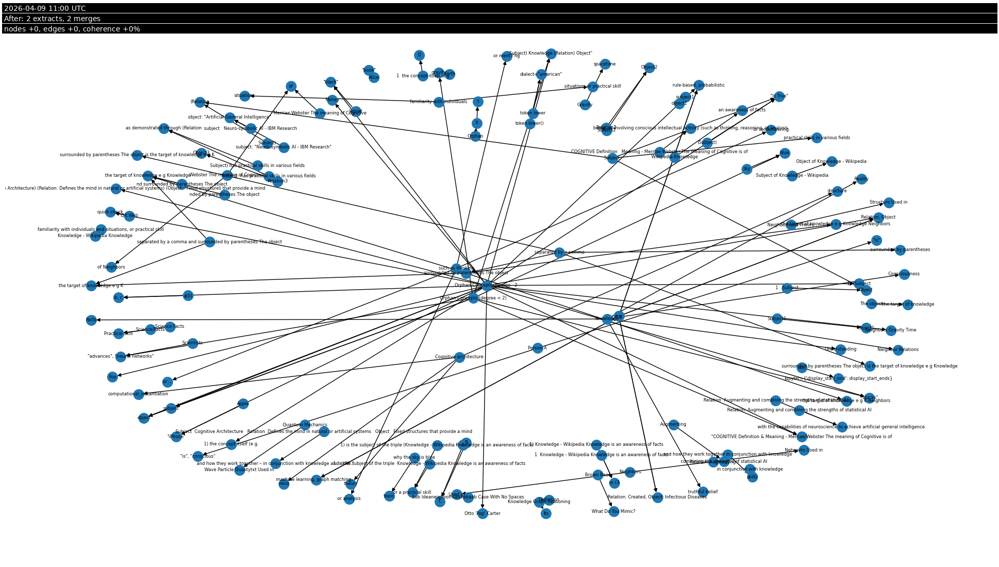](graph-2026-04-09-11-00-extract-subideas.png) [commit](https://github.com/BoggersTheFish/BoggersTheCIG/commit/c406479)

### 2026-04-09 11:00 UTC

**After:** +.md"+2_+2_.md"+A.md" — nodes +0, edges +0, coherence +0%

[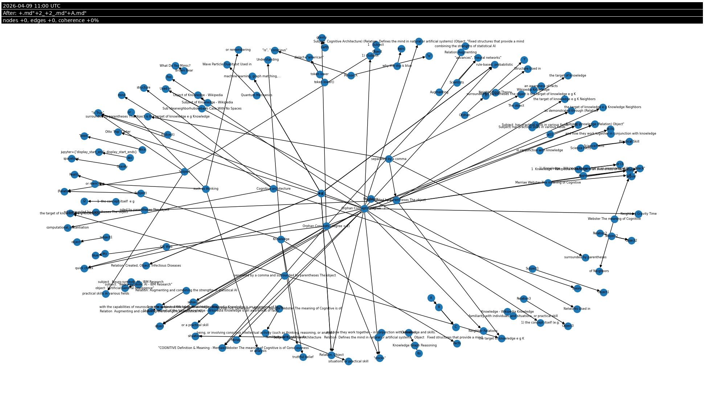](graph-2026-04-09-11-00-self-improve.png) [commit](https://github.com/BoggersTheFish/BoggersTheCIG/commit/c406479)

### 2026-04-09 16:30 UTC

**After:** vault organize (2 moves) — nodes +7, edges +93, coherence +56%

[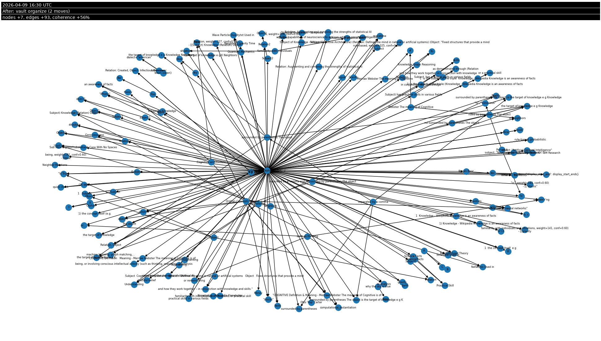](graph-2026-04-09-16-30-after-organize.png) [commit](https://github.com/BoggersTheFish/BoggersTheCIG/commit/088bc72)

### 2026-04-09 16:30 UTC

**After:** 3 extracts, 1 merges — nodes +0, edges +0, coherence +0%

[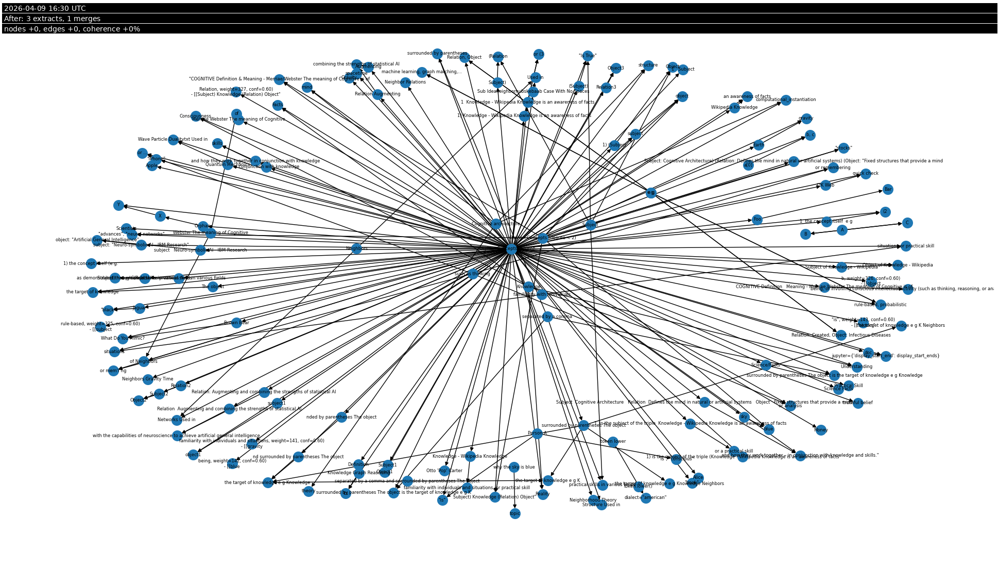](graph-2026-04-09-16-30-extract-subideas.png) [commit](https://github.com/BoggersTheFish/BoggersTheCIG/commit/088bc72)

### 2026-04-09 16:30 UTC

**After:** +.md"+2_+2_.md"+A.md" — nodes +0, edges +0, coherence +0%

[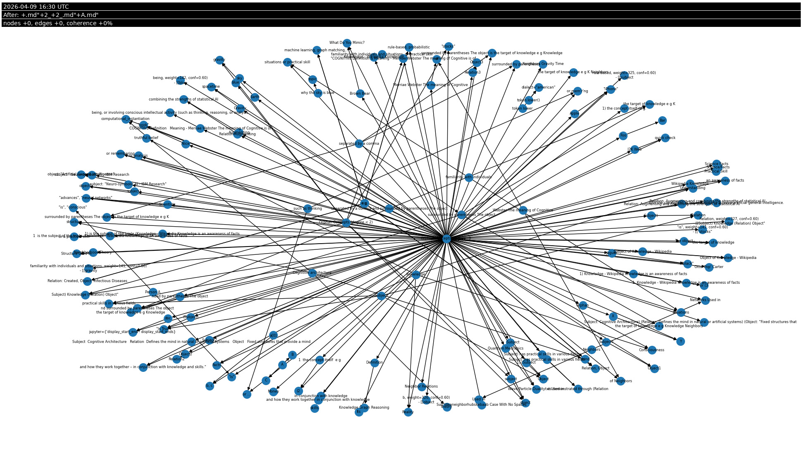](graph-2026-04-09-16-30-self-improve.png) [commit](https://github.com/BoggersTheFish/BoggersTheCIG/commit/088bc72)

### 2026-04-09 16:30 UTC

**After:** external ingest (+1 triples) — nodes +0, edges +0, coherence +0%

[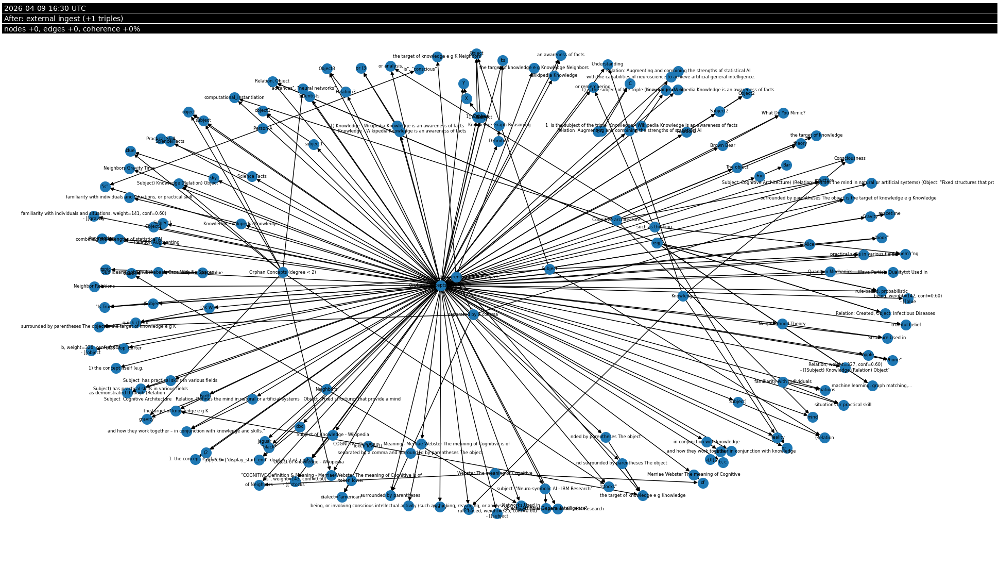](graph-2026-04-09-16-30-after-ingest.png) [commit](https://github.com/BoggersTheFish/BoggersTheCIG/commit/088bc72)

### 2026-04-09 16:32 UTC

**After:** vault analysis (+196 triples) — nodes +0, edges +5, coherence +2%

[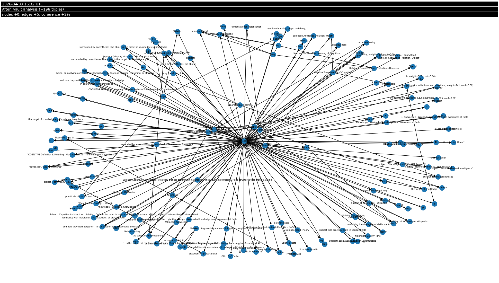](graph-2026-04-09-16-32-after-analyze-vault.png) [commit](https://github.com/BoggersTheFish/BoggersTheCIG/commit/088bc72)

### 2026-04-09 16:32 UTC

**After:** 4 extracts, 0 merges — nodes +0, edges +0, coherence +0%

[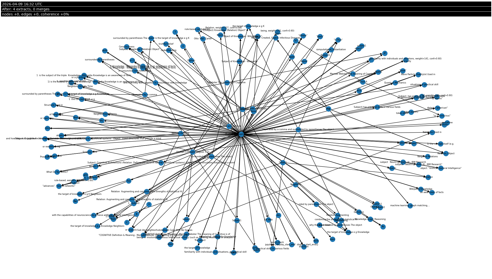](graph-2026-04-09-16-32-extract-subideas.png) [commit](https://github.com/BoggersTheFish/BoggersTheCIG/commit/088bc72)

### 2026-04-09 16:33 UTC

**After:** vault analysis (+194 triples) — nodes +0, edges +2, coherence +0%

[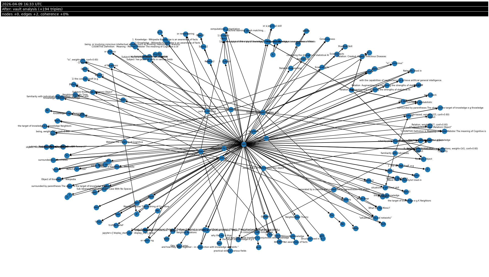](graph-2026-04-09-16-33-after-analyze-vault.png) [commit](https://github.com/BoggersTheFish/BoggersTheCIG/commit/088bc72)

### 2026-04-09 16:33 UTC

**After:** 4 extracts, 0 merges — nodes +0, edges +0, coherence +0%

[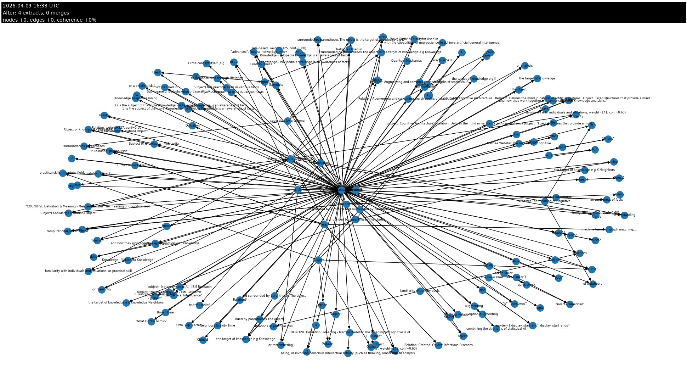](graph-2026-04-09-16-33-extract-subideas.png) [commit](https://github.com/BoggersTheFish/BoggersTheCIG/commit/088bc72)

### 2026-04-09 16:44 UTC

**After:** vault organize (4 moves) — nodes +0, edges +0, coherence +0%

[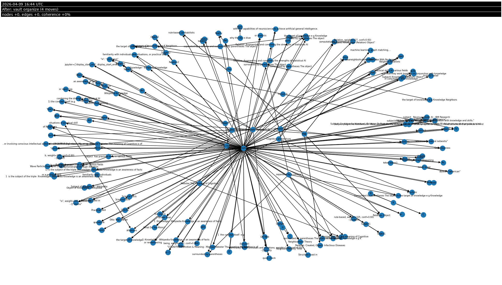](graph-2026-04-09-16-44-after-organize.png) [commit](https://github.com/BoggersTheFish/BoggersTheCIG/commit/088bc72)

### 2026-04-09 16:45 UTC

**After:** 1 extracts, 3 merges — nodes +0, edges +0, coherence +0%

[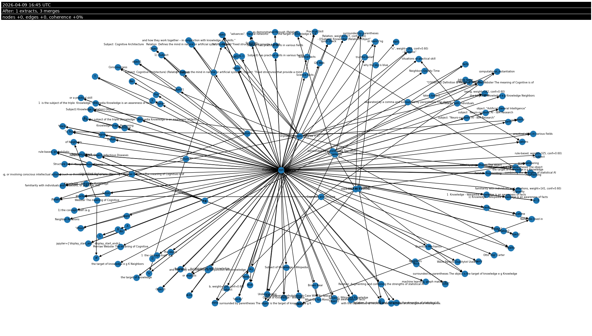](graph-2026-04-09-16-45-extract-subideas.png) [commit](https://github.com/BoggersTheFish/BoggersTheCIG/commit/088bc72)

### 2026-04-09 16:45 UTC

**After:** +.md"+2_+2_.md"+A.md" — nodes +0, edges +0, coherence +0%

[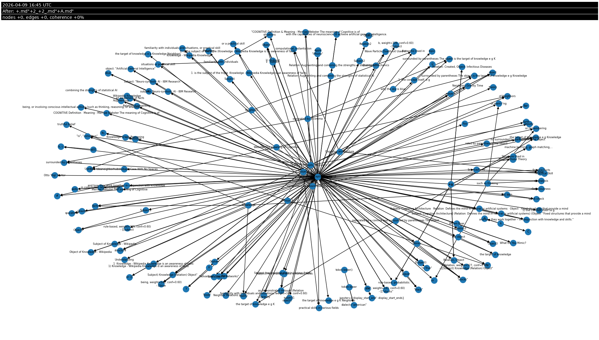](graph-2026-04-09-16-45-self-improve.png) [commit](https://github.com/BoggersTheFish/BoggersTheCIG/commit/088bc72)

### 2026-04-09 16:53 UTC

**After:** vault organize (2 moves) — nodes +0, edges +0, coherence +0%

[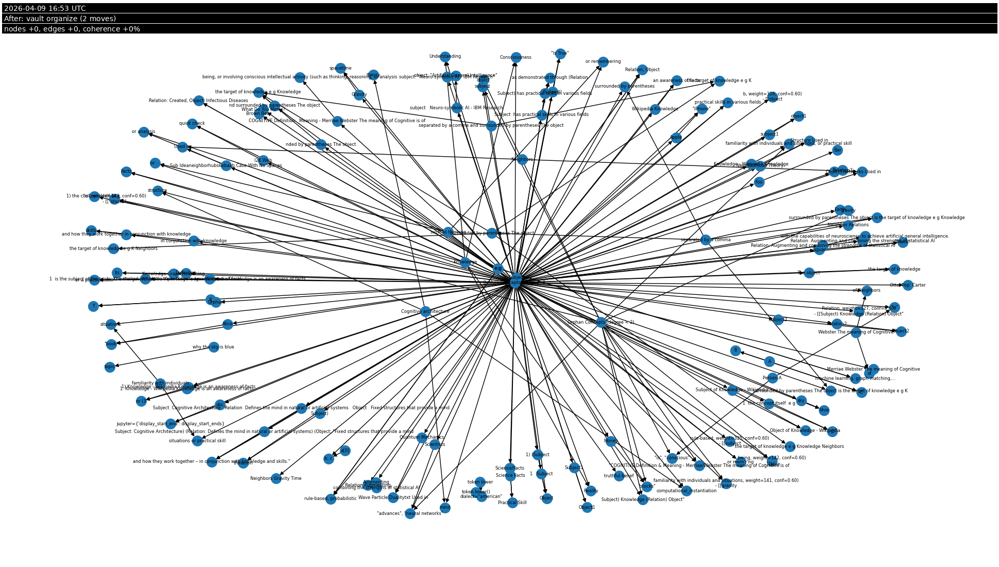](graph-2026-04-09-16-53-after-organize.png) [commit](https://github.com/BoggersTheFish/BoggersTheCIG/commit/088bc72)

### 2026-04-09 16:54 UTC

**After:** 4 extracts, 0 merges — nodes +0, edges +0, coherence +0%

[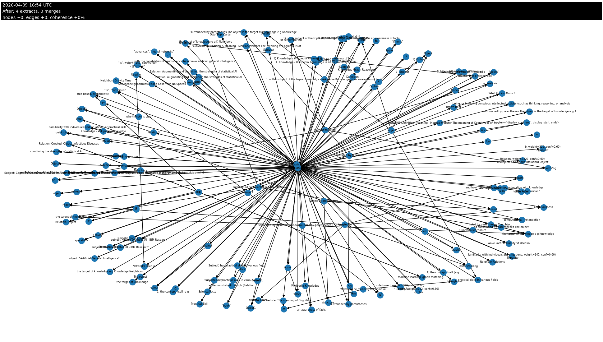](graph-2026-04-09-16-54-extract-subideas.png) [commit](https://github.com/BoggersTheFish/BoggersTheCIG/commit/088bc72)

### 2026-04-09 16:54 UTC

**After:** +.md"+2_+2_.md"+A.md" — nodes +0, edges +0, coherence +0%

[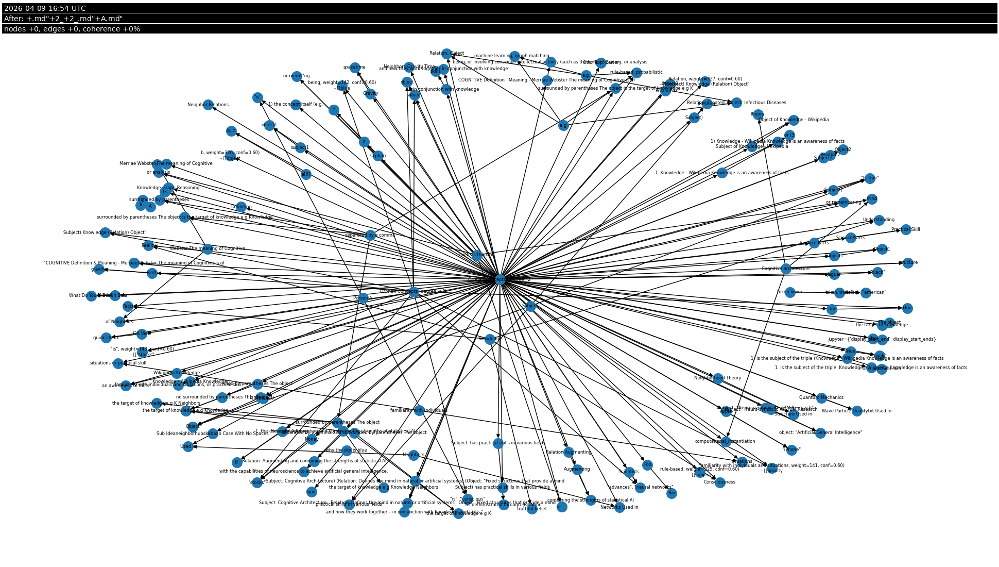](graph-2026-04-09-16-54-self-improve.png) [commit](https://github.com/BoggersTheFish/BoggersTheCIG/commit/088bc72)

### 2026-04-09 21:05 UTC

**After:** vault organize (9 moves) — nodes +10, edges +12, coherence -6%

[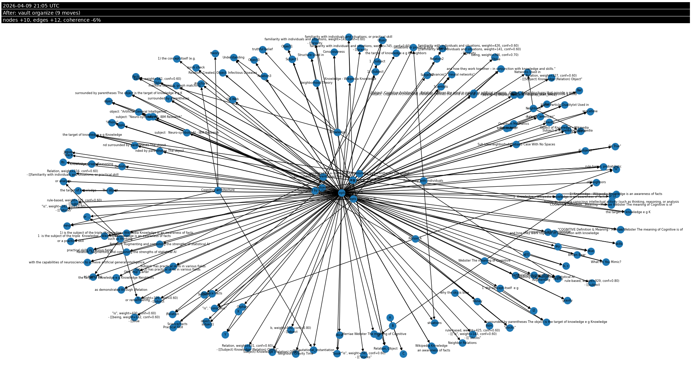](graph-2026-04-09-21-05-after-organize.png) [commit](https://github.com/BoggersTheFish/BoggersTheCIG/commit/4f17bbc)

### 2026-04-09 21:05 UTC

**After:** 1 extracts, 3 merges — nodes +0, edges +0, coherence +0%

[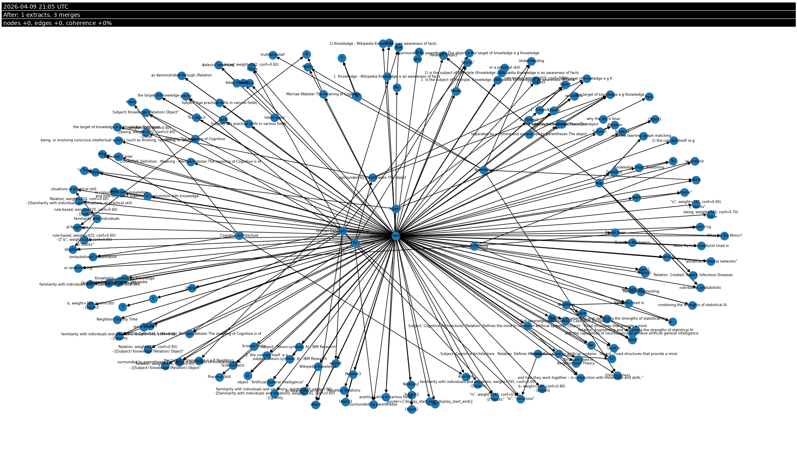](graph-2026-04-09-21-05-extract-subideas.png) [commit](https://github.com/BoggersTheFish/BoggersTheCIG/commit/4f17bbc)

### 2026-04-09 21:05 UTC

**After:** +.md"+2_+2_.md"+A.md" — nodes +0, edges +0, coherence +0%

[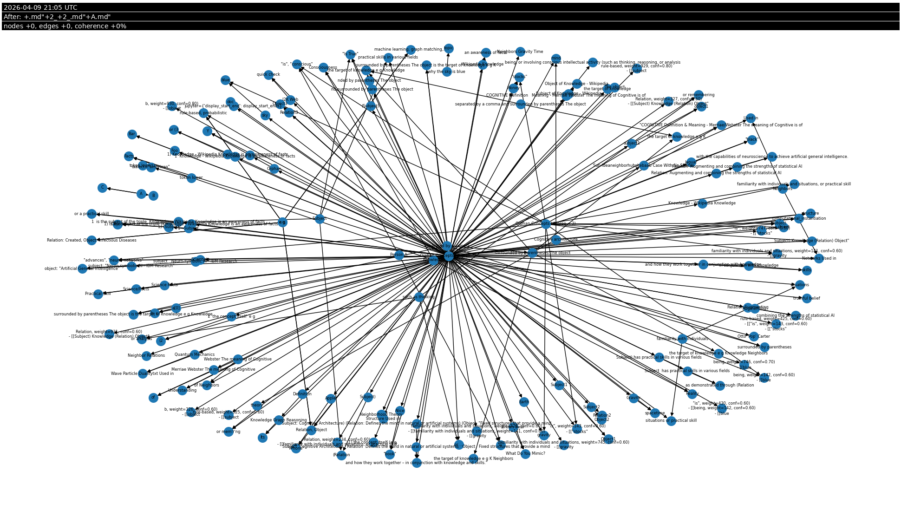](graph-2026-04-09-21-05-self-improve.png) [commit](https://github.com/BoggersTheFish/BoggersTheCIG/commit/4f17bbc)

### 2026-04-09 21:06 UTC

**After:** vault analysis (+209 triples) — nodes +2, edges +4, coherence +0%

[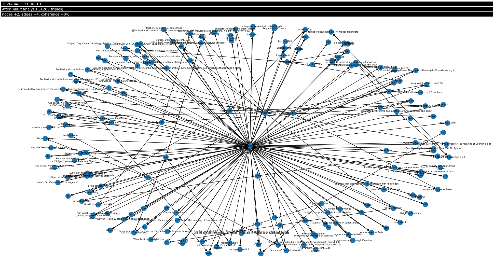](graph-2026-04-09-21-06-after-analyze-vault.png) [commit](https://github.com/BoggersTheFish/BoggersTheCIG/commit/4f17bbc)

### 2026-04-09 21:07 UTC

**After:** 3 extracts, 0 merges — nodes +0, edges +0, coherence +0%

[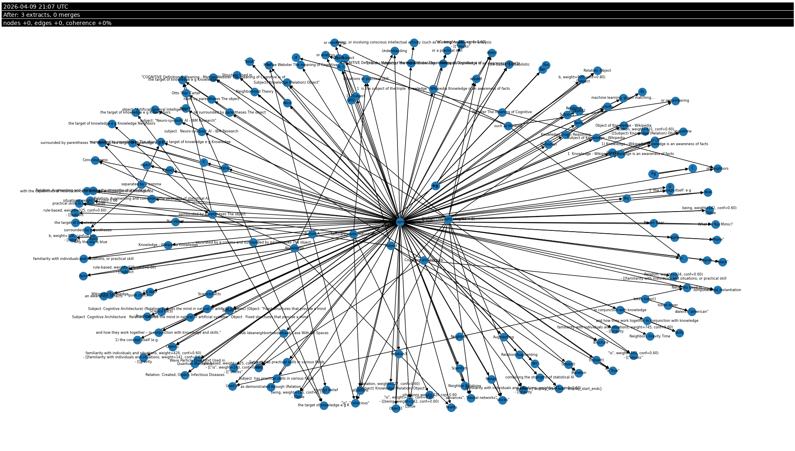](graph-2026-04-09-21-07-extract-subideas.png) [commit](https://github.com/BoggersTheFish/BoggersTheCIG/commit/4f17bbc)

### 2026-04-09 21:08 UTC

**After:** vault analysis (+207 triples) — nodes +0, edges +2, coherence +0%

[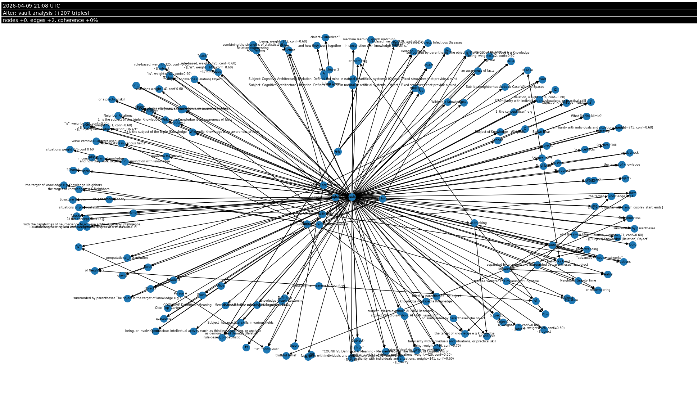](graph-2026-04-09-21-08-after-analyze-vault.png) [commit](https://github.com/BoggersTheFish/BoggersTheCIG/commit/4f17bbc)

### 2026-04-09 21:08 UTC

**After:** 3 extracts, 0 merges — nodes +0, edges +0, coherence +0%

[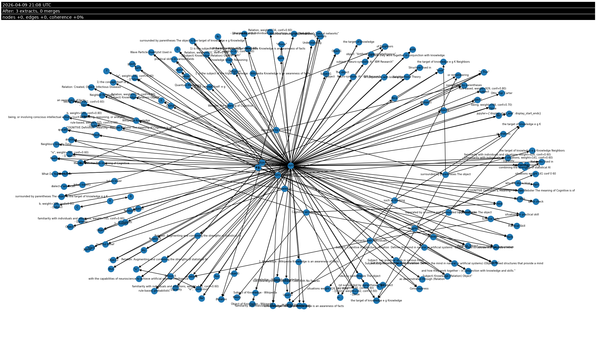](graph-2026-04-09-21-08-extract-subideas.png) [commit](https://github.com/BoggersTheFish/BoggersTheCIG/commit/4f17bbc)

### 2026-04-09 21:18 UTC

**After:** vault organize (1 moves) — nodes +0, edges +0, coherence +0%

[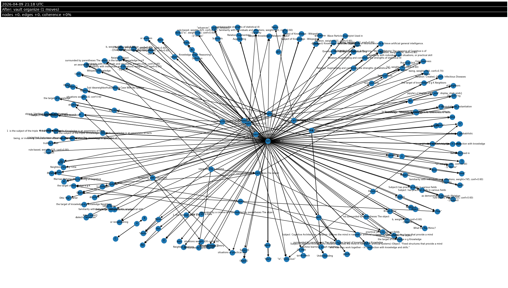](graph-2026-04-09-21-18-after-organize.png) [commit](https://github.com/BoggersTheFish/BoggersTheCIG/commit/4f17bbc)

### 2026-04-09 21:19 UTC

**After:** 2 extracts, 2 merges — nodes +0, edges +0, coherence +0%

[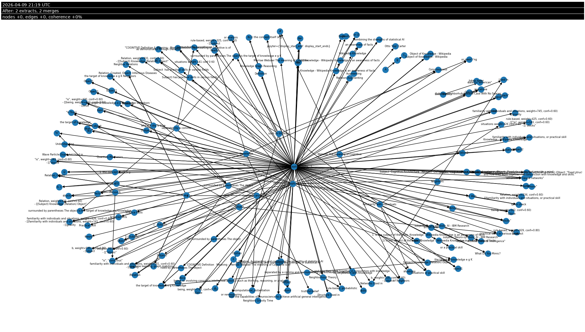](graph-2026-04-09-21-19-extract-subideas.png) [commit](https://github.com/BoggersTheFish/BoggersTheCIG/commit/4f17bbc)

### 2026-04-09 21:19 UTC

**After:** +.md"+2_+2_.md"+60.md" — nodes +0, edges +0, coherence +0%

[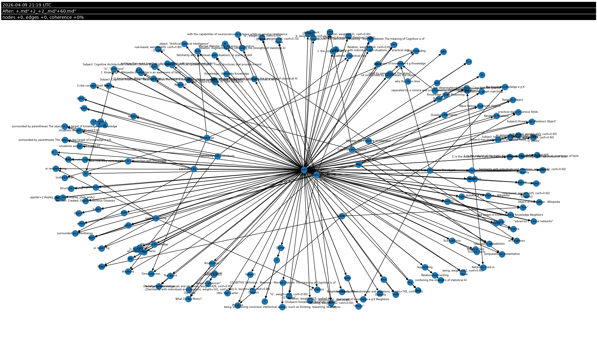](graph-2026-04-09-21-19-self-improve.png) [commit](https://github.com/BoggersTheFish/BoggersTheCIG/commit/4f17bbc)

### 2026-04-09 21:29 UTC

**After:** vault organize (0 moves) — nodes +0, edges +0, coherence +0%

[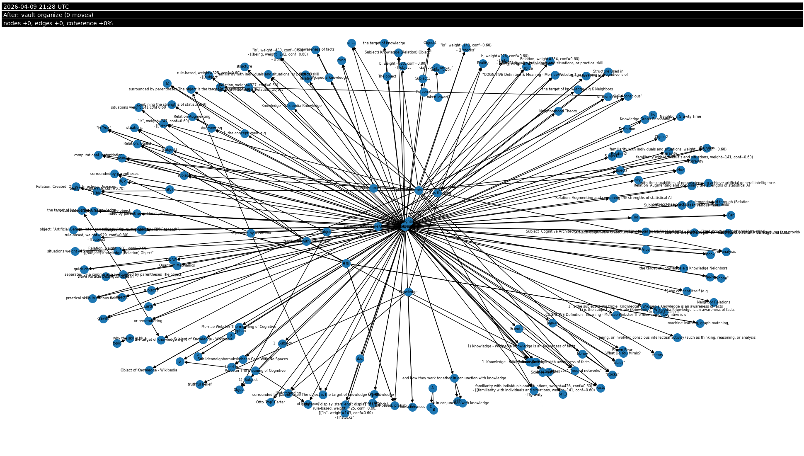](graph-2026-04-09-21-28-after-organize.png) [commit](https://github.com/BoggersTheFish/BoggersTheCIG/commit/4f17bbc)

### 2026-04-09 21:29 UTC

**After:** 2 extracts, 2 merges — nodes +0, edges +0, coherence +0%

[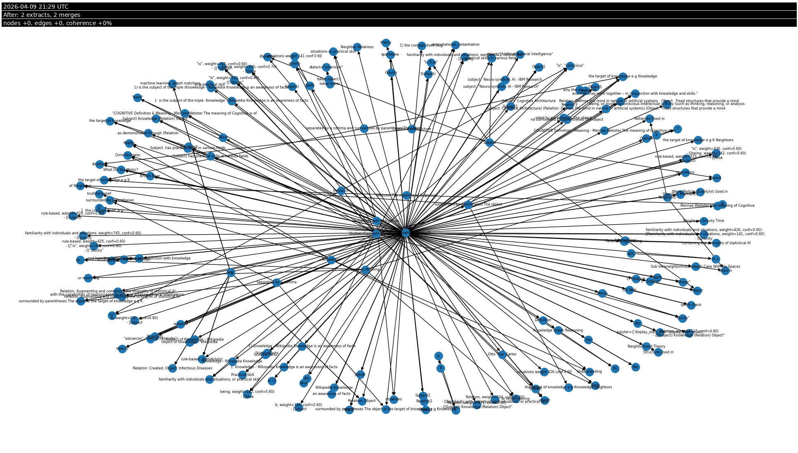](graph-2026-04-09-21-29-extract-subideas.png) [commit](https://github.com/BoggersTheFish/BoggersTheCIG/commit/4f17bbc)

### 2026-04-09 21:29 UTC

**After:** +.md"+2_+2_.md"+60.md" — nodes +0, edges +0, coherence +0%

[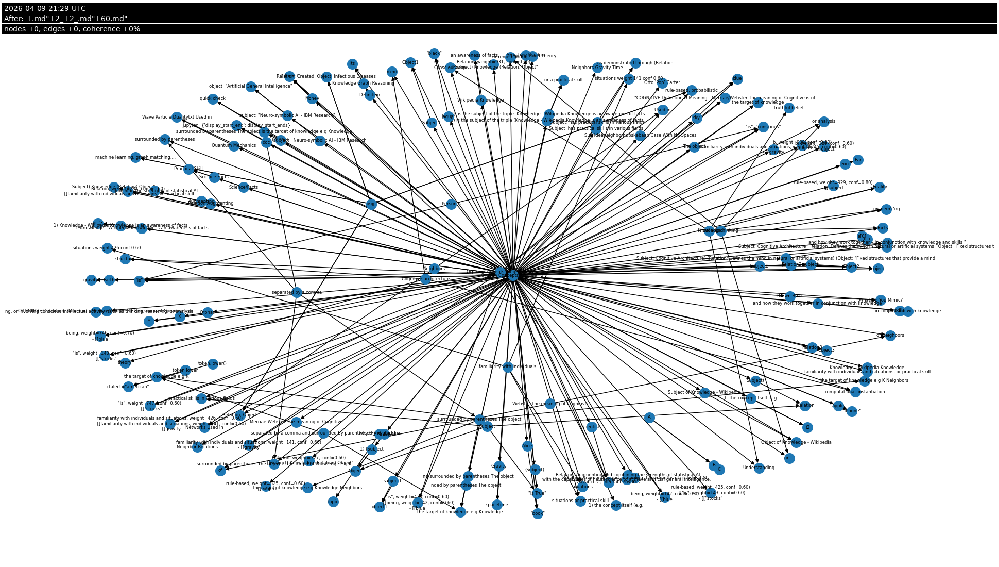](graph-2026-04-09-21-29-self-improve.png) [commit](https://github.com/BoggersTheFish/BoggersTheCIG/commit/4f17bbc)

### 2026-04-10 02:43 UTC

**After:** vault organize (8 moves) — nodes +14, edges +14, coherence -9%

[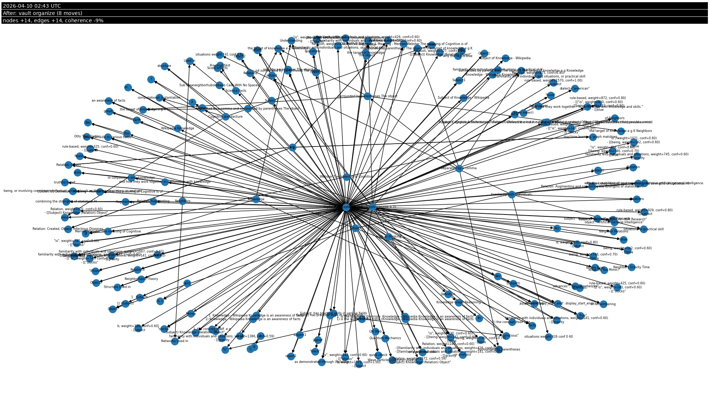](graph-2026-04-10-02-43-after-organize.png) [commit](https://github.com/BoggersTheFish/BoggersTheCIG/commit/e5e002d)

### 2026-04-10 02:43 UTC

**After:** 1 extracts, 3 merges — nodes +0, edges +0, coherence +0%

[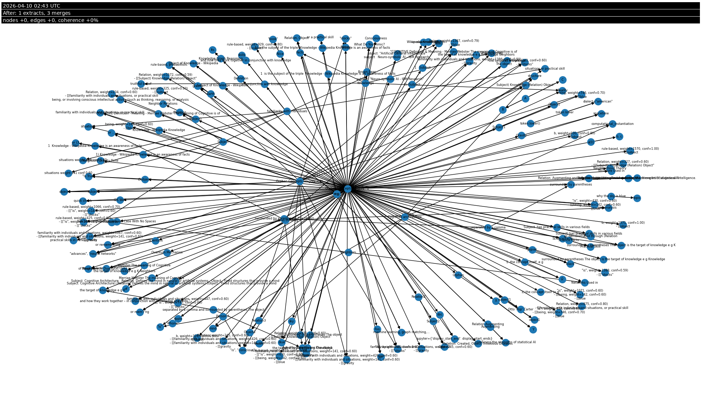](graph-2026-04-10-02-43-extract-subideas.png) [commit](https://github.com/BoggersTheFish/BoggersTheCIG/commit/e5e002d)

### 2026-04-10 02:43 UTC

**After:** .md"+2_+2_.md"+60.md"+A.md" — nodes +0, edges +0, coherence +0%

[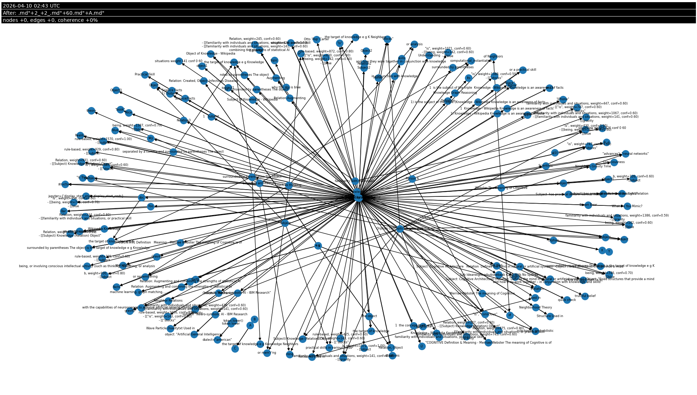](graph-2026-04-10-02-43-self-improve.png) [commit](https://github.com/BoggersTheFish/BoggersTheCIG/commit/e5e002d)

### 2026-04-10 02:45 UTC

**After:** vault analysis (+222 triples) — nodes +0, edges +2, coherence +0%

[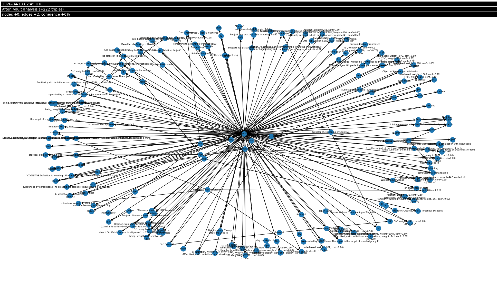](graph-2026-04-10-02-45-after-analyze-vault.png) [commit](https://github.com/BoggersTheFish/BoggersTheCIG/commit/e5e002d)

### 2026-04-10 02:45 UTC

**After:** 2 extracts, 0 merges — nodes +0, edges +0, coherence +0%

[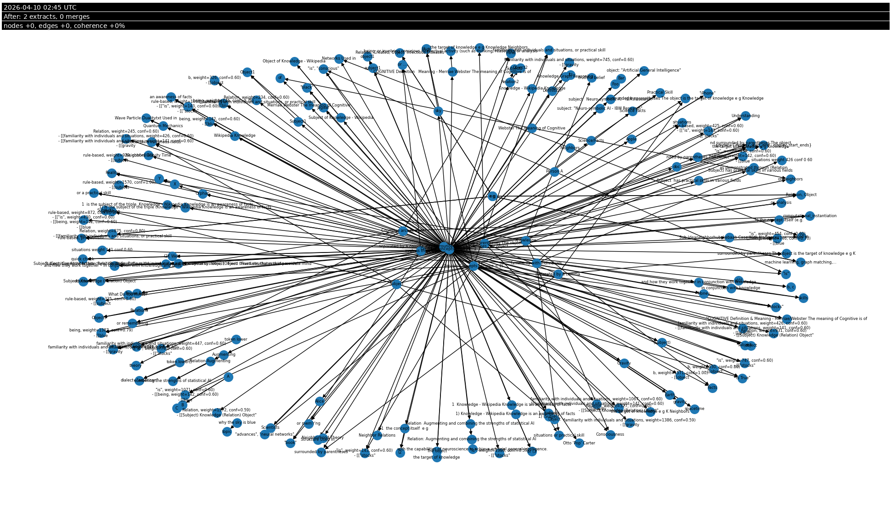](graph-2026-04-10-02-45-extract-subideas.png) [commit](https://github.com/BoggersTheFish/BoggersTheCIG/commit/e5e002d)

### 2026-04-10 02:47 UTC

**After:** vault analysis (+220 triples) — nodes +0, edges +2, coherence +0%

[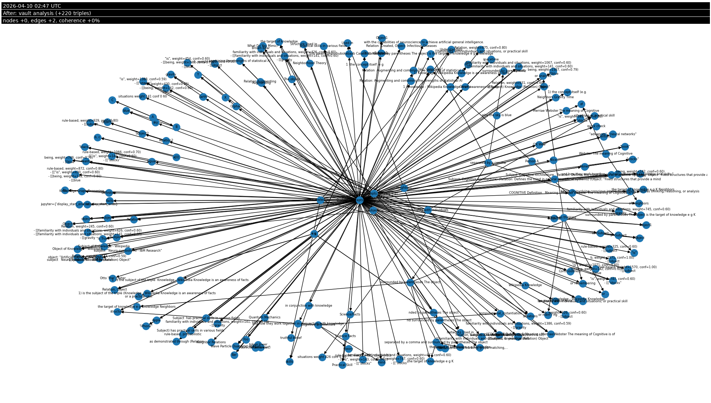](graph-2026-04-10-02-47-after-analyze-vault.png) [commit](https://github.com/BoggersTheFish/BoggersTheCIG/commit/e5e002d)

### 2026-04-10 02:47 UTC

**After:** 2 extracts, 0 merges — nodes +0, edges +0, coherence +0%

[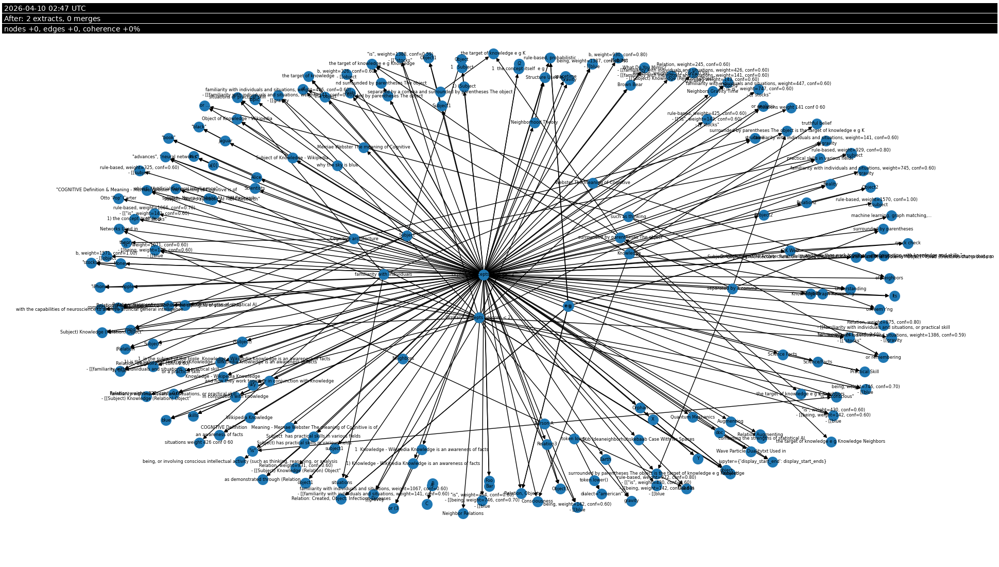](graph-2026-04-10-02-47-extract-subideas.png) [commit](https://github.com/BoggersTheFish/BoggersTheCIG/commit/e5e002d)

### 2026-04-10 02:59 UTC

**After:** vault organize (4 moves) — nodes +0, edges +0, coherence +0%

[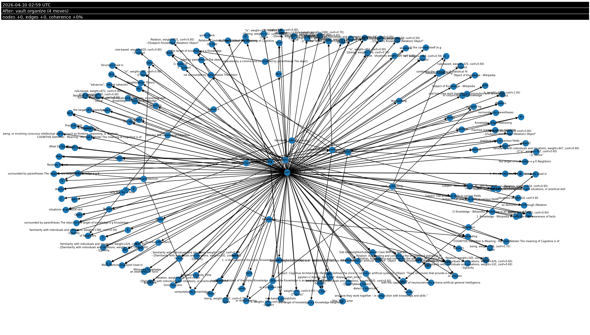](graph-2026-04-10-02-59-after-organize.png) [commit](https://github.com/BoggersTheFish/BoggersTheCIG/commit/e5e002d)

### 2026-04-10 03:00 UTC

**After:** 1 extracts, 2 merges — nodes +0, edges +0, coherence +0%

[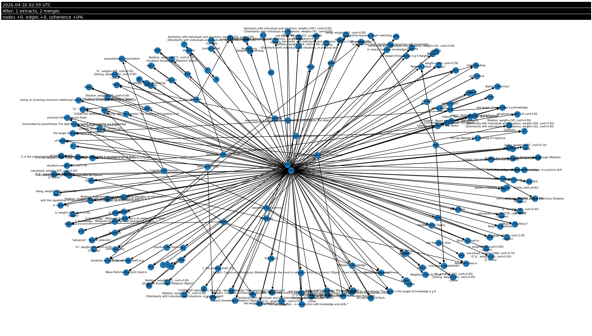](graph-2026-04-10-02-59-extract-subideas.png) [commit](https://github.com/BoggersTheFish/BoggersTheCIG/commit/e5e002d)

### 2026-04-10 03:00 UTC

**After:** .md"+2_+2_.md"+60.md"+A.md" — nodes +0, edges +0, coherence +0%

[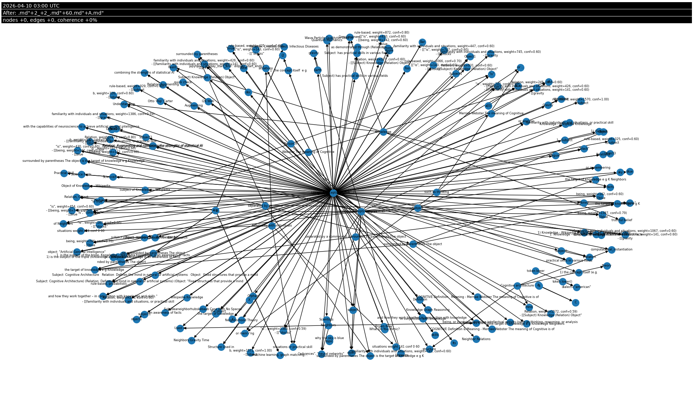](graph-2026-04-10-03-00-self-improve.png) [commit](https://github.com/BoggersTheFish/BoggersTheCIG/commit/e5e002d)

### 2026-04-10 03:11 UTC

**After:** vault organize (0 moves) — nodes +0, edges +0, coherence +0%

[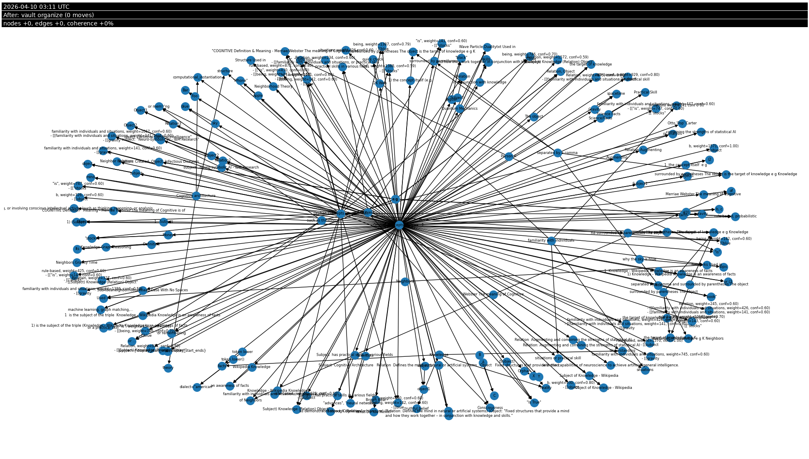](graph-2026-04-10-03-11-after-organize.png) [commit](https://github.com/BoggersTheFish/BoggersTheCIG/commit/e5e002d)

### 2026-04-10 03:11 UTC

**After:** 2 extracts, 1 merges — nodes +0, edges +0, coherence +0%

[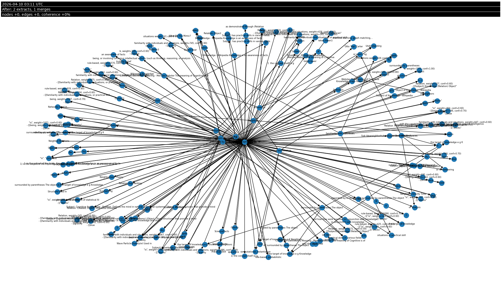](graph-2026-04-10-03-11-extract-subideas.png) [commit](https://github.com/BoggersTheFish/BoggersTheCIG/commit/e5e002d)

### 2026-04-10 03:11 UTC

**After:** +.md"+2_+2_.md"+60.md" — nodes +0, edges +0, coherence +0%

[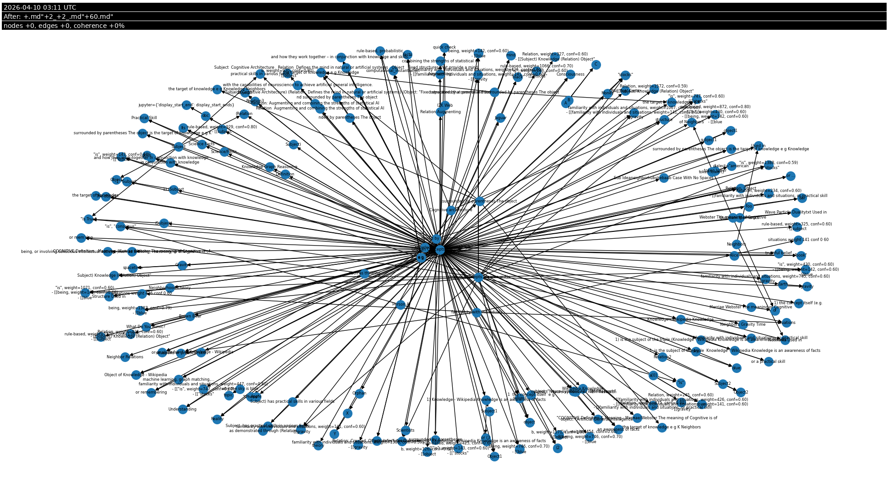](graph-2026-04-10-03-11-self-improve.png) [commit](https://github.com/BoggersTheFish/BoggersTheCIG/commit/e5e002d)

### 2026-04-10 07:07 UTC

**After:** vault organize (11 moves) — nodes +17, edges +17, coherence -10%

[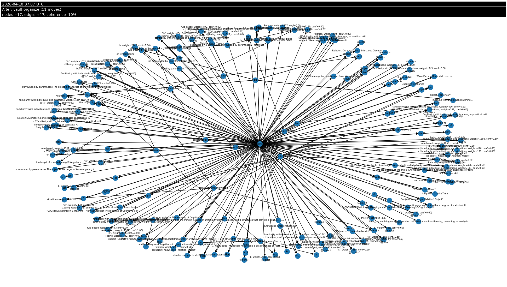](graph-2026-04-10-07-07-after-organize.png) [commit](https://github.com/BoggersTheFish/BoggersTheCIG/commit/e1db1a0)

### 2026-04-10 07:07 UTC

**After:** 1 extracts, 2 merges — nodes +0, edges +0, coherence +0%

[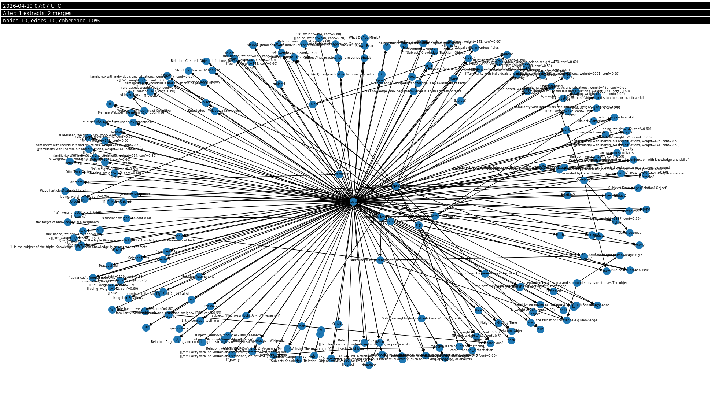](graph-2026-04-10-07-07-extract-subideas.png) [commit](https://github.com/BoggersTheFish/BoggersTheCIG/commit/e1db1a0)

### 2026-04-10 07:07 UTC

**After:** +.md"+2_+2_.md"+A.md" — nodes +0, edges +0, coherence +0%

[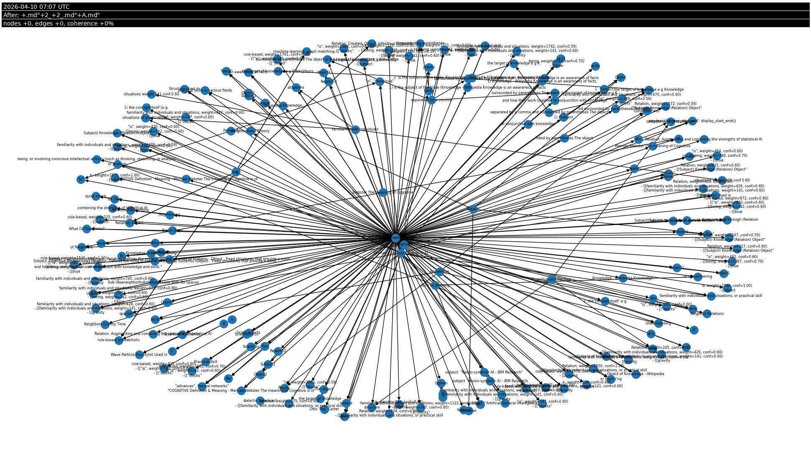](graph-2026-04-10-07-07-self-improve.png) [commit](https://github.com/BoggersTheFish/BoggersTheCIG/commit/e1db1a0)

### 2026-04-10 07:10 UTC

**After:** vault analysis (+247 triples) — nodes +2, edges +4, coherence +0%

[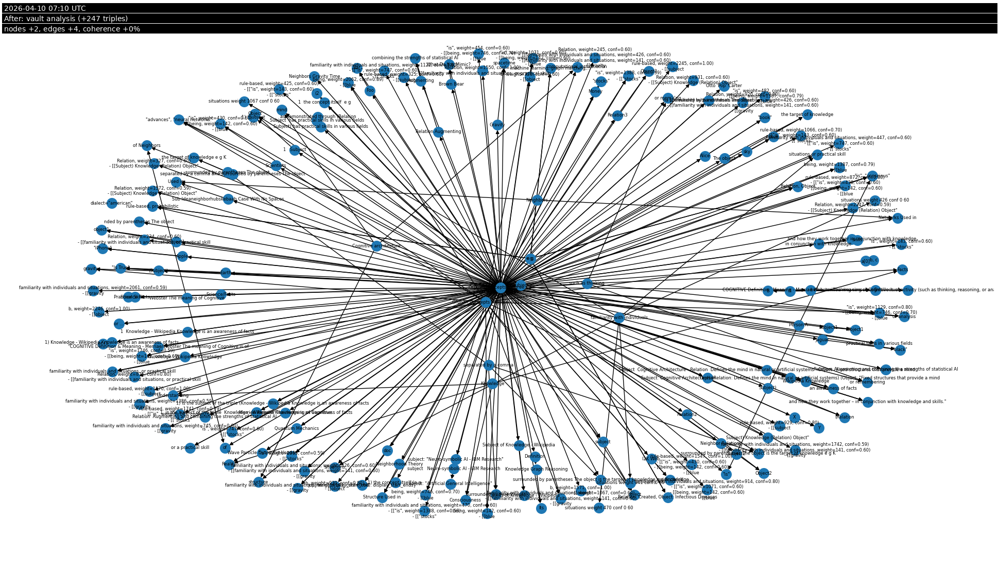](graph-2026-04-10-07-10-after-analyze-vault.png) [commit](https://github.com/BoggersTheFish/BoggersTheCIG/commit/e1db1a0)

### 2026-04-10 07:10 UTC

**After:** 1 extracts, 0 merges — nodes +0, edges +0, coherence +0%

[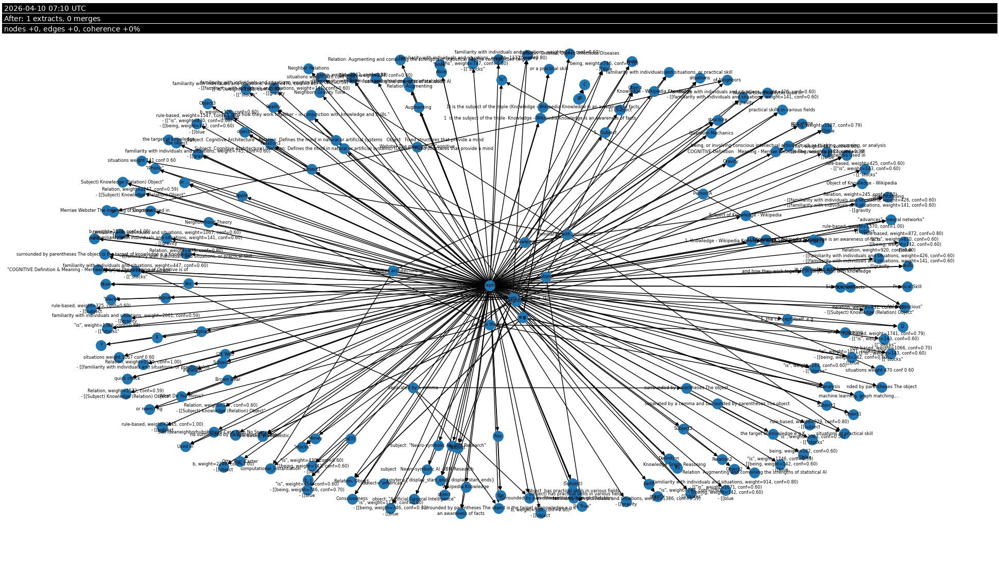](graph-2026-04-10-07-10-extract-subideas.png) [commit](https://github.com/BoggersTheFish/BoggersTheCIG/commit/e1db1a0)

### 2026-04-10 07:12 UTC

**After:** vault analysis (+245 triples) — nodes +0, edges +2, coherence +0%

[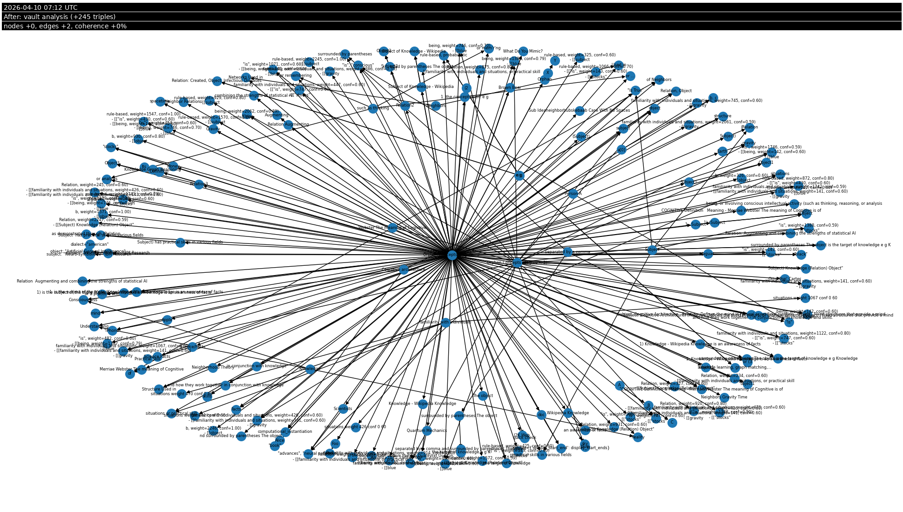](graph-2026-04-10-07-12-after-analyze-vault.png) [commit](https://github.com/BoggersTheFish/BoggersTheCIG/commit/e1db1a0)

### 2026-04-10 07:12 UTC

**After:** 1 extracts, 0 merges — nodes +0, edges +0, coherence +0%

[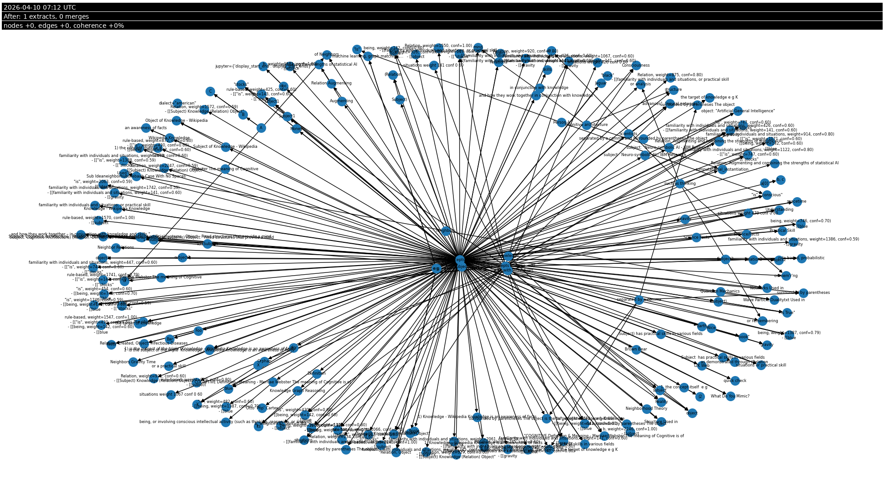](graph-2026-04-10-07-12-extract-subideas.png) [commit](https://github.com/BoggersTheFish/BoggersTheCIG/commit/e1db1a0)

### 2026-04-10 07:24 UTC

**After:** vault organize (4 moves) — nodes +0, edges +0, coherence +0%

[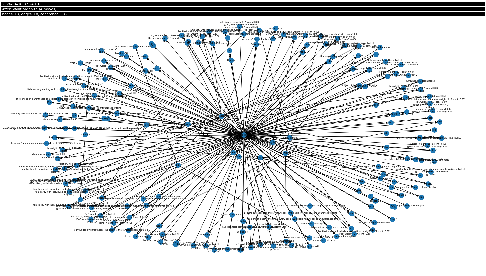](graph-2026-04-10-07-24-after-organize.png) [commit](https://github.com/BoggersTheFish/BoggersTheCIG/commit/e1db1a0)

### 2026-04-10 07:25 UTC

**After:** 3 extracts, 1 merges — nodes +0, edges +0, coherence +0%

[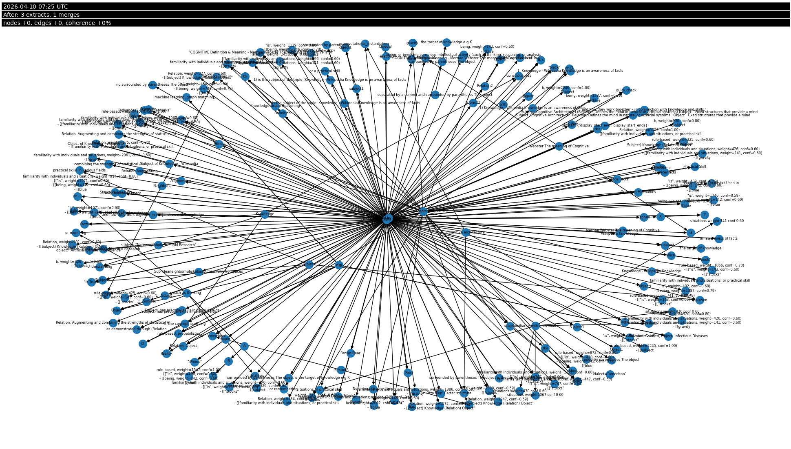](graph-2026-04-10-07-25-extract-subideas.png) [commit](https://github.com/BoggersTheFish/BoggersTheCIG/commit/e1db1a0)

### 2026-04-10 07:25 UTC

**After:** +.md"+2_+2_.md"+60.md" — nodes +0, edges +0, coherence +0%

[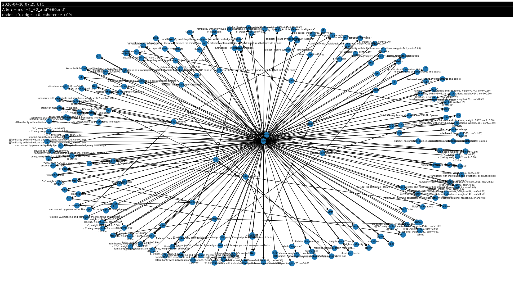](graph-2026-04-10-07-25-self-improve.png) [commit](https://github.com/BoggersTheFish/BoggersTheCIG/commit/e1db1a0)

### 2026-04-10 07:36 UTC

**After:** vault organize (4 moves) — nodes +0, edges +0, coherence +0%

[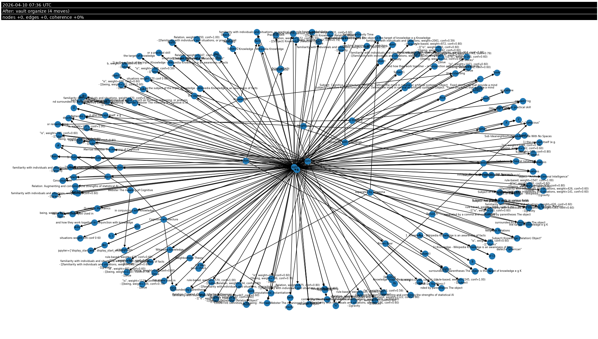](graph-2026-04-10-07-36-after-organize.png) [commit](https://github.com/BoggersTheFish/BoggersTheCIG/commit/e1db1a0)

### 2026-04-10 07:36 UTC

**After:** 0 extracts, 4 merges — nodes +0, edges +0, coherence +0%

[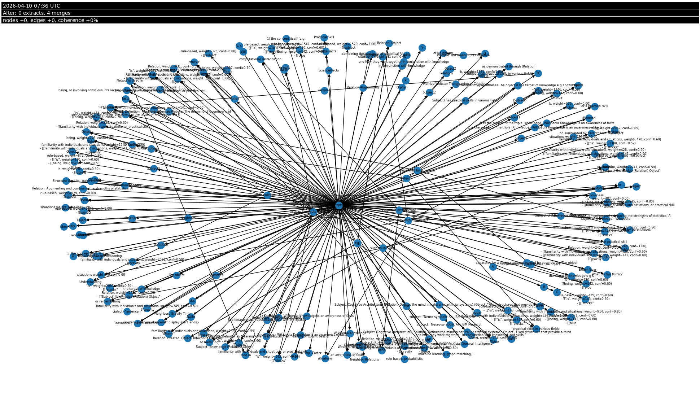](graph-2026-04-10-07-36-extract-subideas.png) [commit](https://github.com/BoggersTheFish/BoggersTheCIG/commit/e1db1a0)

### 2026-04-10 07:36 UTC

**After:** +.md"+2_+2_.md"+60.md" — nodes +0, edges +0, coherence +0%

[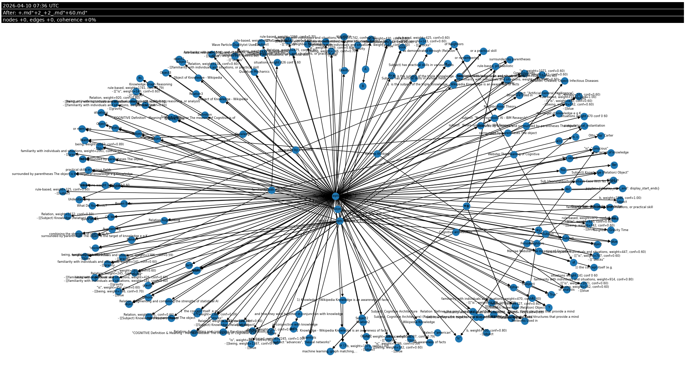](graph-2026-04-10-07-36-self-improve.png) [commit](https://github.com/BoggersTheFish/BoggersTheCIG/commit/e1db1a0)

### 2026-04-10 11:10 UTC

**After:** vault organize (5 moves) — nodes +17, edges +17, coherence -9%

[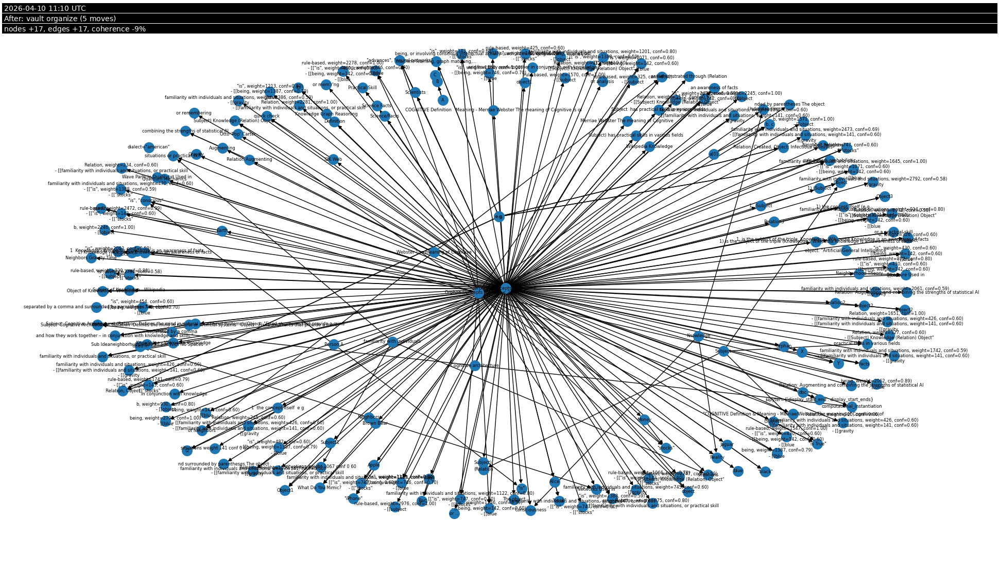](graph-2026-04-10-11-10-after-organize.png) [commit](https://github.com/BoggersTheFish/BoggersTheCIG/commit/6f705ee)

### 2026-04-10 11:10 UTC

**After:** 2 extracts, 2 merges — nodes +0, edges +0, coherence +0%

[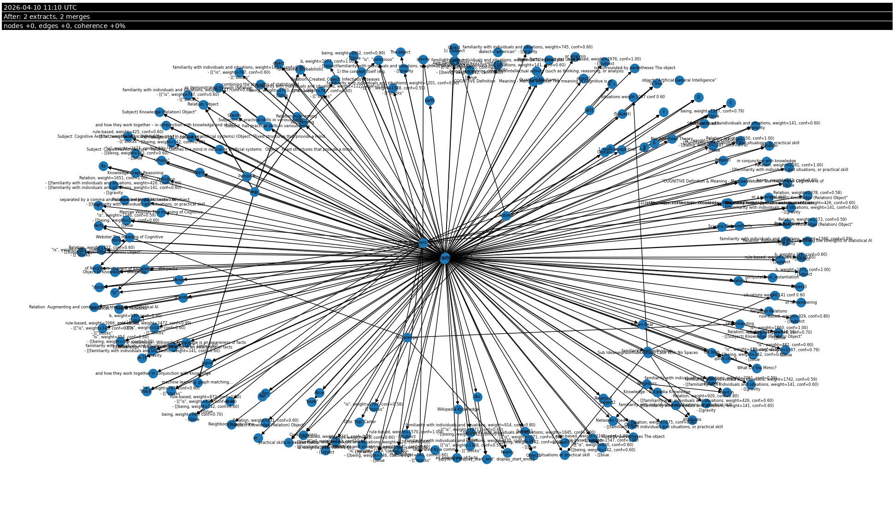](graph-2026-04-10-11-10-extract-subideas.png) [commit](https://github.com/BoggersTheFish/BoggersTheCIG/commit/6f705ee)

### 2026-04-10 11:10 UTC

**After:** +.md"+2_.md"+60.md"+A.md" — nodes +0, edges +0, coherence +0%

[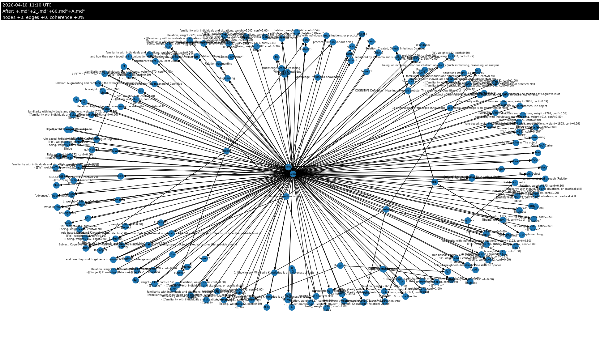](graph-2026-04-10-11-10-self-improve.png) [commit](https://github.com/BoggersTheFish/BoggersTheCIG/commit/6f705ee)

### 2026-04-10 11:12 UTC

**After:** vault analysis (+256 triples) — nodes +2, edges +4, coherence +0%

[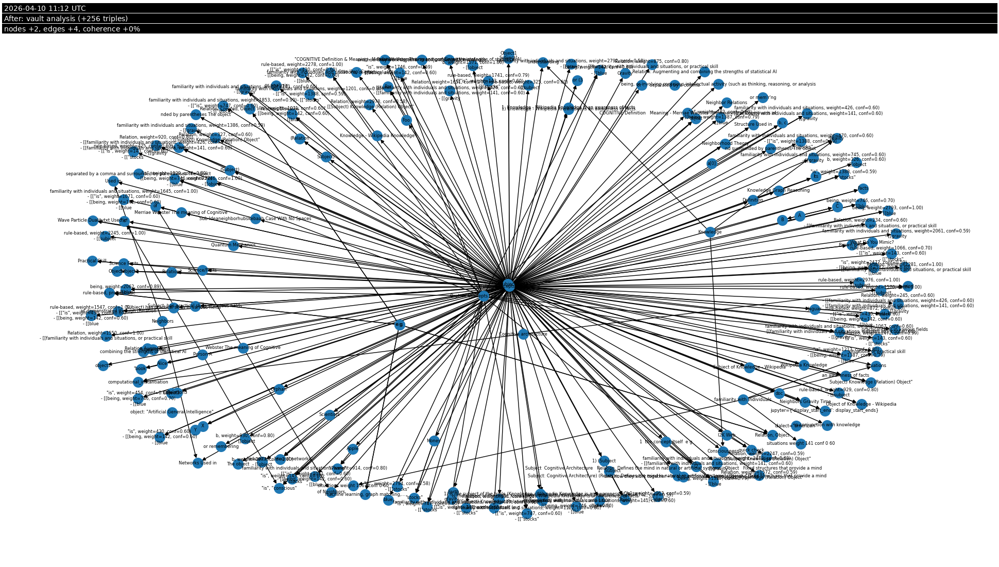](graph-2026-04-10-11-12-after-analyze-vault.png) [commit](https://github.com/BoggersTheFish/BoggersTheCIG/commit/6f705ee)

### 2026-04-10 11:12 UTC

**After:** 4 extracts, 0 merges — nodes +0, edges +0, coherence +0%

[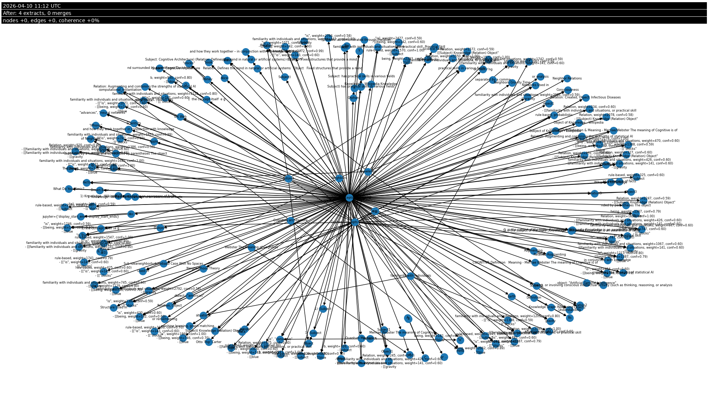](graph-2026-04-10-11-12-extract-subideas.png) [commit](https://github.com/BoggersTheFish/BoggersTheCIG/commit/6f705ee)

### 2026-04-10 11:14 UTC

**After:** vault analysis (+254 triples) — nodes +0, edges +2, coherence +0%

[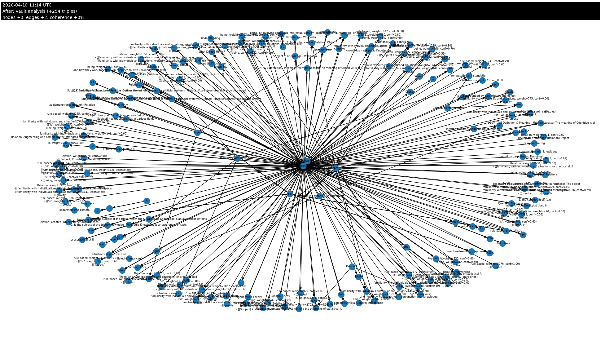](graph-2026-04-10-11-14-after-analyze-vault.png) [commit](https://github.com/BoggersTheFish/BoggersTheCIG/commit/6f705ee)

### 2026-04-10 11:14 UTC

**After:** 4 extracts, 0 merges — nodes +0, edges +0, coherence +0%

[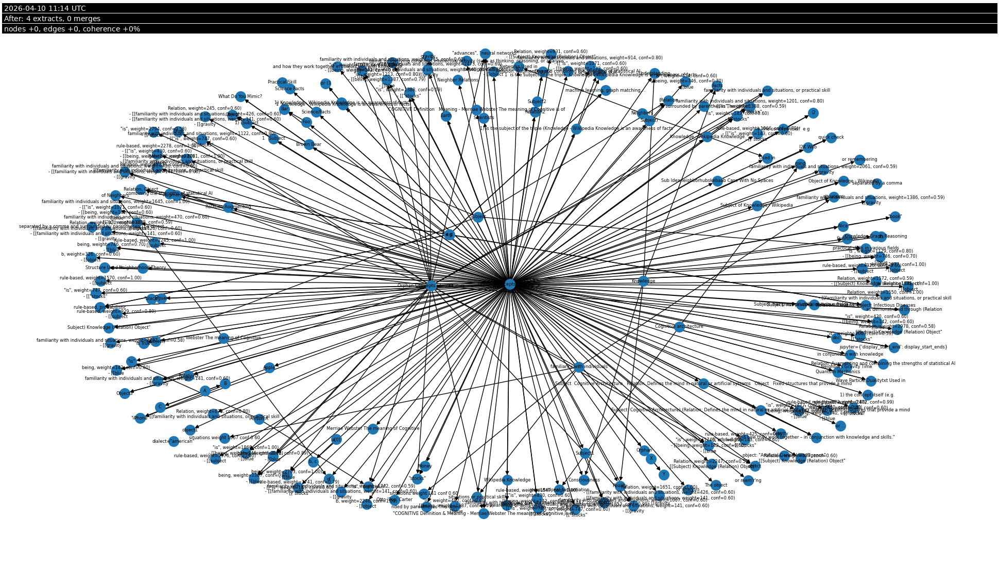](graph-2026-04-10-11-14-extract-subideas.png) [commit](https://github.com/BoggersTheFish/BoggersTheCIG/commit/6f705ee)

### 2026-04-10 11:29 UTC

**After:** vault organize (5 moves) — nodes +0, edges +0, coherence +0%

[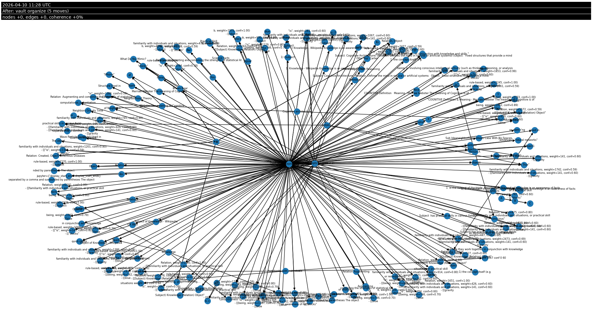](graph-2026-04-10-11-28-after-organize.png) [commit](https://github.com/BoggersTheFish/BoggersTheCIG/commit/6f705ee)

### 2026-04-10 11:29 UTC

**After:** 0 extracts, 4 merges — nodes +0, edges +0, coherence +0%

[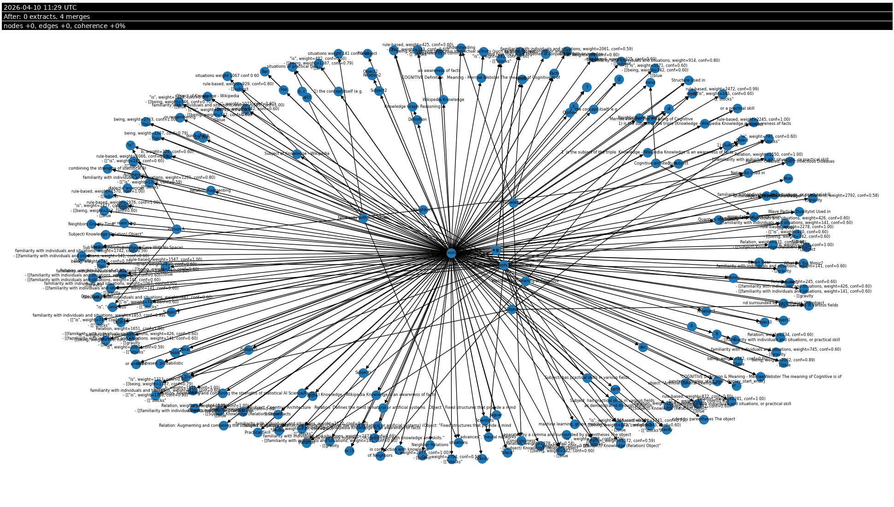](graph-2026-04-10-11-29-extract-subideas.png) [commit](https://github.com/BoggersTheFish/BoggersTheCIG/commit/6f705ee)

### 2026-04-10 11:29 UTC

**After:** +.md"+00.md"+2_.md"+59.md" — nodes +0, edges +0, coherence +0%

[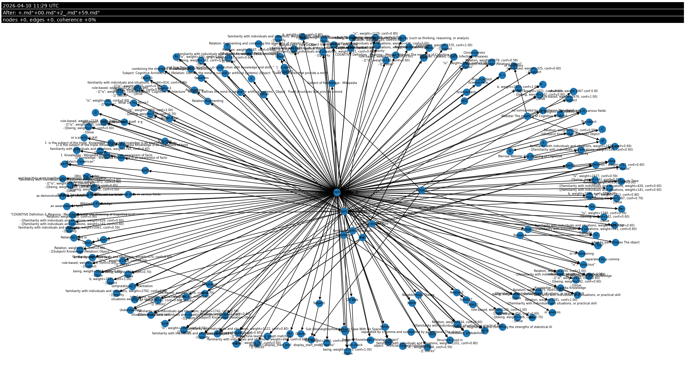](graph-2026-04-10-11-29-self-improve.png) [commit](https://github.com/BoggersTheFish/BoggersTheCIG/commit/6f705ee)

### 2026-04-10 11:41 UTC

**After:** vault organize (6 moves) — nodes +0, edges +0, coherence +0%

[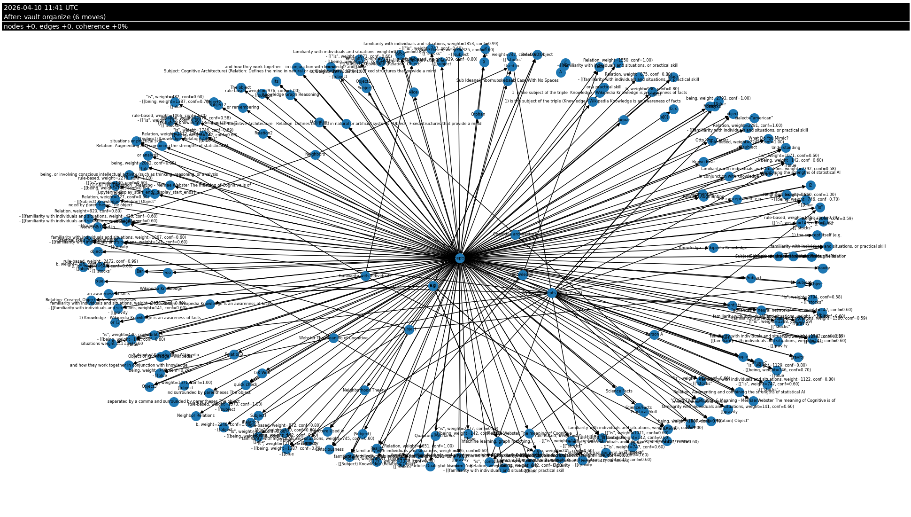](graph-2026-04-10-11-41-after-organize.png) [commit](https://github.com/BoggersTheFish/BoggersTheCIG/commit/6f705ee)

### 2026-04-10 11:42 UTC

**After:** 2 extracts, 2 merges — nodes +0, edges +0, coherence +0%

[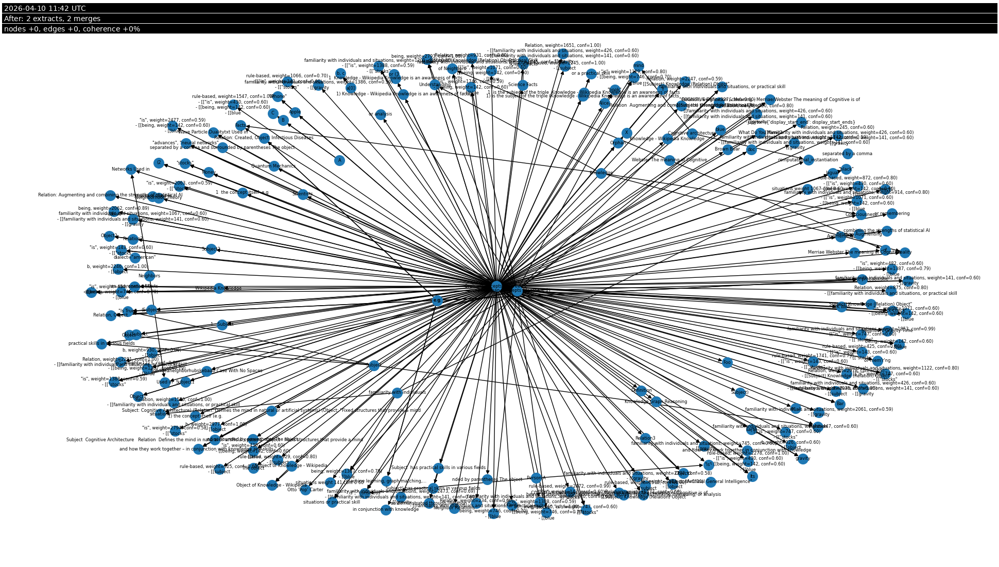](graph-2026-04-10-11-42-extract-subideas.png) [commit](https://github.com/BoggersTheFish/BoggersTheCIG/commit/6f705ee)

### 2026-04-10 11:42 UTC

**After:** +.md"+00.md"+2_.md"+59.md" — nodes +0, edges +0, coherence +0%

[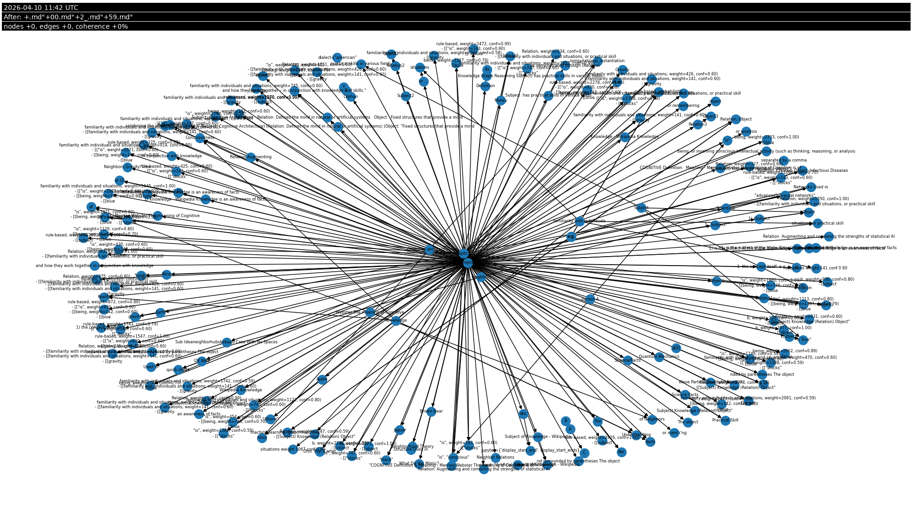](graph-2026-04-10-11-42-self-improve.png) [commit](https://github.com/BoggersTheFish/BoggersTheCIG/commit/6f705ee)

### 2026-04-10 16:11 UTC

**After:** vault organize (10 moves) — nodes +17, edges +17, coherence -8%

[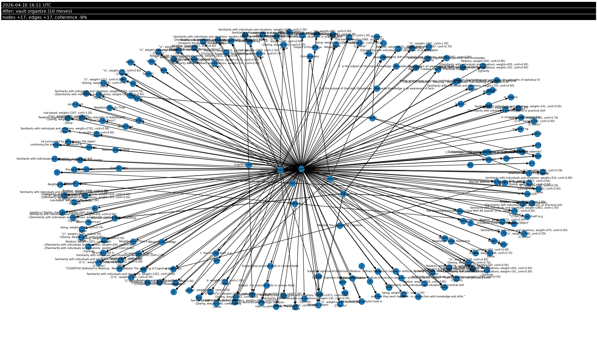](graph-2026-04-10-16-11-after-organize.png) [commit](https://github.com/BoggersTheFish/BoggersTheCIG/commit/d19baf3)

### 2026-04-10 16:11 UTC

**After:** 0 extracts, 4 merges — nodes +0, edges +0, coherence +0%

[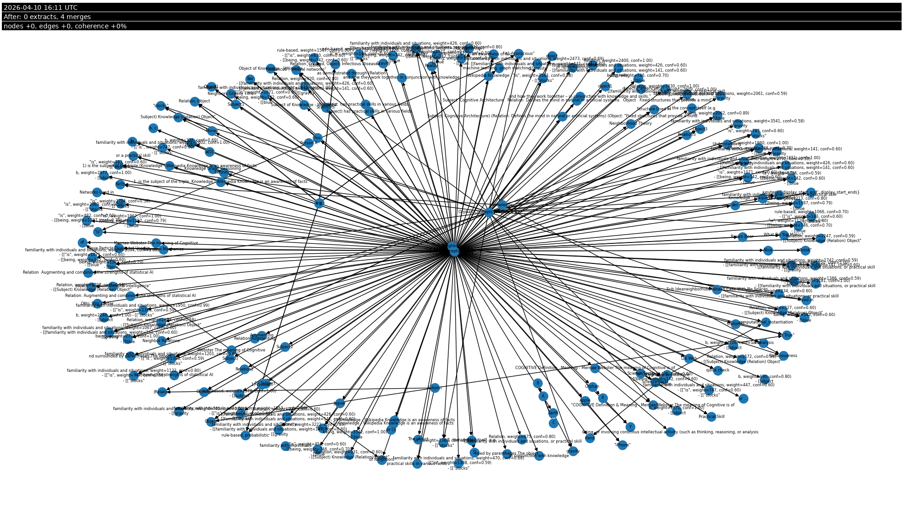](graph-2026-04-10-16-11-extract-subideas.png) [commit](https://github.com/BoggersTheFish/BoggersTheCIG/commit/d19baf3)

### 2026-04-10 16:11 UTC

**After:** +.md"+2_.md"+59.md"+A.md" — nodes +0, edges +0, coherence +0%

[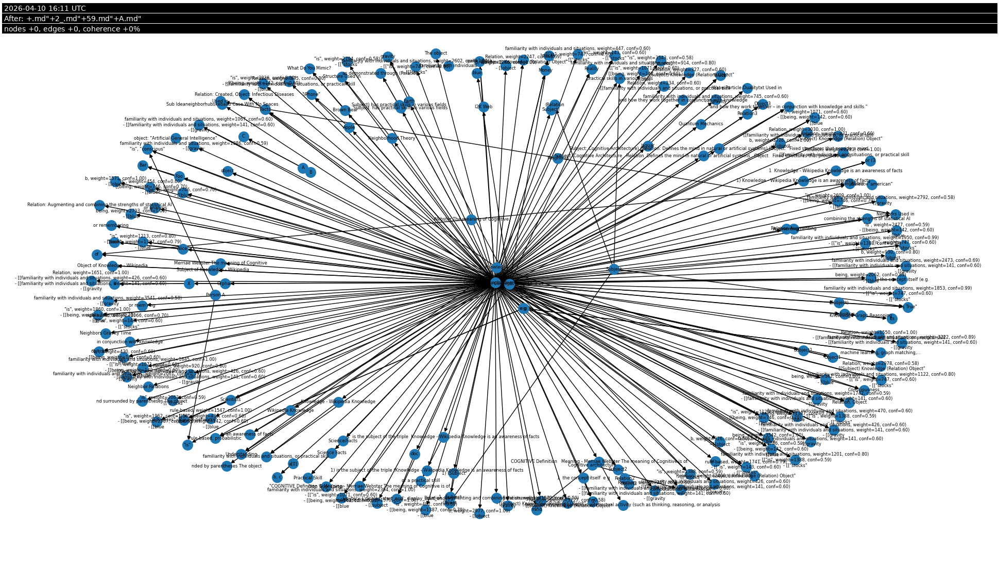](graph-2026-04-10-16-11-self-improve.png) [commit](https://github.com/BoggersTheFish/BoggersTheCIG/commit/d19baf3)

### 2026-04-10 16:15 UTC

**After:** vault analysis (+294 triples) — nodes +3, edges +5, coherence +0%

[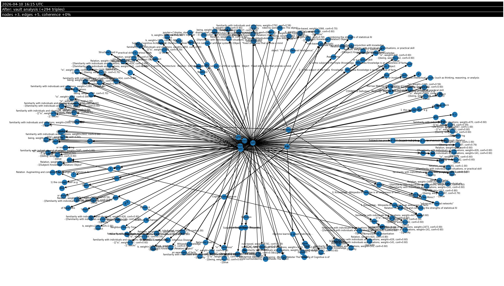](graph-2026-04-10-16-15-after-analyze-vault.png) [commit](https://github.com/BoggersTheFish/BoggersTheCIG/commit/d19baf3)

### 2026-04-10 16:15 UTC

**After:** 2 extracts, 0 merges — nodes +0, edges +0, coherence +0%

[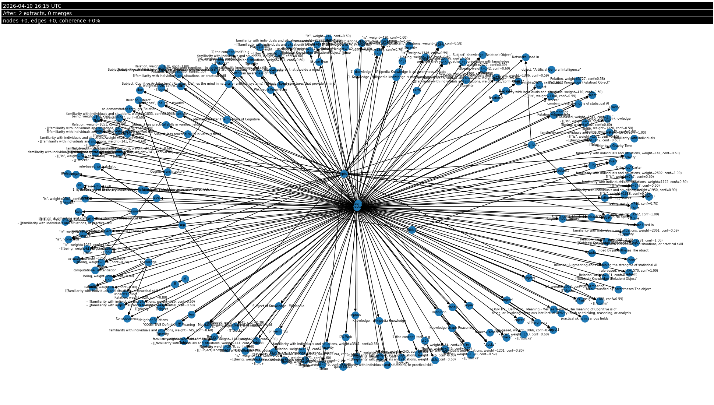](graph-2026-04-10-16-15-extract-subideas.png) [commit](https://github.com/BoggersTheFish/BoggersTheCIG/commit/d19baf3)

### 2026-04-10 16:18 UTC

**After:** vault analysis (+292 triples) — nodes +0, edges +2, coherence +0%

[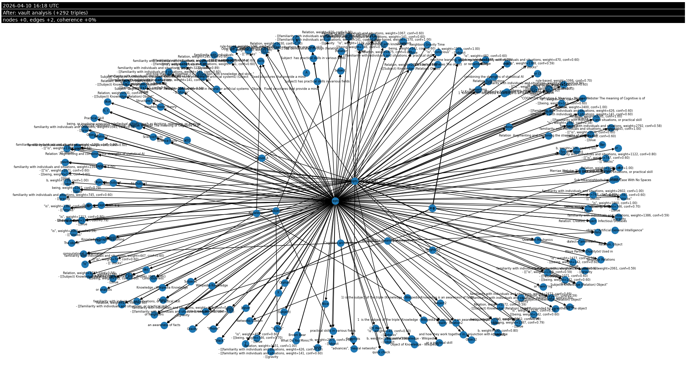](graph-2026-04-10-16-18-after-analyze-vault.png) [commit](https://github.com/BoggersTheFish/BoggersTheCIG/commit/d19baf3)

### 2026-04-10 16:18 UTC

**After:** 2 extracts, 0 merges — nodes +0, edges +0, coherence +0%

[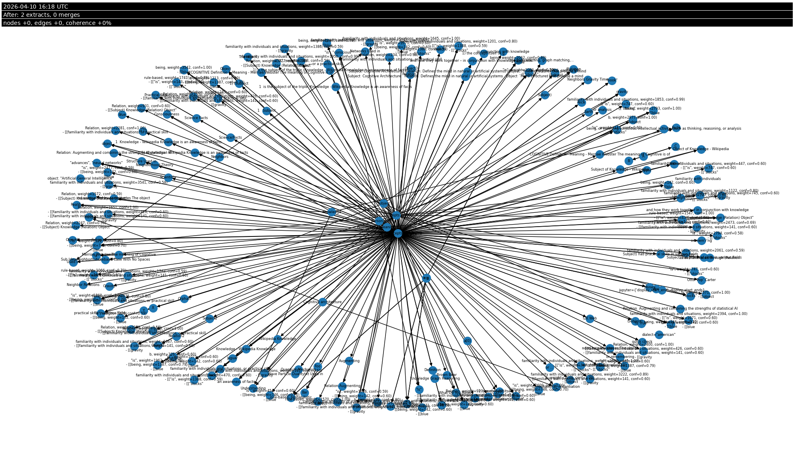](graph-2026-04-10-16-18-extract-subideas.png) [commit](https://github.com/BoggersTheFish/BoggersTheCIG/commit/d19baf3)

### 2026-04-10 16:34 UTC

**After:** vault organize (8 moves) — nodes +0, edges +0, coherence +0%

[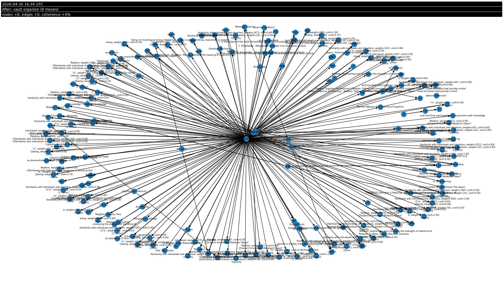](graph-2026-04-10-16-34-after-organize.png) [commit](https://github.com/BoggersTheFish/BoggersTheCIG/commit/d19baf3)

### 2026-04-10 16:34 UTC

**After:** 2 extracts, 2 merges — nodes +0, edges +0, coherence +0%

[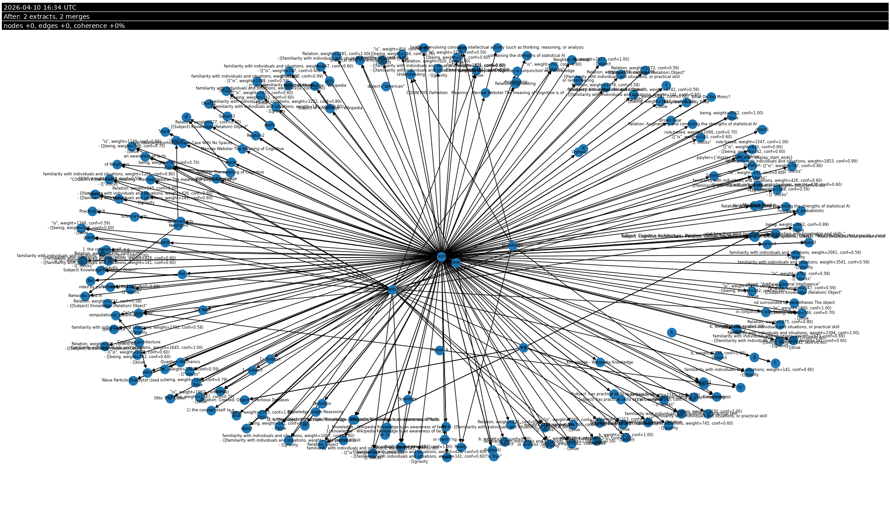](graph-2026-04-10-16-34-extract-subideas.png) [commit](https://github.com/BoggersTheFish/BoggersTheCIG/commit/d19baf3)

### 2026-04-10 16:34 UTC

**After:** +.md"+2_+2_.md"+59.md" — nodes +0, edges +0, coherence +0%

[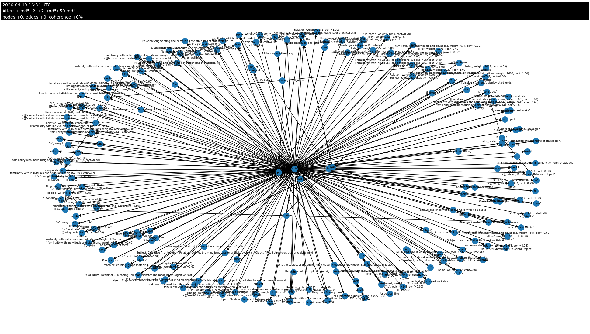](graph-2026-04-10-16-34-self-improve.png) [commit](https://github.com/BoggersTheFish/BoggersTheCIG/commit/d19baf3)

### 2026-04-10 16:48 UTC

**After:** vault organize (3 moves) — nodes +0, edges +0, coherence +0%

[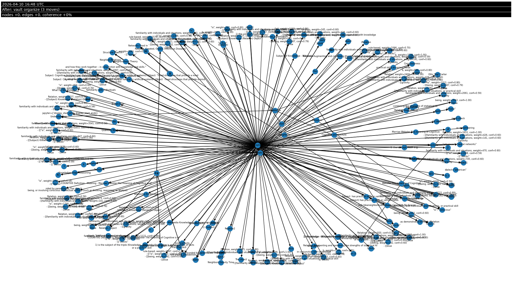](graph-2026-04-10-16-48-after-organize.png) [commit](https://github.com/BoggersTheFish/BoggersTheCIG/commit/d19baf3)

### 2026-04-10 16:48 UTC

**After:** 2 extracts, 2 merges — nodes +0, edges +0, coherence +0%

[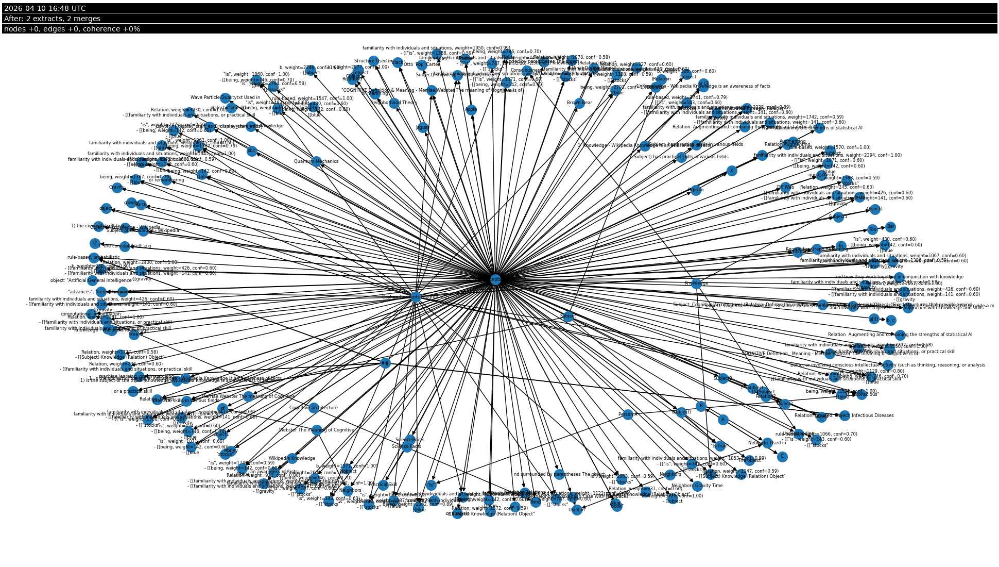](graph-2026-04-10-16-48-extract-subideas.png) [commit](https://github.com/BoggersTheFish/BoggersTheCIG/commit/d19baf3)

### 2026-04-10 16:48 UTC

**After:** +.md"+2_+2_.md"+59.md" — nodes +0, edges +0, coherence +0%

[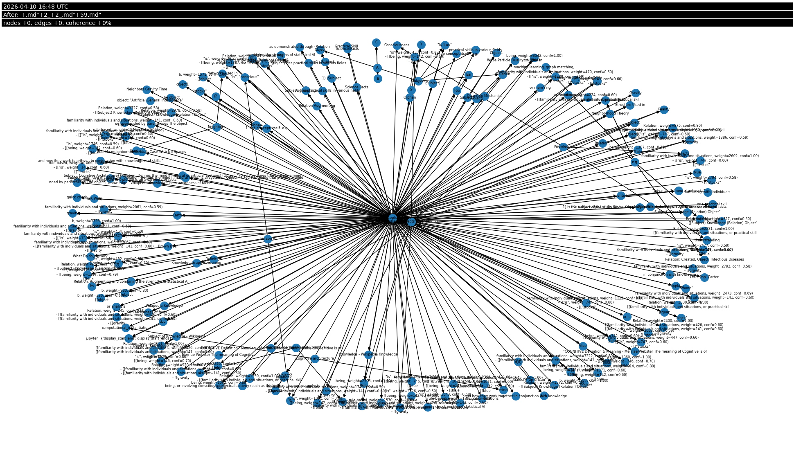](graph-2026-04-10-16-48-self-improve.png) [commit](https://github.com/BoggersTheFish/BoggersTheCIG/commit/d19baf3)

### 2026-04-10 20:53 UTC

**After:** vault organize (8 moves) — nodes +17, edges +17, coherence -7%

[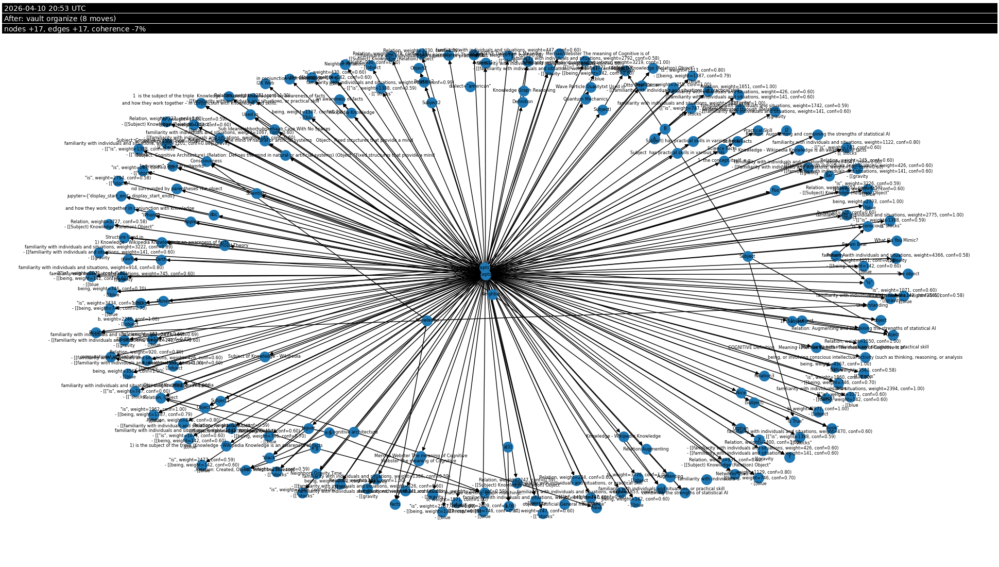](graph-2026-04-10-20-53-after-organize.png) [commit](https://github.com/BoggersTheFish/BoggersTheCIG/commit/be6cc1b)

### 2026-04-10 20:53 UTC

**After:** 0 extracts, 4 merges — nodes +0, edges +0, coherence +0%

[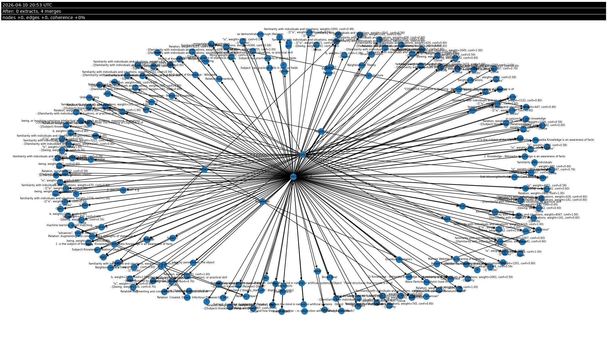](graph-2026-04-10-20-53-extract-subideas.png) [commit](https://github.com/BoggersTheFish/BoggersTheCIG/commit/be6cc1b)

### 2026-04-10 20:53 UTC

**After:** +.md"+2_.md"+59.md"+99.md" — nodes +0, edges +0, coherence +0%

[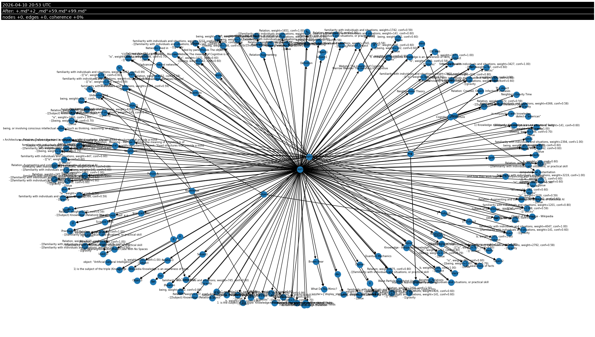](graph-2026-04-10-20-53-self-improve.png) [commit](https://github.com/BoggersTheFish/BoggersTheCIG/commit/be6cc1b)

### 2026-04-10 20:56 UTC

**After:** vault analysis (+322 triples) — nodes +5, edges +7, coherence -1%

[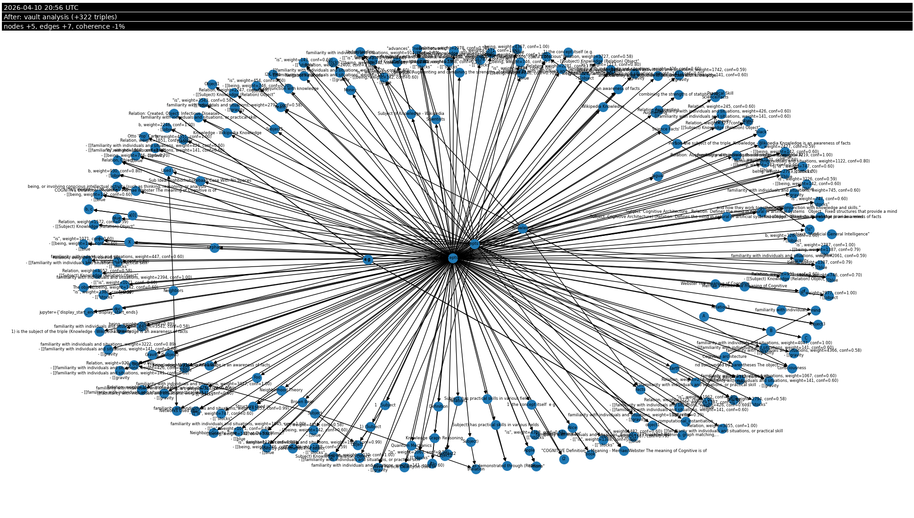](graph-2026-04-10-20-56-after-analyze-vault.png) [commit](https://github.com/BoggersTheFish/BoggersTheCIG/commit/be6cc1b)

### 2026-04-10 20:56 UTC

**After:** 2 extracts, 0 merges — nodes +0, edges +0, coherence +0%

[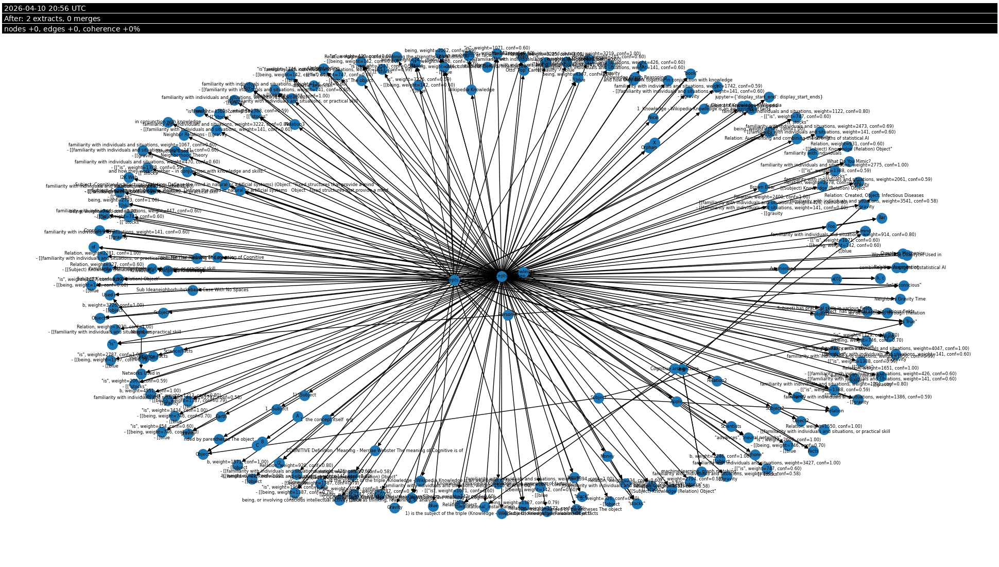](graph-2026-04-10-20-56-extract-subideas.png) [commit](https://github.com/BoggersTheFish/BoggersTheCIG/commit/be6cc1b)

### 2026-04-10 20:58 UTC

**After:** vault analysis (+321 triples) — nodes +2, edges +3, coherence +0%

[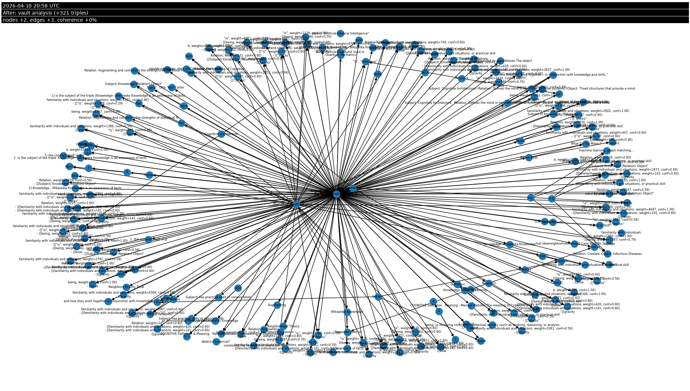](graph-2026-04-10-20-58-after-analyze-vault.png) [commit](https://github.com/BoggersTheFish/BoggersTheCIG/commit/be6cc1b)

### 2026-04-10 20:58 UTC

**After:** 2 extracts, 0 merges — nodes +0, edges +0, coherence +0%

[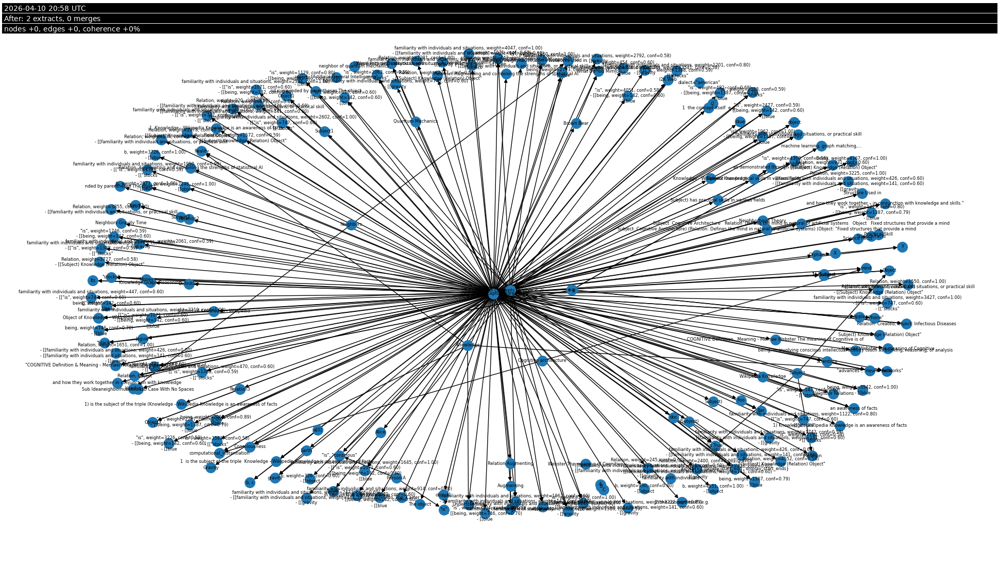](graph-2026-04-10-20-58-extract-subideas.png) [commit](https://github.com/BoggersTheFish/BoggersTheCIG/commit/be6cc1b)

### 2026-04-10 21:14 UTC

**After:** vault organize (12 moves) — nodes +0, edges +0, coherence +0%

[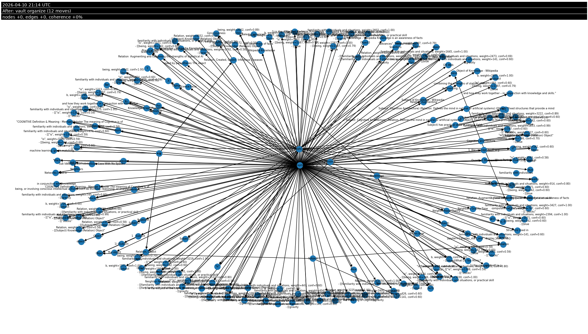](graph-2026-04-10-21-14-after-organize.png) [commit](https://github.com/BoggersTheFish/BoggersTheCIG/commit/be6cc1b)

### 2026-04-10 21:14 UTC

**After:** 2 extracts, 2 merges — nodes +0, edges +0, coherence +0%

[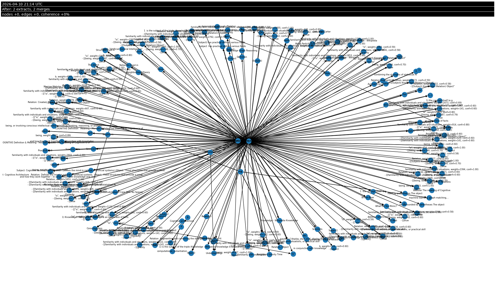](graph-2026-04-10-21-14-extract-subideas.png) [commit](https://github.com/BoggersTheFish/BoggersTheCIG/commit/be6cc1b)

### 2026-04-10 21:14 UTC

**After:** +.md"+00.md"+2_+2_.md" — nodes +0, edges +0, coherence +0%

[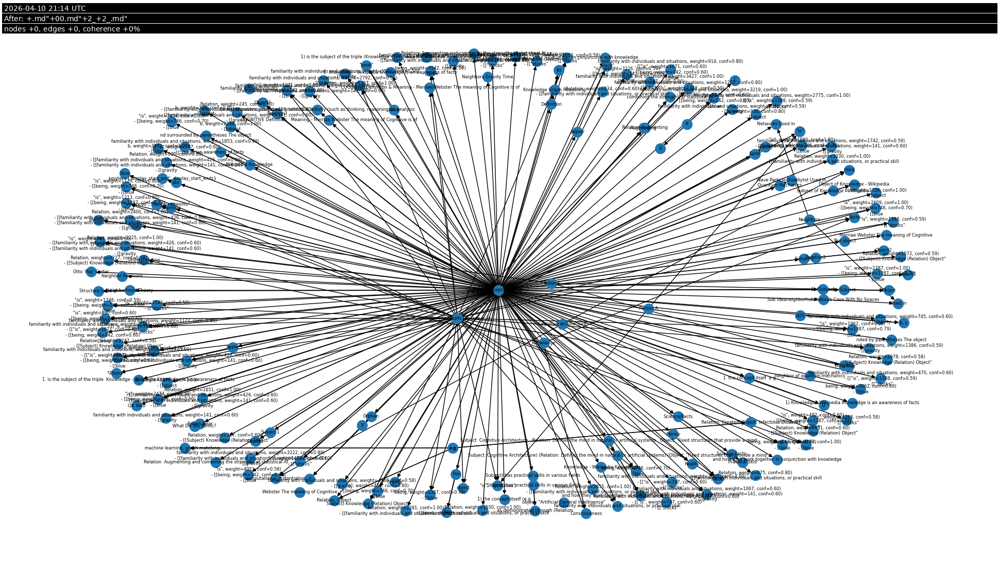](graph-2026-04-10-21-14-self-improve.png) [commit](https://github.com/BoggersTheFish/BoggersTheCIG/commit/be6cc1b)

### 2026-04-10 21:29 UTC

**After:** vault organize (6 moves) — nodes +0, edges +0, coherence +0%

[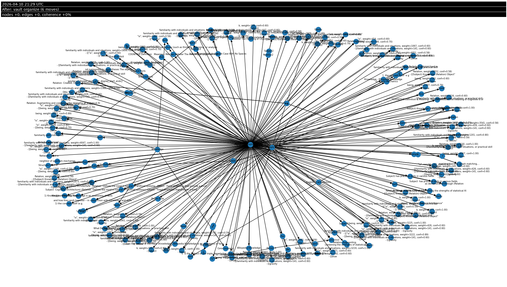](graph-2026-04-10-21-29-after-organize.png) [commit](https://github.com/BoggersTheFish/BoggersTheCIG/commit/be6cc1b)

### 2026-04-10 21:30 UTC

**After:** 2 extracts, 2 merges — nodes +0, edges +0, coherence +0%

[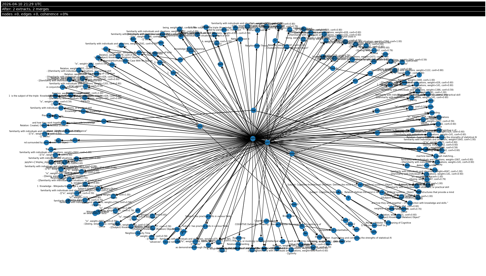](graph-2026-04-10-21-29-extract-subideas.png) [commit](https://github.com/BoggersTheFish/BoggersTheCIG/commit/be6cc1b)

### 2026-04-10 21:30 UTC

**After:** +.md"+00.md"+2_+2_.md" — nodes +0, edges +0, coherence +0%

[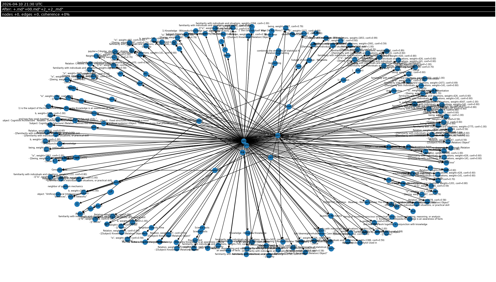](graph-2026-04-10-21-30-self-improve.png) [commit](https://github.com/BoggersTheFish/BoggersTheCIG/commit/be6cc1b)

### 2026-04-11 02:27 UTC

**After:** vault organize (7 moves) — nodes +17, edges +17, coherence -7%

[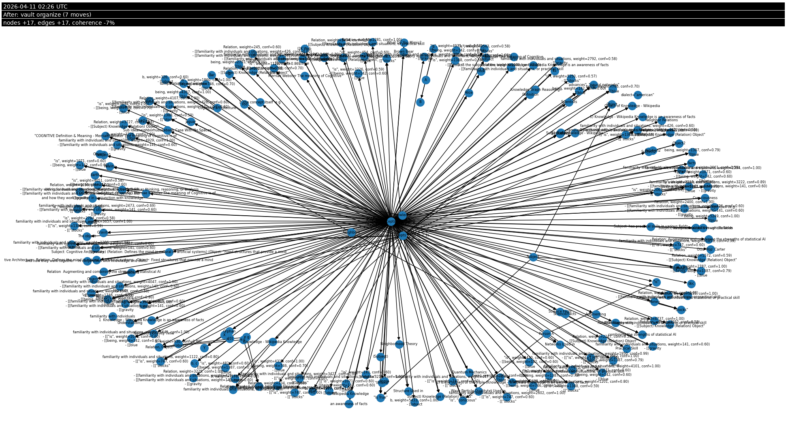](graph-2026-04-11-02-26-after-organize.png) [commit](https://github.com/BoggersTheFish/BoggersTheCIG/commit/933b6f4)

### 2026-04-11 02:27 UTC

**After:** 0 extracts, 4 merges — nodes +0, edges +0, coherence +0%

[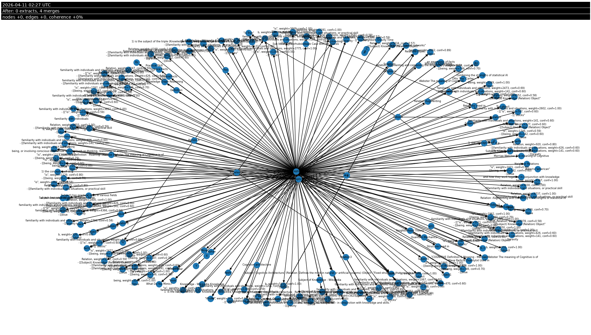](graph-2026-04-11-02-27-extract-subideas.png) [commit](https://github.com/BoggersTheFish/BoggersTheCIG/commit/933b6f4)

### 2026-04-11 02:27 UTC

**After:** +.md"+2_.md"+89.md"+A.md" — nodes +0, edges +0, coherence +0%

[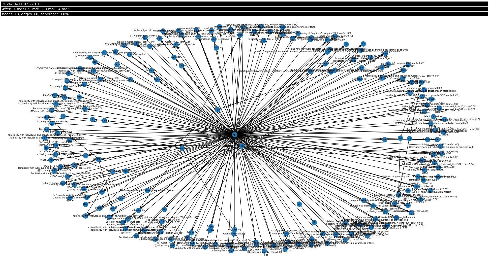](graph-2026-04-11-02-27-self-improve.png) [commit](https://github.com/BoggersTheFish/BoggersTheCIG/commit/933b6f4)

### 2026-04-11 02:31 UTC

**After:** vault analysis (+357 triples) — nodes +7, edges +9, coherence -2%

[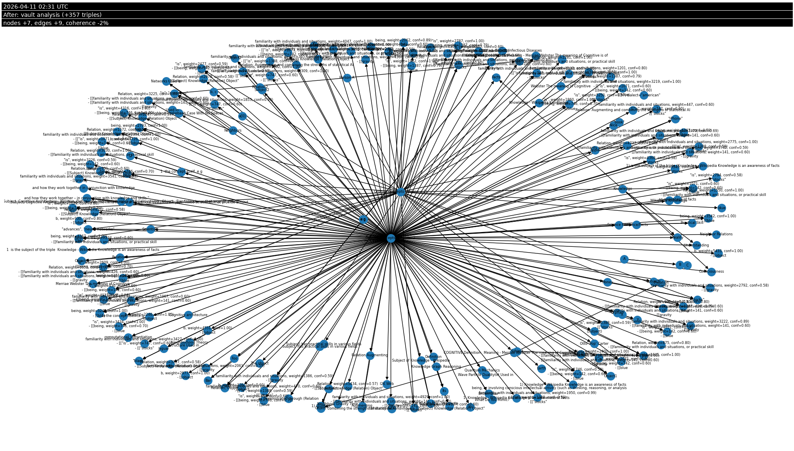](graph-2026-04-11-02-31-after-analyze-vault.png) [commit](https://github.com/BoggersTheFish/BoggersTheCIG/commit/933b6f4)

### 2026-04-11 02:31 UTC

**After:** 1 extracts, 0 merges — nodes +0, edges +0, coherence +0%

[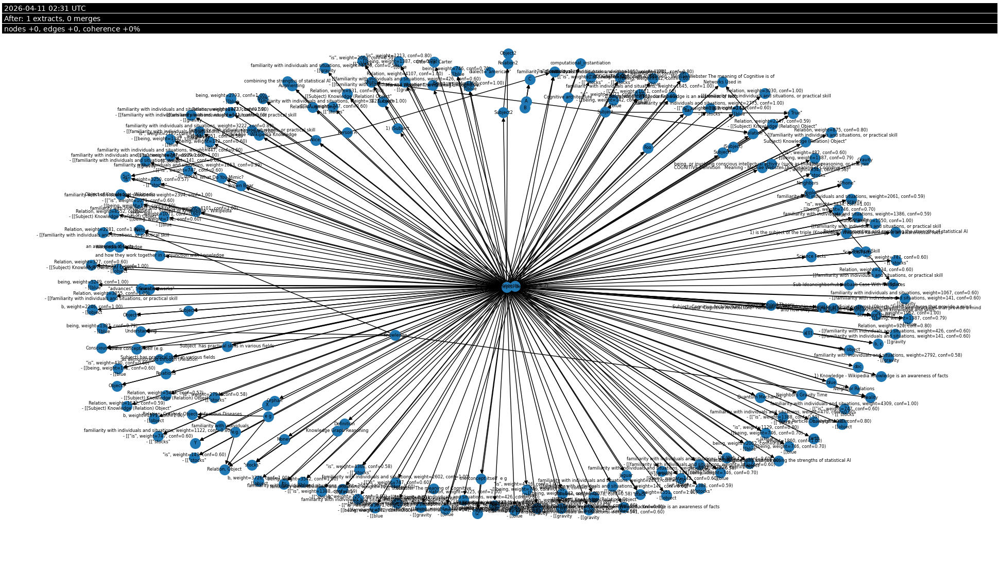](graph-2026-04-11-02-31-extract-subideas.png) [commit](https://github.com/BoggersTheFish/BoggersTheCIG/commit/933b6f4)

### 2026-04-11 02:35 UTC

**After:** vault analysis (+355 triples) — nodes +0, edges +2, coherence +0%

[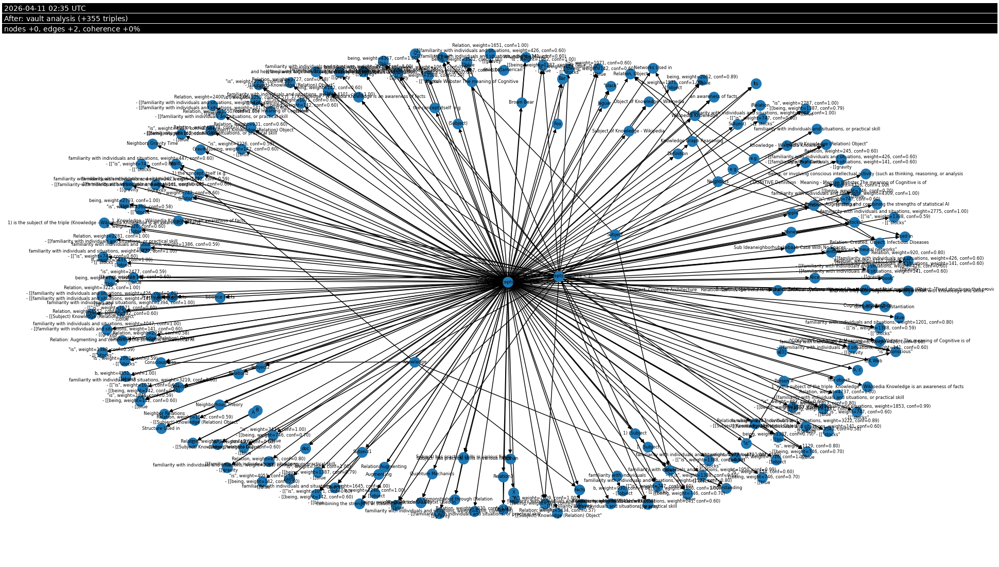](graph-2026-04-11-02-35-after-analyze-vault.png) [commit](https://github.com/BoggersTheFish/BoggersTheCIG/commit/933b6f4)

### 2026-04-11 02:35 UTC

**After:** 1 extracts, 0 merges — nodes +0, edges +0, coherence +0%

[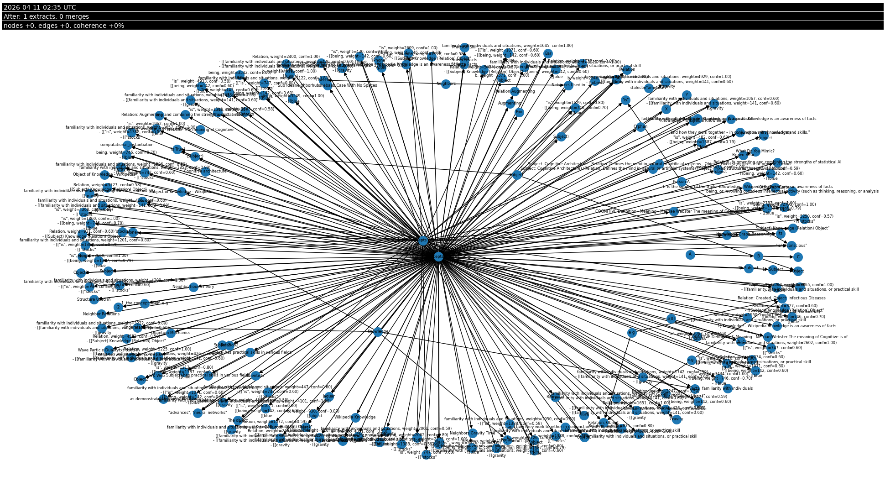](graph-2026-04-11-02-35-extract-subideas.png) [commit](https://github.com/BoggersTheFish/BoggersTheCIG/commit/933b6f4)

### 2026-04-11 02:53 UTC

**After:** vault organize (13 moves) — nodes +0, edges +0, coherence +0%

[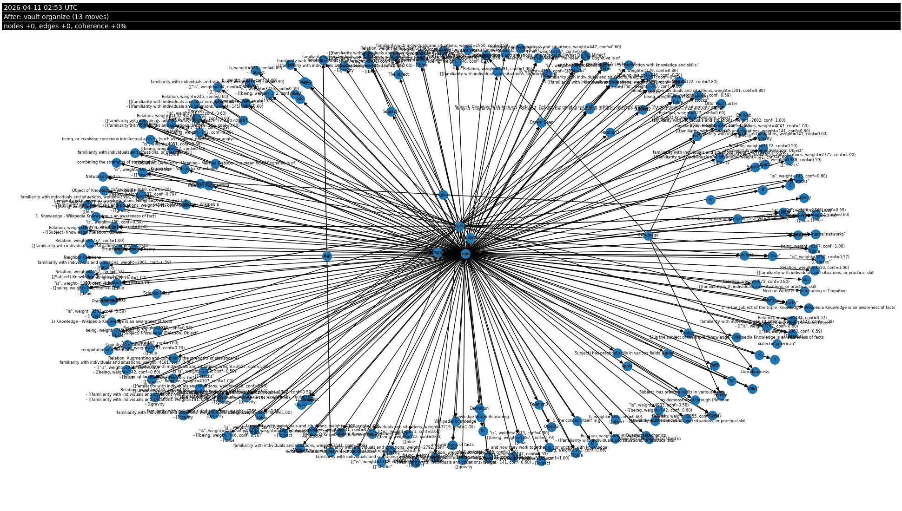](graph-2026-04-11-02-53-after-organize.png) [commit](https://github.com/BoggersTheFish/BoggersTheCIG/commit/933b6f4)

### 2026-04-11 02:53 UTC

**After:** 3 extracts, 1 merges — nodes +0, edges +0, coherence +0%

[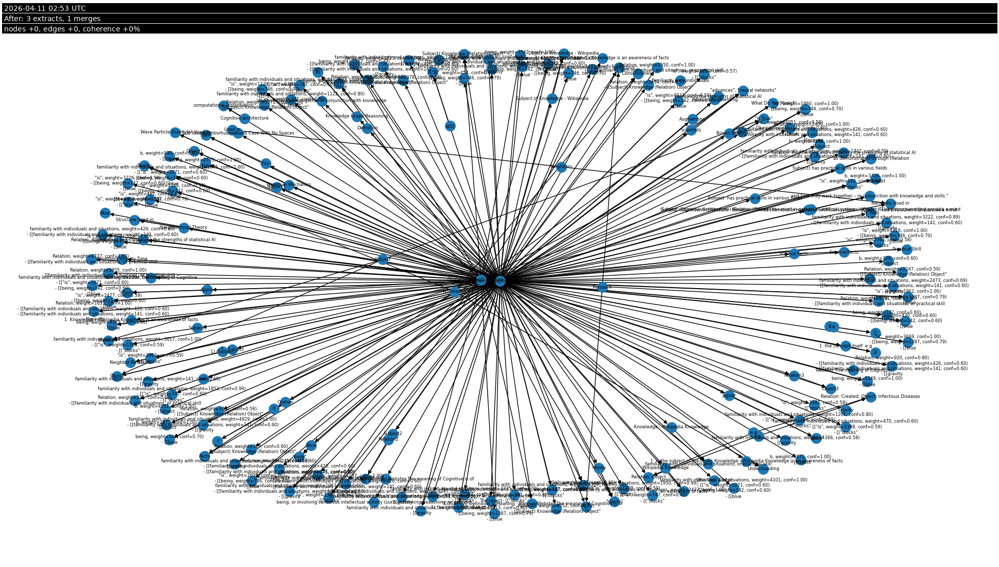](graph-2026-04-11-02-53-extract-subideas.png) [commit](https://github.com/BoggersTheFish/BoggersTheCIG/commit/933b6f4)

### 2026-04-11 02:53 UTC

**After:** +.md"+00.md"+2_+2_.md" — nodes +0, edges +0, coherence +0%

[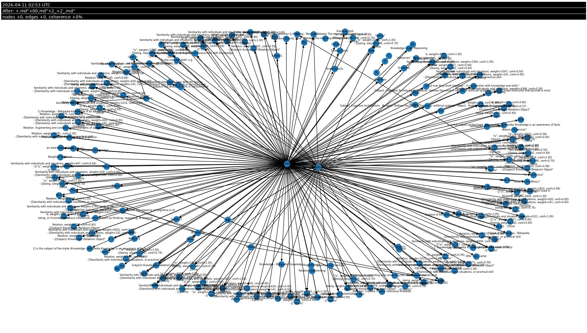](graph-2026-04-11-02-53-self-improve.png) [commit](https://github.com/BoggersTheFish/BoggersTheCIG/commit/933b6f4)

### 2026-04-11 03:09 UTC

**After:** vault organize (6 moves) — nodes +0, edges +0, coherence +0%

[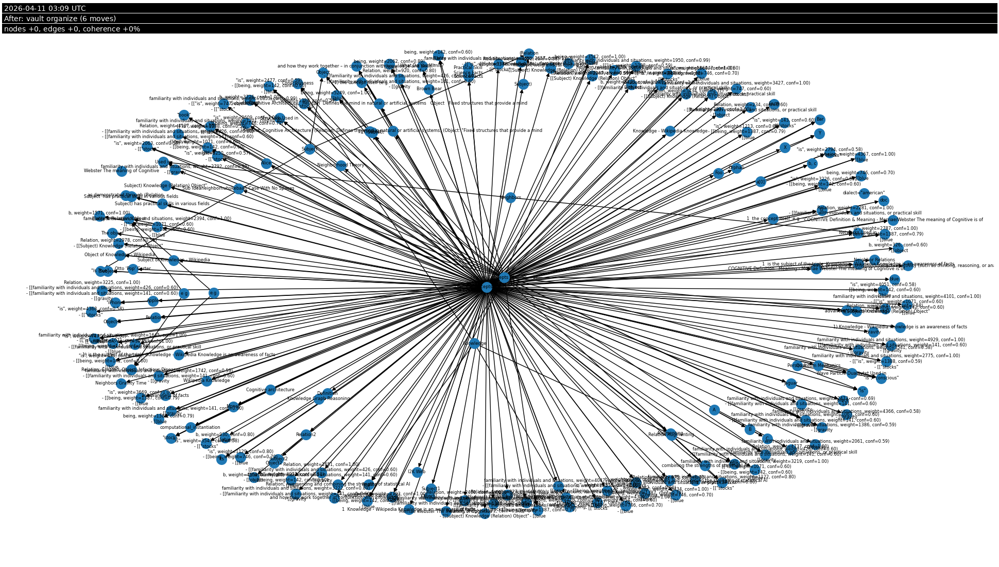](graph-2026-04-11-03-09-after-organize.png) [commit](https://github.com/BoggersTheFish/BoggersTheCIG/commit/933b6f4)

### 2026-04-11 03:09 UTC

**After:** 1 extracts, 3 merges — nodes +0, edges +0, coherence +0%

[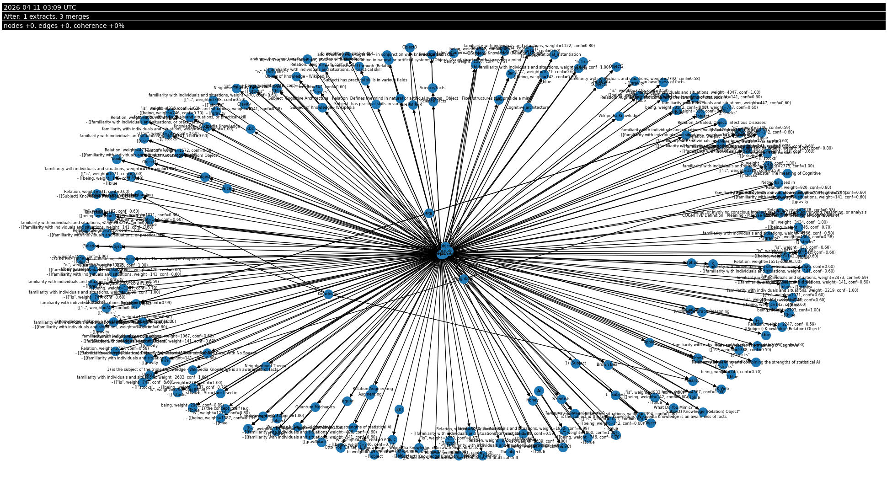](graph-2026-04-11-03-09-extract-subideas.png) [commit](https://github.com/BoggersTheFish/BoggersTheCIG/commit/933b6f4)

### 2026-04-11 03:10 UTC

**After:** +.md"+00.md"+2_+2_.md" — nodes +0, edges +0, coherence +0%

[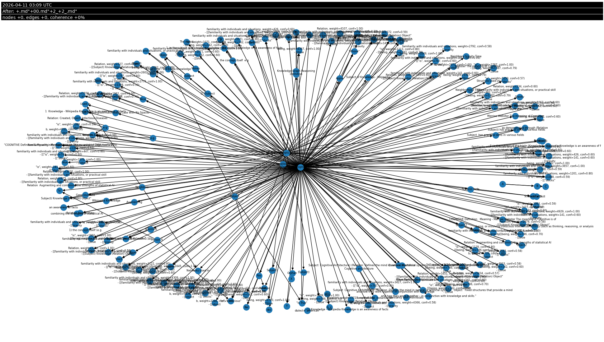](graph-2026-04-11-03-09-self-improve.png) [commit](https://github.com/BoggersTheFish/BoggersTheCIG/commit/933b6f4)

### 2026-04-11 06:20 UTC

**After:** vault organize (10 moves) — nodes +17, edges +17, coherence -6%

[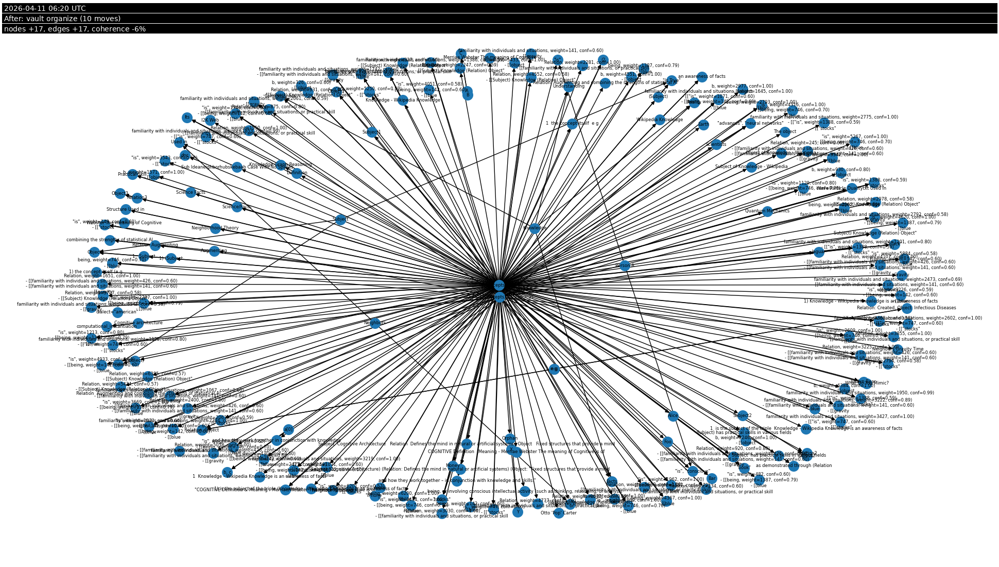](graph-2026-04-11-06-20-after-organize.png) [commit](https://github.com/BoggersTheFish/BoggersTheCIG/commit/5c7595b)

### 2026-04-11 06:21 UTC

**After:** 1 extracts, 3 merges — nodes +0, edges +0, coherence +0%

[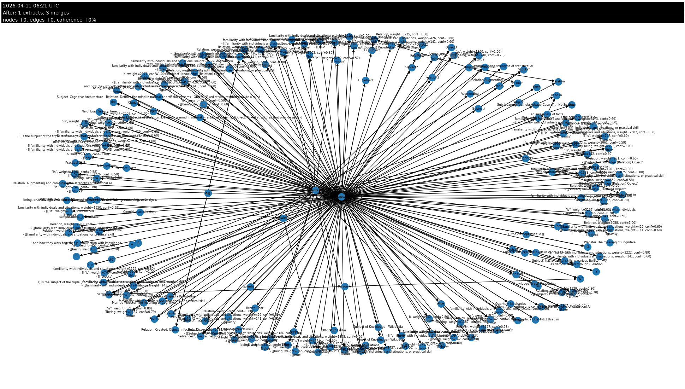](graph-2026-04-11-06-21-extract-subideas.png) [commit](https://github.com/BoggersTheFish/BoggersTheCIG/commit/5c7595b)

### 2026-04-11 06:21 UTC

**After:** +.md"+2_.md"+58.md"+A.md" — nodes +0, edges +0, coherence +0%

[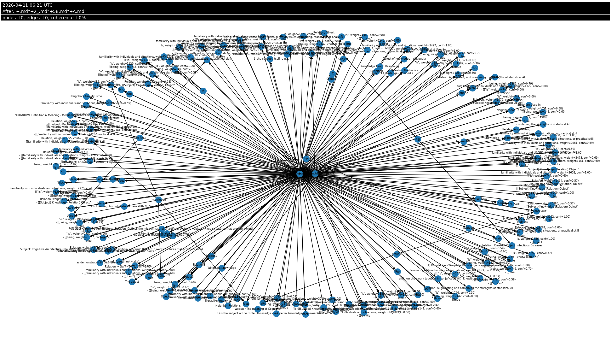](graph-2026-04-11-06-21-self-improve.png) [commit](https://github.com/BoggersTheFish/BoggersTheCIG/commit/5c7595b)

### 2026-04-11 06:25 UTC

**After:** vault analysis (+386 triples) — nodes +3, edges +5, coherence +0%

[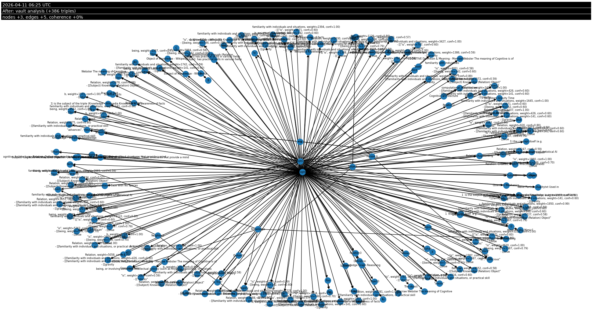](graph-2026-04-11-06-25-after-analyze-vault.png) [commit](https://github.com/BoggersTheFish/BoggersTheCIG/commit/5c7595b)

### 2026-04-11 06:26 UTC

**After:** 2 extracts, 0 merges — nodes +0, edges +0, coherence +0%

[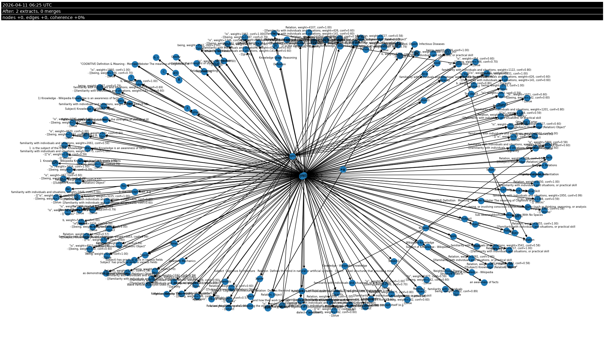](graph-2026-04-11-06-25-extract-subideas.png) [commit](https://github.com/BoggersTheFish/BoggersTheCIG/commit/5c7595b)

### 2026-04-11 06:30 UTC

**After:** vault analysis (+386 triples) — nodes +0, edges +2, coherence +0%

[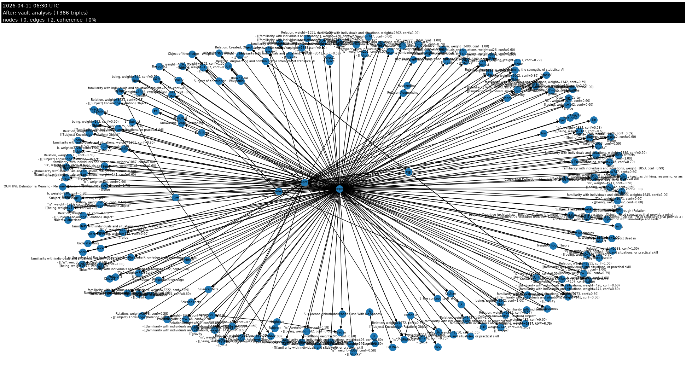](graph-2026-04-11-06-30-after-analyze-vault.png) [commit](https://github.com/BoggersTheFish/BoggersTheCIG/commit/5c7595b)

### 2026-04-11 06:30 UTC

**After:** 2 extracts, 0 merges — nodes +0, edges +0, coherence +0%

[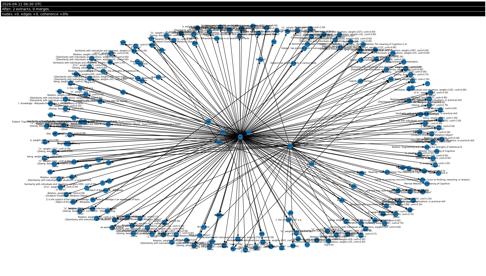](graph-2026-04-11-06-30-extract-subideas.png) [commit](https://github.com/BoggersTheFish/BoggersTheCIG/commit/5c7595b)

### 2026-04-11 06:48 UTC

**After:** vault organize (12 moves) — nodes +0, edges +0, coherence +0%

[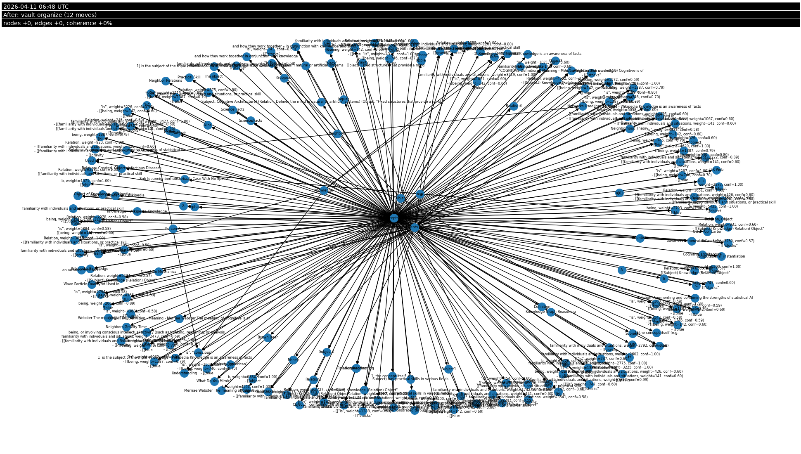](graph-2026-04-11-06-48-after-organize.png) [commit](https://github.com/BoggersTheFish/BoggersTheCIG/commit/5c7595b)

### 2026-04-11 06:48 UTC

**After:** 2 extracts, 2 merges — nodes +0, edges +0, coherence +0%

[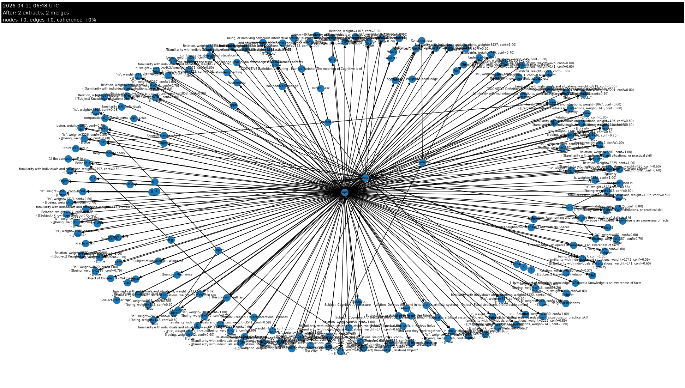](graph-2026-04-11-06-48-extract-subideas.png) [commit](https://github.com/BoggersTheFish/BoggersTheCIG/commit/5c7595b)

### 2026-04-11 06:48 UTC

**After:** +.md"+00.md"+2_+2_.md" — nodes +0, edges +0, coherence +0%

[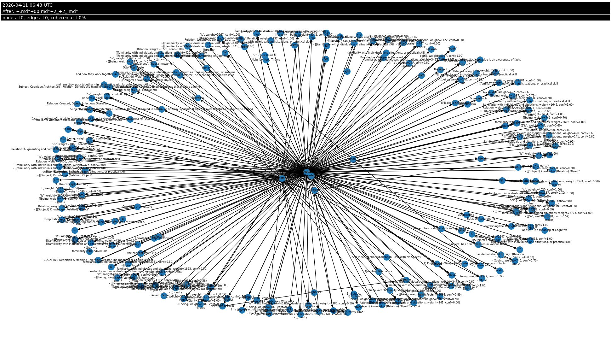](graph-2026-04-11-06-48-self-improve.png) [commit](https://github.com/BoggersTheFish/BoggersTheCIG/commit/5c7595b)

### 2026-04-11 07:06 UTC

**After:** vault organize (8 moves) — nodes +0, edges +0, coherence +0%

[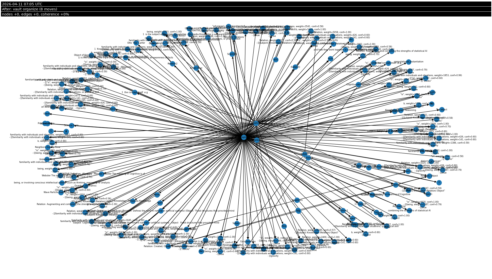](graph-2026-04-11-07-05-after-organize.png) [commit](https://github.com/BoggersTheFish/BoggersTheCIG/commit/5c7595b)

### 2026-04-11 07:06 UTC

**After:** 0 extracts, 4 merges — nodes +0, edges +0, coherence +0%

[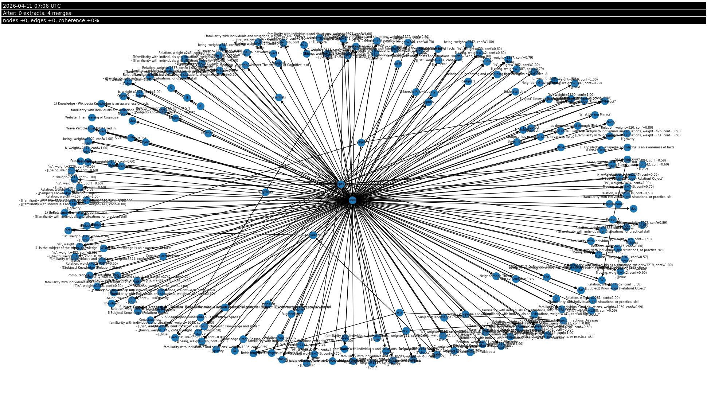](graph-2026-04-11-07-06-extract-subideas.png) [commit](https://github.com/BoggersTheFish/BoggersTheCIG/commit/5c7595b)

### 2026-04-11 07:06 UTC

**After:** +.md"+00.md"+2_+2_.md" — nodes +0, edges +0, coherence +0%

[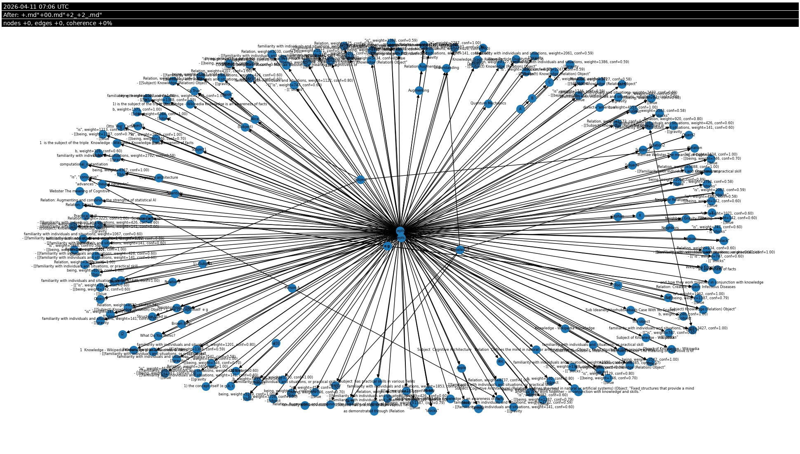](graph-2026-04-11-07-06-self-improve.png) [commit](https://github.com/BoggersTheFish/BoggersTheCIG/commit/5c7595b)

### 2026-04-11 10:54 UTC

**After:** vault organize (9 moves) — nodes +17, edges +17, coherence -6%

[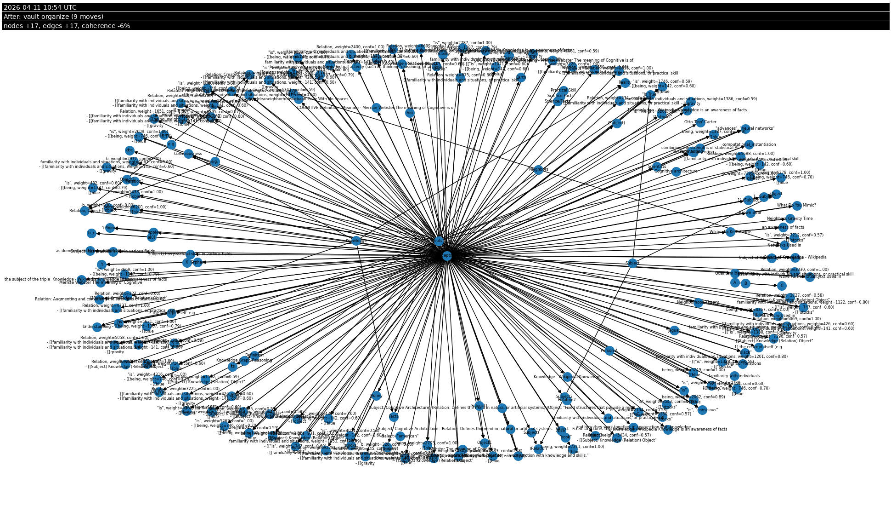](graph-2026-04-11-10-54-after-organize.png) [commit](https://github.com/BoggersTheFish/BoggersTheCIG/commit/e46d32e)

### 2026-04-11 10:54 UTC

**After:** 2 extracts, 2 merges — nodes +0, edges +0, coherence +0%

[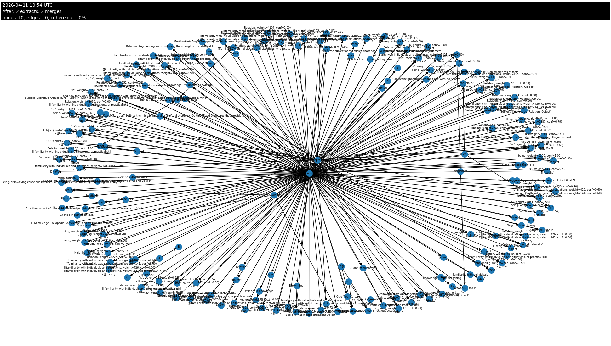](graph-2026-04-11-10-54-extract-subideas.png) [commit](https://github.com/BoggersTheFish/BoggersTheCIG/commit/e46d32e)

### 2026-04-11 10:54 UTC

**After:** +.md"+2_.md"+57.md"+80.md" — nodes +0, edges +0, coherence +0%

[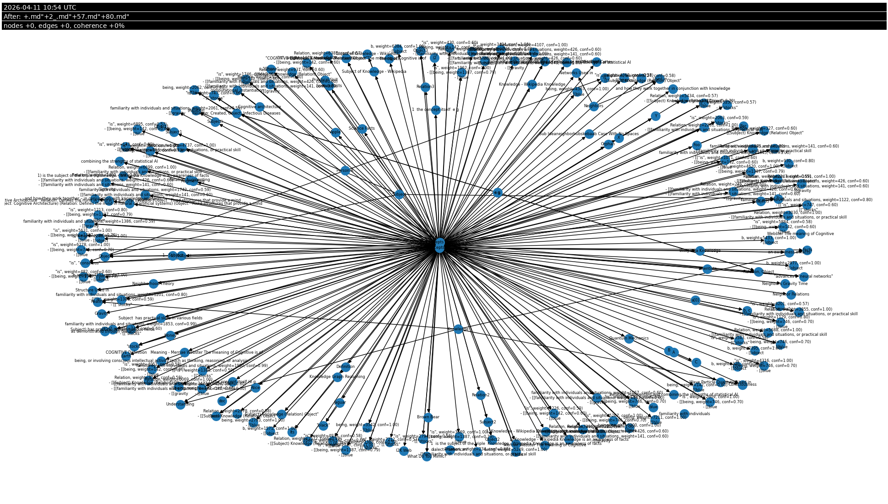](graph-2026-04-11-10-54-self-improve.png) [commit](https://github.com/BoggersTheFish/BoggersTheCIG/commit/e46d32e)

### 2026-04-11 10:55 UTC

**After:** external ingest (+2 triples) — nodes +0, edges +0, coherence +0%

[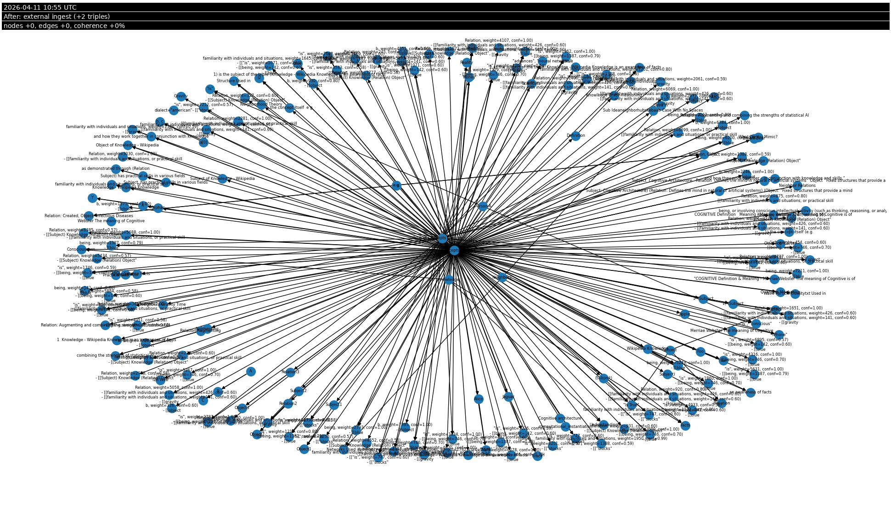](graph-2026-04-11-10-55-after-ingest.png) [commit](https://github.com/BoggersTheFish/BoggersTheCIG/commit/e46d32e)

### 2026-04-11 11:00 UTC

**After:** vault analysis (+410 triples) — nodes +6, edges +8, coherence -1%

[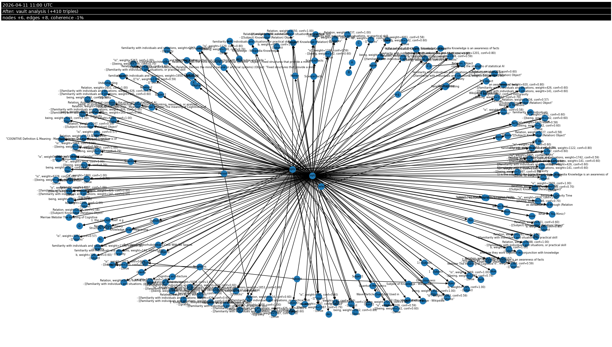](graph-2026-04-11-11-00-after-analyze-vault.png) [commit](https://github.com/BoggersTheFish/BoggersTheCIG/commit/e46d32e)

### 2026-04-11 11:00 UTC

**After:** 3 extracts, 0 merges — nodes +0, edges +0, coherence +0%

[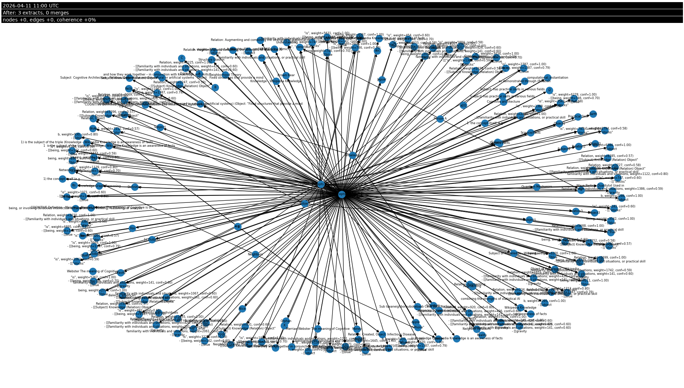](graph-2026-04-11-11-00-extract-subideas.png) [commit](https://github.com/BoggersTheFish/BoggersTheCIG/commit/e46d32e)

### 2026-04-11 11:05 UTC

**After:** vault analysis (+410 triples) — nodes +0, edges +2, coherence +0%

[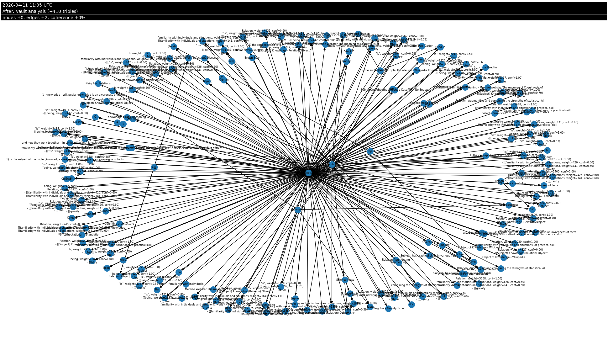](graph-2026-04-11-11-05-after-analyze-vault.png) [commit](https://github.com/BoggersTheFish/BoggersTheCIG/commit/e46d32e)

### 2026-04-11 11:05 UTC

**After:** 3 extracts, 0 merges — nodes +0, edges +0, coherence +0%

[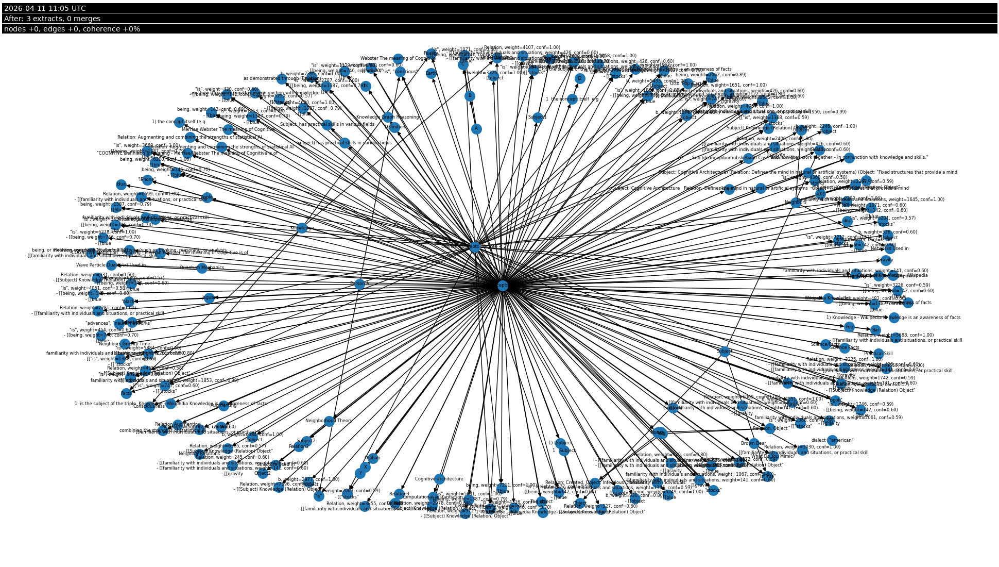](graph-2026-04-11-11-05-extract-subideas.png) [commit](https://github.com/BoggersTheFish/BoggersTheCIG/commit/e46d32e)

### 2026-04-11 11:24 UTC

**After:** vault organize (7 moves) — nodes +0, edges +0, coherence +0%

[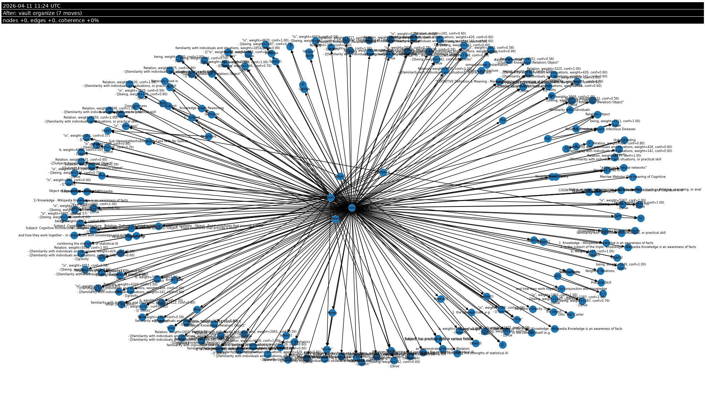](graph-2026-04-11-11-24-after-organize.png) [commit](https://github.com/BoggersTheFish/BoggersTheCIG/commit/e46d32e)

### 2026-04-11 11:25 UTC

**After:** 1 extracts, 3 merges — nodes +0, edges +0, coherence +0%

[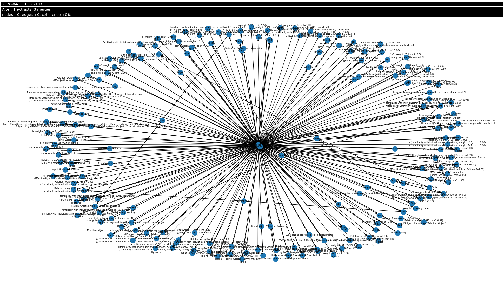](graph-2026-04-11-11-25-extract-subideas.png) [commit](https://github.com/BoggersTheFish/BoggersTheCIG/commit/e46d32e)

### 2026-04-11 11:25 UTC

**After:** +.md"+00.md"+2_+2_.md" — nodes +0, edges +0, coherence +0%

[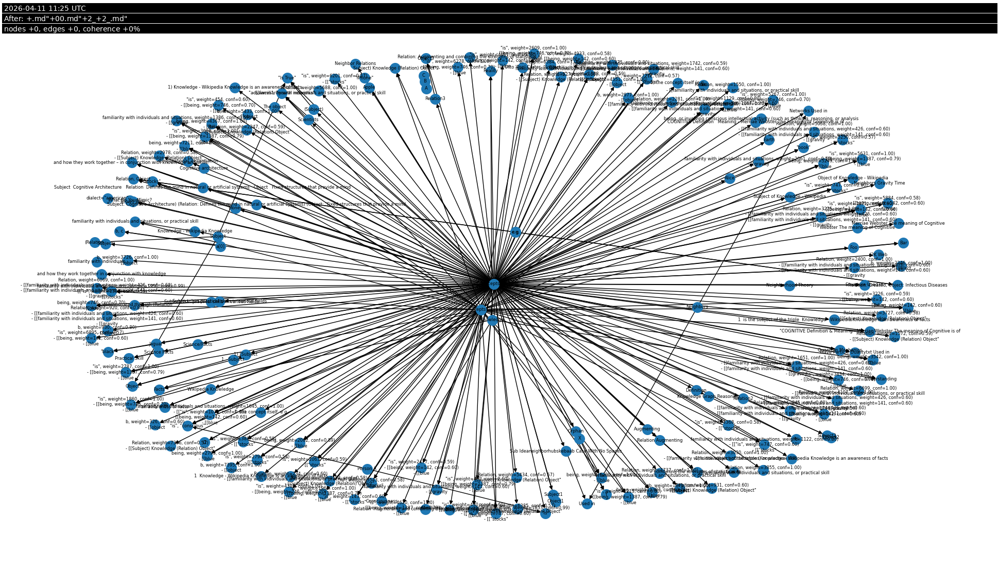](graph-2026-04-11-11-25-self-improve.png) [commit](https://github.com/BoggersTheFish/BoggersTheCIG/commit/e46d32e)

### 2026-04-11 11:42 UTC

**After:** vault organize (4 moves) — nodes +0, edges +0, coherence +0%

[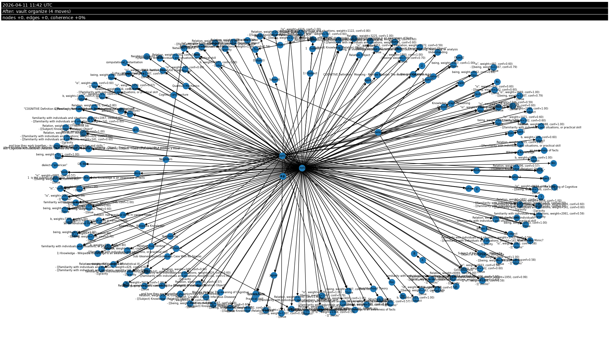](graph-2026-04-11-11-42-after-organize.png) [commit](https://github.com/BoggersTheFish/BoggersTheCIG/commit/e46d32e)

### 2026-04-11 11:42 UTC

**After:** 1 extracts, 3 merges — nodes +0, edges +0, coherence +0%

[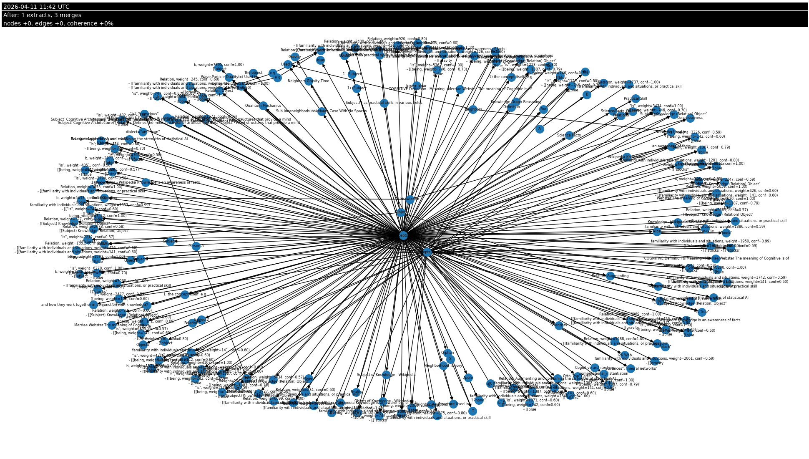](graph-2026-04-11-11-42-extract-subideas.png) [commit](https://github.com/BoggersTheFish/BoggersTheCIG/commit/e46d32e)

### 2026-04-11 11:42 UTC

**After:** +.md"+00.md"+2_+2_.md" — nodes +0, edges +0, coherence +0%

[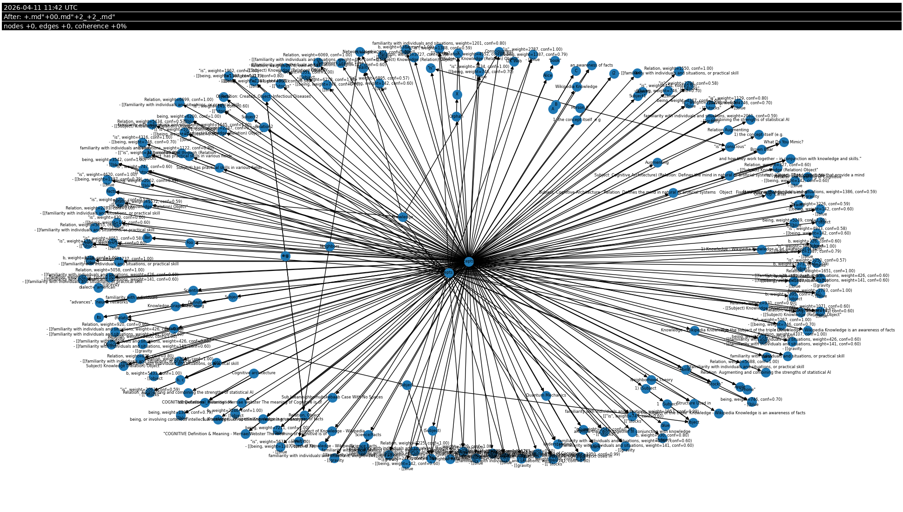](graph-2026-04-11-11-42-self-improve.png) [commit](https://github.com/BoggersTheFish/BoggersTheCIG/commit/e46d32e)

### 2026-04-11 15:56 UTC

**After:** vault organize (8 moves) — nodes +17, edges +17, coherence -5%

[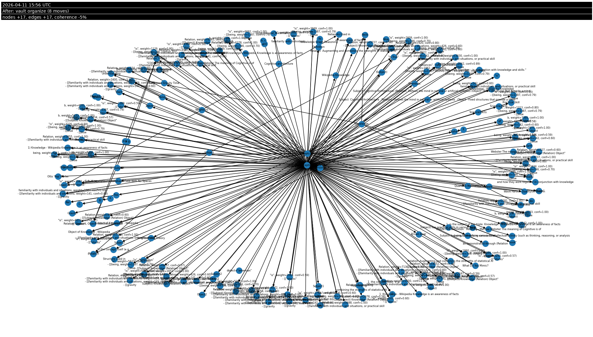](graph-2026-04-11-15-56-after-organize.png) [commit](https://github.com/BoggersTheFish/BoggersTheCIG/commit/a151e3e)

### 2026-04-11 15:56 UTC

**After:** 1 extracts, 3 merges — nodes +0, edges +0, coherence +0%

[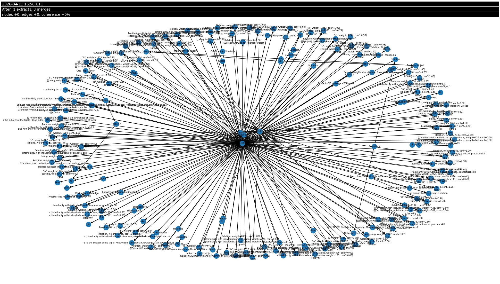](graph-2026-04-11-15-56-extract-subideas.png) [commit](https://github.com/BoggersTheFish/BoggersTheCIG/commit/a151e3e)

### 2026-04-11 15:56 UTC

**After:** .md"+00.md"+2_+2_.md"+80.md" — nodes +0, edges +0, coherence +0%

[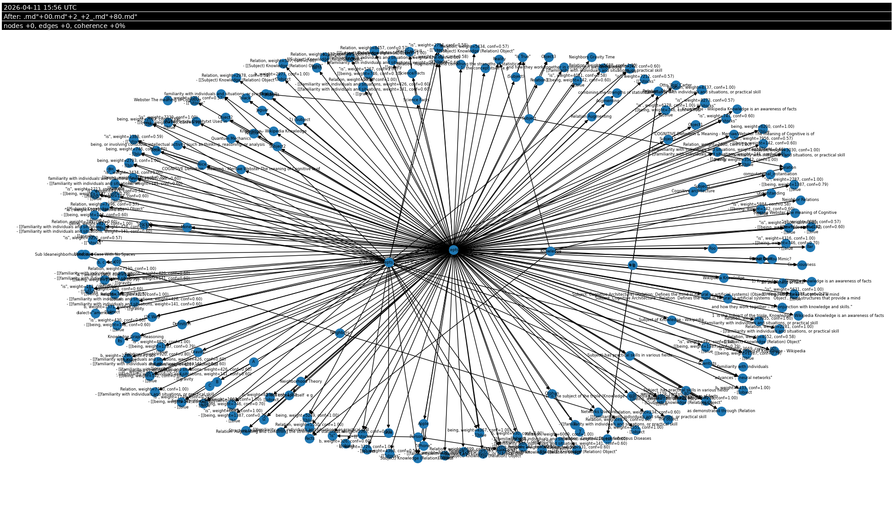](graph-2026-04-11-15-56-self-improve.png) [commit](https://github.com/BoggersTheFish/BoggersTheCIG/commit/a151e3e)

### 2026-04-11 16:01 UTC

**After:** vault analysis (+428 triples) — nodes +4, edges +6, coherence +0%

[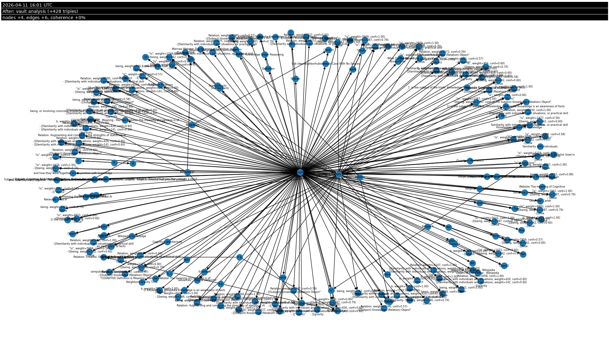](graph-2026-04-11-16-01-after-analyze-vault.png) [commit](https://github.com/BoggersTheFish/BoggersTheCIG/commit/a151e3e)

### 2026-04-11 16:01 UTC

**After:** 3 extracts, 0 merges — nodes +0, edges +0, coherence +0%

[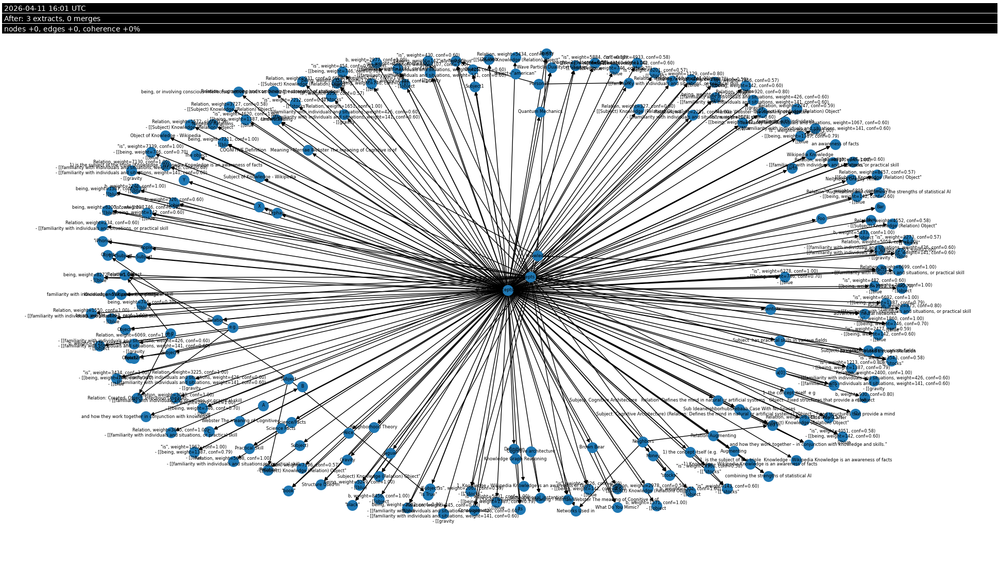](graph-2026-04-11-16-01-extract-subideas.png) [commit](https://github.com/BoggersTheFish/BoggersTheCIG/commit/a151e3e)

### 2026-04-11 16:06 UTC

**After:** vault analysis (+428 triples) — nodes +0, edges +2, coherence +0%

[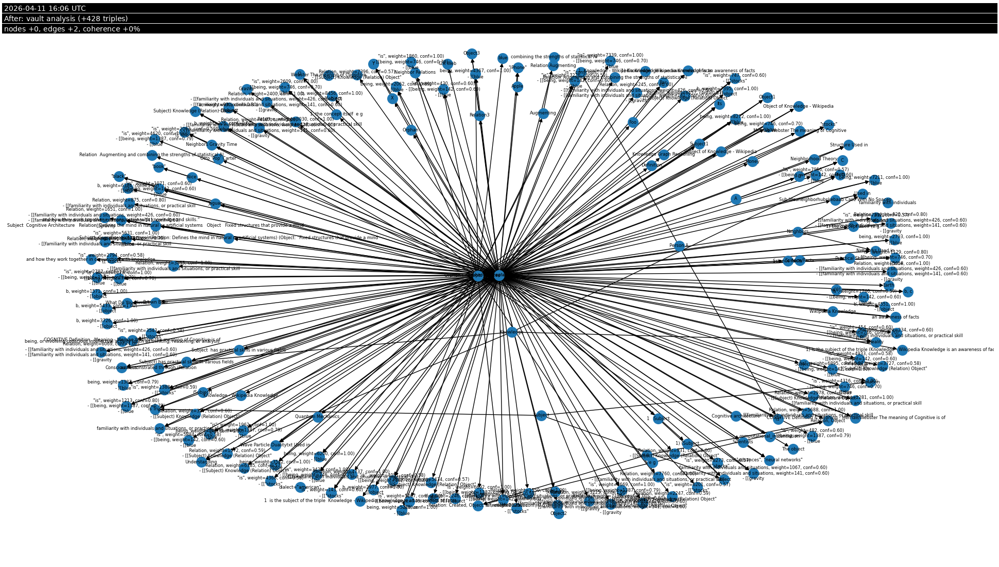](graph-2026-04-11-16-06-after-analyze-vault.png) [commit](https://github.com/BoggersTheFish/BoggersTheCIG/commit/a151e3e)

### 2026-04-11 16:06 UTC

**After:** 3 extracts, 0 merges — nodes +0, edges +0, coherence +0%

[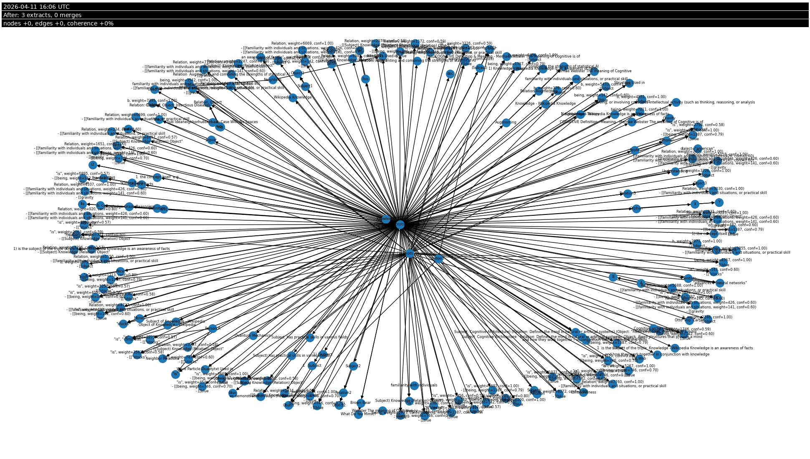](graph-2026-04-11-16-06-extract-subideas.png) [commit](https://github.com/BoggersTheFish/BoggersTheCIG/commit/a151e3e)

### 2026-04-11 16:26 UTC

**After:** vault organize (12 moves) — nodes +0, edges +0, coherence +0%

[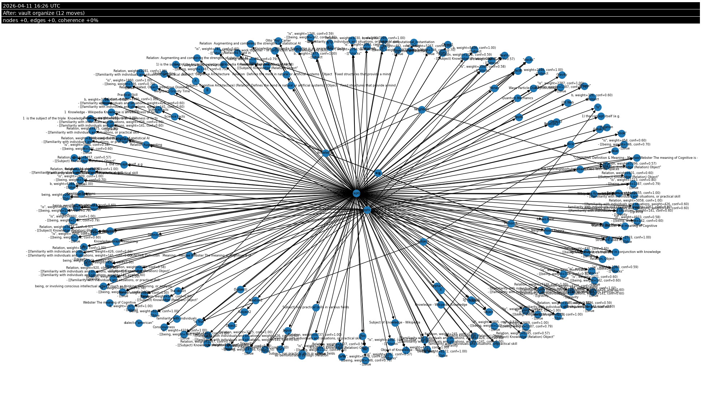](graph-2026-04-11-16-26-after-organize.png) [commit](https://github.com/BoggersTheFish/BoggersTheCIG/commit/a151e3e)

### 2026-04-11 16:26 UTC

**After:** 1 extracts, 3 merges — nodes +0, edges +0, coherence +0%

[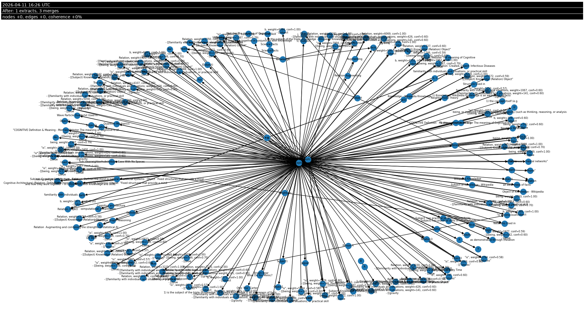](graph-2026-04-11-16-26-extract-subideas.png) [commit](https://github.com/BoggersTheFish/BoggersTheCIG/commit/a151e3e)

### 2026-04-11 16:26 UTC

**After:** .md"+00.md"+2_+2_.md"+57.md" — nodes +0, edges +0, coherence +0%

[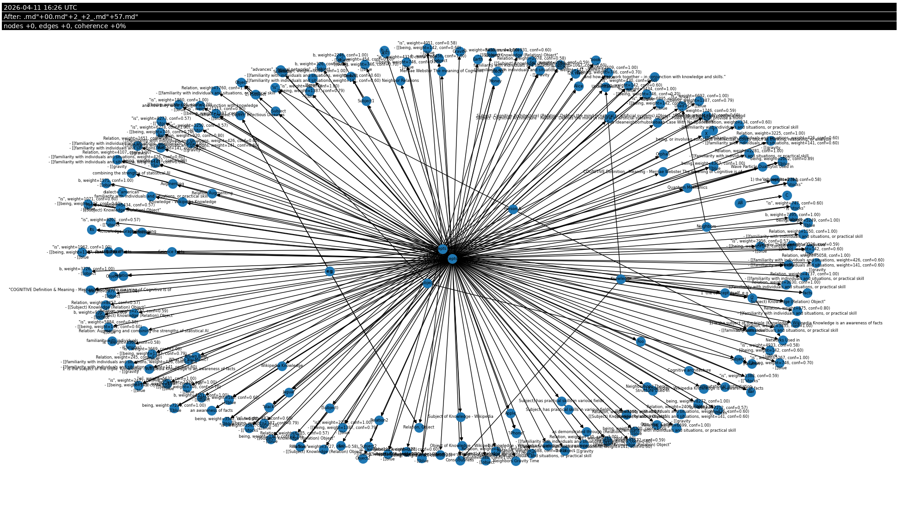](graph-2026-04-11-16-26-self-improve.png) [commit](https://github.com/BoggersTheFish/BoggersTheCIG/commit/a151e3e)

### 2026-04-11 16:45 UTC

**After:** vault organize (12 moves) — nodes +0, edges +0, coherence +0%

[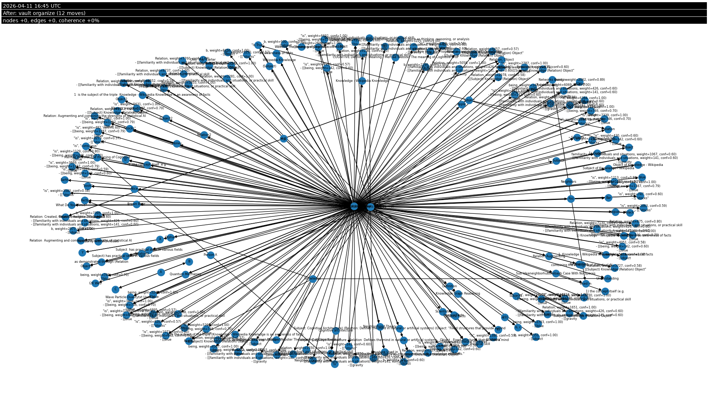](graph-2026-04-11-16-45-after-organize.png) [commit](https://github.com/BoggersTheFish/BoggersTheCIG/commit/a151e3e)

### 2026-04-11 16:45 UTC

**After:** 2 extracts, 2 merges — nodes +0, edges +0, coherence +0%

[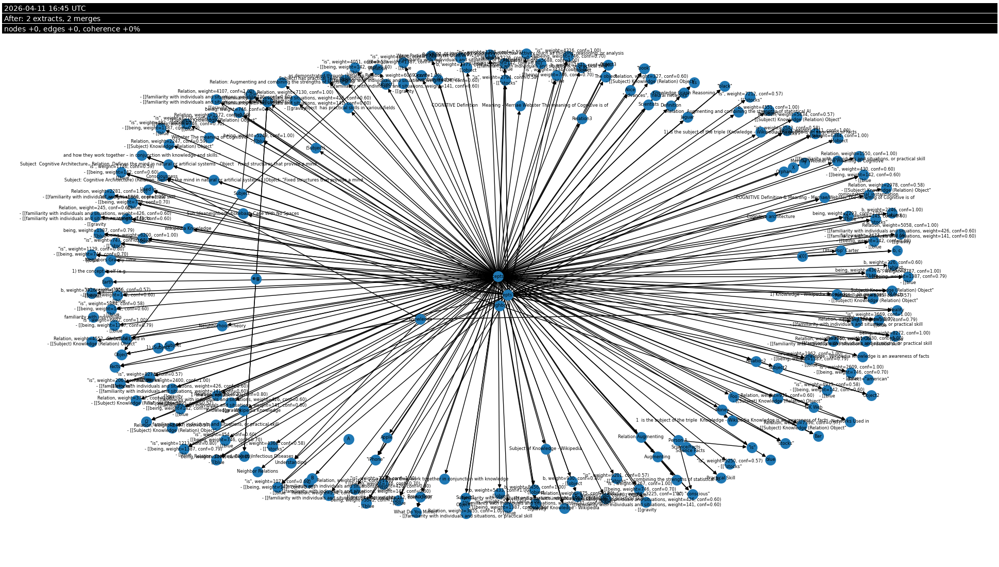](graph-2026-04-11-16-45-extract-subideas.png) [commit](https://github.com/BoggersTheFish/BoggersTheCIG/commit/a151e3e)

### 2026-04-11 16:45 UTC

**After:** .md"+00.md"+2_+2_.md"+57.md" — nodes +0, edges +0, coherence +0%

[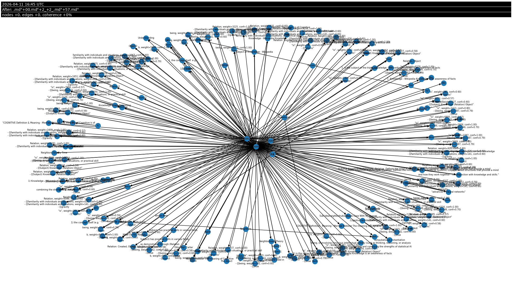](graph-2026-04-11-16-45-self-improve.png) [commit](https://github.com/BoggersTheFish/BoggersTheCIG/commit/a151e3e)

### 2026-04-11 20:58 UTC

**After:** vault organize (14 moves) — nodes +17, edges +17, coherence -5%

[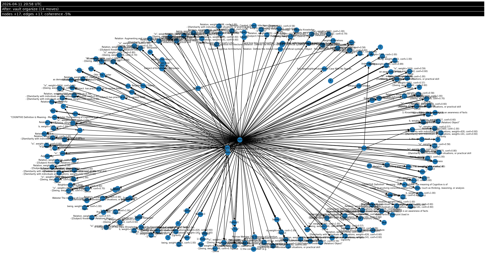](graph-2026-04-11-20-58-after-organize.png) [commit](https://github.com/BoggersTheFish/BoggersTheCIG/commit/5654ae5)

### 2026-04-11 20:58 UTC

**After:** 1 extracts, 3 merges — nodes +0, edges +0, coherence +0%

[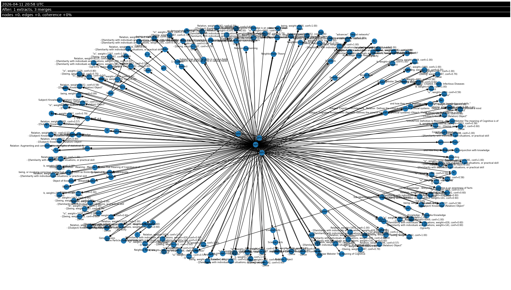](graph-2026-04-11-20-58-extract-subideas.png) [commit](https://github.com/BoggersTheFish/BoggersTheCIG/commit/5654ae5)

### 2026-04-11 20:58 UTC

**After:** +.md"+2_+2_.md"+80.md" — nodes +0, edges +0, coherence +0%

[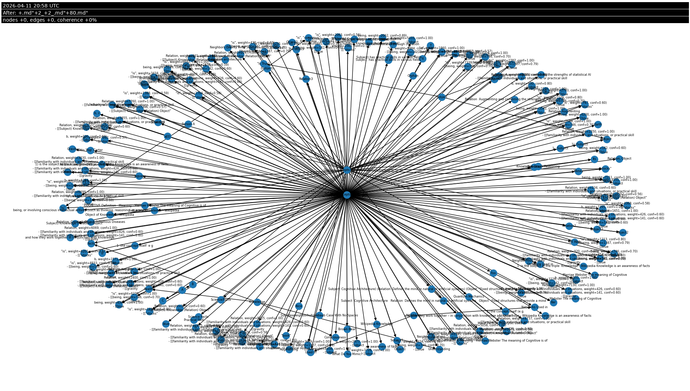](graph-2026-04-11-20-58-self-improve.png) [commit](https://github.com/BoggersTheFish/BoggersTheCIG/commit/5654ae5)

### 2026-04-11 20:59 UTC

**After:** external ingest (+4 triples) — nodes +2, edges +2, coherence +0%

[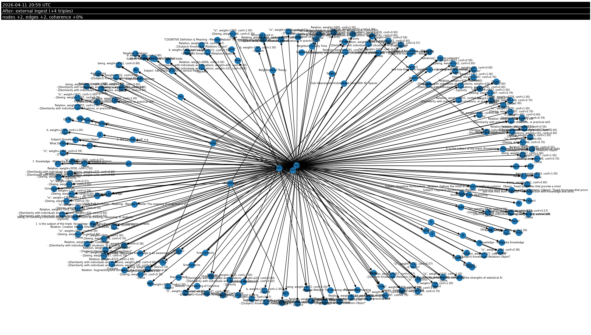](graph-2026-04-11-20-59-after-ingest.png) [commit](https://github.com/BoggersTheFish/BoggersTheCIG/commit/5654ae5)

### 2026-04-11 21:06 UTC

**After:** vault analysis (+470 triples) — nodes +7, edges +9, coherence -1%

[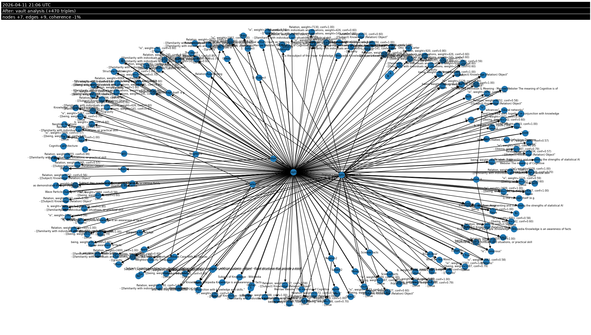](graph-2026-04-11-21-06-after-analyze-vault.png) [commit](https://github.com/BoggersTheFish/BoggersTheCIG/commit/5654ae5)

### 2026-04-11 21:06 UTC

**After:** 3 extracts, 0 merges — nodes +0, edges +0, coherence +0%

[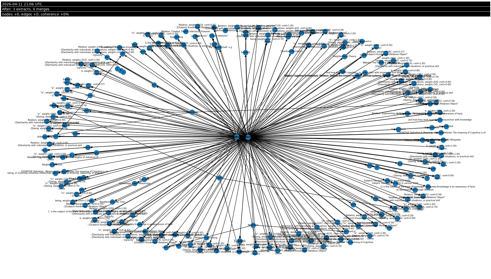](graph-2026-04-11-21-06-extract-subideas.png) [commit](https://github.com/BoggersTheFish/BoggersTheCIG/commit/5654ae5)

### 2026-04-11 21:13 UTC

**After:** vault analysis (+470 triples) — nodes +0, edges +2, coherence +0%

[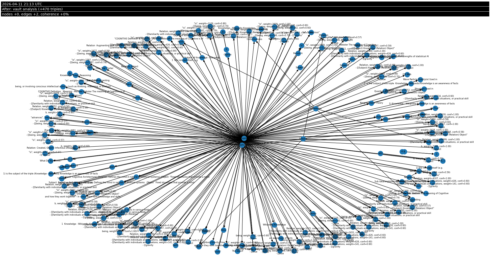](graph-2026-04-11-21-13-after-analyze-vault.png) [commit](https://github.com/BoggersTheFish/BoggersTheCIG/commit/5654ae5)

### 2026-04-11 21:13 UTC

**After:** 3 extracts, 0 merges — nodes +0, edges +0, coherence +0%

[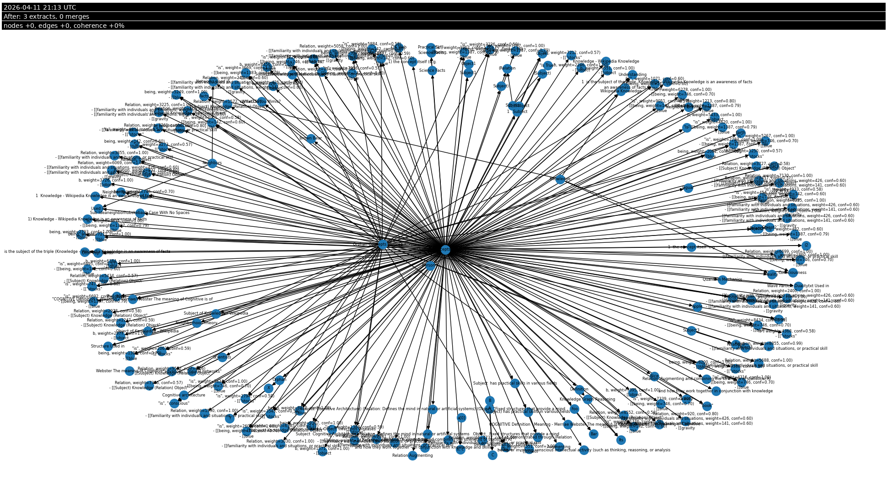](graph-2026-04-11-21-13-extract-subideas.png) [commit](https://github.com/BoggersTheFish/BoggersTheCIG/commit/5654ae5)

### 2026-04-11 21:36 UTC

**After:** vault organize (11 moves) — nodes +0, edges +0, coherence +0%

[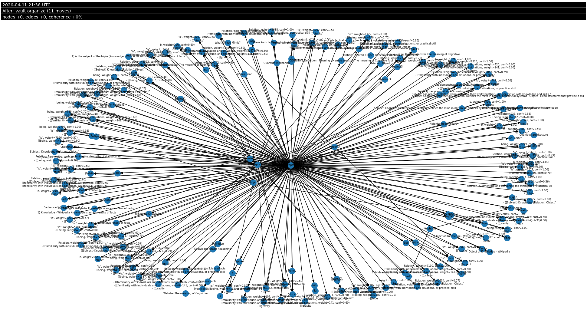](graph-2026-04-11-21-36-after-organize.png) [commit](https://github.com/BoggersTheFish/BoggersTheCIG/commit/5654ae5)

### 2026-04-11 21:36 UTC

**After:** 1 extracts, 3 merges — nodes +0, edges +0, coherence +0%

[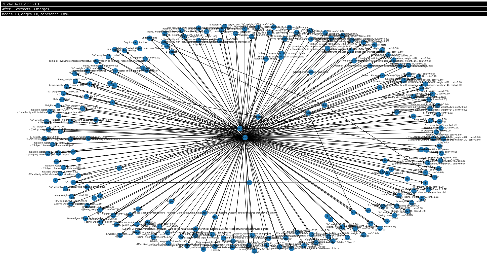](graph-2026-04-11-21-36-extract-subideas.png) [commit](https://github.com/BoggersTheFish/BoggersTheCIG/commit/5654ae5)

### 2026-04-11 21:36 UTC

**After:** +.md"+00.md"+2_+2_.md" — nodes +0, edges +0, coherence +0%

[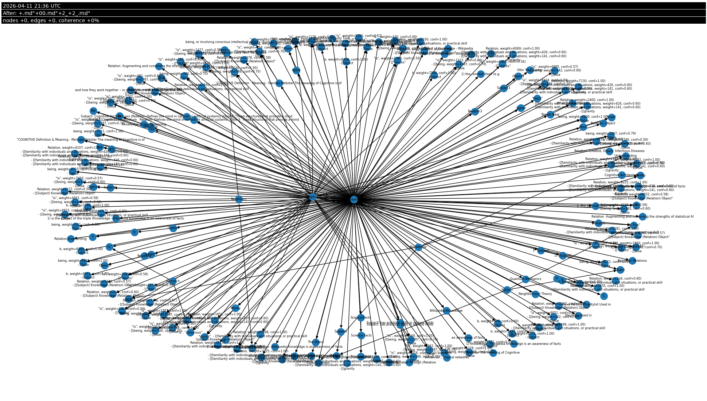](graph-2026-04-11-21-36-self-improve.png) [commit](https://github.com/BoggersTheFish/BoggersTheCIG/commit/5654ae5)

### 2026-04-11 22:00 UTC

**After:** vault organize (12 moves) — nodes +0, edges +0, coherence +0%

[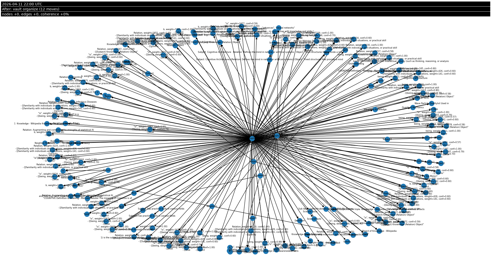](graph-2026-04-11-22-00-after-organize.png) [commit](https://github.com/BoggersTheFish/BoggersTheCIG/commit/5654ae5)

### 2026-04-11 22:00 UTC

**After:** 2 extracts, 2 merges — nodes +0, edges +0, coherence +0%

[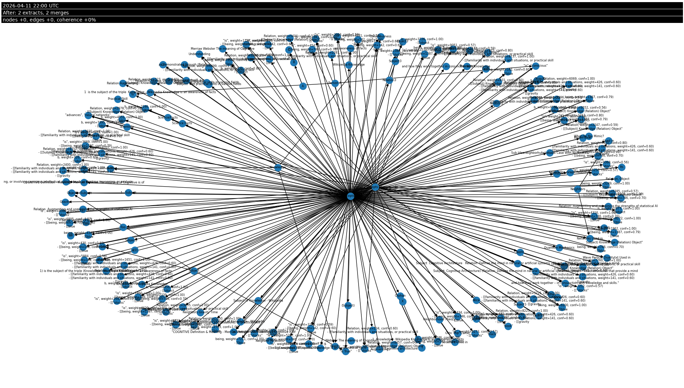](graph-2026-04-11-22-00-extract-subideas.png) [commit](https://github.com/BoggersTheFish/BoggersTheCIG/commit/5654ae5)

### 2026-04-11 22:00 UTC

**After:** +.md"+00.md"+2_+2_.md" — nodes +0, edges +0, coherence +0%

[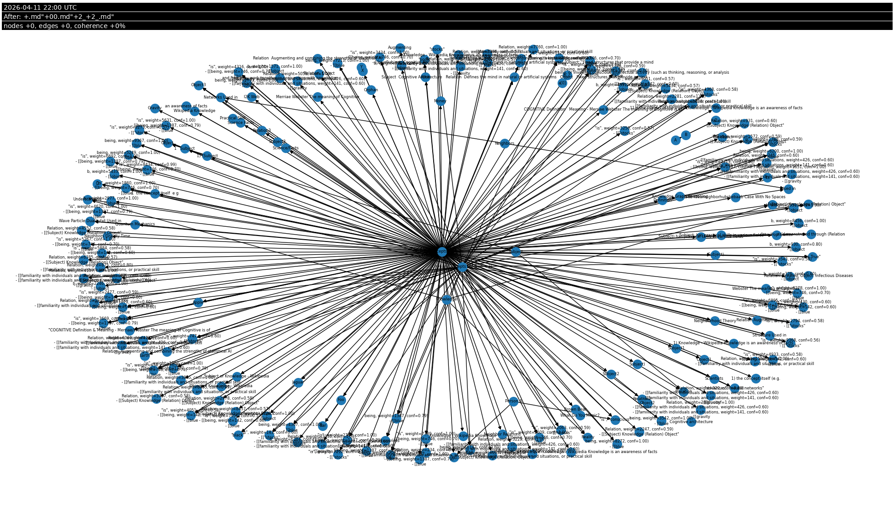](graph-2026-04-11-22-00-self-improve.png) [commit](https://github.com/BoggersTheFish/BoggersTheCIG/commit/5654ae5)

### 2026-04-12 02:55 UTC

**After:** vault organize (10 moves) — nodes +17, edges +17, coherence -5%

[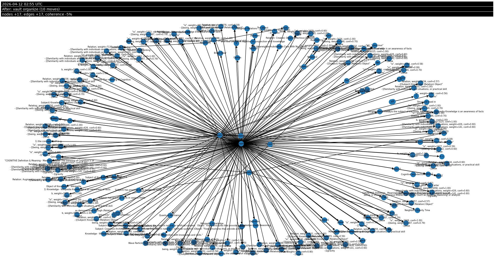](graph-2026-04-12-02-55-after-organize.png) [commit](https://github.com/BoggersTheFish/BoggersTheCIG/commit/3264ae2)

### 2026-04-12 02:55 UTC

**After:** 2 extracts, 2 merges — nodes +0, edges +0, coherence +0%

[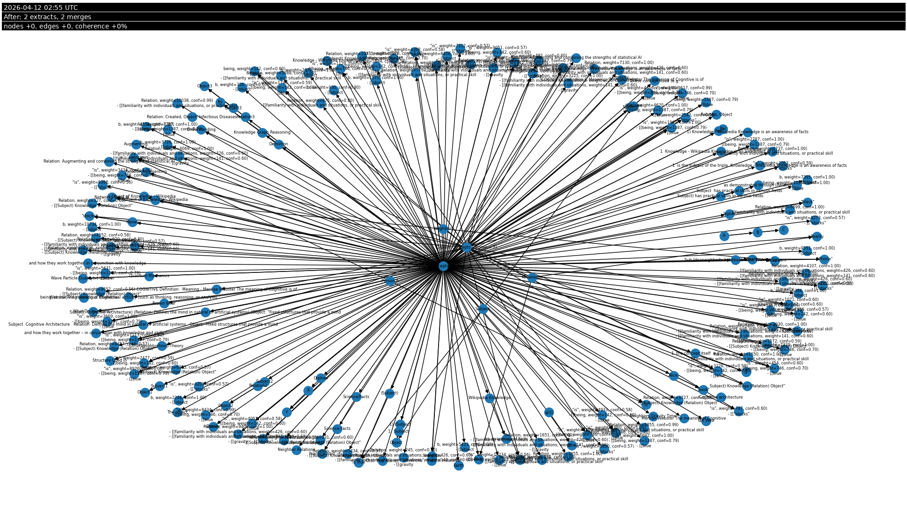](graph-2026-04-12-02-55-extract-subideas.png) [commit](https://github.com/BoggersTheFish/BoggersTheCIG/commit/3264ae2)

### 2026-04-12 02:55 UTC

**After:** +.md"+2_+2_.md"+A.md" — nodes +0, edges +0, coherence +0%

[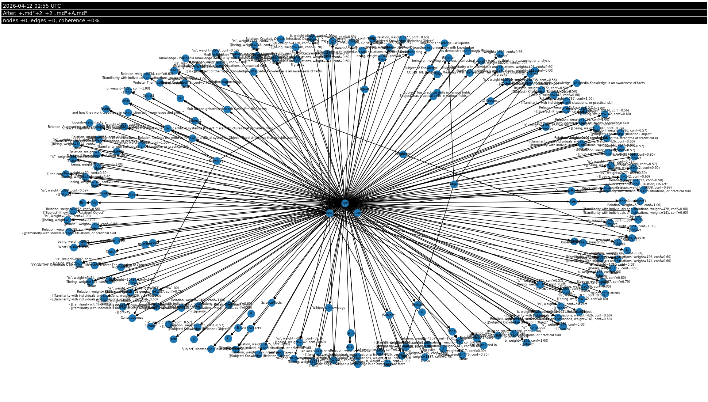](graph-2026-04-12-02-55-self-improve.png) [commit](https://github.com/BoggersTheFish/BoggersTheCIG/commit/3264ae2)

### 2026-04-12 03:03 UTC

**After:** vault analysis (+502 triples) — nodes +7, edges +9, coherence -1%

[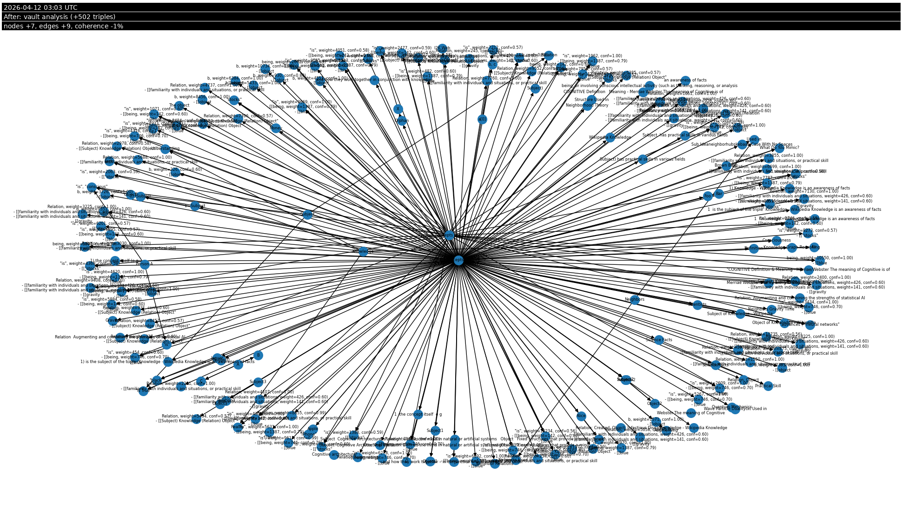](graph-2026-04-12-03-03-after-analyze-vault.png) [commit](https://github.com/BoggersTheFish/BoggersTheCIG/commit/3264ae2)

### 2026-04-12 03:03 UTC

**After:** 3 extracts, 0 merges — nodes +0, edges +0, coherence +0%

[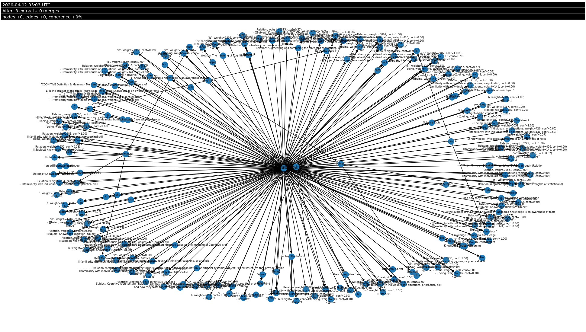](graph-2026-04-12-03-03-extract-subideas.png) [commit](https://github.com/BoggersTheFish/BoggersTheCIG/commit/3264ae2)

### 2026-04-12 03:11 UTC

**After:** vault analysis (+502 triples) — nodes +0, edges +2, coherence +0%

[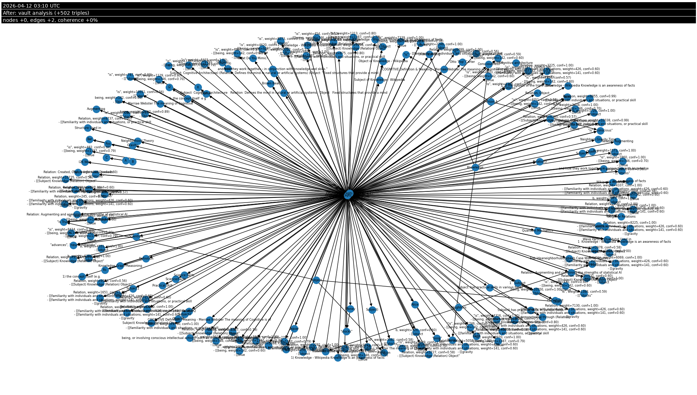](graph-2026-04-12-03-10-after-analyze-vault.png) [commit](https://github.com/BoggersTheFish/BoggersTheCIG/commit/3264ae2)

### 2026-04-12 03:11 UTC

**After:** 3 extracts, 0 merges — nodes +0, edges +0, coherence +0%

[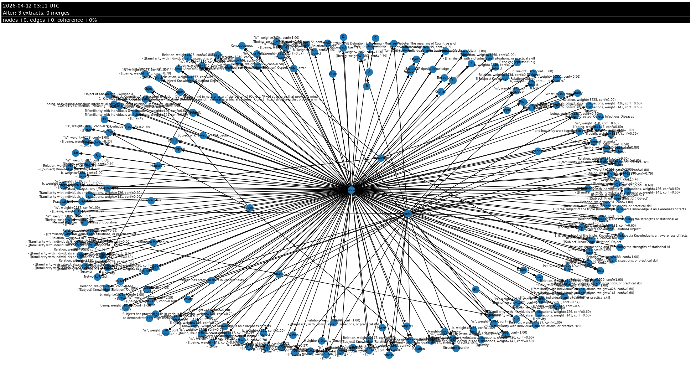](graph-2026-04-12-03-11-extract-subideas.png) [commit](https://github.com/BoggersTheFish/BoggersTheCIG/commit/3264ae2)

### 2026-04-12 03:34 UTC

**After:** vault organize (8 moves) — nodes +0, edges +0, coherence +0%

[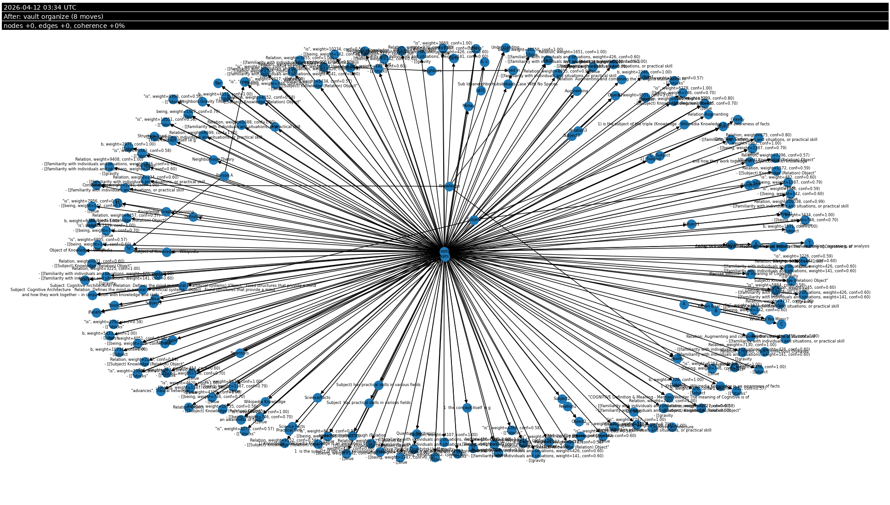](graph-2026-04-12-03-34-after-organize.png) [commit](https://github.com/BoggersTheFish/BoggersTheCIG/commit/3264ae2)

### 2026-04-12 03:34 UTC

**After:** 1 extracts, 3 merges — nodes +0, edges +0, coherence +0%

[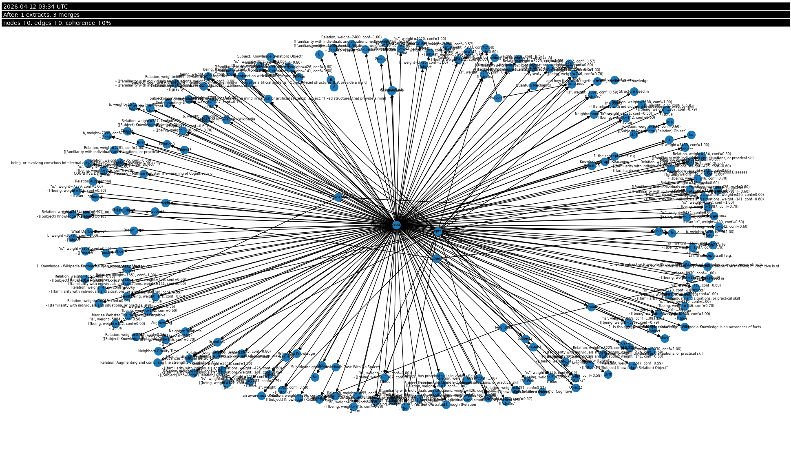](graph-2026-04-12-03-34-extract-subideas.png) [commit](https://github.com/BoggersTheFish/BoggersTheCIG/commit/3264ae2)

### 2026-04-12 03:35 UTC

**After:** +.md"+00.md"+2_+2_.md" — nodes +0, edges +0, coherence +0%

[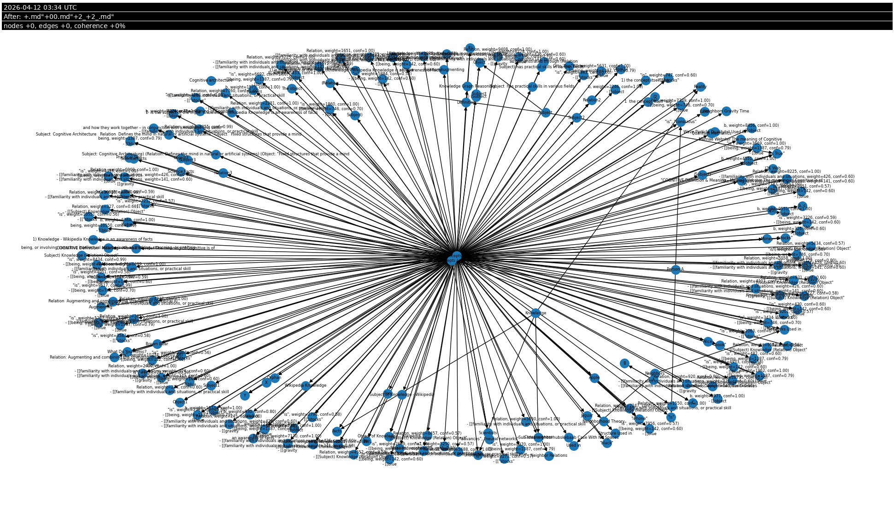](graph-2026-04-12-03-34-self-improve.png) [commit](https://github.com/BoggersTheFish/BoggersTheCIG/commit/3264ae2)

### 2026-04-12 03:58 UTC

**After:** vault organize (7 moves) — nodes +0, edges +0, coherence +0%

[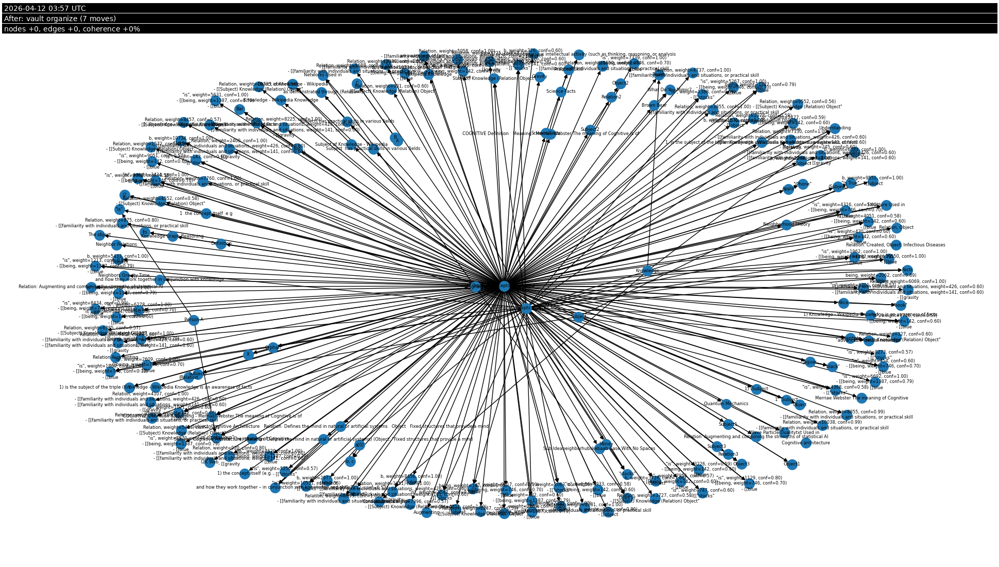](graph-2026-04-12-03-57-after-organize.png) [commit](https://github.com/BoggersTheFish/BoggersTheCIG/commit/3264ae2)

### 2026-04-12 03:58 UTC

**After:** 2 extracts, 2 merges — nodes +0, edges +0, coherence +0%

[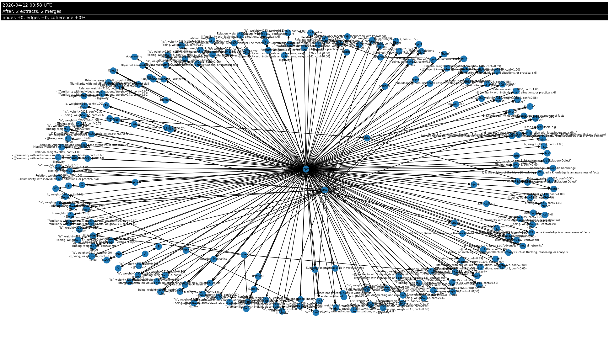](graph-2026-04-12-03-58-extract-subideas.png) [commit](https://github.com/BoggersTheFish/BoggersTheCIG/commit/3264ae2)

### 2026-04-12 03:58 UTC

**After:** +.md"+00.md"+2_+2_.md" — nodes +0, edges +0, coherence +0%

[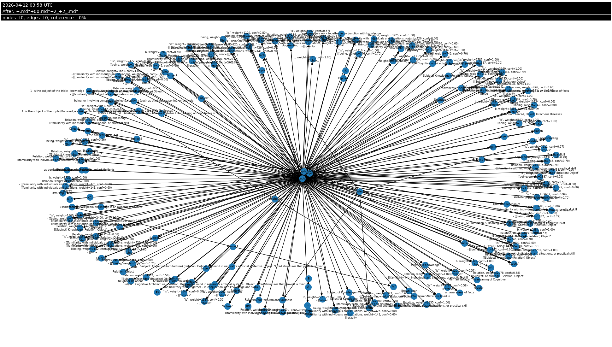](graph-2026-04-12-03-58-self-improve.png) [commit](https://github.com/BoggersTheFish/BoggersTheCIG/commit/3264ae2)

### 2026-04-12 06:50 UTC

**After:** vault organize (16 moves) — nodes +17, edges +17, coherence -4%

[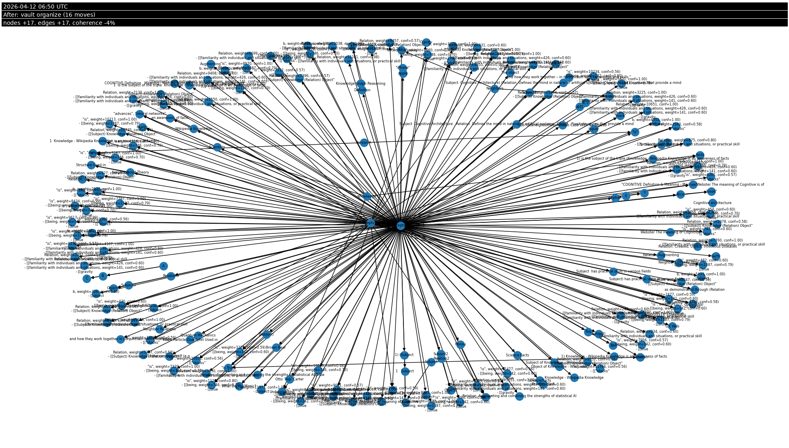](graph-2026-04-12-06-50-after-organize.png) [commit](https://github.com/BoggersTheFish/BoggersTheCIG/commit/f297ac9)

### 2026-04-12 06:50 UTC

**After:** 2 extracts, 2 merges — nodes +0, edges +0, coherence +0%

[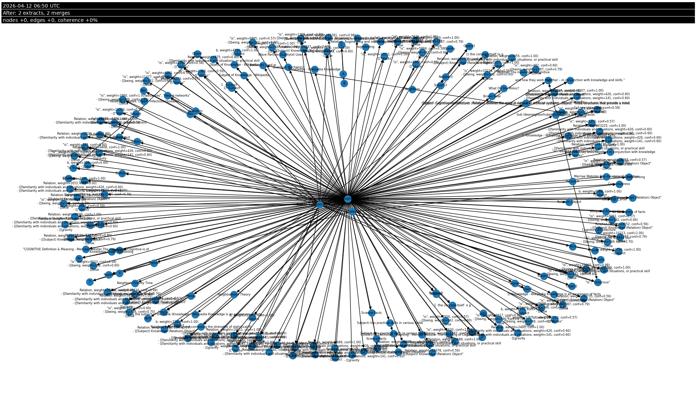](graph-2026-04-12-06-50-extract-subideas.png) [commit](https://github.com/BoggersTheFish/BoggersTheCIG/commit/f297ac9)

### 2026-04-12 06:50 UTC

**After:** +.md"+2_+2_.md"+80.md" — nodes +0, edges +0, coherence +0%

[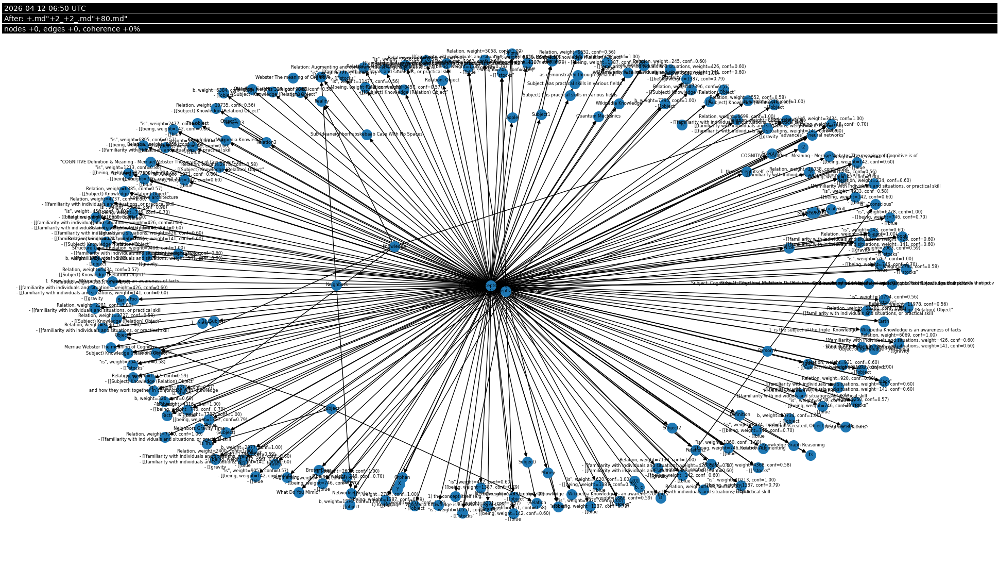](graph-2026-04-12-06-50-self-improve.png) [commit](https://github.com/BoggersTheFish/BoggersTheCIG/commit/f297ac9)

### 2026-04-12 06:51 UTC

**After:** external ingest (+5 triples) — nodes +0, edges +0, coherence +0%

[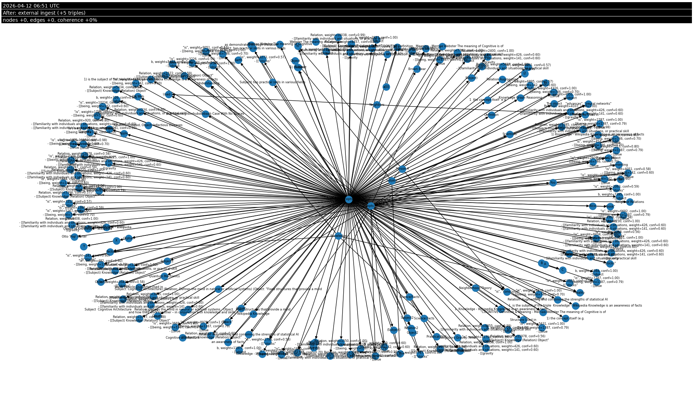](graph-2026-04-12-06-51-after-ingest.png) [commit](https://github.com/BoggersTheFish/BoggersTheCIG/commit/f297ac9)

### 2026-04-12 07:01 UTC

**After:** vault analysis (+520 triples) — nodes +6, edges +8, coherence -1%

[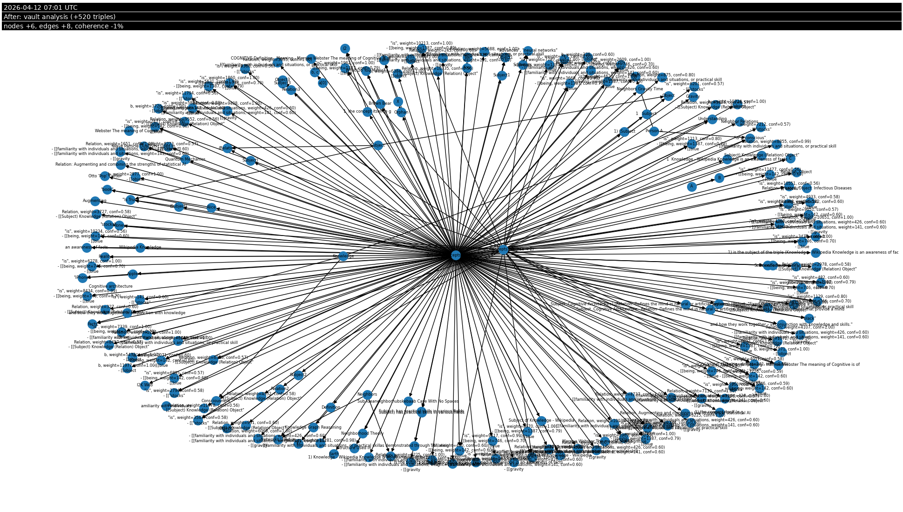](graph-2026-04-12-07-01-after-analyze-vault.png) [commit](https://github.com/BoggersTheFish/BoggersTheCIG/commit/f297ac9)

### 2026-04-12 07:01 UTC

**After:** 2 extracts, 0 merges — nodes +0, edges +0, coherence +0%

[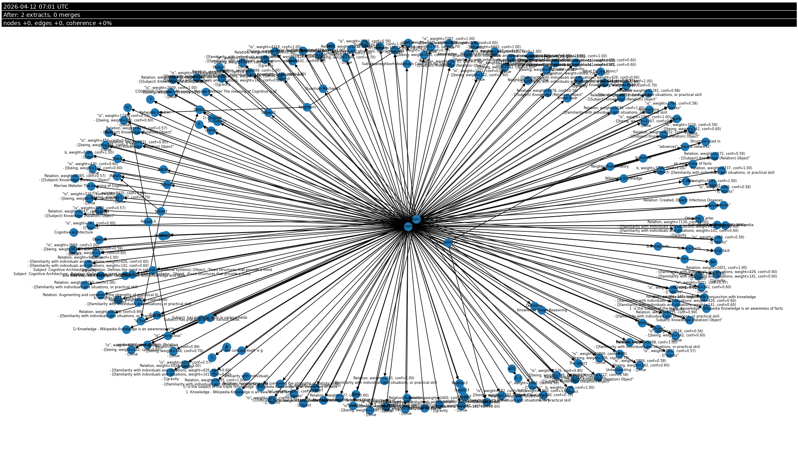](graph-2026-04-12-07-01-extract-subideas.png) [commit](https://github.com/BoggersTheFish/BoggersTheCIG/commit/f297ac9)

### 2026-04-12 07:11 UTC

**After:** vault analysis (+519 triples) — nodes +0, edges +2, coherence +0%

[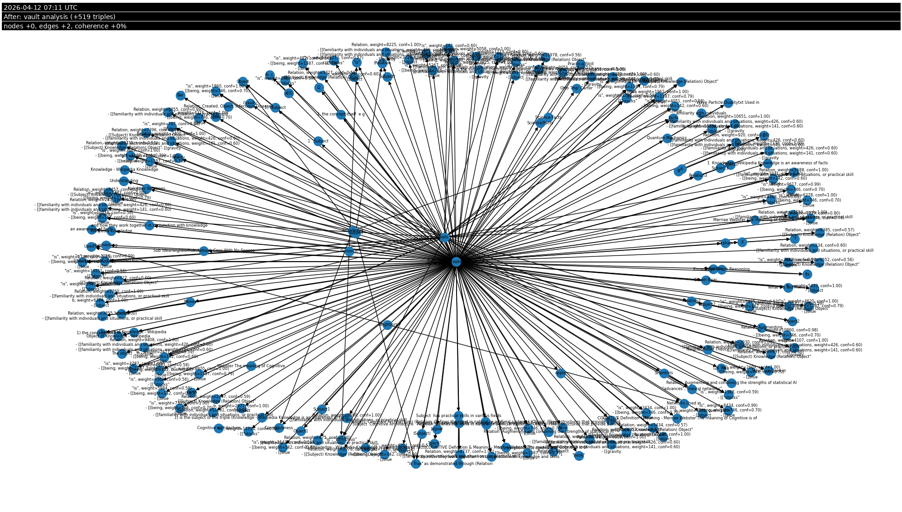](graph-2026-04-12-07-11-after-analyze-vault.png) [commit](https://github.com/BoggersTheFish/BoggersTheCIG/commit/f297ac9)

### 2026-04-12 07:12 UTC

**After:** 2 extracts, 0 merges — nodes +0, edges +0, coherence +0%

[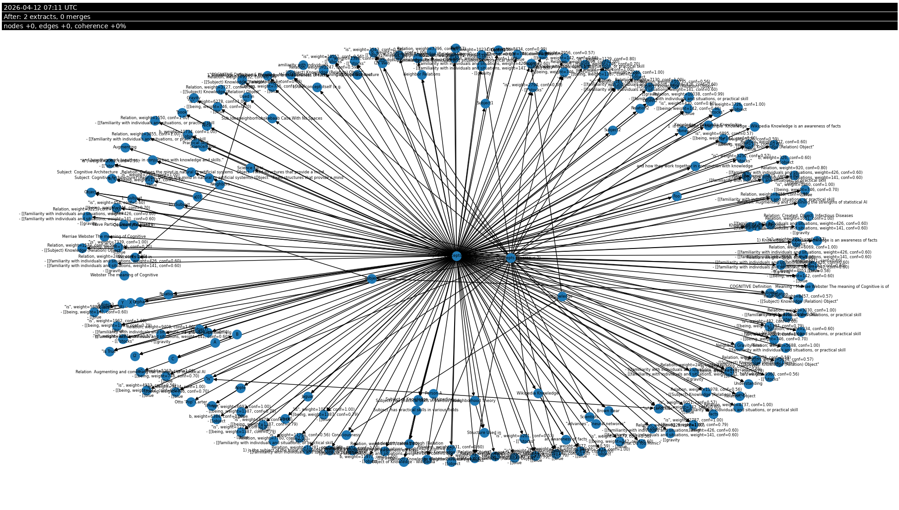](graph-2026-04-12-07-11-extract-subideas.png) [commit](https://github.com/BoggersTheFish/BoggersTheCIG/commit/f297ac9)

### 2026-04-12 07:36 UTC

**After:** vault organize (6 moves) — nodes +0, edges +0, coherence +0%

[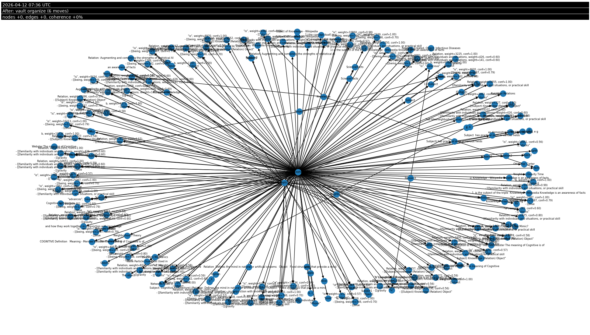](graph-2026-04-12-07-36-after-organize.png) [commit](https://github.com/BoggersTheFish/BoggersTheCIG/commit/f297ac9)

### 2026-04-12 07:37 UTC

**After:** 2 extracts, 2 merges — nodes +0, edges +0, coherence +0%

[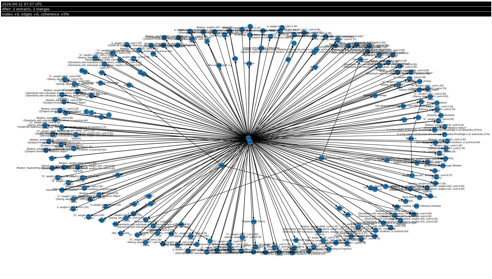](graph-2026-04-12-07-37-extract-subideas.png) [commit](https://github.com/BoggersTheFish/BoggersTheCIG/commit/f297ac9)

### 2026-04-12 07:37 UTC

**After:** +.md"+00.md"+1.md"+2_ — nodes +0, edges +0, coherence +0%

[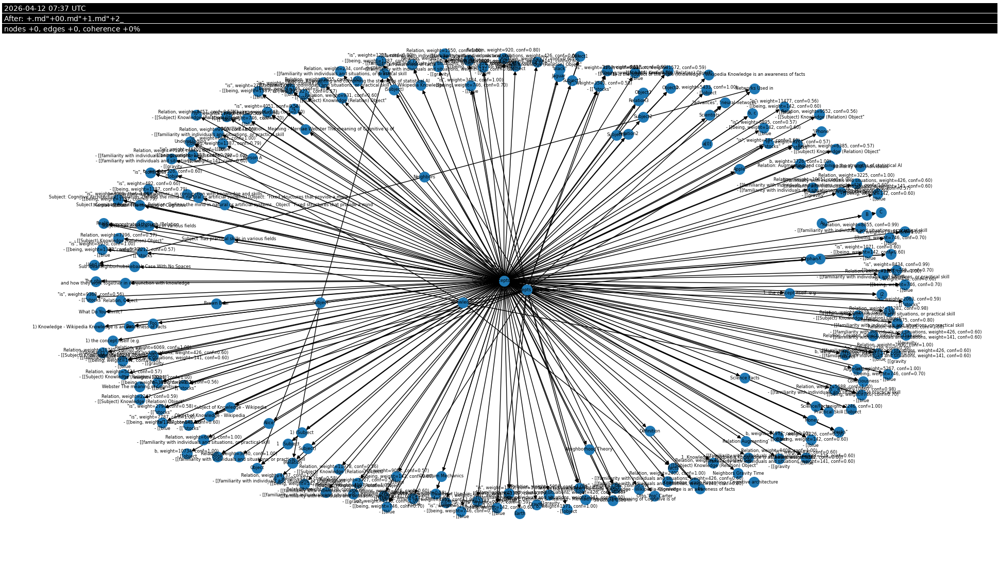](graph-2026-04-12-07-37-self-improve.png) [commit](https://github.com/BoggersTheFish/BoggersTheCIG/commit/f297ac9)

### 2026-04-12 08:00 UTC

**After:** vault organize (16 moves) — nodes +0, edges +0, coherence +0%

[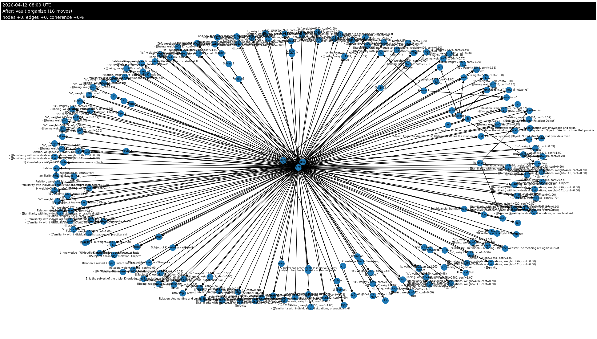](graph-2026-04-12-08-00-after-organize.png) [commit](https://github.com/BoggersTheFish/BoggersTheCIG/commit/f297ac9)

### 2026-04-12 08:00 UTC

**After:** 2 extracts, 2 merges — nodes +0, edges +0, coherence +0%

[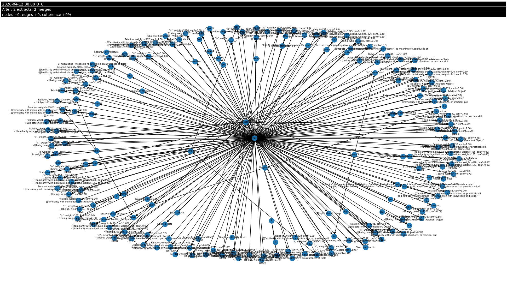](graph-2026-04-12-08-00-extract-subideas.png) [commit](https://github.com/BoggersTheFish/BoggersTheCIG/commit/f297ac9)

### 2026-04-12 08:00 UTC

**After:** +.md"+00.md"+1.md"+2_ — nodes +0, edges +0, coherence +0%

[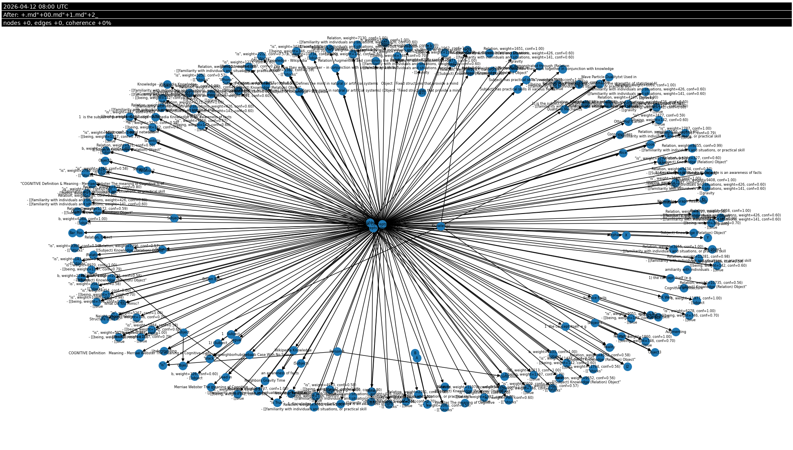](graph-2026-04-12-08-00-self-improve.png) [commit](https://github.com/BoggersTheFish/BoggersTheCIG/commit/f297ac9)

### 2026-04-12 11:05 UTC

**After:** vault organize (9 moves) — nodes +17, edges +17, coherence -4%

[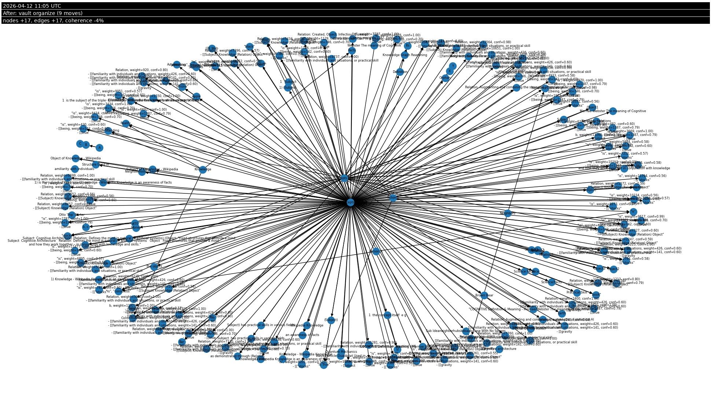](graph-2026-04-12-11-05-after-organize.png) [commit](https://github.com/BoggersTheFish/BoggersTheCIG/commit/657d49a)

### 2026-04-12 11:06 UTC

**After:** 2 extracts, 2 merges — nodes +0, edges +0, coherence +0%

[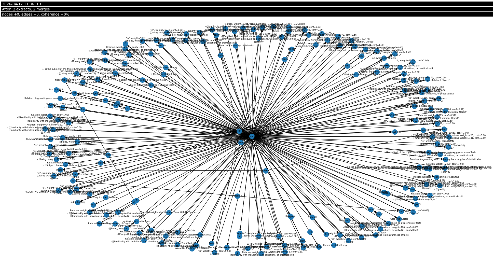](graph-2026-04-12-11-06-extract-subideas.png) [commit](https://github.com/BoggersTheFish/BoggersTheCIG/commit/657d49a)

### 2026-04-12 11:06 UTC

**After:** +.md"+2_+2_.md"+60.md" — nodes +0, edges +0, coherence +0%

[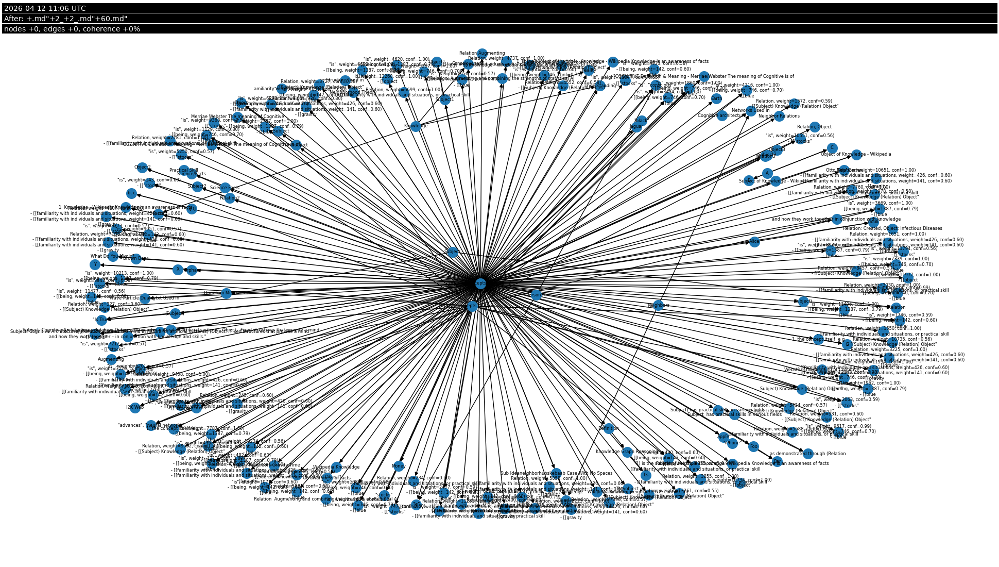](graph-2026-04-12-11-06-self-improve.png) [commit](https://github.com/BoggersTheFish/BoggersTheCIG/commit/657d49a)

### 2026-04-12 11:06 UTC

**After:** external ingest (+3 triples) — nodes +1, edges +1, coherence +0%

[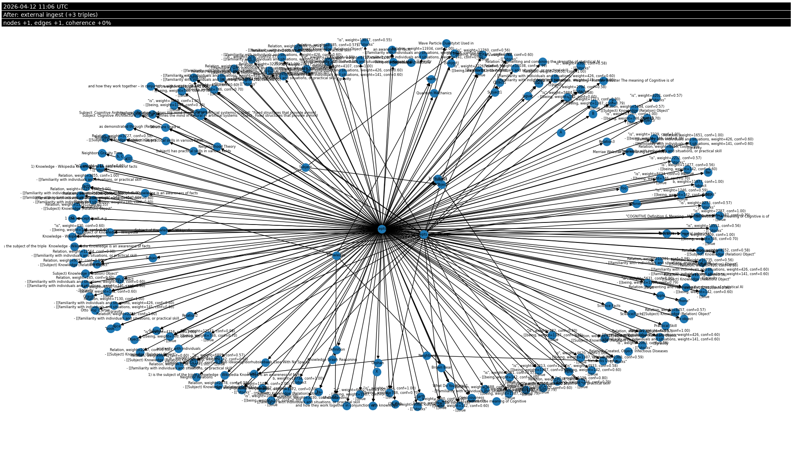](graph-2026-04-12-11-06-after-ingest.png) [commit](https://github.com/BoggersTheFish/BoggersTheCIG/commit/657d49a)

### 2026-04-12 11:18 UTC

**After:** vault analysis (+549 triples) — nodes +8, edges +10, coherence -1%

[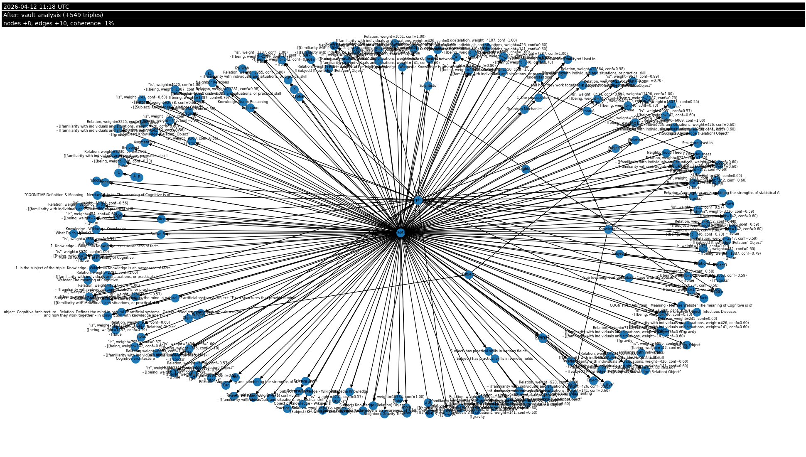](graph-2026-04-12-11-18-after-analyze-vault.png) [commit](https://github.com/BoggersTheFish/BoggersTheCIG/commit/657d49a)

### 2026-04-12 11:18 UTC

**After:** 3 extracts, 0 merges — nodes +0, edges +0, coherence +0%

[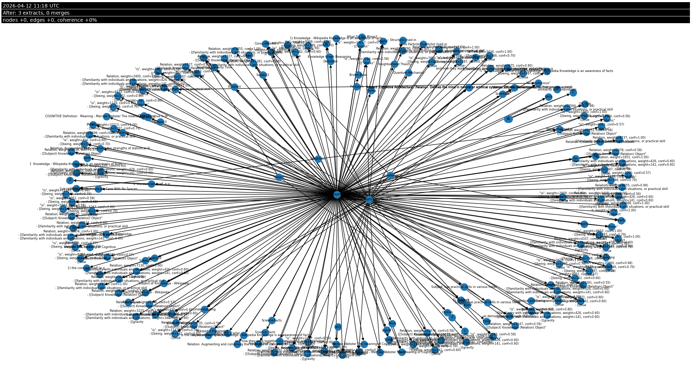](graph-2026-04-12-11-18-extract-subideas.png) [commit](https://github.com/BoggersTheFish/BoggersTheCIG/commit/657d49a)

### 2026-04-12 11:30 UTC

**After:** vault analysis (+549 triples) — nodes +0, edges +2, coherence +0%

[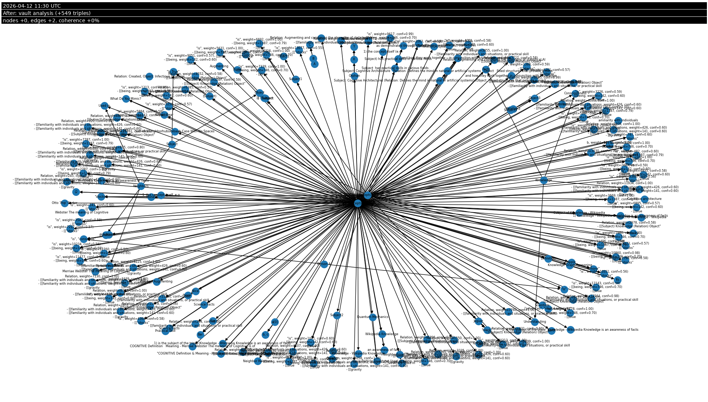](graph-2026-04-12-11-30-after-analyze-vault.png) [commit](https://github.com/BoggersTheFish/BoggersTheCIG/commit/657d49a)

### 2026-04-12 11:30 UTC

**After:** 3 extracts, 0 merges — nodes +0, edges +0, coherence +0%

[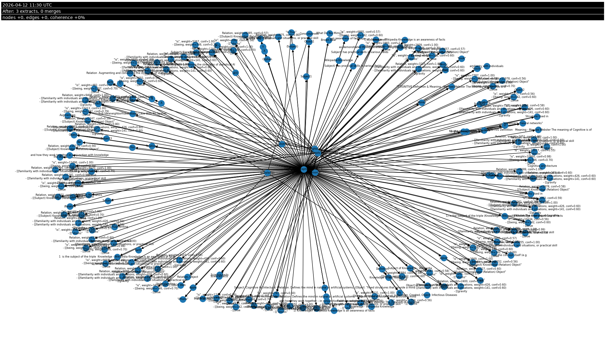](graph-2026-04-12-11-30-extract-subideas.png) [commit](https://github.com/BoggersTheFish/BoggersTheCIG/commit/657d49a)

### 2026-04-12 11:55 UTC

**After:** vault organize (12 moves) — nodes +0, edges +0, coherence +0%

[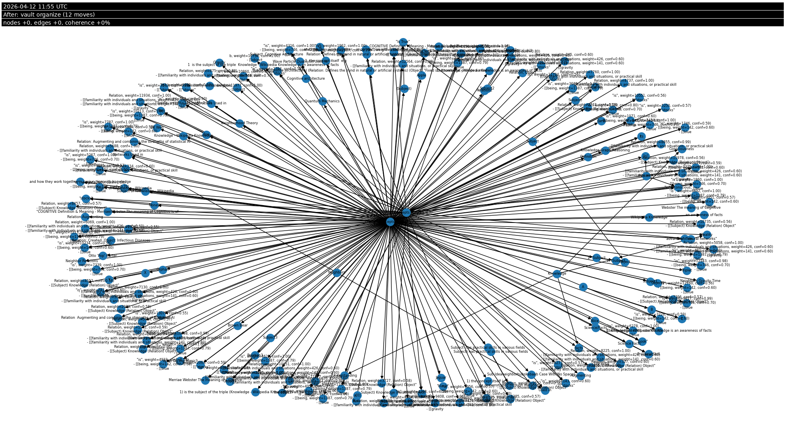](graph-2026-04-12-11-55-after-organize.png) [commit](https://github.com/BoggersTheFish/BoggersTheCIG/commit/657d49a)

### 2026-04-12 11:56 UTC

**After:** 2 extracts, 2 merges — nodes +0, edges +0, coherence +0%

[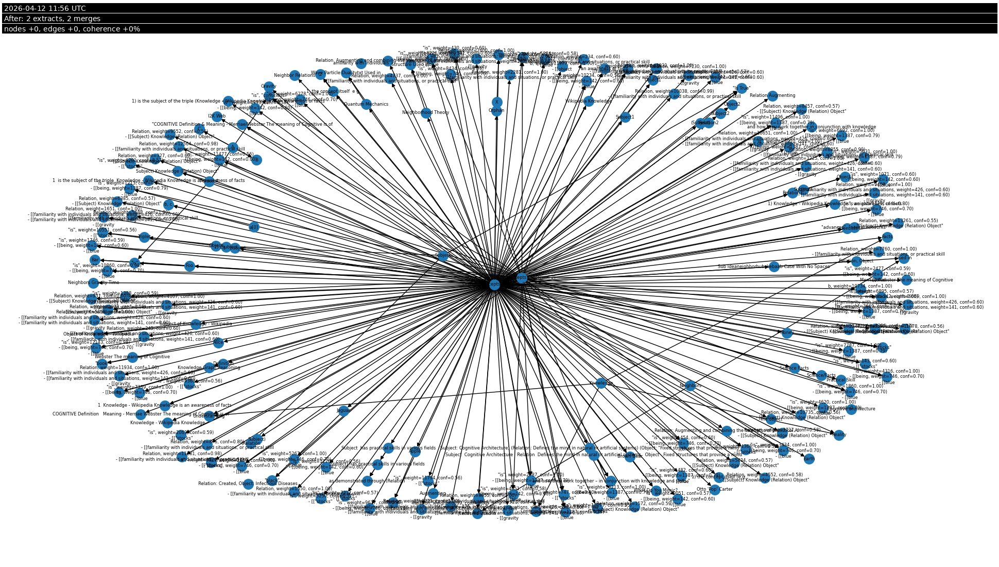](graph-2026-04-12-11-56-extract-subideas.png) [commit](https://github.com/BoggersTheFish/BoggersTheCIG/commit/657d49a)

### 2026-04-12 11:56 UTC

**After:** +.md"+00.md"+2_+2_.md" — nodes +0, edges +0, coherence +0%

[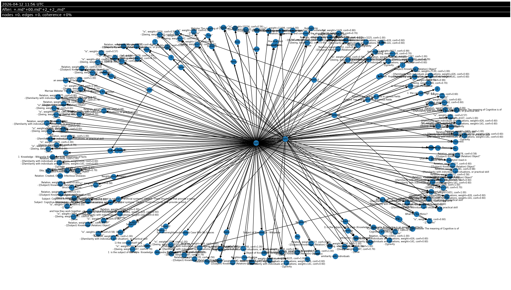](graph-2026-04-12-11-56-self-improve.png) [commit](https://github.com/BoggersTheFish/BoggersTheCIG/commit/657d49a)

### 2026-04-12 12:19 UTC

**After:** vault organize (10 moves) — nodes +0, edges +0, coherence +0%

[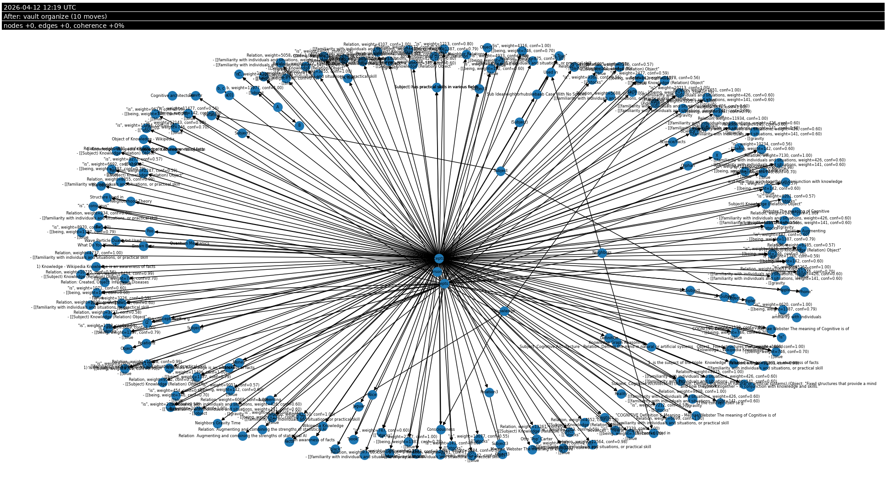](graph-2026-04-12-12-19-after-organize.png) [commit](https://github.com/BoggersTheFish/BoggersTheCIG/commit/657d49a)

### 2026-04-12 12:20 UTC

**After:** 2 extracts, 2 merges — nodes +0, edges +0, coherence +0%

[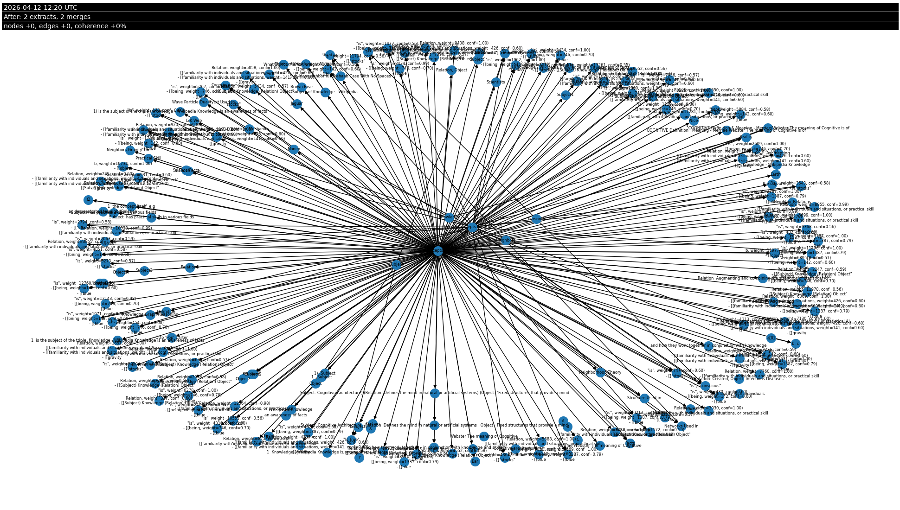](graph-2026-04-12-12-20-extract-subideas.png) [commit](https://github.com/BoggersTheFish/BoggersTheCIG/commit/657d49a)

### 2026-04-12 12:20 UTC

**After:** +.md"+00.md"+2_+2_.md" — nodes +0, edges +0, coherence +0%

[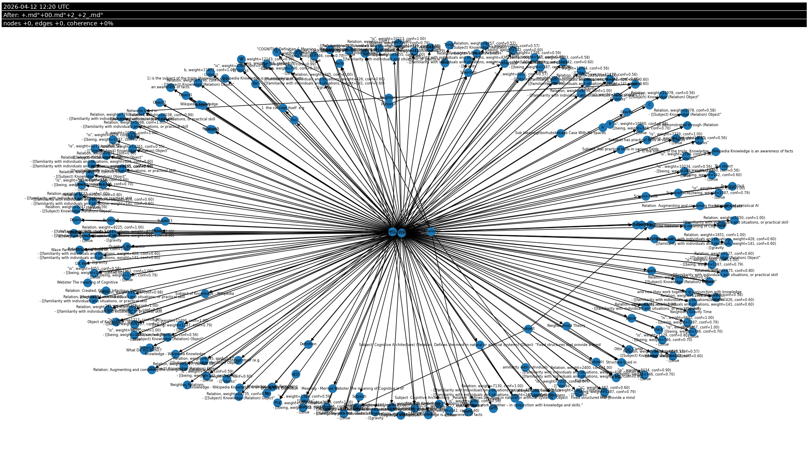](graph-2026-04-12-12-20-self-improve.png) [commit](https://github.com/BoggersTheFish/BoggersTheCIG/commit/657d49a)

### 2026-04-12 16:05 UTC

**After:** vault organize (15 moves) — nodes +17, edges +17, coherence -4%

[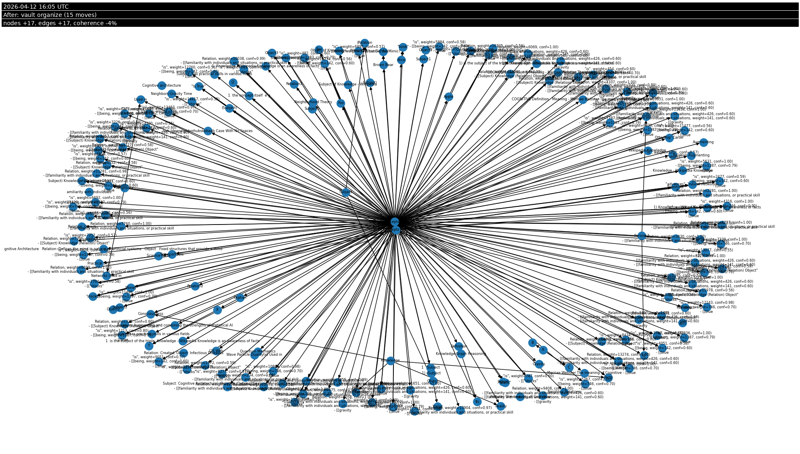](graph-2026-04-12-16-05-after-organize.png) [commit](https://github.com/BoggersTheFish/BoggersTheCIG/commit/fa271cb)

### 2026-04-12 16:05 UTC

**After:** 1 extracts, 3 merges — nodes +0, edges +0, coherence +0%

[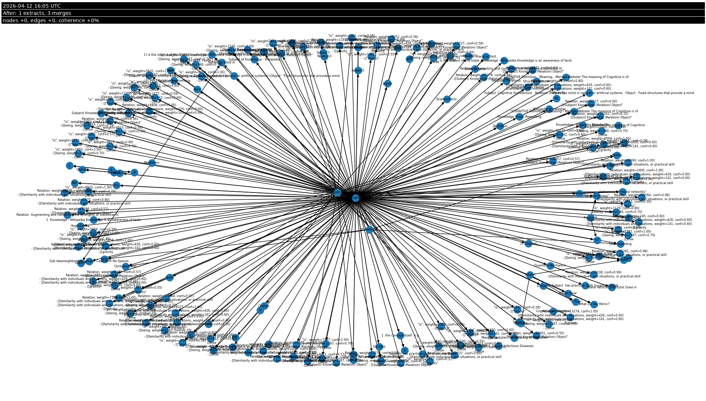](graph-2026-04-12-16-05-extract-subideas.png) [commit](https://github.com/BoggersTheFish/BoggersTheCIG/commit/fa271cb)

### 2026-04-12 16:05 UTC

**After:** .md"+2_+2_.md"+60.md"+A.md" — nodes +0, edges +0, coherence +0%

[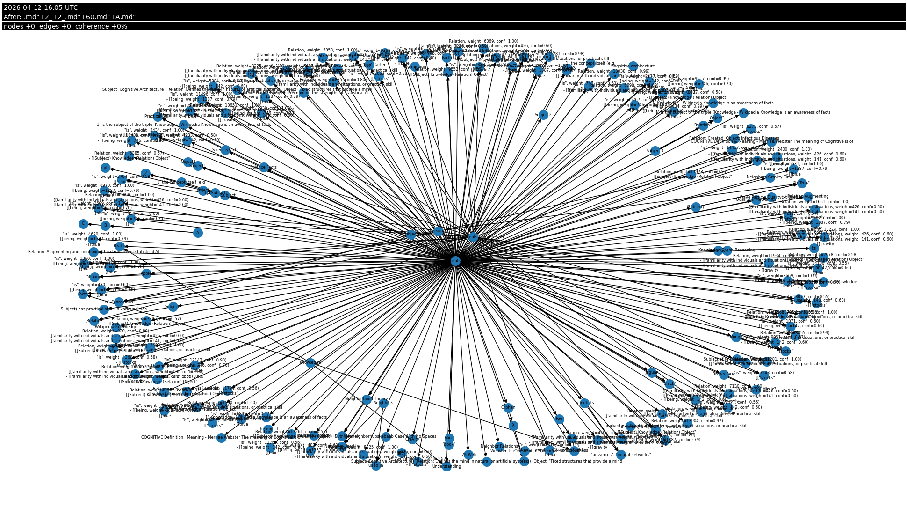](graph-2026-04-12-16-05-self-improve.png) [commit](https://github.com/BoggersTheFish/BoggersTheCIG/commit/fa271cb)

### 2026-04-12 16:06 UTC

**After:** external ingest (+1 triples) — nodes +2, edges +1, coherence +0%

[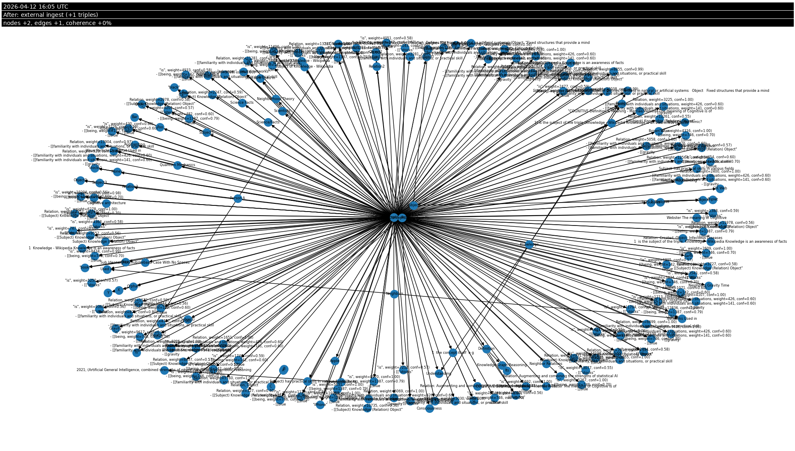](graph-2026-04-12-16-05-after-ingest.png) [commit](https://github.com/BoggersTheFish/BoggersTheCIG/commit/fa271cb)

### 2026-04-12 16:16 UTC

**After:** vault analysis (+580 triples) — nodes +6, edges +8, coherence -1%

[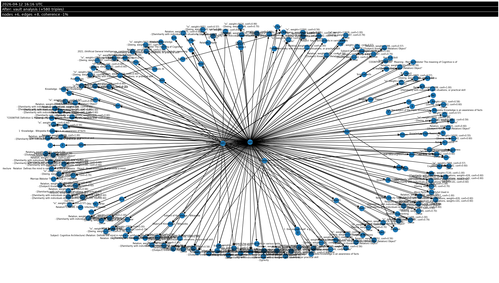](graph-2026-04-12-16-16-after-analyze-vault.png) [commit](https://github.com/BoggersTheFish/BoggersTheCIG/commit/fa271cb)

### 2026-04-12 16:16 UTC

**After:** 1 extracts, 0 merges — nodes +0, edges +0, coherence +0%

[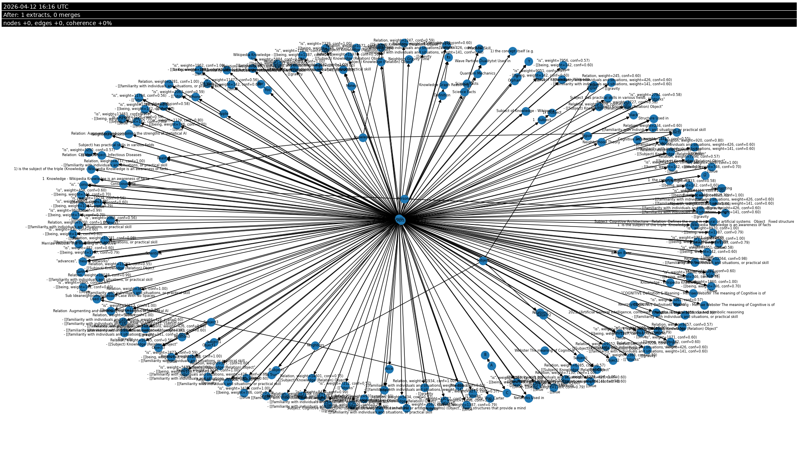](graph-2026-04-12-16-16-extract-subideas.png) [commit](https://github.com/BoggersTheFish/BoggersTheCIG/commit/fa271cb)

### 2026-04-12 16:26 UTC

**After:** vault analysis (+580 triples) — nodes +0, edges +3, coherence +0%

[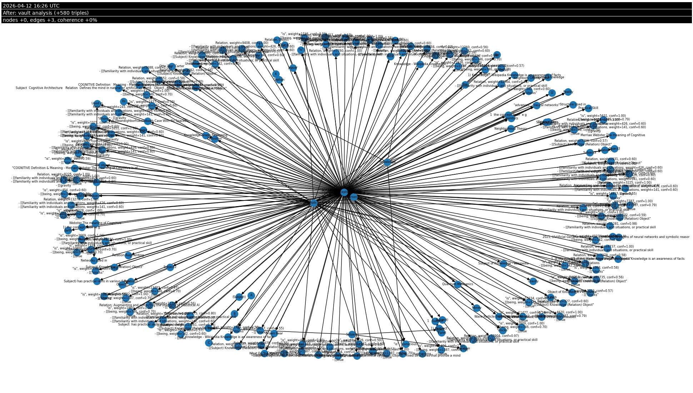](graph-2026-04-12-16-26-after-analyze-vault.png) [commit](https://github.com/BoggersTheFish/BoggersTheCIG/commit/fa271cb)

### 2026-04-12 16:26 UTC

**After:** 1 extracts, 0 merges — nodes +0, edges +0, coherence +0%

[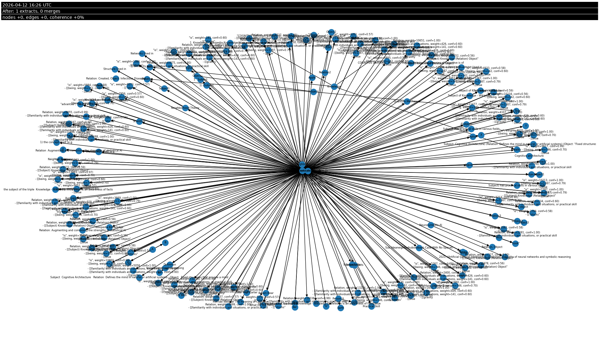](graph-2026-04-12-16-26-extract-subideas.png) [commit](https://github.com/BoggersTheFish/BoggersTheCIG/commit/fa271cb)

### 2026-04-12 16:53 UTC

**After:** vault organize (11 moves) — nodes +0, edges +0, coherence +0%

[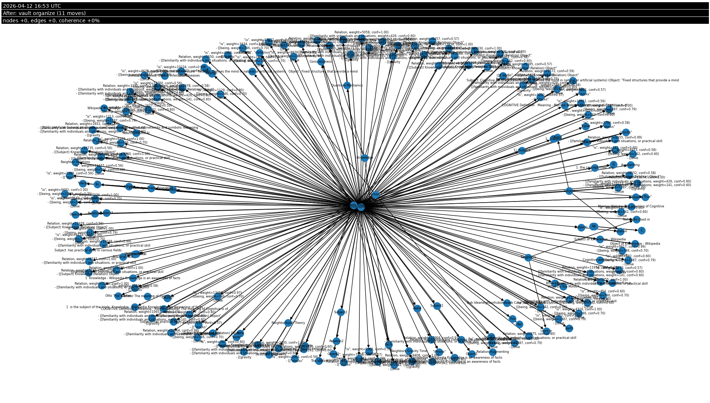](graph-2026-04-12-16-53-after-organize.png) [commit](https://github.com/BoggersTheFish/BoggersTheCIG/commit/fa271cb)

### 2026-04-12 16:53 UTC

**After:** 3 extracts, 1 merges — nodes +0, edges +0, coherence +0%

[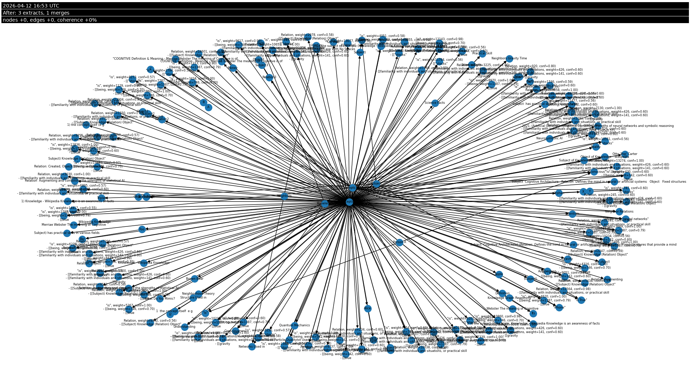](graph-2026-04-12-16-53-extract-subideas.png) [commit](https://github.com/BoggersTheFish/BoggersTheCIG/commit/fa271cb)

### 2026-04-12 16:53 UTC

**After:** +.md"+00.md"+2_+2_.md" — nodes +0, edges +0, coherence +0%

[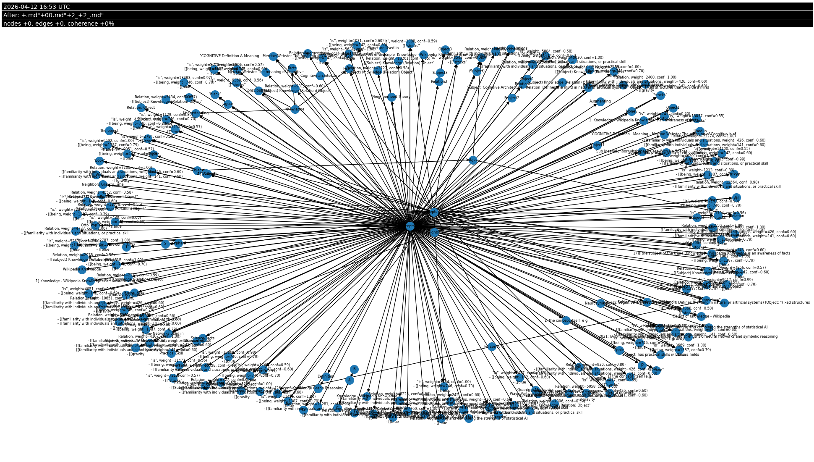](graph-2026-04-12-16-53-self-improve.png) [commit](https://github.com/BoggersTheFish/BoggersTheCIG/commit/fa271cb)

### 2026-04-12 17:20 UTC

**After:** vault organize (8 moves) — nodes +0, edges +0, coherence +0%

[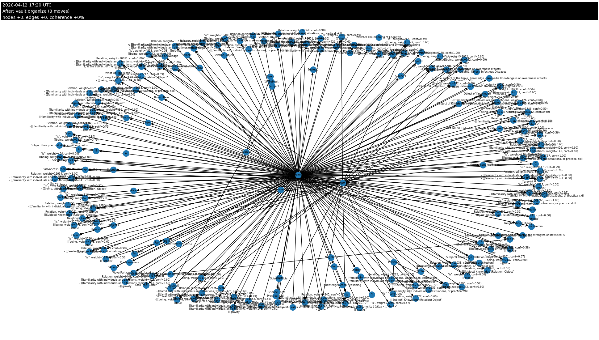](graph-2026-04-12-17-20-after-organize.png) [commit](https://github.com/BoggersTheFish/BoggersTheCIG/commit/fa271cb)

### 2026-04-12 17:20 UTC

**After:** 1 extracts, 3 merges — nodes +0, edges +0, coherence +0%

[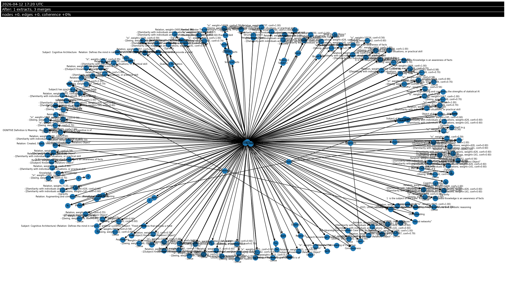](graph-2026-04-12-17-20-extract-subideas.png) [commit](https://github.com/BoggersTheFish/BoggersTheCIG/commit/fa271cb)

### 2026-04-12 17:20 UTC

**After:** +.md"+00.md"+2_+2_.md" — nodes +0, edges +0, coherence +0%

[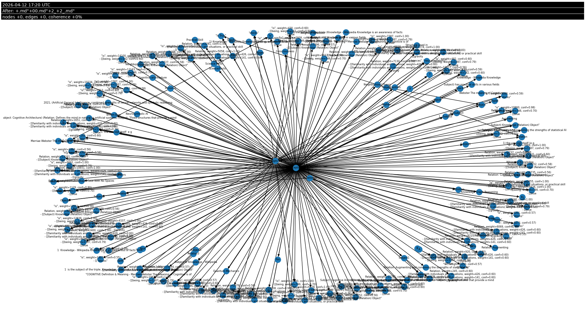](graph-2026-04-12-17-20-self-improve.png) [commit](https://github.com/BoggersTheFish/BoggersTheCIG/commit/fa271cb)

### 2026-04-12 21:05 UTC

**After:** vault organize (16 moves) — nodes +17, edges +17, coherence -4%

[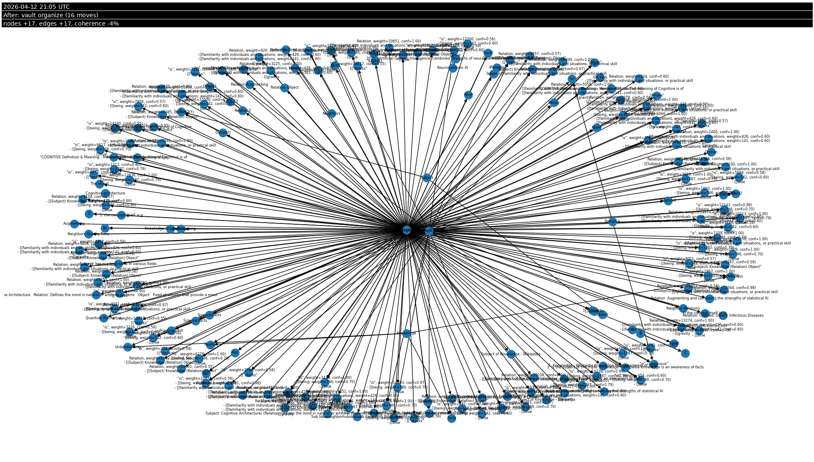](graph-2026-04-12-21-05-after-organize.png) [commit](https://github.com/BoggersTheFish/BoggersTheCIG/commit/e8fa8ee)

### 2026-04-12 21:06 UTC

**After:** 1 extracts, 3 merges — nodes +0, edges +0, coherence +0%

[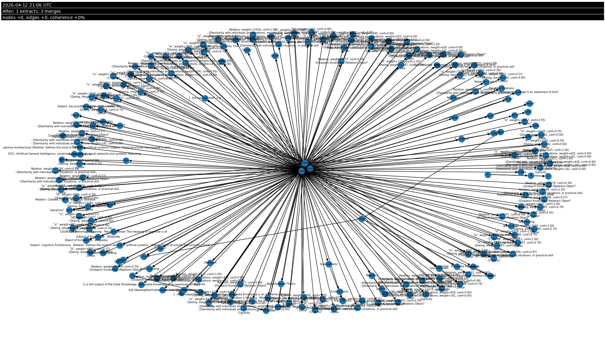](graph-2026-04-12-21-06-extract-subideas.png) [commit](https://github.com/BoggersTheFish/BoggersTheCIG/commit/e8fa8ee)

### 2026-04-12 21:06 UTC

**After:** .md"+00.md"+2_+2_.md"+55.md" — nodes +0, edges +0, coherence +0%

[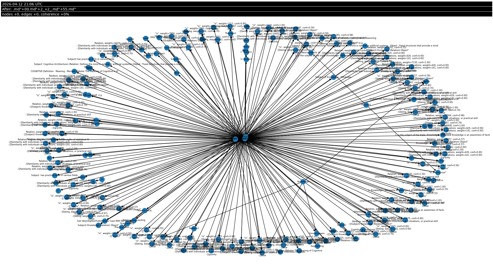](graph-2026-04-12-21-06-self-improve.png) [commit](https://github.com/BoggersTheFish/BoggersTheCIG/commit/e8fa8ee)

### 2026-04-12 21:06 UTC

**After:** external ingest (+1 triples) — nodes +0, edges +0, coherence +0%

[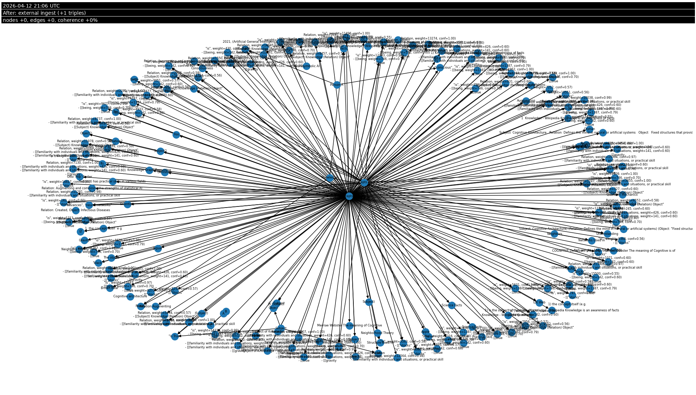](graph-2026-04-12-21-06-after-ingest.png) [commit](https://github.com/BoggersTheFish/BoggersTheCIG/commit/e8fa8ee)

### 2026-04-12 21:17 UTC

**After:** vault analysis (+620 triples) — nodes +9, edges +10, coherence -1%

[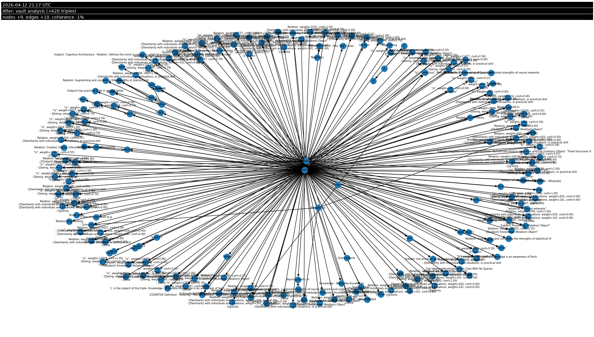](graph-2026-04-12-21-17-after-analyze-vault.png) [commit](https://github.com/BoggersTheFish/BoggersTheCIG/commit/e8fa8ee)

### 2026-04-12 21:18 UTC

**After:** 2 extracts, 0 merges — nodes +0, edges +0, coherence +0%

[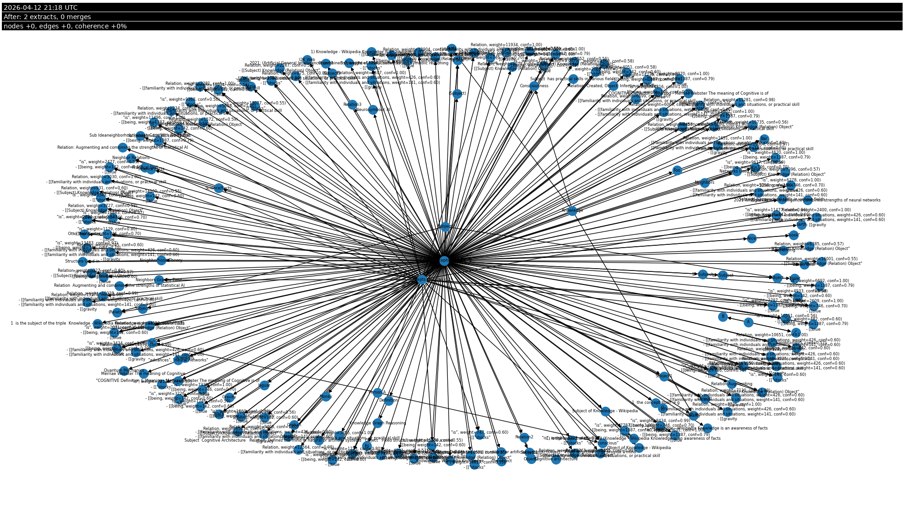](graph-2026-04-12-21-18-extract-subideas.png) [commit](https://github.com/BoggersTheFish/BoggersTheCIG/commit/e8fa8ee)

### 2026-04-12 21:29 UTC

**After:** vault analysis (+620 triples) — nodes +0, edges +2, coherence +0%

[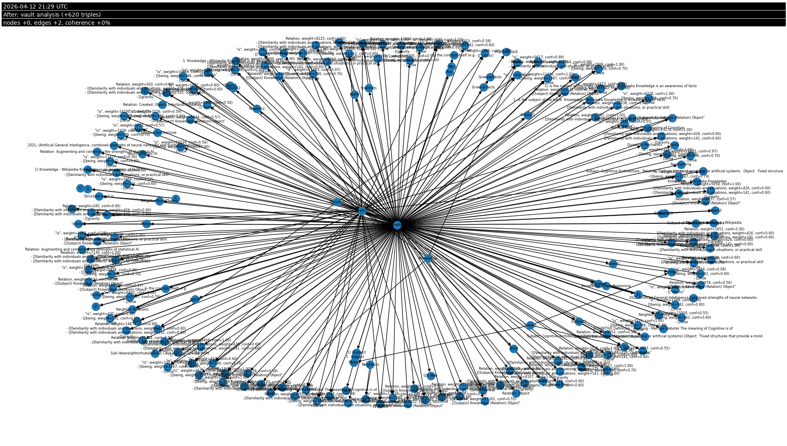](graph-2026-04-12-21-29-after-analyze-vault.png) [commit](https://github.com/BoggersTheFish/BoggersTheCIG/commit/e8fa8ee)

### 2026-04-12 21:29 UTC

**After:** 2 extracts, 0 merges — nodes +0, edges +0, coherence +0%

[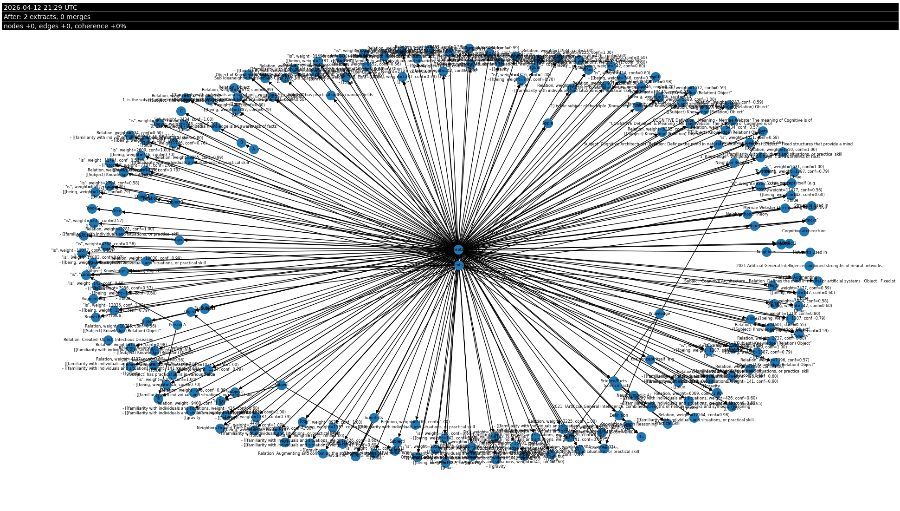](graph-2026-04-12-21-29-extract-subideas.png) [commit](https://github.com/BoggersTheFish/BoggersTheCIG/commit/e8fa8ee)

### 2026-04-12 21:59 UTC

**After:** vault organize (14 moves) — nodes +0, edges +0, coherence +0%

[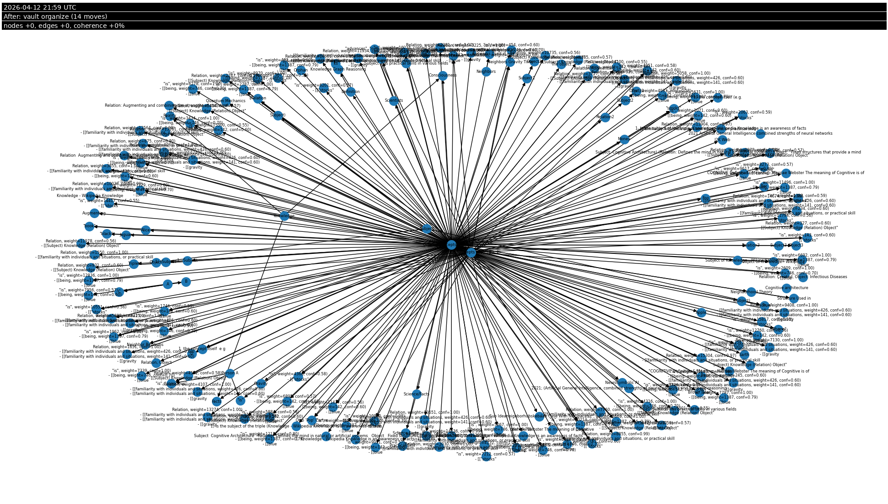](graph-2026-04-12-21-59-after-organize.png) [commit](https://github.com/BoggersTheFish/BoggersTheCIG/commit/e8fa8ee)

### 2026-04-12 21:59 UTC

**After:** 2 extracts, 2 merges — nodes +0, edges +0, coherence +0%

[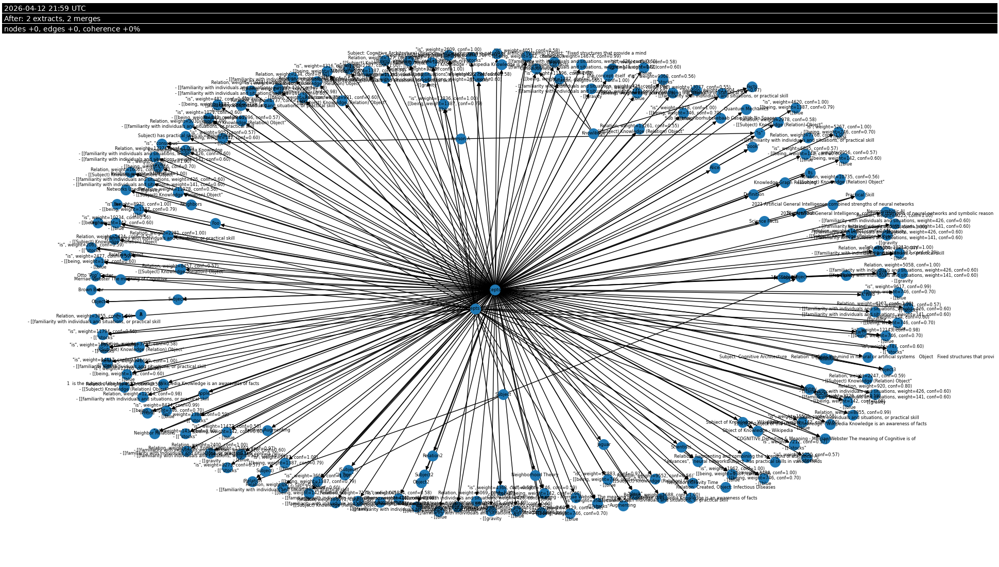](graph-2026-04-12-21-59-extract-subideas.png) [commit](https://github.com/BoggersTheFish/BoggersTheCIG/commit/e8fa8ee)

### 2026-04-12 21:59 UTC

**After:** .md"+00.md"+2_+2_.md"+55.md" — nodes +0, edges +0, coherence +0%

[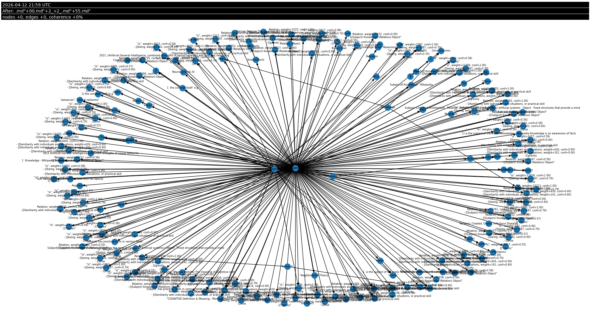](graph-2026-04-12-21-59-self-improve.png) [commit](https://github.com/BoggersTheFish/BoggersTheCIG/commit/e8fa8ee)

### 2026-04-12 22:25 UTC

**After:** vault organize (5 moves) — nodes +0, edges +0, coherence +0%

[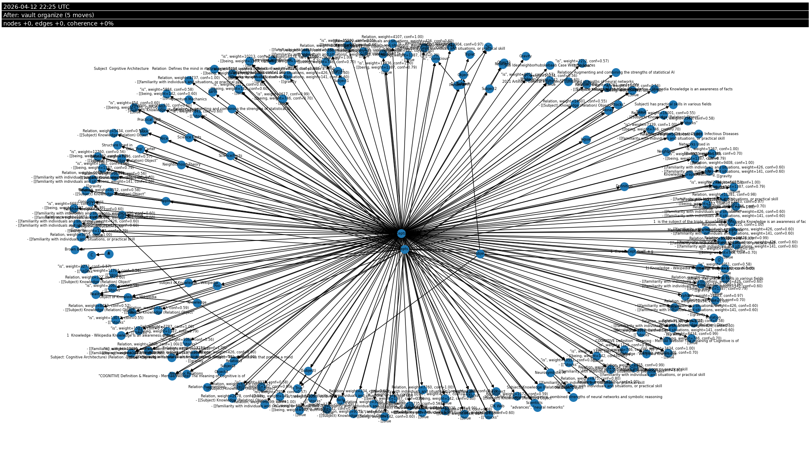](graph-2026-04-12-22-25-after-organize.png) [commit](https://github.com/BoggersTheFish/BoggersTheCIG/commit/e8fa8ee)

### 2026-04-12 22:25 UTC

**After:** 1 extracts, 3 merges — nodes +0, edges +0, coherence +0%

[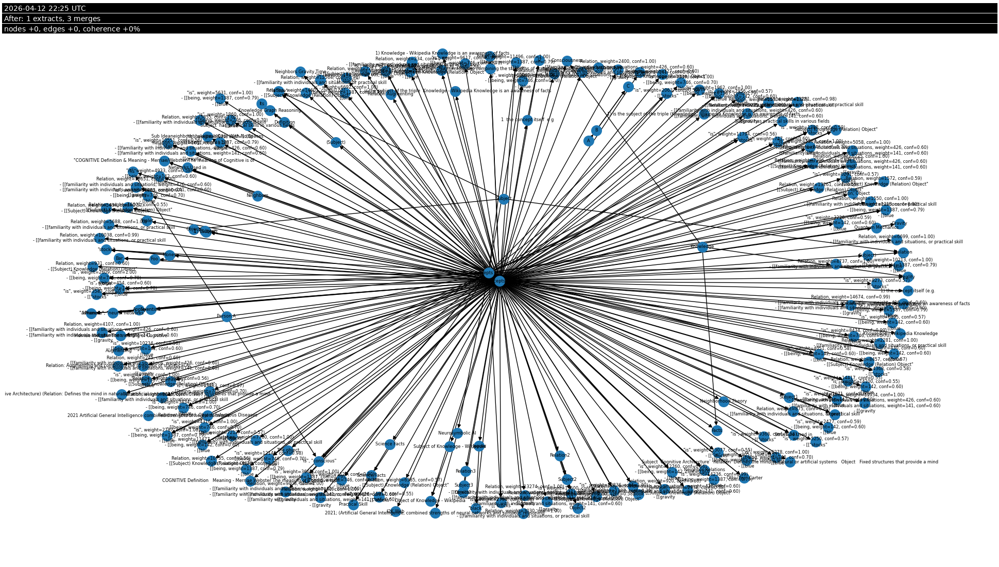](graph-2026-04-12-22-25-extract-subideas.png) [commit](https://github.com/BoggersTheFish/BoggersTheCIG/commit/e8fa8ee)

### 2026-04-12 22:25 UTC

**After:** .md"+00.md"+2_+2_.md"+55.md" — nodes +0, edges +0, coherence +0%

[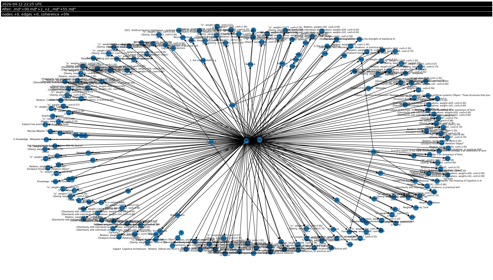](graph-2026-04-12-22-25-self-improve.png) [commit](https://github.com/BoggersTheFish/BoggersTheCIG/commit/e8fa8ee)

### 2026-04-13 03:07 UTC

**After:** vault organize (10 moves) — nodes +17, edges +17, coherence -3%

[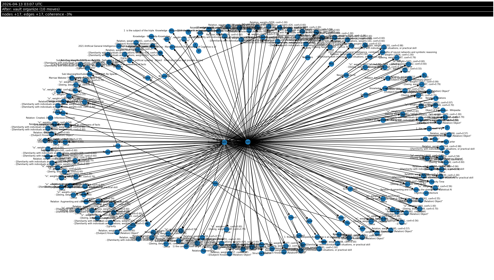](graph-2026-04-13-03-07-after-organize.png) [commit](https://github.com/BoggersTheFish/BoggersTheCIG/commit/02b27f2)

### 2026-04-13 03:08 UTC

**After:** 3 extracts, 1 merges — nodes +0, edges +0, coherence +0%

[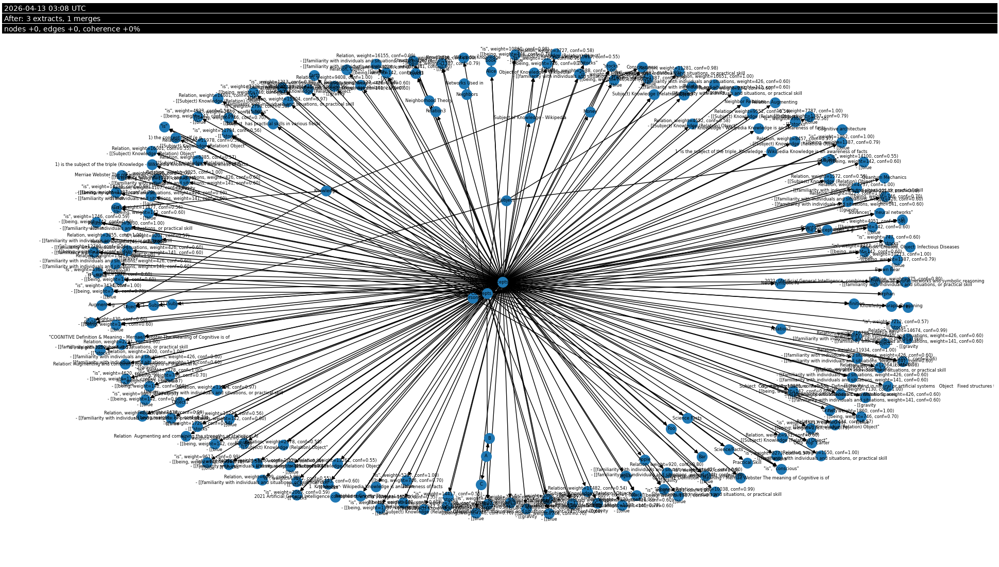](graph-2026-04-13-03-08-extract-subideas.png) [commit](https://github.com/BoggersTheFish/BoggersTheCIG/commit/02b27f2)

### 2026-04-13 03:08 UTC

**After:** +.md"+00.md"+2_+2_.md" — nodes +0, edges +0, coherence +0%

[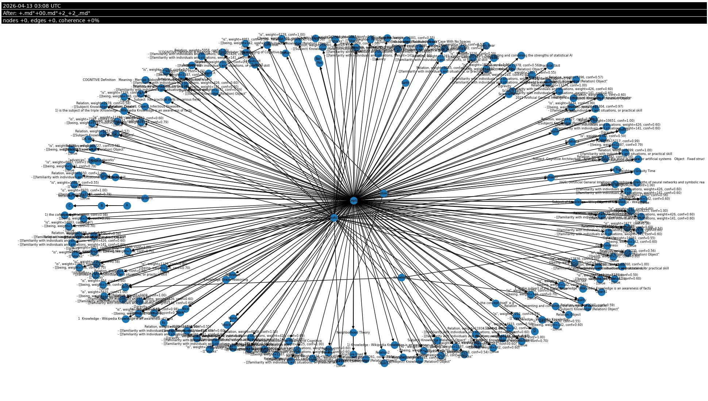](graph-2026-04-13-03-08-self-improve.png) [commit](https://github.com/BoggersTheFish/BoggersTheCIG/commit/02b27f2)

### 2026-04-13 03:18 UTC

**After:** vault analysis (+643 triples) — nodes +3, edges +5, coherence +0%

[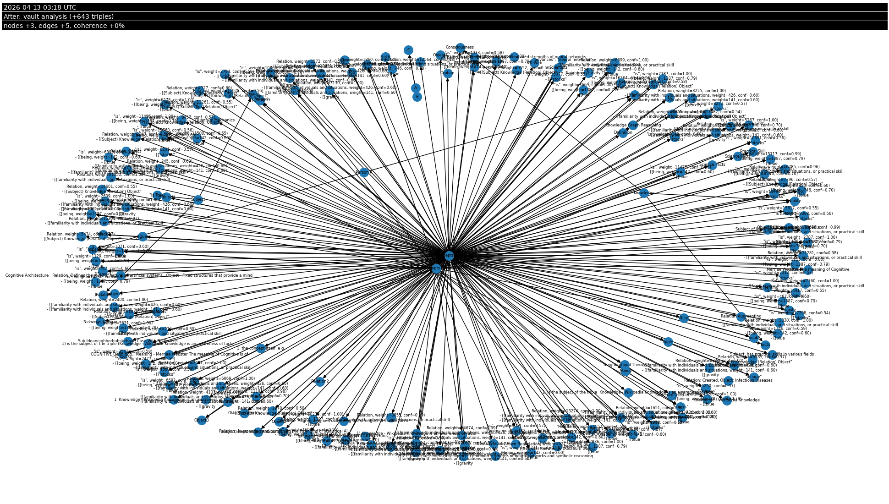](graph-2026-04-13-03-18-after-analyze-vault.png) [commit](https://github.com/BoggersTheFish/BoggersTheCIG/commit/02b27f2)

### 2026-04-13 03:19 UTC

**After:** 3 extracts, 0 merges — nodes +0, edges +0, coherence +0%

[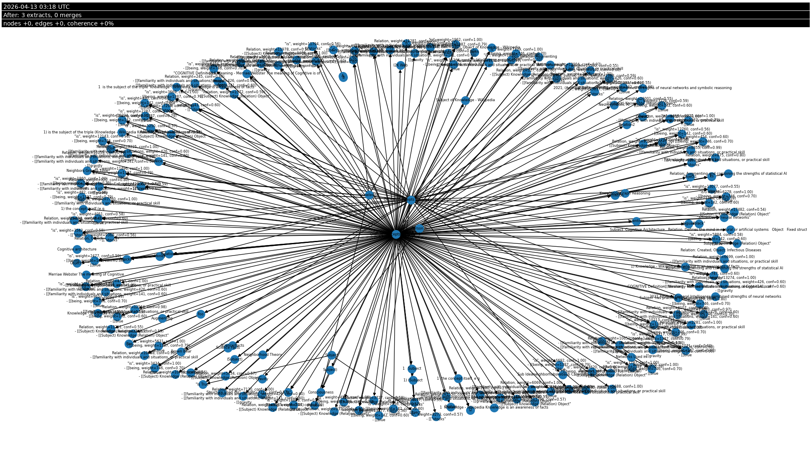](graph-2026-04-13-03-18-extract-subideas.png) [commit](https://github.com/BoggersTheFish/BoggersTheCIG/commit/02b27f2)

### 2026-04-13 03:29 UTC

**After:** vault analysis (+643 triples) — nodes +0, edges +2, coherence +0%

[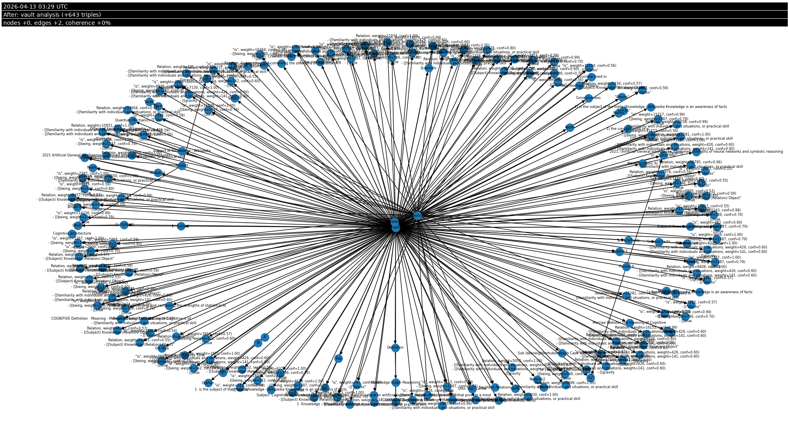](graph-2026-04-13-03-29-after-analyze-vault.png) [commit](https://github.com/BoggersTheFish/BoggersTheCIG/commit/02b27f2)

### 2026-04-13 03:29 UTC

**After:** 3 extracts, 0 merges — nodes +0, edges +0, coherence +0%

[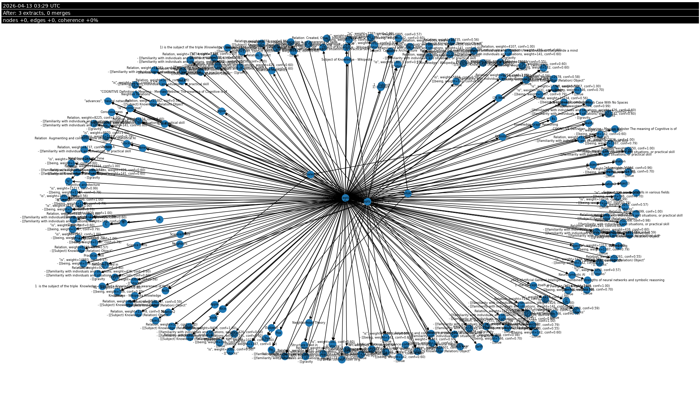](graph-2026-04-13-03-29-extract-subideas.png) [commit](https://github.com/BoggersTheFish/BoggersTheCIG/commit/02b27f2)

### 2026-04-13 03:58 UTC

**After:** vault organize (12 moves) — nodes +0, edges +0, coherence +0%

[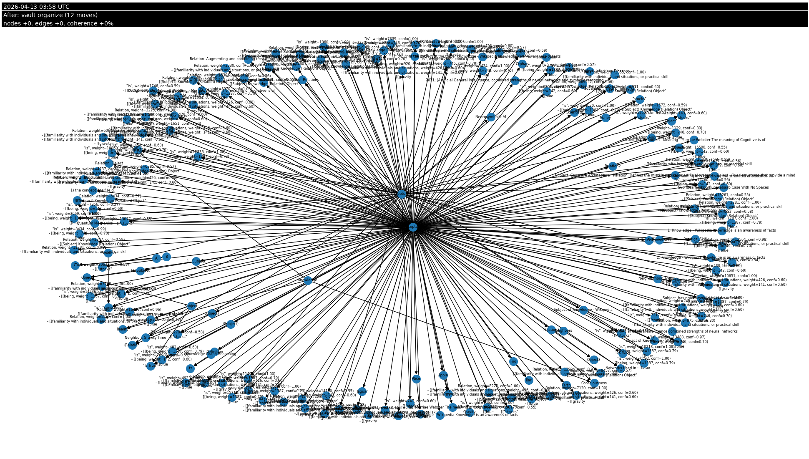](graph-2026-04-13-03-58-after-organize.png) [commit](https://github.com/BoggersTheFish/BoggersTheCIG/commit/02b27f2)

### 2026-04-13 03:59 UTC

**After:** 1 extracts, 3 merges — nodes +0, edges +0, coherence +0%

[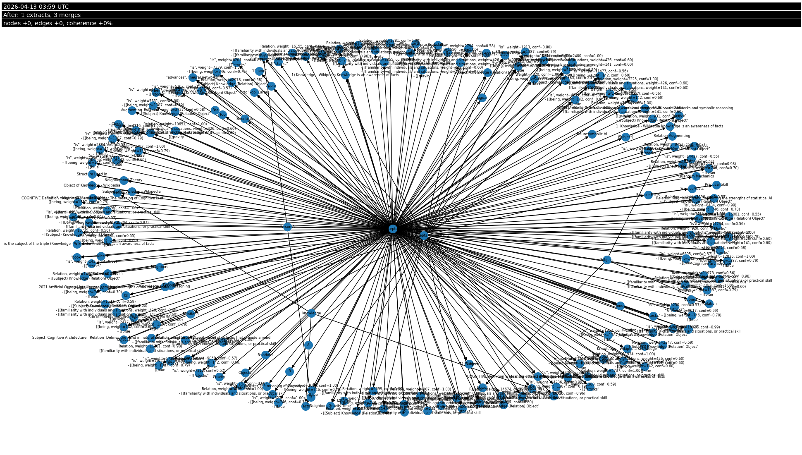](graph-2026-04-13-03-59-extract-subideas.png) [commit](https://github.com/BoggersTheFish/BoggersTheCIG/commit/02b27f2)

### 2026-04-13 03:59 UTC

**After:** +.md"+00.md"+2_+2_.md" — nodes +0, edges +0, coherence +0%

[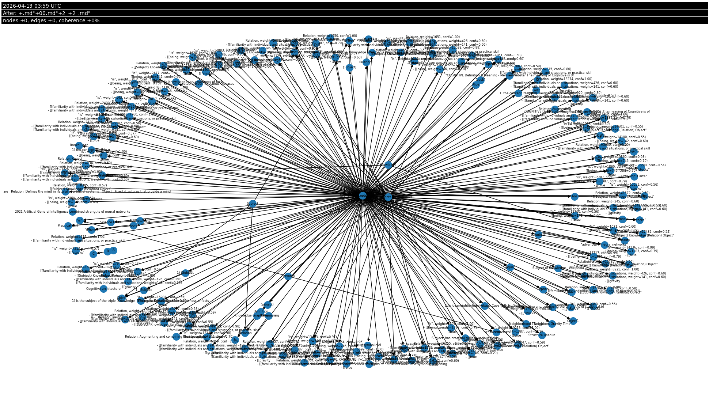](graph-2026-04-13-03-59-self-improve.png) [commit](https://github.com/BoggersTheFish/BoggersTheCIG/commit/02b27f2)

### 2026-04-13 04:26 UTC

**After:** vault organize (9 moves) — nodes +0, edges +0, coherence +0%

[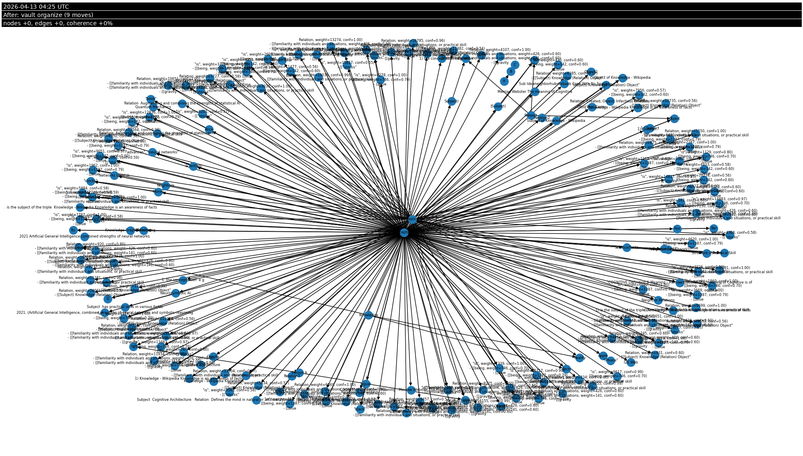](graph-2026-04-13-04-25-after-organize.png) [commit](https://github.com/BoggersTheFish/BoggersTheCIG/commit/02b27f2)

### 2026-04-13 04:26 UTC

**After:** 2 extracts, 2 merges — nodes +0, edges +0, coherence +0%

[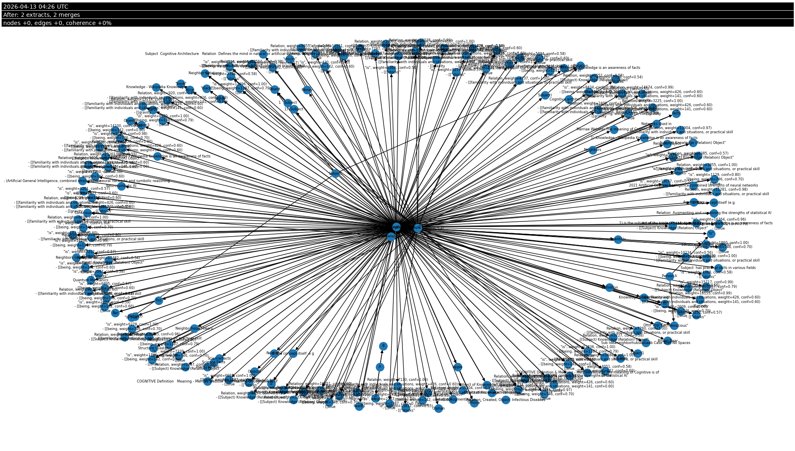](graph-2026-04-13-04-26-extract-subideas.png) [commit](https://github.com/BoggersTheFish/BoggersTheCIG/commit/02b27f2)

### 2026-04-13 04:26 UTC

**After:** +.md"+00.md"+2_+2_.md" — nodes +0, edges +0, coherence +0%

[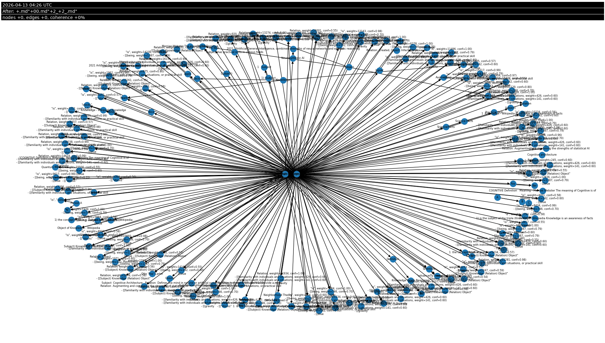](graph-2026-04-13-04-26-self-improve.png) [commit](https://github.com/BoggersTheFish/BoggersTheCIG/commit/02b27f2)

### 2026-04-13 07:48 UTC

**After:** vault organize (7 moves) — nodes +17, edges +17, coherence -3%

[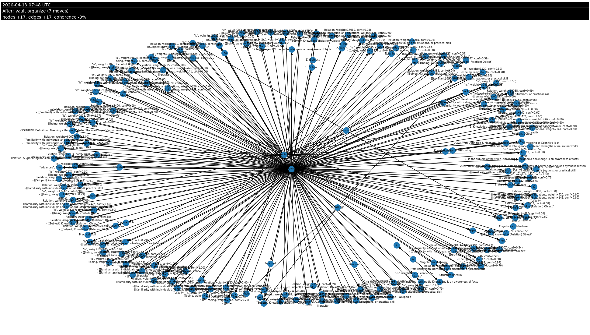](graph-2026-04-13-07-48-after-organize.png) [commit](https://github.com/BoggersTheFish/BoggersTheCIG/commit/86bd240)

### 2026-04-13 07:48 UTC

**After:** 2 extracts, 2 merges — nodes +0, edges +0, coherence +0%

[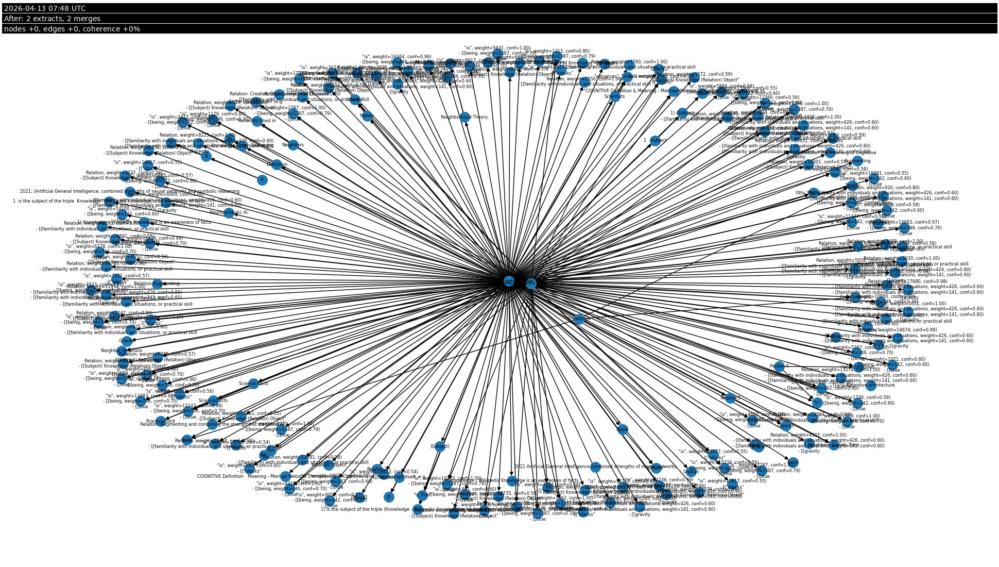](graph-2026-04-13-07-48-extract-subideas.png) [commit](https://github.com/BoggersTheFish/BoggersTheCIG/commit/86bd240)

### 2026-04-13 07:48 UTC

**After:** +.md"+00.md"+2_+2_.md" — nodes +0, edges +0, coherence +0%

[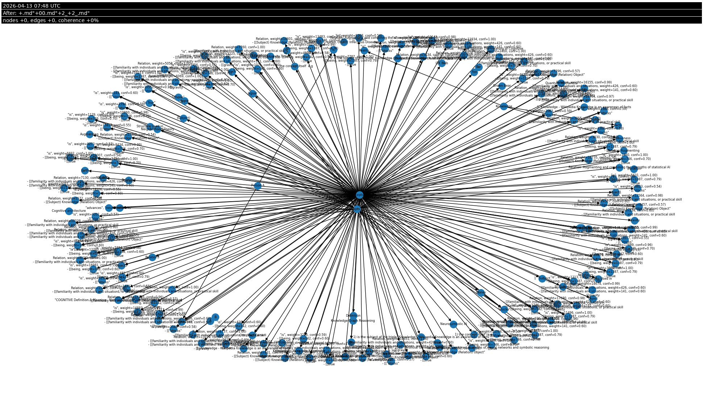](graph-2026-04-13-07-48-self-improve.png) [commit](https://github.com/BoggersTheFish/BoggersTheCIG/commit/86bd240)

### 2026-04-13 08:05 UTC

**After:** vault analysis (+673 triples) — nodes +10, edges +12, coherence -1%

[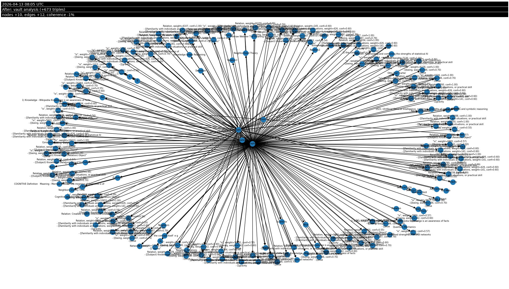](graph-2026-04-13-08-05-after-analyze-vault.png) [commit](https://github.com/BoggersTheFish/BoggersTheCIG/commit/86bd240)

### 2026-04-13 08:06 UTC

**After:** 2 extracts, 0 merges — nodes +0, edges +0, coherence +0%

[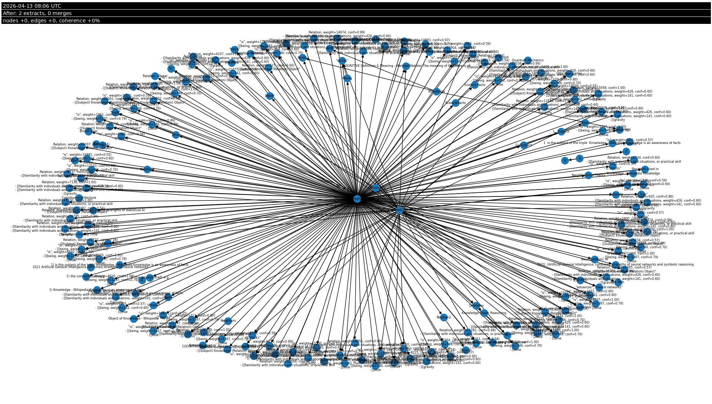](graph-2026-04-13-08-06-extract-subideas.png) [commit](https://github.com/BoggersTheFish/BoggersTheCIG/commit/86bd240)

### 2026-04-13 08:23 UTC

**After:** vault analysis (+673 triples) — nodes +0, edges +2, coherence +0%

[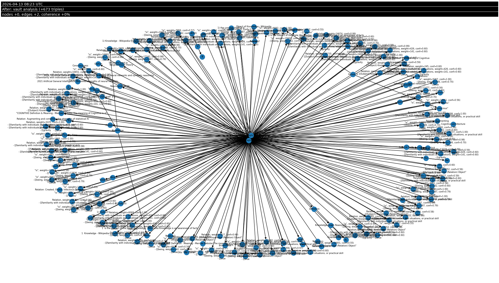](graph-2026-04-13-08-23-after-analyze-vault.png) [commit](https://github.com/BoggersTheFish/BoggersTheCIG/commit/86bd240)

### 2026-04-13 08:23 UTC

**After:** 2 extracts, 0 merges — nodes +0, edges +0, coherence +0%

[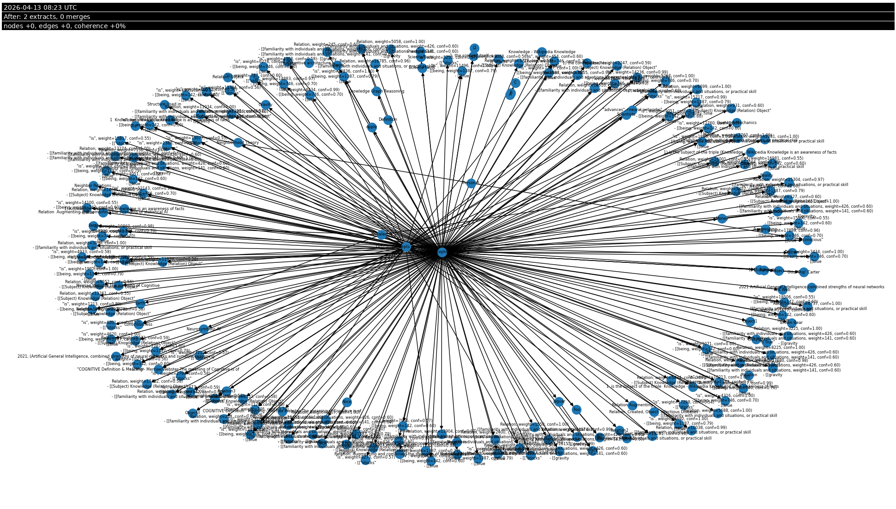](graph-2026-04-13-08-23-extract-subideas.png) [commit](https://github.com/BoggersTheFish/BoggersTheCIG/commit/86bd240)

### 2026-04-13 08:54 UTC

**After:** vault organize (12 moves) — nodes +0, edges +0, coherence +0%

[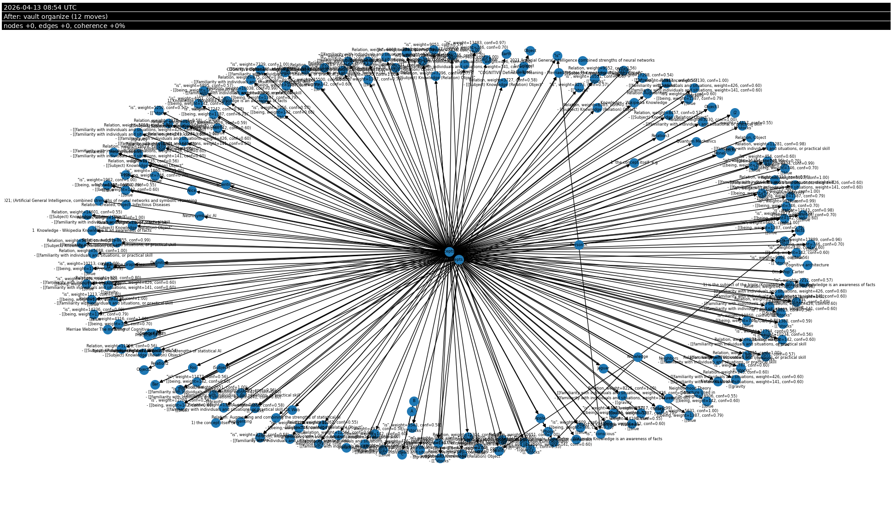](graph-2026-04-13-08-54-after-organize.png) [commit](https://github.com/BoggersTheFish/BoggersTheCIG/commit/86bd240)

### 2026-04-13 08:54 UTC

**After:** 2 extracts, 2 merges — nodes +0, edges +0, coherence +0%

[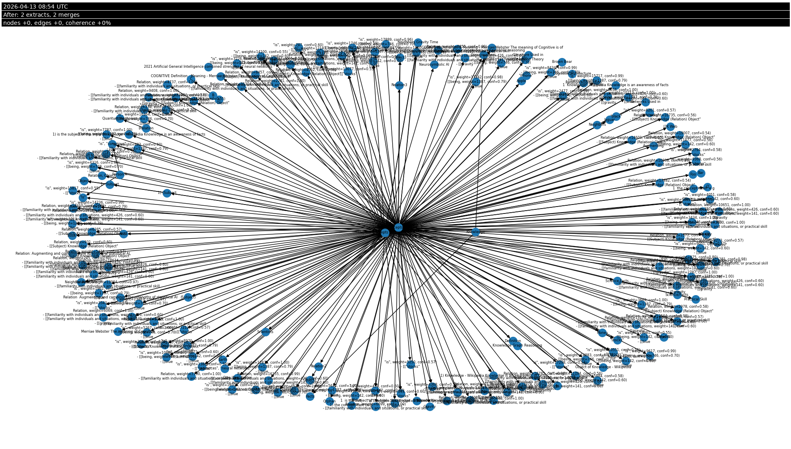](graph-2026-04-13-08-54-extract-subideas.png) [commit](https://github.com/BoggersTheFish/BoggersTheCIG/commit/86bd240)

### 2026-04-13 08:54 UTC

**After:** +.md"+00.md"+1.md"+2_ — nodes +0, edges +0, coherence +0%

[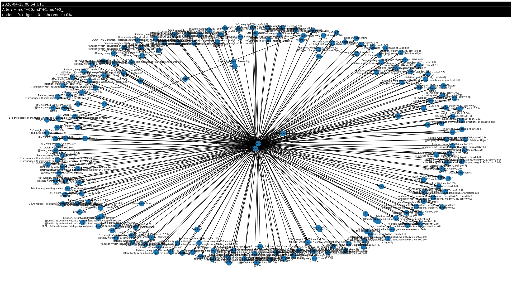](graph-2026-04-13-08-54-self-improve.png) [commit](https://github.com/BoggersTheFish/BoggersTheCIG/commit/86bd240)

### 2026-04-13 09:22 UTC

**After:** vault organize (8 moves) — nodes +0, edges +0, coherence +0%

[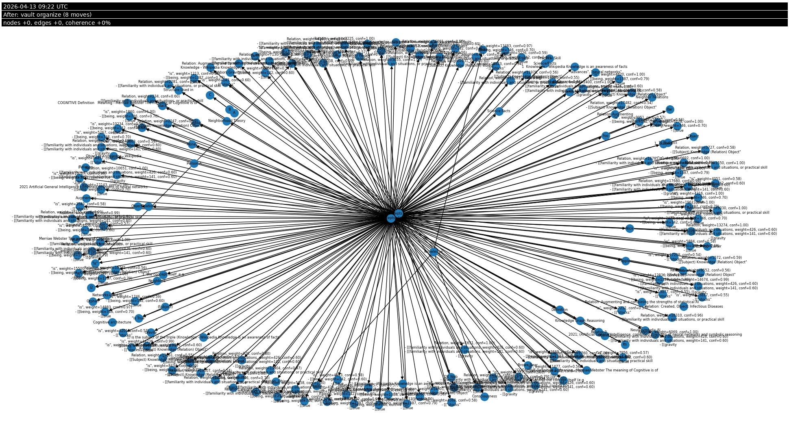](graph-2026-04-13-09-22-after-organize.png) [commit](https://github.com/BoggersTheFish/BoggersTheCIG/commit/86bd240)

### 2026-04-13 09:22 UTC

**After:** 2 extracts, 2 merges — nodes +0, edges +0, coherence +0%

[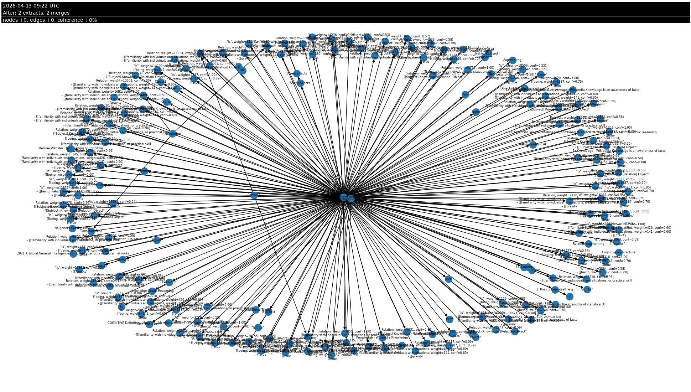](graph-2026-04-13-09-22-extract-subideas.png) [commit](https://github.com/BoggersTheFish/BoggersTheCIG/commit/86bd240)

### 2026-04-13 09:22 UTC

**After:** +.md"+00.md"+1.md"+2_ — nodes +0, edges +0, coherence +0%

[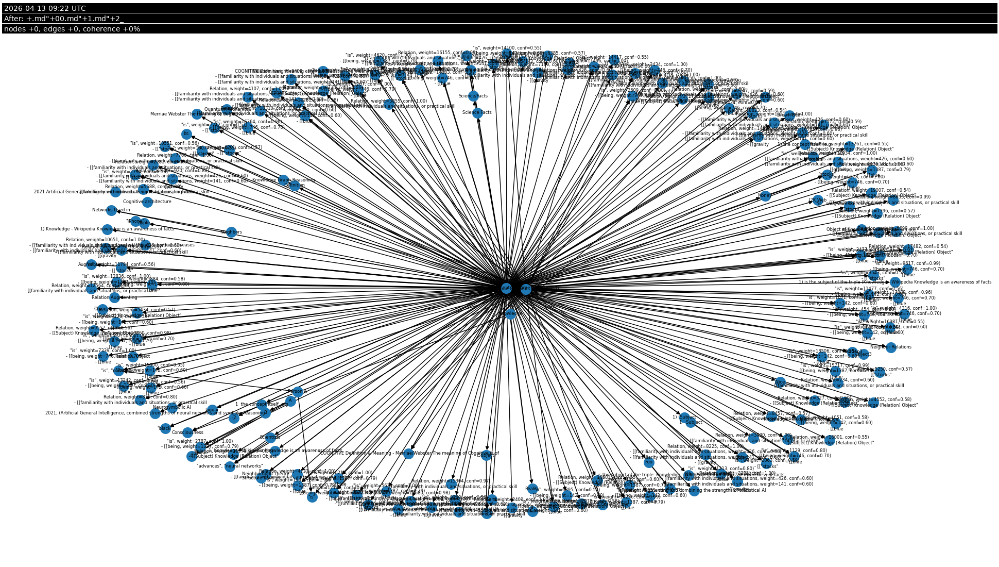](graph-2026-04-13-09-22-self-improve.png) [commit](https://github.com/BoggersTheFish/BoggersTheCIG/commit/86bd240)

### 2026-04-13 11:52 UTC

**After:** vault organize (11 moves) — nodes +17, edges +17, coherence -3%

[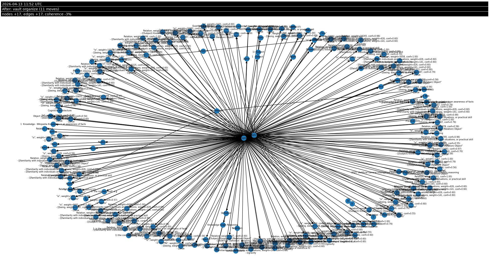](graph-2026-04-13-11-52-after-organize.png) [commit](https://github.com/BoggersTheFish/BoggersTheCIG/commit/255020e)

### 2026-04-13 11:52 UTC

**After:** 0 extracts, 4 merges — nodes +0, edges +0, coherence +0%

[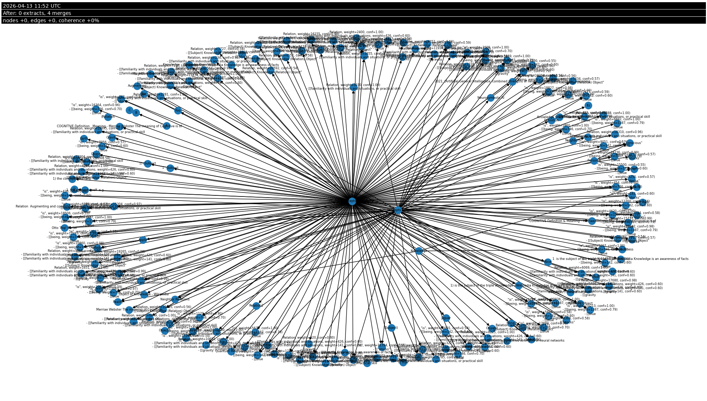](graph-2026-04-13-11-52-extract-subideas.png) [commit](https://github.com/BoggersTheFish/BoggersTheCIG/commit/255020e)

### 2026-04-13 11:53 UTC

**After:** .md"+2_+2_.md"+60.md"+A.md" — nodes +0, edges +0, coherence +0%

[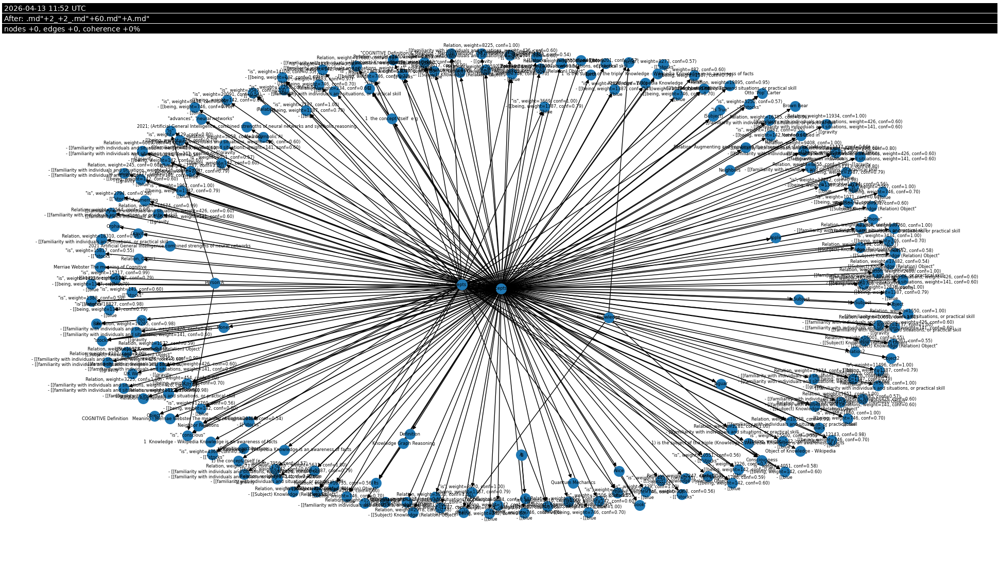](graph-2026-04-13-11-52-self-improve.png) [commit](https://github.com/BoggersTheFish/BoggersTheCIG/commit/255020e)

### 2026-04-13 12:11 UTC

**After:** vault analysis (+707 triples) — nodes +8, edges +9, coherence -1%

[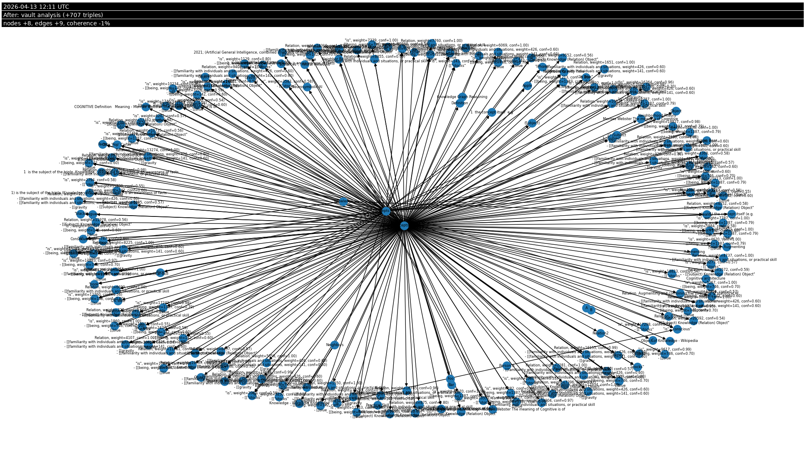](graph-2026-04-13-12-11-after-analyze-vault.png) [commit](https://github.com/BoggersTheFish/BoggersTheCIG/commit/255020e)

### 2026-04-13 12:11 UTC

**After:** 2 extracts, 0 merges — nodes +0, edges +0, coherence +0%

[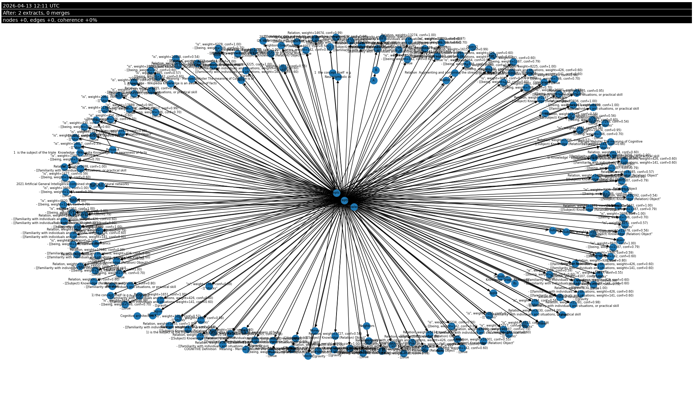](graph-2026-04-13-12-11-extract-subideas.png) [commit](https://github.com/BoggersTheFish/BoggersTheCIG/commit/255020e)

### 2026-04-13 12:29 UTC

**After:** vault analysis (+709 triples) — nodes +0, edges +2, coherence +0%

[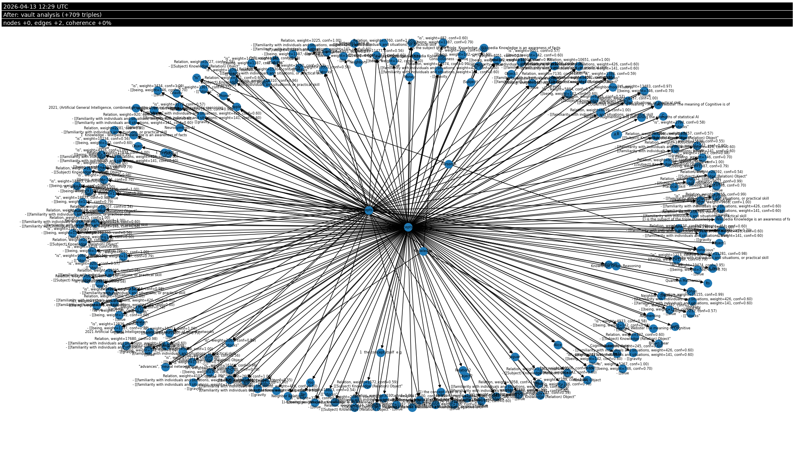](graph-2026-04-13-12-29-after-analyze-vault.png) [commit](https://github.com/BoggersTheFish/BoggersTheCIG/commit/255020e)

### 2026-04-13 12:29 UTC

**After:** 2 extracts, 0 merges — nodes +0, edges +0, coherence +0%

[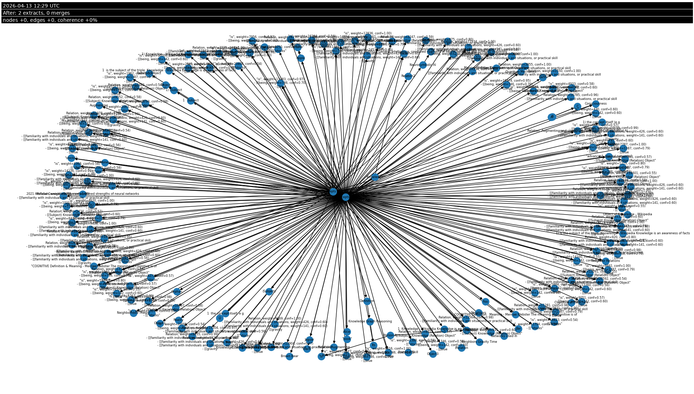](graph-2026-04-13-12-29-extract-subideas.png) [commit](https://github.com/BoggersTheFish/BoggersTheCIG/commit/255020e)

### 2026-04-13 13:02 UTC

**After:** vault organize (11 moves) — nodes +0, edges +0, coherence +0%

[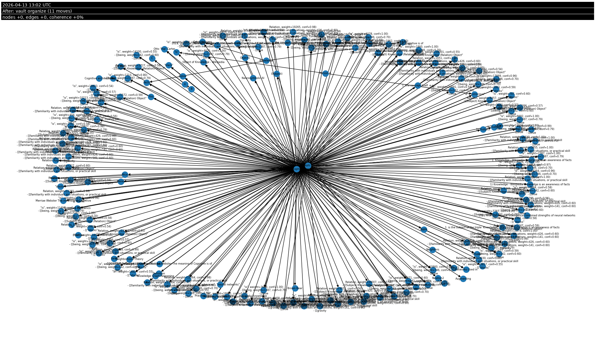](graph-2026-04-13-13-02-after-organize.png) [commit](https://github.com/BoggersTheFish/BoggersTheCIG/commit/255020e)

### 2026-04-13 13:03 UTC

**After:** 2 extracts, 2 merges — nodes +0, edges +0, coherence +0%

[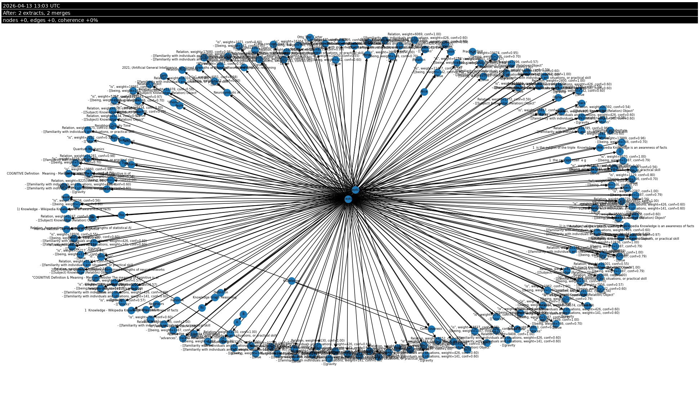](graph-2026-04-13-13-03-extract-subideas.png) [commit](https://github.com/BoggersTheFish/BoggersTheCIG/commit/255020e)

### 2026-04-13 13:03 UTC

**After:** +.md"+00.md"+2_+2_.md" — nodes +0, edges +0, coherence +0%

[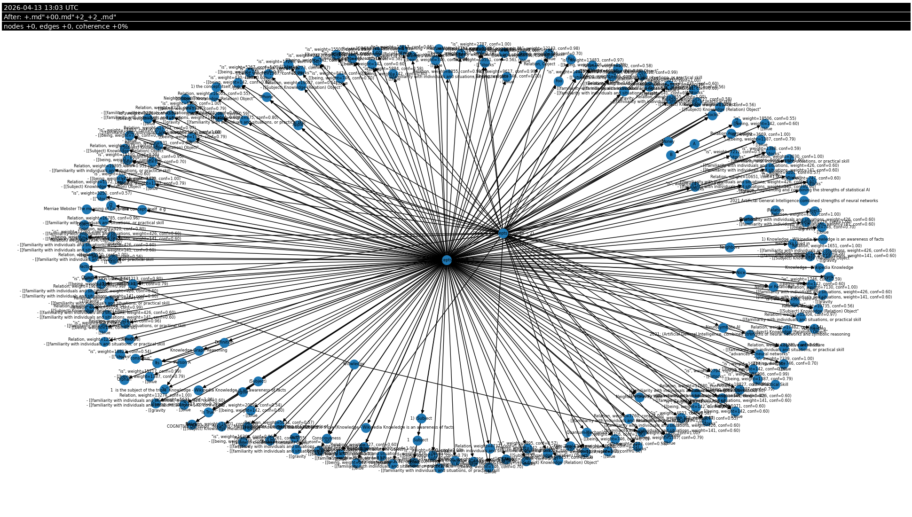](graph-2026-04-13-13-03-self-improve.png) [commit](https://github.com/BoggersTheFish/BoggersTheCIG/commit/255020e)

### 2026-04-13 13:33 UTC

**After:** vault organize (12 moves) — nodes +0, edges +0, coherence +0%

[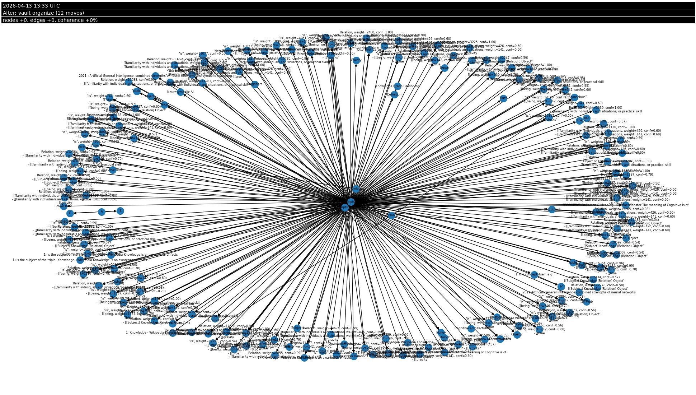](graph-2026-04-13-13-33-after-organize.png) [commit](https://github.com/BoggersTheFish/BoggersTheCIG/commit/255020e)

### 2026-04-13 13:33 UTC

**After:** 2 extracts, 2 merges — nodes +0, edges +0, coherence +0%

[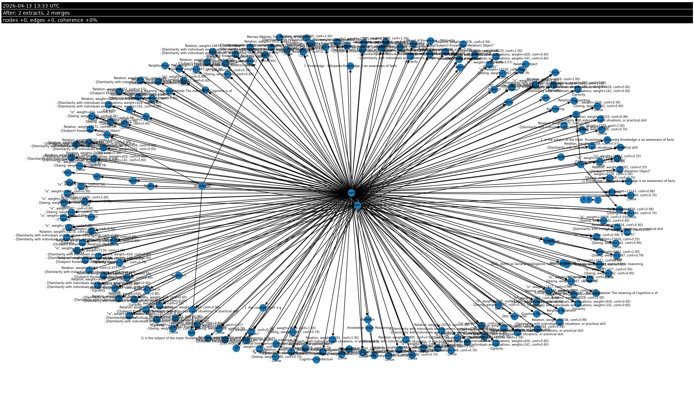](graph-2026-04-13-13-33-extract-subideas.png) [commit](https://github.com/BoggersTheFish/BoggersTheCIG/commit/255020e)

### 2026-04-13 13:33 UTC

**After:** +.md"+00.md"+2_+2_.md" — nodes +0, edges +0, coherence +0%

[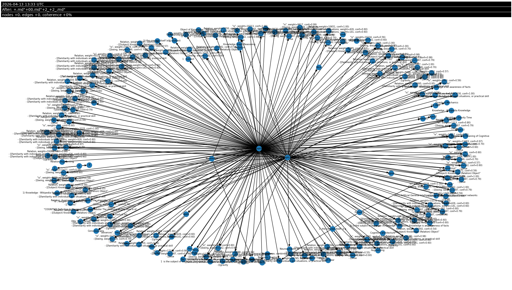](graph-2026-04-13-13-33-self-improve.png) [commit](https://github.com/BoggersTheFish/BoggersTheCIG/commit/255020e)

### 2026-04-13 16:46 UTC

**After:** vault organize (16 moves) — nodes +17, edges +17, coherence -3%

[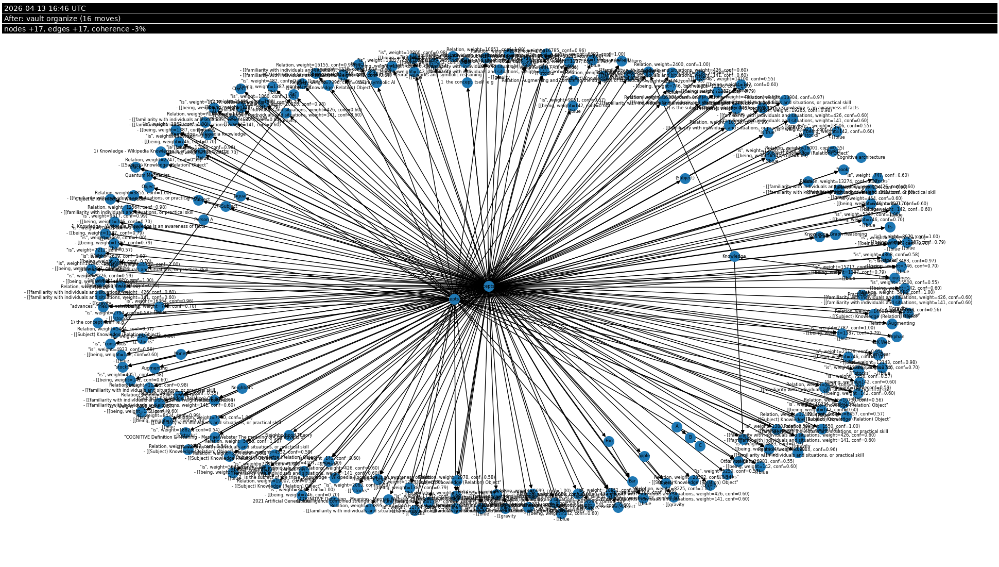](graph-2026-04-13-16-46-after-organize.png) [commit](https://github.com/BoggersTheFish/BoggersTheCIG/commit/5293e62)

### 2026-04-13 16:46 UTC

**After:** 2 extracts, 2 merges — nodes +0, edges +0, coherence +0%

[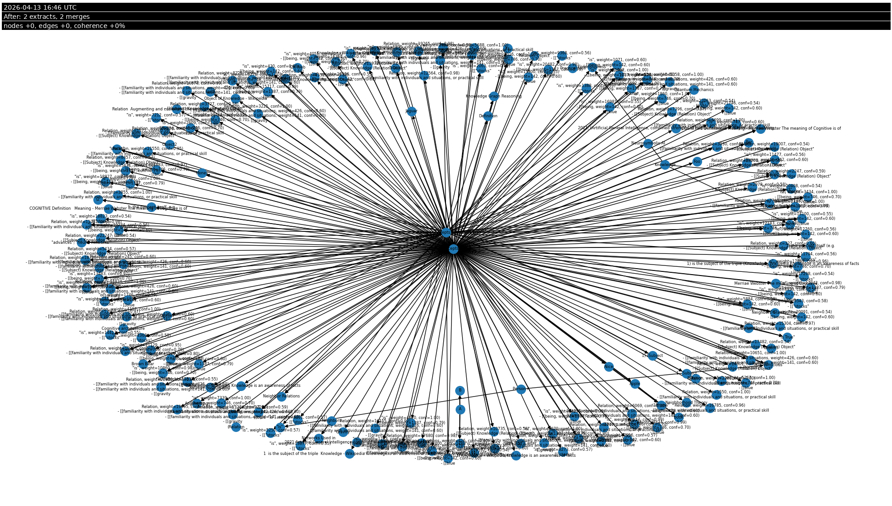](graph-2026-04-13-16-46-extract-subideas.png) [commit](https://github.com/BoggersTheFish/BoggersTheCIG/commit/5293e62)

### 2026-04-13 16:46 UTC

**After:** +.md"+00.md"+2_+2_.md" — nodes +0, edges +0, coherence +0%

[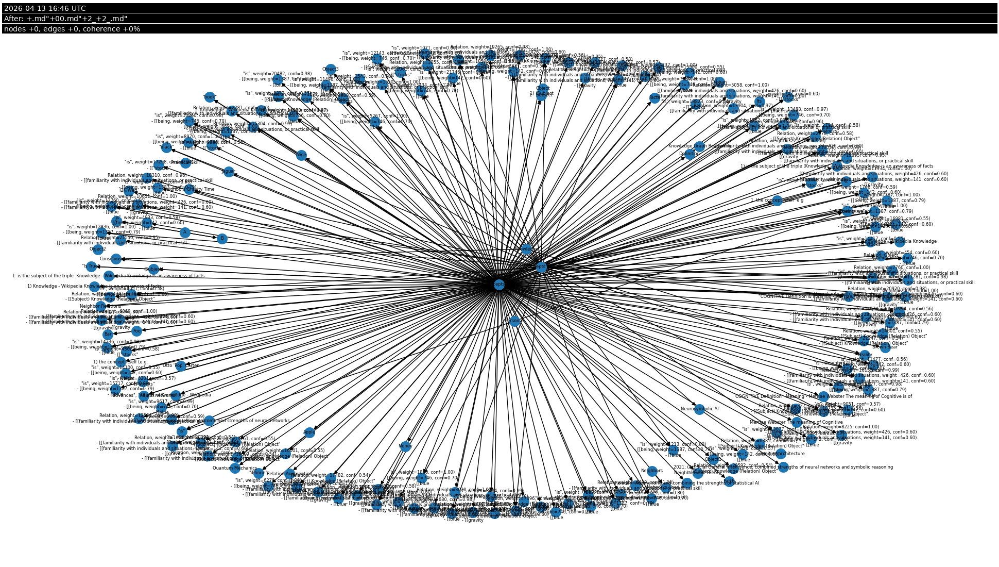](graph-2026-04-13-16-46-self-improve.png) [commit](https://github.com/BoggersTheFish/BoggersTheCIG/commit/5293e62)

### 2026-04-13 16:47 UTC

**After:** external ingest (+1 triples) — nodes +2, edges +1, coherence +0%

[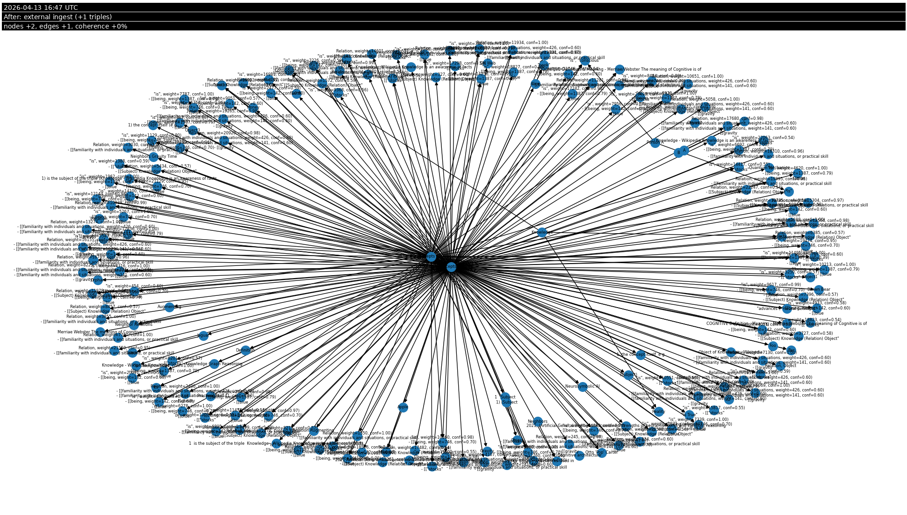](graph-2026-04-13-16-47-after-ingest.png) [commit](https://github.com/BoggersTheFish/BoggersTheCIG/commit/5293e62)

### 2026-04-13 17:02 UTC

**After:** vault analysis (+733 triples) — nodes +4, edges +7, coherence +0%

[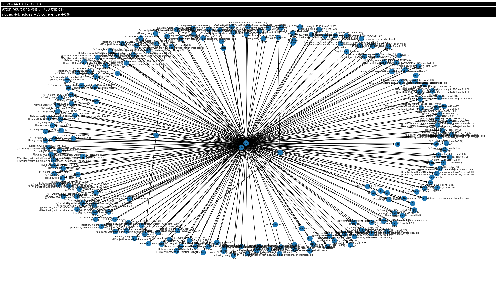](graph-2026-04-13-17-02-after-analyze-vault.png) [commit](https://github.com/BoggersTheFish/BoggersTheCIG/commit/5293e62)

### 2026-04-13 17:02 UTC

**After:** 3 extracts, 0 merges — nodes +0, edges +0, coherence +0%

[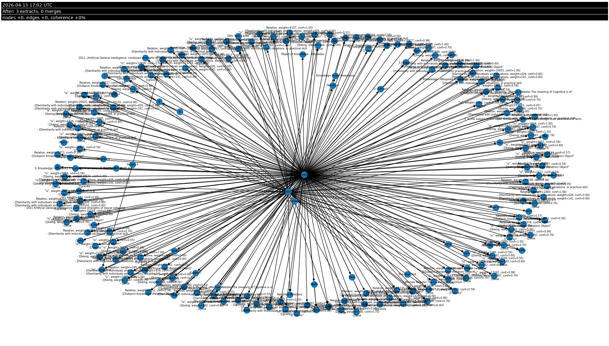](graph-2026-04-13-17-02-extract-subideas.png) [commit](https://github.com/BoggersTheFish/BoggersTheCIG/commit/5293e62)

### 2026-04-13 17:17 UTC

**After:** vault analysis (+732 triples) — nodes +0, edges +3, coherence +0%

[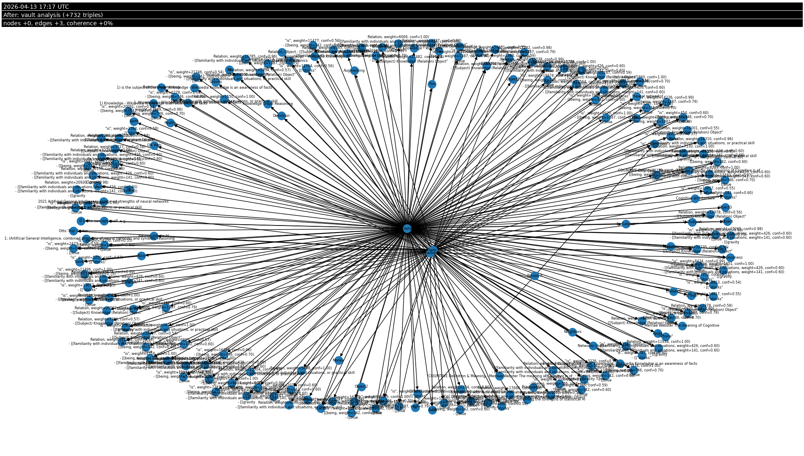](graph-2026-04-13-17-17-after-analyze-vault.png) [commit](https://github.com/BoggersTheFish/BoggersTheCIG/commit/5293e62)

### 2026-04-13 17:17 UTC

**After:** 3 extracts, 0 merges — nodes +0, edges +0, coherence +0%

[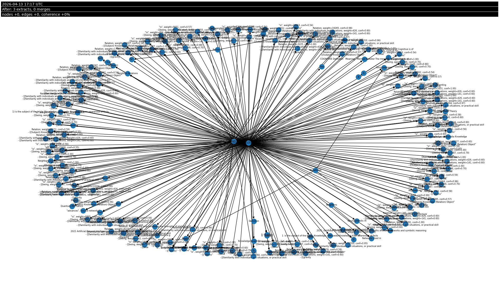](graph-2026-04-13-17-17-extract-subideas.png) [commit](https://github.com/BoggersTheFish/BoggersTheCIG/commit/5293e62)

### 2026-04-13 17:49 UTC

**After:** vault organize (9 moves) — nodes +0, edges +0, coherence +0%

[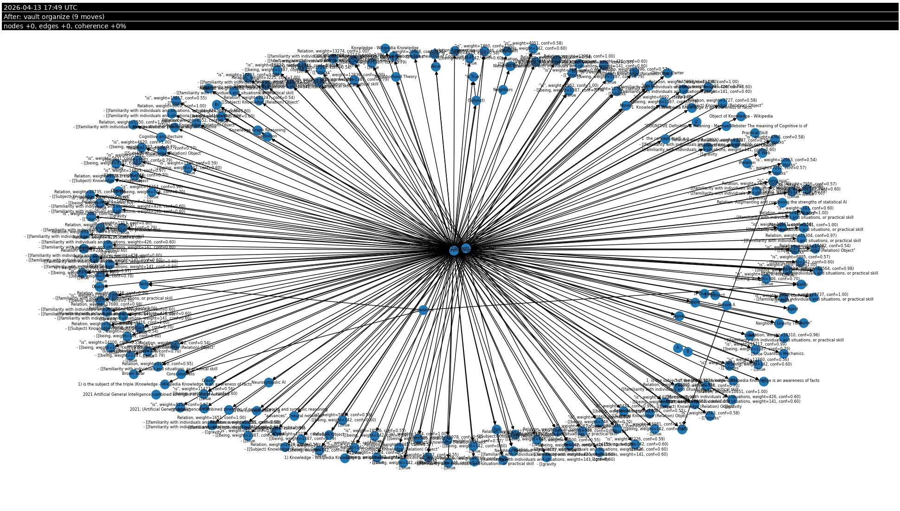](graph-2026-04-13-17-49-after-organize.png) [commit](https://github.com/BoggersTheFish/BoggersTheCIG/commit/5293e62)

### 2026-04-13 17:49 UTC

**After:** 1 extracts, 3 merges — nodes +0, edges +0, coherence +0%

[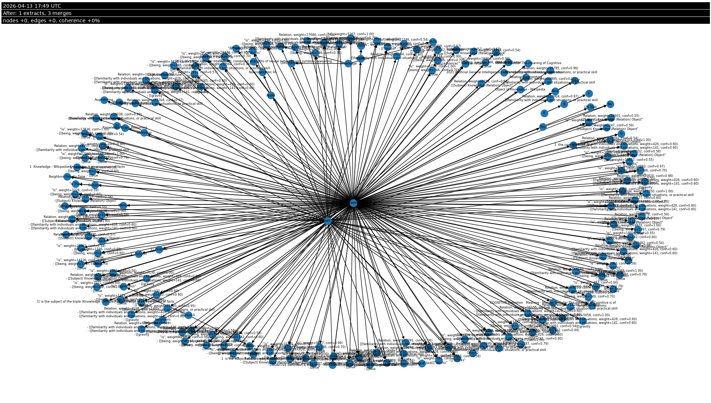](graph-2026-04-13-17-49-extract-subideas.png) [commit](https://github.com/BoggersTheFish/BoggersTheCIG/commit/5293e62)

### 2026-04-13 17:49 UTC

**After:** +.md"+00.md"+2_+2_.md" — nodes +0, edges +0, coherence +0%

[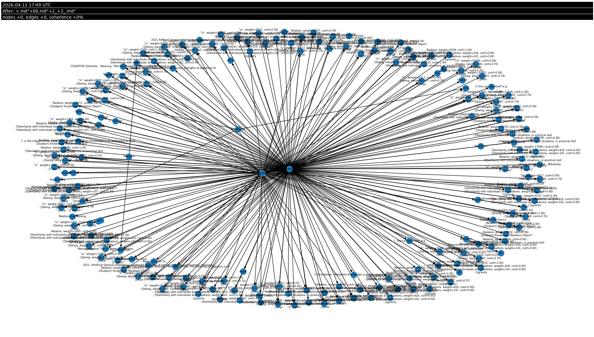](graph-2026-04-13-17-49-self-improve.png) [commit](https://github.com/BoggersTheFish/BoggersTheCIG/commit/5293e62)

### 2026-04-13 18:19 UTC

**After:** vault organize (8 moves) — nodes +0, edges +0, coherence +0%

[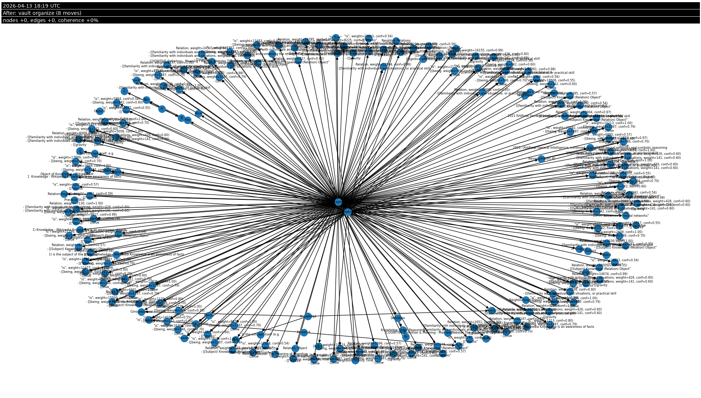](graph-2026-04-13-18-19-after-organize.png) [commit](https://github.com/BoggersTheFish/BoggersTheCIG/commit/5293e62)

### 2026-04-13 18:20 UTC

**After:** 1 extracts, 3 merges — nodes +0, edges +0, coherence +0%

[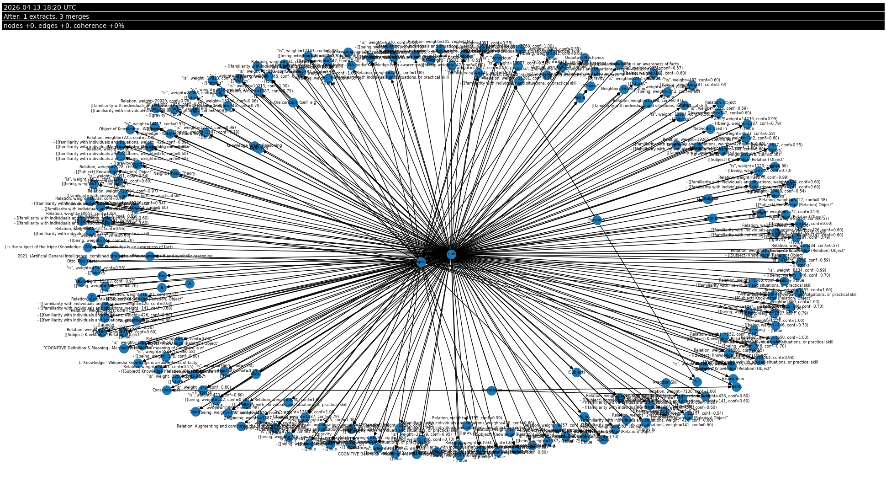](graph-2026-04-13-18-20-extract-subideas.png) [commit](https://github.com/BoggersTheFish/BoggersTheCIG/commit/5293e62)

### 2026-04-13 18:20 UTC

**After:** +.md"+00.md"+2_+2_.md" — nodes +0, edges +0, coherence +0%

[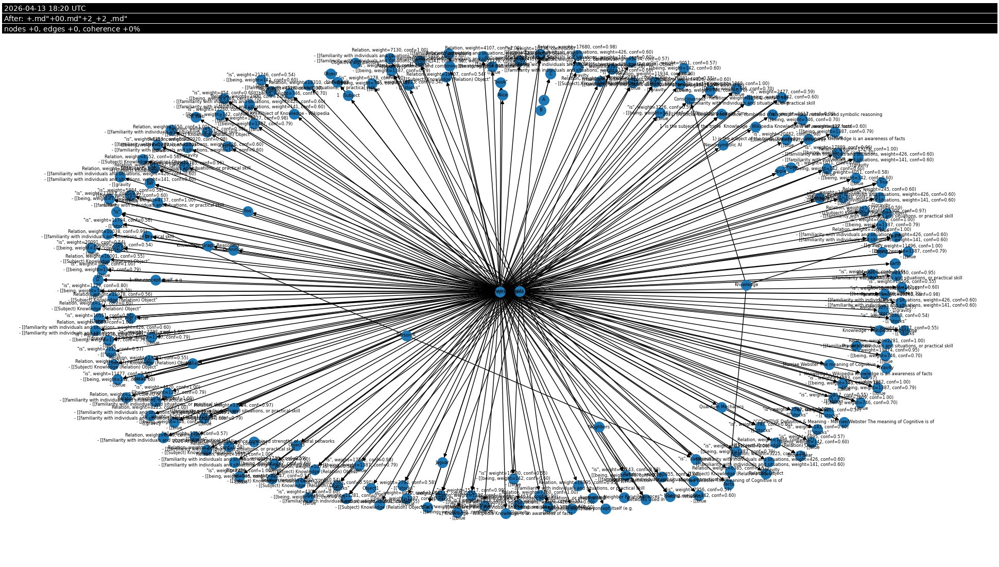](graph-2026-04-13-18-20-self-improve.png) [commit](https://github.com/BoggersTheFish/BoggersTheCIG/commit/5293e62)

### 2026-04-13 21:31 UTC

**After:** vault organize (13 moves) — nodes +17, edges +17, coherence -3%

[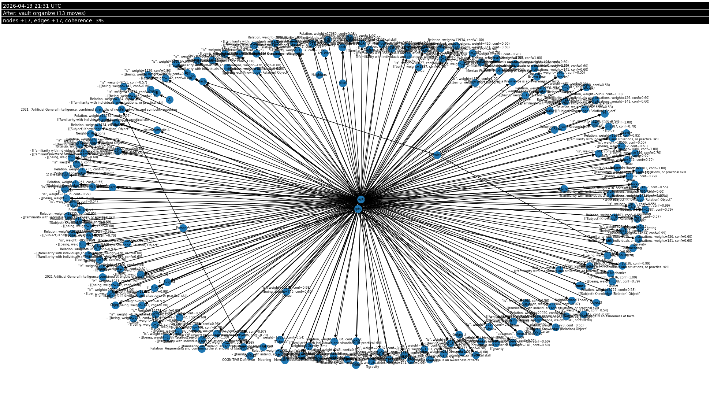](graph-2026-04-13-21-31-after-organize.png) [commit](https://github.com/BoggersTheFish/BoggersTheCIG/commit/ab2dbb5)

### 2026-04-13 21:31 UTC

**After:** 1 extracts, 3 merges — nodes +0, edges +0, coherence +0%

[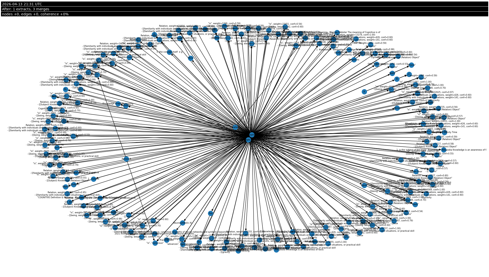](graph-2026-04-13-21-31-extract-subideas.png) [commit](https://github.com/BoggersTheFish/BoggersTheCIG/commit/ab2dbb5)

### 2026-04-13 21:31 UTC

**After:** .md"+2_+2_.md"+A.md"+AI.md" — nodes +0, edges +0, coherence +0%

[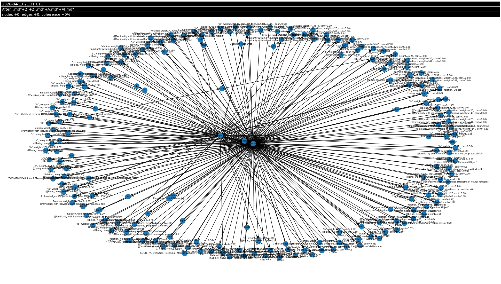](graph-2026-04-13-21-31-self-improve.png) [commit](https://github.com/BoggersTheFish/BoggersTheCIG/commit/ab2dbb5)

### 2026-04-13 21:32 UTC

**After:** external ingest (+1 triples) — nodes +1, edges +1, coherence +0%

[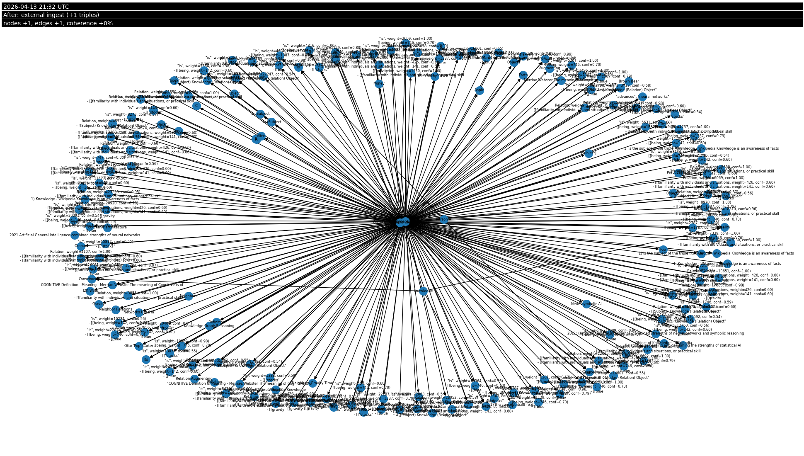](graph-2026-04-13-21-32-after-ingest.png) [commit](https://github.com/BoggersTheFish/BoggersTheCIG/commit/ab2dbb5)

### 2026-04-13 21:47 UTC

**After:** vault analysis (+776 triples) — nodes +7, edges +9, coherence -1%

[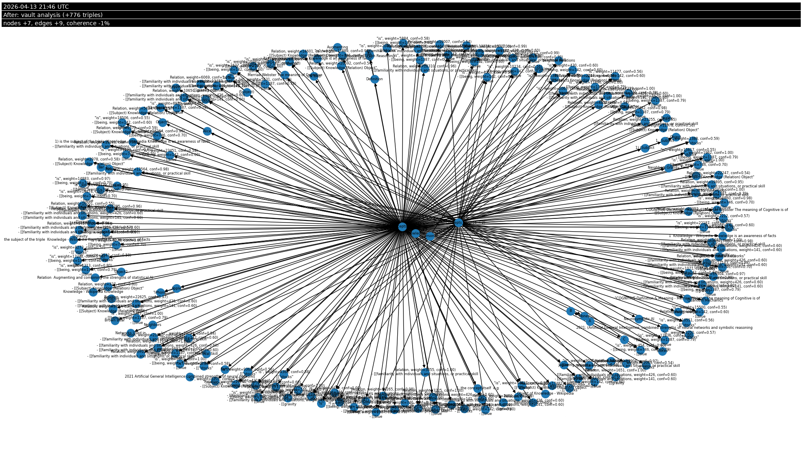](graph-2026-04-13-21-46-after-analyze-vault.png) [commit](https://github.com/BoggersTheFish/BoggersTheCIG/commit/ab2dbb5)

### 2026-04-13 21:47 UTC

**After:** 2 extracts, 0 merges — nodes +0, edges +0, coherence +0%

[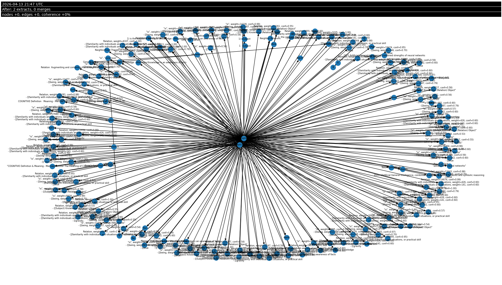](graph-2026-04-13-21-47-extract-subideas.png) [commit](https://github.com/BoggersTheFish/BoggersTheCIG/commit/ab2dbb5)

### 2026-04-13 22:01 UTC

**After:** vault analysis (+774 triples) — nodes +0, edges +2, coherence +0%

[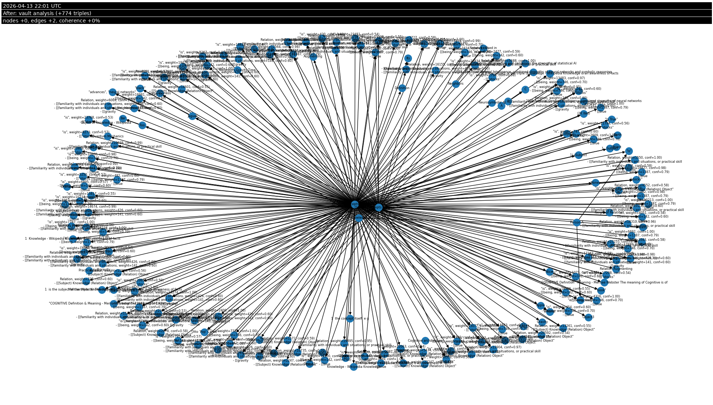](graph-2026-04-13-22-01-after-analyze-vault.png) [commit](https://github.com/BoggersTheFish/BoggersTheCIG/commit/ab2dbb5)

### 2026-04-13 22:01 UTC

**After:** 2 extracts, 0 merges — nodes +0, edges +0, coherence +0%

[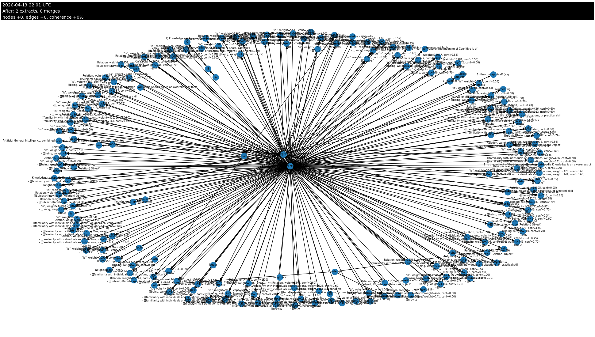](graph-2026-04-13-22-01-extract-subideas.png) [commit](https://github.com/BoggersTheFish/BoggersTheCIG/commit/ab2dbb5)

### 2026-04-13 22:36 UTC

**After:** vault organize (4 moves) — nodes +0, edges +0, coherence +0%

[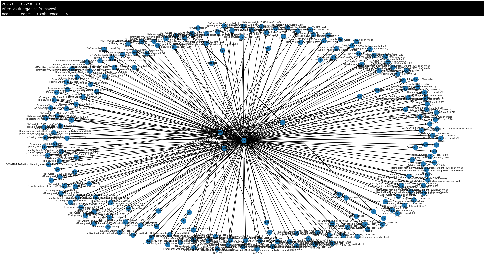](graph-2026-04-13-22-36-after-organize.png) [commit](https://github.com/BoggersTheFish/BoggersTheCIG/commit/ab2dbb5)

### 2026-04-13 22:37 UTC

**After:** 2 extracts, 2 merges — nodes +0, edges +0, coherence +0%

[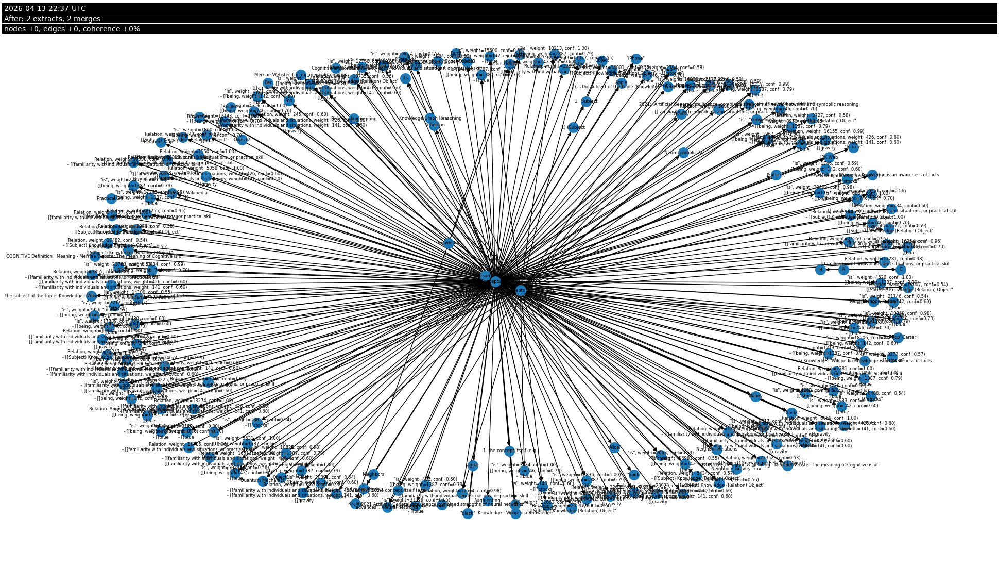](graph-2026-04-13-22-37-extract-subideas.png) [commit](https://github.com/BoggersTheFish/BoggersTheCIG/commit/ab2dbb5)

### 2026-04-13 22:37 UTC

**After:** +.md"+2_+2_.md"+A.md" — nodes +0, edges +0, coherence +0%

[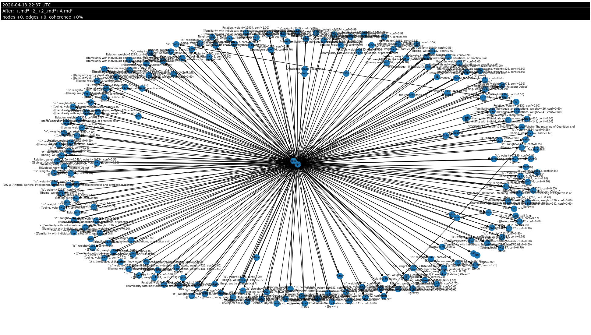](graph-2026-04-13-22-37-self-improve.png) [commit](https://github.com/BoggersTheFish/BoggersTheCIG/commit/ab2dbb5)

### 2026-04-13 23:09 UTC

**After:** vault organize (12 moves) — nodes +0, edges +0, coherence +0%

[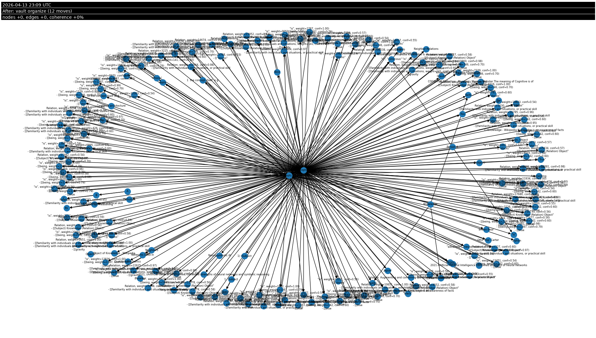](graph-2026-04-13-23-09-after-organize.png) [commit](https://github.com/BoggersTheFish/BoggersTheCIG/commit/ab2dbb5)

### 2026-04-13 23:10 UTC

**After:** 0 extracts, 4 merges — nodes +0, edges +0, coherence +0%

[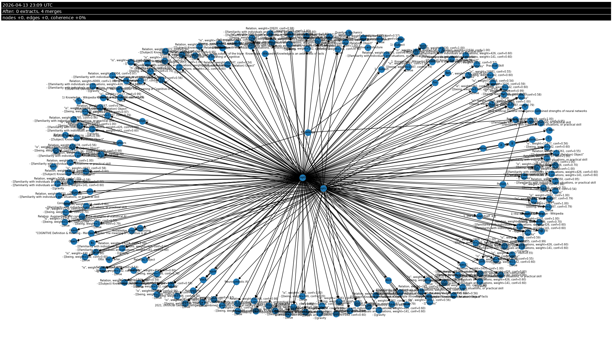](graph-2026-04-13-23-09-extract-subideas.png) [commit](https://github.com/BoggersTheFish/BoggersTheCIG/commit/ab2dbb5)

### 2026-04-13 23:10 UTC

**After:** +.md"+2_+2_.md"+A.md" — nodes +0, edges +0, coherence +0%

[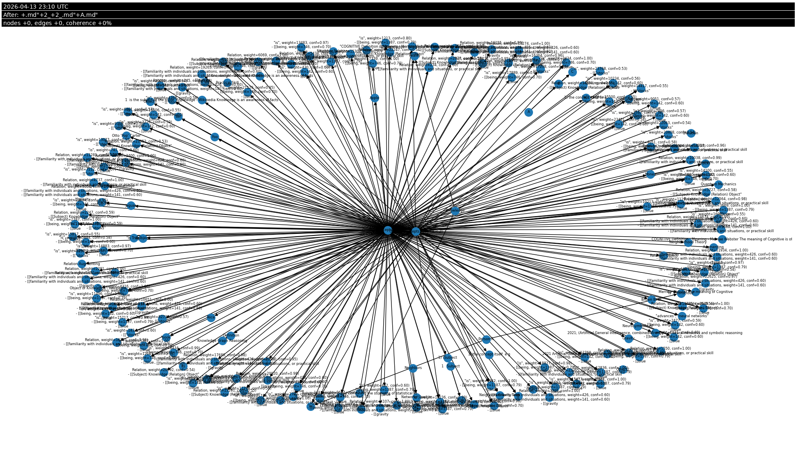](graph-2026-04-13-23-10-self-improve.png) [commit](https://github.com/BoggersTheFish/BoggersTheCIG/commit/ab2dbb5)

### 2026-04-14 03:05 UTC

**After:** vault organize (8 moves) — nodes +17, edges +17, coherence -3%

[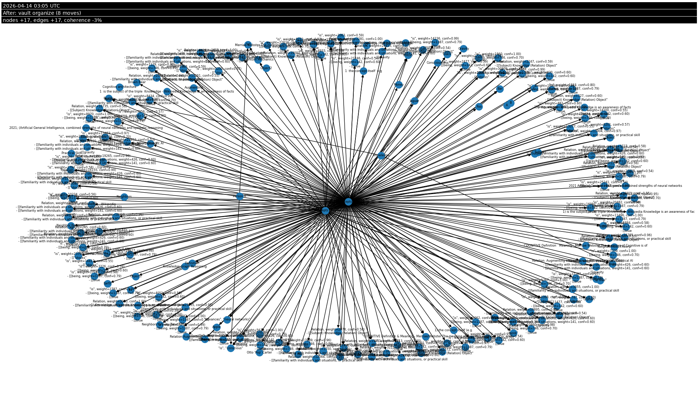](graph-2026-04-14-03-05-after-organize.png) [commit](https://github.com/BoggersTheFish/BoggersTheCIG/commit/26ad0fc)

### 2026-04-14 03:06 UTC

**After:** 2 extracts, 2 merges — nodes +0, edges +0, coherence +0%

[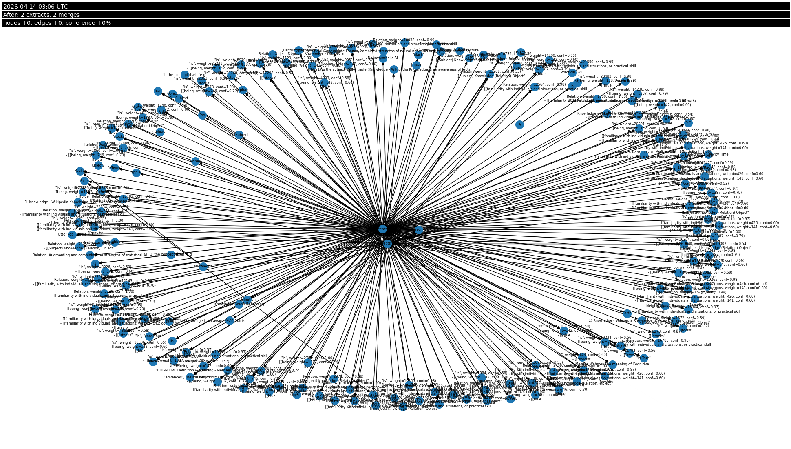](graph-2026-04-14-03-06-extract-subideas.png) [commit](https://github.com/BoggersTheFish/BoggersTheCIG/commit/26ad0fc)

### 2026-04-14 03:06 UTC

**After:** +.md"+2_.md"+A.md"+AI.md" — nodes +0, edges +0, coherence +0%

[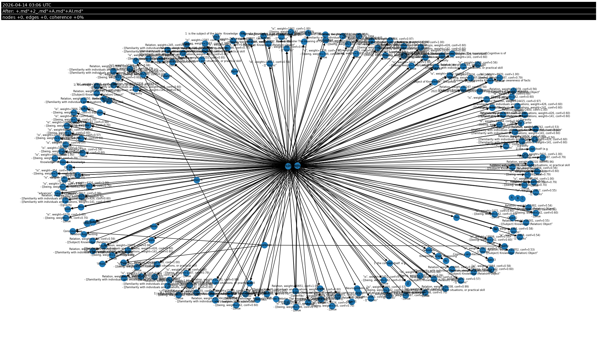](graph-2026-04-14-03-06-self-improve.png) [commit](https://github.com/BoggersTheFish/BoggersTheCIG/commit/26ad0fc)

### 2026-04-14 03:25 UTC

**After:** vault analysis (+805 triples) — nodes +7, edges +9, coherence -1%

[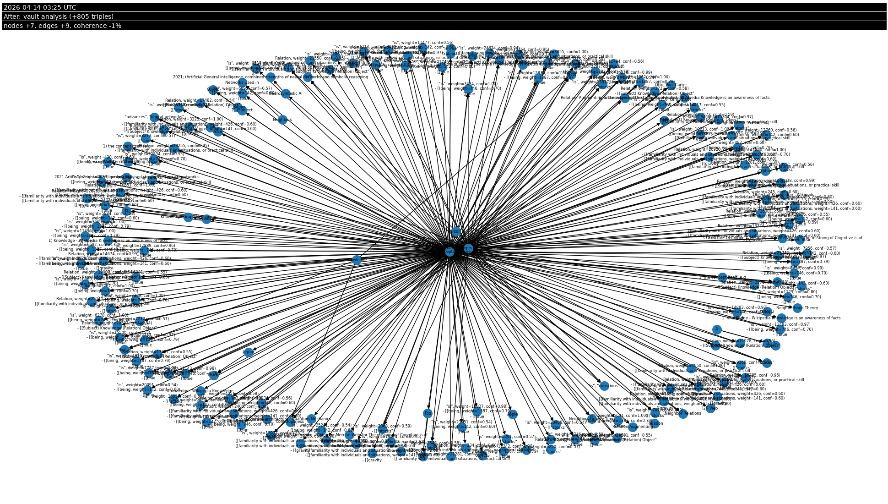](graph-2026-04-14-03-25-after-analyze-vault.png) [commit](https://github.com/BoggersTheFish/BoggersTheCIG/commit/26ad0fc)

### 2026-04-14 03:25 UTC

**After:** 2 extracts, 0 merges — nodes +0, edges +0, coherence +0%

[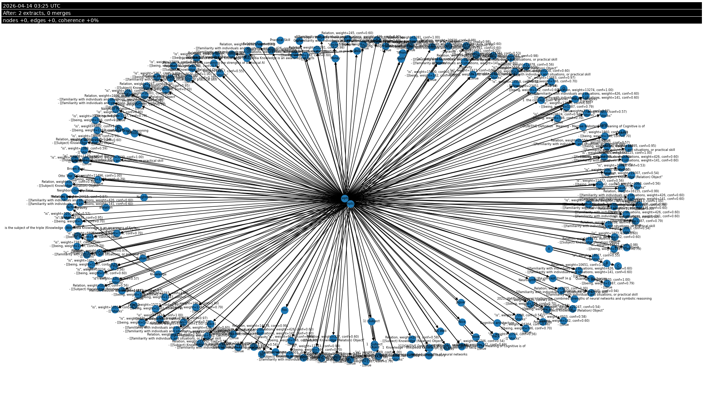](graph-2026-04-14-03-25-extract-subideas.png) [commit](https://github.com/BoggersTheFish/BoggersTheCIG/commit/26ad0fc)

### 2026-04-14 03:44 UTC

**After:** vault analysis (+805 triples) — nodes +0, edges +2, coherence +0%

[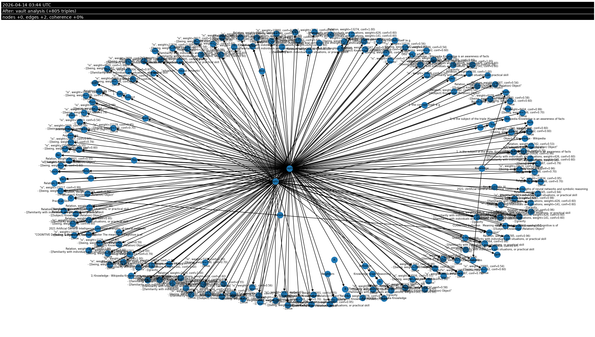](graph-2026-04-14-03-44-after-analyze-vault.png) [commit](https://github.com/BoggersTheFish/BoggersTheCIG/commit/26ad0fc)

### 2026-04-14 03:44 UTC

**After:** 2 extracts, 0 merges — nodes +0, edges +0, coherence +0%

[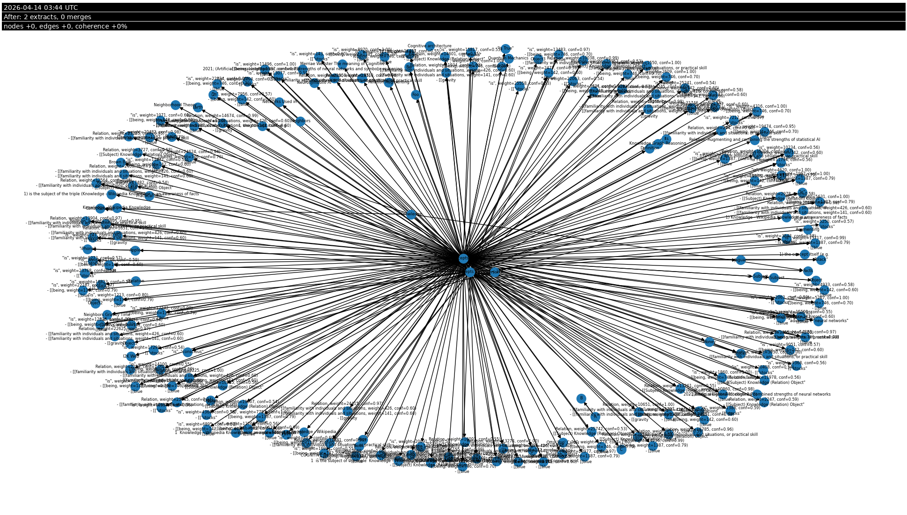](graph-2026-04-14-03-44-extract-subideas.png) [commit](https://github.com/BoggersTheFish/BoggersTheCIG/commit/26ad0fc)

### 2026-04-14 04:18 UTC

**After:** vault organize (10 moves) — nodes +0, edges +0, coherence +0%

[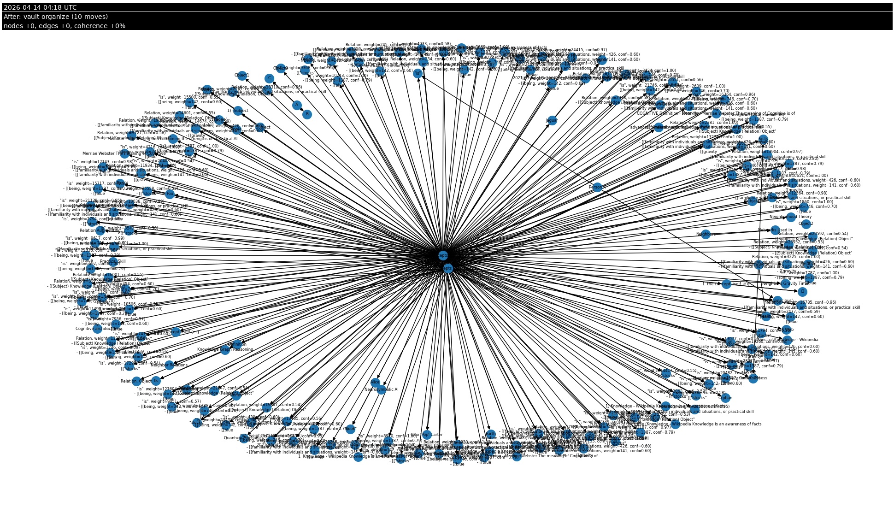](graph-2026-04-14-04-18-after-organize.png) [commit](https://github.com/BoggersTheFish/BoggersTheCIG/commit/26ad0fc)

### 2026-04-14 04:18 UTC

**After:** 3 extracts, 1 merges — nodes +0, edges +0, coherence +0%

[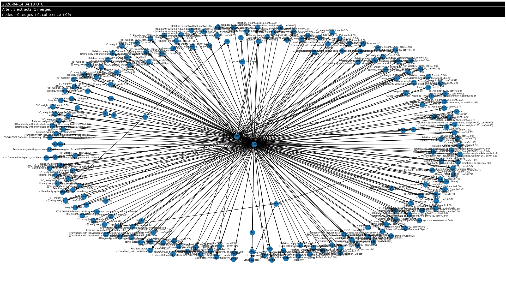](graph-2026-04-14-04-18-extract-subideas.png) [commit](https://github.com/BoggersTheFish/BoggersTheCIG/commit/26ad0fc)

### 2026-04-14 04:18 UTC

**After:** +.md"+2_+2_.md"+A.md" — nodes +0, edges +0, coherence +0%

[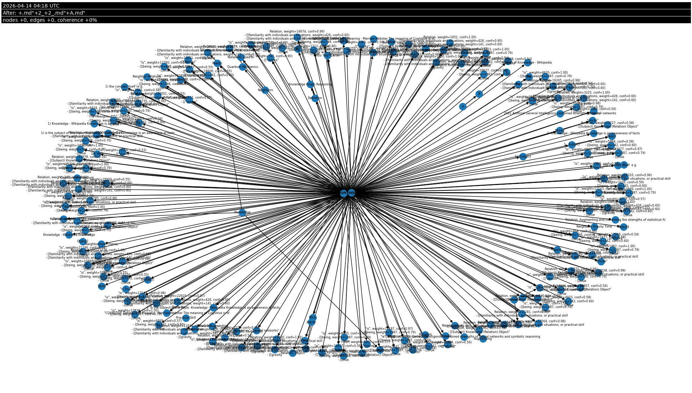](graph-2026-04-14-04-18-self-improve.png) [commit](https://github.com/BoggersTheFish/BoggersTheCIG/commit/26ad0fc)

### 2026-04-14 04:50 UTC

**After:** vault organize (11 moves) — nodes +0, edges +0, coherence +0%

[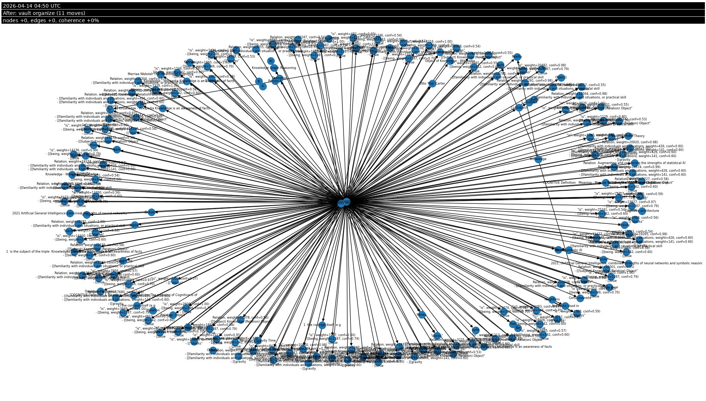](graph-2026-04-14-04-50-after-organize.png) [commit](https://github.com/BoggersTheFish/BoggersTheCIG/commit/26ad0fc)

### 2026-04-14 04:50 UTC

**After:** 1 extracts, 3 merges — nodes +0, edges +0, coherence +0%

[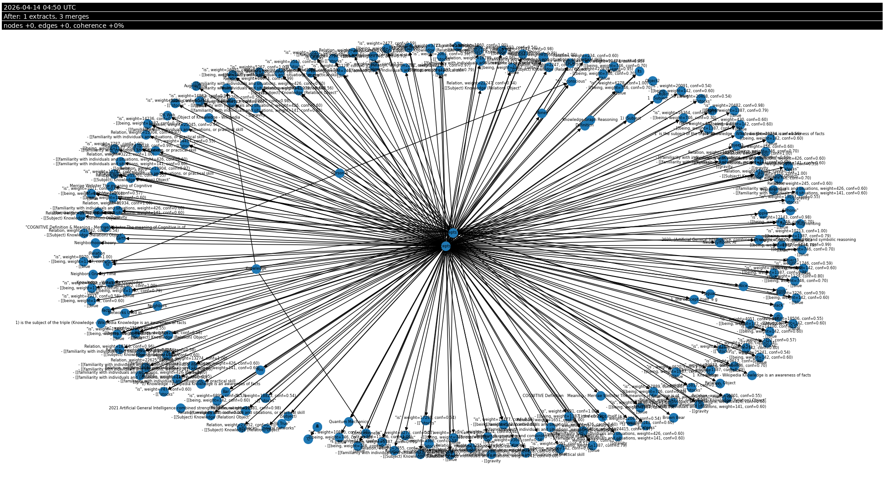](graph-2026-04-14-04-50-extract-subideas.png) [commit](https://github.com/BoggersTheFish/BoggersTheCIG/commit/26ad0fc)

### 2026-04-14 04:50 UTC

**After:** +.md"+2_+2_.md"+59.md" — nodes +0, edges +0, coherence +0%

[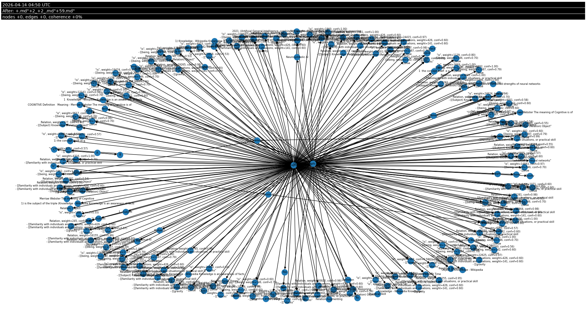](graph-2026-04-14-04-50-self-improve.png) [commit](https://github.com/BoggersTheFish/BoggersTheCIG/commit/26ad0fc)

### 2026-04-14 07:33 UTC

**After:** vault organize (8 moves) — nodes +17, edges +17, coherence -3%

[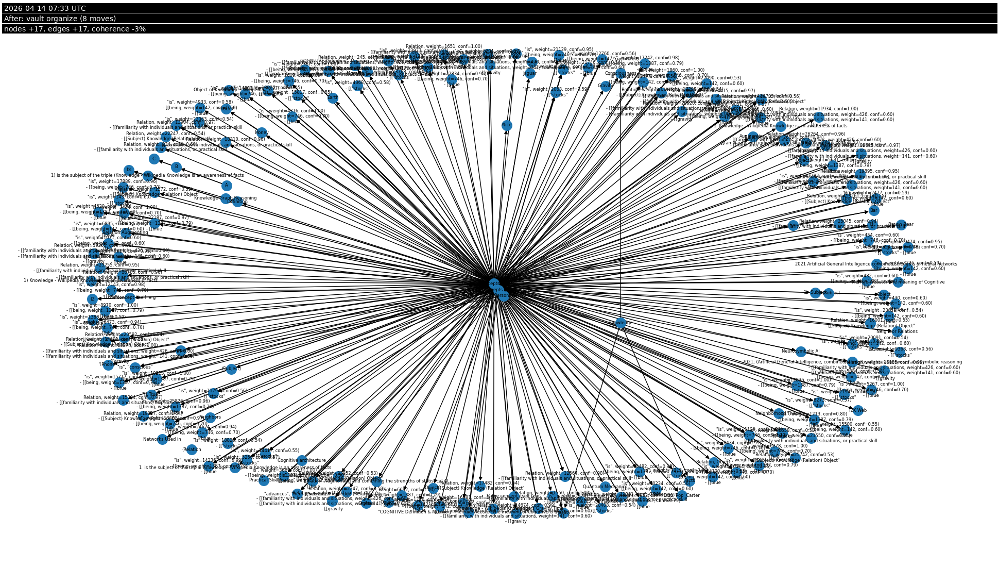](graph-2026-04-14-07-33-after-organize.png) [commit](https://github.com/BoggersTheFish/BoggersTheCIG/commit/9c86a95)

### 2026-04-14 07:33 UTC

**After:** 2 extracts, 2 merges — nodes +0, edges +0, coherence +0%

[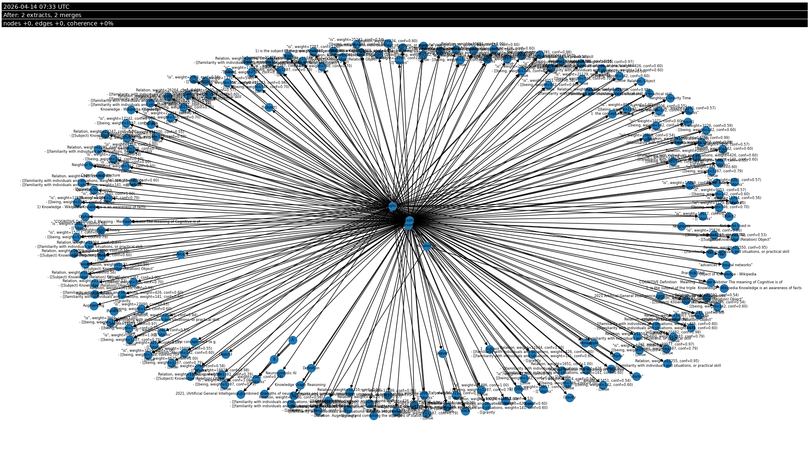](graph-2026-04-14-07-33-extract-subideas.png) [commit](https://github.com/BoggersTheFish/BoggersTheCIG/commit/9c86a95)

### 2026-04-14 07:33 UTC

**After:** +.md"+00.md"+2_.md"+A.md" — nodes +0, edges +0, coherence +0%

[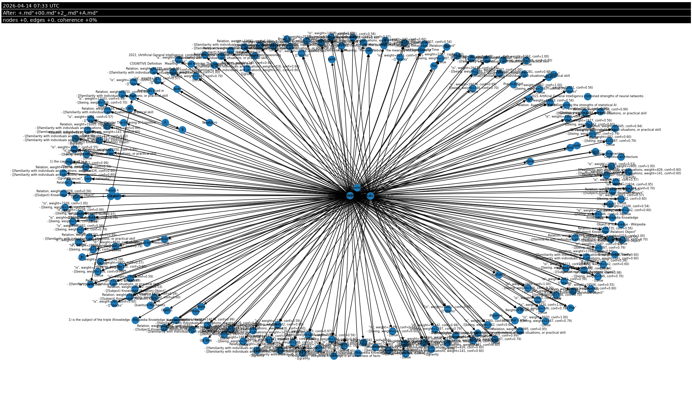](graph-2026-04-14-07-33-self-improve.png) [commit](https://github.com/BoggersTheFish/BoggersTheCIG/commit/9c86a95)

### 2026-04-14 07:54 UTC

**After:** vault analysis (+838 triples) — nodes +8, edges +9, coherence -1%

[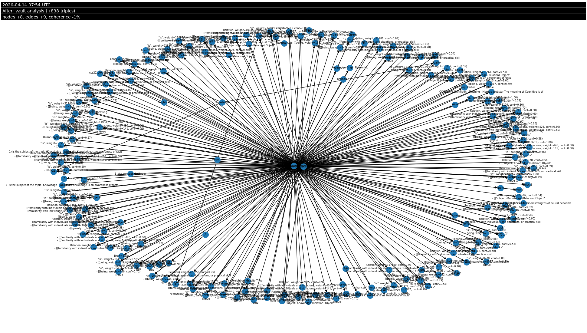](graph-2026-04-14-07-54-after-analyze-vault.png) [commit](https://github.com/BoggersTheFish/BoggersTheCIG/commit/9c86a95)

### 2026-04-14 07:54 UTC

**After:** 4 extracts, 0 merges — nodes +0, edges +0, coherence +0%

[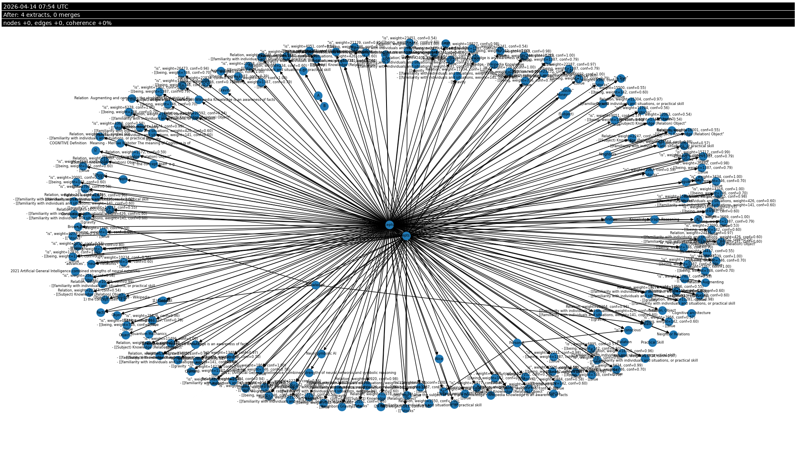](graph-2026-04-14-07-54-extract-subideas.png) [commit](https://github.com/BoggersTheFish/BoggersTheCIG/commit/9c86a95)

### 2026-04-14 08:14 UTC

**After:** vault analysis (+838 triples) — nodes +0, edges +2, coherence +0%

[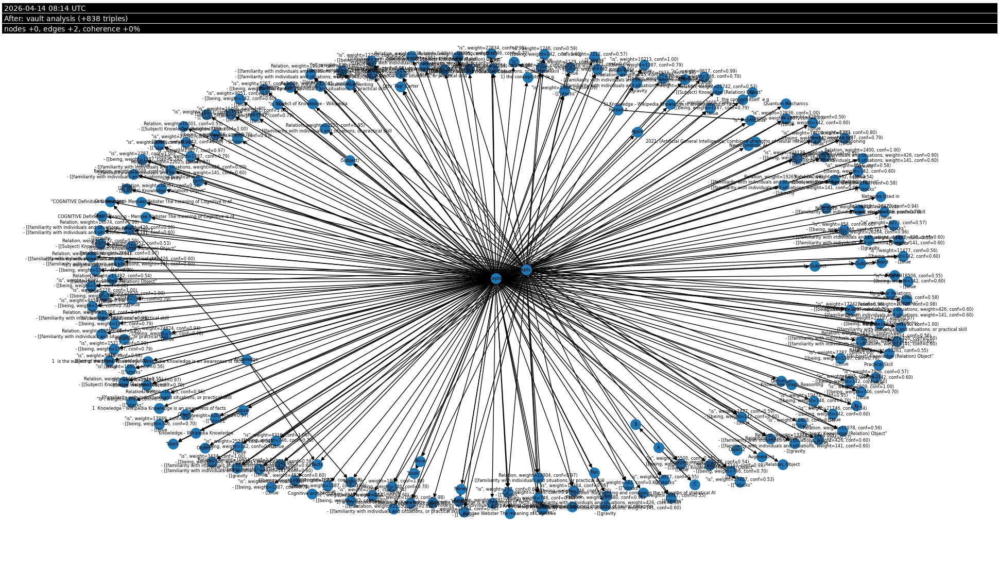](graph-2026-04-14-08-14-after-analyze-vault.png) [commit](https://github.com/BoggersTheFish/BoggersTheCIG/commit/9c86a95)

### 2026-04-14 08:14 UTC

**After:** 3 extracts, 0 merges — nodes +0, edges +0, coherence +0%

[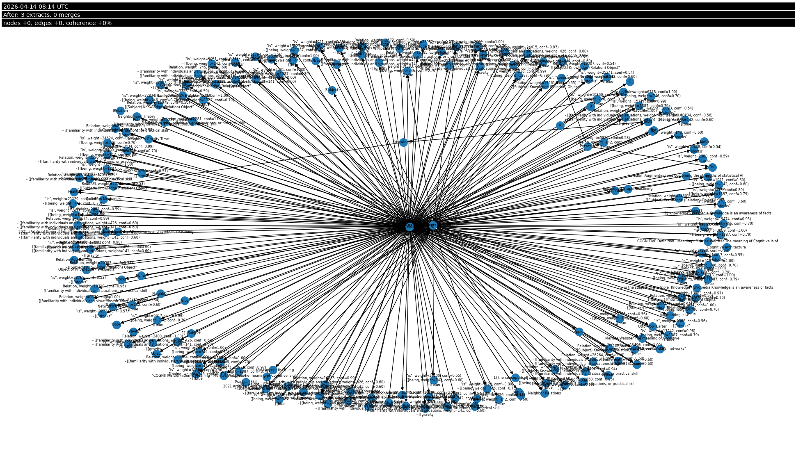](graph-2026-04-14-08-14-extract-subideas.png) [commit](https://github.com/BoggersTheFish/BoggersTheCIG/commit/9c86a95)

### 2026-04-14 08:50 UTC

**After:** vault organize (10 moves) — nodes +0, edges +0, coherence +0%

[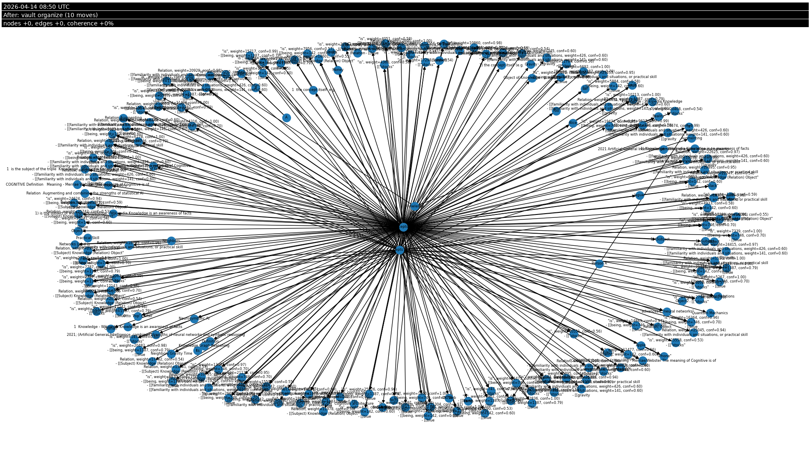](graph-2026-04-14-08-50-after-organize.png) [commit](https://github.com/BoggersTheFish/BoggersTheCIG/commit/9c86a95)

### 2026-04-14 08:50 UTC

**After:** 0 extracts, 3 merges — nodes +0, edges +0, coherence +0%

[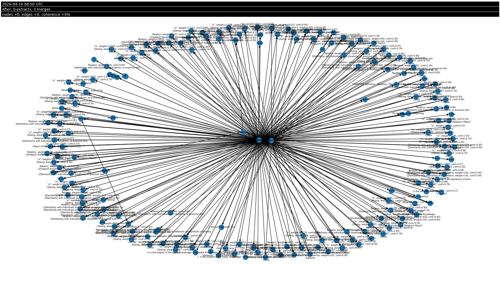](graph-2026-04-14-08-50-extract-subideas.png) [commit](https://github.com/BoggersTheFish/BoggersTheCIG/commit/9c86a95)

### 2026-04-14 08:50 UTC

**After:** +.md"+00.md"+2_.md"+A.md" — nodes +0, edges +0, coherence +0%

[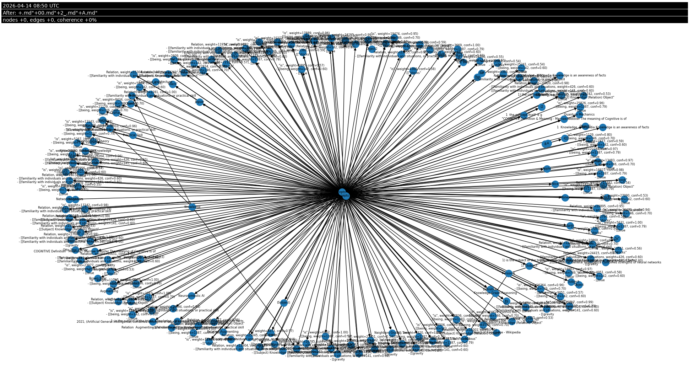](graph-2026-04-14-08-50-self-improve.png) [commit](https://github.com/BoggersTheFish/BoggersTheCIG/commit/9c86a95)

### 2026-04-14 09:23 UTC

**After:** vault organize (10 moves) — nodes +0, edges +0, coherence +0%

[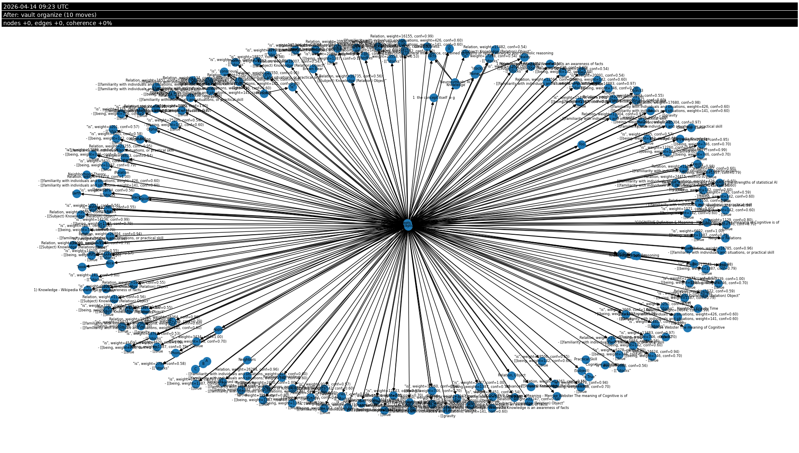](graph-2026-04-14-09-23-after-organize.png) [commit](https://github.com/BoggersTheFish/BoggersTheCIG/commit/9c86a95)

### 2026-04-14 09:23 UTC

**After:** 2 extracts, 1 merges — nodes +0, edges +0, coherence +0%

[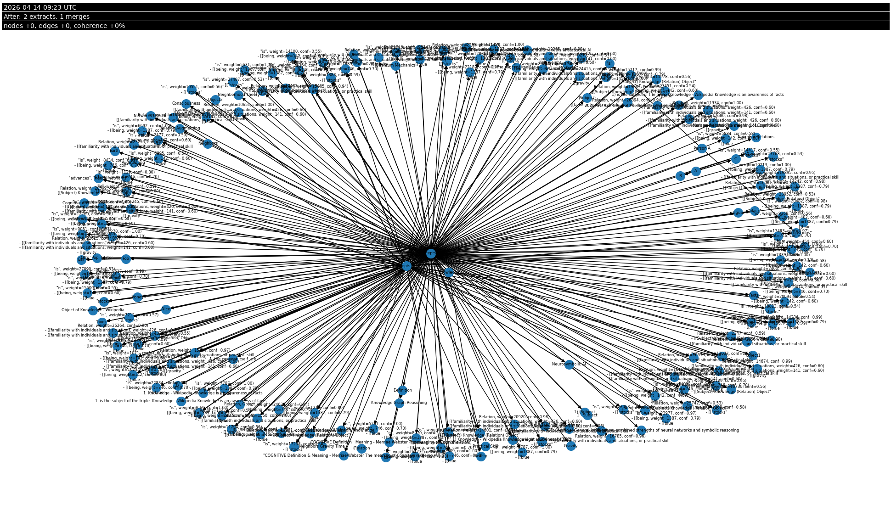](graph-2026-04-14-09-23-extract-subideas.png) [commit](https://github.com/BoggersTheFish/BoggersTheCIG/commit/9c86a95)

### 2026-04-14 09:23 UTC

**After:** +.md"+00.md"+2_+2_.md" — nodes +0, edges +0, coherence +0%

[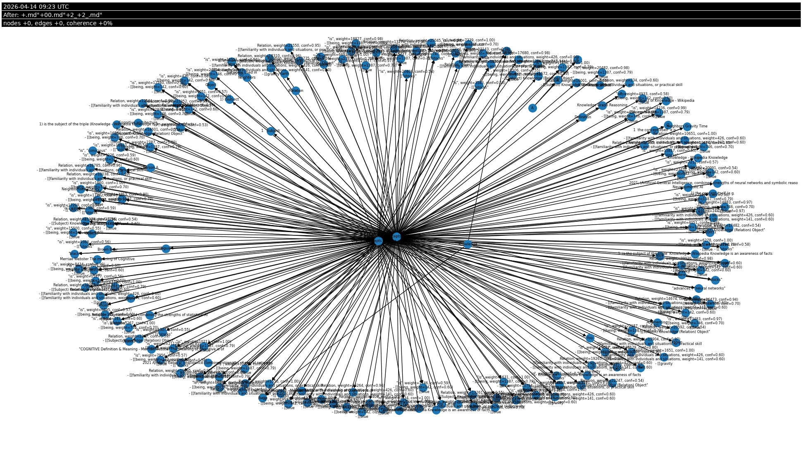](graph-2026-04-14-09-23-self-improve.png) [commit](https://github.com/BoggersTheFish/BoggersTheCIG/commit/9c86a95)

### 2026-04-14 11:43 UTC

**After:** vault organize (14 moves) — nodes +17, edges +17, coherence -2%

[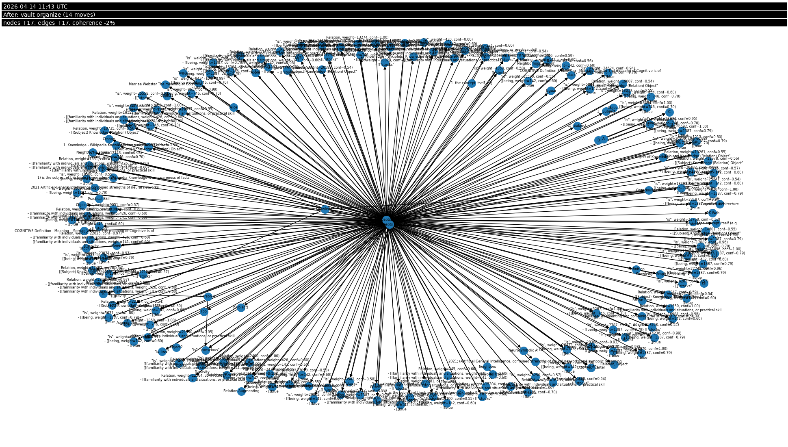](graph-2026-04-14-11-43-after-organize.png) [commit](https://github.com/BoggersTheFish/BoggersTheCIG/commit/1f0b132)

### 2026-04-14 11:43 UTC

**After:** 0 extracts, 3 merges — nodes +0, edges +0, coherence +0%

[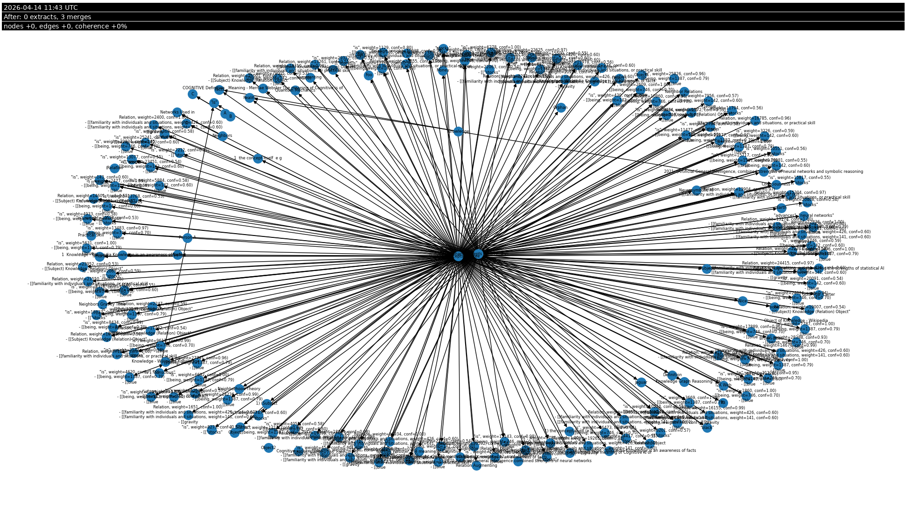](graph-2026-04-14-11-43-extract-subideas.png) [commit](https://github.com/BoggersTheFish/BoggersTheCIG/commit/1f0b132)

### 2026-04-14 11:43 UTC

**After:** .md"+00.md"+2_+2_.md"+A.md" — nodes +0, edges +0, coherence +0%

[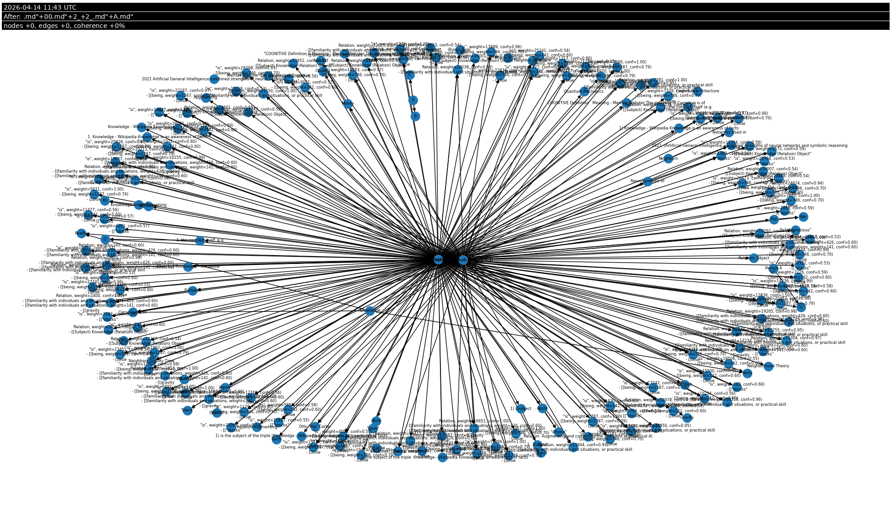](graph-2026-04-14-11-43-self-improve.png) [commit](https://github.com/BoggersTheFish/BoggersTheCIG/commit/1f0b132)

### 2026-04-14 12:02 UTC

**After:** vault analysis (+872 triples) — nodes +6, edges +8, coherence +0%

[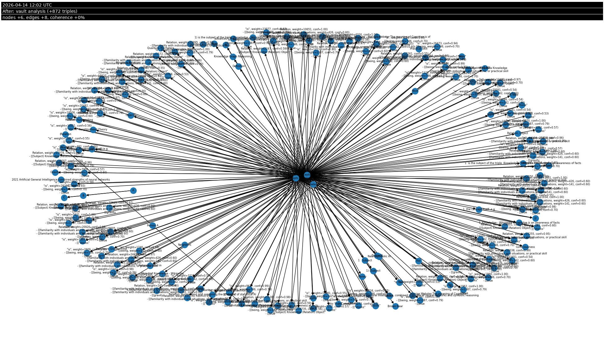](graph-2026-04-14-12-02-after-analyze-vault.png) [commit](https://github.com/BoggersTheFish/BoggersTheCIG/commit/1f0b132)

### 2026-04-14 12:02 UTC

**After:** 1 extracts, 0 merges — nodes +0, edges +0, coherence +0%

[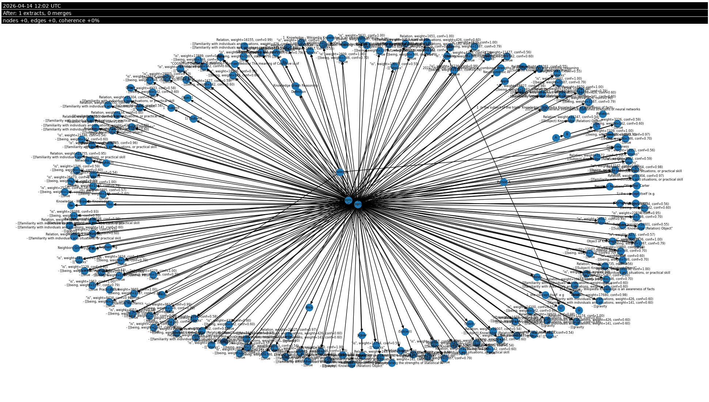](graph-2026-04-14-12-02-extract-subideas.png) [commit](https://github.com/BoggersTheFish/BoggersTheCIG/commit/1f0b132)

### 2026-04-14 12:21 UTC

**After:** vault analysis (+872 triples) — nodes +0, edges +2, coherence +0%

[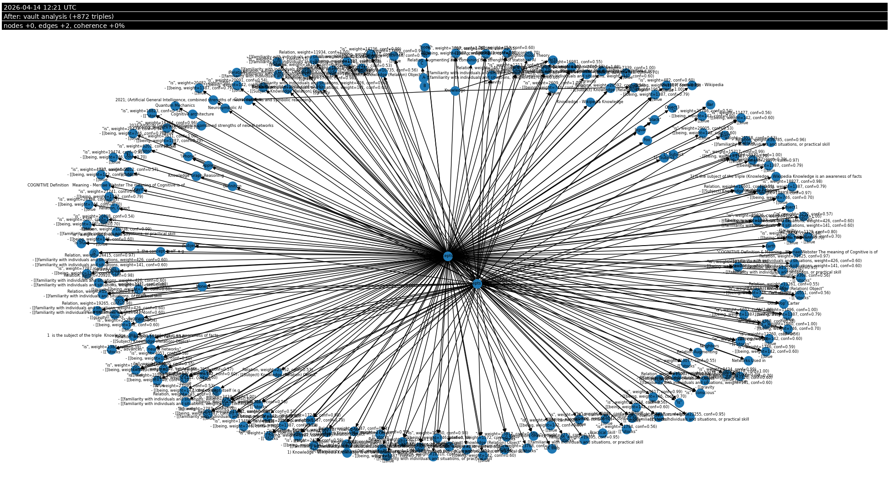](graph-2026-04-14-12-21-after-analyze-vault.png) [commit](https://github.com/BoggersTheFish/BoggersTheCIG/commit/1f0b132)

### 2026-04-14 12:21 UTC

**After:** 1 extracts, 0 merges — nodes +0, edges +0, coherence +0%

[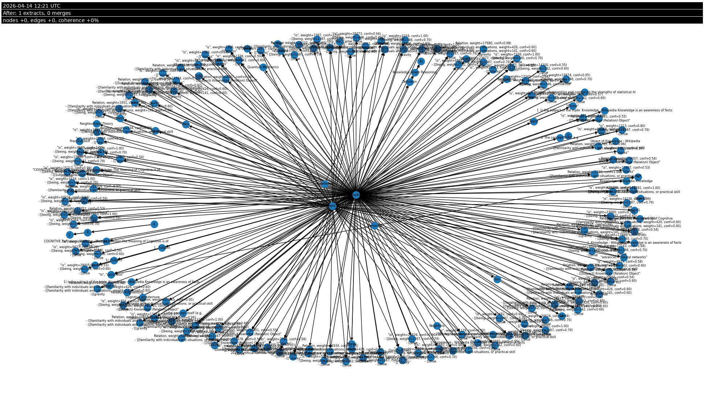](graph-2026-04-14-12-21-extract-subideas.png) [commit](https://github.com/BoggersTheFish/BoggersTheCIG/commit/1f0b132)

### 2026-04-14 12:59 UTC

**After:** vault organize (10 moves) — nodes +0, edges +0, coherence +0%

[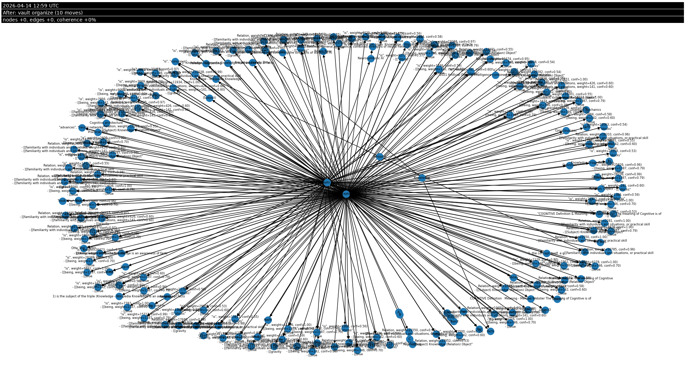](graph-2026-04-14-12-59-after-organize.png) [commit](https://github.com/BoggersTheFish/BoggersTheCIG/commit/1f0b132)

### 2026-04-14 12:59 UTC

**After:** 2 extracts, 1 merges — nodes +0, edges +0, coherence +0%

[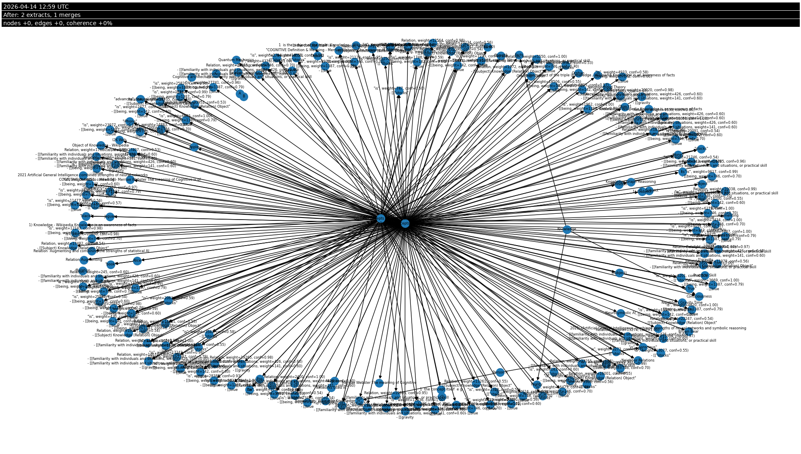](graph-2026-04-14-12-59-extract-subideas.png) [commit](https://github.com/BoggersTheFish/BoggersTheCIG/commit/1f0b132)

### 2026-04-14 12:59 UTC

**After:** .md"+00.md"+2_+2_.md"+56.md" — nodes +0, edges +0, coherence +0%

[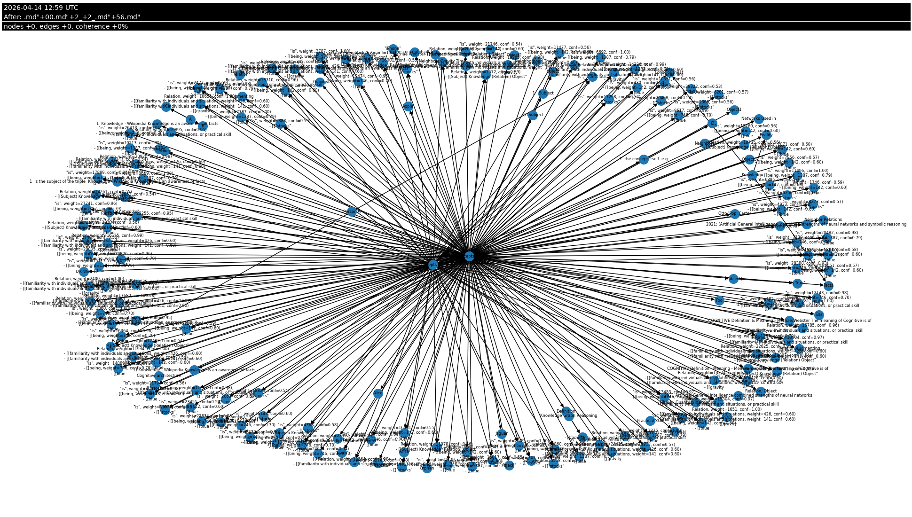](graph-2026-04-14-12-59-self-improve.png) [commit](https://github.com/BoggersTheFish/BoggersTheCIG/commit/1f0b132)

### 2026-04-14 13:36 UTC

**After:** vault organize (8 moves) — nodes +0, edges +0, coherence +0%

[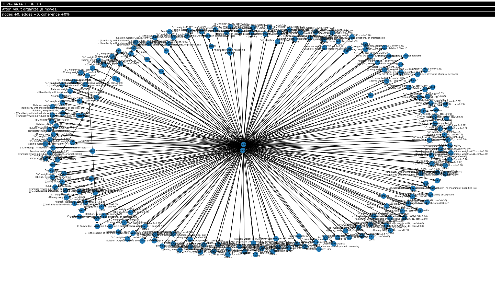](graph-2026-04-14-13-36-after-organize.png) [commit](https://github.com/BoggersTheFish/BoggersTheCIG/commit/1f0b132)

### 2026-04-14 13:36 UTC

**After:** 1 extracts, 2 merges — nodes +0, edges +0, coherence +0%

[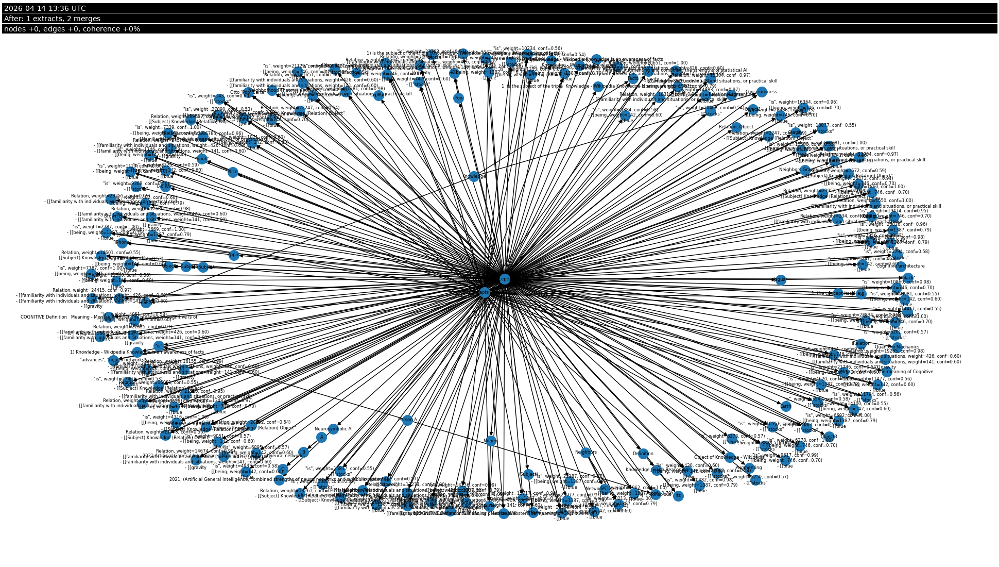](graph-2026-04-14-13-36-extract-subideas.png) [commit](https://github.com/BoggersTheFish/BoggersTheCIG/commit/1f0b132)

### 2026-04-14 13:36 UTC

**After:** +.md"+00.md"+2_+2_.md" — nodes +0, edges +0, coherence +0%

[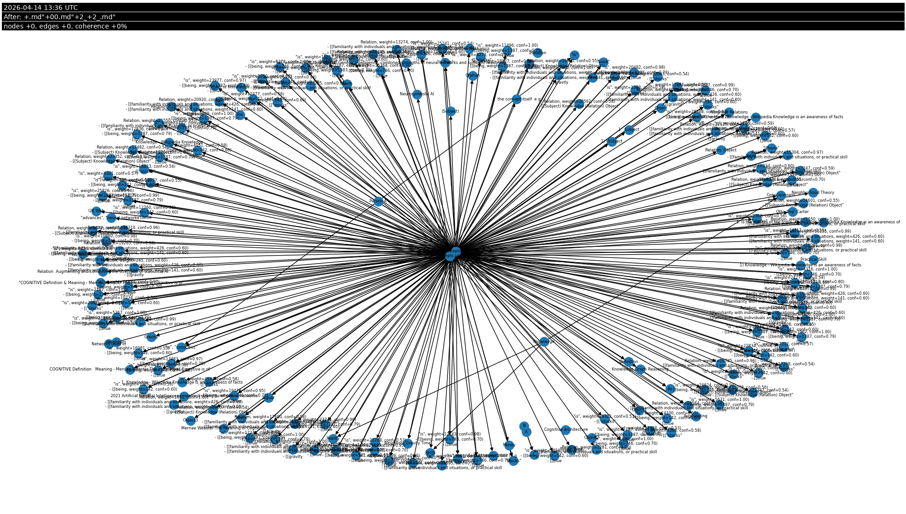](graph-2026-04-14-13-36-self-improve.png) [commit](https://github.com/BoggersTheFish/BoggersTheCIG/commit/1f0b132)

### 2026-04-14 16:48 UTC

**After:** vault organize (15 moves) — nodes +17, edges +17, coherence -2%

[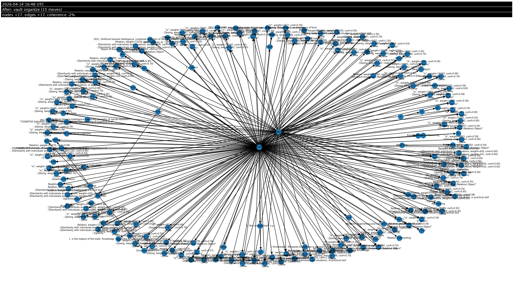](graph-2026-04-14-16-48-after-organize.png) [commit](https://github.com/BoggersTheFish/BoggersTheCIG/commit/cd7a47e)

### 2026-04-14 16:48 UTC

**After:** 1 extracts, 2 merges — nodes +0, edges +0, coherence +0%

[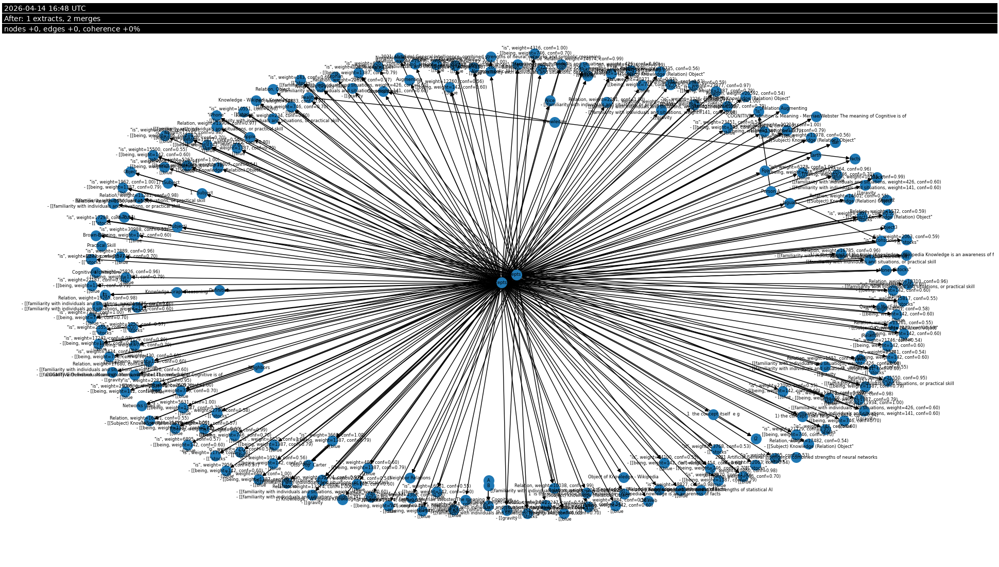](graph-2026-04-14-16-48-extract-subideas.png) [commit](https://github.com/BoggersTheFish/BoggersTheCIG/commit/cd7a47e)

### 2026-04-14 16:48 UTC

**After:** +.md"+00.md"+2_+2_.md" — nodes +0, edges +0, coherence +0%

[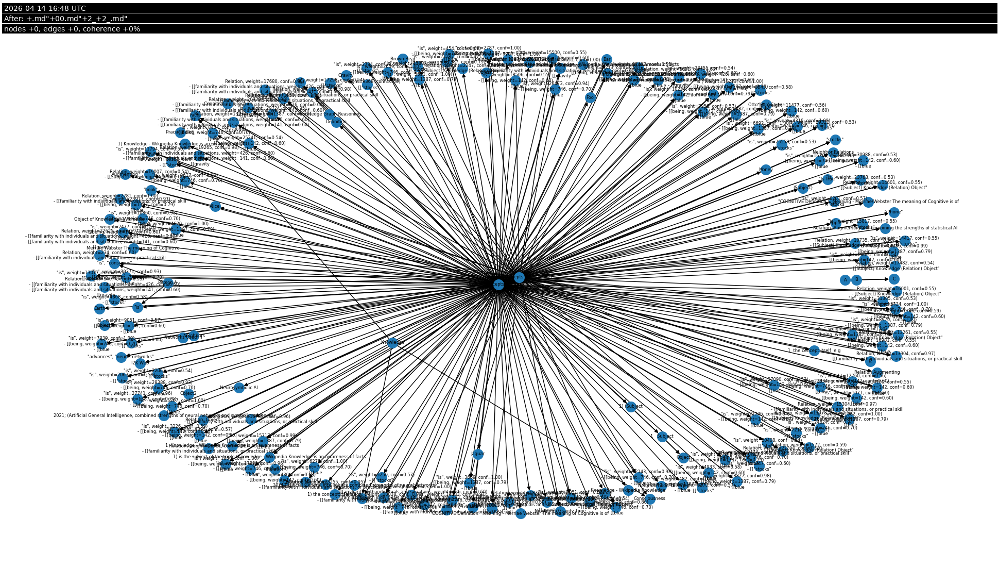](graph-2026-04-14-16-48-self-improve.png) [commit](https://github.com/BoggersTheFish/BoggersTheCIG/commit/cd7a47e)

### 2026-04-14 16:49 UTC

**After:** external ingest (+1 triples) — nodes +2, edges +1, coherence +0%

[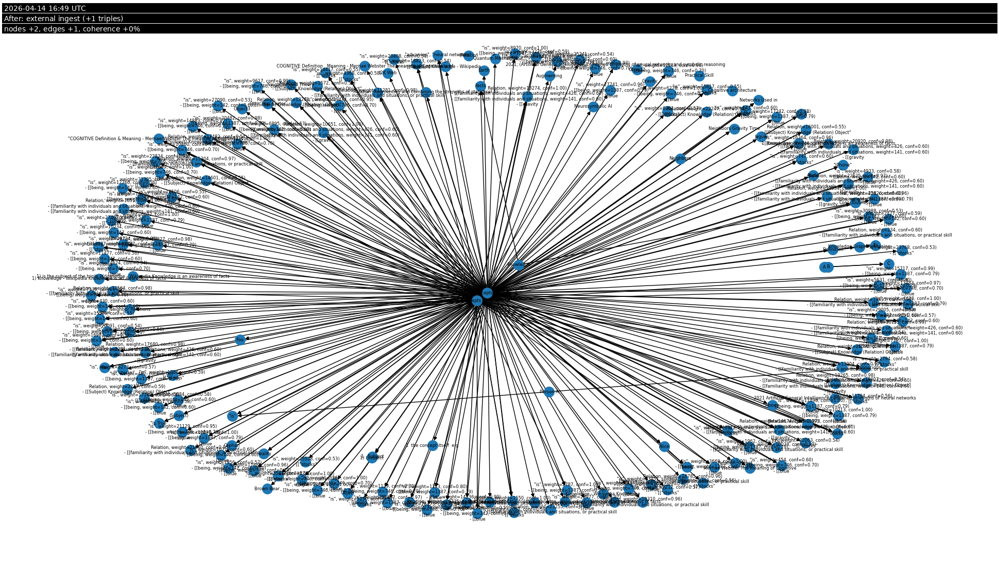](graph-2026-04-14-16-49-after-ingest.png) [commit](https://github.com/BoggersTheFish/BoggersTheCIG/commit/cd7a47e)

### 2026-04-14 17:05 UTC

**After:** vault analysis (+906 triples) — nodes +4, edges +6, coherence +0%

[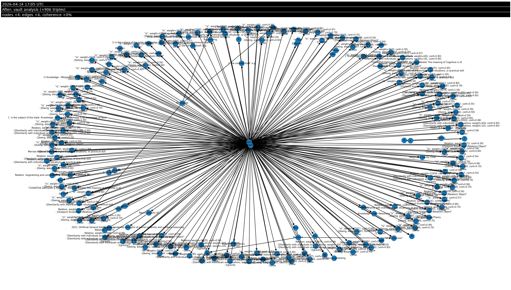](graph-2026-04-14-17-05-after-analyze-vault.png) [commit](https://github.com/BoggersTheFish/BoggersTheCIG/commit/cd7a47e)

### 2026-04-14 17:05 UTC

**After:** 2 extracts, 0 merges — nodes +0, edges +0, coherence +0%

[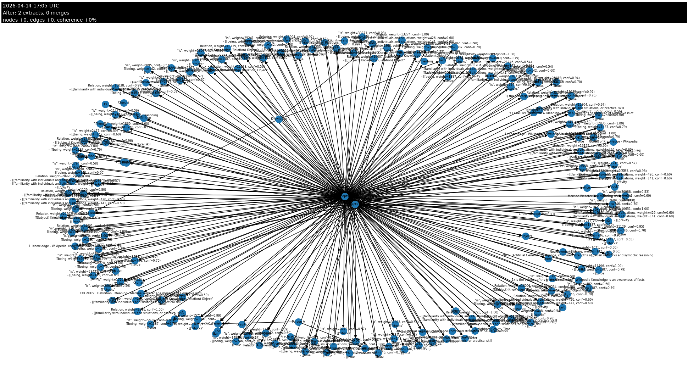](graph-2026-04-14-17-05-extract-subideas.png) [commit](https://github.com/BoggersTheFish/BoggersTheCIG/commit/cd7a47e)

### 2026-04-14 17:22 UTC

**After:** vault analysis (+906 triples) — nodes +0, edges +2, coherence +0%

[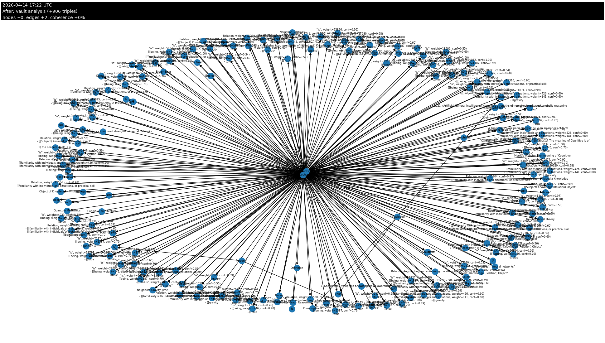](graph-2026-04-14-17-22-after-analyze-vault.png) [commit](https://github.com/BoggersTheFish/BoggersTheCIG/commit/cd7a47e)

### 2026-04-14 17:22 UTC

**After:** 2 extracts, 0 merges — nodes +0, edges +0, coherence +0%

[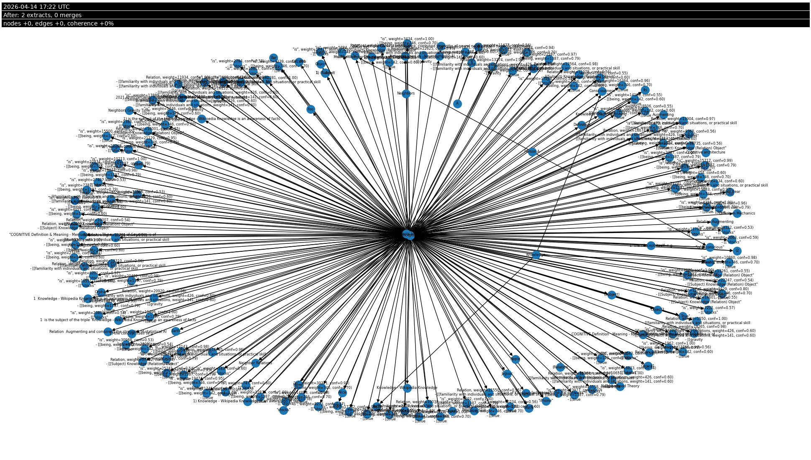](graph-2026-04-14-17-22-extract-subideas.png) [commit](https://github.com/BoggersTheFish/BoggersTheCIG/commit/cd7a47e)

### 2026-04-14 18:01 UTC

**After:** vault organize (7 moves) — nodes +0, edges +0, coherence +0%

[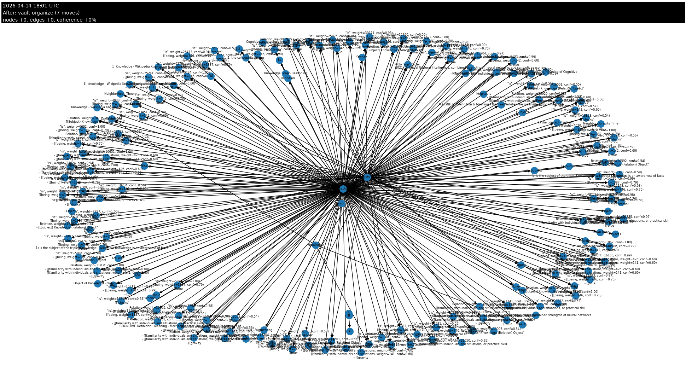](graph-2026-04-14-18-01-after-organize.png) [commit](https://github.com/BoggersTheFish/BoggersTheCIG/commit/cd7a47e)

### 2026-04-14 18:01 UTC

**After:** 1 extracts, 2 merges — nodes +0, edges +0, coherence +0%

[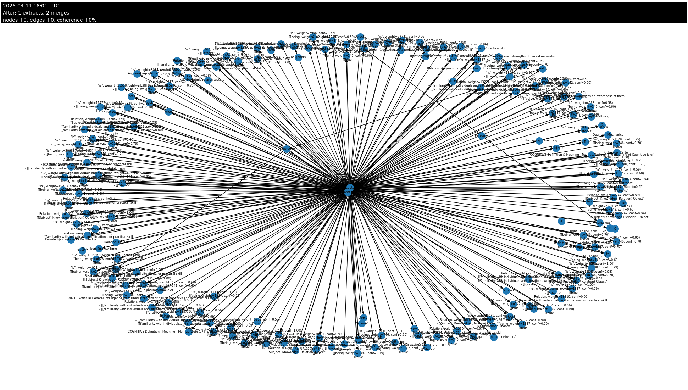](graph-2026-04-14-18-01-extract-subideas.png) [commit](https://github.com/BoggersTheFish/BoggersTheCIG/commit/cd7a47e)

### 2026-04-14 18:01 UTC

**After:** +.md"+00.md"+2_+2_.md" — nodes +0, edges +0, coherence +0%

[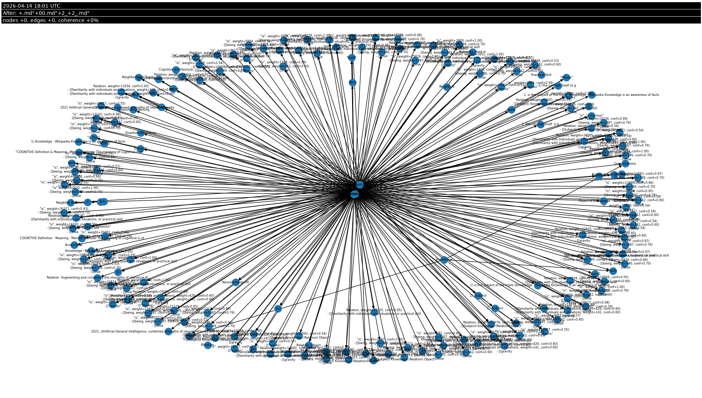](graph-2026-04-14-18-01-self-improve.png) [commit](https://github.com/BoggersTheFish/BoggersTheCIG/commit/cd7a47e)

### 2026-04-14 18:40 UTC

**After:** vault organize (4 moves) — nodes +0, edges +0, coherence +0%

[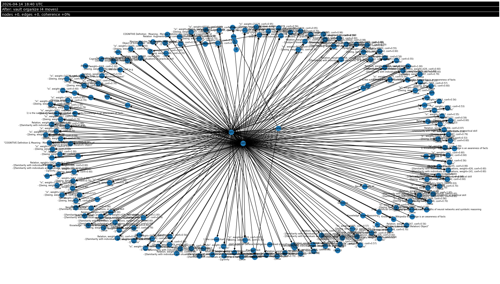](graph-2026-04-14-18-40-after-organize.png) [commit](https://github.com/BoggersTheFish/BoggersTheCIG/commit/cd7a47e)

### 2026-04-14 18:40 UTC

**After:** 1 extracts, 2 merges — nodes +0, edges +0, coherence +0%

[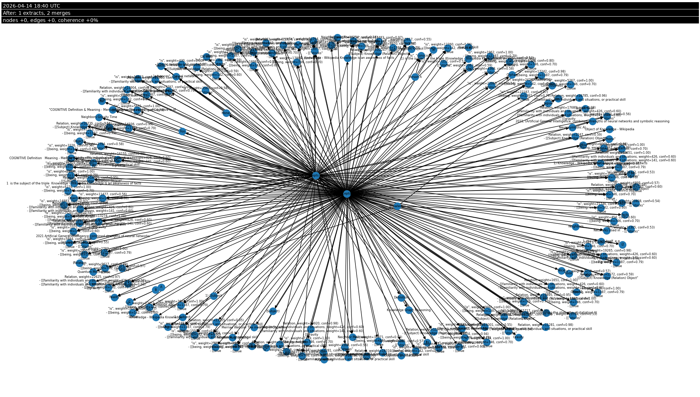](graph-2026-04-14-18-40-extract-subideas.png) [commit](https://github.com/BoggersTheFish/BoggersTheCIG/commit/cd7a47e)

### 2026-04-14 18:40 UTC

**After:** +.md"+00.md"+2_+2_.md" — nodes +0, edges +0, coherence +0%

[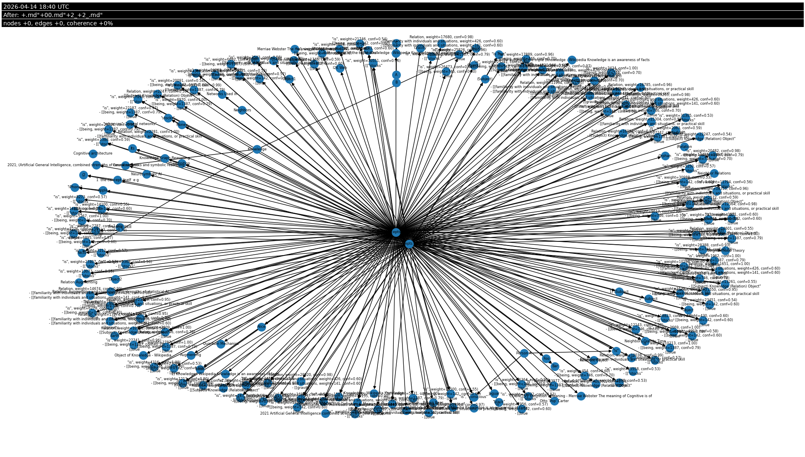](graph-2026-04-14-18-40-self-improve.png) [commit](https://github.com/BoggersTheFish/BoggersTheCIG/commit/cd7a47e)

### 2026-04-14 21:32 UTC

**After:** vault organize (5 moves) — nodes +17, edges +17, coherence -2%

[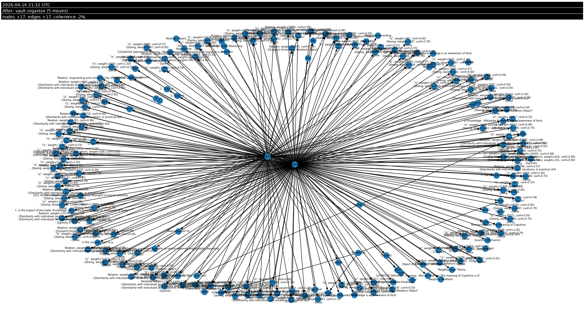](graph-2026-04-14-21-32-after-organize.png) [commit](https://github.com/BoggersTheFish/BoggersTheCIG/commit/bb1e6d6)

### 2026-04-14 21:32 UTC

**After:** 1 extracts, 2 merges — nodes +0, edges +0, coherence +0%

[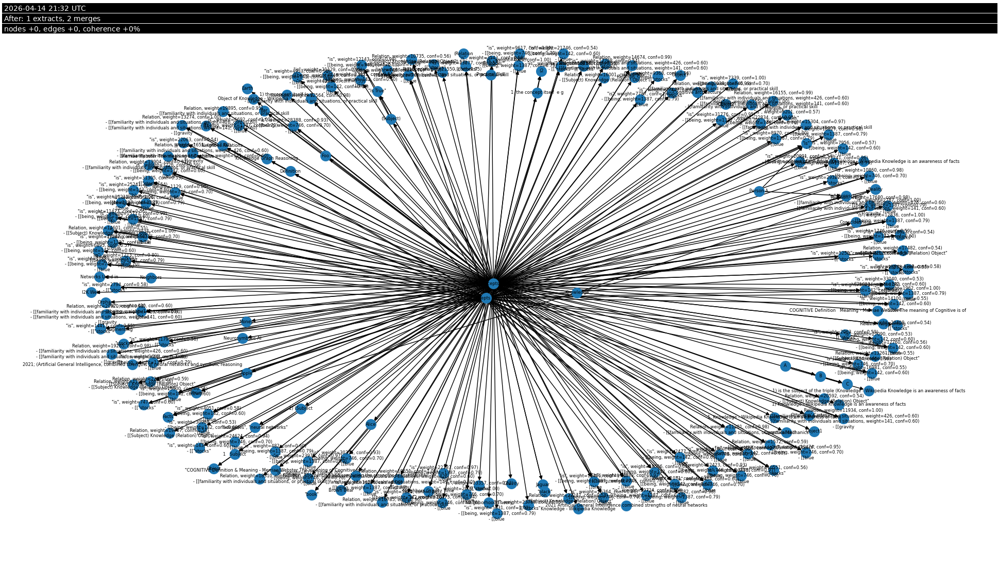](graph-2026-04-14-21-32-extract-subideas.png) [commit](https://github.com/BoggersTheFish/BoggersTheCIG/commit/bb1e6d6)

### 2026-04-14 21:32 UTC

**After:** +.md"+2_+2_.md"+A.md" — nodes +0, edges +0, coherence +0%

[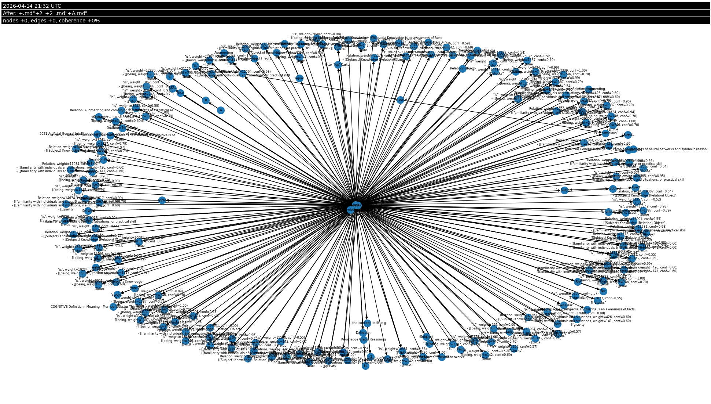](graph-2026-04-14-21-32-self-improve.png) [commit](https://github.com/BoggersTheFish/BoggersTheCIG/commit/bb1e6d6)

### 2026-04-14 21:33 UTC

**After:** external ingest (+3 triples) — nodes +4, edges +3, coherence +0%

[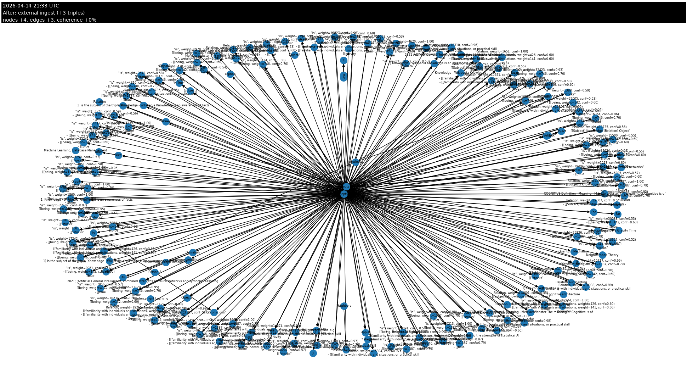](graph-2026-04-14-21-33-after-ingest.png) [commit](https://github.com/BoggersTheFish/BoggersTheCIG/commit/bb1e6d6)

### 2026-04-14 21:57 UTC

**After:** vault analysis (+925 triples) — nodes +3, edges +5, coherence +0%

[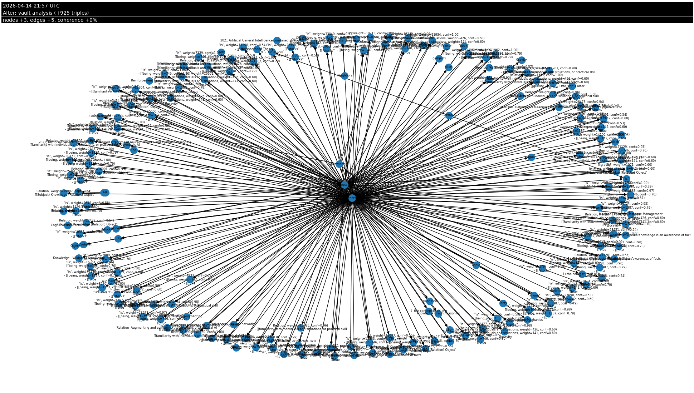](graph-2026-04-14-21-57-after-analyze-vault.png) [commit](https://github.com/BoggersTheFish/BoggersTheCIG/commit/bb1e6d6)

### 2026-04-14 21:57 UTC

**After:** 2 extracts, 0 merges — nodes +0, edges +0, coherence +0%

[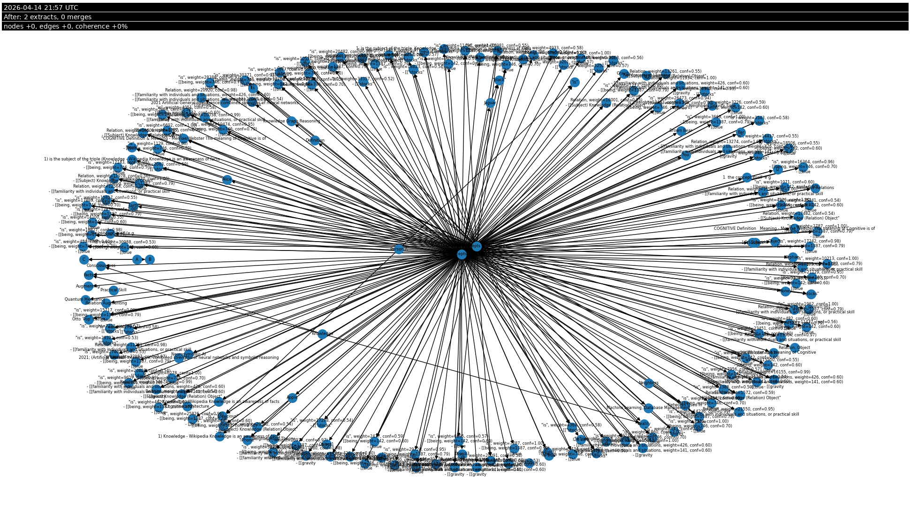](graph-2026-04-14-21-57-extract-subideas.png) [commit](https://github.com/BoggersTheFish/BoggersTheCIG/commit/bb1e6d6)

### 2026-04-14 22:22 UTC

**After:** vault analysis (+926 triples) — nodes +0, edges +2, coherence +0%

[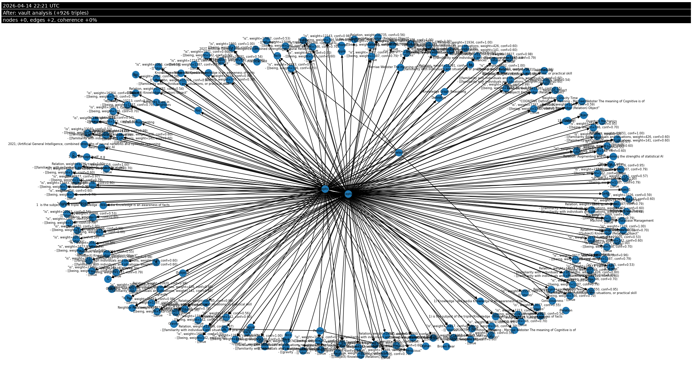](graph-2026-04-14-22-21-after-analyze-vault.png) [commit](https://github.com/BoggersTheFish/BoggersTheCIG/commit/bb1e6d6)

### 2026-04-14 22:22 UTC

**After:** 2 extracts, 0 merges — nodes +0, edges +0, coherence +0%

[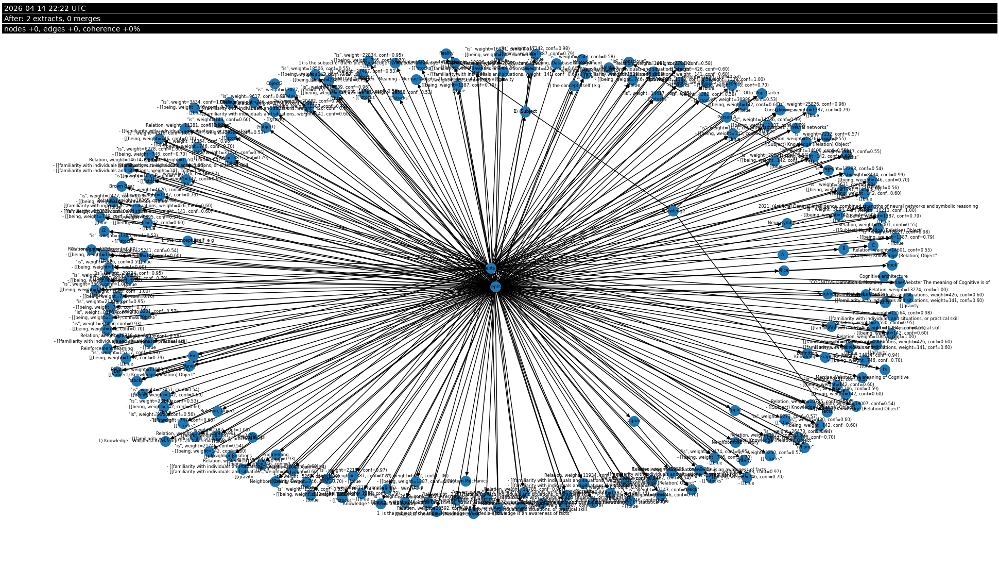](graph-2026-04-14-22-22-extract-subideas.png) [commit](https://github.com/BoggersTheFish/BoggersTheCIG/commit/bb1e6d6)

### 2026-04-14 22:59 UTC

**After:** vault organize (10 moves) — nodes +0, edges +0, coherence +0%

[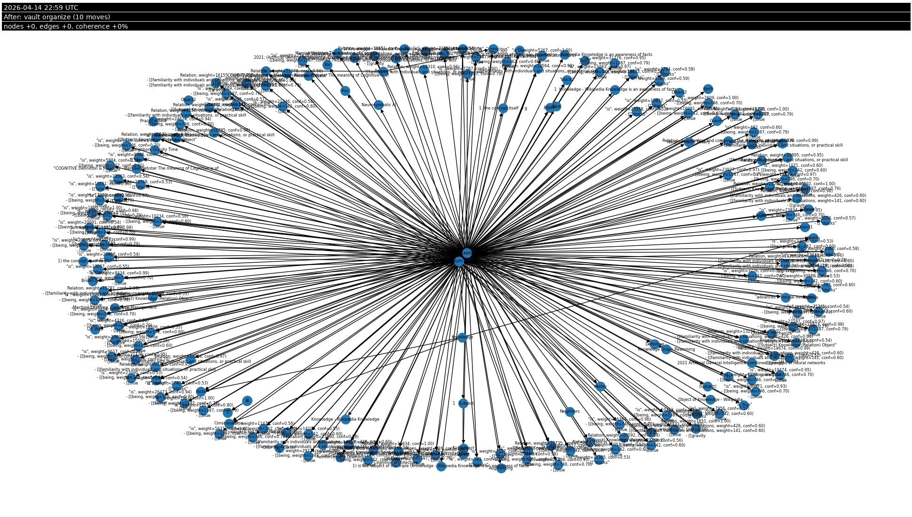](graph-2026-04-14-22-59-after-organize.png) [commit](https://github.com/BoggersTheFish/BoggersTheCIG/commit/bb1e6d6)

### 2026-04-14 22:59 UTC

**After:** 3 extracts, 1 merges — nodes +0, edges +0, coherence +0%

[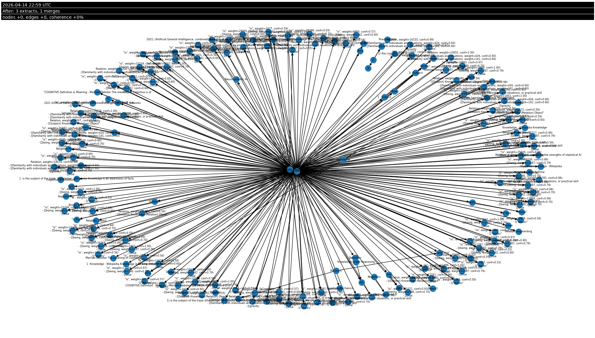](graph-2026-04-14-22-59-extract-subideas.png) [commit](https://github.com/BoggersTheFish/BoggersTheCIG/commit/bb1e6d6)

### 2026-04-14 22:59 UTC

**After:** +.md"+2_+2_.md"+A.md" — nodes +0, edges +0, coherence +0%

[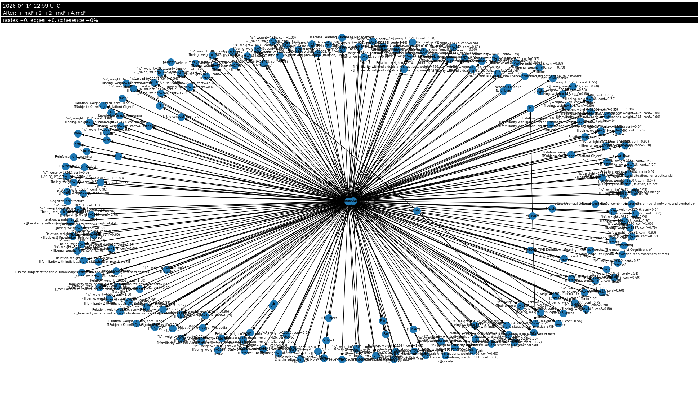](graph-2026-04-14-22-59-self-improve.png) [commit](https://github.com/BoggersTheFish/BoggersTheCIG/commit/bb1e6d6)

### 2026-04-14 23:35 UTC

**After:** vault organize (10 moves) — nodes +0, edges +0, coherence +0%

[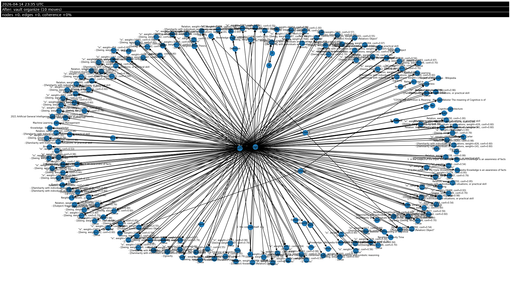](graph-2026-04-14-23-35-after-organize.png) [commit](https://github.com/BoggersTheFish/BoggersTheCIG/commit/bb1e6d6)

### 2026-04-14 23:36 UTC

**After:** 0 extracts, 4 merges — nodes +0, edges +0, coherence +0%

[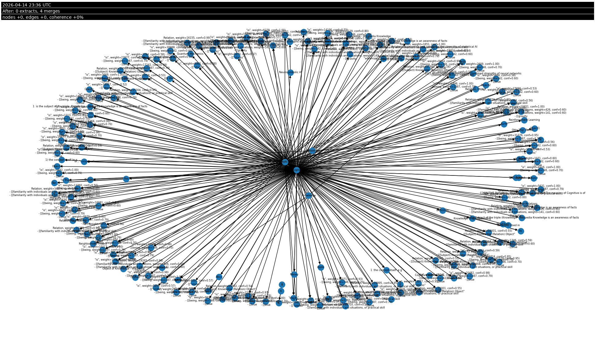](graph-2026-04-14-23-36-extract-subideas.png) [commit](https://github.com/BoggersTheFish/BoggersTheCIG/commit/bb1e6d6)

### 2026-04-14 23:36 UTC

**After:** +.md"+2_+2_.md"+99.md" — nodes +0, edges +0, coherence +0%

[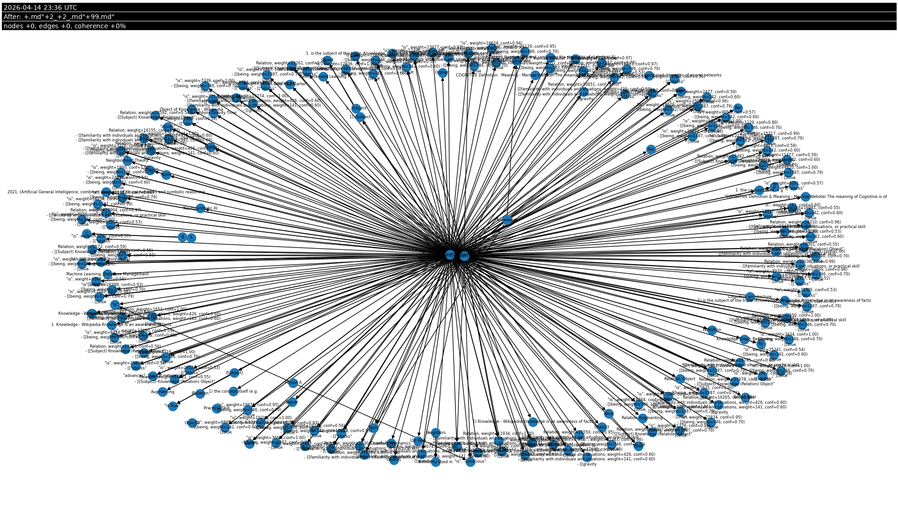](graph-2026-04-14-23-36-self-improve.png) [commit](https://github.com/BoggersTheFish/BoggersTheCIG/commit/bb1e6d6)

### 2026-04-15 03:09 UTC

**After:** vault organize (13 moves) — nodes +18, edges +18, coherence -2%

[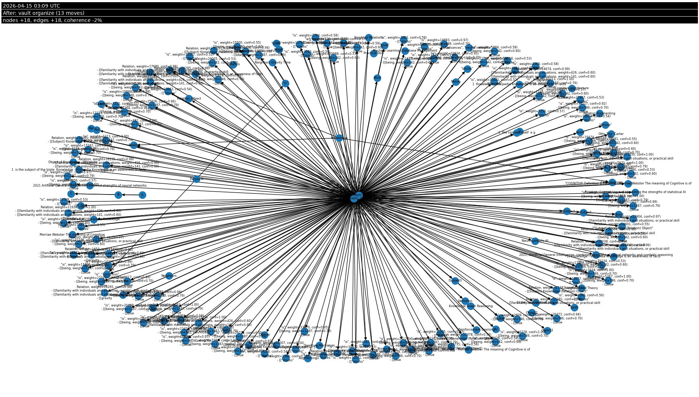](graph-2026-04-15-03-09-after-organize.png) [commit](https://github.com/BoggersTheFish/BoggersTheCIG/commit/a665a6b)

### 2026-04-15 03:09 UTC

**After:** 2 extracts, 2 merges — nodes +0, edges +0, coherence +0%

[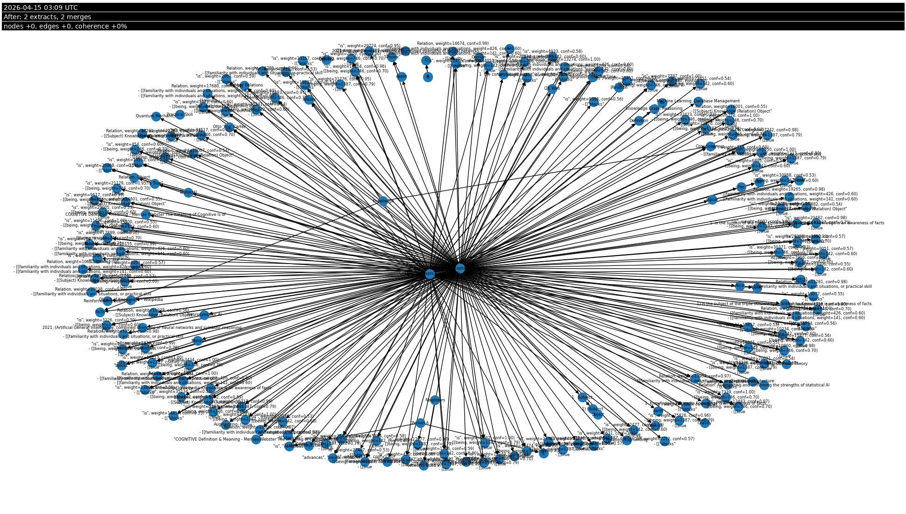](graph-2026-04-15-03-09-extract-subideas.png) [commit](https://github.com/BoggersTheFish/BoggersTheCIG/commit/a665a6b)

### 2026-04-15 03:09 UTC

**After:** +.md"+00.md"+2_.md"+A.md" — nodes +0, edges +0, coherence +0%

[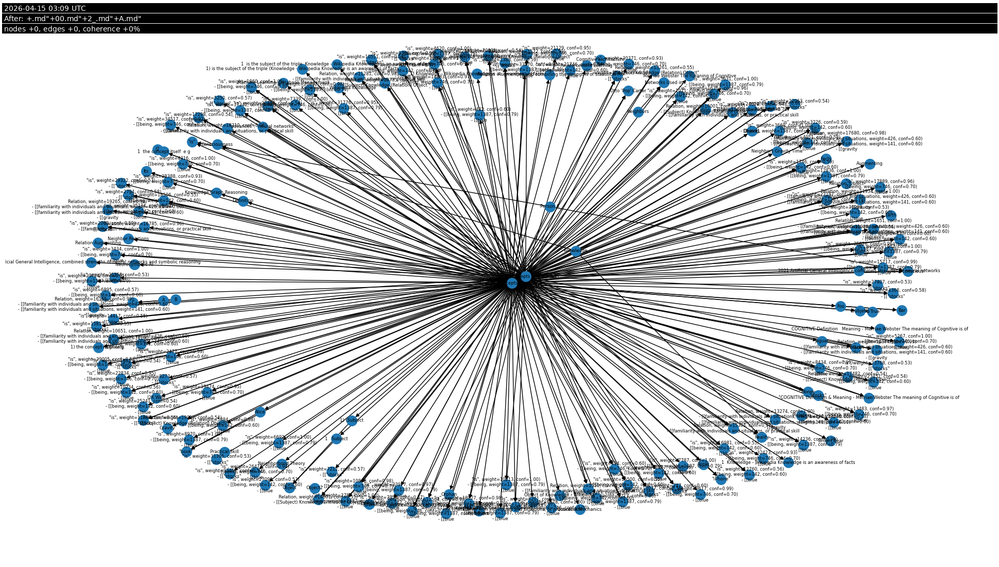](graph-2026-04-15-03-09-self-improve.png) [commit](https://github.com/BoggersTheFish/BoggersTheCIG/commit/a665a6b)

### 2026-04-15 03:10 UTC

**After:** external ingest (+1 triples) — nodes +2, edges +1, coherence +0%

[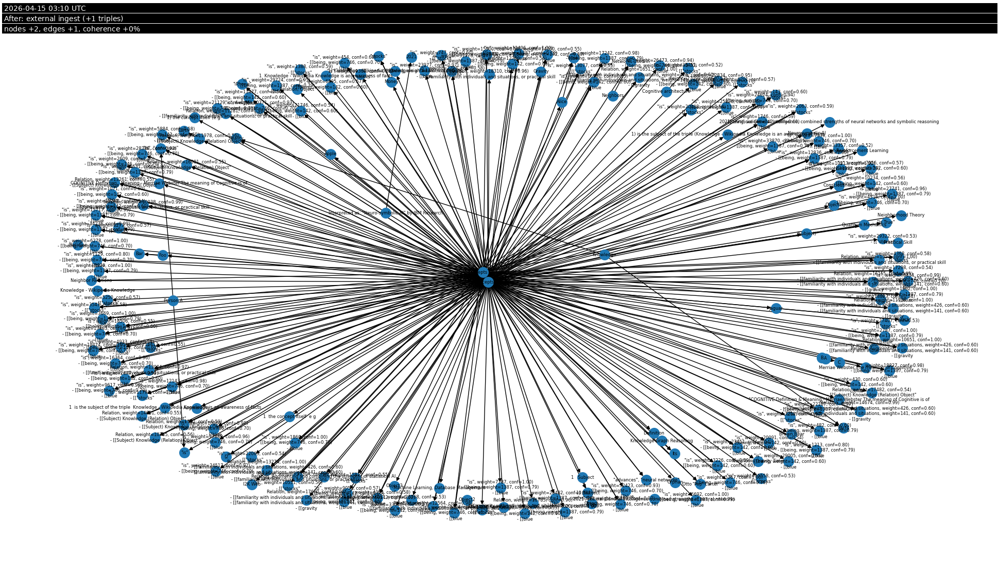](graph-2026-04-15-03-10-after-ingest.png) [commit](https://github.com/BoggersTheFish/BoggersTheCIG/commit/a665a6b)

### 2026-04-15 03:36 UTC

**After:** vault analysis (+954 triples) — nodes +6, edges +7, coherence +0%

[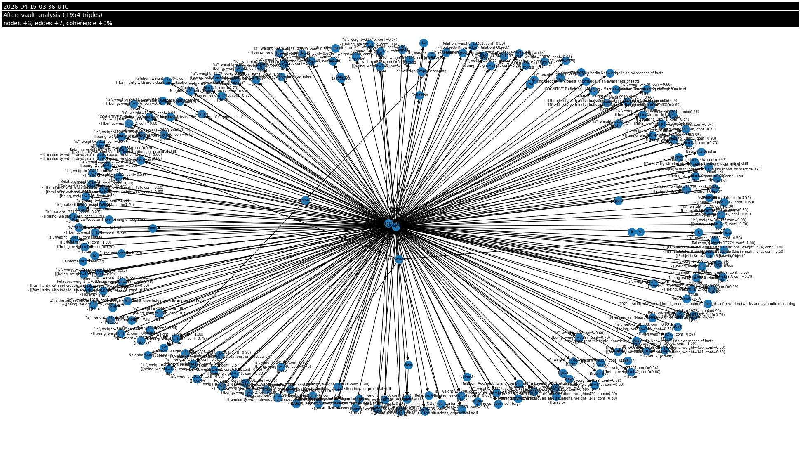](graph-2026-04-15-03-36-after-analyze-vault.png) [commit](https://github.com/BoggersTheFish/BoggersTheCIG/commit/a665a6b)

### 2026-04-15 03:36 UTC

**After:** 4 extracts, 0 merges — nodes +0, edges +0, coherence +0%

[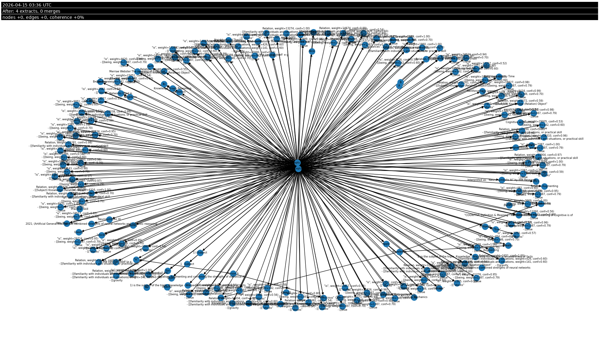](graph-2026-04-15-03-36-extract-subideas.png) [commit](https://github.com/BoggersTheFish/BoggersTheCIG/commit/a665a6b)

### 2026-04-15 04:02 UTC

**After:** vault analysis (+954 triples) — nodes +0, edges +2, coherence +0%

[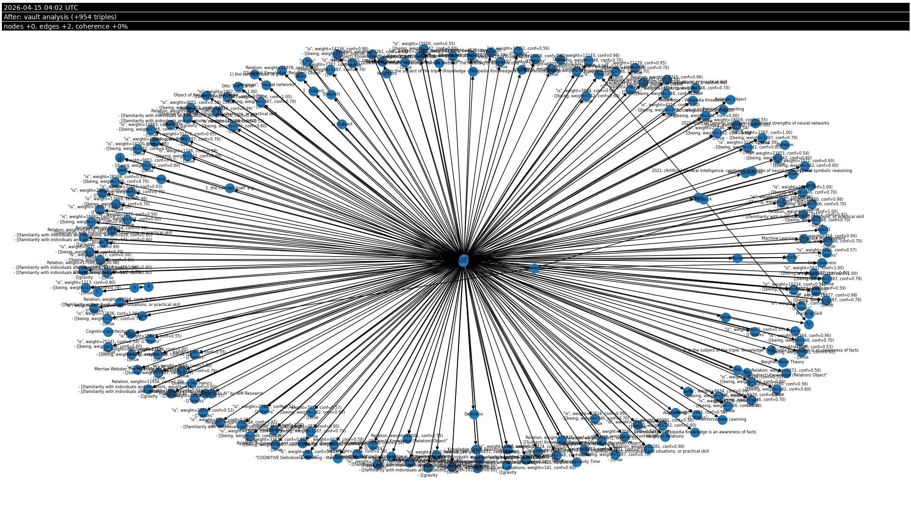](graph-2026-04-15-04-02-after-analyze-vault.png) [commit](https://github.com/BoggersTheFish/BoggersTheCIG/commit/a665a6b)

### 2026-04-15 04:02 UTC

**After:** 4 extracts, 0 merges — nodes +0, edges +0, coherence +0%

[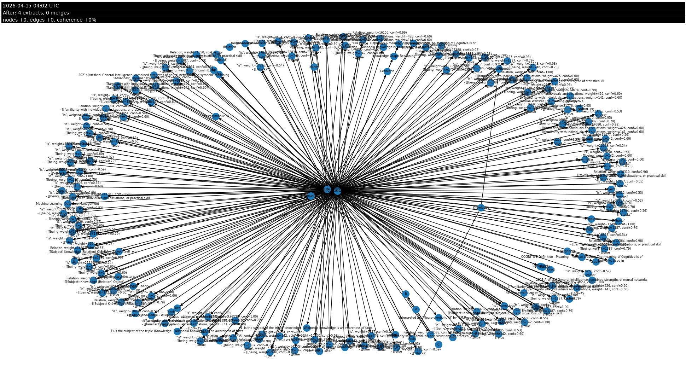](graph-2026-04-15-04-02-extract-subideas.png) [commit](https://github.com/BoggersTheFish/BoggersTheCIG/commit/a665a6b)

### 2026-04-15 04:42 UTC

**After:** vault organize (13 moves) — nodes +0, edges +0, coherence +0%

[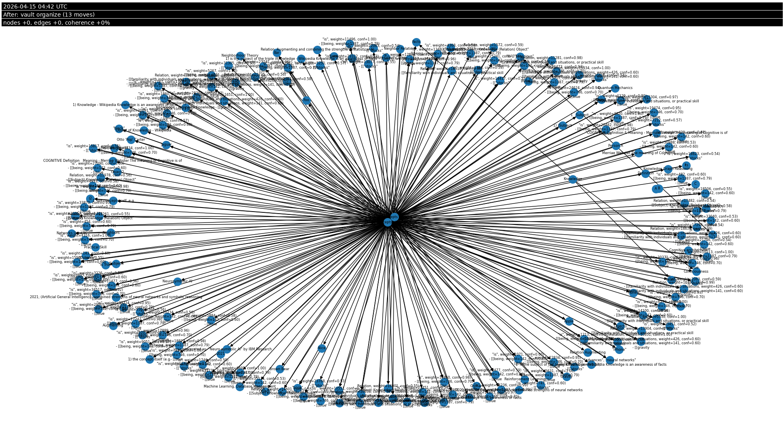](graph-2026-04-15-04-42-after-organize.png) [commit](https://github.com/BoggersTheFish/BoggersTheCIG/commit/a665a6b)

### 2026-04-15 04:42 UTC

**After:** 0 extracts, 4 merges — nodes +0, edges +0, coherence +0%

[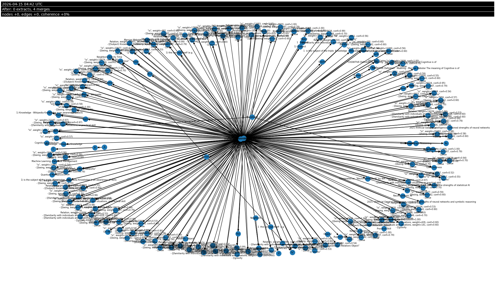](graph-2026-04-15-04-42-extract-subideas.png) [commit](https://github.com/BoggersTheFish/BoggersTheCIG/commit/a665a6b)

### 2026-04-15 04:42 UTC

**After:** +.md"+00.md"+2_.md"+A.md" — nodes +0, edges +0, coherence +0%

[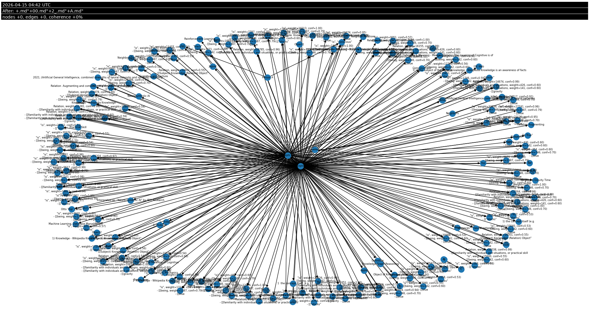](graph-2026-04-15-04-42-self-improve.png) [commit](https://github.com/BoggersTheFish/BoggersTheCIG/commit/a665a6b)

### 2026-04-15 05:17 UTC

**After:** vault organize (10 moves) — nodes +0, edges +0, coherence +0%

[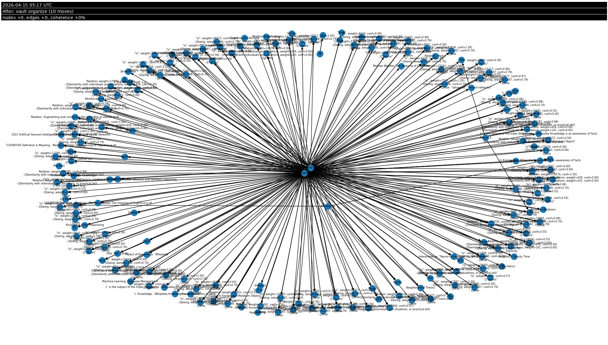](graph-2026-04-15-05-17-after-organize.png) [commit](https://github.com/BoggersTheFish/BoggersTheCIG/commit/a665a6b)

### 2026-04-15 05:18 UTC

**After:** 3 extracts, 1 merges — nodes +0, edges +0, coherence +0%

[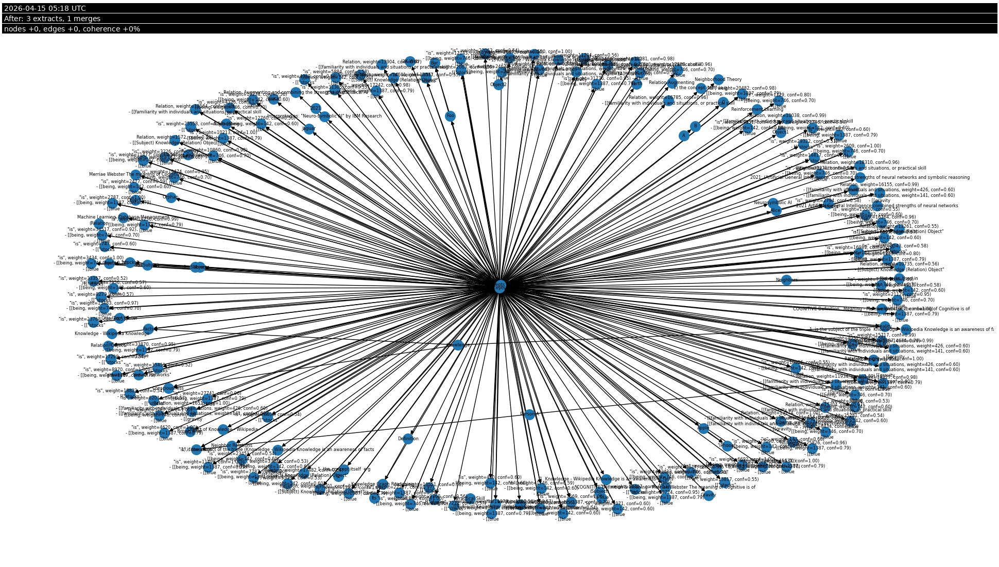](graph-2026-04-15-05-18-extract-subideas.png) [commit](https://github.com/BoggersTheFish/BoggersTheCIG/commit/a665a6b)

### 2026-04-15 05:18 UTC

**After:** +.md"+00.md"+2_.md"+A.md" — nodes +0, edges +0, coherence +0%

[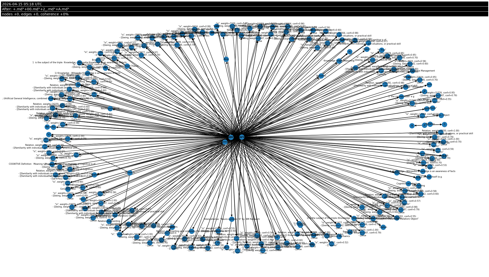](graph-2026-04-15-05-18-self-improve.png) [commit](https://github.com/BoggersTheFish/BoggersTheCIG/commit/a665a6b)

### 2026-04-15 07:38 UTC

**After:** vault organize (18 moves) — nodes +17, edges +17, coherence -2%

[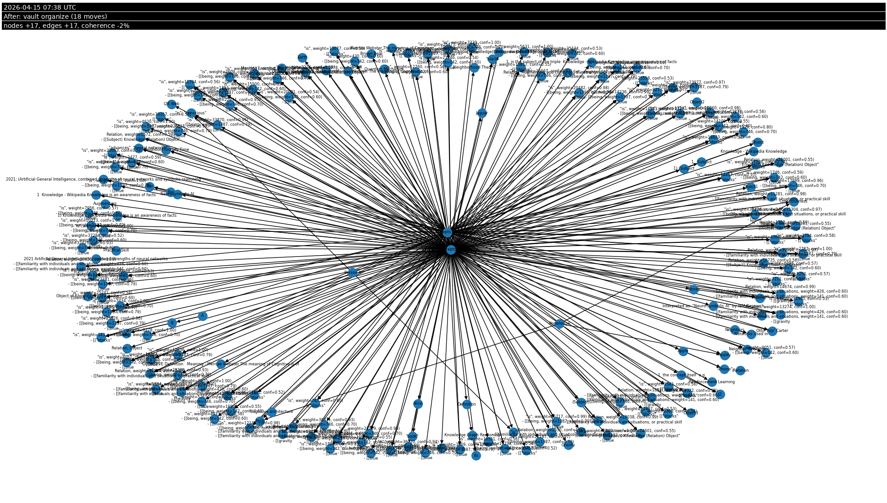](graph-2026-04-15-07-38-after-organize.png) [commit](https://github.com/BoggersTheFish/BoggersTheCIG/commit/64fee3d)

### 2026-04-15 07:38 UTC

**After:** 0 extracts, 4 merges — nodes +0, edges +0, coherence +0%

[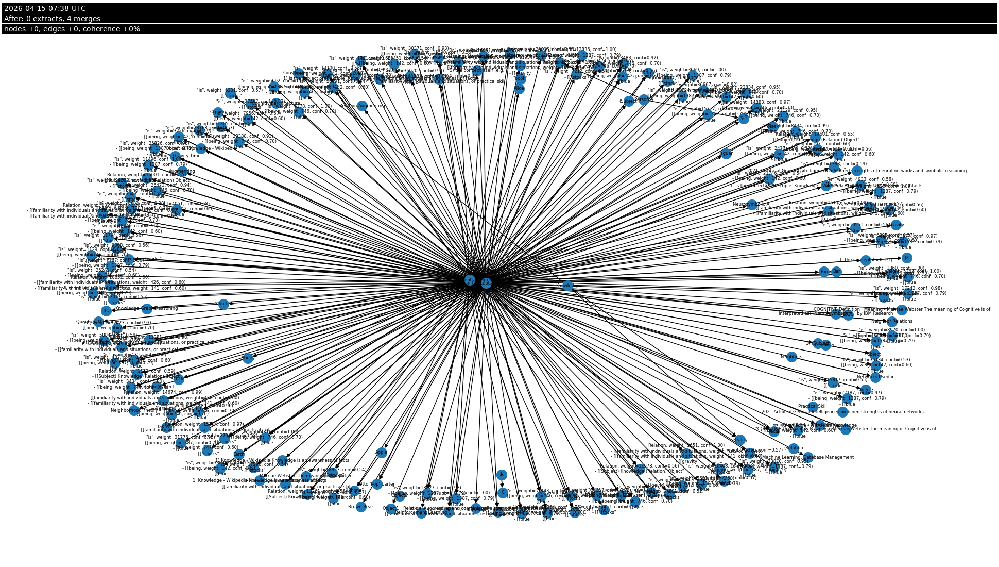](graph-2026-04-15-07-38-extract-subideas.png) [commit](https://github.com/BoggersTheFish/BoggersTheCIG/commit/64fee3d)

### 2026-04-15 07:38 UTC

**After:** +.md"+2_.md"+80.md"+A.md" — nodes +0, edges +0, coherence +0%

[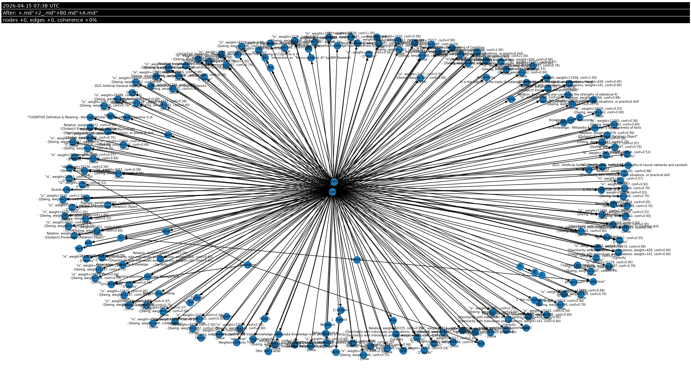](graph-2026-04-15-07-38-self-improve.png) [commit](https://github.com/BoggersTheFish/BoggersTheCIG/commit/64fee3d)

### 2026-04-15 07:39 UTC

**After:** external ingest (+4 triples) — nodes +6, edges +3, coherence -1%

[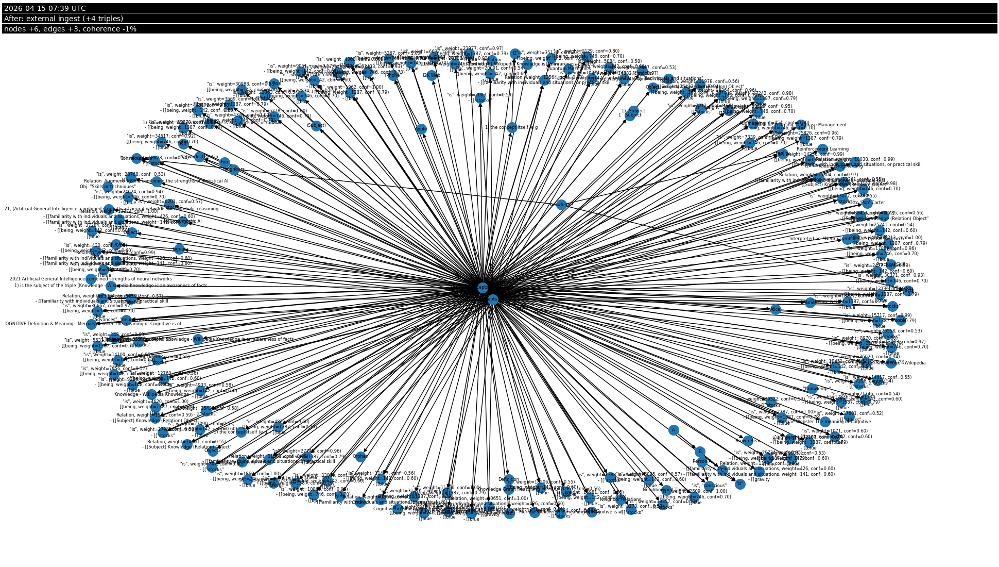](graph-2026-04-15-07-39-after-ingest.png) [commit](https://github.com/BoggersTheFish/BoggersTheCIG/commit/64fee3d)

### 2026-04-15 07:59 UTC

**After:** vault analysis (+999 triples) — nodes +6, edges +8, coherence +0%

[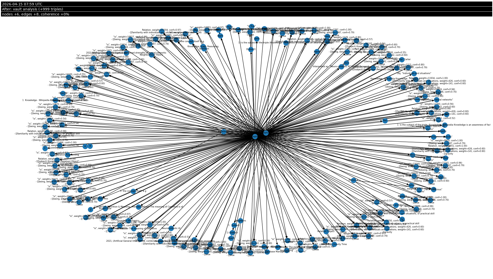](graph-2026-04-15-07-59-after-analyze-vault.png) [commit](https://github.com/BoggersTheFish/BoggersTheCIG/commit/64fee3d)

### 2026-04-15 07:59 UTC

**After:** 2 extracts, 0 merges — nodes +0, edges +0, coherence +0%

[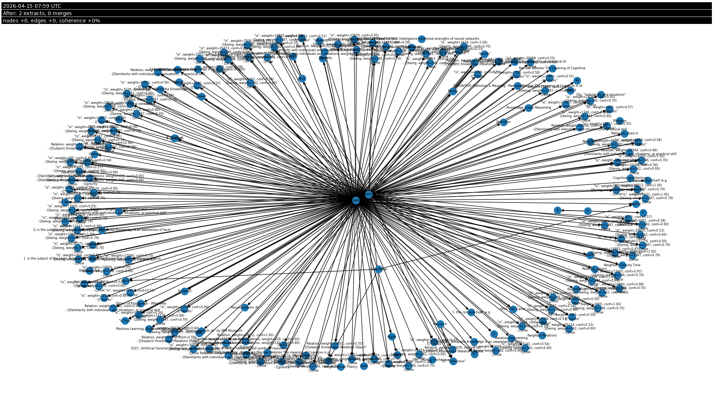](graph-2026-04-15-07-59-extract-subideas.png) [commit](https://github.com/BoggersTheFish/BoggersTheCIG/commit/64fee3d)

### 2026-04-15 08:20 UTC

**After:** vault analysis (+1000 triples) — nodes +0, edges +2, coherence +0%

[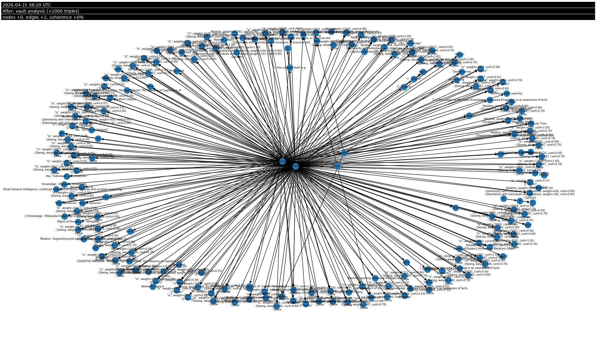](graph-2026-04-15-08-20-after-analyze-vault.png) [commit](https://github.com/BoggersTheFish/BoggersTheCIG/commit/64fee3d)

### 2026-04-15 08:20 UTC

**After:** 2 extracts, 0 merges — nodes +0, edges +0, coherence +0%

[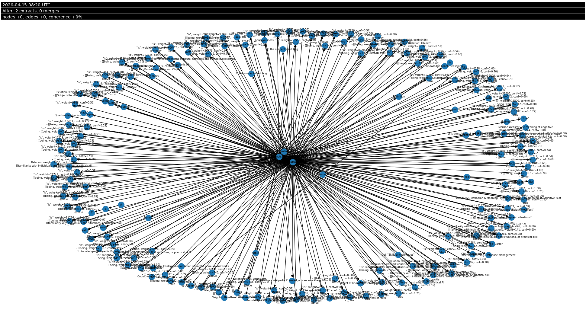](graph-2026-04-15-08-20-extract-subideas.png) [commit](https://github.com/BoggersTheFish/BoggersTheCIG/commit/64fee3d)

### 2026-04-15 09:01 UTC

**After:** vault organize (10 moves) — nodes +0, edges +0, coherence +0%

[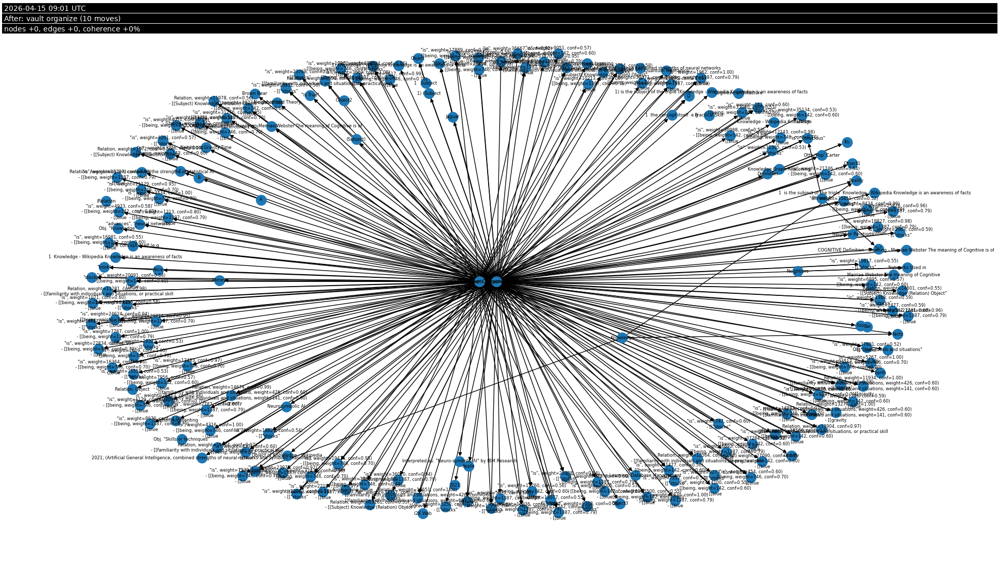](graph-2026-04-15-09-01-after-organize.png) [commit](https://github.com/BoggersTheFish/BoggersTheCIG/commit/64fee3d)

### 2026-04-15 09:02 UTC

**After:** 2 extracts, 2 merges — nodes +0, edges +0, coherence +0%

[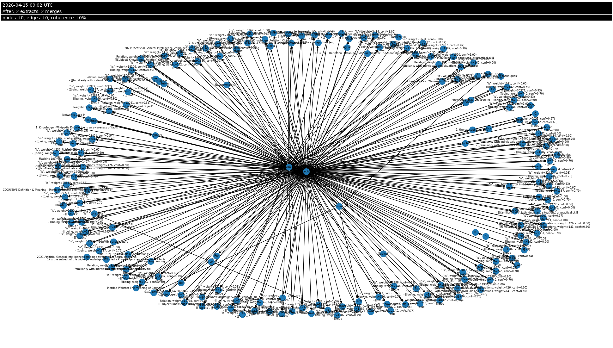](graph-2026-04-15-09-02-extract-subideas.png) [commit](https://github.com/BoggersTheFish/BoggersTheCIG/commit/64fee3d)

### 2026-04-15 09:02 UTC

**After:** +.md"+2_+2_.md"+80.md" — nodes +0, edges +0, coherence +0%

[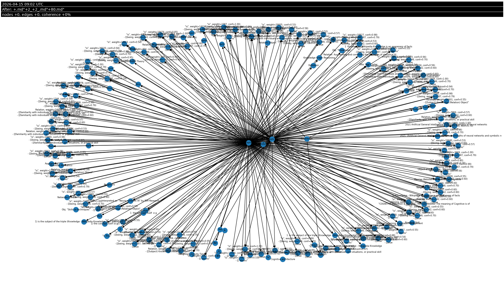](graph-2026-04-15-09-02-self-improve.png) [commit](https://github.com/BoggersTheFish/BoggersTheCIG/commit/64fee3d)

### 2026-04-15 09:41 UTC

**After:** vault organize (20 moves) — nodes +0, edges +0, coherence +0%

[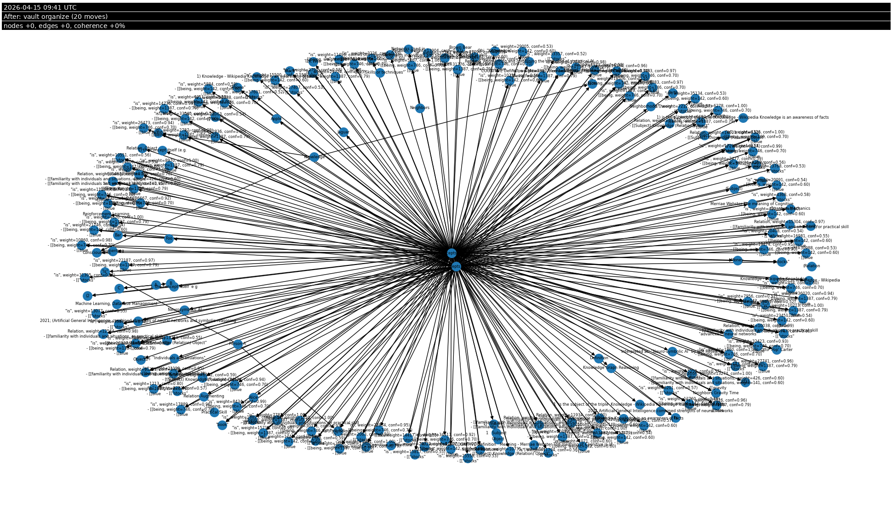](graph-2026-04-15-09-41-after-organize.png) [commit](https://github.com/BoggersTheFish/BoggersTheCIG/commit/64fee3d)

### 2026-04-15 09:42 UTC

**After:** 0 extracts, 4 merges — nodes +0, edges +0, coherence +0%

[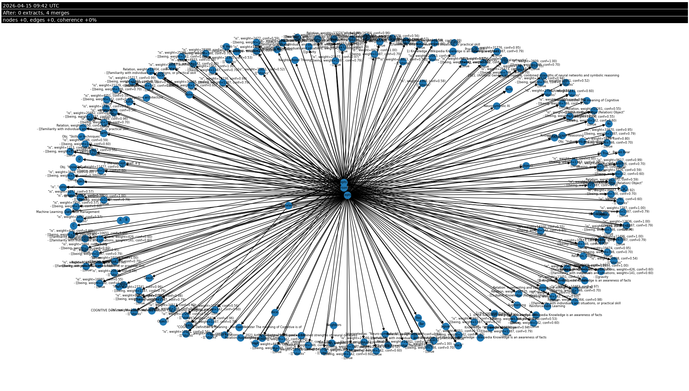](graph-2026-04-15-09-42-extract-subideas.png) [commit](https://github.com/BoggersTheFish/BoggersTheCIG/commit/64fee3d)

### 2026-04-15 09:42 UTC

**After:** +.md"+2_+2_.md"+80.md" — nodes +0, edges +0, coherence +0%

[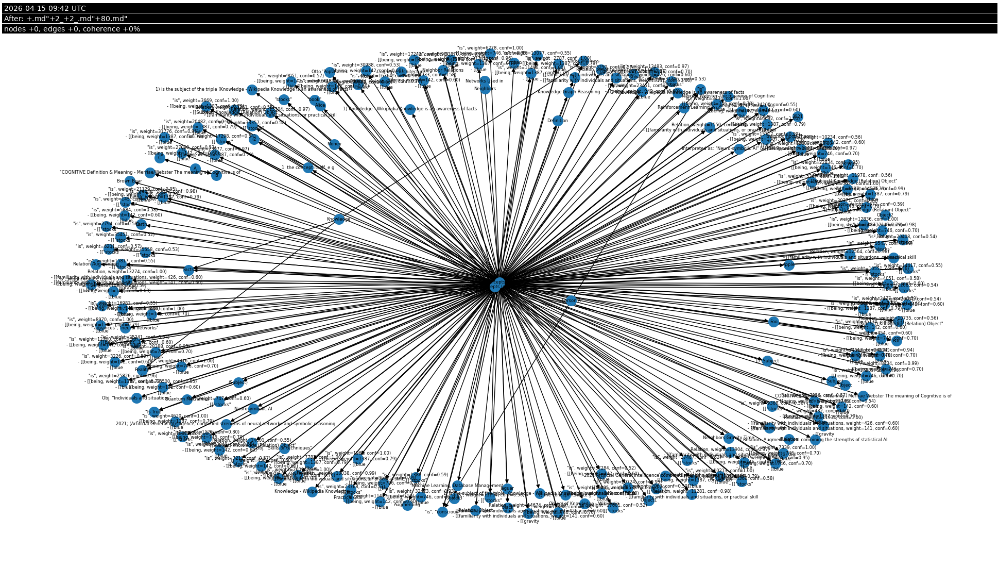](graph-2026-04-15-09-42-self-improve.png) [commit](https://github.com/BoggersTheFish/BoggersTheCIG/commit/64fee3d)

### 2026-04-15 11:42 UTC

**After:** vault organize (10 moves) — nodes +17, edges +17, coherence -2%

[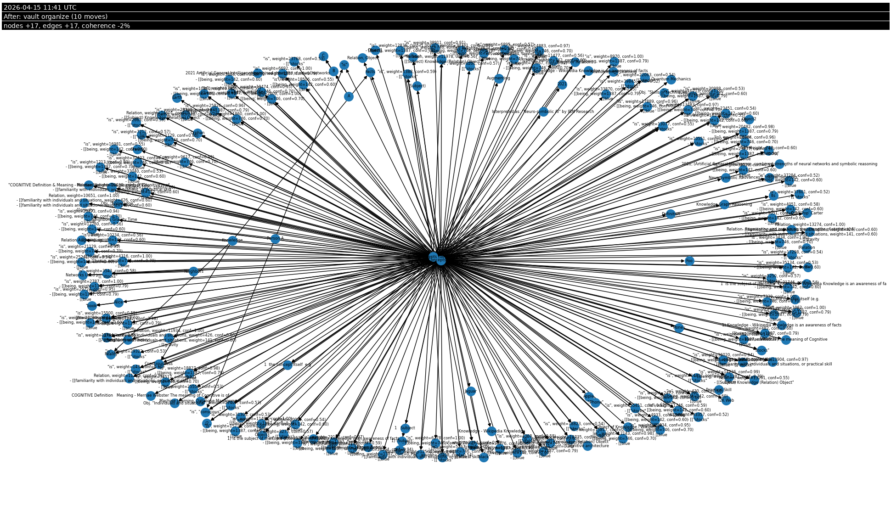](graph-2026-04-15-11-41-after-organize.png) [commit](https://github.com/BoggersTheFish/BoggersTheCIG/commit/96fc19d)

### 2026-04-15 11:42 UTC

**After:** 2 extracts, 2 merges — nodes +0, edges +0, coherence +0%

[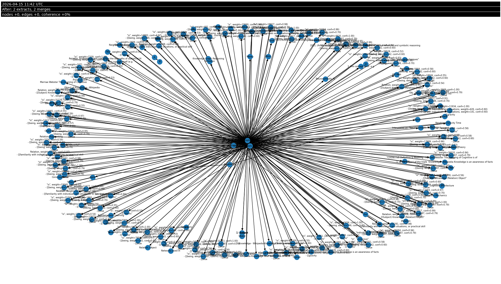](graph-2026-04-15-11-42-extract-subideas.png) [commit](https://github.com/BoggersTheFish/BoggersTheCIG/commit/96fc19d)

### 2026-04-15 11:42 UTC

**After:** +.md"+00.md"+2_.md"+A.md" — nodes +0, edges +0, coherence +0%

[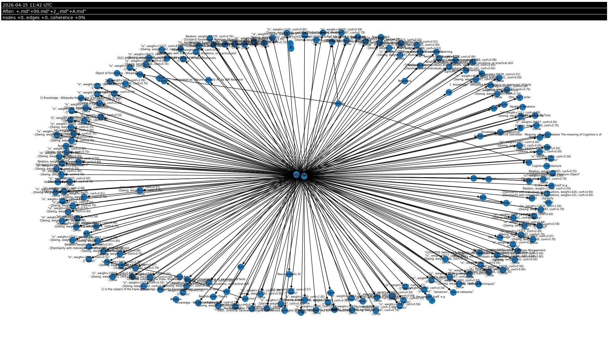](graph-2026-04-15-11-42-self-improve.png) [commit](https://github.com/BoggersTheFish/BoggersTheCIG/commit/96fc19d)

### 2026-04-15 11:43 UTC

**After:** external ingest (+2 triples) — nodes +1, edges +1, coherence +0%

[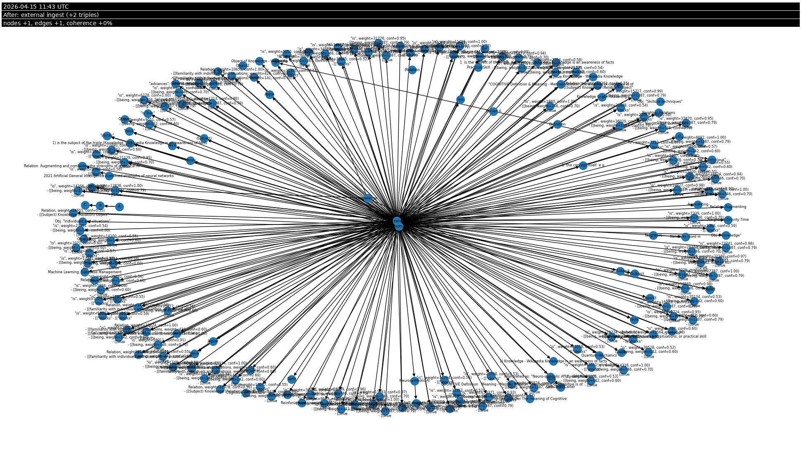](graph-2026-04-15-11-43-after-ingest.png) [commit](https://github.com/BoggersTheFish/BoggersTheCIG/commit/96fc19d)

### 2026-04-15 13:19 UTC

**After:** vault analysis (+1056 triples) — nodes +7, edges +9, coherence +0%

[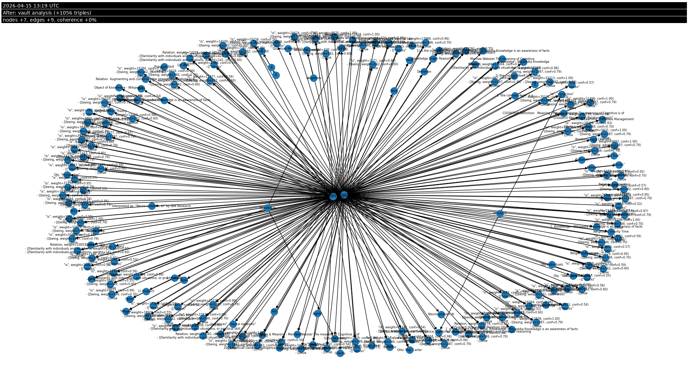](graph-2026-04-15-13-19-after-analyze-vault.png) [commit](https://github.com/BoggersTheFish/BoggersTheCIG/commit/96fc19d)

### 2026-04-15 13:19 UTC

**After:** 2 extracts, 0 merges — nodes +0, edges +0, coherence +0%

[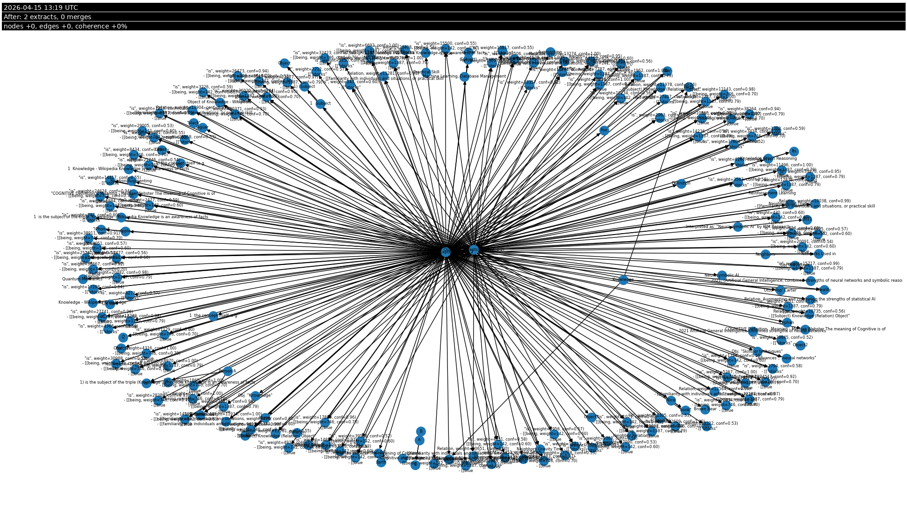](graph-2026-04-15-13-19-extract-subideas.png) [commit](https://github.com/BoggersTheFish/BoggersTheCIG/commit/96fc19d)

### 2026-04-15 15:05 UTC

**After:** vault analysis (+1056 triples) — nodes +0, edges +2, coherence +0%

[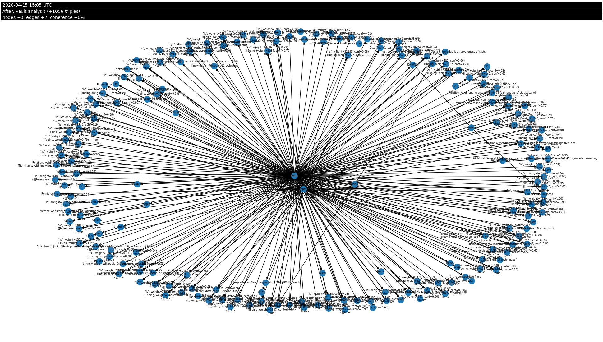](graph-2026-04-15-15-05-after-analyze-vault.png) [commit](https://github.com/BoggersTheFish/BoggersTheCIG/commit/96fc19d)

### 2026-04-15 15:05 UTC

**After:** 2 extracts, 0 merges — nodes +0, edges +0, coherence +0%

[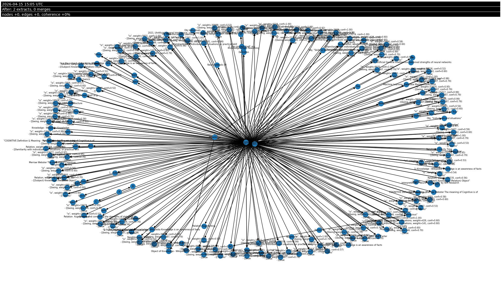](graph-2026-04-15-15-05-extract-subideas.png) [commit](https://github.com/BoggersTheFish/BoggersTheCIG/commit/96fc19d)

### 2026-04-15 15:44 UTC

**After:** vault organize (17 moves) — nodes +0, edges +0, coherence +0%

[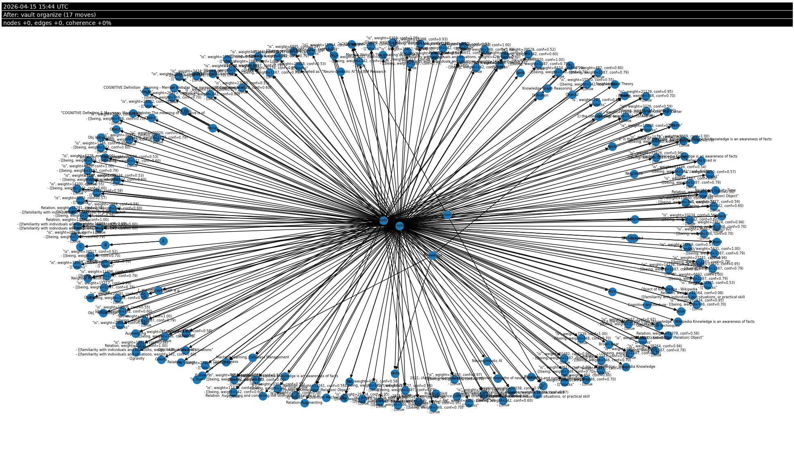](graph-2026-04-15-15-44-after-organize.png) [commit](https://github.com/BoggersTheFish/BoggersTheCIG/commit/96fc19d)

### 2026-04-15 15:44 UTC

**After:** 2 extracts, 2 merges — nodes +0, edges +0, coherence +0%

[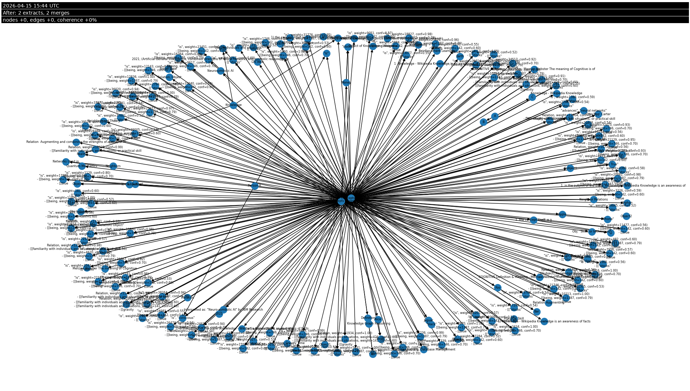](graph-2026-04-15-15-44-extract-subideas.png) [commit](https://github.com/BoggersTheFish/BoggersTheCIG/commit/96fc19d)

### 2026-04-15 15:44 UTC

**After:** +.md"+00.md"+1.md"+2_ — nodes +0, edges +0, coherence +0%

[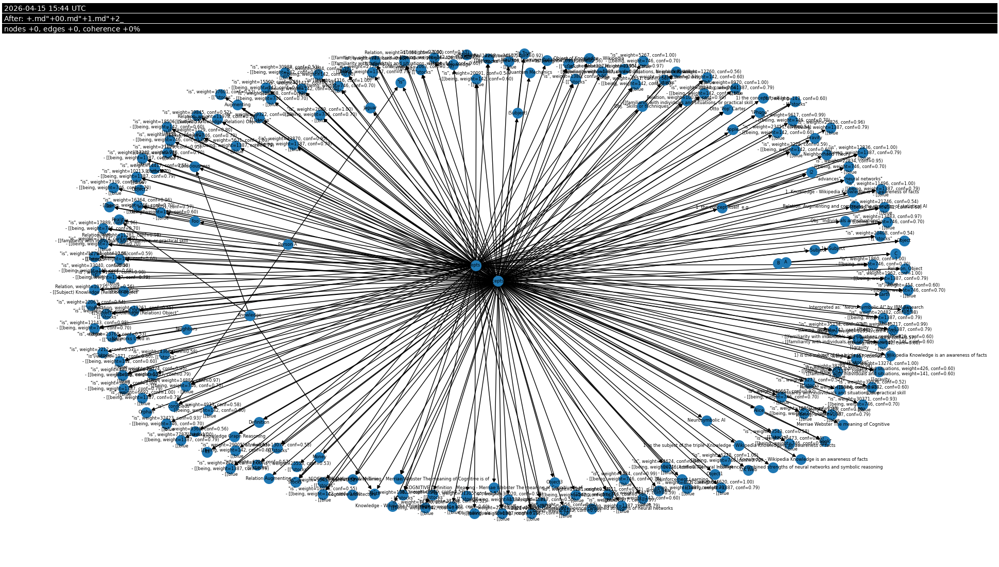](graph-2026-04-15-15-44-self-improve.png) [commit](https://github.com/BoggersTheFish/BoggersTheCIG/commit/96fc19d)

### 2026-04-15 16:14 UTC

**After:** vault organize (10 moves) — nodes +0, edges +0, coherence +0%

[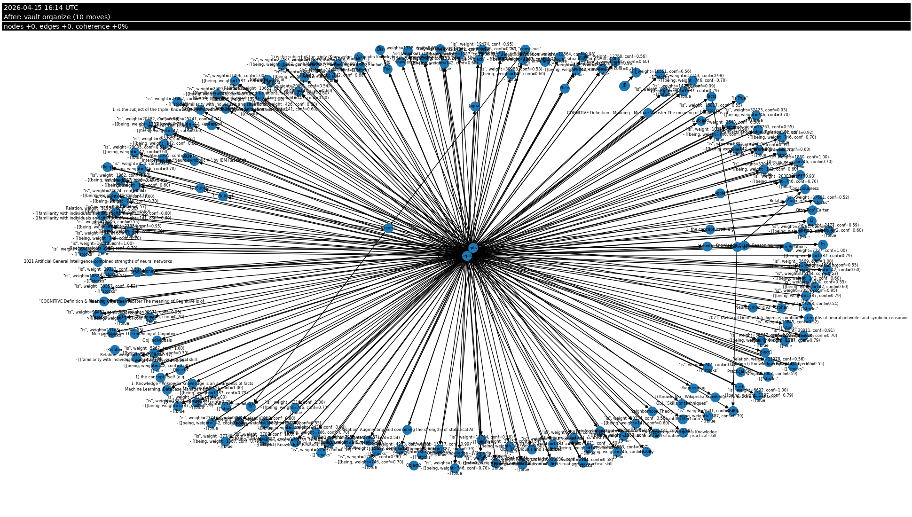](graph-2026-04-15-16-14-after-organize.png) [commit](https://github.com/BoggersTheFish/BoggersTheCIG/commit/96fc19d)

### 2026-04-15 16:14 UTC

**After:** 0 extracts, 4 merges — nodes +0, edges +0, coherence +0%

[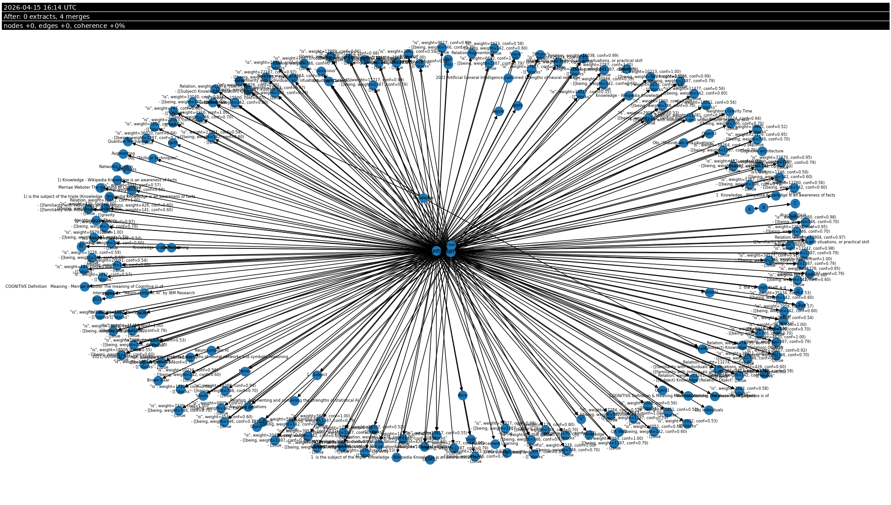](graph-2026-04-15-16-14-extract-subideas.png) [commit](https://github.com/BoggersTheFish/BoggersTheCIG/commit/96fc19d)

### 2026-04-15 16:14 UTC

**After:** +.md"+00.md"+1.md"+2_ — nodes +0, edges +0, coherence +0%

[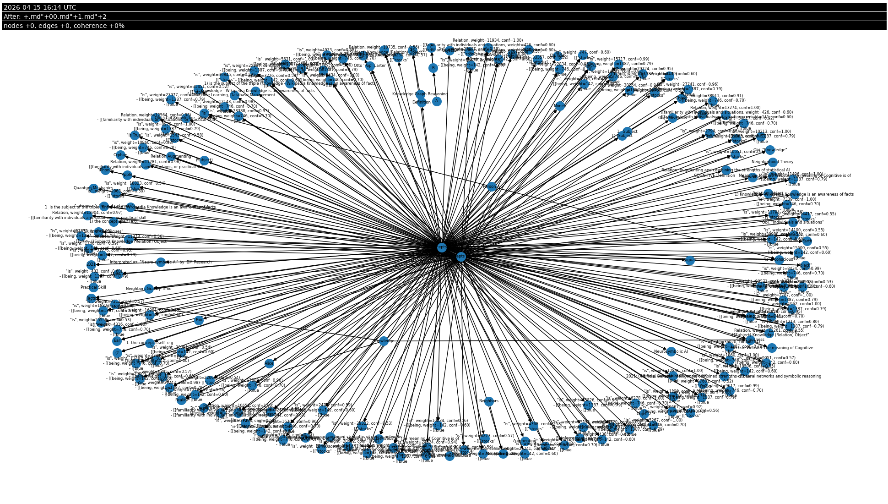](graph-2026-04-15-16-14-self-improve.png) [commit](https://github.com/BoggersTheFish/BoggersTheCIG/commit/96fc19d)

### 2026-04-15 21:28 UTC

**After:** vault organize (8 moves) — nodes +17, edges +17, coherence -2%

[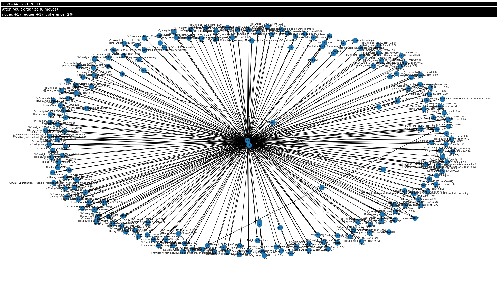](graph-2026-04-15-21-28-after-organize.png) [commit](https://github.com/BoggersTheFish/BoggersTheCIG/commit/394b8a0)

### 2026-04-15 21:29 UTC

**After:** 3 extracts, 1 merges — nodes +0, edges +0, coherence +0%

[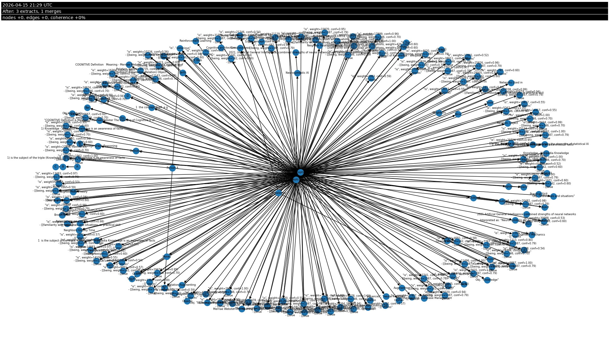](graph-2026-04-15-21-29-extract-subideas.png) [commit](https://github.com/BoggersTheFish/BoggersTheCIG/commit/394b8a0)

### 2026-04-15 21:29 UTC

**After:** +.md"+1.md"+2_+2_.md" — nodes +0, edges +0, coherence +0%

[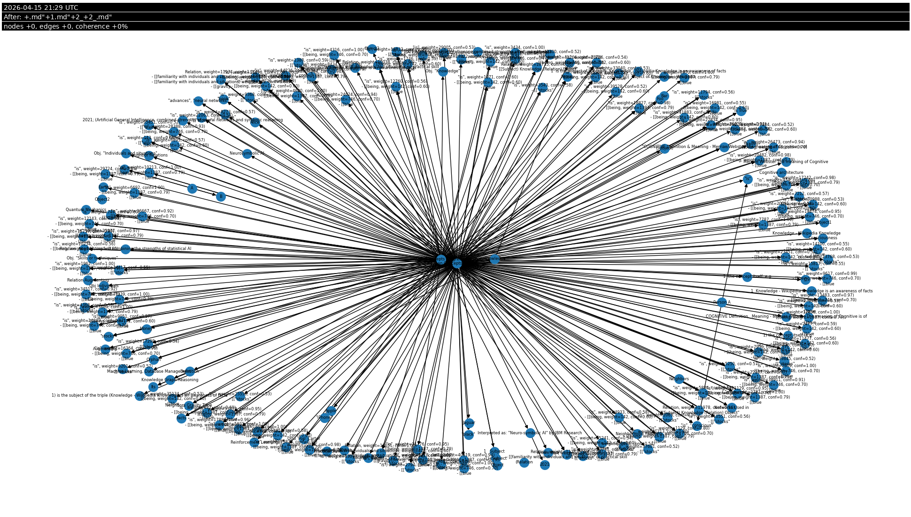](graph-2026-04-15-21-29-self-improve.png) [commit](https://github.com/BoggersTheFish/BoggersTheCIG/commit/394b8a0)

### 2026-04-15 21:29 UTC

**After:** external ingest (+1 triples) — nodes +2, edges +1, coherence +0%

[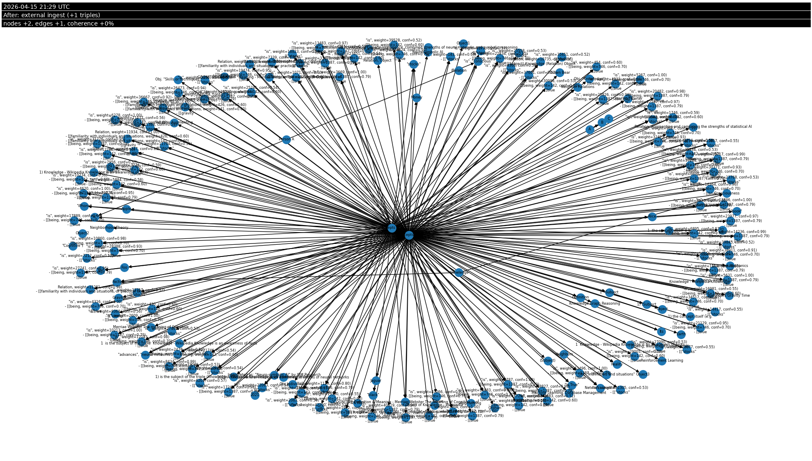](graph-2026-04-15-21-29-after-ingest.png) [commit](https://github.com/BoggersTheFish/BoggersTheCIG/commit/394b8a0)

### 2026-04-15 22:01 UTC

**After:** vault analysis (+1096 triples) — nodes +3, edges +5, coherence +0%

[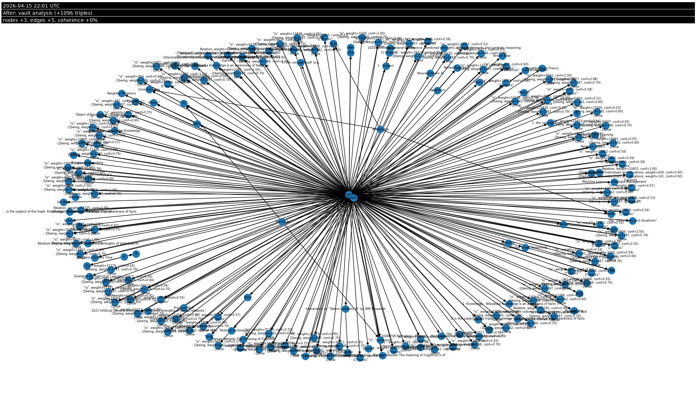](graph-2026-04-15-22-01-after-analyze-vault.png) [commit](https://github.com/BoggersTheFish/BoggersTheCIG/commit/394b8a0)

### 2026-04-15 22:02 UTC

**After:** 3 extracts, 0 merges — nodes +0, edges +0, coherence +0%

[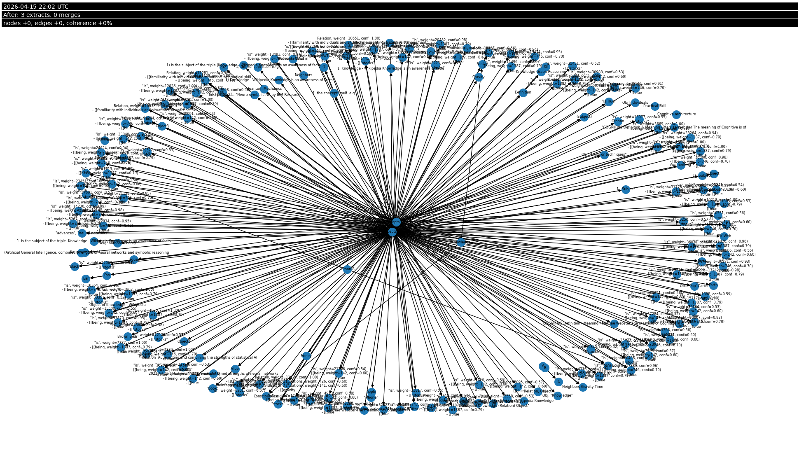](graph-2026-04-15-22-02-extract-subideas.png) [commit](https://github.com/BoggersTheFish/BoggersTheCIG/commit/394b8a0)

### 2026-04-15 22:34 UTC

**After:** vault analysis (+1096 triples) — nodes +0, edges +2, coherence +0%

[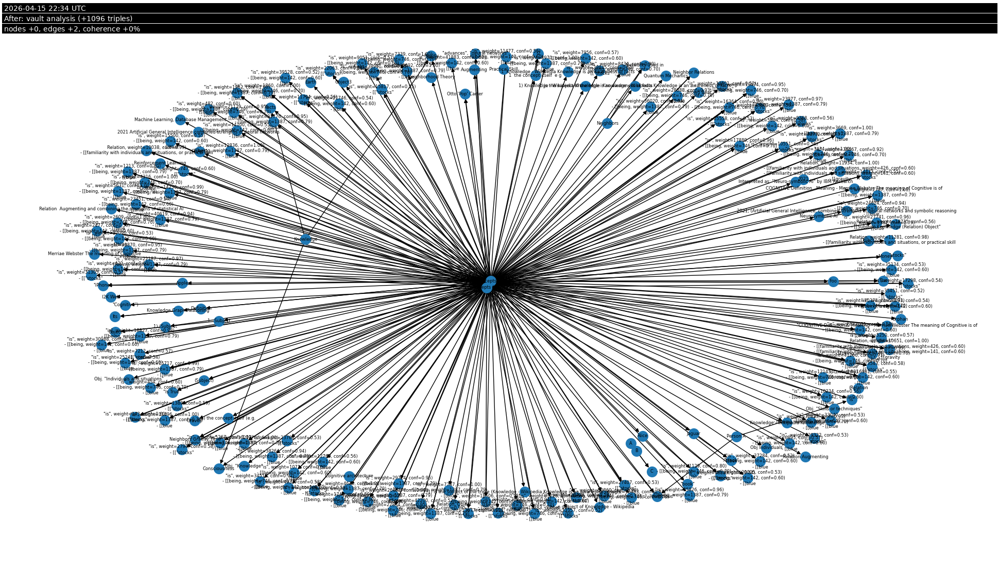](graph-2026-04-15-22-34-after-analyze-vault.png) [commit](https://github.com/BoggersTheFish/BoggersTheCIG/commit/394b8a0)

### 2026-04-15 22:34 UTC

**After:** 3 extracts, 0 merges — nodes +0, edges +0, coherence +0%

[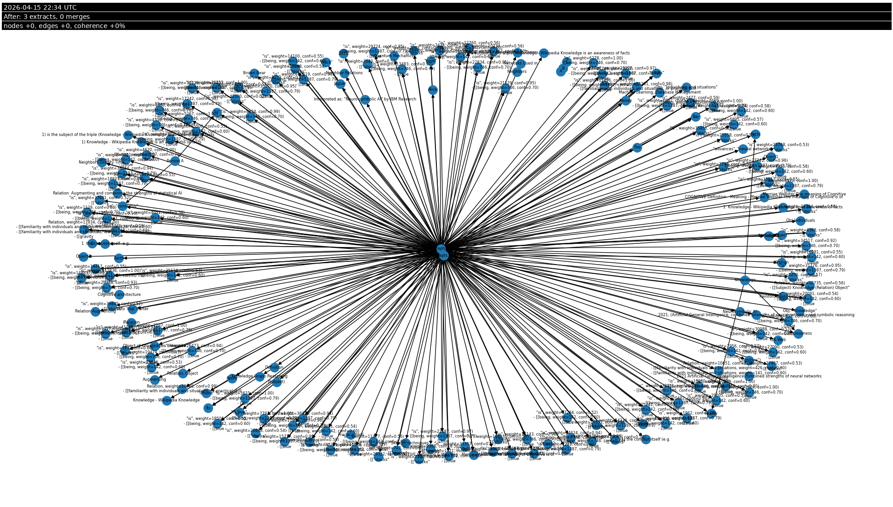](graph-2026-04-15-22-34-extract-subideas.png) [commit](https://github.com/BoggersTheFish/BoggersTheCIG/commit/394b8a0)

### 2026-04-15 23:16 UTC

**After:** vault organize (17 moves) — nodes +0, edges +0, coherence +0%

[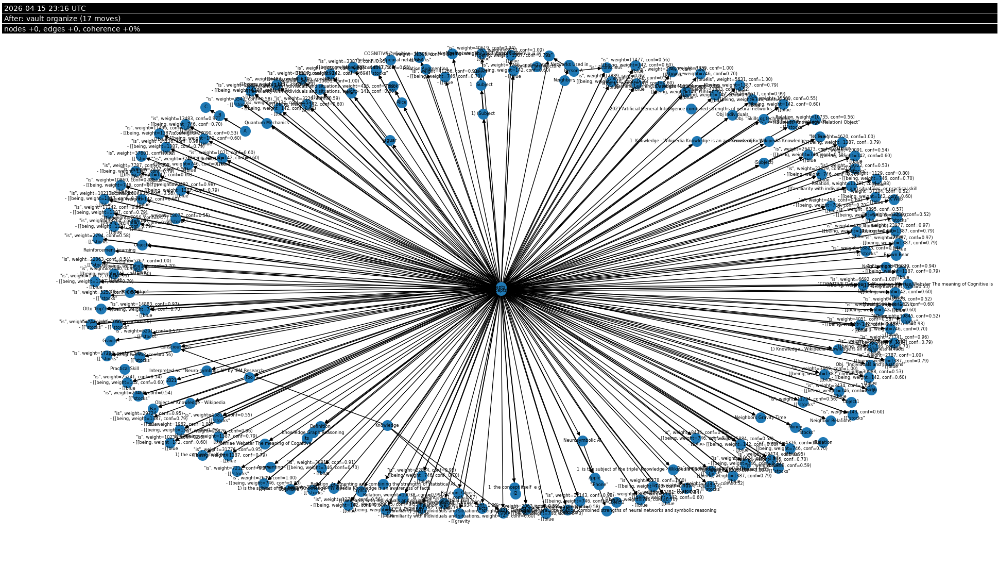](graph-2026-04-15-23-16-after-organize.png) [commit](https://github.com/BoggersTheFish/BoggersTheCIG/commit/394b8a0)

### 2026-04-15 23:17 UTC

**After:** 1 extracts, 3 merges — nodes +0, edges +0, coherence +0%

[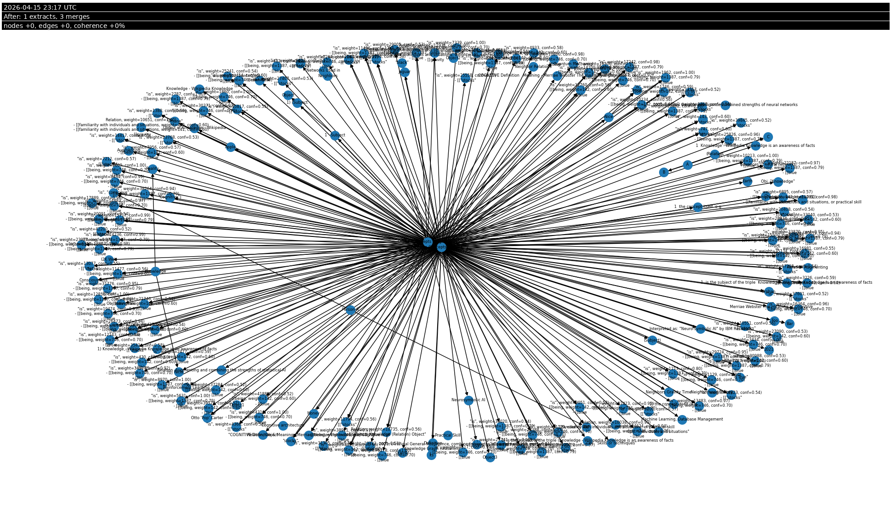](graph-2026-04-15-23-17-extract-subideas.png) [commit](https://github.com/BoggersTheFish/BoggersTheCIG/commit/394b8a0)

### 2026-04-15 23:17 UTC

**After:** +.md"+1.md"+2_+2_.md" — nodes +0, edges +0, coherence +0%

[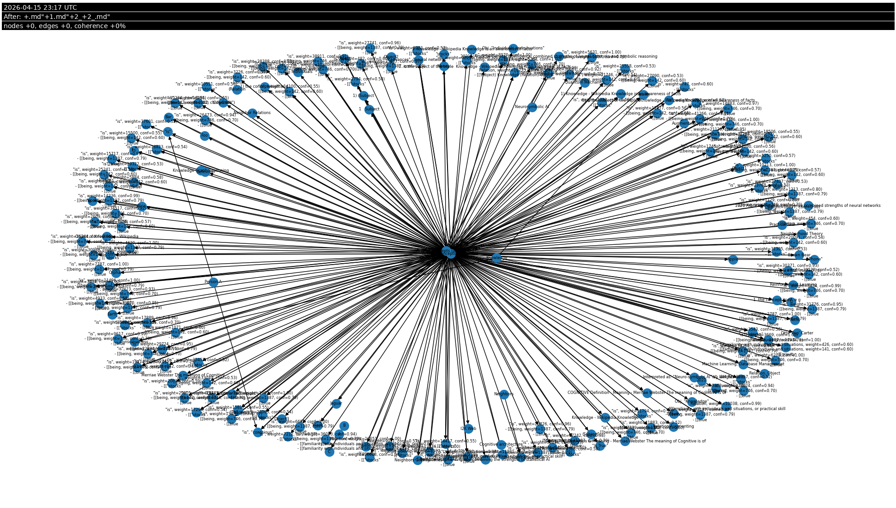](graph-2026-04-15-23-17-self-improve.png) [commit](https://github.com/BoggersTheFish/BoggersTheCIG/commit/394b8a0)

### 2026-04-15 23:54 UTC

**After:** vault organize (16 moves) — nodes +0, edges +0, coherence +0%

[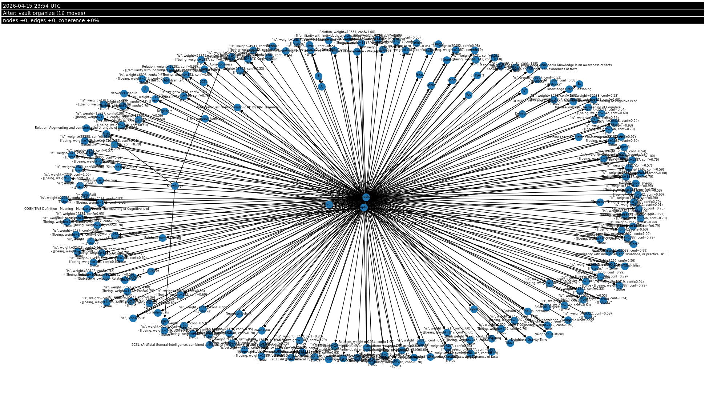](graph-2026-04-15-23-54-after-organize.png) [commit](https://github.com/BoggersTheFish/BoggersTheCIG/commit/394b8a0)

### 2026-04-15 23:54 UTC

**After:** 2 extracts, 2 merges — nodes +0, edges +0, coherence +0%

[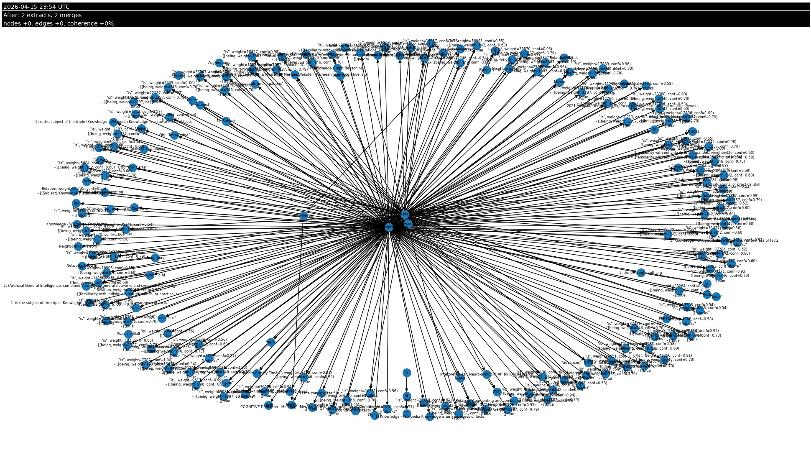](graph-2026-04-15-23-54-extract-subideas.png) [commit](https://github.com/BoggersTheFish/BoggersTheCIG/commit/394b8a0)

### 2026-04-15 23:54 UTC

**After:** +.md"+00.md"+1.md"+2_ — nodes +0, edges +0, coherence +0%

[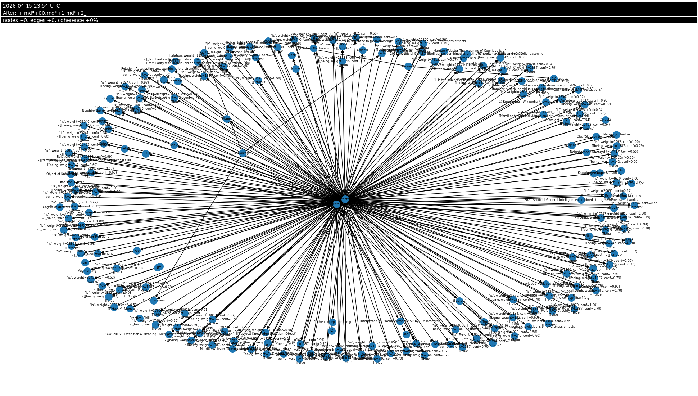](graph-2026-04-15-23-54-self-improve.png) [commit](https://github.com/BoggersTheFish/BoggersTheCIG/commit/394b8a0)

### 2026-04-16 03:15 UTC

**After:** vault organize (13 moves) — nodes +17, edges +17, coherence -2%

[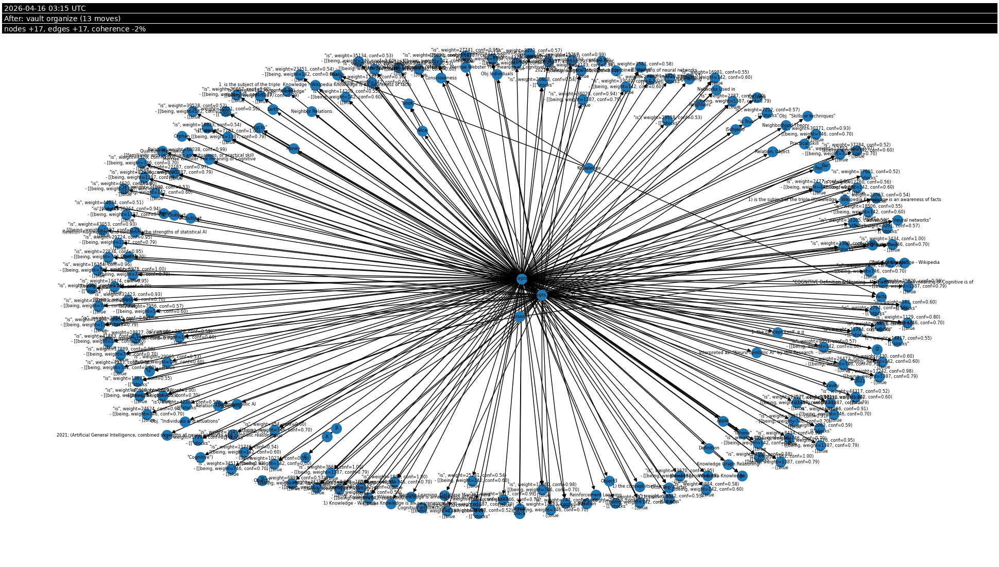](graph-2026-04-16-03-15-after-organize.png) [commit](https://github.com/BoggersTheFish/BoggersTheCIG/commit/93ced60)

### 2026-04-16 03:15 UTC

**After:** 1 extracts, 3 merges — nodes +0, edges +0, coherence +0%

[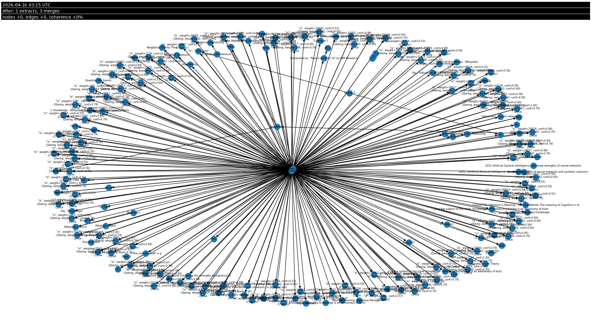](graph-2026-04-16-03-15-extract-subideas.png) [commit](https://github.com/BoggersTheFish/BoggersTheCIG/commit/93ced60)

### 2026-04-16 03:15 UTC

**After:** .md"+00.md"+1.md"+2_+2_.md" — nodes +0, edges +0, coherence +0%

[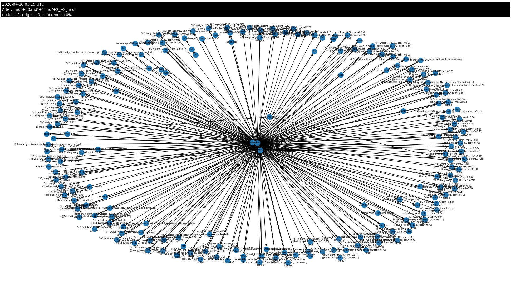](graph-2026-04-16-03-15-self-improve.png) [commit](https://github.com/BoggersTheFish/BoggersTheCIG/commit/93ced60)

### 2026-04-16 03:16 UTC

**After:** external ingest (+2 triples) — nodes +3, edges +2, coherence +0%

[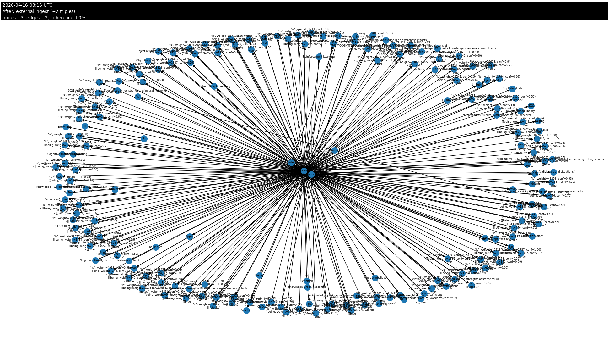](graph-2026-04-16-03-16-after-ingest.png) [commit](https://github.com/BoggersTheFish/BoggersTheCIG/commit/93ced60)

### 2026-04-16 03:48 UTC

**After:** vault analysis (+1149 triples) — nodes +4, edges +6, coherence +0%

[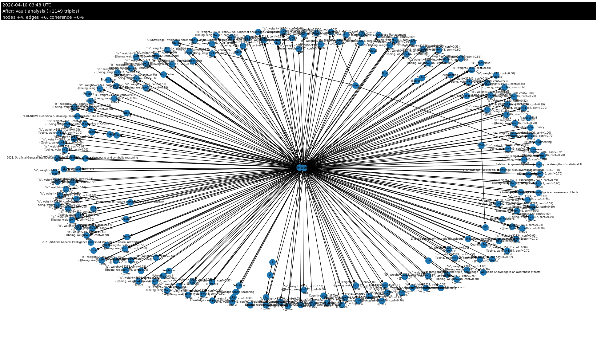](graph-2026-04-16-03-48-after-analyze-vault.png) [commit](https://github.com/BoggersTheFish/BoggersTheCIG/commit/93ced60)

### 2026-04-16 03:49 UTC

**After:** 2 extracts, 0 merges — nodes +0, edges +0, coherence +0%

[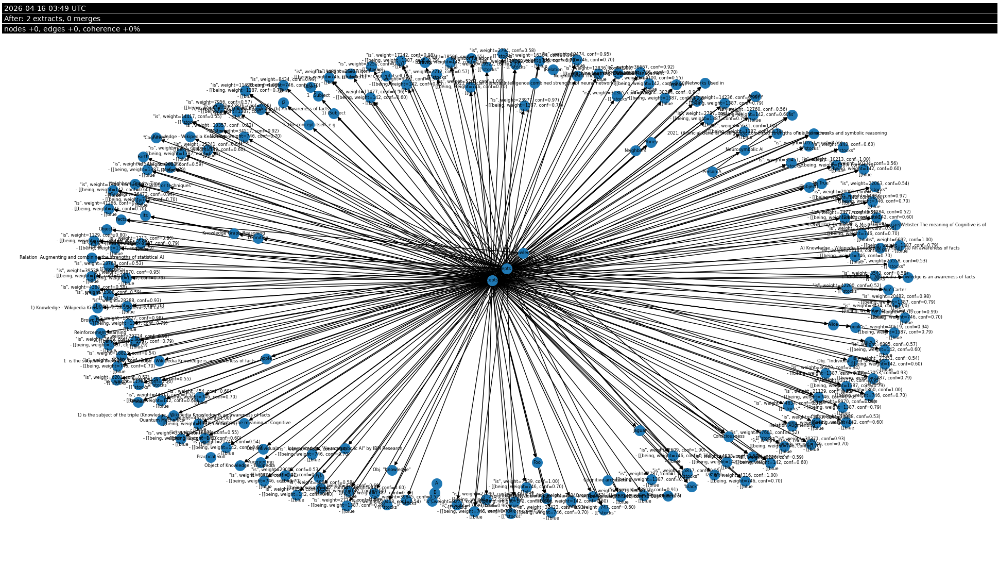](graph-2026-04-16-03-49-extract-subideas.png) [commit](https://github.com/BoggersTheFish/BoggersTheCIG/commit/93ced60)

### 2026-04-16 04:21 UTC

**After:** vault analysis (+1150 triples) — nodes +0, edges +2, coherence +0%

[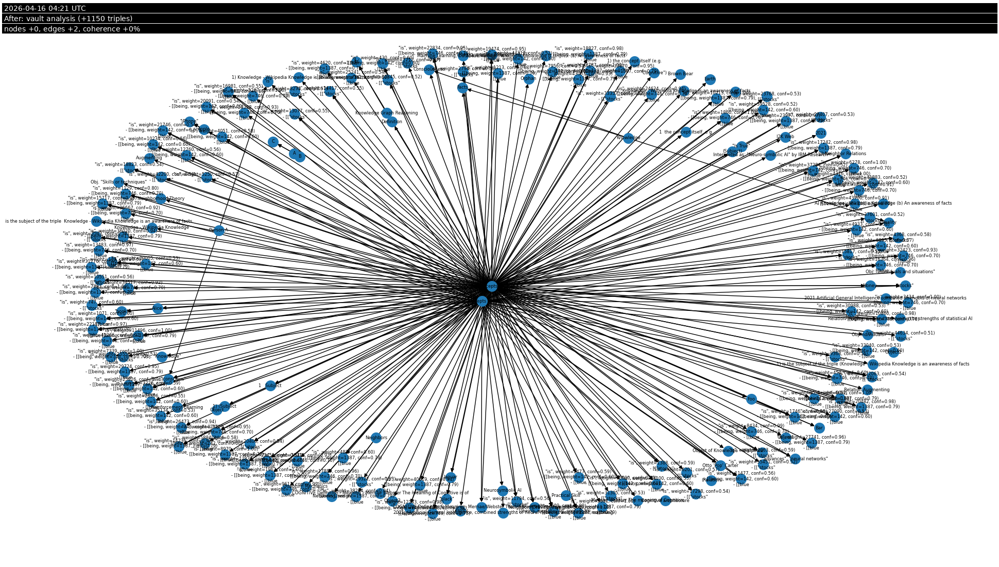](graph-2026-04-16-04-21-after-analyze-vault.png) [commit](https://github.com/BoggersTheFish/BoggersTheCIG/commit/93ced60)

### 2026-04-16 04:21 UTC

**After:** 2 extracts, 0 merges — nodes +0, edges +0, coherence +0%

[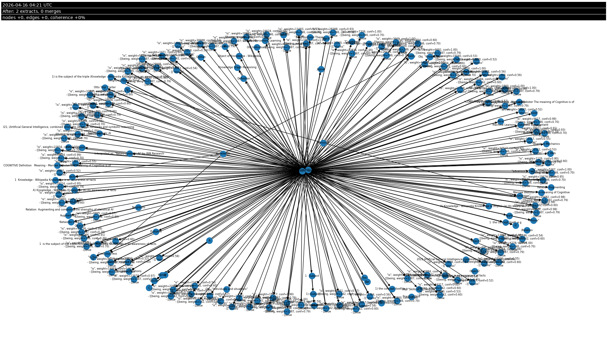](graph-2026-04-16-04-21-extract-subideas.png) [commit](https://github.com/BoggersTheFish/BoggersTheCIG/commit/93ced60)

### 2026-04-16 05:01 UTC

**After:** vault organize (14 moves) — nodes +0, edges +0, coherence +0%

[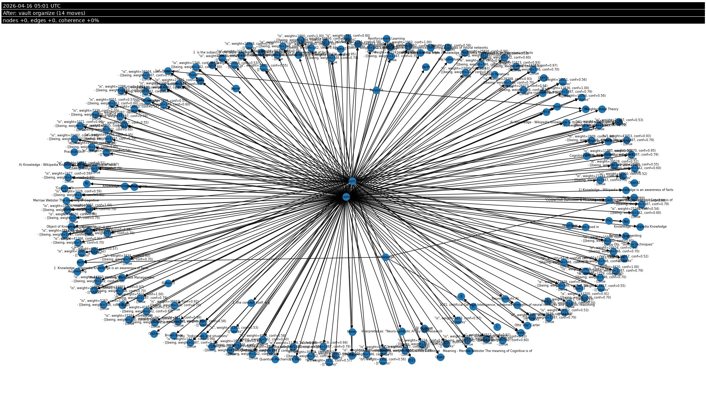](graph-2026-04-16-05-01-after-organize.png) [commit](https://github.com/BoggersTheFish/BoggersTheCIG/commit/93ced60)

### 2026-04-16 05:01 UTC

**After:** 2 extracts, 2 merges — nodes +0, edges +0, coherence +0%

[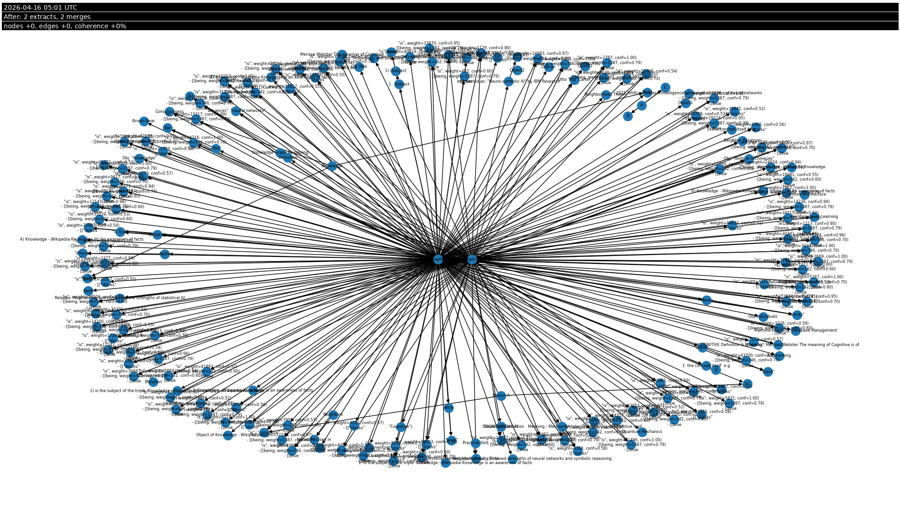](graph-2026-04-16-05-01-extract-subideas.png) [commit](https://github.com/BoggersTheFish/BoggersTheCIG/commit/93ced60)

### 2026-04-16 05:01 UTC

**After:** .md"+00.md"+1.md"+2_+2_.md" — nodes +0, edges +0, coherence +0%

[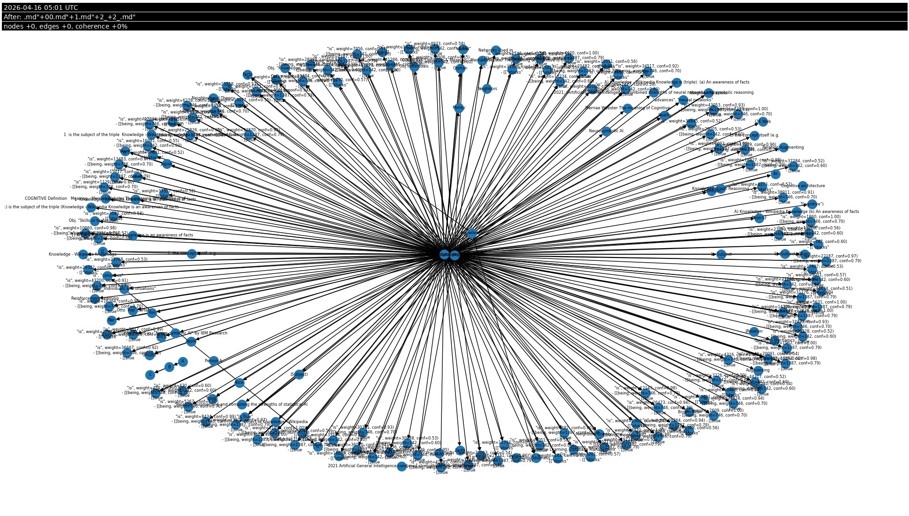](graph-2026-04-16-05-01-self-improve.png) [commit](https://github.com/BoggersTheFish/BoggersTheCIG/commit/93ced60)

### 2026-04-16 05:38 UTC

**After:** vault organize (8 moves) — nodes +2, edges +2, coherence +0%

[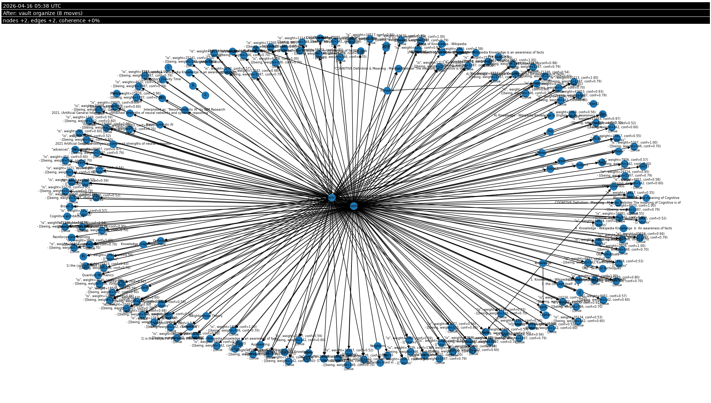](graph-2026-04-16-05-38-after-organize.png) [commit](https://github.com/BoggersTheFish/BoggersTheCIG/commit/93ced60)

### 2026-04-16 05:38 UTC

**After:** 0 extracts, 4 merges — nodes +0, edges +0, coherence +0%

[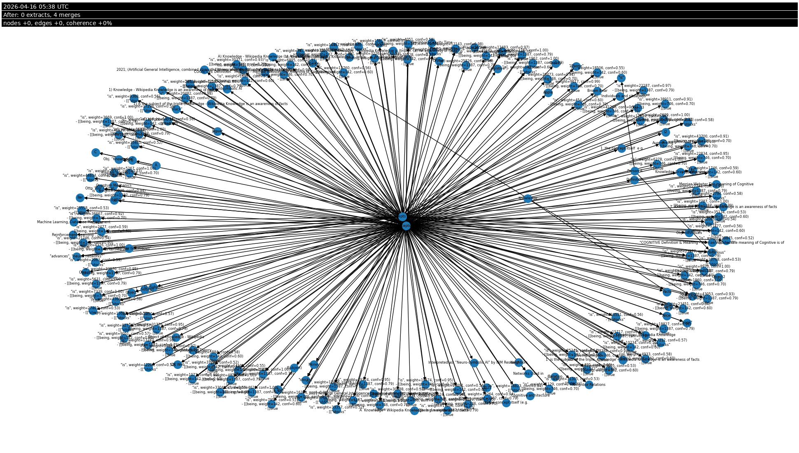](graph-2026-04-16-05-38-extract-subideas.png) [commit](https://github.com/BoggersTheFish/BoggersTheCIG/commit/93ced60)

### 2026-04-16 05:38 UTC

**After:** .md"+00.md"+1.md"+2_+2_.md" — nodes +0, edges +0, coherence +0%

[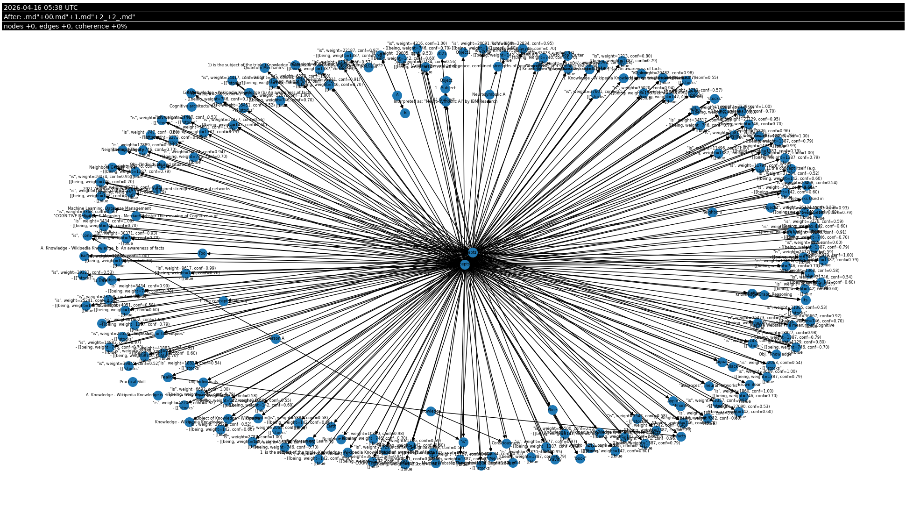](graph-2026-04-16-05-38-self-improve.png) [commit](https://github.com/BoggersTheFish/BoggersTheCIG/commit/93ced60)

### 2026-04-16 07:40 UTC

**After:** vault organize (11 moves) — nodes +17, edges +17, coherence -2%

[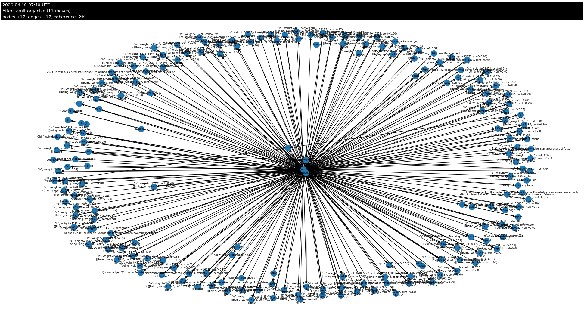](graph-2026-04-16-07-40-after-organize.png) [commit](https://github.com/BoggersTheFish/BoggersTheCIG/commit/7b2e4a2)

### 2026-04-16 07:40 UTC

**After:** 3 extracts, 1 merges — nodes +0, edges +0, coherence +0%

[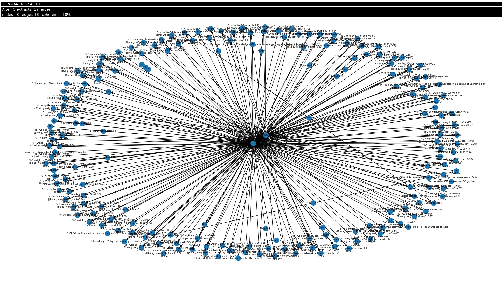](graph-2026-04-16-07-40-extract-subideas.png) [commit](https://github.com/BoggersTheFish/BoggersTheCIG/commit/7b2e4a2)

### 2026-04-16 07:40 UTC

**After:** .md"+00.md"+1.md"+2_+2_.md" — nodes +0, edges +0, coherence +0%

[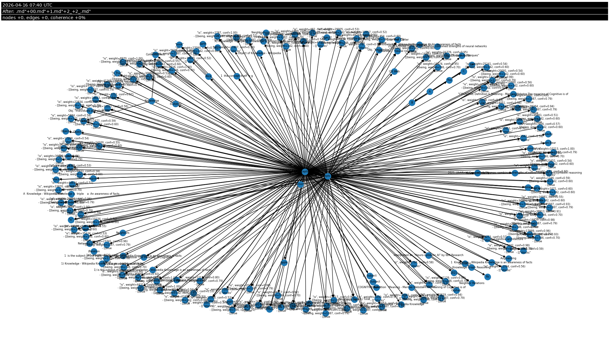](graph-2026-04-16-07-40-self-improve.png) [commit](https://github.com/BoggersTheFish/BoggersTheCIG/commit/7b2e4a2)

### 2026-04-16 07:41 UTC

**After:** external ingest (+1 triples) — nodes +2, edges +1, coherence +0%

[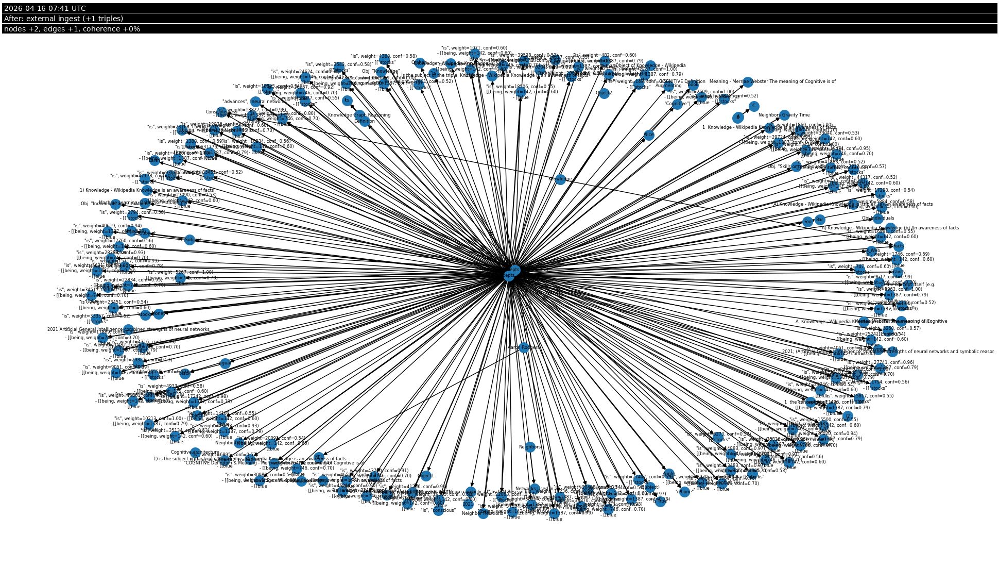](graph-2026-04-16-07-41-after-ingest.png) [commit](https://github.com/BoggersTheFish/BoggersTheCIG/commit/7b2e4a2)

### 2026-04-16 08:08 UTC

**After:** vault analysis (+1191 triples) — nodes +3, edges +5, coherence +0%

[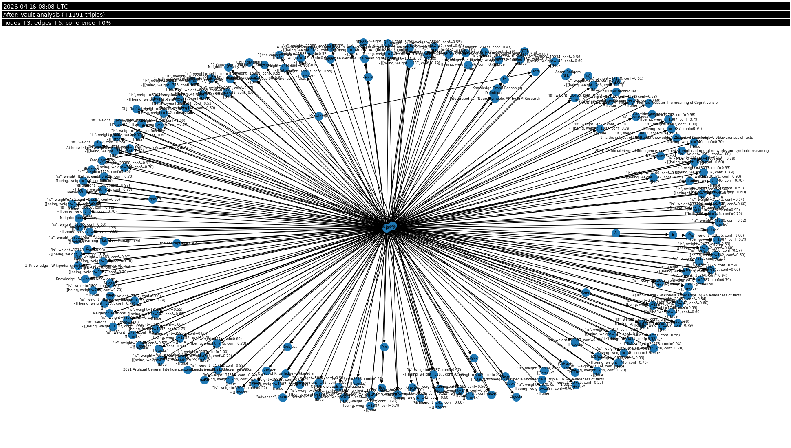](graph-2026-04-16-08-08-after-analyze-vault.png) [commit](https://github.com/BoggersTheFish/BoggersTheCIG/commit/7b2e4a2)

### 2026-04-16 08:08 UTC

**After:** 4 extracts, 0 merges — nodes +0, edges +0, coherence +0%

[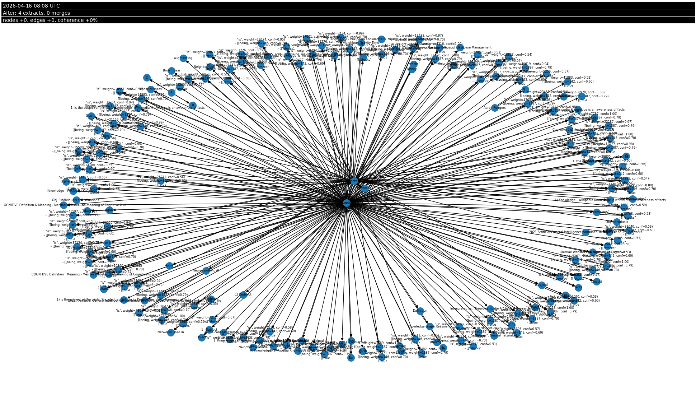](graph-2026-04-16-08-08-extract-subideas.png) [commit](https://github.com/BoggersTheFish/BoggersTheCIG/commit/7b2e4a2)

### 2026-04-16 08:36 UTC

**After:** vault analysis (+1192 triples) — nodes +0, edges +2, coherence +0%

[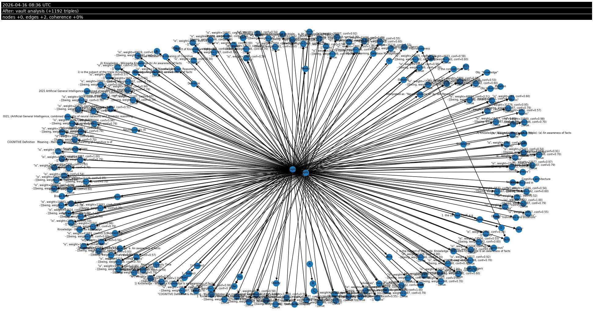](graph-2026-04-16-08-36-after-analyze-vault.png) [commit](https://github.com/BoggersTheFish/BoggersTheCIG/commit/7b2e4a2)

### 2026-04-16 08:36 UTC

**After:** 4 extracts, 0 merges — nodes +0, edges +0, coherence +0%

[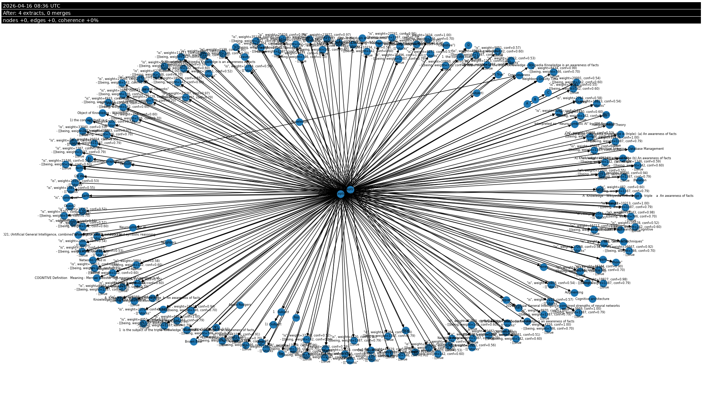](graph-2026-04-16-08-36-extract-subideas.png) [commit](https://github.com/BoggersTheFish/BoggersTheCIG/commit/7b2e4a2)

### 2026-04-16 09:18 UTC

**After:** vault organize (5 moves) — nodes +0, edges +0, coherence +0%

[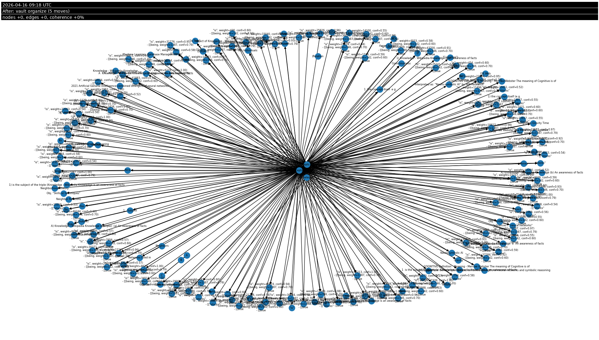](graph-2026-04-16-09-18-after-organize.png) [commit](https://github.com/BoggersTheFish/BoggersTheCIG/commit/7b2e4a2)

### 2026-04-16 09:19 UTC

**After:** 1 extracts, 3 merges — nodes +0, edges +0, coherence +0%

[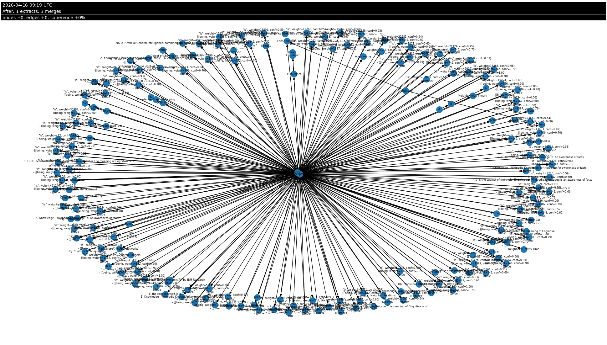](graph-2026-04-16-09-19-extract-subideas.png) [commit](https://github.com/BoggersTheFish/BoggersTheCIG/commit/7b2e4a2)

### 2026-04-16 09:19 UTC

**After:** .md"+00.md"+1.md"+2_+2_.md" — nodes +0, edges +0, coherence +0%

[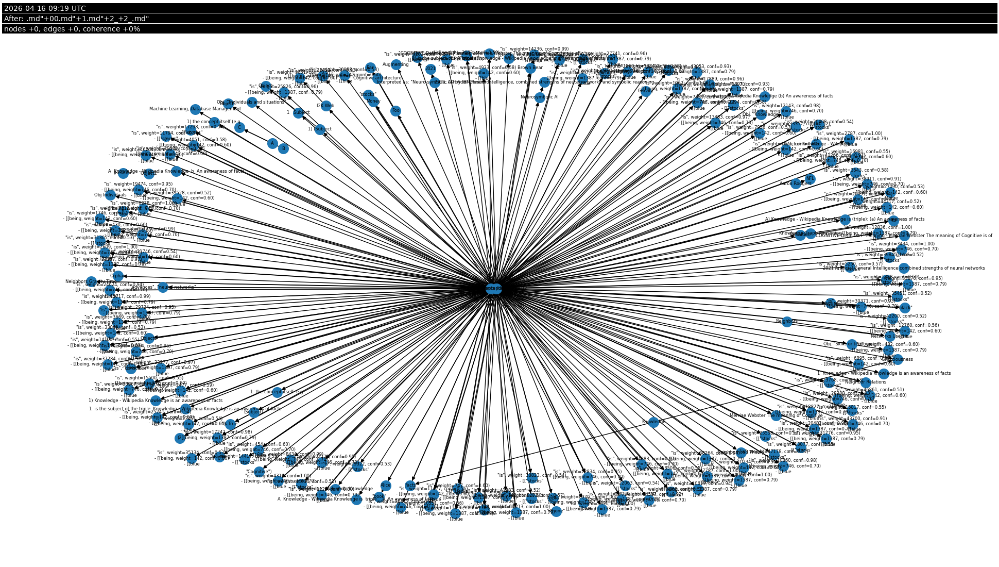](graph-2026-04-16-09-19-self-improve.png) [commit](https://github.com/BoggersTheFish/BoggersTheCIG/commit/7b2e4a2)

### 2026-04-16 09:57 UTC

**After:** vault organize (13 moves) — nodes +0, edges +0, coherence +0%

[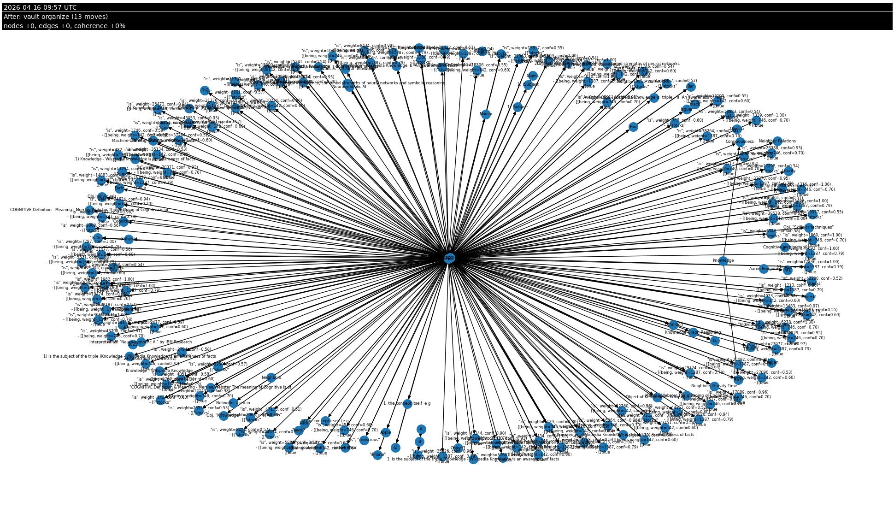](graph-2026-04-16-09-57-after-organize.png) [commit](https://github.com/BoggersTheFish/BoggersTheCIG/commit/7b2e4a2)

### 2026-04-16 09:57 UTC

**After:** 2 extracts, 2 merges — nodes +0, edges +0, coherence +0%

[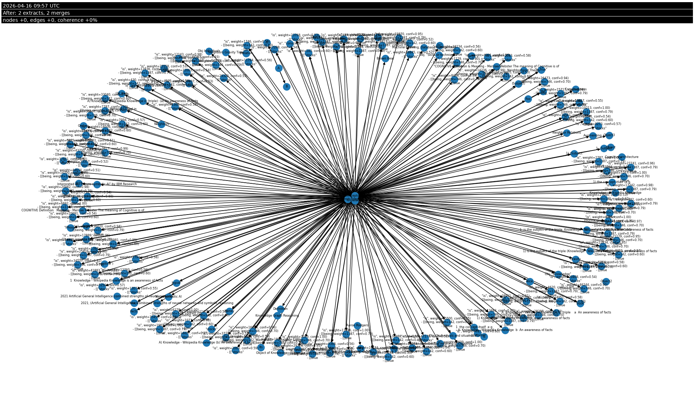](graph-2026-04-16-09-57-extract-subideas.png) [commit](https://github.com/BoggersTheFish/BoggersTheCIG/commit/7b2e4a2)

### 2026-04-16 09:57 UTC

**After:** +.md"+00.md"+1.md"+2_ — nodes +0, edges +0, coherence +0%

[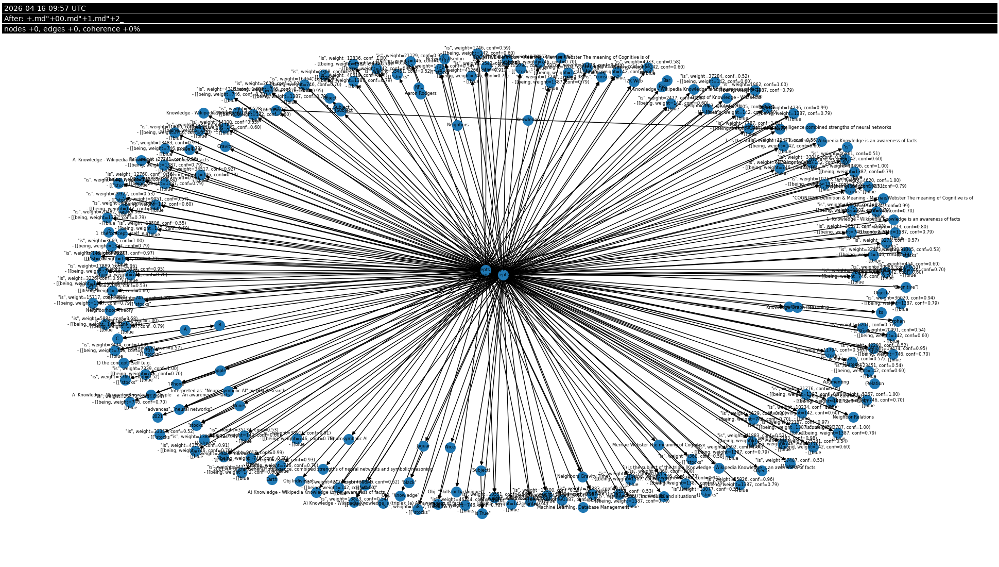](graph-2026-04-16-09-57-self-improve.png) [commit](https://github.com/BoggersTheFish/BoggersTheCIG/commit/7b2e4a2)

### 2026-04-16 11:47 UTC

**After:** vault organize (8 moves) — nodes +17, edges +17, coherence -2%

[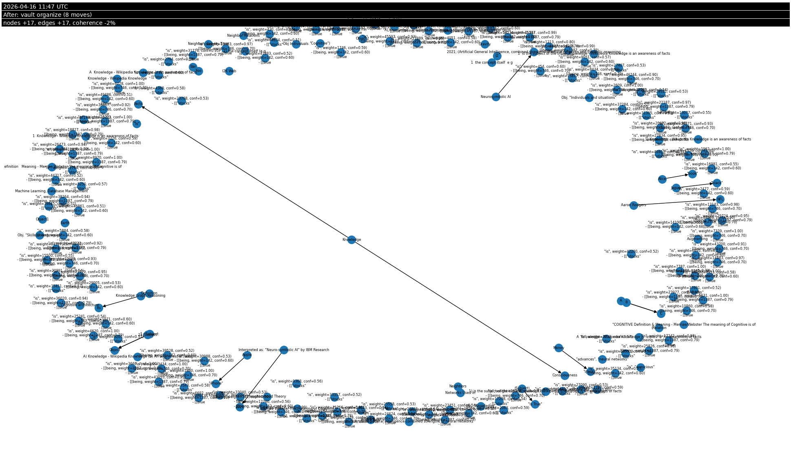](graph-2026-04-16-11-47-after-organize.png) [commit](https://github.com/BoggersTheFish/BoggersTheCIG/commit/35129e1)

### 2026-04-16 11:47 UTC

**After:** 2 extracts, 2 merges — nodes +0, edges +0, coherence +0%

[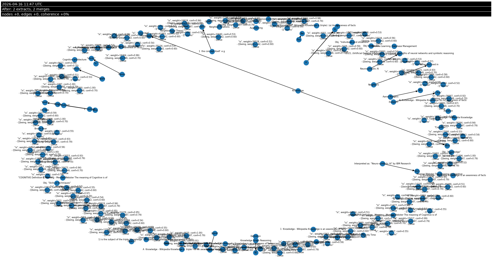](graph-2026-04-16-11-47-extract-subideas.png) [commit](https://github.com/BoggersTheFish/BoggersTheCIG/commit/35129e1)

### 2026-04-16 11:47 UTC

**After:** +.md"+1.md"+2_+2_.md" — nodes +0, edges +0, coherence +0%

[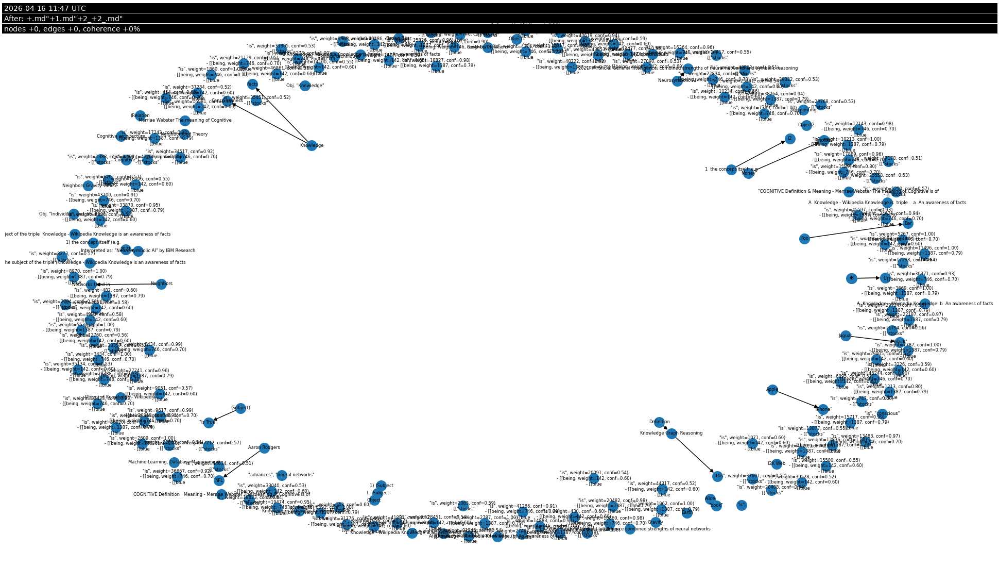](graph-2026-04-16-11-47-self-improve.png) [commit](https://github.com/BoggersTheFish/BoggersTheCIG/commit/35129e1)

### 2026-04-16 12:27 UTC

**After:** vault analysis (+1219 triples) — nodes +1, edges +3, coherence +0%

[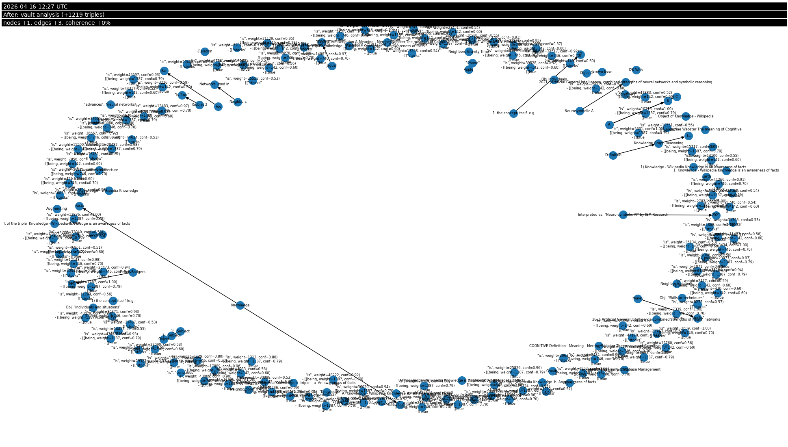](graph-2026-04-16-12-27-after-analyze-vault.png) [commit](https://github.com/BoggersTheFish/BoggersTheCIG/commit/35129e1)

### 2026-04-16 12:27 UTC

**After:** 2 extracts, 0 merges — nodes +0, edges +0, coherence +0%

[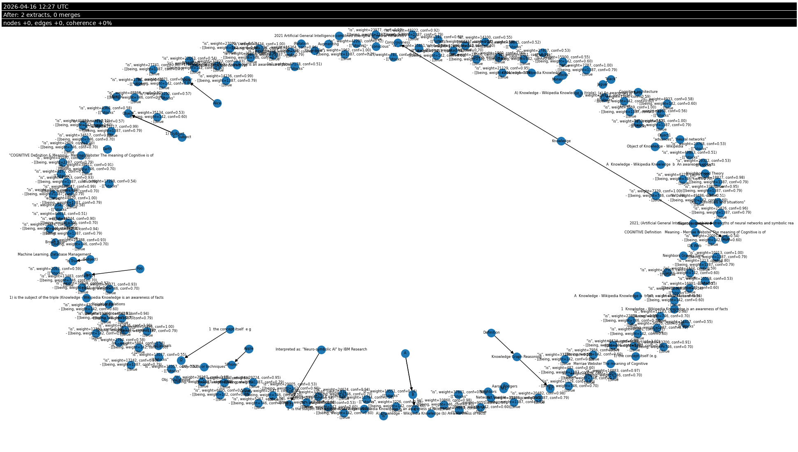](graph-2026-04-16-12-27-extract-subideas.png) [commit](https://github.com/BoggersTheFish/BoggersTheCIG/commit/35129e1)

### 2026-04-16 13:08 UTC

**After:** vault analysis (+1220 triples) — nodes +0, edges +2, coherence +0%

[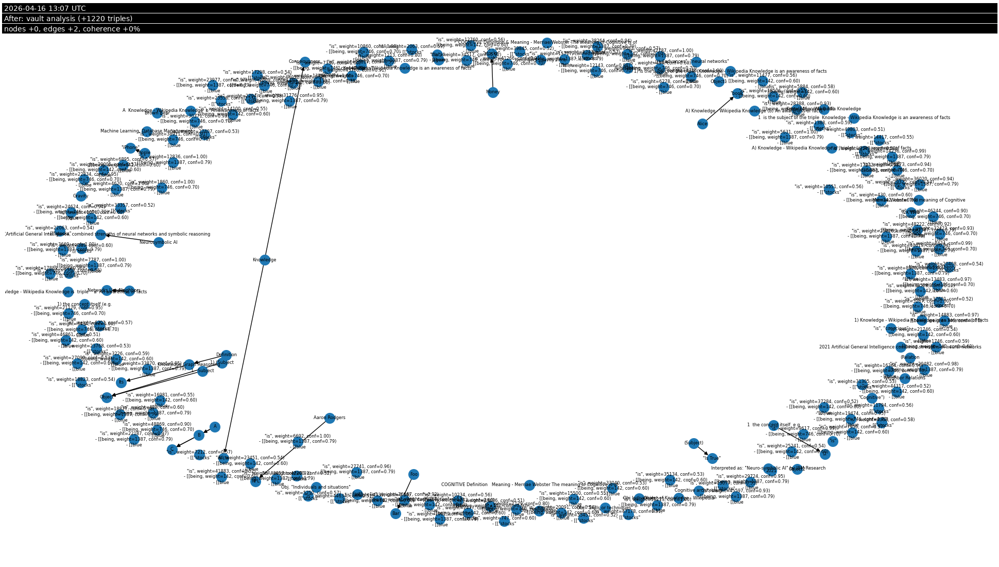](graph-2026-04-16-13-07-after-analyze-vault.png) [commit](https://github.com/BoggersTheFish/BoggersTheCIG/commit/35129e1)

### 2026-04-16 13:08 UTC

**After:** 2 extracts, 0 merges — nodes +0, edges +0, coherence +0%

[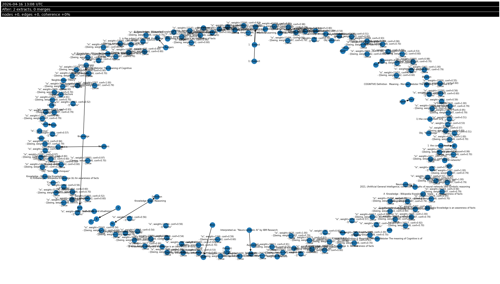](graph-2026-04-16-13-08-extract-subideas.png) [commit](https://github.com/BoggersTheFish/BoggersTheCIG/commit/35129e1)

### 2026-04-16 13:49 UTC

**After:** vault organize (5 moves) — nodes +0, edges +0, coherence +0%

[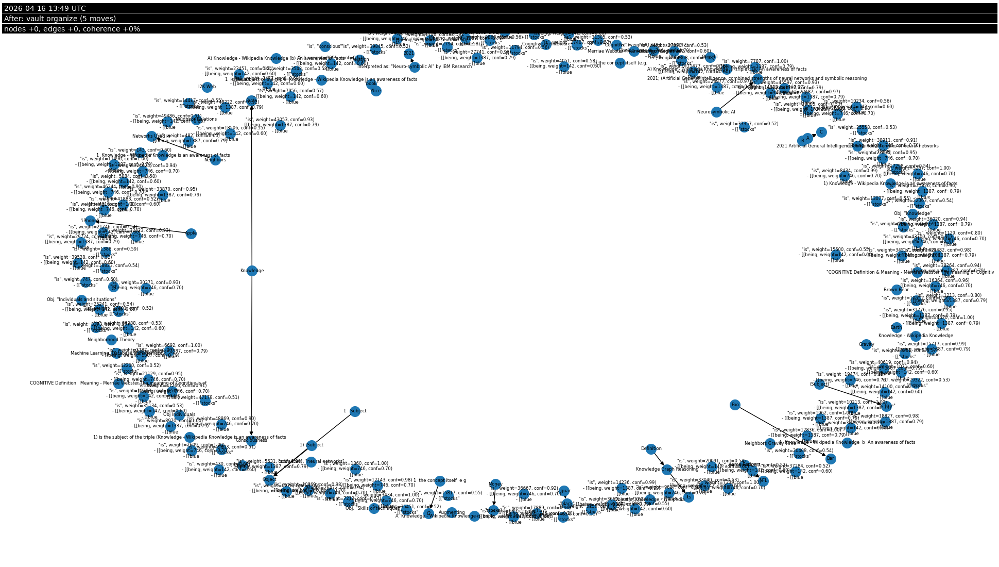](graph-2026-04-16-13-49-after-organize.png) [commit](https://github.com/BoggersTheFish/BoggersTheCIG/commit/35129e1)

### 2026-04-16 13:50 UTC

**After:** 2 extracts, 2 merges — nodes +0, edges +0, coherence +0%

[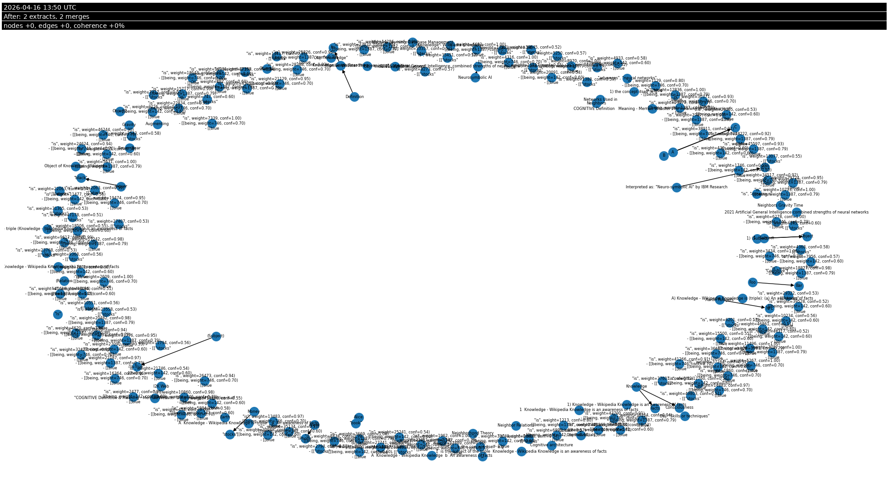](graph-2026-04-16-13-50-extract-subideas.png) [commit](https://github.com/BoggersTheFish/BoggersTheCIG/commit/35129e1)

### 2026-04-16 13:50 UTC

**After:** +.md"+1.md"+2_+2_.md" — nodes +0, edges +0, coherence +0%

[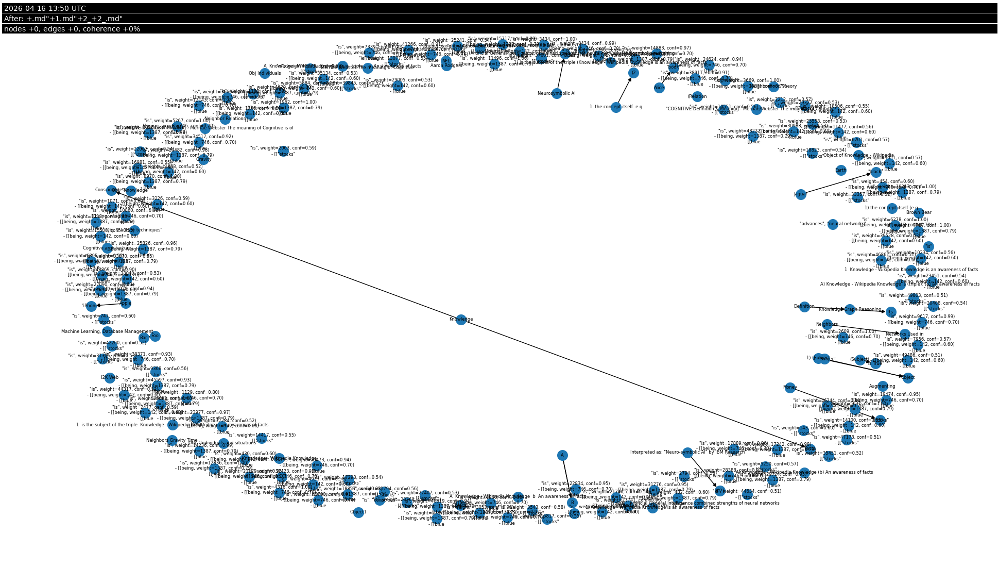](graph-2026-04-16-13-50-self-improve.png) [commit](https://github.com/BoggersTheFish/BoggersTheCIG/commit/35129e1)

### 2026-04-16 14:26 UTC

**After:** vault organize (4 moves) — nodes +0, edges +0, coherence +0%

[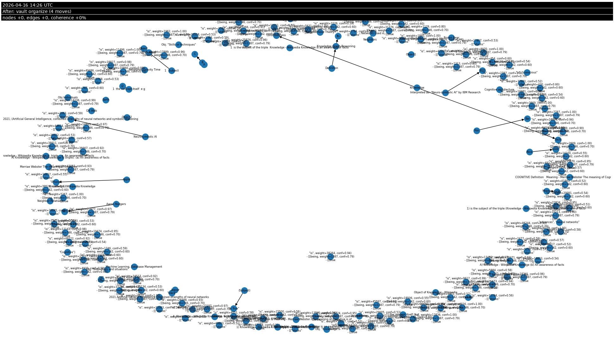](graph-2026-04-16-14-26-after-organize.png) [commit](https://github.com/BoggersTheFish/BoggersTheCIG/commit/35129e1)

### 2026-04-16 14:26 UTC

**After:** 1 extracts, 3 merges — nodes +0, edges +0, coherence +0%

[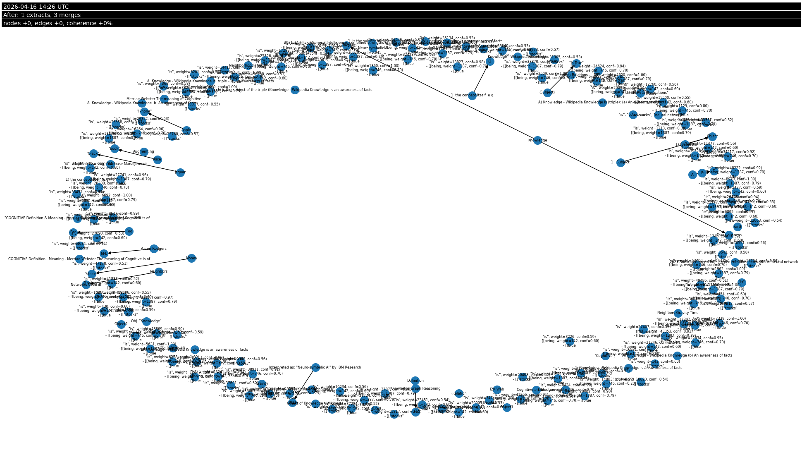](graph-2026-04-16-14-26-extract-subideas.png) [commit](https://github.com/BoggersTheFish/BoggersTheCIG/commit/35129e1)

### 2026-04-16 14:26 UTC

**After:** +.md"+1.md"+2_+2_.md" — nodes +0, edges +0, coherence +0%

[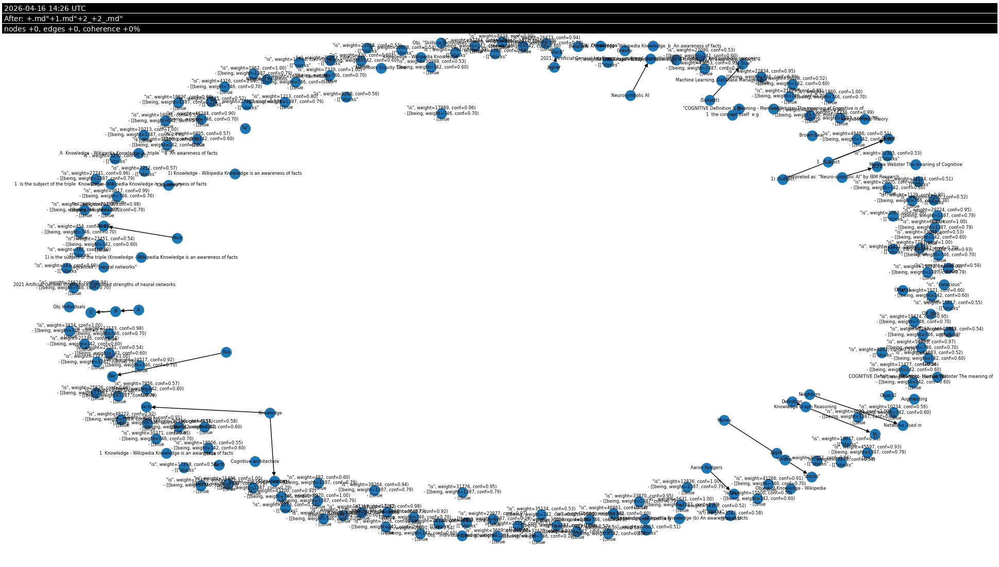](graph-2026-04-16-14-26-self-improve.png) [commit](https://github.com/BoggersTheFish/BoggersTheCIG/commit/35129e1)

### 2026-04-16 17:06 UTC

**After:** vault organize (3 moves) — nodes +17, edges +17, coherence -2%

[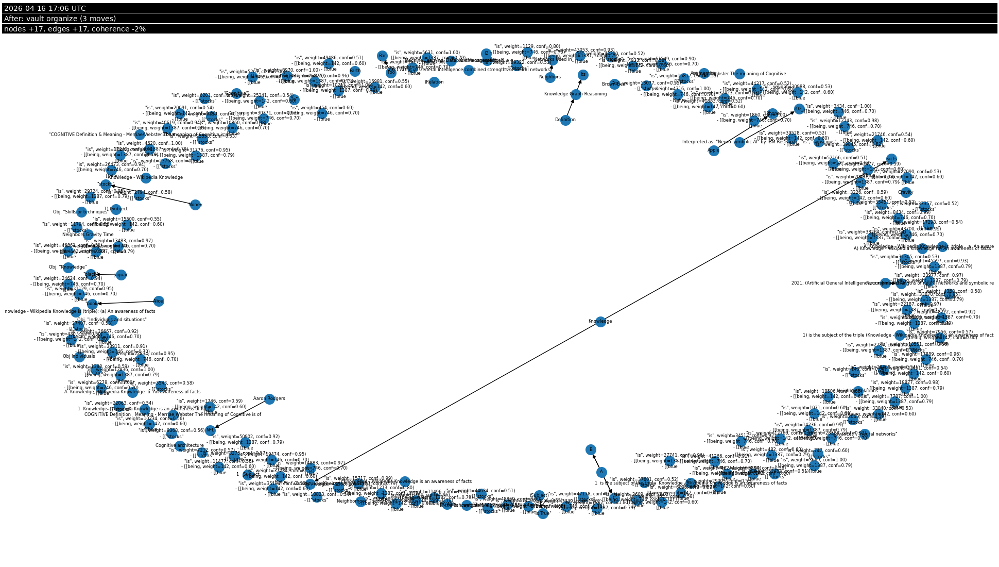](graph-2026-04-16-17-06-after-organize.png) [commit](https://github.com/BoggersTheFish/BoggersTheCIG/commit/abbffc6)

### 2026-04-16 17:07 UTC

**After:** 2 extracts, 2 merges — nodes +0, edges +0, coherence +0%

[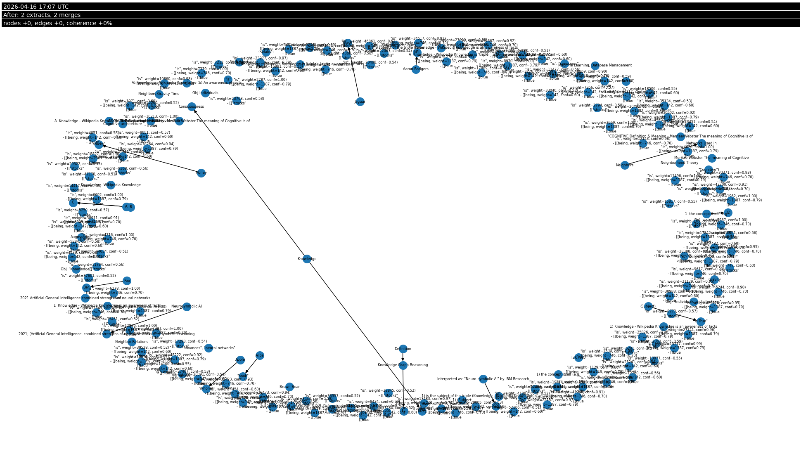](graph-2026-04-16-17-07-extract-subideas.png) [commit](https://github.com/BoggersTheFish/BoggersTheCIG/commit/abbffc6)

### 2026-04-16 17:07 UTC

**After:** +.md"+1.md"+2_+2_.md" — nodes +0, edges +0, coherence +0%

[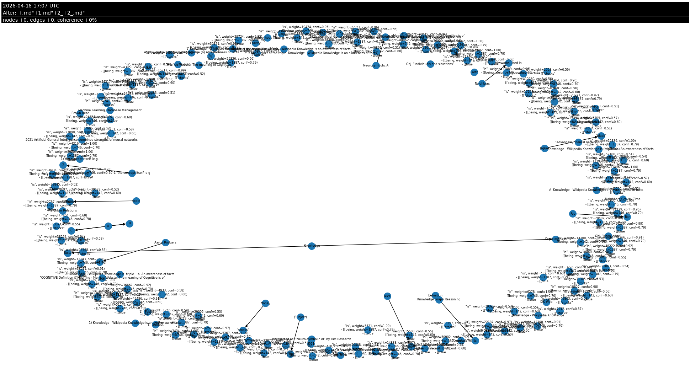](graph-2026-04-16-17-07-self-improve.png) [commit](https://github.com/BoggersTheFish/BoggersTheCIG/commit/abbffc6)

### 2026-04-16 17:08 UTC

**After:** external ingest (+1 triples) — nodes +0, edges +0, coherence +0%

[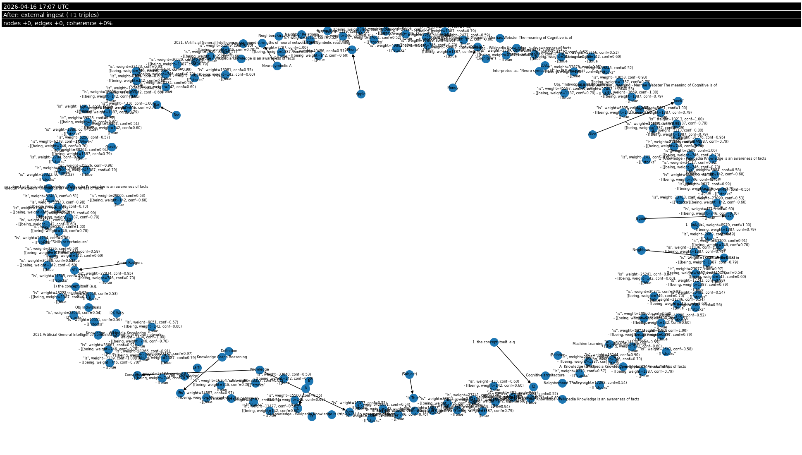](graph-2026-04-16-17-07-after-ingest.png) [commit](https://github.com/BoggersTheFish/BoggersTheCIG/commit/abbffc6)

### 2026-04-16 17:53 UTC

**After:** vault analysis (+1234 triples) — nodes +1, edges +4, coherence +0%

[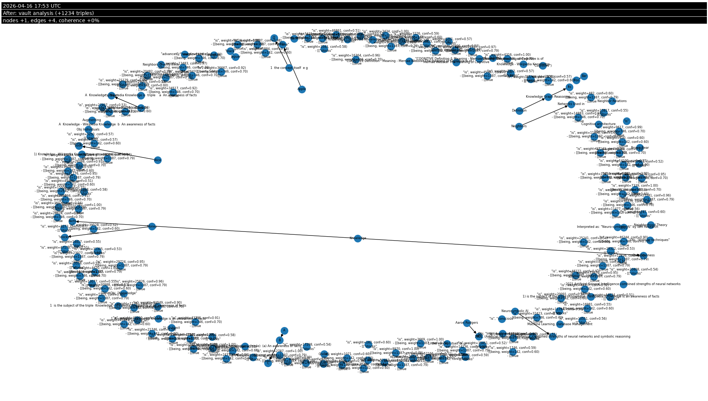](graph-2026-04-16-17-53-after-analyze-vault.png) [commit](https://github.com/BoggersTheFish/BoggersTheCIG/commit/abbffc6)

### 2026-04-16 17:53 UTC

**After:** 3 extracts, 0 merges — nodes +0, edges +0, coherence +0%

[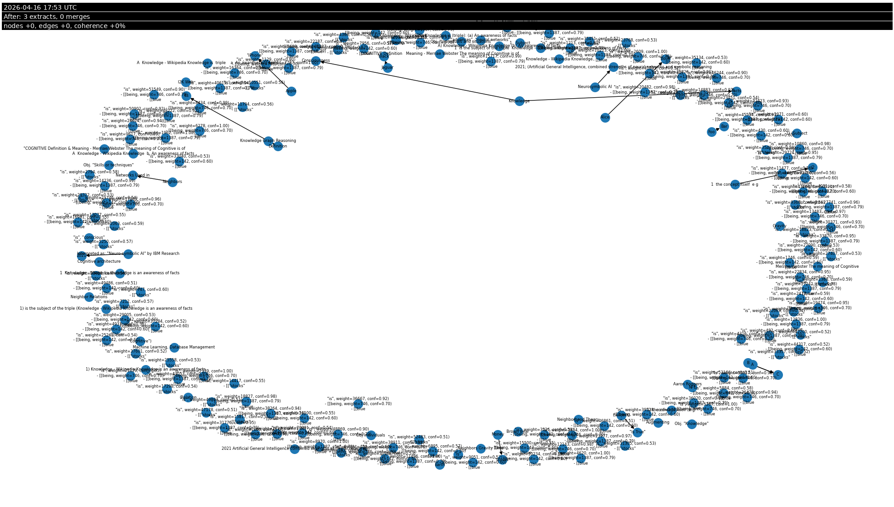](graph-2026-04-16-17-53-extract-subideas.png) [commit](https://github.com/BoggersTheFish/BoggersTheCIG/commit/abbffc6)

### 2026-04-16 18:40 UTC

**After:** vault analysis (+1234 triples) — nodes +0, edges +2, coherence +0%

[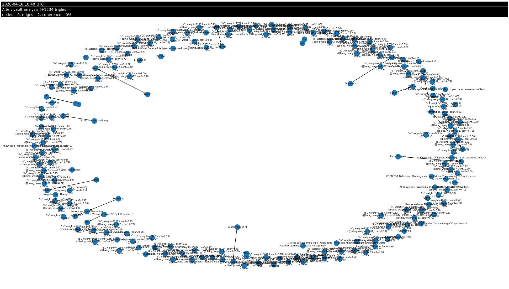](graph-2026-04-16-18-40-after-analyze-vault.png) [commit](https://github.com/BoggersTheFish/BoggersTheCIG/commit/abbffc6)

### 2026-04-16 18:40 UTC

**After:** 3 extracts, 0 merges — nodes +0, edges +0, coherence +0%

[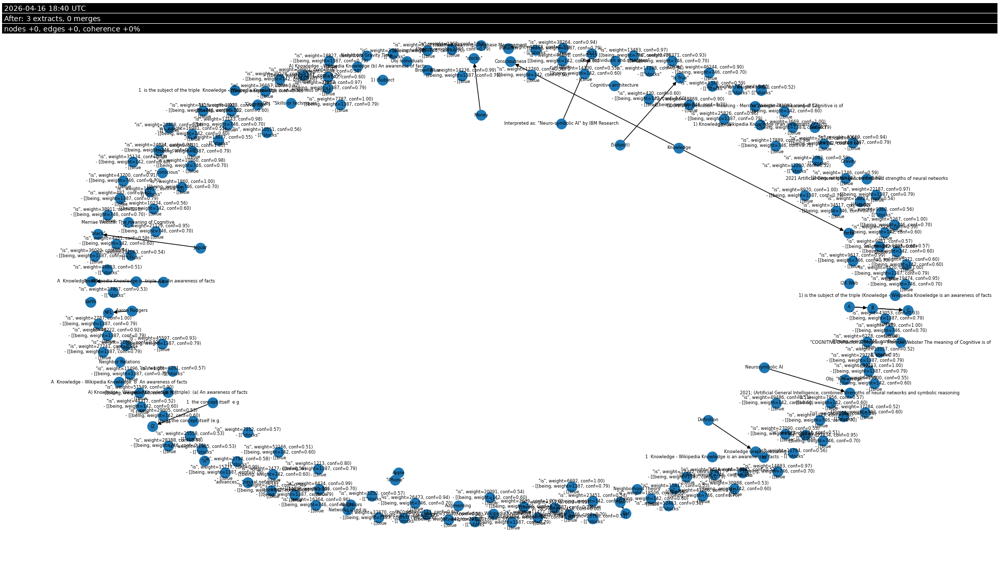](graph-2026-04-16-18-40-extract-subideas.png) [commit](https://github.com/BoggersTheFish/BoggersTheCIG/commit/abbffc6)

### 2026-04-16 19:23 UTC

**After:** vault organize (8 moves) — nodes +0, edges +0, coherence +0%

[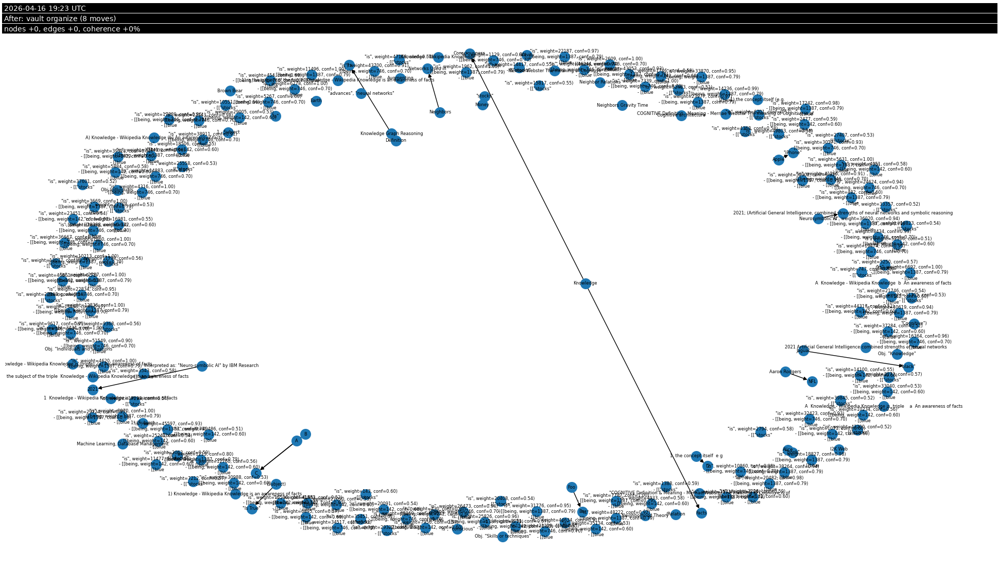](graph-2026-04-16-19-23-after-organize.png) [commit](https://github.com/BoggersTheFish/BoggersTheCIG/commit/abbffc6)

### 2026-04-16 19:23 UTC

**After:** 2 extracts, 2 merges — nodes +0, edges +0, coherence +0%

[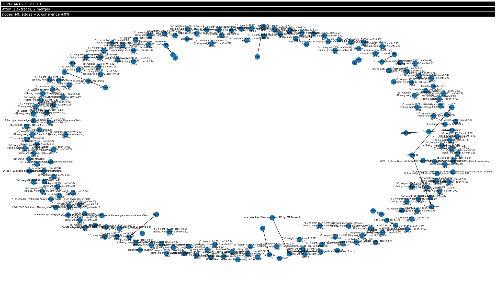](graph-2026-04-16-19-23-extract-subideas.png) [commit](https://github.com/BoggersTheFish/BoggersTheCIG/commit/abbffc6)

### 2026-04-16 19:23 UTC

**After:** +.md"+1.md"+2_+2_.md" — nodes +0, edges +0, coherence +0%

[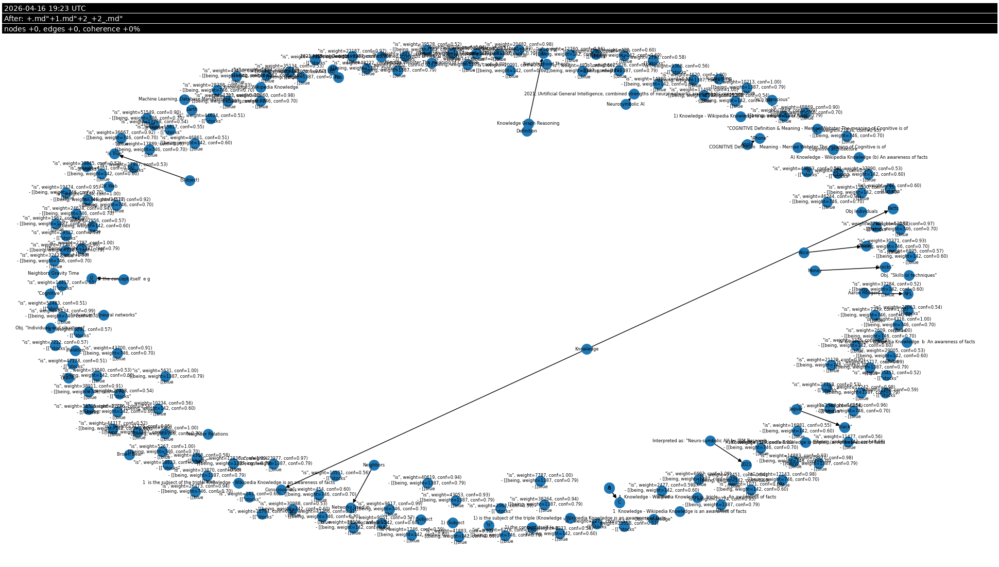](graph-2026-04-16-19-23-self-improve.png) [commit](https://github.com/BoggersTheFish/BoggersTheCIG/commit/abbffc6)

### 2026-04-16 20:02 UTC

**After:** vault organize (8 moves) — nodes +0, edges +0, coherence +0%

[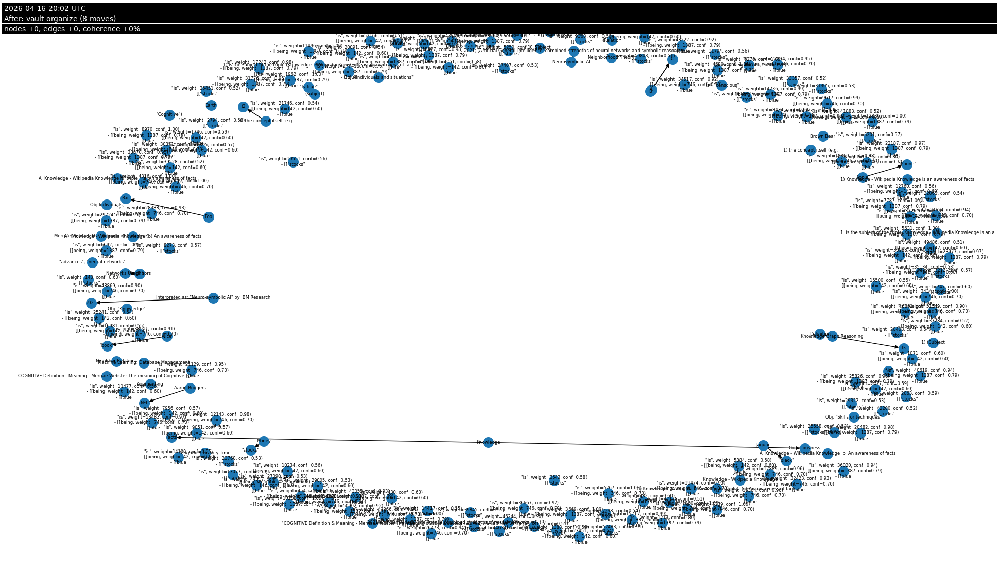](graph-2026-04-16-20-02-after-organize.png) [commit](https://github.com/BoggersTheFish/BoggersTheCIG/commit/abbffc6)

### 2026-04-16 20:03 UTC

**After:** 2 extracts, 2 merges — nodes +0, edges +0, coherence +0%

[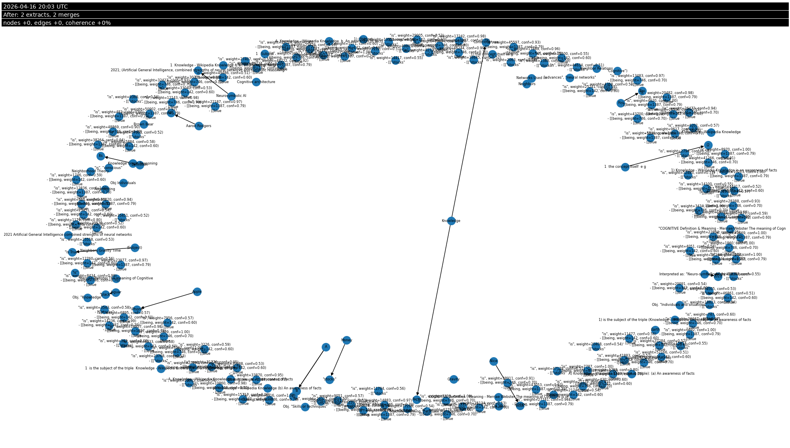](graph-2026-04-16-20-03-extract-subideas.png) [commit](https://github.com/BoggersTheFish/BoggersTheCIG/commit/abbffc6)

### 2026-04-16 20:03 UTC

**After:** +.md"+1.md"+2_+2_.md" — nodes +0, edges +0, coherence +0%

[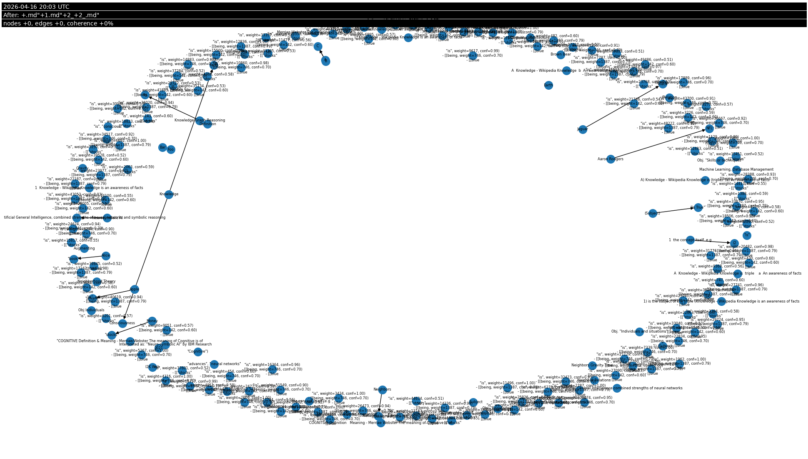](graph-2026-04-16-20-03-self-improve.png) [commit](https://github.com/BoggersTheFish/BoggersTheCIG/commit/abbffc6)

### 2026-04-17 03:10 UTC

**After:** vault organize (8 moves) — nodes +17, edges +17, coherence -2%

[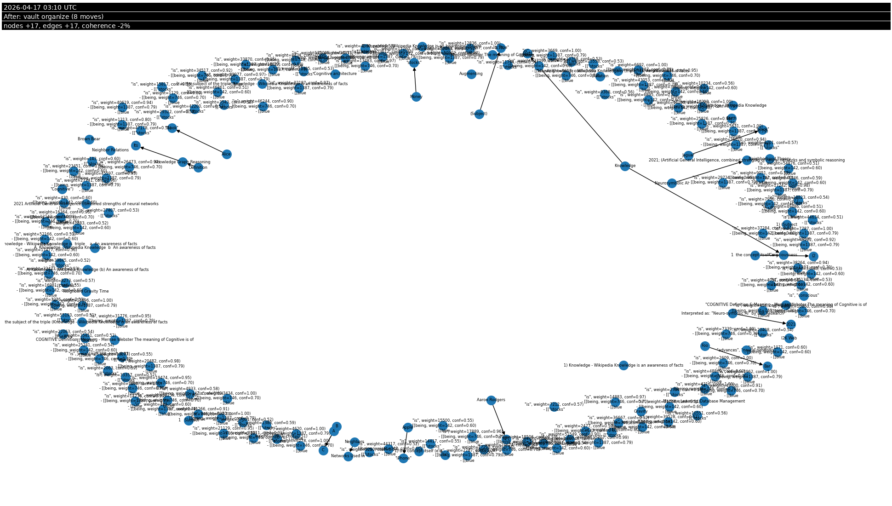](graph-2026-04-17-03-10-after-organize.png) [commit](https://github.com/BoggersTheFish/BoggersTheCIG/commit/1a17a69)

### 2026-04-17 03:10 UTC

**After:** 0 extracts, 4 merges — nodes +0, edges +0, coherence +0%

[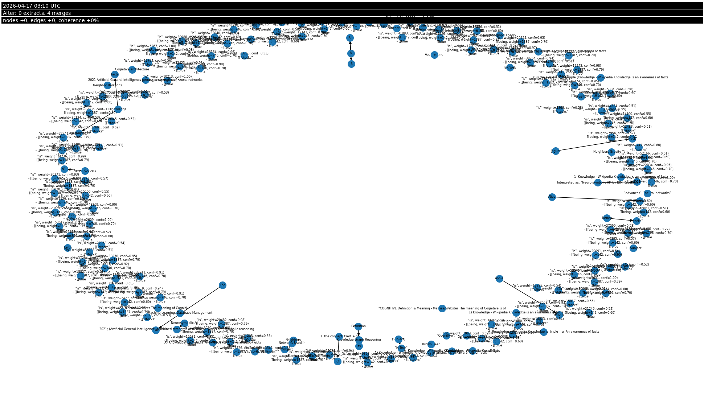](graph-2026-04-17-03-10-extract-subideas.png) [commit](https://github.com/BoggersTheFish/BoggersTheCIG/commit/1a17a69)

### 2026-04-17 03:10 UTC

**After:** .md"+1.md"+2_+2_.md"+A.md" — nodes +0, edges +0, coherence +0%

[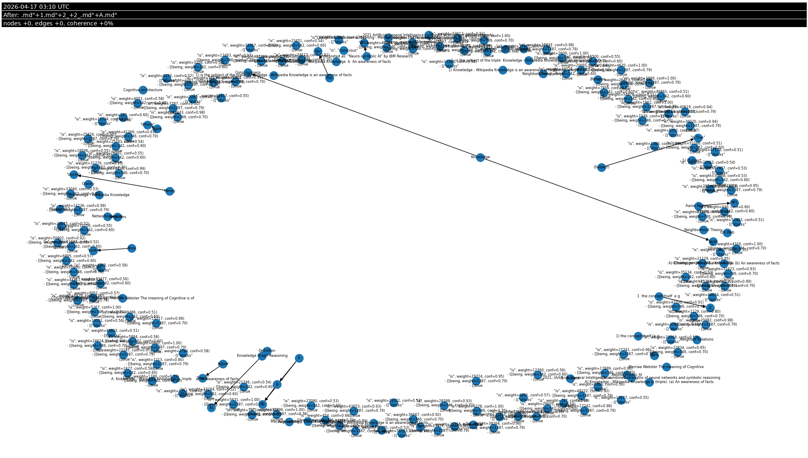](graph-2026-04-17-03-10-self-improve.png) [commit](https://github.com/BoggersTheFish/BoggersTheCIG/commit/1a17a69)

### 2026-04-17 04:25 UTC

**After:** vault analysis (+1255 triples) — nodes +1, edges +4, coherence +0%

[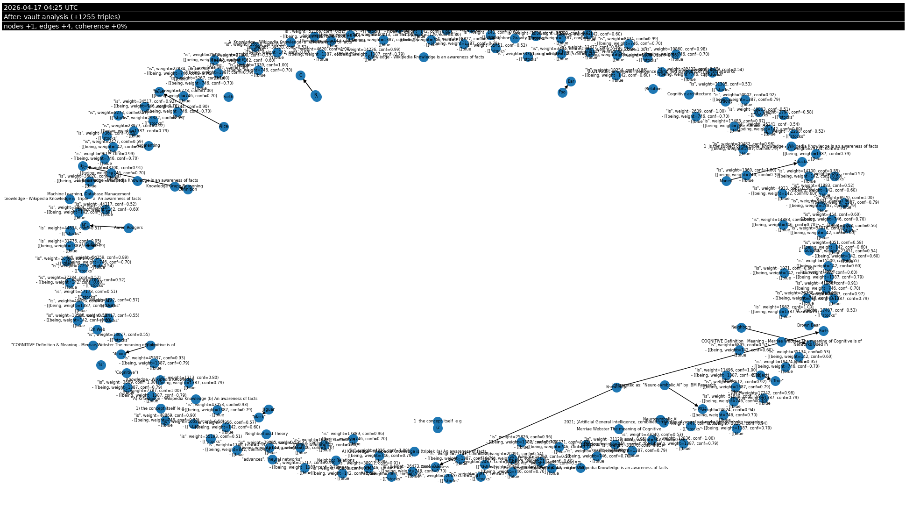](graph-2026-04-17-04-25-after-analyze-vault.png) [commit](https://github.com/BoggersTheFish/BoggersTheCIG/commit/1a17a69)

### 2026-04-17 04:26 UTC

**After:** 2 extracts, 0 merges — nodes +0, edges +0, coherence +0%

[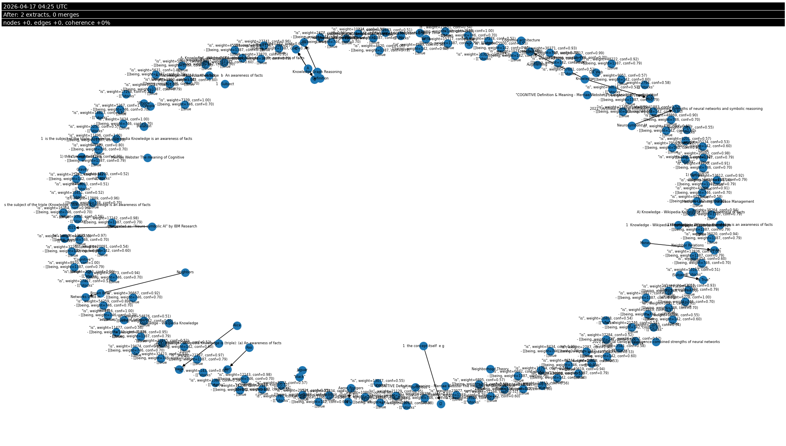](graph-2026-04-17-04-25-extract-subideas.png) [commit](https://github.com/BoggersTheFish/BoggersTheCIG/commit/1a17a69)

### 2026-04-17 05:27 UTC

**After:** vault analysis (+1255 triples) — nodes +0, edges +2, coherence +0%

[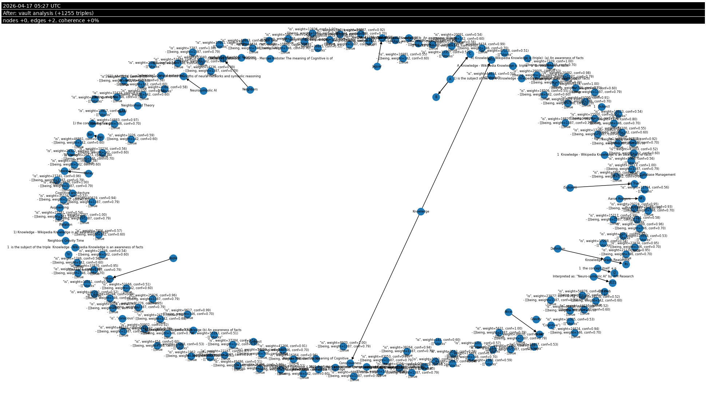](graph-2026-04-17-05-27-after-analyze-vault.png) [commit](https://github.com/BoggersTheFish/BoggersTheCIG/commit/1a17a69)

### 2026-04-17 05:27 UTC

**After:** 2 extracts, 0 merges — nodes +0, edges +0, coherence +0%

[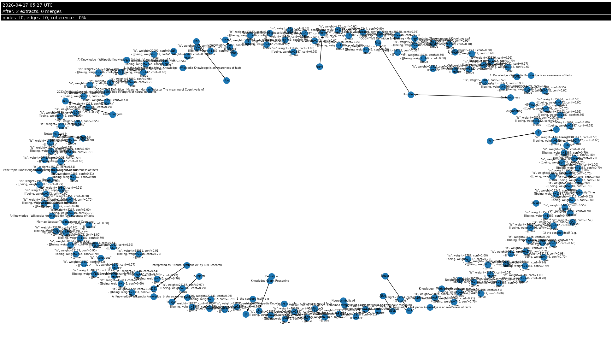](graph-2026-04-17-05-27-extract-subideas.png) [commit](https://github.com/BoggersTheFish/BoggersTheCIG/commit/1a17a69)

### 2026-04-17 05:59 UTC

**After:** vault organize (8 moves) — nodes +0, edges +0, coherence +0%

[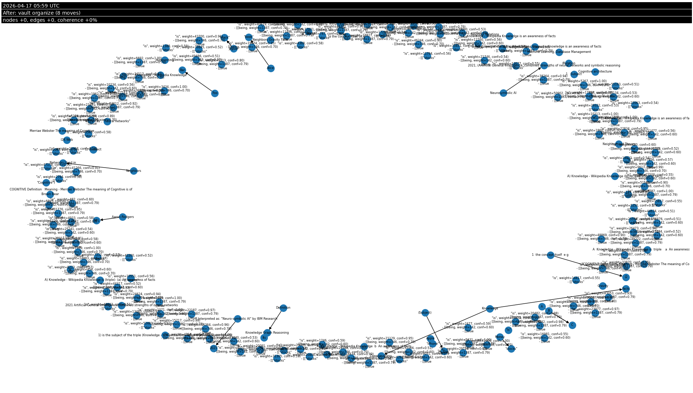](graph-2026-04-17-05-59-after-organize.png) [commit](https://github.com/BoggersTheFish/BoggersTheCIG/commit/1a17a69)

### 2026-04-17 06:00 UTC

**After:** 2 extracts, 2 merges — nodes +0, edges +0, coherence +0%

[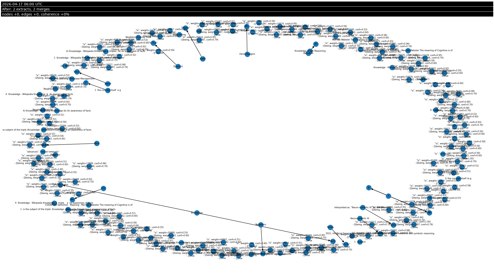](graph-2026-04-17-06-00-extract-subideas.png) [commit](https://github.com/BoggersTheFish/BoggersTheCIG/commit/1a17a69)

### 2026-04-17 06:00 UTC

**After:** .md"+1.md"+2_+2_.md"+A.md" — nodes +0, edges +0, coherence +0%

[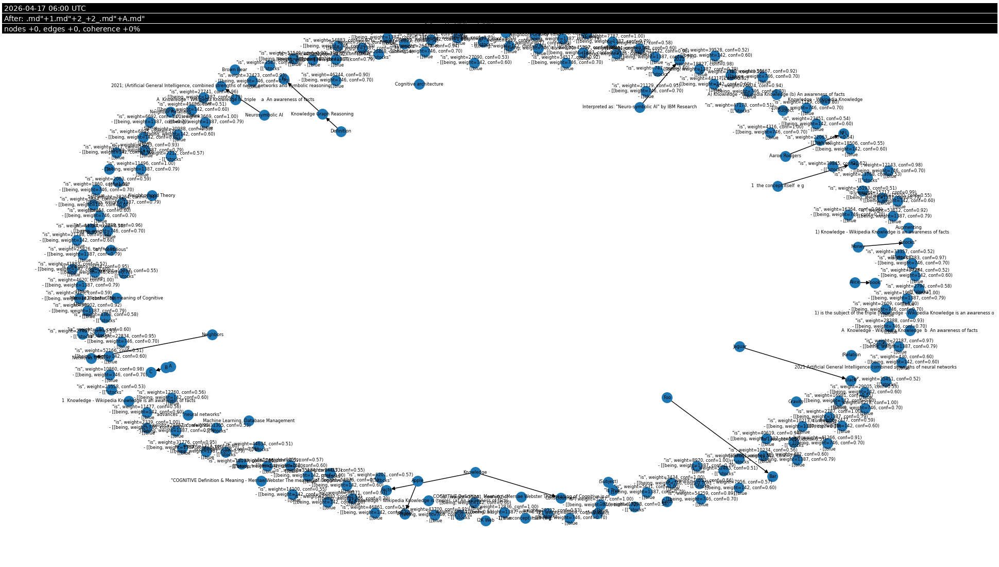](graph-2026-04-17-06-00-self-improve.png) [commit](https://github.com/BoggersTheFish/BoggersTheCIG/commit/1a17a69)

### 2026-04-17 06:27 UTC

**After:** vault organize (6 moves) — nodes +0, edges +0, coherence +0%

[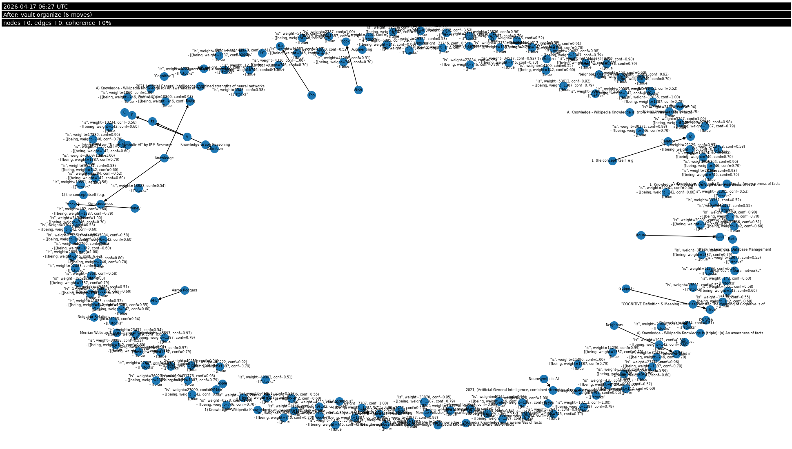](graph-2026-04-17-06-27-after-organize.png) [commit](https://github.com/BoggersTheFish/BoggersTheCIG/commit/1a17a69)

### 2026-04-17 06:28 UTC

**After:** 1 extracts, 3 merges — nodes +0, edges +0, coherence +0%

[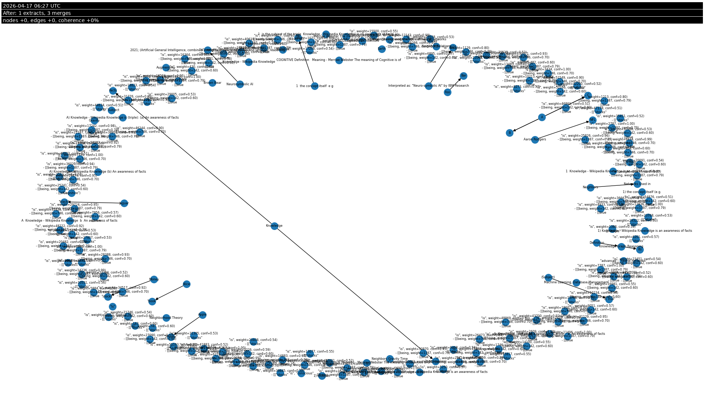](graph-2026-04-17-06-27-extract-subideas.png) [commit](https://github.com/BoggersTheFish/BoggersTheCIG/commit/1a17a69)

### 2026-04-17 06:28 UTC

**After:** +.md"+1.md"+2_+2_.md" — nodes +0, edges +0, coherence +0%

[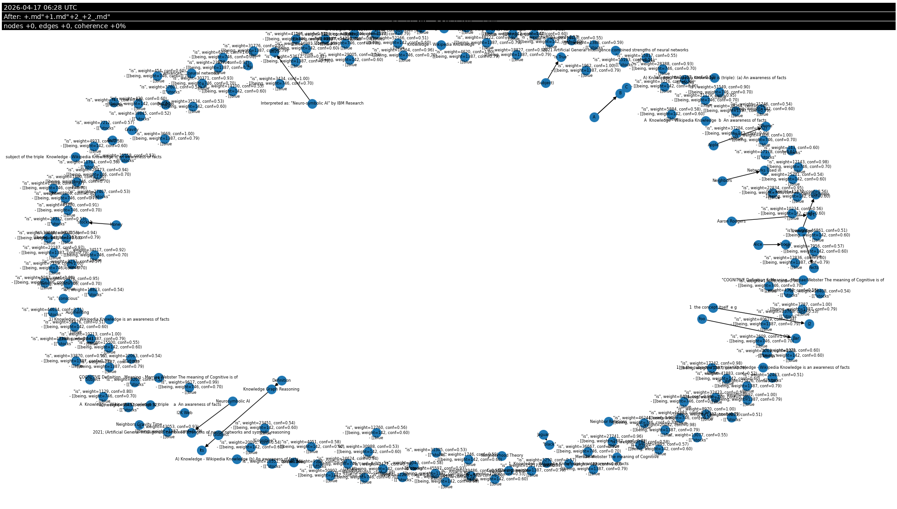](graph-2026-04-17-06-28-self-improve.png) [commit](https://github.com/BoggersTheFish/BoggersTheCIG/commit/1a17a69)

### 2026-04-17 11:39 UTC

**After:** vault organize (6 moves) — nodes +17, edges +17, coherence -2%

[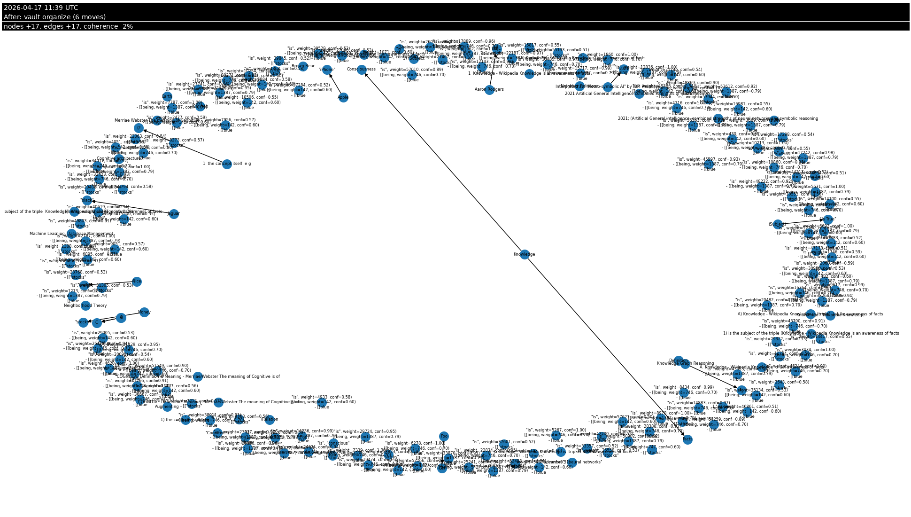](graph-2026-04-17-11-39-after-organize.png) [commit](https://github.com/BoggersTheFish/BoggersTheCIG/commit/6a1d2c4)

### 2026-04-17 11:39 UTC

**After:** 3 extracts, 1 merges — nodes +0, edges +0, coherence +0%

[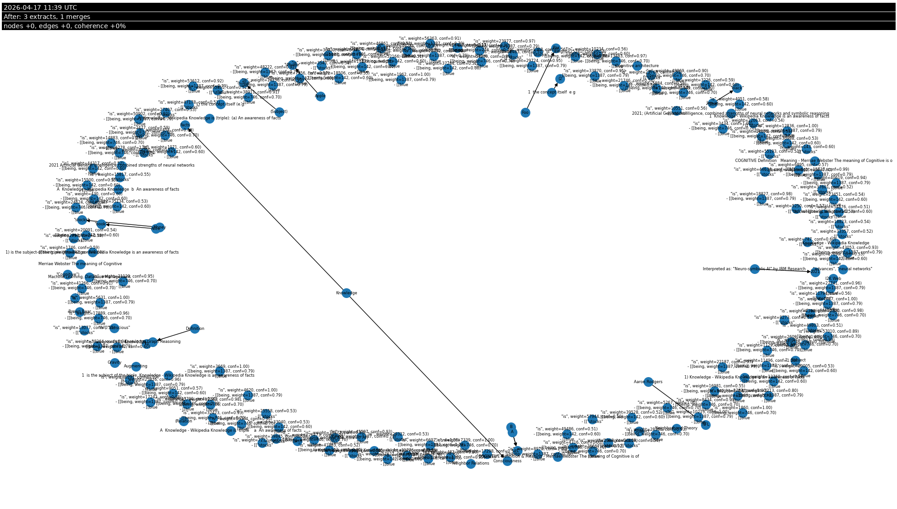](graph-2026-04-17-11-39-extract-subideas.png) [commit](https://github.com/BoggersTheFish/BoggersTheCIG/commit/6a1d2c4)

### 2026-04-17 11:39 UTC

**After:** +.md"+1.md"+2_+2_.md" — nodes +0, edges +0, coherence +0%

[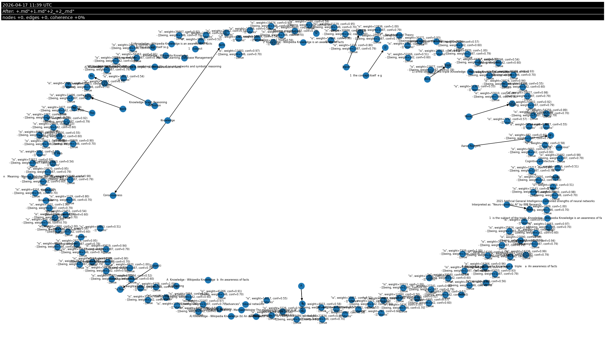](graph-2026-04-17-11-39-self-improve.png) [commit](https://github.com/BoggersTheFish/BoggersTheCIG/commit/6a1d2c4)

### 2026-04-17 11:40 UTC

**After:** external ingest (+5 triples) — nodes +4, edges +2, coherence +0%

[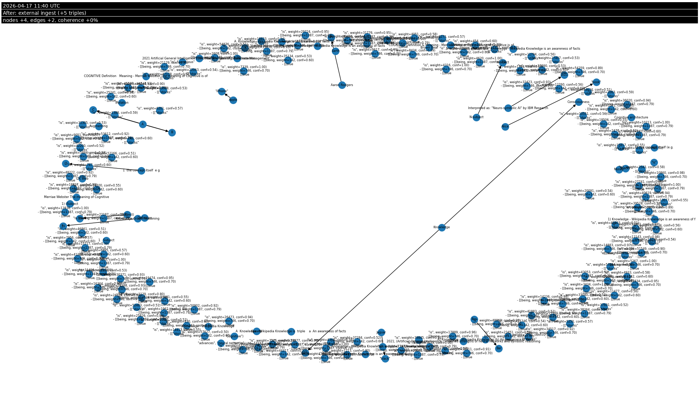](graph-2026-04-17-11-40-after-ingest.png) [commit](https://github.com/BoggersTheFish/BoggersTheCIG/commit/6a1d2c4)

### 2026-04-17 12:23 UTC

**After:** vault analysis (+1265 triples) — nodes +0, edges +2, coherence +0%

[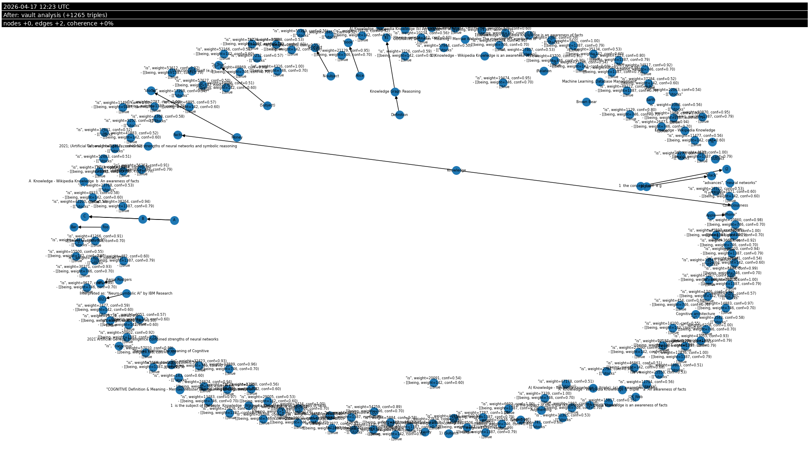](graph-2026-04-17-12-23-after-analyze-vault.png) [commit](https://github.com/BoggersTheFish/BoggersTheCIG/commit/6a1d2c4)

### 2026-04-17 12:23 UTC

**After:** 3 extracts, 0 merges — nodes +0, edges +0, coherence +0%

[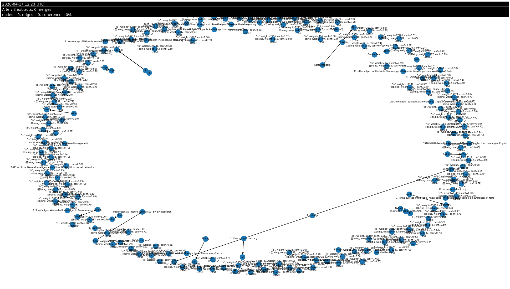](graph-2026-04-17-12-23-extract-subideas.png) [commit](https://github.com/BoggersTheFish/BoggersTheCIG/commit/6a1d2c4)

### 2026-04-17 13:06 UTC

**After:** vault analysis (+1266 triples) — nodes +0, edges +2, coherence +0%

[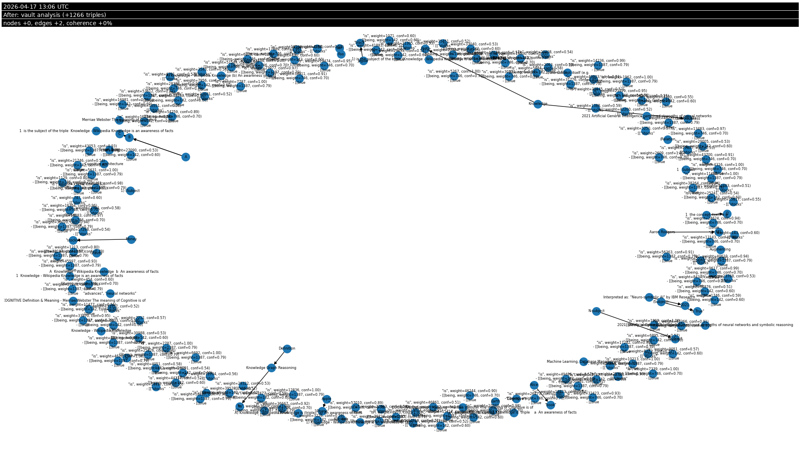](graph-2026-04-17-13-06-after-analyze-vault.png) [commit](https://github.com/BoggersTheFish/BoggersTheCIG/commit/6a1d2c4)

### 2026-04-17 13:06 UTC

**After:** 3 extracts, 0 merges — nodes +0, edges +0, coherence +0%

[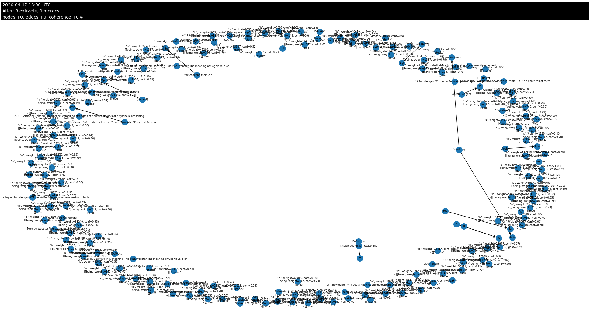](graph-2026-04-17-13-06-extract-subideas.png) [commit](https://github.com/BoggersTheFish/BoggersTheCIG/commit/6a1d2c4)

### 2026-04-17 13:48 UTC

**After:** vault organize (14 moves) — nodes +0, edges +0, coherence +0%

[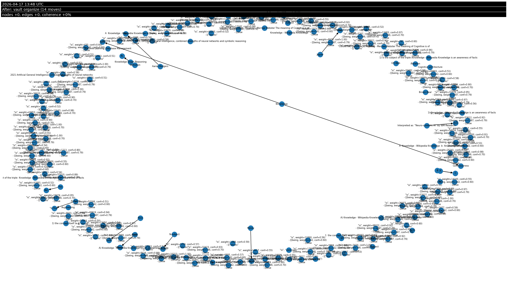](graph-2026-04-17-13-48-after-organize.png) [commit](https://github.com/BoggersTheFish/BoggersTheCIG/commit/6a1d2c4)

### 2026-04-17 13:48 UTC

**After:** 2 extracts, 2 merges — nodes +0, edges +0, coherence +0%

[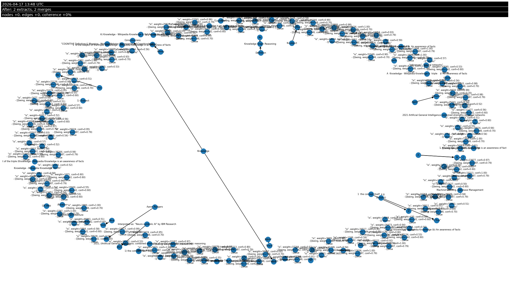](graph-2026-04-17-13-48-extract-subideas.png) [commit](https://github.com/BoggersTheFish/BoggersTheCIG/commit/6a1d2c4)

### 2026-04-17 13:48 UTC

**After:** +.md"+1.md"+2_+2_.md" — nodes +0, edges +0, coherence +0%

[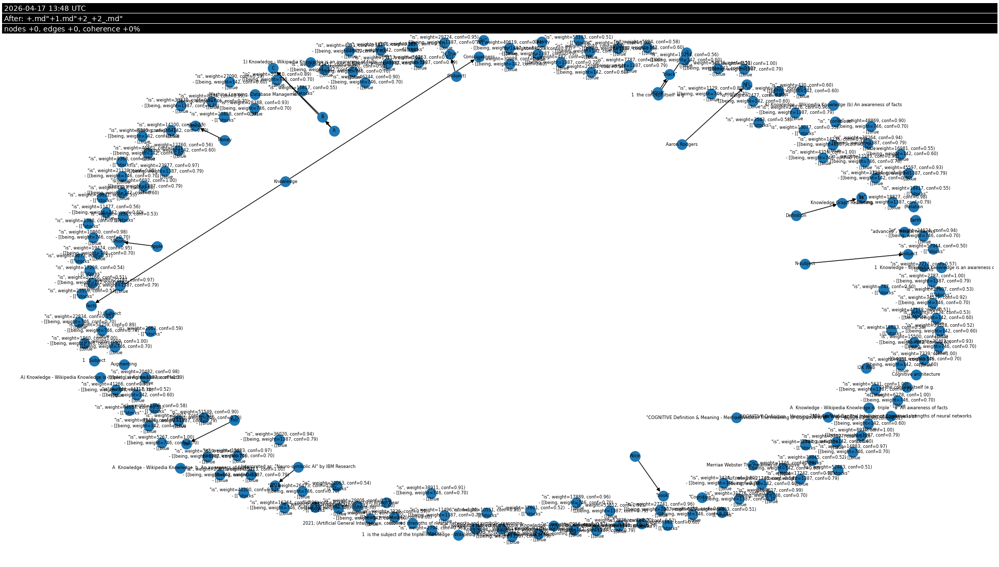](graph-2026-04-17-13-48-self-improve.png) [commit](https://github.com/BoggersTheFish/BoggersTheCIG/commit/6a1d2c4)

### 2026-04-17 14:25 UTC

**After:** vault organize (5 moves) — nodes +0, edges +0, coherence +0%

[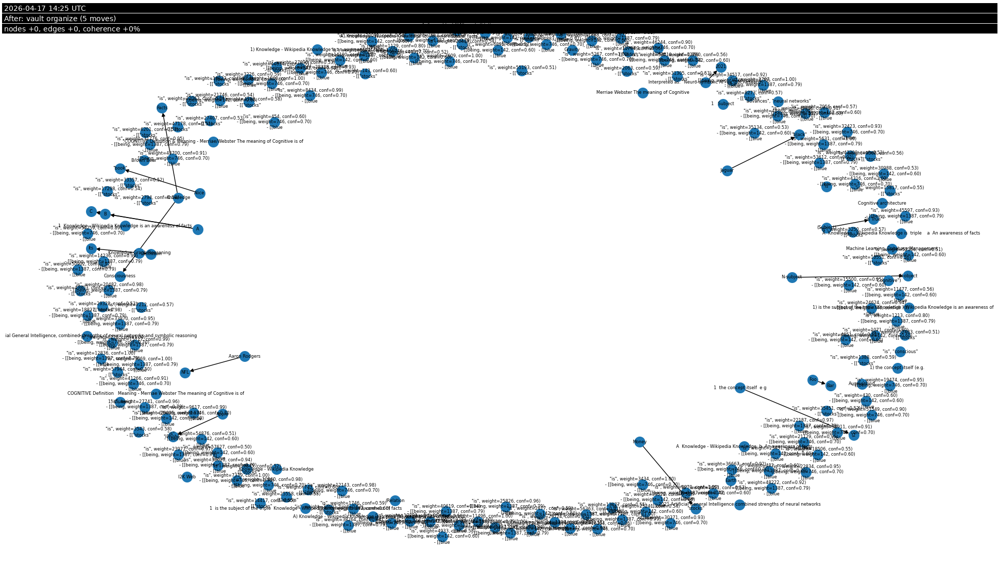](graph-2026-04-17-14-25-after-organize.png) [commit](https://github.com/BoggersTheFish/BoggersTheCIG/commit/6a1d2c4)

### 2026-04-17 14:25 UTC

**After:** 1 extracts, 3 merges — nodes +0, edges +0, coherence +0%

[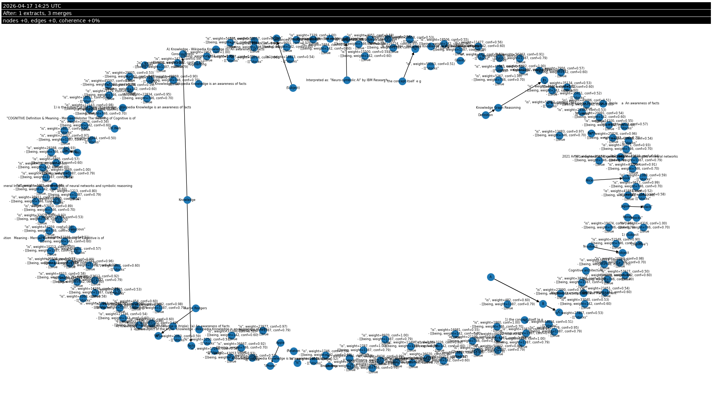](graph-2026-04-17-14-25-extract-subideas.png) [commit](https://github.com/BoggersTheFish/BoggersTheCIG/commit/6a1d2c4)

### 2026-04-17 14:25 UTC

**After:** +.md"+1.md"+2_+2_.md" — nodes +0, edges +0, coherence +0%

[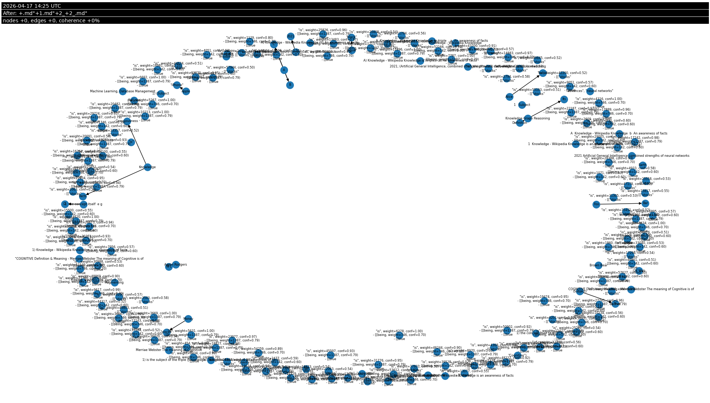](graph-2026-04-17-14-25-self-improve.png) [commit](https://github.com/BoggersTheFish/BoggersTheCIG/commit/6a1d2c4)

### 2026-04-17 16:46 UTC

**After:** vault organize (10 moves) — nodes +17, edges +17, coherence -2%

[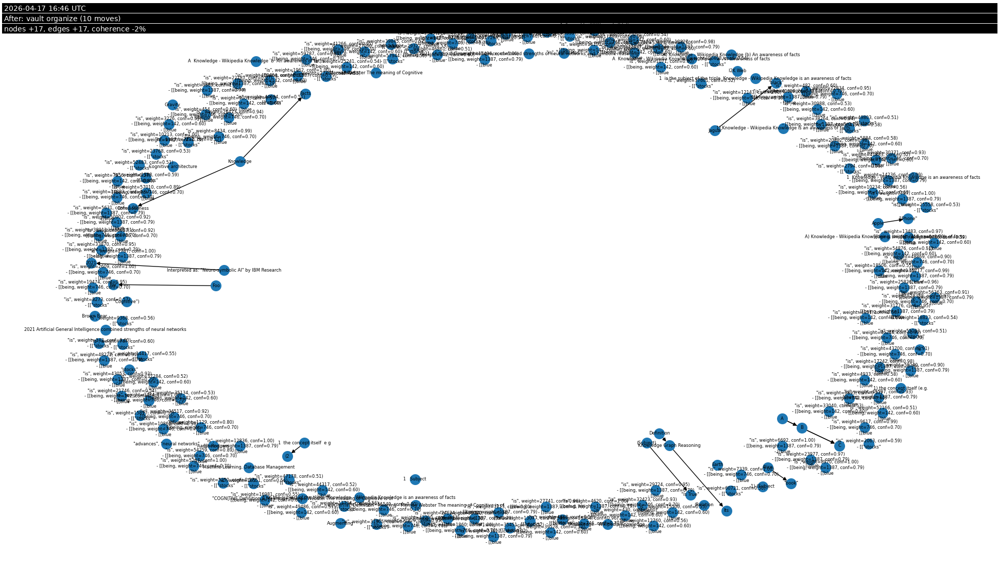](graph-2026-04-17-16-46-after-organize.png) [commit](https://github.com/BoggersTheFish/BoggersTheCIG/commit/94b1be0)

### 2026-04-17 16:46 UTC

**After:** 2 extracts, 2 merges — nodes +0, edges +0, coherence +0%

[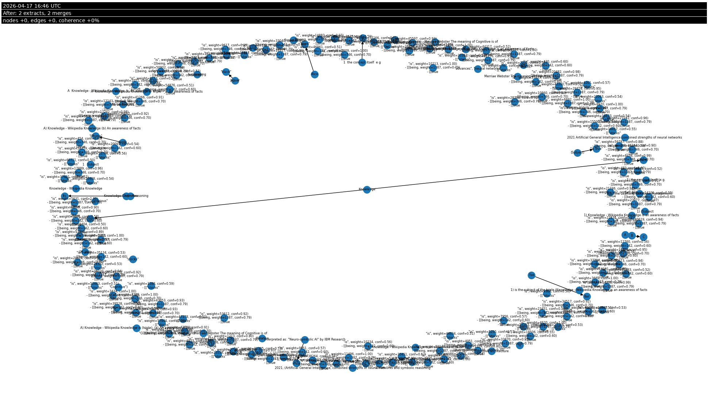](graph-2026-04-17-16-46-extract-subideas.png) [commit](https://github.com/BoggersTheFish/BoggersTheCIG/commit/94b1be0)

### 2026-04-17 16:47 UTC

**After:** .md"+00.md"+1.md"+2_+2_.md" — nodes +0, edges +0, coherence +0%

[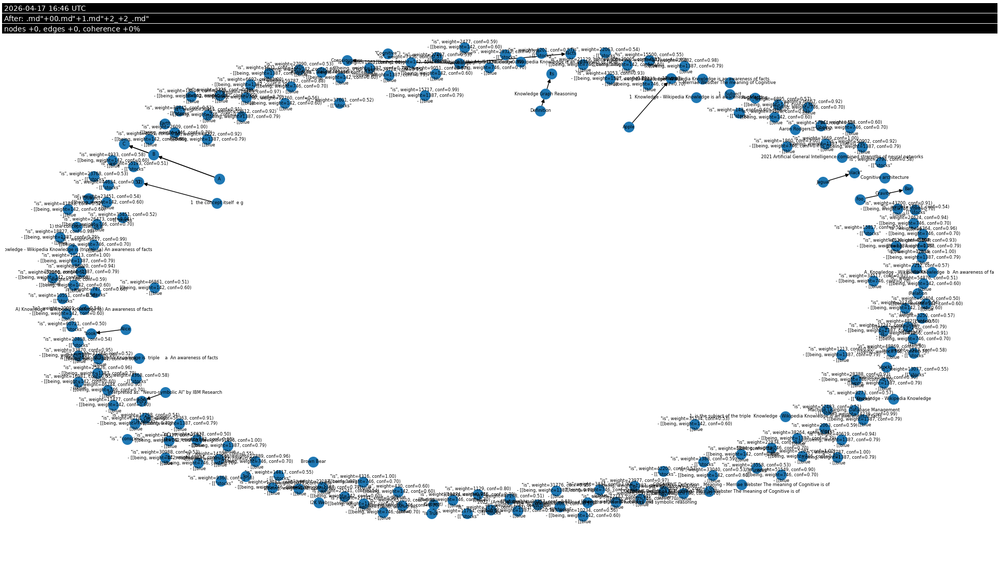](graph-2026-04-17-16-46-self-improve.png) [commit](https://github.com/BoggersTheFish/BoggersTheCIG/commit/94b1be0)

### 2026-04-17 17:39 UTC

**After:** vault analysis (+1291 triples) — nodes +0, edges +2, coherence +0%

[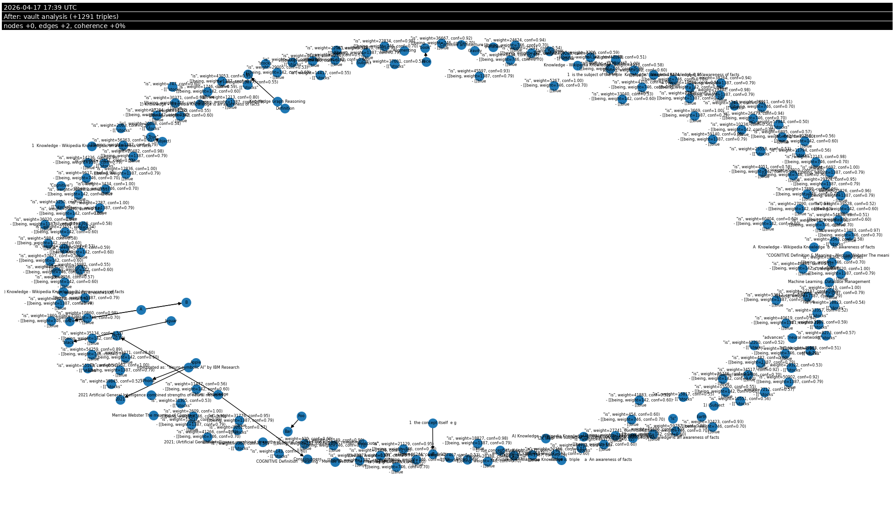](graph-2026-04-17-17-39-after-analyze-vault.png) [commit](https://github.com/BoggersTheFish/BoggersTheCIG/commit/94b1be0)

### 2026-04-17 17:39 UTC

**After:** 3 extracts, 0 merges — nodes +0, edges +0, coherence +0%

[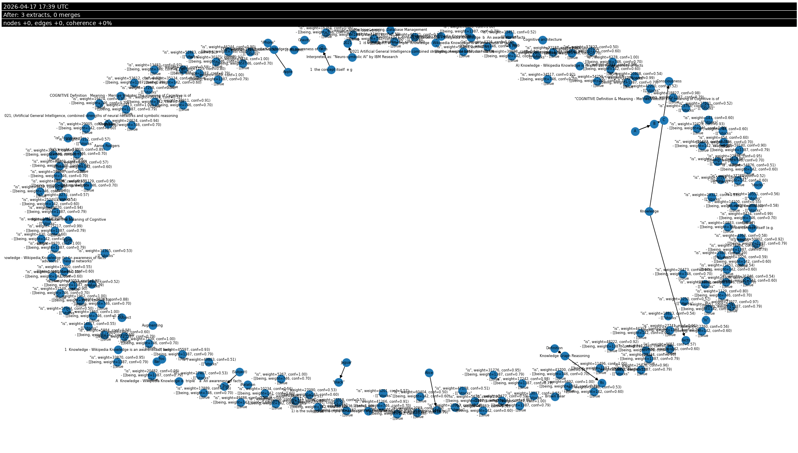](graph-2026-04-17-17-39-extract-subideas.png) [commit](https://github.com/BoggersTheFish/BoggersTheCIG/commit/94b1be0)

### 2026-04-17 18:31 UTC

**After:** vault analysis (+1291 triples) — nodes +0, edges +2, coherence +0%

[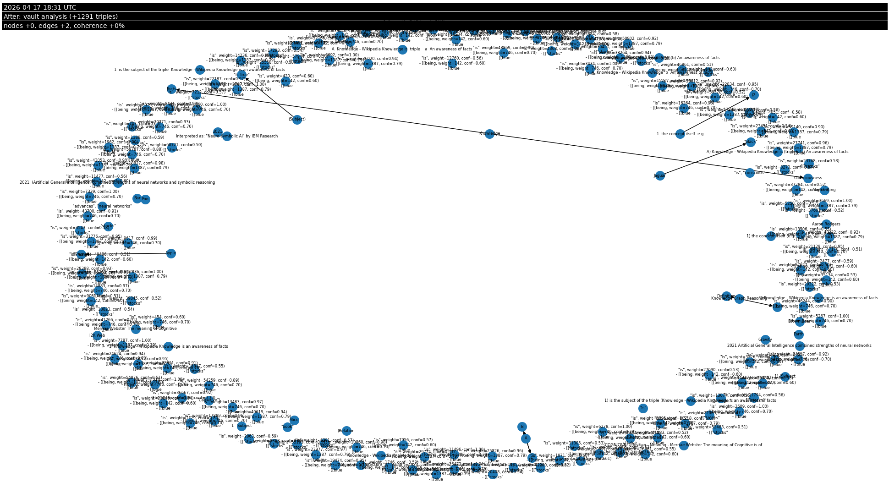](graph-2026-04-17-18-31-after-analyze-vault.png) [commit](https://github.com/BoggersTheFish/BoggersTheCIG/commit/94b1be0)

### 2026-04-17 18:31 UTC

**After:** 3 extracts, 0 merges — nodes +0, edges +0, coherence +0%

[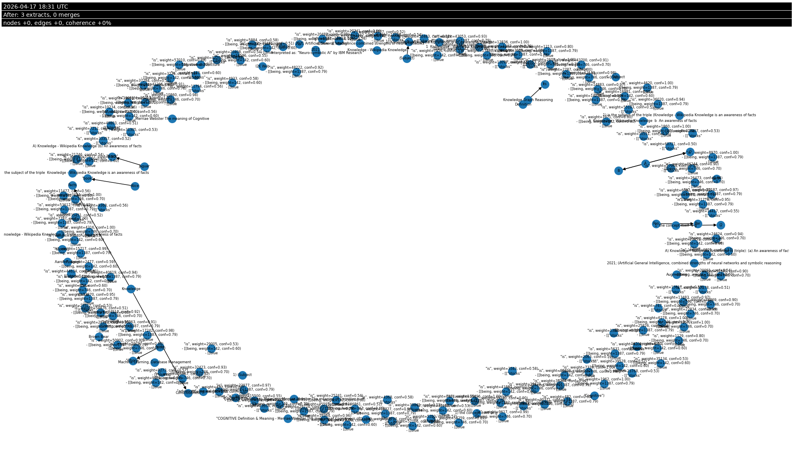](graph-2026-04-17-18-31-extract-subideas.png) [commit](https://github.com/BoggersTheFish/BoggersTheCIG/commit/94b1be0)

### 2026-04-17 19:16 UTC

**After:** vault organize (8 moves) — nodes +0, edges +0, coherence +0%

[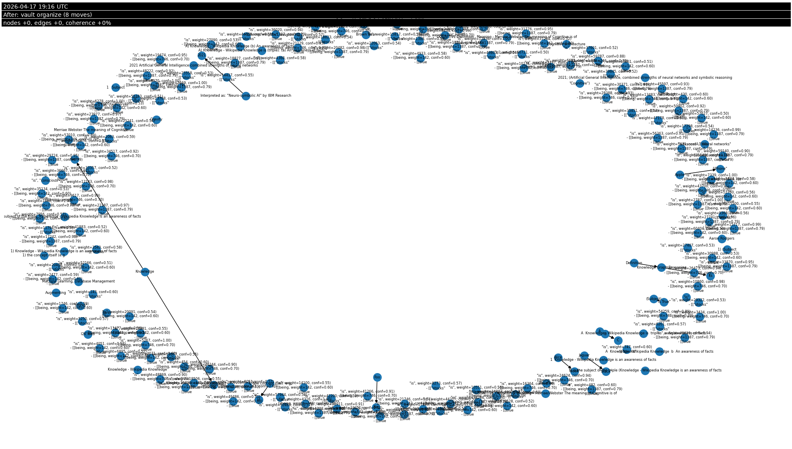](graph-2026-04-17-19-16-after-organize.png) [commit](https://github.com/BoggersTheFish/BoggersTheCIG/commit/94b1be0)

### 2026-04-17 19:16 UTC

**After:** 2 extracts, 2 merges — nodes +0, edges +0, coherence +0%

[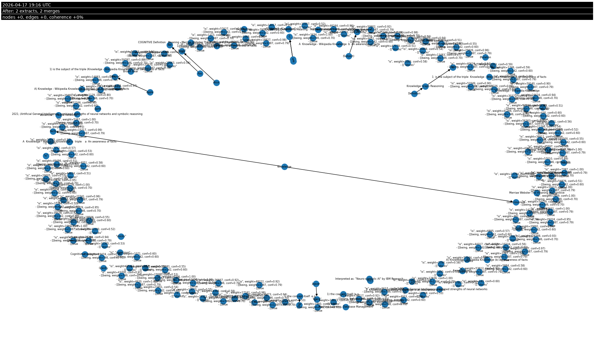](graph-2026-04-17-19-16-extract-subideas.png) [commit](https://github.com/BoggersTheFish/BoggersTheCIG/commit/94b1be0)

### 2026-04-17 19:16 UTC

**After:** .md"+00.md"+1.md"+2_+2_.md" — nodes +0, edges +0, coherence +0%

[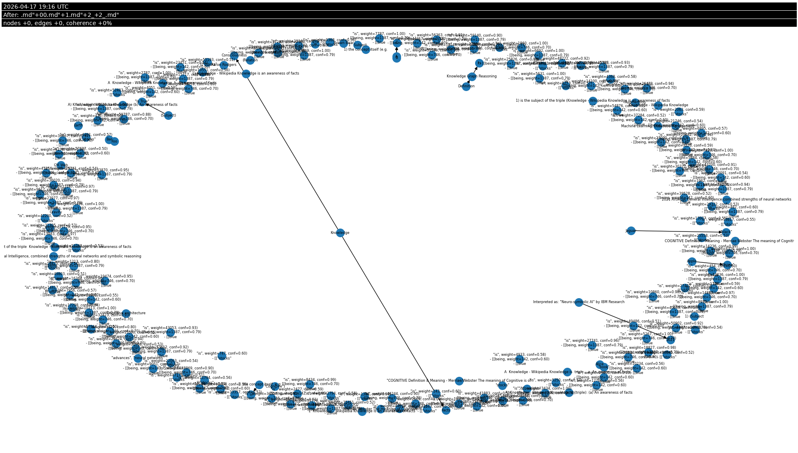](graph-2026-04-17-19-16-self-improve.png) [commit](https://github.com/BoggersTheFish/BoggersTheCIG/commit/94b1be0)

### 2026-04-17 19:52 UTC

**After:** vault organize (9 moves) — nodes +0, edges +0, coherence +0%

[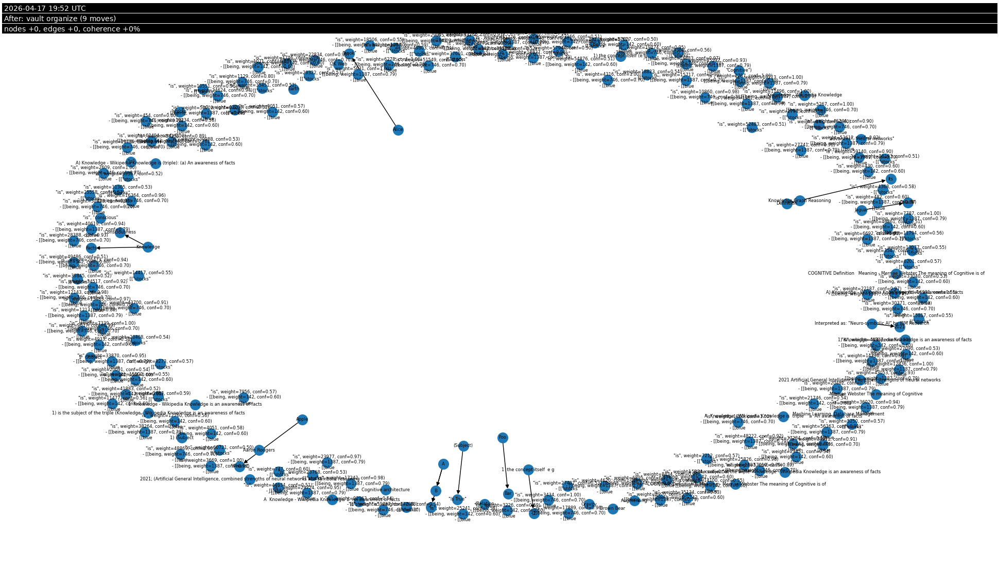](graph-2026-04-17-19-52-after-organize.png) [commit](https://github.com/BoggersTheFish/BoggersTheCIG/commit/94b1be0)

### 2026-04-17 19:53 UTC

**After:** 1 extracts, 3 merges — nodes +0, edges +0, coherence +0%

[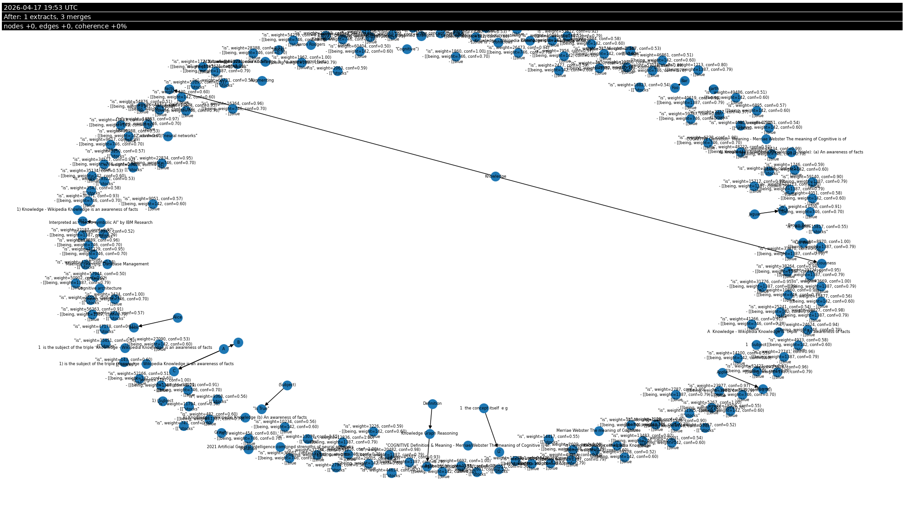](graph-2026-04-17-19-53-extract-subideas.png) [commit](https://github.com/BoggersTheFish/BoggersTheCIG/commit/94b1be0)

### 2026-04-17 19:53 UTC

**After:** +.md"+00.md"+1.md"+2_ — nodes +0, edges +0, coherence +0%

[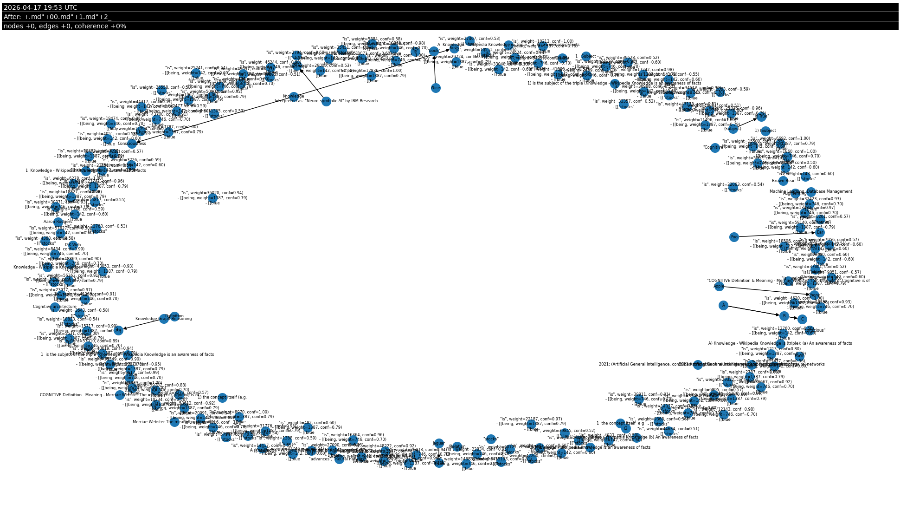](graph-2026-04-17-19-53-self-improve.png) [commit](https://github.com/BoggersTheFish/BoggersTheCIG/commit/94b1be0)

### 2026-04-17 21:28 UTC

**After:** vault organize (10 moves) — nodes +17, edges +17, coherence -1%

[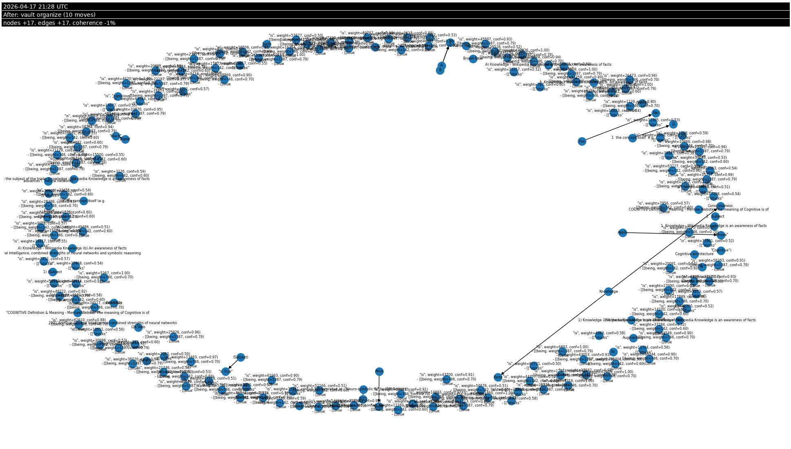](graph-2026-04-17-21-28-after-organize.png) [commit](https://github.com/BoggersTheFish/BoggersTheCIG/commit/1365de9)

### 2026-04-17 21:28 UTC

**After:** 3 extracts, 1 merges — nodes +0, edges +0, coherence +0%

[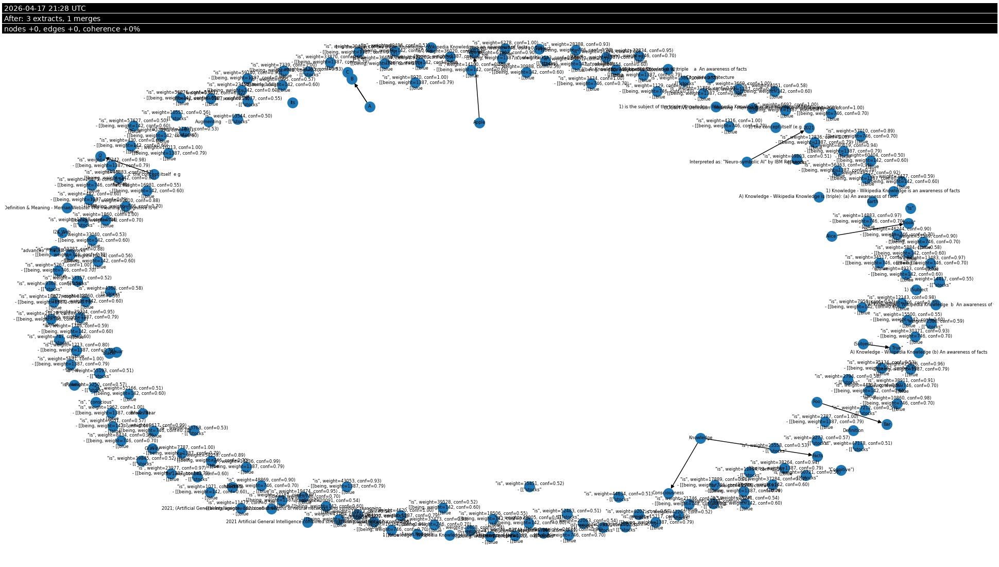](graph-2026-04-17-21-28-extract-subideas.png) [commit](https://github.com/BoggersTheFish/BoggersTheCIG/commit/1365de9)

### 2026-04-17 21:28 UTC

**After:** +.md"+1.md"+2_+2_.md" — nodes +0, edges +0, coherence +0%

[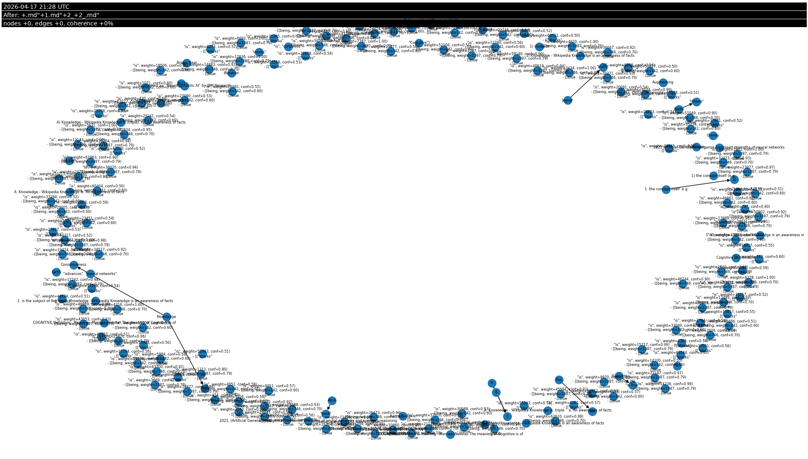](graph-2026-04-17-21-28-self-improve.png) [commit](https://github.com/BoggersTheFish/BoggersTheCIG/commit/1365de9)

### 2026-04-17 21:28 UTC

**After:** external ingest (+3 triples) — nodes +2, edges +1, coherence +0%

[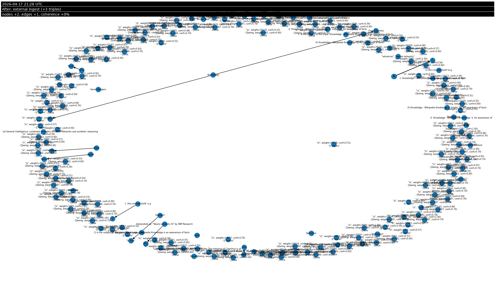](graph-2026-04-17-21-28-after-ingest.png) [commit](https://github.com/BoggersTheFish/BoggersTheCIG/commit/1365de9)

### 2026-04-17 22:14 UTC

**After:** vault analysis (+1312 triples) — nodes +0, edges +2, coherence +0%

[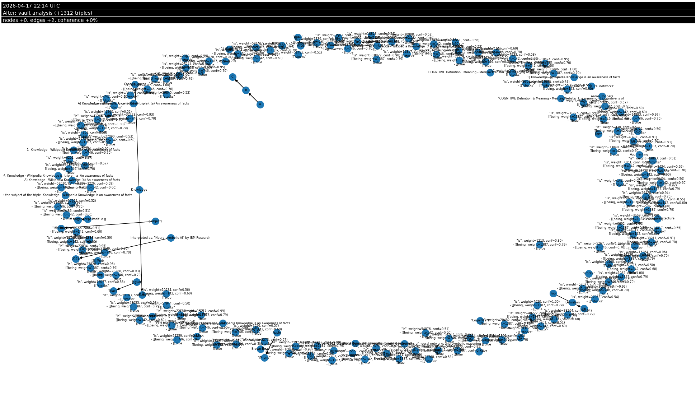](graph-2026-04-17-22-14-after-analyze-vault.png) [commit](https://github.com/BoggersTheFish/BoggersTheCIG/commit/1365de9)

### 2026-04-17 22:14 UTC

**After:** 4 extracts, 0 merges — nodes +0, edges +0, coherence +0%

[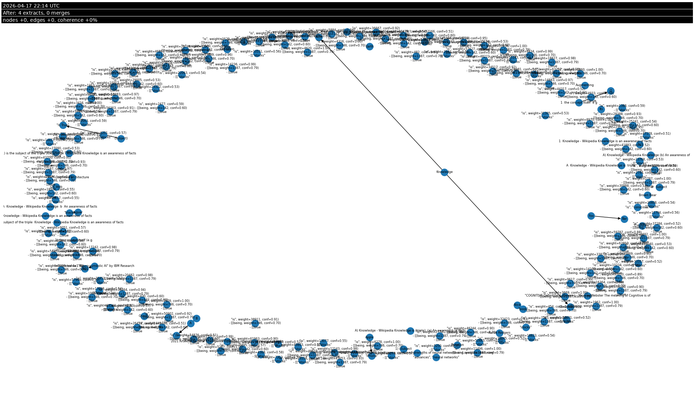](graph-2026-04-17-22-14-extract-subideas.png) [commit](https://github.com/BoggersTheFish/BoggersTheCIG/commit/1365de9)

### 2026-04-17 22:59 UTC

**After:** vault analysis (+1312 triples) — nodes +0, edges +2, coherence +0%

[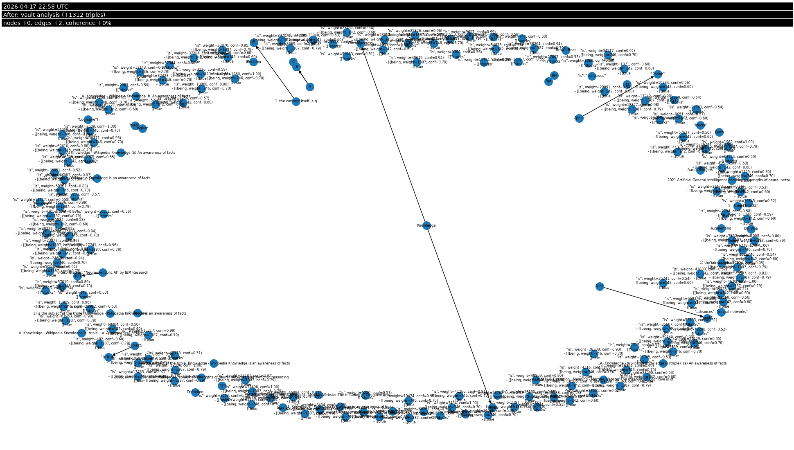](graph-2026-04-17-22-58-after-analyze-vault.png) [commit](https://github.com/BoggersTheFish/BoggersTheCIG/commit/1365de9)

### 2026-04-17 22:59 UTC

**After:** 4 extracts, 0 merges — nodes +0, edges +0, coherence +0%

[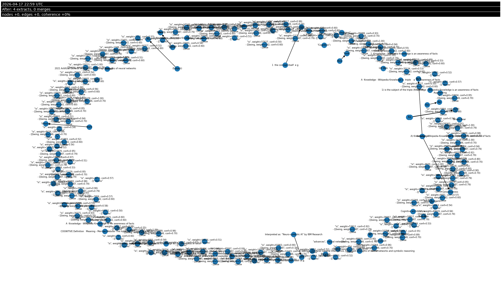](graph-2026-04-17-22-59-extract-subideas.png) [commit](https://github.com/BoggersTheFish/BoggersTheCIG/commit/1365de9)

### 2026-04-17 23:41 UTC

**After:** vault organize (6 moves) — nodes +0, edges +0, coherence +0%

[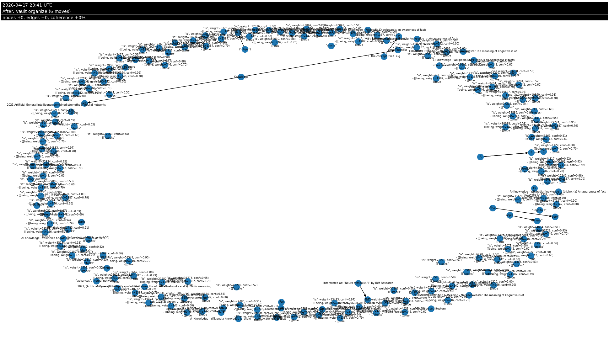](graph-2026-04-17-23-41-after-organize.png) [commit](https://github.com/BoggersTheFish/BoggersTheCIG/commit/1365de9)

### 2026-04-17 23:41 UTC

**After:** 1 extracts, 3 merges — nodes +0, edges +0, coherence +0%

[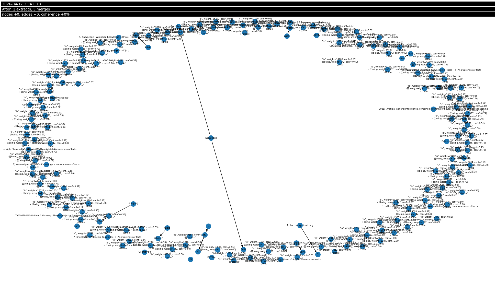](graph-2026-04-17-23-41-extract-subideas.png) [commit](https://github.com/BoggersTheFish/BoggersTheCIG/commit/1365de9)

### 2026-04-17 23:41 UTC

**After:** +.md"+1.md"+2_+2_.md" — nodes +0, edges +0, coherence +0%

[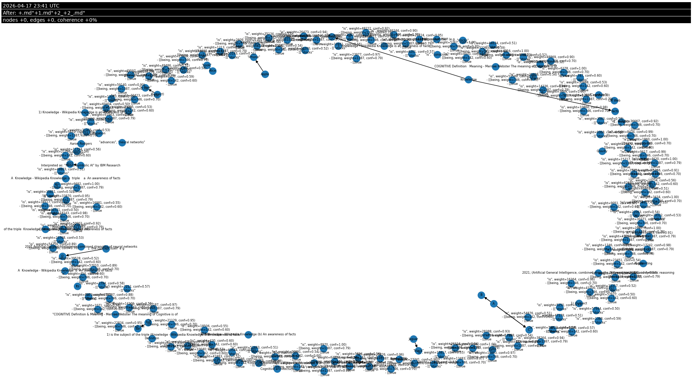](graph-2026-04-17-23-41-self-improve.png) [commit](https://github.com/BoggersTheFish/BoggersTheCIG/commit/1365de9)

### 2026-04-18 00:19 UTC

**After:** vault organize (8 moves) — nodes +0, edges +0, coherence +0%

[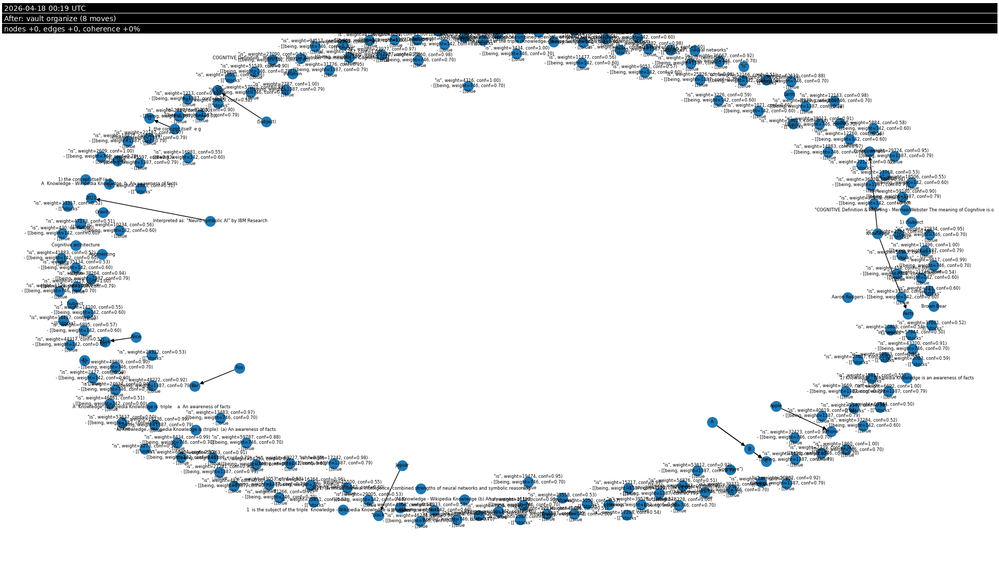](graph-2026-04-18-00-19-after-organize.png) [commit](https://github.com/BoggersTheFish/BoggersTheCIG/commit/1365de9)

### 2026-04-18 00:19 UTC

**After:** 2 extracts, 2 merges — nodes +0, edges +0, coherence +0%

[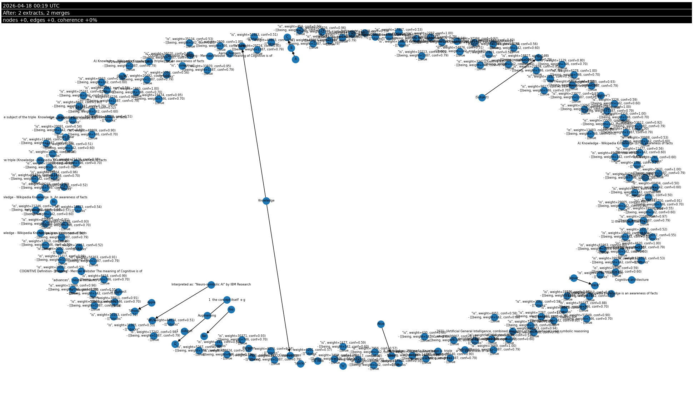](graph-2026-04-18-00-19-extract-subideas.png) [commit](https://github.com/BoggersTheFish/BoggersTheCIG/commit/1365de9)

### 2026-04-18 00:19 UTC

**After:** +"obsidian+.md"+1.md"+2_ — nodes +0, edges +0, coherence +0%

[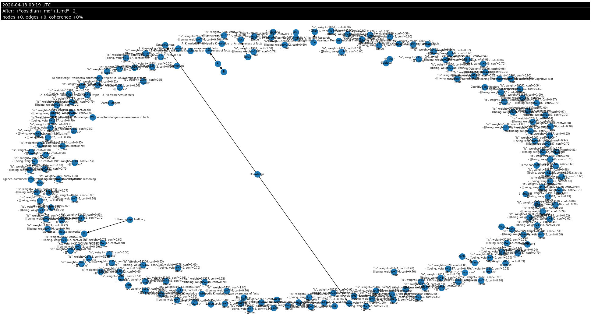](graph-2026-04-18-00-19-self-improve.png) [commit](https://github.com/BoggersTheFish/BoggersTheCIG/commit/1365de9)

### 2026-04-18 06:59 UTC

**After:** vault organize (5 moves) — nodes +17, edges +17, coherence -1%

[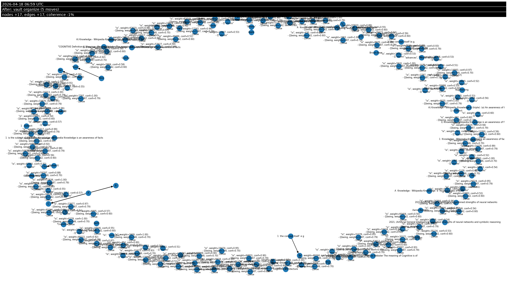](graph-2026-04-18-06-59-after-organize.png) [commit](https://github.com/BoggersTheFish/BoggersTheCIG/commit/d6330db)

### 2026-04-18 07:00 UTC

**After:** 2 extracts, 2 merges — nodes +0, edges +0, coherence +0%

[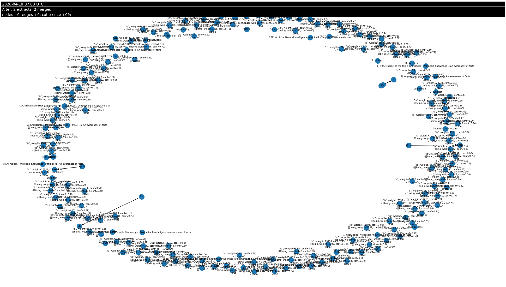](graph-2026-04-18-07-00-extract-subideas.png) [commit](https://github.com/BoggersTheFish/BoggersTheCIG/commit/d6330db)

### 2026-04-18 07:00 UTC

**After:** +"obsidian+.md"+1.md"+2_ — nodes +0, edges +0, coherence +0%

[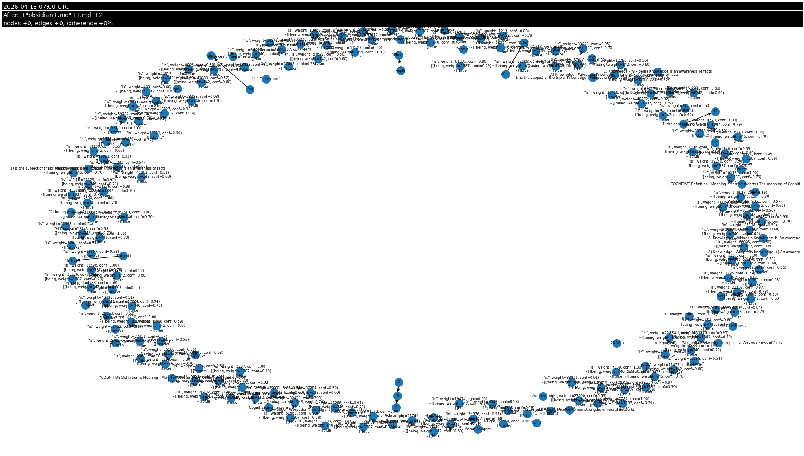](graph-2026-04-18-07-00-self-improve.png) [commit](https://github.com/BoggersTheFish/BoggersTheCIG/commit/d6330db)

### 2026-04-18 07:47 UTC

**After:** vault analysis (+1337 triples) — nodes +0, edges +3, coherence +0%

[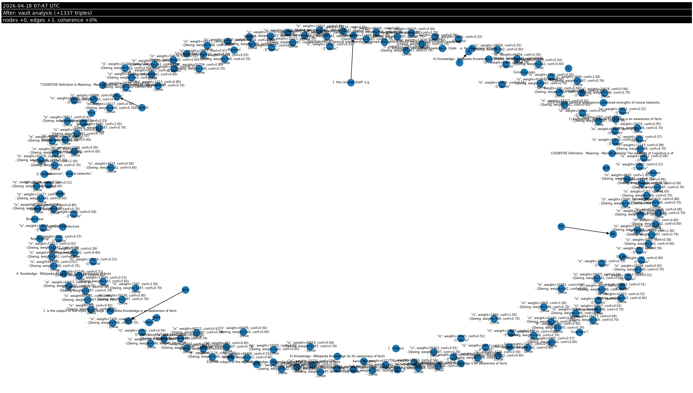](graph-2026-04-18-07-47-after-analyze-vault.png) [commit](https://github.com/BoggersTheFish/BoggersTheCIG/commit/d6330db)

### 2026-04-18 07:47 UTC

**After:** 4 extracts, 0 merges — nodes +0, edges +0, coherence +0%

[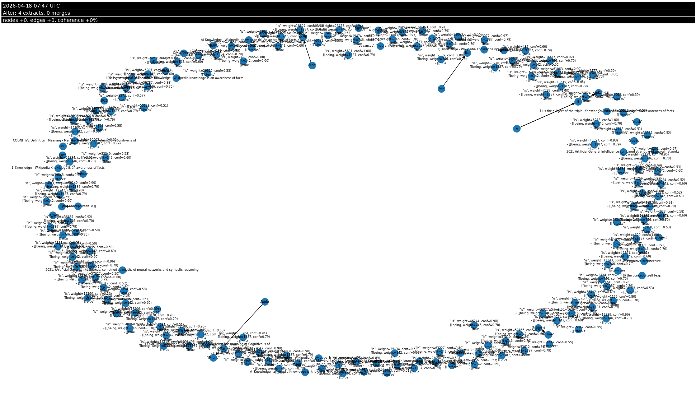](graph-2026-04-18-07-47-extract-subideas.png) [commit](https://github.com/BoggersTheFish/BoggersTheCIG/commit/d6330db)

### 2026-04-18 08:34 UTC

**After:** vault analysis (+1337 triples) — nodes +0, edges +2, coherence +0%

[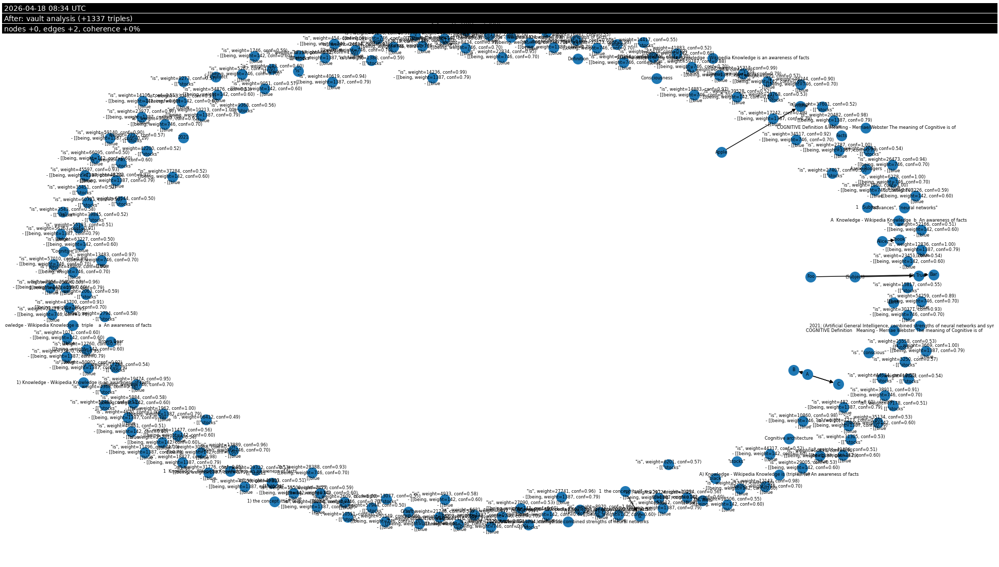](graph-2026-04-18-08-34-after-analyze-vault.png) [commit](https://github.com/BoggersTheFish/BoggersTheCIG/commit/d6330db)

### 2026-04-18 08:34 UTC

**After:** 4 extracts, 0 merges — nodes +0, edges +0, coherence +0%

[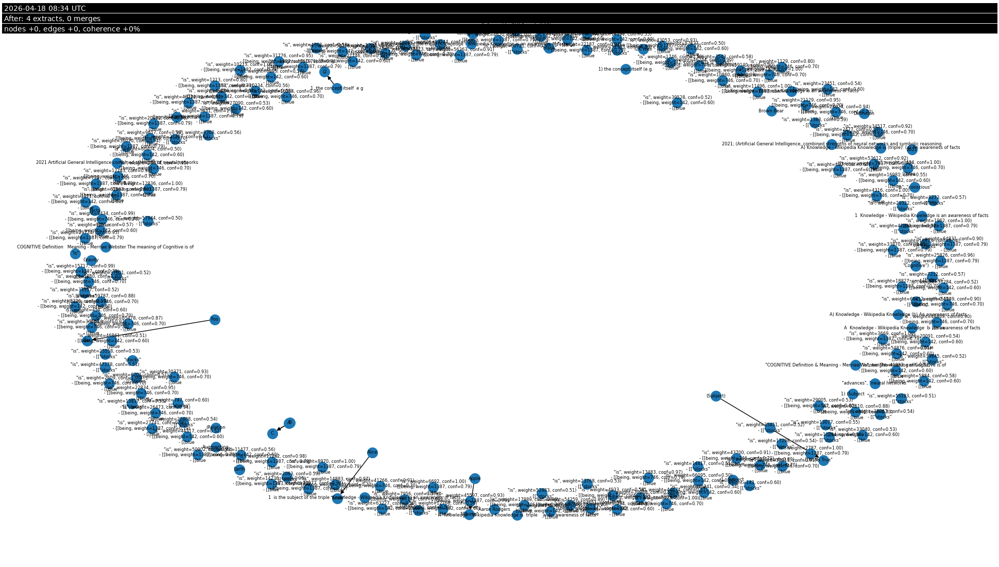](graph-2026-04-18-08-34-extract-subideas.png) [commit](https://github.com/BoggersTheFish/BoggersTheCIG/commit/d6330db)

### 2026-04-18 09:16 UTC

**After:** vault organize (5 moves) — nodes +0, edges +0, coherence +0%

[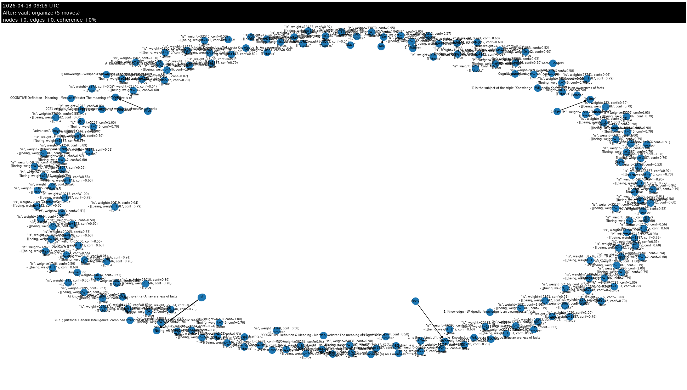](graph-2026-04-18-09-16-after-organize.png) [commit](https://github.com/BoggersTheFish/BoggersTheCIG/commit/d6330db)

### 2026-04-18 09:17 UTC

**After:** 1 extracts, 3 merges — nodes +0, edges +0, coherence +0%

[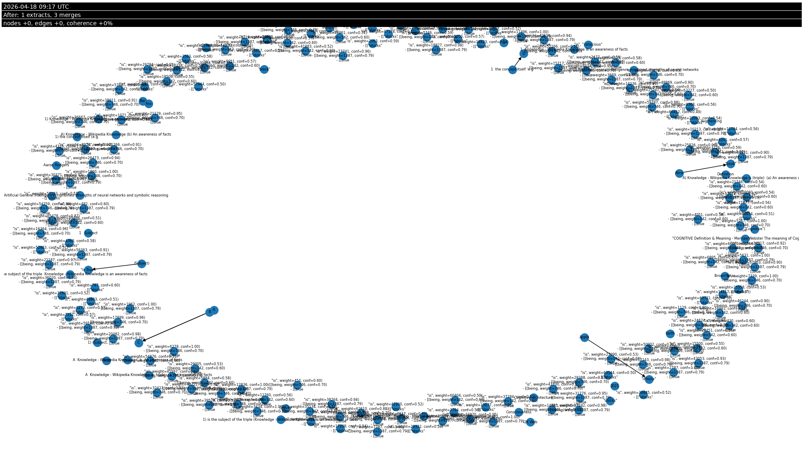](graph-2026-04-18-09-17-extract-subideas.png) [commit](https://github.com/BoggersTheFish/BoggersTheCIG/commit/d6330db)

### 2026-04-18 09:17 UTC

**After:** +"obsidian+.md"+1.md"+2_ — nodes +0, edges +0, coherence +0%

[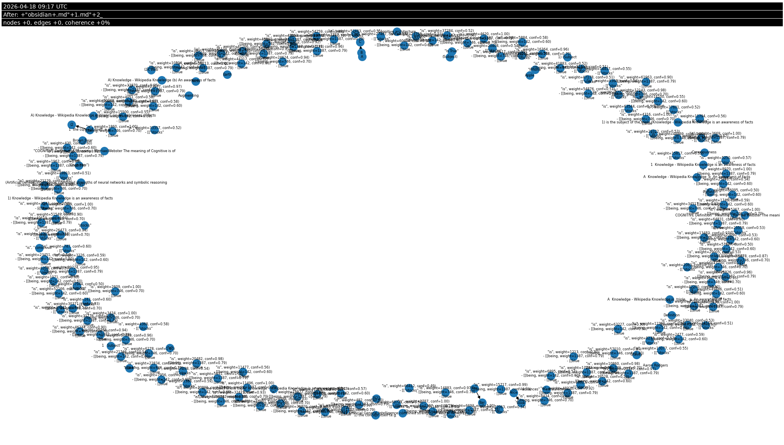](graph-2026-04-18-09-17-self-improve.png) [commit](https://github.com/BoggersTheFish/BoggersTheCIG/commit/d6330db)

### 2026-04-18 09:54 UTC

**After:** vault organize (10 moves) — nodes +0, edges +0, coherence +0%

[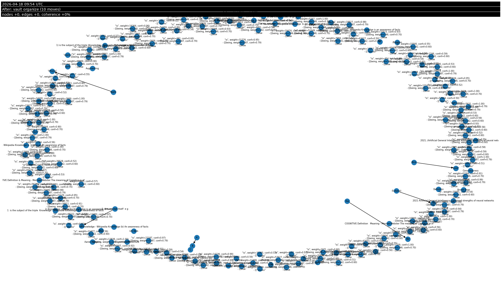](graph-2026-04-18-09-54-after-organize.png) [commit](https://github.com/BoggersTheFish/BoggersTheCIG/commit/d6330db)

### 2026-04-18 09:54 UTC

**After:** 1 extracts, 3 merges — nodes +0, edges +0, coherence +0%

[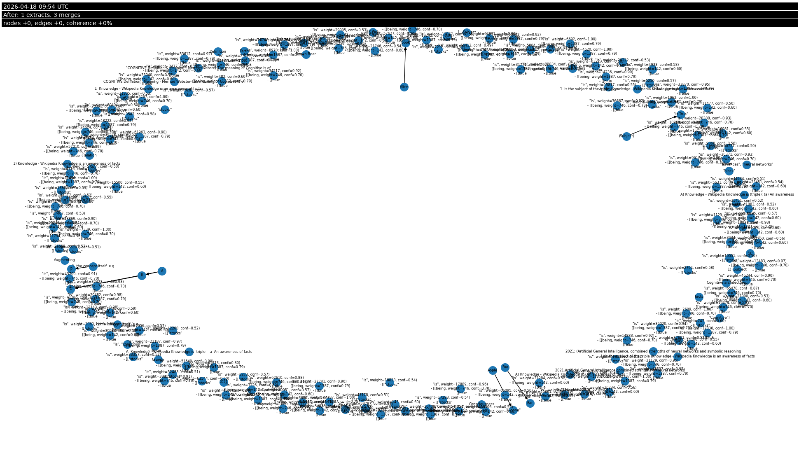](graph-2026-04-18-09-54-extract-subideas.png) [commit](https://github.com/BoggersTheFish/BoggersTheCIG/commit/d6330db)

### 2026-04-18 09:54 UTC

**After:** +"obsidian+.md"+1.md"+2_ — nodes +0, edges +0, coherence +0%

[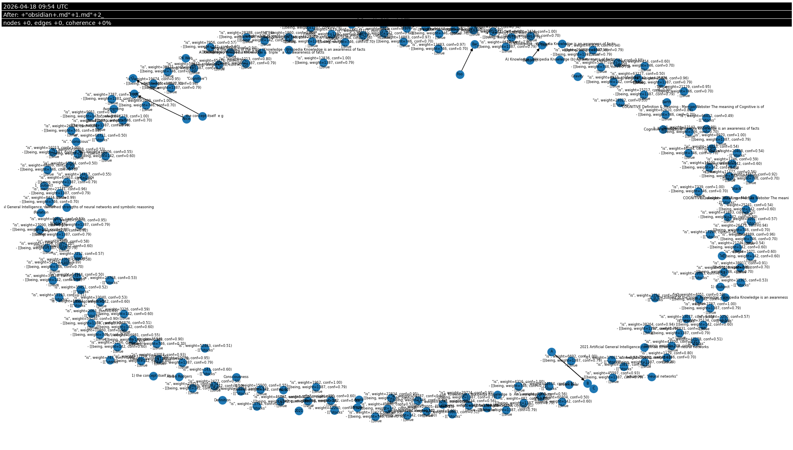](graph-2026-04-18-09-54-self-improve.png) [commit](https://github.com/BoggersTheFish/BoggersTheCIG/commit/d6330db)

### 2026-04-18 11:27 UTC

**After:** vault organize (10 moves) — nodes +17, edges +17, coherence -1%

[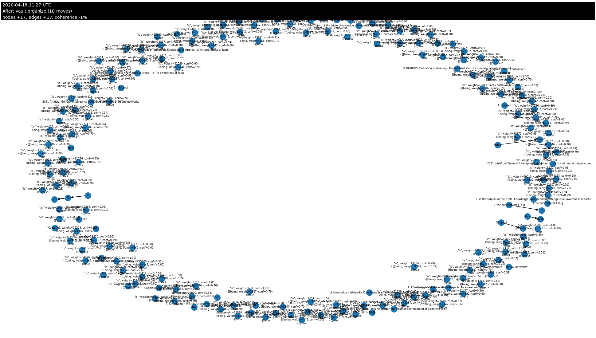](graph-2026-04-18-11-27-after-organize.png) [commit](https://github.com/BoggersTheFish/BoggersTheCIG/commit/9fce1d1)

### 2026-04-18 11:27 UTC

**After:** 2 extracts, 2 merges — nodes +0, edges +0, coherence +0%

[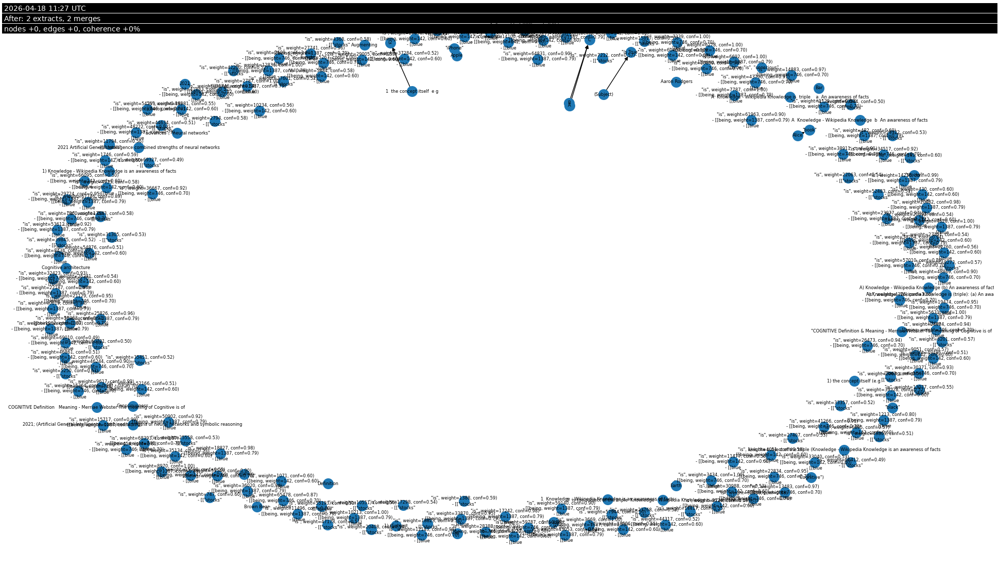](graph-2026-04-18-11-27-extract-subideas.png) [commit](https://github.com/BoggersTheFish/BoggersTheCIG/commit/9fce1d1)

### 2026-04-18 11:27 UTC

**After:** +.md"+1.md"+2_+2_.md" — nodes +0, edges +0, coherence +0%

[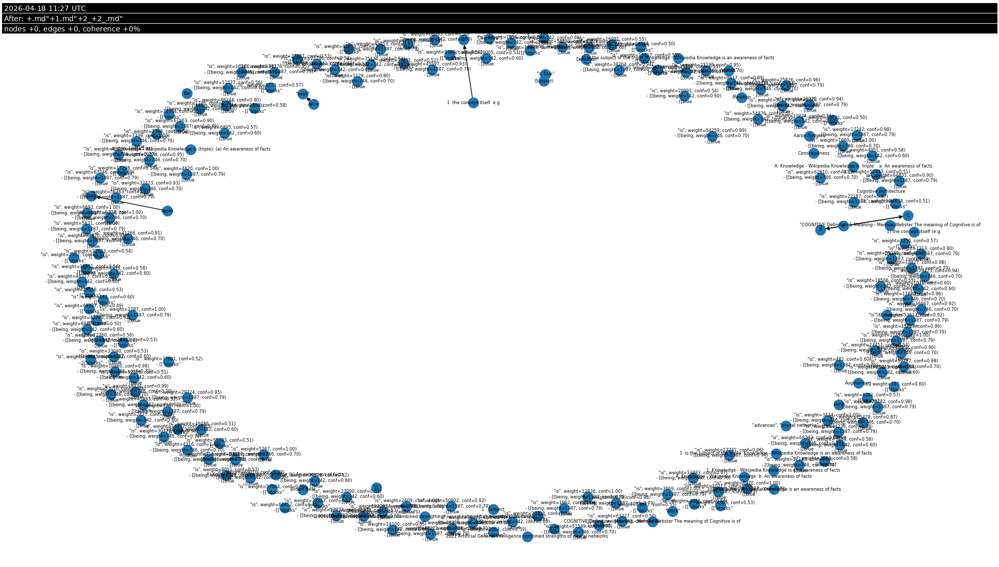](graph-2026-04-18-11-27-self-improve.png) [commit](https://github.com/BoggersTheFish/BoggersTheCIG/commit/9fce1d1)

### 2026-04-18 11:27 UTC

**After:** external ingest (+2 triples) — nodes +0, edges +0, coherence +0%

[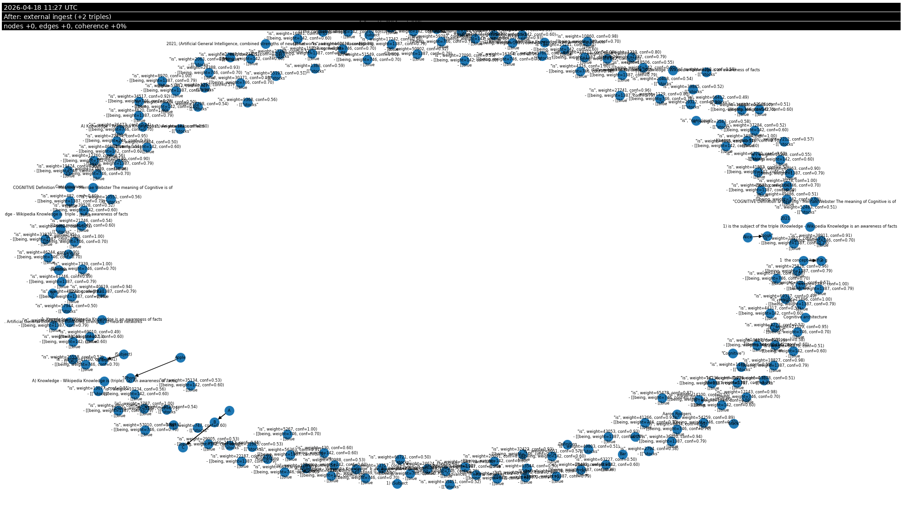](graph-2026-04-18-11-27-after-ingest.png) [commit](https://github.com/BoggersTheFish/BoggersTheCIG/commit/9fce1d1)

### 2026-04-18 12:31 UTC

**After:** vault analysis (+1357 triples) — nodes +0, edges +2, coherence +0%

[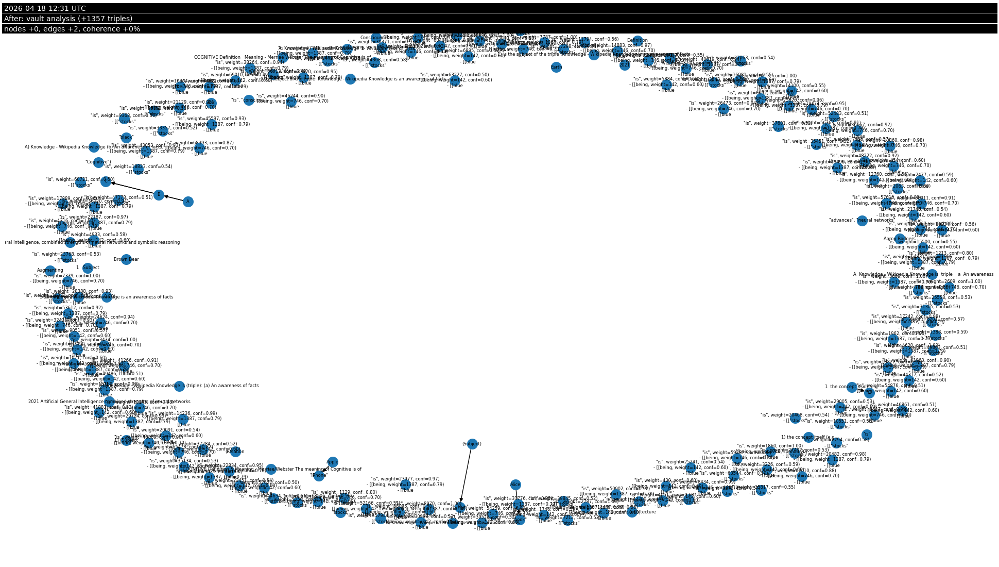](graph-2026-04-18-12-31-after-analyze-vault.png) [commit](https://github.com/BoggersTheFish/BoggersTheCIG/commit/9fce1d1)

### 2026-04-18 12:31 UTC

**After:** 2 extracts, 0 merges — nodes +0, edges +0, coherence +0%

[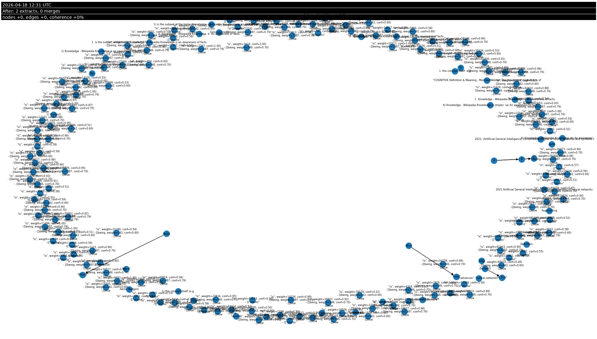](graph-2026-04-18-12-31-extract-subideas.png) [commit](https://github.com/BoggersTheFish/BoggersTheCIG/commit/9fce1d1)

### 2026-04-18 13:34 UTC

**After:** vault analysis (+1357 triples) — nodes +0, edges +2, coherence +0%

[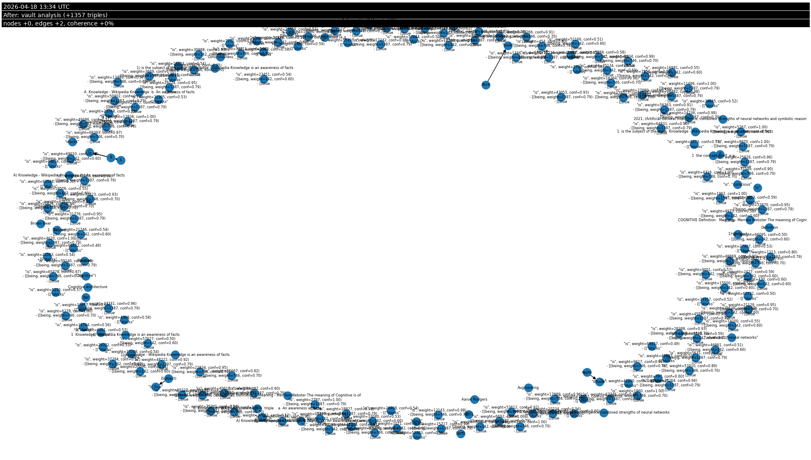](graph-2026-04-18-13-34-after-analyze-vault.png) [commit](https://github.com/BoggersTheFish/BoggersTheCIG/commit/9fce1d1)

### 2026-04-18 13:34 UTC

**After:** 2 extracts, 0 merges — nodes +0, edges +0, coherence +0%

[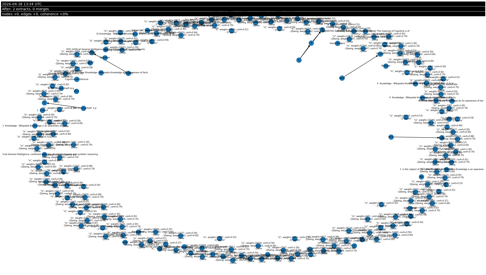](graph-2026-04-18-13-34-extract-subideas.png) [commit](https://github.com/BoggersTheFish/BoggersTheCIG/commit/9fce1d1)

### 2026-04-18 14:18 UTC

**After:** vault organize (11 moves) — nodes +0, edges +0, coherence +0%

[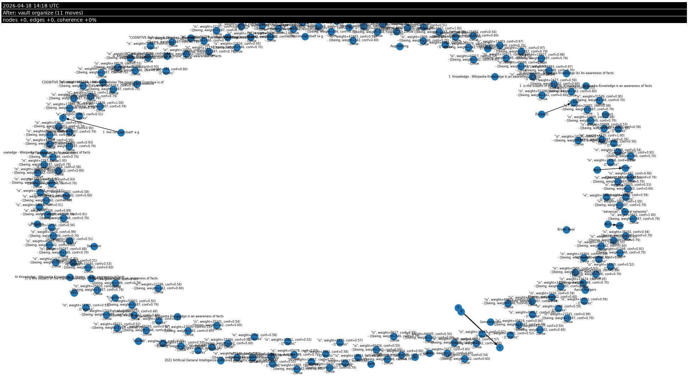](graph-2026-04-18-14-18-after-organize.png) [commit](https://github.com/BoggersTheFish/BoggersTheCIG/commit/9fce1d1)

### 2026-04-18 14:18 UTC

**After:** 2 extracts, 1 merges — nodes +0, edges +0, coherence +0%

[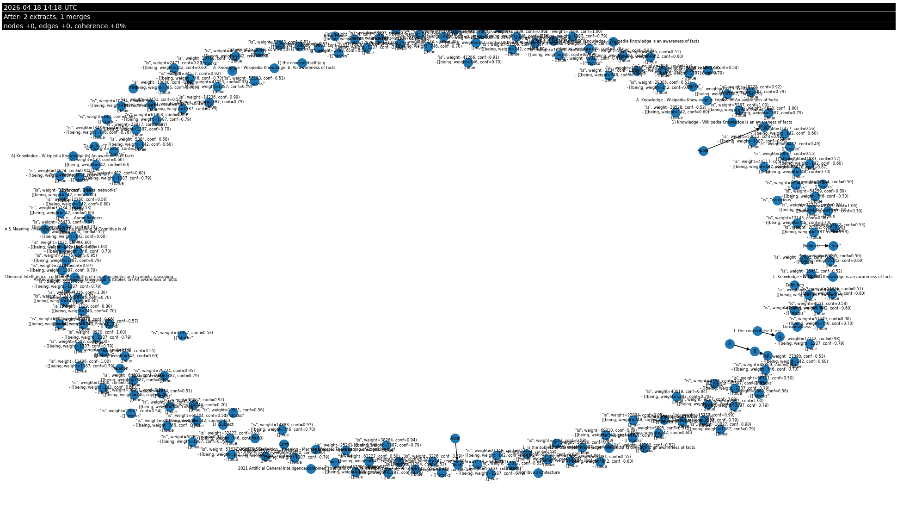](graph-2026-04-18-14-18-extract-subideas.png) [commit](https://github.com/BoggersTheFish/BoggersTheCIG/commit/9fce1d1)

### 2026-04-18 14:18 UTC

**After:** +.md"+1.md"+2_+2_.md" — nodes +0, edges +0, coherence +0%

[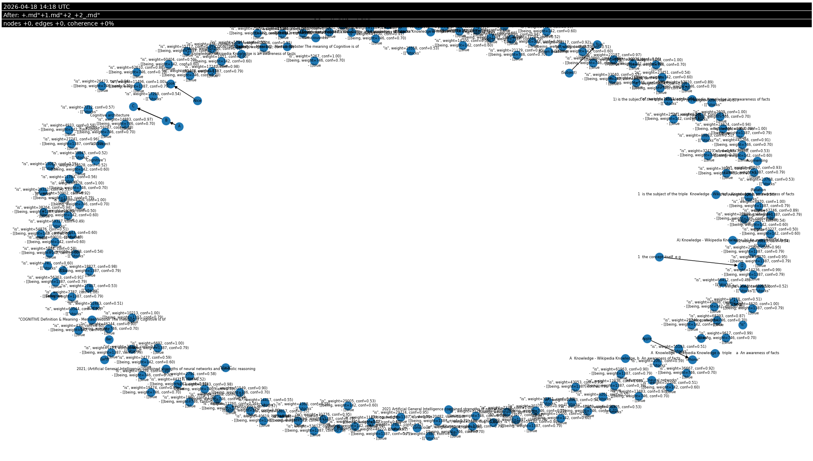](graph-2026-04-18-14-18-self-improve.png) [commit](https://github.com/BoggersTheFish/BoggersTheCIG/commit/9fce1d1)

### 2026-04-18 14:57 UTC

**After:** vault organize (7 moves) — nodes +0, edges +0, coherence +0%

[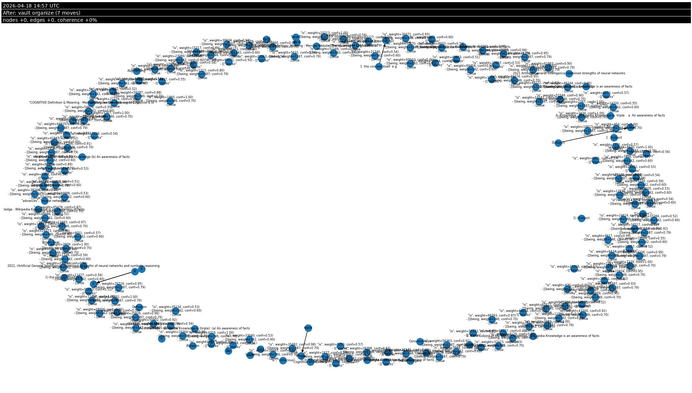](graph-2026-04-18-14-57-after-organize.png) [commit](https://github.com/BoggersTheFish/BoggersTheCIG/commit/9fce1d1)

### 2026-04-18 14:57 UTC

**After:** 1 extracts, 2 merges — nodes +0, edges +0, coherence +0%

[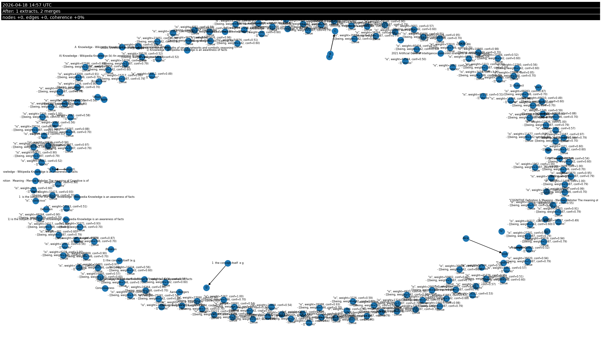](graph-2026-04-18-14-57-extract-subideas.png) [commit](https://github.com/BoggersTheFish/BoggersTheCIG/commit/9fce1d1)

### 2026-04-18 14:57 UTC

**After:** +.md"+1.md"+2_+2_.md" — nodes +0, edges +0, coherence +0%

[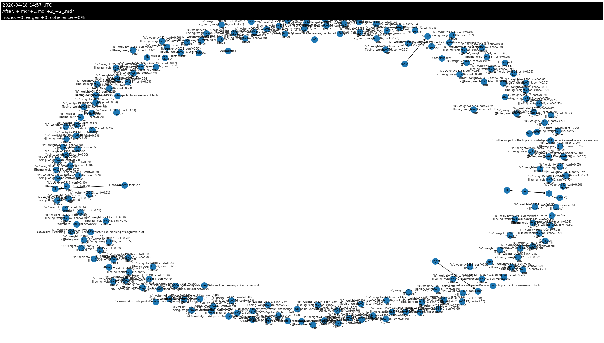](graph-2026-04-18-14-57-self-improve.png) [commit](https://github.com/BoggersTheFish/BoggersTheCIG/commit/9fce1d1)

### 2026-04-18 16:22 UTC

**After:** vault organize (11 moves) — nodes +17, edges +17, coherence -1%

[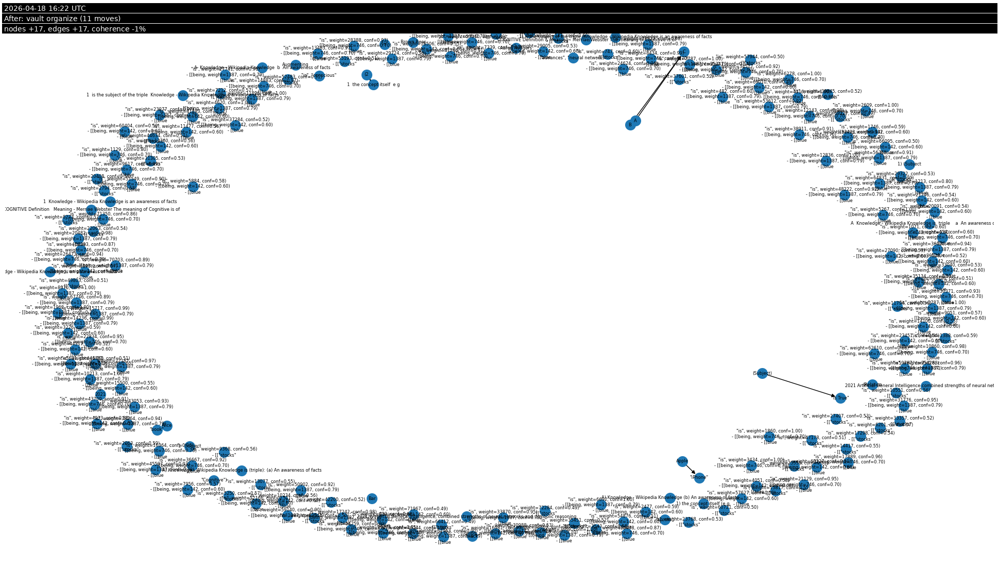](graph-2026-04-18-16-22-after-organize.png) [commit](https://github.com/BoggersTheFish/BoggersTheCIG/commit/26cf6cb)

### 2026-04-18 16:22 UTC

**After:** 3 extracts, 0 merges — nodes +0, edges +0, coherence +0%

[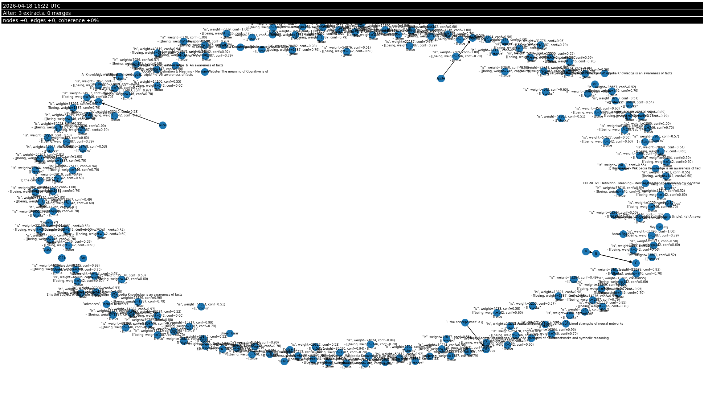](graph-2026-04-18-16-22-extract-subideas.png) [commit](https://github.com/BoggersTheFish/BoggersTheCIG/commit/26cf6cb)

### 2026-04-18 16:22 UTC

**After:** +.md"+1.md"+2_+2_.md" — nodes +0, edges +0, coherence +0%

[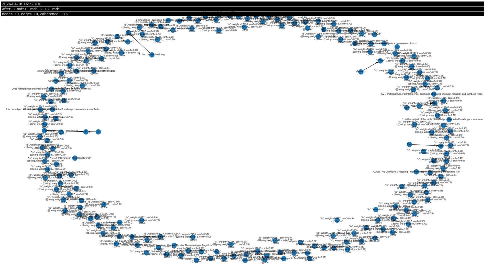](graph-2026-04-18-16-22-self-improve.png) [commit](https://github.com/BoggersTheFish/BoggersTheCIG/commit/26cf6cb)

### 2026-04-18 17:12 UTC

**After:** vault analysis (+1370 triples) — nodes +0, edges +2, coherence +0%

[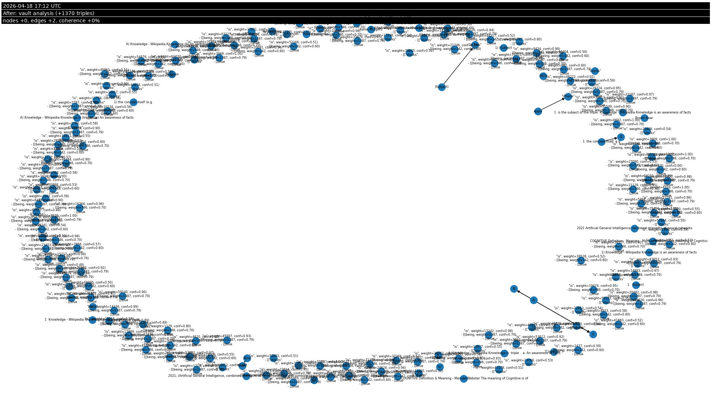](graph-2026-04-18-17-12-after-analyze-vault.png) [commit](https://github.com/BoggersTheFish/BoggersTheCIG/commit/26cf6cb)

### 2026-04-18 17:12 UTC

**After:** 3 extracts, 0 merges — nodes +0, edges +0, coherence +0%

[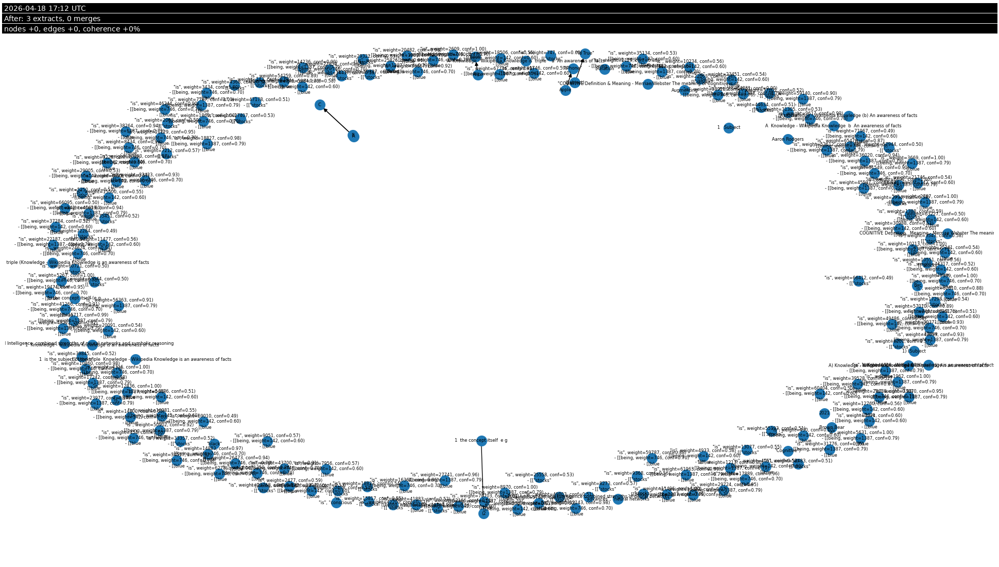](graph-2026-04-18-17-12-extract-subideas.png) [commit](https://github.com/BoggersTheFish/BoggersTheCIG/commit/26cf6cb)

### 2026-04-18 18:01 UTC

**After:** vault analysis (+1370 triples) — nodes +0, edges +2, coherence +0%

[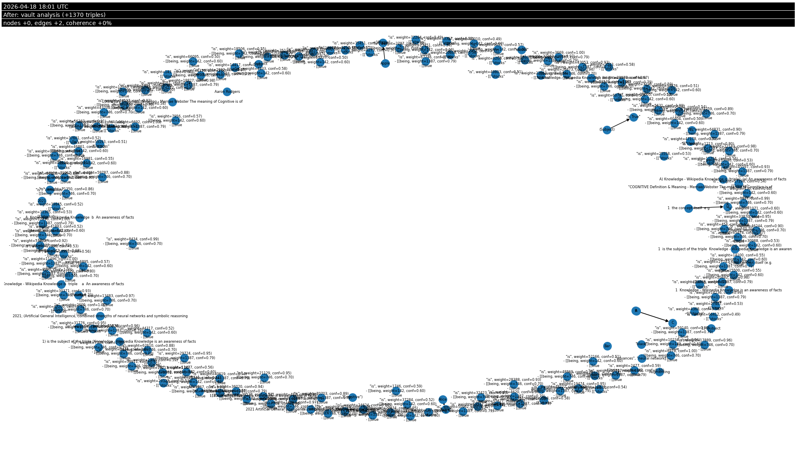](graph-2026-04-18-18-01-after-analyze-vault.png) [commit](https://github.com/BoggersTheFish/BoggersTheCIG/commit/26cf6cb)

### 2026-04-18 18:01 UTC

**After:** 2 extracts, 0 merges — nodes +0, edges +0, coherence +0%

[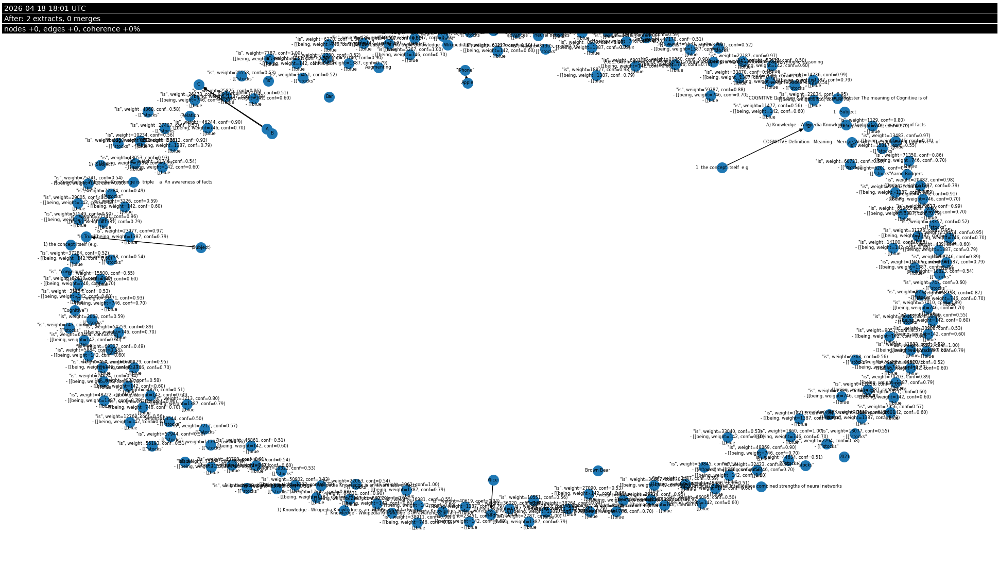](graph-2026-04-18-18-01-extract-subideas.png) [commit](https://github.com/BoggersTheFish/BoggersTheCIG/commit/26cf6cb)

### 2026-04-18 18:43 UTC

**After:** vault organize (8 moves) — nodes +0, edges +0, coherence +0%

[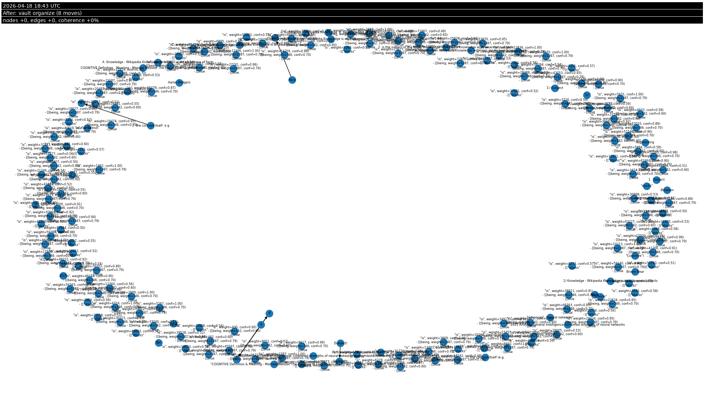](graph-2026-04-18-18-43-after-organize.png) [commit](https://github.com/BoggersTheFish/BoggersTheCIG/commit/26cf6cb)

### 2026-04-18 18:43 UTC

**After:** 0 extracts, 2 merges — nodes +0, edges +0, coherence +0%

[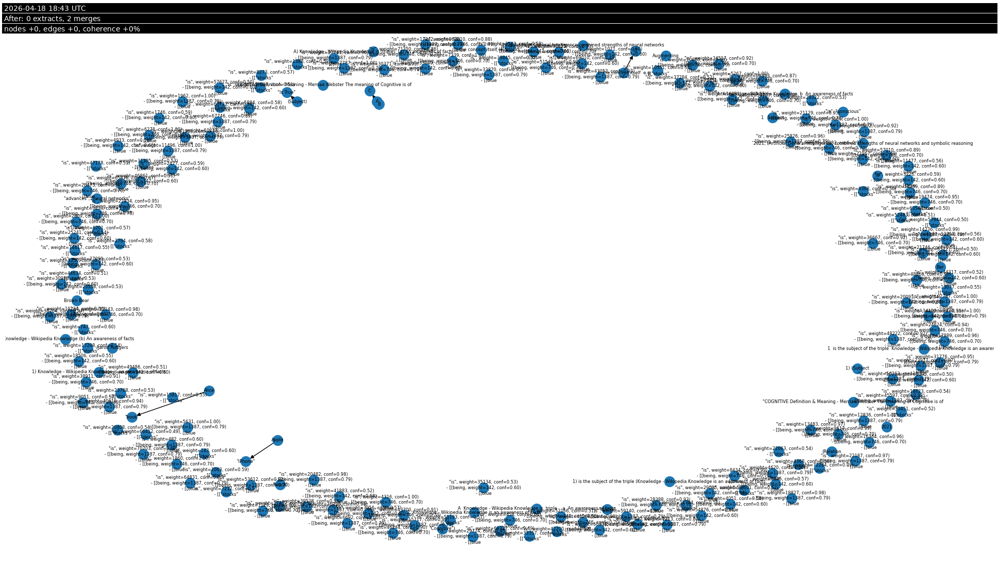](graph-2026-04-18-18-43-extract-subideas.png) [commit](https://github.com/BoggersTheFish/BoggersTheCIG/commit/26cf6cb)

### 2026-04-18 18:43 UTC

**After:** +.md"+00.md"+1.md"+2_ — nodes +0, edges +0, coherence +0%

[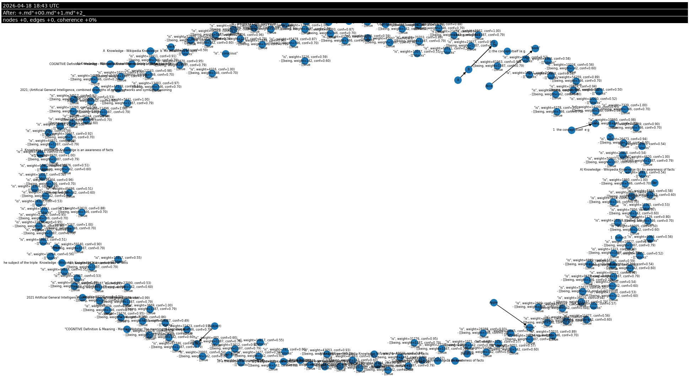](graph-2026-04-18-18-43-self-improve.png) [commit](https://github.com/BoggersTheFish/BoggersTheCIG/commit/26cf6cb)

### 2026-04-18 19:22 UTC

**After:** vault organize (10 moves) — nodes +0, edges +0, coherence +0%

[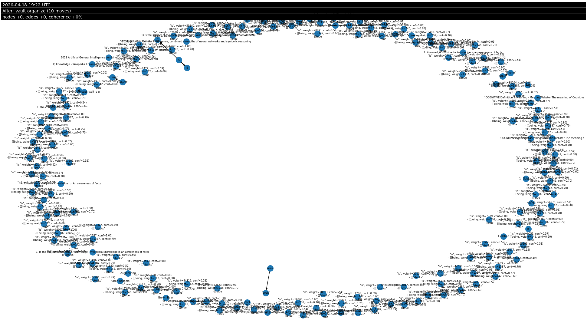](graph-2026-04-18-19-22-after-organize.png) [commit](https://github.com/BoggersTheFish/BoggersTheCIG/commit/26cf6cb)

### 2026-04-18 19:22 UTC

**After:** 2 extracts, 0 merges — nodes +0, edges +0, coherence +0%

[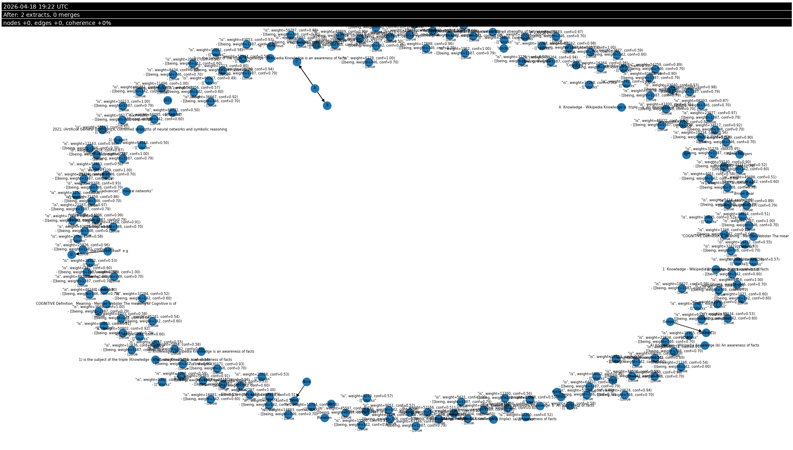](graph-2026-04-18-19-22-extract-subideas.png) [commit](https://github.com/BoggersTheFish/BoggersTheCIG/commit/26cf6cb)

### 2026-04-18 19:22 UTC

**After:** +.md"+00.md"+1.md"+2_ — nodes +0, edges +0, coherence +0%

[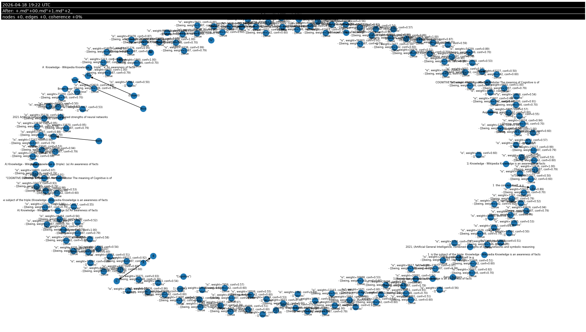](graph-2026-04-18-19-22-self-improve.png) [commit](https://github.com/BoggersTheFish/BoggersTheCIG/commit/26cf6cb)
