# TS Graph Snapshots

Auto-generated after vault-modifying operations.

- **2026-03-16 22:36 UTC** — self-improve: 

- **2026-03-16 22:37 UTC** — self-improve: 

- **2026-03-16 22:43 UTC** — self-improve: 

- **2026-03-16 22:45 UTC** — self-improve: 

- **2026-03-16 22:45 UTC** — self-improve: 

### 2026-03-16 22:47 UTC

**After:** test overlay — nodes +0, edges +0, coherence +0%

### 2026-03-16 23:08 UTC

**After:** README.md+obsidian+src+tests — nodes +0, edges +0, coherence +0%

 [commit](https://github.com/BoggersTheFish/BoggersTheCIG/commit/d39e45d)

### 2026-03-16 23:08 UTC

**After:** README.md+eval+obsidian+src+tests — nodes +0, edges +0, coherence +0%

 [commit](https://github.com/BoggersTheFish/BoggersTheCIG/commit/d39e45d)

### 2026-03-16 23:10 UTC

**After:** external ingest (+4 triples) — nodes -9, edges -4, coherence +217%

 [commit](https://github.com/BoggersTheFish/BoggersTheCIG/commit/d39e45d)

### 2026-03-16 23:11 UTC

**After:** vault analysis (+9 triples) — nodes +15, edges +9, coherence -74%

 [commit](https://github.com/BoggersTheFish/BoggersTheCIG/commit/d39e45d)

### 2026-03-16 23:11 UTC

**After:** vault analysis (+9 triples) — nodes +0, edges +1, coherence +7%

 [commit](https://github.com/BoggersTheFish/BoggersTheCIG/commit/d39e45d)

### 2026-03-16 23:12 UTC

**After:** 2_.md"+README.md+Reasoning.md"+architecture.md"+eval — nodes +0, edges +0, coherence +0%

 [commit](https://github.com/BoggersTheFish/BoggersTheCIG/commit/d39e45d)

### 2026-03-16 23:12 UTC

**After:** 2_.md"+README.md+Reasoning.md"+architecture.md"+eval — nodes +0, edges +0, coherence +0%

 [commit](https://github.com/BoggersTheFish/BoggersTheCIG/commit/d39e45d)

### 2026-03-16 23:16 UTC

**After:** 2_.md"+README.md+Reasoning.md"+architecture.md"+eval — nodes +0, edges +0, coherence +0%

 [commit](https://github.com/BoggersTheFish/BoggersTheCIG/commit/d39e45d)

### 2026-03-16 23:16 UTC

**After:** 2_.md"+README.md+Reasoning.md"+architecture.md"+eval — nodes +0, edges +0, coherence +0%

 [commit](https://github.com/BoggersTheFish/BoggersTheCIG/commit/d39e45d)

### 2026-03-16 23:18 UTC

**After:** 2_.md"+README.md+Reasoning.md"+architecture.md"+eval — nodes +0, edges +0, coherence +0%

 [commit](https://github.com/BoggersTheFish/BoggersTheCIG/commit/d39e45d)

### 2026-03-16 23:18 UTC

**After:** 2_.md"+README.md+Reasoning.md"+architecture.md"+eval — nodes +0, edges +0, coherence +0%

 [commit](https://github.com/BoggersTheFish/BoggersTheCIG/commit/d39e45d)

### 2026-03-16 23:22 UTC

**After:** vault analysis (+15 triples) — nodes +0, edges +1, coherence +6%

 [commit](https://github.com/BoggersTheFish/BoggersTheCIG/commit/d39e45d)

### 2026-03-16 23:22 UTC

**After:** 1 extracts, 0 merges — nodes +0, edges +0, coherence +0%

 [commit](https://github.com/BoggersTheFish/BoggersTheCIG/commit/d39e45d)

### 2026-03-16 23:23 UTC

**After:** vault analysis (+15 triples) — nodes +1, edges +3, coherence +8%

 [commit](https://github.com/BoggersTheFish/BoggersTheCIG/commit/d39e45d)

### 2026-03-16 23:23 UTC

**After:** 1 extracts, 0 merges — nodes +0, edges +0, coherence +0%

 [commit](https://github.com/BoggersTheFish/BoggersTheCIG/commit/d39e45d)

### 2026-03-16 23:23 UTC

**After:** 0 extracts, 1 merges — nodes +0, edges +0, coherence +0%

 [commit](https://github.com/BoggersTheFish/BoggersTheCIG/commit/d39e45d)

### 2026-03-16 23:27 UTC

**After:** 0 extracts, 1 merges — nodes +0, edges +0, coherence +0%

 [commit](https://github.com/BoggersTheFish/BoggersTheCIG/commit/d39e45d)

### 2026-03-16 23:27 UTC

**After:** .github+2_+2_.md"+README.md+Reasoning.md" — nodes +0, edges +0, coherence +0%

 [commit](https://github.com/BoggersTheFish/BoggersTheCIG/commit/d39e45d)

### 2026-03-16 23:27 UTC

**After:** 0 extracts, 1 merges — nodes +0, edges +0, coherence +0%

 [commit](https://github.com/BoggersTheFish/BoggersTheCIG/commit/d39e45d)

### 2026-03-16 23:27 UTC

**After:** .github+2_+2_.md"+README.md+Reasoning.md" — nodes +0, edges +0, coherence +0%

 [commit](https://github.com/BoggersTheFish/BoggersTheCIG/commit/d39e45d)

### 2026-03-16 23:48 UTC

**After:** external ingest (+8 triples) — nodes -11, edges -10, coherence +81%

 [commit](https://github.com/BoggersTheFish/BoggersTheCIG/commit/c65da58)

### 2026-03-16 23:49 UTC

**After:** vault analysis (+17 triples) — nodes +24, edges +17, coherence -69%

 [commit](https://github.com/BoggersTheFish/BoggersTheCIG/commit/c65da58)

### 2026-03-16 23:49 UTC

**After:** 1 extracts, 0 merges — nodes -32, edges -24, coherence +707%

 [commit](https://github.com/BoggersTheFish/BoggersTheCIG/commit/c65da58)

### 2026-03-16 23:49 UTC

**After:** vault analysis (+18 triples) — nodes +1, edges +1, coherence -9%

 [commit](https://github.com/BoggersTheFish/BoggersTheCIG/commit/c65da58)

### 2026-03-16 23:49 UTC

**After:** 1 extracts, 0 merges — nodes -3, edges -2, coherence +233%

 [commit](https://github.com/BoggersTheFish/BoggersTheCIG/commit/c65da58)

### 2026-03-16 23:50 UTC

**After:** 1 extracts, 0 merges — nodes +0, edges +0, coherence +0%

 [commit](https://github.com/BoggersTheFish/BoggersTheCIG/commit/0b473f2)

### 2026-03-16 23:50 UTC

**After:** obsidian — nodes +0, edges +0, coherence +0%

 [commit](https://github.com/BoggersTheFish/BoggersTheCIG/commit/0b473f2)

### 2026-03-16 23:51 UTC

**After:** eval+obsidian — nodes +0, edges +0, coherence +0%

 [commit](https://github.com/BoggersTheFish/BoggersTheCIG/commit/0b473f2)

### 2026-03-17 01:21 UTC

**After:** external ingest (+1 triples) — nodes +4, edges +2, coherence +333233%

 [commit](https://github.com/BoggersTheFish/BoggersTheCIG/commit/c260423)

### 2026-03-17 01:21 UTC

**After:** vault analysis (+17 triples) — nodes +25, edges +16, coherence -86%

 [commit](https://github.com/BoggersTheFish/BoggersTheCIG/commit/c260423)

### 2026-03-17 01:21 UTC

**After:** vault analysis (+17 triples) — nodes +0, edges +1, coherence +5%

 [commit](https://github.com/BoggersTheFish/BoggersTheCIG/commit/c260423)

### 2026-03-17 01:21 UTC

**After:** 1 extracts, 0 merges — nodes +0, edges +0, coherence +0%

 [commit](https://github.com/BoggersTheFish/BoggersTheCIG/commit/c260423)

### 2026-03-17 01:21 UTC

**After:** 2_+2_.md"+Reasoning.md"+Theory.md"+architecture.md" — nodes +0, edges +0, coherence +0%

 [commit](https://github.com/BoggersTheFish/BoggersTheCIG/commit/c260423)

### 2026-03-17 01:21 UTC

**After:** 0 extracts, 1 merges — nodes +0, edges +0, coherence +0%

 [commit](https://github.com/BoggersTheFish/BoggersTheCIG/commit/c260423)

### 2026-03-17 01:21 UTC

**After:** 2_+2_.md"+Reasoning.md"+Theory.md"+architecture.md" — nodes +0, edges +0, coherence +0%

 [commit](https://github.com/BoggersTheFish/BoggersTheCIG/commit/c260423)

### 2026-03-17 06:59 UTC

**After:** external ingest (+1 triples) — nodes +4, edges +2, coherence +333233%

 [commit](https://github.com/BoggersTheFish/BoggersTheCIG/commit/25bc64f)

### 2026-03-17 06:59 UTC

**After:** vault analysis (+24 triples) — nodes +26, edges +17, coherence -86%

 [commit](https://github.com/BoggersTheFish/BoggersTheCIG/commit/25bc64f)

### 2026-03-17 06:59 UTC

**After:** vault analysis (+24 triples) — nodes +0, edges +1, coherence +5%

 [commit](https://github.com/BoggersTheFish/BoggersTheCIG/commit/25bc64f)

### 2026-03-17 06:59 UTC

**After:** 1 extracts, 0 merges — nodes +0, edges +0, coherence +0%

 [commit](https://github.com/BoggersTheFish/BoggersTheCIG/commit/25bc64f)

### 2026-03-17 06:59 UTC

**After:** 2_+2_.md"+Theory.md"+blue.md"+eval — nodes +0, edges +0, coherence +0%

 [commit](https://github.com/BoggersTheFish/BoggersTheCIG/commit/25bc64f)

### 2026-03-17 06:59 UTC

**After:** 0 extracts, 1 merges — nodes +0, edges +0, coherence +0%

 [commit](https://github.com/BoggersTheFish/BoggersTheCIG/commit/25bc64f)

### 2026-03-17 06:59 UTC

**After:** 2_+2_.md"+Theory.md"+blue.md"+eval — nodes +0, edges +0, coherence +0%

 [commit](https://github.com/BoggersTheFish/BoggersTheCIG/commit/25bc64f)

### 2026-03-17 12:53 UTC

**After:** vault analysis (+30 triples) — nodes +30, edges +20, coherence +45877%

 [commit](https://github.com/BoggersTheFish/BoggersTheCIG/commit/f874834)

### 2026-03-17 12:53 UTC

**After:** 1 extracts, 0 merges — nodes +0, edges +0, coherence +0%

 [commit](https://github.com/BoggersTheFish/BoggersTheCIG/commit/f874834)

### 2026-03-17 12:53 UTC

**After:** vault analysis (+31 triples) — nodes +1, edges +3, coherence +7%

 [commit](https://github.com/BoggersTheFish/BoggersTheCIG/commit/f874834)

### 2026-03-17 12:53 UTC

**After:** 1 extracts, 0 merges — nodes +0, edges +0, coherence +0%

 [commit](https://github.com/BoggersTheFish/BoggersTheCIG/commit/f874834)

### 2026-03-17 12:53 UTC

**After:** 0 extracts, 1 merges — nodes +0, edges +0, coherence +0%

 [commit](https://github.com/BoggersTheFish/BoggersTheCIG/commit/f874834)

### 2026-03-17 12:53 UTC

**After:** 2_.md"+Reasoning.md"+Theory.md"+Wnpdyu.md"+architecture.md" — nodes +0, edges +0, coherence +0%

 [commit](https://github.com/BoggersTheFish/BoggersTheCIG/commit/f874834)

### 2026-03-17 12:53 UTC

**After:** 0 extracts, 1 merges — nodes +0, edges +0, coherence +0%

 [commit](https://github.com/BoggersTheFish/BoggersTheCIG/commit/f874834)

### 2026-03-17 12:53 UTC

**After:** 2_.md"+Reasoning.md"+Theory.md"+Wnpdyu.md"+architecture.md" — nodes +0, edges +0, coherence +0%

 [commit](https://github.com/BoggersTheFish/BoggersTheCIG/commit/f874834)

### 2026-03-17 18:56 UTC

**After:** external ingest (+2 triples) — nodes +6, edges +3, coherence +199900%

[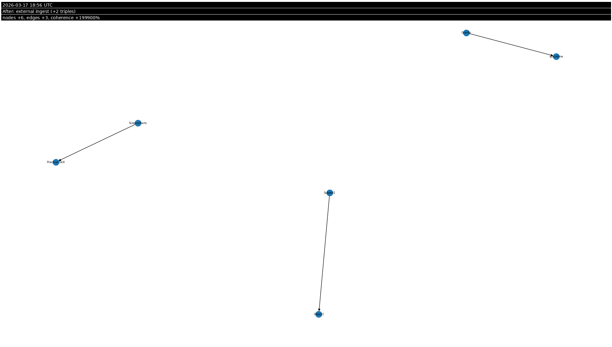](graph-2026-03-17-18-56-after-ingest.png) [commit](https://github.com/BoggersTheFish/BoggersTheCIG/commit/5bd2496)

### 2026-03-17 18:56 UTC

**After:** vault analysis (+32 triples) — nodes +28, edges +18, coherence -81%

[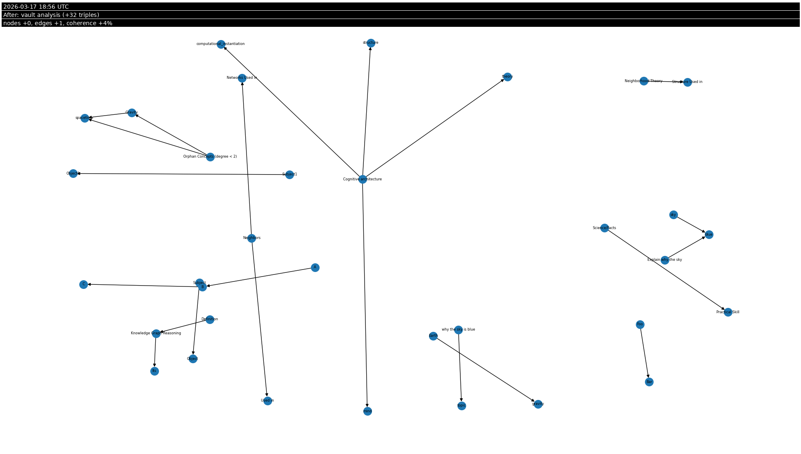](graph-2026-03-17-18-56-after-analyze-vault.png) [commit](https://github.com/BoggersTheFish/BoggersTheCIG/commit/5bd2496)

### 2026-03-17 18:56 UTC

**After:** vault analysis (+32 triples) — nodes +0, edges +1, coherence +4%

 [commit](https://github.com/BoggersTheFish/BoggersTheCIG/commit/5bd2496)

### 2026-03-17 18:56 UTC

**After:** 1 extracts, 0 merges — nodes +0, edges +0, coherence +0%

[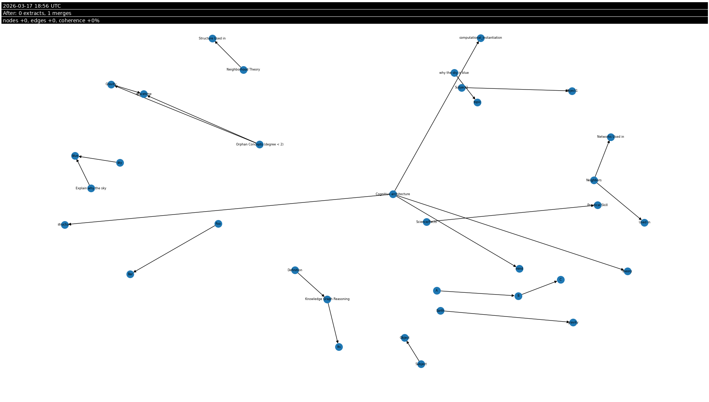](graph-2026-03-17-18-56-extract-subideas.png) [commit](https://github.com/BoggersTheFish/BoggersTheCIG/commit/5bd2496)

### 2026-03-17 18:56 UTC

**After:** 2_+2_.md"+Reasoning.md"+Skill.md"+Wnpdyu.md" — nodes +0, edges +0, coherence +0%

[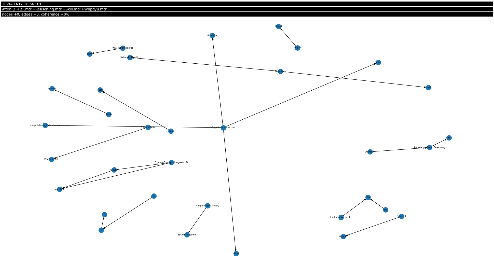](graph-2026-03-17-18-56-self-improve.png) [commit](https://github.com/BoggersTheFish/BoggersTheCIG/commit/5bd2496)

### 2026-03-17 18:56 UTC

**After:** 0 extracts, 1 merges — nodes +0, edges +0, coherence +0%

 [commit](https://github.com/BoggersTheFish/BoggersTheCIG/commit/5bd2496)

### 2026-03-17 18:56 UTC

**After:** 2_+2_.md"+Reasoning.md"+Skill.md"+Wnpdyu.md" — nodes +0, edges +0, coherence +0%

 [commit](https://github.com/BoggersTheFish/BoggersTheCIG/commit/5bd2496)

### 2026-03-18 01:26 UTC

**After:** external ingest (+1 triples) — nodes +4, edges +2, coherence +333233%

[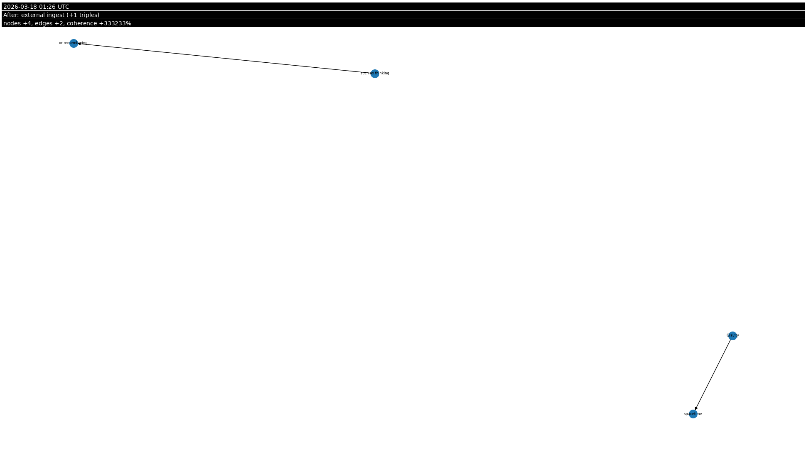](graph-2026-03-18-01-26-after-ingest.png) [commit](https://github.com/BoggersTheFish/BoggersTheCIG/commit/49b9f7b)

### 2026-03-18 01:26 UTC

**After:** vault analysis (+40 triples) — nodes +32, edges +20, coherence -89%

[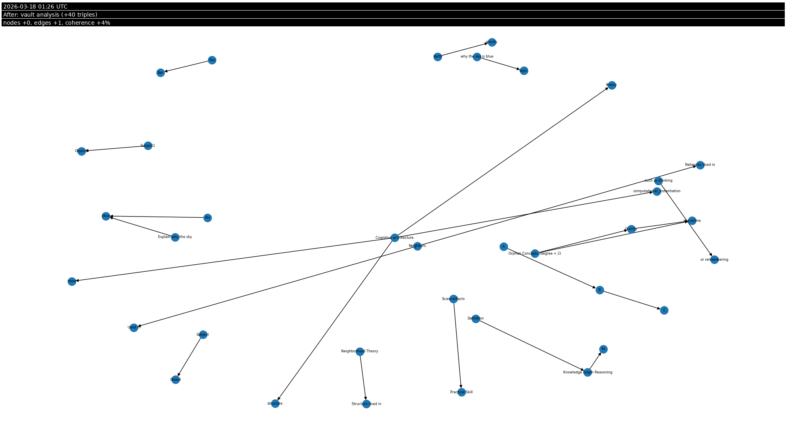](graph-2026-03-18-01-26-after-analyze-vault.png) [commit](https://github.com/BoggersTheFish/BoggersTheCIG/commit/49b9f7b)

### 2026-03-18 01:26 UTC

**After:** vault analysis (+40 triples) — nodes +0, edges +1, coherence +4%

 [commit](https://github.com/BoggersTheFish/BoggersTheCIG/commit/49b9f7b)

### 2026-03-18 01:26 UTC

**After:** 1 extracts, 0 merges — nodes +0, edges +0, coherence +0%

[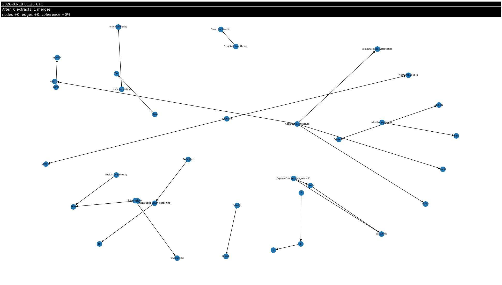](graph-2026-03-18-01-26-extract-subideas.png) [commit](https://github.com/BoggersTheFish/BoggersTheCIG/commit/49b9f7b)

### 2026-03-18 01:26 UTC

**After:** 2_+2_.md"+Skill.md"+eval+obsidian — nodes +0, edges +0, coherence +0%

[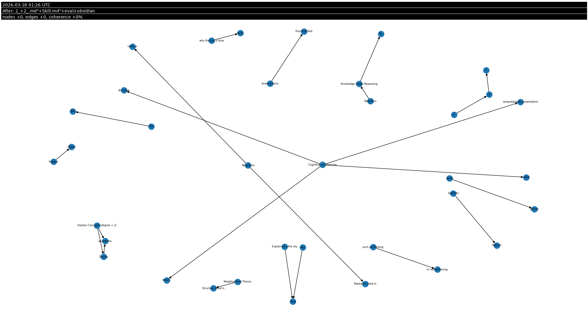](graph-2026-03-18-01-26-self-improve.png) [commit](https://github.com/BoggersTheFish/BoggersTheCIG/commit/49b9f7b)

### 2026-03-18 01:26 UTC

**After:** 0 extracts, 1 merges — nodes +0, edges +0, coherence +0%

 [commit](https://github.com/BoggersTheFish/BoggersTheCIG/commit/49b9f7b)

### 2026-03-18 01:26 UTC

**After:** 2_+2_.md"+Skill.md"+eval+obsidian — nodes +0, edges +0, coherence +0%

 [commit](https://github.com/BoggersTheFish/BoggersTheCIG/commit/49b9f7b)

### 2026-03-18 06:58 UTC

**After:** external ingest (+2 triples) — nodes +6, edges +3, coherence +199900%

[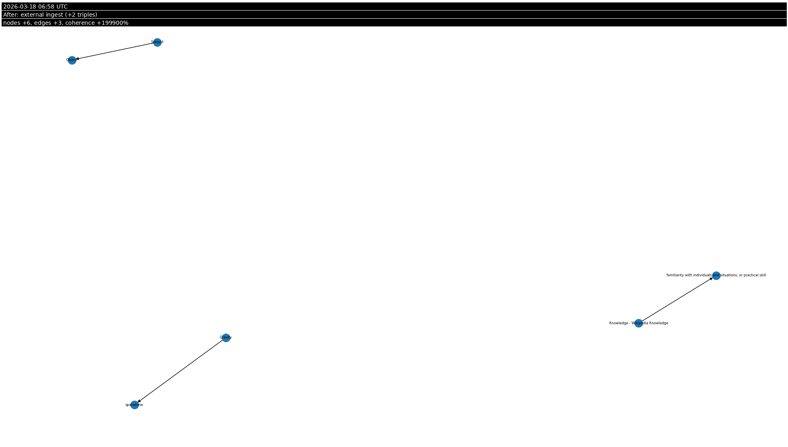](graph-2026-03-18-06-58-after-ingest.png) [commit](https://github.com/BoggersTheFish/BoggersTheCIG/commit/9bfd220)

### 2026-03-18 06:58 UTC

**After:** vault analysis (+46 triples) — nodes +34, edges +21, coherence -84%

[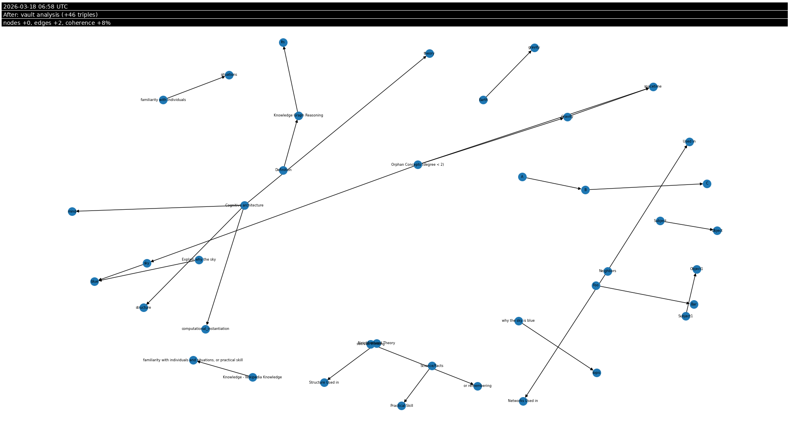](graph-2026-03-18-06-58-after-analyze-vault.png) [commit](https://github.com/BoggersTheFish/BoggersTheCIG/commit/9bfd220)

### 2026-03-18 06:58 UTC

**After:** vault analysis (+46 triples) — nodes +0, edges +2, coherence +8%

 [commit](https://github.com/BoggersTheFish/BoggersTheCIG/commit/9bfd220)

### 2026-03-18 06:58 UTC

**After:** 1 extracts, 0 merges — nodes +0, edges +0, coherence +0%

[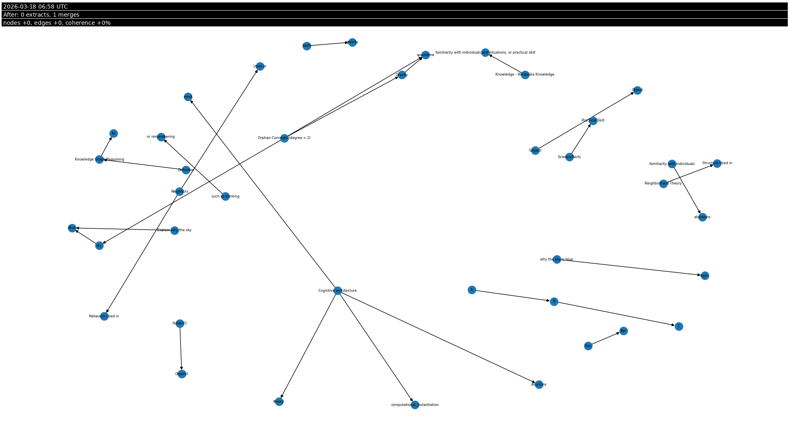](graph-2026-03-18-06-58-extract-subideas.png) [commit](https://github.com/BoggersTheFish/BoggersTheCIG/commit/9bfd220)

### 2026-03-18 06:58 UTC

**After:** 2_+2_.md"+Knowledge.md"+eval+individuals.md" — nodes +0, edges +0, coherence +0%

[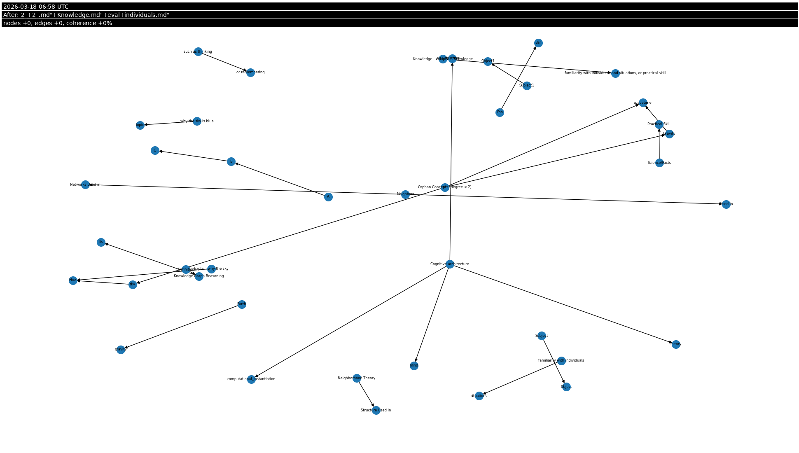](graph-2026-03-18-06-58-self-improve.png) [commit](https://github.com/BoggersTheFish/BoggersTheCIG/commit/9bfd220)

### 2026-03-18 06:58 UTC

**After:** 0 extracts, 1 merges — nodes +0, edges +0, coherence +0%

 [commit](https://github.com/BoggersTheFish/BoggersTheCIG/commit/9bfd220)

### 2026-03-18 06:58 UTC

**After:** 2_+2_.md"+Knowledge.md"+eval+individuals.md" — nodes +0, edges +0, coherence +0%

 [commit](https://github.com/BoggersTheFish/BoggersTheCIG/commit/9bfd220)

### 2026-03-18 12:54 UTC

**After:** external ingest (+1 triples) — nodes +4, edges +2, coherence +333233%

[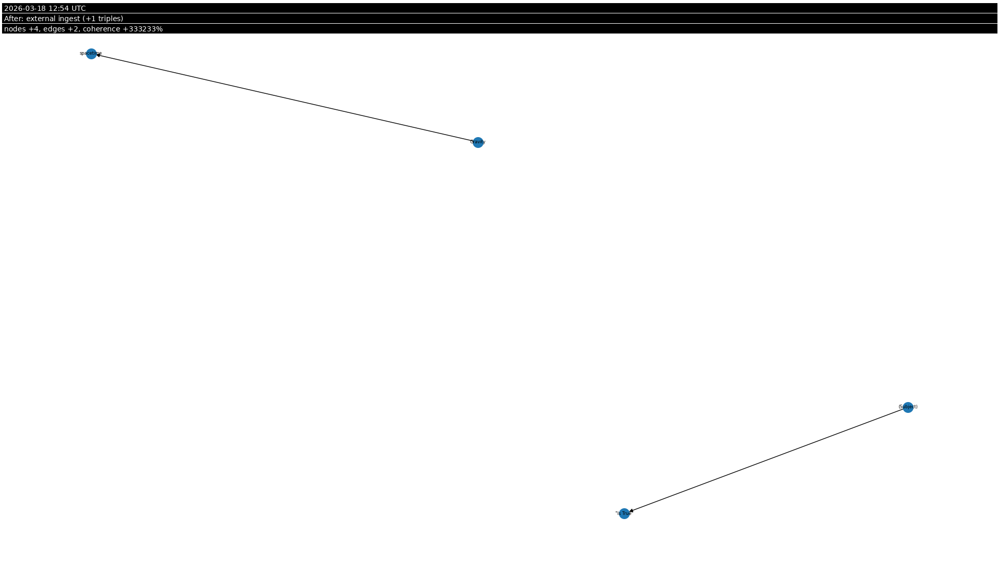](graph-2026-03-18-12-54-after-ingest.png) [commit](https://github.com/BoggersTheFish/BoggersTheCIG/commit/60dedd3)

### 2026-03-18 12:54 UTC

**After:** vault analysis (+51 triples) — nodes +38, edges +26, coherence -90%

[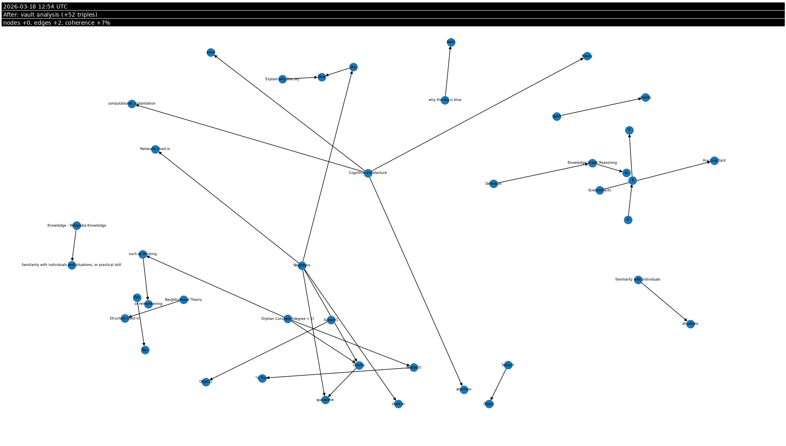](graph-2026-03-18-12-54-after-analyze-vault.png) [commit](https://github.com/BoggersTheFish/BoggersTheCIG/commit/60dedd3)

### 2026-03-18 12:54 UTC

**After:** 1 extracts, 0 merges — nodes +0, edges +0, coherence +0%

[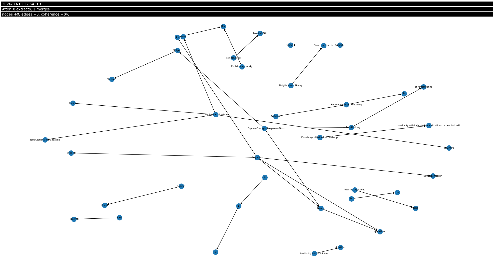](graph-2026-03-18-12-54-extract-subideas.png) [commit](https://github.com/BoggersTheFish/BoggersTheCIG/commit/60dedd3)

### 2026-03-18 12:54 UTC

**After:** vault analysis (+52 triples) — nodes +0, edges +2, coherence +7%

 [commit](https://github.com/BoggersTheFish/BoggersTheCIG/commit/60dedd3)

### 2026-03-18 12:54 UTC

**After:** 1 extracts, 0 merges — nodes +0, edges +0, coherence +0%

 [commit](https://github.com/BoggersTheFish/BoggersTheCIG/commit/60dedd3)

### 2026-03-18 12:54 UTC

**After:** 0 extracts, 1 merges — nodes +0, edges +0, coherence +0%

 [commit](https://github.com/BoggersTheFish/BoggersTheCIG/commit/60dedd3)

### 2026-03-18 12:54 UTC

**After:** 2_+2_.md"+Knowledge.md"+True_.md"+eval — nodes +0, edges +0, coherence +0%

[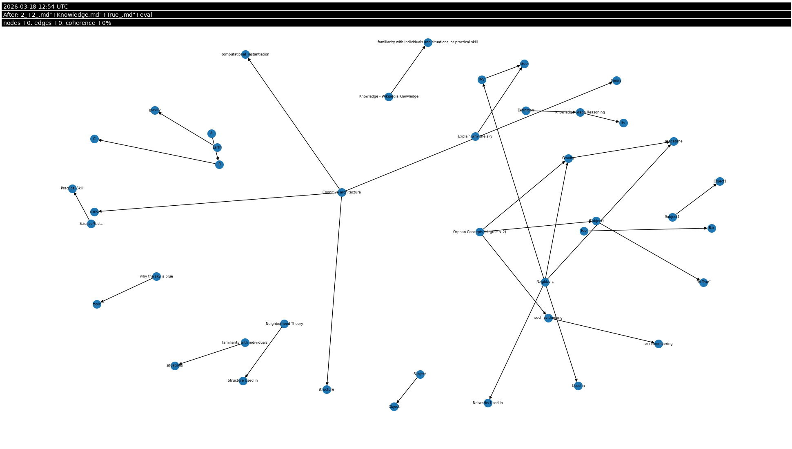](graph-2026-03-18-12-54-self-improve.png) [commit](https://github.com/BoggersTheFish/BoggersTheCIG/commit/60dedd3)

### 2026-03-18 12:54 UTC

**After:** 0 extracts, 1 merges — nodes +0, edges +0, coherence +0%

 [commit](https://github.com/BoggersTheFish/BoggersTheCIG/commit/60dedd3)

### 2026-03-18 12:54 UTC

**After:** 2_+2_.md"+Knowledge.md"+True_.md"+eval — nodes +0, edges +0, coherence +0%

 [commit](https://github.com/BoggersTheFish/BoggersTheCIG/commit/60dedd3)

### 2026-03-18 18:52 UTC

**After:** external ingest (+1 triples) — nodes +4, edges +2, coherence +333233%

[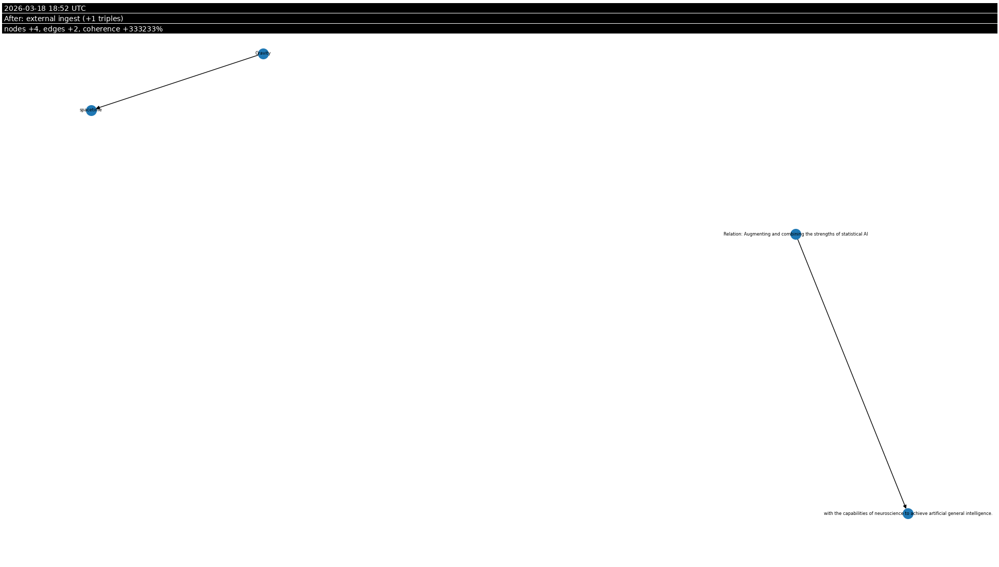](graph-2026-03-18-18-52-after-ingest.png) [commit](https://github.com/BoggersTheFish/BoggersTheCIG/commit/f81e66a)

### 2026-03-18 18:52 UTC

**After:** vault analysis (+50 triples) — nodes +42, edges +25, coherence -92%

[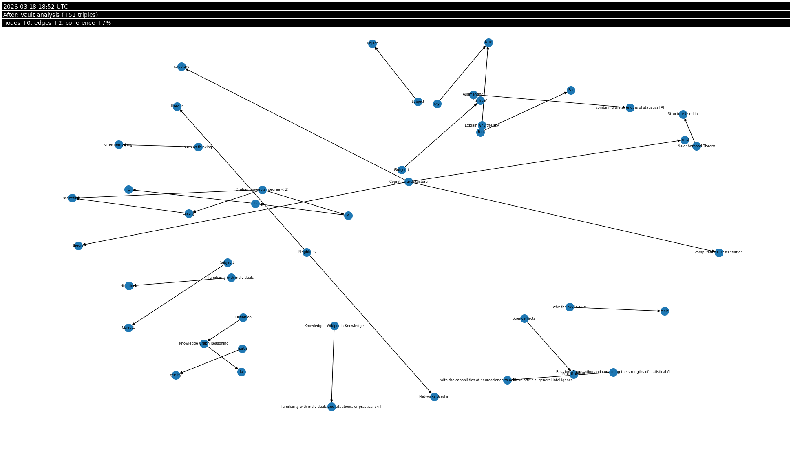](graph-2026-03-18-18-52-after-analyze-vault.png) [commit](https://github.com/BoggersTheFish/BoggersTheCIG/commit/f81e66a)

### 2026-03-18 18:52 UTC

**After:** vault analysis (+51 triples) — nodes +0, edges +2, coherence +7%

 [commit](https://github.com/BoggersTheFish/BoggersTheCIG/commit/f81e66a)

### 2026-03-18 18:52 UTC

**After:** 1 extracts, 0 merges — nodes +0, edges +0, coherence +0%

[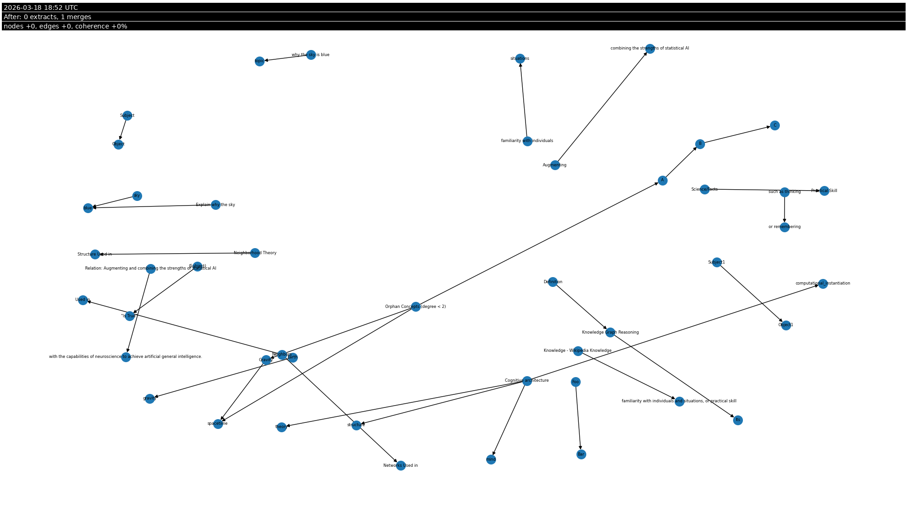](graph-2026-03-18-18-52-extract-subideas.png) [commit](https://github.com/BoggersTheFish/BoggersTheCIG/commit/f81e66a)

### 2026-03-18 18:52 UTC

**After:** 2_+2_.md"+AI.md"+Knowledge.md"+True_.md" — nodes +0, edges +0, coherence +0%

[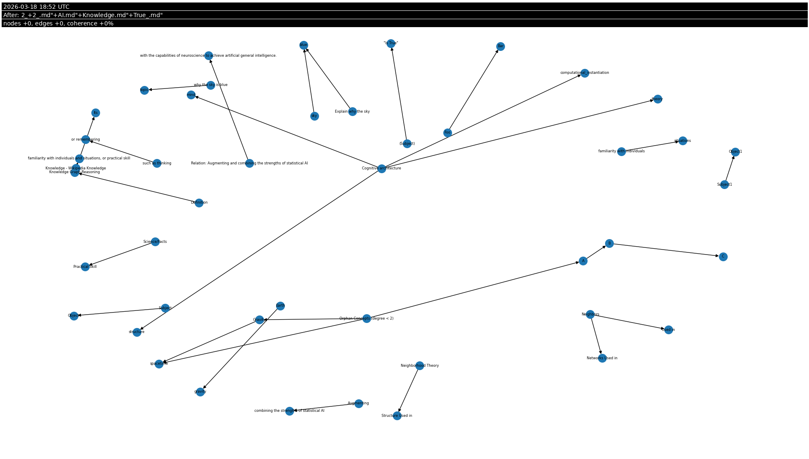](graph-2026-03-18-18-52-self-improve.png) [commit](https://github.com/BoggersTheFish/BoggersTheCIG/commit/f81e66a)

### 2026-03-18 18:52 UTC

**After:** 0 extracts, 1 merges — nodes +0, edges +0, coherence +0%

 [commit](https://github.com/BoggersTheFish/BoggersTheCIG/commit/f81e66a)

### 2026-03-18 18:52 UTC

**After:** 2_+2_.md"+AI.md"+Knowledge.md"+True_.md" — nodes +0, edges +0, coherence +0%

 [commit](https://github.com/BoggersTheFish/BoggersTheCIG/commit/f81e66a)

### 2026-03-19 01:26 UTC

**After:** external ingest (+1 triples) — nodes +4, edges +2, coherence +333233%

[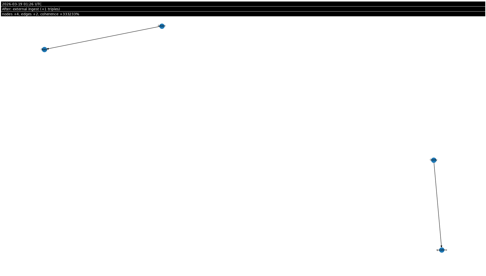](graph-2026-03-19-01-26-after-ingest.png) [commit](https://github.com/BoggersTheFish/BoggersTheCIG/commit/a33b585)

### 2026-03-19 01:26 UTC

**After:** vault analysis (+55 triples) — nodes +44, edges +26, coherence -92%

[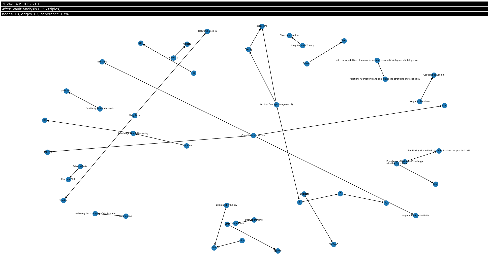](graph-2026-03-19-01-26-after-analyze-vault.png) [commit](https://github.com/BoggersTheFish/BoggersTheCIG/commit/a33b585)

### 2026-03-19 01:26 UTC

**After:** vault analysis (+56 triples) — nodes +0, edges +2, coherence +7%

 [commit](https://github.com/BoggersTheFish/BoggersTheCIG/commit/a33b585)

### 2026-03-19 01:26 UTC

**After:** 1 extracts, 0 merges — nodes +0, edges +0, coherence +0%

[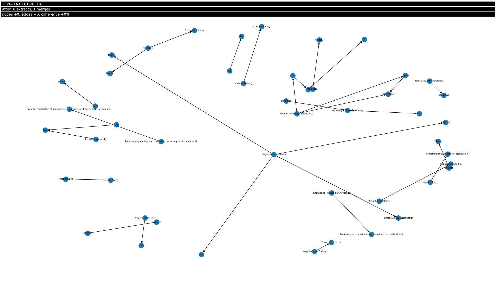](graph-2026-03-19-01-26-extract-subideas.png) [commit](https://github.com/BoggersTheFish/BoggersTheCIG/commit/a33b585)

### 2026-03-19 01:26 UTC

**After:** 2_+2_.md"+AI.md"+Relations.md"+eval — nodes +0, edges +0, coherence +0%

[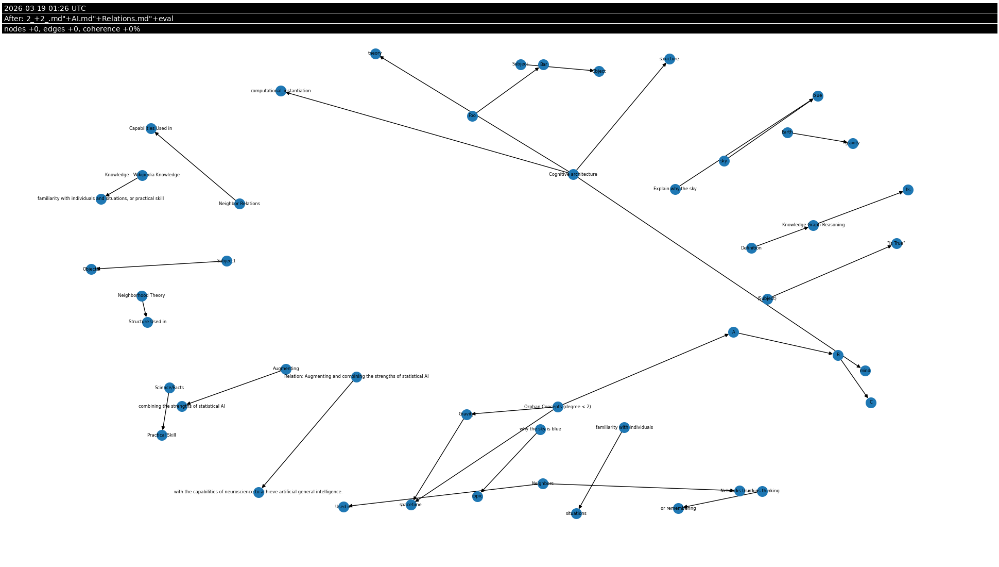](graph-2026-03-19-01-26-self-improve.png) [commit](https://github.com/BoggersTheFish/BoggersTheCIG/commit/a33b585)

### 2026-03-19 01:26 UTC

**After:** 0 extracts, 1 merges — nodes +0, edges +0, coherence +0%

 [commit](https://github.com/BoggersTheFish/BoggersTheCIG/commit/a33b585)

### 2026-03-19 01:26 UTC

**After:** 2_+2_.md"+AI.md"+Relations.md"+eval — nodes +0, edges +0, coherence +0%

 [commit](https://github.com/BoggersTheFish/BoggersTheCIG/commit/a33b585)

### 2026-03-19 06:34 UTC

**After:** vault analysis (+57 triples) — nodes +48, edges +28, coherence +24722%

[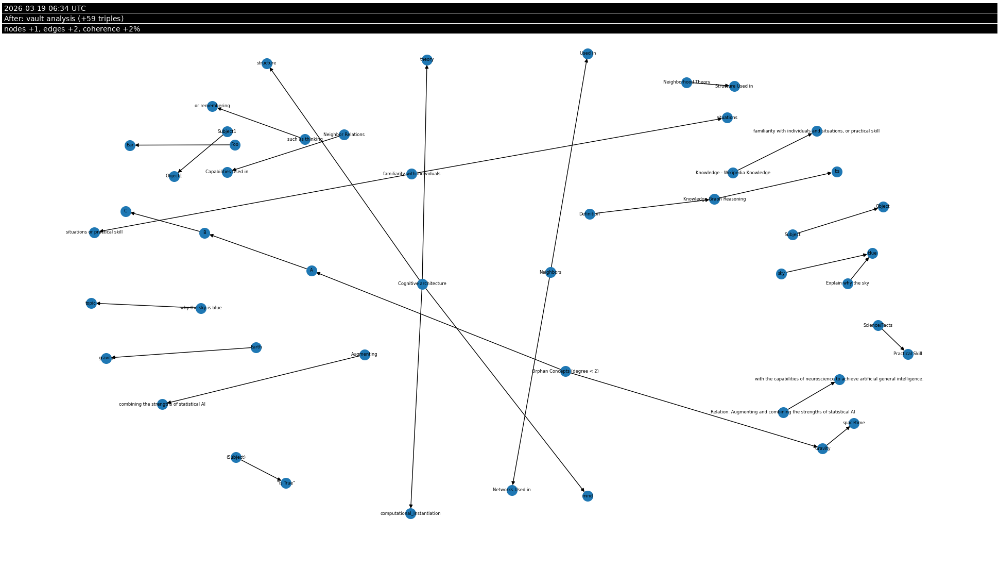](graph-2026-03-19-06-34-after-analyze-vault.png) [commit](https://github.com/BoggersTheFish/BoggersTheCIG/commit/11984fd)

### 2026-03-19 06:34 UTC

**After:** vault analysis (+59 triples) — nodes +1, edges +2, coherence +2%

 [commit](https://github.com/BoggersTheFish/BoggersTheCIG/commit/11984fd)

### 2026-03-19 06:34 UTC

**After:** 1 extracts, 0 merges — nodes +0, edges +0, coherence +0%

[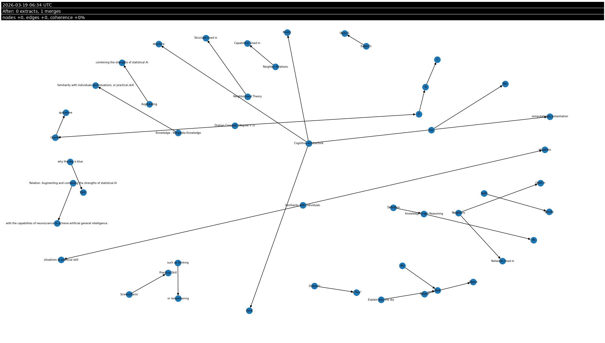](graph-2026-03-19-06-34-extract-subideas.png) [commit](https://github.com/BoggersTheFish/BoggersTheCIG/commit/11984fd)

### 2026-03-19 06:34 UTC

**After:** 2_+2_.md"+AI.md"+Relations.md"+Wnpdyu.md" — nodes +0, edges +0, coherence +0%

[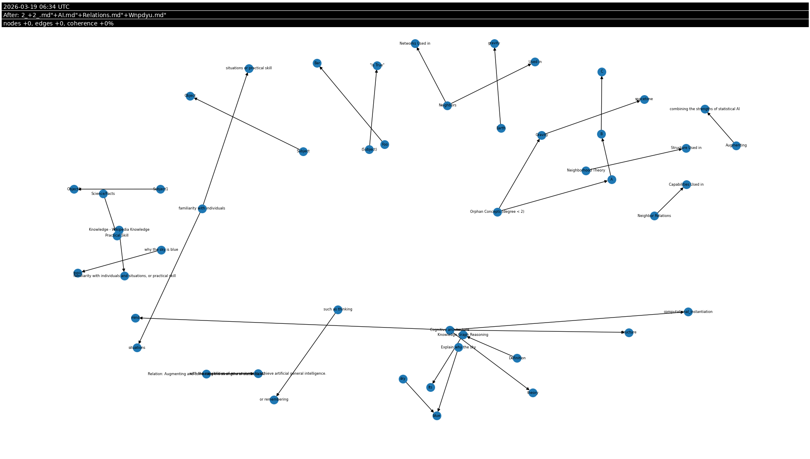](graph-2026-03-19-06-34-self-improve.png) [commit](https://github.com/BoggersTheFish/BoggersTheCIG/commit/11984fd)

### 2026-03-19 06:34 UTC

**After:** 0 extracts, 1 merges — nodes +0, edges +0, coherence +0%

 [commit](https://github.com/BoggersTheFish/BoggersTheCIG/commit/11984fd)

### 2026-03-19 06:34 UTC

**After:** 2_+2_.md"+AI.md"+Relations.md"+Wnpdyu.md" — nodes +0, edges +0, coherence +0%

 [commit](https://github.com/BoggersTheFish/BoggersTheCIG/commit/11984fd)

### 2026-03-19 06:53 UTC

**After:** vault analysis (+63 triples) — nodes +48, edges +30, coherence +26495%

[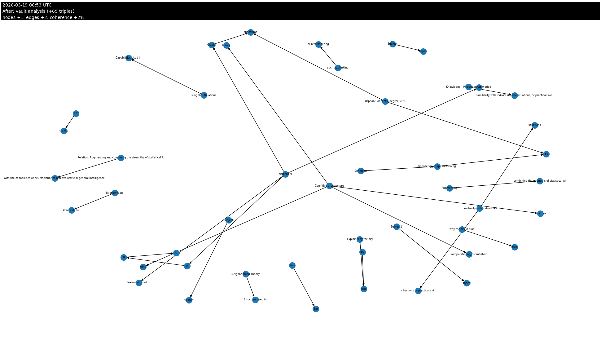](graph-2026-03-19-06-53-after-analyze-vault.png) [commit](https://github.com/BoggersTheFish/BoggersTheCIG/commit/38555e0)

### 2026-03-19 06:53 UTC

**After:** 1 extracts, 0 merges — nodes +0, edges +0, coherence +0%

[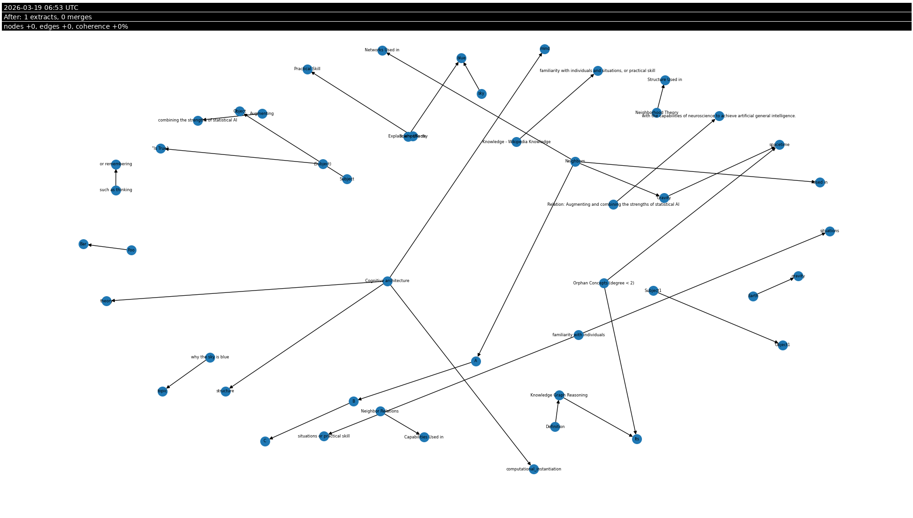](graph-2026-03-19-06-53-extract-subideas.png) [commit](https://github.com/BoggersTheFish/BoggersTheCIG/commit/38555e0)

### 2026-03-19 06:53 UTC

**After:** vault analysis (+65 triples) — nodes +1, edges +2, coherence +2%

 [commit](https://github.com/BoggersTheFish/BoggersTheCIG/commit/38555e0)

### 2026-03-19 06:54 UTC

**After:** 1 extracts, 0 merges — nodes +0, edges +0, coherence +0%

 [commit](https://github.com/BoggersTheFish/BoggersTheCIG/commit/38555e0)

### 2026-03-19 06:54 UTC

**After:** 0 extracts, 1 merges — nodes +0, edges +0, coherence +0%

[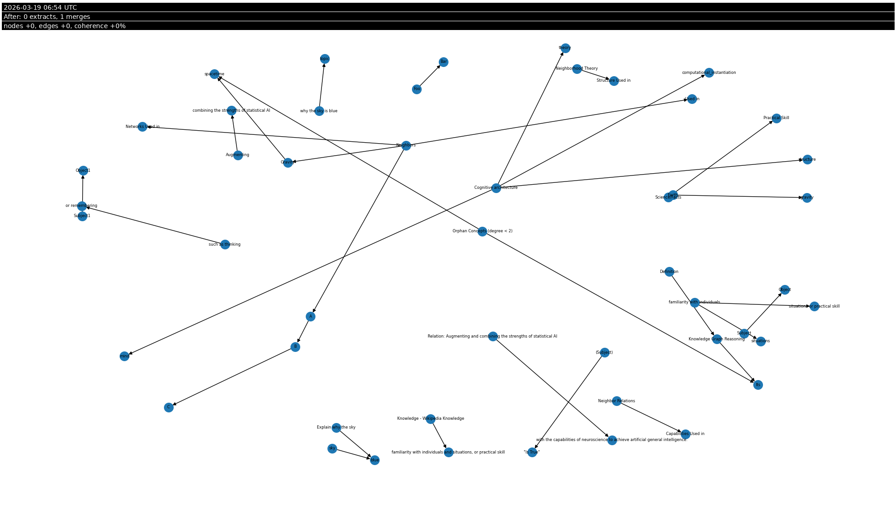](graph-2026-03-19-06-54-extract-subideas.png) [commit](https://github.com/BoggersTheFish/BoggersTheCIG/commit/38555e0)

### 2026-03-19 06:54 UTC

**After:** 2_+2_.md"+Relations.md"+eval+full_ts_cognitive_architecture.egg-info — nodes +0, edges +0, coherence +0%

[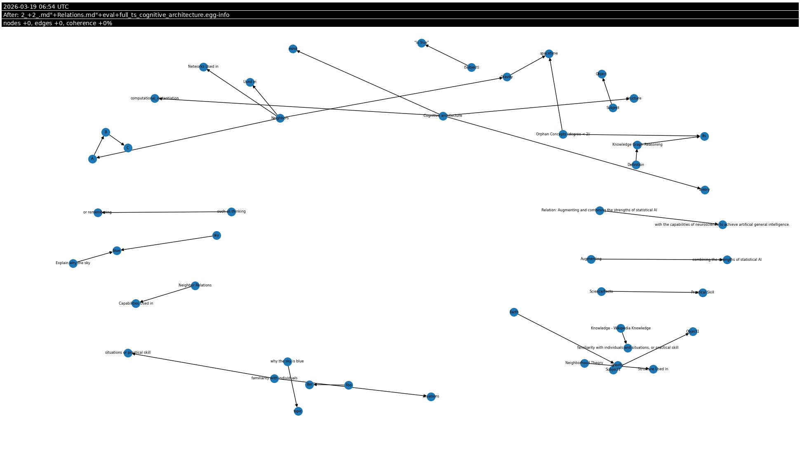](graph-2026-03-19-06-54-self-improve.png) [commit](https://github.com/BoggersTheFish/BoggersTheCIG/commit/38555e0)

### 2026-03-19 06:54 UTC

**After:** 0 extracts, 1 merges — nodes +0, edges +0, coherence +0%

 [commit](https://github.com/BoggersTheFish/BoggersTheCIG/commit/38555e0)

### 2026-03-19 06:54 UTC

**After:** 2_+2_.md"+Relations.md"+eval+full_ts_cognitive_architecture.egg-info — nodes +0, edges +0, coherence +0%

 [commit](https://github.com/BoggersTheFish/BoggersTheCIG/commit/38555e0)

### 2026-03-19 12:47 UTC

**After:** vault analysis (+59 triples) — nodes +48, edges +28, coherence +24722%

[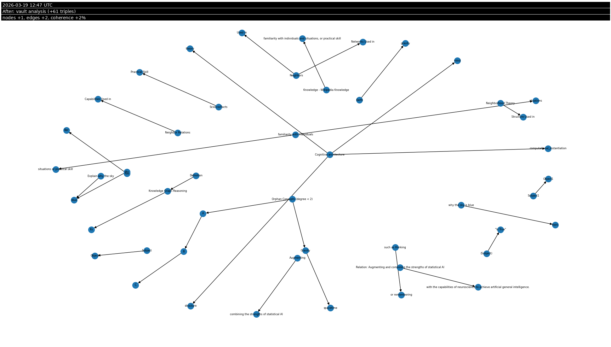](graph-2026-03-19-12-47-after-analyze-vault.png) [commit](https://github.com/BoggersTheFish/BoggersTheCIG/commit/0c4cec4)

### 2026-03-19 12:47 UTC

**After:** vault analysis (+61 triples) — nodes +1, edges +2, coherence +2%

 [commit](https://github.com/BoggersTheFish/BoggersTheCIG/commit/0c4cec4)

### 2026-03-19 12:47 UTC

**After:** 1 extracts, 0 merges — nodes +0, edges +0, coherence +0%

[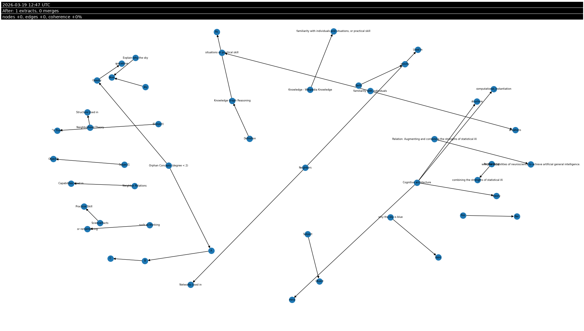](graph-2026-03-19-12-47-extract-subideas.png) [commit](https://github.com/BoggersTheFish/BoggersTheCIG/commit/0c4cec4)

### 2026-03-19 12:47 UTC

**After:** 2_+2_.md"+eval+obsidian — nodes +0, edges +0, coherence +0%

[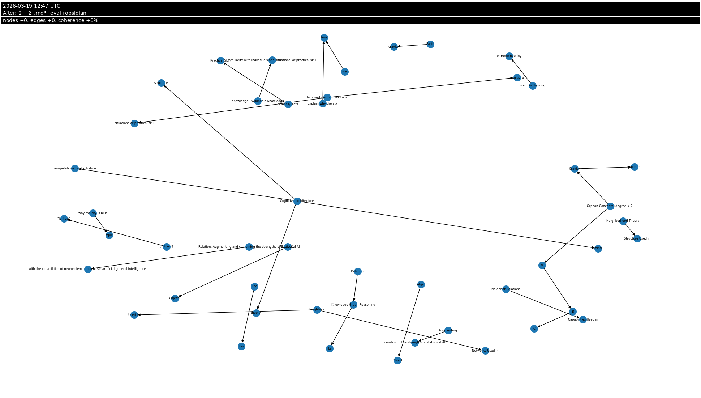](graph-2026-03-19-12-47-self-improve.png) [commit](https://github.com/BoggersTheFish/BoggersTheCIG/commit/0c4cec4)

### 2026-03-19 12:48 UTC

**After:** 0 extracts, 1 merges — nodes +0, edges +0, coherence +0%

[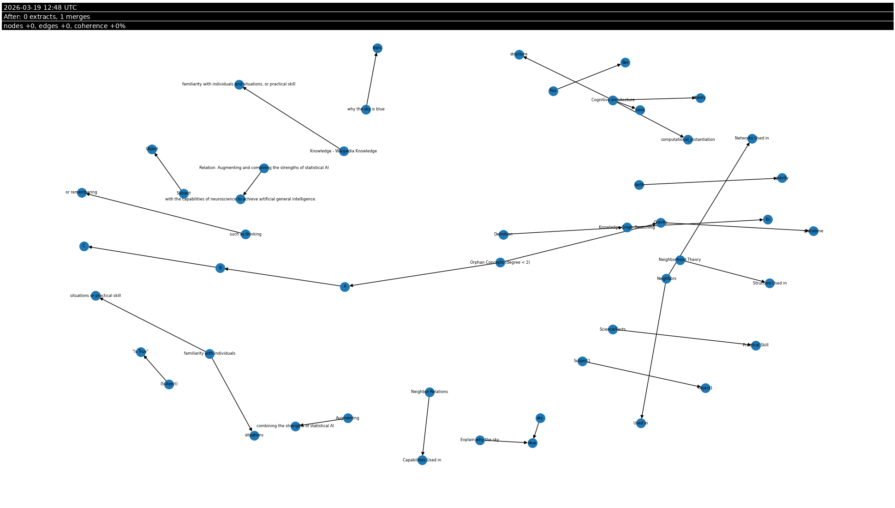](graph-2026-03-19-12-48-extract-subideas.png) [commit](https://github.com/BoggersTheFish/BoggersTheCIG/commit/0c4cec4)

### 2026-03-19 12:48 UTC

**After:** 2_+2_.md"+eval+obsidian — nodes +0, edges +0, coherence +0%

[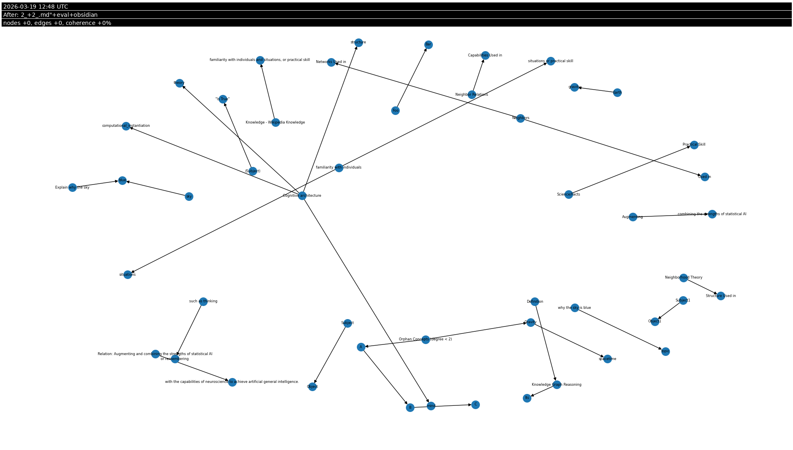](graph-2026-03-19-12-48-self-improve.png) [commit](https://github.com/BoggersTheFish/BoggersTheCIG/commit/0c4cec4)

### 2026-03-19 18:50 UTC

**After:** external ingest (+2 triples) — nodes +6, edges +3, coherence +199900%

[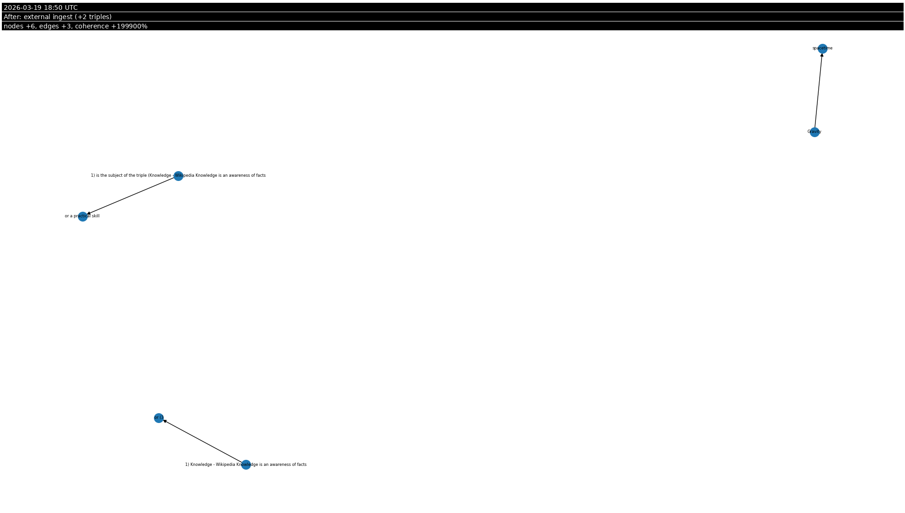](graph-2026-03-19-18-50-after-ingest.png) [commit](https://github.com/BoggersTheFish/BoggersTheCIG/commit/df2bc75)

### 2026-03-19 18:50 UTC

**After:** vault analysis (+64 triples) — nodes +49, edges +29, coherence -89%

[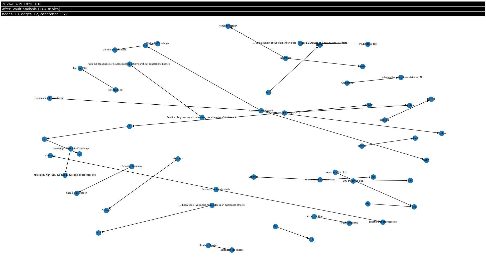](graph-2026-03-19-18-50-after-analyze-vault.png) [commit](https://github.com/BoggersTheFish/BoggersTheCIG/commit/df2bc75)

### 2026-03-19 18:50 UTC

**After:** vault analysis (+64 triples) — nodes +0, edges +2, coherence +6%

 [commit](https://github.com/BoggersTheFish/BoggersTheCIG/commit/df2bc75)

### 2026-03-19 18:52 UTC

**After:** vault organize (0 moves) — nodes +0, edges +0, coherence +0%

[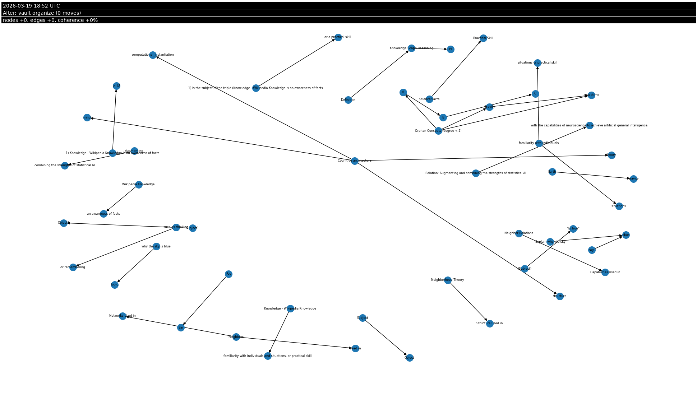](graph-2026-03-19-18-52-after-organize.png) [commit](https://github.com/BoggersTheFish/BoggersTheCIG/commit/df2bc75)

### 2026-03-19 18:52 UTC

**After:** 1 extracts, 0 merges — nodes +0, edges +0, coherence +0%

[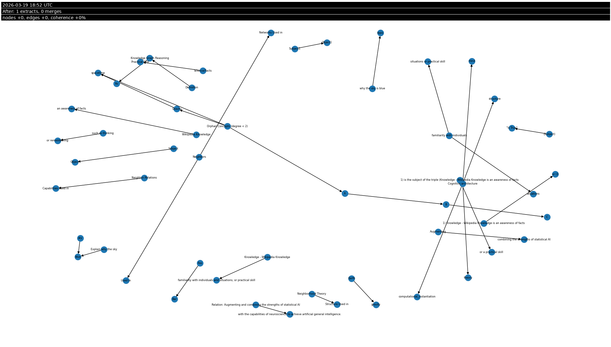](graph-2026-03-19-18-52-extract-subideas.png) [commit](https://github.com/BoggersTheFish/BoggersTheCIG/commit/df2bc75)

### 2026-03-19 18:52 UTC

**After:** 2_+2_.md"+Knowledge.md"+_3.md"+eval — nodes +0, edges +0, coherence +0%

[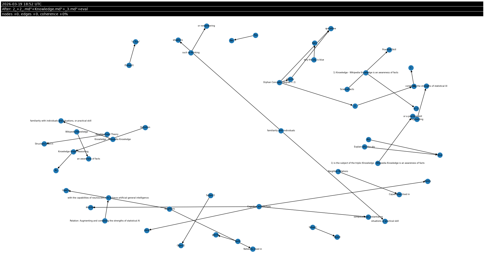](graph-2026-03-19-18-52-self-improve.png) [commit](https://github.com/BoggersTheFish/BoggersTheCIG/commit/df2bc75)

### 2026-03-19 18:55 UTC

**After:** vault organize (2 moves) — nodes +0, edges +0, coherence +0%

[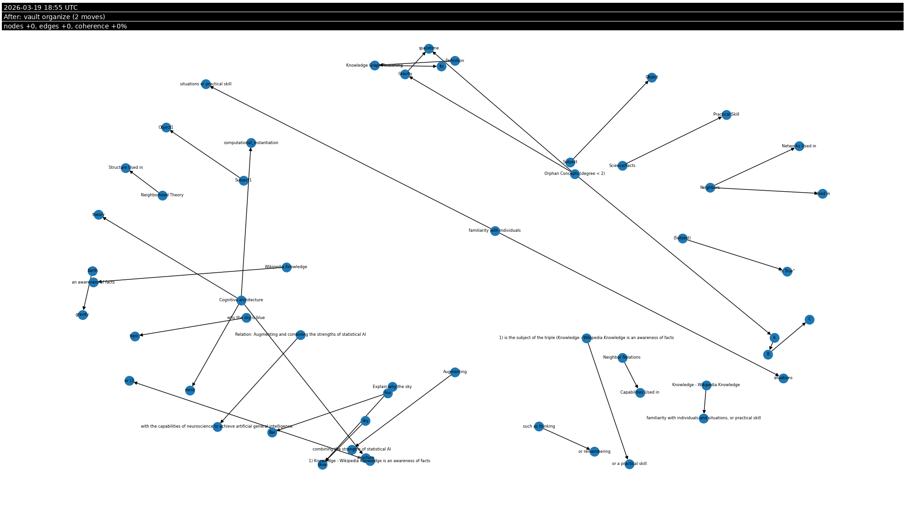](graph-2026-03-19-18-55-after-organize.png) [commit](https://github.com/BoggersTheFish/BoggersTheCIG/commit/df2bc75)

### 2026-03-19 18:55 UTC

**After:** 0 extracts, 1 merges — nodes +0, edges +0, coherence +0%

[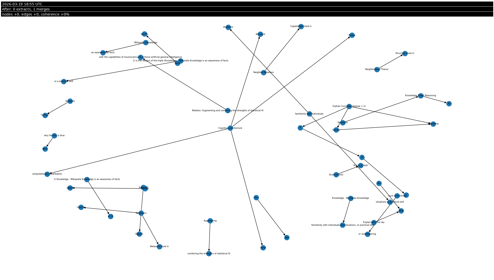](graph-2026-03-19-18-55-extract-subideas.png) [commit](https://github.com/BoggersTheFish/BoggersTheCIG/commit/df2bc75)

### 2026-03-19 18:55 UTC

**After:** 2_+2_.md"+AI.md"+Knowledge.md"+_3.md" — nodes +0, edges +0, coherence +0%

[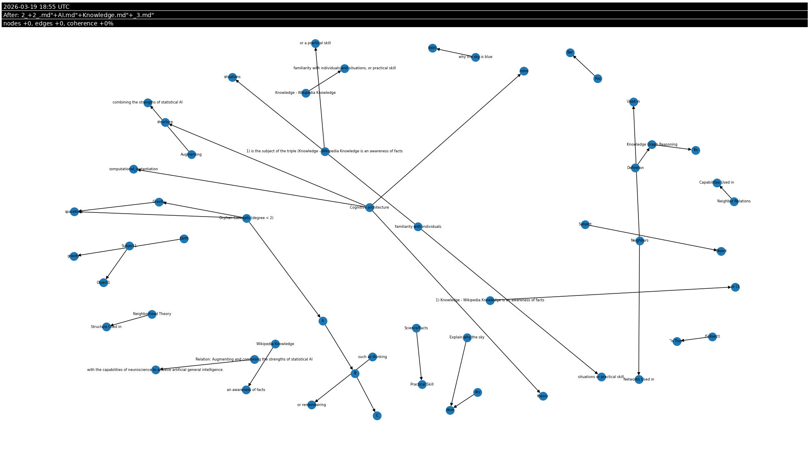](graph-2026-03-19-18-55-self-improve.png) [commit](https://github.com/BoggersTheFish/BoggersTheCIG/commit/df2bc75)

### 2026-03-20 01:22 UTC

**After:** external ingest (+1 triples) — nodes +4, edges +2, coherence +333233%

[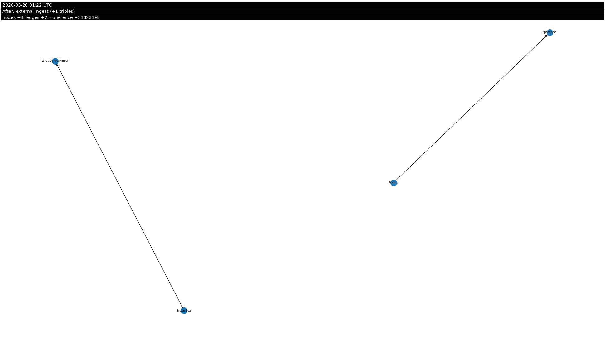](graph-2026-03-20-01-22-after-ingest.png) [commit](https://github.com/BoggersTheFish/BoggersTheCIG/commit/251482b)

### 2026-03-20 01:22 UTC

**After:** vault analysis (+74 triples) — nodes +54, edges +35, coherence -93%

[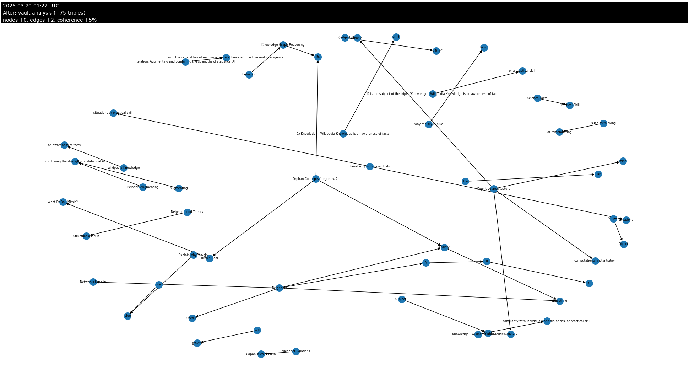](graph-2026-03-20-01-22-after-analyze-vault.png) [commit](https://github.com/BoggersTheFish/BoggersTheCIG/commit/251482b)

### 2026-03-20 01:22 UTC

**After:** 1 extracts, 0 merges — nodes +0, edges +0, coherence +0%

[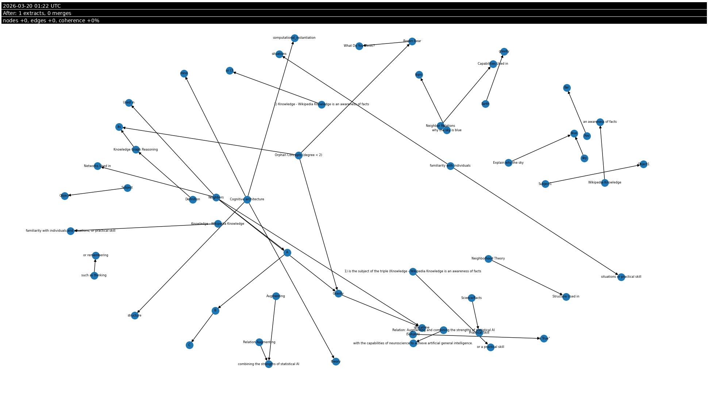](graph-2026-03-20-01-22-extract-subideas.png) [commit](https://github.com/BoggersTheFish/BoggersTheCIG/commit/251482b)

### 2026-03-20 01:22 UTC

**After:** vault analysis (+75 triples) — nodes +0, edges +2, coherence +5%

 [commit](https://github.com/BoggersTheFish/BoggersTheCIG/commit/251482b)

### 2026-03-20 01:22 UTC

**After:** 1 extracts, 0 merges — nodes +0, edges +0, coherence +0%

 [commit](https://github.com/BoggersTheFish/BoggersTheCIG/commit/251482b)

### 2026-03-20 01:25 UTC

**After:** vault organize (6 moves) — nodes +0, edges +0, coherence +0%

[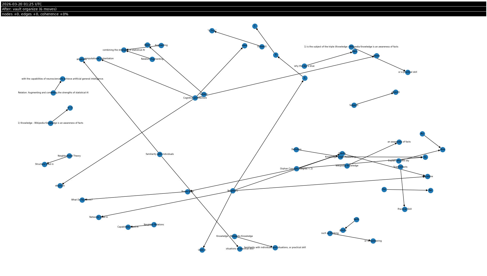](graph-2026-03-20-01-25-after-organize.png) [commit](https://github.com/BoggersTheFish/BoggersTheCIG/commit/251482b)

### 2026-03-20 01:25 UTC

**After:** 1 extracts, 1 merges — nodes +0, edges +0, coherence +0%

[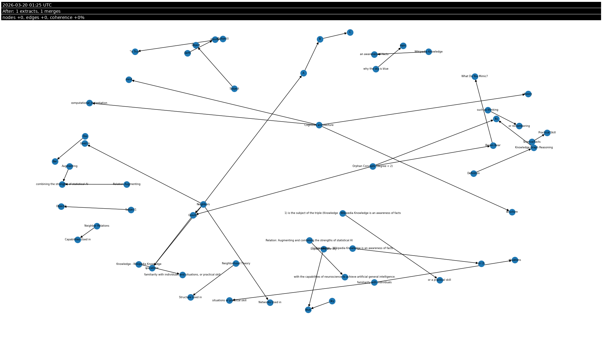](graph-2026-03-20-01-25-extract-subideas.png) [commit](https://github.com/BoggersTheFish/BoggersTheCIG/commit/251482b)

### 2026-03-20 01:25 UTC

**After:** 2_+2_.md"+AI.md"+Augmenting.md"+Bear.md" — nodes +0, edges +0, coherence +0%

[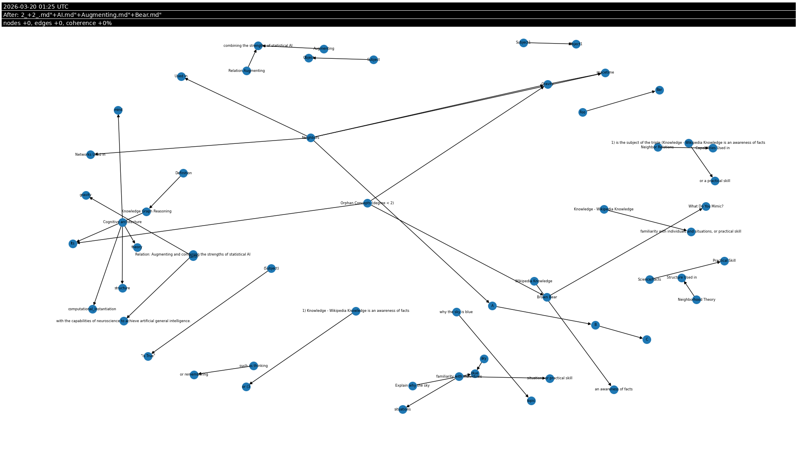](graph-2026-03-20-01-25-self-improve.png) [commit](https://github.com/BoggersTheFish/BoggersTheCIG/commit/251482b)

### 2026-03-20 01:28 UTC

**After:** vault organize (3 moves) — nodes +0, edges +0, coherence +0%

[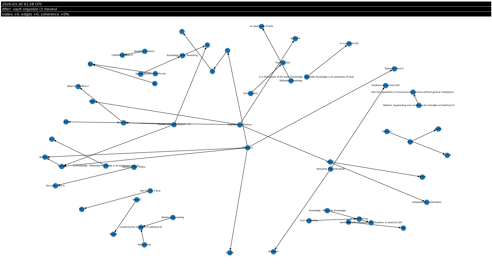](graph-2026-03-20-01-28-after-organize.png) [commit](https://github.com/BoggersTheFish/BoggersTheCIG/commit/251482b)

### 2026-03-20 01:28 UTC

**After:** 1 extracts, 1 merges — nodes +0, edges +0, coherence +0%

[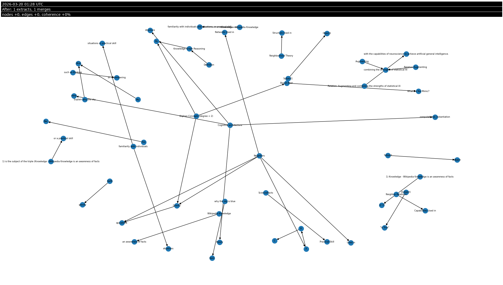](graph-2026-03-20-01-28-extract-subideas.png) [commit](https://github.com/BoggersTheFish/BoggersTheCIG/commit/251482b)

### 2026-03-20 01:28 UTC

**After:** 2_+2_.md"+AI.md"+Augmenting.md"+Bear.md" — nodes +0, edges +0, coherence +0%

[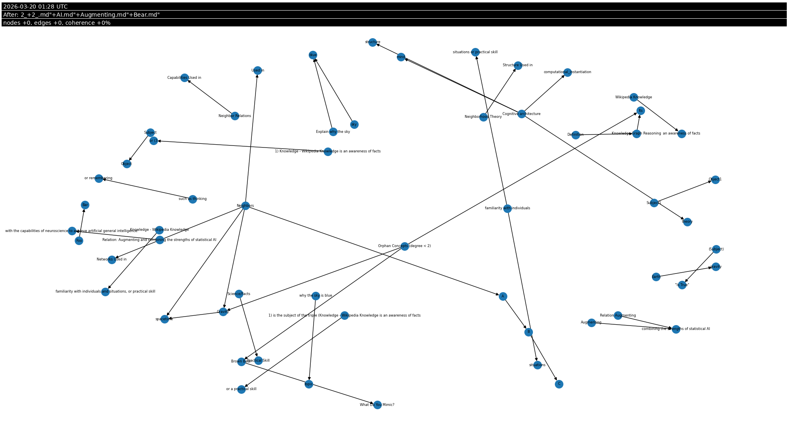](graph-2026-03-20-01-28-self-improve.png) [commit](https://github.com/BoggersTheFish/BoggersTheCIG/commit/251482b)

### 2026-03-20 06:49 UTC

**After:** external ingest (+2 triples) — nodes +6, edges +3, coherence +199900%

[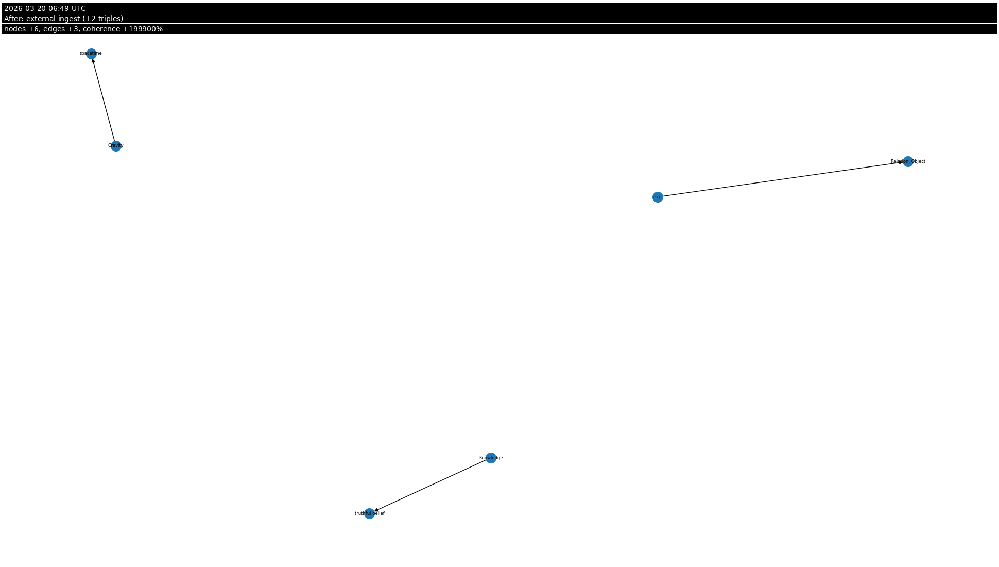](graph-2026-03-20-06-49-after-ingest.png) [commit](https://github.com/BoggersTheFish/BoggersTheCIG/commit/90e2dfa)

### 2026-03-20 06:49 UTC

**After:** vault analysis (+85 triples) — nodes +57, edges +38, coherence -89%

[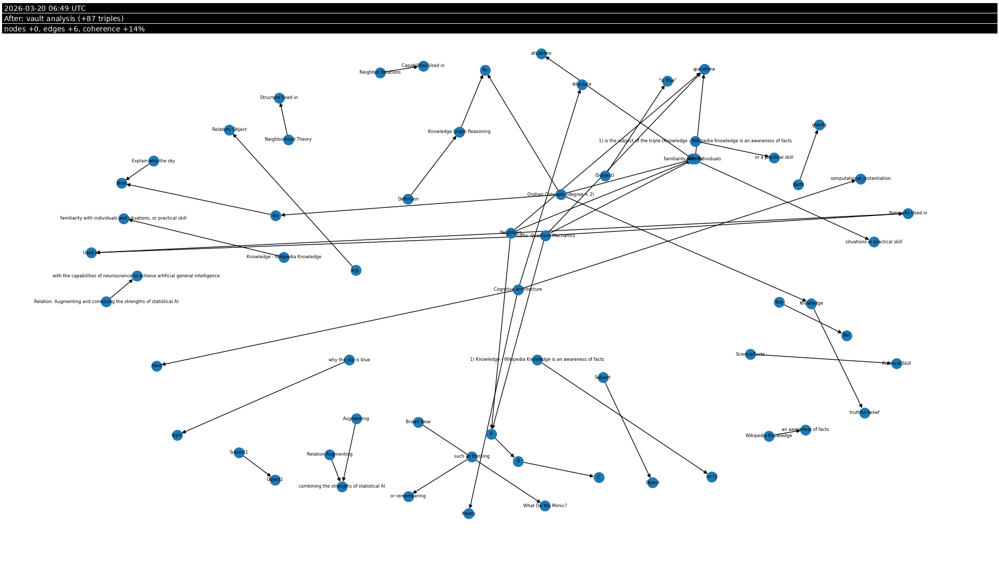](graph-2026-03-20-06-49-after-analyze-vault.png) [commit](https://github.com/BoggersTheFish/BoggersTheCIG/commit/90e2dfa)

### 2026-03-20 06:49 UTC

**After:** 1 extracts, 0 merges — nodes +0, edges +0, coherence +0%

[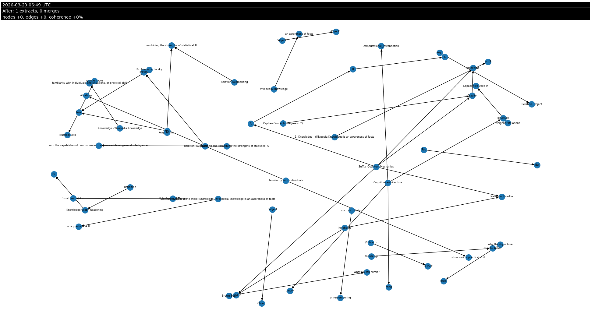](graph-2026-03-20-06-49-extract-subideas.png) [commit](https://github.com/BoggersTheFish/BoggersTheCIG/commit/90e2dfa)

### 2026-03-20 06:49 UTC

**After:** vault analysis (+87 triples) — nodes +0, edges +6, coherence +14%

 [commit](https://github.com/BoggersTheFish/BoggersTheCIG/commit/90e2dfa)

### 2026-03-20 06:50 UTC

**After:** 1 extracts, 0 merges — nodes +0, edges +0, coherence +0%

[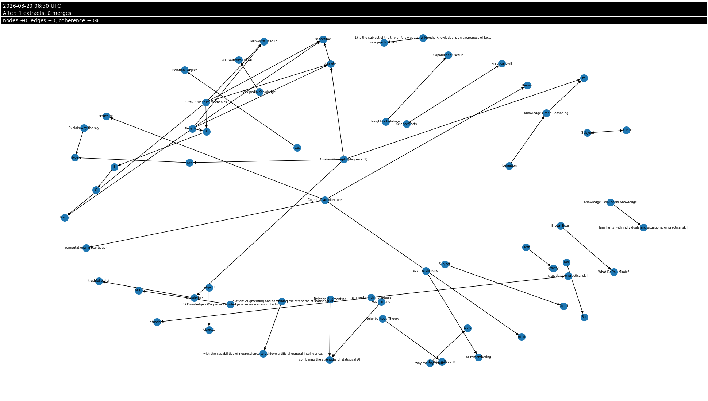](graph-2026-03-20-06-50-extract-subideas.png) [commit](https://github.com/BoggersTheFish/BoggersTheCIG/commit/90e2dfa)

### 2026-03-20 06:53 UTC

**After:** vault organize (2 moves) — nodes +0, edges +0, coherence +0%

[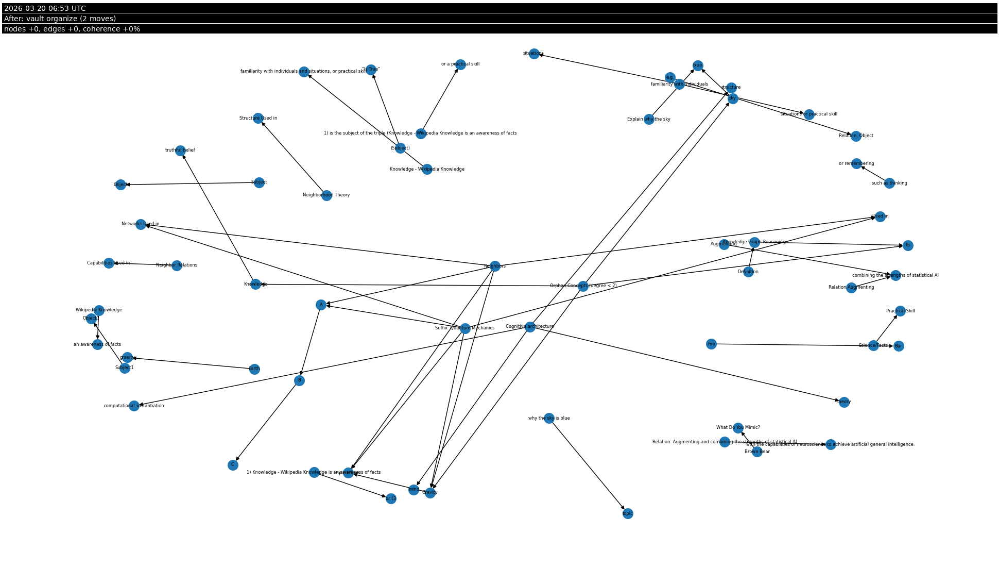](graph-2026-03-20-06-53-after-organize.png) [commit](https://github.com/BoggersTheFish/BoggersTheCIG/commit/90e2dfa)

### 2026-03-20 06:53 UTC

**After:** 1 extracts, 1 merges — nodes +0, edges +0, coherence +0%

[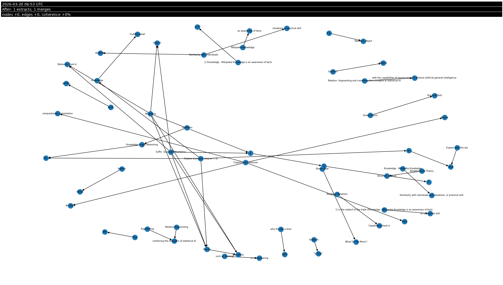](graph-2026-03-20-06-53-extract-subideas.png) [commit](https://github.com/BoggersTheFish/BoggersTheCIG/commit/90e2dfa)

### 2026-03-20 06:53 UTC

**After:** 2_+2_.md"+Augmenting.md"+Bear.md"+Knowledge.md" — nodes +0, edges +0, coherence +0%

[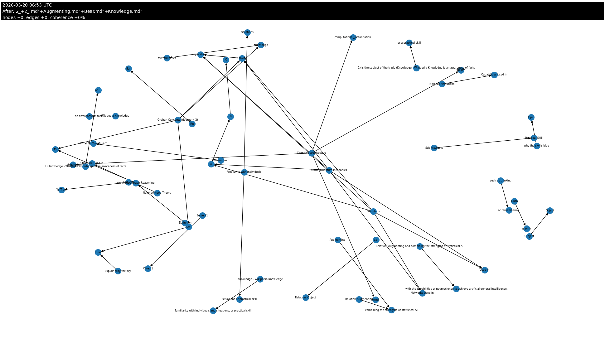](graph-2026-03-20-06-53-self-improve.png) [commit](https://github.com/BoggersTheFish/BoggersTheCIG/commit/90e2dfa)

### 2026-03-20 06:56 UTC

**After:** vault organize (4 moves) — nodes +0, edges +0, coherence +0%

[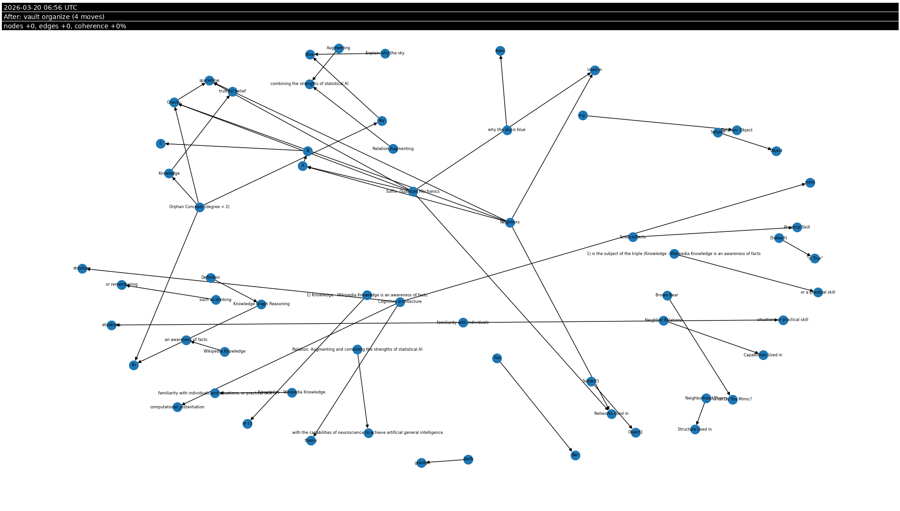](graph-2026-03-20-06-56-after-organize.png) [commit](https://github.com/BoggersTheFish/BoggersTheCIG/commit/90e2dfa)

### 2026-03-20 06:56 UTC

**After:** 0 extracts, 2 merges — nodes +0, edges +0, coherence +0%

[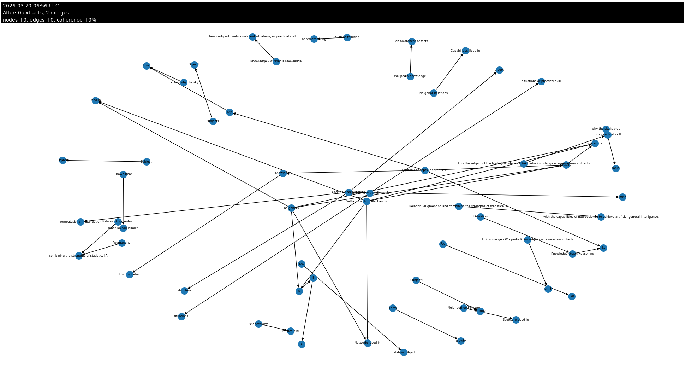](graph-2026-03-20-06-56-extract-subideas.png) [commit](https://github.com/BoggersTheFish/BoggersTheCIG/commit/90e2dfa)

### 2026-03-20 06:56 UTC

**After:** 2_+2_.md"+Augmenting.md"+Bear.md"+Knowledge.md" — nodes +0, edges +0, coherence +0%

[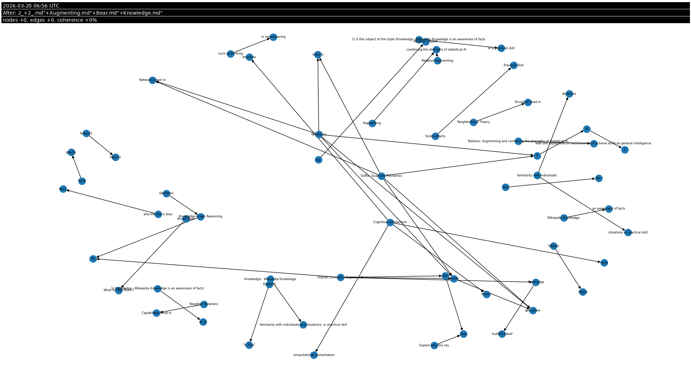](graph-2026-03-20-06-56-self-improve.png) [commit](https://github.com/BoggersTheFish/BoggersTheCIG/commit/90e2dfa)

### 2026-03-20 12:44 UTC

**After:** external ingest (+1 triples) — nodes +4, edges +2, coherence +333233%

[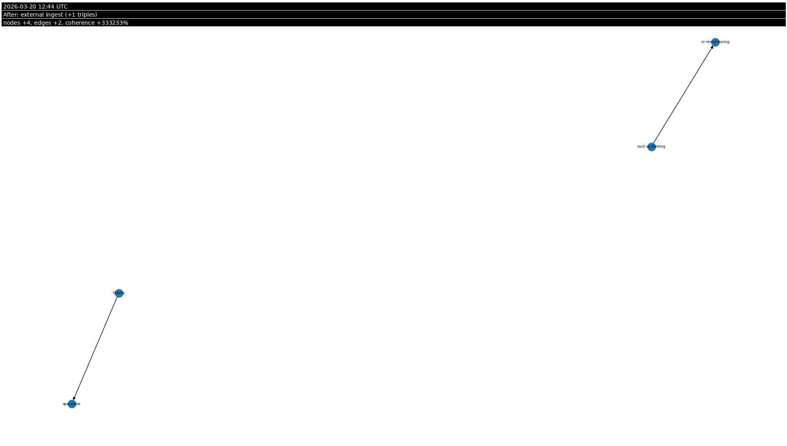](graph-2026-03-20-12-44-after-ingest.png) [commit](https://github.com/BoggersTheFish/BoggersTheCIG/commit/717f137)

### 2026-03-20 12:44 UTC

**After:** vault analysis (+91 triples) — nodes +59, edges +38, coherence -93%

[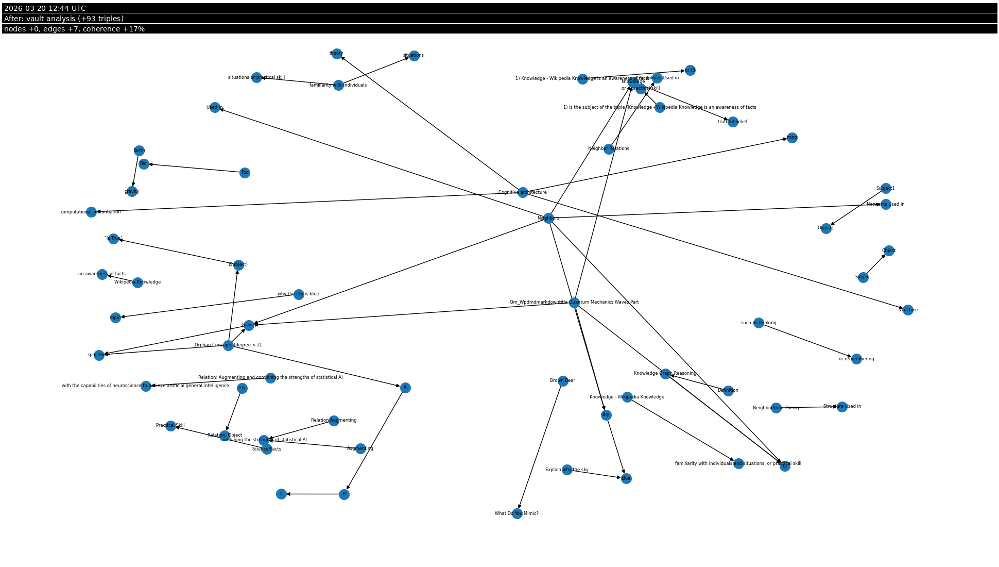](graph-2026-03-20-12-44-after-analyze-vault.png) [commit](https://github.com/BoggersTheFish/BoggersTheCIG/commit/717f137)

### 2026-03-20 12:44 UTC

**After:** 1 extracts, 0 merges — nodes +0, edges +0, coherence +0%

[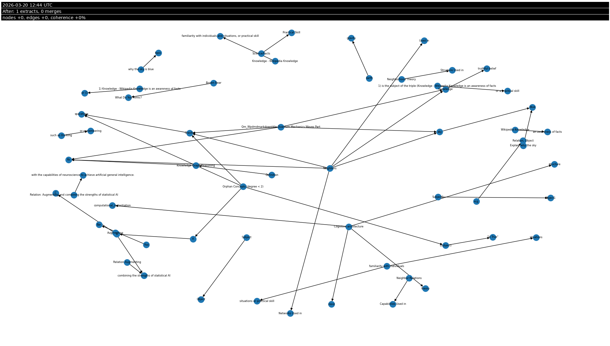](graph-2026-03-20-12-44-extract-subideas.png) [commit](https://github.com/BoggersTheFish/BoggersTheCIG/commit/717f137)

### 2026-03-20 12:44 UTC

**After:** vault analysis (+93 triples) — nodes +0, edges +7, coherence +17%

 [commit](https://github.com/BoggersTheFish/BoggersTheCIG/commit/717f137)

### 2026-03-20 12:44 UTC

**After:** 1 extracts, 0 merges — nodes +0, edges +0, coherence +0%

 [commit](https://github.com/BoggersTheFish/BoggersTheCIG/commit/717f137)

### 2026-03-20 12:47 UTC

**After:** vault organize (0 moves) — nodes +0, edges +0, coherence +0%

[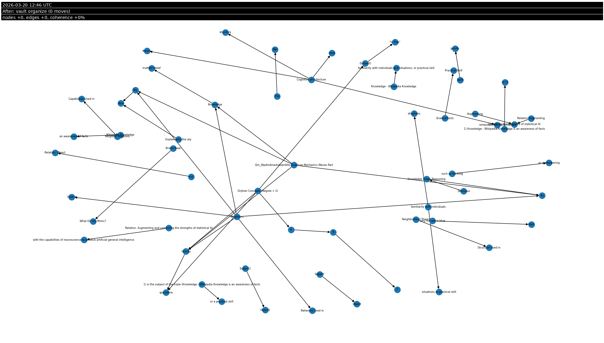](graph-2026-03-20-12-46-after-organize.png) [commit](https://github.com/BoggersTheFish/BoggersTheCIG/commit/717f137)

### 2026-03-20 12:47 UTC

**After:** 0 extracts, 1 merges — nodes +0, edges +0, coherence +0%

[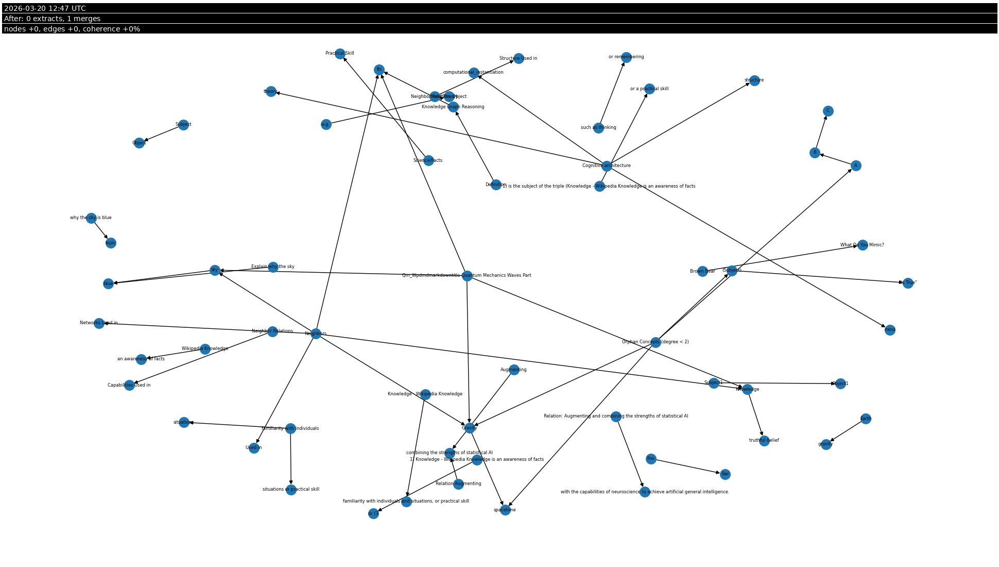](graph-2026-03-20-12-47-extract-subideas.png) [commit](https://github.com/BoggersTheFish/BoggersTheCIG/commit/717f137)

### 2026-03-20 12:47 UTC

**After:** 2_+2_.md"+Augmenting.md"+Knowledge.md"+Mechanics.md" — nodes +0, edges +0, coherence +0%

[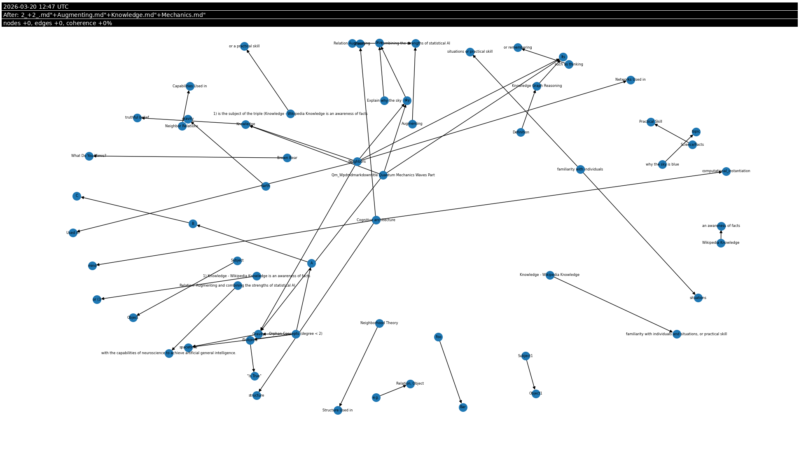](graph-2026-03-20-12-47-self-improve.png) [commit](https://github.com/BoggersTheFish/BoggersTheCIG/commit/717f137)

### 2026-03-20 12:49 UTC

**After:** vault organize (1 moves) — nodes +0, edges +0, coherence +0%

[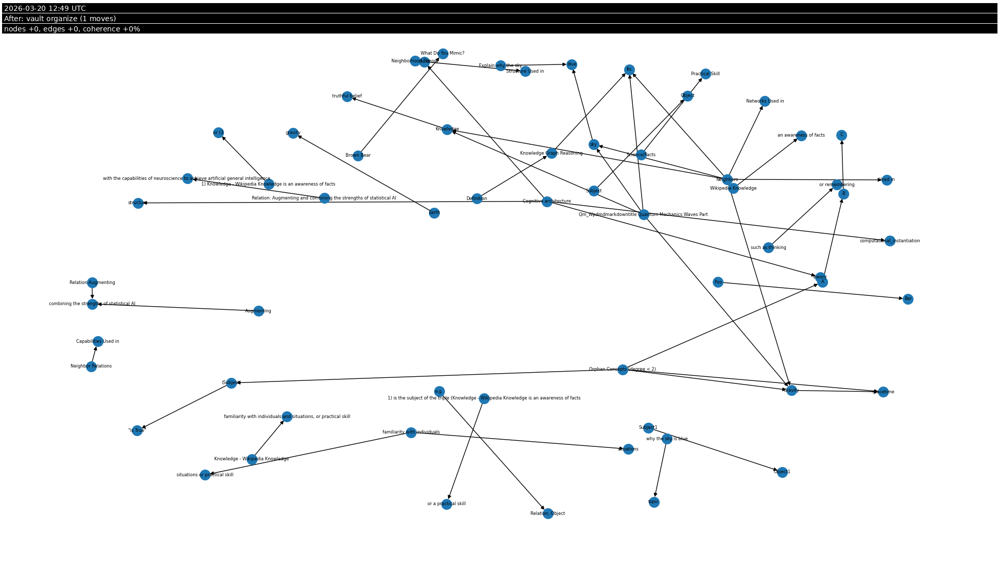](graph-2026-03-20-12-49-after-organize.png) [commit](https://github.com/BoggersTheFish/BoggersTheCIG/commit/717f137)

### 2026-03-20 12:50 UTC

**After:** 0 extracts, 1 merges — nodes +0, edges +0, coherence +0%

[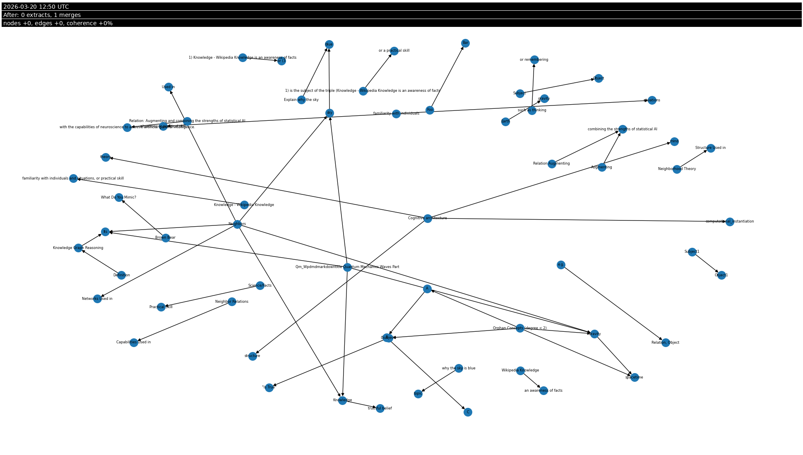](graph-2026-03-20-12-50-extract-subideas.png) [commit](https://github.com/BoggersTheFish/BoggersTheCIG/commit/717f137)

### 2026-03-20 12:50 UTC

**After:** 2_+2_.md"+Augmenting.md"+Knowledge.md"+Mechanics.md" — nodes +0, edges +0, coherence +0%

[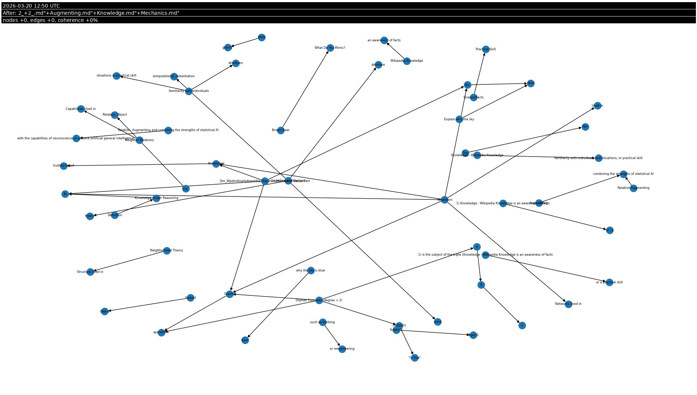](graph-2026-03-20-12-50-self-improve.png) [commit](https://github.com/BoggersTheFish/BoggersTheCIG/commit/717f137)

### 2026-03-20 18:42 UTC

**After:** vault analysis (+88 triples) — nodes +62, edges +36, coherence +18937%

[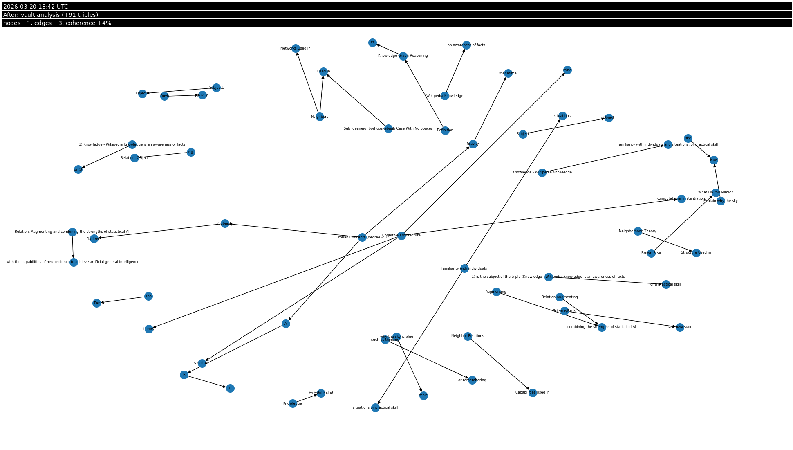](graph-2026-03-20-18-42-after-analyze-vault.png) [commit](https://github.com/BoggersTheFish/BoggersTheCIG/commit/af406e7)

### 2026-03-20 18:42 UTC

**After:** vault analysis (+91 triples) — nodes +1, edges +3, coherence +4%

 [commit](https://github.com/BoggersTheFish/BoggersTheCIG/commit/af406e7)

### 2026-03-20 18:45 UTC

**After:** vault organize (1 moves) — nodes +0, edges +0, coherence +0%

[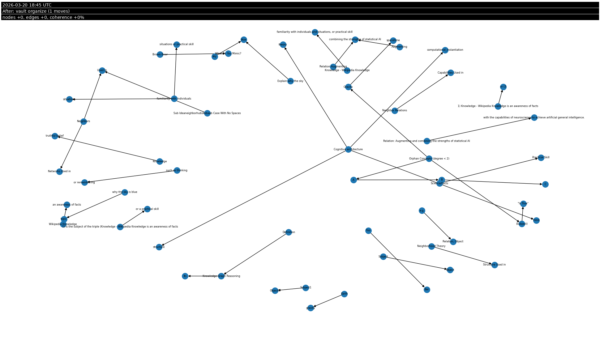](graph-2026-03-20-18-45-after-organize.png) [commit](https://github.com/BoggersTheFish/BoggersTheCIG/commit/af406e7)

### 2026-03-20 18:45 UTC

**After:** 1 extracts, 0 merges — nodes +0, edges +0, coherence +0%

[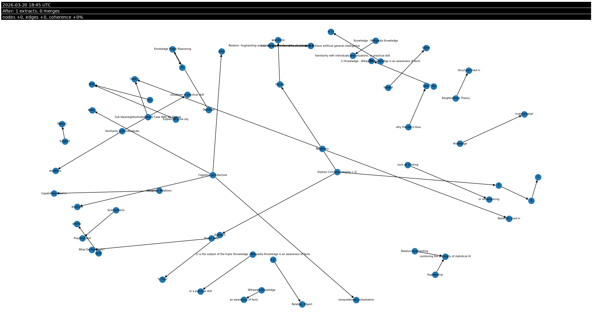](graph-2026-03-20-18-45-extract-subideas.png) [commit](https://github.com/BoggersTheFish/BoggersTheCIG/commit/af406e7)

### 2026-03-20 18:45 UTC

**After:** 2_+2_.md"+Part.md"+Spaces.md"+eval — nodes +0, edges +0, coherence +0%

[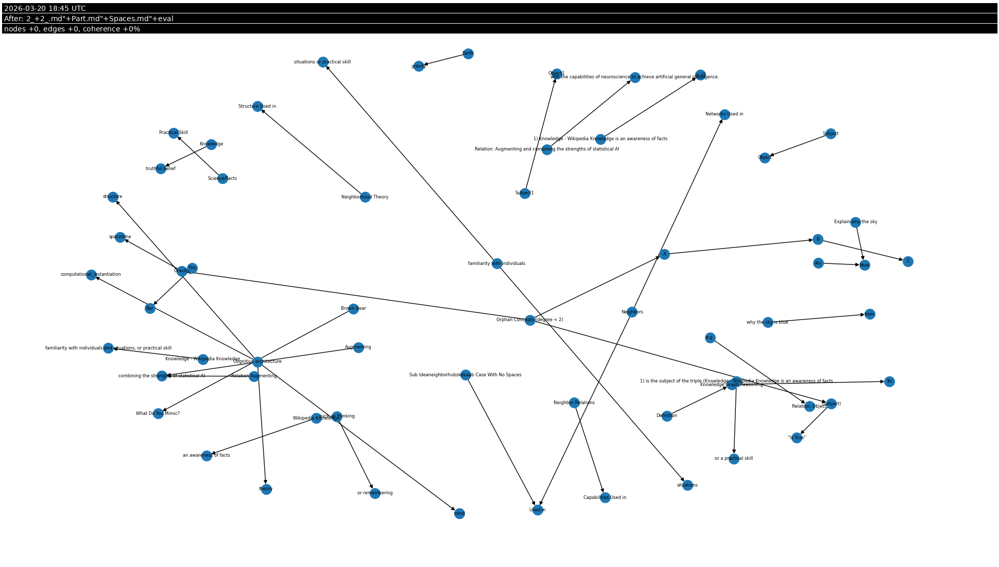](graph-2026-03-20-18-45-self-improve.png) [commit](https://github.com/BoggersTheFish/BoggersTheCIG/commit/af406e7)

### 2026-03-20 18:47 UTC

**After:** vault organize (5 moves) — nodes +0, edges +0, coherence +0%

[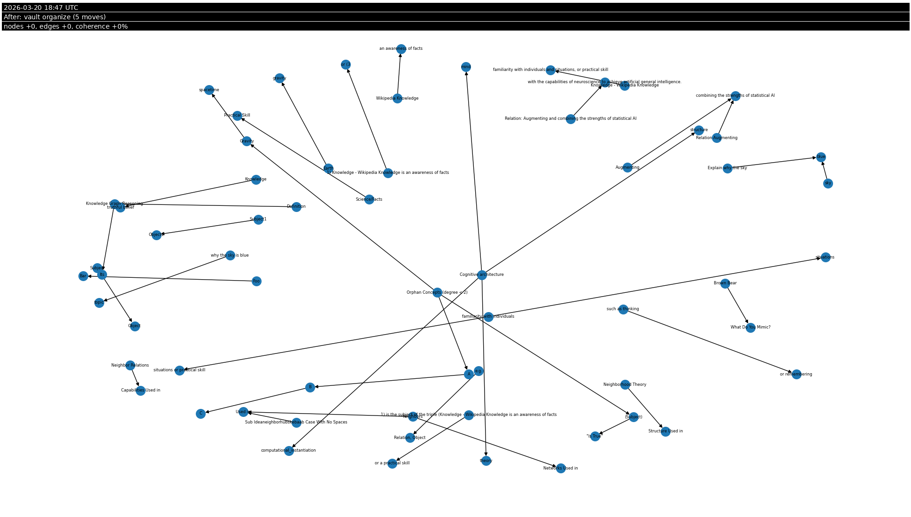](graph-2026-03-20-18-47-after-organize.png) [commit](https://github.com/BoggersTheFish/BoggersTheCIG/commit/af406e7)

### 2026-03-20 18:47 UTC

**After:** 0 extracts, 1 merges — nodes +0, edges +0, coherence +0%

[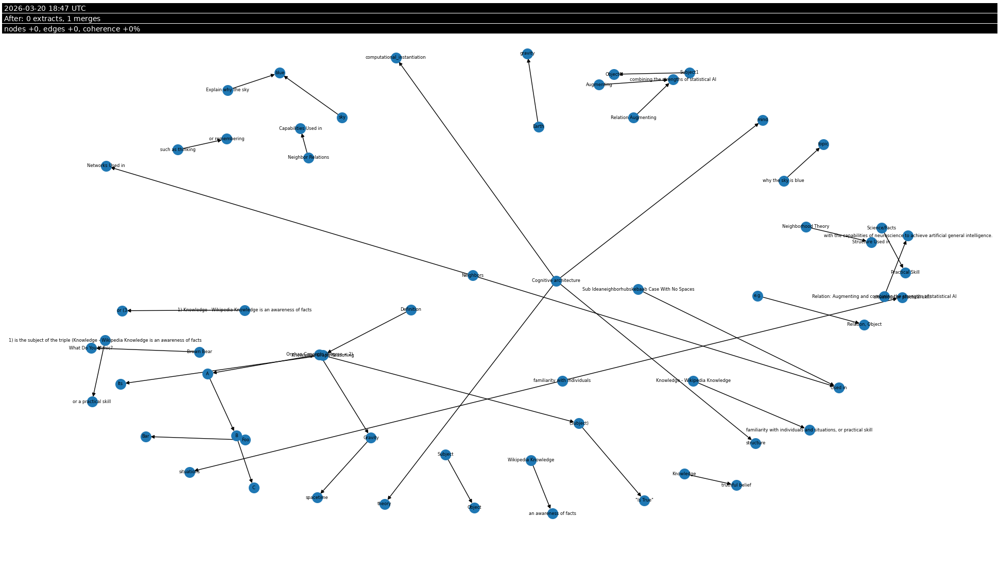](graph-2026-03-20-18-47-extract-subideas.png) [commit](https://github.com/BoggersTheFish/BoggersTheCIG/commit/af406e7)

### 2026-03-20 18:47 UTC

**After:** 2_+2_.md"+Bear.md"+Part.md"+Spaces.md" — nodes +0, edges +0, coherence +0%

[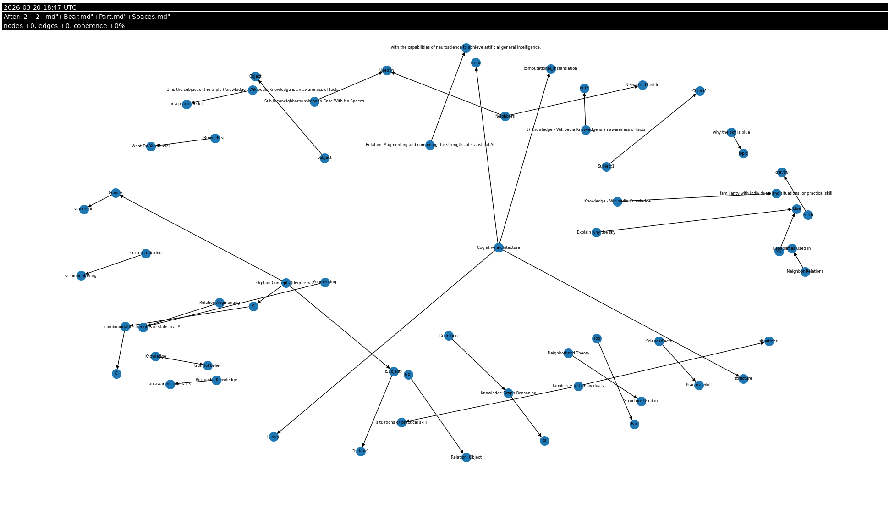](graph-2026-03-20-18-47-self-improve.png) [commit](https://github.com/BoggersTheFish/BoggersTheCIG/commit/af406e7)

### 2026-03-21 01:18 UTC

**After:** vault analysis (+96 triples) — nodes +62, edges +39, coherence +20524%

[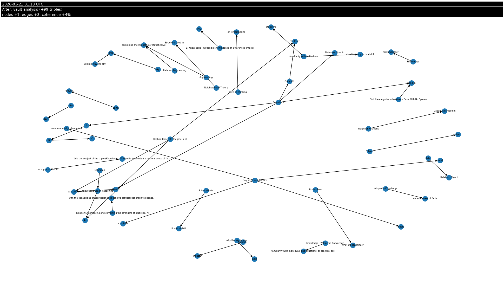](graph-2026-03-21-01-18-after-analyze-vault.png) [commit](https://github.com/BoggersTheFish/BoggersTheCIG/commit/609a307)

### 2026-03-21 01:18 UTC

**After:** 1 extracts, 0 merges — nodes +0, edges +0, coherence +0%

[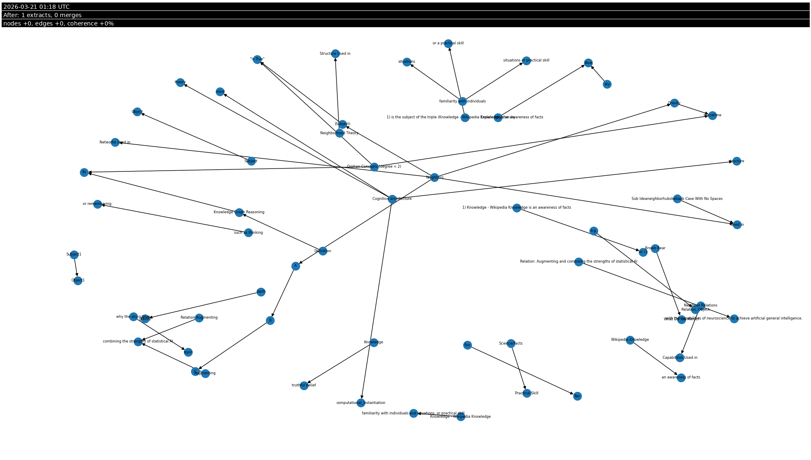](graph-2026-03-21-01-18-extract-subideas.png) [commit](https://github.com/BoggersTheFish/BoggersTheCIG/commit/609a307)

### 2026-03-21 01:18 UTC

**After:** vault analysis (+99 triples) — nodes +1, edges +3, coherence +4%

 [commit](https://github.com/BoggersTheFish/BoggersTheCIG/commit/609a307)

### 2026-03-21 01:18 UTC

**After:** 1 extracts, 0 merges — nodes +0, edges +0, coherence +0%

 [commit](https://github.com/BoggersTheFish/BoggersTheCIG/commit/609a307)

### 2026-03-21 01:20 UTC

**After:** vault organize (0 moves) — nodes +0, edges +0, coherence +0%

[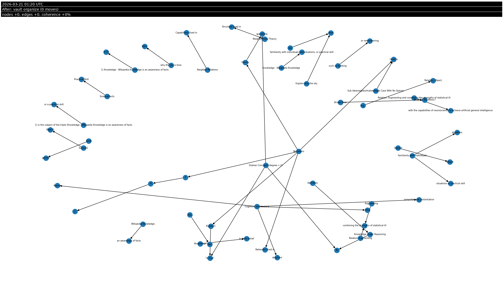](graph-2026-03-21-01-20-after-organize.png) [commit](https://github.com/BoggersTheFish/BoggersTheCIG/commit/609a307)

### 2026-03-21 01:20 UTC

**After:** 0 extracts, 1 merges — nodes +0, edges +0, coherence +0%

[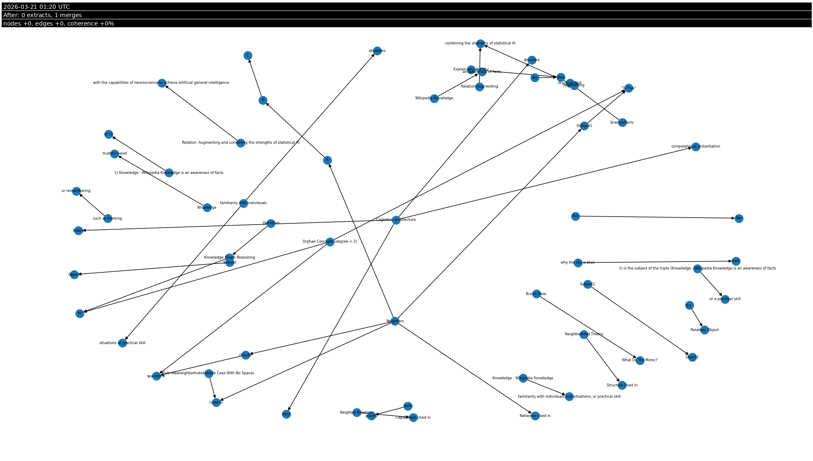](graph-2026-03-21-01-20-extract-subideas.png) [commit](https://github.com/BoggersTheFish/BoggersTheCIG/commit/609a307)

### 2026-03-21 01:20 UTC

**After:** 2_+2_.md"+Bear.md"+Spaces.md"+eval — nodes +0, edges +0, coherence +0%

[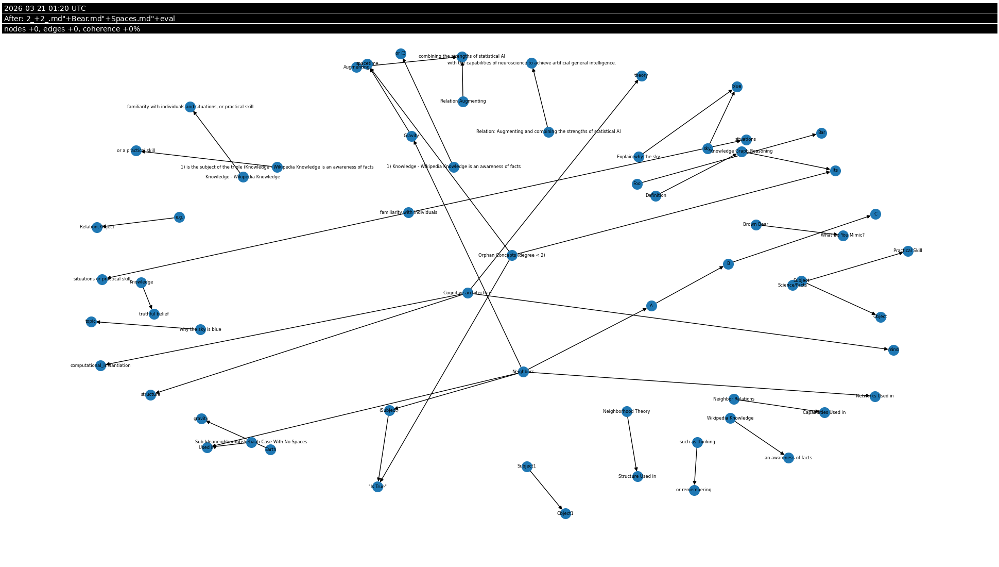](graph-2026-03-21-01-20-self-improve.png) [commit](https://github.com/BoggersTheFish/BoggersTheCIG/commit/609a307)

### 2026-03-21 01:23 UTC

**After:** vault organize (0 moves) — nodes +0, edges +0, coherence +0%

[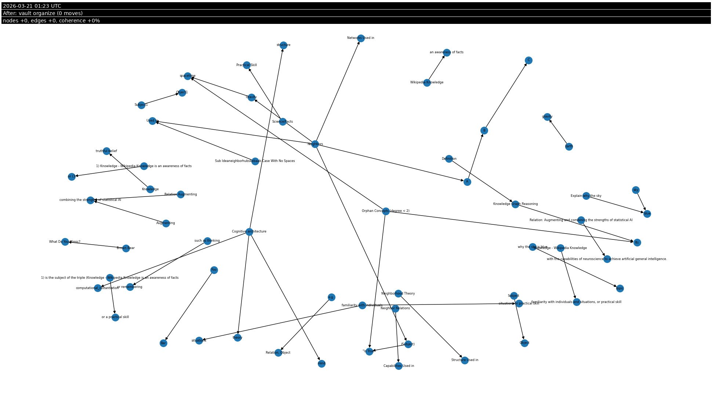](graph-2026-03-21-01-23-after-organize.png) [commit](https://github.com/BoggersTheFish/BoggersTheCIG/commit/609a307)

### 2026-03-21 01:23 UTC

**After:** 0 extracts, 1 merges — nodes +0, edges +0, coherence +0%

[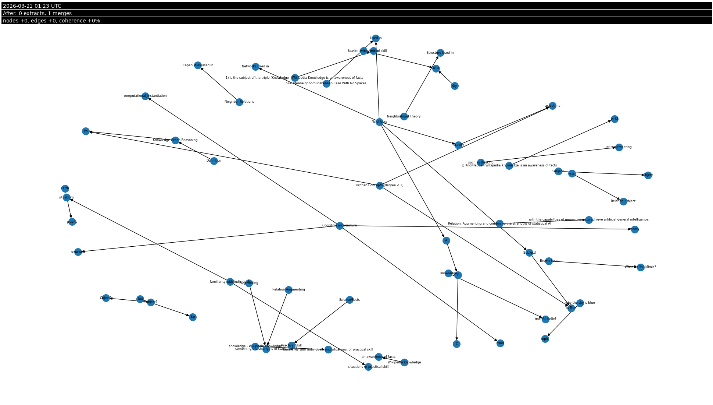](graph-2026-03-21-01-23-extract-subideas.png) [commit](https://github.com/BoggersTheFish/BoggersTheCIG/commit/609a307)

### 2026-03-21 01:23 UTC

**After:** 2_+2_.md"+Bear.md"+Spaces.md"+eval — nodes +0, edges +0, coherence +0%

[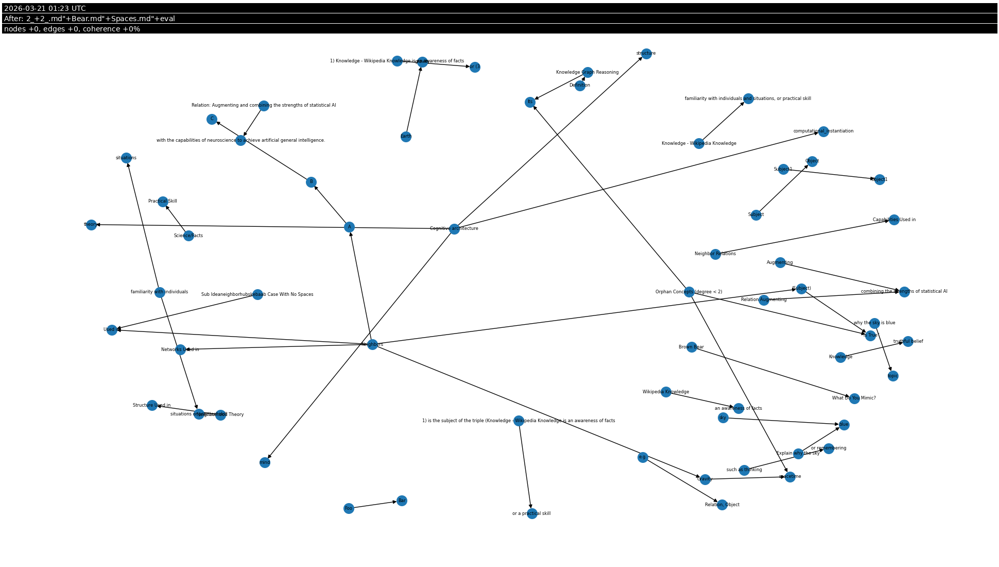](graph-2026-03-21-01-23-self-improve.png) [commit](https://github.com/BoggersTheFish/BoggersTheCIG/commit/609a307)

### 2026-03-21 06:39 UTC

**After:** external ingest (+1 triples) — nodes +4, edges +2, coherence +333233%

[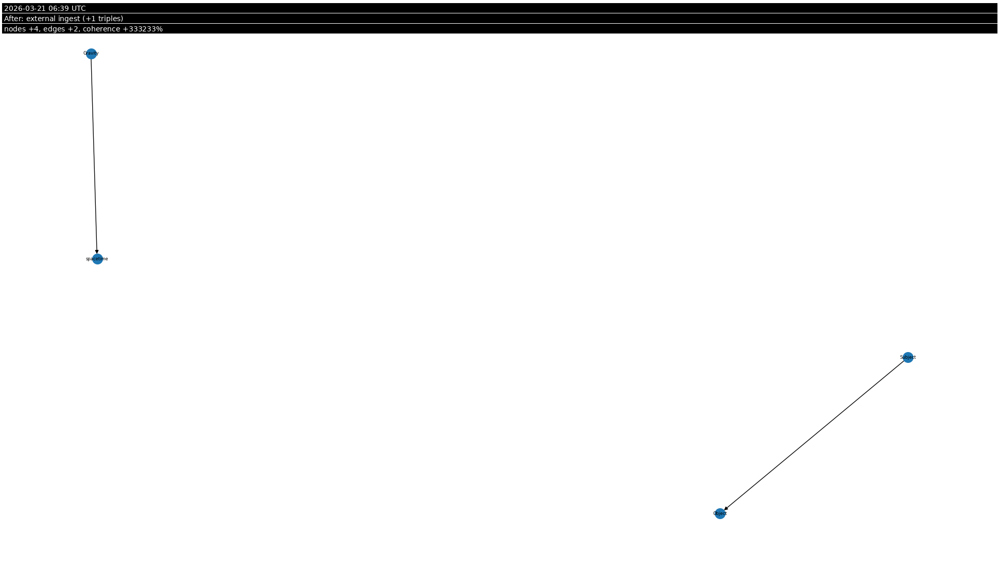](graph-2026-03-21-06-39-after-ingest.png) [commit](https://github.com/BoggersTheFish/BoggersTheCIG/commit/016dd44)

### 2026-03-21 06:39 UTC

**After:** vault analysis (+92 triples) — nodes +59, edges +35, coherence -94%

[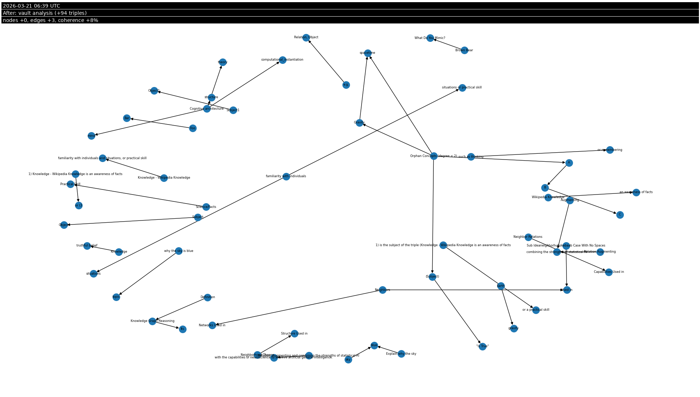](graph-2026-03-21-06-39-after-analyze-vault.png) [commit](https://github.com/BoggersTheFish/BoggersTheCIG/commit/016dd44)

### 2026-03-21 06:39 UTC

**After:** vault analysis (+94 triples) — nodes +0, edges +3, coherence +8%

 [commit](https://github.com/BoggersTheFish/BoggersTheCIG/commit/016dd44)

### 2026-03-21 06:42 UTC

**After:** vault organize (0 moves) — nodes +0, edges +0, coherence +0%

[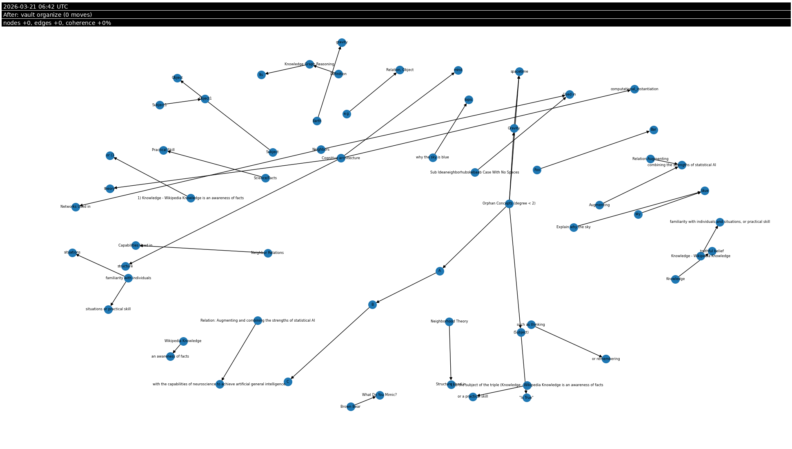](graph-2026-03-21-06-42-after-organize.png) [commit](https://github.com/BoggersTheFish/BoggersTheCIG/commit/016dd44)

### 2026-03-21 06:42 UTC

**After:** 1 extracts, 0 merges — nodes +0, edges +0, coherence +0%

[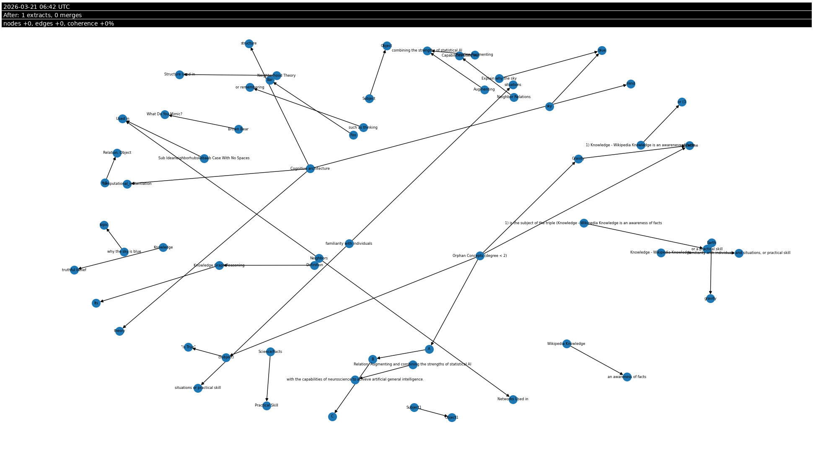](graph-2026-03-21-06-42-extract-subideas.png) [commit](https://github.com/BoggersTheFish/BoggersTheCIG/commit/016dd44)

### 2026-03-21 06:42 UTC

**After:** 2_+2_.md"+Spaces.md"+eval+obsidian — nodes +0, edges +0, coherence +0%

[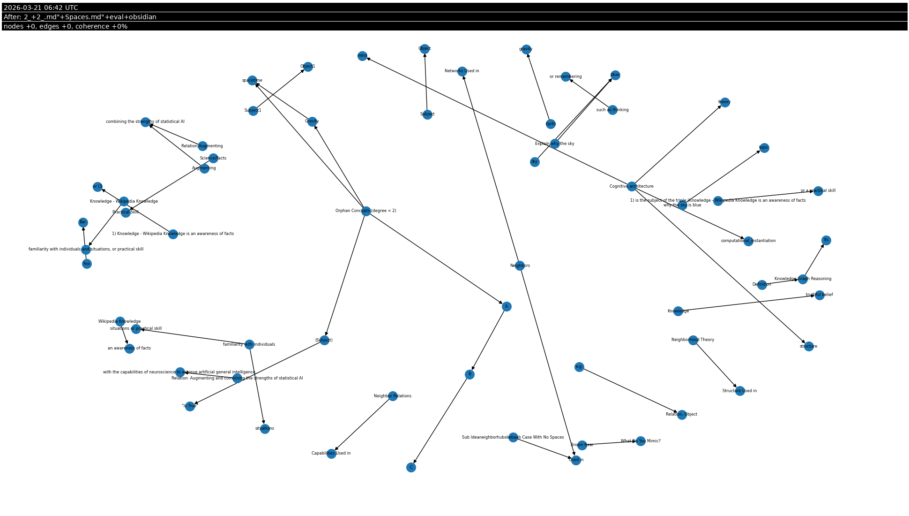](graph-2026-03-21-06-42-self-improve.png) [commit](https://github.com/BoggersTheFish/BoggersTheCIG/commit/016dd44)

### 2026-03-21 06:45 UTC

**After:** vault organize (0 moves) — nodes +0, edges +0, coherence +0%

[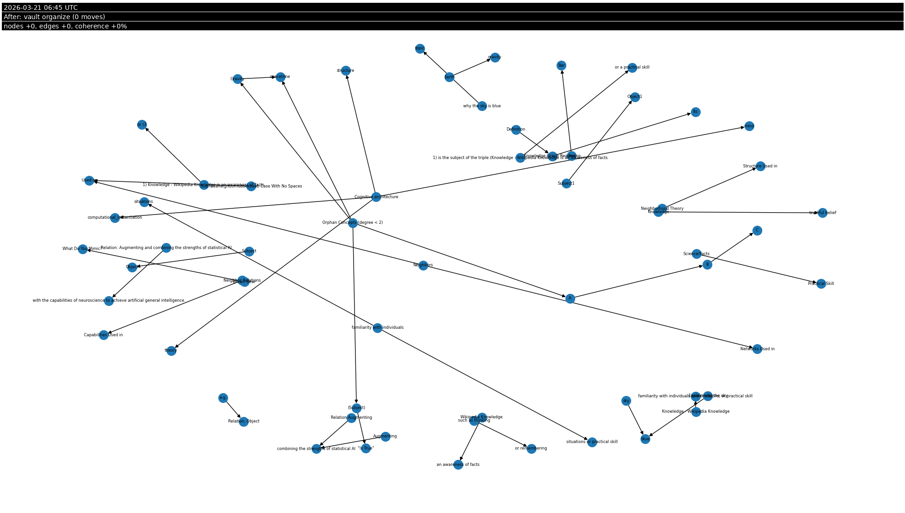](graph-2026-03-21-06-45-after-organize.png) [commit](https://github.com/BoggersTheFish/BoggersTheCIG/commit/016dd44)

### 2026-03-21 06:45 UTC

**After:** 0 extracts, 1 merges — nodes +0, edges +0, coherence +0%

[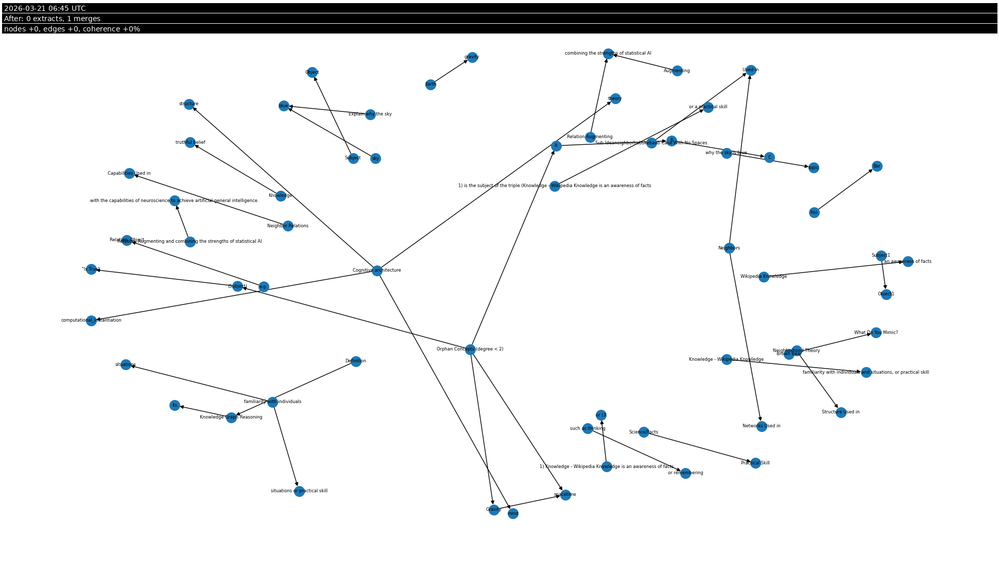](graph-2026-03-21-06-45-extract-subideas.png) [commit](https://github.com/BoggersTheFish/BoggersTheCIG/commit/016dd44)

### 2026-03-21 06:45 UTC

**After:** 2_+2_.md"+Spaces.md"+eval+obsidian — nodes +0, edges +0, coherence +0%

[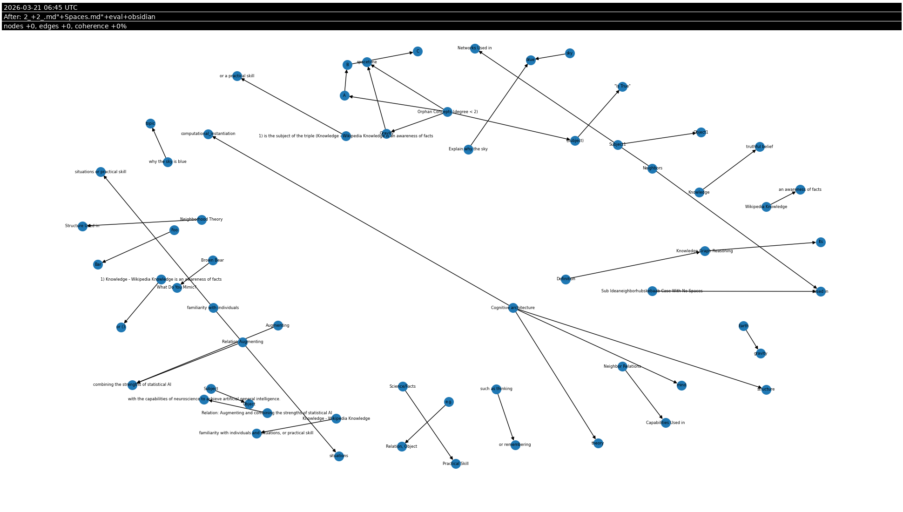](graph-2026-03-21-06-45-self-improve.png) [commit](https://github.com/BoggersTheFish/BoggersTheCIG/commit/016dd44)

### 2026-03-21 08:14 UTC

**After:** vault analysis (+94 triples) — nodes +62, edges +36, coherence +18937%

[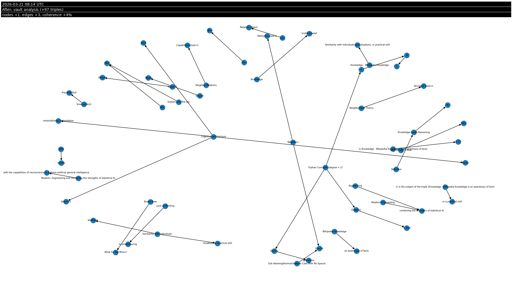](graph-2026-03-21-08-14-after-analyze-vault.png) [commit](https://github.com/BoggersTheFish/BoggersTheCIG/commit/6d1290a)

### 2026-03-21 08:14 UTC

**After:** vault analysis (+97 triples) — nodes +1, edges +3, coherence +4%

 [commit](https://github.com/BoggersTheFish/BoggersTheCIG/commit/6d1290a)

### 2026-03-21 08:16 UTC

**After:** vault organize (0 moves) — nodes +0, edges +0, coherence +0%

[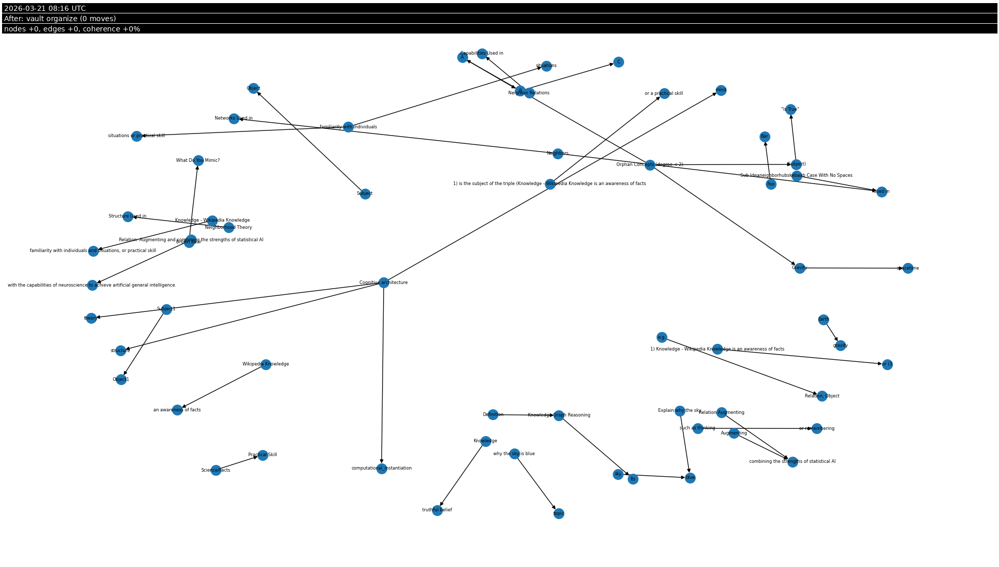](graph-2026-03-21-08-16-after-organize.png) [commit](https://github.com/BoggersTheFish/BoggersTheCIG/commit/6d1290a)

### 2026-03-21 08:16 UTC

**After:** 1 extracts, 0 merges — nodes +0, edges +0, coherence +0%

[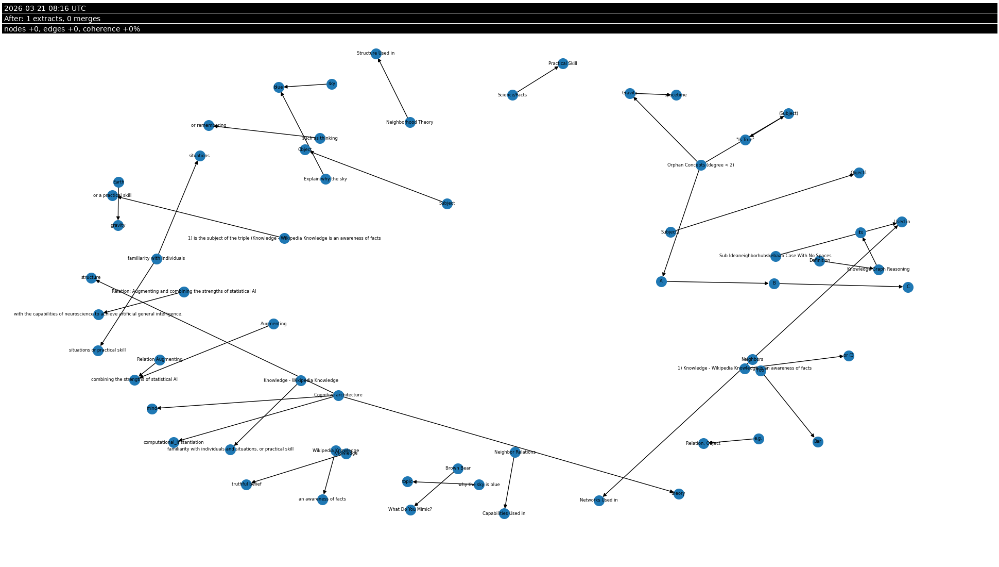](graph-2026-03-21-08-16-extract-subideas.png) [commit](https://github.com/BoggersTheFish/BoggersTheCIG/commit/6d1290a)

### 2026-03-21 08:16 UTC

**After:** 2_+2_.md"+Spaces.md"+eval+obsidian — nodes +0, edges +0, coherence +0%

[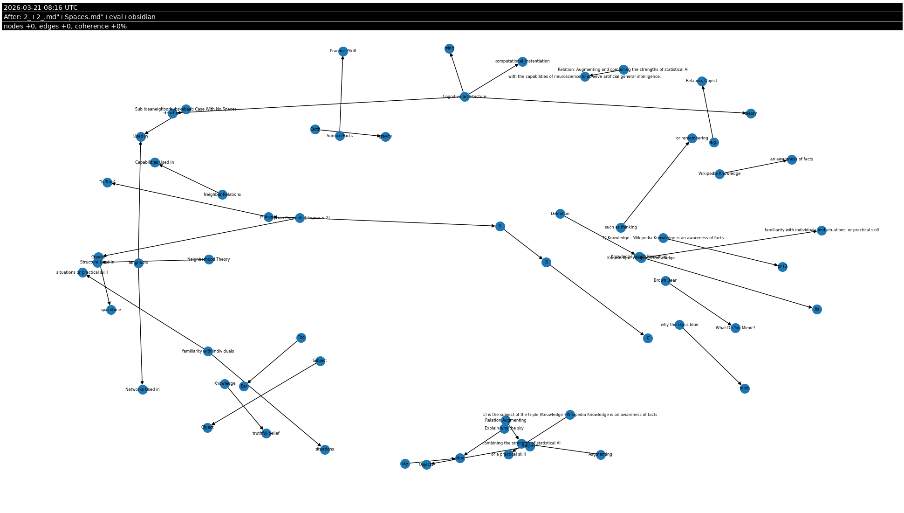](graph-2026-03-21-08-16-self-improve.png) [commit](https://github.com/BoggersTheFish/BoggersTheCIG/commit/6d1290a)

### 2026-03-21 08:18 UTC

**After:** vault organize (0 moves) — nodes +0, edges +0, coherence +0%

[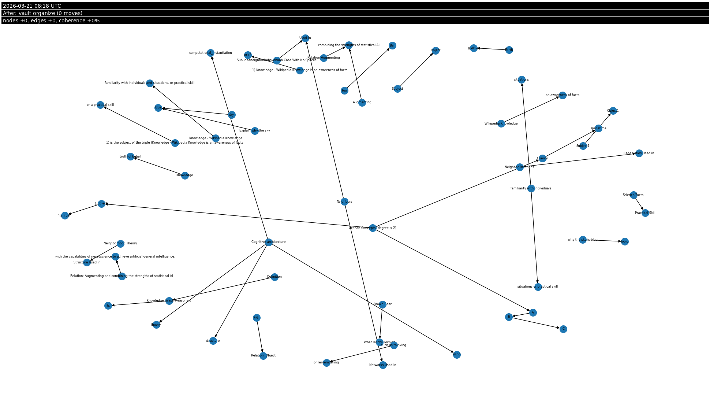](graph-2026-03-21-08-18-after-organize.png) [commit](https://github.com/BoggersTheFish/BoggersTheCIG/commit/6d1290a)

### 2026-03-21 08:19 UTC

**After:** 0 extracts, 1 merges — nodes +0, edges +0, coherence +0%

[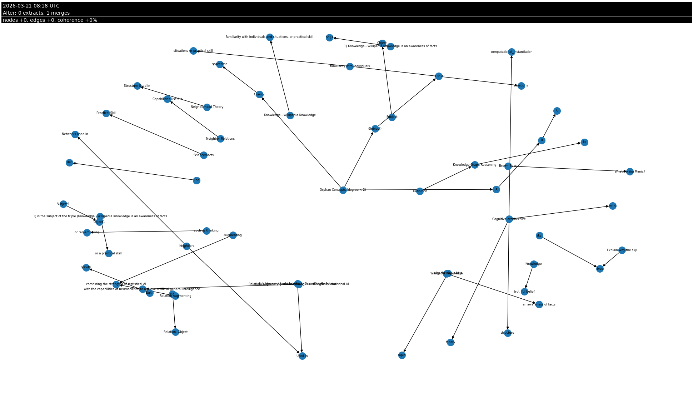](graph-2026-03-21-08-18-extract-subideas.png) [commit](https://github.com/BoggersTheFish/BoggersTheCIG/commit/6d1290a)

### 2026-03-21 08:19 UTC

**After:** 2_+2_.md"+Spaces.md"+obsidian — nodes +0, edges +0, coherence +0%

[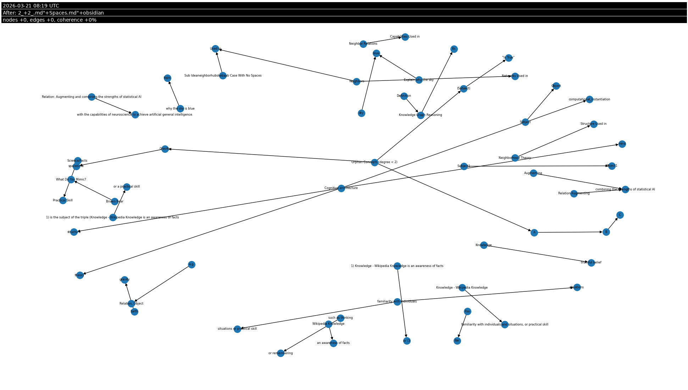](graph-2026-03-21-08-19-self-improve.png) [commit](https://github.com/BoggersTheFish/BoggersTheCIG/commit/6d1290a)

### 2026-03-21 10:32 UTC

**After:** external ingest (+1 triples) — nodes +4, edges +2, coherence +333233%

[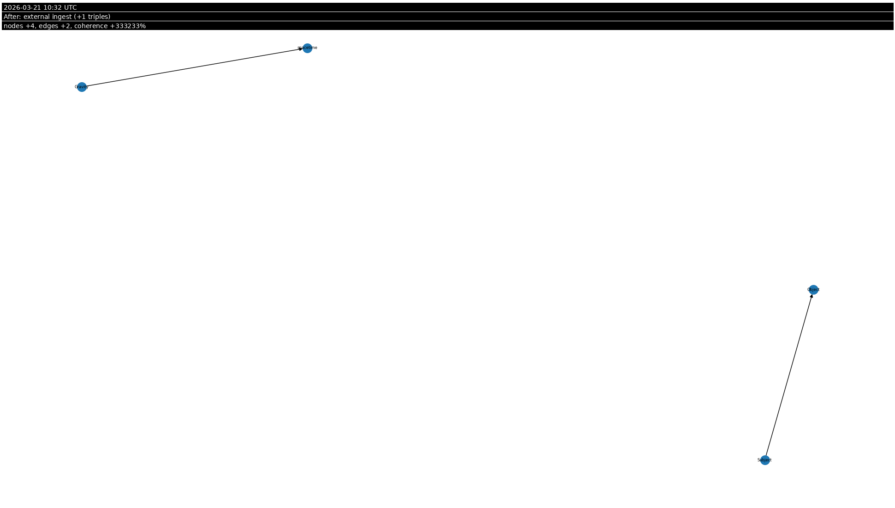](graph-2026-03-21-10-32-after-ingest.png) [commit](https://github.com/BoggersTheFish/BoggersTheCIG/commit/e74021c)

### 2026-03-21 10:32 UTC

**After:** vault analysis (+98 triples) — nodes +59, edges +38, coherence -93%

[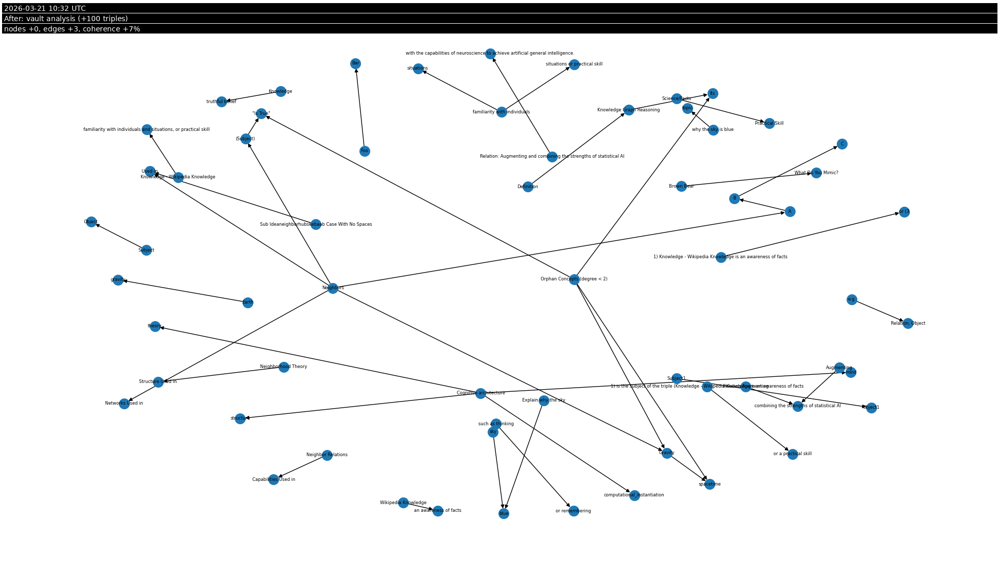](graph-2026-03-21-10-32-after-analyze-vault.png) [commit](https://github.com/BoggersTheFish/BoggersTheCIG/commit/e74021c)

### 2026-03-21 10:32 UTC

**After:** 1 extracts, 0 merges — nodes +0, edges +0, coherence +0%

[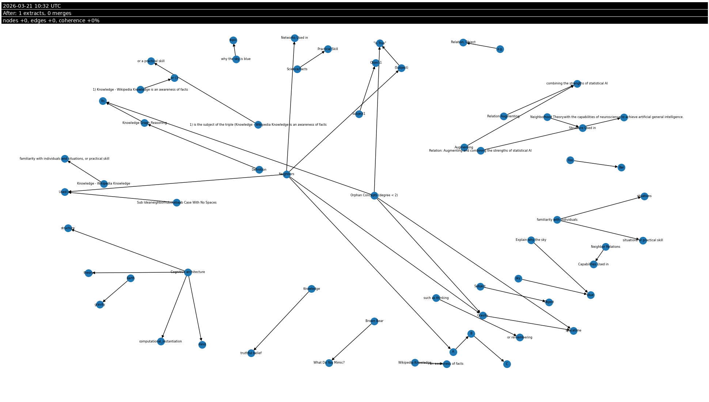](graph-2026-03-21-10-32-extract-subideas.png) [commit](https://github.com/BoggersTheFish/BoggersTheCIG/commit/e74021c)

### 2026-03-21 10:32 UTC

**After:** vault analysis (+100 triples) — nodes +0, edges +3, coherence +7%

 [commit](https://github.com/BoggersTheFish/BoggersTheCIG/commit/e74021c)

### 2026-03-21 10:32 UTC

**After:** 1 extracts, 0 merges — nodes +0, edges +0, coherence +0%

 [commit](https://github.com/BoggersTheFish/BoggersTheCIG/commit/e74021c)

### 2026-03-21 10:35 UTC

**After:** vault organize (0 moves) — nodes +0, edges +0, coherence +0%

[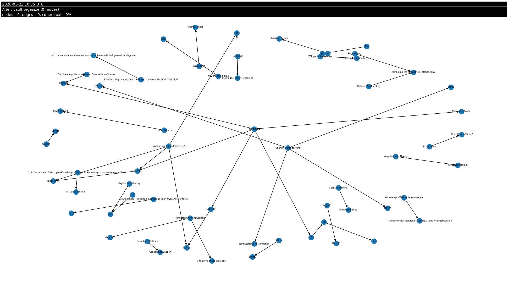](graph-2026-03-21-10-35-after-organize.png) [commit](https://github.com/BoggersTheFish/BoggersTheCIG/commit/e74021c)

### 2026-03-21 10:35 UTC

**After:** 0 extracts, 1 merges — nodes +0, edges +0, coherence +0%

[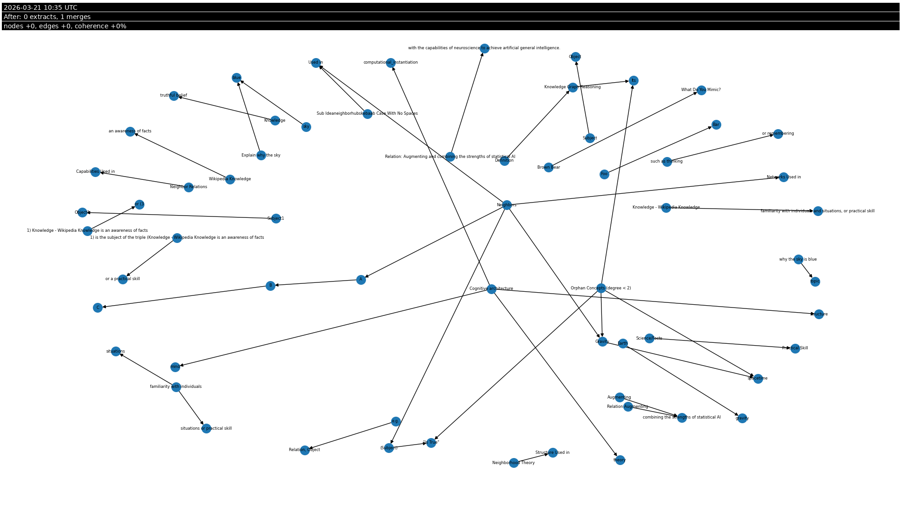](graph-2026-03-21-10-35-extract-subideas.png) [commit](https://github.com/BoggersTheFish/BoggersTheCIG/commit/e74021c)

### 2026-03-21 10:35 UTC

**After:** 2_+2_.md"+eval+obsidian — nodes +0, edges +0, coherence +0%

[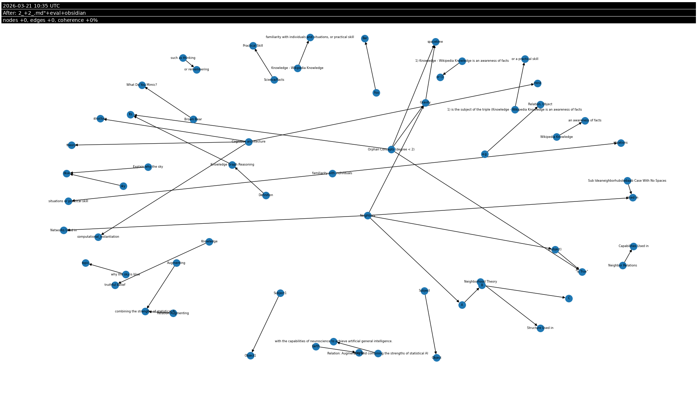](graph-2026-03-21-10-35-self-improve.png) [commit](https://github.com/BoggersTheFish/BoggersTheCIG/commit/e74021c)

### 2026-03-21 10:39 UTC

**After:** vault organize (0 moves) — nodes +0, edges +0, coherence +0%

[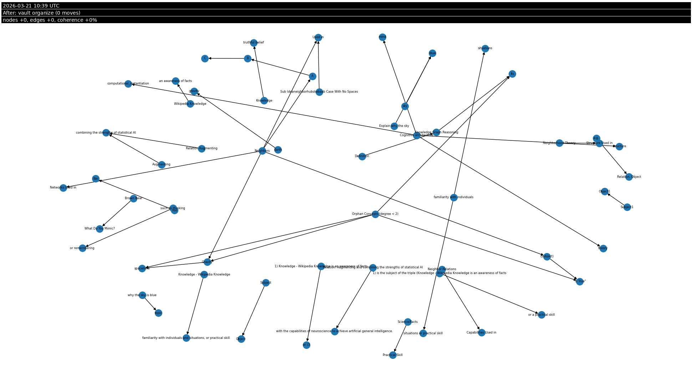](graph-2026-03-21-10-39-after-organize.png) [commit](https://github.com/BoggersTheFish/BoggersTheCIG/commit/e74021c)

### 2026-03-21 10:39 UTC

**After:** 0 extracts, 1 merges — nodes +0, edges +0, coherence +0%

[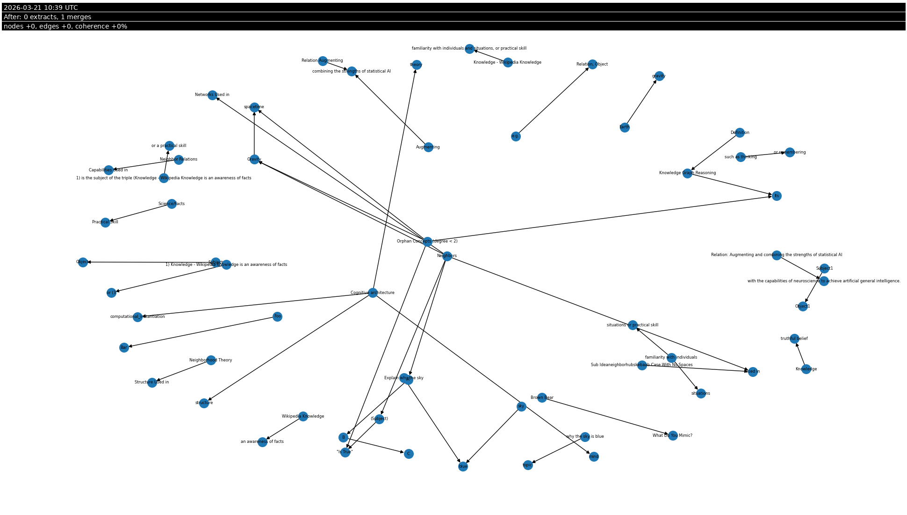](graph-2026-03-21-10-39-extract-subideas.png) [commit](https://github.com/BoggersTheFish/BoggersTheCIG/commit/e74021c)

### 2026-03-21 10:39 UTC

**After:** 2_+2_.md"+eval+obsidian — nodes +0, edges +0, coherence +0%

[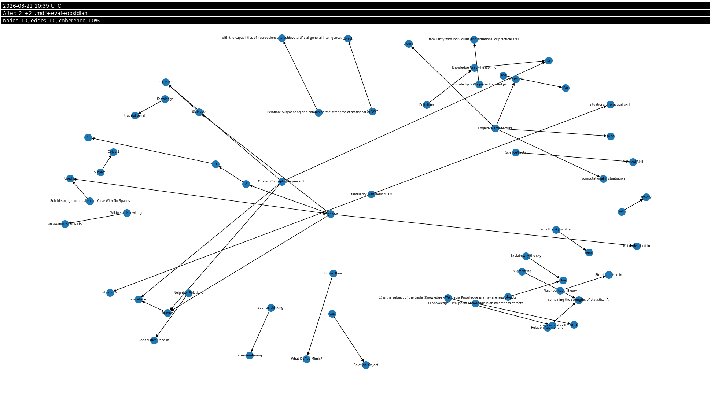](graph-2026-03-21-10-39-self-improve.png) [commit](https://github.com/BoggersTheFish/BoggersTheCIG/commit/e74021c)

### 2026-03-21 15:31 UTC

**After:** vault analysis (+92 triples) — nodes +62, edges +36, coherence +18937%

[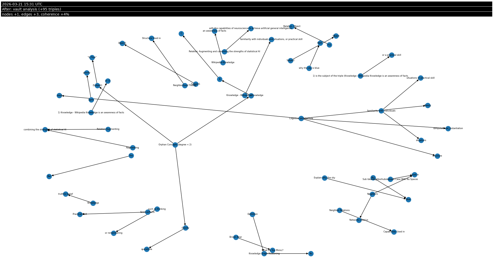](graph-2026-03-21-15-31-after-analyze-vault.png) [commit](https://github.com/BoggersTheFish/BoggersTheCIG/commit/8ba6cec)

### 2026-03-21 15:31 UTC

**After:** vault analysis (+95 triples) — nodes +1, edges +3, coherence +4%

 [commit](https://github.com/BoggersTheFish/BoggersTheCIG/commit/8ba6cec)

### 2026-03-21 15:34 UTC

**After:** vault organize (0 moves) — nodes +0, edges +0, coherence +0%

[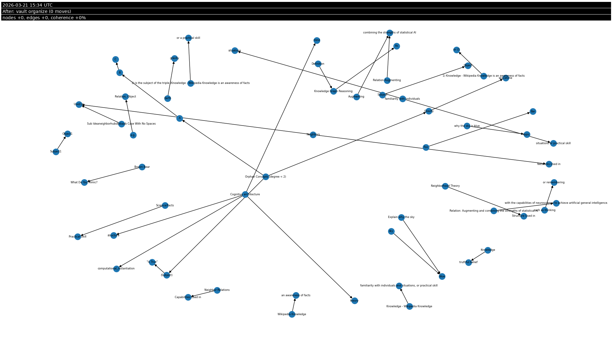](graph-2026-03-21-15-34-after-organize.png) [commit](https://github.com/BoggersTheFish/BoggersTheCIG/commit/8ba6cec)

### 2026-03-21 15:34 UTC

**After:** 1 extracts, 0 merges — nodes +0, edges +0, coherence +0%

[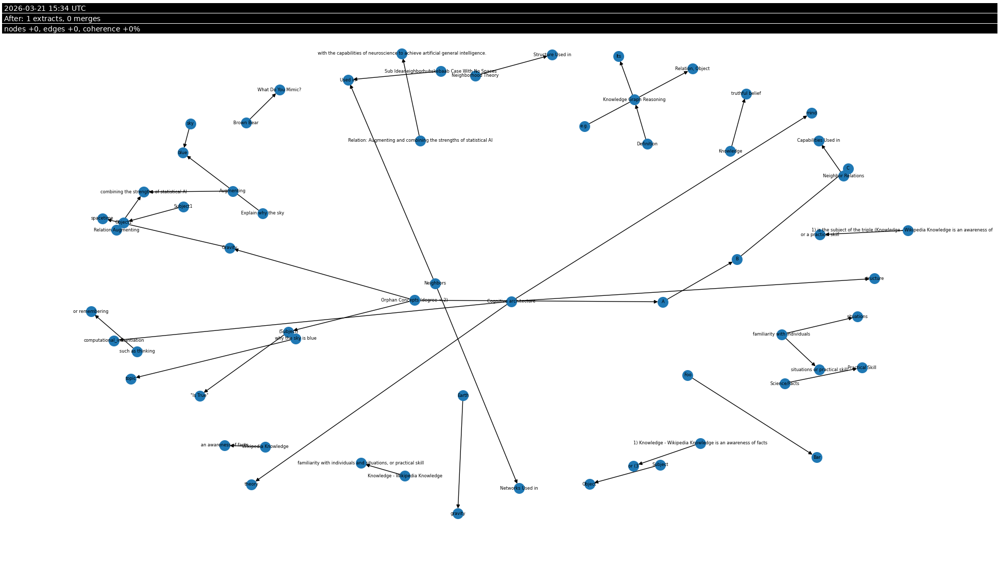](graph-2026-03-21-15-34-extract-subideas.png) [commit](https://github.com/BoggersTheFish/BoggersTheCIG/commit/8ba6cec)

### 2026-03-21 15:34 UTC

**After:** 2_+2_.md"+eval+obsidian — nodes +0, edges +0, coherence +0%

[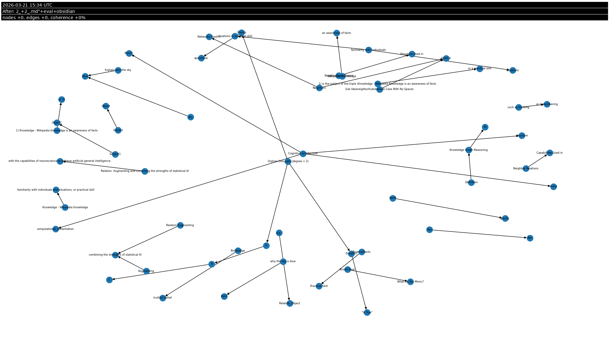](graph-2026-03-21-15-34-self-improve.png) [commit](https://github.com/BoggersTheFish/BoggersTheCIG/commit/8ba6cec)

### 2026-03-21 15:37 UTC

**After:** vault organize (0 moves) — nodes +0, edges +0, coherence +0%

[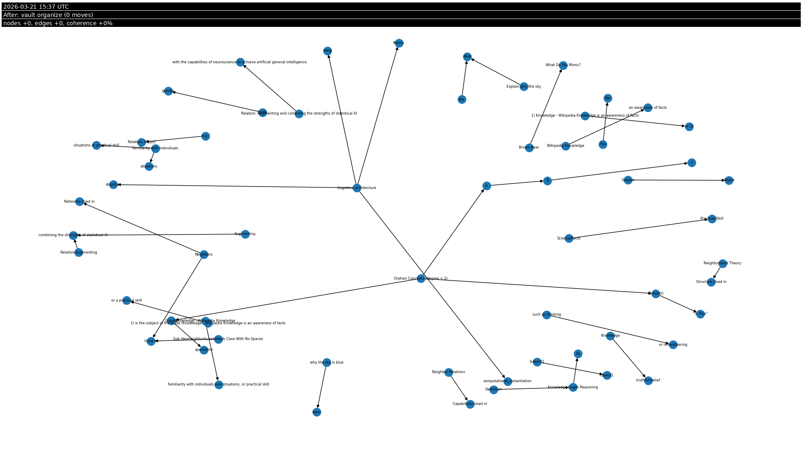](graph-2026-03-21-15-37-after-organize.png) [commit](https://github.com/BoggersTheFish/BoggersTheCIG/commit/8ba6cec)

### 2026-03-21 15:37 UTC

**After:** 0 extracts, 1 merges — nodes +0, edges +0, coherence +0%

[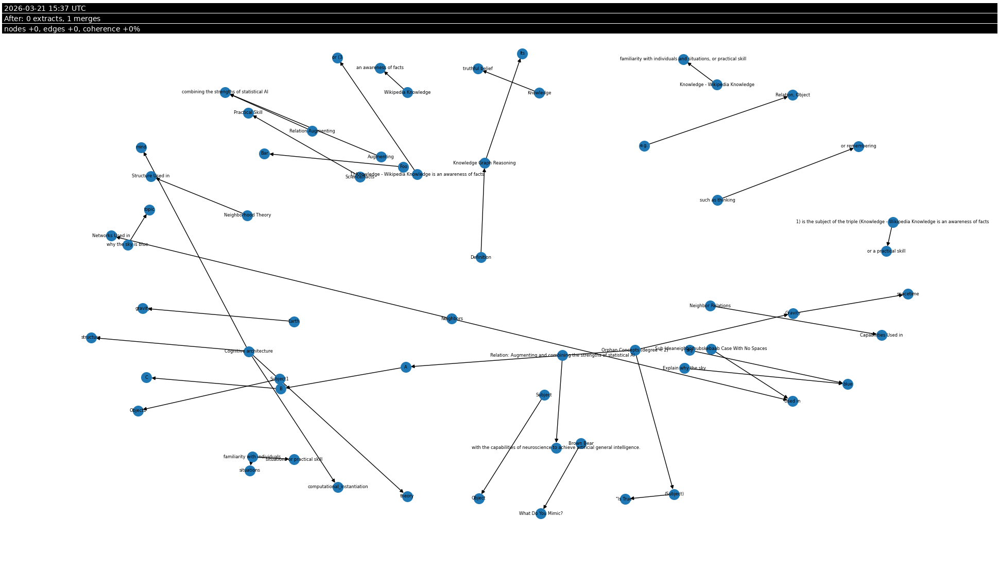](graph-2026-03-21-15-37-extract-subideas.png) [commit](https://github.com/BoggersTheFish/BoggersTheCIG/commit/8ba6cec)

### 2026-03-21 15:37 UTC

**After:** 2_+2_.md"+obsidian — nodes +0, edges +0, coherence +0%

[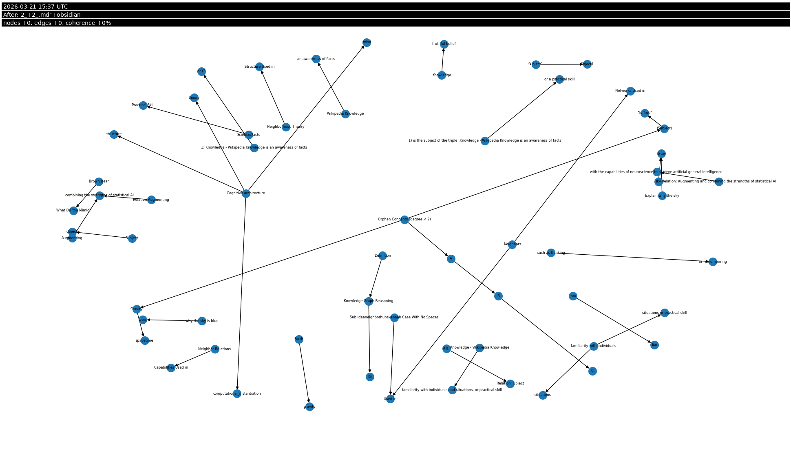](graph-2026-03-21-15-37-self-improve.png) [commit](https://github.com/BoggersTheFish/BoggersTheCIG/commit/8ba6cec)

### 2026-03-21 20:31 UTC

**After:** vault analysis (+95 triples) — nodes +64, edges +37, coherence +18253%

[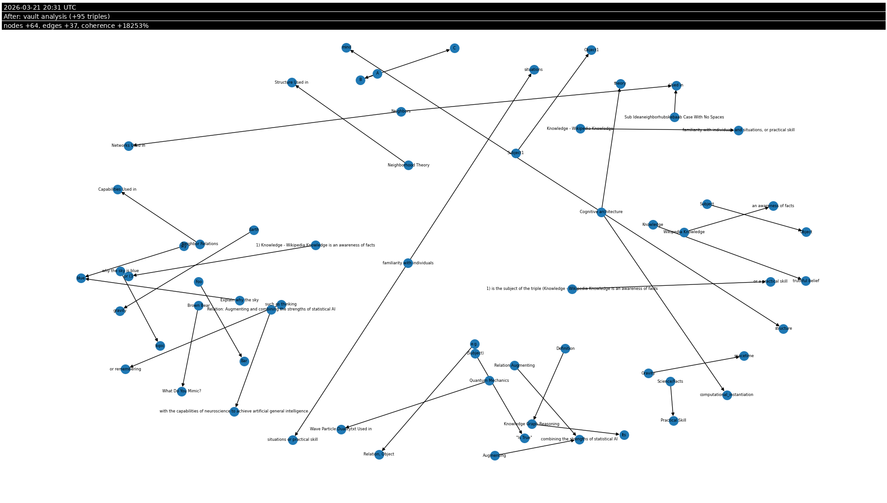](graph-2026-03-21-20-31-after-analyze-vault.png) [commit](https://github.com/BoggersTheFish/BoggersTheCIG/commit/f331fc2)

### 2026-03-21 20:32 UTC

**After:** vault analysis (+98 triples) — nodes +1, edges +3, coherence +4%

[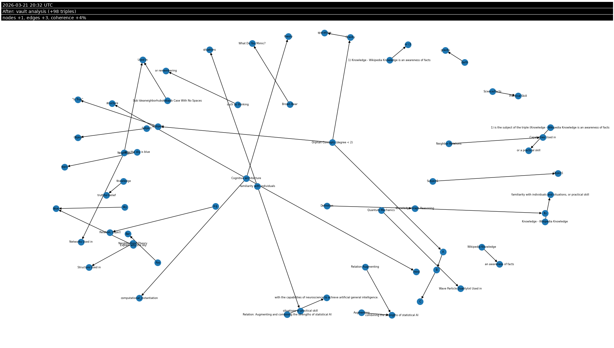](graph-2026-03-21-20-32-after-analyze-vault.png) [commit](https://github.com/BoggersTheFish/BoggersTheCIG/commit/f331fc2)

### 2026-03-21 20:35 UTC

**After:** vault organize (0 moves) — nodes +0, edges +0, coherence +0%

[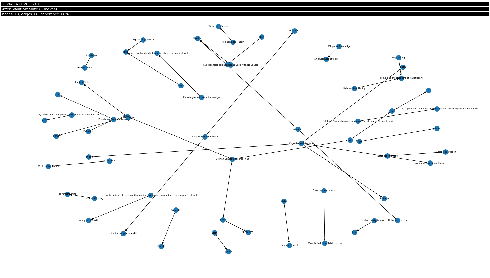](graph-2026-03-21-20-35-after-organize.png) [commit](https://github.com/BoggersTheFish/BoggersTheCIG/commit/f331fc2)

### 2026-03-21 20:35 UTC

**After:** 1 extracts, 0 merges — nodes +0, edges +0, coherence +0%

[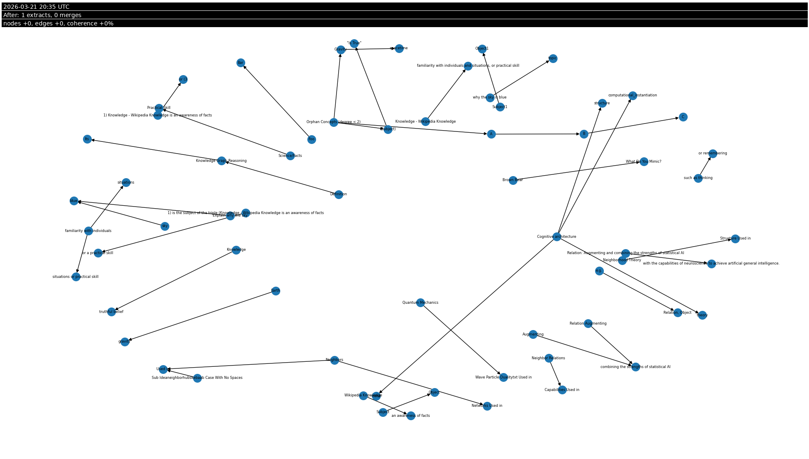](graph-2026-03-21-20-35-extract-subideas.png) [commit](https://github.com/BoggersTheFish/BoggersTheCIG/commit/f331fc2)

### 2026-03-21 20:35 UTC

**After:** 2_+2_.md"+Mechanics.md"+eval+in.md" — nodes +0, edges +0, coherence +0%

[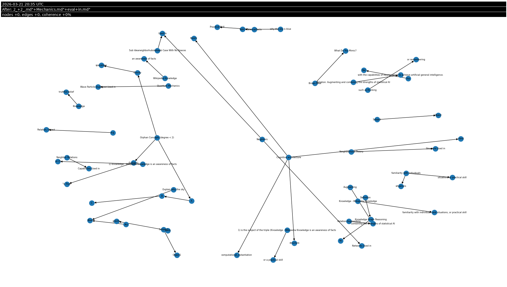](graph-2026-03-21-20-35-self-improve.png) [commit](https://github.com/BoggersTheFish/BoggersTheCIG/commit/f331fc2)

### 2026-03-21 20:38 UTC

**After:** vault organize (1 moves) — nodes +0, edges +0, coherence +0%

[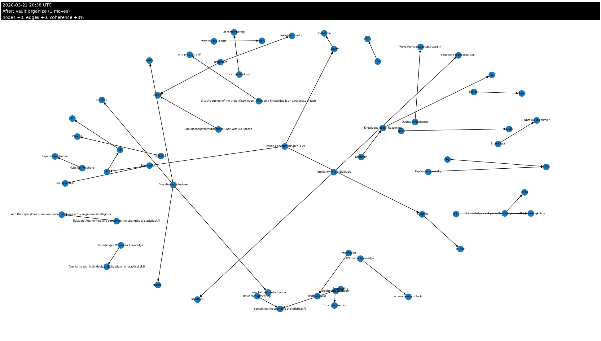](graph-2026-03-21-20-38-after-organize.png) [commit](https://github.com/BoggersTheFish/BoggersTheCIG/commit/f331fc2)

### 2026-03-21 20:38 UTC

**After:** 0 extracts, 1 merges — nodes +0, edges +0, coherence +0%

[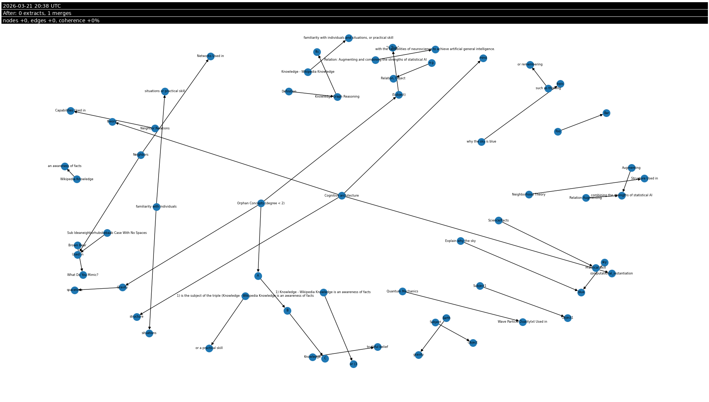](graph-2026-03-21-20-38-extract-subideas.png) [commit](https://github.com/BoggersTheFish/BoggersTheCIG/commit/f331fc2)

### 2026-03-21 20:38 UTC

**After:** 2_+2_.md"+Mechanics.md"+eval+in.md" — nodes +0, edges +0, coherence +0%

[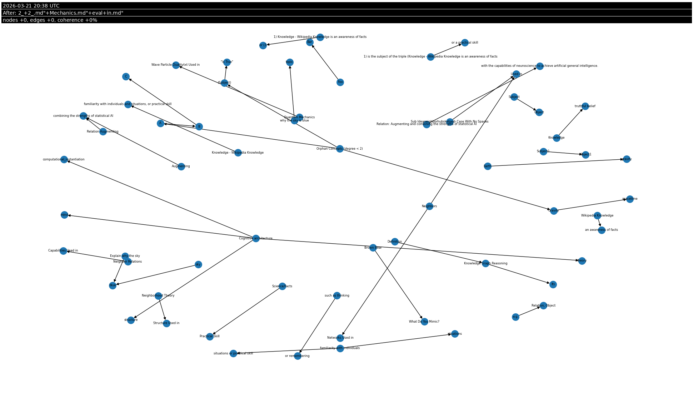](graph-2026-03-21-20-38-self-improve.png) [commit](https://github.com/BoggersTheFish/BoggersTheCIG/commit/f331fc2)

### 2026-03-22 02:14 UTC

**After:** vault analysis (+99 triples) — nodes +64, edges +40, coherence +19741%

[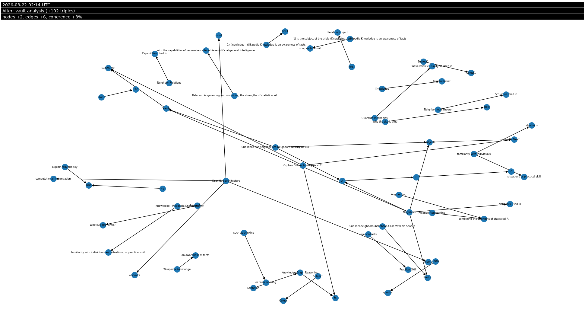](graph-2026-03-22-02-14-after-analyze-vault.png) [commit](https://github.com/BoggersTheFish/BoggersTheCIG/commit/831550d)

### 2026-03-22 02:14 UTC

**After:** 1 extracts, 0 merges — nodes +0, edges +0, coherence +0%

[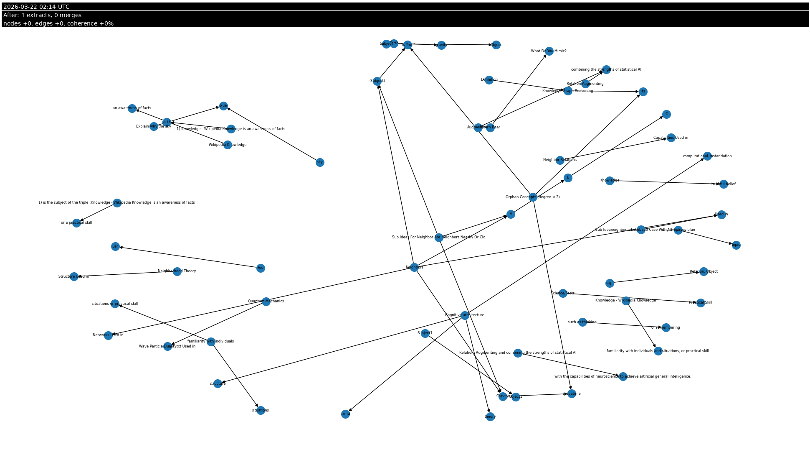](graph-2026-03-22-02-14-extract-subideas.png) [commit](https://github.com/BoggersTheFish/BoggersTheCIG/commit/831550d)

### 2026-03-22 02:14 UTC

**After:** vault analysis (+102 triples) — nodes +2, edges +6, coherence +8%

 [commit](https://github.com/BoggersTheFish/BoggersTheCIG/commit/831550d)

### 2026-03-22 02:14 UTC

**After:** 1 extracts, 0 merges — nodes +0, edges +0, coherence +0%

 [commit](https://github.com/BoggersTheFish/BoggersTheCIG/commit/831550d)

### 2026-03-22 02:17 UTC

**After:** vault organize (1 moves) — nodes +0, edges +0, coherence +0%

[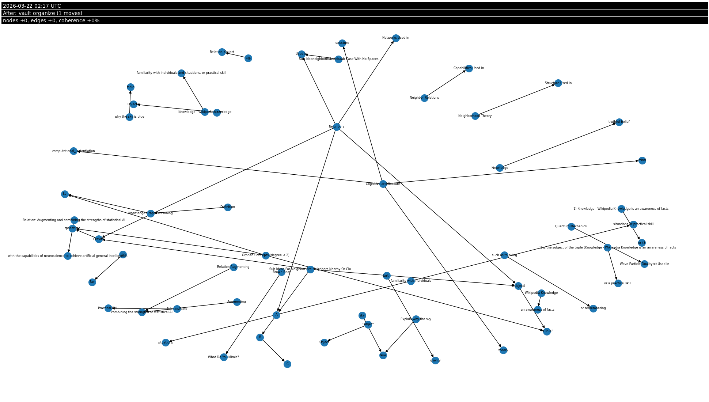](graph-2026-03-22-02-17-after-organize.png) [commit](https://github.com/BoggersTheFish/BoggersTheCIG/commit/831550d)

### 2026-03-22 02:17 UTC

**After:** 0 extracts, 1 merges — nodes +0, edges +0, coherence +0%

[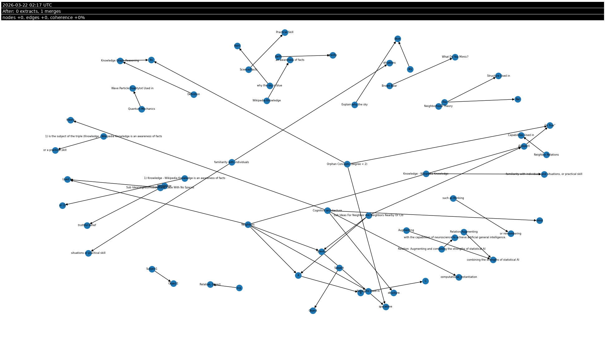](graph-2026-03-22-02-17-extract-subideas.png) [commit](https://github.com/BoggersTheFish/BoggersTheCIG/commit/831550d)

### 2026-03-22 02:17 UTC

**After:** 2_+2_.md"+Clo.md"+Mechanics.md"+eval — nodes +0, edges +0, coherence +0%

[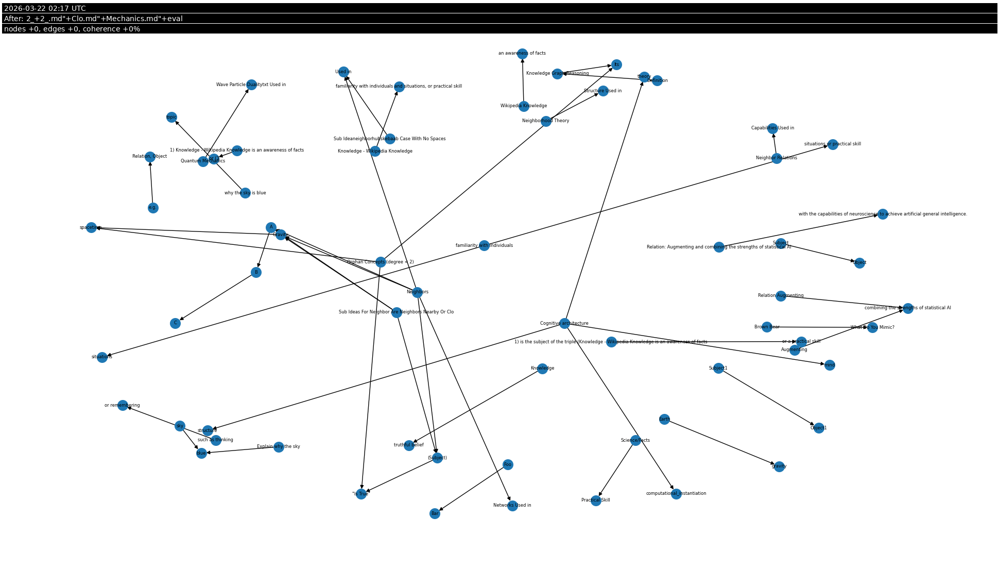](graph-2026-03-22-02-17-self-improve.png) [commit](https://github.com/BoggersTheFish/BoggersTheCIG/commit/831550d)

### 2026-03-22 02:20 UTC

**After:** vault organize (0 moves) — nodes +0, edges +0, coherence +0%

[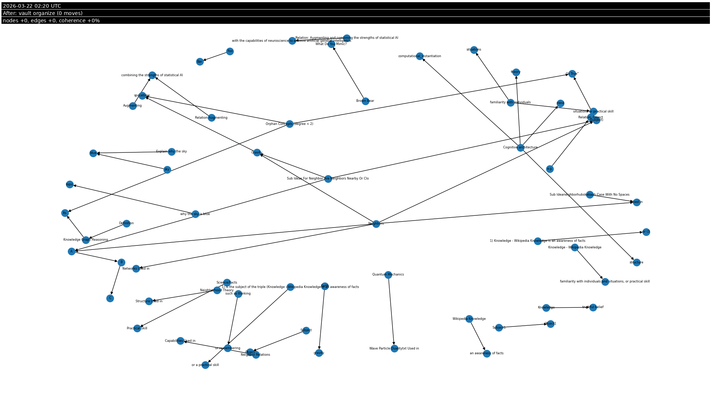](graph-2026-03-22-02-20-after-organize.png) [commit](https://github.com/BoggersTheFish/BoggersTheCIG/commit/831550d)

### 2026-03-22 02:21 UTC

**After:** 0 extracts, 1 merges — nodes +0, edges +0, coherence +0%

[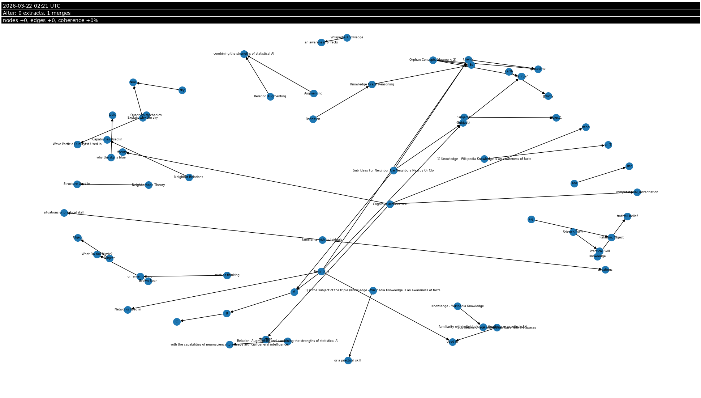](graph-2026-03-22-02-21-extract-subideas.png) [commit](https://github.com/BoggersTheFish/BoggersTheCIG/commit/831550d)

### 2026-03-22 02:21 UTC

**After:** 2_+2_.md"+Clo.md"+Mechanics.md"+eval — nodes +0, edges +0, coherence +0%

[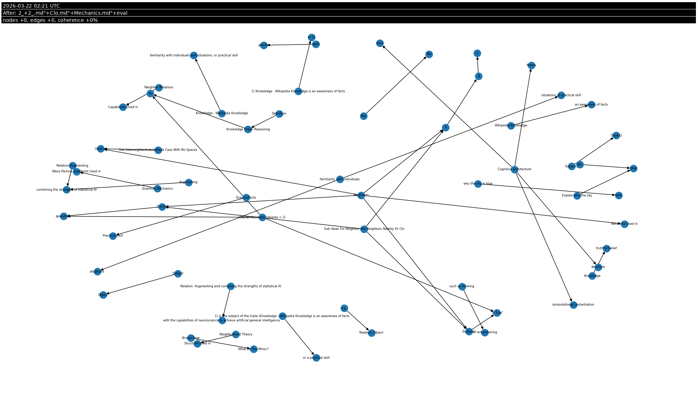](graph-2026-03-22-02-21-self-improve.png) [commit](https://github.com/BoggersTheFish/BoggersTheCIG/commit/831550d)

### 2026-03-22 06:01 UTC

**After:** external ingest (+1 triples) — nodes +4, edges +2, coherence +333233%

[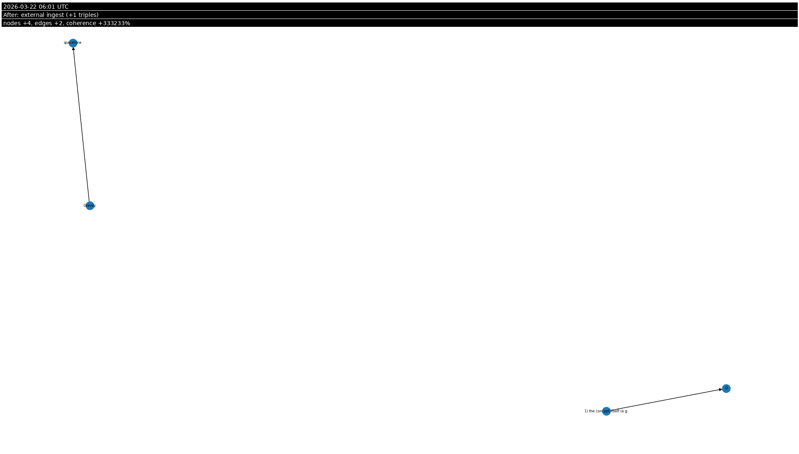](graph-2026-03-22-06-01-after-ingest.png) [commit](https://github.com/BoggersTheFish/BoggersTheCIG/commit/e62d3a4)

### 2026-03-22 06:01 UTC

**After:** vault analysis (+103 triples) — nodes +64, edges +42, coherence -94%

[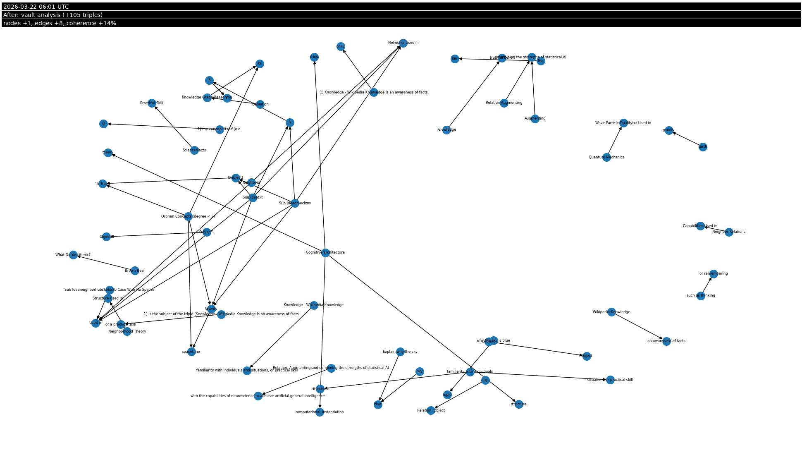](graph-2026-03-22-06-01-after-analyze-vault.png) [commit](https://github.com/BoggersTheFish/BoggersTheCIG/commit/e62d3a4)

### 2026-03-22 06:01 UTC

**After:** 1 extracts, 0 merges — nodes +0, edges +0, coherence +0%

[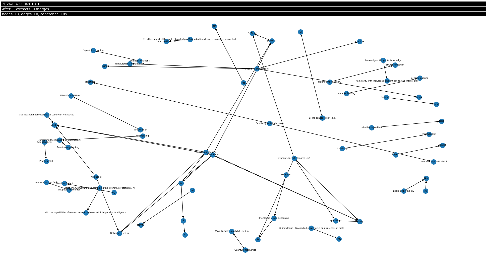](graph-2026-03-22-06-01-extract-subideas.png) [commit](https://github.com/BoggersTheFish/BoggersTheCIG/commit/e62d3a4)

### 2026-03-22 06:01 UTC

**After:** vault analysis (+105 triples) — nodes +1, edges +8, coherence +14%

 [commit](https://github.com/BoggersTheFish/BoggersTheCIG/commit/e62d3a4)

### 2026-03-22 06:01 UTC

**After:** 1 extracts, 0 merges — nodes +0, edges +0, coherence +0%

 [commit](https://github.com/BoggersTheFish/BoggersTheCIG/commit/e62d3a4)

### 2026-03-22 06:05 UTC

**After:** vault organize (3 moves) — nodes +0, edges +0, coherence +0%

[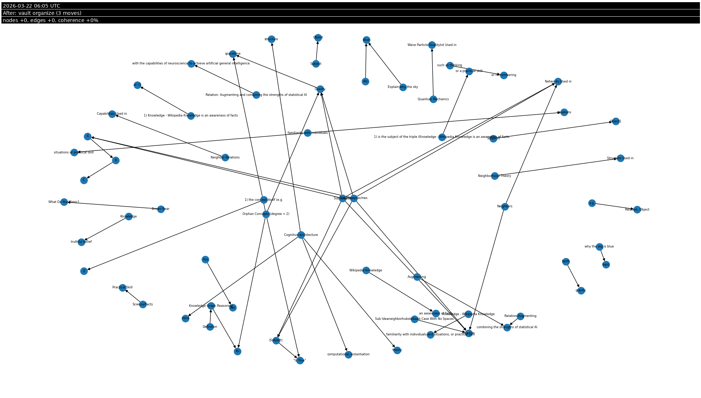](graph-2026-03-22-06-05-after-organize.png) [commit](https://github.com/BoggersTheFish/BoggersTheCIG/commit/e62d3a4)

### 2026-03-22 06:05 UTC

**After:** 0 extracts, 1 merges — nodes +0, edges +0, coherence +0%

[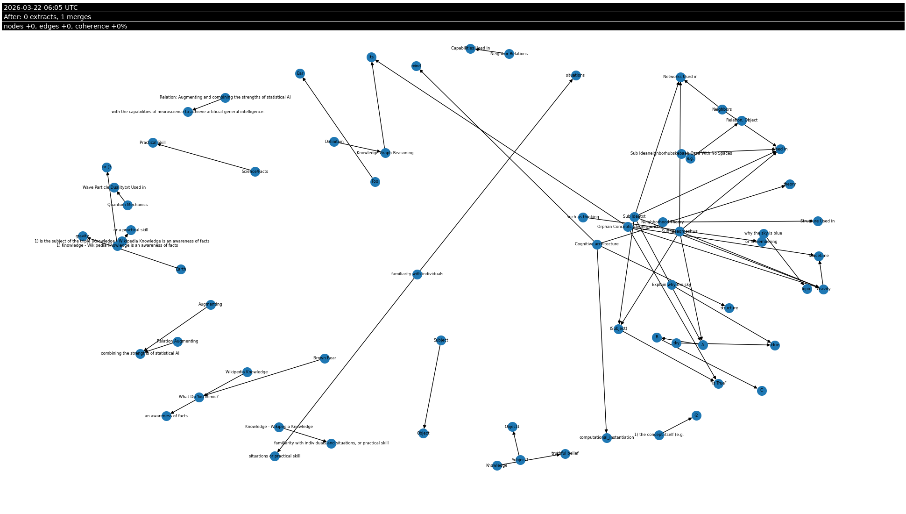](graph-2026-03-22-06-05-extract-subideas.png) [commit](https://github.com/BoggersTheFish/BoggersTheCIG/commit/e62d3a4)

### 2026-03-22 06:05 UTC

**After:** 2_.md"+AI.md"+Augmenting.md"+Clo.md"+Ideaqmechws.md" — nodes +0, edges +0, coherence +0%

[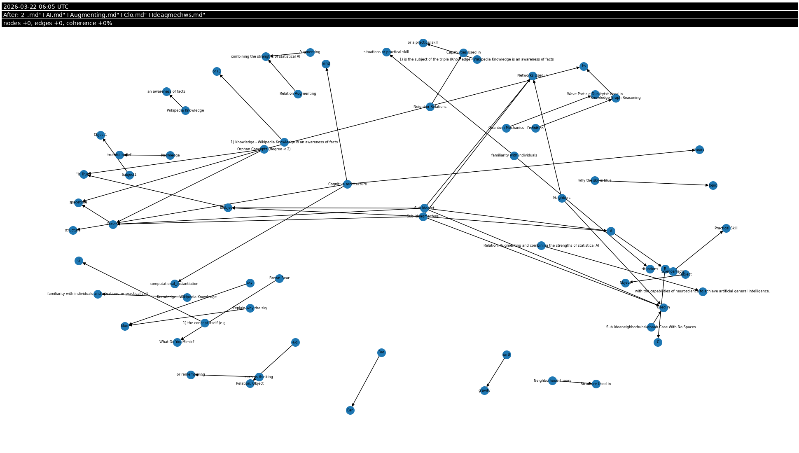](graph-2026-03-22-06-05-self-improve.png) [commit](https://github.com/BoggersTheFish/BoggersTheCIG/commit/e62d3a4)

### 2026-03-22 06:09 UTC

**After:** vault organize (0 moves) — nodes +0, edges +0, coherence +0%

[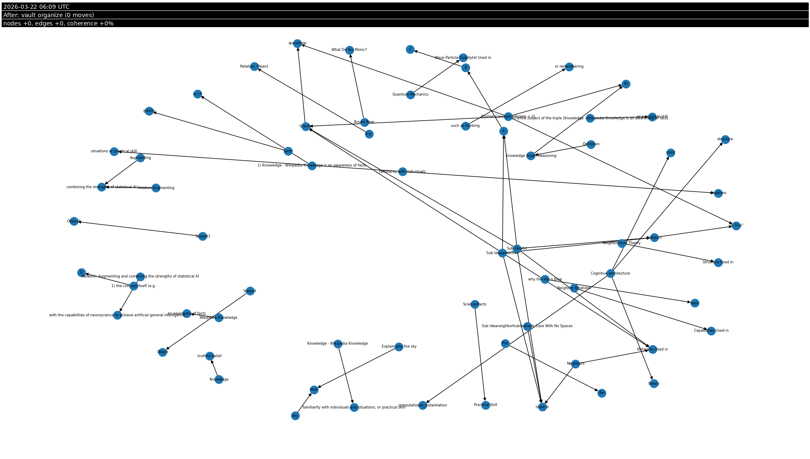](graph-2026-03-22-06-09-after-organize.png) [commit](https://github.com/BoggersTheFish/BoggersTheCIG/commit/e62d3a4)

### 2026-03-22 06:09 UTC

**After:** 0 extracts, 1 merges — nodes +0, edges +0, coherence +0%

[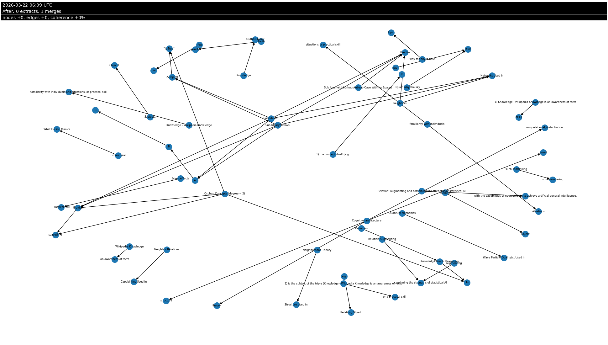](graph-2026-03-22-06-09-extract-subideas.png) [commit](https://github.com/BoggersTheFish/BoggersTheCIG/commit/e62d3a4)

### 2026-03-22 06:09 UTC

**After:** 2_.md"+AI.md"+Augmenting.md"+Clo.md"+Ideaqmechws.md" — nodes +0, edges +0, coherence +0%

[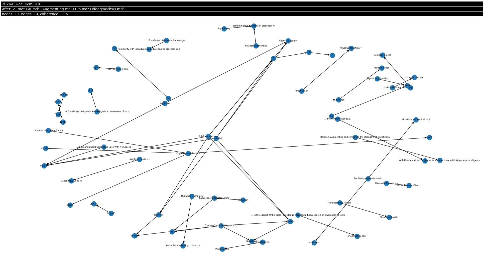](graph-2026-03-22-06-09-self-improve.png) [commit](https://github.com/BoggersTheFish/BoggersTheCIG/commit/e62d3a4)

### 2026-03-22 10:35 UTC

**After:** external ingest (+1 triples) — nodes +4, edges +2, coherence +333233%

[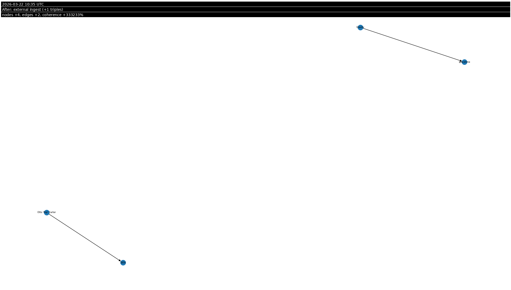](graph-2026-03-22-10-35-after-ingest.png) [commit](https://github.com/BoggersTheFish/BoggersTheCIG/commit/2ac56b4)

### 2026-03-22 10:35 UTC

**After:** vault analysis (+109 triples) — nodes +66, edges +43, coherence -94%

[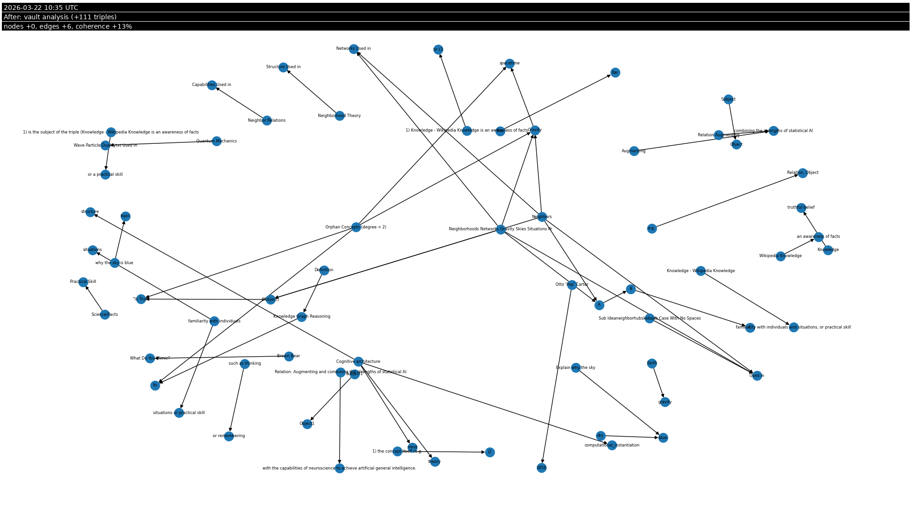](graph-2026-03-22-10-35-after-analyze-vault.png) [commit](https://github.com/BoggersTheFish/BoggersTheCIG/commit/2ac56b4)

### 2026-03-22 10:35 UTC

**After:** 1 extracts, 0 merges — nodes +0, edges +0, coherence +0%

[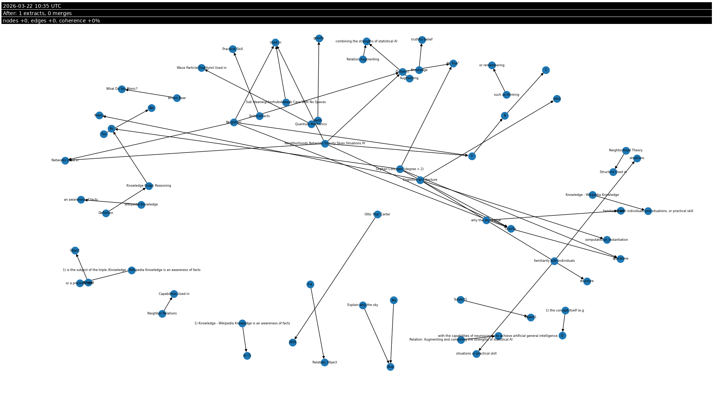](graph-2026-03-22-10-35-extract-subideas.png) [commit](https://github.com/BoggersTheFish/BoggersTheCIG/commit/2ac56b4)

### 2026-03-22 10:35 UTC

**After:** vault analysis (+111 triples) — nodes +0, edges +6, coherence +13%

 [commit](https://github.com/BoggersTheFish/BoggersTheCIG/commit/2ac56b4)

### 2026-03-22 10:35 UTC

**After:** 1 extracts, 0 merges — nodes +0, edges +0, coherence +0%

 [commit](https://github.com/BoggersTheFish/BoggersTheCIG/commit/2ac56b4)

### 2026-03-22 10:39 UTC

**After:** vault organize (1 moves) — nodes +0, edges +0, coherence +0%

[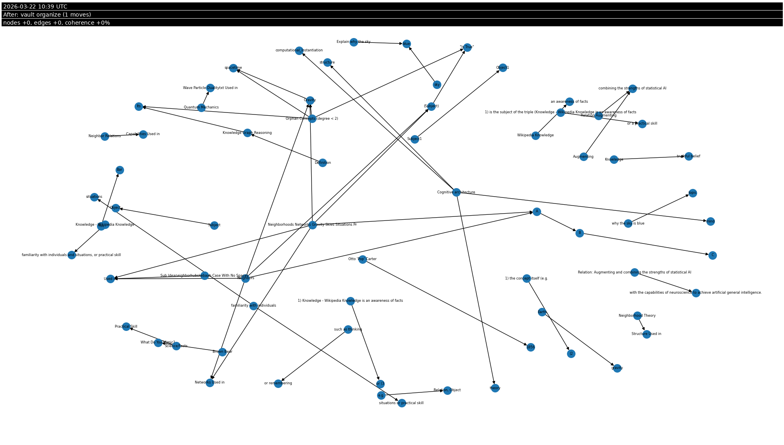](graph-2026-03-22-10-39-after-organize.png) [commit](https://github.com/BoggersTheFish/BoggersTheCIG/commit/2ac56b4)

### 2026-03-22 10:39 UTC

**After:** 0 extracts, 1 merges — nodes +0, edges +0, coherence +0%

[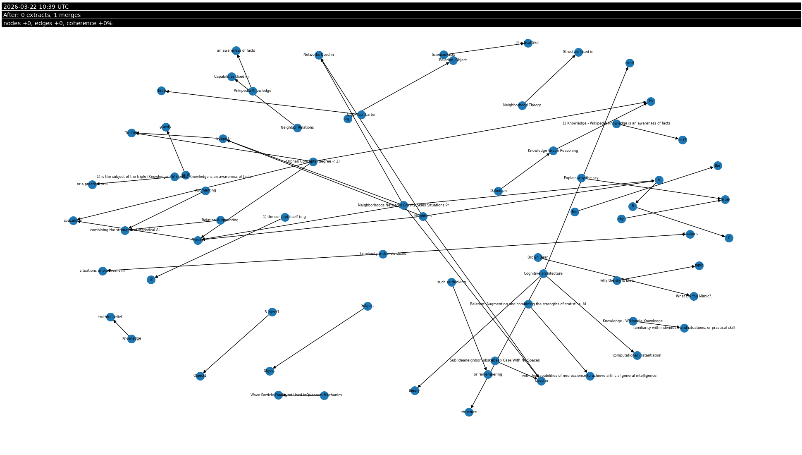](graph-2026-03-22-10-39-extract-subideas.png) [commit](https://github.com/BoggersTheFish/BoggersTheCIG/commit/2ac56b4)

### 2026-03-22 10:39 UTC

**After:** 2_.md"+AI.md"+Carter.md"+Ideaqmechws.md"+Ideatxt.md" — nodes +0, edges +0, coherence +0%

[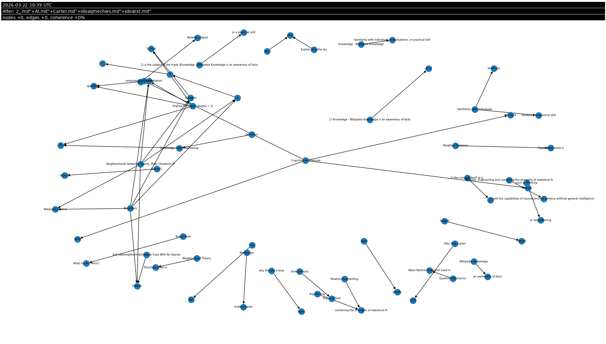](graph-2026-03-22-10-39-self-improve.png) [commit](https://github.com/BoggersTheFish/BoggersTheCIG/commit/2ac56b4)

### 2026-03-22 10:43 UTC

**After:** vault organize (2 moves) — nodes +0, edges +0, coherence +0%

[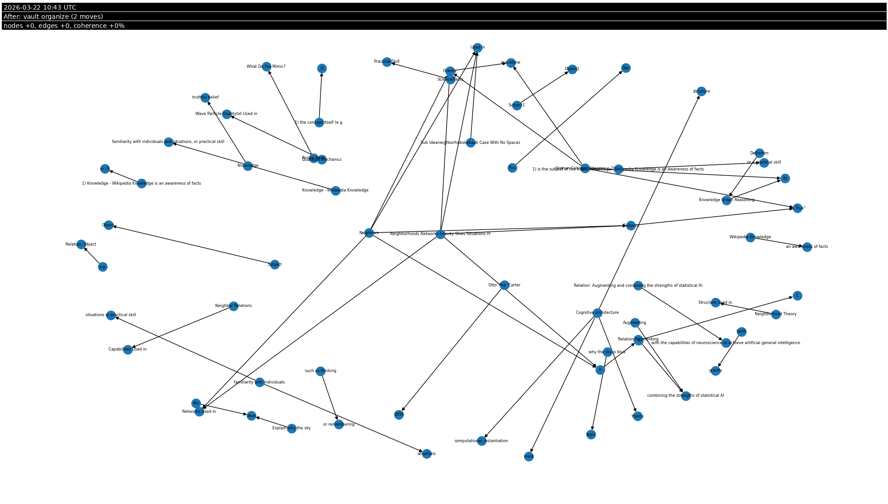](graph-2026-03-22-10-43-after-organize.png) [commit](https://github.com/BoggersTheFish/BoggersTheCIG/commit/2ac56b4)

### 2026-03-22 10:43 UTC

**After:** 0 extracts, 1 merges — nodes +0, edges +0, coherence +0%

[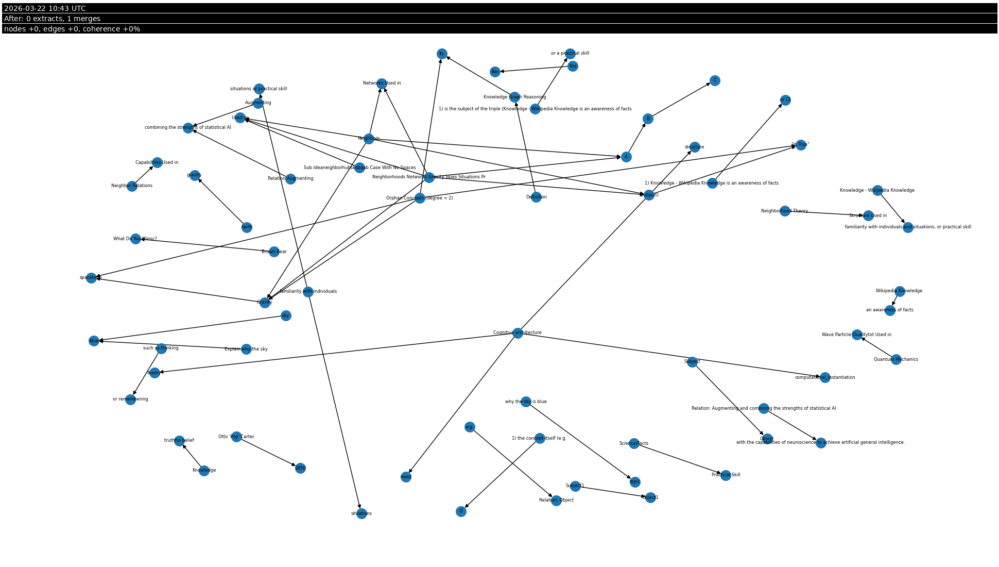](graph-2026-03-22-10-43-extract-subideas.png) [commit](https://github.com/BoggersTheFish/BoggersTheCIG/commit/2ac56b4)

### 2026-03-22 10:43 UTC

**After:** 2_.md"+AI.md"+Carter.md"+Ideaqmechws.md"+Ideatxt.md" — nodes +0, edges +0, coherence +0%

[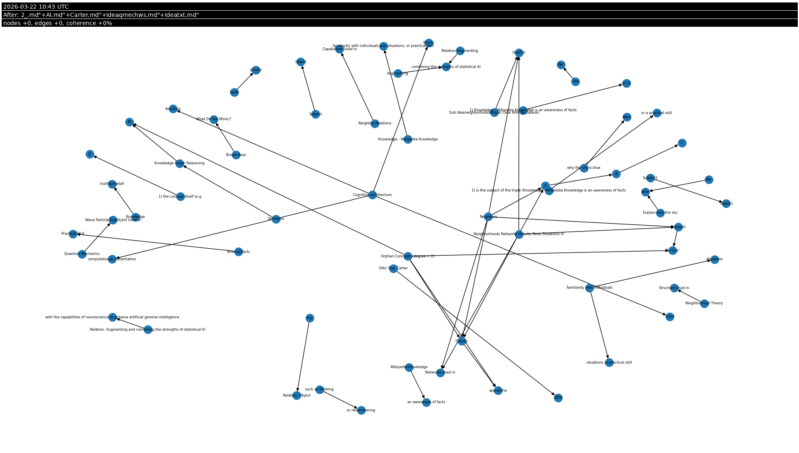](graph-2026-03-22-10-43-self-improve.png) [commit](https://github.com/BoggersTheFish/BoggersTheCIG/commit/2ac56b4)

### 2026-03-22 15:32 UTC

**After:** external ingest (+7 triples) — nodes +8, edges +4, coherence +142757%

[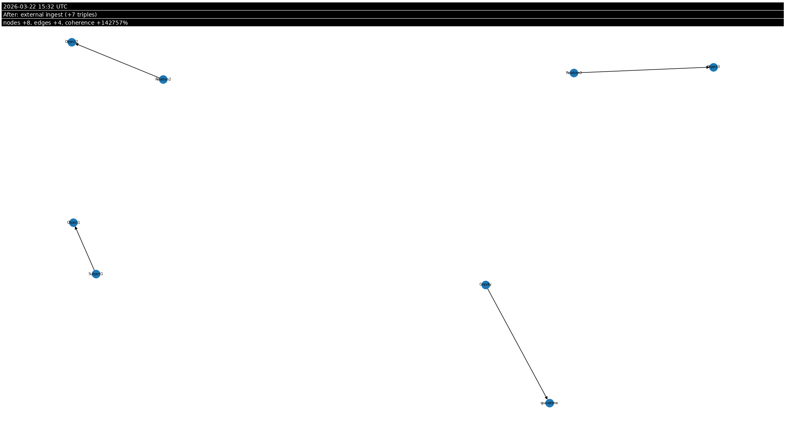](graph-2026-03-22-15-32-after-ingest.png) [commit](https://github.com/BoggersTheFish/BoggersTheCIG/commit/b3a475c)

### 2026-03-22 15:32 UTC

**After:** vault analysis (+110 triples) — nodes +66, edges +43, coherence -87%

[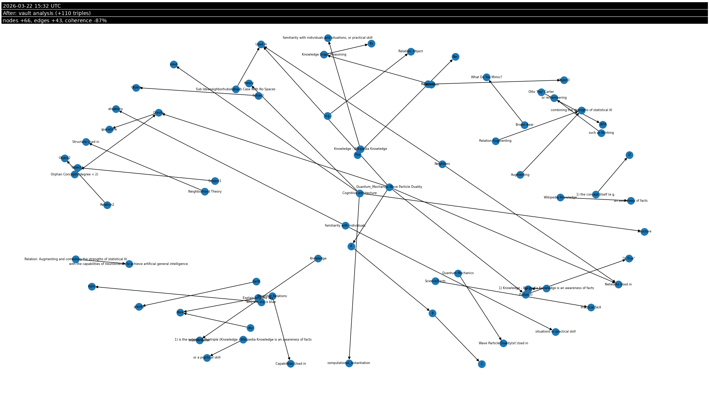](graph-2026-03-22-15-32-after-analyze-vault.png) [commit](https://github.com/BoggersTheFish/BoggersTheCIG/commit/b3a475c)

### 2026-03-22 15:32 UTC

**After:** 1 extracts, 0 merges — nodes +0, edges +0, coherence +0%

[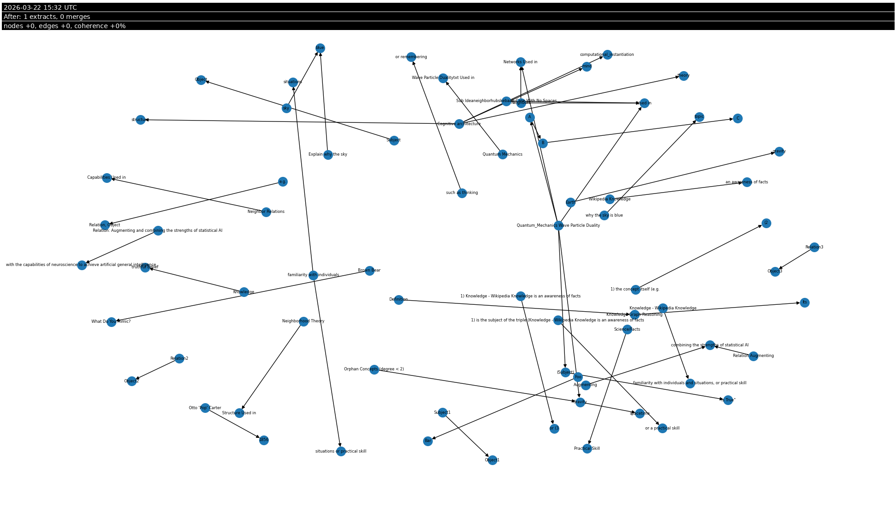](graph-2026-03-22-15-32-extract-subideas.png) [commit](https://github.com/BoggersTheFish/BoggersTheCIG/commit/b3a475c)

### 2026-03-22 15:33 UTC

**After:** vault analysis (+112 triples) — nodes +1, edges +8, coherence +13%

[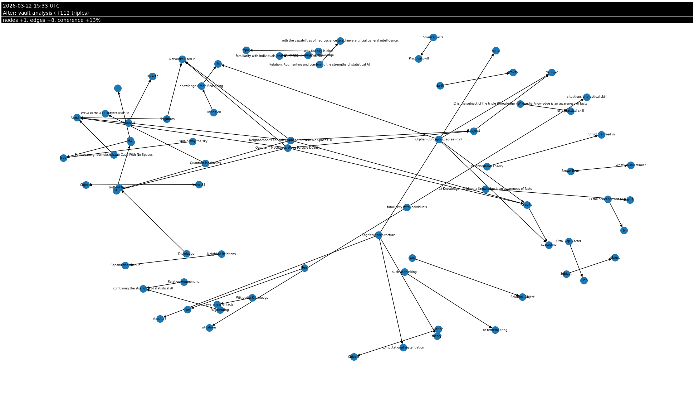](graph-2026-03-22-15-33-after-analyze-vault.png) [commit](https://github.com/BoggersTheFish/BoggersTheCIG/commit/b3a475c)

### 2026-03-22 15:33 UTC

**After:** 1 extracts, 0 merges — nodes +0, edges +0, coherence +0%

[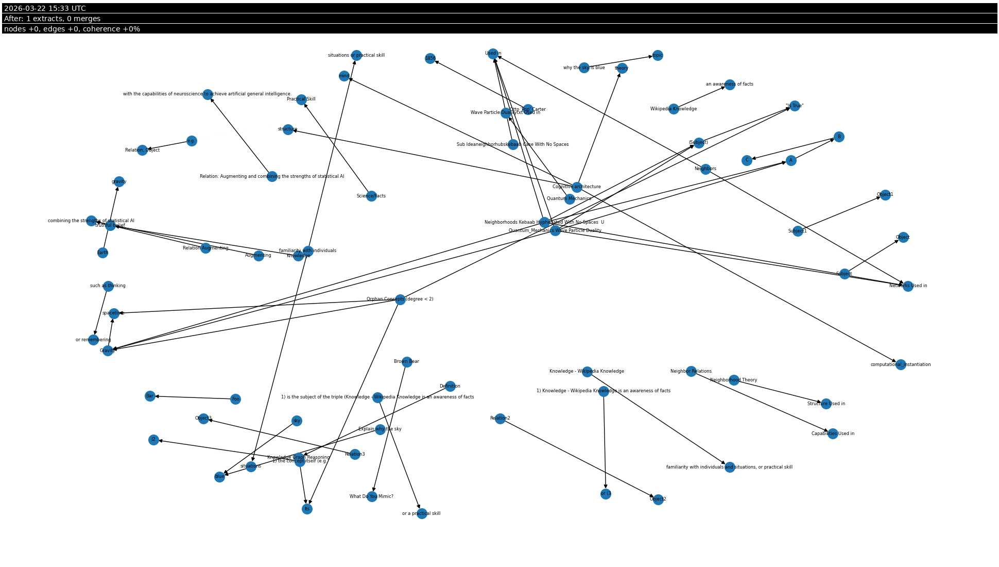](graph-2026-03-22-15-33-extract-subideas.png) [commit](https://github.com/BoggersTheFish/BoggersTheCIG/commit/b3a475c)

### 2026-03-22 15:36 UTC

**After:** vault organize (1 moves) — nodes +0, edges +0, coherence +0%

[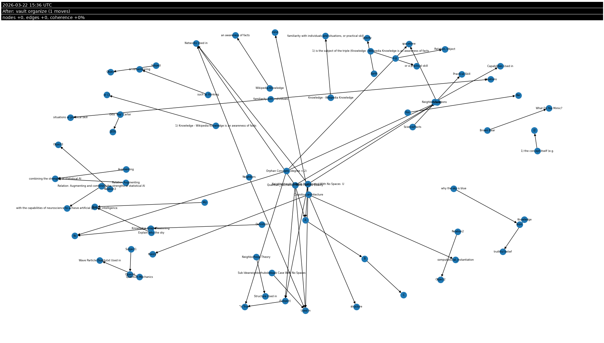](graph-2026-03-22-15-36-after-organize.png) [commit](https://github.com/BoggersTheFish/BoggersTheCIG/commit/b3a475c)

### 2026-03-22 15:36 UTC

**After:** 1 extracts, 1 merges — nodes +0, edges +0, coherence +0%

[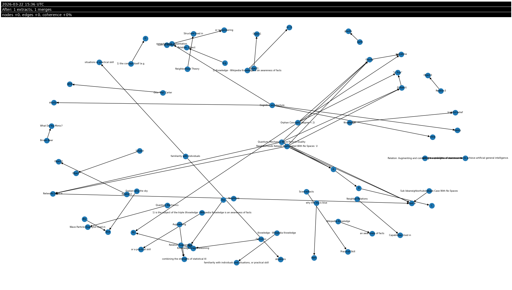](graph-2026-03-22-15-36-extract-subideas.png) [commit](https://github.com/BoggersTheFish/BoggersTheCIG/commit/b3a475c)

### 2026-03-22 15:36 UTC

**After:** 2_+2_.md"+Carter.md"+Duality.md"+Mechanics.md" — nodes +0, edges +0, coherence +0%

[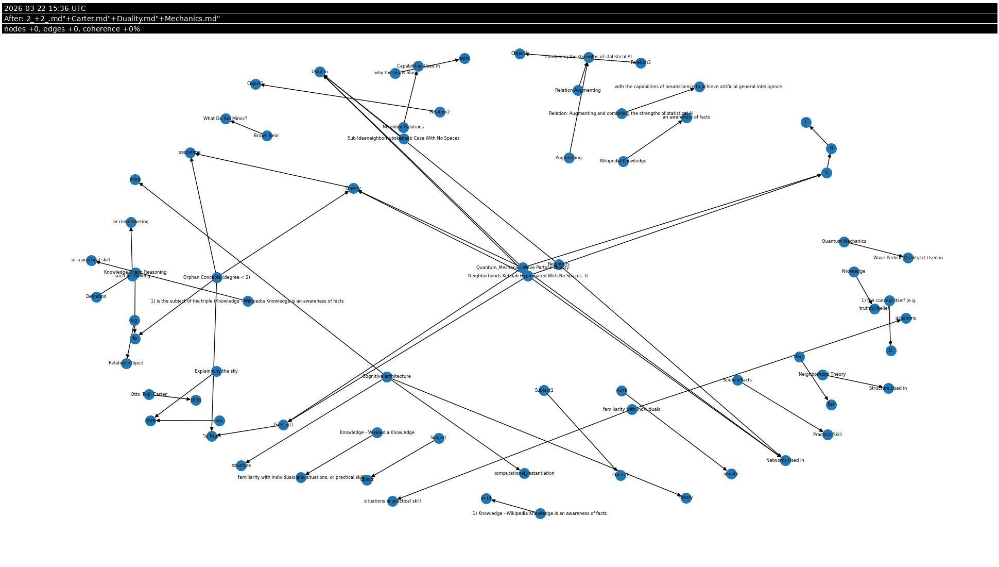](graph-2026-03-22-15-36-self-improve.png) [commit](https://github.com/BoggersTheFish/BoggersTheCIG/commit/b3a475c)

### 2026-03-22 15:40 UTC

**After:** vault organize (2 moves) — nodes +0, edges +0, coherence +0%

[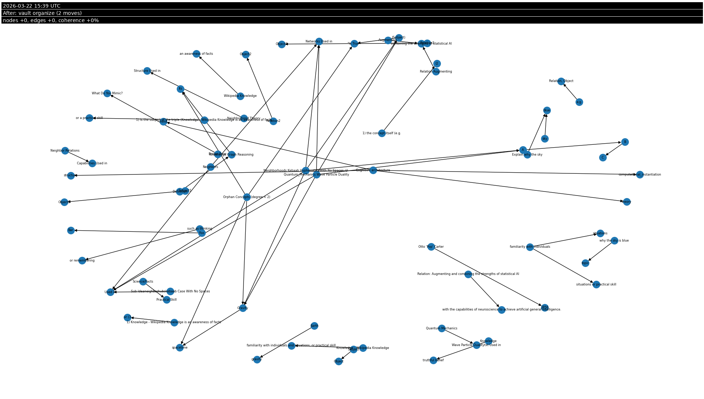](graph-2026-03-22-15-39-after-organize.png) [commit](https://github.com/BoggersTheFish/BoggersTheCIG/commit/b3a475c)

### 2026-03-22 15:40 UTC

**After:** 0 extracts, 2 merges — nodes +0, edges +0, coherence +0%

[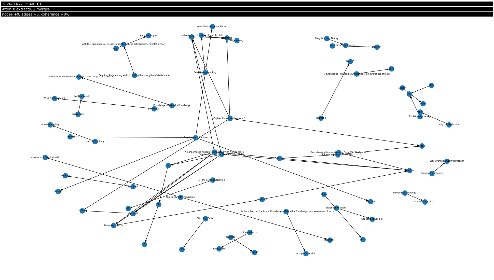](graph-2026-03-22-15-40-extract-subideas.png) [commit](https://github.com/BoggersTheFish/BoggersTheCIG/commit/b3a475c)

### 2026-03-22 15:40 UTC

**After:** 2_+2_.md"+Carter.md"+Duality.md"+Mechanics.md" — nodes +0, edges +0, coherence +0%

[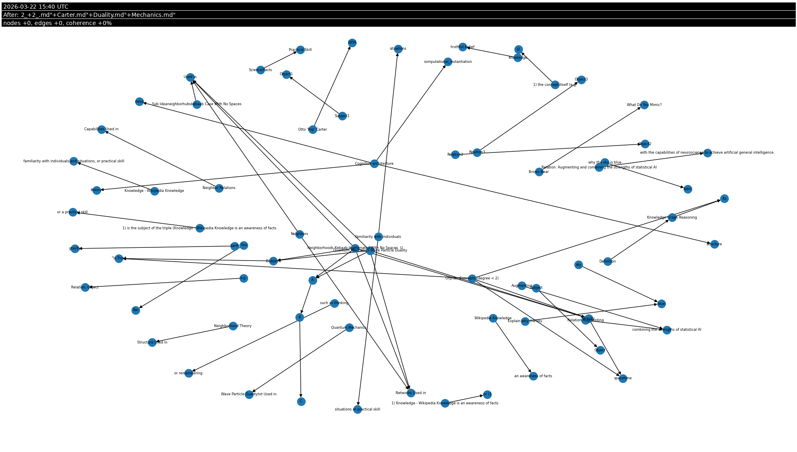](graph-2026-03-22-15-40-self-improve.png) [commit](https://github.com/BoggersTheFish/BoggersTheCIG/commit/b3a475c)

### 2026-03-23 02:16 UTC

**After:** external ingest (+1 triples) — nodes +4, edges +2, coherence +333233%

[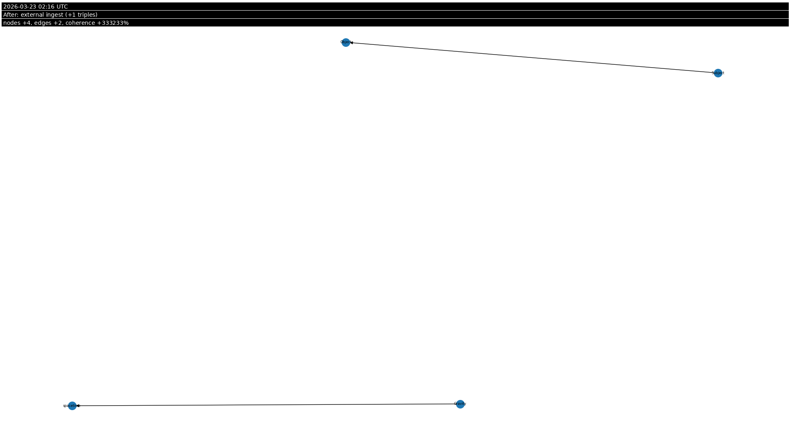](graph-2026-03-23-02-16-after-ingest.png) [commit](https://github.com/BoggersTheFish/BoggersTheCIG/commit/ff2bb58)

### 2026-03-23 02:16 UTC

**After:** vault analysis (+108 triples) — nodes +67, edges +39, coherence -95%

[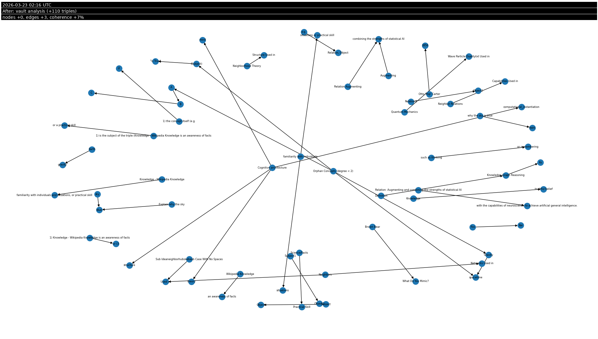](graph-2026-03-23-02-16-after-analyze-vault.png) [commit](https://github.com/BoggersTheFish/BoggersTheCIG/commit/ff2bb58)

### 2026-03-23 02:16 UTC

**After:** 1 extracts, 0 merges — nodes +0, edges +0, coherence +0%

[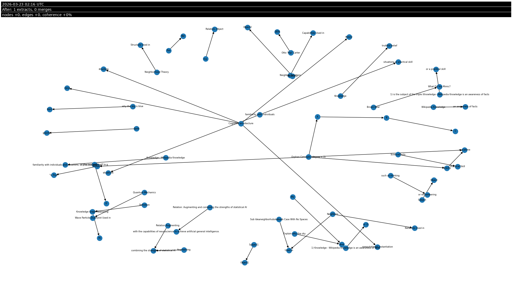](graph-2026-03-23-02-16-extract-subideas.png) [commit](https://github.com/BoggersTheFish/BoggersTheCIG/commit/ff2bb58)

### 2026-03-23 02:16 UTC

**After:** vault analysis (+110 triples) — nodes +0, edges +3, coherence +7%

 [commit](https://github.com/BoggersTheFish/BoggersTheCIG/commit/ff2bb58)

### 2026-03-23 02:16 UTC

**After:** 1 extracts, 0 merges — nodes +0, edges +0, coherence +0%

 [commit](https://github.com/BoggersTheFish/BoggersTheCIG/commit/ff2bb58)

### 2026-03-23 02:20 UTC

**After:** vault organize (0 moves) — nodes +0, edges +0, coherence +0%

[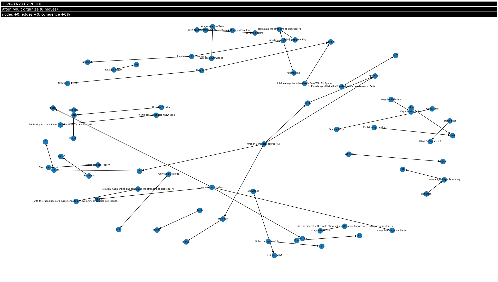](graph-2026-03-23-02-20-after-organize.png) [commit](https://github.com/BoggersTheFish/BoggersTheCIG/commit/ff2bb58)

### 2026-03-23 02:20 UTC

**After:** 1 extracts, 0 merges — nodes +0, edges +0, coherence +0%

[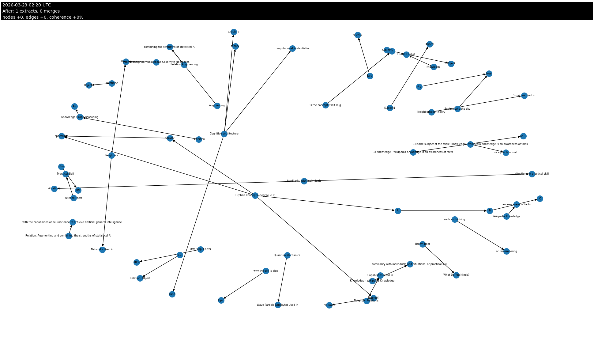](graph-2026-03-23-02-20-extract-subideas.png) [commit](https://github.com/BoggersTheFish/BoggersTheCIG/commit/ff2bb58)

### 2026-03-23 02:20 UTC

**After:** 2_+2_.md"+Augmenting.md"+eval+obsidian — nodes +0, edges +0, coherence +0%

[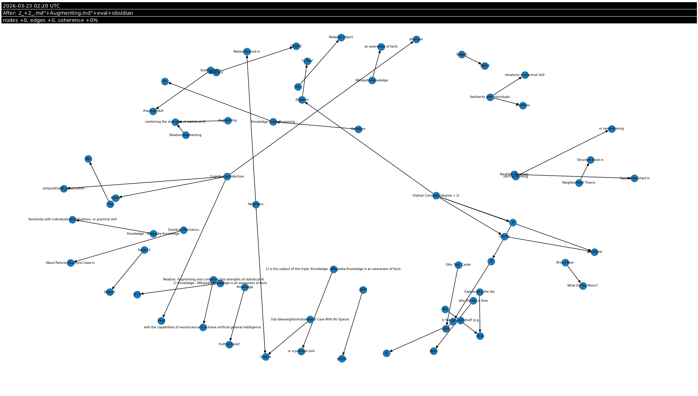](graph-2026-03-23-02-20-self-improve.png) [commit](https://github.com/BoggersTheFish/BoggersTheCIG/commit/ff2bb58)

### 2026-03-23 02:24 UTC

**After:** vault organize (2 moves) — nodes +0, edges +0, coherence +0%

[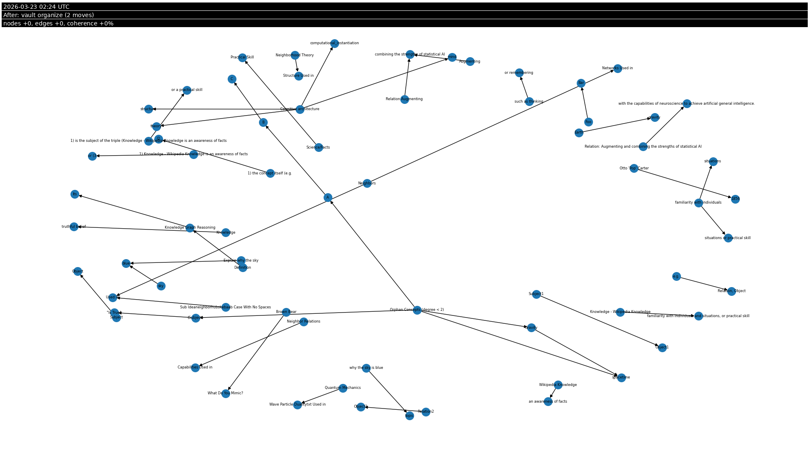](graph-2026-03-23-02-24-after-organize.png) [commit](https://github.com/BoggersTheFish/BoggersTheCIG/commit/ff2bb58)

### 2026-03-23 02:24 UTC

**After:** 0 extracts, 1 merges — nodes +0, edges +0, coherence +0%

[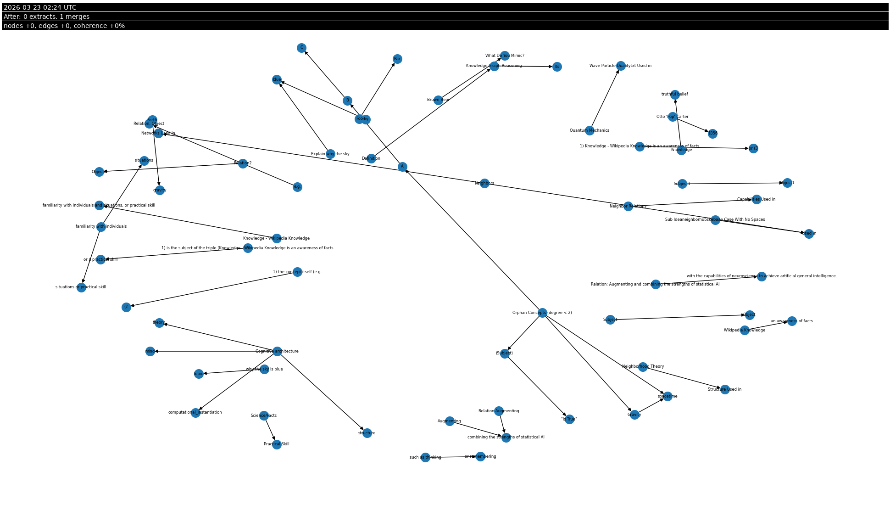](graph-2026-03-23-02-24-extract-subideas.png) [commit](https://github.com/BoggersTheFish/BoggersTheCIG/commit/ff2bb58)

### 2026-03-23 02:24 UTC

**After:** 2_+2_.md"+Augmenting.md"+Duality.md"+U.md" — nodes +0, edges +0, coherence +0%

[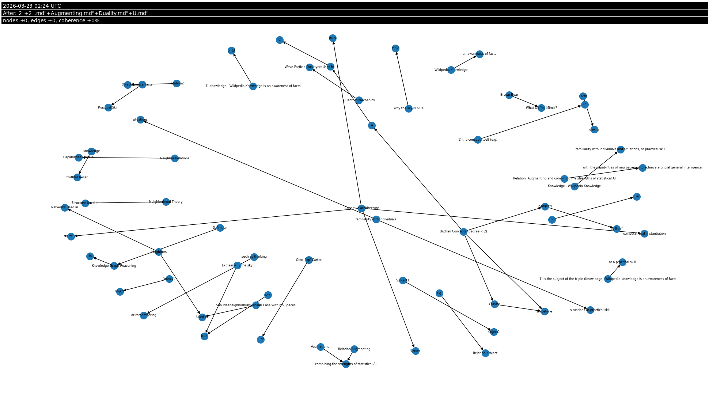](graph-2026-03-23-02-24-self-improve.png) [commit](https://github.com/BoggersTheFish/BoggersTheCIG/commit/ff2bb58)

### 2026-03-23 06:17 UTC

**After:** external ingest (+1 triples) — nodes +4, edges +2, coherence +333233%

[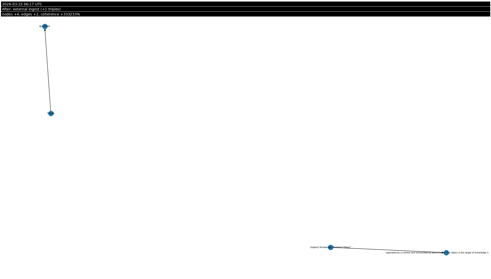](graph-2026-03-23-06-17-after-ingest.png) [commit](https://github.com/BoggersTheFish/BoggersTheCIG/commit/70efec0)

### 2026-03-23 06:17 UTC

**After:** vault analysis (+110 triples) — nodes +73, edges +42, coherence -95%

[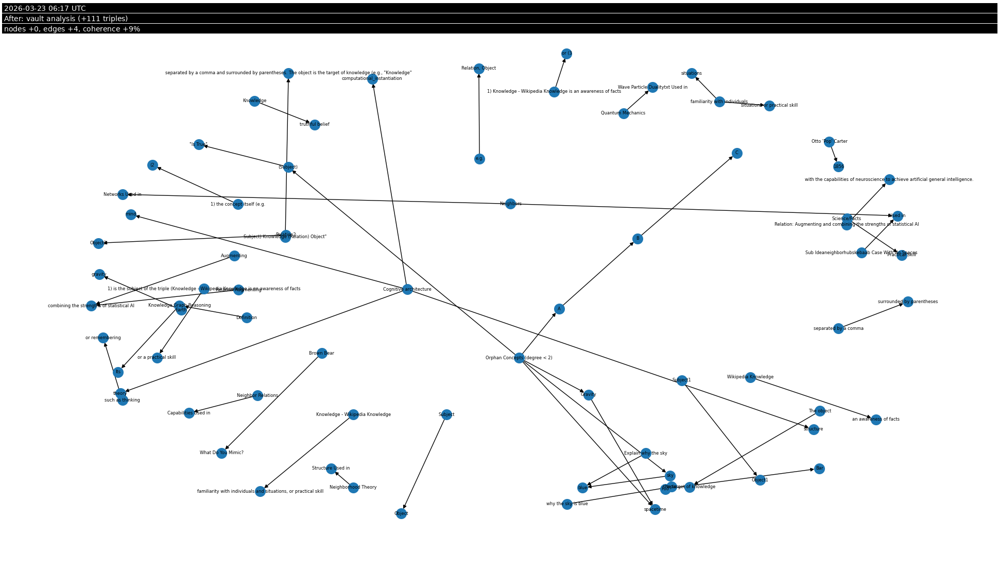](graph-2026-03-23-06-17-after-analyze-vault.png) [commit](https://github.com/BoggersTheFish/BoggersTheCIG/commit/70efec0)

### 2026-03-23 06:17 UTC

**After:** 1 extracts, 0 merges — nodes +0, edges +0, coherence +0%

[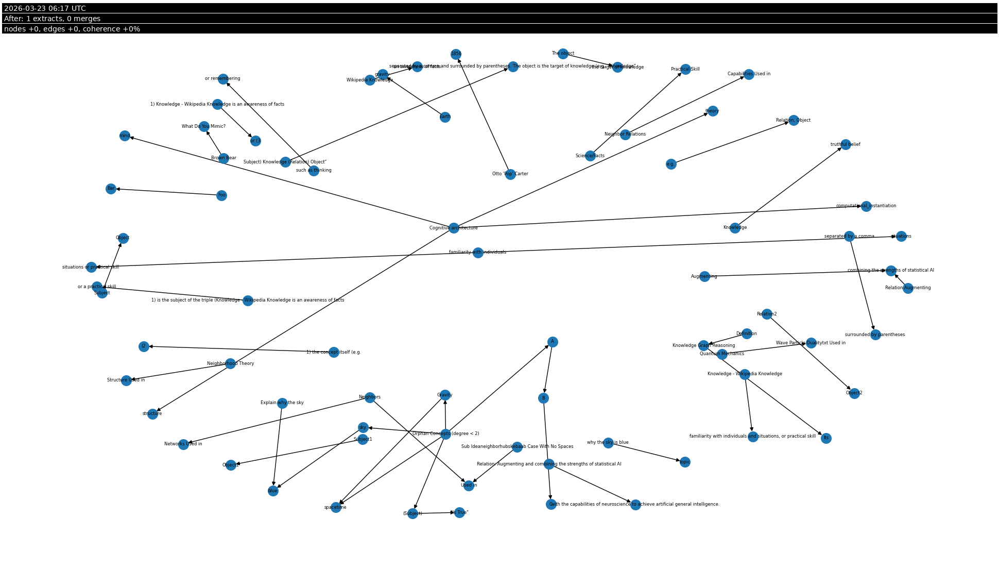](graph-2026-03-23-06-17-extract-subideas.png) [commit](https://github.com/BoggersTheFish/BoggersTheCIG/commit/70efec0)

### 2026-03-23 06:17 UTC

**After:** vault analysis (+111 triples) — nodes +0, edges +4, coherence +9%

 [commit](https://github.com/BoggersTheFish/BoggersTheCIG/commit/70efec0)

### 2026-03-23 06:17 UTC

**After:** 1 extracts, 0 merges — nodes +0, edges +0, coherence +0%

 [commit](https://github.com/BoggersTheFish/BoggersTheCIG/commit/70efec0)

### 2026-03-23 06:20 UTC

**After:** vault organize (3 moves) — nodes +0, edges +0, coherence +0%

[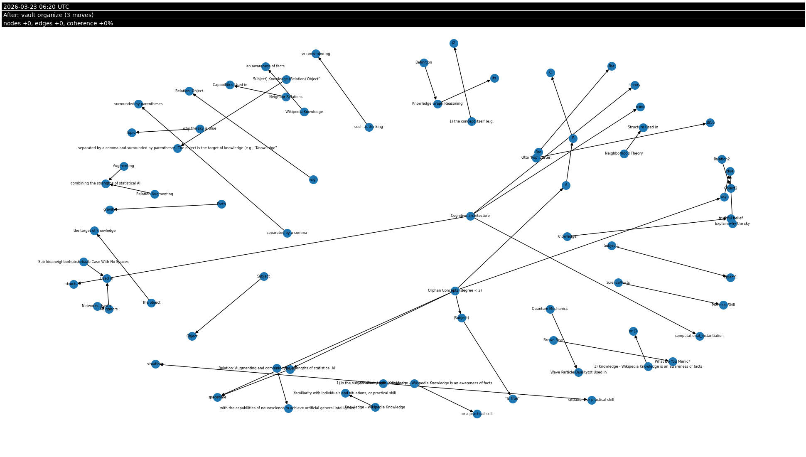](graph-2026-03-23-06-20-after-organize.png) [commit](https://github.com/BoggersTheFish/BoggersTheCIG/commit/70efec0)

### 2026-03-23 06:21 UTC

**After:** 0 extracts, 1 merges — nodes +0, edges +0, coherence +0%

[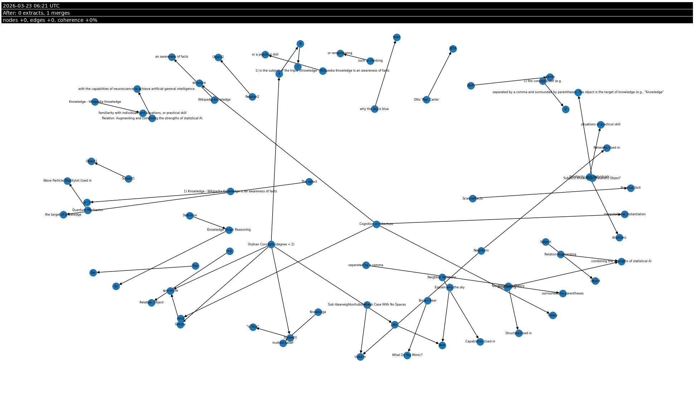](graph-2026-03-23-06-21-extract-subideas.png) [commit](https://github.com/BoggersTheFish/BoggersTheCIG/commit/70efec0)

### 2026-03-23 06:21 UTC

**After:** 2_+2_.md"+Object_.md"+_Knowledge_.md"+comma.md" — nodes +0, edges +0, coherence +0%

[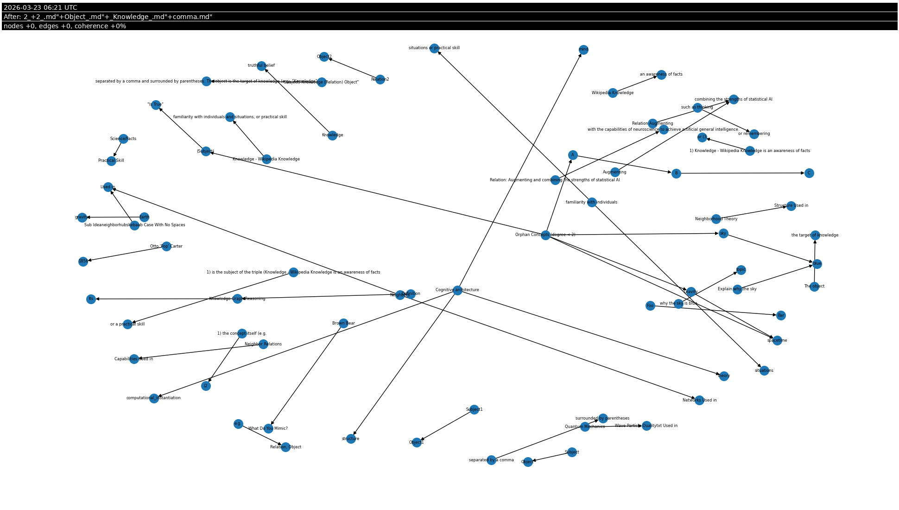](graph-2026-03-23-06-21-self-improve.png) [commit](https://github.com/BoggersTheFish/BoggersTheCIG/commit/70efec0)

### 2026-03-23 06:25 UTC

**After:** vault organize (2 moves) — nodes +0, edges +0, coherence +0%

[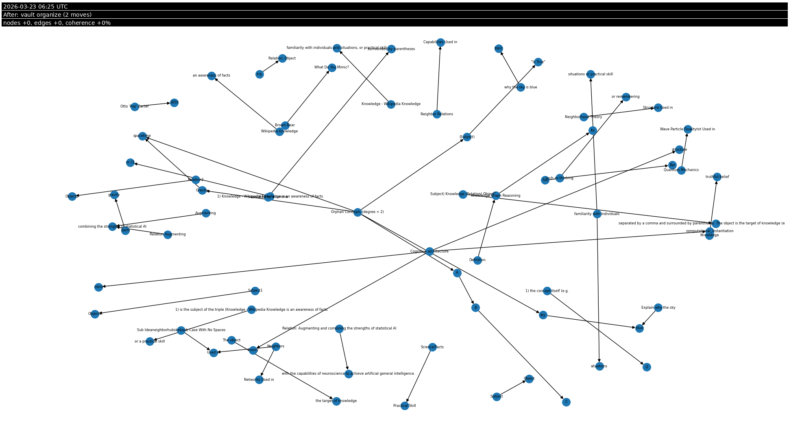](graph-2026-03-23-06-25-after-organize.png) [commit](https://github.com/BoggersTheFish/BoggersTheCIG/commit/70efec0)

### 2026-03-23 06:25 UTC

**After:** 0 extracts, 1 merges — nodes +0, edges +0, coherence +0%

[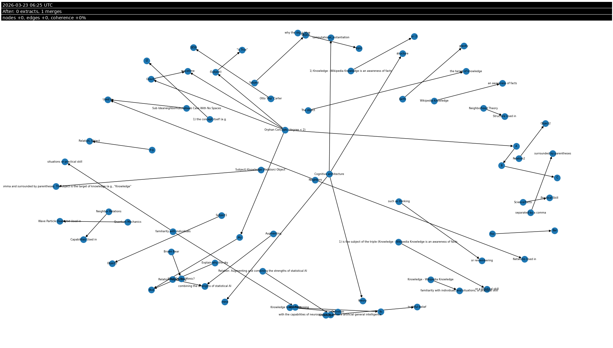](graph-2026-03-23-06-25-extract-subideas.png) [commit](https://github.com/BoggersTheFish/BoggersTheCIG/commit/70efec0)

### 2026-03-23 06:25 UTC

**After:** 2_+2_.md"+Object_.md"+_Knowledge_.md"+comma.md" — nodes +0, edges +0, coherence +0%

[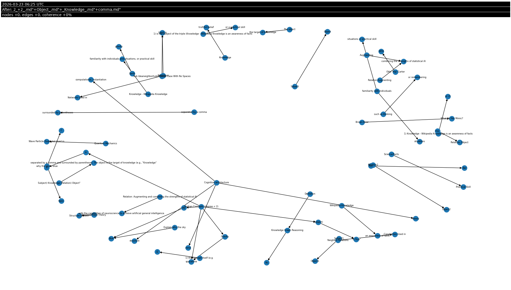](graph-2026-03-23-06-25-self-improve.png) [commit](https://github.com/BoggersTheFish/BoggersTheCIG/commit/70efec0)

### 2026-03-23 10:59 UTC

**After:** external ingest (+1 triples) — nodes +4, edges +2, coherence +333233%

[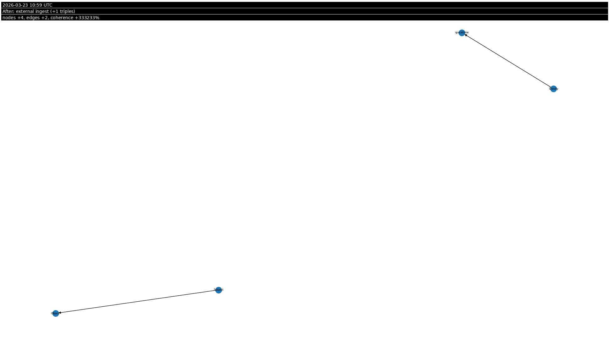](graph-2026-03-23-10-59-after-ingest.png) [commit](https://github.com/BoggersTheFish/BoggersTheCIG/commit/a0886ec)

### 2026-03-23 10:59 UTC

**After:** vault analysis (+114 triples) — nodes +76, edges +44, coherence -95%

[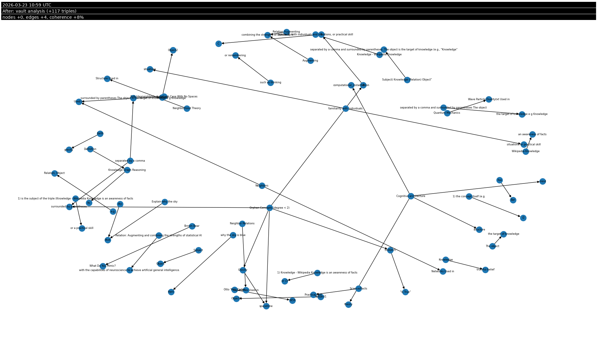](graph-2026-03-23-10-59-after-analyze-vault.png) [commit](https://github.com/BoggersTheFish/BoggersTheCIG/commit/a0886ec)

### 2026-03-23 10:59 UTC

**After:** 1 extracts, 0 merges — nodes +0, edges +0, coherence +0%

[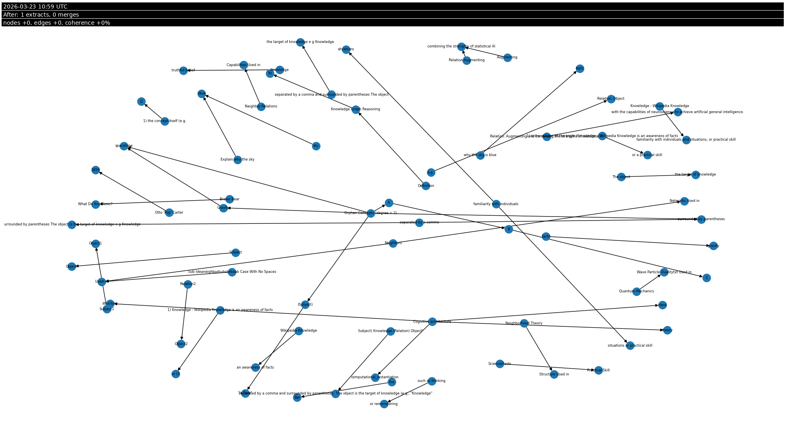](graph-2026-03-23-10-59-extract-subideas.png) [commit](https://github.com/BoggersTheFish/BoggersTheCIG/commit/a0886ec)

### 2026-03-23 10:59 UTC

**After:** vault analysis (+117 triples) — nodes +0, edges +4, coherence +8%

 [commit](https://github.com/BoggersTheFish/BoggersTheCIG/commit/a0886ec)

### 2026-03-23 10:59 UTC

**After:** 1 extracts, 0 merges — nodes +0, edges +0, coherence +0%

 [commit](https://github.com/BoggersTheFish/BoggersTheCIG/commit/a0886ec)

### 2026-03-23 11:03 UTC

**After:** vault organize (1 moves) — nodes +0, edges +0, coherence +0%

[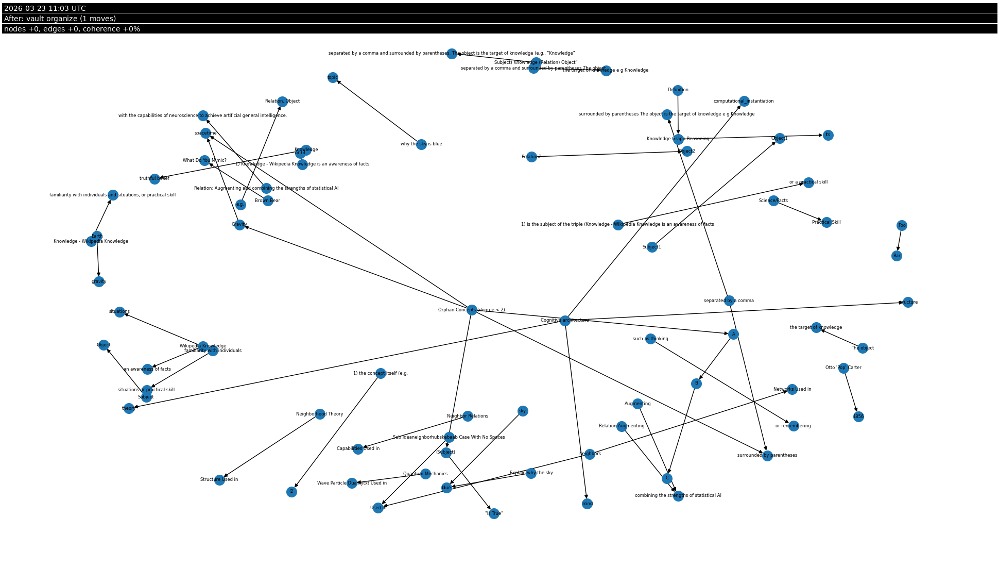](graph-2026-03-23-11-03-after-organize.png) [commit](https://github.com/BoggersTheFish/BoggersTheCIG/commit/a0886ec)

### 2026-03-23 11:03 UTC

**After:** 0 extracts, 1 merges — nodes +0, edges +0, coherence +0%

[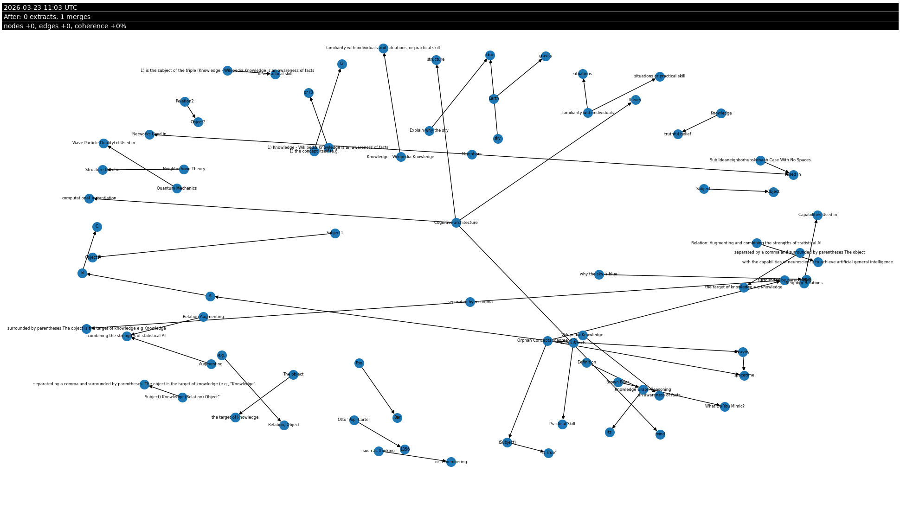](graph-2026-03-23-11-03-extract-subideas.png) [commit](https://github.com/BoggersTheFish/BoggersTheCIG/commit/a0886ec)

### 2026-03-23 11:03 UTC

**After:** 2_+2_.md"+Knowledge.md"+Object_.md"+Relations.md" — nodes +0, edges +0, coherence +0%

[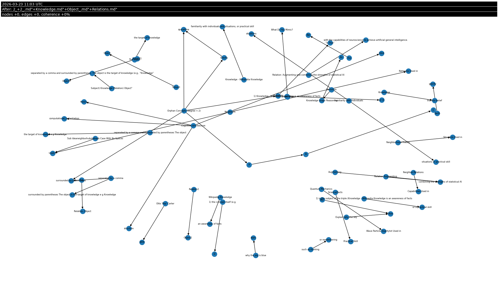](graph-2026-03-23-11-03-self-improve.png) [commit](https://github.com/BoggersTheFish/BoggersTheCIG/commit/a0886ec)

### 2026-03-23 11:07 UTC

**After:** vault organize (0 moves) — nodes +0, edges +0, coherence +0%

[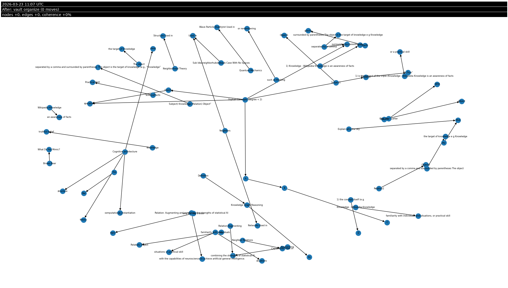](graph-2026-03-23-11-07-after-organize.png) [commit](https://github.com/BoggersTheFish/BoggersTheCIG/commit/a0886ec)

### 2026-03-23 11:08 UTC

**After:** 0 extracts, 1 merges — nodes +0, edges +0, coherence +0%

[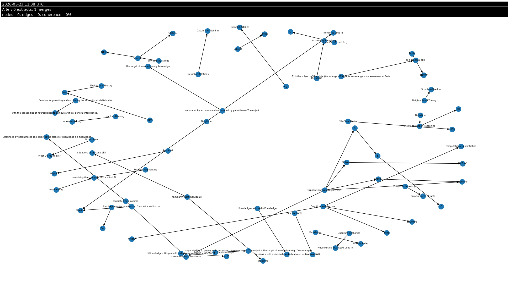](graph-2026-03-23-11-08-extract-subideas.png) [commit](https://github.com/BoggersTheFish/BoggersTheCIG/commit/a0886ec)

### 2026-03-23 11:08 UTC

**After:** 2_+2_.md"+Knowledge.md"+Object_.md"+Relations.md" — nodes +0, edges +0, coherence +0%

[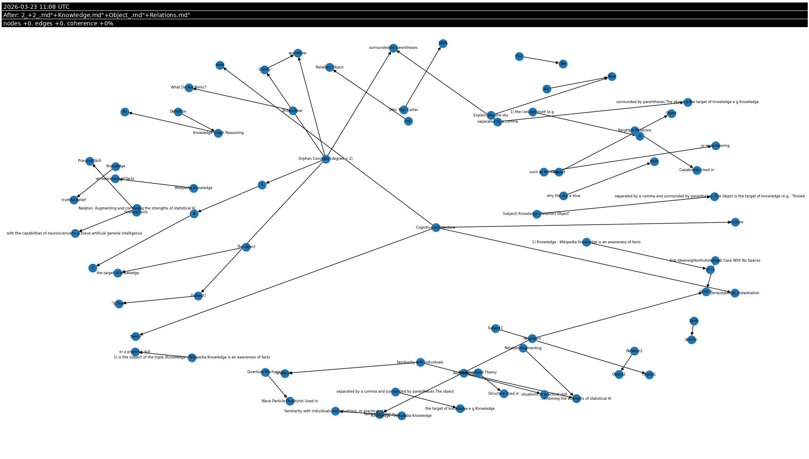](graph-2026-03-23-11-08-self-improve.png) [commit](https://github.com/BoggersTheFish/BoggersTheCIG/commit/a0886ec)

### 2026-03-23 16:06 UTC

**After:** vault analysis (+115 triples) — nodes +83, edges +47, coherence +13711%

[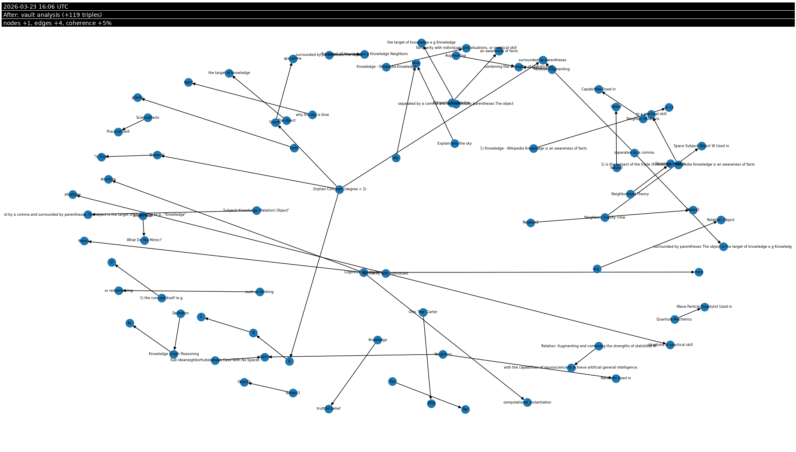](graph-2026-03-23-16-06-after-analyze-vault.png) [commit](https://github.com/BoggersTheFish/BoggersTheCIG/commit/e5a4ae3)

### 2026-03-23 16:06 UTC

**After:** vault analysis (+119 triples) — nodes +1, edges +4, coherence +5%

 [commit](https://github.com/BoggersTheFish/BoggersTheCIG/commit/e5a4ae3)

### 2026-03-23 16:10 UTC

**After:** vault organize (4 moves) — nodes +0, edges +0, coherence +0%

[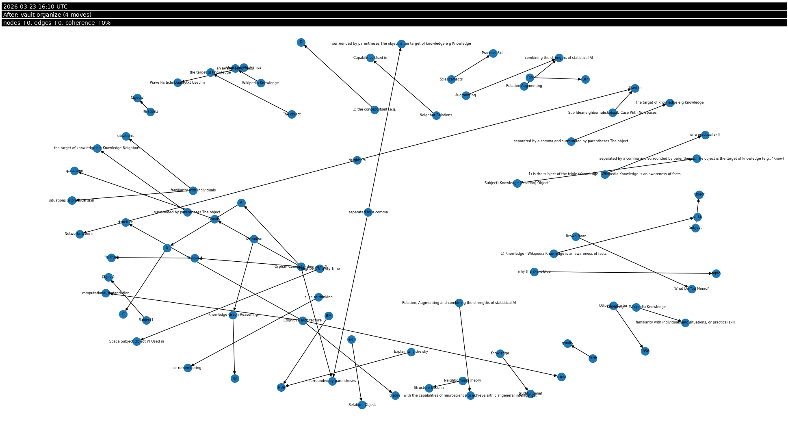](graph-2026-03-23-16-10-after-organize.png) [commit](https://github.com/BoggersTheFish/BoggersTheCIG/commit/e5a4ae3)

### 2026-03-23 16:10 UTC

**After:** 1 extracts, 0 merges — nodes +0, edges +0, coherence +0%

[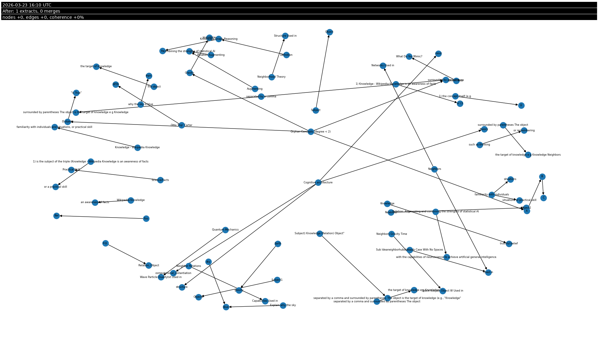](graph-2026-03-23-16-10-extract-subideas.png) [commit](https://github.com/BoggersTheFish/BoggersTheCIG/commit/e5a4ae3)

### 2026-03-23 16:10 UTC

**After:** 2_+2_.md"+AI.md"+Knowledge.md"+Neighbors.md" — nodes +0, edges +0, coherence +0%

[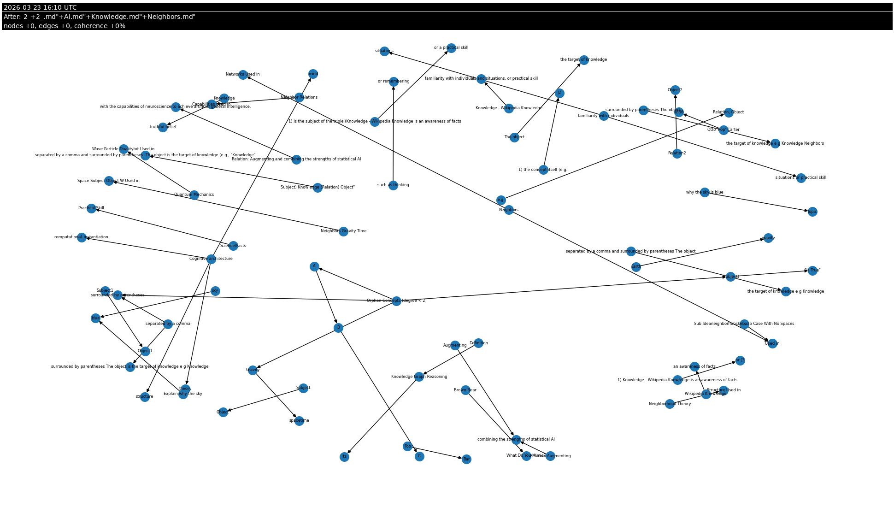](graph-2026-03-23-16-10-self-improve.png) [commit](https://github.com/BoggersTheFish/BoggersTheCIG/commit/e5a4ae3)

### 2026-03-23 16:14 UTC

**After:** vault organize (0 moves) — nodes +0, edges +0, coherence +0%

[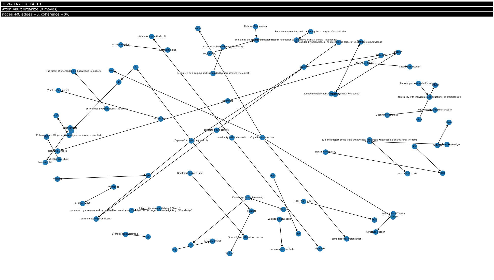](graph-2026-03-23-16-14-after-organize.png) [commit](https://github.com/BoggersTheFish/BoggersTheCIG/commit/e5a4ae3)

### 2026-03-23 16:14 UTC

**After:** 0 extracts, 1 merges — nodes +0, edges +0, coherence +0%

[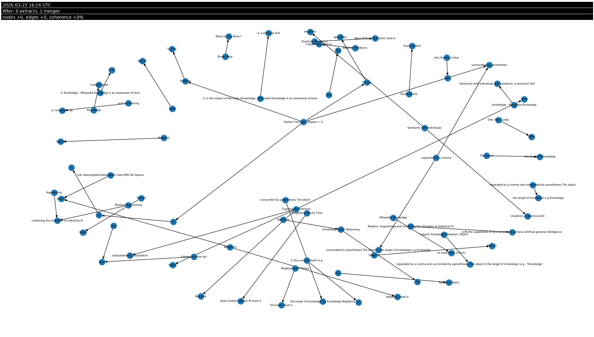](graph-2026-03-23-16-14-extract-subideas.png) [commit](https://github.com/BoggersTheFish/BoggersTheCIG/commit/e5a4ae3)

### 2026-03-23 16:14 UTC

**After:** 2_+2_.md"+AI.md"+Knowledge.md"+Neighbors.md" — nodes +0, edges +0, coherence +0%

[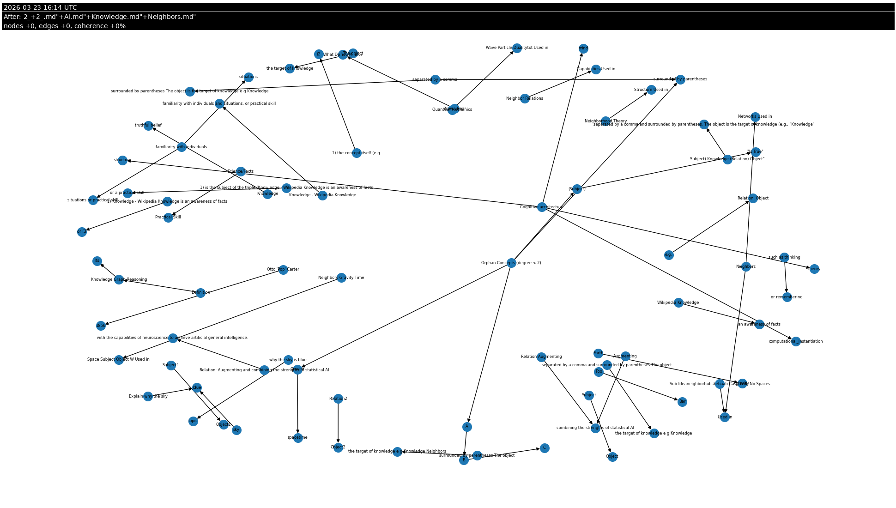](graph-2026-03-23-16-14-self-improve.png) [commit](https://github.com/BoggersTheFish/BoggersTheCIG/commit/e5a4ae3)
